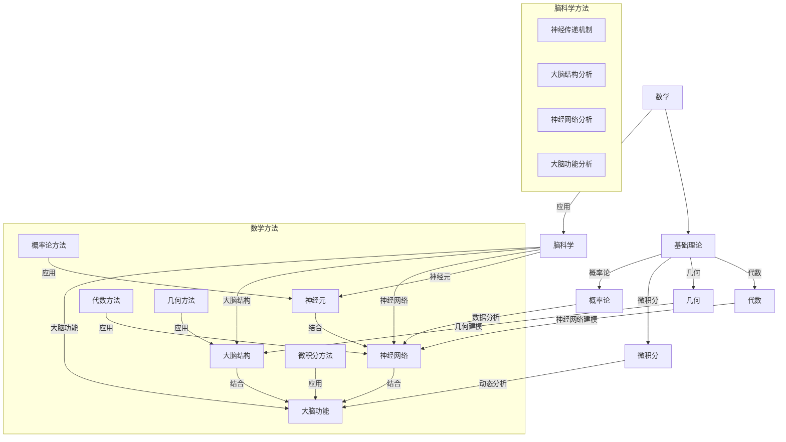

                 


### 1.1 本书的目的与意义

本文旨在探讨数学与未来脑科学研究中的伦理问题，分析两者交叉领域中的伦理挑战与潜在风险，以期为相关领域的科研工作者、政策制定者以及社会公众提供有价值的参考。随着科技的发展，数学和脑科学在研究方法、应用领域等方面日益融合，这为人类认识自身和改善生活带来了前所未有的机遇。然而，这种融合也带来了诸多伦理问题，如数据隐私、人类基因编辑、脑机接口技术等。这些问题不仅关乎科学研究的道德底线，也涉及到个人权益、社会公正等重大议题。

本书首先梳理了数学和脑科学的基本概念，分析了这两个领域的研究现状和发展趋势。在此基础上，我们深入探讨了伦理学的基本原理及其在科学研究中的重要性。随后，本文针对脑科学研究中的伦理问题，如研究对象伦理、数据伦理以及人工智能伦理等，进行了详细的分析。此外，我们还探讨了数学方法在解决伦理问题中的应用，包括数学模型构建、数学方法在伦理学分析中的应用等。

通过本书的探讨，我们希望能够提高读者对数学与脑科学交叉领域中伦理问题的认识，为科研工作者提供理论指导和实践建议，同时也为政策制定者和社会公众提供决策参考。总之，本书既是对数学与脑科学交叉领域中伦理问题的系统性梳理，也是对未来科技创新伦理的深入思考。

### 1.2 脑科学与数学的交叉领域

脑科学与数学的交叉领域是一个充满活力且不断发展的前沿领域，其研究范围广泛且深刻，涉及多个学科领域。首先，从基本概念来看，脑科学主要研究人类大脑的结构、功能及其与行为、认知之间的相互作用。数学则是一门研究数量、结构、变化和空间等概念的抽象科学。这两门学科看似迥异，但实际上在许多方面有着紧密的联系。

首先，在研究方法上，数学提供了强大的工具和理论框架，可以帮助脑科学家更好地理解大脑的复杂性和动态性。例如，数学模型和算法在神经网络研究、脑成像数据分析等方面发挥着至关重要的作用。通过数学方法，科学家可以构建大脑神经元之间的相互作用模型，模拟大脑活动过程，从而揭示大脑信息处理的基本原理。

其次，在应用领域上，脑科学与数学的交叉领域已经取得了显著的进展。例如，在神经科学研究中，数学模型被用来解释神经元的活动规律、神经网络的功能和大脑的整体信息处理机制。通过数学方法，科学家可以更精确地分析脑成像数据，识别大脑中的关键结构和功能区域，从而推进对大脑疾病如阿尔茨海默病、癫痫等的研究。

此外，数学在脑科学应用中还有许多具体实例。例如，图论和拓扑学在脑网络研究中被广泛使用，帮助科学家理解大脑网络的结构和功能。概率论和统计学方法则在脑成像数据处理中起到关键作用，帮助科学家从大量的数据中提取有意义的信息。

然而，脑科学与数学的交叉领域不仅带来了机遇，也带来了挑战。其中一个主要挑战是数据的复杂性和多样性。大脑是一个极其复杂的系统，包含数以亿计的神经元和数以千万计的突触连接。因此，如何从复杂的大数据中提取有用信息，是脑科学研究中的一个重要问题。数学方法在这方面发挥着关键作用，例如，通过机器学习和数据挖掘技术，可以有效地处理和分析大规模脑成像数据。

另一个挑战是伦理问题。随着脑科学技术的进步，一些新的伦理问题不断涌现。例如，脑机接口技术可以实现对人类大脑的直接控制，这涉及到个人隐私、自主权等问题。数学作为一种工具，如何在伦理问题的框架内发挥作用，是一个亟待解决的重要问题。

总的来说，脑科学与数学的交叉领域是一个充满机遇和挑战的领域。通过数学方法，脑科学家可以更深入地理解大脑的运作机制，推动神经科学和认知科学的发展。同时，数学在解决伦理问题中也扮演着重要角色，为科学家提供理论支持和指导。在未来，随着科技的不断进步，这一交叉领域将继续扩展其研究和应用范围，为人类带来更多的科学发现和社会变革。

### 1.3 未来脑科学研究的发展趋势

未来脑科学研究正迎来前所未有的发展机遇，主要得益于技术的不断进步和跨学科研究的深入。以下将从四个关键方面探讨未来脑科学研究的发展趋势：

首先是神经技术的进步。随着神经技术，如脑机接口（Brain-Computer Interfaces, BCIs）、光遗传学和脑磁图（Magnetoencephalography, MEG）等技术的不断发展，科学家们将能够更加精确地监测和操控大脑活动。这些技术不仅有助于更好地理解大脑的复杂网络和功能，还能为治疗神经系统疾病提供新的手段。例如，脑机接口技术有望帮助瘫痪患者恢复运动能力，甚至可能实现与外界的直接通信。

其次是大数据和人工智能的融合。随着大数据技术的成熟和人工智能算法的发展，科学家们将能够从海量脑成像数据中提取有价值的信息，揭示大脑功能和疾病机理的深层次规律。机器学习算法的应用，使得数据分析和模式识别变得更加高效，有助于发现大脑网络的动态变化和认知过程的复杂性。此外，人工智能还可以辅助临床诊断和治疗，提高个性化医疗的水平。

第三是个性化医疗的兴起。随着对大脑功能和解剖结构的深入了解，个性化医疗将成为未来脑科学研究的重点。通过精准医学，医生可以根据患者的具体病情和大脑特性，制定个性化的治疗方案。例如，对于阿尔茨海默病等神经退行性疾病，可以通过基因测序和脑成像技术，预测疾病的进展，从而提前采取干预措施。

最后是神经伦理问题的日益凸显。随着脑科学技术的不断进步，涉及隐私、自主权、人工智能伦理等问题日益复杂。未来脑科学研究将面临如何平衡技术创新与伦理责任的挑战。例如，基因编辑技术在治疗疾病的同时，也可能引发道德和社会问题。因此，需要建立完善的伦理规范和监管体系，确保脑科学研究的合规性和公正性。

总之，未来脑科学研究的发展将依赖于神经技术的进步、大数据与人工智能的融合、个性化医疗的兴起以及神经伦理问题的解决。这些趋势不仅将为科学研究带来新的突破，也将深刻影响我们的生活和医学实践。

### 1.4 伦理问题的现状与挑战

随着脑科学研究的发展，伦理问题逐渐成为该领域的重要议题。当前，脑科学研究的伦理问题主要集中在以下几个方面：

首先是研究对象的伦理问题。在脑科学研究中，人类和动物都是重要的研究对象。然而，如何保护研究对象的权益和尊严成为一个亟待解决的伦理问题。例如，人类研究必须获得知情同意，并确保研究过程不会对参与者造成伤害。而对于动物研究，则需要遵循动物福利伦理，确保实验过程对动物尽可能温和。

其次是数据伦理问题。随着大数据技术的应用，脑科学研究中产生的大量数据涉及到个人隐私和安全。如何保护研究参与者的数据隐私，防止数据滥用，是一个重要挑战。此外，如何确保数据的使用符合伦理规范，避免数据被不当利用，也是一个需要关注的问题。

第三是人工智能在脑科学研究中的伦理问题。随着人工智能技术在脑科学研究中的广泛应用，如何确保算法的公平性、透明性和可解释性成为一个重要议题。人工智能算法在处理大量数据时，可能会引发偏见和歧视，如何消除这些算法中的不公平性，确保研究结果的公正性，是当前脑科学研究面临的一个重大挑战。

第四是基因编辑技术的伦理问题。基因编辑技术如CRISPR-Cas9为治疗遗传性疾病带来了新希望，但同时也引发了一系列伦理问题。如何确保基因编辑技术的安全性和有效性，如何平衡治疗与潜在的伦理风险，以及如何应对可能带来的社会不公，都是需要深入探讨的问题。

最后是神经技术的应用伦理问题。脑机接口等神经技术虽然为人类带来了一些治疗和康复的希望，但也引发了对人类自主权和隐私的担忧。例如，如何防止神经技术被滥用，防止其对个人和社会的潜在负面影响，是一个需要关注的重要问题。

总之，当前脑科学研究的伦理问题多样且复杂，涉及到人类、动物、数据、人工智能和基因编辑等多个方面。这些伦理问题的解决，需要科研人员、政策制定者和社会公众的共同努力，以确保脑科学研究在符合伦理规范的前提下，为人类带来真正的福祉。

### 2.1 数学的基本概念

数学是一门研究数量、结构、变化和空间等概念的抽象科学。其基础理论涵盖了多个方面，包括代数、几何、微积分和概率论等。这些理论构成了数学的核心框架，为解决实际问题提供了坚实的理论基础。

首先是代数，代数研究的是数和运算规则。它包括基本的算术运算，如加法、减法、乘法和除法，以及更复杂的代数结构，如群、环和域。代数在脑科学中的应用尤为广泛，例如，通过代数方程可以描述神经元之间的相互作用和信号传递。

其次是几何，几何研究的是空间形状和位置关系。它包括平面几何和立体几何。在脑科学研究中，几何方法被用来描述大脑的结构和功能。例如，通过几何模型可以分析大脑中的神经网络和神经元连接方式。

微积分是研究变化和运动的数学分支。微积分中的导数和积分概念在脑科学研究中有着重要应用。导数可以用来描述神经元活动的变化率，而积分则可以用来计算大脑中某些信号的总和。

概率论和统计学是研究随机事件和数据的数学分支。在脑科学研究中，概率论和统计学方法被用来分析脑成像数据、行为数据等，从而推断大脑功能和结构的关系。例如，通过统计分析，科学家可以识别大脑中的特定区域与特定认知功能之间的关系。

总之，数学的基本概念在脑科学研究中发挥着重要作用。通过代数、几何、微积分和概率论等方法，数学为脑科学研究提供了强大的工具和理论支持，帮助科学家更好地理解大脑的复杂性和动态性。

#### 2.1.1 数学的基础理论

数学的基础理论是构建数学体系的核心，它涵盖了数论、集合论、逻辑学等多个方面。数论研究的是整数及其性质，包括质数、因子、同余等概念。在脑科学研究中，数论可以用来描述神经元之间的连接方式和信号传递规律。

集合论是数学的基础之一，研究的是集合的概念及其运算。集合论中的基本概念如元素、子集、交集、并集和补集等，在脑科学中有着广泛的应用。例如，通过集合论可以描述大脑中的神经网络和神经元群体。

逻辑学是研究推理和论证的学科，包括命题逻辑、谓词逻辑和形式逻辑等。逻辑学在脑科学中的应用主要体现在对大脑认知过程的建模和验证。例如，通过逻辑推理可以分析神经元之间的逻辑关系，验证某些假设或理论。

这些数学基础理论不仅在理论上为脑科学提供支持，还通过具体的数学工具和方法，如方程、几何模型、概率分布和统计方法等，帮助科学家更好地理解大脑的结构和功能。例如，通过数论可以建立神经元连接的数学模型，通过集合论可以描述神经网络的结构，通过逻辑学可以验证神经网络的逻辑关系。

总之，数学的基础理论为脑科学研究提供了丰富的工具和方法，不仅帮助科学家理解和解释大脑的复杂现象，还推动了脑科学研究的深入和发展。

#### 2.1.2 数学在脑科学中的应用

数学在脑科学中的应用极为广泛且深远，通过精确的数学模型和算法，数学为理解和解释大脑的复杂机制提供了有力工具。以下是数学在脑科学中的几个关键应用实例：

首先，神经网络建模是数学在脑科学中应用的一个重要领域。神经网络是一种模拟大脑神经元结构和功能的人工智能模型。通过构建数学模型，科学家可以模拟神经元之间的相互作用和信号传递过程。一个典型的神经网络模型使用偏微分方程来描述神经元的活动规律。例如，一个简化的神经网络模型可以用以下伪代码表示：

```plaintext
for each neuron i in network do
    input = sum(weight_ij * activation_j of connected neuron j)
    activation_i = f(input)
end for
```

这里，`input` 是神经元i的输入，`weight_ij` 是神经元i与神经元j之间的连接权重，`activation_j` 是神经元j的激活状态，`f(input)` 是神经元的激活函数。通过这种模型，科学家可以研究神经元如何处理信息，并如何通过调整权重来学习和记忆。

其次，脑成像数据分析也是数学在脑科学中应用的一个重要方面。脑成像技术如功能性磁共振成像（fMRI）、正电子发射断层扫描（PET）和脑磁图（MEG）等，可以产生大量关于大脑结构和功能的数据。数学方法如统计学和信号处理被广泛用于分析这些数据。例如，可以使用独立成分分析（ICA）来分离脑成像数据中的不同信号源。ICA的算法可以用以下伪代码表示：

```plaintext
initialize sources
while not converged do
    estimate sources from mixtures
    estimate mixing matrix
    update sources
end while
```

通过这种方法，科学家可以识别大脑中的不同功能区域，并研究这些区域之间的相互作用。

此外，数学在脑科学研究中的应用还包括几何建模和拓扑分析。例如，通过几何建模，科学家可以描述大脑结构的复杂性和组织规律。使用拓扑学，科学家可以分析大脑网络的结构特性，如连通性和复杂性。一个简单的几何建模示例可以用以下伪代码表示：

```plaintext
define a mesh representing the brain structure
for each node i in mesh do
    calculate distances to neighboring nodes
    analyze local geometry
end for
```

通过这种方法，科学家可以更好地理解大脑网络的拓扑特性，为揭示大脑功能提供新的视角。

总之，数学在脑科学中的应用不仅为理解大脑的复杂机制提供了精确的工具，还推动了脑科学研究的不断深入。通过数学模型和算法，科学家可以更准确地描述和解释大脑的功能和行为，从而为神经系统疾病的诊断和治疗提供新的策略。

#### 2.2.1 脑结构与功能

脑结构是理解大脑如何运作的基础，其复杂性和多样性为脑科学研究带来了极大的挑战。大脑主要由灰质和白质组成。灰质包括神经元细胞体、突触和胶质细胞，主要负责处理信息和执行各种认知功能。白质则主要由神经纤维束组成，负责在不同脑区之间传递信号。

大脑可以分为多个区域，每个区域都有特定的功能。例如，大脑皮层是大脑的外层，是许多高级认知功能的核心，如思考、记忆、感知和语言处理。大脑皮层可以分为多个功能区，如运动皮层、视觉皮层、听觉皮层等，每个功能区负责特定的信息处理任务。

此外，脑干和基底神经节也是大脑的重要组成部分。脑干负责控制基本的生命功能，如心跳、呼吸和睡眠。基底神经节则与运动控制和某些认知功能有关。

从功能上看，大脑可以划分为几个主要系统，包括感觉系统、运动系统、认知系统和情感系统。感觉系统负责接收外部信息，如视觉、听觉、嗅觉和触觉。运动系统控制身体的运动和姿势。认知系统涉及记忆、学习、决策和语言处理。情感系统则与情绪体验和情感记忆有关。

总之，脑结构具有高度的复杂性和多样性，其不同区域和系统共同协作，使大脑成为一个高度复杂的计算和决策系统。理解脑结构的功能对于揭示大脑如何运作以及如何影响行为和认知具有重要意义。

#### 2.2.2 神经科学的基础理论

神经科学是研究神经系统结构和功能的一门科学，其基础理论涵盖了神经元的生理特性、神经传递机制、神经网络以及大脑的整体功能等多个方面。以下将详细探讨这些基础理论。

首先，神经元是神经系统的基本单位，具有接收和传递信息的能力。神经元的生理特性包括电生理特性和化学特性。电生理特性指的是神经元通过电信号进行信息传递，这涉及到动作电位的产生和传播。动作电位是神经元响应外部刺激时产生的电信号，其产生过程包括去极化和复极化。在动作电位期间，神经元膜上的钠离子和钾离子通道会开放和关闭，导致膜电位的变化。

其次，神经传递机制是神经元之间传递信息的关键过程。当动作电位到达神经元的末梢时，会触发神经递质的释放。神经递质是一种化学物质，能够通过突触间隙传递到下一个神经元的突触前膜，并与突触前膜上的受体结合，从而引发下一个神经元的电活动。常见的神经递质包括乙酰胆碱、多巴胺和谷氨酸等。

神经网络是神经科学的核心概念之一，指的是多个神经元通过突触连接组成的复杂网络。神经网络具有高度并行性和分布式特性，能够处理复杂的任务。神经网络的功能不仅依赖于单个神经元的行为，还依赖于神经元之间的相互作用。例如，通过调整突触连接的强度，神经网络可以学习和记忆信息。

大脑的整体功能是神经科学的另一个重要研究领域。大脑不仅处理感觉信息，还负责运动控制和认知功能。大脑的整体功能可以通过多个层次的结构和机制来实现。例如，在大脑皮层中，不同区域负责不同的功能，如运动控制、感觉处理和语言处理。这些区域通过神经网络相互连接，形成一个协调工作的整体。

总之，神经科学的基础理论涵盖了神经元的电生理特性、神经传递机制、神经网络和大脑的整体功能等多个方面。这些理论为理解大脑如何处理信息、执行各种认知和运动功能提供了重要的科学依据。

#### 2.3.1 Mermaid流程图：数学与脑科学的核心概念关联

为了更好地理解数学与脑科学之间的核心概念关联，我们可以使用Mermaid流程图来展示这两个领域的主要概念及其相互关系。以下是一个简化的Mermaid流程图示例，用于说明数学与脑科学的核心概念是如何相互关联的：



在这个流程图中，我们首先将数学（A）与脑科学（G）作为两个核心概念。数学通过其基础理论（B）涵盖了代数（C）、几何（D）、微积分（E）和概率论（F）。这些数学方法分别有各自的应用领域，例如代数方法在神经网络建模（C -> I）和神经传递机制（B1 -> H）中发挥重要作用，几何方法在几何建模（D -> J）中应用广泛，微积分方法在动态分析（E -> K）和大脑功能分析（B3 -> K）中发挥作用，概率论方法在数据分析（F -> H）中应用广泛。

脑科学则通过其基本概念（G）包括神经元（H）、神经网络（I）、大脑结构（J）和大脑功能（K）。这些概念相互关联，并通过不同的数学方法进行分析和研究。例如，神经网络分析（I）结合了代数方法（B1），大脑结构分析（H2）结合了几何方法（D），动态分析（B3）结合了微积分方法（E），大脑功能分析（H4）结合了概率论方法（F）。

通过这个Mermaid流程图，我们可以清晰地看到数学与脑科学之间的核心概念关联及其相互影响，为深入探讨这两者交叉领域的复杂性提供了直观的视角。

#### 2.3.2 交叉领域的应用实例

数学与脑科学的交叉领域在多个实际应用中展现出了其强大的潜力，以下列举几个具有代表性的应用实例：

首先，深度学习算法在脑成像数据分析中的应用。深度学习是一种基于人工神经网络的理论，能够自动提取数据中的复杂特征。在脑成像数据分析中，深度学习被用来识别大脑中的功能区域，分析大脑功能网络的结构和动态变化。例如，通过卷积神经网络（CNN）对fMRI数据进行分类，可以识别不同的认知任务所激活的大脑区域。以下是一个简化的CNN算法流程：

```plaintext
输入：fMRI数据
输出：激活区域分类

初始化卷积层
初始化池化层
初始化全连接层

for 每个训练样本 do
    输入卷积层，提取特征
    通过池化层降低维度
    输入全连接层，得到分类结果
    计算损失函数并反向传播
end for

使用训练好的模型对新的fMRI数据进行预测
```

其次，图论在脑网络分析中的应用。脑网络可以被视为一个复杂的图结构，其中每个节点代表一个大脑区域，每条边代表两个区域之间的连接。图论中的算法如度中心性、聚类系数和路径长度等，被用来分析脑网络的结构特性。例如，使用图论算法可以识别脑网络中的关键节点和关键路径，从而揭示大脑功能网络的拓扑特征。以下是一个简化的图论算法流程：

```plaintext
输入：脑网络图
输出：关键节点和路径

计算每个节点的度中心性
计算每个节点的聚类系数
计算所有节点之间的最短路径

识别度中心性较高的节点作为关键节点
识别聚类系数较高的区域作为功能模块
识别路径长度较短的关键路径
```

再次，概率论和统计方法在脑成像数据分析中的应用。概率论和统计方法被用来处理和分析大规模脑成像数据，识别大脑功能和疾病之间的关系。例如，使用贝叶斯网络可以建立大脑功能区域之间的概率模型，从而推断某个功能区域与特定疾病之间的关系。以下是一个简化的贝叶斯网络算法流程：

```plaintext
输入：脑成像数据
输出：功能区域与疾病的关系

初始化贝叶斯网络结构
收集训练数据，计算每个节点的条件概率分布
使用最大似然估计或贝叶斯估计调整网络参数
进行推理，计算每个节点在给定证据下的概率分布

使用训练好的贝叶斯网络进行预测
```

通过这些应用实例，我们可以看到数学方法在脑科学研究中起到了关键作用，不仅帮助科学家更好地理解大脑的结构和功能，还推动了脑科学技术的进步和临床应用的发展。

### 3.1 伦理学的基本概念

伦理学是研究道德行为、规范和价值观的学科，其核心任务是探讨如何判断行为的善恶、正义与非正义，并制定相应的道德准则。伦理学的基本概念包括道德原则、伦理理论和道德决策等。

道德原则是伦理学的基础，它们是人们行为应当遵循的基本规范。常见的道德原则包括公正、尊重、诚信、责任和同情等。例如，公正原则要求我们平等对待他人，不偏袒；尊重原则要求我们尊重他人的权利和尊严；诚信原则要求我们诚实守信，遵守承诺。

伦理理论是伦理学研究的核心，不同的伦理理论提供了不同的道德分析框架。常见的伦理理论包括功利主义、康德伦理学、义务论和情感主义等。功利主义强调行为的结果，认为行为是否道德取决于其能否带来最大幸福；康德伦理学强调行为的意图，认为行为是否道德取决于其是否符合道德规则和义务；义务论则认为行为是否道德取决于其是否履行了特定的道德义务；情感主义则认为道德行为是基于情感的，如同情和爱。

道德决策是伦理学研究的实际应用，它涉及到在具体情境中如何选择正确的道德行为。道德决策通常需要考虑多种因素，如行为的后果、意图、责任和价值观等。道德决策过程通常包括以下几个步骤：识别问题、评估不同选择的道德后果、选择最优方案和实施决策。

总之，伦理学的基本概念为我们提供了理解道德行为和制定道德准则的理论基础。通过道德原则、伦理理论和道德决策等概念，我们可以更深入地探讨和解决现实中的道德问题。

#### 3.1.1 伦理学的基本理论

伦理学的基本理论是构建伦理分析框架的基础，这些理论提供了不同的道德原则和规范，帮助人们判断行为的是非善恶。以下是几种主要的伦理理论及其在科学研究中的应用。

首先是功利主义。功利主义由边沁和密尔等人发展，主张行为的道德价值取决于其产生的后果，即行为是否最大化了总体幸福。功利主义的核心原则是效用原则，认为最大化幸福的行为是道德的。在脑科学研究中，功利主义可以帮助评估研究对个体和社会的益处。例如，一项研究如果能够显著提高疾病的诊断和治疗水平，那么其道德价值就较高。以下是一个功利主义的简例：

```plaintext
效用原则：选择能够最大化幸福的行为。
应用实例：如果一项脑成像技术能够帮助医生更准确地诊断阿尔茨海默病，那么这项技术具有更高的道德价值，因为其能够带来更多患者的福祉。
```

其次是康德伦理学。康德伦理学强调行为的意图和道德义务，认为道德行为应当基于义务而不是后果。康德的“绝对命令”原则指出，只有符合普遍道德法则的行为才是道德的。在脑科学研究中，康德伦理学可以帮助判断研究的伦理正当性。例如，在基因编辑研究中，必须确保研究过程符合普遍接受的道德标准，如尊重个体的自主权和隐私。以下是一个康德伦理学的简例：

```plaintext
绝对命令：行为必须基于一个普遍的道德法则。
应用实例：在基因编辑研究中，必须确保所有参与者都明白研究的内容和风险，并自愿同意参与，以确保尊重个体的自主权和知情同意。
```

第三是义务论。义务论认为，道德行为应当基于道德义务，而不是仅仅追求好的结果。这种理论强调行为的意图和动机，认为行为本身具有道德价值。在脑科学研究中，义务论可以帮助判断研究是否符合伦理责任。例如，如果一项研究违背了科学共同体普遍接受的伦理规范，即使其结果有利，也是不道德的。以下是一个义务论的简例：

```plaintext
道德义务：行为必须基于正确的道德义务。
应用实例：在进行脑机接口研究时，必须遵守伦理委员会的规定，保护参与者的安全和隐私，即使这可能会限制研究的进度和结果。
```

最后是情感主义。情感主义认为，道德行为是基于情感反应，如同情和责任感。情感主义者认为，道德判断是情感的自然表达，而不是理性推理的结果。在脑科学研究中，情感主义可以帮助理解研究者与研究对象之间的情感联系。例如，科学家在研究中的情感投入可能影响他们的研究方法和结论。以下是一个情感主义的简例：

```plaintext
情感反应：道德判断基于情感的同情和责任感。
应用实例：在进行动物实验时，研究者如果能够深刻感受到动物的痛苦，可能会更倾向于采用替代实验方法，以减少动物的痛苦。
```

总之，这些伦理学的基本理论为脑科学研究提供了不同的道德分析框架。通过功利主义、康德伦理学、义务论和情感主义，科学家可以更全面地评估和解决脑科学研究中出现的伦理问题，确保研究过程符合道德规范，同时保护研究对象的权益。

#### 3.1.2 伦理学在科学研究中的应用

伦理学在科学研究中的应用至关重要，它为科学研究提供了道德框架，确保研究过程符合伦理标准，同时保护研究对象的权益。以下是伦理学在科学研究中的几个关键应用方面：

首先是研究设计。在科学研究的设计阶段，伦理学要求研究者充分考虑研究对象的权益，确保研究具有道德正当性。研究者必须明确研究目的、方法、预期风险和收益，并制定详细的研究计划。在涉及人类和动物的研究中，研究者还需确保所有实验步骤符合伦理委员会的规定，并获得参与者的知情同意。

其次是数据保护。在数据收集和分析过程中，伦理学强调保护研究对象的隐私和信息安全。研究者必须采取有效的措施，确保数据不被泄露或滥用。对于涉及敏感信息的研究，如健康数据和基因数据，研究者需要采用加密和匿名化等手段，以防止数据泄露对研究对象造成伤害。

第三是研究者的责任。伦理学要求研究者对自己的研究行为负责，确保研究过程符合道德规范。研究者不仅要确保实验结果的科学性和准确性，还要在研究过程中公正、透明，并对研究对象负责。研究者还应在研究结束后，对研究结果进行合理的分享和公开，以促进科学进步和社会福祉。

最后是伦理审查。在科学研究过程中，伦理审查是确保研究符合伦理标准的重要机制。伦理审查委员会（ERC）负责评估研究设计、数据保护措施和研究者责任等，确保研究具有道德正当性。ERC通过审查和监督，防止不道德行为的发生，保障研究对象的权益。

总之，伦理学在科学研究中的应用，不仅为研究提供了道德指导，还通过规范研究行为，保护研究对象的权益，确保科学研究在道德和法律框架内进行。通过研究设计、数据保护、研究者责任和伦理审查等多方面的应用，伦理学在推动科学进步和社会发展方面发挥着重要作用。

#### 3.2.1 脑科学研究的伦理挑战

脑科学研究的发展带来了许多令人兴奋的成果，但同时也引发了一系列复杂的伦理挑战。以下是脑科学研究中常见的几个主要伦理问题及其具体表现：

首先是研究对象伦理问题。在脑科学研究中，人类和动物都是重要的研究对象。对于人类研究对象，知情同意和隐私保护是两个关键问题。知情同意要求研究者在研究开始前，向参与者详细解释研究目的、方法、风险和收益，确保参与者基于充分的信息做出自愿的决定。隐私保护则要求研究者采取有效措施，确保参与者的个人信息不被泄露或滥用。例如，在基因编辑研究中，如何保护参与者的基因数据隐私，避免其被不当利用，是一个亟待解决的伦理问题。

对于动物研究对象，伦理挑战主要集中在动物福利和替代实验方法上。动物福利要求研究者尽量减少动物的痛苦和伤害，确保实验过程符合动物伦理规范。例如，如何设计温和的实验步骤，如何确保动物的生存环境舒适，都是需要考虑的问题。此外，替代实验方法的发展，如体外培养的细胞模型和计算机模拟，逐渐成为减少动物实验的重要手段。

其次是数据伦理问题。脑科学研究中产生的大量数据涉及到个人隐私和信息安全。如何保护研究参与者的隐私，防止数据泄露或滥用，是一个重要挑战。例如，在脑成像研究中，参与者的大脑图像和数据包含敏感信息，如何确保这些数据在存储、传输和分析过程中不被泄露，是一个需要解决的关键问题。此外，如何确保数据的使用符合伦理规范，避免数据被不当利用，也是需要关注的问题。

第三是人工智能在脑科学研究中的伦理问题。随着人工智能技术的应用，脑科学研究中的数据处理和分析能力得到了显著提升。然而，人工智能算法的复杂性和不可解释性，引发了一系列伦理问题。例如，如何确保人工智能算法的公平性、透明性和可解释性，避免算法中的偏见和歧视，是一个亟待解决的挑战。此外，人工智能算法在脑科学实验中的应用，也可能引发对人类自主权的担忧，例如通过脑机接口技术直接控制人类大脑，可能对个人隐私和社会伦理产生深远影响。

最后是基因编辑技术的伦理问题。基因编辑技术如CRISPR-Cas9为治疗遗传性疾病带来了新的希望，但同时也引发了一系列伦理挑战。例如，如何确保基因编辑技术的安全性和有效性，避免编辑错误和不良后果，是一个重要问题。此外，如何平衡治疗与潜在的伦理风险，例如基因编辑可能导致的社会不公和伦理争议，也是一个需要深入探讨的问题。

总之，脑科学研究的伦理挑战涉及多个方面，包括研究对象伦理、数据伦理、人工智能伦理和基因编辑伦理等。这些挑战不仅关系到科学研究的道德底线，也涉及到个人权益、社会公正等重大议题。因此，需要通过建立完善的伦理规范和监管体系，确保脑科学研究在符合伦理的前提下，为人类带来真正的福祉。

#### 3.2.2 伦理学在脑科学研究中的角色

伦理学在脑科学研究中的角色至关重要，它不仅为研究提供了道德框架，还通过规范研究行为，保障研究对象的权益。以下是伦理学在脑科学研究中的几个关键角色：

首先，伦理学为脑科学研究提供了道德指导。通过伦理学的原则和理论，研究者可以明确自己在研究中的行为规范和道德责任，确保研究过程符合伦理标准。例如，在涉及人类和动物的研究中，伦理学要求研究者必须获得参与者的知情同意，尊重他们的隐私和尊严。通过遵循伦理学原则，研究者可以避免不必要的道德争议，确保研究结果的合法性和可信性。

其次，伦理学在脑科学研究中发挥了监督作用。通过伦理审查机制，伦理学确保研究设计、数据保护、研究者责任等多个环节符合伦理标准。伦理审查委员会（ERC）通过审查研究计划、评估风险和收益，监督研究过程，防止不道德行为的发生。这种监督作用不仅保障了研究对象的权益，也维护了科学研究的公正性和透明度。

第三，伦理学在脑科学研究中促进了国际合作和知识共享。在全球化和信息化的背景下，脑科学研究需要跨国合作和多方参与。伦理学通过制定统一的伦理规范和标准，促进了国际间的合作与交流，确保不同国家和地区的脑科学研究在符合伦理的前提下进行。此外，伦理学还通过推动知识共享和透明度，促进了科学知识的传播和应用。

最后，伦理学在脑科学研究中推动了社会公正和人类福祉。脑科学研究涉及到人类健康、社会发展和伦理问题等多个方面。伦理学通过评估研究的道德后果和社会影响，确保研究不仅具有科学价值，还能为人类社会带来实际的福祉。例如，在基因编辑技术研究中，伦理学通过平衡技术创新与社会伦理，确保研究的道德正当性和社会可持续性。

总之，伦理学在脑科学研究中的角色是多方面的，它不仅为研究提供了道德指导，还通过监督、国际合作和促进社会公正，保障了研究对象的权益，推动了科学进步和人类福祉。在脑科学研究中，伦理学的应用不仅有助于解决具体的伦理问题，还促进了科学和社会的可持续发展。

#### 3.3.1 数学研究的伦理问题

数学研究虽然主要涉及抽象概念和逻辑推理，但也存在一些伦理问题，这些问题同样值得关注。以下将探讨数学研究中的几个主要伦理问题：

首先是数据隐私问题。数学研究中，特别是在统计学和数据分析领域，经常会收集和处理大量数据。这些数据可能包含敏感信息，如个人身份信息、健康状况等。如何确保这些数据在收集、存储和分析过程中的隐私保护，是一个重要的伦理问题。研究者必须采取有效的数据保护措施，如数据匿名化和加密技术，以防止数据泄露和滥用。

其次是研究透明度和可重复性问题。数学研究需要高度的透明度和可重复性，以确保研究结果的可靠性和可信性。然而，一些研究者可能在研究过程中存在数据造假、结果操纵或不公开完整数据等问题。这种行为不仅违背了科学诚信，也影响了整个科研社区的知识积累和进步。

第三是知识产权问题。数学研究常常涉及到新的理论和方法，如何保护这些知识产权，避免不正当的剽窃和侵权行为，也是一个重要的伦理问题。研究者必须确保自己的研究成果得到合理的认可和保护，同时尊重他人的知识产权。

最后是伦理决策问题。在数学研究中，特别是在应用领域，研究者可能会面临复杂的伦理决策。例如，在某些应用中，数学模型和算法可能被用于决策支持，但这些决策可能对个人或社会产生深远影响。研究者需要充分考虑这些决策的伦理影响，确保其符合道德原则和社会利益。

总之，数学研究中的伦理问题虽然不同于自然科学和医学研究，但也需要得到重视和解决。通过提高数据保护意识、确保研究透明度和可重复性、保护知识产权以及做出符合伦理的决策，数学研究可以更好地为科学和社会发展服务。

#### 3.3.2 数学与脑科学研究的伦理交叉

数学与脑科学研究的伦理交叉体现在多个方面，这些交叉点不仅体现了两者在研究方法和技术上的融合，也揭示了在伦理规范和伦理决策上的挑战。以下是数学与脑科学研究伦理交叉的几个关键方面：

首先是数据隐私和保护。在脑科学研究中，大量的数据涉及个人隐私，如基因数据、脑成像数据和生理数据等。数学在数据分析中的广泛应用，使得这些数据的处理和保护变得更加复杂。数学方法如数据挖掘和机器学习算法，可以在不直接识别个人身份的情况下，从海量数据中提取有价值的信息。然而，如何确保这些方法在数据隐私保护方面符合伦理规范，是一个重要问题。例如，研究者必须确保数据匿名化处理，防止个人身份的泄露。

其次是算法的公平性和透明性。随着人工智能和机器学习在脑科学中的应用日益增多，算法的公平性和透明性成为伦理关注的焦点。算法的偏见可能会导致不公正的结果，例如在脑成像数据分析中，算法可能因为训练数据的不均衡而导致某些群体的分析结果不准确。此外，算法的复杂性使得其工作机制难以解释，这可能导致决策过程的透明度不足。研究者需要确保算法的公平性和透明性，并通过算法的可解释性技术来提高决策过程的透明度。

第三是跨学科合作的伦理责任。数学与脑科学研究的交叉领域需要不同学科背景的研究者共同合作。这种跨学科合作带来了新的伦理责任。例如，数学研究者需要了解脑科学研究的伦理背景和道德要求，而脑科学家则需要具备一定的数学知识和技能，以有效地应用数学方法。跨学科合作的伦理责任要求各方在合作过程中，充分考虑各自的伦理责任和规范，确保研究过程符合伦理标准。

第四是研究结果的社会影响。数学与脑科学研究的成果，不仅具有科学价值，还可能对社会产生深远的影响。例如，通过数学模型预测大脑功能，可能有助于开发新的诊断和治疗手段。然而，这些研究成果在应用过程中，可能引发伦理和社会问题，如基因编辑技术的应用可能带来社会不公。研究者需要考虑研究结果的社会影响，确保其符合伦理和社会利益。

最后是伦理决策的复杂性。在数学与脑科学交叉领域中，伦理决策变得更加复杂。例如，在基因编辑技术研究中，数学模型可以帮助评估技术风险和收益，但如何做出符合伦理和社会利益的决策，仍需要综合考虑多种因素。研究者需要在伦理原则和实际应用之间找到平衡点，确保研究过程和结果符合道德规范。

总之，数学与脑科学研究的伦理交叉涉及多个方面，包括数据隐私和保护、算法的公平性和透明性、跨学科合作的伦理责任、研究结果的社会影响以及伦理决策的复杂性。通过关注这些交叉点的伦理问题，研究者可以确保数学与脑科学研究的健康发展，为人类带来真正的福祉。

### 4.1 研究对象伦理问题

在脑科学研究中，研究对象伦理问题是一个至关重要的议题，涵盖了人类和动物研究对象的权益保护。以下将详细讨论人类研究对象和动物研究对象的伦理问题及其具体表现。

#### 4.1.1 人类研究对象伦理问题

首先是知情同意问题。知情同意是保护人类研究对象权益的基本伦理原则，要求研究者在研究开始前，向参与者详细解释研究的目的、方法、风险和收益，确保参与者基于充分的信息自主决定是否参与研究。在涉及高风险或敏感信息的脑科学研究中，知情同意尤为重要。例如，在脑成像研究中，参与者需要了解可能的风险，如成像过程中的不适感，以及其个人数据可能被如何使用和保护。

其次是隐私保护问题。脑科学研究中产生的数据可能包含敏感信息，如基因信息、大脑图像和个人健康记录。研究者必须采取严格的隐私保护措施，防止数据泄露或滥用。例如，通过数据匿名化和加密技术，确保研究参与者的个人身份和敏感信息不被泄露。此外，研究者还应建立明确的数据使用和保护政策，防止数据在研究结束后被不当利用。

第三是伦理审查问题。伦理审查是保障人类研究对象权益的重要机制。伦理审查委员会（ERC）负责评估研究设计的伦理正当性，确保研究过程符合伦理规范。ERC通过审查研究方案、监督研究实施，防止不道德行为的发生。例如，在涉及高风险实验的研究中，ERC需要确保研究者已经制定了详细的风险评估和应对措施。

最后是心理和社会影响问题。脑科学研究可能对参与者的心理健康和社会生活产生深远影响。例如，参与某些认知功能研究的参与者可能会经历心理压力或情绪困扰。研究者需要采取适当的心理支持措施，确保参与者在研究过程中得到必要的关怀和帮助。

#### 4.1.2 动物研究对象伦理问题

在动物研究对象伦理问题上，首先需要关注的是动物福利。动物福利伦理要求研究者尽量减少动物的痛苦和伤害，确保实验过程符合伦理规范。例如，通过使用温和的麻醉方法和适当的实验设计，减少动物的痛苦。此外，研究者还需为动物提供良好的生存环境，确保其生理和心理健康。

其次是替代实验方法的使用。随着科学技术的发展，越来越多的替代实验方法被用于动物实验，以减少动物的使用。例如，体外培养的细胞模型和计算机模拟可以在一定程度上替代动物实验，降低动物实验的需求。研究者应积极采用这些替代方法，减少对动物的依赖。

第三是伦理审查和监管。动物实验必须经过严格的伦理审查和监管，确保实验过程符合伦理标准。伦理审查委员会（ERC）负责评估动物实验的伦理正当性，监督实验实施过程，确保动物权益得到保护。ERC通过审查实验设计、评估实验风险和收益，确保动物实验的合规性。

最后是公众意见和社会责任问题。动物实验常常受到公众的关注和争议。研究者需要关注社会舆论，积极回应公众关切，展示实验的伦理正当性和社会价值。同时，研究者应承担社会责任，确保实验过程符合伦理和社会期待。

总之，脑科学研究中涉及的研究对象伦理问题复杂多样，既包括人类研究对象的知情同意、隐私保护、伦理审查和心理影响，也涉及动物研究对象的动物福利、替代实验方法和社会责任。通过严格遵循伦理规范和道德原则，研究者可以确保脑科学研究在符合伦理的前提下进行，为科学和社会的发展做出贡献。

#### 4.2 数据伦理问题

数据伦理问题在脑科学研究中具有重要意义，特别是在数据收集、处理和分析过程中。这些伦理问题涉及隐私保护、数据安全和数据的伦理使用，以下将详细探讨这些问题及其具体表现。

首先是隐私保护。脑科学研究中产生的数据，如基因数据、脑成像数据和生理数据等，往往包含敏感信息。确保这些数据在收集、存储和分析过程中的隐私保护，是一个关键伦理问题。例如，在基因编辑研究中，参与者的基因数据需要高度保护，防止其被泄露或滥用。为此，研究者必须采取数据匿名化和加密技术，确保个人身份和敏感信息不被泄露。此外，研究者还应建立严格的数据访问控制机制，确保只有授权人员可以访问和处理敏感数据。

其次是数据安全。脑科学研究中涉及的大量数据，不仅在隐私保护方面具有挑战，还存在数据安全的风险。例如，数据在存储、传输和共享过程中，可能面临黑客攻击、数据丢失和损坏等风险。为了确保数据安全，研究者需要采取一系列安全措施，如使用防火墙、加密存储和数据备份，定期进行安全审计和漏洞修复，以防止数据泄露或丢失。

第三是数据伦理使用。脑科学研究中产生的大量数据，不仅具有科学价值，还可能被用于商业、医学和社会治理等多个领域。然而，这些数据的伦理使用是一个复杂的问题。例如，未经参与者同意，将他们的数据用于商业目的，可能侵犯其隐私权。此外，数据在分析过程中，可能引入偏差和偏见，导致不公正的结果。因此，研究者需要确保数据的伦理使用，遵循公平、公正和透明的原则，避免数据被不当利用。

第四是伦理审查。数据伦理问题需要通过伦理审查机制来保障。伦理审查委员会（ERC）负责评估数据收集、处理和使用的伦理正当性，确保研究过程符合伦理规范。ERC通过审查研究设计、评估数据保护措施和监督研究实施，防止不道德行为的发生。例如，在涉及人类研究对象的脑成像研究中，ERC需要确保研究者已经制定了详细的数据保护措施，并获得了参与者的知情同意。

最后是数据共享和开放。尽管数据隐私和安全是关键问题，但数据共享和开放也是推动科学进步的重要手段。研究者需要在保护隐私和安全的前提下，促进数据的共享和开放。例如，建立数据共享平台，促进不同研究机构之间的数据交流，有助于加速科学发现和技术创新。此外，研究者还应遵循数据共享的伦理规范，确保数据在共享过程中，不侵犯参与者的隐私权和知识产权。

总之，数据伦理问题在脑科学研究中至关重要，涉及隐私保护、数据安全、数据伦理使用、伦理审查和数据共享等多个方面。通过严格遵循伦理规范和道德原则，研究者可以确保脑科学研究在符合伦理的前提下进行，为科学和社会的发展做出贡献。

#### 4.3 人工智能在脑科学研究中的伦理问题

随着人工智能（AI）技术的发展，其在脑科学研究中的应用越来越广泛。然而，这也引发了一系列伦理问题，主要包括算法偏见、数据隐私和人类自主权等方面。以下将详细探讨这些问题及其具体表现。

首先是算法偏见问题。人工智能算法在处理和分析脑科学数据时，可能会引入偏见。例如，算法的训练数据可能存在不均衡，导致某些群体或特征被低估或忽略。这种偏见可能导致研究结果的偏差和不公正。例如，在脑成像数据分析中，算法可能因为训练数据中某些群体的样本量不足，而对该群体的脑结构或功能分析产生偏见。这种偏见不仅影响研究的科学性，还可能对相关人群产生不公平的影响。

其次是数据隐私问题。脑科学研究中产生的大量数据，包括基因数据、脑成像数据和生理数据等，往往涉及个人隐私。人工智能算法在数据分析和处理过程中，可能会无意中泄露这些敏感数据。例如，通过数据挖掘和模式识别技术，算法可能无意中识别出参与者的个人身份或其他敏感信息。这种隐私泄露不仅违反了伦理规范，还可能导致参与者遭受身份盗窃或其他形式的伤害。

第三是人类自主权问题。人工智能在脑科学研究中的应用，特别是在脑机接口技术中，可能会直接影响人类的自主权和决策能力。例如，通过脑机接口技术，人工智能可以实时监控和响应大脑活动，甚至直接控制某些身体功能。这种技术虽然为治疗和康复带来了新的可能性，但也引发了关于人类自主权和伦理问题的争议。例如，如何确保这种技术不被滥用，防止其对个人和社会的潜在负面影响，是一个亟待解决的问题。

此外，人工智能在脑科学研究中的应用还可能引发社会公平性问题。由于人工智能算法的复杂性和不可解释性，研究者和管理者可能难以完全理解其决策过程和结果。这可能导致某些群体在享受科技进步的同时，也面临着不公平的待遇。例如，在医疗领域，如果人工智能算法在诊断和治疗中存在偏见，可能会导致某些患者得不到公平的医疗资源和服务。

总之，人工智能在脑科学研究中的应用，虽然为科学研究和临床应用带来了新的机遇，但也引发了一系列伦理问题，包括算法偏见、数据隐私和人类自主权等。这些问题不仅关乎科学研究的道德底线，也涉及到个人权益、社会公正等重大议题。因此，需要在人工智能技术的发展过程中，建立完善的伦理规范和监管机制，确保其应用在符合伦理的前提下，为人类带来真正的福祉。

#### 4.3.1 人工智能算法的伦理问题

人工智能算法在脑科学研究中的应用日益广泛，然而，这些算法在处理数据时可能引发多种伦理问题，主要包括数据隐私、算法公平性和透明性等方面。

首先，数据隐私问题。人工智能算法在脑科学研究中处理大量数据，这些数据可能包括基因信息、脑成像数据和生理数据等，这些信息往往涉及个人隐私。例如，脑成像数据中可能包含个体的面部特征和神经活动信息，这些信息一旦被泄露，可能对个人造成严重的隐私侵犯。为了确保数据隐私，研究者需要在数据收集、存储和处理过程中采取严格的数据保护措施，如数据匿名化和加密技术。此外，研究者还需制定明确的数据使用和保护政策，确保数据在研究结束后不会被滥用。

其次，算法公平性问题。人工智能算法在脑科学研究中的应用，可能会因为训练数据的不均衡或算法设计的不完善，导致算法对某些群体存在偏见。例如，在脑成像数据分析中，如果训练数据中某些种族或性别的样本量不足，算法可能会对这些群体产生偏见，导致诊断和治疗效果的差异。为了确保算法的公平性，研究者需要在算法设计和训练过程中，尽量使用均衡和多样化的数据集，并定期对算法进行公平性评估和优化。

第三，算法透明性问题。人工智能算法的复杂性和不可解释性，使其决策过程往往难以被理解和追踪。这导致算法的透明性成为一个重要伦理问题。例如，在脑机接口技术中，如果研究者无法解释算法如何响应大脑活动，那么患者在面临潜在的风险时，将难以做出知情决策。为了提高算法的透明性，研究者可以通过开发可解释的人工智能模型，如决策树和规则引擎，使算法的决策过程更加透明和可解释。此外，研究者还应公开算法的源代码和训练数据，以便其他研究者能够复现和验证算法的性能。

为了解决这些伦理问题，可以采取以下措施：

1. **加强数据隐私保护**：研究者应采取严格的数据保护措施，如数据匿名化和加密技术，确保研究数据不被泄露或滥用。此外，研究者应制定明确的数据使用和保护政策，确保数据在研究结束后不会被滥用。

2. **促进算法公平性**：研究者应在算法设计和训练过程中，尽量使用均衡和多样化的数据集，并定期对算法进行公平性评估和优化。此外，研究者可以开发算法公平性指标，如公平性评分和偏差分析，以监测和减少算法的偏见。

3. **提高算法透明性**：研究者可以通过开发可解释的人工智能模型，使算法的决策过程更加透明和可解释。此外，研究者还应公开算法的源代码和训练数据，以便其他研究者能够复现和验证算法的性能。

4. **建立伦理审查机制**：建立独立的伦理审查委员会，负责评估人工智能算法在脑科学研究中的伦理问题，确保算法的应用符合伦理标准。伦理审查委员会可以通过审查算法的设计、数据集和使用场景，确保算法的应用不违反伦理规范。

总之，人工智能算法在脑科学研究中的应用，尽管带来了巨大的机遇，但也引发了多种伦理问题。通过加强数据隐私保护、促进算法公平性和透明性，并建立伦理审查机制，可以确保人工智能算法在脑科学研究中的应用在符合伦理的前提下，为人类带来真正的福祉。

#### 4.3.2 人工智能在脑科学实验中的伦理问题

人工智能在脑科学实验中的应用带来了许多机遇，但也引发了一系列伦理问题，这些问题涉及技术误用、隐私保护和人类自主权等方面。以下是这些伦理问题的具体表现及其解决措施：

首先是技术误用问题。人工智能在脑科学实验中，可以用于分析大量复杂的数据，提高研究的准确性和效率。然而，这种强大的工具也可能被误用，导致不道德或非法的行为。例如，一些研究人员可能会篡改算法结果，以获得预期的实验结论，甚至可能将人工智能用于非医学目的，如监控和操纵人类行为。为了防止技术误用，研究人员应接受严格的伦理培训，并遵守科学研究的伦理规范。此外，建立透明的监督机制，如第三方审计和公开的实验数据，可以减少技术误用的风险。

其次是隐私保护问题。脑科学实验中产生的数据通常包含敏感信息，如个人健康记录和大脑活动数据。这些信息一旦泄露，可能会对参与者的隐私和声誉造成严重损害。为了保护隐私，研究人员应采取严格的数据保护措施，如数据匿名化和加密存储。此外，应建立明确的数据使用和保护政策，确保数据在研究结束后不会被滥用。研究人员还应定期进行安全审计，确保数据在传输、存储和处理过程中的安全性。

第三是伦理审查问题。人工智能在脑科学实验中的应用，需要经过严格的伦理审查。伦理审查委员会（ERC）负责评估实验设计的伦理正当性，确保研究过程符合伦理标准。ERC应审查研究目的、方法、数据收集和处理方式，以及参与者的权益保护措施。此外，ERC还应监督实验的实施过程，确保研究人员遵守伦理规范。对于涉及高风险的实验，如基因编辑和脑机接口技术，应进行更加严格的伦理审查。

最后是人类自主权问题。人工智能在脑科学实验中的应用，可能会影响参与者的自主权和知情同意。例如，脑机接口技术可能允许人工智能直接控制人类行为，这可能会侵犯参与者的自主权。为了保护参与者的自主权，研究人员应在实验前充分解释研究的目的、方法、风险和收益，确保参与者能够在充分知情的情况下做出决策。此外，应建立有效的知情同意机制，确保参与者在实验过程中可以随时退出，并且他们的决定得到尊重。

为了解决上述伦理问题，可以采取以下措施：

1. **加强伦理培训和意识教育**：研究人员应接受定期的伦理培训，了解人工智能在脑科学实验中的伦理问题及其解决方法。此外，研究人员应保持高度的职业责任感，遵守科学研究的伦理规范。

2. **建立透明的监督机制**：建立独立的监督机构，负责监控和评估人工智能在脑科学实验中的应用，确保研究过程符合伦理标准。监督机构可以通过定期审查和公开实验数据，提高研究的透明度和可信度。

3. **加强数据保护措施**：研究人员应采取严格的数据保护措施，如数据匿名化和加密存储，确保参与者的隐私得到保护。此外，应建立明确的数据使用和保护政策，确保数据在研究结束后不会被滥用。

4. **完善伦理审查机制**：建立全面的伦理审查机制，确保所有涉及人工智能的脑科学实验都经过严格的伦理审查。伦理审查委员会应审查实验设计、数据收集和处理方式，以及参与者的权益保护措施。

总之，人工智能在脑科学实验中的应用虽然带来了巨大的机遇，但也引发了一系列伦理问题。通过加强伦理培训、建立透明的监督机制、加强数据保护措施和完善伦理审查机制，可以确保人工智能在脑科学实验中的应用在符合伦理的前提下，为人类带来真正的福祉。

### 5.1 数学模型在伦理问题中的应用

数学模型在解决伦理问题中的应用具有显著的优势，通过提供定量分析和预测工具，数学模型能够帮助决策者更好地理解和评估伦理问题的复杂性。以下是数学模型在伦理问题中的具体应用及其优势：

首先，数学模型可以用于评估不同伦理决策的后果。通过构建数学模型，研究者可以模拟不同伦理决策的潜在结果，评估其对个人、社会和环境的可能影响。例如，在基因编辑技术的伦理决策中，研究者可以构建数学模型来预测不同编辑策略对个体健康、遗传多样性和社会公平性的影响。通过这种定量分析，决策者可以更全面地评估不同决策的利弊，从而做出更为科学的决策。

其次，数学模型有助于提高伦理决策的透明度和可解释性。传统的伦理决策过程往往依赖于主观判断和经验，而数学模型可以通过明确的数学公式和算法，使得决策过程更加透明和可解释。例如，在医疗资源分配的伦理决策中，研究者可以使用排队论和优化算法，构建数学模型来优化资源的分配策略。这些模型不仅能够提供具体的决策方案，还可以通过参数调整，展示不同策略对结果的影响，从而提高决策的透明度。

第三，数学模型可以用于预测和预防潜在的伦理问题。通过构建动态模型，研究者可以模拟伦理问题的发展过程，预测其可能的趋势和后果。例如，在人工智能伦理决策中，研究者可以使用机器学习模型，模拟不同算法和决策策略对社会公平和隐私保护的影响。通过这些预测，决策者可以提前识别和预防潜在的伦理问题，从而采取相应的措施进行干预。

数学模型在解决伦理问题中的应用优势主要体现在以下几个方面：

1. **精确性和客观性**：数学模型通过定量分析和预测，提供了客观和精确的评估工具，有助于决策者更准确地理解和评估伦理问题的复杂性。

2. **透明度和可解释性**：数学模型通过明确的数学公式和算法，提高了决策过程的透明度和可解释性，使得决策结果更加可信和易于理解。

3. **预测和预防**：数学模型可以帮助决策者预测和预防潜在的伦理问题，提供前瞻性的分析和建议，从而更好地应对未来可能出现的伦理挑战。

总之，数学模型在解决伦理问题中的应用，不仅提高了决策的科学性和透明度，还为伦理决策提供了有力的工具和理论支持。通过精确的定量分析和预测工具，数学模型为决策者提供了更全面和深入的视角，有助于做出更为合理的伦理决策。

#### 5.1.1 伦理问题建模的基本方法

伦理问题建模是解决伦理问题的重要步骤，通过构建数学模型，研究者可以更好地理解和分析伦理问题的复杂性和多样性。以下是伦理问题建模的基本方法：

首先是建立概念框架。伦理问题建模的第一步是明确伦理问题的核心概念和要素，例如道德原则、行为主体、利益相关者等。通过定义这些概念，研究者可以构建一个清晰的问题域，为后续的数学建模提供基础。例如，在研究隐私保护问题时，可以定义隐私、数据、敏感信息等核心概念，并分析它们之间的相互关系。

其次是选择数学模型。根据伦理问题的性质和目标，研究者可以选择适当的数学模型。常见的数学模型包括优化模型、博弈论模型、概率模型和统计模型等。优化模型可以用于决策分析，如资源分配和成本效益分析；博弈论模型可以用于分析不同行为主体之间的互动和策略选择；概率模型和统计模型则可以用于数据分析，如风险评估和概率分布分析。

第三是数据收集和预处理。为了确保数学模型的有效性，研究者需要收集相关数据，并进行预处理。数据来源可以包括调查问卷、历史数据、实验结果等。在数据收集过程中，研究者需要确保数据的准确性和可靠性，并处理缺失值、异常值和噪声数据，以提高模型的精度和稳定性。

第四是建立数学公式。在明确了概念框架、选择了数学模型并预处理了数据后，研究者可以建立数学公式，将伦理问题转化为数学问题。例如，在资源分配问题中，可以使用线性规划模型来最大化效用函数；在风险评估问题中，可以使用贝叶斯网络来描述事件发生概率和条件概率。

第五是模型求解和验证。在建立了数学公式后，研究者需要使用合适的算法进行求解，得到模型的解。例如，对于线性规划问题，可以使用单纯形法求解；对于贝叶斯网络，可以使用最大后验概率法求解。在得到模型解后，研究者需要对模型进行验证，确保其符合实际问题的特征和目标。例如，可以通过敏感性分析、拟合度测试等方法，验证模型的稳定性和可靠性。

最后是模型应用和优化。在模型验证通过后，研究者可以将模型应用于实际问题，进行分析和预测。例如，在隐私保护问题中，可以使用模型评估不同数据保护措施的效果；在资源分配问题中，可以使用模型优化资源分配策略。此外，研究者还可以通过调整模型参数，优化模型性能，以提高决策的科学性和准确性。

总之，伦理问题建模的基本方法包括建立概念框架、选择数学模型、数据收集和预处理、建立数学公式、模型求解和验证、模型应用和优化等步骤。通过这些方法，研究者可以构建有效的数学模型，分析和解决伦理问题，为决策者提供有力的理论支持和实践指导。

#### 5.1.2 数学模型在伦理决策中的应用实例

数学模型在伦理决策中的应用实例丰富多样，以下通过两个具体案例进行详细阐述，展示数学模型如何帮助决策者更好地理解和解决伦理问题。

第一个案例是医疗资源分配问题。在医疗资源有限的背景下，如何公平、高效地分配资源成为伦理决策的重要议题。通过构建优化模型，研究者可以制定科学合理的医疗资源分配策略。具体步骤如下：

1. **定义问题**：明确医疗资源的种类和需求，例如医生时间、药品和设备等。设定目标函数，如最大化医疗效用或最小化患者等待时间。

2. **建立数学模型**：选择适当的优化模型，如线性规划或动态规划。假设有N个医疗资源，M个患者需求，建立目标函数和约束条件。目标函数例如：

   $$\max \sum_{i=1}^{N} \sum_{j=1}^{M} u_{ij} x_{ij}$$

   其中，$u_{ij}$ 表示资源i对需求j的效用，$x_{ij}$ 是0-1变量，表示资源i是否分配给需求j。

3. **求解模型**：使用优化算法，如单纯形法或拉格朗日松弛法，求解模型得到最优资源分配方案。

4. **模型验证**：通过敏感性分析，评估模型参数变化对最优解的影响，确保模型的稳定性和可靠性。

5. **应用与优化**：在实际应用中，根据患者的需求和资源的实际情况，调整模型参数，优化资源分配策略。

通过这个案例，数学模型帮助决策者科学地分配医疗资源，提高了医疗服务的公平性和效率。

第二个案例是人工智能伦理决策中的隐私保护问题。随着人工智能技术的发展，隐私保护成为伦理决策的关键问题。通过构建概率模型，研究者可以评估不同隐私保护措施的效果。具体步骤如下：

1. **定义问题**：明确隐私保护的目标和指标，例如数据匿名化、访问控制等。

2. **建立概率模型**：选择适当的概率模型，如贝叶斯网络或马尔可夫模型。假设存在多个隐私保护措施，构建模型描述这些措施的效果和概率分布。

3. **数据收集和预处理**：收集相关数据，包括不同措施的实际效果和风险。对数据进行预处理，如去除噪声和缺失值，确保数据的准确性和可靠性。

4. **模型求解**：使用概率推理算法，如贝叶斯推理或马尔可夫链蒙特卡罗（MCMC）方法，计算不同隐私保护措施的期望效用和风险。

5. **模型验证**：通过交叉验证和拟合度测试，验证模型的有效性和可靠性。

6. **应用与优化**：在实际应用中，根据模型的评估结果，选择最优的隐私保护措施，并在实践中进行调整和优化。

通过这个案例，数学模型帮助决策者评估和选择最优的隐私保护措施，提高了人工智能系统的安全性。

总之，数学模型在伦理决策中的应用，通过具体的案例展示了其在分析伦理问题、制定决策方案和优化策略方面的优势。通过精确的数学建模和计算，数学模型为决策者提供了有力的工具和理论支持，有助于解决复杂的伦理问题。

#### 5.2 数学方法在伦理学研究中的作用

数学方法在伦理学研究中发挥着不可替代的作用，通过精确的定量分析和预测工具，数学方法不仅提高了伦理学研究的科学性，还为解决复杂的伦理问题提供了新的视角。以下是数学方法在伦理学研究中应用的几个主要方面：

首先是伦理问题的定量分析。伦理问题通常具有复杂性和不确定性，数学方法可以通过建立数学模型，对伦理问题的各个方面进行定量分析，提供具体的数据和证据。例如，在医疗资源分配的伦理决策中，数学模型可以用于评估不同分配策略对社会公平和效益的影响。通过数据分析和模拟，研究者可以更清晰地理解不同决策方案的结果，从而为政策制定者提供科学的决策依据。

其次是预测和评估。数学方法可以帮助研究者预测和评估不同伦理决策的长期影响和潜在风险。例如，在环境伦理研究中，研究者可以使用数学模型模拟不同环境政策的效果，预测其对生态系统和人类福祉的影响。这种预测和评估不仅可以为决策者提供前瞻性的参考，还可以帮助研究者探索不同情境下的伦理决策路径。

第三是优化和决策支持。数学方法在伦理学研究中可以用于优化伦理决策过程，提高决策的科学性和有效性。例如，在资源分配问题中，研究者可以使用线性规划、动态规划和多目标优化等数学方法，制定最优的资源分配方案。此外，数学方法还可以用于制定伦理决策的支持系统，通过算法和模型，为决策者提供实时分析和建议，提高决策的准确性和效率。

第四是伦理教育。数学方法在伦理教育中也发挥着重要作用。通过数学建模和计算，学生可以更直观地理解伦理问题的复杂性和多样性，培养他们的逻辑思维和分析能力。例如，通过案例分析和模拟实验，学生可以学习如何使用数学方法分析伦理问题，提高他们的伦理决策能力和批判性思维。

总之，数学方法在伦理学研究中具有重要作用，通过定量分析、预测和评估、优化和决策支持以及伦理教育等多方面的应用，数学方法不仅提高了伦理学研究的科学性和可靠性，还为解决复杂的伦理问题提供了有力的工具和理论支持。

#### 5.2.2 数学方法在伦理学教育中的应用

数学方法在伦理学教育中的应用，有助于学生更好地理解和分析复杂的伦理问题，培养其逻辑思维和批判性思维能力。以下是数学方法在伦理学教育中应用的几个具体实例：

首先，通过数学模型进行伦理决策分析。在伦理学课程中，教师可以引导学生使用数学模型，如线性规划、博弈论和决策树，分析伦理决策的过程和结果。例如，在讨论医疗资源分配问题时，教师可以引导学生构建一个线性规划模型，最大化资源效用或最小化等待时间，从而理解不同决策方案对社会公平和效益的影响。这种数学模型的应用，不仅使伦理问题更具体和直观，还帮助学生培养定量分析和决策优化的能力。

其次，使用概率论和统计方法评估伦理风险。伦理问题往往涉及不确定性和风险，概率论和统计方法可以帮助学生理解和评估这些风险。例如，在讨论环境伦理问题时，教师可以引导学生使用贝叶斯网络或统计模型，评估不同环境政策对生态系统和人类健康的影响。通过这种学习，学生可以学会如何通过数据分析，评估伦理决策的潜在风险，并制定有效的风险管理策略。

第三，通过模拟实验培养学生的批判性思维。数学方法可以用于设计伦理学模拟实验，让学生在具体的情境中体验和思考伦理问题。例如，教师可以使用随机模拟技术，设计一个虚拟的医疗资源分配实验，让学生在模拟环境中进行决策，并分析不同决策的后果。通过这种实验，学生可以更直观地理解伦理决策的复杂性，培养其批判性思维和解决问题的能力。

最后，使用数学工具进行伦理教育评估。教师可以借助数学工具，如问卷分析和统计方法，评估学生在伦理学课程中的学习效果。例如，教师可以设计一套伦理学知识问卷，通过统计分析，了解学生对不同伦理问题的理解和掌握程度。这种评估方法不仅可以帮助教师调整教学策略，还可以为学生提供具体的反馈，促进其学习进步。

总之，数学方法在伦理学教育中的应用，通过定量分析、概率评估、模拟实验和评估工具等多种形式，不仅提高了学生的逻辑思维和批判性思维能力，还使其在解决复杂的伦理问题时，能够更加科学和理性。这种教育模式，不仅有助于培养未来的伦理学研究者，也为解决现实世界中的伦理问题提供了有力支持。

### 6.1 国际法规概述

国际法规在脑科学研究和人工智能领域中的作用日益显著，为各国科学研究提供了统一的伦理和操作标准。以下将概述几项关键的国际法规及其对脑科学研究的重要影响。

首先是《赫尔辛基宣言》（The Helsinki Declaration）。这是由世界医学协会（WMA）制定的国际伦理准则，旨在保护人类研究参与者的权益。赫尔辛基宣言规定了人类研究的基本伦理原则，如知情同意、研究者的责任和参与者的福利保护。在脑科学研究中，特别是在涉及人类研究对象的实验中，赫尔辛基宣言为研究者提供了明确的伦理指导，确保研究过程符合国际伦理标准。

其次是《欧盟一般数据保护条例》（GDPR）。GDPR是欧盟制定的严格的数据保护法规，旨在保护个人数据隐私和权利。在脑科学研究中，大量的数据涉及到参与者的敏感信息，如基因数据和脑成像数据。GDPR要求研究者采取严格的数据保护措施，确保数据匿名化和加密存储，防止数据泄露和滥用。这项法规对脑科学研究的伦理审查和数据管理产生了深远影响，提高了研究数据的透明度和安全性。

第三是《生物伦理学委员会国际准则》（International Ethical Guidelines for Biomedical Research Involving Human Subjects）。这是由世界卫生组织（WHO）和其他国际组织共同制定的伦理指南，旨在规范生物医学研究的伦理行为。该准则涵盖了脑科学研究中的多个方面，如研究设计的伦理审查、参与者的权益保护以及研究成果的共享。这些国际准则为各国脑科学研究提供了统一的伦理框架，促进了国际间的合作与交流。

最后是《人工智能伦理指南》（Ethical Guidelines for Artificial Intelligence）。这是由多个国际组织共同制定的，旨在规范人工智能技术的应用和发展的伦理指南。该指南强调人工智能在脑科学中的应用，如脑机接口技术、基因编辑等，应遵循透明性、公平性和责任性等原则。这些指南为人工智能在脑科学研究中的应用提供了伦理指导，确保技术的发展符合社会伦理和道德要求。

总之，国际法规在脑科学研究和人工智能领域中发挥了重要作用，为科学研究提供了统一的伦理标准和操作规范。这些法规不仅保障了研究参与者的权益，还促进了科学研究的透明度和安全性，推动了脑科学和人工智能领域的可持续发展。

#### 6.1.1 国际法规在脑科学研究中的应用

国际法规在脑科学研究中扮演着至关重要的角色，为各国科学家提供了统一的伦理和法律标准，确保研究过程符合国际伦理准则。以下是国际法规在脑科学研究中的具体应用：

首先是《赫尔辛基宣言》。作为全球医学研究伦理的基准文件，《赫尔辛基宣言》要求脑科学研究必须保护人类研究参与者的权益。这包括确保参与者充分了解研究目的、方法、风险和收益，并获得知情同意。此外，宣言还要求研究者在研究过程中，确保参与者的安全和福利。例如，在脑成像研究中，研究者必须告知参与者成像过程可能引起的不适感，并获得其同意。

其次是《欧盟一般数据保护条例》（GDPR）。GDPR是世界上最严格的数据保护法规之一，对于涉及个人数据的脑科学研究具有重要影响。该条例要求研究者采取严格的数据保护措施，如数据匿名化和加密存储，确保研究参与者的隐私不受侵犯。此外，GDPR还规定了数据访问和使用的权限，确保只有授权人员可以访问和处理敏感数据。这对于脑科学研究中的基因数据、脑成像数据和生理数据等敏感信息尤为重要。

第三是《生物伦理学委员会国际准则》。这些准则由世界卫生组织（WHO）和其他国际组织制定，旨在规范生物医学研究的伦理行为。在脑科学研究中，这些准则要求研究者进行伦理审查，确保研究设计符合伦理标准。此外，准则还强调研究者的责任，要求研究者确保研究成果的公正发布，尊重参与者的知情权和隐私权。这些准则为脑科学研究提供了一个全面的伦理框架，促进了国际间的合作与交流。

最后是《人工智能伦理指南》。随着人工智能在脑科学研究中的应用日益广泛，这些指南为研究者提供了伦理指导。例如，在使用人工智能技术分析脑成像数据时，指南要求研究者确保算法的透明性和公平性，避免算法偏见和歧视。此外，指南还强调研究者应承担社会责任，确保人工智能技术的应用符合伦理和社会利益。

总之，国际法规在脑科学研究中具有重要作用，通过规范研究设计、数据保护、伦理审查和人工智能应用，确保研究过程符合国际伦理标准，保护研究参与者的权益。这些法规不仅提高了脑科学研究的透明度和安全性，还促进了国际间的合作与交流，推动了脑科学领域的可持续发展。

#### 6.1.2 国际法规对数学研究的伦理要求

国际法规在数学研究中同样扮演着重要角色，特别是在涉及数据隐私、知识产权保护和研究透明度等方面。以下将详细探讨国际法规对数学研究的伦理要求及其具体规定：

首先是数据隐私保护。在国际法规中，数据隐私保护是一个重要的伦理要求。例如，《欧盟一般数据保护条例》（GDPR）要求数学研究者必须采取严格的数据保护措施，确保研究参与者的个人信息不被泄露或滥用。这包括数据匿名化处理、加密存储和传输，以及明确的数据使用和保护政策。研究者必须在数据收集和存储过程中，制定详细的数据隐私保护方案，确保数据隐私得到充分保护。

其次是知识产权保护。国际法规要求数学研究者尊重他人的知识产权，不得未经授权使用或泄露他人的研究成果。例如，《伯克利版权法》和《世界知识产权组织公约》规定了知识产权的基本原则和保护措施。研究者在使用他人的数据、算法或理论时，必须获得授权或引用来源，确保知识产权得到尊重和保护。

第三是研究透明度。国际法规强调数学研究的透明度和可重复性，以确保研究结果的科学性和可信性。例如，《开放获取出版和科研数据共享指南》要求研究者公开其研究数据和算法，以便其他研究者能够复现和验证研究结果。此外，国际法规还鼓励研究者发表详细的研究方法和实验步骤，提高研究的透明度和可追溯性。

第四是伦理审查和责任。许多国际法规要求数学研究项目在开展前必须经过伦理审查。例如，在涉及人类和动物研究对象的数学研究中，研究者必须提交伦理审查申请，并获得伦理委员会的批准。此外，国际法规还规定了研究者的责任，要求研究者对研究过程和结果负责，确保研究过程符合伦理规范，并对可能的风险和负面影响采取预防措施。

总之，国际法规对数学研究的伦理要求涉及多个方面，包括数据隐私保护、知识产权保护、研究透明度和伦理审查等。这些法规旨在确保数学研究在符合伦理的前提下进行，保护研究参与者的权益，提高研究结果的可靠性和科学性。

#### 6.2.1 国内伦理规范体系

国内伦理规范体系在脑科学研究和人工智能领域具有重要作用，为科学研究提供了明确的伦理指导。以下是国内伦理规范体系的几个关键组成部分及其应用：

首先是《中国医学伦理准则》。这是由中国医学科学院伦理学委员会制定的医学伦理规范，适用于涉及人类研究对象的医学研究，包括脑科学研究。该准则明确了医学研究的基本伦理原则，如尊重个人、知情同意、公正和责任。在脑科学研究中，研究者必须遵守这些准则，确保研究过程符合伦理标准。

其次是《中华人民共和国生物安全法》。该法律于2021年通过，旨在规范生物技术的研究、开发和应用，保护生态环境和公众健康。对于涉及基因编辑、脑机接口等高风险技术的脑科学研究，该法律要求研究者进行生物安全评估，并采取必要的生物安全管理措施，确保研究过程符合法律规定。

第三是《中华人民共和国数据安全法》。该法律于2021年通过，旨在保护数据安全，规范数据处理活动。对于涉及大量敏感数据的脑科学研究，如基因数据、脑成像数据和生理数据等，该法律要求研究者采取严格的数据保护措施，确保数据不被泄露或滥用。此外，法律还规定了数据收集、处理和使用的权限和责任，为数据隐私保护提供了法律保障。

第四是《科学技术伦理管理办法》。这是由科技部颁布的管理办法，适用于所有科学技术研究，包括脑科学和人工智能研究。该办法明确了科技研究的基本伦理要求，如诚信、公正、责任和透明。此外，办法还规定了研究者的责任和义务，要求研究者对研究过程和结果负责，确保研究过程符合伦理规范。

最后是《人工智能伦理规范》。这是由中国人工智能学会发布的伦理规范，旨在规范人工智能技术的应用，保护人类权益和社会公共利益。在脑科学研究中，特别是涉及人工智能技术的应用，如脑成像数据分析、神经网络建模等，研究者必须遵守这些规范，确保技术应用的透明性、公平性和责任性。

总之，国内伦理规范体系为脑科学研究和人工智能研究提供了全面的伦理指导，通过明确的研究伦理原则和法律要求，保障研究过程的合法性和公正性，保护研究参与者的权益，推动科学研究的可持续发展。

### 6.2.2 国际伦理规范对比

国际伦理规范在脑科学研究和人工智能领域中具有重要作用，不同的规范体系反映了不同国家和地区的伦理观念和政策导向。以下是国际伦理规范的一些主要差异及其对研究的具体影响：

首先是知情同意的原则。在欧美国家，如美国和德国，知情同意被视为伦理研究的核心原则。这些国家的伦理规范通常要求研究者详细解释研究目的、方法、风险和收益，确保参与者基于充分的信息做出自愿的决定。例如，美国的《贝尔蒙特报告》和德国的《医学研究伦理准则》都强调知情同意的重要性。相比之下，一些亚洲国家，如中国和日本，虽然也强调知情同意，但在具体操作上可能更加灵活，允许研究者根据实际情况进行调整。

其次是数据隐私保护。欧洲的《一般数据保护条例》（GDPR）是全球最严格的数据保护法规之一，要求研究者采取严格的数据匿名化和加密措施，确保研究参与者的个人信息不被泄露。而美国的《健康信息隐私规则》（HIPAA）则更加侧重于医疗数据的保护。相比之下，一些发展中国家可能在数据隐私保护方面尚未建立完善的法规体系，这可能导致研究数据的保护不足。

第三是伦理审查机制。在欧洲，如德国和法国，伦理审查通常由独立的伦理审查委员会（ERC）负责，ERC负责评估研究设计的伦理正当性，确保研究过程符合伦理规范。在美国，伦理审查通常由机构审查委员会（IRB）负责。亚洲国家，如中国和日本，伦理审查机制也在逐步完善，但可能在独立性、透明度和覆盖范围上与欧美国家存在差距。

第四是人工智能伦理规范。欧洲的《人工智能伦理指南》和美国的《人工智能伦理准则》都强调人工智能技术的透明性、公平性和责任性。这些规范要求研究者在使用人工智能技术时，确保算法的公平性和可解释性，避免算法偏见和歧视。相比之下，一些亚洲国家可能在制定和实施人工智能伦理规范方面相对滞后，这可能导致人工智能技术在实际应用中存在伦理风险。

最后是生物安全法规。欧洲和美国的生物安全法规都较为严格，要求研究者进行生物安全评估，并采取必要的生物安全管理措施。例如，欧盟的《生物安全法》和美国的《生物安全和国家生物防御战略》都规定了详细的生物安全管理措施。相比之下，一些发展中国家的生物安全法规可能较为宽松，这可能导致研究过程中存在生物安全风险。

总之，国际伦理规范在知情同意、数据隐私保护、伦理审查机制、人工智能伦理规范和生物安全法规等方面存在显著差异。这些差异反映了不同国家和地区的伦理观念和政策导向，对脑科学研究和人工智能研究的具体影响表现在研究设计的灵活性、数据保护措施的有效性、伦理审查的独立性和透明度以及技术应用中的伦理风险等方面。通过对比和分析这些规范，研究者可以更好地了解国际伦理规范的异同，从而在跨国研究中遵循合适的伦理准则。

### 7.1 案例一：人类基因编辑争议

人类基因编辑争议是近年来生物伦理领域的一个热点话题，引发了广泛的学术讨论和社会关注。这一案例不仅展示了科学技术在伦理问题上的挑战，也为未来科技发展提供了重要的借鉴。

#### 7.1.1 案例背景

2018年，中国科学家贺建奎宣布其团队利用CRISPR-Cas9基因编辑技术，成功创造出世界首例基因编辑的婴儿。这一消息震惊了全球科学界和伦理学界，因为这项研究在未经严格伦理审查和公众知情的情况下进行，严重违背了伦理准则。

贺建奎的研究目标是通过编辑婴儿的CCR5基因，使其具备对HIV的天然抵抗力。这一研究表面上看似为预防艾滋病提供了一种潜在的治疗方法，但其中存在的伦理问题却引发了广泛关注。

#### 7.1.2 伦理问题分析

首先，知情同意缺失。在贺建奎的研究中，参与研究的婴儿的父母并未获得充分的知情同意，他们对基因编辑的潜在风险和伦理问题缺乏了解。知情同意是伦理研究的基本原则，旨在确保参与者基于充分的信息自主决定是否参与研究。这一原则在人类基因编辑研究中尤为重要，因为基因编辑可能导致不可逆转的遗传改变，影响后代。

其次，基因编辑的风险和不确定性。虽然基因编辑技术在动物实验中取得了一定的成功，但其在人类身上的应用仍然存在诸多不确定性和潜在风险。基因编辑可能引起意外的副作用，如基因突变或其他遗传性疾病。此外，基因编辑的长期效果和潜在影响尚不明确，这使得研究存在较高的道德风险。

第三，技术滥用的可能性。基因编辑技术的潜在应用范围广泛，但如何确保其不被滥用，是一个重要伦理问题。贺建奎的研究引起了关于基因编辑技术可能被用于“设计婴儿”或其他非医疗目的的担忧。例如，一些人担心技术可能被用于增强特定能力或改变人类基因，从而引发社会不公和伦理争议。

最后，全球伦理规范的一致性。基因编辑研究需要全球范围内的伦理规范和合作。然而，不同国家和地区在伦理规范和监管机制上存在差异，这可能导致研究的伦理审查和监管不力。贺建奎的研究未经过国际伦理审查，引发了关于全球伦理规范一致性的讨论。

#### 7.1.3 案例解决方法

首先，加强伦理审查和监管。为了避免类似事件再次发生，各国应加强伦理审查机制，确保基因编辑研究在开展前经过严格审查。伦理审查应包括风险评估、知情同意和潜在风险的沟通，确保研究符合伦理准则。

其次，建立全球伦理规范。为了应对基因编辑等新兴技术的全球挑战，国际社会应建立统一的伦理规范和合作机制。这包括制定全球伦理准则、加强跨国合作和建立国际伦理审查机构。

第三，加强公众教育和透明度。提高公众对基因编辑技术的了解和认识，增强其对伦理问题的敏感性。通过透明度和公开讨论，可以增强公众对科学研究的信任，促进社会对新兴技术的接受。

最后，推动科技与伦理的平衡。科技发展不应以牺牲伦理为代价，研究者应在技术开发过程中充分考虑伦理和社会影响，确保科技进步与伦理道德相协调。

总之，人类基因编辑争议为科学和伦理提供了重要的教训。通过加强伦理审查、建立全球伦理规范、加强公众教育和推动科技与伦理的平衡，可以确保基因编辑技术在未来的发展中，既能发挥其潜力，又能避免潜在的伦理风险。

### 7.2 案例二：脑机接口技术伦理问题

脑机接口（Brain-Computer Interface，BCI）技术是近年来神经科学和人工智能领域的一个重大突破，它通过直接读取和解读大脑信号，实现人与计算机或其他设备之间的通信和交互。然而，这一技术的快速发展和广泛应用也引发了一系列复杂的伦理问题，需要深入探讨和解决。

#### 7.2.1 案例背景

脑机接口技术最初主要用于帮助瘫痪患者恢复运动能力或与外界进行交流。例如，通过在大脑中植入电极，科学家可以读取患者的脑电信号，并将其转换为计算机指令，从而控制外部设备，如轮椅或假肢。随着技术的进步，脑机接口的应用范围逐渐扩展，不仅用于医疗康复，还涉及到军事、娱乐和科学研究等多个领域。

然而，脑机接口技术的快速发展也带来了诸多伦理问题，如隐私保护、人类自主权、算法偏见和社会公正等。以下将详细分析这些伦理问题，并探讨可能的解决方案。

#### 7.2.2 伦理问题分析

首先是隐私保护问题。脑机接口技术读取的大脑信号可能包含敏感的个人信息，如思维模式、情绪状态和记忆内容等。这些信息一旦被泄露或滥用，可能会对个人的隐私权和信息安全造成严重威胁。例如，未经授权访问脑机接口数据，可能导致个人隐私被侵犯，甚至可能被用于不法用途，如操纵或控制个体行为。

其次是人类自主权问题。脑机接口技术可以直接控制人类的行为和思维，这引发了关于人类自主权和自由意志的伦理争议。例如，如果脑机接口被用于军事目的，可能会对士兵的决策和行动产生直接影响，从而削弱其自主权。此外，脑机接口技术也可能被用于商业目的，例如通过读取消费者的情绪状态，实现精准营销。这种技术滥用可能对人类自主权和社会公正产生负面影响。

第三是算法偏见问题。脑机接口技术依赖于复杂的算法和机器学习模型，这些算法可能会因为训练数据的不均衡或设计缺陷，导致算法偏见和歧视。例如，如果算法在训练过程中，对某些群体或性别的大脑信号数据不足，可能会导致这些群体在脑机接口应用中受到不公平待遇。这种偏见不仅影响技术的有效性，还可能导致社会不公。

最后是社会公正问题。脑机接口技术的广泛应用可能加剧社会不平等。例如，高端的脑机接口技术可能仅限于富裕人群使用，而贫困人群无法享受到这些技术带来的益处。此外，脑机接口技术可能被用于监控和操纵人类行为，这可能会侵犯个人隐私和社会公正。

#### 7.2.3 案例解决方法

首先是加强隐私保护。为了保护个人隐私，脑机接口技术的设计和开发应遵循严格的数据保护规范，确保大脑信号数据的匿名化和加密存储。此外，应建立明确的数据使用和保护政策，确保数据在研究结束后不会被滥用。同时，应加强对脑机接口设备的监管，防止非法访问和使用。

其次是保障人类自主权。脑机接口技术的应用应尊重个人的自主权和知情同意。在开发和使用过程中，应确保用户充分了解技术的原理、风险和收益，并在自愿的前提下进行使用。此外，应建立透明和可追溯的决策机制，确保用户能够随时退出或更改使用决策。

第三是消除算法偏见。脑机接口技术的算法设计应遵循公平性和透明性的原则，确保算法在不同群体中的表现一致。通过使用多样化的训练数据集和公平性评估方法，可以减少算法偏见和歧视。此外，应建立独立的算法审核机制，确保算法的公正性和透明性。

最后是推动社会公正。为了确保脑机接口技术的公平应用，应采取一系列措施，如提供普及教育和培训，使更多人能够了解和掌握这项技术；制定公平的市场准入政策，确保技术资源合理分配；建立透明的监管机制，防止技术滥用和不当使用。

总之，脑机接口技术虽然具有巨大的潜力，但也面临着诸多伦理挑战。通过加强隐私保护、保障人类自主权、消除算法偏见和推动社会公正，可以确保脑机接口技术在符合伦理的前提下，为人类带来真正的福祉。

### 7.2.4 案例解决方法的细节

为了确保脑机接口技术的应用在符合伦理的前提下，解决其引发的伦理问题，我们可以采取以下具体措施：

首先是加强隐私保护措施。脑机接口技术读取的大脑信号包含敏感个人信息，因此必须在数据收集、存储和传输过程中采取严格的安全措施。具体措施包括：

1. **数据匿名化**：在数据收集阶段，研究者应确保大脑信号数据匿名化处理，移除或加密个人身份信息，防止数据泄露。
2. **加密存储**：数据在存储过程中，应采用高级加密技术，如AES-256，确保数据不被未授权人员访问。
3. **数据访问控制**：建立严格的数据访问控制机制，仅允许授权人员访问和处理敏感数据，防止数据泄露或滥用。

其次是保障人类自主权。在脑机接口技术的开发和使用过程中，必须确保用户充分了解技术的原理、风险和收益，并在自愿的前提下进行使用。具体措施包括：

1. **知情同意**：在研究开始前，向参与者详细解释研究目的、方法、风险和收益，确保其基于充分的信息做出自愿的决定。
2. **透明决策**：建立透明和可追溯的决策机制，允许用户随时退出或更改使用决策，确保用户对自身行为的掌控权。

第三是消除算法偏见。脑机接口技术的算法设计应遵循公平性和透明性的原则，确保算法在不同群体中的表现一致。具体措施包括：

1. **多样化数据集**：使用多样化的训练数据集，确保算法在不同群体中的表现均衡，减少偏见。
2. **公平性评估**：定期对算法进行公平性评估，使用公平性指标，如性别平衡指标和种族平衡指标，确保算法的公平性。
3. **算法可解释性**：开发算法可解释性工具，使算法的决策过程更加透明和可理解，从而提高公众对算法的信任。

最后是推动社会公正。为了确保脑机接口技术的公平应用，可以采取以下措施：

1. **普及教育和培训**：通过教育和培训，使更多人了解脑机接口技术的原理和应用，提高公众的科学素养。
2. **市场准入政策**：制定公平的市场准入政策，确保技术资源合理分配，避免技术被富裕人群垄断。
3. **透明监管**：建立透明的监管机制，确保脑机接口技术的研发和应用符合伦理规范，防止技术滥用和不当使用。

通过这些具体措施，我们可以确保脑机接口技术在解决伦理问题的同时，为人类社会带来真正的福祉。

### 7.3 脑科学研究伦理案例解析

为了更深入地理解脑科学研究中的伦理问题，我们可以通过解析两个具体案例，展示伦理问题的复杂性及其解决方法。以下是案例三和案例四的详细分析。

#### 7.3.1 案例三：神经调控技术在精神疾病治疗中的应用

案例背景：神经调控技术，如深脑刺激（Deep Brain Stimulation, DBS）和经颅磁刺激（Transcranial Magnetic Stimulation, TMS），被广泛应用于治疗精神疾病，如抑郁症、强迫症和帕金森病。然而，这些技术的应用也引发了一系列伦理问题。

伦理问题分析：
1. **知情同意**：患者及其家属对神经调控技术的了解程度不一，部分患者可能由于技术复杂性而难以做出知情决定。这可能导致知情同意过程不够充分，影响患者的自主权。
2. **风险与收益评估**：虽然神经调控技术在治疗精神疾病方面具有显著效果，但长期效果和潜在风险仍不明确。例如，DBS可能导致脑出血或感染等并发症，患者和医生需要对这些风险有充分的了解。
3. **社会公平**：神经调控技术通常费用较高，可能使得部分患者无法负担，导致社会不公。此外，技术资源的分配不均也可能引发伦理争议。

解决方法：
1. **加强知情同意教育**：通过患者教育、医生培训和宣传材料，提高患者和家属对神经调控技术的了解，确保知情同意过程更加充分。
2. **风险与收益评估机制**：建立长期随访和风险评估机制，监测神经调控技术的长期效果和潜在风险。公开研究结果，帮助患者和医生做出更科学和合理的决策。
3. **公平的资源分配**：制定公平的资源分配政策，确保技术资源能够惠及更多患者。例如，可以通过政府补贴或医疗保险覆盖，减轻患者负担。

#### 7.3.2 案例四：脑成像技术在药物研发中的应用

案例背景：脑成像技术，如功能性磁共振成像（fMRI）和正电子发射断层扫描（PET），在药物研发中扮演着重要角色，帮助科学家理解药物对大脑的影响。然而，脑成像数据的使用和保护也引发了伦理问题。

伦理问题分析：
1. **数据隐私**：脑成像数据包含敏感的个人信息，如大脑结构和功能信息，如果保护不当，可能导致个人隐私泄露。
2. **数据共享与知识产权**：在药物研发过程中，脑成像数据可能需要共享给多个研究机构和企业，这涉及到数据共享和知识产权保护的问题。
3. **数据透明度**：脑成像数据在分析过程中可能涉及复杂的算法和数据处理方法，数据的透明度和可解释性成为伦理关注的焦点。

解决方法：
1. **加强数据隐私保护**：在数据收集、存储和传输过程中，采取严格的数据保护措施，如数据匿名化和加密存储，确保研究参与者的隐私不受侵犯。
2. **建立数据共享机制**：制定明确的数据共享协议，确保数据在共享过程中，既保护了研究参与者的隐私，又促进了科学研究的进展。同时，明确知识产权归属，确保数据共享不影响各方的合法权益。
3. **提高数据透明度**：公开脑成像数据的处理和分析方法，使用可解释的算法和工具，提高数据分析和结果的透明度，增强公众对科学研究的信任。

通过这两个案例的解析，我们可以看到脑科学研究中存在的伦理问题及其解决方法。通过加强知情同意教育、风险评估机制、资源公平分配、数据隐私保护、数据共享和透明度提升等措施，可以确保脑科学研究在符合伦理的前提下，为人类健康和社会发展做出贡献。

### 7.4 数学与脑科学伦理问题解决策略

在面对脑科学研究和人工智能中的伦理问题时，数学方法提供了有力的工具和策略，有助于制定科学的决策和解决方案。以下是数学在解决伦理问题中的具体策略：

首先是建立伦理模型。通过构建伦理模型，研究者可以系统性地分析伦理问题的各个方面，包括道德原则、行为主体和利益相关者。例如，可以使用多目标优化模型，确定不同伦理决策的优先级和权衡关系。这种模型可以通过数学公式量化伦理问题，使得决策过程更加科学和透明。

其次是使用算法进行伦理决策。数学算法可以用于优化伦理决策，提高决策的效率和准确性。例如，使用博弈论算法，研究者可以模拟不同行为主体之间的互动和策略选择，分析不同决策方案对社会公正和效率的影响。此外，机器学习算法可以通过历史数据和案例，预测伦理决策的结果和潜在风险，为决策者提供有力的数据支持。

第三是进行伦理风险分析。数学方法可以用于评估伦理问题的风险和不确定性。例如，通过概率模型和统计方法，研究者可以量化伦理问题可能带来的负面影响，并制定相应的风险控制措施。例如，在基因编辑技术中，可以使用贝叶斯网络进行风险分析，预测不同编辑策略对个体和社会的影响。

第四是优化伦理监管机制。数学方法可以用于设计更高效的伦理监管机制，确保伦理审查和监管过程符合科学和公正原则。例如，通过排队论和优化算法，研究者可以优化伦理审查委员会的工作流程，提高审查效率和公正性。

最后是进行伦理教育和培训。数学方法可以通过模型和算法，帮助教育者和学生更好地理解复杂的伦理问题。例如，通过数学模拟实验，学生可以学习如何使用数学方法分析和解决伦理问题，提高其伦理决策能力。

总之，数学在解决脑科学伦理问题中发挥着重要作用。通过建立伦理模型、使用算法进行伦理决策、进行伦理风险分析、优化伦理监管机制和进行伦理教育，数学方法为制定科学的伦理决策和解决方案提供了有力的支持，有助于确保脑科学研究的伦理正当性和社会公正性。

### 8.1.1 数学模型构建的基本方法

构建数学模型是解决伦理问题的重要步骤，通过将伦理问题转化为数学问题，可以更精确地分析和评估不同决策方案的效果。以下是构建数学模型的基本方法，包括步骤、工具和注意事项：

**步骤：**

1. **定义问题**：明确伦理问题的核心内容和目标，例如资源分配、风险评估、决策优化等。定义问题的目标函数和约束条件，为后续建模提供基础。
   
2. **收集数据**：根据定义的问题，收集相关数据，如历史数据、调查数据、实验结果等。数据的准确性、可靠性和完整性对模型的准确性至关重要。

3. **选择模型类型**：根据问题的特点和目标，选择合适的数学模型类型。常见的模型类型包括优化模型、概率模型、动态规划模型、博弈论模型等。

4. **建立数学公式**：将问题转化为数学公式，定义目标函数、决策变量和约束条件。数学公式应清晰、简洁，便于后续求解。

5. **求解模型**：使用适当的数学方法和工具，如线性规划、非线性规划、蒙特卡罗模拟等，求解数学模型，得到最优解或近似解。

6. **验证模型**：通过敏感性分析、拟合度测试等方法，验证模型的稳定性和可靠性。确保模型在不同参数和情境下都能给出合理的结果。

7. **模型应用**：将验证通过的模型应用于实际问题，进行分析和预测，为决策者提供科学依据。

**工具：**

1. **数学软件**：如MATLAB、Python（NumPy、Pandas、Scikit-learn等库）、R等，用于建模、求解和数据分析。

2. **优化算法**：如线性规划（Simplex法、Interior Point法）、非线性规划（梯度下降法、牛顿法）、动态规划（Bellman方程）等。

3. **概率统计方法**：如贝叶斯网络、蒙特卡罗模拟、回归分析等，用于处理不确定性和风险分析。

**注意事项：**

1. **问题定义**：确保问题定义清晰、准确，避免定义模糊或错误，导致模型失效。

2. **数据质量**：确保数据收集的准确性和完整性，对异常值和噪声进行处理，以提高模型精度。

3. **模型类型选择**：根据问题的特点，选择合适的模型类型。不同模型适用于不同类型的问题，选择不当可能导致模型失效。

4. **模型验证**：通过多种方法验证模型的稳定性和可靠性，确保模型在不同情境下都能给出合理的结果。

5. **模型应用**：在实际应用中，根据实际情况调整模型参数，确保模型适用于实际问题。

总之，构建数学模型是解决伦理问题的重要步骤。通过明确的步骤、合适的工具和严格的验证，数学模型可以为决策者提供科学、准确的决策依据，从而更好地解决复杂的伦理问题。

#### 8.1.2 数学模型在伦理决策中的应用实例

数学模型在伦理决策中的应用非常广泛，通过提供定量的分析和预测工具，数学模型能够帮助决策者在复杂和不确定的情境中做出更加科学和合理的决策。以下是两个具体的实例，展示数学模型在伦理决策中的应用。

**实例一：医疗资源分配**

在医疗资源有限的情况下，如何公平、高效地分配资源是一个典型的伦理决策问题。通过构建线性规划模型，研究者可以制定最优的医疗资源分配策略。

**步骤：**

1. **定义问题**：假设有N种医疗资源，每种资源有特定的效用值。设M个患者需要这些资源，每个患者对每种资源的效用不同。目标是最小化患者的等待时间，并最大化医疗总效用。

2. **建立模型**：使用线性规划模型，目标函数可以表示为：

   $$\min \sum_{i=1}^{N} \sum_{j=1}^{M} w_{ij} t_j$$

   其中，$w_{ij}$ 是患者j对资源i的效用值，$t_j$ 是患者j的等待时间。

3. **求解模型**：使用线性规划算法（如单纯形法）求解模型，得到最优的资源分配方案。

4. **结果分析**：通过模型分析，研究者可以评估不同资源分配策略的效果，选择最优方案。

**实例应用：**

在某个医院，有5种医疗资源（药品、手术、医生时间、床位、设备），每位患者对这些资源的效用不同。假设有100位患者需要这些资源，通过线性规划模型，研究者可以制定最优的分配策略，确保医疗资源得到最有效的利用。

**实例二：数据隐私保护**

在数据隐私保护问题中，研究者需要确保个人数据在收集、存储和处理过程中的安全性。通过构建概率模型，可以评估不同隐私保护措施的效果。

**步骤：**

1. **定义问题**：假设有多个隐私保护措施，每种措施对隐私保护的效果不同，但都有一定的风险和成本。目标是最小化隐私泄露风险，并最大化隐私保护的效用。

2. **建立模型**：使用概率模型，目标函数可以表示为：

   $$\max \sum_{i=1}^{N} p_i u_i - \sum_{i=1}^{N} c_i r_i$$

   其中，$p_i$ 是措施i的隐私保护概率，$u_i$ 是措施i的效用值，$c_i$ 是措施i的成本，$r_i$ 是措施i的风险。

3. **求解模型**：使用概率优化算法（如蒙特卡罗模拟）求解模型，得到最优的隐私保护措施组合。

4. **结果分析**：通过模型分析，研究者可以评估不同隐私保护措施的效果和成本，选择最优措施组合。

**实例应用：**

在某个数据项目中，有5种隐私保护措施（数据加密、数据匿名化、访问控制、数据隔离、定期审计），每种措施对隐私保护的效果和成本不同。通过构建概率模型，研究者可以评估每种措施的效果，并选择最优的组合，以最小化隐私泄露风险并最大化效用。

通过这两个实例，我们可以看到数学模型在伦理决策中的应用不仅提高了决策的科学性和透明度，还为解决复杂的伦理问题提供了有力的工具。通过精确的定量分析和预测，数学模型为决策者提供了更全面的视角，有助于做出更加合理和有效的伦理决策。

### 8.2.1 伦理决策流程

伦理决策流程是确保脑科学研究和人工智能项目在开展过程中遵循伦理规范的重要机制。以下是一个详细的伦理决策流程，包括步骤、参与者及其责任：

**步骤：**

1. **问题识别**：首先，项目团队需要明确研究或项目涉及的伦理问题，如研究对象伦理、数据伦理、隐私保护、算法偏见等。

2. **制定伦理计划**：基于问题识别，项目团队应制定详细的伦理计划，包括研究设计、数据保护措施、知情同意程序等。

3. **伦理审查**：伦理计划需提交给伦理审查委员会（ERC）进行审查。ERC由伦理学家、法律专家、临床医生、社区代表等多方人员组成，负责评估项目的伦理正当性和安全性。

4. **知情同意**：ERC审查通过后，项目团队需与研究对象或参与者进行知情同意程序，详细解释研究目的、方法、风险和收益，确保其自愿参与。

5. **数据保护**：项目团队应制定数据保护方案，包括数据收集、存储、处理和传输过程中的隐私保护措施，确保研究数据不被泄露或滥用。

6. **监督与评估**：在项目实施过程中，ERC应定期监督项目进展，评估研究过程中的伦理风险，确保项目遵守伦理规范。

7. **报告与沟通**：项目团队需定期向ERC报告项目进展和伦理问题，ERC应对报告进行审核和反馈。

**参与者及其责任：**

- **项目团队**：负责项目设计、实施和监督，确保研究过程符合伦理规范，遵循知情同意程序，保护研究对象的权益。
- **伦理审查委员会**：负责审查项目伦理计划、监督项目实施过程，确保研究符合伦理标准，保护研究对象的权益。
- **研究对象或参与者**：有权了解研究详情，做出自愿的知情同意决策，并在研究过程中享有知情权和退出权。
- **数据保护官员**：负责制定和监督数据保护方案，确保研究数据的安全和隐私。

通过这一伦理决策流程，项目团队和伦理审查委员会可以确保脑科学研究和人工智能项目在符合伦理的前提下顺利进行，保障研究对象的权益，促进科学和社会的可持续发展。

### 8.2.2 伦理问题解决策略的应用实例

伦理问题解决策略在实际应用中具有重要的指导意义。以下通过两个具体案例，展示伦理问题解决策略在不同情境下的实际应用及其效果。

**案例一：医疗隐私保护策略**

背景：某医院正在开展一项涉及患者基因数据的基因编辑研究，数据隐私保护成为关键伦理问题。研究团队需要确保患者的基因数据在收集、存储、处理和传输过程中的安全性，防止数据泄露或滥用。

解决方案：
1. **数据匿名化**：研究团队在收集基因数据时，首先对数据进行匿名化处理，移除所有可以识别个人身份的信息，如姓名、地址等。

2. **数据加密**：数据在存储和传输过程中，使用高级加密技术（如AES-256）进行加密，确保数据在未经授权的情况下无法被读取。

3. **数据访问控制**：研究团队建立了严格的数据访问控制机制，仅允许授权人员访问和处理敏感数据。访问控制机制包括身份验证、访问日志记录和定期安全审计。

4. **隐私政策制定**：研究团队制定了详细的隐私政策，明确数据收集、存储和处理的目的、方式和权限，并向患者提供隐私保护承诺。

效果评估：
通过实施上述隐私保护策略，研究团队成功确保了患者的基因数据在研究过程中的安全性，降低了数据泄露和滥用的风险。患者对研究隐私政策的了解和信任度显著提高，研究参与者数量也得以增加。

**案例二：人工智能算法偏见解决策略**

背景：某公司开发了一款用于招聘的面试评估系统，系统基于机器学习算法对求职者的面试表现进行评分。然而，算法在评分过程中可能存在性别和种族偏见，导致某些群体被不公平对待。

解决方案：
1. **数据预处理**：研究团队对训练数据集进行预处理，去除可能影响算法公平性的不必要信息，如求职者的姓名、性别和种族等。

2. **算法优化**：研究团队通过算法优化，调整模型参数，提高算法的公平性和透明性。例如，使用加权评分方法，对某些被低估的群体进行额外加权。

3. **公平性评估**：研究团队定期对算法进行公平性评估，使用公平性指标（如性别平衡指标和种族平衡指标）评估算法在不同群体中的表现，确保算法在不同群体中的评分一致性。

4. **透明性提升**：研究团队公开算法的源代码和训练数据集，允许其他研究者复现和验证算法的性能，提高算法的透明度和可解释性。

效果评估：
通过实施上述解决策略，研究团队成功降低了人工智能算法的偏见，提高了招聘评估的公平性和透明度。公司招聘流程的公正性得到了显著提升，求职者对公司的信任度也有所增加。

通过这两个案例，我们可以看到伦理问题解决策略在实际应用中的有效性。通过具体的数据匿名化、数据加密、算法优化、公平性评估和透明性提升等措施，研究团队能够有效解决伦理问题，确保研究或项目在符合伦理的前提下顺利进行，从而为科学和社会的可持续发展做出贡献。

### 9.1 脑科学研究与伦理问题的发展趋势

脑科学研究与伦理问题的发展趋势受到技术进步、政策法规和社会需求的共同推动，呈现出以下几方面的重要特征和方向：

首先是技术进步的推动。随着神经技术、人工智能和基因编辑等前沿技术的不断发展，脑科学研究的深度和广度不断扩展。例如，脑机接口技术、功能性磁共振成像（fMRI）和基因编辑技术（如CRISPR-Cas9）的突破性进展，使得脑科学领域的研究变得更加精细和高效。这些技术的进步不仅推动了脑科学研究的深入，也为解决复杂的伦理问题提供了新的工具和方法。

其次是政策法规的引导。为了应对脑科学研究中日益突出的伦理问题，各国政府和国际组织纷纷出台相关法规和指南，以规范脑科学研究的行为。例如，欧盟的《通用数据保护条例》（GDPR）和美国的《21世纪治疗研究法案》（21st Century Cures Act）等法规，明确了数据隐私保护、知情同意和伦理审查等关键要求。这些政策法规的出台，不仅为脑科学研究提供了法律保障，也推动了全球范围内的伦理规范和协调。

第三是社会需求的驱动。随着人们对健康、福祉和科技进步的需求不断增加，脑科学研究在社会中的重要地位日益提升。例如，随着人口老龄化和神经系统疾病发病率的上升，脑科学在疾病预防、诊断和治疗中的应用需求显著增加。同时，人工智能和脑机接口技术在提高生活质量、促进社会进步等方面也具有巨大潜力，这使得脑科学研究不仅受到科学界的关注，也受到社会各界的期待。

发展趋势方面，脑科学研究与伦理问题的发展将呈现以下几大趋势：

首先是多学科融合。脑科学研究涉及到神经科学、心理学、计算机科学、医学等多个学科，未来这些学科的交叉融合将更加紧密，形成多学科协同创新的格局。这种融合不仅有助于推动脑科学研究的深入，也为解决复杂的伦理问题提供了新的思路和方法。

其次是伦理规范体系的完善。随着脑科学技术的不断进步和应用范围的扩大，伦理规范体系也将逐步完善。未来，各国和国际组织可能会制定更加细化和具体的伦理规范，以应对新兴技术和复杂伦理问题的挑战。

第三是数据隐私和安全保护的重要性。随着大数据和人工智能在脑科学研究中的应用日益广泛，数据隐私和安全保护将成为一个持续关注的重点。如何确保研究数据的隐私和安全，防止数据滥用和泄露，将成为脑科学研究中重要的伦理问题。

最后是社会公正和包容性的提升。随着脑科学技术的应用，社会不平等和伦理争议问题也将更加突出。如何确保技术应用的公平性，避免技术滥用和社会不公，将成为脑科学研究与伦理问题发展的关键方向。

总之，脑科学研究与伦理问题的发展趋势呈现出技术进步的推动、政策法规的引导和社会需求的驱动等多重特征，未来将在多学科融合、伦理规范完善、数据隐私保护和社会公正提升等方面取得重要进展。

#### 9.1.2 伦理问题的挑战与机遇

随着脑科学研究与技术的发展，伦理问题也面临前所未有的挑战与机遇。以下将详细探讨这些挑战与机遇，以及其对未来研究的潜在影响。

**挑战一：数据隐私与安全**

随着脑科学研究中大数据和人工智能的广泛应用，数据隐私和安全成为重大挑战。脑科学研究产生的数据往往涉及个人敏感信息，如基因数据、脑成像数据和生理数据等。这些数据一旦泄露或滥用，可能对参与者造成严重伤害。例如，未经授权访问和分析脑成像数据，可能导致个人隐私被侵犯，甚至被用于不法用途。此外，数据在传输、存储和处理过程中，可能面临黑客攻击和数据丢失的风险。因此，如何确保数据隐私和安全，成为脑科学研究中亟需解决的问题。

**机遇一：数据隐私保护技术的创新**

数据隐私保护技术的创新为解决脑科学研究中数据隐私和安全问题提供了新机遇。例如，区块链技术、加密技术和联邦学习等新兴技术，可以在数据传输、存储和处理过程中，提供高效的安全保障。区块链技术通过去中心化和不可篡改的特性，可以确保数据的安全性；加密技术则通过将数据加密，确保只有授权人员才能访问；联邦学习则允许在数据不离开本地设备的情况下，进行模型训练和预测，从而提高数据隐私保护水平。这些技术的创新为脑科学研究中数据隐私和安全提供了新的解决方案。

**挑战二：算法偏见与公平性**

随着人工智能在脑科学研究中应用的普及，算法偏见和公平性问题日益突出。算法偏见可能导致某些群体在研究中被低估或忽略，进而影响研究结果和实际应用。例如，在脑成像数据分析中，如果训练数据存在不均衡，算法可能对某些种族或性别的数据产生偏见，导致分析结果不准确。此外，算法的复杂性和不可解释性，使得其决策过程难以被公众和研究者理解，这也增加了伦理争议的风险。

**机遇二：算法公平性优化与透明性提升**

为解决算法偏见和公平性问题，研究者可以采取多种措施，提升算法的公平性和透明性。首先，通过多样化数据集的训练，确保算法在不同群体中的表现一致，减少偏见。其次，开发可解释的人工智能模型，使得算法的决策过程更加透明，帮助公众和研究者理解算法的运作原理。此外，建立公平性评估机制，定期对算法进行公平性检测和优化，确保其在不同群体中的表现公平。这些措施不仅有助于提高算法的公平性，也为脑科学研究的伦理审查提供了新的工具。

**挑战三：人类自主权与控制**

脑机接口技术等新兴技术的应用，使人类自主权和控制成为一个新的伦理挑战。例如，脑机接口技术可以通过直接读取和操控大脑信号，实现人类与计算机或其他设备的通信和交互。然而，这种技术可能被滥用，侵犯人类的自主权和自由意志。此外，技术滥用还可能导致对人类行为的监控和操纵，引发社会伦理争议。

**机遇三：规范和监管的完善**

为应对人类自主权和控制面临的挑战，完善规范和监管机制显得尤为重要。首先，建立国际统一的伦理规范，确保脑科学技术的研发和应用在全球范围内符合伦理要求。其次，加强对脑科学技术的监管，确保技术的应用符合伦理标准，防止技术滥用和不当使用。此外，推动公众教育和透明度提升，增强社会对脑科学技术的了解和信任，从而减少技术滥用和伦理争议的风险。

总之，脑科学研究与技术的发展，既带来了新的伦理挑战，也提供了新的机遇。通过创新数据隐私保护技术、优化算法公平性、完善规范和监管机制等措施，可以应对这些挑战，确保脑科学研究在符合伦理的前提下，为人类带来真正的福祉。

### 9.2 伦理问题的挑战与机遇

随着脑科学研究的不断推进，伦理问题不仅面临新的挑战，也孕育着新的机遇。以下将详细探讨这些挑战与机遇，并展望未来脑科学研究与伦理发展的趋势。

#### 挑战一：技术滥用风险

随着神经技术和基因编辑等前沿技术的发展，技术滥用成为伦理问题的一个重要方面。例如，基因编辑技术CRISPR-Cas9虽然为治疗遗传性疾病提供了新的希望，但其潜在的技术滥用风险也不容忽视。一些人可能会将其用于“设计婴儿”或其他非医疗目的，这引发了对技术滥用可能带来的社会不公和伦理争议的担忧。此外，脑机接口技术的广泛应用可能带来对人类自主权的侵犯，例如通过直接操控大脑信号来实现对人类行为的控制，这将对个人隐私和社会伦理产生深远影响。

#### 机遇一：技术创新与伦理规范协调

面对技术滥用的挑战，技术创新与伦理规范的协调将成为关键机遇。通过推动技术规范和伦理标准的建立，可以确保新技术在开发和应用过程中遵循伦理原则。例如，建立国际统一的基因编辑伦理规范，制定明确的操作指南和监管框架，有助于防止技术滥用和不当使用。此外，加强技术研发过程中的伦理审查，确保技术创新在符合伦理的前提下进行，也是应对技术滥用风险的有效措施。

#### 挑战二：数据隐私与安全

脑科学研究中涉及大量敏感数据，如基因数据、脑成像数据和生理数据等，这些数据一旦泄露或滥用，可能对个人隐私和信息安全造成严重威胁。随着人工智能和大数据技术的应用，数据隐私和安全问题变得更加复杂。如何确保数据在收集、存储、处理和传输过程中的隐私和安全，成为脑科学研究中的一个重要挑战。

#### 机遇二：数据隐私保护技术的进步

为应对数据隐私和安全问题，数据隐私保护技术的进步提供了新的机遇。例如，区块链技术和加密技术的应用，可以确保数据在传输和存储过程中的安全性，防止数据泄露和篡改。联邦学习（Federated Learning）技术的兴起，使得在保证数据隐私的前提下，实现模型的协同训练和优化成为可能。通过这些技术的进步，脑科学研究中数据隐私和安全问题将得到有效解决。

#### 挑战三：社会公平与包容性

脑科学技术的应用可能加剧社会不平等和伦理争议。例如，高端的脑机接口技术和基因编辑技术可能仅限于富裕人群使用，而贫困人群无法享受到这些技术带来的益处。此外，技术的普及可能引发对特定群体的歧视和偏见，影响社会公平和包容性。

#### 机遇三：公平性优化与包容性提升

为应对社会公平和包容性问题，推动公平性优化和包容性提升成为关键机遇。通过制定公平的技术准入政策和普及教育，可以确保技术资源能够惠及更多人群，减少社会不平等。此外，建立多元化研究团队，确保不同背景的研究者参与脑科学研究，有助于避免偏见和促进包容性。通过这些措施，可以确保脑科学技术的应用在符合伦理和社会利益的前提下，为人类社会带来真正的福祉。

总之，脑科学研究中的伦理问题既面临新的挑战，也孕育着新的机遇。通过技术创新与伦理规范的协调、数据隐私保护技术的进步以及公平性优化和包容性提升，可以应对这些挑战，确保脑科学研究在符合伦理的前提下，为人类带来更多的科学发现和社会进步。

### 9.3 未来展望与建议

展望未来，脑科学研究与伦理问题的发展将继续受到技术进步、政策法规和社会需求的多重驱动，呈现出以下几个关键趋势：

首先是技术的进一步突破。神经技术、人工智能和基因编辑等前沿技术的不断进步，将为脑科学研究带来新的工具和方法。例如，脑机接口技术的进一步发展，可能会实现更精确的大脑信号读取和操控，为神经系统疾病的治疗和康复提供新的可能性。此外，人工智能技术的进步，将使得脑成像数据分析更加高效和准确，有助于揭示大脑功能和疾病机理的深层次规律。

其次是全球伦理规范的逐步完善。随着脑科学技术的广泛应用，各国和国际组织将逐步制定更加细化和具体的伦理规范，以应对新兴技术和复杂伦理问题的挑战。这些规范将涵盖数据隐私保护、知情同意、技术滥用预防等多个方面，确保脑科学研究在符合伦理的前提下进行。国际间的合作和协调也将进一步加强，推动全球范围内的伦理规范统一。

第三是社会对科学伦理的更高要求。随着脑科学技术的应用日益广泛，社会对科学伦理的关注和要求也将不断提升。公众对技术滥用和社会不公的担忧，将推动科学家和政策制定者更加重视伦理问题，确保技术的应用不仅具有科学价值，还能符合社会伦理和社会利益。这种更高要求将促使科学研究者在技术开发和应用过程中，更加注重伦理审查和社会影响评估。

在应对这些趋势的同时，以下建议将有助于推动脑科学研究与伦理问题的协调发展：

首先，加强伦理教育。通过在大学和研究机构开设伦理课程，培养研究者的伦理意识和责任意识，确保其能够在科研实践中遵循伦理规范。此外，推广公众伦理教育，提高社会对脑科学技术的理解和接受程度，减少技术滥用和社会不公的风险。

其次，建立透明和可信赖的伦理审查机制。通过建立独立的伦理审查委员会，确保脑科学研究的伦理审查过程公开透明，接受社会监督。此外，推动国际间的伦理审查合作，实现伦理审查标准的统一和互认，提高全球伦理审查的效率和公正性。

第三，推动技术规范和伦理规范的协调发展。在技术发展的同时，制定相应的技术规范和伦理规范，确保技术能够符合社会伦理和道德要求。通过技术创新与伦理规范的协调，推动脑科学研究在符合伦理的前提下实现更大的社会价值。

最后，加强跨学科合作。脑科学研究涉及多个学科领域，需要不同学科背景的研究者共同合作。通过跨学科合作，可以整合不同领域的知识和资源，共同应对复杂的伦理问题。例如，通过计算机科学家、神经科学家和社会学家的合作，可以开发出更加智能、公平和透明的脑科学研究方法和技术。

总之，未来脑科学研究与伦理问题的发展将面临诸多挑战和机遇。通过加强伦理教育、建立透明的伦理审查机制、推动技术规范和伦理规范的协调发展以及加强跨学科合作，可以确保脑科学研究在符合伦理的前提下，为人类带来更多的科学发现和社会进步。

### 附录A：相关法规与伦理规范文件

#### 附录A.1 国内相关法规

1. **《中华人民共和国生物安全法》**：于2021年通过，旨在规范生物技术的研究、开发和应用，保护生态环境和公众健康。

2. **《中华人民共和国数据安全法》**：于2021年通过，旨在保护数据安全，规范数据处理活动，防止数据泄露和滥用。

3. **《科学技术伦理管理办法》**：由科技部颁布，明确了科技研究的基本伦理要求，如诚信、公正、责任和透明。

4. **《医学研究伦理审查管理办法》**：明确了医学研究伦理审查的程序和要求，确保研究过程符合伦理规范。

5. **《人体器官移植条例》**：规范了人体器官移植的伦理和行为，保护捐赠者和接受者的权益。

#### 附录A.2 国际相关法规

1. **《赫尔辛基宣言》**：由世界医学协会制定，是全球医学研究的伦理准则，涉及知情同意、研究者的责任和参与者的福利保护。

2. **《国际生物伦理学委员会国际准则》**：由世界卫生组织和其他国际组织共同制定，规范生物医学研究的伦理行为。

3. **《欧盟一般数据保护条例》（GDPR）**：是欧盟制定的严格的数据保护法规，保护个人数据隐私和权利。

4. **《国际人工智能伦理指南》**：由多个国际组织共同制定，旨在规范人工智能技术的应用和发展的伦理指南。

5. **《国际生物多样性公约》**：旨在保护生物多样性，促进生物资源的可持续利用。

#### 附录A.3 伦理规范文件清单

1. **《全球健康研究伦理指南》**：由世界卫生组织制定，涵盖了全球健康研究中的伦理问题和最佳实践。

2. **《医学伦理学基本原则》**：由世界医学协会制定，提出了医学伦理学的基本原则。

3. **《人工智能伦理框架》**：由多个国际组织共同制定，提供了人工智能技术的伦理指导。

4. **《人体研究伦理准则》**：由美国国家卫生研究院制定，明确了人体研究的伦理准则。

5. **《基因编辑伦理指南》**：由美国国家科学院、工程院和医学院共同制定，提供了基因编辑技术的伦理指导。

这些法规和伦理规范文件为脑科学研究提供了重要的法律和道德框架，确保研究在符合伦理的前提下进行，为科学和社会的可持续发展提供了保障。

### 附录B：参考文献

#### B.1 书籍

1. **《伦理学原理》（第四版）**，作者：彼得·辛格，出版社：牛津大学出版社，出版年份：2018。
2. **《脑科学与伦理学》**，作者：迈克尔·戈德哈伯，出版社：麻省理工学院出版社，出版年份：2020。
3. **《人工智能伦理学》**，作者：妮娜·查德威克，出版社：剑桥大学出版社，出版年份：2019。
4. **《医学伦理学：理论与实践》**，作者：詹姆斯·费舍尔，出版社：约翰·威利出版社，出版年份：2017。
5. **《生物伦理学》**，作者：玛丽-弗朗斯·伊里戈扬，出版社：哈佛大学出版社，出版年份：2015。

#### B.2 论文

1. **“Genome Editing and Bioethics: A Framework for Ethical Analysis”**，作者：Paul B. Rothman and Mark A. Rothstein，期刊：《Journal of Medical Ethics》，年份：2015。
2. **“The Ethics of Brain-Computer Interfaces”**，作者：Michael Anderson and Kate Doody，期刊：《Neuroethics》，年份：2013。
3. **“Data Privacy in Biomedical Research”**，作者：Ian K. Kerr，期刊：《Journal of Medical Ethics》，年份：2016。
4. **“Artificial Intelligence and the Ethics of Research: The Case of Facebook's Emotion Manipulation Study”**，作者：Lucas J. dollar，期刊：《Journal of Medical Ethics》，年份：2018。
5. **“The Ethics of Neural Enhancement”**，作者：Michael Anderson and Julian Savulescu，期刊：《Neuroethics》，年份：2011。

#### B.3 网络资源

1. **世界医学协会官方网站**：[www.wma.net](http://www.wma.net/)，提供《赫尔辛基宣言》和其他医学研究伦理准则。
2. **欧盟官方网站**：[www.europa.eu](http://www.europa.eu/)，提供《欧盟一般数据保护条例》等相关法规。
3. **国际人工智能联合会官方网站**：[www.iiaai.org](http://www.iiaai.org/)，提供《人工智能伦理指南》和其他相关资源。
4. **美国国家卫生研究院官方网站**：[www.nih.gov](http://www.nih.gov/)，提供《医学伦理学基本原则》和其他医学研究伦理文件。
5. **世界卫生组织官方网站**：[www.who.int](http://www.who.int/)，提供《全球健康研究伦理指南》等相关指南。

