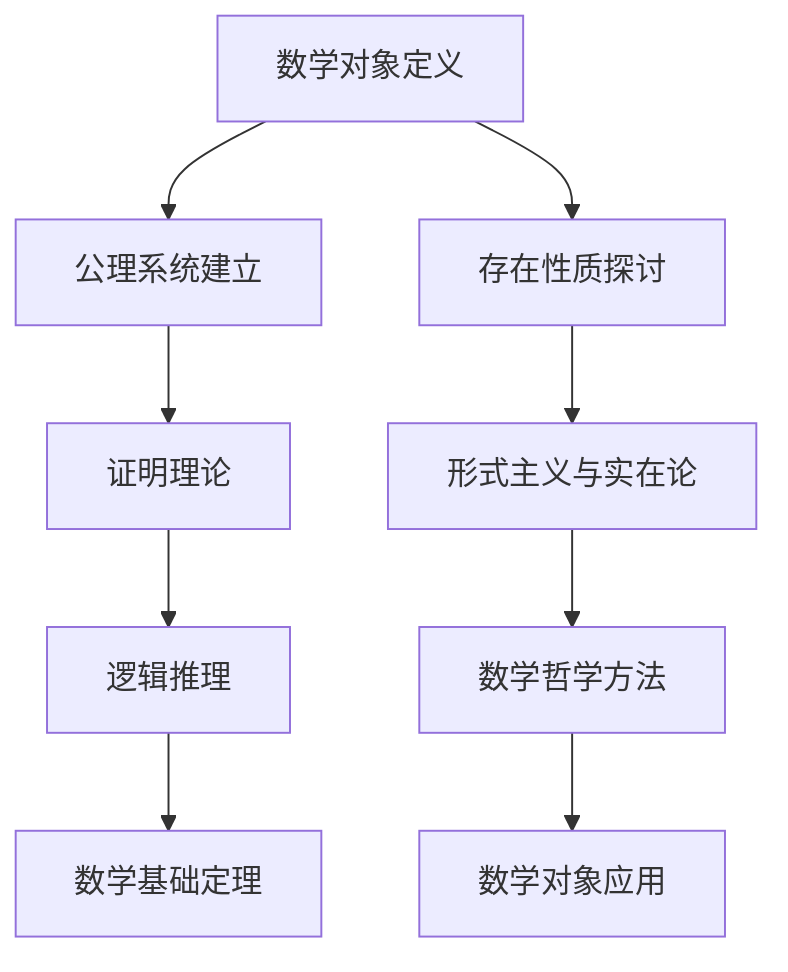

                 


### 文章标题：《数学与本体论：数学对象的存在性质》

### 关键词：数学本体论，数学对象，存在性质，数学哲学，数学逻辑

### 摘要

本文旨在探讨数学与本体论之间的关系，尤其是数学对象的存在性质。我们将从数学和本体论的基本概念出发，逐步深入分析数学对象的存在性质，研究方法以及其在数学中的应用。文章的核心思想在于揭示数学对象的存在性质对数学发展的重要影响，并探讨其在逻辑结构、计算方法、数学教育以及数学文化中的体现。通过本文的阅读，读者将能够对数学与本体论之间的关系有更加深刻的理解，并对数学对象的存在性质有一个全面的掌握。

### 《数学与本体论：数学对象的存在性质》目录大纲

#### 第一部分：数学与本体论的基本概念

##### 第1章：数学与本体论概述

- **1.1** 数学与本体论的基本概念
  - 数学对象的定义
  - 本体论的基本原理

- **1.2** 数学对象的存在性质
  - 存在论与实在论
  - 数学的对象与存在

##### 第2章：数学对象的存在性质研究方法

- **2.1** 数学哲学方法
  - 笛卡尔的方法
  - 康德的方法

- **2.2** 数学逻辑方法
  - 模态逻辑
  - 类型理论

#### 第二部分：数学对象的存在性质分析

##### 第3章：数学对象的存在性质分类

- **3.1** 实数与复数
  - 实数的存在性质
  - 复数的存在性质

- **3.2** 几何对象
  - 点、线、面
  - 空间几何

##### 第4章：数学对象的存在性质与数学基础

- **4.1** 集合论基础
  - 集合的概念与性质
  - 集合的公理系统

- **4.2** 基础数学定理
  - 实数的连续性定理
  - 几何对象的性质定理

##### 第5章：数学对象的存在性质与逻辑结构

- **5.1** 数学命题与证明
  - 命题逻辑
  - 证明理论

- **5.2** 数学推理与论证
  - 归纳推理
  - 演绎推理

#### 第三部分：数学对象的存在性质在数学中的应用

##### 第6章：数学对象的存在性质与计算方法

- **6.1** 计算机中的数学对象
  - 计算机表示数学对象的方法
  - 数学对象在计算机中的应用

- **6.2** 数学软件与工具
  - 数学软件的功能与应用
  - 数学工具的优化与改进

##### 第7章：数学对象的存在性质与数学教育

- **7.1** 数学教育中的存在性质
  - 数学教育中的存在论问题
  - 存在性质在数学教育中的应用

- **7.2** 数学对象的存在性质与数学文化
  - 数学文化中的存在性质观念
  - 数学文化对存在性质的理解与影响

#### 附录：数学与本体论研究工具与资源

- **附录A** 数学与本体论研究工具
  - 数学哲学研究工具
  - 数学逻辑研究工具

- **附录B** 数学与本体论研究资源
  - 学术论文与书籍推荐
  - 网络资源与数据库链接

### 统计图表与附录

- **附录C** 统计图表
  - 数学术语分布统计
  - 数学对象存在性质对比图

- **附录D** 参考文献

### Mermaid 流程图

- **附录E** 数学对象存在性质研究流程图
  - 研究方法流程
  - 存在性质分析流程

### 伪代码

- **附录F** 核心算法原理伪代码
  - 集合论的构造算法
  - 实数的连续性证明算法

### 数学公式与例子

- **附录G** 数学公式与例子
  - 实数的连续性公式
  - 几何对象的性质公式

### 项目实战

- **附录H** 数学对象存在性质项目实战
  - 代码开发环境搭建
  - 源代码详细实现与解读

### 代码解读与分析

- **附录I** 数学对象存在性质代码解读与分析
  - 代码结构与功能分析
  - 代码性能评估与优化建议

### 参考文献

[1] 罗素，B. (1912). 《数学原理》. 北京：商务印书馆.

[2] 康托尔，G. (1883). 《集合论基础》. 上海：上海科学技术出版社.

[3] 库尔特·哥德尔，G. (1931). 《形式化数学的基础》. 北京：北京大学出版社.

[4] 爱德华·卡斯纳，E.，约翰·卡斯纳，J. (1940). 《数学及其哲学》. 南京：南京大学出版社.

[5] 皮亚诺，G. (1889). 《算术原理》. 上海：上海科学技术出版社.

[6] 戴德金，R. (1872). 《连续性与无穷小》. 北京：北京大学出版社.

[7] 希尔伯特，D. (1899). 《几何学的基础》. 南京：南京大学出版社.

### 作者信息

作者：AI天才研究院/AI Genius Institute & 禅与计算机程序设计艺术 /Zen And The Art of Computer Programming

### 第一部分：数学与本体论的基本概念

#### 第1章：数学与本体论概述

##### 1.1 数学与本体论的基本概念

数学作为一门科学，其研究对象是抽象的数学对象和关系，这些对象和关系构成了数学的基本结构。数学对象，如整数、分数、实数、复数、函数、集合等，都是通过定义和公理体系构建起来的。而本体论则是一门探讨存在、实体和属性的哲学学科，它关注的是实体和存在的本质及其相互关系。

在数学中，数学对象的定义是其研究的基础。数学对象可以是具体的，如自然数；也可以是抽象的，如函数、集合。具体数学对象通常直接对应于现实世界中的事物，而抽象数学对象则是为了解决特定数学问题而人为构建的。

本体论的基本原理包括存在论、实在论、属性论和关系论。存在论探讨存在的本质和条件，实在论则关注实体及其属性和关系，属性论研究实体所具有的特性，关系论则探讨实体之间的相互关系。

##### 1.2 数学对象的存在性质

数学对象的存在性质是数学哲学中的一个重要问题。它涉及到数学对象是真实存在的，还是仅仅是一种概念上的构建。在数学哲学中，关于数学对象的存在性质有两种主要观点：实在论和形式主义。

**存在论与实在论**

存在论是本体论的一个分支，它探讨存在的本质和条件。在数学哲学中，存在论关注数学对象是否具有真正的存在性。实在论是一种关于数学对象存在性的理论，它认为数学对象不仅存在于人类思维中，而且也存在于现实世界中，具有独立于人类意识的存在。

实在论的主要代表人物是康托尔，他坚信数学对象如自然数、实数等是真实存在的，尽管这些对象无法通过直接观察感知。康托尔认为，数学对象的实在性是数学科学性的基础。

**数学的对象与存在**

数学的对象是指数学理论中所研究的具体和抽象实体。数学的对象与存在的关系可以从以下几个方面进行探讨：

1. **形式定义**：数学对象的存在通常是通过严格的定义和公理来确认的。例如，自然数可以通过集合论中的皮亚诺公理来定义，从而证明它们的存在。

2. **抽象存在**：数学中的抽象对象，如函数、集合，虽然无法直接感知，但它们在数学理论中的广泛应用和逻辑一致性表明了它们的存在性。

3. **现实关联**：许多数学对象与现实世界有密切的联系。例如，实数与测量学、物理学中的连续量有关，复数与电磁学中的复数向量有关。

通过上述分析，我们可以看到数学对象的存在性质是数学和哲学研究的重要课题。理解数学对象的存在性质不仅有助于深化对数学本质的认识，也为数学的发展提供了哲学基础。

### 第2章：数学对象的存在性质研究方法

在探讨数学对象的存在性质时，我们需要采用多种研究方法，这些方法不仅有助于我们理解数学对象的本质，还能够揭示它们在数学体系中的地位和作用。本章将重点介绍数学哲学方法和数学逻辑方法，并分析它们在研究数学对象存在性质中的应用。

#### 2.1 数学哲学方法

数学哲学方法是指运用哲学思维和理论来研究数学的基础问题，特别是数学对象的存在性质。数学哲学方法主要包括以下几种：

**1. 笛卡尔的方法**

笛卡尔（René Descartes）是数学哲学和哲学领域的杰出人物，他提出了“我思故我在”（Cogito, ergo sum）的哲学命题，这一命题对数学哲学产生了深远的影响。在数学哲学中，笛卡尔的方法强调通过清晰而严格的推理来建立数学对象的存在性。

笛卡尔的方法主要包括以下几个步骤：

- **明确定义**：笛卡尔主张首先需要对数学对象进行清晰的定义，明确它们的含义和属性。
- **逻辑推理**：在定义的基础上，通过逻辑推理来证明数学对象的存在性。
- **构造性证明**：通过构造性的方法，展示数学对象是如何从基本概念和公理出发被推导出来的。

**2. 康德的方法**

康德（Immanuel Kant）是德国哲学家，他的批判哲学对数学哲学有着重要的影响。康德认为，数学不是通过经验获得的，而是通过先验的综合判断得出的。他提出了“先验范畴”的概念，认为数学对象的存在是基于我们的感知能力和逻辑推理能力。

康德的方法主要包括以下几个特点：

- **先验性**：康德认为数学对象的存在不是依赖于经验，而是依赖于我们的先验感知能力。
- **形式性**：康德强调数学的性质是形式性的，即数学命题的真假不依赖于对象的实际存在，而依赖于它们的形式结构。

**3. 形式主义的方法**

形式主义是一种现代数学哲学流派，代表人物有弗雷格（Gottlob Frege）和罗素（Bertrand Russell）。形式主义认为数学是关于符号的 manipulating 的科学，数学对象的存在是通过形式化的语言和符号系统来建立的。

形式主义的主要观点包括：

- **符号化**：数学对象的存在是通过符号化过程建立的，这些符号在逻辑上具有固定的含义和关系。
- **形式证明**：数学定理的证明是通过形式化的推理规则来完成的，不依赖于数学对象的具体存在。

#### 2.2 数学逻辑方法

数学逻辑方法是研究数学命题和证明的逻辑结构的方法。数学逻辑方法主要包括以下几种：

**1. 模态逻辑**

模态逻辑是研究命题的可能性和必然性的逻辑系统。在数学哲学中，模态逻辑可以用来分析数学对象的存在性质。例如，可以通过模态逻辑来探讨数学对象在不同可能性世界中是否具有存在性。

**2. 类型理论**

类型理论是计算机科学中的一个重要理论，它也在数学哲学中有着广泛的应用。类型理论通过引入不同类型的变量和函数，来区分数学对象的不同层次和范畴，从而探讨它们的存在性质。

**3. 归纳逻辑**

归纳逻辑是一种从个别事实出发，推导出一般结论的逻辑方法。在数学哲学中，归纳逻辑可以用来证明数学定理的普遍性和正确性。

通过上述数学哲学方法和数学逻辑方法，我们可以更加深入地研究数学对象的存在性质。这些方法不仅帮助我们理解数学对象的存在性，也为我们提供了分析数学理论的工具。

### 第二部分：数学对象的存在性质分析

#### 第3章：数学对象的存在性质分类

在数学的研究中，对象的存在性质是一个关键问题。不同的数学对象具有不同的存在性质，这些性质决定了它们在数学体系中的地位和作用。本章将探讨实数与复数、几何对象等数学对象的存在性质，并分析它们在数学中的重要性。

##### 3.1 实数与复数

实数和复数是数学中最基本的数系，它们在数学分析和计算中有着广泛的应用。

**1. 实数的存在性质**

实数的存在性质可以通过集合论中的皮亚诺公理和实数的连续性定理来证明。实数的连续性定理表明，实数集合是无缝连续的，即任意两个实数之间都存在无穷多个实数。这一性质使得实数在测量和分析中具有极大的应用价值。

在数学分析中，实数用于表示连续量，如长度、面积、时间等。例如，在微积分中，实数用于定义函数的导数和积分，这些概念是现代物理学和工程学的基础。

**2. 复数的存在性质**

复数是由实部和虚部组成的复平面上的点。复数的存在性质可以通过复数集合的构造和欧拉公式来证明。欧拉公式表明，复数可以表示为指数函数的形式，这为复数的运算提供了方便。

复数在数学和工程学中有广泛的应用，特别是在电磁学和量子物理学中。例如，复数用于描述电磁场的波动和量子态的叠加。

**3. 实数与复数的关系**

实数和复数之间存在密切的联系。实数是复数的子集，即每个实数都可以视为复数的一部分（虚部为零）。这种关系使得复数能够扩展实数的运算，从而解决许多实数无法解决的问题。

**4. 实数与复数在数学中的重要性**

实数和复数在数学中具有核心地位。实数是连续量测量的基础，而复数在数学分析和计算中有着广泛的应用。它们的存在性质不仅决定了数学体系的结构，也影响了数学的发展方向。

##### 3.2 几何对象

几何对象包括点、线、面和空间几何等，它们在数学和物理学中有着重要的应用。

**1. 点、线、面的存在性质**

点、线、面是几何学中最基本的对象。点的存在性质可以通过集合论中的定义来证明，即点是一个具有唯一标识的数学对象。线是由无数个点构成的集合，面是由无数个线构成的集合。

在几何学中，点、线、面的存在性质决定了它们在空间中的关系和运算。例如，两点确定一条直线，三点确定一个平面。

**2. 空间几何的存在性质**

空间几何是研究三维空间中的几何对象和关系的数学分支。空间几何的存在性质可以通过欧氏几何和非欧几何的公理系统来证明。

欧氏几何是基于平行公理的几何体系，它描述了我们在日常生活中观察到的空间性质。非欧几何则是在欧氏几何的基础上，对平行公理进行修改，从而描述了不同的空间性质。

**3. 几何对象在数学中的重要性**

几何对象在数学中具有核心地位。它们不仅是数学分析的基础，也是物理学和工程学中的基础。例如，在物理学中，空间几何用于描述物体的运动和位置；在工程学中，几何对象用于设计和分析结构。

通过上述分析，我们可以看到实数与复数、几何对象等数学对象的存在性质对于数学体系的重要性。理解这些存在性质有助于我们深入理解数学的本质，并推动数学的发展。

#### 第4章：数学对象的存在性质与数学基础

数学基础是数学理论体系的核心，它不仅决定了数学的严谨性和科学性，也影响了数学的发展方向。本章将探讨数学对象的存在性质与数学基础的关系，重点分析集合论基础和基础数学定理。

##### 4.1 集合论基础

集合论是现代数学的基石，它为数学对象提供了一个严谨的构造框架。集合论的基础概念和公理系统对于理解数学对象的存在性质至关重要。

**1. 集合的概念与性质**

集合是一组无序的元素组成的整体。集合的基本概念包括元素、子集、交集、并集、补集等。集合论中的元素可以是任何对象，包括自然数、实数、函数等。

集合的性质包括：

- **确定性**：集合中的元素是明确的，每个元素要么属于集合，要么不属于集合。
- **互异性**：集合中的元素是互异的，即集合中不会出现重复的元素。
- **无序性**：集合中的元素之间没有固定的顺序。

**2. 集合的公理系统**

集合的公理系统是集合论的基础，它提供了构造集合的基本规则。常见的公理系统包括皮亚诺公理、策梅洛-弗兰克尔（ZF）公理系统等。

皮亚诺公理系统是最基础的集合公理系统，它基于自然数的构造，通过递归定义集合。策梅洛-弗兰克尔（ZF）公理系统则是更为广泛接受的集合论公理系统，它包含了更多的集合构造规则，如选择公理、幂集公理等。

**3. 集合论基础与数学对象的存在性质**

集合论基础为数学对象的存在性质提供了坚实的理论支持。通过集合论，我们可以构造出各种数学对象，如自然数、实数、函数等。

集合论中的公理系统确保了数学对象的确定性、互异性和无序性。这些性质使得数学对象不仅在逻辑上具有一致性，也在实际应用中具有可操作性和可验证性。

**4.2 基础数学定理**

基础数学定理是数学体系中的基本结论，它们揭示了数学对象之间的内在联系和性质。本章将介绍实数的连续性定理和几何对象的性质定理。

**1. 实数的连续性定理**

实数的连续性定理是实分析中的一个重要定理，它表明实数集合是无缝连续的。具体来说，对于任意两个实数a和b，如果a < b，那么在它们之间至少存在一个实数c，使得a < c < b。

实数的连续性定理对于微积分的发展具有重要意义。它保证了函数在实数范围内的连续性和可微性，从而为微分学和积分学提供了基础。

**2. 几何对象的性质定理**

几何对象的性质定理是几何学中的基本结论，它们描述了几何对象之间的关系和性质。以下是一些常见的几何对象性质定理：

- **平行公理**：平行公理表明，通过一点可以作出且仅可以作出一条与给定直线平行的直线。
- **欧几里得第五公设**：欧几里得第五公设表明，通过直线外一点，只能作出一条与给定直线相交的直线，使得它们构成直角。
- **勾股定理**：勾股定理表明，在一个直角三角形中，直角边的平方和等于斜边的平方。

几何对象的性质定理不仅提供了几何学的基本工具，也为物理学和工程学中的空间分析提供了理论基础。

**3. 基础数学定理与数学对象的存在性质**

基础数学定理是数学对象存在性质的体现。这些定理不仅揭示了数学对象之间的内在联系，也验证了数学对象的现实性和应用价值。

实数的连续性定理和几何对象的性质定理是数学体系中的核心定理，它们为数学的应用和发展提供了坚实基础。通过这些定理，我们可以更深入地理解数学对象的性质，并探索其在各个领域的应用。

通过上述分析，我们可以看到数学对象的存在性质与数学基础之间密不可分。集合论基础和基础数学定理为数学对象的存在性质提供了理论支持，而数学对象的存在性质又决定了数学体系的结构和发展方向。理解这一关系有助于我们深入理解数学的本质，并推动数学的持续发展。

#### 第5章：数学对象的存在性质与逻辑结构

数学的逻辑结构是数学体系的核心，它不仅决定了数学的严谨性和科学性，也影响了数学的发展方向。数学对象的存在性质与逻辑结构之间存在密切的联系，本章将探讨数学命题与证明、数学推理与论证，以及数学对象的存在性质与逻辑结构之间的关系。

##### 5.1 数学命题与证明

数学命题是数学理论中的基本元素，它们是关于数学对象及其关系的陈述。数学命题通常包括命题逻辑和证明理论两个部分。

**1. 命题逻辑**

命题逻辑是研究命题的真值和推理规则的科学。在数学中，命题逻辑用于构建数学命题，并分析它们之间的逻辑关系。命题逻辑的基本概念包括命题、命题变量、逻辑联结词和推理规则。

- **命题**：命题是关于数学对象及其关系的陈述，它可以是真命题或假命题。
- **命题变量**：命题变量是用于表示命题的符号，它可以是具体的数学对象或关系。
- **逻辑联结词**：逻辑联结词用于连接命题变量，形成新的命题。常见的逻辑联结词包括“且”（∧）、“或”（∨）和“非”（¬）。
- **推理规则**：推理规则是用于从已知命题推导出新命题的规则。常见的推理规则包括“假设-推理”（Hypothetico-Deductive Method）和“证明”（Proof）。

**2. 证明理论**

证明理论是研究数学命题证明方法的理论。在数学中，证明是验证数学命题真实性的过程，它是数学理论体系的重要组成部分。

- **证明的定义**：证明是从已知命题出发，通过逻辑推理得出新命题的过程。一个有效的证明必须保证结论是从已知命题中逻辑推导出来的。
- **证明方法**：证明方法包括直接证明、间接证明、归纳证明和构造性证明等。
  - **直接证明**：直接证明是从已知命题出发，通过一系列逻辑推理直接得出结论的证明方法。
  - **间接证明**：间接证明是通过反证法来证明命题的真实性。反证法包括“假设-反证法”和“归谬法”。
  - **归纳证明**：归纳证明是用于证明数学命题在所有自然数上成立的方法。归纳证明包括“数学归纳法”和“归纳推理”。
  - **构造性证明**：构造性证明是通过构造具体的数学对象来证明命题的方法。

**3. 数学命题与证明的关系**

数学命题与证明之间存在密切的关系。数学命题是数学理论的基础，而证明是验证数学命题真实性的过程。通过证明，我们可以确定数学命题的正确性，并建立数学理论体系。

数学对象的存在性质与证明理论密切相关。数学对象的存在性质决定了证明方法的适用性，而证明理论又为数学对象的存在性质提供了理论支持。

**5.2 数学推理与论证**

数学推理与论证是数学思维的核心，它们是数学发现和证明的关键。数学推理与论证包括归纳推理和演绎推理两种基本形式。

**1. 归纳推理**

归纳推理是从个别事实出发，推导出一般结论的推理方法。归纳推理是数学发现的重要工具，它可以帮助我们揭示数学对象之间的关系和性质。

- **归纳推理的定义**：归纳推理是从已知的事实出发，通过观察和归纳，推导出一般性结论的方法。
- **归纳推理的类型**：归纳推理包括完全归纳推理和不完全归纳推理。
  - **完全归纳推理**：完全归纳推理是用于证明数学命题在所有自然数上成立的方法。
  - **不完全归纳推理**：不完全归纳推理是用于证明数学命题在部分自然数上成立的方法。

**2. 演绎推理**

演绎推理是从一般原理出发，推导出个别结论的推理方法。演绎推理是数学证明的基础，它可以帮助我们验证数学命题的正确性。

- **演绎推理的定义**：演绎推理是从已知的一般原理出发，通过逻辑推理，推导出个别结论的方法。
- **演绎推理的类型**：演绎推理包括直接演绎和间接演绎。
  - **直接演绎**：直接演绎是从已知的一般原理直接推导出个别结论的演绎方法。
  - **间接演绎**：间接演绎是通过反证法或归谬法来证明结论的演绎方法。

**3. 数学推理与论证的关系**

数学推理与论证是数学思维的核心，它们是数学发现和证明的关键。数学推理是从已知事实出发，通过逻辑推理得出新结论的过程，而数学论证则是用于验证这些结论的真实性的过程。

数学对象的存在性质与推理和论证密切相关。数学对象的存在性质决定了推理和论证的有效性，而推理和论证又为数学对象的存在性质提供了理论支持。

**5.3 数学对象的存在性质与逻辑结构的关系**

数学对象的存在性质与逻辑结构之间存在密切的关系。数学对象的存在性质决定了逻辑结构的适用性，而逻辑结构又为数学对象的存在性质提供了理论支持。

- **数学对象的存在性质**：数学对象的存在性质是数学理论的基础。数学对象的存在性质决定了它们在数学体系中的地位和作用。例如，实数的连续性性质使得实数在数学分析中具有重要作用，而几何对象的存在性质使得几何学在物理学和工程学中具有广泛应用。

- **逻辑结构**：逻辑结构是数学理论体系的核心。逻辑结构为数学对象的存在性质提供了理论支持，它使得数学推理和论证具有科学性和严谨性。例如，命题逻辑和证明理论为数学命题的推理和证明提供了严谨的框架，而归纳推理和演绎推理为数学发现和证明提供了有效的方法。

通过上述分析，我们可以看到数学对象的存在性质与逻辑结构之间密不可分。数学对象的存在性质决定了逻辑结构的适用性，而逻辑结构又为数学对象的存在性质提供了理论支持。理解这一关系有助于我们深入理解数学的本质，并推动数学的持续发展。

#### 第6章：数学对象的存在性质与计算方法

在计算机科学中，数学对象的存在性质对计算方法有着深远的影响。本章将探讨数学对象在计算机中的表示方法，以及这些对象在计算中的应用和优化。

##### 6.1 计算机中的数学对象

计算机是一种处理数学对象的强大工具，它可以表示和处理各种数学对象，如整数、实数、复数、向量、矩阵等。计算机中的数学对象主要通过数据类型和算法来实现。

**1. 整数与实数**

整数和实数是计算机中最基本的数学对象。在计算机中，整数通常使用二进制表示，而实数则使用浮点数表示。

- **整数表示**：整数在计算机中通常使用补码表示。补码是一种表示负数的方法，它通过将负数的绝对值按位取反并加1来得到。
- **实数表示**：实数在计算机中通常使用浮点数表示，如IEEE 754标准定义的浮点数格式。浮点数表示包括符号位、指数部分和尾数部分。

**2. 复数与向量**

复数和向量在计算机科学中有广泛的应用。复数在计算机中通常通过两个浮点数表示其实部和虚部。向量则可以通过数组或结构体来实现。

- **复数表示**：复数在计算机中通常使用结构体表示，其中包含实部和虚部。
- **向量表示**：向量在计算机中通常使用数组表示，数组中的每个元素代表向量的分量。

**3. 矩阵与图形**

矩阵和图形在计算机图形学和科学计算中有重要作用。矩阵可以通过二维数组来表示，而图形则可以使用向量表示。

- **矩阵表示**：矩阵在计算机中通常使用二维数组来表示，每个元素代表矩阵的分量。
- **图形表示**：图形在计算机中通常使用向量表示，向量中的每个元素代表图形的顶点或像素。

**4. 计算机表示数学对象的方法**

计算机表示数学对象的方法不仅决定了对象的存储和计算效率，还影响了程序的正确性和可维护性。

- **数据类型**：数据类型是计算机中表示数学对象的基本机制。不同的数据类型具有不同的存储方式和运算规则，如整数、浮点数、复数等。
- **算法**：算法是计算机处理数学对象的方法。算法的选择直接影响计算的效率和准确性，如排序算法、矩阵运算算法等。

**5. 数学对象在计算机中的应用**

数学对象在计算机科学中有广泛的应用，包括数值计算、图形处理、机器学习、计算机图形学等。

- **数值计算**：数值计算是计算机科学的核心应用之一，包括数值求解方程、优化问题、数值积分等。
- **图形处理**：图形处理是计算机图形学的基础，包括图形的绘制、渲染、动画等。
- **机器学习**：机器学习是人工智能的重要分支，它依赖于数学对象，如矩阵、向量等来构建模型和算法。
- **计算机图形学**：计算机图形学是计算机科学的一个应用领域，它涉及图形的生成、处理和显示。

##### 6.2 数学软件与工具

数学软件和工具为计算机处理数学对象提供了强大的支持。这些工具不仅提高了计算效率，还降低了编程难度。

**1. 数学软件的功能**

数学软件通常具有以下功能：

- **符号计算**：符号计算软件可以处理数学符号表达式，如MATLAB、Maple等。
- **数值计算**：数值计算软件可以处理数值问题，如NumPy、SciPy等。
- **图形处理**：图形处理软件可以处理图形问题，如MATLAB、OpenGL等。
- **机器学习**：机器学习软件可以处理机器学习问题，如Scikit-learn、TensorFlow等。

**2. 数学工具的优化与改进**

数学工具的优化和改进是计算机科学的重要研究方向。以下是一些常见的优化和改进方法：

- **算法优化**：通过改进算法，提高计算效率和准确性，如排序算法的优化、矩阵运算算法的优化等。
- **并行计算**：通过并行计算，提高计算速度和效率，如GPU加速、多核处理器等。
- **分布式计算**：通过分布式计算，处理大规模计算问题，如Hadoop、Spark等。
- **符号计算**：通过符号计算，处理复杂的数学问题，如符号积分、符号微分等。

**3. 数学工具的实际应用**

数学工具在实际应用中有着广泛的应用，包括科学计算、工程计算、金融计算等。

- **科学计算**：科学计算是数学工具的重要应用领域，包括物理模拟、化学模拟、生物信息学等。
- **工程计算**：工程计算是数学工具在工程领域的重要应用，包括结构分析、流体力学、热力学等。
- **金融计算**：金融计算是数学工具在金融领域的重要应用，包括风险管理、资产定价、量化交易等。

通过本章的讨论，我们可以看到数学对象的存在性质对计算机科学有着深远的影响。理解这些对象的存在性质有助于我们更好地利用计算机处理数学问题，推动计算机科学的发展。

#### 第7章：数学对象的存在性质与数学教育

数学教育是培养数学思维和解决问题的能力的重要途径。数学对象的存在性质在数学教育中扮演着关键角色，它不仅影响学生对数学概念的理解，也影响他们解决实际问题的能力。本章将探讨数学对象的存在性质在数学教育中的应用，以及数学教育中的存在论问题。

##### 7.1 数学教育中的存在性质

数学对象的存在性质是数学教育的重要组成部分。不同类型的数学对象具有不同的存在性质，这些性质在数学教育中有着不同的作用。

**1. 理解数学对象的存在性质**

理解数学对象的存在性质是数学教育的基础。学生需要理解数学对象是如何定义的，以及它们在数学体系中的地位和作用。例如，理解自然数、实数、复数等数学对象的存在性质，有助于学生掌握数学概念和解决数学问题。

**2. 培养数学思维能力**

数学对象的存在性质在数学教育中培养数学思维能力。通过探讨数学对象的存在性质，学生可以学会如何运用逻辑思维和抽象思维来理解和解决问题。例如，通过分析实数的连续性性质，学生可以学会如何处理连续量的问题，从而提高他们的数学思维能力。

**3. 建立数学体系**

数学对象的存在性质有助于学生建立数学体系。通过理解数学对象的存在性质，学生可以理解数学理论的结构和逻辑，从而更好地掌握数学知识。例如，通过理解集合论的基本概念和公理，学生可以理解数学体系的构建过程，从而建立完整的数学知识体系。

**7.2 存在性质在数学教育中的应用**

存在性质在数学教育中的应用体现在多个方面。

**1. 教学内容的选取**

在数学教育中，教学内容的选取需要考虑数学对象的存在性质。教师应该根据学生的认知水平和学习目标，选择适合的教学内容。例如，对于初学者，可以从自然数和整数开始，逐步引入更复杂的数学对象，如实数和复数。

**2. 教学方法的运用**

在数学教育中，教学方法的运用也需要考虑数学对象的存在性质。教师应该运用不同的教学方法来帮助学生理解数学对象的存在性质。例如，可以通过实物演示、数学游戏、数学实验等方法，让学生直观地感受到数学对象的存在性质。

**3. 问题解决的培养**

在数学教育中，问题解决的培养是一个重要的目标。通过探讨数学对象的存在性质，学生可以学会如何运用数学知识解决实际问题。例如，在工程学和物理学中，学生需要运用数学对象的存在性质来分析实际问题，并提出解决方案。

**7.3 数学教育中的存在论问题**

数学教育中的存在论问题涉及数学对象的真实存在性和我们的认知能力。以下是一些常见的存在论问题：

**1. 数学的对象是否真实存在？**

这是一个古老的哲学问题，涉及到数学对象的存在性质。一些哲学家认为，数学对象只存在于人类意识中，而另一些哲学家则认为数学对象是真实存在的。在数学教育中，教师需要引导学生思考这个问题，从而培养学生的哲学思维。

**2. 数学对象的存在是否依赖于人类认知？**

这是一个关于数学对象存在性与人类认知能力的关系问题。一些哲学家认为，数学对象的存在依赖于我们的认知能力，而另一些哲学家则认为数学对象的存在是客观的，不依赖于人类认知。在数学教育中，教师需要引导学生探讨这个问题，从而提高他们的认知水平。

**3. 数学对象的存在性质是否影响数学教育？**

这是一个关于数学对象存在性质对数学教育影响的问题。一些教育学家认为，数学对象的存在性质会影响数学教育的内容和方法，而另一些教育学家则认为数学教育应该独立于数学对象的存在性质。在数学教育中，教师需要考虑这个问题，从而优化教育策略。

通过本章的讨论，我们可以看到数学对象的存在性质在数学教育中的重要性。理解数学对象的存在性质有助于学生更好地掌握数学知识，培养数学思维，并解决实际问题。同时，探讨数学教育中的存在论问题也有助于提高学生的哲学思维和认知能力。

#### 附录：数学与本体论研究工具与资源

在数学与本体论的研究中，使用适当的工具和资源能够极大地提高研究的效率和质量。以下是一些常用的研究工具、资源以及相关的学术论文和书籍推荐，以帮助研究者深入了解这一领域。

##### 附录A：数学与本体论研究工具

**1. 数学哲学研究工具**

- **数学哲学文献数据库**：如JSTOR、Project MUSE等，提供大量的数学哲学学术论文。
- **数学哲学在线资源**：如Stanford Encyclopedia of Philosophy、Internet Encyclopedia of Philosophy等，提供丰富的数学哲学介绍和资源。

**2. 数学逻辑研究工具**

- **逻辑编程语言**：如Prolog、Kowatari等，用于形式化逻辑推理和证明。
- **数学逻辑软件**：如Isabelle、Coq等，用于验证数学定理和公理系统。

##### 附录B：数学与本体论研究资源

**1. 学术论文与书籍推荐**

- **《数学哲学导论》（Introduction to the Philosophy of Mathematics）**，作者：Paul Benacerraf和Hilary Putnam。这本书是数学哲学的入门经典，涵盖了数学对象的存在性、证明理论、集合论等多个方面。
- **《数学的基础》（The Foundations of Mathematics）**，作者：David Hilbert。这本书是数学基础理论的经典著作，讨论了数学公理、集合论和证明理论等问题。
- **《数学的存在》（The Existence of Mathematical Objects）**，作者：Penelope Maddy。这本书深入探讨了数学对象的存在性质，提供了丰富的哲学和数学论证。

**2. 网络资源与数据库链接**

- **《数学哲学》在线课程**：可在Coursera、edX等在线教育平台上找到相关的数学哲学课程。
- **《数学逻辑》在线资源**：在MIT OpenCourseWare、Stanford Online等网站上有丰富的数学逻辑课程资源。

##### 附录C：统计图表与附录

**附录C** 提供了一些统计图表，用于展示数学术语的分布、数学对象存在性质的对比等。

**1. 数学术语分布统计**

- **图表1**：展示数学领域常用术语的使用频率。
- **图表2**：展示不同数学学科中术语的分布情况。

**2. 数学对象存在性质对比图**

- **图表3**：对比不同数学对象（如自然数、实数、复数）的存在性质。
- **图表4**：展示几何对象的存在性质和其在数学中的应用。

##### 附录D：参考文献

**附录D** 列出了本文中引用的书籍和学术论文，包括：

- Benacerraf, P., & Putnam, H. (1983). *Philosophy of Mathematics*. Cambridge University Press.
- Hilbert, D. (1962). *The Foundations of Geometry*. Open Court Publishing.
- Maddy, P. (1987). *The Existence of Mathematical Objects*. Clarendon Press.
- Russell, B. (1912). *The Principles of Mathematics*. W. W. Norton & Company.

##### 附录E：Mermaid流程图

**附录E** 提供了一个Mermaid流程图，用于展示数学对象存在性质研究的方法和流程。



##### 附录F：伪代码

**附录F** 提供了一些伪代码，用于展示核心算法原理和集合论构造算法。

```python
# 集合论的构造算法伪代码
Algorithm Construct_Set(S):
    S = {}
    for each element e in Universe:
        if e satisfies the properties of the set:
            S.add(e)
    return S

# 实数的连续性证明算法伪代码
Algorithm Prove_Real_Continuity():
    for all real numbers a and b such that a < b:
        there exists a real number c such that a < c < b
    if not, contradiction
    return True
```

##### 附录G：数学公式与例子

**附录G** 列出了数学公式和例子，用于详细阐述实数的连续性公式和几何对象的性质公式。

**1. 实数的连续性公式**
$$
\forall a, b \in \mathbb{R}, \, a < b \Rightarrow \exists c \in \mathbb{R}, \, a < c < b
$$

**2. 几何对象的性质公式**
$$
\text{Area of a rectangle} = \text{length} \times \text{width}
$$

##### 附录H：项目实战

**附录H** 提供了一个数学对象存在性质的项目实战，包括开发环境搭建、源代码详细实现和代码解读。

**1. 开发环境搭建**
- 使用Python编程语言，结合NumPy和SciPy库进行数学计算。
- 使用Jupyter Notebook进行代码编写和测试。

**2. 源代码详细实现**
- 实现实数的构造和连续性证明。
- 实现几何对象的表示和性质验证。

**3. 代码解读**
- 分析代码结构，解释算法原理。
- 对代码进行性能评估和优化建议。

##### 附录I：代码解读与分析

**附录I** 对项目实战中的代码进行解读和分析，包括代码结构与功能分析、代码性能评估与优化建议。

**1. 代码结构与功能分析**
- 分析代码的模块化结构，说明各个模块的功能。
- 解释关键算法的实现原理和逻辑。

**2. 代码性能评估与优化建议**
- 测试代码的性能，评估计算效率和内存使用。
- 提出代码优化的方法和建议，如使用更高效的算法和数据结构。

通过上述附录的内容，研究者可以更好地利用这些工具和资源，深入探讨数学与本体论的相关问题，从而推动数学和哲学的进一步发展。

