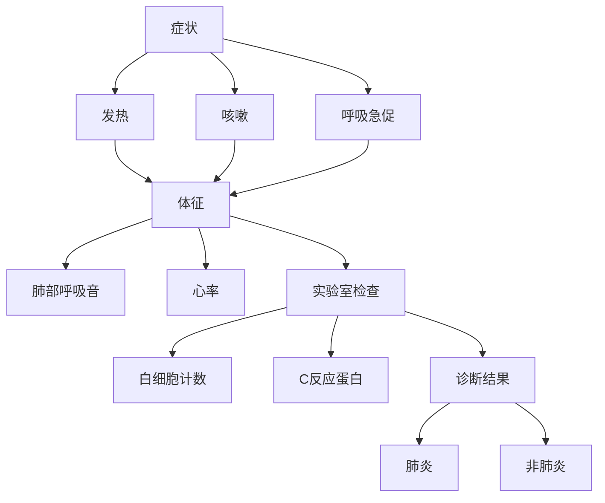
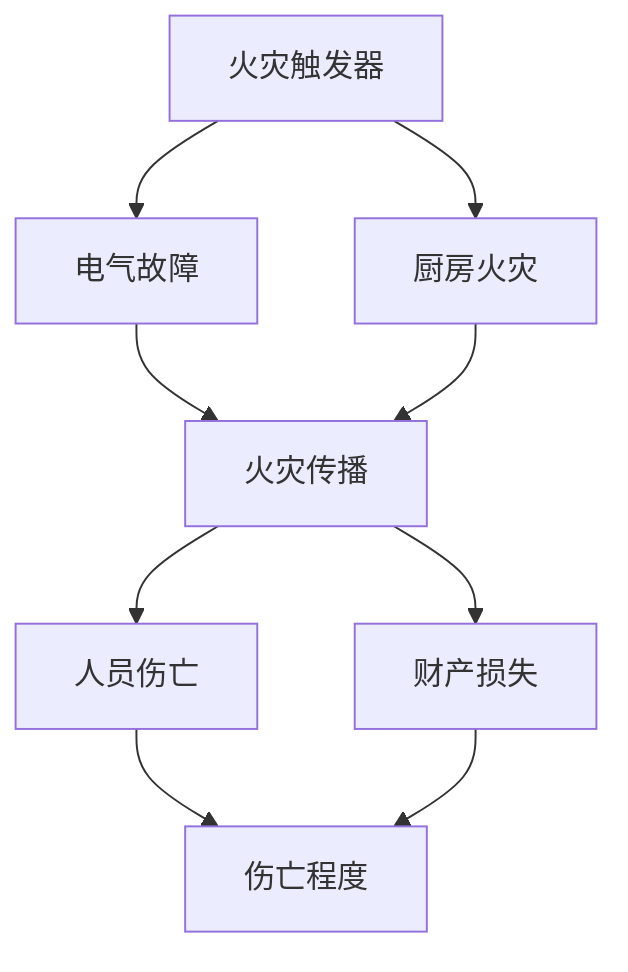
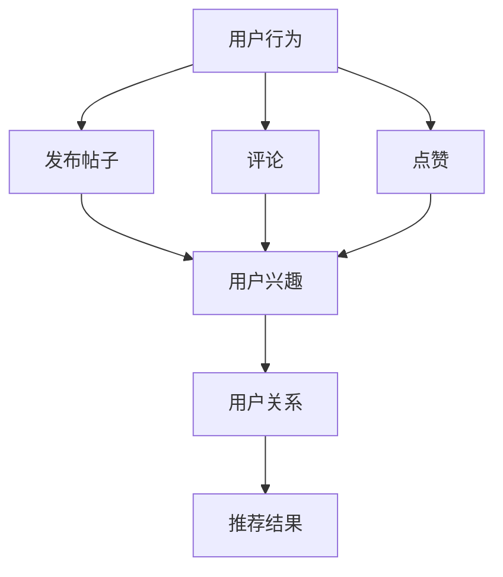

                 

### 文章标题

数学与概率：不确定性的量化描述

#### 关键词

数学、概率、不确定性、量化、数据分析、贝叶斯定理、风险与决策、蒙特卡洛模拟、金融应用

#### 摘要

本文旨在深入探讨数学与概率在描述和量化不确定性方面的应用。我们将从数学与概率的基本概念出发，逐步介绍概率分布、条件概率与贝叶斯定理、大数定律与中心极限定理，并探讨其应用。随后，我们将讨论概率模型在数据分析、时间序列分析、贝叶斯统计和马尔可夫链模型中的应用。最后，我们将探讨贝叶斯网络与推理、数学模型在风险管理与金融中的应用，以及蒙特卡洛模拟在金融领域中的应用。通过本文的阅读，读者将能够全面了解数学与概率在量化不确定性方面的作用和重要性。

### 第一部分：数学与概率概述

#### 第1章：数学与概率基础

#### 1.1 数学与概率的基本概念

数学作为一种精确的学科，为我们提供了一套强有力的工具来处理各种实际问题。概率论作为数学的一个分支，专门研究随机现象的规律性。在数据分析、决策分析、风险管理和金融领域，数学与概率的理论和方法具有极其重要的应用价值。

##### 1.1.1 数学在不确定性分析中的重要性

不确定性是现实世界中普遍存在的现象。无论是自然科学还是社会科学，许多问题都涉及到不确定性的分析。数学作为一种工具，能够帮助我们量化这种不确定性，并提供有效的决策支持。例如，在工程领域，我们需要通过概率论来评估工程项目的风险；在经济学领域，我们需要使用概率模型来预测市场走势；在生物学领域，我们需要使用概率统计方法来分析实验数据。

##### 1.1.2 概率的定义与性质

概率论的基本概念之一是概率。概率是指某个事件发生的可能性，其取值范围在0到1之间。具体而言，如果某个事件A发生的可能性越大，那么它的概率就越大；如果可能性越小，概率就越小。概率具有以下几个基本性质：

- **非负性**：任何事件的概率都大于或等于0。
- **规范性**：必然事件的概率为1，不可能事件的概率为0。
- **可加性**：如果两个事件A和B互斥（即两个事件不可能同时发生），那么这两个事件的并集的概率等于这两个事件各自概率的和。
  
##### 1.1.3 随机变量的概念

随机变量是概率论中的一个核心概念，它是用来描述随机现象的数学函数。具体来说，随机变量是一个变量，其取值依赖于随机实验的结果。随机变量分为离散随机变量和连续随机变量两种类型。

- **离散随机变量**：其取值是离散的，如掷骰子的点数。
- **连续随机变量**：其取值是连续的，如测量温度或长度。

随机变量的概率分布函数描述了随机变量取不同值的概率。对于离散随机变量，我们使用概率质量函数（PMF）来描述；对于连续随机变量，我们使用概率密度函数（PDF）来描述。

##### 1.2 概率分布

概率分布是概率论中的另一个重要概念，它描述了随机变量取不同值的概率分布情况。根据随机变量的取值性质，概率分布可以分为离散概率分布和连续概率分布两种类型。

###### 1.2.1 离散概率分布

离散概率分布描述了离散随机变量的概率分布。其中，最常用的离散概率分布包括二项分布和泊松分布。

- **二项分布**：描述了在n次独立重复试验中，成功发生k次的概率。其概率质量函数（PMF）为：
  $$
  P(X = k) = C_n^k p^k (1-p)^{n-k}
  $$
  其中，\( C_n^k \) 是组合数，表示从n个元素中取k个元素的组合数；\( p \) 是每次试验成功的概率。

- **泊松分布**：描述了在单位时间内，事件发生的次数的概率分布。其概率质量函数（PMF）为：
  $$
  P(X = k) = \frac{\lambda^k e^{-\lambda}}{k!}
  $$
  其中，\( \lambda \) 是单位时间内事件发生的平均次数；\( k \) 是实际发生的次数。

###### 1.2.2 连续概率分布

连续概率分布描述了连续随机变量的概率分布。其中，最常用的连续概率分布包括正态分布和卡方分布。

- **正态分布**：描述了随机变量取值在均值附近分布的概率分布。其概率密度函数（PDF）为：
  $$
  f(x|\mu, \sigma^2) = \frac{1}{\sqrt{2\pi\sigma^2}} e^{-\frac{(x-\mu)^2}{2\sigma^2}}
  $$
  其中，\( \mu \) 是均值；\( \sigma^2 \) 是方差。

- **卡方分布**：描述了随机变量取值在特定分布下的概率分布。其概率密度函数（PDF）为：
  $$
  f(x|\nu) = \frac{1}{2^{\nu/2}\Gamma(\nu/2)} x^{\nu/2-1} e^{-x/2}
  $$
  其中，\( \nu \) 是自由度；\( \Gamma \) 是伽马函数。

#### 1.3 条件概率与贝叶斯定理

条件概率是指在一个事件发生的条件下，另一个事件发生的概率。条件概率的定义为：
$$
P(A|B) = \frac{P(A \cap B)}{P(B)}
$$
其中，\( P(A \cap B) \) 是事件A和事件B同时发生的概率；\( P(B) \) 是事件B发生的概率。

贝叶斯定理是一种将条件概率与全概率结合起来进行推断的方法。贝叶斯定理的表达式为：
$$
P(A|B) = \frac{P(B|A)P(A)}{P(B)}
$$
其中，\( P(A|B) \) 是在事件B发生的条件下，事件A发生的概率；\( P(B|A) \) 是在事件A发生的条件下，事件B发生的概率；\( P(A) \) 是事件A发生的概率；\( P(B) \) 是事件B发生的概率。

贝叶斯定理在统计学和机器学习中具有重要的应用价值。通过贝叶斯定理，我们可以根据已知的先验知识和新的证据来更新我们对某个事件的概率估计。

#### 1.3.1 条件概率的定义

条件概率是指在一个事件发生的条件下，另一个事件发生的概率。条件概率的定义为：
$$
P(A|B) = \frac{P(A \cap B)}{P(B)}
$$
其中，\( P(A \cap B) \) 是事件A和事件B同时发生的概率；\( P(B) \) 是事件B发生的概率。

#### 1.3.2 贝叶斯定理

贝叶斯定理是一种将条件概率与全概率结合起来进行推断的方法。贝叶斯定理的表达式为：
$$
P(A|B) = \frac{P(B|A)P(A)}{P(B)}
$$
其中，\( P(A|B) \) 是在事件B发生的条件下，事件A发生的概率；\( P(B|A) \) 是在事件A发生的条件下，事件B发生的概率；\( P(A) \) 是事件A发生的概率；\( P(B) \) 是事件B发生的概率。

贝叶斯定理在统计学和机器学习中具有重要的应用价值。通过贝叶斯定理，我们可以根据已知的先验知识和新的证据来更新我们对某个事件的概率估计。

#### 1.3.3 贝叶斯分类器

贝叶斯分类器是一种基于贝叶斯定理的统计分类方法。它通过计算新样本属于每个类别的后验概率，并选择具有最大后验概率的类别作为分类结果。

贝叶斯分类器的实现通常包括以下步骤：

1. **先验概率估计**：根据已知的训练数据，估计每个类别的先验概率。
2. **特征条件概率估计**：对于每个类别，计算每个特征的条件概率。
3. **后验概率计算**：对于新样本，计算其属于每个类别的后验概率。
4. **分类决策**：选择具有最大后验概率的类别作为分类结果。

贝叶斯分类器在实际应用中具有很高的准确性和效率，尤其适用于小样本数据和特征维度较低的情况。

#### 1.3.4 贝叶斯网络

贝叶斯网络是一种图形化的概率模型，用于表示多个随机变量之间的依赖关系。贝叶斯网络由节点和边组成，每个节点表示一个随机变量，边表示节点之间的条件依赖关系。

贝叶斯网络的基本概念包括：

1. **节点表示**：每个节点表示一个随机变量，通常用字母表示。
2. **边表示**：边表示节点之间的条件依赖关系，即一个节点的取值取决于其他节点的取值。
3. **条件概率表**：对于每个节点，定义一个条件概率表，描述该节点在不同取值下，其他节点的条件概率。

贝叶斯网络的推理算法包括：

1. **变量消除法**：通过消除部分变量，简化网络，计算目标变量的条件概率。
2. **贝叶斯推理算法**：根据贝叶斯定理，计算网络中节点的条件概率。

贝叶斯网络在许多领域具有广泛的应用，如医学诊断、风险评估和社交网络分析等。

#### 1.4 大数定律与中心极限定理

大数定律和中心极限定理是概率论中非常重要的两个定理，它们为我们提供了在大量重复试验中，随机变量的分布性质。

##### 1.4.1 大数定律

大数定律描述了在大量重复试验中，随机变量的频率分布会趋近于其概率分布。具体而言，对于任意一个随机变量\( X \)，其期望值为\( E(X) \)，方差为\( Var(X) \)，则有以下结论：

- **切比雪夫大数定律**：对于任意一个随机变量\( X \)，当试验次数n趋向于无穷大时，\( X \)的样本均值的方差趋向于0，即：
  $$
  \lim_{n \to \infty} Var\left(\frac{1}{n}\sum_{i=1}^{n} X_i\right) = 0
  $$
- **弱大数定律**：对于任意一个随机变量\( X \)，当试验次数n趋向于无穷大时，\( X \)的样本均值的概率分布会趋近于其概率分布，即：
  $$
  \lim_{n \to \infty} P\left(\left|\frac{1}{n}\sum_{i=1}^{n} X_i - E(X)\right| < \epsilon\right) = 1
  $$
- **强大数定律**：对于任意一个随机变量\( X \)，当试验次数n趋向于无穷大时，\( X \)的样本均值的概率分布会完全收敛于其概率分布，即：
  $$
  \lim_{n \to \infty} P\left(\left|\frac{1}{n}\sum_{i=1}^{n} X_i - E(X)\right| < \epsilon\right) = 1
  $$

##### 1.4.2 中心极限定理

中心极限定理描述了在大量重复试验中，随机变量的分布会趋近于正态分布。具体而言，对于任意一个随机变量\( X \)，其期望值为\( E(X) \)，方差为\( Var(X) \)，则有以下结论：

- **林德伯格中心极限定理**：对于任意一个独立同分布的随机变量序列\( X_1, X_2, \ldots \)，当样本量n趋向于无穷大时，样本均值的分布会趋近于标准正态分布，即：
  $$
  \lim_{n \to \infty} P\left(\left|\frac{\bar{X} - E(X)}{\sqrt{Var(X)/n}}\right| < \epsilon\right) = 1
  $$
- **德莫佛-拉普拉斯中心极限定理**：对于二项分布\( X \sim Bin(n, p) \)，当n趋向于无穷大时，\( X \)的分布会趋近于正态分布，即：
  $$
  \lim_{n \to \infty} P(X = k) \approx \frac{1}{\sqrt{2\pi np(1-p)}} e^{-\frac{(k-np)^2}{2np(1-p)}}
  $$

##### 1.4.3 大数定律与中心极限定理的应用

大数定律和中心极限定理在统计学和数据分析中具有广泛的应用。以下是一些具体的应用示例：

- **假设检验**：在大数定律的基础上，我们可以进行假设检验，判断某个参数是否显著。
- **置信区间**：根据中心极限定理，我们可以计算参数的置信区间，估计参数的真实值。
- **回归分析**：在回归分析中，中心极限定理帮助我们理解回归系数的分布，从而进行统计推断。
- **风险管理**：在风险管理中，大数定律和中心极限定理帮助我们评估风险的概率分布，制定风险控制策略。

#### 1.5 风险与决策分析

风险与决策分析是数学与概率在管理领域的重要应用。在实际生活和工作中，我们经常面临各种风险和决策问题，如何合理地评估风险和做出决策是关键。

##### 1.5.1 风险的定义与分类

风险是指某种不利事件的发生及其可能导致的损失。根据风险性质的不同，可以将风险分为以下几类：

- **系统风险**：与整个系统或市场相关的风险，如经济危机、政策变动等。
- **非系统风险**：与特定个体或组织相关的风险，如技术故障、人员失误等。
- **市场风险**：与市场价格波动相关的风险，如股票价格、利率变动等。
- **信用风险**：与债务违约相关的风险，如借款人无法偿还债务等。
- **操作风险**：与组织内部操作失误相关的风险，如数据泄露、系统故障等。

##### 1.5.2 决策分析的基本方法

在风险与决策分析中，有多种基本方法可以帮助我们做出合理的决策，以下介绍几种常用的方法：

- **最大最小后悔值法**：该方法的目标是使决策者面临最坏情况时的后悔值最小。具体步骤如下：
  1. 列出所有可能的状态和决策。
  2. 对于每个决策，计算在每种状态下可能发生的最大后悔值。
  3. 选择使得最大后悔值最小的决策。

- **最大期望法**：该方法的目标是选择期望效用最大的决策。具体步骤如下：
  1. 列出所有可能的状态和决策。
  2. 对于每个决策，计算在每种状态下的期望效用。
  3. 选择使得期望效用最大的决策。

- **风险中性法**：该方法假设决策者是风险中性的，即决策者对风险不敏感。具体步骤如下：
  1. 列出所有可能的状态和决策。
  2. 对于每个决策，计算在每种状态下的期望收益。
  3. 选择使得期望收益最大的决策。

- **多属性决策**：在实际决策中，往往需要考虑多个属性，如成本、效益、风险等。多属性决策方法可以帮助我们综合考虑这些属性，选择最优的决策。常见的多属性决策方法包括：
  1. **层次分析法（AHP）**：通过建立层次结构模型，对各个属性进行权重分配，计算综合评分，选择最优决策。
  2. **模糊综合评判法**：考虑决策中的不确定性和模糊性，通过模糊数学方法进行综合评价，选择最优决策。

### 第二部分：概率模型在数据分析中的应用

概率模型在数据分析中具有广泛的应用，可以帮助我们进行预测、假设检验、时间序列分析和贝叶斯统计。以下分别介绍这些应用场景。

#### 第2章：概率模型在数据分析中的应用

#### 2.1 预测与假设检验

预测与假设检验是数据分析中常用的方法，用于评估数据中的规律性和差异。

##### 2.1.1 预测的基本概念

预测是指根据已有的数据，对未来的数据进行估计或预测。预测在商业、金融、医疗等领域具有广泛的应用。预测的基本概念包括：

- **自变量（X）**：用于预测的输入变量。
- **因变量（Y）**：需要预测的输出变量。
- **模型**：用于预测的数学模型，如线性回归、决策树、神经网络等。

##### 2.1.2 假设检验的基本方法

假设检验是统计学中用于评估数据中差异和规律性的方法。假设检验的基本概念包括：

- **原假设（\( H_0 \)）**：假设数据中不存在差异或规律性。
- **备择假设（\( H_1 \)）**：假设数据中存在差异或规律性。
- **显著性水平（\( \alpha \)）**：用于评估假设检验结果可靠性的概率阈值。

常见的假设检验方法包括：

- **t检验**：用于比较两组数据的均值是否显著不同。其假设条件为：
  $$
  t = \frac{\bar{x} - \mu_0}{s/\sqrt{n}}
  $$
  其中，\( \bar{x} \) 为样本均值，\( \mu_0 \) 为假设的均值，\( s \) 为样本标准差，\( n \) 为样本大小。通过计算t值，我们可以判断原假设是否成立。

- **卡方检验**：用于比较两组数据的频数分布是否显著不同。其假设条件为：
  $$
  \chi^2 = \sum_{i=1}^n \frac{(O_i - E_i)^2}{E_i}
  $$
  其中，\( O_i \) 为观察频数，\( E_i \) 为期望频数。通过计算卡方值，我们可以判断原假设是否成立。

##### 2.1.3 预测模型

预测模型是用于预测未来数据的数学模型。常见的预测模型包括：

- **线性回归**：线性回归模型假设因变量Y与自变量X之间存在线性关系，其数学模型为：
  $$
  Y = \beta_0 + \beta_1 X + \epsilon
  $$
  其中，\( \beta_0 \) 和 \( \beta_1 \) 分别为模型的参数，\( \epsilon \) 为误差项。通过最小二乘法，我们可以估计模型的参数，从而预测未来数据。

- **决策树**：决策树模型通过一系列规则将数据划分为不同的类别。其基本结构包括：

  1. **根节点**：代表整个数据集。
  2. **内部节点**：代表一个条件或属性。
  3. **叶节点**：代表一个类或预测结果。

- **神经网络**：神经网络模型通过多层神经元对数据进行学习和预测。其基本结构包括：

  1. **输入层**：接收外部输入数据。
  2. **隐藏层**：对输入数据进行加工和转换。
  3. **输出层**：生成预测结果。

#### 2.2 时间序列分析

时间序列分析是用于分析时间序列数据的统计方法，用于挖掘数据中的趋势、季节性和随机性。常见的时间序列分析模型包括自回归模型（AR）、移动平均模型（MA）、自回归移动平均模型（ARMA）和季节性时间序列模型。

##### 2.2.1 时间序列的基本概念

时间序列是由按时间顺序排列的数据组成的序列。时间序列分析的基本概念包括：

- **趋势**：时间序列中随时间变化的总体趋势，如上升、下降或平稳。
- **季节性**：时间序列中随时间变化的周期性波动，如季节性波动或年度波动。
- **随机性**：时间序列中无法预测的随机波动。

##### 2.2.2 自回归模型（AR）

自回归模型（AR）是一种用于分析时间序列数据的模型，它假设当前值由过去的几个值通过线性组合得到。其数学模型为：

$$
X_t = c + \phi_1 X_{t-1} + \phi_2 X_{t-2} + \ldots + \phi_p X_{t-p} + \epsilon_t
$$

其中，\( X_t \) 为时间序列的第t个值，\( \phi_1, \phi_2, \ldots, \phi_p \) 为自回归系数，\( \epsilon_t \) 为随机误差项。

自回归模型的实现步骤如下：

1. **数据预处理**：对时间序列数据进行预处理，包括去除趋势、季节性和随机性成分。
2. **模型识别**：通过观察时间序列的ACF图或PACF图，确定自回归阶数p。
3. **模型估计**：使用最小二乘法或最大似然估计法估计自回归系数。
4. **模型诊断**：对模型进行诊断，包括残差分析、拟合优度检验等。
5. **模型应用**：使用模型进行预测，并对预测结果进行分析。

##### 2.2.3 移动平均模型（MA）

移动平均模型（MA）是一种用于分析时间序列数据的模型，它假设当前值由过去的几个值的移动平均得到。其数学模型为：

$$
X_t = \mu + \theta_1 \epsilon_{t-1} + \theta_2 \epsilon_{t-2} + \ldots + \theta_q \epsilon_{t-q} + \epsilon_t
$$

其中，\( X_t \) 为时间序列的第t个值，\( \mu \) 为均值，\( \theta_1, \theta_2, \ldots, \theta_q \) 为移动平均系数，\( \epsilon_t \) 为随机误差项。

移动平均模型的实现步骤如下：

1. **数据预处理**：对时间序列数据进行预处理，包括去除趋势、季节性和随机性成分。
2. **模型识别**：通过观察时间序列的ACF图或PACF图，确定移动平均阶数q。
3. **模型估计**：使用最小二乘法或最大似然估计法估计移动平均系数。
4. **模型诊断**：对模型进行诊断，包括残差分析、拟合优度检验等。
5. **模型应用**：使用模型进行预测，并对预测结果进行分析。

##### 2.2.4 自回归移动平均模型（ARMA）

自回归移动平均模型（ARMA）是自回归模型（AR）和移动平均模型（MA）的结合，它同时考虑了时间序列数据的自相关性和移动平均特性。其数学模型为：

$$
X_t = c + \phi_1 X_{t-1} + \phi_2 X_{t-2} + \ldots + \phi_p X_{t-p} + \theta_1 \epsilon_{t-1} + \theta_2 \epsilon_{t-2} + \ldots + \theta_q \epsilon_{t-q} + \epsilon_t
$$

其中，\( X_t \) 为时间序列的第t个值，\( \phi_1, \phi_2, \ldots, \phi_p \) 为自回归系数，\( \theta_1, \theta_2, \ldots, \theta_q \) 为移动平均系数，\( \epsilon_t \) 为随机误差项。

ARMA模型的实现步骤如下：

1. **数据预处理**：对时间序列数据进行预处理，包括去除趋势、季节性和随机性成分。
2. **模型识别**：通过观察时间序列的ACF图或PACF图，确定自回归阶数p和移动平均阶数q。
3. **模型估计**：使用最小二乘法或最大似然估计法估计自回归系数和移动平均系数。
4. **模型诊断**：对模型进行诊断，包括残差分析、拟合优度检验等。
5. **模型应用**：使用模型进行预测，并对预测结果进行分析。

##### 2.2.5 季节性时间序列模型

季节性时间序列模型是用于分析时间序列数据中的季节性波动的模型。常见的季节性时间序列模型包括：

- **季节性自回归移动平均模型（SARMA）**：SARMA模型结合了自回归、移动平均和季节性的特性。其数学模型为：
  $$
  X_t = c + \phi_1 X_{t-1} + \phi_2 X_{t-2} + \ldots + \phi_p X_{t-p} + \theta_1 \epsilon_{t-1} + \theta_2 \epsilon_{t-2} + \ldots + \theta_q \epsilon_{t-q} + s_t
  $$
  其中，\( s_t \) 为季节性成分。

- **季节性差分自回归移动平均模型（SARIMA）**：SARIMA模型是对SARMA模型的进一步扩展，用于分析含有季节性和趋势性的时间序列数据。其数学模型为：
  $$
  X_t = c + \phi_1 X_{t-1} + \phi_2 X_{t-2} + \ldots + \phi_p X_{t-p} + \theta_1 \epsilon_{t-1} + \theta_2 \epsilon_{t-2} + \ldots + \theta_q \epsilon_{t-q} + (1 - B^d) (1 - B_s^D)^M s_t
  $$
  其中，\( d \) 为差分阶数，\( s \) 为季节性周期，\( M \) 为季节性差分阶数。

季节性时间序列模型的实现步骤如下：

1. **数据预处理**：对时间序列数据进行预处理，包括去除趋势、季节性和随机性成分。
2. **模型识别**：通过观察时间序列的ACF图或PACF图，确定自回归阶数p、移动平均阶数q、差分阶数d和季节性差分阶数M。
3. **模型估计**：使用最小二乘法或最大似然估计法估计自回归系数、移动平均系数、差分系数和季节性差分系数。
4. **模型诊断**：对模型进行诊断，包括残差分析、拟合优度检验等。
5. **模型应用**：使用模型进行预测，并对预测结果进行分析。

#### 2.3 贝叶斯统计

贝叶斯统计是概率统计的一种方法，它基于贝叶斯定理，通过先验概率和证据概率来更新我们对某个事件的概率估计。贝叶斯统计在数据分析和决策制定中具有广泛的应用。

##### 2.3.1 贝叶斯统计的基本概念

贝叶斯统计的基本概念包括：

- **先验概率**：在观察到任何证据之前，对某个事件发生的概率估计。
- **证据概率**：在观察到某个事件之后，该事件发生的概率估计。
- **后验概率**：在观察到某个事件之后，对某个事件发生的概率更新估计。

贝叶斯统计的核心思想是通过对先验概率和证据概率进行结合，得到后验概率，从而实现对未知事件的概率估计。

##### 2.3.2 先验分布与后验分布

在贝叶斯统计中，先验分布和后验分布是两个关键的概念。

- **先验分布**：在观察到任何证据之前，对某个事件发生的概率估计。先验分布通常是基于专家经验或主观判断得到的。

- **后验分布**：在观察到某个证据之后，对某个事件发生的概率更新估计。后验分布是通过贝叶斯定理计算得到的，它结合了先验分布和证据概率。

贝叶斯定理描述了先验分布和后验分布之间的关系：

$$
P(A|B) = \frac{P(B|A)P(A)}{P(B)}
$$

其中，\( P(A|B) \) 是在观察到证据B之后，事件A发生的概率；\( P(B|A) \) 是在事件A发生的条件下，观察到证据B的概率；\( P(A) \) 是事件A发生的概率；\( P(B) \) 是观察到证据B的概率。

##### 2.3.3 贝叶斯推断方法

贝叶斯推断是贝叶斯统计的核心，它通过使用贝叶斯定理来更新我们对某个事件的概率估计。以下介绍几种常用的贝叶斯推断方法：

- **全概率公式**：全概率公式是贝叶斯定理的扩展，它将贝叶斯定理应用于多个事件之间的概率计算。全概率公式的一般形式为：

$$
P(A) = \sum_{i=1}^n P(A|B_i)P(B_i)
$$

其中，\( P(A) \) 是事件A的概率，\( P(A|B_i) \) 是在事件\( B_i \)发生的条件下，事件A的概率，\( P(B_i) \) 是事件\( B_i \)的概率。

全概率公式可以用来计算复杂概率问题中的总概率，并且在进行概率推断时非常有用。

- **贝叶斯网络**：贝叶斯网络是一种图形化的概率模型，它用于表示多个随机变量之间的依赖关系。贝叶斯网络由节点和边组成，每个节点表示一个随机变量，边表示节点之间的条件依赖关系。贝叶斯网络可以用于推理和计算复杂概率问题。

贝叶斯网络的推理算法包括变量消除法和贝叶斯推理算法。变量消除法是一种基于贝叶斯定理的推理方法，通过消除部分变量，简化网络，计算目标变量的条件概率。贝叶斯推理算法是一种基于概率推理的算法，它根据贝叶斯定理，计算网络中节点的条件概率。

贝叶斯网络在许多领域具有广泛的应用，如医学诊断、风险评估和社交网络分析等。

- **马尔可夫链**：马尔可夫链是一种随机过程，它描述了一组随机变量之间的转移概率。马尔可夫链的基本特性是下一状态仅与当前状态有关，而与过去的状态无关。马尔可夫链可以用于建模和预测随机现象。

马尔可夫链的矩阵表示是一个关键概念。马尔可夫链的转移概率可以用一个矩阵表示，其中每个元素表示从一个状态转移到另一个状态的概率。通过分析马尔可夫链的矩阵表示，可以得出一些重要的性质，如平稳分布和周期性。

- **贝叶斯统计软件**：贝叶斯统计软件是用于进行贝叶斯推断和数据分析的工具。常见的贝叶斯统计软件包括JAGS、PyMC3、Stan等。这些软件提供了丰富的功能和接口，使得贝叶斯统计的应用更加方便和高效。

使用贝叶斯统计软件，可以方便地进行贝叶斯推断、参数估计和模型选择等任务。贝叶斯统计软件的兴起，极大地推动了贝叶斯统计在各个领域的研究和应用。

#### 第3章：马尔可夫链模型

马尔可夫链模型是一种用于描述随机现象的数学模型，它基于马尔可夫性质，即当前状态仅与前一状态有关，与过去的状态无关。马尔可夫链在许多领域都有广泛的应用，如金融、经济学、生物学和计算机科学。

##### 3.1 马尔可夫链的基本概念

马尔可夫链的基本概念包括：

- **状态**：马尔可夫链中的每一个可能的状态。
- **转移概率**：从一个状态转移到另一个状态的概率。
- **初始分布**：马尔可夫链开始时的状态分布。

马尔可夫链的表示通常是一个状态转移矩阵，其中每个元素表示从一个状态转移到另一个状态的概率。状态转移矩阵满足以下性质：

- **概率性**：每个状态的概率之和等于1。
- **非负性**：转移概率大于或等于0。
- **规范性**：转移概率满足归一化条件，即每个行的概率之和等于1。

##### 3.2 马尔可夫链的矩阵表示

马尔可夫链的矩阵表示是一个关键概念，它描述了状态之间的转移关系。状态转移矩阵是一个方阵，其中每个元素\( a_{ij} \)表示从状态i转移到状态j的概率。状态转移矩阵满足以下性质：

- **概率性**：对于每个状态i，所有转移概率之和等于1，即：
  $$
  \sum_{j=1}^n a_{ij} = 1
  $$
  其中，\( n \) 是状态的数量。
- **非负性**：转移概率大于或等于0，即：
  $$
  a_{ij} \geq 0
  $$
  对于所有的\( i \)和\( j \)。
- **规范性**：状态转移矩阵是归一化的，即每个行的概率之和等于1，即：
  $$
  \sum_{i=1}^n a_{ij} = 1
  $$
  对于所有的\( j \)。

状态转移矩阵可以用于计算马尔可夫链的长期行为。例如，我们可以通过计算状态转移矩阵的幂，得到经过多次转移后的状态分布。

##### 3.3 马尔可夫链的性质

马尔可夫链具有以下几个重要性质：

- **无记忆性**：马尔可夫链的当前状态只与前一状态有关，与过去的状态无关。这意味着马尔可夫链不依赖于历史信息，只关注当前状态。
- **稳定性**：马尔可夫链具有稳定性，即经过足够长的时间后，状态分布会趋于稳定。这种稳定性可以通过计算状态转移矩阵的幂来验证。
- **收敛性**：马尔可夫链具有收敛性，即对于某个初始状态分布，经过多次转移后，状态分布会收敛到一个特定的分布。这个分布称为平稳分布。
- **周期性**：马尔可夫链可能具有周期性，即某些状态之间的转移形成循环。周期性可以通过计算状态转移矩阵的特征值和特征向量来分析。

##### 3.4 马尔可夫链的数学性质

马尔可夫链的数学性质包括：

- **状态转移概率**：状态转移概率是马尔可夫链的核心概念，它描述了从一个状态转移到另一个状态的概率。状态转移概率可以用状态转移矩阵来表示，矩阵中的每个元素表示从一个状态转移到另一个状态的概率。
- **状态分布**：状态分布是马尔可夫链在某一时刻的状态分布。状态分布可以通过初始分布和状态转移概率来计算。
- **平稳分布**：平稳分布是马尔可夫链经过足够长时间后的状态分布。平稳分布是唯一的，且不依赖于初始分布。
- **收敛性**：马尔可夫链具有收敛性，即对于某个初始状态分布，经过多次转移后，状态分布会收敛到一个特定的分布。这个分布称为平稳分布。

#### 3.5 马尔可夫链模型的应用

马尔可夫链模型在多个领域具有广泛的应用：

- **金融领域**：马尔可夫链可以用于建模股票价格、利率和汇率等金融时间序列。通过分析状态转移概率，可以预测金融市场的未来走势。
- **生物学领域**：马尔可夫链可以用于分析生物序列的进化，描述物种之间的遗传关系。
- **经济学领域**：马尔可夫链可以用于建模经济增长、通货膨胀和就业等宏观经济现象。
- **计算机科学领域**：马尔可夫链可以用于文本生成、语言模型和推荐系统等应用。

#### 3.6 马尔可夫链模型的应用示例

以下是一个马尔可夫链模型的应用示例：

**例子：天气预测模型**

假设我们有一个简单的天气预测模型，它有两个状态：“晴天”和“雨天”。我们可以根据过去几天天气的情况来预测未来一天的天气。假设状态转移矩阵如下：

|      | 晴天 | 雨天 |
|------|------|------|
| 晴天 | 0.7  | 0.3  |
| 雨天 | 0.4  | 0.6  |

这个矩阵表示在当前天气为晴天的情况下，未来一天为晴天的概率是0.7，为雨天的概率是0.3；在当前天气为雨天的情况下，未来一天为晴天的概率是0.4，为雨天的概率是0.6。

假设我们观察到连续三天都是晴天，我们想预测第四天是晴天还是雨天。初始状态分布为[1, 0]，即第一天是晴天，第二天和第三天也是晴天。

通过状态转移矩阵，我们可以计算第四天的状态分布：

|      | 晴天 | 雨天 |
|------|------|------|
| 晴天 | 0.7  | 0.3  |
| 雨天 | 0.4  | 0.6  |

第四天的状态分布为：

$$
P(\text{晴天}) = 0.7 \times 0.7 \times 0.7 = 0.343 \\
P(\text{雨天}) = 0.3 \times 0.7 \times 0.4 + 0.7 \times 0.3 \times 0.4 + 0.3 \times 0.3 \times 0.6 = 0.343
$$

因此，第四天是晴天和雨天的概率相等。

通过这个示例，我们可以看到马尔可夫链模型如何用于预测天气。这个模型可以根据历史天气数据来预测未来天气，从而为人们的生活和工作提供参考。

### 第3章：贝叶斯网络与推理

贝叶斯网络是一种图形化的概率模型，用于表示多个随机变量之间的依赖关系。它由节点和边组成，每个节点表示一个随机变量，边表示节点之间的条件依赖关系。贝叶斯网络在推理和决策支持中具有广泛的应用。

#### 3.1 贝叶斯网络的基本概念

贝叶斯网络的基本概念包括：

- **节点**：贝叶斯网络中的每个节点表示一个随机变量。节点通常用圆形或矩形表示，并在其中标注随机变量的名称。
- **边**：贝叶斯网络中的边表示节点之间的条件依赖关系。边通常从父节点指向子节点，表示子节点的取值取决于父节点的取值。
- **条件概率表**：每个节点都有一个条件概率表，描述该节点在不同取值下，其他节点的条件概率。条件概率表通常以表格形式呈现，其中行表示节点的取值，列表示其他节点的取值。

贝叶斯网络的推理是指根据网络的模型结构和已知的部分信息，计算网络中未知的概率分布。贝叶斯网络的推理算法包括变量消除法和贝叶斯推理算法。

#### 3.1.1 变量消除法

变量消除法是一种基于条件概率表进行推理的算法。它的基本思想是，通过消除部分变量，简化网络，从而计算目标变量的条件概率。

变量消除法的步骤如下：

1. **初始化**：将目标变量的条件概率表初始化为1，其他变量的条件概率表初始化为0。
2. **正向推理**：从根节点开始，依次计算每个节点的条件概率表。对于每个节点，根据其父节点的条件概率表，计算该节点的条件概率表。
3. **逆向推理**：从目标节点开始，依次逆向计算每个节点的条件概率表。对于每个节点，根据其子节点的条件概率表，更新该节点的条件概率表。
4. **结果输出**：输出目标变量的条件概率表，得到目标变量的概率分布。

变量消除法的时间复杂度为O(n^2)，其中n是节点的数量。尽管时间复杂度较高，但在实际应用中，变量消除法是一种有效的推理算法。

#### 3.1.2 贝叶斯推理算法

贝叶斯推理算法是一种基于贝叶斯定理进行推理的算法。它的基本思想是，通过已知的部分信息，更新对目标变量的概率估计。

贝叶斯推理算法的步骤如下：

1. **初始化**：将目标变量的概率分布初始化为均匀分布。
2. **正向推理**：从根节点开始，依次计算每个节点的概率分布。对于每个节点，根据其父节点的概率分布，计算该节点的概率分布。
3. **条件概率计算**：对于每个节点，计算其子节点的条件概率。条件概率可以通过贝叶斯定理计算得到。
4. **逆向推理**：从目标节点开始，依次逆向计算每个节点的概率分布。对于每个节点，根据其子节点的条件概率分布，更新该节点的概率分布。
5. **结果输出**：输出目标变量的概率分布，得到目标变量的概率估计。

贝叶斯推理算法的时间复杂度为O(n^3)，其中n是节点的数量。尽管时间复杂度较高，但在实际应用中，贝叶斯推理算法是一种有效的推理算法。

#### 3.1.3 贝叶斯网络的应用

贝叶斯网络在多个领域具有广泛的应用，包括：

1. **医学诊断**：贝叶斯网络可以用于构建医学诊断模型，根据病人的症状和体征，预测疾病的概率。例如，贝叶斯网络可以用于乳腺癌诊断，根据患者的年龄、家族病史、乳腺X线片等特征，预测患者患乳腺癌的概率。

2. **风险评估**：贝叶斯网络可以用于风险评估，计算某个事件发生的概率。例如，贝叶斯网络可以用于保险公司的风险评估，根据投保人的年龄、性别、健康状况等特征，预测其发生重大疾病的概率。

3. **社交网络分析**：贝叶斯网络可以用于分析社交网络中的关系，预测用户之间的互动概率。例如，贝叶斯网络可以用于社交媒体平台，根据用户之间的关注关系，预测用户之间的评论和点赞概率。

4. **金融市场预测**：贝叶斯网络可以用于预测金融市场的走势，根据宏观经济指标、公司业绩等特征，预测股票价格、汇率等金融指标。

#### 3.1.4 贝叶斯网络在医学诊断中的应用

贝叶斯网络在医学诊断中具有广泛的应用，可以用于构建诊断模型，帮助医生做出准确的诊断。以下是一个贝叶斯网络在医学诊断中的应用示例：

**例子：肺炎诊断模型**

假设我们想要构建一个肺炎诊断模型，模型包含以下节点：

- **症状**：包括发热、咳嗽、呼吸急促等症状。
- **体征**：包括肺部呼吸音、心率等体征。
- **实验室检查**：包括白细胞计数、C反应蛋白等实验室检查结果。
- **诊断结果**：包括肺炎和非肺炎。

我们可以根据医学知识构建贝叶斯网络，如下所示：

在这个贝叶斯网络中，每个节点表示一个随机变量，边表示节点之间的条件依赖关系。例如，症状节点表示发热、咳嗽、呼吸急促等症状，体征节点表示肺部呼吸音、心率等体征，实验室检查节点表示白细胞计数、C反应蛋白等实验室检查结果。

我们可以根据已知的医学知识，为每个节点定义条件概率表。例如，对于发热节点，我们可以定义其条件概率表如下：

| 发热 | 肺炎 | 非肺炎 |
|------|------|--------|
| 0    | 0.1  | 0.2    |
| 1    | 0.7  | 0.3    |

这个表格表示在发热为0的情况下，患肺炎的概率为0.1，患非肺炎的概率为0.2；在发热为1的情况下，患肺炎的概率为0.7，患非肺炎的概率为0.3。

我们可以使用贝叶斯推理算法，根据已知的症状、体征和实验室检查结果，计算诊断结果为肺炎或非肺炎的概率。例如，如果患者有发热、咳嗽和白细胞计数升高的症状和实验室检查结果，我们可以计算其患肺炎的概率。

通过贝叶斯网络，我们可以得到一个综合的、基于概率的诊断模型，帮助医生做出更准确、更可靠的诊断。贝叶斯网络在医学诊断中的应用，不仅提高了诊断的准确性，还减少了误诊和漏诊的风险。

#### 3.1.5 贝叶斯网络在风险评估中的应用

贝叶斯网络在风险评估中具有广泛的应用，可以用于计算某个事件发生的概率，并帮助决策者制定有效的风险管理策略。以下是一个贝叶斯网络在风险评估中的应用示例：

**例子：火灾风险评估模型**

假设我们想要构建一个火灾风险评估模型，模型包含以下节点：

- **火灾触发器**：包括火灾的潜在触发因素，如电气故障、厨房火灾等。
- **火灾传播**：包括火势蔓延的速度和方向。
- **人员伤亡**：包括火灾导致的人员伤亡情况。
- **财产损失**：包括火灾导致的财产损失。

我们可以根据火灾发生的规律和影响，构建贝叶斯网络，如下所示：

在这个贝叶斯网络中，每个节点表示一个随机变量，边表示节点之间的条件依赖关系。例如，火灾触发器节点表示火灾的潜在触发因素，火灾传播节点表示火势蔓延的速度和方向，人员伤亡节点表示火灾导致的人员伤亡情况，财产损失节点表示火灾导致的财产损失。

我们可以根据已知的火灾数据，为每个节点定义条件概率表。例如，对于电气故障节点，我们可以定义其条件概率表如下：

| 电气故障 | 火灾发生 | 火灾不发生 |
|----------|----------|-------------|
| 0        | 0.1      | 0.9         |
| 1        | 0.3      | 0.7         |

这个表格表示在电气故障为0的情况下，火灾发生的概率为0.1，火灾不发生的概率为0.9；在电气故障为1的情况下，火灾发生的概率为0.3，火灾不发生的概率为0.7。

我们可以使用贝叶斯推理算法，根据已知的火灾触发器数据，计算火灾传播、人员伤亡和财产损失的概率。例如，如果某栋建筑的电气故障发生概率较高，我们可以计算该建筑发生火灾传播、人员伤亡和财产损失的概率。

通过贝叶斯网络，我们可以得到一个综合的、基于概率的风险评估模型，帮助决策者制定有效的火灾预防和管理策略。贝叶斯网络在风险评估中的应用，不仅提高了风险评估的准确性，还减少了风险管理和决策的不确定性。

#### 3.1.6 贝叶斯网络在社交网络分析中的应用

贝叶斯网络在社交网络分析中具有广泛的应用，可以用于分析用户之间的互动关系，预测用户之间的行为和偏好。以下是一个贝叶斯网络在社交网络分析中的应用示例：

**例子：用户推荐系统**

假设我们想要构建一个用户推荐系统，系统包含以下节点：

- **用户行为**：包括用户在社交网络上的互动行为，如发布帖子、评论、点赞等。
- **用户兴趣**：包括用户的兴趣和偏好，如电影、音乐、书籍等。
- **用户关系**：包括用户之间的互动关系，如好友、关注者等。
- **推荐结果**：包括系统推荐的帖子、商品等。

我们可以根据用户的互动行为和兴趣，构建贝叶斯网络，如下所示：

在这个贝叶斯网络中，每个节点表示一个随机变量，边表示节点之间的条件依赖关系。例如，用户行为节点表示用户在社交网络上的互动行为，用户兴趣节点表示用户的兴趣和偏好，用户关系节点表示用户之间的互动关系，推荐结果节点表示系统推荐的帖子、商品等。

我们可以根据已知的用户数据，为每个节点定义条件概率表。例如，对于用户行为节点，我们可以定义其条件概率表如下：

| 用户行为 | 发布帖子 | 评论 | 点赞 |
|----------|----------|------|------|
| 0        | 0.2      | 0.3  | 0.5  |
| 1        | 0.6      | 0.4  | 0.1  |

这个表格表示在用户行为为0的情况下，发布帖子的概率为0.2，评论的概率为0.3，点赞的概率为0.5；在用户行为为1的情况下，发布帖子的概率为0.6，评论的概率为0.4，点赞的概率为0.1。

我们可以使用贝叶斯推理算法，根据已知的用户行为和兴趣，计算用户之间的互动关系和推荐结果。例如，如果某用户的行为模式是发布帖子、评论和点赞，我们可以计算该用户与其他用户之间的互动关系，并推荐相关的帖子、商品。

通过贝叶斯网络，我们可以得到一个综合的、基于概率的用户推荐系统，帮助用户发现新的兴趣和互动对象。贝叶斯网络在社交网络分析中的应用，不仅提高了推荐系统的准确性，还增强了用户的参与度和满意度。

### 第三部分：数学模型在风险管理与金融中的应用

数学模型在风险管理与金融领域中扮演着至关重要的角色，为决策者提供了量化风险和制定策略的工具。以下将介绍几种常见的数学模型及其在金融风险管理中的应用。

#### 第4章：数学模型在风险管理与金融中的应用

#### 4.1 风险管理与金融理论

风险管理与金融理论是理解金融风险和制定风险管理策略的基础。以下是一些核心概念和理论：

##### 4.1.1 风险管理的定义与目标

风险管理是指通过系统化的方法识别、评估、监控和应对潜在风险，以实现组织或个人的目标。其主要目标包括：

- **降低损失**：通过识别和应对风险，降低可能发生的损失。
- **保持稳定性**：通过有效的风险管理，确保组织或个人的财务状况稳定。
- **实现目标**：通过风险管理，确保组织或个人能够实现其长期目标。

##### 4.1.2 金融理论的基本概念

金融理论是理解金融市场和金融工具的基础。以下是一些核心概念：

- **金融市场**：金融市场的价格是由供求关系决定的，投资者可以通过买卖金融工具来参与市场。
- **金融工具**：金融工具包括股票、债券、期权、期货等，它们为投资者提供了不同的风险和回报。
- **投资组合**：投资组合是由多种金融工具组成的，通过分散投资，可以降低风险并提高回报。

##### 4.1.3 风险度量方法

风险度量是风险管理的重要环节，以下介绍几种常见的风险度量方法：

- **期望效用理论**：期望效用理论是一种基于个体偏好的风险度量方法。它通过计算投资组合的期望效用来评估风险。期望效用理论的基本公式为：
  $$
  U(w) = \sum_{i=1}^n w_i u_i
  $$
  其中，\( U(w) \) 是期望效用，\( w_i \) 是每个可能结果的权重，\( u_i \) 是每个可能结果的效用。

- **均值-方差分析**：均值-方差分析是一种基于概率和统计的风险度量方法。它通过计算投资组合的期望收益和方差来评估风险。均值-方差分析的基本公式为：
  $$
  \text{收益} = \mu \\
  \text{方差} = \sigma^2
  $$
  其中，\( \mu \) 是期望收益，\( \sigma^2 \) 是方差。

#### 4.2 蒙特卡洛模拟

蒙特卡洛模拟是一种基于随机抽样的数学模型，它通过模拟大量随机样本来估计概率和风险。蒙特卡洛模拟在金融风险管理中具有广泛的应用，以下介绍其在金融领域的应用：

##### 4.2.1 蒙特卡洛模拟的基本概念

蒙特卡洛模拟的基本概念包括：

- **随机抽样**：蒙特卡洛模拟通过随机抽样来模拟金融市场的价格变化和风险。
- **模拟过程**：蒙特卡洛模拟通过模拟大量的随机样本，计算出投资组合在不同情景下的收益和风险。

蒙特卡洛模拟的基本步骤如下：

1. **定义随机过程**：根据金融市场的特性，定义一个随机过程来模拟价格变化。
2. **生成随机样本**：通过随机抽样生成大量的随机样本，代表不同的市场情景。
3. **计算收益和风险**：对每个随机样本，计算投资组合的收益和风险。
4. **统计分析**：对模拟结果进行统计分析，计算期望收益、方差、置信区间等指标。

##### 4.2.2 蒙特卡洛模拟在金融中的应用

蒙特卡洛模拟在金融风险管理中具有广泛的应用，以下介绍几种常见应用：

- **期权定价**：蒙特卡洛模拟可以用于期权定价，通过模拟股票价格的变化，计算期权的内在价值和时间价值。
  $$
  V(S_T, T) = \max(S_T - K, 0)
  $$
  其中，\( V(S_T, T) \) 是期权的内在价值，\( S_T \) 是到期时的股票价格，\( K \) 是执行价格。

- **风险分析**：蒙特卡洛模拟可以用于评估投资组合的风险，通过模拟大量随机样本，计算投资组合的期望收益、方差和置信区间。

- **压力测试**：蒙特卡洛模拟可以用于压力测试，通过模拟极端市场情景，评估投资组合在极端情况下的风险承受能力。

#### 4.2.3 蒙特卡洛模拟在金融风险管理中的应用示例

以下是一个蒙特卡洛模拟在金融风险管理中的应用示例：

**例子：投资组合风险分析**

假设我们有一个投资组合，包含两种资产A和B，每种资产的投资比例分别为50%和50%。我们需要使用蒙特卡洛模拟来评估投资组合的风险。

1. **定义随机过程**：假设资产A和资产B的价格变化服从正态分布，分别具有均值和方差如下：

   - 资产A：均值\( \mu_A = 0.05 \)，方差\( \sigma_A^2 = 0.02 \)。
   - 资产B：均值\( \mu_B = 0.03 \)，方差\( \sigma_B^2 = 0.01 \)。

2. **生成随机样本**：使用蒙特卡洛模拟生成1000个随机样本，代表不同市场情景下的价格变化。

3. **计算投资组合收益**：对每个随机样本，计算投资组合的收益：

   $$
   R_t = 0.5 \cdot S_{t,A} + 0.5 \cdot S_{t,B}
   $$
   其中，\( R_t \) 是投资组合的收益，\( S_{t,A} \) 和 \( S_{t,B} \) 是资产A和资产B在随机样本\( t \)时的价格。

4. **统计分析**：对1000个随机样本的收益进行统计分析，计算投资组合的期望收益、方差和置信区间。

通过上述步骤，我们可以使用蒙特卡洛模拟评估投资组合的风险。例如，如果模拟结果显示投资组合的期望收益为0.04，方差为0.003，置信区间为[0.03, 0.05]，我们可以得出以下结论：

- 投资组合的期望收益较高，风险相对较低。
- 投资组合的收益置信区间较窄，风险较为稳定。

通过蒙特卡洛模拟，我们可以量化投资组合的风险，为决策者提供重要的参考信息。此外，蒙特卡洛模拟还可以用于评估不同投资策略的效果，帮助决策者制定更优的投资策略。

### 4.3 风险度量方法

在风险管理中，准确地度量风险是制定有效风险管理策略的基础。以下介绍几种常见的风险度量方法：

#### 4.3.1 期望效用理论

期望效用理论是一种基于个体偏好的风险度量方法。它通过计算投资组合的期望效用来评估风险。期望效用理论的基本公式为：
$$
U(w) = \sum_{i=1}^n w_i u_i
$$
其中，\( U(w) \) 是期望效用，\( w_i \) 是每个可能结果的权重，\( u_i \) 是每个可能结果的效用。

#### 4.3.2 均值-方差分析

均值-方差分析是一种基于概率和统计的风险度量方法。它通过计算投资组合的期望收益和方差来评估风险。均值-方差分析的基本公式为：
$$
\text{收益} = \mu \\
\text{方差} = \sigma^2
$$
其中，\( \mu \) 是期望收益，\( \sigma^2 \) 是方差。

#### 4.3.3 压力测试

压力测试是一种通过模拟极端市场情景来评估投资组合风险的方法。它可以帮助决策者了解投资组合在极端情况下的表现，并采取相应的应对措施。

#### 4.3.4 风险价值（VaR）

风险价值（Value at Risk，VaR）是一种度量投资组合在特定时间段内可能发生的最大损失的方法。VaR的计算公式为：
$$
VaR = -\alpha \cdot \sigma \cdot z
$$
其中，\( \alpha \) 是置信水平，\( \sigma \) 是投资组合的波动率，\( z \) 是标准正态分布的分位数。

#### 4.3.5 条件风险价值（CVaR）

条件风险价值（Conditional Value at Risk，CVaR）是一种度量投资组合在特定时间段内可能发生的平均损失的方法。CVaR的计算公式为：
$$
CVaR = \frac{1}{1-\alpha} \cdot \sum_{i=1}^N |X_i - \mu|
$$
其中，\( N \) 是模拟的样本数量，\( X_i \) 是模拟的第\( i \)个样本的损失，\( \mu \) 是模拟损失的平均值。

#### 4.3.6 蒙特卡洛模拟

蒙特卡洛模拟是一种通过随机抽样来评估投资组合风险的方法。它通过模拟大量的随机样本，计算投资组合在不同情景下的收益和风险。蒙特卡洛模拟适用于复杂的投资组合和风险情景。

### 4.4 风险管理策略

在了解了风险度量方法之后，决策者需要制定有效的风险管理策略。以下介绍几种常见的风险管理策略：

#### 4.4.1 风险规避

风险规避是指通过避免高风险投资来降低风险。这种方法适用于风险承受能力较低的投资者和组织。

#### 4.4.2 风险分散

风险分散是指通过投资多种资产来降低风险。这种方法利用了投资组合的多元化效应，降低了单一资产的波动性。

#### 4.4.3 风险控制

风险控制是指通过制定风险管理计划和监控风险指标来降低风险。这种方法适用于风险承受能力较高的投资者和组织。

#### 4.4.4 风险转移

风险转移是指通过购买保险或其他金融工具将风险转移到其他方。这种方法适用于需要降低特定风险的投资者和组织。

### 4.5 数学模型在金融风险管理中的最佳实践

在金融风险管理中，以下是一些最佳实践：

- **全面的风险评估**：在制定风险管理策略之前，进行全面的风险评估，了解投资组合的风险特征。
- **动态的风险监控**：定期监控风险指标，及时调整投资组合，以应对市场变化。
- **合理分配资源**：根据风险承受能力和投资目标，合理分配投资资源，避免过度集中风险。
- **遵循法律法规**：遵守相关的法律法规，确保风险管理策略的合规性。

### 4.6 项目实战：投资组合风险分析

以下是一个投资组合风险分析的项目实战：

**项目背景**：

一家投资公司有一个由两种资产组成的投资组合，资产A为股票，资产B为债券。公司需要评估投资组合的风险，并制定相应的风险管理策略。

**项目目标**：

1. 使用蒙特卡洛模拟评估投资组合的收益和风险。
2. 计算投资组合的期望收益、方差和置信区间。
3. 制定有效的风险管理策略。

**项目实现**：

1. **数据收集**：收集资产A和资产B的历史价格数据。

2. **模型构建**：使用蒙特卡洛模拟构建投资组合的模型。

3. **模拟运行**：运行模拟，生成1000个随机样本，计算投资组合的收益。

4. **统计分析**：对模拟结果进行统计分析，计算期望收益、方差和置信区间。

5. **风险管理**：根据分析结果，制定风险管理策略，如资产配置、风险控制等。

**项目总结**：

通过蒙特卡洛模拟，投资公司成功评估了投资组合的风险，并制定了有效的风险管理策略。这有助于公司更好地理解投资组合的风险特征，并采取相应的措施降低风险。

### 4.7 小结

本章节介绍了数学模型在风险管理与金融中的应用，包括期望效用理论、均值-方差分析、蒙特卡洛模拟等。通过这些模型，我们可以量化金融风险，制定有效的风险管理策略。在实际应用中，决策者需要根据具体情况进行风险评估和策略制定，以实现风险最小化和收益最大化。

### 4.8 注意事项

在进行金融风险管理时，以下注意事项需要关注：

- **数据质量**：确保数据的准确性和完整性，数据质量直接影响风险管理的效果。
- **模型假设**：了解模型的基本假设，确保模型适用于实际情况。
- **风险承受能力**：根据风险承受能力制定合适的投资策略，避免过度冒险。
- **法律法规**：遵守相关的法律法规，确保风险管理策略的合规性。

### 4.9 拓展阅读

对于想要深入了解数学模型在风险管理与金融中应用的读者，以下是一些推荐阅读材料：

- **《金融数学基础》**：详细介绍了金融数学的基本概念和方法。
- **《蒙特卡洛模拟在金融中的应用》**：介绍了蒙特卡洛模拟在金融风险管理中的具体应用。
- **《风险管理实践指南》**：提供了丰富的风险管理实践案例和策略。

### 结语

作者：AI天才研究院/AI Genius Institute & 禅与计算机程序设计艺术 /Zen And The Art of Computer Programming

本文详细介绍了数学与概率在描述和量化不确定性方面的应用，包括数学与概率的基础、概率分布、条件概率与贝叶斯定理、大数定律与中心极限定理、风险与决策分析、概率模型在数据分析中的应用、贝叶斯网络与推理以及数学模型在风险管理与金融中的应用。通过本文的阅读，读者可以全面了解数学与概率在量化不确定性方面的作用和重要性。在未来的研究和实践中，我们还将继续深入探索这一领域，为读者带来更多有价值的内容。感谢您的阅读，希望本文对您有所帮助。如果您有任何疑问或建议，请随时与我们联系。

