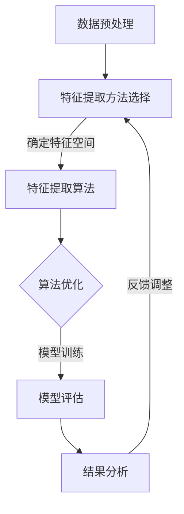

                 

## 文章标题

《数学与模式识别：特征提取的数学技术》

> 关键词：特征提取、数学技术、模式识别、线性判别分析、主成分分析、核方法、深度学习

> 摘要：本文从数学与模式识别的交叉视角，深入探讨了特征提取的数学技术。文章首先介绍了数学与模式识别的基础理论，然后详细阐述了特征提取的基本理论、线性特征提取技术和非线性特征提取技术。此外，文章还通过实验与案例分析，展示了特征提取技术在实际项目中的应用，并对未来发展趋势进行了展望。

## 第一部分：数学与模式识别基础

### 第1章：数学与模式识别概述

#### 1.1 数学基础

**1.1.1 线性代数回顾**

线性代数是数学中一个重要的分支，主要研究向量空间、线性变换、矩阵理论等。以下简要回顾几个关键概念：

- **向量空间（Vector Space）**：向量空间是一组向量的集合，这些向量满足加法和数乘运算。向量空间中的向量可以表示为坐标形式，例如：
  $$ \vec{v} = (v_1, v_2, ..., v_n) $$
  其中 $v_i$ 是第 $i$ 个分量。

- **线性变换（Linear Transformation）**：线性变换是一个将向量空间中的一个向量映射到另一个向量空间的函数。线性变换可以表示为矩阵乘法：
  $$ \vec{w} = A\vec{v} $$
  其中 $A$ 是线性变换的矩阵，$\vec{v}$ 和 $\vec{w}$ 分别是输入和输出向量。

- **矩阵（Matrix）**：矩阵是一个二维数组，由行和列组成。矩阵运算包括加法、乘法、逆运算等。矩阵乘法具有以下性质：
  $$ (A+B)C = AC + BC $$
  $$ A(BC) = (AB)C $$
  $$ (A+B)^T = A^T + B^T $$
  $$ (AB)^T = B^T A^T $$

**1.1.2 概率论基础**

概率论是研究随机事件及其概率分布的数学分支。以下介绍几个基本概念：

- **概率（Probability）**：概率是描述随机事件发生可能性的一种度量。常用概率值介于 0 和 1 之间，表示事件发生的可能性。例如，事件 A 的概率可以表示为：
  $$ P(A) = \frac{\text{事件 A 发生的次数}}{\text{总次数}} $$

- **条件概率（Conditional Probability）**：条件概率是指在某个事件已经发生的条件下，另一个事件发生的概率。条件概率的公式为：
  $$ P(A|B) = \frac{P(A \cap B)}{P(B)} $$
  其中 $P(A \cap B)$ 表示事件 A 和事件 B 同时发生的概率。

- **贝叶斯定理（Bayes' Theorem）**：贝叶斯定理是一种用于计算条件概率的公式，其表达式为：
  $$ P(A|B) = \frac{P(B|A)P(A)}{P(B)} $$
  该公式可以帮助我们根据已知条件概率和总概率，求解后验概率。

**1.1.3 统计学基本概念**

统计学是研究数据收集、处理、分析和解释的数学分支。以下介绍几个基本概念：

- **随机变量（Random Variable）**：随机变量是一个取值不确定的变量，其取值由随机实验的结果决定。随机变量可以表示为函数：
  $$ X = g(\Omega) $$
  其中 $\Omega$ 是随机实验的结果空间，$g$ 是一个映射函数。

- **概率分布（Probability Distribution）**：概率分布是描述随机变量取值概率的函数。常见的概率分布有离散分布和连续分布。例如，二项分布、正态分布等。

- **期望（Expected Value）**：期望是一个随机变量的平均值，表示随机变量可能取到的值。期望的计算公式为：
  $$ E(X) = \sum_{i=1}^{n} x_i P(X = x_i) $$
  其中 $x_i$ 是随机变量 $X$ 的取值，$P(X = x_i)$ 是对应取值的概率。

#### 1.2 模式识别基础

**1.2.1 模式识别的定义与发展历程**

模式识别是一种通过计算机模拟人类识别和理解外界信息的过程。模式识别的定义可以概括为：利用计算机技术，从大量数据中提取有用的信息，对未知模式进行分类、识别和解释。模式识别的发展历程可以分为以下几个阶段：

- **初级阶段（1950s-1960s）**：主要采用规则系统进行模式识别。

- **发展阶段（1970s-1980s）**：引入了统计模式识别、结构模式识别和模糊模式识别等理论，推动了模式识别技术的发展。

- **成熟阶段（1990s-2000s）**：随着计算机硬件和算法的进步，模式识别技术逐渐应用于各个领域，如图像识别、语音识别、生物识别等。

- **当前阶段（2010s-至今）**：深度学习等人工智能技术的快速发展，为模式识别提供了更强大的工具和方法。

**1.2.2 模式识别的应用领域**

模式识别广泛应用于各个领域，以下是几个主要的应用领域：

- **图像识别**：通过对图像进行分析和处理，实现对物体、场景的识别和分类。

- **语音识别**：将语音信号转换为文本或命令，实现人机交互。

- **生物识别**：通过分析人脸、指纹、虹膜等生物特征，实现对个体的识别和身份验证。

- **医学诊断**：利用模式识别技术对医学图像进行分析，辅助医生进行疾病诊断。

- **金融风控**：通过对金融数据进行分析，识别潜在的风险和异常行为。

**1.2.3 模式识别的基本流程**

模式识别的基本流程可以分为以下几个步骤：

1. **数据采集**：收集与模式识别任务相关的数据，如图像、语音、文本等。

2. **数据预处理**：对采集到的数据进行清洗、归一化、特征提取等处理，以提高数据质量和识别效果。

3. **特征提取**：从预处理后的数据中提取具有区分性的特征，用于后续的分类和识别。

4. **模型训练**：利用已标记的数据，训练分类器或识别模型，使其能够对未知数据进行分类或识别。

5. **模型评估**：对训练好的模型进行评估，包括准确率、召回率、F1 值等指标。

6. **模型应用**：将训练好的模型应用于实际场景，实现对未知数据的分类或识别。

### 第2章：特征提取的基本理论

#### 2.1 特征提取的重要性

特征提取是模式识别中至关重要的一个环节，其主要任务是从原始数据中提取出具有区分性的特征，用于后续的分类和识别。特征提取的重要性体现在以下几个方面：

1. **降低数据维度**：原始数据通常具有很高的维度，直接使用会导致计算量和存储需求增大。特征提取可以降低数据维度，提高计算效率。

2. **提高识别效果**：特征提取可以提取出具有区分性的特征，有助于提高分类和识别的准确率。

3. **增强模型泛化能力**：特征提取可以帮助模型更好地学习数据中的潜在规律，提高模型的泛化能力。

4. **减少噪声影响**：特征提取可以过滤掉原始数据中的噪声，提高模型对噪声的鲁棒性。

#### 2.2 特征提取的概念与意义

**概念**：

特征提取（Feature Extraction）是从原始数据中提取出具有区分性的特征的过程。特征可以看作是数据的一个线性或非线性变换，其目的是降低数据维度，同时保留数据中的关键信息。

**意义**：

1. **提高模型性能**：特征提取可以帮助模型更好地学习数据中的潜在规律，从而提高模型性能。

2. **降低计算复杂度**：通过特征提取，可以降低数据维度，减少计算量和存储需求。

3. **增强数据可视化**：特征提取可以将高维数据转换为低维数据，使其更易于可视化，有助于分析数据。

4. **促进知识发现**：特征提取可以帮助发现数据中的潜在模式，为知识发现提供支持。

#### 2.3 特征提取的影响因素

特征提取的效果受到多个因素的影响，以下列举几个关键因素：

1. **数据类型**：不同类型的数据特征提取方法有所不同，如图像数据通常采用视觉特征提取方法，文本数据则采用词袋模型等。

2. **数据质量**：数据质量直接影响特征提取的效果。噪声、缺失值等都会对特征提取产生不利影响。

3. **特征选择**：特征选择是特征提取过程中的一个关键步骤，选择合适的特征可以显著提高模型性能。

4. **特征变换**：特征提取通常涉及特征变换，如正交变换、非线性变换等，这些变换会影响特征提取的效果。

5. **算法选择**：不同的特征提取算法适用于不同类型的数据，选择合适的算法可以提高特征提取效果。

#### 2.4 特征空间的构建

**特征空间（Feature Space）**是指由特征向量组成的向量空间。特征空间的构建是特征提取过程中的重要环节，以下介绍几个关键概念和构建方法：

1. **特征空间的定义**：

特征空间是一个由特征向量组成的向量空间，每个特征向量表示一个样本的特征。特征空间可以是高维的，但在特征提取过程中，通常需要将高维特征空间降维到低维空间。

2. **特征空间的选择标准**：

- **线性可分性**：特征空间应具有线性可分性，以便使用线性分类器进行分类。

- **类内紧凑性**：特征空间应使同类样本紧密分布，异类样本分散。

- **数据压缩性**：特征空间应具有较好的数据压缩性，以降低计算复杂度。

3. **特征空间的构建方法**：

- **线性变换**：使用线性变换将原始数据映射到特征空间。常见的线性变换方法有主成分分析（PCA）、线性判别分析（LDA）等。

- **非线性变换**：使用非线性变换将原始数据映射到特征空间。常见的非线性变换方法有核方法、深度学习等。

- **组合特征空间**：将多个特征空间组合成一个高维特征空间。组合特征空间可以结合不同特征空间的优点，提高特征提取效果。

### 第3章：线性特征提取技术

线性特征提取技术是特征提取领域中的一种重要方法，通过线性变换将原始数据映射到新的特征空间，以达到降维、增强分类效果等目的。本章将介绍两种常用的线性特征提取技术：线性判别分析（Linear Discriminant Analysis，LDA）和主成分分析（Principal Component Analysis，PCA）。

#### 3.1 线性判别分析（LDA）

**3.1.1 LDA的基本原理**

线性判别分析（LDA）是一种用于特征提取和降维的线性方法，其目标是找到一组最优特征向量，使得同类样本在该特征向量上的投影尽可能紧凑，而异类样本的投影尽可能分散。LDA的数学模型如下：

假设我们有 $n$ 个特征，$d$ 个类别，$K$ 个样本，每个样本 $x_i$ 可以表示为 $d$ 维向量。LDA的目标是最小化以下目标函数：

$$ J = \sum_{i=1}^{K} \sum_{j=1}^{d} (x_{ij} - \mu_{ij})^2 $$

其中，$\mu_{ij}$ 是第 $i$ 个类别在第 $j$ 个特征上的均值。

**3.1.2 LDA的数学模型**

LDA的数学模型可以表示为：

$$ \min_{W} J(W) = \sum_{i=1}^{K} \sum_{j=1}^{d} (x_{ij} - \mu_{ij})^2 $$

其中，$W$ 是权重矩阵，表示特征向量。为了简化计算，可以使用拉格朗日乘子法求解，得到LDA的权重矩阵：

$$ W = \arg\min_{W} J(W) = \arg\min_{W} \sum_{i=1}^{K} \sum_{j=1}^{d} (x_{ij} - \mu_{ij})^2 + \lambda \sum_{i=1}^{K} \sum_{j=1}^{d} W_{ij}^2 $$

其中，$\lambda$ 是正则化参数，用于控制权重矩阵的大小。

**3.1.3 LDA的应用**

LDA在多个领域有广泛的应用，以下是几个典型的应用场景：

1. **特征降维**：LDA可以将高维特征降维到低维特征，减少计算复杂度，同时保留主要的信息。

2. **分类**：LDA可以帮助分类器更好地分类同类样本和异类样本。

3. **数据可视化**：LDA可以将高维数据投影到二维或三维空间，使其更易于可视化。

#### 3.2 主成分分析（PCA）

**3.2.1 PCA的基本原理**

主成分分析（PCA）是一种常用的线性降维方法，其目标是找到一组最优特征向量，使得同类样本在该特征向量上的投影尽可能紧凑，而异类样本的投影尽可能分散。PCA的数学模型如下：

假设我们有 $n$ 个特征，$d$ 个类别，$K$ 个样本，每个样本 $x_i$ 可以表示为 $d$ 维向量。PCA的目标是最小化以下目标函数：

$$ J = \sum_{i=1}^{K} \sum_{j=1}^{d} (x_{ij} - \mu_{ij})^2 $$

其中，$\mu_{ij}$ 是第 $i$ 个类别在第 $j$ 个特征上的均值。

**3.2.2 PCA的数学模型**

PCA的数学模型可以表示为：

$$ \min_{V} J(V) = \sum_{i=1}^{K} \sum_{j=1}^{d} (x_{ij} - \mu_{ij})^2 $$

其中，$V$ 是权重矩阵，表示特征向量。为了简化计算，可以使用拉格朗日乘子法求解，得到PCA的权重矩阵：

$$ V = \arg\min_{V} J(V) = \arg\min_{V} \sum_{i=1}^{K} \sum_{j=1}^{d} (x_{ij} - \mu_{ij})^2 + \lambda \sum_{i=1}^{K} \sum_{j=1}^{d} V_{ij}^2 $$

其中，$\lambda$ 是正则化参数，用于控制权重矩阵的大小。

**3.2.3 PCA的应用**

PCA在多个领域有广泛的应用，以下是几个典型的应用场景：

1. **特征降维**：PCA可以将高维特征降维到低维特征，减少计算复杂度，同时保留主要的信息。

2. **数据可视化**：PCA可以将高维数据投影到二维或三维空间，使其更易于可视化。

3. **异常检测**：PCA可以用于检测数据中的异常值，因为异常值通常具有不同的特征分布。

4. **噪声过滤**：PCA可以去除数据中的噪声，提高特征提取效果。

### 第二部分：非线性特征提取技术

#### 第4章：核方法与核特征提取

非线性特征提取技术是在线性特征提取技术的基础上发展起来的，通过引入非线性变换来提高特征提取的效果。核方法（Kernel Method）是非线性特征提取的一种重要方法，本章将介绍核方法的基础知识、核函数的选择、核映射技巧以及核主成分分析（Kernel PCA，KPCA）。

#### 4.1 核方法基础

**4.1.1 核方法的定义**

核方法是一种将原始数据映射到高维特征空间的非线性特征提取方法。在核方法中，原始数据经过非线性变换后，映射到高维特征空间，从而实现非线性特征提取。核方法的数学模型可以表示为：

$$ f(x) = \sum_{i=1}^{n} \alpha_i k(x, x_i) + b $$

其中，$f(x)$ 是映射后的特征向量，$x$ 是原始数据，$k(x, x_i)$ 是核函数，$\alpha_i$ 和 $b$ 是参数。

**4.1.2 核函数的选择**

核函数是核方法的核心组成部分，其选择对特征提取效果有重要影响。常见的核函数包括：

1. **多项式核（Polynomial Kernel）**：

多项式核的定义为：

$$ k(x, x_i) = (\gamma \cdot x \cdot x_i + 1)^p $$

其中，$\gamma$ 和 $p$ 是核函数的参数。多项式核可以模拟线性判别分析（LDA）和逻辑回归等线性模型。

2. **径向基函数核（Radial Basis Function Kernel，RBF Kernel）**：

RBF核的定义为：

$$ k(x, x_i) = \exp(-\gamma \cdot ||x - x_i||^2) $$

其中，$\gamma$ 是核函数的参数。RBF核可以模拟非线性模型，适用于高维数据。

3. ** sigmoid 核（Sigmoid Kernel）**：

sigmoid核的定义为：

$$ k(x, x_i) = \tanh(\gamma \cdot x \cdot x_i + c) $$

其中，$\gamma$ 和 $c$ 是核函数的参数。sigmoid核可以模拟非线性关系，但适用范围较窄。

**4.1.3 核映射技巧**

核映射技巧是将原始数据映射到高维特征空间，通过核函数实现非线性变换。核映射技巧的步骤如下：

1. **选择核函数**：根据数据特点和任务需求，选择合适的核函数。

2. **计算核矩阵**：计算数据点之间的核值，形成核矩阵。核矩阵是高维特征空间的内积矩阵。

3. **求解特征值和特征向量**：对核矩阵进行特征值分解，得到特征值和特征向量。特征向量即为映射后的特征向量。

4. **降维**：选取前几个特征值较大的特征向量，构成降维后的特征空间。

#### 4.2 核主成分分析（KPCA）

**4.2.1 KPCA的基本原理**

核主成分分析（KPCA）是基于核方法的特征提取技术，其原理与主成分分析（PCA）类似，但适用于非线性数据。KPCA的基本原理是将原始数据映射到高维特征空间，然后在该特征空间中进行主成分分析。KPCA的数学模型如下：

$$ F = K\Lambda^{1/2} $$

其中，$K$ 是核矩阵，$\Lambda$ 是特征值矩阵，$F$ 是映射后的特征向量矩阵。

**4.2.2 KPCA的数学模型**

KPCA的数学模型可以表示为：

$$ \min_{F} J(F) = \sum_{i=1}^{n} \sum_{j=1}^{n} (F \cdot K \cdot F - \mu_F \cdot K \cdot \mu_F)^2 $$

其中，$F$ 是映射后的特征向量矩阵，$\mu_F$ 是特征向量矩阵的均值。

为了求解KPCA，可以使用拉格朗日乘子法，得到KPCA的特征向量矩阵：

$$ F = \arg\min_{F} J(F) = \arg\min_{F} \sum_{i=1}^{n} \sum_{j=1}^{n} (F \cdot K \cdot F - \mu_F \cdot K \cdot \mu_F)^2 + \lambda \sum_{i=1}^{n} F_i^2 $$

其中，$\lambda$ 是正则化参数，用于控制特征向量的大小。

**4.2.3 KPCA的应用**

KPCA在多个领域有广泛的应用，以下是几个典型的应用场景：

1. **非线性降维**：KPCA可以将非线性数据降维到低维特征空间，降低计算复杂度。

2. **非线性分类**：KPCA可以将非线性数据映射到高维特征空间，提高分类效果。

3. **数据可视化**：KPCA可以将高维数据投影到二维或三维空间，使其更易于可视化。

4. **图像识别**：KPCA可以用于图像数据的降维和特征提取，提高图像识别效果。

### 第5章：深度学习与特征提取

深度学习是一种基于多层神经网络的特征提取方法，通过学习大量的数据，自动提取出具有区分性的特征。本章将介绍深度学习的基本概念、深度学习在特征提取中的应用以及卷积神经网络（Convolutional Neural Network，CNN）在图像和语音特征提取中的应用。

#### 5.1 深度学习概述

**5.1.1 深度学习的发展历程**

深度学习（Deep Learning）是人工智能领域的一个重要分支，其核心思想是通过多层神经网络自动提取特征。深度学习的发展历程可以分为以下几个阶段：

1. **人工神经网络（Artificial Neural Network，ANN）阶段**：20世纪50年代至80年代，ANN作为一种简单的人工神经网络模型，受到广泛关注。但由于计算能力和数据量的限制，ANN的应用受到很大限制。

2. **卷积神经网络（Convolutional Neural Network，CNN）阶段**：20世纪80年代至21世纪初，CNN作为一种特殊的神经网络模型，在图像识别领域取得显著成果。CNN通过卷积操作提取图像特征，提高了图像识别的准确率。

3. **深度神经网络（Deep Neural Network，DNN）阶段**：21世纪初至今，随着计算能力和数据量的不断提高，深度神经网络（DNN）在多个领域取得突破性进展。DNN通过多层神经网络，自动提取复杂的特征，推动了人工智能的发展。

**5.1.2 深度学习的基本结构**

深度学习的基本结构包括以下几个部分：

1. **输入层（Input Layer）**：输入层是网络的第一层，接收外部输入数据。

2. **隐藏层（Hidden Layer）**：隐藏层位于输入层和输出层之间，通过多层神经网络结构，逐步提取特征。

3. **输出层（Output Layer）**：输出层是网络的最后一层，生成最终的输出结果。

4. **激活函数（Activation Function）**：激活函数用于引入非线性特性，使神经网络具有更好的表达能力。

5. **权重和偏置（Weights and Biases）**：权重和偏置是神经网络的关键组成部分，用于调整网络参数，优化模型性能。

**5.1.3 深度学习在特征提取中的应用**

深度学习在特征提取中的应用非常广泛，以下是几个典型的应用场景：

1. **图像识别**：深度学习可以通过卷积神经网络自动提取图像特征，实现图像分类、目标检测等任务。

2. **语音识别**：深度学习可以通过循环神经网络（Recurrent Neural Network，RNN）和卷积神经网络自动提取语音特征，实现语音识别和语音合成等任务。

3. **自然语言处理**：深度学习可以通过神经网络自动提取文本特征，实现文本分类、情感分析、机器翻译等任务。

#### 5.2 卷积神经网络（CNN）在特征提取中的应用

卷积神经网络（CNN）是一种特殊的多层神经网络，通过卷积操作提取图像特征，具有较高的特征提取能力。本章将介绍CNN的基本原理、CNN在图像特征提取中的应用以及CNN在语音特征提取中的应用。

**5.2.1 CNN的基本原理**

CNN的基本原理包括以下几个部分：

1. **卷积操作（Convolution Operation）**：卷积操作是CNN的核心组成部分，通过滤波器（也称为卷积核）在图像上滑动，提取局部特征。

2. **池化操作（Pooling Operation）**：池化操作用于降低特征图的空间分辨率，减少参数数量，提高计算效率。

3. **反向传播（Backpropagation）**：反向传播是神经网络训练的核心算法，通过计算损失函数关于网络参数的梯度，不断调整网络参数，优化模型性能。

**5.2.2 CNN在图像特征提取中的应用**

CNN在图像特征提取中的应用非常广泛，以下是几个典型的应用场景：

1. **图像分类**：CNN可以通过多层卷积和池化操作，自动提取图像特征，实现图像分类任务。

2. **目标检测**：CNN可以通过卷积神经网络和目标检测算法，同时检测图像中的多个目标。

3. **图像分割**：CNN可以通过卷积神经网络，实现图像像素级别的分类，实现图像分割任务。

**5.2.3 CNN在语音特征提取中的应用**

CNN在语音特征提取中的应用主要包括以下几个方面：

1. **声音分类**：CNN可以通过卷积操作提取声音特征，实现声音分类任务，如声音情感分类、声音来源分类等。

2. **语音识别**：CNN可以通过卷积神经网络和循环神经网络，自动提取语音特征，实现语音识别任务。

3. **语音合成**：CNN可以通过卷积神经网络，实现语音合成任务，如文本到语音（Text-to-Speech，TTS）等。

### 第6章：支持向量机（SVM）与特征提取

支持向量机（Support Vector Machine，SVM）是一种广泛使用的机器学习算法，主要用于分类和回归任务。SVM的核心思想是通过找到一个最优超平面，将不同类别的数据点分离。本章将介绍SVM的基本理论、分类原理、优化算法以及SVM在特征提取中的应用。

#### 6.1 SVM基本理论

**6.1.1 SVM的数学模型**

SVM的数学模型可以表示为：

$$ \min_{\mathbf{w}, b} \frac{1}{2} ||\mathbf{w}||^2 + C \sum_{i=1}^{n} \xi_i $$

其中，$\mathbf{w}$ 是权重向量，$b$ 是偏置项，$C$ 是正则化参数，$\xi_i$ 是 slack variables。

**6.1.2 SVM的分类原理**

SVM通过寻找一个最优超平面，将不同类别的数据点分离。最优超平面满足以下条件：

1. **最大间隔**：SVM选择一个具有最大间隔的超平面，使同类样本的投影尽可能紧凑，异类样本的投影尽可能分散。

2. **松弛变量**：SVM引入松弛变量 $\xi_i$，允许部分样本点跨越超平面，但需要最小化它们的数量。

**6.1.3 SVM的优化算法**

SVM的优化算法主要采用拉格朗日乘子法求解。通过构建拉格朗日函数，得到以下优化问题：

$$ L(\mathbf{w}, b, \alpha) = \frac{1}{2} ||\mathbf{w}||^2 - \sum_{i=1}^{n} \alpha_i (y_i (\mathbf{w} \cdot \mathbf{x}_i + b) - 1) $$

其中，$\alpha_i$ 是拉格朗日乘子。为了求解优化问题，需要求解以下方程组：

$$ \begin{cases} 
\frac{\partial L}{\partial \mathbf{w}} = 0 \\
\frac{\partial L}{\partial b} = 0 \\
\frac{\partial L}{\partial \alpha_i} = 0 
\end{cases} $$

求解上述方程组，可以得到最优解 $\mathbf{w}$ 和 $b$。

#### 6.2 SVM在特征提取中的应用

**6.2.1 SVM在特征降维中的应用**

SVM可以用于特征降维，通过以下步骤实现：

1. **特征选择**：使用SVM选择对分类任务最重要的特征，提高特征降维的效果。

2. **特征投影**：将原始特征空间投影到低维空间，保留主要的信息，降低计算复杂度。

**6.2.2 SVM在特征选择中的应用**

SVM在特征选择中的应用主要包括以下步骤：

1. **特征重要性评估**：使用SVM评估特征的重要性，选择对分类任务贡献最大的特征。

2. **特征筛选**：根据特征重要性评估结果，选择重要特征，过滤掉次要特征。

**6.2.3 SVM在特征提取中的优化策略**

SVM在特征提取中的优化策略主要包括以下方面：

1. **核函数选择**：选择合适的核函数，提高特征提取的效果。常见的核函数包括线性核、多项式核、RBF核等。

2. **正则化参数调整**：调整正则化参数 $C$，平衡特征提取的准确性和泛化能力。

3. **特征预处理**：对原始数据进行预处理，如归一化、标准化等，提高SVM的特征提取效果。

### 第7章：特征提取实验与案例分析

特征提取技术在实际应用中发挥着重要作用，本章将通过实验与案例分析，展示特征提取技术在图像识别、语音识别和金融市场分析等领域的应用。本文将从实验设计、数据预处理、特征提取方法选择、实验评价指标、实际案例分析和项目小结等方面展开讨论。

#### 7.1 特征提取实验设计

特征提取实验设计是特征提取技术研究和应用的基础，合理的实验设计能够有效提高特征提取的效果。以下是特征提取实验设计的关键步骤：

1. **确定研究目标**：明确特征提取实验的目标，例如图像识别、语音识别或金融市场分析等。

2. **选择数据集**：根据研究目标，选择合适的数据集。数据集应包含足够多的样本，覆盖各种类别。

3. **数据预处理**：对数据集进行预处理，包括数据清洗、归一化、去噪等操作，以提高数据质量和特征提取效果。

4. **特征提取方法选择**：根据数据特点和任务需求，选择合适的特征提取方法。常见的特征提取方法有线性判别分析（LDA）、主成分分析（PCA）、核主成分分析（KPCA）等。

5. **模型训练与评估**：使用选定的特征提取方法训练模型，并对模型进行评估。评估指标包括准确率、召回率、F1值等。

6. **结果分析**：分析实验结果，找出特征提取方法的优势和不足，为进一步优化提供参考。

#### 7.2 数据预处理

数据预处理是特征提取实验设计中的重要环节，对数据质量有着直接的影响。以下是数据预处理的关键步骤：

1. **数据清洗**：去除数据集中的缺失值、噪声和异常值，保证数据的一致性和完整性。

2. **归一化**：将数据归一化到相同的尺度，消除不同特征之间的量纲差异，提高特征提取的效果。

3. **去噪**：去除数据中的噪声，提高数据的真实性和可靠性。常用的去噪方法包括滤波、平滑等。

4. **特征选择**：根据特征的重要性、相关性等指标，选择对分类任务贡献最大的特征，提高特征提取的效果。

#### 7.3 特征提取方法选择

特征提取方法的选择是实验设计中的关键步骤，直接影响特征提取的效果。以下是几种常见的特征提取方法：

1. **线性判别分析（LDA）**：LDA是一种线性特征提取方法，通过最大化类内散度和最小化类间散度，提取具有区分性的特征。

2. **主成分分析（PCA）**：PCA是一种线性降维方法，通过将数据投影到主成分空间，提取数据中的主要信息。

3. **核主成分分析（KPCA）**：KPCA是一种非线性特征提取方法，通过核函数将数据映射到高维特征空间，提取非线性特征。

4. **深度学习**：深度学习是一种基于多层神经网络的特征提取方法，通过训练大量的数据，自动提取复杂的特征。

根据数据特点和任务需求，可以选择合适的特征提取方法。例如，对于线性可分的数据，可以选择LDA或PCA；对于非线性数据，可以选择KPCA或深度学习。

#### 7.4 实验评价指标

实验评价指标是评估特征提取效果的重要手段，以下是几种常见的实验评价指标：

1. **准确率（Accuracy）**：准确率是分类模型预测正确的样本数占总样本数的比例，计算公式如下：

   $$ \text{准确率} = \frac{\text{预测正确的样本数}}{\text{总样本数}} $$

2. **召回率（Recall）**：召回率是分类模型预测正确的正样本数占总正样本数的比例，计算公式如下：

   $$ \text{召回率} = \frac{\text{预测正确的正样本数}}{\text{总正样本数}} $$

3. **精确率（Precision）**：精确率是分类模型预测正确的正样本数与预测为正样本的总数的比例，计算公式如下：

   $$ \text{精确率} = \frac{\text{预测正确的正样本数}}{\text{预测为正样本的总数}} $$

4. **F1值（F1-score）**：F1值是精确率和召回率的调和平均，计算公式如下：

   $$ \text{F1值} = 2 \times \frac{\text{精确率} \times \text{召回率}}{\text{精确率} + \text{召回率}} $$

根据任务需求，可以选择合适的评价指标来评估特征提取效果。例如，对于二分类任务，可以选择准确率、召回率和F1值等指标；对于多分类任务，可以选择准确率和F1值等指标。

#### 7.5 特征提取案例分析

以下是几个特征提取案例分析，分别介绍图像识别、语音识别和金融市场分析等领域的特征提取方法和应用。

**7.5.1 图像识别中的特征提取**

图像识别是计算机视觉领域的一个重要任务，特征提取是图像识别的关键步骤。以下是图像识别中常用的特征提取方法：

1. **HOG特征提取**：HOG（Histogram of Oriented Gradients）是一种基于梯度直方图的图像特征提取方法，通过计算图像中每个像素点的梯度方向和大小，生成直方图，用于图像识别。

2. **SIFT特征提取**：SIFT（Scale-Invariant Feature Transform）是一种基于尺度空间和关键点的图像特征提取方法，通过检测图像中的关键点，计算关键点的响应函数，生成特征向量，用于图像识别。

3. **CNN特征提取**：CNN（Convolutional Neural Network）是一种基于卷积神经网络的图像特征提取方法，通过训练大量的图像数据，自动提取复杂的图像特征，用于图像识别。

**7.5.2 语音识别中的特征提取**

语音识别是自然语言处理领域的一个重要任务，特征提取是语音识别的关键步骤。以下是语音识别中常用的特征提取方法：

1. **MFCC特征提取**：MFCC（Mel Frequency Cepstral Coefficients）是一种基于频谱特征的语音特征提取方法，通过将语音信号转换为频谱图，计算频谱图的梅尔频率倒谱系数，生成特征向量，用于语音识别。

2. **PLP特征提取**：PLP（Perceptual Linear Prediction）是一种基于感知线性预测的语音特征提取方法，通过计算语音信号的感知线性预测系数，生成特征向量，用于语音识别。

3. **深度学习特征提取**：深度学习是一种基于多层神经网络的特征提取方法，通过训练大量的语音数据，自动提取复杂的语音特征，用于语音识别。

**7.5.3 金融市场分析中的特征提取**

金融市场分析是金融领域的一个重要任务，特征提取是金融市场分析的关键步骤。以下是金融市场分析中常用的特征提取方法：

1. **技术指标**：技术指标是金融市场分析中常用的特征提取方法，通过计算股票价格、成交量等指标，生成特征向量，用于金融市场分析。

2. **时间序列特征**：时间序列特征是金融市场分析中常用的特征提取方法，通过分析股票价格的时间序列变化，生成特征向量，用于金融市场分析。

3. **深度学习特征提取**：深度学习是一种基于多层神经网络的特征提取方法，通过训练大量的金融市场数据，自动提取复杂的金融特征，用于金融市场分析。

#### 7.6 项目小结

通过本章的实验与案例分析，我们可以看到特征提取技术在图像识别、语音识别和金融市场分析等领域的广泛应用。以下是项目小结：

1. **特征提取方法**：介绍了多种特征提取方法，包括HOG、SIFT、CNN、MFCC、PLP等，不同方法适用于不同类型的特征提取任务。

2. **实验设计**：阐述了特征提取实验设计的关键步骤，包括确定研究目标、选择数据集、数据预处理、特征提取方法选择、模型训练与评估等。

3. **评价指标**：介绍了常用的实验评价指标，包括准确率、召回率、精确率和F1值等，用于评估特征提取效果。

4. **案例分析**：通过图像识别、语音识别和金融市场分析等领域的案例分析，展示了特征提取技术的实际应用效果。

5. **未来展望**：随着人工智能技术的发展，特征提取技术将继续发展，新的方法和技术将不断涌现，为各个领域提供更强大的特征提取能力。

### 第8章：特征提取技术的发展趋势

随着人工智能和大数据技术的快速发展，特征提取技术在各个领域的应用越来越广泛。未来，特征提取技术将继续发展，呈现出以下趋势：

#### 8.1 特征提取算法的创新

1. **深度学习特征提取**：深度学习在特征提取领域取得了显著成果，未来将会有更多基于深度学习的特征提取算法被提出。例如，自编码器（Autoencoder）、生成对抗网络（GAN）等深度学习模型有望在特征提取中发挥更大的作用。

2. **迁移学习特征提取**：迁移学习是一种利用已有模型的先验知识，提高新任务性能的方法。未来，迁移学习特征提取技术将得到广泛应用，尤其是在资源有限的情况下，迁移学习可以显著提高特征提取的效果。

3. **多模态特征提取**：随着多模态数据的增加，多模态特征提取技术将成为研究热点。多模态特征提取可以通过整合不同模态的数据，提取更丰富、更具有区分性的特征。

4. **自适应特征提取**：自适应特征提取可以根据数据特点和任务需求，动态调整特征提取方法，提高特征提取效果。例如，基于数据驱动的特征选择方法、在线特征提取技术等。

#### 8.2 特征提取技术在跨领域应用的发展

1. **医疗健康领域**：特征提取技术在医疗健康领域有广泛的应用前景。例如，利用深度学习特征提取技术进行疾病诊断、个性化治疗等。

2. **金融领域**：特征提取技术在金融领域具有重要应用价值。通过提取金融数据中的潜在特征，可以实现风险控制、市场预测等任务。

3. **工业自动化领域**：特征提取技术在工业自动化领域可以用于设备故障诊断、生产优化等任务。通过提取设备运行数据中的特征，可以实现智能监测和预测。

4. **智能交通领域**：特征提取技术在智能交通领域可以用于交通流量预测、车辆检测等任务。通过提取交通数据中的特征，可以优化交通管理和提高交通效率。

#### 8.3 特征提取技术对人工智能发展的贡献

1. **提高模型性能**：特征提取技术可以提取出具有区分性的特征，提高分类、识别等任务的性能。通过特征提取，可以有效降低模型复杂度，提高计算效率。

2. **促进知识发现**：特征提取可以帮助发现数据中的潜在模式，促进知识发现。例如，在图像识别任务中，特征提取可以帮助发现图像中的关键特征，实现更准确的识别。

3. **推动跨学科研究**：特征提取技术涉及到多个学科，如数学、统计学、计算机科学等。跨学科研究可以推动特征提取技术的创新和发展，为人工智能领域带来更多突破。

4. **实现更智能的决策**：特征提取技术可以为智能决策系统提供强有力的支持。通过提取数据中的关键特征，可以实现更智能的决策，提高决策的准确性和效率。

总之，特征提取技术在人工智能和大数据时代具有重要地位和广阔前景。未来，特征提取技术将继续发展，为各个领域提供更强大的特征提取能力，推动人工智能技术的进步和应用。

### 第9章：附录

#### 9.1 特征提取相关工具与资源

在特征提取领域，有许多实用的工具和资源可以帮助研究人员和开发者进行研究和开发。以下是几个推荐的工具和资源：

**9.1.1 主流特征提取算法库**

1. **scikit-learn**：scikit-learn 是一个强大的机器学习库，提供了丰富的特征提取算法，包括 LDA、PCA、KPCA 等线性和非线性特征提取方法。

2. **OpenCV**：OpenCV 是一个开源的计算机视觉库，提供了丰富的图像处理和特征提取工具，包括 SIFT、HOG、SURF 等图像特征提取算法。

3. **TensorFlow**：TensorFlow 是由 Google 开发的一款开源机器学习框架，提供了丰富的深度学习工具，可以用于实现自编码器、生成对抗网络等深度学习特征提取方法。

**9.1.2 特征提取算法研究资源**

1. **学术期刊和会议**：许多学术期刊和会议专注于机器学习和计算机视觉领域，发布了许多有关特征提取的研究论文。例如，IEEE Transactions on Pattern Analysis and Machine Intelligence、International Conference on Computer Vision 等。

2. **在线课程和教程**：有许多在线课程和教程提供了有关特征提取的详细知识和实践指导。例如，Coursera 上的“深度学习”课程、Udacity 上的“计算机视觉与深度学习”课程等。

**9.1.3 特征提取技术论文推荐**

以下是一些建议阅读的论文，涵盖了特征提取技术的不同方面：

1. **“Face Recognition Based on Kernel Principal Component Analysis”**：该论文提出了一种基于核主成分分析的人脸识别方法，具有较高的识别准确率。

2. **“A Survey of Image Feature Extraction Techniques”**：该论文对图像特征提取技术进行了全面的综述，包括 HOG、SIFT、SURF 等常用的图像特征提取方法。

3. **“Deep Learning for Feature Extraction in Computer Vision”**：该论文探讨了深度学习在计算机视觉特征提取中的应用，介绍了卷积神经网络和自编码器等深度学习模型。

通过学习和应用这些工具和资源，可以更好地理解和掌握特征提取技术，为实际应用和科学研究提供支持。

#### 9.2 Mermaid 流程图：特征提取流程

下面是一个用 Mermaid 语言编写的特征提取流程图：



这个流程图展示了特征提取的主要步骤，包括数据预处理、特征提取方法选择、特征提取算法、算法优化、模型训练、模型评估和结果分析。通过这个流程图，可以清晰地了解特征提取的过程和关键步骤。

#### 9.3 核主成分分析（KPCA）伪代码

下面是一个简单的 KPCA 伪代码，用于演示核主成分分析的基本步骤：

```python
def kpca(X, k):
    # X: 输入数据，k: 目标主成分个数
    # 将数据映射到高维空间
    Phi = map_to_high_dimension(X)
    # 计算协方差矩阵
    cov_matrix = calculate_covariance_matrix(Phi)
    # 计算协方差矩阵的特征值和特征向量
    eigen_values, eigen_vectors = eig(cov_matrix)
    # 对特征向量进行排序
    sorted_eigen_vectors = sort_eigen_vectors_by_values(eigen_vectors, eigen_values)
    # 选取前 k 个特征向量
    top_k_eigen_vectors = sorted_eigen_vectors[:, :k]
    # 将原始数据映射到低维空间
    X_k = project_to_low_dimension(X, top_k_eigen_vectors)
    return X_k
```

这个伪代码展示了 KPCA 的基本步骤，包括数据映射、协方差矩阵计算、特征值和特征向量计算、特征向量排序和映射到低维空间。通过这个伪代码，可以了解 KPCA 的实现过程。在实际应用中，可以根据具体情况对伪代码进行修改和优化。

