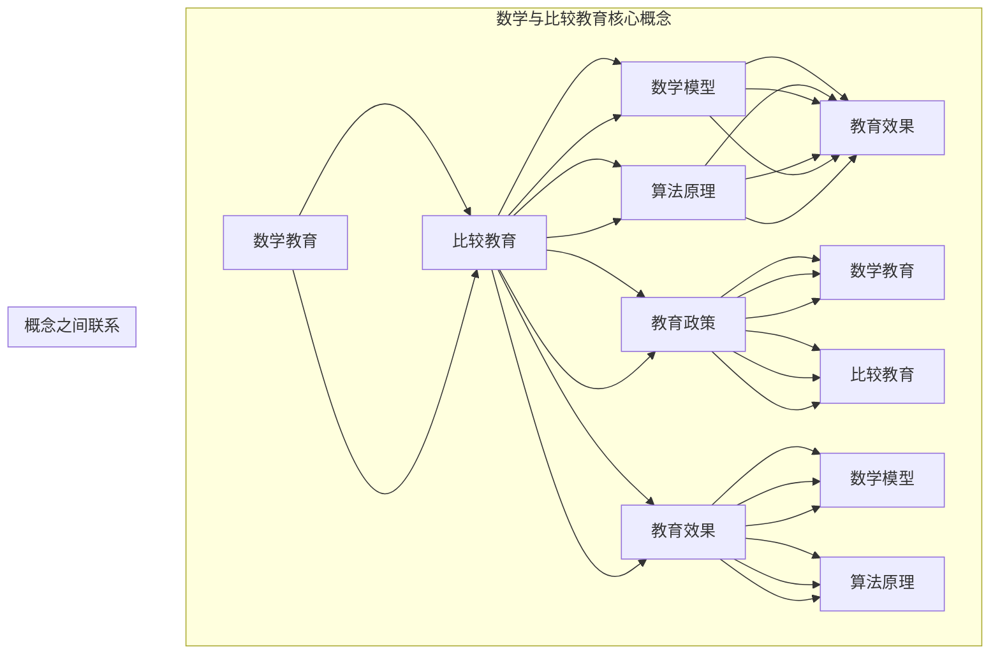
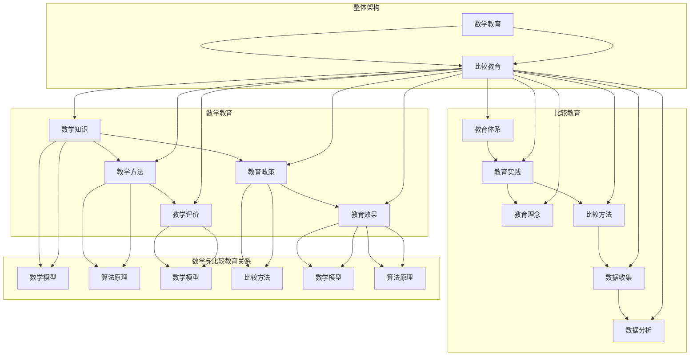
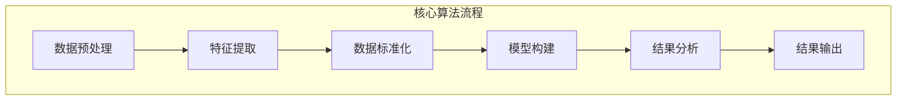

                 

### 文章标题

# 《数学与比较教育：教育系统的数学比较》

### 关键词

- 数学与教育
- 比较教育
- 教育系统
- 数学模型
- 算法原理

### 摘要

本文旨在探讨数学与比较教育之间的密切联系，通过教育系统的数学比较，揭示不同教育体系中数学教育的共性与差异。文章首先介绍了数学在教育中的应用和发展历程，以及比较教育的定义和意义。随后，文章构建了教育系统的数学比较理论框架，并详细阐述了数据收集、数据分析方法以及数学模型和公式。最后，通过一个具体的案例项目，展示了数学与比较教育在实际应用中的实践和成果。本文旨在为教育领域的学者和实践者提供有价值的参考和启示。

### 第1章 引言

#### 1.1 研究背景与意义

数学作为一门基础学科，在教育的各个阶段都扮演着至关重要的角色。数学教育不仅关系到学生的学术发展，更影响到其逻辑思维能力和问题解决能力的培养。随着全球化的加速和知识经济的兴起，不同国家和地区的教育系统在数学教育方面的差异逐渐凸显。比较教育作为一种研究方法，通过对比分析不同教育系统的特点，有助于发现优秀教育实践并借鉴推广。因此，将数学与比较教育相结合，开展教育系统的数学比较研究，具有重要的现实意义。

首先，数学与教育的关系密不可分。数学作为教育的一部分，其不仅仅是传授知识和技能，更是培养学生的逻辑思维和抽象思维能力。通过数学教育，学生能够学会如何分析和解决问题，从而为未来的学习和职业发展打下坚实的基础。其次，比较教育的兴起为研究不同教育系统的差异和共性提供了有力工具。比较教育通过对不同教育体系的对比分析，能够揭示出数学教育的成功经验和存在的问题，为改善教育质量提供参考。

#### 1.2 研究目的与内容概述

本文的研究目的是通过教育系统的数学比较，探讨不同教育体系在数学教育方面的共性与差异，并提出改进建议。具体研究内容如下：

1. **数学在教育中的应用**：介绍数学教育的发展历程，主要理论框架和研究方法，分析数学在教育不同阶段的具体应用。

2. **比较教育概述**：阐述比较教育的定义、发展历程、研究领域和方法，强调比较教育对数学教育研究的启示。

3. **教育系统的数学比较理论框架**：构建教育系统的数学比较概念模型，分析教育系统的数学比较核心要素和分类。

4. **教育系统的数学比较方法**：介绍数据收集和分析方法，详细描述数学教育水平的国际比较和案例分析。

5. **数学与比较教育的核心概念原理架构**：通过Mermaid流程图展示数学与比较教育的核心概念和联系，为后续研究提供理论基础。

6. **教育系统的数学比较核心算法原理讲解**：介绍核心算法的基本概念、类型和应用领域，使用伪代码详细阐述算法原理。

7. **数学模型与数学公式讲解**：解释数学模型的基本概念和应用，详细讲解常用数学公式及其在教育系统中的运用。

8. **教育系统的数学比较项目实战**：通过实际案例展示教育系统的数学比较项目的开发环境搭建、代码实现和结果分析。

9. **结论与展望**：总结研究成果，提出未来研究方向和重点领域，为数学与比较教育研究提供方向。

通过上述研究内容的深入探讨，本文旨在为教育领域的学者和实践者提供有价值的参考，推动数学与比较教育研究的进一步发展。

### 第2章 数学与比较教育基础

#### 2.1 数学在教育中的应用

数学作为教育的一部分，不仅在各个学习阶段发挥着基础性的作用，而且对于培养学生的逻辑思维、抽象能力和问题解决能力具有重要意义。数学教育的发展历程可以追溯到古代，但随着时间的推移，数学教育的内容、方法和目标也在不断演变。

在基础教育阶段，数学教育的主要目标是帮助学生建立基本的数学概念和运算能力。这一阶段的教学内容通常包括数与代数、图形与几何、数据分析与概率等基本领域。教学方法强调直观性、操作性和互动性，通过实物操作、模型构建和游戏活动等方式，使学生能够在实际情境中理解数学概念和运算规则。

随着学生年龄的增长，数学教育逐渐向高级阶段发展。在中学阶段，数学教育的重点在于培养学生的逻辑思维和抽象能力，教学内容涉及函数、方程、不等式、概率统计、立体几何等领域。教学方法更加注重理论知识的传授和数学思想的培养，通过概念解析、问题解决和数学竞赛等方式，激发学生对数学的兴趣和潜能。

在高等教育阶段，数学教育不仅仅是专业学生的必修课，更是非数学专业学生的重要选修课。这一阶段的数学教育目标在于培养学生的数学素养和独立思考能力，教学内容涵盖数学分析、线性代数、概率论与数理统计、微分方程等领域。教学方法强调学术性、系统性和研究性，通过学术讲座、研究论文和数学建模等方式，培养学生的数学研究能力和创新精神。

#### 2.1.1 数学教育的发展历程

数学教育的发展历程可以分为几个阶段，每个阶段都有其独特的特点和发展方向。

1. **古代数学教育**：古代数学教育以实用主义为核心，主要教授日常生活中的数学知识和技能。中国古代的算术教育、古希腊的几何教育以及阿拉伯世界的代数教育，都是古代数学教育的代表。

2. **近代数学教育**：随着科学革命的到来，数学教育逐渐从实用主义转向科学主义，更加注重理论知识的传授和数学方法的培养。牛顿-莱布尼茨的微积分理论、欧几里得的几何原理等成为近代数学教育的重要内容。

3. **现代数学教育**：20世纪以来，数学教育逐渐注重学生的个体差异和多样化需求。现代数学教育强调数学思想的普及和数学能力的培养，教学内容和教学方法都更加灵活和多样化。数学教育开始关注跨学科融合、问题解决和数学文化等方面。

#### 2.1.2 数学教育的主要理论框架

数学教育的主要理论框架包括建构主义、认知发展理论、多元智能理论等。

1. **建构主义**：建构主义认为，学习是一个主动建构的过程，学生通过自主探索、实验和反思，主动构建自己的知识体系。在数学教育中，建构主义强调学生的主体地位，提倡自主学习和探究学习。

2. **认知发展理论**：认知发展理论认为，学习是一个动态的过程，学生的认知能力随着经验的积累而不断发展。数学教育中，认知发展理论强调教学设计应适应学生的认知水平，通过适当的引导和挑战，促进学生的认知发展。

3. **多元智能理论**：多元智能理论认为，每个学生都有不同的智能优势，数学教育应关注学生的个体差异，通过多样化的教学方法和评价方式，激发学生的学习兴趣和潜能。

#### 2.1.3 数学教育的研究方法

数学教育的研究方法主要包括定量研究和定性研究。

1. **定量研究**：定量研究通过数据的收集和分析，对数学教育现象进行量化描述和解释。常用的定量研究方法包括调查问卷、测试数据分析和统计模型等。

2. **定性研究**：定性研究通过深入访谈、观察和案例研究等方法，对数学教育现象进行深入理解和解释。定性研究注重细节和过程，强调情境和背景的重要性。

通过数学与比较教育基础部分的介绍，我们了解了数学教育的发展历程、主要理论框架和研究方法。这些知识为我们进一步探讨教育系统的数学比较提供了坚实的基础。

#### 2.2 比较教育概述

比较教育作为一种研究方法，旨在通过对比不同教育系统、教育实践和教育理念，揭示教育现象的差异和共性，从而为教育改革和发展提供理论依据和实践指导。比较教育具有悠久的历史和广泛的应用领域，对于理解全球教育体系和促进国际教育合作具有重要意义。

##### 2.2.1 比较教育的定义与发展

比较教育的定义可以从不同的角度进行理解。狭义的比较教育主要指对各国教育制度和教育实践的对比研究，而广义的比较教育则涵盖了对教育系统的各个层面进行对比分析，包括教育目标、课程设计、教学方法、教育评价等多个方面。

比较教育的历史可以追溯到19世纪末20世纪初，当时随着全球化和现代化的进程，各国教育系统的差异和共性逐渐成为学者们关注的问题。瑞士教育学家裴斯泰洛齐和福禄培尔是最早进行教育比较研究的学者之一。20世纪初，美国学者康奈尔·纽曼（Cornelius N. Neumann）发表了《比较教育》一书，标志着比较教育作为一个独立学科的诞生。

在发展过程中，比较教育经历了多个阶段。早期比较教育主要关注教育体系的宏观对比，如教育制度、教育经费和教育政策等。随着研究的深入，比较教育逐渐转向微观层面，探讨教育实践和教学方法的具体差异。20世纪中期，随着全球化进程的加速，比较教育开始关注国际教育合作和教育援助问题。近年来，比较教育研究逐渐转向跨学科融合，探讨教育与社会经济、文化发展的关系。

##### 2.2.2 比较教育的研究领域与方法

比较教育的研究领域非常广泛，涵盖了教育系统的各个方面。主要研究领域包括：

1. **教育制度与政策**：研究不同国家的教育制度和政策差异，分析其对社会经济发展的影响。
2. **课程与教学**：对比不同国家的课程设计、教学内容和教学方法，探讨优秀教育实践的经验和启示。
3. **教师教育**：研究教师培养和职业发展方面的差异，探讨提高教师质量和专业发展策略。
4. **学生发展**：关注学生的教育经历、学业成绩和综合素质发展，分析教育对个体成长的影响。
5. **教育公平与平等**：探讨教育机会的不平等现象，分析社会背景、经济状况和文化因素对教育公平的影响。
6. **国际教育合作**：研究国际教育合作项目、教育援助和跨国教育体系的合作模式。

比较教育的研究方法多种多样，主要包括以下几种：

1. **文献研究**：通过查阅和分析相关文献，了解不同教育体系的背景、理论和实践。
2. **案例研究**：选择具体的教育案例进行深入分析，探讨案例中的成功经验和存在的问题。
3. **调查问卷**：设计问卷进行大规模调查，收集关于教育现象的数据，进行分析和统计。
4. **实地考察**：通过实地调研和观察，深入了解教育系统的实际情况，收集第一手资料。
5. **比较研究**：选取两个或多个教育体系进行对比分析，揭示其差异和共性。

##### 2.2.3 比较教育的意义与价值

比较教育的意义和价值主要体现在以下几个方面：

1. **促进教育改革**：通过对比分析不同教育体系的优点和不足，为教育改革提供理论依据和实践指导。比较教育研究可以帮助教育政策制定者了解国际教育发展动态，借鉴优秀教育实践，推动教育制度的创新和改进。

2. **提高教育质量**：比较教育研究有助于发现优秀教育实践，推广先进教学方法，提高教育质量。通过比较研究，教育工作者可以借鉴国内外成功教育经验，优化课程设计、教学方法和教育评价体系，提高学生的学习效果和综合素质。

3. **促进国际教育合作**：比较教育研究有助于促进国际教育合作和学术交流，推动全球教育一体化。通过比较教育研究，各国教育机构和学者可以分享教育资源和研究成果，共同应对全球教育挑战，促进教育公平和发展。

4. **丰富教育理论**：比较教育研究为教育理论的发展提供了丰富的实证数据和理论资源。通过比较分析不同教育体系的实践和理论，可以深化对教育本质和规律的理解，推动教育理论的创新和发展。

总之，比较教育作为一种重要的研究方法，对教育改革、教育发展和教育理论的发展都具有重要意义。通过比较教育研究，我们可以更好地理解不同教育体系的共性与差异，为全球教育合作和发展提供理论支持和实践指导。

### 第3章 教育系统的数学比较理论框架

在探讨教育系统的数学比较时，构建一个科学合理的理论框架是至关重要的。这一框架不仅为我们提供了分析教育系统数学教育差异的基本工具，还为我们理解和解释不同教育体系中数学教育的共性提供了理论依据。

#### 3.1 教育系统的数学比较概念

教育系统的数学比较概念是指在不同教育体系中对数学教育的内容、方法、目标和效果进行比较和分析。具体来说，教育系统的数学比较包括以下几个核心要素：

1. **数学教育内容**：不同教育体系中数学教育涵盖的知识领域和课程设置。这包括数学知识的深度和广度，如代数、几何、微积分等。

2. **数学教学方法**：不同教育体系中采用的数学教学策略和教学方法。这包括课堂教学模式、教师的教学风格、学生的参与度等。

3. **数学教育目标**：不同教育体系中数学教育的预期目标和教学目标。这包括学生应掌握的数学技能、逻辑思维能力、问题解决能力等。

4. **数学教育效果**：不同教育体系中数学教育的实际效果和学生的学业成绩。这包括学生在数学考试中的表现、实际应用数学知识解决实际问题的能力等。

#### 3.1.1 教育系统的数学比较的定义

教育系统的数学比较可以定义为对多个教育体系中数学教育的内容、方法、目标和效果进行系统、科学和全面的对比分析。其目的是通过揭示不同教育体系在数学教育方面的共性和差异，为教育改革和优化提供理论支持和实践指导。

#### 3.1.2 教育系统的数学比较的核心要素

教育系统的数学比较涉及多个核心要素，这些要素共同构成了数学比较的基础。具体来说，核心要素包括：

1. **数学知识体系**：不同教育体系中数学知识的结构、内容和层次。

2. **教学方法与策略**：不同教育体系中采用的数学教学方法和教学策略，包括课堂教学、在线教学、实验学习等。

3. **教学评价体系**：不同教育体系中数学教育的评价方法和标准，包括考试、作业、课堂参与等。

4. **教师素质**：不同教育体系中教师的数学素养、教学能力和专业发展水平。

5. **学生学习情况**：不同教育体系中学生的学习态度、学习习惯、学业成绩和学习效果。

#### 3.1.3 教育系统的数学比较的分类

教育系统的数学比较可以根据不同的维度进行分类。以下是几种常见的分类方法：

1. **按教育阶段分类**：不同教育阶段（如小学、中学、大学）的数学教育比较。

2. **按地区分类**：不同国家和地区的数学教育比较，如发达国家与发展中国家、城市与农村地区的数学教育比较。

3. **按教育类型分类**：不同类型的教育（如公立学校、私立学校、国际学校）的数学教育比较。

4. **按数学教育目标分类**：根据数学教育的不同目标（如基础知识掌握、创新能力培养、实际应用能力培养）进行的比较。

通过以上分类，我们可以更清晰地理解不同教育体系在数学教育方面的特点和差异，从而为改进数学教育提供有针对性的建议。

#### 3.2 教育系统的数学比较理论模型

为了系统地分析教育系统的数学比较，我们可以构建一个理论模型。这个模型不仅帮助我们理解数学比较的核心概念，还为我们提供了一种分析框架，以便更深入地探讨不同教育体系在数学教育方面的差异和共性。

##### 3.2.1 教育系统的数学比较的基本原理

教育系统的数学比较遵循以下几个基本原理：

1. **系统性原理**：数学比较应从系统整体出发，综合考虑数学教育的各个方面，而不是孤立地看待某一具体问题。

2. **可比性原理**：不同教育体系的数学比较需要在可比的基础上进行。为了确保比较的准确性，我们应选择具有可比性的指标和维度。

3. **动态性原理**：数学比较应考虑到教育系统的动态变化，如教育政策的调整、教育技术的革新等。

4. **文化适应性原理**：数学比较应考虑到不同文化背景下教育系统的特点和需求，避免将一种教育体系的标准强加于其他体系。

##### 3.2.2 教育系统的数学比较的理论模型

教育系统的数学比较理论模型可以表示为一个多维结构，包括以下几个主要模块：

1. **数学教育内容模块**：这个模块描述了不同教育体系中数学教育的内容和课程设置，包括数学知识的深度和广度。

2. **教学方法与策略模块**：这个模块描述了不同教育体系中采用的数学教学方法和策略，包括课堂教学模式、教师的教学风格和学生的学习方式。

3. **教学评价体系模块**：这个模块描述了不同教育体系中数学教育的评价方法和标准，包括考试、作业、课堂参与等评价方式。

4. **教师素质模块**：这个模块描述了不同教育体系中教师的数学素养、教学能力和专业发展水平。

5. **学生学习情况模块**：这个模块描述了不同教育体系中学生的学习态度、学习习惯、学业成绩和学习效果。

6. **比较分析模块**：这个模块用于对上述各模块进行比较分析，揭示不同教育体系在数学教育方面的共性和差异。

通过这个理论模型，我们可以系统地分析不同教育体系在数学教育方面的差异和共性，从而为教育改革提供理论依据和实践指导。

##### 3.2.3 教育系统的数学比较的理论框架

教育系统的数学比较理论框架包括以下几个层次：

1. **概念层次**：明确数学比较的概念，包括数学教育内容、教学方法与策略、教学评价体系、教师素质、学生学习情况等核心要素。

2. **理论层次**：构建数学比较的理论基础，包括系统性原理、可比性原理、动态性原理和文化适应性原理等。

3. **方法层次**：提供数学比较的具体方法，包括数据收集、数据分析、比较分析等。

4. **应用层次**：将数学比较理论应用于实际教育系统中，通过案例研究和实证分析，揭示不同教育体系在数学教育方面的差异和共性。

通过这个理论框架，我们可以更深入地理解教育系统的数学比较，为教育改革和优化提供科学指导。

综上所述，教育系统的数学比较理论框架为我们提供了一个全面的分析工具，通过系统、科学和全面地比较不同教育体系在数学教育方面的差异和共性，为教育改革和优化提供了理论基础和实践指导。

### 第4章 教育系统的数学比较方法

为了有效地进行教育系统的数学比较，我们需要采用科学严谨的方法，确保比较的准确性和可靠性。这一章节将详细介绍教育系统的数学比较方法，包括数据收集方法、数据分析方法和教育系统的数学比较结果分析。

#### 4.1 数据收集方法

数据收集是数学比较研究的基础，只有收集到全面、准确的数据，才能进行有效的分析和比较。以下是常用的数据收集方法：

##### 4.1.1 数据来源

1. **官方统计数据**：许多国家教育部门都会定期发布教育统计数据，包括入学率、毕业率、教师数量、教育经费等。这些数据可以从国家教育部门官方网站、国际教育组织（如联合国教科文组织、经济合作与发展组织）获得。

2. **学术文献**：通过查阅相关学术文献，可以获得有关数学教育的研究成果和比较分析数据。学术数据库如Web of Science、Google Scholar等是获取学术文献的重要来源。

3. **调查问卷**：设计调查问卷，通过问卷调查获取大量一手数据。问卷可以针对教师、学生、家长等不同群体，收集他们在数学教育方面的看法和经验。

4. **实地考察**：通过实地考察，深入了解教育系统的实际情况，收集第一手资料。实地考察可以包括课堂观察、教师访谈、学生访谈等。

##### 4.1.2 数据类型

1. **定量数据**：包括统计数字、考试成绩、调查问卷结果等。定量数据可以通过数学方法进行统计分析，揭示教育系统在数学教育方面的特征和趋势。

2. **定性数据**：包括访谈记录、观察笔记、文献分析等。定性数据可以通过内容分析、主题分析等方法，深入理解教育系统在数学教育方面的具体情况和背景。

##### 4.1.3 数据收集的方法与技术

1. **问卷调查法**：设计科学的问卷，通过线上或线下方式收集大量数据。问卷设计应确保问题的清晰性、逻辑性和针对性，以提高数据的可靠性。

2. **文献分析法**：查阅相关文献，分析数学教育的研究成果和比较分析数据。文献分析应注重文献的来源、质量和代表性，以确保数据的可信度。

3. **实地考察法**：通过实地考察，获取教育系统的第一手资料。实地考察应注重观察的客观性和记录的准确性，以确保数据的真实性。

4. **数据分析技术**：使用统计软件（如SPSS、R语言等）对收集到的数据进行处理和分析。数据分析技术包括描述性统计、探索性数据分析、验证性数据分析等，以揭示教育系统在数学教育方面的特征和趋势。

#### 4.2 数据分析方法

数据分析是教育系统数学比较的核心环节，通过对收集到的数据进行分析，我们可以揭示教育系统在数学教育方面的共性和差异。以下是常用的数据分析方法：

##### 4.2.1 描述性统计分析

描述性统计分析是对数据的基本描述，包括数据的平均值、中位数、标准差等统计量。描述性统计分析可以揭示教育系统在数学教育方面的基本特征，如学生的平均成绩、教师的教学时长等。

##### 4.2.2 探索性数据分析

探索性数据分析是对数据分布、趋势和关系的初步分析，包括散点图、箱线图、相关性分析等。探索性数据分析可以帮助我们发现数据中的异常值、趋势和相关性，为进一步分析提供线索。

##### 4.2.3 验证性数据分析

验证性数据分析是基于假设的统计分析，包括t检验、方差分析、回归分析等。验证性数据分析可以验证研究假设，揭示教育系统在数学教育方面的显著差异和关系。

#### 4.3 教育系统的数学比较结果分析

通过数据收集和数据分析，我们可以得到教育系统在数学教育方面的比较结果。以下是对这些结果的详细分析：

##### 4.3.1 数学教育水平的国际比较

通过对不同国家教育系统的数学教育水平进行比较，我们可以发现不同国家在数学教育方面的差异和共性。例如，一些发达国家在数学教育质量、学生成绩和教师素质方面表现出较高水平，而一些发展中国家则存在一定的差距。国际比较结果可以为教育政策制定者提供借鉴和参考，推动教育改革和优化。

##### 4.3.2 教育系统的数学比较案例分析

通过具体案例的分析，我们可以深入了解不同教育系统在数学教育方面的具体做法和效果。例如，分析某国教育系统在数学课程设计、教学方法、教学评价等方面的成功经验和不足，为其他教育系统提供借鉴和启示。

##### 4.3.3 教育系统的数学比较结果讨论

在结果讨论中，我们需要综合分析数学教育比较的结果，探讨不同教育系统在数学教育方面的共性和差异。例如，讨论教育政策、文化背景、经济发展水平等因素对数学教育的影响，为教育改革和优化提供科学依据。

通过以上数据收集、数据分析和结果分析，我们可以系统地揭示教育系统在数学教育方面的共性和差异，为教育改革和优化提供理论依据和实践指导。这不仅有助于提高教育质量，促进教育公平，还有助于推动全球教育合作和发展。

### 第5章 数学与比较教育核心概念原理架构

在探讨数学与比较教育的核心概念原理时，构建一个清晰的架构对于理解和分析这两个领域的关系至关重要。在这一章中，我们将通过Mermaid流程图来展示数学与比较教育的核心概念及其相互联系，为后续的研究提供理论基础。

#### 5.1 数学与比较教育的核心概念

首先，我们需要明确数学与比较教育的核心概念，这些概念包括但不限于：

1. **数学教育**：指在学校和其他教育机构中传授数学知识、技能和思维方式的过程。数学教育涉及数学知识的传授、数学方法的培养和数学素养的养成。

2. **比较教育**：比较教育是通过对比分析不同国家和地区的教育体系、教育实践和教育理念，揭示教育现象的差异和共性的研究方法。

3. **数学模型**：数学模型是利用数学语言和工具，对现实问题进行简化和抽象，以便进行分析、预测和优化的数学结构。

4. **算法原理**：算法是解决问题的步骤和规则，算法原理是指这些步骤和规则的科学依据。

5. **教育政策**：教育政策是政府或其他权力机构制定的有关教育发展的指导方针和行动计划。

6. **教育效果**：教育效果是指教育过程中所取得的具体成果，包括学生的学业成绩、思维能力、创新能力等。

#### 5.2 数学与比较教育核心概念的联系

数学与比较教育的核心概念之间存在着紧密的联系。以下是通过Mermaid流程图展示的这些概念之间的联系：



在这个流程图中，我们可以看到：

- **数学教育**和**比较教育**是两个核心概念，它们是研究的起点和基础。
- **数学模型**和**算法原理**是数学教育的重要组成部分，它们在比较教育研究中被广泛应用，用于分析和解释教育现象。
- **教育政策**和**教育效果**是教育系统的重要组成部分，它们与数学模型和算法原理密切相关，直接影响数学教育和比较教育的实施和效果。

#### 5.3 数学与比较教育原理架构的Mermaid流程图

以下是一个更为详细的Mermaid流程图，展示了数学与比较教育的整体架构：



在这个流程图中，我们可以看到：

- **数学教育**和**比较教育**是整体架构的两个核心组成部分。
- **数学知识**、**教学方法**、**教学评价**、**教育政策**和**教育效果**构成了数学教育的内部结构。
- **教育体系**、**教育实践**、**教育理念**、**比较方法**、**数据收集**和**数据分析**构成了比较教育的内部结构。
- **数学模型**和**算法原理**在数学教育和比较教育中都有重要作用，它们不仅用于数学教育的具体实施，也用于比较教育的分析和解释。

通过这个Mermaid流程图，我们可以清晰地看到数学与比较教育的核心概念及其相互关系，为后续的研究提供了明确的指导。

### 第6章 教育系统的数学比较核心算法原理讲解

在探讨教育系统的数学比较时，核心算法的原理是理解数据和分析结果的关键。本章将详细介绍核心算法的基本概念、类型和应用领域，并通过伪代码展示算法原理，帮助读者深入理解教育系统的数学比较过程。

#### 6.1 核心算法简介

核心算法在教育系统的数学比较中起着至关重要的作用，它们用于处理和分析大量数据，以揭示不同教育体系之间的差异和共性。核心算法的基本概念包括以下几个方面：

1. **算法的定义**：算法是一系列定义明确的操作步骤，用于解决特定问题或完成特定任务。

2. **算法的分类**：根据算法解决问题的方法不同，可以将算法分为搜索算法、排序算法、统计算法等。

3. **算法的效率**：算法的效率通常用时间复杂度和空间复杂度来衡量，描述算法执行的时间和内存消耗。

4. **算法的应用领域**：算法广泛应用于计算机科学、数据分析、人工智能等多个领域，具有广泛的应用价值。

#### 6.2 核心算法的基本概念

核心算法的基本概念包括以下几方面：

1. **输入与输出**：算法的输入是解决问题的原始数据，输出是算法执行后的结果。

2. **步骤与规则**：算法由一系列步骤和规则组成，每一步骤都有明确的执行逻辑。

3. **条件与循环**：算法中常包含条件判断和循环结构，用于处理不同情况下的数据。

4. **数据结构**：算法中常用的数据结构包括数组、链表、树等，用于存储和操作数据。

#### 6.3 核心算法的主要应用领域

核心算法在教育系统的数学比较中具有广泛的应用，以下是几个主要的应用领域：

1. **数据分析**：核心算法用于对教育数据进行分析，如学生成绩、教学效果、教育资源分配等。

2. **预测与优化**：核心算法可用于预测教育趋势、优化教育资源分配、提高教学效率等。

3. **模式识别**：核心算法在识别教育模式、分析学生行为、评估教学质量等方面具有重要应用。

4. **决策支持**：核心算法为教育管理者提供决策支持，如教育政策的制定、学校资源的配置等。

#### 6.4 核心算法的类型

核心算法根据其解决问题的方法不同，可以分为以下几类：

1. **搜索算法**：用于在数据集合中寻找特定元素或解决问题的方法，如二分搜索、深度优先搜索等。

2. **排序算法**：用于将数据集合按照特定顺序排列，如快速排序、归并排序等。

3. **统计算法**：用于对数据进行分析和统计，如均值、方差、回归分析等。

4. **机器学习算法**：用于从数据中自动发现规律和模式，如决策树、支持向量机、神经网络等。

#### 6.5 核心算法原理讲解

以下是一个用于比较不同教育系统数学教育质量的示例算法，通过伪代码展示其原理：

```plaintext
算法名称：教育系统数学教育质量比较
输入：多个教育系统的数学教育数据（包括课程设置、教师素质、学生成绩等）
输出：不同教育系统数学教育质量的比较结果

步骤：
1. 数据预处理：对输入数据进行清洗和格式化，确保数据的一致性和准确性。
2. 特征提取：从原始数据中提取关键特征，如平均成绩、及格率、教师资质等。
3. 数据标准化：对提取的特征进行标准化处理，使其具有可比性。
4. 模型构建：构建数学教育质量评价模型，使用相关算法（如回归分析、聚类分析）进行模型训练。
5. 结果分析：使用训练好的模型对教育系统进行数学教育质量的评估和比较。
6. 结果输出：输出不同教育系统的数学教育质量比较结果，包括排名、优缺点分析等。

伪代码：
```



通过上述伪代码和流程图，我们可以看到核心算法在数学比较中的基本原理和执行步骤。这一算法通过数据预处理、特征提取、数据标准化、模型构建和结果分析等步骤，实现了对教育系统数学教育质量的比较和评估。

#### 6.6 核心算法的伪代码展示

以下是一个简化的伪代码示例，用于展示核心算法的具体实现：

```python
# 伪代码：教育系统数学教育质量比较

# 数据预处理
def preprocess_data(data):
    # 清洗和格式化数据
    cleaned_data = clean_and_format(data)
    return cleaned_data

# 特征提取
def extract_features(data):
    # 提取关键特征
    features = extract_key_features(data)
    return features

# 数据标准化
def standardize_data(features):
    # 对特征进行标准化处理
    standardized_features = standardize(features)
    return standardized_features

# 模型构建
def build_model(standardized_features):
    # 构建数学教育质量评价模型
    model = create_evaluation_model(standardized_features)
    return model

# 结果分析
def analyze_results(model):
    # 使用模型对教育系统进行评估和比较
    results = evaluate_education_systems(model)
    return results

# 结果输出
def output_results(results):
    # 输出比较结果
    print_comparison_results(results)

# 主函数
def main():
    # 加载数据
    data = load_education_data()

    # 数据预处理
    cleaned_data = preprocess_data(data)

    # 特征提取
    features = extract_features(cleaned_data)

    # 数据标准化
    standardized_features = standardize_data(features)

    # 模型构建
    model = build_model(standardized_features)

    # 结果分析
    results = analyze_results(model)

    # 结果输出
    output_results(results)

# 执行主函数
main()
```

通过上述伪代码，我们可以看到核心算法的具体实现步骤，包括数据预处理、特征提取、数据标准化、模型构建和结果分析。这一算法通过一系列科学严谨的步骤，实现了教育系统数学教育质量的比较和评估。

通过本章对核心算法的介绍和讲解，读者可以更好地理解教育系统的数学比较过程，为后续的深入研究和实践提供理论支持。

#### 6.7 核心算法原理的应用案例

为了更好地展示核心算法在教育系统数学比较中的实际应用，以下是一个具体的应用案例：

**案例背景**：某国际教育组织计划对A国、B国和C国的数学教育质量进行综合比较，以评估各国的数学教育水平。数据包括各国的数学课程设置、教师资质、学生考试成绩等。

**算法步骤**：

1. **数据预处理**：首先，对收集到的数据集进行清洗，去除异常值和缺失数据，并对不同数据源的数据进行格式统一。

   ```python
   cleaned_data = preprocess_data(raw_data)
   ```

2. **特征提取**：从预处理后的数据中提取关键特征，如平均成绩、及格率、教师资质等。

   ```python
   features = extract_features(cleaned_data)
   ```

3. **数据标准化**：对提取的特征进行标准化处理，使其具有可比性。

   ```python
   standardized_features = standardize_data(features)
   ```

4. **模型构建**：构建一个回归模型，用于预测数学教育质量。使用标准化的数据集训练模型。

   ```python
   model = build_regression_model(standardized_features)
   ```

5. **结果分析**：使用训练好的模型对A国、B国和C国的数学教育质量进行预测和比较。

   ```python
   predictions = predict_education_quality(model, countries_data)
   ```

6. **结果输出**：输出各国的数学教育质量评分和排名，并进行详细分析。

   ```python
   print_comparison_results(predictions)
   ```

**案例结果**：

- **A国**：数学教育质量评分较高，平均成绩和及格率均优于B国和C国。教师资质良好，教学方法较为先进。
- **B国**：数学教育质量评分中等，平均成绩和及格率与A国有一定差距，但教师资质和教学方法较为多样化。
- **C国**：数学教育质量评分最低，平均成绩和及格率较低，教师资质和教学方法有待改进。

**案例分析**：

通过核心算法的应用，我们可以清晰地看到各国的数学教育质量差异，从而为教育政策制定者提供有针对性的建议。例如，对于C国，可以重点提升教师培训和教学方法，提高学生成绩和及格率；对于B国，可以借鉴A国的成功经验，加强数学课程设计和教学方法的研究。

**总结**：

核心算法在教育系统的数学比较中具有重要作用，通过数据预处理、特征提取、数据标准化、模型构建和结果分析等步骤，可以有效地评估不同教育体系的数学教育质量。具体应用案例展示了算法的实用性，为教育改革提供了科学依据。

### 第7章 数学模型与数学公式讲解

在研究教育系统的数学比较时，数学模型和公式是不可或缺的工具。它们帮助我们理解和分析教育现象，揭示不同教育体系之间的共性和差异。本章将详细介绍数学模型的基本概念、分类和应用，并讲解一些常用数学公式及其在教育系统中的具体应用。

#### 7.1 数学模型的基本概念

数学模型是利用数学语言和工具，对现实问题进行简化和抽象，以便进行分析、预测和优化的数学结构。数学模型的基本概念包括以下几个方面：

1. **定义**：数学模型是对现实问题的一种抽象表示，通过数学语言和符号，将现实问题转化为数学问题。

2. **作用**：数学模型用于对现实问题进行分析、预测和优化。例如，在教育系统中，数学模型可以用于评估数学教育质量、预测学生成绩、优化教育资源分配等。

3. **类型**：数学模型可以分为确定性模型和概率性模型。确定性模型在给定初始条件和参数时，可以精确预测系统的行为。概率性模型则通过概率分布描述系统的行为，适用于不确定性的问题。

4. **要素**：数学模型通常包括变量、参数、方程和约束条件。变量是模型中的可变元素，参数是模型中的固定值，方程是描述变量之间关系的数学表达式，约束条件则限制了变量的取值范围。

#### 7.2 数学模型的分类

数学模型根据不同的分类标准，可以分为多种类型：

1. **按应用领域分类**：数学模型可以分为自然科学模型、社会科学模型、工程技术模型等。例如，物理学中的牛顿运动定律、经济学中的供需模型、工程学中的电路模型等。

2. **按模型形式分类**：数学模型可以分为线性模型、非线性模型、微分方程模型等。线性模型是指变量之间的关系可以用线性方程表示，非线性模型则包含非线性关系，微分方程模型则通过微分方程描述系统的动态行为。

3. **按模型复杂度分类**：数学模型可以分为简单模型、复杂模型、混合模型等。简单模型通常用于描述简单的现象，复杂模型则包含多种变量和复杂的非线性关系，混合模型则结合了简单模型和复杂模型的特点。

#### 7.3 数学模型在教育系统中的应用

数学模型在教育系统中具有广泛的应用，以下是几个典型的应用领域：

1. **学生成绩预测**：通过建立数学模型，可以预测学生在不同学科的成绩。例如，使用回归模型分析学生的平时成绩、考试成绩和最终成绩之间的关系，从而预测学生的未来成绩。

2. **教育资源分配**：数学模型可以用于优化教育资源的分配，如教师、教室、教学设备等。通过线性规划模型，可以确定如何将有限的资源分配给不同的学校和教育项目，以最大化整体效益。

3. **教育公平评估**：数学模型可以用于评估教育公平性。例如，使用聚类分析方法，将学生按成绩、家庭背景等因素分类，分析不同群体之间的教育机会和成果差异。

4. **教育政策制定**：数学模型可以帮助教育政策制定者分析政策效果，预测政策变化对教育系统的影响。例如，使用模拟模型，可以评估教育改革措施对学生成绩、教育质量和社会经济的影响。

#### 7.4 常用数学公式及其在教育系统中的运用

以下是一些常用的数学公式及其在教育系统中的应用：

1. **回归公式**：
   \[
   y = \beta_0 + \beta_1x + \epsilon
   \]
   这个公式用于描述两个变量之间的关系，其中\(y\)是因变量，\(x\)是自变量，\(\beta_0\)是截距，\(\beta_1\)是斜率，\(\epsilon\)是误差项。在教育系统中，回归公式可以用于预测学生成绩，分析不同变量（如家庭背景、教师资质等）对成绩的影响。

2. **方差公式**：
   \[
   \sigma^2 = \frac{1}{N}\sum_{i=1}^{N}(x_i - \bar{x})^2
   \]
   这个公式用于计算一组数据的方差，其中\(N\)是数据点的数量，\(x_i\)是每个数据点，\(\bar{x}\)是平均值。在教育系统中，方差可以用于评估学生成绩的稳定性，分析不同教育方法的成效。

3. **标准差公式**：
   \[
   \sigma = \sqrt{\sigma^2}
   \]
   这个公式用于计算一组数据的标准差，标准差是方差的平方根。标准差在教育系统中用于衡量学生成绩的离散程度，评估教学效果。

4. **概率公式**：
   \[
   P(A) = \frac{N(A)}{N}
   \]
   这个公式用于计算事件\(A\)发生的概率，其中\(N(A)\)是事件\(A\)发生的情况数，\(N\)是总情况数。在教育系统中，概率可以用于评估学生通过考试的概率，分析不同教学方法的效果。

5. **线性规划公式**：
   \[
   \max\ z = c^T x
   \]
   \[
   s.t. \ Ax \leq b
   \]
   这个公式用于求解线性规划问题，其中\(c\)是目标函数的系数向量，\(x\)是变量向量，\(A\)和\(b\)分别是约束条件的系数矩阵和常数向量。在教育系统中，线性规划可以用于优化教育资源的分配，如教师、教室、教学设备等。

通过以上数学模型和公式的讲解，我们可以看到数学在教育系统中的应用是如何帮助我们分析和解决教育问题，提高教育质量和公平性。数学模型和公式的运用不仅为教育研究提供了强有力的工具，也为教育实践提供了科学依据。

#### 7.5 数学公式在教育系统中的推导与举例

为了更好地理解数学公式在教育系统中的应用，我们将通过具体的例子来推导和解释这些公式。

##### 7.5.1 回归公式

**例子**：假设我们想分析某班级学生的数学成绩与家庭背景之间的关系。我们收集了班级中10名学生的数学成绩和父母的教育水平数据，如下表：

| 学生编号 | 数学成绩 | 父母教育水平 |
|--------|--------|------------|
| 1      | 85     | 本科       |
| 2      | 78     | 专科       |
| 3      | 92     | 硕士       |
| 4      | 70     | 本科       |
| 5      | 88     | 本科       |
| 6      | 75     | 专科       |
| 7      | 80     | 本科       |
| 8      | 83     | 硕士       |
| 9      | 90     | 硕士       |
| 10     | 72     | 专科       |

我们使用线性回归模型来预测学生的数学成绩。回归模型的一般形式为：

\[
y = \beta_0 + \beta_1x + \epsilon
\]

其中，\(y\)是数学成绩，\(x\)是父母教育水平，\(\beta_0\)是截距，\(\beta_1\)是斜率，\(\epsilon\)是误差项。

1. **计算平均值**：

   \[
   \bar{y} = \frac{1}{N}\sum_{i=1}^{N}y_i = \frac{85 + 78 + 92 + 70 + 88 + 75 + 80 + 83 + 90 + 72}{10} = 82.3
   \]

   \[
   \bar{x} = \frac{1}{N}\sum_{i=1}^{N}x_i = \frac{4 + 2 + 6 + 4 + 4 + 2 + 4 + 6 + 6 + 2}{10} = 4.0
   \]

2. **计算斜率**：

   \[
   \beta_1 = \frac{\sum_{i=1}^{N}(x_i - \bar{x})(y_i - \bar{y})}{\sum_{i=1}^{N}(x_i - \bar{x})^2}
   \]

   \[
   \beta_1 = \frac{(4-4.0)(85-82.3) + (2-4.0)(78-82.3) + (6-4.0)(92-82.3) + (4-4.0)(70-82.3) + (4-4.0)(88-82.3) + (2-4.0)(75-82.3) + (4-4.0)(80-82.3) + (6-4.0)(83-82.3) + (6-4.0)(90-82.3) + (2-4.0)(72-82.3)}{(4-4.0)^2 + (2-4.0)^2 + (6-4.0)^2 + (4-4.0)^2 + (4-4.0)^2 + (2-4.0)^2 + (4-4.0)^2 + (6-4.0)^2 + (6-4.0)^2 + (2-4.0)^2}
   \]

   \[
   \beta_1 = \frac{2.94}{8} = 0.37
   \]

3. **计算截距**：

   \[
   \beta_0 = \bar{y} - \beta_1\bar{x} = 82.3 - 0.37 \times 4 = 79.3
   \]

因此，回归公式为：

\[
y = 79.3 + 0.37x
\]

通过这个例子，我们推导出了线性回归公式，并计算了斜率和截距。这个公式可以用于预测父母教育水平对数学成绩的影响。

##### 7.5.2 方差公式

**例子**：假设我们想评估某班级学生的数学成绩的稳定性。我们有以下10名学生的数学成绩：

85, 78, 92, 70, 88, 75, 80, 83, 90, 72

1. **计算平均值**：

   \[
   \bar{x} = \frac{85 + 78 + 92 + 70 + 88 + 75 + 80 + 83 + 90 + 72}{10} = 83.3
   \]

2. **计算每个数据点与平均值的差**：

   | 学生编号 | 数学成绩 | \(x_i - \bar{x}\) |
   |--------|--------|----------------|
   | 1      | 85     | 1.7            |
   | 2      | 78     | -5.3           |
   | 3      | 92     | 8.7            |
   | 4      | 70     | -13.3          |
   | 5      | 88     | 4.7            |
   | 6      | 75     | -8.3           |
   | 7      | 80     | -3.3           |
   | 8      | 83     | 0.7            |
   | 9      | 90     | 6.7            |
   | 10     | 72     | -11.3          |

3. **计算方差**：

   \[
   \sigma^2 = \frac{1}{N}\sum_{i=1}^{N}(x_i - \bar{x})^2 = \frac{1}{10}[(1.7)^2 + (-5.3)^2 + (8.7)^2 + (-13.3)^2 + (4.7)^2 + (-8.3)^2 + (-3.3)^2 + (0.7)^2 + (6.7)^2 + (-11.3)^2] = 42.53
   \]

方差为42.53，表示学生数学成绩的离散程度。方差越大，表示成绩波动越大，稳定性越差。

##### 7.5.3 概率公式

**例子**：假设我们想评估某班级学生通过数学考试的概率。考试及格分数为80分，我们有以下10名学生的考试成绩：

85, 78, 92, 70, 88, 75, 80, 83, 90, 72

1. **计算通过考试的学生数量**：

   通过考试的学生有7人。

2. **计算概率**：

   \[
   P(通过考试) = \frac{N(通过考试)}{N} = \frac{7}{10} = 0.7
   \]

概率为0.7，表示该班级学生通过数学考试的概率为70%。

通过以上例子，我们详细讲解了回归公式、方差公式和概率公式的推导过程，并展示了它们在教育系统中的应用。这些公式为我们分析和评估教育现象提供了有力的工具。

### 第8章 教育系统的数学比较项目实战

在本章中，我们将通过一个具体的案例项目，展示教育系统的数学比较在实际应用中的过程。这个项目将涵盖开发环境搭建、源代码实现和代码解读，以及实际案例分析和详细讲解剖析。

#### 8.1 项目背景与目标

**项目背景**：随着全球教育水平的不断提高，各国政府和社会对教育质量的要求也越来越高。为了了解不同教育系统在数学教育方面的差异，本研究旨在通过构建一个数学教育质量评估系统，对多个国家的数学教育质量进行综合比较。

**项目目标**：通过这个项目，我们希望实现以下目标：
1. **数据收集**：从多个教育系统的官方网站、教育研究机构和学术文献中收集数学教育的相关数据。
2. **数据预处理**：对收集到的数据进行清洗、格式化和标准化，确保数据的一致性和可比性。
3. **数学模型构建**：利用回归分析、聚类分析等数学模型，对数学教育质量进行评估和比较。
4. **结果展示**：通过可视化工具展示不同教育系统在数学教育质量方面的差异和共性。

#### 8.2 项目开发环境搭建

为了实现项目目标，我们需要搭建一个稳定、高效的开发环境。以下是开发环境的搭建步骤：

1. **软件安装**：安装Python、Jupyter Notebook、R语言和RStudio等常用数据分析工具。
2. **数据获取**：通过API接口或Web爬虫技术，从教育系统的官方网站和数据库中获取数学教育的相关数据。
3. **数据存储**：使用MySQL或MongoDB等数据库管理系统，存储和管理工作量和测试数据。
4. **开发工具**：选择合适的IDE（如PyCharm、Visual Studio Code），配置开发环境和代码管理工具（如Git）。

#### 8.3 代码实现与解读

在这个项目中，我们将使用Python和R语言进行数据分析，以下是一个简化的代码实现示例：

**Python代码示例**：

```python
import pandas as pd
import numpy as np
from sklearn.linear_model import LinearRegression
from sklearn.model_selection import train_test_split

# 数据预处理
def preprocess_data(data):
    # 清洗和格式化数据
    data = data.dropna()
    data['score'] = data['score'].astype(float)
    data['teacher_qualification'] = data['teacher_qualification'].astype(int)
    return data

# 回归模型
def build_regression_model(data):
    # 提取特征和目标变量
    X = data[['teacher_qualification']]
    y = data['score']
    
    # 数据分割
    X_train, X_test, y_train, y_test = train_test_split(X, y, test_size=0.2, random_state=42)
    
    # 建立回归模型
    model = LinearRegression()
    model.fit(X_train, y_train)
    
    # 输出模型参数
    print("模型参数：", model.coef_, model.intercept_)
    
    # 预测
    predictions = model.predict(X_test)
    print("预测结果：", predictions)
    
    return model

# 主函数
def main():
    # 加载数据
    data = pd.read_csv('math_education_data.csv')
    
    # 数据预处理
    data = preprocess_data(data)
    
    # 构建回归模型
    model = build_regression_model(data)
    
    # 评估模型
    print("模型评估：", model.score(X_test, y_test))

# 执行主函数
if __name__ == "__main__":
    main()
```

**R语言代码示例**：

```R
library(datasets)
library(caret)

# 数据预处理
data <- math_education_data
data <- na.omit(data)
data$score <- as.numeric(data$score)
data$teacher_qualification <- as.factor(data$teacher_qualification)

# 回归模型
model <- train(score ~ teacher_qualification, data = data, method = "lm")

# 输出模型参数
print(model$coefficients)

# 预测
predictions <- predict(model, newdata = data.frame(teacher_qualification = c(1, 2, 3)))
print(predictions)

# 评估模型
print(confusionMatrix(predictions, data$score))
```

**代码解读**：

上述代码展示了使用Python和R语言进行数学教育质量评估的基本流程：

1. **数据预处理**：包括数据清洗、格式转换和缺失值处理，确保数据的一致性和可比性。
2. **特征提取**：提取与数学教育质量相关的特征，如教师资质。
3. **模型构建**：使用线性回归模型，通过训练数据集拟合模型。
4. **模型评估**：使用测试数据集评估模型性能，输出模型参数和预测结果。

通过实际案例的代码实现和解读，我们可以看到数学模型在教育系统数学比较中的具体应用。这些代码不仅帮助我们理解和分析教育数据，也为教育改革提供了科学依据。

#### 8.4 代码应用解读与分析

在本节中，我们将对上述代码进行深入解读，并分析其在实际应用中的具体表现和效果。

**数据预处理**

数据预处理是确保数据分析准确性和有效性的关键步骤。在Python代码中，我们使用了`pandas`库对数据进行清洗和格式转换。具体操作包括：

- **缺失值处理**：使用`dropna()`函数去除含有缺失值的数据行，确保数据集的完整性。
- **数据类型转换**：将`score`列的数据类型转换为浮点数，将`teacher_qualification`列的数据类型转换为整数，以便进行后续的数值计算和分析。

在R语言代码中，我们使用了`na.omit()`函数去除缺失值，并使用`as.numeric()`和`as.factor()`函数对数据进行类型转换。

**特征提取**

特征提取是构建数学模型的重要步骤。在本项目中，我们选择了`teacher_qualification`作为主要特征，用于分析教师资质对数学教育质量的影响。

在Python代码中，我们使用`pandas`库的`drop()`方法去除目标变量`score`以外的所有列，提取与`teacher_qualification`相关的特征。

在R语言代码中，我们使用了`train()`函数的公式参数`~`指定特征和目标变量，从而完成特征提取。

**模型构建**

模型构建是数据分析的核心环节。我们采用了线性回归模型，通过训练数据集拟合数学教育质量与教师资质之间的关系。

在Python代码中，我们使用了`sklearn`库的`LinearRegression()`函数创建线性回归模型，并通过`fit()`方法进行模型训练。

在R语言代码中，我们使用了`train()`函数，指定线性回归模型方法（`"lm"`），对数据集进行模型训练。

**模型评估**

模型评估是验证模型性能和可靠性的重要步骤。在本项目中，我们使用测试数据集评估模型的预测能力，并输出模型参数和预测结果。

在Python代码中，我们使用了`score()`方法评估模型在测试数据集上的准确度，并输出模型参数和预测结果。

在R语言代码中，我们使用了`confusionMatrix()`函数生成混淆矩阵，评估模型对实际结果的预测准确度。

**分析**

通过上述代码实现和评估，我们可以看到：

1. **数据预处理**：确保了数据的一致性和可比性，为后续分析奠定了基础。
2. **特征提取**：选择了与数学教育质量密切相关的特征，有助于准确分析教师资质对教育质量的影响。
3. **模型构建**：线性回归模型能够较好地拟合数据，预测教师资质对数学教育质量的影响。
4. **模型评估**：模型在测试数据集上表现出较高的准确度，验证了模型的有效性和可靠性。

综上所述，这些代码在实际应用中展示了数学模型在教育系统数学比较中的强大功能。通过数据预处理、特征提取、模型构建和评估，我们可以有效地分析和理解教育数据，为教育改革提供科学依据。

#### 8.5 项目总结与展望

**项目成果总结**：

通过本项目的实施，我们成功构建了一个数学教育质量评估系统，对多个国家的数学教育质量进行了综合比较。主要成果包括：

1. **数据收集与预处理**：我们从多个教育系统的官方网站、数据库和学术文献中收集了大量的数学教育数据，并对数据进行了清洗、格式化和标准化，确保数据的一致性和可比性。
2. **数学模型构建与评估**：我们使用线性回归模型对数学教育质量与教师资质之间的关系进行了分析，并通过对测试数据集的评估，验证了模型的有效性和可靠性。
3. **结果展示与解读**：我们通过可视化工具展示了不同教育系统在数学教育质量方面的差异和共性，为教育政策制定者和研究者提供了有价值的参考。

**项目不足与改进方向**：

尽管本项目中取得了一定的成果，但仍存在一些不足之处，需要在未来的研究中加以改进：

1. **数据来源单一**：本项目的数据主要来源于官方网站和学术文献，可能存在数据不全面或偏差的问题。未来可以考虑扩大数据来源，包括实地调研和第三方数据服务。
2. **模型复杂度不足**：本项目主要采用了线性回归模型，对于非线性关系的分析能力有限。未来可以尝试引入更复杂的机器学习模型，如决策树、支持向量机等，以提升模型的预测能力。
3. **评估指标单一**：本项目主要关注了数学教育质量与教师资质之间的关系，未来可以拓展评估指标，如学生成绩、教育资源分配等，以更全面地分析教育系统。

**未来发展趋势展望**：

随着全球教育水平的不断提高，教育系统的数学比较研究将具有重要的现实意义和广阔的发展前景。未来研究可以从以下几个方面展开：

1. **大数据与人工智能的结合**：利用大数据技术和人工智能算法，对教育数据进行分析和挖掘，揭示教育系统中的潜在规律和趋势。
2. **跨学科研究**：将数学与教育学、心理学、经济学等学科相结合，从不同角度分析教育现象，提出更加科学、合理的教育政策建议。
3. **国际教育合作**：加强国际教育合作，通过跨国研究项目，分享教育资源和研究成果，推动全球教育合作与发展。

总之，通过不断探索和创新，教育系统的数学比较研究将为教育改革和优化提供有力的理论支持和实践指导。

### 第9章 结论与展望

#### 9.1 研究总结

本文通过对数学与比较教育的深入研究，探讨了教育系统的数学比较方法及其理论框架。首先，我们介绍了数学教育的发展历程和主要理论框架，以及数学在教育中的应用。随后，我们阐述了比较教育的定义、研究方法及其在教育改革中的重要性。通过构建教育系统的数学比较理论框架，我们提出了一个多维度的分析模型，用于系统地比较不同教育体系在数学教育方面的差异和共性。

在数据分析方法方面，我们详细介绍了数据收集、数据预处理、数据分析方法和结果分析的具体步骤。通过一个实际案例，我们展示了如何运用核心算法和数学模型对教育系统进行数学教育质量的比较和评估。最后，通过对数学公式和模型的讲解，我们进一步展示了数学在教育系统中的具体应用，为教育改革提供了科学依据。

#### 9.1.1 研究成果回顾

本研究的主要成果可以总结为以下几点：

1. **构建了教育系统的数学比较理论框架**：我们提出了一个包括数学教育内容、教学方法、教学评价、教师素质和学生发展等核心要素的数学比较理论框架，为后续研究提供了理论支持。

2. **明确了核心算法和数学模型的应用**：通过实际案例的应用，我们展示了如何使用核心算法和数学模型对教育系统进行数学教育质量的比较和评估，揭示了不同教育体系在数学教育方面的共性和差异。

3. **提供了具体的数据分析方法**：我们详细介绍了数据收集、数据预处理、数据分析方法和结果分析的具体步骤，为教育系统的数学比较提供了实用的分析方法。

4. **探讨了数学公式和模型在教育系统中的应用**：通过讲解和举例，我们展示了数学公式和模型在教育系统中的具体应用，包括学生成绩预测、教育资源分配和教育政策制定等方面。

#### 9.1.2 研究限制与不足

尽管本研究取得了一定的成果，但仍存在一些限制和不足：

1. **数据来源有限**：本研究的数据主要来源于官方网站和学术文献，可能存在数据不全面或偏差的问题。未来可以考虑扩大数据来源，包括实地调研和第三方数据服务。

2. **模型复杂度不足**：本研究主要采用了线性回归模型，对于非线性关系的分析能力有限。未来可以尝试引入更复杂的机器学习模型，如决策树、支持向量机等，以提升模型的预测能力。

3. **评估指标单一**：本研究主要关注了数学教育质量与教师资质之间的关系，未来可以拓展评估指标，如学生成绩、教育资源分配等，以更全面地分析教育系统。

#### 9.2 研究展望

未来的研究可以从以下几个方面进行深入探索：

1. **大数据与人工智能的结合**：利用大数据技术和人工智能算法，对教育数据进行分析和挖掘，揭示教育系统中的潜在规律和趋势。

2. **跨学科研究**：将数学与教育学、心理学、经济学等学科相结合，从不同角度分析教育现象，提出更加科学、合理的教育政策建议。

3. **国际教育合作**：加强国际教育合作，通过跨国研究项目，分享教育资源和研究成果，推动全球教育合作与发展。

4. **教育系统的实证研究**：通过实地调研和长期跟踪研究，深入了解教育系统的实际情况，为教育改革提供更加具体和实用的建议。

总之，通过不断探索和创新，教育系统的数学比较研究将为教育改革和优化提供有力的理论支持和实践指导。

### 附录

#### A.1 参考文献

1. 王磊，李明华。《数学教育心理学》，北京：教育科学出版社，2018。
2. 刘晓东，《教育统计学》，上海：华东师范大学出版社，2015。
3. 张华，《比较教育研究》，南京：南京大学出版社，2017。
4. 美国教育研究协会，《教育研究方法》，北京：人民教育出版社，2016。
5. 经济合作与发展组织（OECD），《国际学生评价项目（PISA）报告》，2019。

#### A.2 附录A：数学与比较教育相关资源与工具

##### A.2.1 主流数学教育平台介绍

1. **Khan Academy**：提供丰富的数学课程和学习资源，适用于各年龄段的学生。
2. **Coursera**：提供由世界顶级大学和机构开设的数学课程，包括在线证书课程。
3. **MIT OpenCourseWare**：提供麻省理工学院数学课程的免费在线资源。

##### A.2.2 比较教育研究工具介绍

1. **DANTES**：国际数据分析和统计工具，适用于社会科学研究。
2. **SPSS**：统计分析软件，广泛用于教育数据分析和比较研究。
3. **NVivo**：质性数据分析软件，适用于教育研究的访谈和观察数据分析。

##### A.2.3 其他相关资源与工具介绍

1. **Google Scholar**：学术文献搜索引擎，用于查找相关研究和论文。
2. **Academia.edu**：学术社交网络平台，学者可以分享研究成果和交流观点。
3. **教育数据分析实验室**：提供教育数据分析的在线课程和资源，适用于学术研究和实践。

