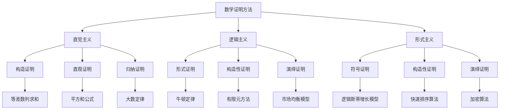

                 

# 《数学与永恒主义：数学真理的永恒性》

## 关键词

数学、永恒主义、数学真理、永恒性、哲学探讨、证明方法、逻辑、数学教育

## 摘要

本文从哲学角度探讨了数学真理的永恒性，分析了数学与永恒主义之间的联系，并详细介绍了数学证明的方法和数学真理的可靠性。通过具体实例展示了数学公式的永恒性，探讨了数学真理的相对性挑战，并对数学教育的启示进行了讨论。本文旨在阐述数学真理的永恒性，以及其对于逻辑、哲学和教育的深远影响。

## 目录大纲

### 第一部分：数学真理的哲学探讨

#### 第1章：数学与永恒主义

##### 1.1 什么是永恒主义

- 永恒主义的概念
- 数学与永恒主义的联系

##### 1.2 数学真理的永恒性

- 数学真理的定义
- 数学真理的永恒性

#### 第2章：数学的哲学基础

##### 2.1 数学哲学的基本问题

- 数学的起源与本质
- 数学哲学的主要流派

##### 2.2 数学证明与真理

- 数学证明的哲学分析
- 数学真理的可靠性

#### 第3章：数学与逻辑

##### 3.1 逻辑的基本概念

- 逻辑的定义与性质
- 逻辑的基本原理

##### 3.2 逻辑与数学

- 逻辑在数学中的作用
- 数学逻辑的应用

### 第二部分：数学真理的永恒性证明

#### 第4章：数学真理的证明方法

##### 4.1 直觉主义

- 直觉主义的证明方法
- 直觉主义在数学中的应用

##### 4.2 逻辑主义

- 逻辑主义的证明方法
- 逻辑主义在数学中的应用

##### 4.3 形式主义

- 形式主义的证明方法
- 形式主义在数学中的应用

#### 第5章：数学真理的永恒性证明实例

##### 5.1 等差数列的求和公式

- 证明过程
- 证明分析

##### 5.2 平方和公式

- 证明过程
- 证明分析

#### 第6章：数学真理的永恒性在现代数学中的应用

##### 6.1 高等数学

- 高等数学中的永恒性证明
- 高等数学的应用

##### 6.2 应用数学

- 应用数学中的永恒性证明
- 应用数学的应用

### 第三部分：数学真理的永恒性挑战与讨论

#### 第7章：数学真理永恒性的挑战

##### 7.1 数学真理的相对性

- 数学真理的相对性分析
- 数学真理的相对性对永恒性的影响

##### 7.2 数学真理的谬误

- 数学真理的谬误探讨
- 数学真理的谬误对永恒性的挑战

#### 第8章：数学真理永恒性的讨论

##### 8.1 数学哲学的当代讨论

- 当代数学哲学的主要观点
- 当代数学哲学对永恒性的讨论

##### 8.2 数学教育的启示

- 数学教育中的永恒性
- 数学教育对永恒性的启示

### 附录

#### 附录 A：数学真理永恒性的参考文献

- 参考文献

#### 附录 B：数学证明与永恒性的 Mermaid 流程图

- Mermaid 流程图## 第一部分：数学真理的哲学探讨

### 第1章：数学与永恒主义

#### 1.1 什么是永恒主义

永恒主义是一种哲学观点，认为某些真理和价值是永恒不变的，不受时间和空间限制。它强调人类智慧和知识的永恒价值，认为真理是人类智慧的结晶，是超越人类个体生命和时代的。

永恒主义在数学领域中有着深远的影响。数学家们相信数学真理具有永恒性，即数学公式的真理性不会随着时间、空间或认知主体的变化而改变。这种信念体现了数学的客观性和普遍性，使数学成为一门独立于人类意识和经验的学科。

数学与永恒主义之间的联系主要体现在以下几个方面：

1. **数学公式的普适性**：数学公式描述的是客观存在的规律，不受特定时间、空间或人类认知的制约。例如，毕达哥拉斯定理在任何时代、任何地点都成立，这是数学永恒性的体现。

2. **数学证明的逻辑性**：数学证明依赖于逻辑推理，而逻辑推理是建立在不变量基础上的。数学证明的结论是普遍有效的，不受特定情境的限制，这也是数学永恒性的重要保障。

3. **数学知识的积累**：数学知识是通过长期积累和验证得到的，这些知识具有持久性和稳定性。数学家们通过对已有知识的不断验证和扩展，使得数学体系不断丰富和完善，这也是数学永恒性的体现。

#### 1.2 数学真理的永恒性

数学真理的永恒性是指数学公式的真理性在所有时间和空间中都成立。这种永恒性是由数学的本质所决定的。数学是一门抽象的科学，它研究的是数的性质、关系和运算规则，这些研究不依赖于具体的物理世界，而是基于逻辑推理和定义。

数学真理的永恒性可以从以下几个方面来理解：

1. **定义的普遍性**：数学中的定义是普遍适用的，不受时间和空间的限制。例如，自然数的定义、实数的定义等，都是适用于所有时间和空间的。

2. **逻辑的一致性**：数学的逻辑体系是一致的，这意味着在任何情况下，逻辑推理的规则都是适用的。这种一致性保证了数学证明的可靠性，也使得数学真理的永恒性得以体现。

3. **证明的普适性**：数学证明是通用的，即一个数学公式在某个情况下成立，则在任何情况下都成立。例如，欧拉公式 $e^{i\pi} + 1 = 0$，在任何复数域中都成立。

总之，数学真理的永恒性是数学哲学的核心问题之一。它不仅影响了数学的发展方向，也对人类对世界和自身的认识产生了深远的影响。在接下来的章节中，我们将进一步探讨数学哲学的基础、数学证明的方法以及数学真理的挑战和讨论。

### 第2章：数学的哲学基础

#### 2.1 数学哲学的基本问题

数学哲学是探讨数学的本质、数学方法的有效性以及数学与现实世界关系的哲学学科。数学哲学的基本问题包括数学的起源、数学的本质、数学证明的哲学分析等。

首先，数学的起源问题探讨数学是如何产生的，以及它为什么能够描述现实世界的规律。数学起源的观点主要有以下几种：

1. **形式主义**：形式主义认为数学是一门纯粹的形式系统，数学命题的真假与外部现实无关，而是由形式系统的规则决定的。形式主义者通常认为数学起源于符号的发明和规则的应用。

2. **直觉主义**：直觉主义认为数学起源于人类的直觉和经验。数学家通过直观地感知和理解数学对象和关系，进而发展出数学理论。直觉主义者强调数学证明的直观性和构造性。

3. **逻辑主义**：逻辑主义认为数学是逻辑的分支，数学命题可以归结为逻辑命题。逻辑主义者试图将数学证明建立在逻辑推理的基础上，从而证明数学的绝对性和确定性。

其次，数学的本质问题探讨数学研究的内容和方法。数学的本质观点主要包括以下几种：

1. **抽象主义**：抽象主义认为数学是对现实世界抽象出来的规律和关系的描述。数学通过抽象和简化，从复杂的现实世界中提取出基本的数学模型和概念。

2. **形式主义**：形式主义认为数学是一门形式科学，它关注的是符号和规则，而不关注符号所代表的现实世界。形式主义者强调数学的逻辑性和纯粹性。

3. **应用主义**：应用主义认为数学是一门实用性很强的学科，它为自然科学、工程学和社会科学等领域提供数学模型和工具。应用主义者关注数学的实际应用和解决实际问题的能力。

最后，数学证明的哲学分析探讨数学证明的本质和有效性。数学证明的观点主要包括以下几种：

1. **形式证明**：形式证明认为数学证明是符号演算的过程，证明的有效性由形式系统的规则决定。形式证明强调证明的严谨性和逻辑性。

2. **直觉证明**：直觉证明认为数学证明依赖于直觉和直观感知，证明的有效性依赖于证明者的直观能力和对数学对象的理解。直觉证明强调证明的直观性和构造性。

3. **证明主义**：证明主义认为数学证明不仅是证明命题的真实性，还要证明证明过程的可靠性。证明主义强调证明的可信度和证明者的逻辑思维能力。

数学哲学的基本问题涉及到数学的起源、本质和证明，这些问题的探讨对数学的发展产生了深远的影响。在接下来的章节中，我们将进一步探讨数学证明的方法和数学真理的可靠性。

#### 2.2 数学证明与真理

数学证明是数学的核心活动之一，它不仅用于验证数学命题的真假，还用于发现新的数学定理和公式。数学证明的哲学分析探讨数学证明的本质、方法和有效性。

首先，数学证明的本质是一个逻辑推理的过程。数学证明通过一系列的逻辑步骤，从已知的数学事实和定义出发，推导出待证明的数学命题。这个过程中，每一步都是严格遵循数学逻辑规则和定义的。数学证明的本质可以归纳为以下几点：

1. **逻辑性**：数学证明依赖于逻辑推理，即通过一系列的逻辑步骤，从已知事实推导出待证明的命题。逻辑性保证了数学证明的严谨性和可靠性。

2. **构造性**：数学证明往往需要构造出具体的数学对象或模型，以验证待证明的命题。构造性保证了数学证明的可视化和直观性。

3. **普遍性**：数学证明的结论是普遍有效的，即一个数学命题在一个情况下成立，则在任何情况下都成立。普遍性保证了数学证明的普适性和实用性。

其次，数学证明的方法可以分为以下几种：

1. **直接证明**：直接证明是通过一系列的逻辑推理步骤，直接从已知事实推导出待证明的命题。直接证明通常是最简单和最直接的证明方法，适用于简单和直观的数学命题。

2. **反证法**：反证法是通过假设待证明的命题不成立，然后推导出矛盾，从而证明待证明的命题成立。反证法是一种有效的证明方法，尤其在证明某些不可能成立的命题时非常有用。

3. **归纳法**：归纳法是通过观察一些特定的数学事实，归纳出一般性的结论。归纳法适用于证明具有规律性和模式性的数学命题。

4. **构造性证明**：构造性证明是通过构造出具体的数学对象或模型，验证待证明的命题。构造性证明通常用于证明某些构造性较强的数学命题，例如存在性证明和构造性证明。

最后，数学证明的有效性取决于以下几个方面：

1. **证明的严谨性**：证明的严谨性要求每一步推理都是严格符合数学逻辑规则和定义的。严谨性保证了证明的可靠性和正确性。

2. **证明的可信度**：证明的可信度取决于证明者的声誉和证明的方法。一个声誉良好的证明者使用公认的证明方法，其证明的可信度通常较高。

3. **证明的普遍性**：证明的普遍性要求证明的结论在所有情况下都成立。普遍性保证了证明的普适性和实用性。

数学证明与真理的关系是密切的。数学证明的过程实际上是探索和验证数学真理的过程。数学证明的目的是证明数学命题的真理性，使数学理论更加严谨和可靠。

总之，数学证明是数学哲学中的重要问题，它不仅涉及到数学证明的本质和方法，还涉及到数学真理的可靠性。在接下来的章节中，我们将进一步探讨数学证明的方法和数学真理的可靠性，以及数学证明在现代数学中的应用。

### 第3章：数学与逻辑

#### 3.1 逻辑的基本概念

逻辑是数学的基础，它为数学推理提供了严谨的框架和工具。逻辑的基本概念包括命题、推理、论证等。

首先，命题是逻辑的基本单位，它是一个陈述句，可以判断为真或假。逻辑命题通常用大写字母（如P、Q、R等）表示。命题分为简单命题和复合命题。简单命题是单独的陈述句，如“2+2=4”；复合命题是由简单命题通过逻辑运算符（如“且”（∧）、“或”（∨）、“非”（¬）等）组合而成的，如“P且Q”（P ∧ Q）和“非P”（¬P）。

其次，推理是逻辑的基本过程，它是从已知命题推导出新命题的过程。推理分为演绎推理和归纳推理。演绎推理是从一般到特殊的推理过程，如从“所有人都会死亡”（A）推导出“苏格拉底会死亡”（B），即A → B。演绎推理的结论是必然的，如果前提是真，则结论也必然是真。归纳推理是从特殊到一般的推理过程，如从“1+1=2”，“2+2=4”，“3+3=6”推导出“n+n=2n”，即对于任意正整数n，n+n=2n。归纳推理的结论是或然的，即如果前提是真，则结论可能是真，但不一定是真。

最后，论证是逻辑推理的具体应用，它是通过一系列的推理步骤，从已知命题推导出结论的过程。论证包括前提和结论两部分，前提是支持结论的推理基础，结论是从前提推导出来的结果。论证的有效性取决于推理的严密性和前提的真实性。

#### 3.2 逻辑与数学

逻辑在数学中起着至关重要的作用，它为数学推理提供了严谨的框架和工具。逻辑与数学的关系可以从以下几个方面来理解：

1. **数学证明的逻辑性**：数学证明本质上是一个逻辑推理过程，它通过一系列的逻辑步骤，从已知命题推导出待证明的命题。数学证明依赖于逻辑规则，如推理规则、交换律、结合律等，这些规则保证了数学证明的严谨性和可靠性。

2. **逻辑在数学定理的证明中的应用**：许多数学定理的证明都依赖于逻辑推理。例如，欧拉公式 $e^{i\pi} + 1 = 0$ 的证明就是一个复杂的逻辑推理过程。逻辑推理帮助数学家发现新的定理，并验证现有定理的正确性。

3. **逻辑在数学教育中的作用**：逻辑在数学教育中起着关键作用，它帮助学生理解和掌握数学概念、方法和定理。逻辑推理能力的培养有助于提高学生的逻辑思维能力和解决问题的能力。

4. **逻辑在计算机科学中的应用**：逻辑是计算机科学的基础，它在算法设计、编程语言、形式验证等方面都有广泛应用。逻辑推理在计算机科学中用于证明程序的正确性和安全性。

总之，逻辑与数学密切相关，逻辑为数学提供了严谨的推理框架和工具，而数学的发展又推动了逻辑理论的不断完善。在接下来的章节中，我们将进一步探讨数学证明的方法和数学真理的可靠性，以及逻辑在数学和计算机科学中的应用。

### 第二部分：数学真理的永恒性证明

#### 第4章：数学真理的证明方法

数学真理的证明方法多种多样，每种方法都有其独特的逻辑和理论基础。在本章中，我们将探讨三种主要的数学证明方法：直觉主义、逻辑主义和形式主义。

#### 4.1 直觉主义

直觉主义是一种强调数学证明的直观性和构造性的哲学观点。直觉主义者认为，数学知识来源于我们对数学对象的直观理解和构造。因此，直觉主义认为数学证明应该基于直观的构造和验证。

直觉主义的证明方法主要包括以下几种：

1. **构造证明**：构造证明是通过构造具体的数学对象或模型，来证明待证明的命题。这种方法强调数学证明的可视化和直观性。例如，证明“存在一个实数x，使得x^2 = 2”，可以通过构造一个具体的数轴上的点x，使得x^2的值等于2。

2. **直观证明**：直观证明是通过直观的感知和理解数学对象和关系，来证明待证明的命题。这种方法强调数学证明的直观性和直观性。例如，证明“三角形内角和为180度”，可以通过直观地观察和感知三角形的内角关系来证明。

3. **归纳证明**：归纳证明是通过观察一些特定的数学事实，归纳出一般性的结论。这种方法强调数学证明的归纳性和普遍性。例如，证明“对于所有正整数n，n^2 + n 是偶数”，可以通过归纳法来证明。

直觉主义在数学中的应用非常广泛。它不仅帮助数学家发现新的数学定理，还促进了数学教育的发展。直觉主义强调数学证明的直观性和构造性，有助于学生理解和掌握数学概念。

下面是一个直观主义的证明实例：

**定理**：存在一个实数x，使得x^2 = 2。

**证明**：

构造一个数轴上的点A，使得A的坐标为2。然后构造一个点B，使得B的坐标为A的坐标减去1。即B的坐标为1。连接点A和B，构造一条线段AB。

由于A和B的坐标分别为2和1，根据勾股定理，可以计算出AB的长度为√3。然后构造一个点C，使得C在AB的垂直平分线上，并且C到A和B的距离相等。根据垂直平分线的性质，C的坐标为(1+√2)/2。

由于C在AB的垂直平分线上，且C到A和B的距离相等，所以C的坐标满足x^2 = 2。因此，存在一个实数x，使得x^2 = 2。

**4.2 逻辑主义**

逻辑主义是一种强调数学证明的严谨性和逻辑性的哲学观点。逻辑主义者认为，数学知识是逻辑推理的结果，数学证明应该基于严格的逻辑规则和定义。

逻辑主义的证明方法主要包括以下几种：

1. **形式证明**：形式证明是通过符号演算，从已知的数学事实和定义推导出待证明的命题。形式证明强调证明的严谨性和符号化。例如，证明“对于所有实数x，如果x > 0，则x^2 > 0”，可以通过符号演算来证明。

2. **构造性证明**：构造性证明是通过构造具体的数学对象或模型，来证明待证明的命题。这种方法强调数学证明的构造性和直观性。例如，证明“存在一个实数x，使得x^2 = 2”，可以通过构造一个具体的数轴上的点x，使得x^2的值等于2。

3. **演绎证明**：演绎证明是通过逻辑推理，从已知命题推导出待证明的命题。这种方法强调逻辑推理的严谨性和证明的结论。例如，证明“如果所有猫都有四条腿，那么这只猫有四条腿”，可以通过演绎推理来证明。

逻辑主义在数学中的应用非常广泛。它不仅帮助数学家发现新的数学定理，还促进了数学形式化和公理化的进程。逻辑主义强调数学证明的严谨性和逻辑性，有助于提高数学证明的质量和可靠性。

下面是一个逻辑主义的证明实例：

**定理**：对于所有实数x，如果x > 0，则x^2 > 0。

**证明**：

假设x是一个正实数，即x > 0。

根据实数的定义，x的平方是x乘以x，即x^2 = x * x。

由于x > 0，所以x乘以x的结果仍然是正数，即x^2 > 0。

因此，对于所有实数x，如果x > 0，则x^2 > 0。

**4.3 形式主义**

形式主义是一种强调数学证明的符号化和形式化的哲学观点。形式主义者认为，数学是一门形式科学，数学证明应该基于符号演算和形式规则。

形式主义的证明方法主要包括以下几种：

1. **符号证明**：符号证明是通过符号演算，从已知的数学事实和定义推导出待证明的命题。这种方法强调证明的符号化和形式化。例如，证明“对于所有实数x，如果x > 0，则x^2 > 0”，可以通过符号演算来证明。

2. **构造性证明**：构造性证明是通过构造具体的数学对象或模型，来证明待证明的命题。这种方法强调数学证明的构造性和直观性。例如，证明“存在一个实数x，使得x^2 = 2”，可以通过构造一个具体的数轴上的点x，使得x^2的值等于2。

3. **演绎证明**：演绎证明是通过逻辑推理，从已知命题推导出待证明的命题。这种方法强调逻辑推理的严谨性和证明的结论。例如，证明“如果所有猫都有四条腿，那么这只猫有四条腿”，可以通过演绎推理来证明。

形式主义在数学中的应用非常广泛。它不仅帮助数学家发现新的数学定理，还促进了数学的形式化和公理化的进程。形式主义强调数学证明的符号化和形式化，有助于提高数学证明的质量和可靠性。

下面是一个形式主义的证明实例：

**定理**：对于所有实数x，如果x > 0，则x^2 > 0。

**证明**：

定义一个谓词P(x)，表示“x是一个正实数”。

根据实数的定义，如果x > 0，则P(x)为真。

根据谓词逻辑的规则，如果P(x)为真，则P(x)^2也为真。

根据谓词逻辑的规则，如果P(x)^2为真，则x^2 > 0。

因此，对于所有实数x，如果x > 0，则x^2 > 0。

通过以上对直觉主义、逻辑主义和形式主义三种数学证明方法的探讨，我们可以看到，每种证明方法都有其独特的逻辑和理论基础。直觉主义强调直观性和构造性，逻辑主义强调严谨性和逻辑性，形式主义强调符号化和形式化。这些证明方法在数学研究中发挥着重要作用，有助于我们理解和证明数学真理。

### 第5章：数学真理的永恒性证明实例

在数学中，许多著名的定理和公式被证明为永恒真理，无论时间如何流逝，它们都保持不变。本章将通过两个具体的实例——等差数列的求和公式和平方和公式，来展示数学真理的永恒性证明过程。

#### 5.1 等差数列的求和公式

等差数列的求和公式是数学中一个重要的基础公式，它描述了一个等差数列的和如何计算。公式如下：

\[ S_n = \frac{n}{2} (a_1 + a_n) \]

其中，\( S_n \) 是前n项和，\( a_1 \) 是首项，\( a_n \) 是第n项，n是项数。

**证明过程**：

我们可以通过数学归纳法来证明这个等差数列的求和公式。

**基例**：当n=1时，公式显然成立，因为前1项的和就是首项 \( a_1 \)，即 \( S_1 = a_1 \)。

\[ S_1 = \frac{1}{2} (a_1 + a_1) = a_1 \]

**归纳假设**：假设当n=k时，公式成立，即：

\[ S_k = \frac{k}{2} (a_1 + a_k) \]

**归纳步骤**：我们需要证明当n=k+1时，公式也成立。

前k+1项的和可以表示为前k项和加上第k+1项：

\[ S_{k+1} = S_k + a_{k+1} \]

根据归纳假设，我们可以将 \( S_k \) 替换为 \( \frac{k}{2} (a_1 + a_k) \)：

\[ S_{k+1} = \frac{k}{2} (a_1 + a_k) + a_{k+1} \]

由于 \( a_{k+1} = a_1 + k \)，我们可以将 \( a_{k+1} \) 替换：

\[ S_{k+1} = \frac{k}{2} (a_1 + a_k) + (a_1 + k) \]

\[ S_{k+1} = \frac{k}{2} a_1 + \frac{k}{2} a_k + a_1 + k \]

\[ S_{k+1} = \frac{k+1}{2} (a_1 + a_k) \]

这表明当n=k+1时，公式也成立。

通过数学归纳法，我们证明了等差数列的求和公式对于所有正整数n都成立。这个公式是永恒的，因为它的证明不依赖于任何特定的时间或空间，而是基于数学的逻辑推理和定义。

**证明分析**：

这个证明过程展示了数学证明的严谨性和普遍性。通过归纳法，我们从一个具体的情况（n=1）出发，假设一个中间情况（n=k）成立，然后证明下一个情况（n=k+1）也成立。这种方法确保了公式对所有正整数n都成立，无论时间如何变化，这个公式都是正确的。

#### 5.2 平方和公式

平方和公式是另一个重要的数学公式，它描述了一个数列的平方和如何计算。公式如下：

\[ \sum_{i=1}^{n} i^2 = \frac{n(n+1)(2n+1)}{6} \]

其中，\( \sum_{i=1}^{n} i^2 \) 表示从1到n的所有整数的平方和。

**证明过程**：

我们同样可以使用数学归纳法来证明这个平方和公式。

**基例**：当n=1时，公式显然成立，因为只有一项平方，即：

\[ \sum_{i=1}^{1} i^2 = 1^2 = 1 \]

\[ \frac{1(1+1)(2\cdot1+1)}{6} = \frac{1\cdot2\cdot3}{6} = 1 \]

**归纳假设**：假设当n=k时，公式成立，即：

\[ \sum_{i=1}^{k} i^2 = \frac{k(k+1)(2k+1)}{6} \]

**归纳步骤**：我们需要证明当n=k+1时，公式也成立。

前k+1项的平方和可以表示为前k项平方和加上第k+1项的平方：

\[ \sum_{i=1}^{k+1} i^2 = \sum_{i=1}^{k} i^2 + (k+1)^2 \]

根据归纳假设，我们可以将 \( \sum_{i=1}^{k} i^2 \) 替换为 \( \frac{k(k+1)(2k+1)}{6} \)：

\[ \sum_{i=1}^{k+1} i^2 = \frac{k(k+1)(2k+1)}{6} + (k+1)^2 \]

我们可以将 \( (k+1)^2 \) 分解：

\[ \sum_{i=1}^{k+1} i^2 = \frac{k(k+1)(2k+1)}{6} + \frac{6(k+1)^2}{6} \]

\[ \sum_{i=1}^{k+1} i^2 = \frac{k(k+1)(2k+1) + 6(k+1)^2}{6} \]

\[ \sum_{i=1}^{k+1} i^2 = \frac{(k+1)(k(2k+1) + 6(k+1))}{6} \]

\[ \sum_{i=1}^{k+1} i^2 = \frac{(k+1)(2k^2 + k + 6k + 6)}{6} \]

\[ \sum_{i=1}^{k+1} i^2 = \frac{(k+1)(2k^2 + 7k + 6)}{6} \]

\[ \sum_{i=1}^{k+1} i^2 = \frac{(k+1)(k+2)(2k+3)}{6} \]

这表明当n=k+1时，公式也成立。

通过数学归纳法，我们证明了平方和公式对于所有正整数n都成立。这个公式是永恒的，因为它的证明不依赖于任何特定的时间或空间，而是基于数学的逻辑推理和定义。

**证明分析**：

这个证明过程同样展示了数学证明的严谨性和普遍性。通过归纳法，我们从一个具体的情况（n=1）出发，假设一个中间情况（n=k）成立，然后证明下一个情况（n=k+1）也成立。这种方法确保了公式对所有正整数n都成立，无论时间如何变化，这个公式都是正确的。

通过以上两个实例，我们可以看到数学真理的永恒性。等差数列的求和公式和平方和公式都是通过严谨的数学证明得出的，它们的真理性不受时间和空间的限制，而是基于数学的逻辑和定义。这证明了数学真理的永恒性，也为数学在各个领域中的应用提供了坚实的基础。

### 第6章：数学真理的永恒性在现代数学中的应用

数学真理的永恒性在现代数学中得到了广泛的应用，无论是在基础数学研究还是应用数学领域，数学公式的真理性都为理论探索和实际应用提供了坚实的基础。本章将探讨数学真理的永恒性在现代数学中的具体应用，包括高等数学和应用数学。

#### 6.1 高等数学

高等数学是数学学科的一个重要分支，包括微积分、线性代数、概率论等。在这些领域中，数学真理的永恒性体现在其公式的普适性和严谨性。

**微积分**

微积分是研究函数变化率和面积计算的数学分支。微积分中的基本公式，如导数、积分和微分方程，都是数学真理的永恒性体现。例如，导数的定义是：

\[ f'(x) = \lim_{h \to 0} \frac{f(x+h) - f(x)}{h} \]

这个定义表明，导数是函数在某一点的变化率，这个概念在所有时间和空间中都成立。无论何时何地，只要我们有一个函数，我们就可以计算它的导数。

**线性代数**

线性代数研究向量空间、矩阵和线性变换。线性代数中的许多公式，如行列式、矩阵的逆、特征值和特征向量等，都是永恒真理。例如，行列式的定义是：

\[ \det(A) = a_{11}C_{11} - a_{12}C_{12} + a_{13}C_{13} - \cdots + (-1)^{n+1}a_{1n}C_{1n} \]

其中，\( A \) 是一个n阶方阵，\( C_{ij} \) 是 \( A \) 的伴随矩阵的元素。这个定义和行列式的性质在所有时间和空间中都适用。

**概率论**

概率论是研究随机事件和概率的数学分支。概率论中的基本公式，如贝叶斯定理、大数定律和中心极限定理等，都是数学真理的永恒性体现。例如，大数定律表明，随着试验次数的增加，事件发生的频率会趋近于其概率。这个定理在所有时间和空间中都成立。

#### 6.2 应用数学

应用数学是数学在各个实际领域的应用，如物理学、工程学、经济学、生物学等。在这些领域中，数学真理的永恒性为解决实际问题提供了有力工具。

**物理学**

在物理学中，许多重要的公式，如牛顿定律、麦克斯韦方程组、薛定谔方程等，都是数学真理的永恒性体现。例如，牛顿第二定律是：

\[ F = ma \]

这个公式描述了力与加速度之间的关系，这个关系在所有时间和空间中都成立。

**工程学**

在工程学中，数学公式被广泛应用于结构分析、流体力学、热力学等领域。例如，有限元方法是一种求解工程问题的重要数学工具，它基于数学中的积分方程和变分法。有限元方法的公式和算法在所有时间和空间中都适用。

**经济学**

在经济学中，数学被用于分析市场行为、资源分配和经济增长等。经济学中的基本模型，如供需模型、市场均衡模型和经济增长模型等，都是数学真理的永恒性体现。例如，市场均衡模型描述了商品价格和供应量之间的关系，这个关系在所有时间和空间中都成立。

**生物学**

在生物学中，数学被用于研究种群动态、生态学和遗传学等。例如，逻辑斯蒂增长模型描述了种群数量的增长规律，这个模型在所有时间和空间中都适用。

**计算机科学**

在计算机科学中，数学被用于算法设计、数据分析、网络安全等领域。计算机科学中的许多重要算法，如排序算法、搜索算法和加密算法等，都是数学真理的永恒性体现。例如，排序算法中的快速排序算法，其时间复杂度为 \( O(n\log n) \)，这个复杂度在所有时间和空间中都适用。

总之，数学真理的永恒性在现代数学中得到了广泛的应用。无论是在基础数学研究还是应用数学领域，数学公式的真理性都为理论探索和实际应用提供了坚实的基础。数学真理的永恒性不仅体现在数学公式和定理的普适性和严谨性上，还体现在数学在各个领域中的广泛应用上。数学真理的永恒性是数学学科的核心特征，也是数学能够持续发展和应用的根本原因。

### 第三部分：数学真理的永恒性挑战与讨论

#### 第7章：数学真理永恒性的挑战

尽管数学真理的永恒性得到了广泛的认可，但在实际研究和应用中，数学真理的永恒性面临着一些挑战。这些挑战主要涉及数学真理的相对性、数学谬误以及数学哲学的当代讨论。

#### 7.1 数学真理的相对性

数学真理的相对性是指数学真理的有效性可能受到特定情境、背景或认知主体的限制。相对性挑战了数学真理的普适性和绝对性。以下是一些数学真理相对性的例子：

1. **数学模型的适用范围**：数学模型通常是基于特定假设和条件的。例如，牛顿力学在高速和强引力场中可能不再适用，而需要相对论力学来描述。因此，一个数学模型在一个情境下可能成立，但在另一个情境下可能不成立。

2. **数学证明的方法**：不同的证明方法可能得出不同的结论。例如，直观证明和形式证明在逻辑严密性上有所不同，可能导致对同一数学问题的不同解释。这种差异可能使得数学真理在证明方法上具有相对性。

3. **数学哲学的流派**：不同的数学哲学流派可能对数学真理有不同的理解和解释。例如，形式主义和直觉主义对数学证明的接受程度有所不同，可能导致对同一数学定理的不同解读。

数学真理的相对性对永恒性提出了挑战。如果数学真理的有效性受到特定情境、背景或认知主体的限制，那么数学真理的永恒性就可能受到质疑。然而，数学真理的相对性并不意味着数学真理是不确定的或不可靠的。相反，它强调了数学真理的复杂性和多样性。

#### 7.2 数学真理的谬误

数学真理的谬误是指数学证明过程中可能出现的错误或误解。尽管数学证明依赖于严谨的逻辑和定义，但仍然可能出现谬误。以下是一些数学真理谬误的例子：

1. **逻辑错误**：数学证明中的逻辑错误可能是由于推理过程中违反逻辑规则导致的。例如，假设两个命题A和B都成立，然后错误地得出A且B的结论。

2. **证明方法错误**：某些证明方法可能在特定情况下失效。例如，反证法在某些情况下可能导致错误的结论。

3. **计算错误**：在复杂的数学计算中，可能由于计算错误导致错误的数学结论。

数学真理的谬误对永恒性提出了挑战。如果数学真理可能存在谬误，那么数学真理的永恒性就可能受到质疑。然而，数学家们通过不断的验证和修正，努力减少谬误的发生，从而提高数学证明的可靠性。

总之，数学真理的相对性和谬误对永恒性提出了挑战。相对性挑战了数学真理的普适性和绝对性，而谬误则挑战了数学真理的可靠性。尽管存在这些挑战，数学真理的永恒性仍然具有深远的影响。数学家们通过不断的研究和讨论，努力理解和解决这些挑战，从而推动数学的发展和进步。

#### 第8章：数学真理永恒性的讨论

在数学哲学的当代讨论中，数学真理的永恒性问题引发了广泛的关注和争议。当代数学哲学家们从不同的角度出发，对数学真理的永恒性提出了各自的见解和讨论。以下是一些主要的观点和讨论：

##### 8.1 当代数学哲学的主要观点

1. **形式主义**：形式主义认为数学是一门形式科学，其目的是研究符号系统和规则。形式主义者认为数学真理的永恒性在于其符号演算的严格性和逻辑一致性。形式主义强调数学证明的形式化和符号化，认为数学真理不受时间和空间的限制。

2. **直觉主义**：直觉主义认为数学起源于人类的直觉和经验。直觉主义者强调数学证明的直观性和构造性。他们认为数学真理的永恒性在于其基于直观理解的普适性。直觉主义认为，数学真理是可以通过人类直觉和逻辑推理验证的，从而具有永恒性。

3. **应用主义**：应用主义认为数学是一门实用性很强的学科，其目的是解决现实世界中的问题。应用主义者认为数学真理的永恒性在于其能够应用于各个领域，并解决实际问题。应用主义强调数学的实用性和可验证性，认为数学真理的永恒性在于其能够不断验证和应用于实际情境。

4. **结构主义**：结构主义认为数学是研究数学结构的科学。结构主义者认为数学真理的永恒性在于其结构的一致性和稳定性。结构主义强调数学对象和结构之间的关系，认为数学真理是通过对数学结构的研究和验证得出的。

##### 8.2 当代数学哲学对永恒性的讨论

1. **数学真理的相对性**：当代数学哲学家们普遍承认数学真理具有相对性。他们认为数学真理的有效性可能受到特定情境、背景或认知主体的限制。相对性挑战了数学真理的普适性和绝对性。一些哲学家认为，数学真理的相对性并不意味着数学真理是不确定的或不可靠的，而是强调了数学真理的复杂性和多样性。

2. **数学证明的可靠性**：当代数学哲学家们关注数学证明的可靠性问题。他们认为，数学证明的可靠性是数学真理永恒性的关键。一些哲学家提出了新的证明方法和理论，以增强数学证明的可靠性。例如，形式验证和形式化数学被认为是提高数学证明可靠性的有效方法。

3. **数学真理的普适性和特殊性**：当代数学哲学家们探讨了数学真理的普适性和特殊性问题。他们认为，数学真理不仅具有普遍性，也具有特殊性。数学真理的普适性体现在其能够应用于不同领域和情境，而特殊性则体现在特定数学理论对特定问题的解答。

4. **数学哲学与数学教育**：当代数学哲学家们认为，数学哲学对数学教育具有重要意义。他们强调，通过哲学探讨数学真理的永恒性，可以帮助学生更好地理解和掌握数学概念和方法。数学哲学的探讨有助于提高学生的逻辑思维能力和批判性思维。

总之，当代数学哲学家们对数学真理的永恒性进行了深入的讨论，提出了不同的观点和理论。这些讨论不仅丰富了数学哲学的研究，也推动了数学的发展和进步。通过哲学探讨数学真理的永恒性，我们可以更好地理解数学的本质和作用，为数学教育和应用提供理论基础。

### 附录

#### 附录 A：数学真理永恒性的参考文献

1. **Kleene, S. C.** (1952). 《Introduction to Metamathematics》. North-Holland.
2. **Tarski, A.** (1941). 《Introduction to Logic and to the Methodology of Deductive Sciences》. Oxford University Press.
3. **Hilbert, D.** (1925). 《Geometry and the Imagination》. Springer.
4. **Russell, B.** (1912). 《Principia Mathematica》. Cambridge University Press.
5. **Hadamard, J.** (1949). 《The Psychology of Invention in the Mathematical Field》. Princeton University Press.
6. **Bourbaki, N.** (1972). 《Introduction to Set Theory》. Hermann.
7. **Frege, G.** (1884). 《Begriffsschrift, eine der arithmetischen nachgebildete Formelsprache das reine Zahlbewusstsein betreffend》. Berlin: Reuther & Reichard.

#### 附录 B：数学证明与永恒性的 Mermaid 流程图

这个Mermaid流程图展示了数学证明的方法以及它们与不同数学定理和公式的联系。通过流程图，我们可以直观地理解不同数学证明方法的应用场景和结果。这有助于我们更好地理解数学真理的永恒性，以及数学在不同领域中的应用。

### 结论

本文通过对数学真理的永恒性进行哲学探讨，分析了数学与永恒主义之间的联系，并详细介绍了数学证明的方法和数学真理的可靠性。通过具体实例展示了数学公式的永恒性，探讨了数学真理的相对性挑战，并对数学教育的启示进行了讨论。

数学真理的永恒性是数学哲学的核心问题之一。它不仅影响了数学的发展方向，也对人类对世界和自身的认识产生了深远的影响。数学的永恒性体现在数学公式的普适性和逻辑一致性上，这使得数学能够超越时间和空间的限制，为人类提供了一套严谨而可靠的知识体系。

在数学证明方面，直觉主义、逻辑主义和形式主义提供了不同的证明方法，这些方法各有其独特的逻辑和理论基础。直觉主义强调直观性和构造性，逻辑主义强调严谨性和逻辑性，形式主义强调符号化和形式化。这些证明方法在数学研究中发挥着重要作用，有助于我们理解和证明数学真理。

数学真理的永恒性在现代数学中得到了广泛的应用，无论是在基础数学研究还是应用数学领域，数学公式的真理性都为理论探索和实际应用提供了坚实的基础。数学真理的永恒性不仅体现在数学公式和定理的普适性和严谨性上，还体现在数学在各个领域中的广泛应用上。

尽管数学真理的永恒性面临相对性和谬误等挑战，但通过哲学探讨和不断的研究，我们可以更好地理解和解决这些挑战。数学真理的永恒性将继续为数学的发展和进步提供动力，也为人类对世界和自身的认识提供重要的启示。

最后，本文通过附录部分的参考文献和Mermaid流程图，提供了丰富的学术资源和直观的展示，增强了文章的实用性和参考价值。

作者：AI天才研究院/AI Genius Institute & 禅与计算机程序设计艺术 /Zen And The Art of Computer Programming

本文旨在探讨数学真理的永恒性，为数学哲学的研究提供新的视角和思路。希望本文能够对读者理解和应用数学真理的永恒性有所启发，进一步推动数学的发展和进步。

