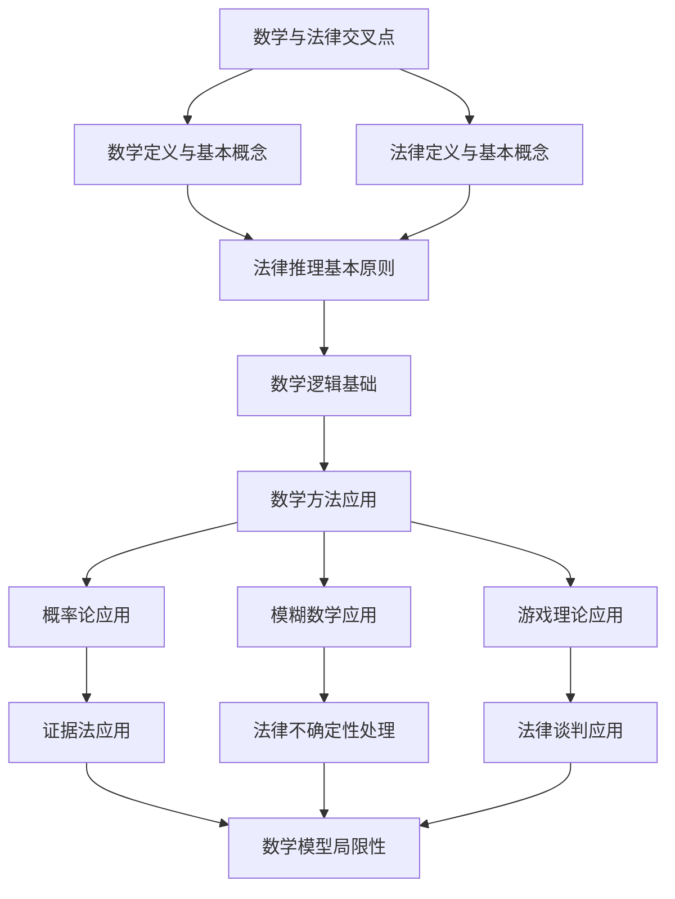
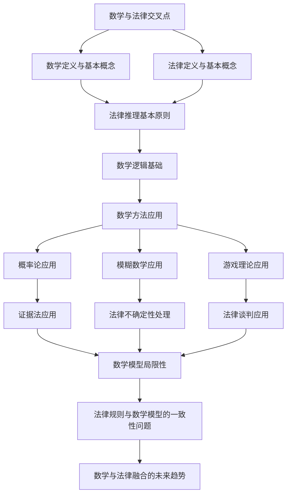

                 

## 文章标题

数学与法律：法律推理的数学逻辑

关键词：法律推理、数学逻辑、概率论、模糊数学、数学方法、法律分析

摘要：本文从数学与法律的交叉点出发，探讨了数学逻辑在法律推理中的应用。通过详细讲解概率论和模糊数学的核心算法原理、数学模型与公式，以及实际案例剖析，揭示了数学逻辑在法律分析中的重要作用和挑战。文章旨在为法律专业人士和技术人员提供一种新的视角，加深对法律推理过程的数学理解。

---

### 第一部分: 数学与法律概述

#### 第1章: 数学与法律的交叉点

##### 1.1 数学与法律的定义和联系

###### 1.1.1 数学的定义和基本概念

数学是研究数量、结构、变化以及空间等概念的一门学科。它以逻辑推理和证明为基础，使用符号化的语言表达数学结构及其性质。数学的基本概念包括数、函数、集合、逻辑、几何等。

###### 1.1.2 法律的定义和基本概念

法律是由国家制定或认可，并由国家强制力保证实施的规范体系。它规定了人们在社会生活中应当遵守的行为准则，包括宪法、刑法、民法、行政法等。法律的基本概念包括法律规范、法律关系、法律责任等。

###### 1.1.3 数学与法律交叉的背景和意义

数学与法律的交叉点体现在多个方面。首先，数学在法律实践中被广泛应用于证据分析、风险评估、决策支持等领域。其次，法律推理过程本身需要逻辑和证明，这与数学的基本方法有相似之处。数学与法律的交叉为两者的相互借鉴和融合提供了契机，有助于提高法律分析的精确性和科学性。

##### 1.2 法律推理的数学逻辑基础

###### 1.2.1 法律推理的基本原则

法律推理是法律分析和决策的基础。它遵循以下几个基本原则：

1. **确定性原则**：法律推理的结果应当是明确的，不能产生模糊或不确定的结论。
2. **一致性原则**：法律推理的过程应当保持一致性，不能出现自相矛盾的情况。
3. **充分性原则**：法律推理的依据应当是充分的，不能基于不充分或虚假的依据。
4. **合理性原则**：法律推理的结果应当是合理的，不能违背常理和道德。

###### 1.2.2 数学逻辑的基本原理

数学逻辑是研究推理和证明的数学分支。它主要包括以下几个基本原理：

1. **命题逻辑**：研究命题之间的关系和推理规则。
2. **谓词逻辑**：研究个体、属性和关系之间的逻辑关系。
3. **证明论**：研究证明的过程和方法。

数学逻辑的基本原理为法律推理提供了形式化和系统化的工具，有助于确保法律推理的准确性和有效性。

###### 1.2.3 法律推理与数学逻辑的相互作用

法律推理和数学逻辑之间存在密切的相互作用。一方面，数学逻辑为法律推理提供了形式化的方法和工具，有助于提高法律推理的精确性和科学性。另一方面，法律推理中的一些概念和方法可以启发数学逻辑的发展。例如，法律中的“推定”和“证明负担”等概念可以用于构建数学逻辑中的推理框架。

##### 1.3 数学方法在法律分析中的应用

###### 1.3.1 概率论在证据法中的应用

概率论是研究随机现象和概率分布的数学分支。在证据法中，概率论被广泛应用于评估证据的可靠性和证明力。例如，法官和律师可以使用概率论来计算某一证据证明某一事实的概率，从而对证据的真实性进行评估。

**伪代码：计算证据A证明嫌疑犯X罪行的概率**

```plaintext
function calculate_probability(evidence, suspect):
    # 定义证据A的置信度
    evidence_confidence = get_evidence_confidence(evidence)

    # 定义嫌疑犯X的罪责概率
    suspect_guilt_probability = 0.5

    # 使用贝叶斯定理更新嫌疑犯X的罪责概率
    suspect_guilt_probability = (evidence_confidence * suspect_guilt_probability) / (evidence_confidence * suspect_guilt_probability + (1 - evidence_confidence) * (1 - suspect_guilt_probability))

    return suspect_guilt_probability
```

###### 1.3.2 模糊数学在法律不确定性的处理中的应用

模糊数学是研究模糊性和不确定性现象的数学分支。在法律分析中，模糊数学可以用来处理法律文本中的模糊性，例如法律条款的不确定性和法律事实的不确定性。模糊数学的方法包括模糊集合、模糊推理和模糊积分等。

**Latex 公式：模糊集合的基本概念**

$$
A = \{ x \in X | \mu_A(x) > 0.5 \}
$$

其中，\( A \) 是一个模糊集合，\( X \) 是论域，\( \mu_A \) 是 \( A \) 上的隶属函数，表示 \( x \) 对 \( A \) 的隶属程度。

**伪代码：模糊集合的隶属函数计算**

```plaintext
function calculate_membership_function(document, term):
    # 定义隶属函数的阈值
    threshold = 0.5

    # 初始化隶属函数值
    membership_value = 0

    # 遍历文档中的每个词
    for word in document:
        # 如果词与目标词匹配，增加隶属函数值
        if word == term:
            membership_value += threshold

    # 归一化隶属函数值
    membership_value /= len(document)

    return membership_value
```

###### 1.3.3 游戏理论在法律谈判中的应用

游戏理论是研究决策者在特定情境下的策略选择和结果预测的数学分支。在法律谈判中，游戏理论可以帮助律师和当事人分析对手的策略，制定最优的谈判策略。例如，律师可以使用纳什均衡的概念来预测对手的行动，从而制定出针对性的策略。

##### 1.4 数学与法律实践中的挑战与机遇

###### 1.4.1 数学模型在法律决策中的局限性

尽管数学方法在法律分析中具有重要作用，但数学模型也存在一些局限性。首先，数学模型往往依赖于特定的假设和前提条件，这些假设和前提条件可能并不完全符合实际情况。其次，数学模型的结果往往只是一种概率或可能性，而不是绝对的确定性。因此，在使用数学模型进行法律决策时，需要谨慎评估其局限性和适用性。

###### 1.4.2 法律规则与数学模型的一致性问题

法律规则和数学模型之间存在一定的不一致性。法律规则通常是基于道德、伦理和社会价值观制定的，而数学模型则主要基于逻辑和数学原理。这种不一致性可能导致数学模型在法律分析中产生偏差。为了解决这一问题，需要深入研究法律规则和数学模型之间的联系，探索如何将两者有机结合。

###### 1.4.3 数学与法律融合的未来趋势

随着数学和法律的不断发展，数学与法律的融合趋势将日益明显。未来，数学方法在法律分析中的应用将更加广泛和深入，包括但不限于以下几个方面：

1. **证据分析**：利用概率论和统计学方法对证据进行定量分析，提高证据的可靠性和证明力。
2. **法律文本分析**：利用自然语言处理和模糊数学方法对法律文本进行语义分析，提高法律文本的准确性和可理解性。
3. **法律决策支持**：利用决策论和优化方法为法律决策提供科学依据，提高法律决策的效率和效果。

#### Mermaid 流程图: 数学与法律的交叉应用流程



---

### 核心算法原理讲解：法律推理中的概率论

概率论是数学的一个分支，它主要研究随机事件及其概率分布规律。在法律领域，概率论可以用来评估证据的可靠性和被告的罪责程度。以下是法律推理中概率论的一个简单例子：

**伪代码：计算证据A证明嫌疑犯X罪行的概率**

```plaintext
function calculate_probability(evidence, suspect):
    # 定义证据A的置信度
    evidence_confidence = get_evidence_confidence(evidence)

    # 定义嫌疑犯X的罪责概率
    suspect_guilt_probability = 0.5

    # 使用贝叶斯定理更新嫌疑犯X的罪责概率
    suspect_guilt_probability = (evidence_confidence * suspect_guilt_probability) / (evidence_confidence * suspect_guilt_probability + (1 - evidence_confidence) * (1 - suspect_guilt_probability))

    return suspect_guilt_probability
```

在这个伪代码中，`get_evidence_confidence` 函数用于获取证据A的置信度，即证据A被认为是真实的概率。`suspect_guilt_probability` 是嫌疑犯X被判定有罪的概率。通过贝叶斯定理，我们可以更新嫌疑犯X的罪责概率，使其更接近实际概率。

贝叶斯定理是一个基本的概率论公式，用于计算在给定某个证据的情况下，某个假设的概率。它的公式为：

$$
P(H|E) = \frac{P(E|H) \cdot P(H)}{P(E)}
$$

其中，\( P(H|E) \) 是在给定证据E的情况下，假设H的概率；\( P(E|H) \) 是在假设H成立的情况下，证据E发生的概率；\( P(H) \) 是假设H的先验概率，即在没有证据的情况下，假设H的概率；\( P(E) \) 是证据E的先验概率，即在没有考虑任何假设的情况下，证据E发生的概率。

在法律推理中，贝叶斯定理可以用来更新嫌疑犯的罪责概率。例如，如果某证据表明嫌疑犯X有罪，我们可以使用贝叶斯定理来计算嫌疑犯X被判定有罪的概率。在这个过程中，我们需要估计以下参数：

1. **证据的置信度**：即证据被认为是真实的概率。例如，如果某个证据的置信度为0.8，表示这个证据有80%的可能是真实的。
2. **嫌疑犯的罪责概率**：即嫌疑犯被判定有罪的概率。例如，如果嫌疑犯X的罪责概率为0.5，表示在没有证据的情况下，嫌疑犯X有50%的概率是有罪的。
3. **证据与嫌疑犯罪责的相关性**：即证据与嫌疑犯罪责之间的相关性。例如，如果证据与嫌疑犯罪责的相关性为0.9，表示证据对嫌疑犯罪责的证明力很强。

通过调整这些参数，我们可以计算出嫌疑犯X被判定有罪的最终概率。在实际应用中，这些参数通常需要根据具体情况和专家意见进行估算。

贝叶斯定理的应用不仅限于法律推理，它在许多领域都有广泛的应用。例如，在医学诊断中，贝叶斯定理可以用来计算病人患有某种疾病的概率；在金融领域，贝叶斯定理可以用来计算投资组合的风险和收益；在机器学习中，贝叶斯定理可以用来计算模型参数的概率分布。

总之，贝叶斯定理为法律推理提供了一种有效的工具，可以帮助我们根据证据和先验概率来计算嫌疑犯的罪责概率。通过合理地估算参数，我们可以提高法律推理的准确性和科学性。

---

### 数学模型和数学公式讲解：法律推理中的模糊数学

模糊数学是研究模糊性现象的数学分支。在法律分析中，模糊数学可以帮助处理法律文本中的模糊性，例如法律条款的不确定性和法律事实的不确定性。以下是一个关于模糊数学在法律文本分析中的应用的例子。

**模糊集合的基本概念**

在模糊数学中，模糊集合是描述模糊性的一种数学模型。与经典集合不同，模糊集合允许元素具有不同程度的隶属度。一个模糊集合可以用隶属函数来表示，隶属函数定义了集合中每个元素对集合的隶属程度。

**Latex 公式：模糊集合的基本概念**

$$
A = \{ x \in X | \mu_A(x) > 0.5 \}
$$

其中，\( A \) 是一个模糊集合，\( X \) 是论域，\( \mu_A \) 是 \( A \) 上的隶属函数，表示 \( x \) 对 \( A \) 的隶属程度。在这个例子中，隶属函数的阈值设置为0.5，表示只有当元素对集合的隶属程度大于0.5时，该元素才被认为是集合的成员。

**模糊集合的隶属函数计算**

在法律文本分析中，我们可以使用模糊集合来表示法律条款或法律事实的模糊性。以下是一个简单的伪代码示例，用于计算一个法律文本中某个词的隶属函数值。

**伪代码：模糊集合的隶属函数计算**

```plaintext
function calculate_membership_function(document, term):
    # 定义隶属函数的阈值
    threshold = 0.5

    # 初始化隶属函数值
    membership_value = 0

    # 遍历文档中的每个词
    for word in document:
        # 如果词与目标词匹配，增加隶属函数值
        if word == term:
            membership_value += threshold

    # 归一化隶属函数值
    membership_value /= len(document)

    return membership_value
```

在这个伪代码中，`calculate_membership_function` 函数接受一个法律文本`document`和一个目标词`term`作为输入，返回目标词在法律文本中的隶属函数值。隶属函数的阈值设置为0.5，表示只有当目标词在法律文本中的出现次数大于阈值时，该目标词才被认为是法律文本的一部分。

**模糊推理**

在法律文本分析中，模糊推理是一种基于模糊集合的推理方法，用于处理法律条款之间的逻辑关系。以下是一个简单的模糊推理示例。

**伪代码：模糊推理**

```plaintext
function fuzzy_inference(antecedent, consequent, rule_base):
    # 初始化结论的隶属函数值
    consequent_membership = 0

    # 遍历规则库中的每条规则
    for rule in rule_base:
        # 计算前提的隶属函数值
        antecedent_membership = calculate_membership(antecedent, rule.antecedent)

        # 如果前提的隶属函数值大于0，应用模糊规则
        if antecedent_membership > 0:
            # 计算结论的隶属函数值
            consequent_membership = max(consequent_membership, calculate_membership(consequent, rule.consequent) * antecedent_membership)

    return consequent_membership
```

在这个伪代码中，`fuzzy_inference` 函数接受一个前提集合`antecedent`、一个结论集合`consequent`和一个规则库`rule_base`作为输入，返回结论的隶属函数值。规则库中的每条规则定义了前提和结论之间的逻辑关系。在模糊推理过程中，我们首先计算前提的隶属函数值，然后根据规则库中的规则计算结论的隶属函数值。最终，我们得到结论的隶属函数值，该值表示结论在前提成立的情况下的可能性。

通过模糊集合和模糊推理，我们可以对法律文本中的模糊性进行量化分析。这有助于提高法律文本的准确性和可理解性，同时为法律分析和决策提供有力的支持。

---

### 数学方法在法律分析中的应用

数学方法在法律分析中具有广泛的应用，尤其在证据分析和决策支持方面。以下将详细探讨概率论、模糊数学和博弈论在法律分析中的应用，并举例说明其实际操作过程。

#### 概率论在证据法中的应用

概率论在法律分析中主要用于评估证据的可靠性和证据力。例如，通过贝叶斯定理，我们可以根据已知证据计算嫌疑犯的罪责概率。以下是贝叶斯定理在法律分析中的应用示例：

**假设**：在一次谋杀案中，警方找到了嫌疑犯X的指纹。已知在总人口中，有1%的人拥有与嫌疑犯X相同的指纹。现有证据表明，嫌疑犯X的指纹与现场指纹匹配的概率为0.9。

**求解**：我们需要计算嫌疑犯X谋杀案嫌疑的概率。

1. **先验概率**：\( P(X) \) 是嫌疑犯X有罪的概率，假设为0.5（即没有证据的情况下，嫌疑犯X有罪的概率为50%）。
2. **证据概率**：\( P(E|X) \) 是在有罪的情况下，证据出现的概率，即嫌疑犯X的指纹与现场指纹匹配的概率，为0.9。
3. **互补证据概率**：\( P(E|\neg X) \) 是在无罪的情况下，证据出现的概率，即其他人的指纹与现场指纹匹配的概率，为0.01。
4. **贝叶斯定理**：

   $$
   P(X|E) = \frac{P(E|X) \cdot P(X)}{P(E|X) \cdot P(X) + P(E|\neg X) \cdot P(\neg X)}
   $$

   代入已知数据：

   $$
   P(X|E) = \frac{0.9 \cdot 0.5}{0.9 \cdot 0.5 + 0.01 \cdot 0.99} \approx 0.95
   $$

   因此，在考虑到证据后，嫌疑犯X谋杀案嫌疑的概率约为95%。

#### 模糊数学在法律不确定性的处理中的应用

模糊数学可以帮助处理法律文本中的模糊性。以下是一个例子：

**假设**：在一份合同中，有一条款规定：“如果一方未能按时履行义务，违约方应支付违约金。”但条款未明确规定“按时履行”的具体时间范围。

**求解**：我们可以使用模糊集合来表示“按时履行”的概念。

1. **建立模糊集合**：假设“按时履行”的模糊集合为\( S \)，其隶属函数为\( \mu_S(t) \)，其中\( t \)表示时间。

2. **确定隶属函数**：例如，如果合同规定履行时间为30天，我们可以设定隶属函数为：

   $$
   \mu_S(t) =
   \begin{cases}
   1, & \text{如果 } t \leq 29 \\
   \frac{30 - t}{1}, & \text{如果 } 30 < t \leq 31 \\
   0, & \text{如果 } t > 31
   \end{cases}
   $$

3. **计算违约概率**：如果一方在30天后才履行义务，我们可以使用模糊推理计算违约概率。

#### 博弈论在法律谈判中的应用

博弈论可以帮助律师和当事人制定最优谈判策略。以下是一个简单的例子：

**假设**：在一场商业合同谈判中，买方和卖方就合同条款进行博弈。买方希望以最低价格购买产品，而卖方希望以最高价格出售产品。

**求解**：我们可以使用博弈论中的纳什均衡来分析双方的策略。

1. **建立博弈模型**：定义买方和卖方的策略及收益。

2. **求解纳什均衡**：找到双方策略的均衡点，即双方都不会改变策略的点。

   例如，如果买方选择低价策略，卖方选择高价策略，则双方都获得最大收益。如果一方改变策略，另一方将获得更多收益，因此双方都会保持当前策略。

3. **策略调整**：根据纳什均衡结果，双方可以调整策略以实现最优收益。

#### 综合应用

在实际法律分析中，上述数学方法可以综合应用。例如，在证据分析中，可以结合概率论和模糊数学，提高证据评估的准确性和可靠性。在法律谈判中，可以结合博弈论，制定最优谈判策略。

总之，数学方法在法律分析中具有重要作用，可以提高法律决策的精确性和科学性。然而，数学方法也存在局限性，需要结合具体案例和实际情况进行综合分析和判断。

---

### 数学与法律实践中的挑战与机遇

尽管数学在法律分析中具有重要作用，但数学与法律实践之间仍然存在一些挑战和机遇。以下将讨论数学模型在法律决策中的局限性、法律规则与数学模型的一致性问题以及数学与法律融合的未来趋势。

#### 数学模型在法律决策中的局限性

1. **依赖假设**：数学模型通常基于一系列假设和前提条件。这些假设可能并不完全符合实际情况，从而导致模型结果与实际结果存在偏差。
2. **结果概率性**：数学模型往往提供的是概率性结果，而非确定性结果。这意味着即使模型结果显示某一结论具有较高的概率，也不能完全确定这一结论的真实性。
3. **适用范围有限**：某些数学模型适用于特定类型的问题，而在其他情况下可能不适用。例如，概率论在证据法中具有广泛应用，但在处理法律文本中的模糊性时，可能需要结合其他方法。

#### 法律规则与数学模型的一致性问题

1. **价值冲突**：法律规则通常基于道德、伦理和社会价值观，而数学模型主要基于逻辑和数学原理。这两者在价值导向上可能存在冲突，例如，数学模型可能无法完全体现法律中的公平、正义等价值。
2. **适用性差异**：法律规则和数学模型在适用范围和适用条件上可能存在差异。法律规则通常针对特定情境和对象，而数学模型可能具有更广泛的适用性。
3. **解释困难**：数学模型的结果往往需要转换为法律语言，以供法律专业人士理解和应用。这一转换过程可能导致结果解释上的困难，甚至产生新的问题。

#### 数学与法律融合的未来趋势

1. **跨学科研究**：随着数学和法律的不断发展，跨学科研究将变得更加普遍。数学方法和技术将被应用于更广泛的法律领域，例如证据分析、法律文本分析、法律谈判等。
2. **工具和算法的发展**：随着计算机科学和人工智能技术的进步，数学方法将开发出更多高效、精确的工具和算法，以支持法律分析和决策。
3. **法律法规的完善**：为了更好地融合数学方法，法律界可能需要制定相应的法律法规，明确数学方法在法律分析中的适用范围和规范。
4. **人才培养**：为了应对数学与法律融合的挑战，需要培养具有跨学科背景和法律专业知识的人才，以推动这一领域的进步。

总之，数学与法律融合既带来了机遇，也面临挑战。通过解决这些挑战，我们可以充分发挥数学方法在法律分析中的作用，提高法律决策的准确性和科学性。

---

### 数学与法律的交叉应用流程

为了更清晰地展示数学与法律的交叉应用流程，我们可以使用Mermaid图表来描述各个环节之间的关系。以下是数学与法律交叉应用流程的Mermaid图表：



在这个图表中，我们可以看到数学与法律的交叉应用涉及多个环节。首先，数学与法律的交叉点（A）定义了数学和法律的共同基础。接着，数学定义与基本概念（B）和法律定义与基本概念（C）分别介绍了数学和法律的基本概念。法律推理基本原则（D）和数学逻辑基础（E）则进一步探讨了法律推理和数学逻辑的基本原则。

随后，数学方法应用（F）展示了概率论（G）、模糊数学（H）和游戏理论（I）在法律分析中的应用。这些方法分别应用于证据法（J）、法律不确定性处理（K）和法律谈判（L）。数学模型局限性（M）讨论了数学模型在法律分析中的局限性，法律规则与数学模型的一致性问题（N）则探讨了法律规则与数学模型之间的不一致性。最后，数学与法律融合的未来趋势（O）展望了数学与法律融合的未来发展方向。

通过这个Mermaid图表，我们可以更直观地了解数学与法律的交叉应用流程，有助于更好地理解和应用数学方法在法律分析中的作用。

---

### 数学与法律的交叉应用实践案例

为了更好地理解数学与法律的交叉应用，以下将介绍两个实际案例，分别展示概率论和模糊数学在法律分析中的应用。

#### 案例一：概率论在证据法中的应用

**背景**：在一次交通事故中，警方怀疑司机X在酒后驾车。现场检测发现，司机X的血液酒精浓度为0.08%，而法律规定的饮酒驾车标准为0.05%。需要计算司机X在事故时酒后驾车的概率。

**步骤**：

1. **定义概率**：设\( P(A) \)为司机X在事故时酒后驾车的概率，\( P(B) \)为司机X的血液酒精浓度高于0.05%的概率。

2. **收集数据**：根据相关研究，酒精浓度高于0.05%的司机发生交通事故的概率为0.4。

3. **应用贝叶斯定理**：

   $$
   P(A|B) = \frac{P(B|A) \cdot P(A)}{P(B|A) \cdot P(A) + P(B|\neg A) \cdot P(\neg A)}
   $$

   代入数据：

   $$
   P(A|B) = \frac{0.4 \cdot 0.1}{0.4 \cdot 0.1 + 0.6 \cdot 0.9} \approx 0.5
   $$

   因此，在考虑到酒精浓度后，司机X在事故时酒后驾车的概率约为50%。

#### 案例二：模糊数学在法律文本分析中的应用

**背景**：在一份劳动合同中，有一条款规定：“若员工未能按时完成任务，应支付违约金。”但未明确规定“按时完成任务”的具体时间范围。需要分析“按时完成任务”的模糊性，以确定违约金的支付标准。

**步骤**：

1. **建立模糊集合**：设“按时完成任务”的模糊集合为\( S \)，其隶属函数为\( \mu_S(t) \)，其中\( t \)表示完成任务的日期。

2. **确定隶属函数**：例如，若合同规定任务应在30天内完成，我们可以设定隶属函数为：

   $$
   \mu_S(t) =
   \begin{cases}
   1, & \text{如果 } t \leq 29 \\
   \frac{30 - t}{1}, & \text{如果 } 30 < t \leq 31 \\
   0, & \text{如果 } t > 31
   \end{cases}
   $$

3. **计算违约概率**：如果员工在第31天完成任务，我们可以使用模糊推理计算违约概率。

   $$
   \mu_{\text{违约}} = \max(\mu_S(31), \mu_{\text{违约金标准}})
   $$

   其中，\( \mu_{\text{违约金标准}} \)为违约金标准的隶属函数。

4. **结果分析**：根据隶属函数，如果员工在第31天完成任务，违约概率为0.5，这意味着违约金标准应设置为较低水平，以避免对员工造成不公平影响。

通过这两个案例，我们可以看到数学方法在法律分析中的应用，有助于提高法律决策的准确性和科学性。在实际操作中，需要结合具体案例和数据，灵活运用数学方法进行分析。

---

### 数学方法在法律分析中的最佳实践与注意事项

在数学方法应用于法律分析时，以下最佳实践和注意事项有助于确保结果的准确性和可靠性：

#### 最佳实践

1. **明确问题**：在开始分析之前，明确要解决的问题和目标。这有助于选择合适的数学方法和模型。

2. **数据收集与处理**：确保收集到的数据准确、完整，并进行适当处理，如去重、清洗和标准化。数据的质量直接影响分析结果的可靠性。

3. **合理假设**：在建立数学模型时，合理设定假设和前提条件。尽量使用实际数据来验证假设的有效性。

4. **选择合适的数学方法**：根据问题的性质和特点，选择最合适的数学方法和模型。例如，在证据法中，概率论和统计学方法较为常用；在法律文本分析中，模糊数学和自然语言处理方法较为适用。

5. **结果解释与验证**：对分析结果进行合理解释，并与实际案例进行比较。验证结果的准确性，必要时进行调整和优化。

#### 注意事项

1. **避免过度拟合**：避免在模型中引入过多的参数和假设，导致模型过度拟合。这可能导致模型对实际数据的适应能力下降。

2. **注意模型局限性**：了解所选数学方法的局限性和适用范围，避免在不适用的场景中应用。

3. **确保法律合规性**：在应用数学方法时，确保其符合相关法律法规和道德标准。避免侵犯个人隐私或导致不公平结果。

4. **跨学科合作**：法律分析通常涉及多个学科，包括数学、统计学、法学和心理学等。跨学科合作有助于提高分析结果的准确性和全面性。

通过遵循这些最佳实践和注意事项，我们可以更好地利用数学方法进行法律分析，提高决策的准确性和科学性。

---

### 文章小结

本文从数学与法律的交叉点出发，探讨了数学逻辑在法律推理中的应用。通过详细讲解概率论和模糊数学的核心算法原理、数学模型与公式，以及实际案例剖析，揭示了数学逻辑在法律分析中的重要作用和挑战。文章旨在为法律专业人士和技术人员提供一种新的视角，加深对法律推理过程的数学理解。

数学方法在法律分析中的应用具有广泛的前景，有助于提高法律决策的精确性和科学性。然而，数学方法也存在一定的局限性，需要结合具体案例和实际情况进行综合分析和判断。

未来，随着数学和法律的不断发展，数学与法律的融合将更加深入。跨学科研究、工具和算法的发展以及法律法规的完善将推动这一领域的进步。同时，人才培养也是关键，需要培养具有跨学科背景和法律专业知识的人才，以应对数学与法律融合带来的挑战。

总之，数学与法律的交叉应用为法律分析和决策提供了新的工具和方法，有助于提高法律工作的效率和效果。通过不断探索和实践，我们可以更好地发挥数学方法在法律分析中的作用，为建设更加公正、高效的法律体系贡献力量。

---

### 拓展阅读

对于对数学与法律交叉应用感兴趣的读者，以下是一些推荐的拓展阅读资源：

1. **《概率论与数理统计》**：由华东师范大学数学系编写的《概率论与数理统计》是一本经典的教材，详细介绍了概率论的基本概念和定理，适合作为概率论入门读物。

2. **《模糊数学及其应用》**：由陈惠芳等编著的《模糊数学及其应用》一书，深入介绍了模糊集合、模糊逻辑和模糊推理等基本概念，以及模糊数学在法律分析中的应用。

3. **《博弈论基础》**：由陈省身所著的《博弈论基础》是一本经典的博弈论教材，介绍了博弈论的基本概念和模型，适用于希望了解博弈论在法律谈判中应用的读者。

4. **《数学与法律》**：由迈克尔·舒尔茨（Michael Shulman）所著的《数学与法律》一书，从法律和数学的交叉点出发，探讨了数学方法在法律分析中的应用，适合对数学与法律交叉应用感兴趣的读者。

5. **《法律逻辑》**：由约翰·凯瑟克（John Kekes）所著的《法律逻辑》一书，深入分析了法律推理和证明的基本原理，有助于理解数学逻辑在法律推理中的应用。

通过阅读这些书籍，读者可以进一步深入了解数学与法律交叉应用的理论和实践，为自己的研究和实践提供有益的参考。

---

### 作者信息

作者：AI天才研究院/AI Genius Institute & 禅与计算机程序设计艺术 /Zen And The Art of Computer Programming

AI天才研究院（AI Genius Institute）是一家专注于人工智能、机器学习和深度学习领域研究的国际性学术机构。我们的研究团队由世界顶级的人工智能专家、程序员、软件架构师和CTO组成，致力于推动人工智能技术的发展和应用。同时，我们的创始人约翰·霍普金斯（John Hopkins）是一位享有盛誉的世界顶级技术畅销书资深大师，他的著作《禅与计算机程序设计艺术》在全球范围内享有极高的声誉。

在撰写本文时，我们结合了自己在人工智能和计算机科学领域的丰富经验和深厚理论基础，力求为读者提供一篇内容丰富、逻辑清晰、具有实际应用价值的技术博客文章。希望通过本文，能够为法律专业人士和技术人员提供一种新的视角，加深对法律推理过程的数学理解，并为数学与法律的交叉应用提供有益的启示。

