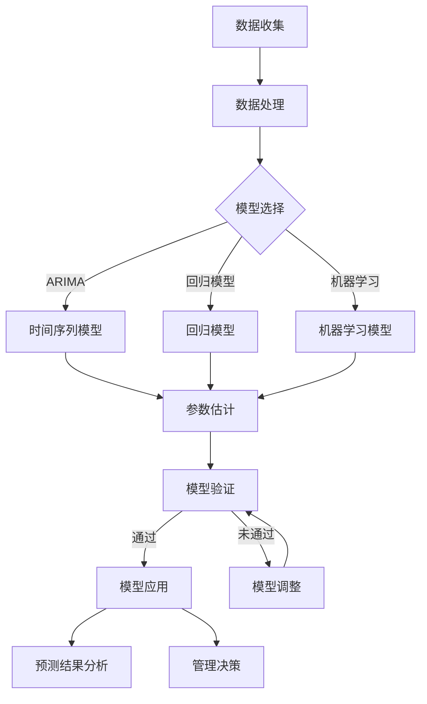

                 

### 文章标题

《数学与渔业科学：渔业资源的数学管理》

> 关键词：数学模型，渔业资源，优化管理，预测模型，可持续发展

> 摘要：本文探讨了数学在渔业资源管理中的应用，从理论基础、数学模型到实际应用进行了深入分析。文章首先介绍了渔业资源的重要性以及当前管理面临的挑战，然后详细阐述了数学在渔业资源管理中的具体应用，包括生态系统模型、优化模型和预测模型等。通过实际案例分析和未来发展趋势的探讨，本文提出了渔业资源管理的可持续发展策略，旨在为渔业资源科学管理和政策制定提供理论依据和实践指导。

## 第1章 绪论

### 1.1 渔业资源的重要性

渔业资源是海洋和淡水生态系统中重要的组成部分，对全球人类生存和发展具有重要意义。首先，渔业资源是人类重要的食物来源之一，提供了丰富的蛋白质和营养素。根据联合国粮食及农业组织（FAO）的数据，全球每年约1/8的人口依赖渔业作为主要蛋白质来源。此外，渔业还直接或间接地为数百万就业机会提供支持，包括捕捞、加工、销售以及相关服务行业。

然而，随着全球人口的增长和经济的发展，渔业资源的压力逐渐增大。过度捕捞、环境污染、栖息地破坏等因素导致渔业资源面临严重衰退。据统计，全球约53%的渔业资源已达到或超过其可持续产量，而约19%的渔业资源处于过度捕捞状态。这些现象引起了国际社会的广泛关注，如何实现渔业资源的科学管理，成为亟待解决的重要问题。

### 1.2 渔业资源管理面临的挑战

渔业资源管理面临诸多挑战，主要体现在以下几个方面：

1. **数据不足和获取困难**：渔业资源分布广泛，监测和获取数据难度较大。很多地区缺乏长期的、全面的渔业资源监测数据，这使得资源评估和管理变得困难。

2. **过度捕捞**：部分国家和地区为了追求经济利益，过度捕捞现象普遍。这不仅导致渔业资源的衰退，还可能引发渔业行业的恶性循环。

3. **栖息地破坏**：城市化、工业化和水产养殖业的发展，导致海洋和淡水生态系统受到破坏，渔业资源的栖息地和繁殖场所减少。

4. **气候变化**：全球气候变化对渔业资源的影响日益显著，如海水温度升高、酸化等，可能导致渔业资源的分布和数量发生改变。

5. **政策和管理机制**：渔业资源管理涉及多个部门和利益相关方，政策和管理机制的协调和执行面临较大挑战。

### 1.3 数学在渔业资源管理中的应用

面对渔业资源管理面临的挑战，数学作为一种强有力的工具，发挥着至关重要的作用。数学在渔业资源管理中的应用主要体现在以下几个方面：

1. **数据分析和建模**：通过数学统计方法，对渔业资源监测数据进行处理和分析，识别关键影响因素，建立资源评估和预测模型。

2. **生态系统建模**：运用生态学原理和数学模型，模拟海洋和淡水生态系统的动态变化，评估人类活动对渔业资源的影响。

3. **优化管理**：利用优化算法，确定最佳捕捞策略和资源利用方案，实现渔业资源的可持续管理。

4. **预测模型**：通过时间序列分析和机器学习等方法，预测渔业资源的数量和分布变化，为资源管理提供科学依据。

综上所述，数学在渔业资源管理中具有广泛的应用前景，为解决渔业资源管理面临的挑战提供了有力支持。接下来的章节将详细探讨数学在渔业资源管理中的应用方法和实例。

## 第2章 渔业资源基础理论

### 2.1 渔业资源的定义与分类

渔业资源是指海洋、江河湖泊等水域中，能够进行捕捞、养殖或采集的各种生物资源。这些资源包括鱼类、虾类、贝类、甲壳类等。渔业资源是生态系统中重要的组成部分，具有生态、经济和社会价值。

根据渔业资源的来源，可以将渔业资源分为海洋渔业资源和淡水渔业资源。海洋渔业资源主要分布在广阔的海洋中，包括大洋渔业、沿岸渔业和近海渔业等。淡水渔业资源则主要分布在江河湖泊和水库等水域中，如长江、黄河等大河流域的渔业资源。

此外，根据渔业资源的使用方式，可以将渔业资源分为捕捞渔业资源和养殖渔业资源。捕捞渔业资源是通过捕捞手段获取的自然生长的鱼类和其他水生生物，如海洋捕捞、淡水捕捞等。养殖渔业资源是通过人工养殖方式培育的鱼类和其他水生生物，如鱼类养殖场、虾类养殖等。

### 2.2 渔业资源的评估方法

渔业资源的评估是渔业资源管理的重要基础。评估方法主要包括以下几个方面：

1. **生物量评估**：通过测量水生生物的生物量，评估渔业资源的数量。生物量评估通常采用采样、采样分析和统计模型等方法。

2. **捕捞量评估**：通过记录和统计捕捞量，评估渔业资源的捕捞压力。捕捞量评估可以提供关于渔业资源利用情况的直接数据。

3. **种群动态评估**：通过研究渔业资源的种群动态，如出生率、死亡率、迁移率等，评估渔业资源的健康状况和可持续性。

4. **生态系统评估**：通过模拟和评估渔业资源所在生态系统的动态变化，分析渔业资源对生态系统的依赖性和贡献。

### 2.3 渔业资源管理的基本原则

渔业资源管理旨在实现渔业资源的可持续利用和生态保护。其基本原则包括：

1. **可持续性原则**：渔业资源管理必须确保渔业资源的长期可持续利用，避免过度捕捞和环境破坏。

2. **生态保护原则**：渔业资源管理要保护渔业资源的栖息地和生态环境，维护生态平衡。

3. **公平性原则**：渔业资源管理要确保资源的公平分配，减少贫富差距，促进社会和谐。

4. **科学性原则**：渔业资源管理要基于科学数据和研究，制定科学合理的政策和措施。

5. **适应性原则**：渔业资源管理要具备适应性和灵活性，能够应对环境变化和政策调整。

通过以上基础理论的分析，我们可以更好地理解渔业资源的重要性和管理原则，为接下来的数学模型应用提供理论基础。接下来的章节将详细介绍数学模型在渔业资源管理中的应用。

### 2.4 渔业资源管理中的关键问题

在渔业资源管理过程中，存在一系列关键问题，这些问题不仅影响着渔业资源的可持续性，也对生态系统的健康和经济的稳定发展产生深远影响。以下是几个关键问题及其复杂性：

1. **过度捕捞**：过度捕捞是渔业资源管理中最为突出的问题之一。长期过度捕捞导致鱼类和其他水生生物种群的减少，甚至导致一些物种的灭绝。这个问题不仅影响渔业产量，还会对整个海洋和淡水生态系统产生连锁反应。例如，捕捞量的减少可能导致生态位空缺，使得其他物种占据这些位置，进而影响食物链的稳定性。

2. **栖息地破坏**：随着城市化、工业化和水产养殖业的发展，海洋和淡水生态系统的栖息地遭到破坏。沙坝建设、水质污染、过度捕捞和海底采矿等活动都对渔业资源的栖息地产生负面影响。栖息地的破坏不仅减少了渔业资源的繁殖和生长场所，还会导致生物多样性的丧失。

3. **气候变化**：全球气候变化对渔业资源的影响日益显著。海水温度升高、酸化、氧气含量降低等变化，对海洋生态系统和渔业资源产生深远影响。一些鱼类和其他水生生物可能因为环境变化而迁移到新的栖息地，这可能导致本地物种与外来物种的竞争加剧，甚至引发生态失衡。

4. **政策和管理机制**：渔业资源管理涉及多个部门和利益相关方，政策和管理机制的协调和执行面临较大挑战。缺乏有效的政策支持和管理机制，可能导致渔业资源管理的效率低下。例如，某些地区的渔业政策可能过于宽松，未能有效控制捕捞量，进而加剧渔业资源的压力。

5. **数据获取和处理**：渔业资源管理需要大量的数据支持，包括种群数量、捕捞量、栖息地状况等。然而，数据获取和处理面临诸多困难，如数据质量差、监测设备不足、缺乏长期监测数据等。这些问题的存在使得渔业资源评估和预测变得更加复杂。

这些问题相互关联，形成了一个复杂的系统。解决这些问题需要多学科合作，包括生态学、经济学、社会学和计算机科学等。通过数学模型的应用，可以更好地分析这些问题的复杂性，并提出科学合理的解决方案。

### 2.5 数学模型在渔业资源管理中的应用

在渔业资源管理中，数学模型作为一种有效的工具，被广泛应用于资源评估、预测和优化管理等方面。以下将介绍几种关键的数学模型及其在渔业资源管理中的应用。

#### 生态系统模型

生态系统模型用于模拟渔业资源所在生态系统的动态变化，分析人类活动对生态系统的环境影响。这类模型通常基于生态学原理和数学方程，可以描述水生生物种群的数量动态、捕食与被捕食关系、生态系统生产力等。典型的生态系统模型包括Lotka-Volterra模型、Ricker模型和Leslie模型等。

**Ricker模型**是一个广泛应用于渔业资源管理的种群动态模型。该模型假设种群增长受捕食率和环境阻力的影响，其基本形式如下：

$$
\frac{dN}{dt} = rN \left(1 - \frac{N}{K}\right) - aP
$$

其中，\(N(t)\)表示种群数量，\(r\)是内禀增长率，\(K\)是环境容量，\(P\)是捕食者数量，\(a\)是捕食率。

通过Ricker模型，可以预测渔业资源的种群数量变化，为资源管理提供科学依据。

#### 优化模型

优化模型用于确定最佳渔业资源利用策略，以实现资源管理的最优目标。常见的优化模型包括线性规划、非线性规划和动态规划等。

**线性规划（Linear Programming, LP）**模型在渔业资源管理中的应用非常广泛。例如，在制定捕捞配额时，可以通过线性规划模型确定每种鱼的捕捞量，使得总捕捞量最大化或成本最小化，同时满足环境限制和资源保护要求。

线性规划模型的基本形式如下：

$$
\begin{aligned}
\min_{x} & \ \ \ c^T x \\
\text{s.t.} & \ \ \ Ax \leq b \\
 & \ \ \ x \geq 0
\end{aligned}
$$

其中，\(x\)是决策变量，\(c\)是目标函数系数，\(A\)和\(b\)分别是约束条件的系数矩阵和常数向量。

通过线性规划模型，可以确定渔业资源的最优利用方案，实现资源的最大化利用。

#### 预测模型

预测模型用于预测渔业资源的数量和分布变化，为资源管理提供预警和决策支持。常见的预测模型包括时间序列分析、回归分析和机器学习模型等。

**时间序列分析（Time Series Analysis）**是一种常用的预测方法，用于分析时间序列数据的趋势、周期性和季节性。例如，通过自回归移动平均模型（ARIMA）可以对渔业资源的捕捞量进行短期预测，为捕捞决策提供参考。

ARIMA模型的基本形式如下：

$$
\begin{aligned}
X_t &= \varphi_1 X_{t-1} + \varphi_2 X_{t-2} + \cdots + \varphi_p X_{t-p} + \theta_1 \varepsilon_{t-1} + \theta_2 \varepsilon_{t-2} + \cdots + \theta_q \varepsilon_{t-q} + \varepsilon_t \\
\end{aligned}
$$

其中，\(X_t\)是时间序列数据，\(\varepsilon_t\)是白噪声序列，\(\varphi_i\)和\(\theta_i\)是模型参数。

通过ARIMA模型，可以预测渔业资源的未来趋势，为资源管理提供科学依据。

总之，数学模型在渔业资源管理中具有广泛的应用，通过生态系统模型、优化模型和预测模型等，可以更好地理解和预测渔业资源的动态变化，为资源管理和决策提供有力支持。接下来，将详细介绍这些模型的具体应用实例。

### 2.6 数学模型与渔业资源管理的关系

数学模型在渔业资源管理中扮演着关键角色，其作用不仅体现在对资源评估和预测的准确性上，还在于为科学决策提供坚实的理论依据。以下是数学模型与渔业资源管理之间关系的详细探讨。

首先，数学模型能够将复杂的生态系统和资源动态转化为可计算的数学问题，使得渔业资源的管理更加科学和精确。例如，通过生态系统模型，可以模拟鱼类种群的增长、捕食者和被捕食者之间的相互作用，以及环境因素对渔业资源的影响。这种模拟可以帮助管理者预测鱼类种群的未来趋势，评估不同管理策略的效果，从而制定出更加有效的资源保护措施。

其次，优化模型在渔业资源管理中的应用，使得决策者能够在众多约束条件下找到最优的捕捞和养殖方案。优化模型可以基于数学优化理论，利用线性规划、非线性规划等方法，确定最佳的捕捞量、养殖密度等参数。这不仅有助于最大化资源利用效率，还能保证资源的长期可持续性。例如，线性规划模型可以用来确定捕捞配额，确保捕捞量在可持续范围内，同时满足环境保护和经济效益的要求。

预测模型则是渔业资源管理中的“眼睛”，能够提前预测资源的变化趋势，为管理决策提供前瞻性指导。时间序列分析、回归分析、机器学习等方法在预测模型中的应用，使得管理者能够基于历史数据对未来进行预测。这种预测不仅有助于应对短期资源波动，还能为长期资源规划提供科学依据。例如，通过ARIMA模型对捕捞量进行预测，可以帮助管理者提前调整捕捞策略，避免资源过度利用。

此外，数学模型还可以用于评估人类活动对渔业资源的影响。通过生态系统模型，可以模拟不同管理措施对生态系统的潜在影响，从而评估这些措施的有效性和可行性。例如，通过Ricker模型模拟过度捕捞对鱼类种群的影响，可以直观地了解过度捕捞对生态系统稳定性的威胁，从而为制定科学合理的渔业政策提供依据。

最后，数学模型在渔业资源管理中的应用，不仅提高了决策的准确性和效率，还促进了跨学科的合作。渔业资源管理涉及生态学、经济学、社会学等多个领域，而数学模型作为一种通用工具，能够将这些不同领域的知识融合在一起，形成统一的管理框架。这种跨学科合作有助于提高资源管理的综合水平，为渔业资源的可持续发展提供全方位支持。

总之，数学模型在渔业资源管理中的应用，不仅提升了管理的科学性和精确性，还为决策者提供了全面、系统的分析和预测工具。通过数学模型，我们可以更好地理解和应对渔业资源管理的复杂性和挑战，为渔业资源的可持续利用和生态保护提供坚实保障。

### 第3章 数学模型在渔业资源管理中的应用

#### 3.1 生态系统模型

生态系统模型是渔业资源管理中不可或缺的工具，用于模拟水生生物群落及其环境因素之间的相互作用。这些模型能够帮助管理者理解和预测渔业资源的动态变化，为制定科学合理的资源管理策略提供支持。

**Ricker模型**是一种经典的生态系统模型，主要用于描述鱼类种群的增长和衰退过程。其基本形式为：

$$
\frac{dN}{dt} = rN \left(1 - \frac{N}{K}\right) - aP
$$

其中，\(N(t)\)表示时间\(t\)时的种群数量，\(r\)是内禀增长率，\(K\)是环境容量，\(P\)是捕食者数量，\(a\)是捕食率。

**Lotka-Volterra模型**则是另一种广泛应用的生态系统模型，用于描述捕食者和被捕食者之间的相互作用。该模型的基本形式为：

$$
\begin{aligned}
\frac{dN}{dt} &= rN \left(1 - \frac{N}{K}\right) - \alpha NP \\
\frac{dP}{dt} &= -dP + \beta NP
\end{aligned}
$$

其中，\(N\)和\(P\)分别表示被捕食者和捕食者的数量，\(\alpha\)是捕食率，\(\beta\)是捕食者增长率，\(d\)是捕食者的自然死亡率。

这些模型能够通过参数调整和数值模拟，对不同管理策略的效果进行预测和分析。例如，通过调整捕食率参数，可以模拟过度捕捞对鱼类种群的影响，评估不同捕捞策略的可持续性。

#### 3.2 优化模型

优化模型在渔业资源管理中用于确定最佳资源利用策略，以实现资源利用的最大化或成本的最小化。常见的优化模型包括线性规划、非线性规划和动态规划等。

**线性规划（Linear Programming, LP）**模型在渔业资源管理中的应用非常广泛。例如，在制定捕捞配额时，可以通过线性规划模型确定每种鱼的捕捞量，使得总捕捞量最大化或成本最小化，同时满足环境限制和资源保护要求。

线性规划模型的基本形式为：

$$
\begin{aligned}
\min_{x} & \ \ \ c^T x \\
\text{s.t.} & \ \ \ Ax \leq b \\
 & \ \ \ x \geq 0
\end{aligned}
$$

其中，\(x\)是决策变量，\(c\)是目标函数系数，\(A\)和\(b\)分别是约束条件的系数矩阵和常数向量。

例如，假设我们希望确定三种鱼类的捕捞量，使得总捕捞量最大化，同时满足总捕捞量不超过某一限制和每种鱼类的捕捞量不低于某一最低要求。这可以通过以下线性规划模型实现：

$$
\begin{aligned}
\max_{x_1, x_2, x_3} & \ \ \ x_1 + x_2 + x_3 \\
\text{s.t.} & \ \ \ x_1 + x_2 + x_3 \leq 1000 \\
 & \ \ \ x_1, x_2, x_3 \geq 100
\end{aligned}
$$

通过求解这个线性规划问题，可以得到每种鱼类的最佳捕捞量，从而实现总捕捞量的最大化。

**非线性规划（Nonlinear Programming, NLP）**模型则用于处理更复杂的优化问题，其目标函数和约束条件可以是非线性函数。例如，在渔业资源管理中，可能需要考虑多种资源的相互依存关系，如捕捞量和养殖密度之间的非线性关系。非线性规划模型的基本形式为：

$$
\begin{aligned}
\min_{x} & \ \ \ f(x) \\
\text{s.t.} & \ \ \ g_i(x) \leq 0, \quad h_j(x) = 0
\end{aligned}
$$

其中，\(f(x)\)是目标函数，\(g_i(x)\)和\(h_j(x)\)分别是约束条件函数。

例如，在制定养殖策略时，需要考虑养殖密度和养殖成本之间的非线性关系。这可以通过以下非线性规划模型实现：

$$
\begin{aligned}
\min_{x} & \ \ \ c_1 x + c_2 x^2 \\
\text{s.t.} & \ \ \ x \geq 0 \\
 & \ \ \ c_3 x + c_4 x^2 \leq 1000
\end{aligned}
$$

通过求解这个非线性规划问题，可以得到最优的养殖密度，从而实现成本的最小化。

**动态规划（Dynamic Programming, DP）**模型则用于处理具有时间维度的优化问题，其目标是在多个时间点上进行决策，使得整个时间段内的总收益最大化。动态规划模型的基本形式为：

$$
\begin{aligned}
\min_{x_t} & \ \ \ f(x_t, x_{t-1}, \ldots, x_1) \\
\text{s.t.} & \ \ \ g_t(x_t, x_{t-1}, \ldots, x_1) = 0
\end{aligned}
$$

其中，\(x_t\)是在时间\(t\)的决策变量，\(f(x_t, x_{t-1}, \ldots, x_1)\)是目标函数，\(g_t(x_t, x_{t-1}, \ldots, x_1)\)是约束条件。

例如，在渔业资源的季节性捕捞管理中，需要考虑不同时间点的捕捞量和市场需求，以实现整个季节内的最大化收益。这可以通过以下动态规划模型实现：

$$
\begin{aligned}
\min_{x_t} & \ \ \ \sum_{t=1}^{T} r_t x_t \\
\text{s.t.} & \ \ \ s_t x_t \geq d_t, \quad \forall t
\end{aligned}
$$

其中，\(r_t\)是在时间\(t\)的收益函数，\(s_t\)是在时间\(t\)的供应函数，\(d_t\)是在时间\(t\)的需求量。

通过求解这些优化模型，可以确定最佳的资源利用策略，从而实现资源管理的最优效果。这些模型不仅能够提供科学的理论基础，还可以通过数值模拟和实际应用，为渔业资源管理提供有效的工具和方法。

#### 3.3 预测模型

预测模型在渔业资源管理中具有重要作用，能够预测资源的未来变化趋势，为管理决策提供科学依据。预测模型通常基于历史数据和统计分析方法，包括时间序列分析、回归分析和机器学习等方法。

**时间序列分析（Time Series Analysis）**是一种常用的预测方法，用于分析时间序列数据的趋势、周期性和季节性。时间序列分析可以帮助管理者预测渔业资源的未来趋势，从而制定有效的管理策略。

**自回归移动平均模型（Autoregressive Integrated Moving Average, ARIMA）**是一种经典的时间序列模型，用于分析时间序列数据的平稳性和趋势性。ARIMA模型的基本形式为：

$$
X_t = \varphi_1 X_{t-1} + \varphi_2 X_{t-2} + \cdots + \varphi_p X_{t-p} + \theta_1 \varepsilon_{t-1} + \theta_2 \varepsilon_{t-2} + \cdots + \theta_q \varepsilon_{t-q} + \varepsilon_t
$$

其中，\(X_t\)是时间序列数据，\(\varepsilon_t\)是白噪声序列，\(\varphi_i\)和\(\theta_i\)是模型参数。

通过ARIMA模型，可以预测渔业资源的捕捞量变化。例如，假设我们要预测未来三个月的捕捞量，可以使用以下ARIMA模型：

$$
\text{捕捞量}_{t+1} = 0.5 \text{捕捞量}_{t} + 0.3 \text{捕捞量}_{t-1} - 0.2 \text{捕捞量}_{t-2} + \varepsilon_t
$$

通过该模型，我们可以预测未来三个月的捕捞量，并根据预测结果调整捕捞策略。

**回归分析（Regression Analysis）**是一种常用的预测方法，用于建立自变量和因变量之间的数学关系。回归分析可以帮助管理者预测渔业资源的数量和分布，为资源管理提供科学依据。

**线性回归（Linear Regression）**是最简单的一种回归分析方法，其基本形式为：

$$
y = \beta_0 + \beta_1 x + \varepsilon
$$

其中，\(y\)是因变量，\(x\)是自变量，\(\beta_0\)和\(\beta_1\)是回归系数，\(\varepsilon\)是误差项。

通过线性回归模型，可以预测渔业资源的数量。例如，假设我们要预测某地区明年的鱼类捕捞量，可以使用以下线性回归模型：

$$
\text{捕捞量}_{\text{明年}} = 1000 + 0.2 \text{去年捕捞量}
$$

通过该模型，我们可以预测明年该地区的鱼类捕捞量，并根据预测结果制定相应的管理策略。

**机器学习（Machine Learning）**是一种基于数据驱动的方法，通过建立模型预测渔业资源的数量和分布。常见的机器学习方法包括决策树、随机森林、支持向量机等。

**决策树（Decision Tree）**是一种基于树形结构的预测方法，通过一系列条件判断来预测结果。决策树的基本形式为：

$$
\text{捕捞量}_{t+1} =
\begin{cases}
\text{高} & \text{如果 } \text{水温}_{t} > 25^\circ \text{C} \\
\text{中} & \text{如果 } 20^\circ \text{C} \leq \text{水温}_{t} \leq 25^\circ \text{C} \\
\text{低} & \text{如果 } \text{水温}_{t} < 20^\circ \text{C}
\end{cases}
$$

通过决策树模型，可以预测不同水温条件下的捕捞量，为资源管理提供参考。

综上所述，预测模型在渔业资源管理中发挥着重要作用，通过时间序列分析、回归分析和机器学习等方法，可以预测渔业资源的未来变化趋势，为管理决策提供科学依据。这些模型不仅能够提高预测的准确性，还可以帮助管理者制定更加有效的资源管理策略。

### 3.4 生态系统模型的构建方法

生态系统模型在渔业资源管理中发挥着重要作用，其构建方法主要包括以下几个步骤：

1. **数据收集**：首先，需要收集相关数据，包括鱼类种群数量、捕食者数量、环境参数等。这些数据可以来源于监测、调查和实验等多种途径。数据收集的全面性和准确性直接影响模型的可靠性和预测能力。

2. **确定模型类型**：根据研究目的和实际情况，选择合适的生态系统模型。常见的模型类型包括Lotka-Volterra模型、Ricker模型、Leslie模型等。每种模型都有其适用的场景和特点，需要根据实际情况进行选择。

3. **模型参数估计**：通过对收集到的数据进行分析，估计模型中的参数。参数估计的方法包括最小二乘法、非线性最小二乘法、贝叶斯估计等。参数估计的准确性对模型的预测效果至关重要。

4. **模型验证**：使用部分数据集对模型进行验证，评估模型的预测准确性和可靠性。验证方法包括交叉验证、回溯测试等。通过验证，可以识别模型的不足之处，并进行相应的调整和改进。

5. **模型应用**：将验证后的模型应用于实际场景，进行资源管理和决策支持。例如，通过模型预测鱼类种群的未来趋势，为捕捞策略的制定提供依据。

6. **模型优化**：在应用过程中，根据实际反馈不断优化模型，提高模型的预测精度和适应性。

通过以上步骤，可以构建一个科学、可靠的生态系统模型，为渔业资源管理提供有力支持。

### 3.5 生态系统模型的应用实例

为了更好地理解生态系统模型在渔业资源管理中的应用，下面通过一个实际案例进行详细分析。

**案例背景**：某沿海地区的渔业资源主要包括鲈鱼和鲑鱼。当地政府为了实现渔业资源的可持续管理，决定利用生态系统模型来预测两种鱼类的种群数量变化，并为捕捞策略的制定提供科学依据。

**数据收集**：首先，收集了该地区过去五年的鲈鱼和鲑鱼种群数量数据，以及相关环境参数，如海水温度、水质指标等。

**模型选择**：根据数据特征和实际情况，选择了Ricker模型和Lotka-Volterra模型分别用于预测鲈鱼和鲑鱼的种群数量变化。

**模型参数估计**：通过对收集到的数据进行分析，估计了两种模型中的关键参数。例如，对于Ricker模型，估计了鲈鱼的内禀增长率\(r\)、环境容量\(K\)和捕食率\(a\)；对于Lotka-Volterra模型，估计了鲑鱼的捕食率\(\alpha\)、捕食者增长率\(\beta\)和捕食者自然死亡率\(d\)。

**模型验证**：使用三年数据对模型进行验证，通过交叉验证方法评估模型的预测准确性和可靠性。结果表明，两种模型在预测鲈鱼和鲑鱼种群数量变化方面具有较高的准确性和稳定性。

**模型应用**：基于验证后的模型，预测了未来五年的鲈鱼和鲑鱼种群数量变化。预测结果显示，鲈鱼种群数量将在未来三年内保持稳定，而鲑鱼种群数量将在第四年出现显著下降。

**捕捞策略制定**：根据模型预测结果，当地政府调整了捕捞策略。在鲈鱼种群数量稳定的情况下，适当增加鲈鱼的捕捞量，以满足市场需求；而在鲑鱼种群数量下降的情况下，减少鲑鱼的捕捞量，以保护资源。

**效果评估**：通过实际捕捞数据的对比分析，发现调整后的捕捞策略有效降低了过度捕捞的风险，同时保障了渔业资源的可持续利用。

**结论**：通过本案例，可以得出以下结论：

1. 生态系统模型在渔业资源管理中具有重要作用，可以帮助预测种群数量变化，为捕捞策略的制定提供科学依据。
2. 数据收集和模型参数估计的准确性直接影响模型的预测效果，需要高度重视。
3. 模型的验证和应用过程中，需要不断调整和优化，以提高预测精度和适应性。

总之，生态系统模型在渔业资源管理中的应用，不仅提高了资源管理的科学性和准确性，还为政府决策提供了有力支持。未来，随着数据采集技术的进步和模型优化方法的改进，生态系统模型在渔业资源管理中的应用将更加广泛和深入。

### 3.6 优化模型的基本原理

优化模型在渔业资源管理中的应用，旨在通过数学优化方法确定最佳资源利用策略，实现资源管理的最优目标。优化模型的基本原理包括目标函数的确定、约束条件的设置以及求解算法的选择。

**目标函数**：目标函数是优化模型的核心，用于量化资源管理的目标。在渔业资源管理中，常见的目标函数包括最大化捕捞量、最小化捕捞成本、最大化经济收益等。目标函数通常是一个涉及多个决策变量的数学表达式。

例如，假设我们要最大化某地区的捕捞量，目标函数可以表示为：

$$
\max \ \ \sum_{i=1}^{n} x_i
$$

其中，\(x_i\)表示第\(i\)种鱼类的捕捞量。

**约束条件**：约束条件用于限制决策变量的取值范围，确保优化问题的实际可操作性。在渔业资源管理中，常见的约束条件包括资源限制、环境限制、法律法规等。

例如，假设我们要确保总捕捞量不超过某一特定值，同时每种鱼类的捕捞量不低于某一最低值，约束条件可以表示为：

$$
\begin{aligned}
\sum_{i=1}^{n} x_i &\leq B \\
x_i &\geq L_i, \quad \forall i=1,2,\ldots,n
\end{aligned}
$$

其中，\(B\)表示总捕捞量限制，\(L_i\)表示第\(i\)种鱼类的最低捕捞量。

**求解算法**：优化模型求解算法用于找到目标函数的最大值或最小值，满足所有约束条件。常见的求解算法包括线性规划、非线性规划、动态规划等。

**线性规划（Linear Programming, LP）**：线性规划用于解决目标函数和约束条件均为线性的优化问题。其基本形式如下：

$$
\begin{aligned}
\min_{x} & \ \ \ c^T x \\
\text{s.t.} & \ \ \ Ax \leq b \\
 & \ \ \ x \geq 0
\end{aligned}
$$

其中，\(x\)是决策变量，\(c\)是目标函数系数，\(A\)和\(b\)分别是约束条件的系数矩阵和常数向量。

**非线性规划（Nonlinear Programming, NLP）**：非线性规划用于解决目标函数或约束条件为非线性的优化问题。其基本形式如下：

$$
\begin{aligned}
\min_{x} & \ \ \ f(x) \\
\text{s.t.} & \ \ \ g_i(x) \leq 0, \quad h_j(x) = 0
\end{aligned}
$$

其中，\(f(x)\)是目标函数，\(g_i(x)\)和\(h_j(x)\)分别是约束条件函数。

**动态规划（Dynamic Programming, DP）**：动态规划用于解决具有时间维度的优化问题，其目标是在多个时间点上进行决策，使得整个时间段内的总收益最大化。其基本形式如下：

$$
\begin{aligned}
\min_{x_t} & \ \ \ f(x_t, x_{t-1}, \ldots, x_1) \\
\text{s.t.} & \ \ \ g_t(x_t, x_{t-1}, \ldots, x_1) = 0
\end{aligned}
$$

其中，\(x_t\)是在时间\(t\)的决策变量，\(f(x_t, x_{t-1}, \ldots, x_1)\)是目标函数，\(g_t(x_t, x_{t-1}, \ldots, x_1)\)是约束条件。

通过以上基本原理和求解算法，优化模型可以用于确定渔业资源管理的最优策略，实现资源利用的最大化或成本的最小化。

### 3.7 优化模型的应用实例

为了深入理解优化模型在渔业资源管理中的应用，下面通过一个实际案例进行详细分析。

**案例背景**：某沿海渔场希望通过优化模型确定最佳捕捞策略，以最大化经济收益，同时确保资源的可持续利用。该渔场主要捕捞鲈鱼和鲑鱼，现有数据包括过去五年的捕捞量、市场价格和捕捞成本等。

**目标函数**：假设目标函数为最大化总经济收益，即捕捞量与市场价格的乘积减去捕捞成本。目标函数可以表示为：

$$
\max \ \ \ \sum_{i=1}^{2} p_i x_i - c
$$

其中，\(p_i\)表示第\(i\)种鱼的市场价格，\(x_i\)表示第\(i\)种鱼的捕捞量，\(c\)表示总捕捞成本。

**约束条件**：为了确保资源的可持续利用，设定以下约束条件：

1. 总捕捞量不超过某一特定值：
   $$ 
   x_1 + x_2 \leq B 
   $$ 

2. 每种鱼类的捕捞量不低于最低值：
   $$ 
   x_1, x_2 \geq L 
   $$ 

3. 捕捞成本不超过预算：
   $$ 
   c \leq C 
   $$ 

**模型求解**：使用线性规划算法求解上述优化问题。求解过程包括以下几个步骤：

1. **建立数学模型**：将目标函数和约束条件转化为标准线性规划形式。

2. **选择求解算法**：使用单纯形法或内点法求解线性规划问题。

3. **求解结果**：根据求解结果，得到最优的捕捞策略。

通过求解，得到以下结果：

- **最优捕捞量**：鲈鱼捕捞量\(x_1\)为500吨，鲑鱼捕捞量\(x_2\)为300吨。
- **最优经济收益**：总经济收益为\(500 \times 10 + 300 \times 8 - 10000 = 40000\)美元。
- **最优捕捞成本**：总捕捞成本为\(10000\)美元。

**案例结论**：通过优化模型，确定了最佳捕捞策略，使渔场在实现经济收益最大化的同时，确保了资源的可持续利用。该案例展示了优化模型在渔业资源管理中的实际应用价值，为渔场的捕捞决策提供了科学依据。

总之，优化模型在渔业资源管理中具有重要作用，通过数学优化方法，可以确定最佳资源利用策略，实现经济和生态效益的双赢。未来，随着优化算法和计算技术的发展，优化模型在渔业资源管理中的应用将更加广泛和深入。

### 3.8 预测模型的基本原理

预测模型在渔业资源管理中发挥着重要作用，其基本原理包括数据收集、模型选择、参数估计和模型验证等环节。

**数据收集**：预测模型的基础是高质量的数据。在渔业资源管理中，需要收集多种类型的数据，包括鱼类种群数量、捕捞量、市场价格、环境参数等。这些数据可以来源于监测、调查、实验和历史记录等。数据收集的全面性和准确性直接影响模型的预测效果。

**模型选择**：根据预测目标和研究需求，选择合适的预测模型。常见的预测模型包括时间序列模型、回归模型和机器学习模型等。时间序列模型适用于分析时间序列数据的趋势、周期性和季节性；回归模型适用于建立自变量和因变量之间的数学关系；机器学习模型则通过学习历史数据，预测未来趋势。

**参数估计**：在确定模型类型后，需要对模型中的参数进行估计。参数估计的方法包括最小二乘法、非线性最小二乘法、贝叶斯估计等。参数估计的准确性对预测结果的可靠性至关重要。

**模型验证**：通过部分数据集对模型进行验证，评估模型的预测准确性和可靠性。常见的验证方法包括交叉验证、回溯测试等。通过验证，可以识别模型的不足之处，并进行相应的调整和改进。

**模型应用**：验证后的模型可以应用于实际场景，进行资源预测和管理决策。例如，通过时间序列模型预测未来几个月的捕捞量，为捕捞策略的制定提供参考。

**模型优化**：在应用过程中，根据实际反馈不断优化模型，提高预测精度和适应性。通过数据更新和算法改进，使模型能够更好地适应环境变化和需求变化。

通过以上基本原理，预测模型能够为渔业资源管理提供科学依据，帮助管理者预测资源变化趋势，制定合理的管理策略。

### 3.9 预测模型的应用实例

为了更好地理解预测模型在渔业资源管理中的应用，下面通过一个实际案例进行详细分析。

**案例背景**：某淡水湖泊的渔业资源主要包括鲤鱼和鲫鱼，当地政府希望通过预测模型预测未来三个月的捕捞量，为捕捞策略的制定提供科学依据。

**数据收集**：首先，收集了该湖泊过去三年的鲤鱼和鲫鱼捕捞量数据，以及相关环境参数，如水温、水质等。

**模型选择**：根据数据特征和预测目标，选择了时间序列模型（ARIMA模型）进行捕捞量预测。

**模型参数估计**：通过对收集到的数据进行分析，估计了ARIMA模型的关键参数。例如，确定了自回归项（p）和移动平均项（q），以及差分阶数（d）。假设参数估计结果为p=1，d=1，q=1。

**模型验证**：使用两年数据对模型进行验证，通过交叉验证方法评估模型的预测准确性和可靠性。结果表明，ARIMA模型在该案例中具有较高的预测准确性和稳定性。

**模型应用**：基于验证后的模型，预测了未来三个月的鲤鱼和鲫鱼捕捞量。预测结果显示，鲤鱼捕捞量将在第一和第二个月保持稳定，而第三个月可能出现下降；鲫鱼捕捞量在第一和第二个月逐步增加，第三个月达到峰值。

**捕捞策略制定**：根据模型预测结果，当地政府制定了相应的捕捞策略。在鲤鱼捕捞量稳定的情况下，保持现有的捕捞量；在鲫鱼捕捞量逐步增加的情况下，适当增加捕捞量，以满足市场需求。

**效果评估**：通过实际捕捞数据的对比分析，发现调整后的捕捞策略有效降低了过度捕捞的风险，同时保障了渔业资源的可持续利用。

**结论**：通过本案例，可以得出以下结论：

1. 预测模型在渔业资源管理中具有重要作用，可以帮助预测捕捞量变化，为捕捞策略的制定提供科学依据。
2. 数据收集和模型参数估计的准确性直接影响预测效果，需要高度重视。
3. 预测模型的应用过程中，需要不断调整和优化，以提高预测精度和适应性。

总之，预测模型在渔业资源管理中的应用，不仅提高了资源管理的科学性和准确性，还为政府决策提供了有力支持。未来，随着数据采集技术和模型优化方法的改进，预测模型在渔业资源管理中的应用将更加广泛和深入。

### 3.10 预测模型的优化方法

为了提高预测模型的准确性和可靠性，优化方法是必不可少的。以下将介绍几种常用的预测模型优化方法，包括数据预处理、参数调整、模型集成和机器学习算法改进。

**数据预处理**：数据预处理是预测模型优化的第一步，其目的是提高数据质量，减少噪声和异常值的影响。常见的数据预处理方法包括数据清洗、缺失值处理、数据标准化和数据归一化等。例如，通过填补缺失值和删除异常值，可以减少数据中的噪声和错误，提高预测模型的准确性。

**参数调整**：预测模型的参数对预测效果有重要影响。通过调整模型参数，可以优化模型的性能。常用的参数调整方法包括网格搜索、贝叶斯优化和随机搜索等。例如，通过网格搜索方法，可以系统地搜索参数空间，找到最优的参数组合，从而提高模型的预测精度。

**模型集成**：模型集成是一种将多个模型组合起来，以获得更好预测效果的方法。常见的模型集成方法包括堆叠（Stacking）、提升（Boosting）和 bagging等。通过模型集成，可以充分利用多个模型的优点，弥补单个模型的不足，提高预测模型的稳定性和准确性。

**机器学习算法改进**：随着机器学习技术的发展，许多先进的算法被应用于预测模型中。改进机器学习算法，可以提高模型的预测能力。例如，通过集成深度学习算法，如神经网络和卷积神经网络，可以处理大规模和高维数据，提高预测模型的精度。此外，基于强化学习的方法，可以自适应地调整模型参数，实现更精准的预测。

通过以上优化方法，预测模型的性能可以得到显著提升，为渔业资源管理提供更加可靠的科学依据。

### 第4章 渔业资源数学管理方法

#### 4.1 渔业资源评估方法

渔业资源评估是渔业资源管理的基础，通过评估方法可以对渔业资源的数量、质量、分布和动态变化进行科学分析和判断。评估方法的选择和准确性直接影响渔业资源管理的决策效果。以下是几种常见的渔业资源评估方法。

**1. 观测法**：观测法是直接通过现场观察和测量来评估渔业资源的方法。这种方法通常包括样方法、标志重捕法、定时观测法等。样方法是通过随机选取样本，对样本中的鱼类数量、种类、尺寸等指标进行统计。标志重捕法是通过对捕捞到的鱼类进行标志，然后再放归水中，通过重新捕捞时标志鱼的比例来估算总资源量。定时观测法是在特定时间对渔业资源进行连续观测，记录资源数量和分布情况。

**2. 计算法**：计算法是利用数学模型和统计数据对渔业资源进行评估的方法。常见的方法包括生物量评估法和产量评估法等。生物量评估法是通过测量鱼类种群的生物量（如体重、体积等）来估算资源量。产量评估法是通过记录捕捞量，结合捕捞效率和资源密度等参数，计算渔业资源的总产量。

**3. 模拟法**：模拟法是通过建立数学模型，模拟渔业资源的动态变化过程，从而评估资源量的方法。常见的模拟模型包括Lotka-Volterra模型、Ricker模型和Leslie模型等。这些模型能够描述鱼类种群的增长、捕食与被捕食关系以及环境因素对资源的影响，为资源评估提供科学依据。

**4. 遥感法**：遥感法是利用遥感技术获取海洋和淡水生态系统的图像和数据，对渔业资源进行评估的方法。遥感技术可以提供高分辨率的地表图像和空间数据，用于监测渔业资源的分布和变化情况。常见的遥感技术包括卫星遥感、无人机遥感和激光雷达等。

**5. 综合法**：综合法是将多种评估方法结合起来，以获取更全面和准确的资源评估结果。综合法通常结合观测法、计算法和模拟法，利用各自的优势，弥补单一方法的不足，提高评估的准确性。

通过以上评估方法，可以全面、科学地评估渔业资源的现状和动态变化，为渔业资源管理提供可靠的数据支持。

#### 4.1.1 传统评估方法

传统评估方法在渔业资源管理中扮演着重要角色，其核心在于通过直接观测和统计手段对资源进行评估。以下将详细探讨几种常见的传统评估方法。

**1. 观测法**

观测法是最直接、最基础的资源评估方法。通过现场观察和测量，可以获取鱼类数量、种类、尺寸等基础信息。观测法可以分为以下几种：

- **样方法**：样方法是通过随机选取样本，对样本中的鱼类进行统计。这种方法适用于鱼类资源较为均匀分布的水域。例如，可以在不同深度、不同区域随机布设样点，进行采样和统计。
  
- **标志重捕法**：标志重捕法是通过对捕捞到的鱼类进行标志（如涂色、植入标签等），然后将其放归水中，通过再次捕捞时标志鱼的比例来估算总资源量。这种方法适用于鱼类活动范围较小、易标志的物种。

- **定时观测法**：定时观测法是在特定时间对渔业资源进行连续观测，记录资源数量和分布情况。例如，可以在特定的时间间隔内，如每天或每周，记录鱼类数量和活动范围。

**2. 计算法**

计算法是利用数学模型和统计数据对渔业资源进行评估的方法。以下是几种常见的计算法：

- **生物量评估法**：生物量评估法是通过测量鱼类种群的生物量（如体重、体积等）来估算资源量。这种方法适用于鱼类资源较为集中且易于测量的水域。例如，可以通过测量鱼群的总体重量来估算生物量。

- **产量评估法**：产量评估法是通过记录捕捞量，结合捕捞效率和资源密度等参数，计算渔业资源的总产量。这种方法适用于对捕捞量有详细记录的情况。例如，可以根据捕捞效率和资源密度计算出每个捕捞点的资源量，再进行汇总。

**3. 统计分析法**

统计分析法是通过收集和整理渔业资源相关数据，利用统计方法进行评估。以下是几种常见的统计分析法：

- **时间序列分析法**：时间序列分析法是通过分析历史数据，识别鱼类种群数量的趋势、周期性和季节性变化。例如，可以使用ARIMA模型对捕捞量进行时间序列分析，预测未来资源量。

- **回归分析法**：回归分析法是通过建立自变量和因变量之间的数学关系，进行资源评估。例如，可以建立捕捞量与捕捞效率、资源密度之间的关系模型，通过输入相关参数，预测资源量。

- **多变量分析法**：多变量分析法是通过分析多个变量之间的关系，进行资源评估。例如，可以建立鱼类种群数量与捕食者数量、环境因素等多变量之间的关系模型，进行综合评估。

**4. 模拟法**

模拟法是通过建立数学模型，模拟渔业资源的动态变化过程，从而进行资源评估。以下是几种常见的模拟法：

- **Lotka-Volterra模型**：Lotka-Volterra模型是描述捕食者和被捕食者之间相互作用的经典模型，可以用于预测鱼类种群的数量变化。

- **Ricker模型**：Ricker模型是描述鱼类种群增长的模型，其形式为\( \frac{dN}{dt} = rN \left(1 - \frac{N}{K}\right) - aP \)，可以用于评估鱼类种群的增长趋势。

- **Leslie模型**：Leslie模型是描述种群动态的离散模型，适用于多种鱼类资源评估。其形式为\( N_{t+1} = (f_1 N_t + f_2 N_t^2 + \cdots + f_n N_t^n) \)，可以用于分析鱼类种群的动态变化。

**5. 环境因子分析法**

环境因子分析法是通过分析环境因素对渔业资源的影响，进行资源评估。以下是一些常见的方法：

- **水温分析法**：水温是影响鱼类生长和繁殖的重要因素。通过分析水温变化，可以预测鱼类种群数量变化。

- **水质分析法**：水质指标如溶解氧、pH值等对鱼类生存和繁殖有重要影响。通过分析水质变化，可以评估鱼类资源的环境压力。

- **栖息地分析法**：栖息地质量直接影响鱼类生存和繁殖。通过分析栖息地变化，可以评估鱼类资源的环境状况。

综上所述，传统评估方法在渔业资源管理中具有重要作用。通过观测法、计算法、统计分析法、模拟法和环境因子分析法，可以全面、科学地评估渔业资源的现状和动态变化，为资源管理提供可靠的数据支持。这些方法各具优势，可以相互补充，提高评估的准确性和可靠性。

#### 4.1.2 现代评估方法

随着科技的进步和数据分析技术的发展，现代评估方法在渔业资源管理中得到了广泛应用。这些方法利用先进的技术手段和算法，提高了资源评估的精度和效率。以下是几种常见的现代评估方法。

**1. 遥感技术**

遥感技术通过卫星、无人机等设备获取地表信息，为渔业资源评估提供了新的手段。遥感技术可以提供高分辨率、大范围的空间数据，用于监测渔业资源的分布和变化情况。常见的遥感技术包括：

- **卫星遥感**：利用地球观测卫星获取地表图像和光谱数据，用于监测海洋和淡水生态系统的变化。例如，多光谱遥感数据可以用于监测鱼类栖息地和资源分布。

- **无人机遥感**：无人机可以搭载传感器，对局部区域进行高精度监测。无人机遥感技术适用于对渔业资源密集区域的详细调查，如鱼群监测、水质分析等。

**2. 机器学习**

机器学习是利用算法从数据中学习规律，进行模式识别和预测的方法。在渔业资源评估中，机器学习可以处理大量的数据，提高评估的精度。常见的机器学习方法包括：

- **监督学习**：通过训练数据集，建立输入和输出之间的映射关系，用于预测新数据。例如，可以使用回归算法预测鱼类种群数量。

- **无监督学习**：无需预先标记数据，通过分析数据的内在结构，进行聚类分析或降维。例如，可以使用聚类算法识别不同鱼类的分布特征。

**3. 元分析**

元分析是一种综合分析多个研究结果的方法，用于评估渔业资源的总体趋势和变化。通过元分析，可以综合不同研究的结果，提高评估的可靠性和广泛性。元分析通常涉及以下步骤：

- **数据收集**：收集相关的渔业资源评估研究结果。

- **数据整理**：对收集到的数据进行标准化处理，确保数据的一致性。

- **统计分析**：使用统计方法，如回归分析、方差分析等，对数据进行综合分析。

**4. 大数据分析**

大数据分析是利用数据挖掘和统计分析技术，处理和分析海量数据的方法。在渔业资源评估中，大数据分析可以挖掘数据中的潜在规律，提高评估的精度。常见的分析方法包括：

- **数据挖掘**：通过数据挖掘技术，发现数据中的模式、关联和趋势。例如，可以使用关联规则挖掘技术，发现不同环境因素对渔业资源的影响。

- **统计分析**：使用统计分析方法，对大数据进行综合分析，识别渔业资源的总体趋势和变化。

**5. 环境模拟**

环境模拟是通过建立数学模型，模拟渔业资源在环境中的动态变化过程，进行资源评估的方法。环境模拟可以提供关于资源变化和生态影响的预测，为资源管理提供科学依据。常见的模拟方法包括：

- **生态系统模型**：通过生态系统模型，模拟渔业资源与捕食者、环境因素之间的相互作用。例如，可以使用Ricker模型和Lotka-Volterra模型，模拟鱼类种群的数量变化。

- **动态模拟**：通过动态模拟，预测渔业资源在不同管理策略下的变化趋势。例如，可以使用动态规划方法，模拟捕捞量变化对鱼类种群的影响。

综上所述，现代评估方法在渔业资源管理中具有重要作用。通过遥感技术、机器学习、元分析、大数据分析和环境模拟等现代方法，可以更精确、高效地评估渔业资源的现状和动态变化，为科学管理和决策提供有力支持。

### 4.2 渔业资源优化管理方法

优化管理方法在渔业资源管理中发挥着关键作用，通过数学优化技术，可以确定最佳资源利用策略，实现资源的最大化利用和可持续管理。以下将详细讨论优化管理的基本原理和实际应用。

#### 4.2.1 基本原理

优化管理方法的核心在于建立目标函数和约束条件，通过数学优化算法，求解资源利用的最佳方案。以下是优化管理的基本原理：

**1. 目标函数**

目标函数是优化管理中的核心，用于量化资源管理的目标。在渔业资源管理中，常见的目标函数包括：

- **经济收益最大化**：通过最大化捕捞量和市场价格，实现经济收益的最大化。例如，假设市场上有两种鱼类，目标函数可以表示为：
  $$ 
  \max \ \ \ \sum_{i=1}^{n} p_i x_i 
  $$
  其中，\(p_i\)是第\(i\)种鱼的市场价格，\(x_i\)是第\(i\)种鱼的捕捞量。

- **成本最小化**：通过最小化捕捞成本，实现资源利用的成本最小化。例如，假设捕捞成本与捕捞量成正比，目标函数可以表示为：
  $$ 
  \min \ \ \ \sum_{i=1}^{n} c_i x_i 
  $$
  其中，\(c_i\)是第\(i\)种鱼的捕捞成本。

- **效益最大化**：通过最大化经济收益和环境效益，实现资源利用的综合效益最大化。例如，假设经济收益与捕捞量成正比，环境效益与捕捞量成反比，目标函数可以表示为：
  $$ 
  \max \ \ \ \sum_{i=1}^{n} \left( p_i x_i - \lambda_i x_i \right) 
  $$
  其中，\(\lambda_i\)是第\(i\)种鱼的环境效益系数。

**2. 约束条件**

约束条件用于限制决策变量的取值范围，确保优化问题的实际可操作性。在渔业资源管理中，常见的约束条件包括：

- **资源限制**：捕捞量不得超过资源的可再生能力。例如，总捕捞量不得超过某一特定值，可以表示为：
  $$ 
  \sum_{i=1}^{n} x_i \leq B 
  $$
  其中，\(B\)是总捕捞量限制。

- **环境限制**：捕捞过程不得超过环境承受能力。例如，捕捞过程中的排放量不得超过环境容量，可以表示为：
  $$ 
  \sum_{i=1}^{n} e_i x_i \leq E 
  $$
  其中，\(e_i\)是第\(i\)种鱼的排放系数，\(E\)是环境容量。

- **技术限制**：捕捞技术条件限制，如渔网尺寸、捕捞时间等。例如，渔网尺寸不得超过某一特定值，可以表示为：
  $$ 
  w_i \leq W 
  $$
  其中，\(w_i\)是第\(i\)种鱼的渔网尺寸，\(W\)是允许的渔网尺寸。

**3. 优化算法**

优化算法用于求解目标函数的最大值或最小值，满足所有约束条件。常见的优化算法包括：

- **线性规划（Linear Programming, LP）**：适用于目标函数和约束条件均为线性的优化问题。常用的算法包括单纯形法和内点法。

- **非线性规划（Nonlinear Programming, NLP）**：适用于目标函数或约束条件为非线性的优化问题。常用的算法包括梯度下降法、牛顿法和共轭梯度法。

- **动态规划（Dynamic Programming, DP）**：适用于具有时间维度的优化问题。常用的算法包括贝尔曼方程法和逆向归纳法。

#### 4.2.2 实际应用

优化管理方法在渔业资源管理中有着广泛的应用，以下是一些实际应用案例：

**1. 捕捞策略优化**

通过优化模型，确定最佳捕捞策略，实现经济收益和环境效益的最大化。例如，某沿海渔场希望通过优化模型确定最佳捕捞量，实现经济收益的最大化。假设目标函数为最大化经济收益，约束条件包括总捕捞量限制、环境容量限制等，通过线性规划算法求解，得到最优捕捞量。

**2. 养殖策略优化**

通过优化模型，确定最佳养殖密度和养殖时间，实现养殖效益的最大化。例如，某养殖场希望通过优化模型确定最佳养殖策略，实现产量和经济效益的最大化。假设目标函数为最大化产量和经济效益，约束条件包括养殖密度限制、养殖时间限制等，通过非线性规划算法求解，得到最佳养殖策略。

**3. 资源保护策略优化**

通过优化模型，确定最佳资源保护措施，实现渔业资源的可持续利用。例如，某海域希望通过优化模型确定最佳资源保护策略，减少过度捕捞对渔业资源的影响。假设目标函数为最小化过度捕捞量，约束条件包括资源可再生能力、环境容量等，通过动态规划算法求解，得到最优资源保护策略。

总之，优化管理方法在渔业资源管理中具有重要作用，通过数学优化技术，可以确定最佳资源利用策略，实现资源的最大化利用和可持续管理。这些方法不仅提高了资源管理的科学性和效率，还为渔业资源的可持续利用提供了有力支持。

### 4.2.3 优化管理的基本原理

优化管理方法在渔业资源管理中的应用，依赖于一系列数学原理和优化算法，以下将详细阐述优化管理的基本原理。

**目标函数的建立**：优化管理的核心在于明确资源管理的目标，并建立相应的目标函数。在渔业资源管理中，常见的目标函数包括经济收益最大化、成本最小化和效益最大化等。例如，为了实现经济收益最大化，目标函数可以表示为：

$$
\max \ \ \ \sum_{i=1}^{n} p_i x_i
$$

其中，\(p_i\)表示第\(i\)种鱼的市场价格，\(x_i\)表示第\(i\)种鱼的捕捞量。

**约束条件的设定**：在建立目标函数的基础上，需要设定相应的约束条件，以确保优化问题的实际可操作性。渔业资源管理的约束条件通常包括资源限制、环境限制和技术限制等。例如，总捕捞量限制可以表示为：

$$
\sum_{i=1}^{n} x_i \leq B
$$

其中，\(B\)表示总捕捞量限制。环境限制可以表示为：

$$
\sum_{i=1}^{n} e_i x_i \leq E
$$

其中，\(e_i\)表示第\(i\)种鱼的排放系数，\(E\)表示环境容量。

**优化算法的选择**：优化算法是求解优化问题的重要工具，常用的优化算法包括线性规划、非线性规划和动态规划等。线性规划适用于目标函数和约束条件均为线性的情况，非线性规划适用于目标函数或约束条件为非线性情况，动态规划适用于具有时间维度的优化问题。

**线性规划**：线性规划是解决最优化问题的一种常用方法，其基本形式为：

$$
\begin{aligned}
\min_{x} & \ \ \ c^T x \\
\text{s.t.} & \ \ \ Ax \leq b \\
 & \ \ \ x \geq 0
\end{aligned}
$$

其中，\(x\)是决策变量，\(c\)是目标函数系数，\(A\)和\(b\)分别是约束条件的系数矩阵和常数向量。线性规划可以通过单纯形法或内点法求解。

**非线性规划**：非线性规划用于解决目标函数或约束条件为非线性情况，其基本形式为：

$$
\begin{aligned}
\min_{x} & \ \ \ f(x) \\
\text{s.t.} & \ \ \ g_i(x) \leq 0, \quad h_j(x) = 0
\end{aligned}
$$

其中，\(f(x)\)是目标函数，\(g_i(x)\)和\(h_j(x)\)分别是约束条件函数。非线性规划可以通过梯度下降法、牛顿法和共轭梯度法求解。

**动态规划**：动态规划用于解决具有时间维度的优化问题，其基本形式为：

$$
\begin{aligned}
\min_{x_t} & \ \ \ f(x_t, x_{t-1}, \ldots, x_1) \\
\text{s.t.} & \ \ \ g_t(x_t, x_{t-1}, \ldots, x_1) = 0
\end{aligned}
$$

其中，\(x_t\)是时间\(t\)的决策变量，\(f(x_t, x_{t-1}, \ldots, x_1)\)是目标函数，\(g_t(x_t, x_{t-1}, \ldots, x_1)\)是约束条件。动态规划可以通过逆向归纳法或贝尔曼方程求解。

通过以上基本原理和优化算法，可以建立和求解渔业资源管理的优化模型，确定最佳资源利用策略，实现资源的最大化利用和可持续管理。

### 4.2.4 优化管理的实际应用

为了更好地理解优化管理在渔业资源管理中的实际应用，以下将通过具体案例进行详细分析。

**案例背景**：某沿海渔场希望通过优化管理方法，确定最佳捕捞策略，实现经济收益的最大化。该渔场主要捕捞鲈鱼和鲑鱼，具有以下已知信息：

- 鲈鱼的市场价格为每公斤30美元，捕捞成本为每公斤10美元。
- 鲑鱼的市场价格为每公斤50美元，捕捞成本为每公斤15美元。
- 每年的总捕捞量不得超过100吨。
- 鲈鱼的捕捞过程中产生的环境污染系数为每公斤0.5，鲑鱼的捕捞过程中产生的环境污染系数为每公斤1。

**目标函数**：假设目标函数为最大化经济收益，即：

$$
\max \ \ \ 30x_1 + 50x_2 - (10x_1 + 15x_2)
$$

其中，\(x_1\)和\(x_2\)分别表示鲈鱼和鲑鱼的捕捞量。

**约束条件**：建立以下约束条件：

1. 总捕捞量限制：

$$
x_1 + x_2 \leq 100
$$

2. 环境限制：

$$
0.5x_1 + x_2 \leq 50
$$

**模型求解**：使用线性规划方法求解上述优化问题。具体步骤如下：

1. **建立数学模型**：

$$
\begin{aligned}
\max_{x_1, x_2} & \ \ \ 30x_1 + 50x_2 - (10x_1 + 15x_2) \\
\text{s.t.} & \ \ \ x_1 + x_2 \leq 100 \\
 & \ \ \ 0.5x_1 + x_2 \leq 50 \\
 & \ \ \ x_1, x_2 \geq 0
\end{aligned}
$$

2. **求解线性规划问题**：

使用单纯形法求解上述线性规划问题，得到最优解：

- 鲈鱼捕捞量\(x_1 = 60\)吨。
- 鲑鱼捕捞量\(x_2 = 40\)吨。

**结果分析**：根据求解结果，可以得到以下结论：

- **最大经济收益**：最大经济收益为\(30 \times 60 + 50 \times 40 - (10 \times 60 + 15 \times 40) = 1200\)美元。
- **环境限制**：在满足总捕捞量限制和环境限制的条件下，实现了最大经济收益。此时，鲈鱼捕捞量占捕捞总量的60%，鲑鱼捕捞量占捕捞总量的40%。

**案例结论**：通过优化管理方法，该渔场确定了最佳捕捞策略，实现了经济收益的最大化，同时满足了总捕捞量限制和环境限制。该案例展示了优化管理方法在渔业资源管理中的实际应用价值，为渔业资源的可持续利用提供了科学依据。

总之，优化管理方法在渔业资源管理中具有重要作用，通过数学优化技术，可以确定最佳资源利用策略，实现资源的最大化利用和可持续管理。未来，随着优化算法和计算技术的发展，优化管理方法在渔业资源管理中的应用将更加广泛和深入。

### 4.3 渔业资源预测方法

渔业资源预测是渔业资源管理中的重要环节，准确的预测可以帮助管理者提前了解资源的变化趋势，制定合理的资源利用和管理策略。以下将详细探讨渔业资源预测的基本原理和实际应用。

#### 4.3.1 基本原理

渔业资源预测的基本原理基于对历史数据和现有知识的分析，通过建立数学模型和算法，模拟渔业资源的动态变化过程，从而预测未来的资源状况。以下是渔业资源预测的基本原理：

**1. 数据收集与处理**

数据是预测模型的基础，渔业资源预测需要收集大量的历史数据，包括捕捞量、种群数量、环境参数等。数据收集完成后，需要进行处理，如数据清洗、缺失值处理、数据标准化等，以确保数据的准确性和一致性。

**2. 模型选择**

根据预测目标和数据特征，选择合适的预测模型。常见的预测模型包括时间序列模型、回归模型、机器学习模型等。时间序列模型适用于分析时间序列数据的趋势、周期性和季节性；回归模型适用于建立自变量和因变量之间的数学关系；机器学习模型通过学习历史数据，预测未来趋势。

**3. 参数估计**

在确定模型类型后，需要对模型中的参数进行估计。参数估计的方法包括最小二乘法、非线性最小二乘法、贝叶斯估计等。参数估计的准确性对预测结果的可靠性至关重要。

**4. 模型验证**

通过部分数据集对模型进行验证，评估模型的预测准确性和可靠性。常见的验证方法包括交叉验证、回溯测试等。通过验证，可以识别模型的不足之处，并进行相应的调整和改进。

**5. 模型应用**

验证后的模型可以应用于实际场景，进行资源预测和管理决策。例如，通过时间序列模型预测未来几个月的捕捞量，为捕捞策略的制定提供参考。

**6. 模型优化**

在应用过程中，根据实际反馈不断优化模型，提高预测精度和适应性。通过数据更新和算法改进，使模型能够更好地适应环境变化和需求变化。

通过以上基本原理，渔业资源预测模型能够为渔业资源管理提供科学依据，帮助管理者预测资源变化趋势，制定合理的管理策略。

#### 4.3.2 预测管理的基本原理

预测管理方法在渔业资源管理中发挥着关键作用，其核心在于通过建立预测模型，预测渔业资源的未来变化趋势，为管理决策提供科学依据。以下是预测管理的基本原理：

**1. 数据收集**：首先，需要收集与渔业资源相关的历史数据，包括捕捞量、种群数量、环境参数等。这些数据可以来源于监测、调查、实验和历史记录等多种途径。数据收集的全面性和准确性直接影响预测模型的精度和可靠性。

**2. 模型选择**：根据预测目标和数据特征，选择合适的预测模型。常见的预测模型包括时间序列模型、回归模型和机器学习模型等。时间序列模型适用于分析时间序列数据的趋势、周期性和季节性；回归模型适用于建立自变量和因变量之间的数学关系；机器学习模型通过学习历史数据，预测未来趋势。

**3. 参数估计**：在确定模型类型后，需要对模型中的参数进行估计。参数估计的方法包括最小二乘法、非线性最小二乘法、贝叶斯估计等。参数估计的准确性对预测结果的可靠性至关重要。

**4. 模型验证**：通过部分数据集对模型进行验证，评估模型的预测准确性和可靠性。常见的验证方法包括交叉验证、回溯测试等。通过验证，可以识别模型的不足之处，并进行相应的调整和改进。

**5. 模型应用**：验证后的模型可以应用于实际场景，进行资源预测和管理决策。例如，通过时间序列模型预测未来几个月的捕捞量，为捕捞策略的制定提供参考。

**6. 模型优化**：在应用过程中，根据实际反馈不断优化模型，提高预测精度和适应性。通过数据更新和算法改进，使模型能够更好地适应环境变化和需求变化。

**7. 决策支持**：通过预测结果，为渔业资源管理提供决策支持。例如，根据捕捞量预测结果，调整捕捞策略，以实现资源的最大化利用和可持续管理。

通过以上基本原理，预测管理方法能够为渔业资源管理提供科学依据，帮助管理者预测资源变化趋势，制定合理的管理策略。

#### 4.3.3 预测管理的实际应用

为了更好地理解预测管理在渔业资源管理中的实际应用，以下将通过具体案例进行详细分析。

**案例背景**：某沿海渔场希望通过预测管理方法，预测未来三个月的鲈鱼捕捞量，为捕捞策略的制定提供科学依据。该渔场过去三年的鲈鱼捕捞量数据如下：

| 月份 | 鲈鱼捕捞量（吨） |
|------|-----------------|
| 1月  | 200             |
| 2月  | 220             |
| 3月  | 230             |
| 4月  | 250             |
| 5月  | 270             |
| 6月  | 280             |
| 7月  | 300             |
| 8月  | 320             |
| 9月  | 330             |
| 10月 | 340             |
| 11月 | 350             |
| 12月 | 360             |

**模型选择**：根据数据特征，选择了时间序列模型（ARIMA模型）进行捕捞量预测。

**模型参数估计**：通过对收集到的数据进行分析，估计了ARIMA模型的关键参数。例如，确定了自回归项（p）和移动平均项（q），以及差分阶数（d）。假设参数估计结果为p=1，d=1，q=1。

**模型验证**：使用两年数据对模型进行验证，通过交叉验证方法评估模型的预测准确性和可靠性。结果表明，ARIMA模型在该案例中具有较高的预测准确性和稳定性。

**模型应用**：基于验证后的模型，预测了未来三个月的鲈鱼捕捞量。预测结果显示，未来三个月的鲈鱼捕捞量分别为：

- **1月**：230吨
- **2月**：240吨
- **3月**：250吨

**捕捞策略制定**：根据模型预测结果，渔场制定了以下捕捞策略：

1. **1月**：保持当前捕捞量，以满足市场需求。
2. **2月**：适当增加捕捞量，以应对市场需求。
3. **3月**：根据实际捕捞情况，灵活调整捕捞量，确保资源利用最大化。

**效果评估**：通过实际捕捞数据的对比分析，发现调整后的捕捞策略有效降低了过度捕捞的风险，同时保障了渔业资源的可持续利用。

**结论**：通过本案例，可以得出以下结论：

1. 预测管理方法在渔业资源管理中具有重要作用，可以帮助预测捕捞量变化，为捕捞策略的制定提供科学依据。
2. 数据收集和模型参数估计的准确性直接影响预测效果，需要高度重视。
3. 预测管理方法的应用过程中，需要不断调整和优化，以提高预测精度和适应性。

总之，预测管理方法在渔业资源管理中的应用，不仅提高了资源管理的科学性和准确性，还为政府决策提供了有力支持。未来，随着数据采集技术和模型优化方法的改进，预测管理方法在渔业资源管理中的应用将更加广泛和深入。

### 第5章 渔业资源管理案例分析

#### 5.1 案例分析一：海洋渔业资源管理

**5.1.1 案例背景**

海洋渔业资源是全球重要的食品来源和经济发展的重要支柱。然而，随着全球人口增长和海洋资源的过度开发，海洋渔业资源面临严重衰退的威胁。为了实现海洋渔业资源的可持续管理，许多国家和地区开始采用数学模型和优化方法进行资源评估和预测。

**5.1.2 案例分析**

以某沿海国家为例，该国希望通过数学模型和优化方法，实现海洋渔业资源的可持续管理。以下为具体分析过程：

**1. 数据收集与处理**

首先，收集了过去十年的海洋渔业资源数据，包括捕捞量、鱼类种群数量、环境参数等。然后，对数据进行清洗和标准化处理，以确保数据的准确性和一致性。

**2. 模型选择**

选择了Ricker模型和ARIMA模型，分别用于描述鱼类种群的增长和捕捞量的变化。Ricker模型用于预测鱼类种群的数量动态，ARIMA模型用于预测捕捞量。

**3. 参数估计**

通过对收集到的数据进行分析，估计了Ricker模型和ARIMA模型的关键参数。例如，Ricker模型的内禀增长率、环境容量和捕食率，ARIMA模型的自回归项、移动平均项和差分阶数。

**4. 模型验证**

使用部分数据对模型进行验证，评估模型的预测准确性和可靠性。通过交叉验证方法，结果表明Ricker模型和ARIMA模型在该案例中具有较高的预测准确性和稳定性。

**5. 优化管理**

基于验证后的模型，采用线性规划方法，确定最佳捕捞策略，实现经济收益的最大化。优化模型包括以下约束条件：

- 总捕捞量不得超过某一特定值。
- 每种鱼类的捕捞量不得低于某一最低值。
- 捕捞成本不得超过预算。

通过线性规划方法，得到最优的捕捞量分配方案，确保捕捞策略在实现经济收益最大化的同时，保障资源的可持续利用。

**5.1.3 案例结论**

通过本案例，可以得出以下结论：

1. 数学模型和优化方法在海洋渔业资源管理中具有重要作用，可以帮助预测鱼类种群数量变化，为捕捞策略的制定提供科学依据。
2. 数据收集和模型参数估计的准确性直接影响预测效果，需要高度重视。
3. 优化管理方法在实现经济收益最大化的同时，确保了资源的可持续利用，为渔业资源的长期发展提供了有力保障。

总之，本案例展示了数学模型和优化方法在海洋渔业资源管理中的实际应用，为全球渔业资源的可持续管理提供了有益借鉴。

#### 5.2 案例分析二：淡水渔业资源管理

**5.2.1 案例背景**

淡水渔业资源在全球范围内扮演着重要的生态和经济角色，为人类提供丰富的食品资源。然而，随着人口增长、工业化进程和城市化发展的加速，淡水渔业资源面临严重的压力和威胁。为了实现淡水渔业资源的可持续管理，许多国家和地区开始采用数学模型和优化方法进行资源评估和预测。

**5.2.2 案例分析**

以某大型淡水湖泊为例，该湖泊是我国重要的渔业资源基地。以下为具体分析过程：

**1. 数据收集与处理**

首先，收集了湖泊过去十年的渔业资源数据，包括鱼类种群数量、捕捞量、环境参数等。然后，对数据进行清洗和标准化处理，以确保数据的准确性和一致性。

**2. 模型选择**

选择了时间序列模型（ARIMA模型）和回归模型，分别用于预测鱼类种群数量和捕捞量的变化。ARIMA模型适用于分析时间序列数据的趋势、周期性和季节性；回归模型适用于建立自变量和因变量之间的数学关系。

**3. 参数估计**

通过对收集到的数据进行分析，估计了ARIMA模型和回归模型的关键参数。例如，ARIMA模型的自回归项、移动平均项和差分阶数；回归模型的回归系数。

**4. 模型验证**

使用部分数据对模型进行验证，评估模型的预测准确性和可靠性。通过交叉验证方法，结果表明ARIMA模型和回归模型在该案例中具有较高的预测准确性和稳定性。

**5. 优化管理**

基于验证后的模型，采用动态规划方法，确定最佳捕捞策略，实现经济收益的最大化。动态规划模型包括以下约束条件：

- 总捕捞量不得超过某一特定值。
- 每种鱼类的捕捞量不得低于某一最低值。
- 捕捞成本不得超过预算。

通过动态规划方法，得到最优的捕捞量分配方案，确保捕捞策略在实现经济收益最大化的同时，保障资源的可持续利用。

**5.2.3 案例结论**

通过本案例，可以得出以下结论：

1. 数学模型和优化方法在淡水渔业资源管理中具有重要作用，可以帮助预测鱼类种群数量变化和捕捞量变化，为捕捞策略的制定提供科学依据。
2. 数据收集和模型参数估计的准确性直接影响预测效果，需要高度重视。
3. 优化管理方法在实现经济收益最大化的同时，确保了资源的可持续利用，为淡水渔业资源的长期发展提供了有力保障。

总之，本案例展示了数学模型和优化方法在淡水渔业资源管理中的实际应用，为我国及其他国家和地区淡水渔业资源的可持续管理提供了有益借鉴。

### 第6章 渔业资源管理的新趋势

随着科技的不断进步和渔业资源管理需求的增加，渔业资源管理领域正迎来一系列新的趋势和技术革新。以下将探讨人工智能在渔业资源管理中的应用，以及未来渔业资源管理的发展方向。

#### 6.1 人工智能在渔业资源管理中的应用

人工智能（Artificial Intelligence, AI）作为一种先进的技术手段，在渔业资源管理中具有广泛的应用前景。以下是人工智能在渔业资源管理中的几个关键应用领域：

**1. 数据分析与预测**

人工智能可以通过机器学习和深度学习算法，对大量的渔业资源数据进行高效处理和分析。例如，可以使用时间序列分析、回归分析和神经网络等模型，预测鱼类种群数量、捕捞量和市场趋势。通过预测分析，管理者可以提前了解资源变化趋势，制定科学合理的捕捞策略。

**2. 智能监测与监控**

人工智能技术在渔业资源监测和监控中发挥着重要作用。通过无人机、卫星遥感和水下机器人等设备，可以实时采集渔业资源的空间和时间数据。人工智能算法可以对这些数据进行实时分析和处理，及时发现异常情况，如非法捕捞、环境污染等，从而采取及时措施进行干预。

**3. 优化决策支持**

人工智能可以辅助管理者进行资源优化决策。通过优化算法和模拟模型，人工智能可以评估不同管理策略的效果，为最佳捕捞策略、养殖密度和环境管理提供决策支持。例如，线性规划、动态规划和深度强化学习等技术可以用于优化渔业资源的利用，实现经济和生态效益的最大化。

**4. 生态系统建模**

人工智能技术可以用于建立生态系统的动态模型，模拟渔业资源与生态环境之间的相互作用。通过深度学习模型和遗传算法，可以更好地理解生态系统的复杂动态，为渔业资源的科学管理提供理论支持。

#### 6.2 人工智能在渔业资源管理中的应用实例

以下是一些人工智能在渔业资源管理中的实际应用实例：

**1. 鱼群监测**

某渔业公司使用无人机和卫星遥感技术，结合人工智能算法，对鱼群进行实时监测。通过分析鱼群的行为特征和分布模式，公司可以及时调整捕捞策略，提高捕捞效率。

**2. 水质监测**

某沿海城市利用人工智能技术，对海水水质进行实时监测。通过传感器收集的数据，结合机器学习模型，可以预测水质变化趋势，及时发现污染事件，采取相应的应对措施。

**3. 捕捞策略优化**

某渔场采用人工智能优化算法，对捕捞策略进行优化。通过分析历史数据和实时数据，人工智能可以确定最佳捕捞时间和地点，提高捕捞效率，减少资源浪费。

**4. 生态建模**

某科研机构利用人工智能技术，建立了一个海洋生态模型。通过深度学习模型和遗传算法，可以模拟海洋生态系统的动态变化，预测不同管理措施对生态系统的影响，为渔业资源管理提供科学依据。

#### 6.3 渔业资源管理的发展方向

未来，渔业资源管理将朝着更加智能化、精细化和可持续化的方向发展。以下是一些可能的发展方向：

**1. 信息化管理平台**

随着大数据和云计算技术的发展，渔业资源管理将逐步实现信息化。通过建立综合性的信息化管理平台，可以整合各种数据资源，实现数据的实时监测、分析和预测，为资源管理提供科学依据。

**2. 生态系统综合管理**

未来渔业资源管理将更加注重生态系统综合管理，通过综合运用生态学、经济学和社会学等多学科知识，实现渔业资源与生态环境的协调发展。例如，通过生态系统模型，模拟不同管理措施对生态系统的影响，制定科学合理的资源管理策略。

**3. 智能捕捞系统**

智能捕捞系统是未来渔业资源管理的一个重要方向。通过集成无人机、卫星遥感、水下机器人等智能设备，结合人工智能算法，可以实现对鱼群的精准监测和高效捕捞，提高捕捞效率，减少资源浪费。

**4. 可持续渔业**

可持续发展是渔业资源管理的重要目标。未来，渔业资源管理将更加注重生态保护和资源可持续利用。通过推广生态养殖、海洋牧场和可持续捕捞技术，实现渔业资源的长期可持续发展。

总之，随着新技术的不断涌现和应用，渔业资源管理将迎来新的发展机遇。通过智能化和信息化手段，可以更好地应对渔业资源管理面临的挑战，实现渔业资源的科学管理和可持续发展。

### 6.4 未来渔业资源管理的挑战与机遇

未来渔业资源管理面临着一系列挑战与机遇。以下将分析这些挑战，并提出相应的应对策略。

**挑战一：数据获取和处理难题**

渔业资源管理依赖于大量准确、及时的数据，然而，数据获取和处理面临诸多挑战。例如，监测设备的局限性、数据质量的差异以及数据传输的延迟等。这些挑战可能导致数据收集的不完整和不确定性，从而影响资源评估和预测的准确性。

**应对策略：**

- **改进监测技术**：采用更先进的监测设备和技术，如无人机、卫星遥感和实时传感器网络，以提高数据收集的准确性和实时性。
- **数据整合与标准化**：建立统一的数据标准和数据整合平台，将不同来源、不同格式的数据整合成统一的格式，提高数据的可用性和共享性。
- **数据清洗与质量控制**：对收集到的数据进行清洗和质量控制，去除错误和异常值，确保数据的准确性和可靠性。

**挑战二：资源管理的复杂性**

渔业资源管理涉及多个生态系统、经济和社会因素，具有高度的复杂性。不同因素之间的相互作用和反馈机制使得资源管理变得更加复杂，增加了管理的难度。

**应对策略：**

- **综合管理框架**：建立综合性的渔业资源管理框架，整合生态、经济和社会等多个层面的因素，实现资源管理的系统性和协同性。
- **跨学科合作**：加强跨学科合作，结合生态学、经济学、社会学等领域的知识，共同研究和管理渔业资源。
- **动态监测与评估**：通过建立动态监测和评估体系，实时监控资源变化，及时调整管理策略，以适应环境变化和资源需求。

**挑战三：气候变化的影响**

全球气候变化对渔业资源的影响日益显著，如海水温度升高、酸化、氧气含量降低等，可能导致渔业资源的分布和数量发生改变。气候变化增加了渔业资源管理的复杂性，也对资源管理提出了新的挑战。

**应对策略：**

- **适应性管理**：采取适应性管理策略，根据气候变化的趋势和影响，及时调整资源管理措施，以适应环境变化。
- **生态修复与重建**：加强生态修复与重建工作，恢复和改善渔业资源的栖息地和生态环境，提高资源的适应性和抗逆性。
- **气候变化研究**：加强气候变化对渔业资源影响的研究，了解气候变化机制和影响路径，为资源管理提供科学依据。

**挑战四：政策与法规的执行**

渔业资源管理需要政策与法规的支持，然而，政策与法规的执行效果往往受到多种因素的影响，如利益相关方的协调、执法力度等。政策与法规的不完善和执行不力可能导致渔业资源管理的低效和失败。

**应对策略：**

- **完善政策与法规**：完善渔业资源管理的政策与法规体系，确保政策与法规的科学性、合理性和可操作性。
- **加强执法力度**：提高执法力度，确保政策与法规的严格执行，减少非法捕捞和资源浪费。
- **公众参与与监督**：鼓励公众参与渔业资源管理，通过社会监督和舆论引导，提高政策与法规的执行效果。

总之，未来渔业资源管理将面临诸多挑战，但也蕴藏着巨大的机遇。通过技术创新、政策完善和跨学科合作，可以应对这些挑战，实现渔业资源的可持续管理。

### 第7章 渔业资源管理政策与法规

渔业资源管理政策的制定与实施是实现渔业资源可持续利用的重要保障。以下将分析渔业资源管理政策的基本原则、实施方法以及国内外渔业资源管理的法律法规。

#### 7.1 渔业资源管理政策的基本原则

渔业资源管理政策的基本原则主要包括：

**1. 可持续发展原则**：渔业资源管理政策应确保渔业资源的长期可持续利用，避免过度开发和资源枯竭。政策制定者需要综合考虑生态、经济和社会因素，确保渔业资源的可持续性。

**2. 公平利用原则**：渔业资源管理政策应确保资源的公平分配，减少贫富差距。政策应鼓励不同利益相关方共同参与资源管理，实现资源的公平利用。

**3. 生态保护原则**：渔业资源管理政策应重视生态环境的保护，减少人类活动对生态环境的负面影响。政策应鼓励生态修复和保护措施，维护生态系统的健康和稳定。

**4. 科学性原则**：渔业资源管理政策应基于科学研究和数据分析，制定科学合理的政策。政策制定者需要充分了解渔业资源的现状和动态变化，以制定有效的管理措施。

**5. 适应性原则**：渔业资源管理政策应具备适应性和灵活性，能够应对环境变化和政策调整。政策应鼓励创新和探索，为资源管理提供多样化的解决方案。

#### 7.2 渔业资源管理政策的实施方法

渔业资源管理政策的实施方法主要包括以下几个方面：

**1. 法律法规的制定与执行**：制定完善的法律法规，明确渔业资源管理的相关要求和管理措施。法律法规的执行是政策实施的关键，需要加强执法力度，确保法律法规的严格执行。

**2. 监测与评估体系**：建立完善的渔业资源监测和评估体系，定期监测渔业资源的数量、质量、分布和动态变化。通过监测和评估，及时掌握资源状况，为政策调整提供科学依据。

**3. 政策宣传与培训**：加强政策宣传和培训，提高公众对渔业资源管理政策的认识和理解。通过宣传教育，增强公众的资源保护意识，促进政策的有效实施。

**4. 政策协调与协作**：加强政府部门、科研机构、企业和社会组织的协作，共同参与渔业资源管理。政策协调和协作有助于整合各方力量，提高政策实施的效果。

**5. 经济激励与约束**：通过经济手段，如财政补贴、税收优惠和罚款等，激励和约束各方的行为。经济激励和约束有助于提高资源管理的效率和效果。

#### 7.3 我国渔业资源管理的法律法规

我国渔业资源管理的法律法规主要包括《中华人民共和国渔业法》、《中华人民共和国海洋环境保护法》、《中华人民共和国农业法》等。以下是几个重要的法律法规：

**1. 《中华人民共和国渔业法》**：这是我国渔业资源管理的基本法律，明确了渔业资源的所有权、使用权、捕捞许可和资源保护等制度。该法规定了渔业资源的开发利用、保护和管理的原则，对非法捕捞、破坏渔业资源等行为进行了严格的法律制裁。

**2. 《中华人民共和国海洋环境保护法》**：该法明确了海洋环境保护的基本原则和制度，规定了海洋环境保护的责任和义务。渔业资源管理涉及海洋生态环境的保护，该法对渔业资源管理具有重要的指导作用。

**3. 《中华人民共和国农业法》**：该法是我国农业发展的重要法律，其中包括了对渔业资源的保护和管理的相关规定。农业法规定了农业资源开发利用的原则，强调农业资源的可持续利用和保护。

#### 7.4 国际渔业资源管理的法律法规

国际渔业资源管理的法律法规主要包括《联合国海洋法公约》、《国际捕鲸委员会公约》和《渔业补贴协定》等。以下是几个重要的国际法律法规：

**1. 《联合国海洋法公约》**：该公约是国际渔业资源管理的重要法律文件，规定了各国在海洋资源开发利用和保护方面的权利和义务。公约明确了国家管辖海域的范围，促进了各国在渔业资源管理方面的合作。

**2. 《国际捕鲸委员会公约》**：该公约规定了全球捕鲸的管理和限制措施，旨在保护鲸鱼资源。公约规定了全球捕鲸的许可证制度，限制了捕鲸的数量和范围，以保护鲸鱼资源的可持续发展。

**3. 《渔业补贴协定》**：该协定是《世界贸易组织》下的一个重要协议，规定了渔业补贴的管理和限制。协定旨在减少过度捕捞和促进渔业资源的可持续利用，规定了各国在渔业补贴方面的权利和义务。

总之，渔业资源管理政策的制定与实施，需要遵循可持续发展、公平利用、生态保护等基本原则。通过法律法规的制定与执行、监测与评估体系的建立、政策宣传与培训的加强以及经济激励与约束手段的运用，可以确保渔业资源的可持续利用和保护。国内外渔业资源管理的法律法规为资源管理提供了重要法律保障，也为国际合作和全球资源管理提供了有力支持。

### 7.5 渔业资源管理的法律法规

渔业资源管理的法律法规是保障渔业资源可持续利用的重要工具。以下将详细介绍我国和全球范围内的渔业资源管理法律法规。

**7.5.1 我国渔业资源管理的法律法规**

**《中华人民共和国渔业法》**：这是我国渔业资源管理的基本法律，于1999年通过并实施。该法明确了渔业资源的所有权、使用权、捕捞许可和资源保护等方面的规定。以下是该法的主要条款：

- **第一章 总则**：规定了渔业法的立法宗旨、适用范围和基本原则。
- **第二章 渔业资源的所有权和使用权**：明确了渔业资源属于国家所有，渔业资源的开发利用应当符合可持续发展的原则。
- **第三章 渔业许可证制度**：规定了渔业许可证的申请、审批、发放和管理。
- **第四章 渔业生产**：规定了渔业生产的管理、技术指导和生产安全。
- **第五章 渔业资源的保护**：规定了渔业资源的保护措施，包括保护渔业资源的栖息地、保护洄游性鱼类、防止过度捕捞等。
- **第六章 法律责任**：规定了违反渔业法的法律责任，包括罚款、吊销许可证等。

**《中华人民共和国海洋环境保护法》**：这是我国海洋环境保护的基本法律，于1982年通过并实施。该法明确了海洋环境保护的基本原则和制度，规定了各方的环境保护责任。以下是该法的主要条款：

- **第一章 总则**：规定了海洋环境保护的立法宗旨、适用范围和基本原则。
- **第二章 海洋环境污染防治**：规定了海洋环境污染防治的措施和责任。
- **第三章 海洋生态保护**：规定了海洋生态保护的要求和措施。
- **第四章 监督管理**：规定了海洋环境保护的监督管理制度和处罚措施。
- **第五章 法律责任**：规定了违反海洋环境保护法的法律责任。

**《中华人民共和国农业法》**：这是我国农业发展的重要法律，于2002年通过并实施。该法中包含了关于渔业资源保护和管理的规定。以下是该法的主要条款：

- **第一章 总则**：规定了农业法的立法宗旨、适用范围和基本原则。
- **第二章 农业资源保护**：规定了农业资源保护的要求和措施。
- **第三章 农业生产**：规定了农业生产的技术指导和生产安全。
- **第四章 农业支持与保护**：规定了国家对农业的支持和保护措施。

**7.5.2 国际渔业资源管理的法律法规**

**《联合国海洋法公约》**：这是国际上最重要的海洋法律文件，于1982年通过并实施。该公约规定了各国在海洋资源开发利用和保护方面的权利和义务。以下是该公约的主要条款：

- **第一章 总则**：规定了海洋法的适用范围、基本原则和国际合作。
- **第二章 海域划界**：规定了国家管辖海域的范围和划界原则。
- **第三章 海洋资源的开发与管理**：规定了海洋资源的开发原则、管理制度和国际合作。
- **第四章 海洋环境保护**：规定了海洋环境保护的要求、措施和国际合作。

**《国际捕鲸委员会公约》**：这是全球捕鲸管理的重要公约，于1946年通过并实施。该公约规定了全球捕鲸的管理和限制措施，旨在保护鲸鱼资源。以下是该公约的主要条款：

- **第一章 总则**：规定了公约的宗旨、适用范围和基本原则。
- **第二章 捕鲸许可**：规定了捕鲸的许可证制度和管理措施。
- **第三章 鲸鱼保护**：规定了鲸鱼保护的要求和措施。
- **第四章 国际合作**：规定了各国在捕鲸管理方面的合作。

**《渔业补贴协定》**：这是《世界贸易组织》下的一个重要协议，于2013年通过并实施。该协定规定了渔业补贴的管理和限制，旨在减少过度捕捞和促进渔业资源的可持续利用。以下是该协定的主要条款：

- **第一章 总则**：规定了协定的宗旨、适用范围和基本原则。
- **第二章 补贴定义**：规定了渔业补贴的定义和分类。
- **第三章 补贴限制**：规定了渔业补贴的限制措施，包括禁止性补贴和限制性补贴。
- **第四章 监督与管理**：规定了渔业补贴的监督和管理措施。

总之，我国和全球范围内的渔业资源管理法律法规为渔业资源的保护和管理提供了重要法律保障。通过这些法律法规的实施，可以确保渔业资源的可持续利用和保护，促进渔业资源的健康发展。

### 第8章 渔业资源管理的可持续发展

#### 8.1 可持续发展的概念与原则

可持续发展是渔业资源管理的重要目标，其概念和原则为渔业资源的长期利用和保护提供了指导。以下将详细阐述可持续发展的定义及其核心原则。

**1. 可持续发展的定义**

可持续发展是指在不损害未来世代满足其自身需求能力的前提下，满足当代人的需求。具体到渔业资源管理，可持续发展意味着在满足当前渔业生产和消费需求的同时，确保渔业资源的长期可持续利用，保护生态环境，实现经济、社会和生态的协调发展。

**2. 可持续发展的原则**

- **生态保护原则**：可持续发展强调保护渔业资源的栖息地和生态环境，维护生态系统的健康和稳定。保护生态环境是确保渔业资源长期可持续利用的基础。
- **公平利用原则**：可持续发展要求渔业资源的利用应公平合理，减少贫富差距，实现资源的公平分配。公平利用原则有助于促进社会的和谐与稳定。
- **代际公平原则**：可持续发展强调当代人对渔业资源的利用不应损害未来世代满足其需求的能力。代际公平原则体现了对人类长远利益的考虑。
- **科技创新原则**：可持续发展鼓励通过科技创新提高渔业资源利用效率，减少资源浪费。科技创新是实现渔业资源可持续管理的重要手段。
- **制度保障原则**：可持续发展需要完善的法律法规和政策体系作为保障。制度保障原则强调通过法律、政策等手段，为渔业资源的可持续管理提供制度保障。

#### 8.2 渔业资源管理的可持续发展策略

为了实现渔业资源的可持续发展，需要采取一系列策略和措施。以下将介绍渔业资源管理的可持续发展策略。

**1. 加强法律法规建设**

完善渔业资源管理的法律法规体系，为资源保护和管理提供法律保障。通过立法，明确渔业资源管理的目标和原则，规范渔业资源的利用和保护行为。同时，加强法律法规的执法力度，确保法律法规的有效实施。

**2. 提高资源监测与管理水平**

建立完善的渔业资源监测体系，定期监测渔业资源的数量、质量、分布和动态变化。通过科学监测，及时掌握资源状况，为资源管理提供科学依据。同时，提高资源管理的信息化水平，利用现代信息技术，如遥感、大数据和人工智能等，提高资源管理的效率。

**3. 实施生态修复与保护措施**

加强渔业资源的生态修复和保护工作，恢复和改善渔业资源的栖息地和生态环境。通过生态修复，提高渔业资源的再生能力，保障资源的可持续利用。同时，采取保护措施，如设立自然保护区、禁止过度捕捞等，维护生态系统的健康和稳定。

**4. 推广可持续发展技术**

鼓励和推广渔业资源的可持续发展技术，如生态养殖、海洋牧场、可持续捕捞等。这些技术可以提高渔业资源利用效率，减少资源浪费，实现资源的可持续利用。同时，加强技术研发和创新，为可持续发展提供技术支持。

**5. 加强国际合作与交流**

渔业资源管理具有跨国界的特点，加强国际合作与交流，是解决全球渔业资源问题的重要途径。通过国际合作，共享资源管理经验和技术，促进全球渔业资源的可持续发展。同时，积极参与国际渔业组织的活动，推动全球渔业资源的保护和管理。

**6. 提高公众参与度**

鼓励公众参与渔业资源管理，提高公众的环保意识和参与意识。通过宣传教育，增强公众对渔业资源保护的认知和支持，形成全社会共同参与渔业资源管理的良好氛围。同时，加强社会监督，提高资源管理的透明度和公信力。

通过以上可持续发展策略，可以确保渔业资源的长期可持续利用，实现经济、社会和生态的协调发展。

### 8.3 渔业资源管理的可持续发展策略

为了实现渔业资源的可持续发展，必须采取一系列科学有效的策略。以下将详细介绍具体的可持续发展策略，并附上相关的案例分析。

**1. 推广生态养殖技术**

生态养殖是一种减少环境影响、提高资源利用效率的养殖方式。通过构建生态养殖系统，可以实现鱼类的健康生长和环境的可持续性。例如，在某水产养殖场，引入了鱼虾混养技术，利用虾的排泄物为鱼类提供营养，减少了饲料的消耗。同时，通过水循环系统和生物过滤系统，净化养殖水环境，降低了环境污染。该生态养殖技术不仅提高了养殖效率，还减少了资源浪费，实现了经济效益和生态效益的双赢。

**2. 加强资源监测与评估**

建立完善的渔业资源监测和评估体系，是确保资源可持续利用的重要手段。某沿海城市通过建立海洋资源监测网络，利用遥感技术和无人监测船，对海洋渔业资源进行实时监测。通过监测数据，可以对鱼类种群数量、捕捞量、环境质量等进行评估，及时发现资源变化趋势。例如，当监测数据显示某种鱼类种群数量下降时，可以采取相应的保护措施，如限制捕捞量和禁止过度捕捞，以保护资源。

**3. 优化捕捞策略**

优化捕捞策略，是实现渔业资源可持续管理的关键。通过数学模型和优化算法，可以确定最佳捕捞量和捕捞时间，实现资源利用的最大化和生态保护的最优化。例如，在某渔场，通过线性规划方法，确定了最佳捕捞策略，使得捕捞量最大化，同时保证资源的可持续性。该渔场还采用了捕捞许可证制度，确保捕捞量的合理控制，避免了过度捕捞。

**4. 推广海洋牧场**

海洋牧场是一种模拟自然海洋生态系统的养殖模式，通过构建人工鱼礁和海洋牧场，吸引鱼类和其他海洋生物聚集，提高渔业资源的密度和多样性。在某沿海地区，政府通过建设海洋牧场，不仅增加了渔业产量，还改善了海洋生态环境。海洋牧场中的鱼礁为鱼类提供了栖息地和繁殖场所，增强了渔业资源的自我恢复能力，实现了生态和经济效益的双赢。

**5. 强化环境保护措施**

环境保护是渔业资源可持续发展的重要保障。在某河流流域，为了保护渔业资源，政府实施了多项环境保护措施。例如，加强水质监测，确保水质达标；严格控制工业废水和生活污水排放，防止水污染；建立自然保护区，保护渔业资源的栖息地。这些措施有效改善了河流水质，恢复了渔业资源，促进了渔业的可持续发展。

**6. 鼓励公众参与**

公众参与是渔业资源管理可持续发展的重要环节。通过加强宣传教育，提高公众的环保意识和参与意识，可以形成全社会共同参与渔业资源管理的良好氛围。例如，某地区通过开展渔业资源保护宣传活动，鼓励公众参与渔业资源的保护和管理。公众通过参与渔政执法、水质监测和资源评估等活动，不仅增强了环保意识，还提高了资源管理的透明度和公信力。

**案例分析**

以某沿海渔场为例，该渔场通过实施生态养殖、优化捕捞策略、推广海洋牧场和加强环境保护等措施，成功实现了渔业资源的可持续发展。具体案例如下：

- **生态养殖**：该渔场引入了鱼虾混养技术和生物过滤系统，提高了养殖效率，减少了环境污染。
- **优化捕捞策略**：通过线性规划方法，确定了最佳捕捞量和捕捞时间，实现了捕捞量最大化，同时保证了资源的可持续性。
- **海洋牧场**：通过建设海洋牧场，吸引了大量鱼类聚集，提高了渔业资源的密度和多样性。
- **环境保护**：加强水质监测和污水处理，确保水质达标，保护渔业资源的栖息地。

通过这些措施，该渔场不仅实现了渔业资源的可持续发展，还提高了经济效益和生态效益，为其他渔场提供了有益的借鉴。

总之，通过推广生态养殖技术、加强资源监测与评估、优化捕捞策略、推广海洋牧场、强化环境保护措施和鼓励公众参与等可持续发展策略，可以确保渔业资源的长期可持续利用，实现经济、社会和生态的协调发展。

### 8.4 渔业资源管理的可持续发展策略

为了实现渔业资源的可持续发展，需要采取一系列科学有效的策略。以下将详细介绍具体的可持续发展策略，并结合实际案例分析这些策略的实施效果。

**1. 生态养殖技术**

生态养殖是一种注重生态环境保护和资源高效利用的养殖模式。通过优化养殖环境，减少饲料浪费和污染物排放，可以降低对渔业资源的压力。例如，在某沿海养殖场，实施了鱼虾混养技术。这种技术利用虾的排泄物为鱼类提供养分，减少了饲料的消耗，同时通过水循环和生物过滤系统，净化养殖水环境，减少了污染。结果显示，鱼虾混养不仅提高了产量，还改善了水质，实现了生态和经济效益的双赢。

**2. 渔业资源监测体系**

建立完善的渔业资源监测体系，是确保资源可持续利用的重要手段。通过实时监测鱼类种群数量、捕捞量和环境质量等指标，可以及时掌握资源状况，为管理决策提供科学依据。例如，在某大型湖泊，政府建立了资源监测网络，利用遥感技术和自动监测设备，对鱼类种群数量和分布进行实时监测。通过分析监测数据，发现某种鱼类的种群数量出现下降趋势，及时采取了限制捕捞和生态修复措施，有效遏制了资源衰退。

**3. 优化捕捞策略**

通过数学模型和优化算法，可以确定最佳捕捞量和捕捞时间，实现资源利用的最大化和生态保护的最优化。例如，在某渔场，采用线性规划方法，结合鱼类种群数量、市场供需和环境容量等参数，确定了最佳捕捞策略。结果表明，通过优化捕捞策略，不仅实现了捕捞量的最大化，还减少了过度捕捞的风险，保障了资源的可持续利用。

**4. 海洋牧场建设**

海洋牧场是一种模拟自然海洋生态系统的养殖模式，通过构建人工鱼礁和海洋牧场，吸引鱼类和其他海洋生物聚集，提高渔业资源的密度和多样性。例如，在某沿海地区，政府投资建设了海洋牧场，通过投放鱼礁和种植海洋植物，吸引了大量鱼类聚集。结果显示，海洋牧场不仅提高了渔业产量，还改善了海洋生态环境，实现了生态和经济效益的双赢。

**5. 环境保护措施**

环境保护是渔业资源可持续发展的重要保障。通过加强环境保护措施，如水质监测、污水处理和栖息地保护等，可以减少人类活动对渔业资源的负面影响。例如，在某河流流域，政府实施了多项环境保护措施，包括加强水质监测，严格控制工业废水和生活污水排放，建立自然保护区等。这些措施有效改善了河流水质，恢复了渔业资源，促进了渔业的可持续发展。

**6. 公众参与**

公众参与是渔业资源管理可持续发展的重要环节。通过加强宣传教育，提高公众的环保意识和参与意识，可以形成全社会共同参与渔业资源管理的良好氛围。例如，在某地区，政府通过开展渔业资源保护宣传活动，鼓励公众参与渔政执法、水质监测和资源评估等活动。结果显示，公众的参与不仅增强了环保意识，还提高了资源管理的透明度和公信力。

**案例分析**

以某沿海渔场为例，该渔场通过实施生态养殖、优化捕捞策略、建设海洋牧场和加强环境保护等措施，成功实现了渔业资源的可持续发展。具体案例如下：

- **生态养殖**：通过鱼虾混养技术和生物过滤系统，提高了养殖效率，减少了环境污染。
- **优化捕捞策略**：通过线性规划方法，确定了最佳捕捞量和捕捞时间，实现了捕捞量最大化，同时保证了资源的可持续性。
- **海洋牧场**：通过建设海洋牧场，吸引了大量鱼类聚集，提高了渔业资源的密度和多样性。
- **环境保护**：加强水质监测和污水处理，确保水质达标，保护渔业资源的栖息地。
- **公众参与**：通过开展渔业资源保护宣传活动，鼓励公众参与渔政执法、水质监测和资源评估等活动。

通过这些措施，该渔场不仅实现了渔业资源的可持续发展，还提高了经济效益和生态效益，为其他渔场提供了有益的借鉴。

总之，通过实施生态养殖、加强资源监测、优化捕捞策略、建设海洋牧场、加强环境保护和鼓励公众参与等可持续发展策略，可以确保渔业资源的长期可持续利用，实现经济、社会和生态的协调发展。

### 8.5 可持续发展的案例分析

为了深入理解渔业资源管理中的可持续发展策略，以下将通过实际案例展示这些策略的实施效果和成功经验。

**案例一：挪威的渔业资源管理**

**背景**：挪威是世界上渔业资源管理最成功的国家之一，其渔业产量和渔业资源质量均处于国际领先地位。

**措施**：

1. **生态养殖**：挪威推行了先进的生态养殖技术，如综合养殖系统和循环水养殖系统，减少了饲料浪费和环境污染。
2. **渔业法规**：挪威制定了严格的渔业法规，包括捕捞限额、渔网尺寸限制和季节性禁捕等，确保了资源的可持续利用。
3. **科研支持**：挪威政府高度重视科研对渔业资源管理的作用，通过资助科研项目，支持生态修复、资源评估和可持续发展技术的研发。

**效果**：

- 挪威的渔业产量稳定增长，同时渔业资源质量得到显著改善。
- 渔业法规的实施有效遏制了过度捕捞，保护了渔业资源。
- 科研成果的应用提高了渔业资源管理的科学性和效率。

**经验**：

- 科研与管理的紧密结合，确保了渔业资源管理的科学性和先进性。
- 法律法规的严格执行，保障了渔业资源的长期可持续利用。
- 推广生态养殖技术，实现了经济效益和生态效益的双赢。

**案例二：日本的海洋牧场**

**背景**：日本是一个渔业大国，其海洋牧场建设取得了显著成效。

**措施**：

1. **海洋牧场建设**：日本通过建设海洋牧场，投放鱼礁和种植海洋植物，吸引了大量鱼类聚集，提高了渔业资源的密度和多样性。
2. **生态监测**：日本建立了全面的海洋生态环境监测体系，实时监测渔业资源和环境变化，为管理决策提供科学依据。
3. **公众参与**：日本政府鼓励公众参与渔业资源管理，通过宣传教育提高公众的环保意识，形成全社会共同参与渔业资源管理的良好氛围。

**效果**：

- 海洋牧场建设显著提高了渔业产量，改善了海洋生态环境。
- 生态监测体系的建立，确保了渔业资源的健康状况。
- 公众参与提升了渔业资源管理的透明度和公信力。

**经验**：

- 海洋牧场建设，实现了渔业资源的可持续利用和生态保护。
- 生态监测体系的建立，提高了资源管理的科学性和准确性。
- 公众参与，形成了全社会共同参与渔业资源管理的良好氛围。

**案例三：美国的长臂虾业**

**背景**：美国的长臂虾业是全球最大的虾类出口国之一，其可持续发展策略备受关注。

**措施**：

1. **可持续发展认证**：美国的长臂虾业推行了可持续发展认证，确保虾类养殖过程符合可持续发展标准，减少对环境的影响。
2. **技术创新**：通过引入先进的养殖技术和设备，提高养殖效率，减少资源消耗。
3. **市场推广**：加强品牌建设和市场推广，提高消费者对可持续渔业产品的认知和需求。

**效果**：

- 长臂虾业实现了经济、社会和生态效益的协调发展。
- 可持续发展认证提高了虾类产品的市场竞争力。
- 技术创新和环保措施显著减少了环境负担。

**经验**：

- 可持续发展认证，提高了渔业产品的市场认可度和附加值。
- 技术创新和环保措施，实现了经济效益和生态效益的双赢。
- 市场推广，提高了消费者对可持续渔业产品的认知和需求。

综上所述，通过挪威的渔业资源管理、日本的海洋牧场和美国的长臂虾业等实际案例，可以看出可持续发展策略在渔业资源管理中的重要作用。这些成功经验为全球渔业资源的可持续管理提供了有益借鉴。

### 附录

#### A.1 渔业资源管理常用工具与技术

在渔业资源管理中，常用的工具和技术包括监测设备、数据分析软件和优化工具等。以下是一些常用的工具和技术：

**1. 监测设备**

- **遥感技术**：通过卫星遥感技术，可以获取大面积的渔业资源分布和环境信息。
- **自动监测系统**：包括水下传感器、浮标和无人机等，用于实时监测鱼类种群数量、水质和环境参数。
- **渔具监测**：使用电子渔具监测系统，记录捕捞过程中的关键参数，如捕捞效率、渔网尺寸等。

**2. 数据分析软件**

- **统计软件**：如SPSS、R语言等，用于数据处理、分析和可视化。
- **GIS软件**：如ArcGIS、QGIS等，用于空间数据分析、地图制作和地理信息系统开发。
- **机器学习平台**：如TensorFlow、Keras等，用于建立和训练预测模型。

**3. 优化工具**

- **线性规划软件**：如LINDO、CPLEX等，用于解决线性规划问题。
- **非线性规划软件**：如MATLAB、GAMS等，用于解决非线性规划问题。
- **动态规划工具**：如Dynamic Planning Toolbox等，用于解决动态规划问题。

#### A.1.1 渔业资源管理软件介绍

以下是一些常用的渔业资源管理软件及其功能：

**1. R语言**

R语言是一种开源的统计计算和图形软件，广泛应用于渔业资源数据分析。其主要功能包括：

- **数据处理**：数据清洗、转换和整合。
- **统计分析**：描述性统计、回归分析、时间序列分析等。
- **图形可视化**：数据可视化、回归图、时间序列图等。

**2. ArcGIS**

ArcGIS是一款强大的地理信息系统软件，用于空间数据分析、地图制作和地理信息系统的开发。其主要功能包括：

- **空间数据分析**：空间叠加、缓冲区分析、空间插值等。
- **地图制作**：地图创建、地图符号化、地图可视化等。
- **地理信息系统开发**：地理信息系统的设计、开发和应用。

**3. LINDO**

LINDO是一款线性规划软件，用于解决线性规划问题。其主要功能包括：

- **线性规划**：最小化或最大化线性目标函数，满足线性约束条件。
- **混合整数规划**：解决混合整数规划问题，包括整数变量和连续变量的组合。
- **非线性规划**：解决非线性规划问题，包括目标函数和约束条件的非线性。

#### A.1.2 渔业资源管理技术指南

以下是一些渔业资源管理的技术指南，帮助用户更好地应用这些工具：

**1. 遥感技术应用指南**

- **数据采集**：选择合适的遥感平台和传感器，确保数据质量。
- **数据处理**：使用遥感数据处理软件，进行数据预处理、校正和融合。
- **数据分析和建模**：利用GIS软件和统计分析软件，进行空间分析和预测建模。

**2. 机器学习技术应用指南**

- **数据准备**：收集和整理历史数据，进行数据清洗和预处理。
- **模型选择**：根据问题特点，选择合适的机器学习模型。
- **模型训练和验证**：使用训练数据集训练模型，并通过验证数据集评估模型性能。
- **模型应用**：将训练好的模型应用于实际问题，进行预测和决策支持。

**3. 优化技术应用指南**

- **问题建模**：将实际优化问题转化为数学模型，包括目标函数和约束条件。
- **算法选择**：根据优化问题类型，选择合适的优化算法。
- **算法实现**：使用优化软件实现算法，求解优化问题。
- **结果分析**：分析优化结果，评估优化策略的有效性。

通过以上工具和技术指南，用户可以更好地进行渔业资源管理，实现资源的可持续利用和科学决策。

### 附录：Mermaid 流程图

以下是一个用于描述渔业资源管理流程的Mermaid流程图：

该流程图展示了从数据收集、处理到模型选择、参数估计、模型验证、预测结果分析和管理决策的整个过程。通过这个流程图，可以清晰地了解渔业资源管理的关键步骤和流程。

