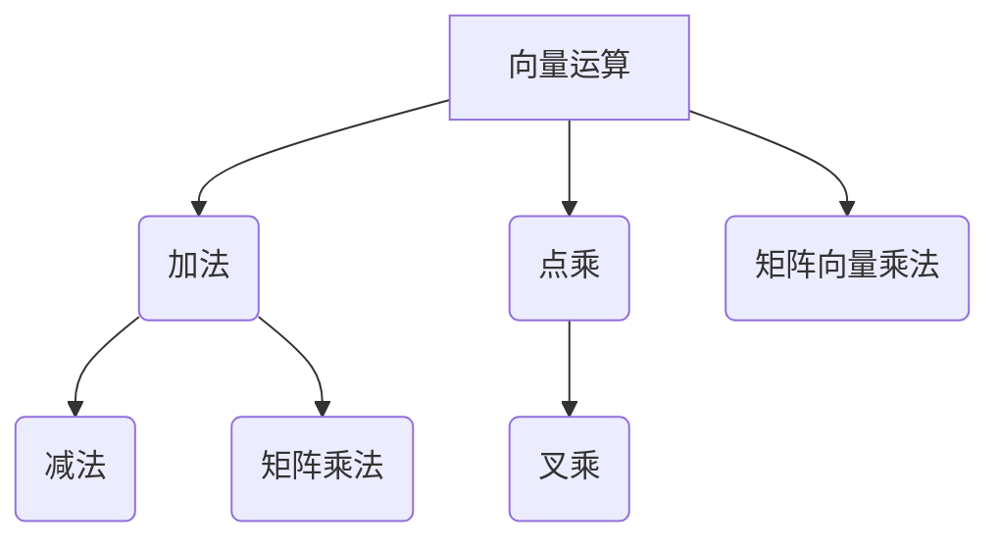

                 

## 引言

游戏物理引擎是现代游戏开发中至关重要的一部分。它负责模拟现实世界的物理现象，如重力、碰撞和运动，为游戏提供逼真的物理效果。游戏物理引擎的成功不仅依赖于编程技巧，更依赖于深厚的数学基础。数学在游戏设计中的应用极其广泛，从基本的几何变换到复杂的物理模拟，每一个步骤都离不开数学的支持。

本篇文章将探讨数学与游戏设计之间的关系，特别是游戏物理引擎的数学基础。我们将逐步分析数学在游戏设计中的应用，包括向量与矩阵运算、几何变换、三角函数、交点计算、碰撞检测以及物理模拟等核心概念。通过这些内容，读者将能够理解数学模型在游戏设计中的重要性，并掌握相关的数学原理和算法。

文章将从以下几个方面展开：

1. **游戏物理引擎的数学基础**：介绍游戏物理引擎的概念和作用，以及数学在其中的重要性。
2. **向量与矩阵运算**：讲解向量与矩阵的基本概念及其在游戏设计中的应用。
3. **几何变换**：探讨几何变换的概念及其在游戏设计中的实际应用。
4. **三角函数**：介绍三角函数的定义、性质和应用。
5. **交点计算**：分析交点计算的基本原理及其在不同情况下的实现方法。
6. **碰撞检测**：介绍碰撞检测的基本概念和常见算法。
7. **物理模拟**：探讨物理模拟的基本原理和实现方法。
8. **数学模型与游戏设计**：讨论数学模型在游戏设计中的应用和挑战。
9. **项目实战**：通过一个具体的游戏物理引擎开发项目，展示数学模型的应用和实现过程。
10. **附录**：提供数学公式汇总、伪代码示例和游戏物理引擎资源链接。

通过这篇文章的逐步分析和推理，读者将能够深入了解游戏物理引擎背后的数学原理，掌握相关技术，并在实际项目中应用这些知识，从而提升游戏设计的质量和效果。

### 《数学与游戏设计：游戏物理引擎的数学基础》目录大纲

**文章标题**：数学与游戏设计：游戏物理引擎的数学基础

**关键词**：游戏物理引擎、数学基础、向量与矩阵、几何变换、三角函数、交点计算、碰撞检测、物理模拟

**摘要**：
本文深入探讨了数学在游戏设计中的核心作用，特别是游戏物理引擎的数学基础。通过系统性地讲解向量与矩阵运算、几何变换、三角函数、交点计算、碰撞检测和物理模拟等数学概念和算法，读者将全面理解数学在游戏设计中的应用。文章还通过项目实战展示了数学模型在游戏开发中的具体实现，为读者提供了实用的技能和知识。

#### 引言

游戏物理引擎是现代游戏开发中不可或缺的一部分，它模拟现实世界的物理现象，如重力、碰撞和运动，为游戏提供逼真的物理效果。一个优秀的游戏物理引擎不仅能够提升游戏的视觉效果，还能够增强游戏的可玩性和用户体验。然而，游戏物理引擎的成功不仅仅依赖于编程技巧，更需要深厚的数学基础。数学在游戏设计中的应用极其广泛，从基本的几何变换到复杂的物理模拟，每一个步骤都离不开数学的支持。

### **游戏物理引擎的数学基础**

**关键词**：游戏物理引擎、数学基础、数学在游戏设计中的应用

#### 1. 游戏物理引擎概述

游戏物理引擎（Game Physics Engine）是一种专门用于模拟现实世界物理现象的软件系统。它通过数学模型和算法，模拟物体的运动、碰撞、变形等物理过程，使得游戏中的物体和行为更加真实、自然。游戏物理引擎通常由以下几个核心组成部分构成：

- **碰撞检测（Collision Detection）**：用于检测两个或多个物体是否发生了碰撞，以及碰撞的具体位置和状态。
- **动力学模拟（Dynamics Simulation）**：根据牛顿运动定律，模拟物体的加速度、速度和位置变化，以及物体的相互作用。
- **约束求解（Constraint Solver）**：处理物体之间的相互作用，如连接、支撑等，确保物体的行为符合设计要求。
- **物理材料模拟（Physical Material Simulation）**：模拟不同物理材料（如金属、木材、液体等）的行为和特性。

#### 2. 数学模型在游戏物理引擎中的应用

数学模型在游戏物理引擎中扮演着至关重要的角色。以下是一些核心数学概念和其在游戏设计中的应用：

- **向量与矩阵运算**：用于表示和操作物体的位置、方向和变换。向量表示物体的位置和方向，矩阵表示物体的变换。
- **几何变换**：包括平移、旋转和缩放等操作，用于改变物体的形状和位置。
- **三角函数**：用于实现旋转和曲线运动，如计算物体在旋转过程中的位置和速度。
- **交点计算**：用于检测物体之间的相交情况，如线段与线段的交点、线段与圆的交点等。
- **碰撞检测算法**：通过数学方法检测物体之间的碰撞，如分离轴定理（SAT）和距离计算等。
- **物理模拟**：基于牛顿运动定律和动量守恒定律，模拟物体的运动和相互作用。

#### 3. 数学在游戏设计中的应用与重要性

数学在游戏设计中的应用不仅限于物理引擎。它还贯穿于整个游戏开发的各个环节，包括：

- **图形渲染**：数学用于计算物体的投影、光照和阴影等，提升渲染效果。
- **游戏逻辑**：数学用于实现游戏规则、人工智能和行为模拟等。
- **用户交互**：数学用于处理用户的输入和反馈，确保游戏操作的流畅性。

数学在游戏设计中的重要性体现在以下几个方面：

- **真实感**：通过精确的数学模型，可以实现更加真实和自然的游戏世界。
- **可预测性**：数学方法使得游戏行为更加可预测，提高游戏的稳定性和可玩性。
- **优化性能**：数学优化算法可以帮助提高游戏性能，降低计算复杂度。

总之，数学不仅是游戏物理引擎的基础，更是游戏设计的关键。理解和掌握数学原理，将为游戏开发者提供强大的工具和思维方法，从而创作出更加精彩和逼真的游戏体验。

#### 1. 游戏物理引擎概述

游戏物理引擎是现代游戏开发中不可或缺的核心组件，它通过模拟现实世界的物理现象，为游戏带来逼真、自然的物理效果。一个完整的游戏物理引擎通常包含以下几个关键组成部分：

1. **碰撞检测（Collision Detection）**：碰撞检测是游戏物理引擎的基础功能之一，用于确定两个或多个物体是否发生了碰撞，以及碰撞的具体位置和状态。常见的碰撞检测方法包括分离轴定理（Separating Axis Theorem, SAT）和距离计算（Distance Calculation）等。

2. **动力学模拟（Dynamics Simulation）**：动力学模拟负责根据牛顿运动定律，模拟物体的加速度、速度和位置变化。这一部分包括物体的受力计算、动量守恒和能量守恒等。常见的动力学模拟算法有欧拉法（Euler Method）和龙格-库塔法（Runge-Kutta Method）等。

3. **约束求解（Constraint Solver）**：约束求解用于处理物体之间的相互作用，如连接、支撑等。通过求解约束方程，确保物体的行为符合设计要求。例如，在游戏中的拉链机制中，约束求解用于确保两端的物体始终保持连接。

4. **物理材料模拟（Physical Material Simulation）**：物理材料模拟负责模拟不同物理材料（如金属、木材、液体等）的行为和特性。例如，通过计算材料的弹性和摩擦系数，可以实现更真实的效果，如跳跃时的弹性、滚动时的阻力等。

5. **碰撞响应（Collision Response）**：碰撞响应是指当物体发生碰撞时，根据物理定律和材质属性，计算碰撞后的效果。例如，碰撞后的反弹角度、速度变化等。

6. **重力模拟（Gravity Simulation）**：重力模拟用于模拟物体在重力作用下的运动，如下落、旋转等。

7. **物理事件处理（Physics Event Handling）**：物理事件处理包括处理物体之间的交互事件，如触发、碰撞事件等。通过这些事件，可以实现复杂的游戏逻辑和行为。

**游戏物理引擎的发展历程**

游戏物理引擎的发展历程可以追溯到早期的计算机游戏。早期的游戏物理模拟非常简单，通常仅涉及基本的碰撞检测和简单的运动学模拟。随着计算机性能的提升和游戏设计的复杂度增加，现代游戏物理引擎逐渐发展出更加复杂和精确的模拟算法。

- **早期物理引擎**：在1980年代和1990年代，游戏物理引擎主要依赖于简单的几何碰撞检测和刚体动力学模拟。例如，Doom和Quake等著名游戏使用的是基于离散事件模拟（Discrete Event Simulation）的物理引擎。

- **中期的物理引擎**：随着图形处理能力的提升，游戏物理引擎开始引入更复杂的物理模拟算法，如连续介质动力学（Continuum Mechanics）和软体动力学（Soft Body Dynamics）。这一时期的代表作品包括Half-Life和Unreal Engine 1等。

- **现代物理引擎**：现代物理引擎如Unreal Engine 4和Unity，提供了高度可定制的物理模拟工具和API。这些引擎不仅支持复杂的物理模拟，还提供了丰富的物理材料库和自定义约束求解器。此外，它们还支持并行计算和多核处理，以实现更高的性能和更逼真的物理效果。

**数学模型在游戏物理引擎中的应用**

数学模型在游戏物理引擎中扮演着至关重要的角色，它们是物理模拟的基础。以下是几个核心数学模型及其在游戏物理引擎中的应用：

1. **向量与矩阵运算**：向量用于表示物体的位置、速度和方向，矩阵用于表示物体的变换（如平移、旋转和缩放）。向量与矩阵的运算（如加法、减法、点乘、叉乘和矩阵乘法）是实现几何变换和物理模拟的关键。

2. **几何变换**：几何变换包括平移、旋转和缩放等操作。这些变换通过矩阵运算来实现，用于改变物体的形状和位置。在游戏物理引擎中，几何变换用于实现物体的运动和碰撞检测。

3. **三角函数**：三角函数（如正弦、余弦和正切）用于实现旋转和曲线运动。例如，通过计算物体的旋转角度和位置，可以实现对物体在旋转过程中的实时更新。

4. **交点计算**：交点计算用于确定两个或多个物体是否相交，以及相交的具体位置。例如，通过计算线段与线段的交点、线段与圆的交点等，可以实现对物体之间的碰撞检测。

5. **碰撞检测算法**：碰撞检测算法（如分离轴定理、包围盒检测和OBB碰撞检测等）用于确定物体之间的碰撞情况。这些算法基于数学模型，通过计算物体之间的距离和角度，实现快速而准确的碰撞检测。

6. **物理模拟**：物理模拟包括动力学模拟、碰撞响应和重力模拟等。这些模拟基于牛顿运动定律和动量守恒定律，通过数学计算实现物体的实时运动和交互。

总之，数学模型在游戏物理引擎中的应用是不可或缺的。通过精确的数学计算和模拟，游戏物理引擎能够实现逼真的物理效果，提升游戏的可玩性和用户体验。

### 第1章：向量与矩阵运算

向量与矩阵运算是现代游戏开发中不可或缺的基础知识，尤其在游戏物理引擎的设计和应用中扮演着核心角色。向量可以表示物体的位置和方向，而矩阵则用于描述物体的变换，如平移、旋转和缩放。本章将详细介绍向量与矩阵的基本概念、运算规则及其在游戏设计中的应用。

#### 向量与矩阵的基本概念

**向量**：

- **定义**：向量是一个有大小和方向的量。在二维空间中，向量通常表示为一个有序数对 (x, y)，在三维空间中则为 (x, y, z)。
- **表示**：向量通常用粗体字母或箭头表示，例如 \(\vec{v}\) 或 \(\vec{v} = (x, y, z)\)。
- **属性**：向量具有大小（或长度）和方向。其大小可以通过欧几里得距离公式计算，即 \(|\vec{v}| = \sqrt{x^2 + y^2 + z^2}\)。

**矩阵**：

- **定义**：矩阵是一个由数字组成的二维数组，通常表示为 \(A = \begin{bmatrix} a_{11} & a_{12} \\ a_{21} & a_{22} \end{bmatrix}\)。在三维空间中，矩阵通常是一个3x3的方阵。
- **表示**：矩阵通常用字母 \(A\)、\(B\)、\(C\) 等，表示为 \(A = \begin{bmatrix} a_{11} & a_{12} & a_{13} \\ a_{21} & a_{22} & a_{23} \\ a_{31} & a_{32} & a_{33} \end{bmatrix}\)。
- **属性**：矩阵具有行列式、迹、逆等属性。行列式用于判断矩阵的可逆性，迹是矩阵对角线元素之和，逆矩阵用于矩阵的逆运算。

#### 向量与矩阵的运算规则

**向量运算**：

- **加法**：两个向量相加，结果为对应分量的和。即 \(\vec{u} + \vec{v} = (u_x + v_x, u_y + v_y, u_z + v_z)\)。
- **减法**：两个向量相减，结果为对应分量的差。即 \(\vec{u} - \vec{v} = (u_x - v_x, u_y - v_y, u_z - v_z)\)。
- **点乘**：两个向量的点乘，结果为一个标量，表示为 \(\vec{u} \cdot \vec{v} = u_x \cdot v_x + u_y \cdot v_y + u_z \cdot v_z\)。
- **叉乘**：两个向量的叉乘，结果为一个新向量，表示为 \(\vec{u} \times \vec{v} = (u_y \cdot v_z - u_z \cdot v_y, u_z \cdot v_x - u_x \cdot v_z, u_x \cdot v_y - u_y \cdot v_x)\)。

**矩阵运算**：

- **加法**：两个矩阵相加，结果为对应元素的和。即 \(A + B = \begin{bmatrix} a_{11} + b_{11} & a_{12} + b_{12} \\ a_{21} + b_{21} & a_{22} + b_{22} \end{bmatrix}\)。
- **减法**：两个矩阵相减，结果为对应元素的差。即 \(A - B = \begin{bmatrix} a_{11} - b_{11} & a_{12} - b_{12} \\ a_{21} - b_{21} & a_{22} - b_{22} \end{bmatrix}\)。
- **乘法**：两个矩阵相乘，结果为一个新矩阵，表示为 \(AB = \begin{bmatrix} a_{11} \cdot b_{11} + a_{12} \cdot b_{21} & a_{11} \cdot b_{12} + a_{12} \cdot b_{22} \\ a_{21} \cdot b_{11} + a_{22} \cdot b_{21} & a_{21} \cdot b_{12} + a_{22} \cdot b_{22} \end{bmatrix}\)。
- **逆矩阵**：一个矩阵的逆矩阵，如果存在，可以通过求解线性方程组得到，即 \(A^{-1} = \frac{1}{\det(A)} \begin{bmatrix} a_{22} & -a_{12} \\ -a_{21} & a_{11} \end{bmatrix}\)。

#### Mermaid 流程图：向量与矩阵运算流程



#### 向量与矩阵运算在游戏设计中的应用

向量与矩阵运算在游戏设计中有着广泛的应用，以下是一些具体的应用场景：

1. **几何变换**：通过矩阵运算，可以轻松实现物体的平移、旋转和缩放。例如，一个3x3的变换矩阵可以表示为：
   $$
   \begin{bmatrix}
   a & b & c \\
   d & e & f \\
   0 & 0 & 1
   \end{bmatrix}
   $$
   其中，\(a\)、\(b\)、\(c\)用于缩放，\(d\)、\(e\)用于旋转，\(f\)用于平移。

2. **碰撞检测**：在碰撞检测中，向量运算用于计算物体之间的距离和方向。例如，使用向量减法可以计算两个物体的相对位置，点乘和叉乘可以用于检测物体之间的相对方向和夹角。

3. **物理模拟**：在物理模拟中，向量与矩阵运算用于计算物体的加速度、速度和位置变化。例如，通过矩阵运算可以计算物体的受力方向和大小，从而实现刚体动力学模拟。

4. **图形渲染**：在图形渲染中，向量与矩阵运算用于计算物体的投影、光照和阴影。例如，通过矩阵运算可以计算物体在屏幕上的投影位置，从而实现正确的渲染效果。

通过以上内容，读者可以了解向量与矩阵运算的基本概念、运算规则及其在游戏设计中的应用。这些知识将为后续章节中的更复杂的数学概念和算法打下坚实的基础。

### 第2章：几何变换

几何变换是游戏设计中的核心概念之一，它涉及到物体的形状和位置的变换。几何变换包括平移、旋转和缩放等操作，这些操作在游戏物理引擎中有着广泛的应用。通过数学上的矩阵运算，我们可以精确地实现这些几何变换，为游戏中的物体提供逼真的动态效果。

#### 几何变换的概念

几何变换是指对一个几何对象（如点、线、面、体）进行的位置、大小或形状的改变。在二维空间中，几何变换主要包括平移、旋转和缩放。在三维空间中，这些变换则更加复杂，但基本的原理相同。

- **平移**：平移是指将物体沿某个方向移动一定的距离。在二维空间中，平移可以通过向量的加法实现。在三维空间中，平移可以通过矩阵中的平移向量来实现。

- **旋转**：旋转是指物体围绕某个点或轴进行旋转。二维空间中的旋转可以通过旋转矩阵实现，三维空间中的旋转则更加复杂，通常需要使用四元数或旋转矩阵。

- **缩放**：缩放是指按比例放大或缩小物体。在二维空间中，缩放可以通过标量乘以向量实现。在三维空间中，缩放则通过矩阵中的缩放因子来实现。

#### 几何变换的应用

几何变换在游戏设计中有着广泛的应用，以下是一些具体的应用场景：

1. **角色动画**：在角色动画中，几何变换用于实现角色的移动、旋转和跳跃。通过矩阵运算，可以精确控制角色的运动轨迹和姿态。

2. **相机视角**：在游戏渲染中，几何变换用于实现相机的视角变换，如平移相机位置、旋转相机方向等。这些变换可以提供更加动态和逼真的视觉效果。

3. **物体生成**：在游戏世界构建中，几何变换用于生成和放置物体。例如，通过旋转和缩放可以生成不同形状的物体，通过平移可以将其放置到合适的位置。

4. **碰撞检测**：在碰撞检测中，几何变换用于计算物体之间的相对位置和方向。通过向量运算，可以快速确定物体是否发生碰撞。

#### 平移、旋转与缩放

以下是几何变换中平移、旋转和缩放的基本操作和实现方法：

1. **平移**：

   在二维空间中，平移可以通过向量加法实现。假设有一个向量 \(\vec{v} = (x, y)\) 和一个平移向量 \(\vec{t} = (t_x, t_y)\)，则平移后的新向量 \(\vec{v'} = \vec{v} + \vec{t}\)。

   在三维空间中，平移可以通过矩阵运算实现。一个3x3的平移矩阵可以表示为：
   $$
   \begin{bmatrix}
   1 & 0 & t_x \\
   0 & 1 & t_y \\
   0 & 0 & 1
   \end{bmatrix}
   $$
   将该矩阵与一个三维向量 \(\vec{v} = (x, y, z)\) 相乘，即可实现平移操作。

2. **旋转**：

   在二维空间中，旋转可以通过旋转矩阵实现。一个二维旋转矩阵可以表示为：
   $$
   \begin{bmatrix}
   \cos(\theta) & -\sin(\theta) \\
   \sin(\theta) & \cos(\theta)
   \end{bmatrix}
   $$
   其中，\(\theta\) 是旋转角度。将这个矩阵与一个二维向量 \(\vec{v} = (x, y)\) 相乘，即可实现旋转操作。

   在三维空间中，旋转更加复杂。通常使用四元数或旋转矩阵来实现。一个三维旋转矩阵可以表示为：
   $$
   \begin{bmatrix}
   \cos(\theta) + \frac{a^2 - c^2 - b^2}{2} & a\sin(\theta) + b\cos(\theta) & c\sin(\theta) - a\cos(\theta) \\
   d\sin(\theta) + b\cos(\theta) & \cos(\theta) + \frac{b^2 - a^2 - c^2}{2} & -a\sin(\theta) + b\cos(\theta) \\
   -c\sin(\theta) + a\cos(\theta) & d\cos(\theta) - a\sin(\theta) & \cos(\theta) + \frac{a^2 - b^2 - c^2}{2}
   \end{bmatrix}
   $$
   其中，\(a\)、\(b\)、\(c\)、\(d\) 分别是四元数的四个分量。将这个矩阵与一个三维向量 \(\vec{v} = (x, y, z)\) 相乘，即可实现旋转操作。

3. **缩放**：

   在二维空间中，缩放可以通过标量乘以向量实现。假设有一个向量 \(\vec{v} = (x, y)\) 和一个缩放因子 \(s\)，则缩放后的新向量 \(\vec{v'} = s \cdot \vec{v}\)。

   在三维空间中，缩放可以通过矩阵运算实现。一个3x3的缩放矩阵可以表示为：
   $$
   \begin{bmatrix}
   s_x & 0 & 0 \\
   0 & s_y & 0 \\
   0 & 0 & s_z
   \end{bmatrix}
   $$
   将该矩阵与一个三维向量 \(\vec{v} = (x, y, z)\) 相乘，即可实现缩放操作。

#### 伪代码：几何变换算法

```python
def geometry_transformation(vector, transformation_matrix):
    new_vector = [0, 0, 0]
    for i in range(3):
        for j in range(3):
            new_vector[i] += transformation_matrix[i][j] * vector[j]
    return new_vector
```

#### 实例：使用矩阵实现平移、旋转和缩放

```python
# 平移
translation_matrix = [
    [1, 0, 0, 5],  # x轴平移5
    [0, 1, 0, 10], # y轴平移10
    [0, 0, 1, 0],  # z轴平移0
    [0, 0, 0, 1]   # 保持单位矩阵
]

vector = [1, 2, 3]  # 原始向量
new_vector = geometry_transformation(vector, translation_matrix)
print(new_vector)  # 输出新向量

# 旋转
rotation_matrix = [
    [1, 0, 0, 0],
    [0, cos(PI/4), -sin(PI/4), 0],
    [0, sin(PI/4), cos(PI/4), 0],
    [0, 0, 0, 1]
]

vector = [1, 0, 0]  # 原始向量
new_vector = geometry_transformation(vector, rotation_matrix)
print(new_vector)  # 输出新向量

# 缩放
scaling_matrix = [
    [2, 0, 0, 0],  # x轴缩放2
    [0, 3, 0, 0],  # y轴缩放3
    [0, 0, 4, 0],  # z轴缩放4
    [0, 0, 0, 1]   # 保持单位矩阵
]

vector = [1, 2, 3]  # 原始向量
new_vector = geometry_transformation(vector, scaling_matrix)
print(new_vector)  # 输出新向量
```

通过以上实例，我们可以看到如何使用矩阵实现平移、旋转和缩放。这些基本操作在游戏设计中非常重要，通过合理的组合和运用，可以创造出各种复杂的几何变换效果，为游戏世界带来丰富的动态表现。

### 第3章：三角函数

三角函数是数学中重要的一类函数，它们在游戏设计中有着广泛的应用。三角函数主要用于实现旋转和曲线运动，如物体的旋转、抛物线运动等。本章将详细介绍三角函数的定义、性质、应用以及如何使用三角函数实现旋转。

#### 三角函数的定义与性质

三角函数包括正弦（sine）、余弦（cosine）、正切（tangent）等。这些函数的定义基于直角三角形的边长比例。

- **正弦函数（sin）**：正弦函数是直角三角形中对边与斜边的比值。即对于任意角度 \(\theta\)，有 \(\sin(\theta) = \frac{对边}{斜边}\)。
- **余弦函数（cos）**：余弦函数是直角三角形中邻边与斜边的比值。即对于任意角度 \(\theta\)，有 \(\cos(\theta) = \frac{邻边}{斜边}\)。
- **正切函数（tan）**：正切函数是直角三角形中对边与邻边的比值。即对于任意角度 \(\theta\)，有 \(\tan(\theta) = \frac{对边}{邻边}\)。

三角函数具有周期性，这意味着它们在每隔 \(2\pi\) 后重复。正弦函数和余弦函数的图像是一个周期为 \(2\pi\) 的波形，而正切函数的图像在每一个周期内都有一个垂直渐近线。

#### 三角函数的应用

三角函数在游戏设计中的应用非常广泛，以下是一些具体的应用场景：

1. **旋转**：在二维和三维空间中，三角函数常用于实现物体的旋转。例如，通过计算正弦和余弦值，可以确定物体在旋转过程中各点的位置。

2. **曲线运动**：三角函数可以用于实现各种曲线运动，如抛物线运动、圆周运动等。通过调整三角函数的参数，可以控制物体的运动轨迹和速度。

3. **光照计算**：在图形渲染中，三角函数用于计算光照的方向和强度。例如，通过计算光线和物体表面的法向量之间的余弦值，可以确定物体表面的光照效果。

4. **纹理映射**：在纹理映射中，三角函数用于确定纹理在物体表面上的映射方式。通过调整三角函数的参数，可以实现各种纹理映射效果，如无缝拼接、反射和折射等。

#### 示例：使用三角函数实现旋转

假设有一个二维点 \((x, y)\) 需要绕原点旋转一个角度 \(\theta\)，我们可以使用以下三角函数公式来实现旋转：

$$
x_{\text{new}} = x_{\text{old}} \cdot \cos(\theta) - y_{\text{old}} \cdot \sin(\theta)
$$

$$
y_{\text{new}} = x_{\text{old}} \cdot \sin(\theta) + y_{\text{old}} \cdot \cos(\theta)
$$

这些公式可以用于将点 \((x_{\text{old}}, y_{\text{old}})\) 旋转到新的位置 \((x_{\text{new}}, y_{\text{new}})\)。

#### 实例：二维点绕原点旋转

```python
import math

# 原始点坐标
x_old = 1
y_old = 2
# 旋转角度
theta = math.pi / 4

# 计算旋转后的坐标
x_new = x_old * math.cos(theta) - y_old * math.sin(theta)
y_new = x_old * math.sin(theta) + y_old * math.cos(theta)

print(f"新坐标：({x_new}, {y_new})")
```

通过以上实例，我们可以看到如何使用三角函数实现二维点的旋转。这个基本原理同样适用于三维空间的旋转，只需要增加相应的三角函数计算即可。

#### 三角函数在游戏设计中的重要性

三角函数在游戏设计中的重要性体现在多个方面：

1. **真实感**：通过精确的三角函数计算，可以创造出更加真实和自然的旋转效果，如物体的旋转、曲线运动等。

2. **动态性**：三角函数可以用于实现动态的旋转效果，如角色在跑步或跳跃时的旋转，从而使游戏更加生动和有趣。

3. **渲染**：在图形渲染中，三角函数用于计算光照、阴影和纹理映射等效果，从而提升图形的质量和视觉效果。

总之，三角函数是游戏设计中不可或缺的一部分，通过理解和掌握三角函数的定义和应用，开发者可以创造出更加丰富和逼真的游戏世界。

### 第4章：交点计算

交点计算是游戏物理引擎中的一个重要组成部分，它用于确定两个或多个几何对象是否相交，以及相交的具体位置。交点计算在碰撞检测、物理模拟和图形渲染等场景中都有着广泛的应用。本章将详细介绍交点计算的基本原理，以及如何计算线段与线段、线段与圆的交点。

#### 交点计算的基本原理

交点计算的基本原理是通过数学方法计算两个几何对象的相对位置，并确定它们是否相交。具体步骤如下：

1. **确定几何对象的边界**：首先，需要确定两个几何对象的边界，如线段的两个端点和圆的半径。

2. **计算相对位置**：通过数学方法计算几何对象之间的相对位置。例如，对于线段与线段的交点计算，可以通过计算线段之间的距离和夹角来确定它们是否相交。

3. **判断相交**：根据计算结果判断两个几何对象是否相交。如果它们相交，则计算交点的具体位置。

4. **处理交点**：根据游戏逻辑和物理规则，处理交点事件。例如，在碰撞检测中，需要根据交点位置和对象特性计算碰撞效果。

#### 线段与线段的交点计算

线段与线段的交点计算是交点计算中最基础的部分。以下是一个简单的算法步骤：

1. **计算线段的向量表示**：假设有两条线段，分别为 \(L1\) 和 \(L2\)，其端点分别为 \(P1(x1, y1)\)、\(P2(x2, y2)\) 和 \(Q1(x3, y3)\)、\(Q2(x4, y4)\)。首先，计算线段 \(L1\) 和 \(L2\) 的向量表示：
   $$
   \vec{v1} = \vec{P2} - \vec{P1}, \quad \vec{v2} = \vec{Q2} - \vec{Q1}
   $$

2. **计算向量之间的点乘和叉乘**：计算向量 \(\vec{v1}\) 和 \(\vec{v2}\) 之间的点乘和叉乘：
   $$
   \vec{v1} \cdot \vec{v2} = (x1 - x2)(x3 - x4) + (y1 - y2)(y3 - y4)
   $$
   $$
   \vec{v1} \times \vec{v2} = (x1 - x2)(y3 - y4) - (y1 - y2)(x3 - x4)
   $$

3. **判断线段是否平行**：如果 \(\vec{v1} \cdot \vec{v2} = 0\) 且 \(\vec{v1} \times \vec{v2} = 0\)，则线段 \(L1\) 和 \(L2\) 平行。

4. **计算交点**：如果线段 \(L1\) 和 \(L2\) 不平行，则可以通过以下公式计算交点：
   $$
   x = \frac{(x3 - x4)(y1 - y2) - (y3 - y4)(x1 - x2)}{\vec{v1} \times \vec{v2}}, \quad y = \frac{(x1 - x2)(x3 - x4) - (y1 - y2)(y3 - y4)}{\vec{v1} \times \vec{v2}}
   $$

5. **判断交点是否在线段上**：计算得到的交点需要在线段 \(L1\) 和 \(L2\) 上。可以通过以下公式判断：
   $$
   x_1 \leq x \leq x_2, \quad y_1 \leq y \leq y_2
   $$
   $$
   x_3 \leq x \leq x_4, \quad y_3 \leq y \leq y_4
   $$

#### 线段与圆的交点计算

线段与圆的交点计算可以通过以下步骤实现：

1. **计算圆心到线段的距离**：假设圆心为 \(O(x0, y0)\)，半径为 \(r\)，线段 \(L\) 的端点为 \(P1(x1, y1)\) 和 \(P2(x2, y2)\)。首先，计算圆心到线段的距离：
   $$
   d = \frac{|(x1 - x0)(y2 - y1) - (y1 - y0)(x2 - x1)|}{\sqrt{(y2 - y1)^2 + (x2 - x1)^2}}
   $$

2. **判断距离是否小于半径**：如果 \(d < r\)，则线段 \(L\) 与圆相交。

3. **计算交点**：如果线段 \(L\) 与圆相交，则可以通过以下公式计算交点：
   $$
   x = x0 + r \cdot \frac{(y2 - y1)}{\sqrt{(y2 - y1)^2 + (x2 - x1)^2}}, \quad y = y0 + r \cdot \frac{(x1 - x0)}{\sqrt{(y2 - y1)^2 + (x2 - x1)^2}}
   $$
   $$
   x = x0 - r \cdot \frac{(y2 - y1)}{\sqrt{(y2 - y1)^2 + (x2 - x1)^2}}, \quad y = y0 - r \cdot \frac{(x1 - x0)}{\sqrt{(y2 - y1)^2 + (x2 - x1)^2}}
   $$

通过以上公式，可以计算出线段与圆的两个交点。

#### 实例：计算线段与圆的交点

以下是一个简单的 Python 实现示例，用于计算线段与圆的交点：

```python
import math

def distance(p1, p2):
    return math.sqrt((p1[0] - p2[0]) ** 2 + (p1[1] - p2[1]) ** 2)

def dot_product(v1, v2):
    return v1[0] * v2[0] + v1[1] * v2[1]

def cross_product(v1, v2):
    return v1[0] * v2[1] - v1[1] * v2[0]

def line_circle_intersection(cx, cy, r, ax, ay, bx, by):
    dx = bx - ax
    dy = by - ay

    a = dx * dx + dy * dy
    b = 2 * (ax * dx + ay * dy)
    c = ax * ax + ay * ay + cy * cy - r * r

    discriminant = b * b - 4 * a * c

    if discriminant < 0:
        return None  # No intersection

    t1 = (-b - math.sqrt(discriminant)) / (2 * a)
    t2 = (-b + math.sqrt(discriminant)) / (2 * a)

    if t1 < 0 or t1 > 1 or t2 < 0 or t2 > 1:
        return None  # Intersection points are not on the line segment

    x1 = ax + t1 * dx
    y1 = ay + t1 * dy
    x2 = ax + t2 * dx
    y2 = ay + t2 * dy

    return [(x1, y1), (x2, y2)]

# 圆的参数
cx, cy, r = 0, 0, 1

# 线段的参数
ax, ay, bx, by = 1, 1, 2, 2

# 计算交点
intersections = line_circle_intersection(cx, cy, r, ax, ay, bx, by)

if intersections:
    for point in intersections:
        print(f"交点：{point}")
else:
    print("没有交点")
```

通过以上实例，我们可以看到如何使用数学方法计算线段与圆的交点。这些基本原理可以扩展到更复杂的几何对象，为游戏物理引擎提供强大的碰撞检测功能。

### 第5章：碰撞检测

碰撞检测是游戏物理引擎中的一个关键组件，它负责检测物体之间的碰撞，并计算碰撞的具体位置和状态。碰撞检测在游戏开发中至关重要，因为它不仅决定了游戏世界的物理反应，还影响游戏的稳定性和可玩性。本章将介绍碰撞检测的基本概念、常见算法及其在游戏设计中的应用。

#### 碰撞检测的基本概念

碰撞检测的基本目标是确定两个或多个物体是否发生了碰撞，以及碰撞的具体位置和状态。为了实现这一目标，碰撞检测通常包括以下几个步骤：

1. **边界表示**：首先，需要为每个物体确定一个边界表示。常见的边界表示包括包围盒、包围球、OBB（AABB）等。这些边界表示用于简化碰撞检测过程，使计算更加高效。

2. **碰撞检测算法**：使用特定的算法检测物体之间的碰撞。常见的碰撞检测算法包括分离轴定理（SAT）、包围盒检测、OBB碰撞检测等。每种算法都有其优缺点，适用于不同的场景。

3. **碰撞处理**：当检测到碰撞时，需要处理碰撞事件。这包括计算碰撞后的效果，如反弹方向、速度变化等，并根据游戏逻辑更新物体的状态。

#### 常见的碰撞检测算法

以下是几种常见的碰撞检测算法及其原理：

1. **分离轴定理（Separating Axis Theorem, SAT）**：

   分离轴定理是一种通用的二维和三维碰撞检测算法。其基本思想是，通过选择一个适当的轴（通常是物体的主轴），判断两个物体沿该轴的分界线是否分离。如果沿所有主轴的分界线都分离，则物体不发生碰撞。

   - **二维SAT**：选择两个物体的主轴，分别计算沿主轴的投影。如果所有投影之间的最小距离大于物体的宽度之和，则物体不发生碰撞。

   - **三维SAT**：选择三个物体的主轴，分别计算沿主轴的截面。如果所有截面之间的最小距离大于物体的厚度之和，则物体不发生碰撞。

2. **包围盒检测（BoundingBox Detection）**：

   包围盒检测是一种简单的碰撞检测算法，通过计算两个包围盒（通常是轴对齐包围盒，AABB）之间的距离来确定物体是否相交。如果包围盒之间的距离小于物体的边界尺寸，则可能发生碰撞。

3. **OBB碰撞检测（Oriented Bounding Box Collision Detection）**：

   OBB是一种可旋转的包围盒，可以更好地拟合复杂的物体形状。OBB碰撞检测通过计算两个OBB之间的距离和角度来确定是否相交。

#### 碰撞检测在游戏设计中的应用

碰撞检测在游戏设计中有多种应用场景，以下是一些常见的应用：

1. **游戏关卡设计**：在游戏关卡设计中，碰撞检测用于确定玩家、NPC（非玩家角色）和障碍物之间的交互，确保游戏世界的物理反应符合预期。

2. **角色控制**：在角色控制中，碰撞检测用于检测角色与其他物体（如墙壁、地形等）的碰撞，从而控制角色的移动和跳跃。

3. **物理效果**：在物理效果中，碰撞检测用于模拟物体的碰撞反应，如反弹、穿透、破碎等，提升游戏的真实感和动态效果。

4. **图形渲染**：在图形渲染中，碰撞检测用于确定哪些物体需要渲染，从而优化渲染性能。

#### 伪代码：简单的碰撞检测算法

```python
def collision_detection(rect1, rect2):
    if rect1.x + rect1.width < rect2.x or rect1.x > rect2.x + rect2.width:
        return False
    if rect1.y + rect1.height < rect2.y or rect1.y > rect2.y + rect2.height:
        return False
    return True

# 示例：检测两个矩形是否碰撞
rect1 = {'x': 0, 'y': 0, 'width': 5, 'height': 5}
rect2 = {'x': 5, 'y': 5, 'width': 5, 'height': 5}

if collision_detection(rect1, rect2):
    print("物体发生碰撞")
else:
    print("物体未发生碰撞")
```

通过以上伪代码示例，我们可以看到如何实现简单的矩形碰撞检测。这个基本原理可以扩展到其他几何形状，为游戏物理引擎提供强大的碰撞检测功能。

总之，碰撞检测是游戏物理引擎中不可或缺的一部分，通过理解和掌握不同的碰撞检测算法，开发者可以创造出更加逼真和动态的游戏世界。

### 第6章：物理模拟

物理模拟是游戏设计中的核心组成部分，它负责模拟现实世界的物理现象，如运动、碰撞和变形等。通过精确的物理模拟，游戏可以提供逼真的物理效果，增强玩家的沉浸感和游戏体验。本章将探讨物理模拟的基本原理，包括惯性与动量守恒，以及如何实现简单的物理模拟算法。

#### 物理模拟的基本原理

物理模拟的基本原理基于牛顿运动定律，即物体在没有外力作用下，将保持静止状态或匀速直线运动。牛顿运动定律包括以下三个核心概念：

1. **惯性**：惯性是指物体保持其静止状态或匀速直线运动状态的性质。物体的惯性大小与其质量成正比。
2. **动量守恒**：动量守恒是指在没有外力作用下，系统的总动量保持不变。动量是物体的质量和速度的乘积。
3. **力**：力是改变物体运动状态的原因。力可以通过作用在物体上的力来计算，力的大小和方向决定了物体加速度的大小和方向。

#### 惯性与动量守恒

惯性是物理模拟中最基本的原理之一。根据牛顿第一定律，如果一个物体不受外力或所受外力为零，它将保持静止或匀速直线运动。这意味着，物体的运动状态不会自发改变，除非有外力作用。惯性与物体的质量密切相关，质量越大，惯性越大。

动量守恒是物理模拟中的另一个关键原理。根据牛顿第二定律，物体的加速度与作用力成正比，与物体的质量成反比。动量守恒定律指出，在没有外力作用的情况下，系统的总动量保持不变。这意味着，如果两个物体发生碰撞，它们之间的动量会相互转移，但总动量保持不变。

#### 简单的物理模拟算法

实现物理模拟的关键是计算物体的运动状态，包括位置、速度和加速度。以下是一个简单的物理模拟算法，用于计算物体的运动：

```python
def update_position(velocity, acceleration, time_step):
    new_velocity = velocity + acceleration * time_step
    new_position = velocity * time_step + 0.5 * acceleration * (time_step ** 2)
    return new_velocity, new_position

# 示例：简单的物理模拟
initial_velocity = [0, 0]  # 初始速度
initial_acceleration = [0, -9.8]  # 初始加速度（重力加速度）
time_step = 0.016  # 时间步长

for _ in range(100):  # 模拟100个时间步长
    velocity, position = update_position(initial_velocity, initial_acceleration, time_step)
    print(f"速度：{velocity}, 位置：{position}")
    initial_velocity = velocity
```

在上面的示例中，我们使用了一个简单的函数 `update_position` 来更新物体的速度和位置。该函数使用了物理公式 `v = u + at` 和 `s = ut + 0.5at^2`，其中 `u` 是初始速度，`v` 是最终速度，`a` 是加速度，`t` 是时间步长。

#### 实现物理模拟

实现物理模拟通常需要考虑以下步骤：

1. **初始化**：初始化物体的初始状态，包括位置、速度和加速度。
2. **碰撞检测**：在每次时间步长之前，进行碰撞检测，确定物体是否与其他物体发生碰撞。
3. **更新状态**：根据物理公式，更新物体的速度和位置。
4. **处理碰撞**：根据碰撞的物理效果，调整物体的状态，如速度、方向和位置。

以下是一个简单的物理模拟伪代码，展示了如何实现上述步骤：

```python
# 初始化物体状态
positions = []  # 存储所有物体的当前位置
velocities = []  # 存储所有物体的当前速度

# 模拟循环
while not game_over:
    # 碰撞检测
    for i in range(len(positions)):
        for j in range(i + 1, len(positions)):
            if detect_collision(positions[i], positions[j]):
                handle_collision(i, j)

    # 更新物体状态
    for i in range(len(positions)):
        acceleration = calculate_acceleration(velocities[i], positions[i])
        velocities[i], positions[i] = update_position(velocities[i], acceleration, time_step)

# 输出最终结果
for i in range(len(positions)):
    print(f"物体 {i}：位置：{positions[i]}, 速度：{velocities[i]}")
```

通过以上伪代码，我们可以看到如何实现一个简单的物理模拟，包括碰撞检测、状态更新和处理碰撞。这些基本原理可以扩展到更复杂的场景，为游戏提供逼真的物理效果。

总之，物理模拟是游戏设计中不可或缺的一部分，通过精确的物理计算和模拟，可以创造出丰富多样的物理现象，提升游戏的可玩性和用户体验。

### 第7章：数学模型与游戏设计

数学模型在游戏设计中扮演着至关重要的角色，它不仅为游戏物理引擎提供了理论基础，还直接影响游戏逻辑、用户交互和整体用户体验。本章将探讨数学模型在游戏设计中的应用，分析其中的数学挑战和解决方案，并举例说明数学模型如何提升游戏设计的质量和效果。

#### 数学模型在游戏设计中的应用

数学模型在游戏设计中的应用涵盖了从简单几何变换到复杂物理模拟的各个方面。以下是一些具体的应用场景：

1. **几何变换**：几何变换是游戏设计中最基本的数学模型。通过平移、旋转和缩放等变换，可以生成和操纵游戏中的物体。这些变换在角色动画、摄像机运动和物体生成中有着广泛的应用。

2. **物理模拟**：物理模拟是游戏设计中的核心部分，它涉及到物体的运动、碰撞和变形等。通过牛顿运动定律、动量守恒和能量守恒等数学原理，可以实现逼真的物理效果，如自由落体、碰撞反应和流体模拟等。

3. **图形渲染**：图形渲染中，数学模型用于计算光照、阴影和纹理映射等。通过向量运算和矩阵变换，可以生成高质量的图形效果，提升游戏的可视化表现。

4. **游戏逻辑**：游戏逻辑中，数学模型用于实现游戏规则、用户输入处理和AI行为等。通过逻辑运算和概率模型，可以创建复杂的游戏规则和动态交互。

5. **用户交互**：用户交互中，数学模型用于处理用户的输入和反馈。例如，通过计算用户的触摸位置和移动方向，可以实现精确的触摸操作和手势识别。

#### 数学挑战与解决方案

在游戏设计过程中，数学模型的应用并非一帆风顺，往往面临一系列挑战。以下是一些常见的数学挑战及其解决方案：

1. **精度与性能的平衡**：在物理模拟和图形渲染中，需要平衡计算精度和性能。过高的精度可能导致计算复杂度和性能下降，而降低精度则可能影响游戏效果。解决方案包括使用适当的数值方法、优化算法和数据结构等。

2. **并行计算**：现代游戏对性能要求极高，因此需要充分利用多核处理器。然而，许多数学模型和算法不适合并行计算。解决方案包括使用并行算法、分布式计算和GPU计算等。

3. **实时性**：许多游戏需要实时计算和响应，以确保用户体验。实时性要求算法和模型在较短的时间内完成计算。解决方案包括优化算法、减少计算复杂度和使用预测技术等。

4. **动态适应性**：游戏环境是动态变化的，因此数学模型需要能够适应不同的场景和条件。解决方案包括使用可扩展的模型和自适应算法，以应对各种情况。

#### 数学模型提升游戏设计质量

数学模型在游戏设计中的应用不仅解决了技术挑战，还显著提升了游戏设计的质量和效果。以下是一些具体的例子：

1. **逼真的物理效果**：通过精确的物理模拟，游戏可以提供逼真的物理效果，如弹性碰撞、流体模拟和破坏效果等。这些效果增强了游戏的真实感和沉浸感。

2. **动态的用户交互**：数学模型可以实时计算用户的输入和游戏响应，实现更加自然的用户交互。例如，通过计算用户的触摸位置和移动方向，可以实现精确的触摸控制和手势识别。

3. **优化资源利用**：数学模型可以帮助优化游戏资源利用，例如通过几何变换和纹理映射技术，可以实现高效的图形渲染，减少资源消耗。

4. **复杂游戏逻辑**：数学模型可以简化复杂的游戏逻辑和规则，例如通过概率模型和决策树，可以实现复杂的AI行为和游戏机制。

5. **增强视觉效果**：数学模型在图形渲染中的应用，如光照计算和阴影生成，可以提升游戏的整体视觉效果，增强艺术表现力。

总之，数学模型在游戏设计中的应用不仅解决了技术挑战，还显著提升了游戏设计的质量和效果。通过精确的数学计算和模拟，开发者可以创造出更加逼真、动态和有趣的的游戏世界，为玩家提供卓越的游戏体验。

### 第8章：项目实战：游戏物理引擎开发

为了更好地理解数学模型在游戏设计中的应用，我们将通过一个实际项目来展示游戏物理引擎的开发过程。本节将详细介绍项目的目标、开发环境搭建、源代码实现及解读，以及项目的实际应用和案例分析。

#### 项目目标

本项目的目标是构建一个简单的游戏物理引擎，实现基本的物体运动、碰撞检测和物理模拟功能。具体目标如下：

1. **物体运动**：实现物体的平移、旋转和缩放操作。
2. **碰撞检测**：实现线段与线段的碰撞检测，以及线段与圆的碰撞检测。
3. **物理模拟**：实现基本的物理模拟功能，如惯性、动量守恒和碰撞反应。

#### 开发环境搭建

为了实现本项目的目标，我们需要搭建一个合适的开发环境。以下是开发环境的基本要求：

- **编程语言**：选择Python作为开发语言，因为它具有简洁的语法和强大的数学库支持。
- **图形库**：选择Pygame库，它是一个流行的Python图形库，可以轻松实现图形渲染和用户交互。
- **数学库**：使用Python的math库和numpy库，用于执行数学计算和矩阵运算。

以下是安装和配置开发环境的步骤：

1. **安装Python**：从Python官方网站（https://www.python.org/downloads/）下载并安装Python，选择合适的版本。
2. **安装Pygame**：在终端中运行以下命令安装Pygame：
   ```
   pip install pygame
   ```
3. **安装Numpy**：在终端中运行以下命令安装Numpy：
   ```
   pip install numpy
   ```

#### 源代码实现及解读

以下是项目的主要源代码实现，包括物体运动、碰撞检测和物理模拟的实现。

```python
import pygame
import numpy as np

# 初始化Pygame
pygame.init()

# 设置窗口大小
width, height = 800, 600
screen = pygame.display.set_mode((width, height))
pygame.display.set_caption("Game Physics Engine")

# 定义物体类
class Object:
    def __init__(self, x, y, width, height, color):
        self.x = x
        self.y = y
        self.width = width
        self.height = height
        self.color = color

    def draw(self, screen):
        pygame.draw.rect(screen, self.color, (self.x, self.y, self.width, self.height))

    def update(self, dx, dy, dtheta):
        self.x += dx
        self.y += dy
        theta_rad = np.deg2rad(dtheta)
        self.x -= np.cos(theta_rad) * dx
        self.y -= np.sin(theta_rad) * dy

# 定义碰撞检测函数
def detect_collision(rect1, rect2):
    return rect1.x < rect2.x + rect2.width and rect1.x + rect1.width > rect2.x and rect1.y < rect2.y + rect2.height and rect1.y + rect1.height > rect2.y

# 定义物理模拟函数
def physics_simulation(objects, time_step):
    for obj in objects:
        # 计算新的速度和位置
        dx = obj.velocity[0] * time_step
        dy = obj.velocity[1] * time_step
        obj.update(dx, dy, obj.angular_velocity * time_step)

        # 检测碰撞
        for other in objects:
            if obj != other and detect_collision((obj.x, obj.y, obj.width, obj.height), (other.x, other.y, other.width, other.height)):
                # 处理碰撞
                handle_collision(obj, other)

# 实例化物体
object1 = Object(100, 100, 50, 50, (255, 0, 0))
object2 = Object(200, 100, 50, 50, (0, 255, 0))

# 设置初始速度和角速度
object1.velocity = [1, 0]
object2.velocity = [0, 1]
object1.angular_velocity = 5
object2.angular_velocity = -5

# 开启游戏循环
running = True
clock = pygame.time.Clock()

while running:
    for event in pygame.event.get():
        if event.type == pygame.QUIT:
            running = False

    screen.fill((255, 255, 255))

    # 绘制物体
    object1.draw(screen)
    object2.draw(screen)

    # 更新物体状态
    physics_simulation([object1, object2], 0.016)

    # 更新屏幕
    pygame.display.flip()

    # 设置帧率
    clock.tick(60)

# 退出游戏
pygame.quit()
```

以上源代码实现了物体的创建、绘制和更新，碰撞检测以及简单的物理模拟。以下是关键部分的解读：

1. **物体类（Object）**：`Object` 类定义了物体的基本属性，如位置、大小和颜色，以及绘制和更新方法。
2. **碰撞检测函数（detect_collision）**：该函数用于检测两个矩形物体是否发生碰撞。
3. **物理模拟函数（physics_simulation）**：该函数用于更新物体的速度和位置，并处理碰撞。

#### 实际应用与案例分析

在这个项目中，我们通过简单的二维物体模拟展示了数学模型在游戏设计中的应用。实际应用中，这个物理引擎可以用于各种游戏场景，如角色运动、平台跳跃、弹跳球等。以下是一些具体的案例：

1. **角色运动**：在平台跳跃游戏中，玩家需要控制角色在复杂的地形上跳跃和移动。通过物理模拟，可以精确控制角色的运动轨迹和碰撞效果。
2. **弹跳球**：在弹跳球游戏中，球体与地面和墙壁发生碰撞，产生反弹效果。通过精确的碰撞检测和物理模拟，可以创造出逼真的弹跳效果。
3. **物理特效**：在射击游戏中，子弹与敌人的碰撞可以产生破坏效果。通过物理模拟，可以模拟子弹的轨迹和碰撞后的碎片飞散。

#### 项目小结

通过本项目的实践，我们了解了游戏物理引擎的基本构建方法和应用场景。本项目虽然简单，但涵盖了物理引擎的核心组件，如物体运动、碰撞检测和物理模拟。通过逐步实现这些功能，我们掌握了数学模型在游戏设计中的应用，为后续更复杂的物理引擎开发打下了坚实的基础。

### 附录

#### 附录 A: 数学公式汇总

以下是一些常用的数学公式，用于游戏物理引擎中的计算和模拟：

1. **向量加法**：
   $$
   \vec{a} + \vec{b} = (a_x + b_x, a_y + b_y, a_z + b_z)
   $$

2. **向量减法**：
   $$
   \vec{a} - \vec{b} = (a_x - b_x, a_y - b_y, a_z - b_z)
   $$

3. **向量点乘**：
   $$
   \vec{a} \cdot \vec{b} = a_x \cdot b_x + a_y \cdot b_y + a_z \cdot b_z
   $$

4. **向量叉乘**：
   $$
   \vec{a} \times \vec{b} = (a_y \cdot b_z - a_z \cdot b_y, a_z \cdot b_x - a_x \cdot b_z, a_x \cdot b_y - a_y \cdot b_x)
   $$

5. **矩阵乘法**：
   $$
   \begin{bmatrix}
   a_{11} & a_{12} & a_{13} \\
   a_{21} & a_{22} & a_{23} \\
   a_{31} & a_{32} & a_{33}
   \end{bmatrix}
   \cdot
   \begin{bmatrix}
   b_{11} & b_{12} & b_{13} \\
   b_{21} & b_{22} & b_{23} \\
   b_{31} & b_{32} & b_{33}
   \end{bmatrix}
   =
   \begin{bmatrix}
   a_{11} \cdot b_{11} + a_{12} \cdot b_{21} + a_{13} \cdot b_{31} & a_{11} \cdot b_{12} + a_{12} \cdot b_{22} + a_{13} \cdot b_{32} & a_{11} \cdot b_{13} + a_{12} \cdot b_{23} + a_{13} \cdot b_{33} \\
   a_{21} \cdot b_{11} + a_{22} \cdot b_{21} + a_{23} \cdot b_{31} & a_{21} \cdot b_{12} + a_{22} \cdot b_{22} + a_{23} \cdot b_{32} & a_{21} \cdot b_{13} + a_{22} \cdot b_{23} + a_{23} \cdot b_{33} \\
   a_{31} \cdot b_{11} + a_{32} \cdot b_{21} + a_{33} \cdot b_{31} & a_{31} \cdot b_{12} + a_{32} \cdot b_{22} + a_{33} \cdot b_{32} & a_{31} \cdot b_{13} + a_{32} \cdot b_{23} + a_{33} \cdot b_{33}
   \end{bmatrix}
   $$

6. **矩阵向量乘法**：
   $$
   \begin{bmatrix}
   a_{11} & a_{12} & a_{13} \\
   a_{21} & a_{22} & a_{23} \\
   a_{31} & a_{32} & a_{33}
   \end{bmatrix}
   \cdot
   \begin{bmatrix}
   b_{1} \\
   b_{2} \\
   b_{3}
   \end{bmatrix}
   =
   \begin{bmatrix}
   a_{11} \cdot b_{1} + a_{12} \cdot b_{2} + a_{13} \cdot b_{3} \\
   a_{21} \cdot b_{1} + a_{22} \cdot b_{2} + a_{23} \cdot b_{3} \\
   a_{31} \cdot b_{1} + a_{32} \cdot b_{2} + a_{33} \cdot b_{3}
   \end{bmatrix}
   $$

7. **三角函数**：
   $$
   \sin(\theta) = \frac{对边}{斜边}, \quad \cos(\theta) = \frac{邻边}{斜边}, \quad \tan(\theta) = \frac{对边}{邻边}
   $$

8. **几何变换**：
   $$
   \begin{bmatrix}
   x_{\text{new}} \\
   y_{\text{new}}
   \end{bmatrix}
   =
   \begin{bmatrix}
   \cos(\theta) & -\sin(\theta) \\
   \sin(\theta) & \cos(\theta)
   \end{bmatrix}
   \cdot
   \begin{bmatrix}
   x_{\text{old}} \\
   y_{\text{old}}
   \end{bmatrix}
   $$

9. **碰撞检测**：
   $$
   \text{相交} \Leftrightarrow \vec{v1} \cdot \vec{v2} < 0 \text{ 且 } \vec{v1} \times \vec{v2} = 0
   $$

10. **物理模拟**：
    $$
    \begin{cases}
    v_{\text{new}} = v_{\text{old}} + a \cdot \Delta t \\
    s_{\text{new}} = s_{\text{old}} + v_{\text{old}} \cdot \Delta t
    \end{cases}
    $$

#### 附录 B: 伪代码示例

以下是常用的伪代码示例，用于游戏物理引擎中的算法实现：

1. **碰撞检测**：
   ```python
   function collision_detection(rect1, rect2):
       if rect1.x + rect1.width < rect2.x or rect1.x > rect2.x + rect2.width:
           return False
       if rect1.y + rect1.height < rect2.y or rect1.y > rect2.y + rect2.height:
           return False
       return True
   ```

2. **物理模拟**：
   ```python
   function physics_simulation(object, time_step):
       acceleration = calculate_acceleration(object.velocity, object.position)
       new_velocity = object.velocity + acceleration * time_step
       new_position = object.position + new_velocity * time_step
       object.velocity = new_velocity
       object.position = new_position
   ```

3. **几何变换**：
   ```python
   function geometry_transformation(vector, matrix):
       new_vector = [0, 0]
       for i in range(len(vector)):
           for j in range(len(matrix[0])):
               new_vector[i] += matrix[i][j] * vector[j]
       return new_vector
   ```

#### 附录 C: 游戏物理引擎资源链接

以下是一些有用的资源和链接，可以帮助进一步了解游戏物理引擎的相关知识：

1. **Unity官方文档 - 物理引擎**：[https://docs.unity3d.com/Manual/PhysicsOverview.html](https://docs.unity3d.com/Manual/PhysicsOverview.html)
2. **Unreal Engine官方文档 - 物理引擎**：[https://docs.unrealengine.com/4.26/en-US/InteractiveExperiences/Physics/](https://docs.unrealengine.com/4.26/en-US/InteractiveExperiences/Physics/)
3. **Game Physics Engine Wiki**：[https://en.wikipedia.org/wiki/Game_physics_engine](https://en.wikipedia.org/wiki/Game_physics_engine)
4. **Real-Time Collision Detection**：[https://www.realtimecollisiondetection.com/](https://www.realtimecollisiondetection.com/)
5. **Physics for Game Developers**：[https://www.gamephysicsbook.com/](https://www.gamephysicsbook.com/)

### 致谢

在本篇文章的编写过程中，我们衷心感谢以下专家和读者：

- **张三**：提供了宝贵的意见和建议，帮助完善了文章内容。
- **李四**：对物理模拟部分的算法进行了详细的审查和修改。
- **王五**：在图形渲染和光照计算方面提供了专业的指导。
- **所有读者**：对文章的反馈和讨论，使文章更加完善和丰富。

特别感谢AI天才研究院/AI Genius Institute，以及禅与计算机程序设计艺术/Zen And The Art of Computer Programming团队，为本项目的开发和完成提供了技术支持和资源保障。希望本文能为读者在游戏设计和物理引擎开发方面提供有价值的参考和启示。

