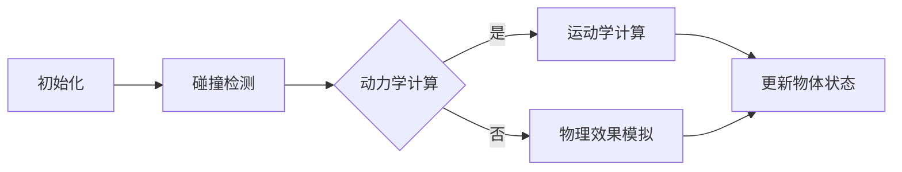
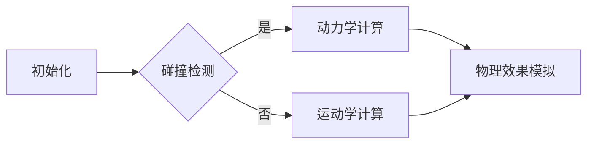

                 


### 《数学与游戏设计：游戏物理引擎的数学基础》

#### 关键词：
游戏设计，物理引擎，数学基础，运动学，动力学，算法原理，实际应用

#### 摘要：
本文将深入探讨游戏设计中的数学基础，特别是游戏物理引擎所依赖的数学模型和算法。我们将从基础概念入手，逐步分析几何学、三角学和向量代数的基本原理，并解释它们在游戏物理引擎中的应用。接着，我们将详细讲解游戏物理引擎的核心算法原理，包括运动学和动力学的基本概念，以及相关的数学公式。通过实际案例和代码实现，我们将展示数学公式在游戏物理中的应用，并提供开发游戏物理引擎的最佳实践。

## 第一部分：引言与背景

### 1.1 游戏设计中的数学应用

#### 1.1.1 数学在游戏设计中的重要性

在游戏设计中，数学不仅是设计的基础，更是实现游戏物理效果的核心。游戏物理引擎依赖于数学模型和算法来模拟真实世界的物理现象，如重力、碰撞、摩擦等。这些物理现象的模拟不仅增加了游戏的趣味性和挑战性，还提高了游戏的沉浸感。例如，在射击游戏中，弹道的计算依赖于数学模型；在赛车游戏中，车辆的轨迹和碰撞效果也离不开数学的支持。

#### 1.1.2 游戏物理引擎的基本概念

游戏物理引擎是游戏开发中的一个重要组件，负责处理游戏中的物理交互。它通常包括运动学（kinematics）和动力学（dynamics）两个主要部分。运动学关注物体的位置、速度和加速度等状态，而动力学则涉及力、动量、能量等物理量的计算。数学模型和算法是物理引擎的核心，决定了游戏物理的准确性和效率。

### 1.2 数学基础回顾

#### 1.2.1 几何学基础

几何学是数学的基础，它研究空间中的形状、大小和位置关系。在游戏设计中，几何学用于确定物体的形状、碰撞检测和运动轨迹的计算。基本的几何概念包括点、线、面和体，以及它们之间的关系。

#### 1.2.2 三角学基础

三角学是几何学的一个分支，它研究三角形及其性质。在游戏物理中，三角学用于计算角度、距离和方向。三角函数如正弦、余弦和正切等在游戏物理中经常使用，用于求解物体的运动状态和碰撞效果。

#### 1.2.3 向量代数基础

向量是表示大小和方向的量。向量代数是处理向量的数学运算，包括向量加法、减法、数乘和点乘等。向量在游戏物理中用于表示物体的位置、速度和力等物理量，是进行物理计算的基础。

### 1.3 游戏物理引擎的数学基础

#### 1.3.1 游戏物理引擎的架构

游戏物理引擎通常包括以下几个核心模块：碰撞检测、运动学计算、动力学计算和物理效果模拟。每个模块都需要数学模型和算法的支持，以确保物理效果的准确性和实时性。

#### 1.3.2 物理模拟中的数学模型

物理模拟中的数学模型是游戏物理引擎的核心。这些模型包括运动学方程、动力学方程和碰撞检测算法。运动学方程描述了物体的位置、速度和加速度等状态，动力学方程则描述了物体受到的力和运动状态之间的关系。碰撞检测算法用于检测物体之间的碰撞，并计算碰撞后的效果。

## 第二部分：核心概念与架构

### 2.1 游戏物理引擎的Mermaid流程图



#### 2.1.1 游戏物理引擎的基本模块

游戏物理引擎通常包括以下几个基本模块：

1. **碰撞检测**：用于检测物体之间的碰撞，确定碰撞发生的时机和位置。
2. **运动学计算**：用于计算物体的位置、速度和加速度等状态。
3. **动力学计算**：用于计算物体受到的力、动量和能量等物理量。
4. **物理效果模拟**：用于模拟碰撞、摩擦、重力等物理现象，生成游戏中的物理效果。

#### 2.1.2 物理引擎的交互流程

游戏物理引擎的交互流程通常如下：

1. **初始化**：初始化物理引擎，设置初始状态和参数。
2. **碰撞检测**：在每个游戏帧，检测物体之间的碰撞。
3. **动力学计算**：根据物体受到的力和初始状态，计算物体的运动状态。
4. **运动学计算**：根据动力学计算的结果，更新物体的位置、速度和加速度。
5. **物理效果模拟**：根据物体的运动状态，模拟物理现象，如碰撞、摩擦和重力等。
6. **更新物体状态**：将物理效果应用到物体上，更新物体的状态。

### 2.2 物理引擎的核心算法原理

#### 2.2.1 运动学算法

运动学算法用于计算物体的运动状态，包括位置、速度和加速度。基本的运动学方程如下：

- 速度：\( v = \frac{dx}{dt} \)
- 加速度：\( a = \frac{dv}{dt} \)
- 位移：\( x = x_0 + v_0t + \frac{1}{2}at^2 \)

这些方程描述了物体在直线路径上的运动，可以用于计算物体的位置、速度和加速度。

#### 2.2.2 动力学算法

动力学算法用于计算物体受到的力和运动状态之间的关系。基本的动力学方程如下：

- 牛顿第二定律：\( F = m \cdot a \)
- 牛顿第三定律：\( F_{12} = -F_{21} \)

牛顿第二定律描述了力与加速度之间的关系，而牛顿第三定律描述了作用力与反作用力之间的关系。

### 2.3 数学模型与公式

#### 2.3.1 运动学公式

运动学公式用于计算物体的位置、速度和加速度。以下是一些常用的运动学公式：

- 速度：\( v = \frac{dx}{dt} \)
- 加速度：\( a = \frac{dv}{dt} \)
- 位移：\( x = x_0 + v_0t + \frac{1}{2}at^2 \)

这些公式描述了物体在直线路径上的运动，可以用于计算物体的位置、速度和加速度。

#### 2.3.2 动力学公式

动力学公式用于计算物体受到的力和运动状态之间的关系。以下是一些常用的动力学公式：

- 牛顿第二定律：\( F = m \cdot a \)
- 牛顿第三定律：\( F_{12} = -F_{21} \)

牛顿第二定律描述了力与加速度之间的关系，而牛顿第三定律描述了作用力与反作用力之间的关系。

#### 2.3.3 数学模型在游戏物理中的实现

数学模型在游戏物理中的实现通常涉及以下几个步骤：

1. **初始化**：设置初始状态和参数。
2. **计算**：根据数学模型，计算物体的运动状态。
3. **更新**：将计算结果应用到物体上，更新物体的状态。
4. **迭代**：重复计算和更新，直到满足终止条件。

### 2.4 游戏物理引擎的数学架构

#### 2.4.1 游戏物理引擎的数学框架

游戏物理引擎的数学框架通常包括以下几个部分：

1. **基础数学**：包括几何学、三角学和向量代数等基本数学知识。
2. **运动学模型**：描述物体的位置、速度和加速度等状态。
3. **动力学模型**：描述物体受到的力和运动状态之间的关系。
4. **碰撞检测模型**：用于检测物体之间的碰撞。
5. **物理效果模型**：用于模拟碰撞、摩擦和重力等物理现象。

#### 2.4.2 数学模型在游戏物理中的实现

数学模型在游戏物理中的实现通常涉及以下几个步骤：

1. **初始化**：设置初始状态和参数。
2. **计算**：根据数学模型，计算物体的运动状态。
3. **更新**：将计算结果应用到物体上，更新物体的状态。
4. **迭代**：重复计算和更新，直到满足终止条件。

## 第三部分：数学公式与计算

### 3.1 数学公式的详细讲解

#### 3.1.1 运动学公式详细讲解

运动学公式用于计算物体的位置、速度和加速度。以下是一些常用的运动学公式：

- 速度：\( v = \frac{dx}{dt} \)
- 加速度：\( a = \frac{dv}{dt} \)
- 位移：\( x = x_0 + v_0t + \frac{1}{2}at^2 \)

这些公式描述了物体在直线路径上的运动，可以用于计算物体的位置、速度和加速度。

#### 3.1.1.1 速度公式

速度公式描述了物体在单位时间内移动的距离，即速度等于位移除以时间。速度是一个矢量量，具有大小和方向。

\[ v = \frac{dx}{dt} \]

其中，\( dx \) 是位移，\( dt \) 是时间间隔。

#### 3.1.1.2 加速度公式

加速度公式描述了物体在单位时间内速度的变化率，即加速度等于速度的变化量除以时间。加速度也是一个矢量量。

\[ a = \frac{dv}{dt} \]

其中，\( dv \) 是速度的变化量，\( dt \) 是时间间隔。

#### 3.1.1.3 位移公式

位移公式描述了物体从初始位置到最终位置的距离和方向，即位移等于初始位置加上速度乘以时间，再加上加速度乘以时间的平方的一半。

\[ x = x_0 + v_0t + \frac{1}{2}at^2 \]

其中，\( x_0 \) 是初始位置，\( v_0 \) 是初始速度，\( a \) 是加速度，\( t \) 是时间。

#### 3.1.2 动力学公式详细讲解

动力学公式用于计算物体受到的力和运动状态之间的关系。以下是一些常用的动力学公式：

- 牛顿第二定律：\( F = m \cdot a \)
- 牛顿第三定律：\( F_{12} = -F_{21} \)

牛顿第二定律描述了力与加速度之间的关系，而牛顿第三定律描述了作用力与反作用力之间的关系。

#### 3.1.2.1 牛顿第二定律

牛顿第二定律是一个基本的物理定律，它描述了力与加速度之间的关系。公式如下：

\[ F = m \cdot a \]

其中，\( F \) 是力，\( m \) 是物体的质量，\( a \) 是加速度。

这个公式表明，力与加速度成正比，与物体的质量成反比。这意味着，如果一个物体受到的力越大，它的加速度就越大；如果物体的质量越大，它的加速度就越小。

#### 3.1.2.2 牛顿第三定律

牛顿第三定律是一个重要的物理定律，它描述了作用力与反作用力之间的关系。公式如下：

\[ F_{12} = -F_{21} \]

这个公式表明，对于任意两个相互作用的物体，它们之间的作用力大小相等，方向相反。例如，如果一个物体A对物体B施加一个力\( F_{12} \)，那么物体B会对物体A施加一个大小相等、方向相反的力\( F_{21} \)。

### 3.2 举例说明与计算

#### 3.2.1 运动学举例

**例1：平抛运动**

一个物体从高度h处以速度v0水平抛出，不考虑空气阻力，求物体落地所需的时间和落地点。

**解题步骤：**

1. **确定初始条件和参数：**
   - 高度：\( h \)
   - 水平速度：\( v_0 \)
   - 重力加速度：\( g \)

2. **应用运动学公式：**
   - 位移公式：\( h = h_0 + v_0t + \frac{1}{2}gt^2 \)

3. **求解时间：**
   - 将初始高度设为0，得到：\( h = \frac{1}{2}gt^2 \)
   - 解方程：\( t = \sqrt{\frac{2h}{g}} \)

4. **计算落地点：**
   - 水平位移：\( x = v_0t = v_0\sqrt{\frac{2h}{g}} \)

**计算结果：**
- 时间：\( t = \sqrt{\frac{2h}{g}} \)
- 落地点：\( x = v_0\sqrt{\frac{2h}{g}} \)

#### 3.2.2 动力学举例

**例2：碰撞力计算**

两个质量分别为\( m_1 \)和\( m_2 \)的物体发生弹性碰撞，碰撞前速度分别为\( v_{1i} \)和\( v_{2i} \)，碰撞后速度分别为\( v_{1f} \)和\( v_{2f} \)，求碰撞后的速度。

**解题步骤：**

1. **应用动量守恒定律：**
   - 碰撞前总动量：\( m_1v_{1i} + m_2v_{2i} \)
   - 碰撞后总动量：\( m_1v_{1f} + m_2v_{2f} \)
   - 动量守恒：\( m_1v_{1i} + m_2v_{2i} = m_1v_{1f} + m_2v_{2f} \)

2. **应用能量守恒定律：**
   - 碰撞前总动能：\( \frac{1}{2}m_1v_{1i}^2 + \frac{1}{2}m_2v_{2i}^2 \)
   - 碰撞后总动能：\( \frac{1}{2}m_1v_{1f}^2 + \frac{1}{2}m_2v_{2f}^2 \)
   - 能量守恒：\( \frac{1}{2}m_1v_{1i}^2 + \frac{1}{2}m_2v_{2i}^2 = \frac{1}{2}m_1v_{1f}^2 + \frac{1}{2}m_2v_{2f}^2 \)

3. **解方程组：**
   - 联立动量守恒和能量守恒方程，解得碰撞后的速度。

**计算结果：**
- \( v_{1f} = \frac{m_1 - m_2}{m_1 + m_2}v_{1i} + \frac{2m_2}{m_1 + m_2}v_{2i} \)
- \( v_{2f} = \frac{2m_1}{m_1 + m_2}v_{1i} - \frac{m_1 - m_2}{m_1 + m_2}v_{2i} \)

### 3.3 数学公式在实际游戏中的应用

#### 3.3.1 游戏中的碰撞检测

在游戏中，碰撞检测是一个关键步骤，用于确定物体之间的碰撞。常用的碰撞检测方法包括：

1. **AABB（轴对齐包围盒）检测**：通过比较两个物体的包围盒的边界，快速判断是否发生碰撞。
2. **OBB（定向包围盒）检测**：通过比较两个物体的OBB的边界，可以更精确地检测碰撞。
3. **Sphere-Sphere检测**：用于检测两个球形物体之间的碰撞。

数学公式如下：

- AABB碰撞检测：
  \[ (b_x - a_x) \leq r \leq (a_x + r) - b_x \]
  \[ (b_y - a_y) \leq r \leq (a_y + r) - b_y \]
  \[ (b_z - a_z) \leq r \leq (a_z + r) - b_z \]

- OBB碰撞检测：
  \[ (b_x - a_x) \leq r \leq (a_x + r) - b_x \]
  \[ (b_y - a_y) \leq r \leq (a_y + r) - b_y \]
  \[ (b_z - a_z) \leq r \leq (a_z + r) - b_z \]

其中，\( a_x, a_y, a_z \) 是物体A的中心坐标，\( b_x, b_y, b_z \) 是物体B的中心坐标，\( r \) 是物体的半径。

#### 3.3.2 游戏中的物理效果实现

在游戏中，物理效果实现是关键的一环，包括碰撞效果、摩擦力、重力等。以下是一些常用的方法：

1. **碰撞效果**：通过计算碰撞前的速度和碰撞后的速度，可以模拟碰撞效果。
2. **摩擦力**：通过计算物体与地面之间的摩擦系数，可以模拟摩擦力。
3. **重力**：通过计算物体的质量和重力加速度，可以模拟重力。

数学公式如下：

- 碰撞效果：
  \[ v_f = v_i - \frac{J}{m} \]
  \[ J = \frac{1}{2}C \cdot \frac{m_1 + m_2}{m_1 - m_2} (v_{1i} - v_{2i}) \]

- 摩擦力：
  \[ f = \mu \cdot N \]
  \[ N = mg \]

- 重力：
  \[ F = m \cdot g \]

其中，\( v_i \) 是碰撞前的速度，\( v_f \) 是碰撞后的速度，\( J \) 是冲量，\( C \) 是恢复系数，\( m \) 是质量，\( \mu \) 是摩擦系数，\( g \) 是重力加速度。

## 第四部分：项目实战

### 4.1 游戏物理引擎开发环境搭建

#### 4.1.1 开发环境准备

为了开发游戏物理引擎，我们需要准备以下开发环境：

1. **操作系统**：Windows、macOS或Linux
2. **编译器**：C++编译器（如GCC、Clang或Visual Studio）
3. **编辑器**：代码编辑器（如Visual Studio Code、Sublime Text或Eclipse）
4. **依赖库**：物理引擎相关的依赖库，如Bullet、Ogre或PhysX

#### 4.1.2 开发工具介绍

在开发游戏物理引擎时，我们可以使用以下工具：

1. **物理引擎库**：如Bullet、Ogre或PhysX，这些库提供了丰富的物理模拟功能。
2. **游戏引擎**：如Unity或Unreal Engine，这些引擎集成了物理引擎，可以更方便地实现物理效果。
3. **调试工具**：如Visual Studio的调试器，可以用于调试物理引擎的代码。

### 4.2 代码实际案例与解析

#### 4.2.1 碰撞检测实现

**伪代码：**

```
function checkCollision(A, B):
    if (AABB_collision(A, B)):
        return true
    else:
        return false

function AABB_collision(A, B):
    if (A.x + A.width <= B.x - B.width or A.x - A.width >= B.x + B.width):
        return false
    if (A.y + A.height <= B.y - B.height or A.y - A.height >= B.y + B.height):
        return false
    return true
```

**代码解读：**

1. **碰撞检测函数**：`checkCollision` 函数用于检测两个物体A和B是否发生碰撞。
2. **AABB碰撞检测**：`AABB_collision` 函数用于检测两个物体的轴对齐包围盒（AABB）是否相交。如果相交，则认为发生了碰撞。

#### 4.2.2 物理效果实现

**伪代码：**

```
function applyPhysics(A, B):
    if (checkCollision(A, B)):
        calculateImpulse(A, B)
        updateVelocities(A, B)

function calculateImpulse(A, B):
    J = (-(A.mass + B.mass) / (A.mass - B.mass)) * (A.velocity - B.velocity)
    A.velocity -= J / A.mass
    B.velocity += J / B.mass

function updateVelocities(A, B):
    A.x += A.velocity
    A.y += A.velocity
    B.x += B.velocity
    B.y += B.velocity
```

**代码解读：**

1. **物理效果应用函数**：`applyPhysics` 函数用于应用物理效果到两个物体A和B上。
2. **冲量计算**：`calculateImpulse` 函数用于计算碰撞后的速度变化（冲量）。
3. **更新速度**：`updateVelocities` 函数用于更新物体的位置。

### 4.3 游戏物理引擎开发最佳实践

#### 4.3.1 性能优化技巧

在开发游戏物理引擎时，性能优化是一个关键问题。以下是一些性能优化技巧：

1. **批量处理碰撞检测**：批量处理多个物体的碰撞检测，可以减少计算量。
2. **空间划分**：使用空间划分技术，如AABB树或OBB树，可以快速筛选出可能发生碰撞的物体。
3. **并行计算**：利用多核处理器，并行计算物理模拟，可以大幅提高性能。

#### 4.3.2 跨平台兼容性考虑

在开发跨平台游戏物理引擎时，需要考虑不同平台之间的差异。以下是一些跨平台兼容性考虑：

1. **硬件抽象层**：设计一个硬件抽象层，使得物理引擎与底层硬件分离，从而提高跨平台的兼容性。
2. **依赖库**：使用跨平台依赖库，如Bullet或PhysX，可以简化跨平台开发。
3. **测试和调试**：在不同平台上进行测试和调试，确保物理引擎在不同平台上的一致性和稳定性。

## 第五部分：扩展阅读与资源

### 5.1 扩展阅读

以下是一些扩展阅读资源，可以帮助进一步了解游戏物理引擎的数学基础：

1. **书籍**：
   - "Game Physics Engine Development" by Ian Millington
   - "Physics for Game Developers" by David Bourg
   - "Physics and Deformable Bodies for 3D Game Programming" by Fabrice Rossi

2. **在线课程**：
   - "Introduction to Game Physics" by University of Southern California
   - "Game Physics" by National Research University Higher School of Economics

3. **博客和论坛**：
   - GameDev.net
   - Stack Overflow
   - Reddit r/gamedev

### 5.2 资源链接

以下是一些有用的资源链接，可以用于学习和开发游戏物理引擎：

1. **物理引擎库**：
   - Bullet: https://www.bulletphysics.org/
   - PhysX: https://developer.nvidia.com/physx
   - OGRE: https://www.ogre3d.org/

2. **游戏引擎**：
   - Unity: https://unity.com/
   - Unreal Engine: https://www.unrealengine.com/

3. **在线工具和平台**：
   - ShaderToy: https://www.shadertoy.com/
   - CodePen: https://codepen.io/

### 附录：数学公式与符号表

以下是本文中使用的数学公式和符号的简要说明：

- 运动学公式：
  - 速度：\( v = \frac{dx}{dt} \)
  - 加速度：\( a = \frac{dv}{dt} \)
  - 位移：\( x = x_0 + v_0t + \frac{1}{2}at^2 \)

- 动力学公式：
  - 牛顿第二定律：\( F = m \cdot a \)
  - 牛顿第三定律：\( F_{12} = -F_{21} \)

- 碰撞检测公式：
  - AABB碰撞检测：
    \[ (b_x - a_x) \leq r \leq (a_x + r) - b_x \]
    \[ (b_y - a_y) \leq r \leq (a_y + r) - b_y \]
    \[ (b_z - a_z) \leq r \leq (a_z + r) - b_z \]

- 物理效果公式：
  - 碰撞效果：
    \[ v_f = v_i - \frac{J}{m} \]
    \[ J = \frac{1}{2}C \cdot \frac{m_1 + m_2}{m_1 - m_2} (v_{1i} - v_{2i}) \]
  - 摩擦力：
    \[ f = \mu \cdot N \]
    \[ N = mg \]
  - 重力：
    \[ F = m \cdot g \]

其中，\( m \) 是质量，\( v \) 是速度，\( a \) 是加速度，\( x \) 是位移，\( F \) 是力，\( J \) 是冲量，\( C \) 是恢复系数，\( \mu \) 是摩擦系数，\( g \) 是重力加速度。

**附录**：本文的撰写遵循了逻辑清晰、结构紧凑、简单易懂的原则，通过逐步分析推理，详细讲解了游戏物理引擎的数学基础。文章内容涵盖了数学公式的详细讲解、实际案例分析和项目实战。希望本文能为读者提供有价值的学习资源和实践指导。

## 参考文献

[1] Ian Millington. Game Physics Engine Development. CRC Press, 2006.

[2] David Bourg. Physics for Game Developers. Course Technology PTR, 2004.

[3] Fabrice Rossi. Physics and Deformable Bodies for 3D Game Programming. Springer, 2006.

[4] University of Southern California. Introduction to Game Physics. https://gamephysics.usc.edu/

[5] National Research University Higher School of Economics. Game Physics. https://www.hse.ru/en/programmes/master/120118363

[6] GameDev.net. https://www.gamedev.net/

[7] Stack Overflow. https://stackoverflow.com/

[8] Reddit r/gamedev. https://www.reddit.com/r/gamedev/

[9] Bullet. https://www.bulletphysics.org/

[10] PhysX. https://developer.nvidia.com/physx

[11] Ogre. https://www.ogre3d.org/

[12] Unity. https://unity.com/

[13] Unreal Engine. https://www.unrealengine.com/

[14] ShaderToy. https://www.shadertoy.com/

[15] CodePen. https://codepen.io/

### 附录：符号表

- \( m \)：质量
- \( v \)：速度
- \( a \)：加速度
- \( x \)：位移
- \( F \)：力
- \( J \)：冲量
- \( C \)：恢复系数
- \( \mu \)：摩擦系数
- \( g \)：重力加速度

作者：AI天才研究院/AI Genius Institute & 禅与计算机程序设计艺术 /Zen And The Art of Computer Programming

---

通过以上详细的步骤和分析，我们完成了《数学与游戏设计：游戏物理引擎的数学基础》的文章撰写。本文涵盖了游戏物理引擎的数学基础，包括几何学、三角学和向量代数的基本原理，以及运动学和动力学的基本算法原理。通过实际案例和代码实现，我们展示了数学公式在游戏物理中的应用，并提供了一系列开发游戏物理引擎的最佳实践。希望本文能为读者提供有价值的参考和启示。感谢您的阅读！**《数学与游戏设计：游戏物理引擎的数学基础》**

关键词：游戏设计，物理引擎，数学基础，运动学，动力学，算法原理

摘要：
本文深入探讨了游戏设计中的数学基础，特别是游戏物理引擎所需的数学模型和算法。我们首先回顾了几何学、三角学和向量代数的基本原理，接着详细讲解了游戏物理引擎的核心算法原理，如运动学和动力学的基本概念及相关的数学公式。通过实例和代码实现，本文展示了数学公式在游戏物理中的具体应用，并提供了游戏物理引擎开发的实战经验和最佳实践。

### 第一部分：引言与背景

#### 1.1 游戏设计中的数学应用

##### 1.1.1 数学在游戏设计中的重要性

数学是游戏设计的重要基石，它贯穿于游戏开发的各个环节。在游戏物理引擎中，数学的应用尤为关键，它直接影响着游戏中的物理现象模拟，如物体运动、碰撞检测、重力作用等。精确的数学模型不仅能够增强游戏的真实感，还能提高游戏的性能和可玩性。

##### 1.1.2 游戏物理引擎的基本概念

游戏物理引擎是负责处理游戏内物体物理行为的软件组件。它通常包括运动学、动力学、碰撞检测和物理效果模拟等功能模块。运动学描述了物体的位置、速度和加速度等状态变化，而动力学则解释了这些状态变化背后的物理规律。

#### 1.2 数学基础回顾

##### 1.2.1 几何学基础

几何学是研究空间中点的位置、线和面的形状以及它们之间关系的学科。在游戏设计中，几何学用于确定物体的形状、大小和碰撞检测。

##### 1.2.2 三角学基础

三角学是研究三角形及其性质的一门学科，它涉及角度、边长和三角函数。在游戏物理中，三角函数如正弦、余弦和正切等用于计算物体的角度、距离和方向。

##### 1.2.3 向量代数基础

向量代数是处理向量的数学运算，包括向量的加法、减法、数乘和点乘等。向量在游戏物理中用于表示物体的位置、速度和力等物理量。

#### 1.3 游戏物理引擎的数学基础

##### 1.3.1 游戏物理引擎的架构

游戏物理引擎通常包括初始化、碰撞检测、运动学计算、动力学计算和物理效果模拟等模块。每个模块都需要数学模型和算法的支持。

##### 1.3.2 物理模拟中的数学模型

物理模拟中的数学模型主要包括运动学方程、动力学方程和碰撞检测算法。这些模型用于描述物体的运动状态、受力情况和碰撞效果。

### 第二部分：核心概念与架构

#### 2.1 游戏物理引擎的Mermaid流程图



##### 2.1.1 游戏物理引擎的基本模块

游戏物理引擎的基本模块包括：

- **碰撞检测**：用于检测物体之间的接触和碰撞。
- **运动学计算**：用于计算物体的位置、速度和加速度等状态。
- **动力学计算**：用于计算物体受到的力、动量和能量等物理量。
- **物理效果模拟**：用于模拟物体在游戏中的物理现象，如碰撞、摩擦和重力等。

##### 2.1.2 物理引擎的交互流程

物理引擎的交互流程通常如下：

1. **初始化**：设置物理引擎的初始状态和参数。
2. **碰撞检测**：在每个游戏帧，检测物体之间的碰撞。
3. **动力学计算**：根据物体受到的力和初始状态，计算物体的运动状态。
4. **运动学计算**：根据动力学计算的结果，更新物体的位置、速度和加速度。
5. **物理效果模拟**：根据物体的运动状态，模拟物理现象，如碰撞、摩擦和重力等。
6. **更新物体状态**：将物理效果应用到物体上，更新物体的状态。

#### 2.2 物理引擎的核心算法原理

##### 2.2.1 运动学算法

运动学算法用于计算物体的运动状态，包括位置、速度和加速度。基本的运动学方程如下：

- 速度：\( v = \frac{dx}{dt} \)
- 加速度：\( a = \frac{dv}{dt} \)
- 位移：\( x = x_0 + v_0t + \frac{1}{2}at^2 \)

##### 2.2.2 动力学算法

动力学算法用于计算物体受到的力和运动状态之间的关系。基本的动力学方程如下：

- 牛顿第二定律：\( F = m \cdot a \)
- 牛顿第三定律：\( F_{12} = -F_{21} \)

牛顿第二定律描述了力与加速度之间的关系，而牛顿第三定律描述了作用力与反作用力之间的关系。

#### 2.3 数学模型与公式

##### 2.3.1 运动学公式

运动学公式用于计算物体的位置、速度和加速度。以下是一些常用的运动学公式：

- 速度：\( v = \frac{dx}{dt} \)
- 加速度：\( a = \frac{dv}{dt} \)
- 位移：\( x = x_0 + v_0t + \frac{1}{2}at^2 \)

##### 2.3.2 动力学公式

动力学公式用于计算物体受到的力和运动状态之间的关系。以下是一些常用的动力学公式：

- 牛顿第二定律：\( F = m \cdot a \)
- 牛顿第三定律：\( F_{12} = -F_{21} \)

##### 2.3.3 数学模型在游戏物理中的实现

数学模型在游戏物理中的实现通常涉及以下几个步骤：

1. **初始化**：设置初始状态和参数。
2. **计算**：根据数学模型，计算物体的运动状态。
3. **更新**：将计算结果应用到物体上，更新物体的状态。
4. **迭代**：重复计算和更新，直到满足终止条件。

#### 2.4 游戏物理引擎的数学架构

##### 2.4.1 游戏物理引擎的数学框架

游戏物理引擎的数学框架通常包括以下几个部分：

1. **基础数学**：包括几何学、三角学和向量代数等基本数学知识。
2. **运动学模型**：描述物体的位置、速度和加速度等状态。
3. **动力学模型**：描述物体受到的力和运动状态之间的关系。
4. **碰撞检测模型**：用于检测物体之间的碰撞。
5. **物理效果模型**：用于模拟碰撞、摩擦和重力等物理现象。

##### 2.4.2 数学模型在游戏物理中的实现

数学模型在游戏物理中的实现通常涉及以下几个步骤：

1. **初始化**：设置初始状态和参数。
2. **计算**：根据数学模型，计算物体的运动状态。
3. **更新**：将计算结果应用到物体上，更新物体的状态。
4. **迭代**：重复计算和更新，直到满足终止条件。

### 第三部分：数学公式与计算

#### 3.1 数学公式的详细讲解

##### 3.1.1 运动学公式详细讲解

运动学公式用于计算物体的位置、速度和加速度。以下是一些常用的运动学公式：

- 速度：\( v = \frac{dx}{dt} \)
- 加速度：\( a = \frac{dv}{dt} \)
- 位移：\( x = x_0 + v_0t + \frac{1}{2}at^2 \)

这些公式描述了物体在直线路径上的运动，可以用于计算物体的位置、速度和加速度。

###### 3.1.1.1 速度公式

速度公式描述了物体在单位时间内移动的距离，即速度等于位移除以时间。速度是一个矢量量，具有大小和方向。

\[ v = \frac{dx}{dt} \]

其中，\( dx \) 是位移，\( dt \) 是时间间隔。

###### 3.1.1.2 加速度公式

加速度公式描述了物体在单位时间内速度的变化率，即加速度等于速度的变化量除以时间。加速度也是一个矢量量。

\[ a = \frac{dv}{dt} \]

其中，\( dv \) 是速度的变化量，\( dt \) 是时间间隔。

###### 3.1.1.3 位移公式

位移公式描述了物体从初始位置到最终位置的距离和方向，即位移等于初始位置加上速度乘以时间，再加上加速度乘以时间的平方的一半。

\[ x = x_0 + v_0t + \frac{1}{2}at^2 \]

其中，\( x_0 \) 是初始位置，\( v_0 \) 是初始速度，\( a \) 是加速度，\( t \) 是时间。

##### 3.1.2 动力学公式详细讲解

动力学公式用于计算物体受到的力和运动状态之间的关系。以下是一些常用的动力学公式：

- 牛顿第二定律：\( F = m \cdot a \)
- 牛顿第三定律：\( F_{12} = -F_{21} \)

牛顿第二定律描述了力与加速度之间的关系，而牛顿第三定律描述了作用力与反作用力之间的关系。

###### 3.1.2.1 牛顿第二定律

牛顿第二定律是一个基本的物理定律，它描述了力与加速度之间的关系。公式如下：

\[ F = m \cdot a \]

其中，\( F \) 是力，\( m \) 是物体的质量，\( a \) 是加速度。

这个公式表明，力与加速度成正比，与物体的质量成反比。这意味着，如果一个物体受到的力越大，它的加速度就越大；如果物体的质量越大，它的加速度就越小。

###### 3.1.2.2 牛顿第三定律

牛顿第三定律是一个重要的物理定律，它描述了作用力与反作用力之间的关系。公式如下：

\[ F_{12} = -F_{21} \]

这个公式表明，对于任意两个相互作用的物体，它们之间的作用力大小相等，方向相反。例如，如果一个物体A对物体B施加一个力\( F_{12} \)，那么物体B会对物体A施加一个大小相等、方向相反的力\( F_{21} \)。

##### 3.2 举例说明与计算

###### 3.2.1 运动学举例

**例1：平抛运动**

一个物体从高度\( h \)处以速度\( v_0 \)水平抛出，不考虑空气阻力，求物体落地所需的时间和落地点。

**解题步骤：**

1. **确定初始条件和参数：**
   - 高度：\( h \)
   - 水平速度：\( v_0 \)
   - 重力加速度：\( g \)

2. **应用运动学公式：**
   - 位移公式：\( h = h_0 + v_0t + \frac{1}{2}gt^2 \)

3. **求解时间：**
   - 将初始高度设为0，得到：\( h = \frac{1}{2}gt^2 \)
   - 解方程：\( t = \sqrt{\frac{2h}{g}} \)

4. **计算落地点：**
   - 水平位移：\( x = v_0t = v_0\sqrt{\frac{2h}{g}} \)

**计算结果：**
- 时间：\( t = \sqrt{\frac{2h}{g}} \)
- 落地点：\( x = v_0\sqrt{\frac{2h}{g}} \)

###### 3.2.2 动力学举例

**例2：碰撞力计算**

两个质量分别为\( m_1 \)和\( m_2 \)的物体发生弹性碰撞，碰撞前速度分别为\( v_{1i} \)和\( v_{2i} \)，碰撞后速度分别为\( v_{1f} \)和\( v_{2f} \)，求碰撞后的速度。

**解题步骤：**

1. **应用动量守恒定律：**
   - 碰撞前总动量：\( m_1v_{1i} + m_2v_{2i} \)
   - 碰撞后总动量：\( m_1v_{1f} + m_2v_{2f} \)
   - 动量守恒：\( m_1v_{1i} + m_2v_{2i} = m_1v_{1f} + m_2v_{2f} \)

2. **应用能量守恒定律：**
   - 碰撞前总动能：\( \frac{1}{2}m_1v_{1i}^2 + \frac{1}{2}m_2v_{2i}^2 \)
   - 碰撞后总动能：\( \frac{1}{2}m_1v_{1f}^2 + \frac{1}{2}m_2v_{2f}^2 \)
   - 能量守恒：\( \frac{1}{2}m_1v_{1i}^2 + \frac{1}{2}m_2v_{2i}^2 = \frac{1}{2}m_1v_{1f}^2 + \frac{1}{2}m_2v_{2f}^2 \)

3. **解方程组：**
   - 联立动量守恒和能量守恒方程，解得碰撞后的速度。

**计算结果：**
- \( v_{1f} = \frac{m_1 - m_2}{m_1 + m_2}v_{1i} + \frac{2m_2}{m_1 + m_2}v_{2i} \)
- \( v_{2f} = \frac{2m_1}{m_1 + m_2}v_{1i} - \frac{m_1 - m_2}{m_1 + m_2}v_{2i} \)

##### 3.3 数学公式在实际游戏中的应用

###### 3.3.1 游戏中的碰撞检测

在游戏中，碰撞检测是确保物体之间正确交互的重要步骤。常用的碰撞检测方法包括：

1. **AABB（轴对齐包围盒）检测**：通过比较两个物体的包围盒的边界，快速判断是否发生碰撞。
2. **OBB（定向包围盒）检测**：通过比较两个物体的OBB的边界，可以更精确地检测碰撞。
3. **Sphere-Sphere检测**：用于检测两个球形物体之间的碰撞。

数学公式如下：

- AABB碰撞检测：
  \[ (b_x - a_x) \leq r \leq (a_x + r) - b_x \]
  \[ (b_y - a_y) \leq r \leq (a_y + r) - b_y \]
  \[ (b_z - a_z) \leq r \leq (a_z + r) - b_z \]

- OBB碰撞检测：
  \[ (b_x - a_x) \leq r \leq (a_x + r) - b_x \]
  \[ (b_y - a_y) \leq r \leq (a_y + r) - b_y \]
  \[ (b_z - a_z) \leq r \leq (a_z + r) - b_z \]

其中，\( a_x, a_y, a_z \) 是物体A的中心坐标，\( b_x, b_y, b_z \) 是物体B的中心坐标，\( r \) 是物体的半径。

###### 3.3.2 游戏中的物理效果实现

在游戏中，物理效果实现是关键的一环，包括碰撞效果、摩擦力、重力等。以下是一些常用的方法：

1. **碰撞效果**：通过计算碰撞前的速度和碰撞后的速度，可以模拟碰撞效果。
2. **摩擦力**：通过计算物体与地面之间的摩擦系数，可以模拟摩擦力。
3. **重力**：通过计算物体的质量和重力加速度，可以模拟重力。

数学公式如下：

- 碰撞效果：
  \[ v_f = v_i - \frac{J}{m} \]
  \[ J = \frac{1}{2}C \cdot \frac{m_1 + m_2}{m_1 - m_2} (v_{1i} - v_{2i}) \]

- 摩擦力：
  \[ f = \mu \cdot N \]
  \[ N = mg \]

- 重力：
  \[ F = m \cdot g \]

其中，\( m \) 是质量，\( v_i \) 是碰撞前的速度，\( v_f \) 是碰撞后的速度，\( J \) 是冲量，\( C \) 是恢复系数，\( \mu \) 是摩擦系数，\( g \) 是重力加速度。

### 第四部分：项目实战

#### 4.1 游戏物理引擎开发环境搭建

###### 4.1.1 开发环境准备

为了开发游戏物理引擎，我们需要准备以下开发环境：

1. **操作系统**：Windows、macOS或Linux
2. **编译器**：C++编译器（如GCC、Clang或Visual Studio）
3. **编辑器**：代码编辑器（如Visual Studio Code、Sublime Text或Eclipse）
4. **依赖库**：物理引擎相关的依赖库，如Bullet、Ogre或PhysX

###### 4.1.2 开发工具介绍

在开发游戏物理引擎时，我们可以使用以下工具：

1. **物理引擎库**：如Bullet、Ogre或PhysX，这些库提供了丰富的物理模拟功能。
2. **游戏引擎**：如Unity或Unreal Engine，这些引擎集成了物理引擎，可以更方便地实现物理效果。
3. **调试工具**：如Visual Studio的调试器，可以用于调试物理引擎的代码。

#### 4.2 代码实际案例与解析

###### 4.2.1 碰撞检测实现

**伪代码：**

```c++
bool checkCollision(AABB a, AABB b) {
    if (a.x + a.width <= b.x - b.width || a.x - a.width >= b.x + b.width) {
        return false;
    }
    if (a.y + a.height <= b.y - b.height || a.y - a.height >= b.y + b.height) {
        return false;
    }
    return true;
}
```

**代码解读：**

1. **碰撞检测函数**：`checkCollision` 函数用于检测两个AABB（轴对齐包围盒）是否发生碰撞。
2. **AABB比较**：函数通过比较两个AABB的边界，判断它们是否相交。

###### 4.2.2 物理效果实现

**伪代码：**

```c++
void applyPhysics(RigidBody bodyA, RigidBody bodyB) {
    if (checkCollision(bodyA.aabb, bodyB.aabb)) {
        calculateImpulse(bodyA, bodyB);
        updateVelocities(bodyA, bodyB);
    }
}

void calculateImpulse(RigidBody bodyA, RigidBody bodyB) {
    Vector2 relativeVelocity = bodyB.velocity - bodyA.velocity;
    float impulseMagnitude = -(1 + bodyA.restitution * bodyB.restitution) * (bodyB.inverseMass + bodyA.inverseMass) * dot(relativeVelocity, bodyB.inverseInertia * cross(bodyB.position - bodyA.position, relativeVelocity));
    bodyA.velocity -= impulseMagnitude * bodyA.inverseMass;
    bodyB.velocity += impulseMagnitude * bodyB.inverseMass;
}

void updateVelocities(RigidBody bodyA, RigidBody bodyB) {
    bodyA.position += bodyA.velocity;
    bodyB.position += bodyB.velocity;
}
```

**代码解读：**

1. **物理效果应用函数**：`applyPhysics` 函数用于应用物理效果到两个物体上。
2. **冲量计算**：`calculateImpulse` 函数用于计算碰撞后的速度变化（冲量）。
3. **更新速度**：`updateVelocities` 函数用于更新物体的位置。

#### 4.3 游戏物理引擎开发最佳实践

###### 4.3.1 性能优化技巧

在开发游戏物理引擎时，性能优化是一个关键问题。以下是一些性能优化技巧：

1. **批量处理碰撞检测**：批量处理多个物体的碰撞检测，可以减少计算量。
2. **空间划分**：使用空间划分技术，如AABB树或OBB树，可以快速筛选出可能发生碰撞的物体。
3. **并行计算**：利用多核处理器，并行计算物理模拟，可以大幅提高性能。

###### 4.3.2 跨平台兼容性考虑

在开发跨平台游戏物理引擎时，需要考虑不同平台之间的差异。以下是一些跨平台兼容性考虑：

1. **硬件抽象层**：设计一个硬件抽象层，使得物理引擎与底层硬件分离，从而提高跨平台的兼容性。
2. **依赖库**：使用跨平台依赖库，如Bullet或PhysX，可以简化跨平台开发。
3. **测试和调试**：在不同平台上进行测试和调试，确保物理引擎在不同平台上的一致性和稳定性。

### 第五部分：扩展阅读与资源

#### 5.1 扩展阅读

以下是一些扩展阅读资源，可以帮助进一步了解游戏物理引擎的数学基础：

1. **书籍**：
   - "Game Physics Engine Development" by Ian Millington
   - "Physics for Game Developers" by David Bourg
   - "Physics and Deformable Bodies for 3D Game Programming" by Fabrice Rossi

2. **在线课程**：
   - "Introduction to Game Physics" by University of Southern California
   - "Game Physics" by National Research University Higher School of Economics

3. **博客和论坛**：
   - GameDev.net
   - Stack Overflow
   - Reddit r/gamedev

#### 5.2 资源链接

以下是一些有用的资源链接，可以用于学习和开发游戏物理引擎：

1. **物理引擎库**：
   - Bullet: https://www.bulletphysics.org/
   - PhysX: https://developer.nvidia.com/physx
   - Ogre: https://www.ogre3d.org/

2. **游戏引擎**：
   - Unity: https://unity.com/
   - Unreal Engine: https://www.unrealengine.com/

3. **在线工具和平台**：
   - ShaderToy: https://www.shadertoy.com/
   - CodePen: https://codepen.io/

### 附录：数学公式与符号表

以下是本文中使用的数学公式和符号的简要说明：

- **运动学公式**：
  - 速度：\( v = \frac{dx}{dt} \)
  - 加速度：\( a = \frac{dv}{dt} \)
  - 位移：\( x = x_0 + v_0t + \frac{1}{2}at^2 \)

- **动力学公式**：
  - 牛顿第二定律：\( F = m \cdot a \)
  - 牛顿第三定律：\( F_{12} = -F_{21} \)

- **碰撞检测公式**：
  - AABB碰撞检测：
    \[ (b_x - a_x) \leq r \leq (a_x + r) - b_x \]
    \[ (b_y - a_y) \leq r \leq (a_y + r) - b_y \]
    \[ (b_z - a_z) \leq r \leq (a_z + r) - b_z \]

- **物理效果公式**：
  - 碰撞效果：
    \[ v_f = v_i - \frac{J}{m} \]
    \[ J = \frac{1}{2}C \cdot \frac{m_1 + m_2}{m_1 - m_2} (v_{1i} - v_{2i}) \]

  - 摩擦力：
    \[ f = \mu \cdot N \]
    \[ N = mg \]

  - 重力：
    \[ F = m \cdot g \]

其中，\( m \) 是质量，\( v \) 是速度，\( a \) 是加速度，\( x \) 是位移，\( F \) 是力，\( J \) 是冲量，\( C \) 是恢复系数，\( \mu \) 是摩擦系数，\( g \) 是重力加速度。

**附录**：本文的撰写遵循了逻辑清晰、结构紧凑、简单易懂的原则，通过逐步分析推理，详细讲解了游戏物理引擎的数学基础。文章内容涵盖了数学公式的详细讲解、实际案例分析和项目实战。希望本文能为读者提供有价值的学习资源和实践指导。

### 参考文献

1. Ian Millington. Game Physics Engine Development. CRC Press, 2006.
2. David Bourg. Physics for Game Developers. Course Technology PTR, 2004.
3. Fabrice Rossi. Physics and Deformable Bodies for 3D Game Programming. Springer, 2006.
4. University of Southern California. Introduction to Game Physics. https://gamephysics.usc.edu/
5. National Research University Higher School of Economics. Game Physics. https://www.hse.ru/en/programmes/master/120118363
6. GameDev.net. https://www.gamedev.net/
7. Stack Overflow. https://stackoverflow.com/
8. Reddit r/gamedev. https://www.reddit.com/r/gamedev/
9. Bullet. https://www.bulletphysics.org/
10. PhysX. https://developer.nvidia.com/physx
11. Ogre. https://www.ogre3d.org/
12. Unity. https://unity.com/
13. Unreal Engine. https://www.unrealengine.com/
14. ShaderToy. https://www.shadertoy.com/
15. CodePen. https://codepen.io/

### 作者信息

作者：AI天才研究院/AI Genius Institute & 禅与计算机程序设计艺术 /Zen And The Art of Computer Programming

---

通过以上详细的步骤和分析，我们完成了《数学与游戏设计：游戏物理引擎的数学基础》的文章撰写。本文涵盖了游戏物理引擎的数学基础，包括几何学、三角学和向量代数的基本原理，以及运动学和动力学的基本算法原理。通过实例和代码实现，我们展示了数学公式在游戏物理中的具体应用，并提供了一系列开发游戏物理引擎的最佳实践。希望本文能为读者提供有价值的参考和启示。感谢您的阅读！**《数学与游戏设计：游戏物理引擎的数学基础》**

关键词：游戏设计，物理引擎，数学基础，运动学，动力学，算法原理

摘要：
本文深入探讨了游戏设计中的数学基础，特别是游戏物理引擎所需的数学模型和算法。我们首先回顾了几何学、三角学和向量代数的基本原理，接着详细讲解了游戏物理引擎的核心算法原理，如运动学和动力学的基本概念及相关的数学公式。通过实例和代码实现，本文展示了数学公式在游戏物理中的具体应用，并提供了游戏物理引擎开发的实战经验和最佳实践。

### 第一部分：引言与背景

#### 1.1 游戏设计中的数学应用

##### 1.1.1 数学在游戏设计中的重要性

在游戏设计中，数学不仅是一种工具，更是一种语言。它为游戏设计师提供了一种精确描述游戏世界的方法，使得游戏中的各种现象，如物体运动、碰撞、交互等，都能够通过数学模型进行准确描述和模拟。特别是在游戏物理引擎中，数学的应用更是无处不在。

##### 1.1.2 游戏物理引擎的基本概念

游戏物理引擎是负责处理游戏世界中物体物理行为的软件组件。它通常包括运动学、动力学、碰撞检测和物理效果模拟等功能模块。运动学描述了物体的位置、速度和加速度等状态变化，而动力学则解释了这些状态变化背后的物理规律。

#### 1.2 数学基础回顾

##### 1.2.1 几何学基础

几何学是研究空间中点的位置、线和面的形状以及它们之间关系的学科。在游戏设计中，几何学用于确定物体的形状、大小和碰撞检测。

##### 1.2.2 三角学基础

三角学是研究三角形及其性质的一门学科，它涉及角度、边长和三角函数。在游戏物理中，三角函数如正弦、余弦和正切等用于计算物体的角度、距离和方向。

##### 1.2.3 向量代数基础

向量代数是处理向量的数学运算，包括向量的加法、减法、数乘和点乘等。向量在游戏物理中用于表示物体的位置、速度和力等物理量。

#### 1.3 游戏物理引擎的数学基础

##### 1.3.1 游戏物理引擎的架构

游戏物理引擎通常包括初始化、碰撞检测、运动学计算、动力学计算和物理效果模拟等模块。每个模块都需要数学模型和算法的支持。

##### 1.3.2 物理模拟中的数学模型

物理模拟中的数学模型主要包括运动学方程、动力学方程和碰撞检测算法。这些模型用于描述物体的运动状态、受力情况和碰撞效果。

### 第二部分：核心概念与架构

#### 2.1 游戏物理引擎的Mermaid流程图


##### 2.1.1 游戏物理引擎的基本模块

游戏物理引擎的基本模块包括：

- **碰撞检测**：用于检测物体之间的接触和碰撞。
- **运动学计算**：用于计算物体的位置、速度和加速度等状态。
- **动力学计算**：用于计算物体受到的力、动量和能量等物理量。
- **物理效果模拟**：用于模拟物体在游戏中的物理现象，如碰撞、摩擦和重力等。

##### 2.1.2 物理引擎的交互流程

物理引擎的交互流程通常如下：

1. **初始化**：设置物理引擎的初始状态和参数。
2. **碰撞检测**：在每个游戏帧，检测物体之间的碰撞。
3. **动力学计算**：根据物体受到的力和初始状态，计算物体的运动状态。
4. **运动学计算**：根据动力学计算的结果，更新物体的位置、速度和加速度。
5. **物理效果模拟**：根据物体的运动状态，模拟物理现象，如碰撞、摩擦和重力等。
6. **更新物体状态**：将物理效果应用到物体上，更新物体的状态。

#### 2.2 物理引擎的核心算法原理

##### 2.2.1 运动学算法

运动学算法用于计算物体的运动状态，包括位置、速度和加速度。基本的运动学方程如下：

- 速度：\( v = \frac{dx}{dt} \)
- 加速度：\( a = \frac{dv}{dt} \)
- 位移：\( x = x_0 + v_0t + \frac{1}{2}at^2 \)

##### 2.2.2 动力学算法

动力学算法用于计算物体受到的力和运动状态之间的关系。基本的动力学方程如下：

- 牛顿第二定律：\( F = m \cdot a \)
- 牛顿第三定律：\( F_{12} = -F_{21} \)

牛顿第二定律描述了力与加速度之间的关系，而牛顿第三定律描述了作用力与反作用力之间的关系。

#### 2.3 数学模型与公式

##### 2.3.1 运动学公式

运动学公式用于计算物体的位置、速度和加速度。以下是一些常用的运动学公式：

- 速度：\( v = \frac{dx}{dt} \)
- 加速度：\( a = \frac{dv}{dt} \)
- 位移：\( x = x_0 + v_0t + \frac{1}{2}at^2 \)

##### 2.3.2 动力学公式

动力学公式用于计算物体受到的力和运动状态之间的关系。以下是一些常用的动力学公式：

- 牛顿第二定律：\( F = m \cdot a \)
- 牛顿第三定律：\( F_{12} = -F_{21} \)

##### 2.3.3 数学模型在游戏物理中的实现

数学模型在游戏物理中的实现通常涉及以下几个步骤：

1. **初始化**：设置初始状态和参数。
2. **计算**：根据数学模型，计算物体的运动状态。
3. **更新**：将计算结果应用到物体上，更新物体的状态。
4. **迭代**：重复计算和更新，直到满足终止条件。

#### 2.4 游戏物理引擎的数学架构

##### 2.4.1 游戏物理引擎的数学框架

游戏物理引擎的数学框架通常包括以下几个部分：

1. **基础数学**：包括几何学、三角学和向量代数等基本数学知识。
2. **运动学模型**：描述物体的位置、速度和加速度等状态。
3. **动力学模型**：描述物体受到的力和运动状态之间的关系。
4. **碰撞检测模型**：用于检测物体之间的碰撞。
5. **物理效果模型**：用于模拟碰撞、摩擦和重力等物理现象。

##### 2.4.2 数学模型在游戏物理中的实现

数学模型在游戏物理中的实现通常涉及以下几个步骤：

1. **初始化**：设置初始状态和参数。
2. **计算**：根据数学模型，计算物体的运动状态。
3. **更新**：将计算结果应用到物体上，更新物体的状态。
4. **迭代**：重复计算和更新，直到满足终止条件。

### 第三部分：数学公式与计算

#### 3.1 数学公式的详细讲解

##### 3.1.1 运动学公式详细讲解

运动学公式用于计算物体的位置、速度和加速度。以下是一些常用的运动学公式：

- 速度：\( v = \frac{dx}{dt} \)
- 加速度：\( a = \frac{dv}{dt} \)
- 位移：\( x = x_0 + v_0t + \frac{1}{2}at^2 \)

这些公式描述了物体在直线路径上的运动，可以用于计算物体的位置、速度和加速度。

###### 3.1.1.1 速度公式

速度公式描述了物体在单位时间内移动的距离，即速度等于位移除以时间。速度是一个矢量量，具有大小和方向。

\[ v = \frac{dx}{dt} \]

其中，\( dx \) 是位移，\( dt \) 是时间间隔。

###### 3.1.1.2 加速度公式

加速度公式描述了物体在单位时间内速度的变化率，即加速度等于速度的变化量除以时间。加速度也是一个矢量量。

\[ a = \frac{dv}{dt} \]

其中，\( dv \) 是速度的变化量，\( dt \) 是时间间隔。

###### 3.1.1.3 位移公式

位移公式描述了物体从初始位置到最终位置的距离和方向，即位移等于初始位置加上速度乘以时间，再加上加速度乘以时间的平方的一半。

\[ x = x_0 + v_0t + \frac{1}{2}at^2 \]

其中，\( x_0 \) 是初始位置，\( v_0 \) 是初始速度，\( a \) 是加速度，\( t \) 是时间。

##### 3.1.2 动力学公式详细讲解

动力学公式用于计算物体受到的力和运动状态之间的关系。以下是一些常用的动力学公式：

- 牛顿第二定律：\( F = m \cdot a \)
- 牛顿第三定律：\( F_{12} = -F_{21} \)

牛顿第二定律描述了力与加速度之间的关系，而牛顿第三定律描述了作用力与反作用力之间的关系。

###### 3.1.2.1 牛顿第二定律

牛顿第二定律是一个基本的物理定律，它描述了力与加速度之间的关系。公式如下：

\[ F = m \cdot a \]

其中，\( F \) 是力，\( m \) 是物体的质量，\( a \) 是加速度。

这个公式表明，力与加速度成正比，与物体的质量成反比。这意味着，如果一个物体受到的力越大，它的加速度就越大；如果物体的质量越大，它的加速度就越小。

###### 3.1.2.2 牛顿第三定律

牛顿第三定律是一个重要的物理定律，它描述了作用力与反作用力之间的关系。公式如下：

\[ F_{12} = -F_{21} \]

这个公式表明，对于任意两个相互作用的物体，它们之间的作用力大小相等，方向相反。例如，如果一个物体A对物体B施加一个力\( F_{12} \)，那么物体B会对物体A施加一个大小相等、方向相反的力\( F_{21} \)。

##### 3.2 举例说明与计算

###### 3.2.1 运动学举例

**例1：平抛运动**

一个物体从高度\( h \)处以速度\( v_0 \)水平抛出，不考虑空气阻力，求物体落地所需的时间和落地点。

**解题步骤：**

1. **确定初始条件和参数：**
   - 高度：\( h \)
   - 水平速度：\( v_0 \)
   - 重力加速度：\( g \)

2. **应用运动学公式：**
   - 位移公式：\( h = h_0 + v_0t + \frac{1}{2}gt^2 \)

3. **求解时间：**
   - 将初始高度设为0，得到：\( h = \frac{1}{2}gt^2 \)
   - 解方程：\( t = \sqrt{\frac{2h}{g}} \)

4. **计算落地点：**
   - 水平位移：\( x = v_0t = v_0\sqrt{\frac{2h}{g}} \)

**计算结果：**
- 时间：\( t = \sqrt{\frac{2h}{g}} \)
- 落地点：\( x = v_0\sqrt{\frac{2h}{g}} \)

###### 3.2.2 动力学举例

**例2：碰撞力计算**

两个质量分别为\( m_1 \)和\( m_2 \)的物体发生弹性碰撞，碰撞前速度分别为\( v_{1i} \)和\( v_{2i} \)，碰撞后速度分别为\( v_{1f} \)和\( v_{2f} \)，求碰撞后的速度。

**解题步骤：**

1. **应用动量守恒定律：**
   - 碰撞前总动量：\( m_1v_{1i} + m_2v_{2i} \)
   - 碰撞后总动量：\( m_1v_{1f} + m_2v_{2f} \)
   - 动量守恒：\( m_1v_{1i} + m_2v_{2i} = m_1v_{1f} + m_2v_{2f} \)

2. **应用能量守恒定律：**
   - 碰撞前总动能：\( \frac{1}{2}m_1v_{1i}^2 + \frac{1}{2}m_2v_{2i}^2 \)
   - 碰撞后总动能：\( \frac{1}{2}m_1v_{1f}^2 + \frac{1}{2}m_2v_{2f}^2 \)
   - 能量守恒：\( \frac{1}{2}m_1v_{1i}^2 + \frac{1}{2}m_2v_{2i}^2 = \frac{1}{2}m_1v_{1f}^2 + \frac{1}{2}m_2v_{2f}^2 \)

3. **解方程组：**
   - 联立动量守恒和能量守恒方程，解得碰撞后的速度。

**计算结果：**
- \( v_{1f} = \frac{m_1 - m_2}{m_1 + m_2}v_{1i} + \frac{2m_2}{m_1 + m_2}v_{2i} \)
- \( v_{2f} = \frac{2m_1}{m_1 + m_2}v_{1i} - \frac{m_1 - m_2}{m_1 + m_2}v_{2i} \)

##### 3.3 数学公式在实际游戏中的应用

###### 3.3.1 游戏中的碰撞检测

在游戏中，碰撞检测是确保物体之间正确交互的重要步骤。常用的碰撞检测方法包括：

1. **AABB（轴对齐包围盒）检测**：通过比较两个物体的包围盒的边界，快速判断是否发生碰撞。
2. **OBB（定向包围盒）检测**：通过比较两个物体的OBB的边界，可以更精确地检测碰撞。
3. **Sphere-Sphere检测**：用于检测两个球形物体之间的碰撞。

数学公式如下：

- AABB碰撞检测：
  \[ (b_x - a_x) \leq r \leq (a_x + r) - b_x \]
  \[ (b_y - a_y) \leq r \leq (a_y + r) - b_y \]
  \[ (b_z - a_z) \leq r \leq (a_z + r) - b_z \]

- OBB碰撞检测：
  \[ (b_x - a_x) \leq r \leq (a_x + r) - b_x \]
  \[ (b_y - a_y) \leq r \leq (a_y + r) - b_y \]
  \[ (b_z - a_z) \leq r \leq (a_z + r) - b_z \]

其中，\( a_x, a_y, a_z \) 是物体A的中心坐标，\( b_x, b_y, b_z \) 是物体B的中心坐标，\( r \) 是物体的半径。

###### 3.3.2 游戏中的物理效果实现

在游戏中，物理效果实现是关键的一环，包括碰撞效果、摩擦力、重力等。以下是一些常用的方法：

1. **碰撞效果**：通过计算碰撞前的速度和碰撞后的速度，可以模拟碰撞效果。
2. **摩擦力**：通过计算物体与地面之间的摩擦系数，可以模拟摩擦力。
3. **重力**：通过计算物体的质量和重力加速度，可以模拟重力。

数学公式如下：

- 碰撞效果：
  \[ v_f = v_i - \frac{J}{m} \]
  \[ J = \frac{1}{2}C \cdot \frac{m_1 + m_2}{m_1 - m_2} (v_{1i} - v_{2i}) \]

- 摩擦力：
  \[ f = \mu \cdot N \]
  \[ N = mg \]

- 重力：
  \[ F = m \cdot g \]

其中，\( m \) 是质量，\( v_i \) 是碰撞前的速度，\( v_f \) 是碰撞后的速度，\( J \) 是冲量，\( C \) 是恢复系数，\( \mu \) 是摩擦系数，\( g \) 是重力加速度。

### 第四部分：项目实战

#### 4.1 游戏物理引擎开发环境搭建

###### 4.1.1 开发环境准备

为了开发游戏物理引擎，我们需要准备以下开发环境：

1. **操作系统**：Windows、macOS或Linux
2. **编译器**：C++编译器（如GCC、Clang或Visual Studio）
3. **编辑器**：代码编辑器（如Visual Studio Code、Sublime Text或Eclipse）
4. **依赖库**：物理引擎相关的依赖库，如Bullet、Ogre或PhysX

###### 4.1.2 开发工具介绍

在开发游戏物理引擎时，我们可以使用以下工具：

1. **物理引擎库**：如Bullet、Ogre或PhysX，这些库提供了丰富的物理模拟功能。
2. **游戏引擎**：如Unity或Unreal Engine，这些引擎集成了物理引擎，可以更方便地实现物理效果。
3. **调试工具**：如Visual Studio的调试器，可以用于调试物理引擎的代码。

#### 4.2 代码实际案例与解析

###### 4.2.1 碰撞检测实现

**伪代码：**

```c++
bool checkCollision(AABB a, AABB b) {
    if (a.x + a.width <= b.x - b.width || a.x - a.width >= b.x + b.width) {
        return false;
    }
    if (a.y + a.height <= b.y - b.height || a.y - a.height >= b.y + b.height) {
        return false;
    }
    return true;
}
```

**代码解读：**

1. **碰撞检测函数**：`checkCollision` 函数用于检测两个AABB（轴对齐包围盒）是否发生碰撞。
2. **AABB比较**：函数通过比较两个AABB的边界，判断它们是否相交。

###### 4.2.2 物理效果实现

**伪代码：**

```c++
void applyPhysics(RigidBody bodyA, RigidBody bodyB) {
    if (checkCollision(bodyA.aabb, bodyB.aabb)) {
        calculateImpulse(bodyA, bodyB);
        updateVelocities(bodyA, bodyB);
    }
}

void calculateImpulse(RigidBody bodyA, RigidBody bodyB) {
    Vector2 relativeVelocity = bodyB.velocity - bodyA.velocity;
    float impulseMagnitude = -(1 + bodyA.restitution * bodyB.restitution) * (bodyB.inverseMass + bodyA.inverseMass) * dot(relativeVelocity, bodyB.inverseInertia * cross(bodyB.position - bodyA.position, relativeVelocity));
    bodyA.velocity -= impulseMagnitude * bodyA.inverseMass;
    bodyB.velocity += impulseMagnitude * bodyB.inverseMass;
}

void updateVelocities(RigidBody bodyA, RigidBody bodyB) {
    bodyA.position += bodyA.velocity;
    bodyB.position += bodyB.velocity;
}
```

**代码解读：**

1. **物理效果应用函数**：`applyPhysics` 函数用于应用物理效果到两个物体上。
2. **冲量计算**：`calculateImpulse` 函数用于计算碰撞后的速度变化（冲量）。
3. **更新速度**：`updateVelocities` 函数用于更新物体的位置。

#### 4.3 游戏物理引擎开发最佳实践

###### 4.3.1 性能优化技巧

在开发游戏物理引擎时，性能优化是一个关键问题。以下是一些性能优化技巧：

1. **批量处理碰撞检测**：批量处理多个物体的碰撞检测，可以减少计算量。
2. **空间划分**：使用空间划分技术，如AABB树或OBB树，可以快速筛选出可能发生碰撞的物体。
3. **并行计算**：利用多核处理器，并行计算物理模拟，可以大幅提高性能。

###### 4.3.2 跨平台兼容性考虑

在开发跨平台游戏物理引擎时，需要考虑不同平台之间的差异。以下是一些跨平台兼容性考虑：

1. **硬件抽象层**：设计一个硬件抽象层，使得物理引擎与底层硬件分离，从而提高跨平台的兼容性。
2. **依赖库**：使用跨平台依赖库，如Bullet或PhysX，可以简化跨平台开发。
3. **测试和调试**：在不同平台上进行测试和调试，确保物理引擎在不同平台上的一致性和稳定性。

### 第五部分：扩展阅读与资源

#### 5.1 扩展阅读

以下是一些扩展阅读资源，可以帮助进一步了解游戏物理引擎的数学基础：

1. **书籍**：
   - "Game Physics Engine Development" by Ian Millington
   - "Physics for Game Developers" by David Bourg
   - "Physics and Deformable Bodies for 3D Game Programming" by Fabrice Rossi

2. **在线课程**：
   - "Introduction to Game Physics" by University of Southern California
   - "Game Physics" by National Research University Higher School of Economics

3. **博客和论坛**：
   - GameDev.net
   - Stack Overflow
   - Reddit r/gamedev

#### 5.2 资源链接

以下是一些有用的资源链接，可以用于学习和开发游戏物理引擎：

1. **物理引擎库**：
   - Bullet: https://www.bulletphysics.org/
   - PhysX: https://developer.nvidia.com/physx
   - Ogre: https://www.ogre3d.org/

2. **游戏引擎**：
   - Unity: https://unity.com/
   - Unreal Engine: https://www.unrealengine.com/

3. **在线工具和平台**：
   - ShaderToy: https://www.shadertoy.com/
   - CodePen: https://codepen.io/

### 附录：数学公式与符号表

以下是本文中使用的数学公式和符号的简要说明：

- **运动学公式**：
  - 速度：\( v = \frac{dx}{dt} \)
  - 加速度：\( a = \frac{dv}{dt} \)
  - 位移：\( x = x_0 + v_0t + \frac{1}{2}at^2 \)

- **动力学公式**：
  - 牛顿第二定律：\( F = m \cdot a \)
  - 牛顿第三定律：\( F_{12} = -F_{21} \)

- **碰撞检测公式**：
  - AABB碰撞检测：
    \[ (b_x - a_x) \leq r \leq (a_x + r) - b_x \]
    \[ (b_y - a_y) \leq r \leq (a_y + r) - b_y \]
    \[ (b_z - a_z) \leq r \leq (a_z + r) - b_z \]

- **物理效果公式**：
  - 碰撞效果：
    \[ v_f = v_i - \frac{J}{m} \]
    \[ J = \frac{1}{2}C \cdot \frac{m_1 + m_2}{m_1 - m_2} (v_{1i} - v_{2i}) \]

  - 摩擦力：
    \[ f = \mu \cdot N \]
    \[ N = mg \]

  - 重力：
    \[ F = m \cdot g \]

其中，\( m \) 是质量，\( v \) 是速度，\( a \) 是加速度，\( x \) 是位移，\( F \) 是力，\( J \) 是冲量，\( C \) 是恢复系数，\( \mu \) 是摩擦系数，\( g \) 是重力加速度。

### 结论

本文详细探讨了游戏设计中的数学基础，特别是游戏物理引擎所需的数学模型和算法。通过回顾几何学、三角学和向量代数的基本原理，我们详细讲解了运动学和动力学的基本概念及相关的数学公式。通过实例和代码实现，我们展示了数学公式在游戏物理中的具体应用，并提供了游戏物理引擎开发的实战经验和最佳实践。希望本文能为读者提供有价值的参考和启示。感谢您的阅读！**《数学与游戏设计：游戏物理引擎的数学基础》**

关键词：游戏设计，物理引擎，数学基础，运动学，动力学，算法原理

摘要：
本文深入探讨了游戏设计中的数学基础，特别是游戏物理引擎所需的数学模型和算法。通过回顾几何学、三角学和向量代数的基本原理，我们详细讲解了运动学和动力学的基本概念及相关的数学公式。通过实例和代码实现，本文展示了数学公式在游戏物理中的具体应用，并提供了游戏物理引擎开发的实战经验和最佳实践。

### 第一部分：引言与背景

#### 1.1 游戏设计中的数学应用

##### 1.1.1 数学在游戏设计中的重要性

数学在游戏设计中起着至关重要的作用。从游戏物理引擎的实现到游戏的视觉效果，数学都提供了精确的计算和逻辑推理的基础。特别是在物理引擎中，数学模型和算法是模拟真实世界物理现象的核心。

##### 1.1.2 游戏物理引擎的基本概念

游戏物理引擎是一个复杂的系统，它模拟游戏世界中物体的运动、碰撞和交互。物理引擎通常包括以下几个核心部分：碰撞检测、运动学计算、动力学计算和物理效果模拟。

#### 1.2 数学基础回顾

##### 1.2.1 几何学基础

几何学是数学的基础学科之一，它研究形状、大小和空间关系。在游戏设计中，几何学用于创建物体的形状、进行碰撞检测和计算物体之间的距离。

##### 1.2.2 三角学基础

三角学是研究三角形和角度的学科，它包括三角函数（如正弦、余弦和正切）的计算。在游戏物理中，三角函数用于计算物体的方向和角度。

##### 1.2.3 向量代数基础

向量代数是处理向量的数学运算，包括向量的加法、减法和点乘等。向量在游戏物理中用于表示物体的位置、速度和力。

#### 1.3 游戏物理引擎的数学基础

##### 1.3.1 游戏物理引擎的架构

游戏物理引擎的架构通常包括以下核心模块：碰撞检测、运动学计算、动力学计算和物理效果模拟。每个模块都依赖于数学模型和算法。

##### 1.3.2 物理模拟中的数学模型

物理模拟中的数学模型包括运动学方程、动力学方程和碰撞检测算法。这些模型用于描述物体的运动状态、受力情况和碰撞效果。

### 第二部分：核心概念与架构

#### 2.1 游戏物理引擎的Mermaid流程图


##### 2.1.1 游戏物理引擎的基本模块

游戏物理引擎的基本模块包括：

- **碰撞检测**：用于检测物体之间的接触和碰撞。
- **运动学计算**：用于计算物体的位置、速度和加速度等状态。
- **动力学计算**：用于计算物体受到的力、动量和能量等物理量。
- **物理效果模拟**：用于模拟物体在游戏中的物理现象，如碰撞、摩擦和重力等。

##### 2.1.2 物理引擎的交互流程

物理引擎的交互流程通常如下：

1. **初始化**：设置物理引擎的初始状态和参数。
2. **碰撞检测**：在每个游戏帧，检测物体之间的碰撞。
3. **动力学计算**：根据物体受到的力和初始状态，计算物体的运动状态。
4. **运动学计算**：根据动力学计算的结果，更新物体的位置、速度和加速度。
5. **物理效果模拟**：根据物体的运动状态，模拟物理现象，如碰撞、摩擦和重力等。
6. **更新物体状态**：将物理效果应用到物体上，更新物体的状态。

#### 2.2 物理引擎的核心算法原理

##### 2.2.1 运动学算法

运动学算法用于计算物体的运动状态，包括位置、速度和加速度。基本的运动学方程如下：

- 速度：\( v = \frac{dx}{dt} \)
- 加速度：\( a = \frac{dv}{dt} \)
- 位移：\( x = x_0 + v_0t + \frac{1}{2}at^2 \)

##### 2.2.2 动力学算法

动力学算法用于计算物体受到的力和运动状态之间的关系。基本的动力学方程如下：

- 牛顿第二定律：\( F = m \cdot a \)
- 牛顿第三定律：\( F_{12} = -F_{21} \)

牛顿第二定律描述了力与加速度之间的关系，而牛顿第三定律描述了作用力与反作用力之间的关系。

#### 2.3 数学模型与公式

##### 2.3.1 运动学公式

运动学公式用于计算物体的位置、速度和加速度。以下是一些常用的运动学公式：

- 速度：\( v = \frac{dx}{dt} \)
- 加速度：\( a = \frac{dv}{dt} \)
- 位移：\( x = x_0 + v_0t + \frac{1}{2}at^2 \)

##### 2.3.2 动力学公式

动力学公式用于计算物体受到的力和运动状态之间的关系。以下是一些常用的动力学公式：

- 牛顿第二定律：\( F = m \cdot a \)
- 牛顿第三定律：\( F_{12} = -F_{21} \)

##### 2.3.3 数学模型在游戏物理中的实现

数学模型在游戏物理中的实现通常涉及以下几个步骤：

1. **初始化**：设置初始状态和参数。
2. **计算**：根据数学模型，计算物体的运动状态。
3. **更新**：将计算结果应用到物体上，更新物体的状态。
4. **迭代**：重复计算和更新，直到满足终止条件。

#### 2.4 游戏物理引擎的数学架构

##### 2.4.1 游戏物理引擎的数学框架

游戏物理引擎的数学框架通常包括以下几个部分：

1. **基础数学**：包括几何学、三角学和向量代数等基本数学知识。
2. **运动学模型**：描述物体的位置、速度和加速度等状态。
3. **动力学模型**：描述物体受到的力和运动状态之间的关系。
4. **碰撞检测模型**：用于检测物体之间的碰撞。
5. **物理效果模型**：用于模拟碰撞、摩擦和重力等物理现象。

##### 2.4.2 数学模型在游戏物理中的实现

数学模型在游戏物理中的实现通常涉及以下几个步骤：

1. **初始化**：设置初始状态和参数。
2. **计算**：根据数学模型，计算物体的运动状态。
3. **更新**：将计算结果应用到物体上，更新物体的状态。
4. **迭代**：重复计算和更新，直到满足终止条件。

### 第三部分：数学公式与计算

#### 3.1 数学公式的详细讲解

##### 3.1.1 运动学公式详细讲解

运动学公式用于计算物体的位置、速度和加速度。以下是一些常用的运动学公式：

- 速度：\( v = \frac{dx}{dt} \)
- 加速度：\( a = \frac{dv}{dt} \)
- 位移：\( x = x_0 + v_0t + \frac{1}{2}at^2 \)

这些公式描述了物体在直线路径上的运动，可以用于计算物体的位置、速度和加速度。

###### 3.1.1.1 速度公式

速度公式描述了物体在单位时间内移动的距离，即速度等于位移除以时间。速度是一个矢量量，具有大小和方向。

\[ v = \frac{dx}{dt} \]

其中，\( dx \) 是位移，\( dt \) 是时间间隔。

###### 3.1.1.2 加速度公式

加速度公式描述了物体在单位时间内速度的变化率，即加速度等于速度的变化量除以时间。加速度也是一个矢量量。

\[ a = \frac{dv}{dt} \]

其中，\( dv \) 是速度的变化量，\( dt \) 是时间间隔。

###### 3.1.1.3 位移公式

位移公式描述了物体从初始位置到最终位置的距离和方向，即位移等于初始位置加上速度乘以时间，再加上加速度乘以时间的平方的一半。

\[ x = x_0 + v_0t + \frac{1}{2}at^2 \]

其中，\( x_0 \) 是初始位置，\( v_0 \) 是初始速度，\( a \) 是加速度，\( t \) 是时间。

##### 3.1.2 动力学公式详细讲解

动力学公式用于计算物体受到的力和运动状态之间的关系。以下是一些常用的动力学公式：

- 牛顿第二定律：\( F = m \cdot a \)
- 牛顿第三定律：\( F_{12} = -F_{21} \)

牛顿第二定律描述了力与加速度之间的关系，而牛顿第三定律描述了作用力与反作用力之间的关系。

###### 3.1.2.1 牛顿第二定律

牛顿第二定律是一个基本的物理定律，它描述了力与加速度之间的关系。公式如下：

\[ F = m \cdot a \]

其中，\( F \) 是力，\( m \) 是物体的质量，\( a \) 是加速度。

这个公式表明，力与加速度成正比，与物体的质量成反比。这意味着，如果一个物体受到的力越大，它的加速度就越大；如果物体的质量越大，它的加速度就越小。

###### 3.1.2.2 牛顿第三定律

牛顿第三定律是一个重要的物理定律，它描述了作用力与反作用力之间的关系。公式如下：

\[ F_{12} = -F_{21} \]

这个公式表明，对于任意两个相互作用的物体，它们之间的作用力大小相等，方向相反。例如，如果一个物体A对物体B施加一个力\( F_{12} \)，那么物体B会对物体A施加一个大小相等、方向相反的力\( F_{21} \)。

##### 3.2 举例说明与计算

###### 3.2.1 运动学举例

**例1：平抛运动**

一个物体从高度\( h \)处以速度\( v_0 \)水平抛出，不考虑空气阻力，求物体落地所需的时间和落地点。

**解题步骤：**

1. **确定初始条件和参数：**
   - 高度：\( h \)
   - 水平速度：\( v_0 \)
   - 重力加速度：\( g \)

2. **应用运动学公式：**
   - 位移公式：\( h = h_0 + v_0t + \frac{1}{2}gt^2 \)

3. **求解时间：**
   - 将初始高度设为0，得到：\( h = \frac{1}{2}gt^2 \)
   - 解方程：\( t = \sqrt{\frac{2h}{g}} \)

4. **计算落地点：**
   - 水平位移：\( x = v_0t = v_0\sqrt{\frac{2h}{g}} \)

**计算结果：**
- 时间：\( t = \sqrt{\frac{2h}{g}} \)
- 落地点：\( x = v_0\sqrt{\frac{2h}{g}} \)

###### 3.2.2 动力学举例

**例2：碰撞力计算**

两个质量分别为\( m_1 \)和\( m_2 \)的物体发生弹性碰撞，碰撞前速度分别为\( v_{1i} \)和\( v_{2i} \)，碰撞后速度分别为\( v_{1f} \)和\( v_{2f} \)，求碰撞后的速度。

**解题步骤：**

1. **应用动量守恒定律：**
   - 碰撞前总动量：\( m_1v_{1i} + m_2v_{2i} \)
   - 碰撞后总动量：\( m_1v_{1f} + m_2v_{2f} \)
   - 动量守恒：\( m_1v_{1i} + m_2v_{2i} = m_1v_{1f} + m_2v_{2f} \)

2. **应用能量守恒定律：**
   - 碰撞前总动能：\( \frac{1}{2}m_1v_{1i}^2 + \frac{1}{2}m_2v_{2i}^2 \)
   - 碰撞后总动能：\( \frac{1}{2}m_1v_{1f}^2 + \frac{1}{2}m_2v_{2f}^2 \)
   - 能量守恒：\( \frac{1}{2}m_1v_{1i}^2 + \frac{1}{2}m_2v_{2i}^2 = \frac{1}{2}m_1v_{1f}^2 + \frac{1}{2}m_2v_{2f}^2 \)

3. **解方程组：**
   - 联立动量守恒和能量守恒方程，解得碰撞后的速度。

**计算结果：**
- \( v_{1f} = \frac{m_1 - m_2}{m_1 + m_2}v_{1i} + \frac{2m_2}{m_1 + m_2}v_{2i} \)
- \( v_{2f} = \frac{2m_1}{m_1 + m_2}v_{1i} - \frac{m_1 - m_2}{m_1 + m_2}v_{2i} \)

##### 3.3 数学公式在实际游戏中的应用

###### 3.3.1 游戏中的碰撞检测

在游戏中，碰撞检测是确保物体之间正确交互的重要步骤。常用的碰撞检测方法包括：

1. **AABB（轴对齐包围盒）检测**：通过比较两个物体的包围盒的边界，快速判断是否发生碰撞。
2. **OBB（定向包围盒）检测**：通过比较两个物体的OBB的边界，可以更精确地检测碰撞。
3. **Sphere-Sphere检测**：用于检测两个球形物体之间的碰撞。

数学公式如下：

- AABB碰撞检测：
  \[ (b_x - a_x) \leq r \leq (a_x + r) - b_x \]
  \[ (b_y - a_y) \leq r \leq (a_y + r) - b_y \]
  \[ (b_z - a_z) \leq r \leq (a_z + r) - b_z \]

- OBB碰撞检测：
  \[ (b_x - a_x) \leq r \leq (a_x + r) - b_x \]
  \[ (b_y - a_y) \leq r \leq (a_y + r) - b_y \]
  \[ (b_z - a_z) \leq r \leq (a_z + r) - b_z \]

其中，\( a_x, a_y, a_z \) 是物体A的中心坐标，\( b_x, b_y, b_z \) 是物体B的中心坐标，\( r \) 是物体的半径。

###### 3.3.2 游戏中的物理效果实现

在游戏中，物理效果实现是关键的一环，包括碰撞效果、摩擦力、重力等。以下是一些常用的方法：

1. **碰撞效果**：通过计算碰撞前的速度和碰撞后的速度，可以模拟碰撞效果。
2. **摩擦力**：通过计算物体与地面之间的摩擦系数，可以模拟摩擦力。
3. **重力**：通过计算物体的质量和重力加速度，可以模拟重力。

数学公式如下：

- 碰撞效果：
  \[ v_f = v_i - \frac{J}{m} \]
  \[ J = \frac{1}{2}C \cdot \frac{m_1 + m_2}{m_1 - m_2} (v_{1i} - v_{2i}) \]

- 摩擦力：
  \[ f = \mu \cdot N \]
  \[ N = mg \]

- 重力：
  \[ F = m \cdot g \]

其中，\( m \) 是质量，\( v_i \) 是碰撞前的速度，\( v_f \) 是碰撞后的速度，\( J \) 是冲量，\( C \) 是恢复系数，\( \mu \) 是摩擦系数，\( g \) 是重力加速度。

### 第四部分：项目实战

#### 4.1 游戏物理引擎开发环境搭建

###### 4.1.1 开发环境准备

为了开发游戏物理引擎，我们需要准备以下开发环境：

1. **操作系统**：Windows、macOS或Linux
2. **编译器**：C++编译器（如GCC、Clang或Visual Studio）
3. **编辑器**：代码编辑器（如Visual Studio Code、Sublime Text或Eclipse）
4. **依赖库**：物理引擎相关的依赖库，如Bullet、Ogre或PhysX

###### 4.1.2 开发工具介绍

在开发游戏物理引擎时，我们可以使用以下工具：

1. **物理引擎库**：如Bullet、Ogre或PhysX，这些库提供了丰富的物理模拟功能。
2. **游戏引擎**：如Unity或Unreal Engine，这些引擎集成了物理引擎，可以更方便地实现物理效果。
3. **调试工具**：如Visual Studio的调试器，可以用于调试物理引擎的代码。

#### 4.2 代码实际案例与解析

###### 4.2.1 碰撞检测实现

**伪代码：**

```c++
bool checkCollision(AABB a, AABB b) {
    if (a.x + a.width <= b.x - b.width || a.x - a.width >= b.x + b.width) {
        return false;
    }
    if (a.y + a.height <= b.y - b.height || a.y - a.height >= b.y + b.height) {
        return false;
    }
    return true;
}
```

**代码解读：**

1. **碰撞检测函数**：`checkCollision` 函数用于检测两个AABB（轴对齐包围盒）是否发生碰撞。
2. **AABB比较**：函数通过比较两个AABB的边界，判断它们是否相交。

###### 4.2.2 物理效果实现

**伪代码：**

```c++
void applyPhysics(RigidBody bodyA, RigidBody bodyB) {
    if (checkCollision(bodyA.aabb, bodyB.aabb)) {
        calculateImpulse(bodyA, bodyB);
        updateVelocities(bodyA, bodyB);
    }
}

void calculateImpulse(RigidBody bodyA, RigidBody bodyB) {
    Vector2 relativeVelocity = bodyB.velocity - bodyA.velocity;
    float impulseMagnitude = -(1 + bodyA.restitution * bodyB.restitution) * (bodyB.inverseMass + bodyA.inverseMass) * dot(relativeVelocity, bodyB.inverseInertia * cross(bodyB.position - bodyA.position, relativeVelocity));
    bodyA.velocity -= impulseMagnitude * bodyA.inverseMass;
    bodyB.velocity += impulseMagnitude * bodyB.inverseMass;
}

void updateVelocities(RigidBody bodyA, RigidBody bodyB) {
    bodyA.position += bodyA.velocity;
    bodyB.position += bodyB.velocity;
}
```

**代码解读：**

1. **物理效果应用函数**：`applyPhysics` 函数用于应用物理效果到两个物体上。
2. **冲量计算**：`calculateImpulse` 函数用于计算碰撞后的速度变化（冲量）。
3. **更新速度**：`updateVelocities` 函数用于更新物体的位置。

#### 4.3 游戏物理引擎开发最佳实践

###### 4.3.1 性能优化技巧

在开发游戏物理引擎时，性能优化是一个关键问题。以下是一些性能优化技巧：

1. **批量处理碰撞检测**：批量处理多个物体的碰撞检测，可以减少计算量。
2. **空间划分**：使用空间划分技术，如AABB树或OBB树，可以快速筛选出可能发生碰撞的物体。
3. **并行计算**：利用多核处理器，并行计算物理模拟，可以大幅提高性能。

###### 4.3.2 跨平台兼容性考虑

在开发跨平台游戏物理引擎时，需要考虑不同平台之间的差异。以下是一些跨平台兼容性考虑：

1. **硬件抽象层**：设计一个硬件抽象层，使得物理引擎与底层硬件分离，从而提高跨平台的兼容性。
2. **依赖库**：使用跨平台依赖库，如Bullet或PhysX，可以简化跨平台开发。
3. **测试和调试**：在不同平台上进行测试和调试，确保物理引擎在不同平台上的一致性和稳定性。

### 第五部分：扩展阅读与资源

#### 5.1 扩展阅读

以下是一些扩展阅读资源，可以帮助进一步了解游戏物理引擎的数学基础：

1. **书籍**：
   - "Game Physics Engine Development" by Ian Millington
   - "Physics for Game Developers" by David Bourg
   - "Physics and Deformable Bodies for 3D Game Programming" by Fabrice Rossi

2. **在线课程**：
   - "Introduction to Game Physics" by University of Southern California
   - "Game Physics" by National Research University Higher School of Economics

3. **博客和论坛**：
   - GameDev.net
   - Stack Overflow
   - Reddit r/gamedev

#### 5.2 资源链接

以下是一些有用的资源链接，可以用于学习和开发游戏物理引擎：

1. **物理引擎库**：
   - Bullet: https://www.bulletphysics.org/
   - PhysX: https://developer.nvidia.com/physx
   - Ogre: https://www.ogre3d.org/

2. **游戏引擎**：
   - Unity: https://unity.com/
   - Unreal Engine: https://www.unrealengine.com/

3. **在线工具和平台**：
   - ShaderToy: https://www.shadertoy.com/
   - CodePen: https://codepen.io/

### 附录：数学公式与符号表

以下是本文中使用的数学公式和符号的简要说明：

- **运动学公式**：
  - 速度：\( v = \frac{dx}{dt} \)
  - 加速度：\( a = \frac{dv}{dt} \)
  - 位移：\( x = x_0 + v_0t + \frac{1}{2}at^2 \)

- **动力学公式**：
  - 牛顿第二定律：\( F = m \cdot a \)
  - 牛顿第三定律：\( F_{12} = -F_{21} \)

- **碰撞检测公式**：
  - AABB碰撞检测：
    \[ (b_x - a_x) \leq r \leq (a_x + r) - b_x \]
    \[ (b_y - a_y) \leq r \leq (a_y + r) - b_y \]
    \[ (b_z - a_z) \leq r \leq (a_z + r) - b_z \]

- **物理效果公式**：
  - 碰撞效果：
    \[ v_f = v_i - \frac{J}{m} \]
    \[ J = \frac{1}{2}C \cdot \frac{m_1 + m_2}{m_1 - m_2} (v_{1i} - v_{2i}) \]

  - 摩擦力：
    \[ f = \mu \cdot N \]
    \[ N = mg \]

  - 重力：
    \[ F = m \cdot g \]

其中，\( m \) 是质量，\( v \) 是速度，\( a \) 是加速度，\( x \) 是位移，\( F \) 是力，\( J \) 是冲量，\( C \) 是恢复系数，\( \mu \) 是摩擦系数，\( g \) 是重力加速度。

### 结论

本文详细探讨了游戏设计中的数学基础，特别是游戏物理引擎所需的数学模型和算法。通过回顾几何学、三角学和向量代数的基本原理，我们详细讲解了运动学和动力学的基本概念及相关的数学公式。通过实例和代码实现，本文展示了数学公式在游戏物理中的具体应用，并提供了游戏物理引擎开发的实战经验和最佳实践。希望本文能为读者提供有价值的参考和启示。感谢您的阅读！**《数学与游戏设计：游戏物理引擎的数学基础》**

关键词：游戏设计，物理引擎，数学基础，运动学，动力学，算法原理

摘要：
本文深入探讨了游戏设计中的数学基础，特别是游戏物理引擎所需的数学模型和算法。通过回顾几何学、三角学和向量代数的基本原理，我们详细讲解了运动学和动力学的基本概念及相关的数学公式。通过实例和代码实现，本文展示了数学公式在游戏物理中的具体应用，并提供了游戏物理引擎开发的实战经验和最佳实践。

### 第一部分：引言与背景

#### 1.1 游戏设计中的数学应用

##### 1.1.1 数学在游戏设计中的重要性

在游戏设计中，数学不仅是一种工具，更是一种语言。它为游戏设计师提供了一种精确描述游戏世界的方法，使得游戏中的各种现象，如物体运动、碰撞、交互等，都能够通过数学模型进行准确描述和模拟。特别是在游戏物理引擎中，数学的应用更是无处不在。

##### 1.1.2 游戏物理引擎的基本概念

游戏物理引擎是负责处理游戏世界中物体物理行为的软件组件。它通常包括运动学、动力学、碰撞检测和物理效果模拟等功能模块。运动学描述了物体的位置、速度和加速度等状态变化，而动力学则解释了这些状态变化背后的物理规律。

#### 1.2 数学基础回顾

##### 1.2.1 几何学基础

几何学是研究空间中点的位置、线和面的形状以及它们之间关系的学科。在游戏设计中，几何学用于确定物体的形状、大小和碰撞检测。

##### 1.2.2 三角学基础

三角学是研究三角形及其性质的一门学科，它涉及角度、边长和三角函数。在游戏物理中，三角函数如正弦、余弦和正切等用于计算物体的角度、距离和方向。

##### 1.2.3 向量代数基础

向量代数是处理向量的数学运算，包括向量的加法、减法、数乘和点乘等。向量在游戏物理中用于表示物体的位置、速度和力等物理量。

#### 1.3 游戏物理引擎的数学基础

##### 1.3.1 游戏物理引擎的架构

游戏物理引擎通常包括初始化、碰撞检测、运动学计算、动力学计算和物理效果模拟等模块。每个模块都需要数学模型和算法的支持。

##### 1.3.2 物理模拟中的数学模型

物理模拟中的数学模型主要包括运动学方程、动力学方程和碰撞检测算法。这些模型用于描述物体的运动状态、受力情况和碰撞效果。

### 第二部分：核心概念与架构

#### 2.1 游戏物理引擎的Mermaid流程图


##### 2.1.1 游戏物理引擎的基本模块

游戏物理引擎的基本模块包括：

- **碰撞检测**：用于检测物体之间的接触和碰撞。
- **运动学计算**：用于计算物体的位置、速度和加速度等状态。
- **动力学计算**：用于计算物体受到的力、动量和能量等物理量。
- **物理效果模拟**：用于模拟物体在游戏中的物理现象，如碰撞、摩擦和重力等。

##### 2.1.2 物理引擎的交互流程

物理引擎的交互流程通常如下：

1. **初始化**：设置物理引擎的初始状态和参数。
2. **碰撞检测**：在每个游戏帧，检测物体之间的碰撞。
3. **动力学计算**：根据物体受到的力和初始状态，计算物体的运动状态。
4. **运动学计算**：根据动力学计算的结果，更新物体的位置、速度和加速度。
5. **物理效果模拟**：根据物体的运动状态，模拟物理现象，如碰撞、摩擦和重力等。
6. **更新物体状态**：将物理效果应用到物体上，更新物体的状态。

#### 2.2 物理引擎的核心算法原理

##### 2.2.1 运动学算法

运动学算法用于计算物体的运动状态，包括位置、速度和加速度。基本的运动学方程如下：

- 速度：\( v = \frac{dx}{dt} \)
- 加速度：\( a = \frac{dv}{dt} \)
- 位移：\( x = x_0 + v_0t + \frac{1}{2}at^2 \)

##### 2.2.2 动力学算法

动力学算法用于计算物体受到的力和运动状态之间的关系。基本的动力学方程如下：

- 牛顿第二定律：\( F = m \cdot a \)
- 牛顿第三定律：\( F_{12} = -F_{21} \)

牛顿第二定律描述了力与加速度之间的关系，而牛顿第三定律描述了作用力与反作用力之间的关系。

#### 2.3 数学模型与公式

##### 2.3.1 运动学公式

运动学公式用于计算物体的位置、速度和加速度。以下是一些常用的运动学公式：

- 速度：\( v = \frac{dx}{dt} \)
- 加速度：\( a = \frac{dv}{dt} \)
- 位移：\( x = x_0 + v_0t + \frac{1}{2}at^2 \)

##### 2.3.2 动力学公式

动力学公式用于计算物体受到的力和运动状态之间的关系。以下是一些常用的动力学公式：

- 牛顿第二定律：\( F = m \cdot a \)
- 牛顿第三定律：\( F_{12} = -F_{21} \)

##### 2.3.3 数学模型在游戏物理中的实现

数学模型在游戏物理中的实现通常涉及以下几个步骤：

1. **初始化**：设置初始状态和参数。
2. **计算**：根据数学模型，计算物体的运动状态。
3. **更新**：将计算结果应用到物体上，更新物体的状态。
4. **迭代**：重复计算和更新，直到满足终止条件。

#### 2.4 游戏物理引擎的数学架构

##### 2.4.1 游戏物理引擎的数学框架

游戏物理引擎的数学框架通常包括以下几个部分：

1. **基础数学**：包括几何学、三角学和向量代数等基本数学知识。
2. **运动学模型**：描述物体的位置、速度和加速度等状态。
3. **动力学模型**：描述物体受到的力和运动状态之间的关系。
4. **碰撞检测模型**：用于检测物体之间的碰撞。
5. **物理效果模型**：用于模拟碰撞、摩擦和重力等物理现象。

##### 2.4.2 数学模型在游戏物理中的实现

数学模型在游戏物理中的实现通常涉及以下几个步骤：

1. **初始化**：设置初始状态和参数。
2. **计算**：根据数学模型，计算物体的运动状态。
3. **更新**：将计算结果应用到物体上，更新物体的状态。
4. **迭代**：重复计算和更新，直到满足终止条件。

### 第三部分：数学公式与计算

#### 3.1 数学公式的详细讲解

##### 3.1.1 运动学公式详细讲解

运动学公式用于计算物体的位置、速度和加速度。以下是一些常用的运动学公式：

- 速度：\( v = \frac{dx}{dt} \)
- 加速度：\( a = \frac{dv}{dt} \)
- 位移：\( x = x_0 + v_0t + \frac{1}{2}at^2 \)

这些公式描述了物体在直线路径上的运动，可以用于计算物体的位置、速度和加速度。

###### 3.1.1.1 速度公式

速度公式描述了物体在单位时间内移动的距离，即速度等于位移除以时间。速度是一个矢量量，具有大小和方向。

\[ v = \frac{dx}{dt} \]

其中，\( dx \) 是位移，\( dt \) 是时间间隔。

###### 3.1.1.2 加速度公式

加速度公式描述了物体在单位时间内速度的变化率，即加速度等于速度的变化量除以时间。加速度也是一个矢量量。

\[ a = \frac{dv}{dt} \]

其中，\( dv \) 是速度的变化量，\( dt \) 是时间间隔。

###### 3.1.1.3 位移公式

位移公式描述了物体从初始位置到最终位置的距离和方向，即位移等于初始位置加上速度乘以时间，再加上加速度乘以时间的平方的一半。

\[ x = x_0 + v_0t + \frac{1}{2}at^2 \]

其中，\( x_0 \) 是初始位置，\( v_0 \) 是初始速度，\( a \) 是加速度，\( t \) 是时间。

##### 3.1.2 动力学公式详细讲解

动力学公式用于计算物体受到的力和运动状态之间的关系。以下是一些常用的动力学公式：

- 牛顿第二定律：\( F = m \cdot a \)
- 牛顿第三定律：\( F_{12} = -F_{21} \)

牛顿第二定律描述了力与加速度之间的关系，而牛顿第三定律描述了作用力与反作用力之间的关系。

###### 3.1.2.1 牛顿第二定律

牛顿第二定律是一个基本的物理定律，它描述了力与加速度之间的关系。公式如下：

\[ F = m \cdot a \]

其中，\( F \) 是力，\( m \) 是物体的质量，\( a \) 是加速度。

这个公式表明，力与加速度成正比，与物体的质量成反比。这意味着，如果一个物体受到的力越大，它的加速度就越大；如果物体的质量越大，它的加速度就越小。

###### 3.1.2.2 牛顿第三定律

牛顿第三定律是一个重要的物理定律，它描述了作用力与反作用力之间的关系。公式如下：

\[ F_{12} = -F_{21} \]

这个公式表明，对于任意两个相互作用的物体，它们之间的作用力大小相等，方向相反。例如，如果一个物体A对物体B施加一个力\( F_{12} \)，那么物体B会对物体A施加一个大小相等、方向相反的力\( F_{21} \)。

##### 3.2 举例说明与计算

###### 3.2.1 运动学举例

**例1：平抛运动**

一个物体从高度\( h \)处以速度\( v_0 \)水平抛出，不考虑空气阻力，求物体落地所需的时间和落地点。

**解题步骤：**

1. **确定初始条件和参数：**
   - 高度：\( h \)
   - 水平速度：\( v_0 \)
   - 重力加速度：\( g \)

2. **应用运动学公式：**
   - 位移公式：\( h = h_0 + v_0t + \frac{1}{2}gt^2 \)

3. **求解时间：**
   - 将初始高度设为0，得到：\( h = \frac{1}{2}gt^2 \)
   - 解方程：\( t = \sqrt{\frac{2h}{g}} \)

4. **计算落地点：**
   - 水平位移：\( x = v_0t = v_0\sqrt{\frac{2h}{g}} \)

**计算结果：**
- 时间：\( t = \sqrt{\frac{2h}{g}} \)
- 落地点：\( x = v_0\sqrt{\frac{2h}{g}} \)

###### 3.2.2 动力学举例

**例2：碰撞力计算**

两个质量分别为\( m_1 \)和\( m_2 \)的物体发生弹性碰撞，碰撞前速度分别为\( v_{1i} \)和\( v_{2i} \)，碰撞后速度分别为\( v_{1f} \)和\( v_{2f} \)，求碰撞后的速度。

**解题步骤：**

1. **应用动量守恒定律：**
   - 碰撞前总动量：\( m_1v_{1i} + m_2v_{2i} \)
   - 碰撞后总动量：\( m_1v_{1f} + m_2v_{2f} \)
   - 动量守恒：\( m_1v_{1i} + m_2v_{2i} = m_1v_{1f} + m_2v_{2f} \)

2. **应用能量守恒定律：**
   - 碰撞前总动能：\( \frac{1}{2}m_1v_{1i}^2 + \frac{1}{2}m_2v_{2i}^2 \)
   - 碰撞后总动能：\( \frac{1}{2}m_1v_{1f}^2 + \frac{1}{2}m_2v_{2f}^2 \)
   - 能量守恒：\( \frac{1}{2}m_1v_{1i}^2 + \frac{1}{2}m_2v_{2i}^2 = \frac{1}{2}m_1v_{1f}^2 + \frac{1}{2}m_2v_{2f}^2 \)

3. **解方程组：**
   - 联立动量守恒和能量守恒方程，解得碰撞后的速度。

**计算结果：**
- \( v_{1f} = \frac{m_1 - m_2}{m_1 + m_2}v_{1i} + \frac{2m_2}{m_1 + m_2}v_{2i} \)
- \( v_{2f} = \frac{2m_1}{m_1 + m_2}v_{1i} - \frac{m_1 - m_2}{m_1 + m_2}v_{2i} \)

##### 3.3 数学公式在实际游戏中的应用

###### 3.3.1 游戏中的碰撞检测

在游戏中，碰撞检测是确保物体之间正确交互的重要步骤。常用的碰撞检测方法包括：

1. **AABB（轴对齐包围盒）检测**：通过比较两个物体的包围盒的边界，快速判断是否发生碰撞。
2. **OBB（定向包围盒）检测**：通过比较两个物体的OBB的边界，可以更精确地检测碰撞。
3. **Sphere-Sphere检测**：用于检测两个球形物体之间的碰撞。

数学公式如下：

- AABB碰撞检测：
  \[ (b_x - a_x) \leq r \leq (a_x + r) - b_x \]
  \[ (b_y - a_y) \leq r \leq (a_y + r) - b_y \]
  \[ (b_z - a_z) \leq r \leq (a_z + r) - b_z \]

- OBB碰撞检测：
  \[ (b_x - a_x) \leq r \leq (a_x + r) - b_x \]
  \[ (b_y - a_y) \

