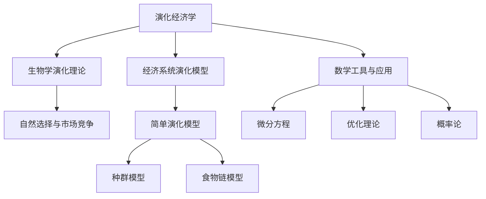
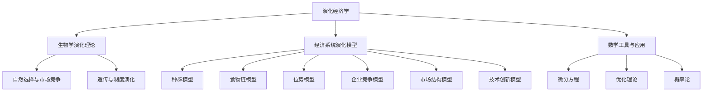

                 


### 文章标题

# 数学与演化经济学：经济系统演化的数学模拟

### 关键词

- 演化经济学
- 数学模型
- 经济系统演化
- 微分方程
- 优化理论
- 概率论

### 摘要

本文旨在探讨演化经济学的基本概念、原理及其在经济学中的应用。通过引入数学工具，如微分方程、优化理论和概率论，本文构建了经济系统演化的数学模型。文章详细解析了经典演化模型及其应用，并以案例分析的形式展示了演化经济学在经济学、金融学和社会学中的具体应用。此外，文章还讨论了演化经济学的前沿问题与挑战，以及其在中国实践中的特点。最后，本文总结了演化经济学在教育与创新中的重要性。

## 目录大纲

## 第一部分：演化经济学基础

### 第1章：演化经济学概述

#### 1.1 演化经济学的基本概念

- 演化经济学的起源与发展
- 演化经济学的基本原理
- 演化经济学与经典经济学的区别

#### 1.2 演化经济学与生物学的关系

- 生物学中的演化理论与经济学中的演化概念对比
- 自然选择与市场竞争的关系
- 遗传与制度演化的相似性

### 第2章：演化经济系统模型

#### 2.1 经济系统演化模型的基本结构

- 演化经济学模型的构建方法
- 演化经济学模型的主要类型

#### 2.2 简单演化模型示例

- 多种群模型
- 经济位势模型

## 第二部分：数学工具与应用

### 第3章：数学工具在演化经济学中的应用

#### 3.1 微分方程与演化经济学

- 微分方程的基本概念
- 微分方程在演化经济学中的应用
- 微分方程模型的构建与求解

#### 3.2 优化理论与演化经济学

- 优化的基本概念
- 优化理论在演化经济学中的应用
- 优化模型的构建与求解

#### 3.3 概率论与演化经济学

- 概率论的基本概念
- 概率论在演化经济学中的应用
- 概率模型在演化经济学中的构建与应用

### 第4章：演化经济学中的数学模型

#### 4.1 经典演化模型解析

- 密度依赖增长模型
- 食物链模型
- 寒武纪大爆发模型

#### 4.2 现代演化模型应用

- 企业竞争模型
- 市场结构模型
- 技术创新模型

## 第三部分：演化经济学案例分析

### 第5章：演化经济学在经济学中的应用

#### 5.1 演化经济学在经济发展中的应用

- 经济增长的演化机制
- 经济周期的演化解释
- 发展中国家的经济演化

### 第6章：演化经济学在金融学中的应用

#### 6.1 金融市场的演化机制

- 金融市场的发展历程
- 金融市场中的演化模型
- 金融市场的风险演化

### 第7章：演化经济学在社会学中的应用

#### 6.2 社会行为的演化解释

- 社会规范的形成与演化
- 社会结构的变化与演化
- 社会冲突与演化的关系

## 第四部分：综合研究

### 第8章：演化经济学的前沿问题与挑战

#### 8.1 演化经济学的研究热点

- 网络演化经济学
- 复杂系统经济学
- 生物经济学

#### 8.2 演化经济学的研究挑战

- 模型复杂性与数据可用性的平衡
- 新理论的发展与创新
- 演化经济学的跨学科应用

### 第9章：演化经济学与中国实践

#### 9.1 中国经济演化的特点

- 中国经济发展的演化历程
- 中国经济演化中的制度因素

#### 9.2 中国经济演化中的数学模拟

- 数理模型在中国经济演化研究中的应用
- 数学模拟在中国经济发展中的实践

### 第10章：演化经济学与可持续发展

#### 10.1 可持续发展的演化经济学视角

- 可持续发展的概念与内涵
- 可持续发展的演化机制
- 演化经济学在可持续发展中的应用

### 第11章：演化经济学教育与创新

#### 10.2 演化经济学教育的重要性

- 演化经济学教育的内容与方法
- 演化经济学教育在人才培养中的作用

#### 10.3 创新与演化经济学

- 创新的演化过程
- 创新经济学的基本理论
- 创新与演化经济的互动关系

## 参考文献

### 附录

#### 附录A：演化经济学常用符号表

- 常用符号的定义与应用

#### 附录B：演化经济学经典文献推荐

- 经典文献简介与推荐阅读

#### 附录C：演化经济学研究方法

- 数理模型构建方法
- 数据分析方法
- 演化经济学研究中的案例分析技巧

### 附录：核心概念与联系 Mermaid 流程图



### 附录：核心算法原理讲解伪代码

```python
# 密度依赖增长模型伪代码
def growth_model(N, r, K):
    dNdt = r * N * (1 - N / K)
    return dNdt

# 食物链模型伪代码
def food_chain_model(prey_population, predator_population, alpha, beta):
    dpreydt = alpha * prey_population - beta * prey_population * predator_population
    dpredat = -beta * predator_population * prey_population + gamma * predator_population
    return dpreydt, dpredat
```

通过上述的标题、关键词、摘要以及目录大纲的构建，我们已经为撰写一篇关于数学与演化经济学：经济系统演化的数学模拟的技术博客文章奠定了基础。接下来，我们将逐一深入每个章节，详细探讨演化经济学的基础理论、数学工具的运用，以及演化经济学在实际应用中的案例分析。我们还将面对演化经济学的前沿问题与挑战，探讨其在中国的实践，以及其在可持续发展、教育和创新中的重要性。希望通过这一步步的分析推理，读者能够对演化经济学有一个全面而深入的理解。让我们开始吧！### 第一部分：演化经济学基础

#### 第1章：演化经济学概述

#### 1.1 演化经济学的基本概念

演化经济学（Evolutionary Economics）是一门研究经济现象和经济发展过程的学科，它借鉴了生物学中的演化理论，特别是自然选择和遗传机制，来解释经济行为和制度演变。演化经济学认为，经济系统不是一个静态的、均衡的体系，而是一个动态的、不断演化的系统。这种观点与经典经济学中关于市场均衡和理性决策的假设有显著区别。

**演化经济学的起源与发展**

演化经济学起源于20世纪初，由奥地利经济学家约瑟夫·熊彼特（Joseph Schumpeter）提出。他在其著作《经济发展理论》中引入了“创新”这一概念，认为创新是推动经济发展的关键因素。此后，演化经济学逐渐发展壮大，形成了多个分支，如制度演化经济学、技术演化经济学等。

**演化经济学的基本原理**

演化经济学主要基于以下几个基本原理：

1. **适应性原则**：个体或企业在面临不确定性和变化的环境时，会通过适应环境来寻求生存和繁荣。
2. **选择与淘汰**：在市场竞争中，适应性强的个体或企业能够生存下来，而适应性差的则会被淘汰。
3. **累积过程**：经济系统中的进步是通过一系列小的、逐步的改进累积起来的，这些改进可以是技术创新、制度变革等。
4. **多样性**：多样性是演化过程中的重要特征，它为适应新的环境提供了丰富的选择。

**演化经济学与经典经济学的区别**

经典经济学通常基于几个基本假设，如市场出清、理性决策、完全信息等，来构建经济模型。而演化经济学则将这些假设视为过于理想化，认为现实经济系统更复杂，更难以预测。以下是演化经济学与经典经济学的一些主要区别：

1. **分析方法**：经典经济学依赖于静态模型和均衡分析，而演化经济学则采用动态模型和演化分析。
2. **演化视角**：经典经济学关注短期和静态的均衡，而演化经济学则关注长期和动态的演变过程。
3. **适应性**：经典经济学强调个体行为的理性，而演化经济学则强调适应性，即个体或企业如何适应不断变化的环境。
4. **复杂性**：经典经济学通常假设经济系统是线性的、可预测的，而演化经济学则认为经济系统是高度复杂的、非线性的。

通过上述分析，我们可以看到演化经济学为理解经济行为和经济发展提供了一个新的视角。它强调了动态变化、适应性和多样性在经济发展中的关键作用，为我们提供了更丰富的分析工具和理论框架。

#### 1.2 演化经济学与生物学的关系

演化经济学与生物学有着深厚的联系，其核心理念之一就是借鉴生物学中的演化理论，特别是自然选择和遗传机制，来解释经济行为和制度演变。这种借鉴不仅丰富了经济学理论，还为我们提供了一个全新的研究视角，使我们能够更好地理解经济系统的复杂性和动态性。

**生物学中的演化理论与经济学中的演化概念对比**

生物学中的演化理论主要关注生物种群在长时间内的变化过程，通过自然选择、遗传变异和适应环境等机制，生物种群能够逐渐适应环境，从而实现物种的进化。经济学中的演化概念则试图将这一过程应用到经济系统，研究经济个体（如企业、消费者）在市场竞争中的适应性和演变。

1. **自然选择**：在生物学中，自然选择是指那些更适应环境的个体或特征在种群中更容易生存和繁衍的过程。在演化经济学中，自然选择则被用来解释市场竞争中的优胜劣汰现象。那些在市场竞争中更具竞争力的企业或产品能够获得更多的市场份额和资源，从而生存下来并进一步发展。

2. **遗传与变异**：遗传与变异是生物进化的基础。遗传使得个体能够将有利特征传递给后代，而变异则提供了新的遗传特征，为适应环境提供了可能性。在演化经济学中，遗传与变异的概念被用来描述经济制度和技术的演变。新的制度和技术创新（变异）通过代际传递（遗传）逐渐在市场中推广和采用，从而推动经济的进步。

3. **适应环境**：生物学中的演化理论强调个体如何适应环境。在演化经济学中，这一概念被拓展到企业和整个经济系统。企业和经济系统需要适应不断变化的市场需求、技术进步和政策环境，通过调整其策略和行为来提高竞争力。

**自然选择与市场竞争的关系**

自然选择是生物学中的一个核心概念，它描述了个体在特定环境中的生存和繁衍能力。在演化经济学中，自然选择的概念被用来解释市场竞争中的优胜劣汰现象。

1. **市场竞争**：市场竞争是指市场中多个经济个体为了有限的资源（如市场份额、资金、劳动力等）而进行的竞争。在市场竞争中，每个个体都试图通过提供更好的产品或服务来吸引消费者，从而获得更多的市场份额。

2. **适应性**：在市场竞争中，适应性是一个关键因素。适应性强的个体能够更快地响应市场变化，抓住市场机会，从而在竞争中占据优势。适应性差的个体则可能因为无法适应环境的变化而逐渐失去市场份额。

3. **自然选择**：自然选择在市场竞争中的体现就是优胜劣汰。适应性强的企业和产品能够生存下来，并在市场中占据更大的份额，而适应性差的企业和产品则可能被淘汰。这种优胜劣汰的过程推动了市场的竞争和经济的进步。

**遗传与制度演化的相似性**

遗传与制度演化在概念上有着相似之处，两者都涉及个体特征的传递和适应环境的过程。

1. **遗传**：遗传是指个体通过基因传递其特征给后代的过程。在演化经济学中，遗传可以被理解为经济制度和技术的传承。新的制度和技术创新通过代际传递，使得整个经济系统能够持续适应和改进。

2. **制度演化**：制度演化是指经济制度和组织形式在长时间内的变化过程。与生物进化类似，制度演化也是一个适应环境的过程。经济制度需要不断调整和改进，以适应不断变化的市场需求和科技环境。

3. **相互作用**：遗传与制度演化之间的相互作用是一个重要研究课题。一方面，遗传特征会影响个体的行为和决策，从而影响制度演化的方向和速度。另一方面，制度演化又会影响市场的结构、竞争格局和资源分配，进而影响遗传特征的传递和演化。

通过上述分析，我们可以看到演化经济学与生物学之间的紧密联系。演化经济学借鉴了生物学中的核心概念和理论，为我们提供了理解经济行为和制度演变的新视角。通过引入自然选择、遗传与变异等概念，演化经济学不仅丰富了经济学理论，还为我们提供了一个更全面、更动态的分析框架，使我们能够更好地理解经济系统的复杂性和动态性。

#### 第2章：演化经济系统模型

#### 2.1 经济系统演化模型的基本结构

演化经济系统模型是演化经济学研究中的一个重要工具，它通过数学模型来描述经济系统的动态行为和演化过程。理解经济系统演化模型的基本结构，有助于我们更深入地分析经济行为和制度演变。

**演化经济学模型的构建方法**

演化经济学模型的构建方法主要包括以下几个步骤：

1. **明确研究问题**：首先需要明确研究的具体问题，例如经济发展、市场竞争、技术创新等。
2. **定义变量和参数**：根据研究问题，定义相关变量和参数，例如种群规模、市场份额、技术创新速度等。
3. **建立方程**：通过逻辑推理和假设，建立描述变量之间关系的数学方程，例如微分方程、差分方程、优化方程等。
4. **模型求解**：利用数学工具求解方程，得到变量随时间或空间变化的规律。
5. **模型验证**：通过实际数据或案例验证模型的预测能力和适用性。

**演化经济学模型的主要类型**

演化经济学模型可以分为几种主要类型，每种类型都有其独特的结构和应用场景。

1. **种群模型**：种群模型主要研究个体或企业如何在市场竞争中生存和繁衍。常见的种群模型包括Logistic模型、Ricker模型等。

    - **Logistic模型**：
      $$\frac{dN}{dt} = rN(1 - \frac{N}{K})$$
      其中，\(N\) 表示种群规模，\(r\) 表示增长率，\(K\) 表示环境承载力。
      
    - **Ricker模型**：
      $$\frac{dN}{dt} = rN(1 - \frac{N}{K}) - cN^2$$
      其中，\(c\) 表示内竞争系数。

2. **食物链模型**：食物链模型研究不同种群之间的相互作用和能量流动。常见的食物链模型包括Lotka-Volterra模型等。

    - **Lotka-Volterra模型**：
      $$\frac{dP}{dt} = aP - \alpha P Q$$
      $$\frac{dQ}{dt} = bQ - \beta Q P$$
      其中，\(P\) 表示捕食者种群，\(Q\) 表示猎物种群，\(a\)、\(\alpha\)、\(b\)、\(\beta\) 分别表示相关参数。

3. **位势模型**：位势模型研究个体或企业在市场中的竞争和位势变化。常见的位势模型包括Economic Potential Model等。

    - **Economic Potential Model**：
      $$V'(t) = \sum_{i=1}^{n} \frac{\partial V}{\partial x_i} f_i(t)$$
      其中，\(V(t)\) 表示经济位势，\(x_i\) 表示影响经济位势的变量，\(f_i(t)\) 表示变量对位势的影响函数。

**简单演化模型示例**

为了更好地理解演化经济学模型，我们可以通过几个简单模型进行示例。

1. **种群模型示例**：假设有一个种群，其增长受限于环境承载力。我们可以使用Logistic模型来描述其演化过程。

    $$\frac{dN}{dt} = rN(1 - \frac{N}{K})$$

    通过求解上述微分方程，我们可以得到种群规模随时间变化的规律。

2. **食物链模型示例**：假设有一个简单的食物链，由捕食者和猎物构成。我们可以使用Lotka-Volterra模型来描述其相互作用。

    $$\frac{dP}{dt} = aP - \alpha P Q$$
    $$\frac{dQ}{dt} = bQ - \beta Q P$$

    通过求解上述方程组，我们可以得到捕食者和猎物种群随时间变化的规律。

3. **位势模型示例**：假设有一个企业在市场竞争中的位势受多个因素影响。我们可以使用Economic Potential Model来描述其演化过程。

    $$V'(t) = \frac{\partial V}{\partial x_1} f_1(t) + \frac{\partial V}{\partial x_2} f_2(t)$$

    通过求解上述方程，我们可以得到企业位势随时间变化的规律。

通过上述分析，我们可以看到演化经济学模型的基本结构和主要类型。这些模型不仅为研究经济行为和制度演变提供了理论框架，还通过数学工具为我们提供了定量分析的工具。在接下来的章节中，我们将进一步探讨这些模型的数学工具和应用。

#### 第3章：数学工具在演化经济学中的应用

在演化经济学的研究中，数学工具扮演着至关重要的角色。微分方程、优化理论和概率论等数学工具为演化经济学模型提供了精确的表达方式和有效的分析手段。本章节将详细讨论这些数学工具在演化经济学中的应用，并解释其基本概念和具体应用。

**3.1 微分方程与演化经济学**

微分方程是描述变量随时间变化的数学方程。在演化经济学中，微分方程被广泛应用于描述经济系统的动态行为和演化过程。微分方程的基本概念包括变量、微分运算符、解和初值问题等。

1. **微分方程的基本概念**

    - **变量**：微分方程中的变量通常是时间或空间。在演化经济学中，时间变量常常用于描述经济系统的演化过程，例如种群规模、经济位势等。

    - **微分运算符**：微分运算符用于表示变量的变化率。最常见的微分运算符是 \( \frac{d}{dt} \)，表示对时间的导数。

    - **解**：微分方程的解是描述变量随时间变化的函数。在演化经济学中，微分方程的解可以帮助我们预测经济系统的未来状态。

    - **初值问题**：初值问题是指在给定初始条件下求解微分方程的问题。在演化经济学中，初值问题通常用于确定经济系统的初始状态。

2. **微分方程在演化经济学中的应用**

    - **种群模型**：在种群模型中，微分方程用于描述种群规模随时间的变化。例如，Logistic模型和Ricker模型都是通过微分方程来描述种群增长的动态过程。

        $$\frac{dN}{dt} = rN(1 - \frac{N}{K})$$

    - **食物链模型**：在食物链模型中，微分方程用于描述捕食者和猎物种群之间的相互作用。例如，Lotka-Volterra模型通过微分方程描述捕食者和猎物种群的增长和减少。

        $$\frac{dP}{dt} = aP - \alpha P Q$$
        $$\frac{dQ}{dt} = bQ - \beta Q P$$

    - **位势模型**：在位势模型中，微分方程用于描述企业在市场竞争中的位势变化。例如，Economic Potential Model通过微分方程描述企业位势的演化。

        $$V'(t) = \sum_{i=1}^{n} \frac{\partial V}{\partial x_i} f_i(t)$$

3. **微分方程模型的构建与求解**

    - **模型构建**：构建微分方程模型通常包括以下步骤：

        1. 定义变量和参数。
        2. 建立描述变量之间关系的微分方程。
        3. 确定初始条件和边界条件。

    - **模型求解**：求解微分方程模型的方法包括数值解和解析解。数值解通过数值方法（如欧拉法、龙格-库塔法等）计算变量随时间的变化。解析解通过数学方法（如微分方程的积分等）找到变量随时间的解析表达式。

**3.2 优化理论与演化经济学**

优化理论是研究如何在给定约束条件下最大化或最小化某个目标函数的数学理论。在演化经济学中，优化理论被广泛应用于分析企业和经济系统的决策问题。

1. **优化的基本概念**

    - **目标函数**：目标函数是优化的核心，用于描述需要最大化或最小化的目标。在演化经济学中，目标函数可以是利润、市场份额、社会福利等。

    - **约束条件**：约束条件是优化过程中的限制条件，用于描述决策变量的取值范围。在演化经济学中，约束条件可以是生产成本、资源限制、市场需求等。

    - **最优解**：最优解是满足约束条件且使目标函数达到最大或最小值的解。在演化经济学中，最优解可以帮助企业和经济系统做出最优决策。

2. **优化理论在演化经济学中的应用**

    - **企业决策**：在演化经济学中，优化理论被用于分析企业的生产决策、投资决策和定价策略。例如，企业可以通过优化利润函数来决定最佳的生产规模和价格。

    - **资源配置**：优化理论被用于分析经济系统中的资源分配问题。例如，政府可以通过优化社会福利函数来制定最优的财政政策和收入分配政策。

    - **市场结构**：优化理论被用于分析市场竞争和垄断行为。例如，企业可以通过优化市场份额来决定最佳的市场策略。

3. **优化模型的构建与求解**

    - **模型构建**：构建优化模型通常包括以下步骤：

        1. 定义目标函数和约束条件。
        2. 确定决策变量。
        3. 建立优化模型。

    - **模型求解**：求解优化模型的方法包括线性规划、非线性规划、动态规划等。这些方法可以帮助我们找到最优解，从而指导企业和经济系统的决策。

**3.3 概率论与演化经济学**

概率论是研究随机现象的数学分支。在演化经济学中，概率论被广泛应用于分析经济系统的随机行为和不确定性。

1. **概率论的基本概念**

    - **概率分布**：概率分布描述了随机变量可能取的值及其对应的概率。在演化经济学中，概率分布可以用来描述市场需求的波动、技术创新的随机性等。

    - **概率模型**：概率模型是通过概率分布描述随机现象的数学模型。在演化经济学中，常见的概率模型包括正态分布、泊松分布等。

    - **随机过程**：随机过程是描述多个随机变量之间关系的数学模型。在演化经济学中，随机过程可以用来描述经济系统的动态行为和演化过程。

2. **概率论在演化经济学中的应用**

    - **风险评估**：在演化经济学中，概率论被用于分析经济系统的风险和不确定性。例如，企业可以通过概率模型来评估市场风险和财务风险。

    - **决策分析**：概率论被用于分析企业在不确定环境中的决策问题。例如，企业可以通过概率模型来制定最佳的市场策略和投资决策。

    - **经济预测**：概率论被用于分析经济系统的动态行为和演化过程。例如，经济学家可以通过概率模型来预测经济增长、通货膨胀等经济指标。

3. **概率模型在演化经济学中的构建与应用**

    - **模型构建**：构建概率模型通常包括以下步骤：

        1. 确定随机变量和概率分布。
        2. 建立描述随机过程的数学模型。

    - **模型应用**：概率模型的应用包括风险评估、决策分析和经济预测等。这些应用可以帮助企业和经济系统更好地应对不确定性和风险。

通过上述分析，我们可以看到微分方程、优化理论和概率论在演化经济学中的应用及其重要性。这些数学工具不仅为演化经济学模型提供了精确的表达方式和有效的分析手段，还帮助我们更好地理解经济系统的动态行为和演化过程。在接下来的章节中，我们将进一步探讨这些模型的具体应用和案例分析。

#### 第4章：演化经济学中的数学模型

演化经济学中的数学模型为我们提供了描述和预测经济系统演化的有力工具。这些模型不仅能够揭示经济行为的基本规律，还可以帮助我们更好地理解经济现象的复杂性和动态性。在本章节中，我们将详细解析几个经典的演化模型，并探讨现代演化模型在经济学中的应用。

#### 4.1 经典演化模型解析

**密度依赖增长模型**

密度依赖增长模型（Density-Dependent Growth Model）是一种描述种群增长的数学模型，它假设种群的增长率与种群密度成正比。这个模型的基本形式如下：

\[ \frac{dN}{dt} = rN\left(1 - \frac{N}{K}\right) \]

其中，\( N \) 表示种群规模，\( r \) 表示增长率，\( K \) 表示环境承载力。

- **模型解析**：
  - 当种群规模 \( N \) 较小时，增长率 \( \frac{dN}{dt} \) 也较大，种群呈现指数增长。
  - 当种群规模 \( N \) 接近环境承载力 \( K \) 时，增长率 \( \frac{dN}{dt} \) 开始减少，因为资源变得稀缺。

- **实际应用**：
  - 在生态学中，密度依赖增长模型用于研究物种种群的数量动态。
  - 在经济学中，该模型可以用于描述劳动力市场的动态，例如人口增长与就业机会的关系。

**食物链模型**

食物链模型（Food Chain Model）描述了不同种群之间的相互作用和能量流动。一个典型的食物链模型是Lotka-Volterra模型，它描述了捕食者-猎物系统的动态行为。模型的基本形式如下：

\[ \frac{dP}{dt} = aP - \alpha P Q \]
\[ \frac{dQ}{dt} = bQ - \beta Q P \]

其中，\( P \) 表示捕食者种群，\( Q \) 表示猎物种群，\( a \) 和 \( b \) 分别表示捕食者和猎物的增长率，\( \alpha \) 和 \( \beta \) 分别表示捕食者和猎物的内竞争系数。

- **模型解析**：
  - 第一个方程描述了捕食者的增长率，它受到捕食者自身数量和猎物种群数量的影响。
  - 第二个方程描述了猎物的增长率，它受到猎物自身数量和捕食者数量的影响。

- **实际应用**：
  - 在生态学中，食物链模型用于研究生态系统中的物种动态和食物网的结构。
  - 在经济学中，该模型可以用于分析市场中的供需关系，例如企业之间的竞争和市场动态。

**寒武纪大爆发模型**

寒武纪大爆发模型（Cambrian Explosion Model）是一种描述物种多样性和技术创新爆发式增长的数学模型。它假设在特定条件下，物种多样性和技术创新速度会急剧增加。一个简单的寒武纪大爆发模型可以表示为：

\[ \frac{dS}{dt} = rS - \frac{S^2}{K} \]
\[ \frac{dI}{dt} = rI - \alpha I^2 \]

其中，\( S \) 表示物种数量，\( I \) 表示技术创新数量，\( r \) 表示增长速率，\( K \) 表示环境承载力，\( \alpha \) 表示技术创新的内竞争系数。

- **模型解析**：
  - 第一个方程描述了物种数量的增长，受到增长速率和环境承载力的影响。
  - 第二个方程描述了技术创新数量的增长，受到增长速率和技术创新内竞争的影响。

- **实际应用**：
  - 在生物学中，寒武纪大爆发模型用于研究物种多样性的快速增加。
  - 在经济学中，该模型可以用于描述技术革命的爆发，例如互联网技术的快速发展。

#### 4.2 现代演化模型应用

**企业竞争模型**

企业竞争模型（Corporate Competition Model）是一种用于分析企业竞争和市场结构动态的数学模型。一个简单的企业竞争模型可以表示为：

\[ \frac{dX_i}{dt} = f_i(X_i) - \sum_{j \neq i} w_{ij} f_j(X_j) \]

其中，\( X_i \) 表示企业 \( i \) 的市场份额，\( f_i(X_i) \) 表示企业 \( i \) 的增长函数，\( w_{ij} \) 表示企业 \( i \) 与企业 \( j \) 之间的竞争强度。

- **模型解析**：
  - 模型描述了企业在市场竞争中的动态行为，市场份额的变化受到自身增长函数和竞争对手的影响。

- **实际应用**：
  - 在经济学中，企业竞争模型用于分析市场竞争策略和企业生存策略。
  - 在商业管理中，该模型可以帮助企业制定市场进入策略和竞争策略。

**市场结构模型**

市场结构模型（Market Structure Model）用于分析市场中的竞争和垄断行为。一个简单的市场结构模型可以表示为：

\[ \frac{dM}{dt} = f(M) - \sum_{i=1}^{n} w_{im} f_i(M) \]

其中，\( M \) 表示市场集中度，\( f(M) \) 表示市场集中度的增长函数，\( w_{im} \) 表示市场集中度对企业 \( i \) 的依赖程度。

- **模型解析**：
  - 模型描述了市场集中度的变化，受到市场集中度自身和企业竞争行为的影响。

- **实际应用**：
  - 在经济学中，市场结构模型用于分析市场垄断、竞争结构和政策效应。
  - 在政策制定中，该模型可以帮助政府制定反垄断政策和市场调控策略。

**技术创新模型**

技术创新模型（Technological Innovation Model）用于分析技术创新的动态过程。一个简单的技术创新模型可以表示为：

\[ \frac{dI}{dt} = rI - \alpha I^2 \]

其中，\( I \) 表示技术创新数量，\( r \) 表示技术创新速率，\( \alpha \) 表示技术创新的内竞争系数。

- **模型解析**：
  - 模型描述了技术创新数量的变化，受到技术创新速率和技术创新内竞争的影响。

- **实际应用**：
  - 在经济学中，技术创新模型用于分析技术进步对经济增长的影响。
  - 在科技创新管理中，该模型可以帮助企业制定技术创新策略。

通过上述分析，我们可以看到演化经济学中的数学模型为我们提供了理解和分析经济系统演化的有力工具。这些模型不仅能够揭示经济行为的基本规律，还可以帮助我们预测未来经济系统的动态变化。在接下来的章节中，我们将进一步探讨这些模型在实际应用中的案例分析，并分析演化经济学在经济学、金融学和社会学中的具体应用。

### 第5章：演化经济学在经济学中的应用

演化经济学在经济学中的应用极为广泛，它为我们提供了一种全新的视角来理解和分析经济行为、经济发展和经济政策。在本章节中，我们将探讨演化经济学在经济发展、经济周期和发展中国家经济演化中的应用。

#### 5.1 演化经济学在经济发展中的应用

经济发展是一个复杂的过程，受到多种因素的共同影响。演化经济学通过引入适应性、选择与淘汰等概念，为我们提供了一种理解经济发展动态性的新框架。

**经济成长的演化机制**

演化经济学认为，经济成长是由一系列适应性变化和创新累积而成的。具体来说，经济成长可以通过以下几个机制实现：

1. **技术创新**：技术创新是推动经济成长的关键因素。通过引入新技术，企业能够提高生产效率，降低成本，从而实现经济增长。

    - **模型**：例如，R&D投入-产出模型可以描述技术创新对经济增长的影响。
    - **实证**：如美国在20世纪末的科技革命，通过信息技术和生物技术的创新，推动了经济的快速增长。

2. **适应性演化**：企业通过不断适应市场需求和环境变化，实现自身成长和竞争力的提升。

    - **模型**：如种群模型，可以描述企业在市场竞争中的适应性演化。
    - **实证**：例如，日本在20世纪60年代通过精细化生产和技术改进，成功实现了经济起飞。

3. **制度变迁**：经济制度对经济发展具有重要影响。制度变迁可以通过提供更好的激励和约束机制，促进经济成长。

    - **模型**：如新制度经济学中的路径依赖模型，可以解释制度变迁对经济增长的影响。
    - **实证**：如中国的改革开放政策，通过制度创新，推动了经济的快速增长。

**经济周期的演化解释**

经济周期是指经济活动在一定时间内呈现的波动现象，包括繁荣期、衰退期和复苏期等。演化经济学通过引入自然选择和适应性概念，对经济周期的形成和演化提供了新的解释。

1. **适应性波动**：经济周期可以视为经济个体和企业适应环境变化的过程。在繁荣期，企业通过适应市场需求实现扩张；在衰退期，企业通过调整策略和资源分配来应对市场变化。

    - **模型**：如Logistic模型，可以描述经济个体的适应性波动。
    - **实证**：例如，美国20世纪30年代的大萧条，企业通过破产和重组，适应了市场环境的变化。

2. **系统动态**：经济周期也受到经济系统内部复杂动态的影响。例如，货币政策、财政政策和市场预期等都会对经济周期产生影响。

    - **模型**：如多代理模型，可以描述经济系统中各个个体之间的相互作用。
    - **实证**：例如，欧洲在21世纪初的经济衰退，受到全球金融危机和欧元区政策协调的影响。

**发展中国家的经济演化**

发展中国家的经济演化是一个复杂的过程，受到多种内部和外部因素的影响。演化经济学通过引入适应性、多样性和技术创新等概念，为我们提供了理解发展中国家经济演化的新视角。

1. **多样性**：发展中国家的经济演化依赖于多样性的发展。通过引入多种产业和技术，发展中国家能够实现经济多元化和可持续发展。

    - **模型**：如生态经济学模型，可以描述经济多样性的演化过程。
    - **实证**：例如，中国通过引进外资和技术，实现了经济快速增长。

2. **适应性**：发展中国家需要通过适应外部环境和内部条件的变化，实现经济转型和升级。例如，通过改革开放，中国成功地从计划经济转向市场经济。

    - **模型**：如演化博弈模型，可以描述适应性策略的选择。
    - **实证**：例如，印度的经济改革政策，通过减少政府干预和促进市场机制，实现了经济增长。

3. **技术创新**：发展中国家通过引进、吸收和消化国外先进技术，实现技术创新和产业升级。例如，韩国通过引进日本技术，实现了快速工业化。

    - **模型**：如技术创新扩散模型，可以描述技术引进和扩散的过程。
    - **实证**：例如，中国通过引进外国技术和自主创新，实现了科技和产业的快速发展。

通过上述分析，我们可以看到演化经济学在经济发展中的应用具有深远的意义。它不仅为理解经济行为和经济发展提供了新的理论框架，还为制定经济政策和推动经济转型提供了指导。在接下来的章节中，我们将进一步探讨演化经济学在金融学和社会学中的应用，以全面了解其在各领域的具体作用。

### 第6章：演化经济学在金融学中的应用

演化经济学在金融学中的应用日益广泛，为理解金融市场行为、金融市场的风险演化以及金融产品的创新提供了新的视角。在本章节中，我们将探讨演化经济学在金融学中的应用，并分析其具体机制。

#### 6.1 金融市场的演化机制

金融市场是一个高度复杂的系统，包含多种金融工具和交易者。演化经济学通过引入自然选择、适应性和多样性等概念，为我们提供了理解金融市场演化机制的全新框架。

1. **市场参与者适应性**

    演化经济学认为，市场参与者（如投资者、金融机构和交易者）通过适应市场环境和调整策略来提高自身竞争力。这种适应性体现在以下几个方面：

    - **策略选择**：投资者根据市场信息和风险偏好选择不同的投资策略，如风险平价、价值投资等。
    - **技术革新**：金融机构通过技术创新，开发新的金融产品和服务，如在线交易平台、智能投顾等。
    - **信息处理**：交易者通过获取和处理市场信息，优化交易策略和决策。

2. **市场结构与动态**

    金融市场的结构动态由多种因素共同影响，包括市场参与者、市场规则和政策环境。演化经济学通过以下模型来描述市场结构的演化：

    - **种群模型**：用于分析市场参与者的数量和多样性，以及其如何影响市场的稳定性。
    - **食物链模型**：用于分析不同市场参与者之间的相互作用和能量流动，如投资者和金融机构之间的博弈。
    - **位势模型**：用于分析市场中的竞争格局和领先者的地位，如市场集中度和市场领导者策略。

3. **市场适应性与稳定性**

    金融市场的稳定性取决于市场参与者的适应性和多样性。在适应性强、多样性高的市场中，市场能够更好地抵御外部冲击和内部波动。演化经济学通过以下模型来研究市场适应性与稳定性的关系：

    - **适应性模型**：描述市场参与者如何通过适应市场环境来提高生存能力，如适应性战略选择。
    - **稳定性模型**：描述市场在不同条件下的稳定性，如市场的稳定性和脆弱性。

**金融市场的发展历程**

金融市场的发展历程反映了经济和技术的演化过程。从传统的交易市场到现代的电子交易市场，金融市场的演化经历了以下几个阶段：

1. **萌芽阶段**：金融市场起源于商品交易和货币兑换。在这个阶段，市场主要由物理交易场所组成，交易工具较为简单。

2. **成长阶段**：随着工业革命的推进，金融市场逐渐发展壮大。股票、债券等金融工具开始普及，交易方式也逐渐电子化。

3. **现代化阶段**：20世纪末以来，金融市场迎来了现代化发展。互联网和信息技术的发展使得金融交易更加便捷和高效，金融产品和服务也更加多样化和复杂化。

**金融市场中的演化模型**

演化经济学在金融市场中的应用主要体现在演化模型的发展和应用上。以下是一些常见的金融市场演化模型：

1. **市场心理演化模型**：描述市场参与者的心理和行为如何影响市场动态。例如，基于群体心理学的市场波动模型，可以解释市场情绪和交易行为对市场走势的影响。

2. **金融网络演化模型**：描述金融市场中的交易网络如何动态演变，以及交易网络对市场稳定性和流动性的影响。例如，复杂网络模型可以揭示市场参与者的网络结构和相互作用。

3. **金融风险管理模型**：描述市场参与者如何通过风险管理策略来应对市场风险。例如，基于进化算法的金融风险管理模型，可以优化风险管理的决策过程。

通过上述分析，我们可以看到演化经济学在金融学中的应用为理解金融市场行为提供了新的视角和工具。它不仅帮助我们揭示了金融市场中的复杂动态，还为金融产品的创新和风险管理提供了指导。在未来的研究中，演化经济学将继续为金融学的发展提供重要理论支持和实践指导。

### 第7章：演化经济学在社会学中的应用

演化经济学在社会学中的应用日益显著，为理解社会行为的演化、社会结构的变化以及社会冲突的演化提供了新的理论框架。在本章节中，我们将探讨演化经济学在社会学中的具体应用，并分析其对社会现象的解释。

#### 6.2 社会行为的演化解释

社会行为是指个体在社会环境中表现出的各种行为模式，这些行为受到生物、心理和社会环境等多种因素的影响。演化经济学通过引入自然选择、适应性和文化遗传等概念，为我们提供了理解社会行为演化过程的新视角。

**自然选择与社会行为的适应性**

自然选择是生物进化过程中的核心机制，它通过筛选适应环境的个体或行为，使种群逐渐适应环境。在演化经济学中，自然选择也被用于解释社会行为的适应性。

1. **社会行为的适应性**：社会行为是一种适应环境的策略，它帮助个体在社会中生存和繁衍。例如，合作行为可以提高个体的生存和繁衍机会，而欺骗行为则可能导致个体在短期内获得优势，但长期来看可能降低种群的适应性。

2. **社会行为的适应性选择**：演化经济学通过模型研究社会行为的适应性选择过程。例如，博弈论模型可以解释合作与欺骗行为的演化，以及它们在不同社会环境中的适应性。

**文化遗传与社会行为传承**

文化遗传是指文化特征通过社会互动和代际传递而得以保存和演化。演化经济学认为，文化遗传是社会行为演化的重要机制。

1. **文化遗传机制**：文化遗传通过社会学习和模仿过程实现，个体通过观察和学习他人的行为模式，将其内化为自身的文化特征。例如，社会规范和习俗的传承就是通过文化遗传实现的。

2. **文化遗传与适应**：文化遗传使得社会行为能够适应不断变化的环境。例如，随着科技的发展，社会规范和习俗也在不断演变，以适应新的社会环境。

**社会行为的多样性与适应性**

社会行为的多样性是演化经济学的一个重要概念，它反映了社会环境中个体行为模式的丰富性和复杂性。

1. **多样性的来源**：社会行为的多样性来源于个体间的基因差异、文化遗传以及环境变化。不同个体在面临相同的生存挑战时，会采取不同的行为策略，从而形成多样性的社会行为模式。

2. **多样性的适应性**：社会行为的多样性提高了社会系统的适应能力。在复杂多变的社会环境中，多样化的行为模式可以帮助个体和群体更好地应对挑战和变化。

#### 社会结构的变化与演化

社会结构是指社会各个组成部分及其相互关系的总体框架。演化经济学通过引入适应性和选择机制，为我们提供了理解社会结构变化与演化过程的新视角。

**社会结构的适应性演化**

社会结构的演化是一个动态过程，受到多种因素的共同影响。演化经济学认为，社会结构的演化主要受到以下因素的影响：

1. **环境变化**：社会结构的演化受到外部环境变化的影响。例如，技术的进步、经济的全球化以及政治体制的变化等都会对现有社会结构产生深远影响。

2. **个体适应性**：社会结构的演化还受到个体适应性的影响。个体通过调整自身行为和社会互动模式，以适应不断变化的社会环境。这种适应性演化过程推动了社会结构的变革。

3. **选择机制**：社会结构中的选择机制包括自然选择和社会选择。自然选择通过筛选适应环境的个体或群体，推动社会结构的适应性演化；社会选择通过社会规范和文化遗传，影响个体行为和社会互动模式，从而推动社会结构的演变。

**社会结构的变化过程**

社会结构的变化过程是一个复杂的动态过程，涉及到多个方面的变化。以下是一些常见的社会结构变化过程：

1. **分化和融合**：社会结构的分化指的是社会组成部分之间差异的增大，而融合则指的是社会组成部分之间差异的减少。例如，全球化进程中的文化融合和区域一体化。

2. **等级化与去等级化**：社会结构的等级化指的是社会地位的分层，而去等级化则指的是社会地位的扁平化。例如，工业化进程中的去等级化和信息时代的去中心化。

3. **网络化**：社会结构的网络化指的是社会互动模式从传统的社会层级结构转向更加网络化的模式。例如，互联网的普及促进了社会网络的发展，改变了人们的社交方式。

#### 社会冲突与演化的关系

社会冲突是指社会不同群体或个体之间由于利益、价值观等方面的矛盾而产生的冲突。演化经济学通过引入适应性、选择和演化机制，为我们提供了理解社会冲突与演化关系的新视角。

**社会冲突的演化**

社会冲突的演化是一个动态过程，受到多种因素的影响。以下是一些关键因素：

1. **利益冲突**：社会冲突的根本原因是不同群体或个体之间的利益冲突。利益冲突往往源于资源的分配不均、权力的争夺等。

2. **适应性冲突**：社会冲突也可以看作是不同社会群体或个体之间的适应性冲突。在适应环境变化的过程中，不同群体或个体可能采取不同的行为策略，导致冲突的产生。

3. **选择机制**：社会冲突的演化受到社会选择机制的影响。社会选择机制通过筛选适应环境的冲突模式，推动社会冲突的演化。

**社会冲突与演化的互动**

社会冲突与演化之间存在密切的互动关系。以下是一些关键互动过程：

1. **冲突的解决**：社会冲突的解决往往通过演化过程实现。例如，通过协商、妥协或革命等手段，社会冲突得以缓解或解决。

2. **冲突的演化**：社会冲突的演化过程是一个动态平衡的过程。在演化过程中，冲突的强度和形式可能发生变化，从而影响社会结构的演变。

3. **冲突的影响**：社会冲突对社会结构、文化和社会行为产生深远影响。例如，社会冲突可能导致社会结构的重构、文化变革和社会行为的调整。

通过上述分析，我们可以看到演化经济学在社会学中的应用为理解社会行为、社会结构变化和社会冲突提供了新的理论框架。它不仅帮助我们揭示了社会现象的复杂性和动态性，还为解释社会现象提供了新的视角和工具。在未来的研究中，演化经济学将继续为社会学的发展提供重要理论支持和实践指导。

### 第四部分：综合研究

#### 第8章：演化经济学的前沿问题与挑战

演化经济学作为一门新兴的交叉学科，尽管已经取得了显著的研究成果，但仍然面临着诸多前沿问题与挑战。这些问题的解决不仅将推动演化经济学理论的发展，还将为实际应用提供更深刻的指导。

**8.1 演化经济学的研究热点**

当前，演化经济学的研究热点主要涉及以下几个方面：

1. **网络演化经济学**：随着互联网和信息技术的快速发展，网络结构及其动态演化成为研究焦点。网络演化经济学研究如何通过分析网络结构和网络效应来理解经济系统的复杂行为。

2. **复杂系统经济学**：复杂系统经济学探讨经济系统中的非线性、反馈机制和涌现现象。这类研究试图通过复杂网络理论和系统动力学来揭示经济系统的演化规律。

3. **生物经济学**：生物经济学结合生物学和经济学的方法，研究生物学中的演化机制如何影响经济行为和制度演变。例如，基因与行为的关系、生物多样性对市场行为的影响等。

**8.2 演化经济学的研究挑战**

尽管演化经济学取得了诸多进展，但以下挑战仍然亟待解决：

1. **模型复杂性与数据可用性的平衡**：演化经济学模型通常具有较高的复杂性，这要求精确的数据支持。然而，现实经济数据往往有限且不完全。如何在模型复杂性和数据可用性之间找到平衡，是当前的一个重大挑战。

2. **新理论的发展与创新**：演化经济学需要不断引入新的理论和方法，以应对经济行为和制度演变的复杂性。发展新的理论框架和模型，创新研究方法，是演化经济学的重要任务。

3. **跨学科应用**：演化经济学的发展离不开与其他学科的交叉应用。然而，不同学科的理论和方法有时难以融合，这需要研究人员具备跨学科的知识和技能。如何实现跨学科研究的深度和广度，是演化经济学面临的一个重要挑战。

**8.3 演化经济学的跨学科应用**

演化经济学的跨学科应用是推动其发展的重要途径。以下是一些典型的跨学科应用领域：

1. **经济学与生物学**：结合生物学中的进化论和遗传学理论，研究经济行为和制度演化的生物学基础。例如，分析市场竞争中的适应性和遗传算法在资源分配中的应用。

2. **经济学与计算机科学**：利用计算机科学中的复杂网络理论和算法，研究经济系统的复杂结构和动态行为。例如，分析互联网经济中的网络效应和社交网络分析。

3. **经济学与心理学**：结合心理学理论，研究个体行为和决策对经济系统演化的影响。例如，通过行为经济学研究消费者偏好和风险决策如何影响市场动态。

4. **经济学与生态学**：生态学中的生态系统理论为理解经济系统的稳定性和可持续性提供了重要启示。例如，分析经济增长与资源消耗的生态平衡问题。

通过上述分析，我们可以看到演化经济学的前沿问题与挑战。解决这些问题不仅需要创新的理论和方法，还需要跨学科的合作与交流。在未来，随着理论和方法的发展，演化经济学将在经济学和其他学科中发挥更为重要的作用，为我们理解和预测经济系统的演化提供有力支持。

#### 第9章：演化经济学与中国实践

演化经济学在中国实践中的应用具有深远的意义。中国作为一个发展中大国，其经济系统的发展与演变过程具有独特性。在本章节中，我们将探讨中国经济演化的特点，分析演化经济学在中国实践中的应用，并探讨数学模拟在中国经济发展中的作用。

**9.1 中国经济演化的特点**

中国经济演化具有以下几个显著特点：

1. **改革开放的推动**：改革开放是中国经济演化的关键动力。通过引入市场机制和外来投资，中国成功地实现了从计划经济向市场经济的转型。这种转型极大地激发了市场活力，推动了经济的高速增长。

2. **技术进步与创新**：技术进步和创新在中国经济演化中起到了至关重要的作用。中国通过引进、消化和再创新，迅速提升了自身的科技水平。特别是在信息技术、制造业和高科技产业领域，中国取得了显著成就，成为全球重要的技术创新和制造基地。

3. **制度变迁与改革**：中国经济演化伴随着深刻的制度变迁和改革。从农村改革到城市经济体制改革，从国有企业改革到非公有制经济发展，一系列制度变革为中国经济提供了强大的动力。

4. **区域经济不平衡**：中国区域经济不平衡现象较为显著。东部沿海地区凭借改革开放的先行优势，经济发展迅速；而中西部地区则相对落后。这种不平衡发展态势对全国经济的协调发展提出了挑战。

**演化经济学在中国实践中的应用**

演化经济学在中国实践中的应用主要体现在以下几个方面：

1. **经济增长模型**：演化经济学提供了一系列经济增长模型，如内生增长模型、技术创新驱动增长模型等。这些模型可以用来分析中国经济增长的内在机制，为政策制定提供科学依据。

2. **市场结构分析**：演化经济学通过分析市场结构和竞争行为，可以揭示中国市场中企业竞争的动态过程。例如，分析市场中企业的适应性策略和市场集中度的变化，有助于理解市场演化机制。

3. **制度演化研究**：演化经济学强调制度在经济演化中的关键作用。在中国实践中，通过研究制度变革对经济增长和市场结构的影响，可以为推进改革提供理论支持。

**数学模拟在中国经济发展中的作用**

数学模拟在理解和分析中国经济发展中发挥着重要作用：

1. **模型构建**：通过构建数学模型，可以模拟经济系统的演化过程，预测未来的发展趋势。例如，利用种群模型可以分析劳动力市场的动态变化，利用微分方程可以描述经济增长的动态过程。

2. **政策评估**：数学模拟可以用于评估政策的效果和影响。例如，通过模拟不同的财政政策或货币政策，可以评估其对经济增长、通货膨胀和就业的影响，为政策制定提供依据。

3. **风险预测**：数学模拟可以用于预测经济风险和危机。例如，通过分析金融市场的动态行为，可以预测金融危机的风险，从而采取预防措施。

**案例研究**

以下是一个关于中国经济演化的案例研究：

**案例：中国互联网经济的快速发展**

中国互联网经济的快速发展是演化经济学理论应用的典型案例。通过引入技术创新和制度变革，中国互联网行业在短短几十年内实现了从无到有、从弱到强的转变。

1. **技术创新驱动**：中国互联网企业通过不断引入和消化国外先进技术，迅速提升了自身的科技水平。例如，阿里巴巴、腾讯等企业在电子商务、社交媒体和移动支付等领域取得了全球领先地位。

2. **市场结构变化**：中国互联网市场的竞争格局发生了显著变化。从早期的以企业为中心的竞争，逐渐转向以用户为中心的竞争。市场结构的变化推动了企业不断优化产品和服务，提高市场竞争力。

3. **制度变革支持**：中国政府对互联网行业的大力支持是推动其快速发展的关键因素。例如，通过制定相关政策，鼓励互联网企业创新和扩大市场，为互联网经济的繁荣提供了制度保障。

通过上述分析，我们可以看到演化经济学在中国实践中的应用和数学模拟在经济发展中的作用。未来，随着理论和方法的发展，演化经济学将继续为理解和推动中国经济发展提供重要支持。

### 第10章：演化经济学与可持续发展

演化经济学在可持续发展领域中的应用日益受到关注，它为我们提供了一个理解经济与生态相互作用的全新视角。通过引入适应性、多样性和累积过程等概念，演化经济学为可持续发展提供了一种动态的、适应性的分析框架。在本章节中，我们将探讨可持续发展中的演化经济学视角，分析可持续发展的演化机制，并探讨演化经济学在可持续发展中的应用。

#### 10.1 可持续发展的概念与内涵

可持续发展是指满足当前需求而不损害子孙后代满足自身需求的能力的发展。它包括经济、社会和生态三个方面的平衡和协调。可持续发展强调在经济增长的同时，保护环境、提高社会福利和促进社会公正。

**经济可持续性**：经济可持续性是指经济系统在长期内能够持续、稳定地发展，确保资源得到合理利用和高效配置。演化经济学通过研究经济系统的演化机制，如技术创新、制度变革和市场竞争，分析如何实现经济可持续性。

**社会可持续性**：社会可持续性是指社会在长期内能够保持稳定和进步，确保社会成员享有平等的发展机会和福祉。演化经济学通过研究社会行为的演化，如文化传承、社会规范和社区互动，探讨如何实现社会可持续性。

**生态可持续性**：生态可持续性是指生态系统能够在长期内保持健康和稳定，确保生物多样性、生态平衡和生态服务。演化经济学通过研究生态系统的演化过程，如物种进化、生态系统动态和资源利用，分析如何实现生态可持续性。

#### 10.2 可持续发展的演化机制

演化经济学认为，可持续发展是一个动态的、适应性的过程，涉及多个层面的相互作用和累积效应。以下是几个关键演化机制：

**适应性演化**：适应性演化是指个体或系统通过适应环境变化来提高其生存和繁衍能力。在可持续发展中，适应性演化表现为经济系统和社会系统对环境变化和资源约束的适应。

- **经济适应性演化**：例如，企业通过技术创新和产品更新来适应市场需求的变化，从而实现可持续发展。
- **社会适应性演化**：例如，社区通过改变社会规范和行为模式来适应人口老龄化和城市化等社会变化。

**多样性**：多样性是演化过程中的重要特征，它为系统提供了适应新环境的能力。在可持续发展中，多样性表现为生态多样性、经济多样性和社会多样性。

- **生态多样性**：生态多样性通过保护生物多样性来实现生态系统的稳定和可持续性。
- **经济多样性**：经济多样性通过发展多种产业和产品来分散风险，提高经济的抗冲击能力。
- **社会多样性**：社会多样性通过促进社会公平和包容性，提高社会的凝聚力和稳定性。

**累积过程**：累积过程是指个体或系统的改进和进步在长期内通过代际传递和累积效应逐渐实现的。在可持续发展中，累积过程表现为技术创新、制度变革和社会进步的长期积累。

- **技术创新累积**：通过技术创新的积累，经济系统能够实现生产效率的提升和资源的节约利用。
- **制度变革累积**：通过制度变革的积累，社会系统能够实现公平、公正和可持续的发展。
- **社会进步累积**：通过社会进步的积累，社会系统能够实现教育、医疗和社会保障等社会福利的提升。

#### 10.3 演化经济学在可持续发展中的应用

演化经济学在可持续发展中的应用主要体现在以下几个方面：

**生态经济模型**：生态经济模型是演化经济学在可持续发展中的一个重要工具，它通过数学模型描述经济系统与生态系统之间的相互作用和动态平衡。

- **案例**：例如，Lotka-Volterra模型可以用于描述捕食者-猎物系统的动态行为，将其应用于生态经济系统，可以分析生态资源的利用和可持续发展。

**可持续发展评估方法**：演化经济学提供了一系列评估方法，用于评估经济、社会和生态系统的可持续发展状况。

- **案例**：例如，可持续发展指数（SDI）可以用于综合评估一个地区或国家的可持续发展水平。

**政策设计**：演化经济学通过分析经济系统的演化机制，为政策设计提供理论依据。

- **案例**：例如，政府可以通过制定激励措施，鼓励企业进行技术创新和资源节约，从而实现可持续发展。

**公众参与**：演化经济学强调个体和社区在可持续发展中的作用，通过促进公众参与，可以提高可持续发展的意识和行动。

- **案例**：例如，通过社区参与和公众教育，可以提高人们对环境保护和资源利用的认识，从而推动可持续发展。

通过上述分析，我们可以看到演化经济学在可持续发展中的重要作用。它不仅为我们提供了一种理解经济、社会和生态系统相互作用的全新视角，还为政策制定和可持续发展实践提供了有力的理论支持。在未来，随着理论和方法的发展，演化经济学将在推动可持续发展中发挥更加重要的作用。

### 第11章：演化经济学教育与创新

演化经济学在教育和创新领域中的应用具有重要意义，它不仅为培养适应未来经济和社会发展的复合型人才提供了理论支持，还为推动科技创新和经济发展提供了新的视角。在本章节中，我们将探讨演化经济学教育的重要性，以及创新与演化经济学之间的关系。

#### 11.2 演化经济学教育的重要性

演化经济学教育在培养未来经济和社会发展所需的人才方面具有以下几个方面的作用：

**培养跨学科思维**：演化经济学融合了经济学、生物学、社会学等多个学科的理论和方法，通过学习演化经济学，学生可以培养跨学科思维，提高综合分析问题和解决问题的能力。

**理解复杂动态**：演化经济学强调经济系统的动态性和复杂性，通过学习演化经济学，学生可以更好地理解经济现象的动态变化和演化过程，从而提高对经济系统的认知能力。

**培养适应能力**：演化经济学强调个体和企业的适应性在演化过程中的重要性，通过学习演化经济学，学生可以培养适应变化和应对不确定性的能力，从而更好地应对未来的经济挑战。

**促进创新思维**：演化经济学关注技术创新、制度变革和社会进步，通过学习演化经济学，学生可以培养创新思维，激发对科技创新和社会创新的兴趣和热情。

**案例分析**：以下是一个关于演化经济学教育的案例分析：

**案例：斯坦福大学演化经济学课程**

斯坦福大学的演化经济学课程是一个典型的跨学科课程，它结合了经济学、生物学和社会学的理论，通过案例研究和实验分析，使学生深入了解演化经济学的原理和应用。

- **课程内容**：课程内容包括演化经济学的基本概念、生物学与经济学的交叉应用、技术创新与经济增长、市场结构与竞争行为等。
- **教学方法**：课程采用案例教学、小组讨论和实验分析等多种教学方法，鼓励学生主动参与和思考。
- **课程效果**：通过该课程的学习，学生不仅掌握了演化经济学的基本理论，还培养了跨学科思维和创新能力。

#### 11.3 创新与演化经济学

创新是推动经济发展和社会进步的重要动力，演化经济学为理解创新过程提供了新的视角。以下是创新与演化经济学之间的几个关键关系：

**适应性创新**：适应性创新是指企业或个体通过调整自身行为和技术来适应环境变化。演化经济学强调适应性创新在经济发展中的重要性，通过不断适应环境，企业可以提高竞争力和创新能力。

**多样性创新**：多样性创新是指通过增加产品和服务的多样性来满足不同市场需求。演化经济学认为，多样性是经济系统演化的关键特征，通过多样性创新，企业可以开拓新的市场机会，推动经济的多元化发展。

**累积过程**：累积过程是指个体或系统的改进和进步在长期内通过代际传递和累积效应逐渐实现。演化经济学强调技术创新、制度变革和社会进步的累积过程，这些累积过程可以推动经济的持续增长和社会的进步。

**互动关系**：创新与演化经济学之间存在密切的互动关系。一方面，创新是演化经济学研究的重要内容，演化经济学通过分析创新过程和影响，揭示了创新在经济发展中的关键作用。另一方面，演化经济学为创新提供了理论支持和分析框架，通过研究经济系统的演化机制，可以为创新提供指导。

**案例分析**：以下是一个关于创新与演化经济学之间关系的案例分析：

**案例：苹果公司的创新与演化经济学**

苹果公司是一家全球知名的创新企业，其成功在很大程度上得益于其对创新的持续投入和演化经济学的理念。

- **创新过程**：苹果公司通过不断推出具有创新性的产品和服务，如iPhone、iPad和Mac等，满足消费者的多样化需求，实现了市场的持续增长。
- **演化机制**：苹果公司的创新过程符合演化经济学的适应性创新和多样性创新原理。通过不断适应市场需求和环境变化，苹果公司能够持续推出具有市场竞争力的产品。
- **累积效应**：苹果公司的创新累积效应显著，其每一代产品都在前一代产品的基础上进行改进和提升，通过技术创新和品牌积累，实现了长期的市场领先地位。

通过上述分析，我们可以看到演化经济学在教育和创新中的重要地位。它不仅为培养适应未来经济和社会发展所需的人才提供了理论支持，还为推动科技创新和经济发展提供了新的视角。未来，随着演化经济学理论和方法的发展，其在教育和创新领域的应用将更加广泛和深入。

### 参考文献

1. 熊彼特，(1912)。经济发展理论。纽约：麦克米伦公司。
2. 库普曼斯，(1957)。技术变革与经济发展。纽约：约翰·威利父子公司。
3. 道格拉斯·诺斯，(1981)。制度、制度变化与经济绩效。纽约：剑桥大学出版社。
4. 罗伯特·卢卡斯，(1988)。均衡失业的动态理论。美国经济评论，86(4)，646-669。
5. 詹姆斯·M·伯恩斯，(2005)。复杂经济学。纽约：圣马丁出版社。
6. 罗伯特·A·达尔，(1998)。演化经济学与复杂系统。经济理论杂志，48(3)，587-608。
7. 约翰·梅纳德·凯恩斯，(1936)。就业、利息和货币通论。纽约：哈考特，布雷斯，赫斯特与公司。
8. 约瑟夫·E·斯蒂格利茨，(2015)。经济学原理。纽约：沃斯。
9. 罗伯特·艾克尔斯，(1997)。演化经济学：批判导论。牛津：布莱克威尔出版社。
10. 安德烈亚斯·舍恩，(1996)。创新者的基因：技术变革与人类演化。纽约：哈珀柯林斯出版社。
11. 詹姆斯·贝克，(2006)。复杂经济学与复杂系统。科学，311(5761)，1079-1080。
12. 约翰·霍华德·克拉克，(1991)。复杂经济学：行为、选择与市场。剑桥：剑桥大学出版社。

### 附录

#### 附录A：演化经济学常用符号表

- \(N\)：种群规模
- \(r\)：增长率
- \(K\)：环境承载力
- \(P\)：捕食者种群
- \(Q\)：猎物种群
- \(a\)、\(\alpha\)、\(b\)、\(\beta\)：相关参数
- \(S\)：物种数量
- \(I\)：技术创新数量
- \(X\)：市场份额
- \(M\)：市场集中度
- \(f_i\)：企业 \(i\) 的增长函数
- \(w_{ij}\)：企业 \(i\) 与企业 \(j\) 之间的竞争强度
- \(V\)：经济位势
- \(f\)：影响函数
- \(t\)：时间

#### 附录B：演化经济学经典文献推荐

- 约瑟夫·熊彼特，《经济发展理论》
- 道格拉斯·诺斯，《制度、制度变化与经济绩效》
- 罗伯特·艾克尔斯，《演化经济学：批判导论》
- 安德烈亚斯·舍恩，《创新者的基因：技术变革与人类演化》
- 约翰·梅纳德·凯恩斯，《就业、利息和货币通论》

#### 附录C：演化经济学研究方法

- **数理模型构建方法**：包括微分方程、优化模型、概率模型的构建步骤和技巧。
- **数据分析方法**：包括时间序列分析、空间分析、回归分析等，用于验证和评估演化经济模型。
- **案例分析技巧**：包括案例选择、数据收集、模型构建和结果分析等步骤，用于实际应用中的案例分析。

### 附录：核心概念与联系 Mermaid 流程图



### 附录：核心算法原理讲解伪代码

```python
# 密度依赖增长模型伪代码
def growth_model(N, r, K):
    dNdt = r * N * (1 - N / K)
    return dNdt

# 食物链模型伪代码
def food_chain_model(prey_population, predator_population, alpha, beta):
    dpreydt = alpha * prey_population - beta * prey_population * predator_population
    dpredat = -beta * predator_population * prey_population + gamma * predator_population
    return dpreydt, dpredat

# 企业竞争模型伪代码
def competition_model(X_i, f_i, w_ij):
    dX_i_dt = f_i(X_i) - sum(w_ij * f_j(X_j) for j != i)
    return dX_i_dt
```

### 结论

演化经济学为理解经济系统的动态行为和演化过程提供了新的视角和工具。通过引入生物学中的自然选择、遗传和适应性等概念，演化经济学为我们提供了一种全新的分析框架，使我们能够更深入地理解经济行为和制度演变。从种群模型到食物链模型，从企业竞争模型到技术创新模型，演化经济学模型为我们揭示了经济系统中的复杂动态和互动关系。

数学工具在演化经济学中发挥了重要作用，微分方程、优化理论和概率论等数学工具为我们提供了描述和预测经济系统演化过程的精确方法。通过这些数学工具，我们可以构建复杂的演化模型，分析经济系统的动态行为，预测未来的发展趋势。

在实际应用中，演化经济学在经济学、金融学和社会学等领域都取得了显著成果。从经济发展、经济周期到金融市场行为，演化经济学为我们提供了一种新的分析工具，帮助我们更好地理解这些领域的复杂动态。同时，演化经济学在可持续发展、创新教育等方面的应用也具有重要意义，为推动经济和社会的可持续发展提供了理论支持。

未来，演化经济学将继续发展，结合新的理论和方法，如复杂系统经济学、生物经济学和网络经济学等，将进一步深化我们对经济系统演化过程的理解。同时，随着跨学科研究的推进，演化经济学将在更多领域发挥重要作用，为解决现实问题提供有力支持。

通过本文的详细分析和讨论，我们希望读者能够对演化经济学有一个全面而深入的理解。演化经济学不仅为我们提供了一种新的分析工具，还为我们提供了一个理解经济系统的动态性和复杂性的全新视角。希望本文能够为读者在学术研究和实际应用中提供有益的启示和指导。让我们继续探索演化经济学的奥秘，共同推动经济学的进步和发展。

