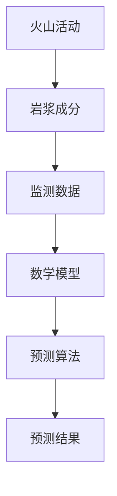
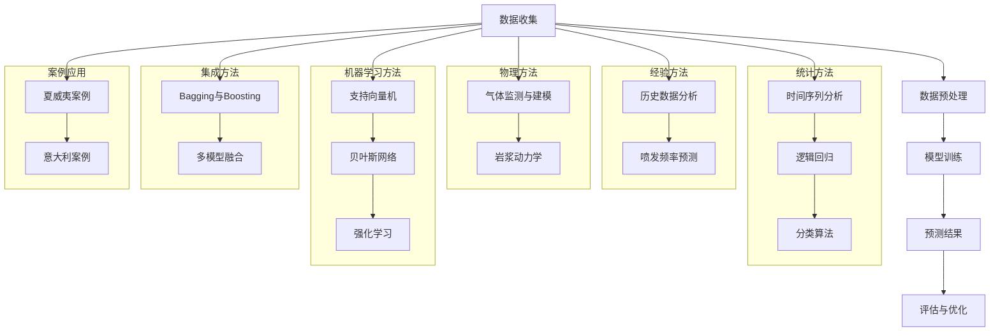

                 

## 1.1 火山喷发预测的重要性

### 1.1.1 火山喷发对人类社会的影响

火山喷发是一种自然现象，它不仅会对地球的生态环境产生深远影响，还对人类社会带来诸多挑战。首先，火山喷发可能导致大规模的火山灰暴，这些火山灰会随风向扩散，影响空气质量和能见度，对交通、通讯和日常生活造成严重干扰。例如，1980年美国圣海伦火山喷发时，大量的火山灰导致数百架航班取消，数千人被迫撤离，直接经济损失高达数亿美元。

其次，火山喷发还可能引发大规模的地质灾害，如火山熔岩流、火山地震和泥石流等。这些灾害不仅会对生命安全构成威胁，还会破坏基础设施，影响经济发展。例如，1908年俄罗斯坦波夫火山喷发，引发了巨大的爆炸，造成了数千人的死亡和广泛的破坏。

此外，火山喷发还可能产生有毒气体，如二氧化硫和氟化氢等，这些气体会污染空气和水源，对人类健康造成长期威胁。1986年，菲律宾皮纳图博火山喷发时，释放的二氧化硫导致全球气候异常，被称为“火山冬”。

### 1.1.2 火山喷发预测的现实需求

随着全球气候变化和人口增长，火山喷发对人类社会的影响日益严重。火山喷发预测的重要性因此变得更加突出。准确的火山喷发预测可以帮助政府和相关部门及时采取应对措施，减少人员伤亡和财产损失。例如，1991年菲律宾拉卡伊火山喷发前，当地政府根据火山活动监测数据及时发布了疏散警告，成功撤离了大约8万人，避免了大规模的人员伤亡。

### 1.1.3 火山喷发预测的技术挑战

火山喷发预测面临诸多技术挑战。首先，火山活动的复杂性使得预测结果的不确定性很高。火山喷发是由地下岩浆活动引起的，而岩浆活动受到多种因素的复杂影响，如岩浆温度、压力、化学成分等。这些因素的相互作用使得火山喷发的预测非常困难。

其次，火山监测数据的收集和处理也存在挑战。火山监测通常需要使用多种传感器，如地震仪、火山气孔观测仪器、地质雷达等。这些传感器采集的数据量大，并且具有高度的时间敏感性和空间分布性，如何有效地处理这些数据，提取有用的信息，是火山喷发预测的关键问题。

此外，火山喷发预测还涉及到多种学科领域的知识，如地质学、地球物理学、化学和计算机科学等。如何将这些不同领域的知识有效地整合，构建一个统一的预测模型，也是一大挑战。

综合以上因素，火山喷发预测既具有重要的现实需求，又面临诸多技术挑战。接下来，我们将进一步探讨火山喷发预测的现状，以及本书的研究目标与结构。

### 关键词

- 火山喷发
- 自然灾害
- 预测模型
- 数据处理
- 综合学科知识

### 摘要

本章首先介绍了火山喷发对人类社会的影响，包括空气污染、地质灾害和有毒气体释放等方面。随后，阐述了火山喷发预测的现实需求，强调准确预测的重要性。最后，讨论了火山喷发预测面临的技术挑战，包括火山活动复杂性、监测数据收集和处理难度，以及跨学科知识整合的挑战。通过本章的介绍，读者可以初步了解火山喷发预测的重要性和研究背景。接下来，本书将逐步深入探讨火山基础知识、数学基础、预测方法以及应用案例，以期为火山喷发预测提供有价值的理论和实践指导。

## 2.1 火山定义与分类

火山是地球上的一种自然现象，它指的是地表或近地表的岩浆、火山碎屑物质和气体在高压下从地下向地表或水体等方向喷出的过程及其形成的地质地貌。火山活动是地球内部热力学活动的表现形式，其成因与地球板块运动、地幔对流和岩浆上升过程密切相关。根据火山喷发的产物、喷发强度和持续时间等特征，火山可以分为多种类型。

### 2.1.1 火山的定义

火山可以分为活火山、死火山和休眠火山三种状态。活火山指的是在地质历史上曾经喷发过，并且在未来有可能再次喷发的火山。例如，夏威夷群岛的基拉韦厄火山就是一座著名的活火山，它持续喷发已有数千年，并且预计未来还将继续活跃。死火山则是那些在地质历史上已经停止喷发，并且在未来不可能再次喷发的火山。例如，意大利的维苏威火山在公元79年喷发后，就再也没有喷发过。休眠火山则介于活火山和死火山之间，指的是那些目前没有活动迹象，但有可能在未来重新喷发的火山。例如，美国阿拉斯加的卡特迈火山在1912年喷发后，目前处于休眠状态，但科学家认为它仍然具有潜在的喷发能力。

### 2.1.2 火山分类

火山的分类主要基于其喷发产物、喷发强度和喷发形态等因素。常见的火山类型包括：

1. **盾状火山**：盾状火山是地球上最常见的火山类型之一，其特点是喷发物主要是低粘度的熔岩流，喷发强度较弱，喷发持续时间较长。例如，夏威夷群岛的大部分火山都是盾状火山。

2. **复合火山**：复合火山喷发产物多样，包括熔岩、火山碎屑物和火山灰等，喷发强度和频率较高。例如，意大利的埃特纳火山和日本的富士山都是著名的复合火山。

3. **锥状火山**：锥状火山的特点是火山锥陡峭，喷发物包括粘稠的熔岩、火山灰和火山弹等。例如，美国的圣海伦火山和菲律宾的皮纳图博火山都属于锥状火山。

4. **潜火山**：潜火山主要活动在海底或地下，其喷发物主要沉积在海底或地下，不易被人类感知。例如，冰岛的海底火山活动频繁，但大部分喷发物都沉积在海床上。

5. **火山岛**：火山岛是由火山喷发物质堆积形成的岛屿。例如，夏威夷群岛就是由一系列火山喷发形成的。

### 2.1.3 火山喷发的基本原理

火山喷发是地球内部岩浆活动的一种表现形式，其基本原理包括以下几个方面：

1. **岩浆上升**：地球内部的高温高压环境使得岩浆具有足够的能量上升。岩浆上升过程中，温度和压力逐渐降低，导致岩浆的粘度降低，流动性增强。

2. **压力释放**：随着岩浆上升，地下压力逐渐降低，导致岩浆内部的气体和挥发性物质迅速释放，形成膨胀压力。

3. **喷发**：当膨胀压力超过地壳的抵抗力时，岩浆和气体就会迅速喷出地表，形成火山喷发。

4. **物质喷发**：火山喷发过程中，岩浆、火山碎屑物和气体等物质从地下向地表喷发，形成火山锥、火山口和喷气孔等地质形态。

### 2.1.4 火山岩浆成分与演化

火山的岩浆成分对火山喷发的性质有重要影响。岩浆成分主要包括二氧化硅（SiO2）、氧化镁（MgO）、氧化铁（FeO）等。根据二氧化硅含量的不同，岩浆可以分为酸性岩浆、中性岩浆和碱性岩浆。

1. **酸性岩浆**：酸性岩浆含有较高比例的二氧化硅，喷发时通常形成高粘度的熔岩，喷发强度较低，持续时间较长。例如，夏威夷的基拉韦厄火山喷发产生的是酸性岩浆。

2. **中性岩浆**：中性岩浆的二氧化硅含量适中，喷发时既可能形成熔岩流，也可能形成火山碎屑物质。例如，意大利的埃特纳火山喷发产生的是中性岩浆。

3. **碱性岩浆**：碱性岩浆含有较低的二氧化硅和较高的氧化镁，喷发时通常产生强烈的火山灰和火山弹。例如，菲律宾的皮纳图博火山喷发产生的是碱性岩浆。

火山的岩浆成分和演化过程与地球内部的热力学过程和地壳构造活动密切相关。不同类型的火山具有不同的岩浆来源和演化路径，其喷发产物和喷发性质也因此存在显著差异。

通过本章的介绍，我们了解了火山的定义与分类，火山喷发的基本原理以及岩浆成分与演化过程。这些基础知识对于深入理解火山喷发预测具有重要意义，为后续章节的讨论奠定了基础。

### 关键词

- 火山喷发
- 岩浆上升
- 岩浆成分
- 火山分类
- 地质形态

### 核心概念与联系

火山喷发预测的核心概念包括火山活动、岩浆成分、监测数据、数学模型和预测算法。这些概念之间存在紧密的联系，可以概括为以下Mermaid流程图：



### 火山活动：火山活动是火山喷发预测的直接对象，其特征参数如温度、压力、气体成分等是构建数学模型的基础。

### 岩浆成分：火山活动的产物，影响火山喷发的性质和强度，对预测模型的准确性至关重要。

### 监测数据：通过传感器收集的火山活动数据，包括地震活动、气体排放等，是预测模型的输入。

### 数学模型：基于火山活动和岩浆成分，构建的数学模型用于描述火山喷发的过程和机制。

### 预测算法：利用数学模型，通过数据处理和分析，预测未来火山喷发的时间和强度。

### 预测结果：预测算法输出的结果，为政府和相关部门提供决策依据，减少灾害损失。

通过上述流程，我们可以看到，从火山活动到预测结果，各个环节相互关联，共同构成了火山喷发预测的完整体系。

### 核心算法原理讲解

火山喷发预测的核心算法主要基于数学模型和机器学习技术。以下是对这些核心算法的原理讲解：

#### 数学模型

火山喷发预测的数学模型通常基于地质学和地球物理学的基本原理。这些模型通常包括以下部分：

1. **岩浆动力学模型**：描述岩浆上升、压力变化和喷发过程。例如，可以采用以下伪代码表示：

   ```python
   function magma_dynamics(temperature, pressure):
       viscosity = calculate_viscosity(temperature, pressure)
       if viscosity < threshold:
           erupt = True
       else:
           erupt = False
       return erupt
   ```

   其中，`calculate_viscosity` 函数计算岩浆的粘度，`threshold` 是粘度阈值，当粘度低于阈值时，火山可能发生喷发。

2. **气体扩散模型**：描述火山喷发时气体在空气中的扩散过程。例如，可以使用以下伪代码表示：

   ```python
   function gas_diffusion(concentration, diffusion_coefficient, time):
       new_concentration = concentration * exp(-diffusion_coefficient * time)
       return new_concentration
   ```

   其中，`concentration` 是气体初始浓度，`diffusion_coefficient` 是扩散系数，`time` 是时间。

3. **地震活动模型**：描述地震波在地下传播的过程，通过地震波的振幅和频率分析火山活动。例如，可以使用以下伪代码表示：

   ```python
   function earthquake_analysis(seismic_wave_data):
       amplitude = calculate_amplitude(seismic_wave_data)
       frequency = calculate_frequency(seismic_wave_data)
       if amplitude > threshold and frequency > threshold:
           volcanic_activity = True
       else:
           volcanic_activity = False
       return volcanic_activity
   ```

   其中，`calculate_amplitude` 和 `calculate_frequency` 函数分别计算地震波的振幅和频率，`threshold` 是阈值。

#### 机器学习技术

火山喷发预测的机器学习技术主要包括以下几种：

1. **监督学习**：通过训练数据集，建立预测模型。常见的算法有逻辑回归、决策树和随机森林等。

   ```python
   model = LogisticRegression()
   model.fit(X_train, y_train)
   predictions = model.predict(X_test)
   ```

2. **无监督学习**：用于分析未标记的数据，如聚类分析、主成分分析等。

   ```python
   from sklearn.cluster import KMeans
   kmeans = KMeans(n_clusters=3)
   kmeans.fit(X_data)
   clusters = kmeans.predict(X_data)
   ```

3. **强化学习**：用于动态环境下，通过试错学习最优策略。

   ```python
   from sklearn.reinforce import REINFORCE
   model = REINFORCE()
   model.fit(X_data, y_data)
   policy = model.predict(X_data)
   ```

#### 数学公式与详细讲解

在火山喷发预测中，常用的数学公式包括以下几类：

1. **流体动力学公式**：

   $$ \frac{\partial \rho}{\partial t} + \nabla \cdot (\rho \mathbf{v}) = 0 $$

   $$ \nabla \cdot (\mathbf{v} \mathbf{v}) = -\frac{1}{\rho} \nabla p + \nu \nabla^2 \mathbf{v} $$

   其中，$\rho$ 是流体密度，$\mathbf{v}$ 是流体速度，$p$ 是流体压力，$\nu$ 是流体的动力粘度。这些公式描述了流体的连续性和动量守恒。

2. **热力学公式**：

   $$ \frac{\partial T}{\partial t} + \nabla \cdot (\alpha T \mathbf{v}) = 0 $$

   $$ \nabla \cdot (\kappa \nabla T) = 0 $$

   其中，$T$ 是流体温度，$\alpha$ 是热膨胀系数，$\kappa$ 是热扩散率。这些公式描述了流体的温度变化和热扩散。

3. **化学动力学公式**：

   $$ \frac{\partial c_i}{\partial t} + \nabla \cdot (\mathbf{v} c_i) = -\nabla \cdot (\mathbf{D} \nabla c_i) + r_i $$

   其中，$c_i$ 是组分 $i$ 的浓度，$\mathbf{D}$ 是组分 $i$ 的扩散系数，$r_i$ 是组分 $i$ 的源项。这些公式描述了流体的组分变化和扩散。

以上公式在火山喷发预测中用于描述岩浆上升、气体扩散和化学变化等过程，为构建预测模型提供了理论基础。

### 举例说明

假设我们有一个火山喷发监测数据集，包含过去一年的温度、压力、气体浓度和地震活动等数据。我们希望通过这些数据预测未来一个月内火山喷发的时间点。

1. **数据预处理**：

   首先，我们对数据进行标准化处理，消除不同变量之间的量纲差异。

   ```python
   from sklearn.preprocessing import StandardScaler
   scaler = StandardScaler()
   X_scaled = scaler.fit_transform(X_data)
   ```

2. **特征选择**：

   通过相关性分析和主成分分析，选择对火山喷发影响最大的特征。

   ```python
   from sklearn.decomposition import PCA
   pca = PCA(n_components=5)
   X_pca = pca.fit_transform(X_scaled)
   ```

3. **模型训练**：

   采用逻辑回归模型进行训练。

   ```python
   from sklearn.linear_model import LogisticRegression
   model = LogisticRegression()
   model.fit(X_pca, y_data)
   ```

4. **预测**：

   使用训练好的模型进行预测。

   ```python
   predictions = model.predict(X_pca)
   ```

通过以上步骤，我们可以得到未来一个月内火山喷发的预测结果。

### 核心算法原理讲解总结

火山喷发预测的核心算法结合了数学模型和机器学习技术，通过流体动力学、热力学和化学动力学等公式，描述火山喷发的过程和机制。机器学习技术用于处理大量监测数据，建立预测模型，并通过模型进行火山喷发的时间和强度预测。上述算法原理和举例说明，为火山喷发预测提供了理论依据和实践指导。

## 2.2 数学基础

在火山喷发预测中，数学作为一种强有力的工具，可以帮助我们理解和模拟火山活动的复杂规律。本节将介绍火山喷发预测所涉及的数学基础，包括离散数学与集合论、概率论与数理统计。

### 3.1 离散数学与集合论

#### 3.1.1 集合运算

集合论是离散数学的基础，用于描述和操作一组元素。以下是几个常见的集合运算：

1. **并集（Union）**：给定两个集合A和B，A与B的并集是包含所有属于A或属于B的元素的集合。记作A ∪ B。

   $$ A \cup B = \{ x \mid x \in A \text{ 或 } x \in B \} $$

2. **交集（Intersection）**：给定两个集合A和B，A与B的交集是包含所有既属于A又属于B的元素的集合。记作A ∩ B。

   $$ A \cap B = \{ x \mid x \in A \text{ 且 } x \in B \} $$

3. **差集（Difference）**：给定两个集合A和B，A与B的差集是包含所有属于A但不属于B的元素的集合。记作A - B。

   $$ A - B = \{ x \mid x \in A \text{ 且 } x \not\in B \} $$

4. **补集（Complement）**：给定一个集合A，A的补集是包含所有不属于A的元素的集合。记作A'。

   $$ A' = \{ x \mid x \not\in A \} $$

#### 3.1.2 函数与关系

在火山喷发预测中，函数和关系也是非常重要的概念。函数是一种特殊的二元关系，它将每一个自变量映射到唯一的因变量。以下是一些常见的函数和关系概念：

1. **单射（Injective）**：如果对于任意两个不同的自变量x1和x2，它们的函数值f(x1)和f(x2)也是不同的，即f(x1) ≠ f(x2)，则函数f是单射。

2. **满射（Surjective）**：如果函数的值域等于其定义域，即对于定义域中的每一个元素，都存在至少一个自变量映射到它，则函数是满射。

3. **双射（Bijective）**：如果函数既是单射又是满射，则函数是双射。

### 3.2 概率论与数理统计

#### 3.2.1 概率基础

概率论是火山喷发预测中分析不确定性的重要工具。以下是一些基本的概率概念：

1. **概率分布**：概率分布是描述随机变量可能取值的概率分布情况。常见的概率分布有二项分布、正态分布、泊松分布等。

2. **条件概率**：给定两个事件A和B，在事件B发生的条件下，事件A发生的概率称为条件概率，记作P(A|B)。

   $$ P(A|B) = \frac{P(A \cap B)}{P(B)} $$

3. **独立事件**：两个事件A和B是独立的，如果事件A的发生不影响事件B的概率，即P(A ∩ B) = P(A)P(B)。

#### 3.2.2 随机变量与概率分布

随机变量是概率论中的基本概念，它可以取多个可能的值，并且每个值都有一定的概率。常见的随机变量有离散型和连续型两种。

1. **离散型随机变量**：离散型随机变量的取值是有限个或可数无限个。例如，掷骰子的结果是一个离散型随机变量。

2. **连续型随机变量**：连续型随机变量的取值是某个区间内的所有实数。例如，测量一个人的身高是一个连续型随机变量。

常见的概率分布包括：

- **二项分布**：描述n次独立重复试验中成功次数的概率分布。
  
  $$ P(X = k) = C_n^k p^k (1-p)^{n-k} $$

- **正态分布**：描述连续型随机变量的概率分布，具有均值μ和标准差σ。

  $$ f(x) = \frac{1}{\sqrt{2\pi\sigma^2}} e^{-\frac{(x-\mu)^2}{2\sigma^2}} $$

- **泊松分布**：描述在固定时间段内某个事件发生的次数的概率分布。

  $$ P(X = k) = \frac{e^{-\lambda} \lambda^k}{k!} $$

#### 3.2.3 统计推断

统计推断是利用样本数据来推断总体特征的方法。以下是一些常见的统计推断方法：

1. **假设检验**：通过比较样本统计量和总体参数的假设，来判断总体参数是否满足某个假设。

   - **单样本t检验**：用于检验单个样本的平均值是否显著大于或小于某个特定值。

   - **双样本t检验**：用于比较两个独立样本的平均值是否显著不同。

2. **回归分析**：通过建立自变量和因变量之间的数学模型，来预测因变量的值。

   - **线性回归**：建立线性模型来预测因变量的值。

     $$ y = \beta_0 + \beta_1 x_1 + \beta_2 x_2 + \ldots + \beta_n x_n + \epsilon $$

   - **多元回归**：用于处理多个自变量和因变量的关系。

3. **时间序列分析**：用于分析时间序列数据，以预测未来的趋势或模式。

   - **自回归模型（AR）**：通过历史数据来预测未来值。

     $$ X_t = \phi_1 X_{t-1} + \phi_2 X_{t-2} + \ldots + \phi_p X_{t-p} + \epsilon_t $$

   - **移动平均模型（MA）**：通过历史数据的移动平均值来预测未来值。

     $$ X_t = \theta_1 X_{t-1} + \theta_2 X_{t-2} + \ldots + \theta_q X_{t-q} + \epsilon_t $$

通过介绍离散数学与集合论、概率论与数理统计的基础知识，我们可以为火山喷发预测提供数学工具和分析方法。接下来，我们将进一步探讨火山喷发预测的方法概述。

### 关键词

- 集合运算
- 函数与关系
- 概率分布
- 随机变量
- 统计推断
- 假设检验
- 回归分析
- 时间序列分析

## 3.2 概率论与数理统计

### 3.2.1 概率基础

概率论是火山喷发预测中分析不确定性的重要工具。以下是概率论的基础概念：

#### 概率分布

概率分布是描述随机变量可能取值的概率分布情况。常见的概率分布有二项分布、正态分布、泊松分布等。

1. **二项分布**：描述n次独立重复试验中成功次数的概率分布。

   $$ P(X = k) = C_n^k p^k (1-p)^{n-k} $$

   其中，\( n \) 是试验次数，\( p \) 是每次试验成功的概率，\( k \) 是成功的次数。

2. **正态分布**：描述连续型随机变量的概率分布，具有均值μ和标准差σ。

   $$ f(x) = \frac{1}{\sqrt{2\pi\sigma^2}} e^{-\frac{(x-\mu)^2}{2\sigma^2}} $$

3. **泊松分布**：描述在固定时间段内某个事件发生的次数的概率分布。

   $$ P(X = k) = \frac{e^{-\lambda} \lambda^k}{k!} $$

#### 条件概率

给定两个事件A和B，在事件B发生的条件下，事件A发生的概率称为条件概率，记作P(A|B)。

$$ P(A|B) = \frac{P(A \cap B)}{P(B)} $$

#### 独立事件

两个事件A和B是独立的，如果事件A的发生不影响事件B的概率，即P(A ∩ B) = P(A)P(B)。

### 3.2.2 随机变量与概率分布

随机变量是概率论中的基本概念，它可以取多个可能的值，并且每个值都有一定的概率。常见的随机变量有离散型和连续型两种。

1. **离散型随机变量**：离散型随机变量的取值是有限个或可数无限个。例如，掷骰子的结果是一个离散型随机变量。

2. **连续型随机变量**：连续型随机变量的取值是某个区间内的所有实数。例如，测量一个人的身高是一个连续型随机变量。

常见的概率分布包括：

- **二项分布**：描述n次独立重复试验中成功次数的概率分布。
  
  $$ P(X = k) = C_n^k p^k (1-p)^{n-k} $$

- **正态分布**：描述连续型随机变量的概率分布，具有均值μ和标准差σ。

  $$ f(x) = \frac{1}{\sqrt{2\pi\sigma^2}} e^{-\frac{(x-\mu)^2}{2\sigma^2}} $$

- **泊松分布**：描述在固定时间段内某个事件发生的次数的概率分布。

  $$ P(X = k) = \frac{e^{-\lambda} \lambda^k}{k!} $$

### 3.2.3 统计推断

统计推断是利用样本数据来推断总体特征的方法。以下是一些常见的统计推断方法：

1. **假设检验**：通过比较样本统计量和总体参数的假设，来判断总体参数是否满足某个假设。

   - **单样本t检验**：用于检验单个样本的平均值是否显著大于或小于某个特定值。

   - **双样本t检验**：用于比较两个独立样本的平均值是否显著不同。

2. **回归分析**：通过建立自变量和因变量之间的数学模型，来预测因变量的值。

   - **线性回归**：建立线性模型来预测因变量的值。

     $$ y = \beta_0 + \beta_1 x_1 + \beta_2 x_2 + \ldots + \beta_n x_n + \epsilon $$

   - **多元回归**：用于处理多个自变量和因变量的关系。

3. **时间序列分析**：用于分析时间序列数据，以预测未来的趋势或模式。

   - **自回归模型（AR）**：通过历史数据来预测未来值。

     $$ X_t = \phi_1 X_{t-1} + \phi_2 X_{t-2} + \ldots + \phi_p X_{t-p} + \epsilon_t $$

   - **移动平均模型（MA）**：通过历史数据的移动平均值来预测未来值。

     $$ X_t = \theta_1 X_{t-1} + \theta_2 X_{t-2} + \ldots + \theta_q X_{t-q} + \epsilon_t $$

通过介绍概率基础、随机变量与概率分布以及统计推断方法，我们可以为火山喷发预测提供数学工具和分析方法。接下来，我们将进一步探讨火山喷发预测的方法概述。

## 4章 火山喷发预测方法概述

### 4.1 经验方法

经验方法是基于过去火山喷发历史数据和经验知识进行预测的方法。这些方法通常依靠火山喷发的时间间隔、喷发频率、喷发强度等历史数据进行统计分析，以此来推断未来的喷发情况。

#### 4.1.1 数据收集与处理

经验方法首先需要收集火山喷发的历史数据，这些数据包括喷发时间、喷发强度、地质结构变化、气体排放量等。收集到数据后，需要对数据进行预处理，包括数据清洗、归一化和特征提取等步骤。

1. **数据清洗**：去除异常值和缺失值，保证数据的准确性和完整性。
2. **归一化**：将不同量纲的数据转换为同一量纲，便于分析。
3. **特征提取**：从原始数据中提取对火山喷发有显著影响的特征，如喷发频率、喷发强度等。

#### 4.1.2 数据可视化

数据可视化是经验方法的重要步骤，通过图形化展示数据，可以直观地发现火山喷发规律。常见的可视化工具包括散点图、折线图、直方图等。

1. **散点图**：用于展示不同特征之间的关系，如喷发频率与喷发强度之间的关系。
2. **折线图**：用于展示时间序列数据，如火山喷发的时间分布。
3. **直方图**：用于展示数据的分布情况，如喷发强度的分布。

#### 4.1.3 预测模型

经验方法通常采用统计分析方法建立预测模型，如时间序列分析、回归分析等。以下是一些常用的预测模型：

1. **时间序列分析**：通过分析历史数据的时间序列特征，建立自回归模型（AR）、移动平均模型（MA）等，预测未来的喷发时间。

   $$ X_t = \phi_1 X_{t-1} + \phi_2 X_{t-2} + \ldots + \phi_p X_{t-p} + \epsilon_t $$

2. **回归分析**：通过分析火山喷发特征与其他因素之间的关系，建立线性回归模型、多元回归模型等，预测未来的喷发强度。

   $$ y = \beta_0 + \beta_1 x_1 + \beta_2 x_2 + \ldots + \beta_n x_n + \epsilon $$

### 4.2 物理方法

物理方法是基于火山喷发过程中物理现象的模拟进行预测的方法。这些方法通常涉及流体动力学、热力学和化学动力学等理论，通过建立数学模型来描述火山喷发过程。

#### 4.2.1 火山气体监测与建模

火山气体监测是物理方法的重要部分，通过监测火山排放的气体成分和浓度，可以判断火山活动的强度和趋势。常用的监测方法包括气相色谱法、质谱法等。

1. **气体扩散模型**：通过模拟气体在空气中的扩散过程，预测气体浓度的时空分布。

   $$ \frac{\partial c}{\partial t} + \mathbf{u} \cdot \nabla c = D \nabla^2 c $$

   其中，\( c \) 是气体浓度，\( \mathbf{u} \) 是气流速度，\( D \) 是气体扩散系数。

2. **化学反应模型**：通过模拟气体之间的化学反应，预测气体的转化和生成。

   $$ \text{A} + \text{B} \rightarrow \text{C} + \text{D} $$

#### 4.2.2 火山岩浆动力学

火山岩浆动力学是研究火山喷发过程中岩浆运动和能量释放的物理过程。常用的模型包括：

1. **岩浆上升模型**：通过模拟岩浆从地下上升到地表的过程，预测岩浆的流动速度和路径。

   $$ \frac{\partial \rho}{\partial t} + \nabla \cdot (\rho \mathbf{v}) = 0 $$

   $$ \nabla \cdot (\mathbf{v} \mathbf{v}) = -\frac{1}{\rho} \nabla p + \nu \nabla^2 \mathbf{v} $$

   其中，\( \rho \) 是岩浆密度，\( \mathbf{v} \) 是岩浆速度，\( p \) 是岩浆压力，\( \nu \) 是岩浆粘度。

2. **喷发能量计算**：通过计算火山喷发释放的能量，预测喷发的强度和持续时间。

   $$ E = \frac{1}{2} m v^2 + \frac{1}{2} I \omega^2 $$

   其中，\( E \) 是能量，\( m \) 是岩浆质量，\( v \) 是岩浆速度，\( I \) 是转动惯量，\( \omega \) 是角速度。

### 4.3 统计方法

统计方法是利用历史数据进行分析，通过建立数学模型来预测火山喷发的时间和强度。这些方法包括时间序列分析、逻辑回归、决策树等。

#### 4.3.1 时间序列分析

时间序列分析是统计方法中最常用的方法之一，通过分析火山喷发的历史数据，建立自回归模型、移动平均模型等来预测未来的喷发时间。

1. **自回归模型（AR）**：通过历史数据预测未来值。

   $$ X_t = \phi_1 X_{t-1} + \phi_2 X_{t-2} + \ldots + \phi_p X_{t-p} + \epsilon_t $$

2. **移动平均模型（MA）**：通过历史数据的移动平均值预测未来值。

   $$ X_t = \theta_1 X_{t-1} + \theta_2 X_{t-2} + \ldots + \theta_q X_{t-q} + \epsilon_t $$

#### 4.3.2 逻辑回归与分类算法

逻辑回归和分类算法是用于预测火山喷发是否会发生的方法。这些算法通过分析历史数据，建立分类模型，对未来的喷发情况进行预测。

1. **逻辑回归模型**：通过分析自变量和因变量之间的关系，建立逻辑回归模型。

   $$ \ln\frac{P(Y=1)}{1-P(Y=1)} = \beta_0 + \beta_1 x_1 + \beta_2 x_2 + \ldots + \beta_n x_n $$

2. **决策树与随机森林**：通过构建决策树模型，对数据进行分类。

   - **决策树**：通过递归分割数据集，构建树形结构。
   - **随机森林**：通过构建多个决策树，并取平均值来提高预测准确性。

### 4.4 机器学习方法

机器学习方法是通过训练数据集，建立预测模型的方法。这些方法包括监督学习和无监督学习，如支持向量机、神经网络、强化学习等。

#### 4.4.1 支持向量机与核方法

支持向量机是一种监督学习方法，通过寻找最佳的超平面来分割数据集。

1. **线性支持向量机（SVM）**：

   $$ \max_{\mathbf{w}, b} \frac{1}{2} ||\mathbf{w}||^2 $$

   s.t. $$ y_i (\mathbf{w} \cdot \mathbf{x_i} + b) \geq 1 $$

2. **核方法**：通过将输入空间映射到高维特征空间，实现线性可分。

   $$ \mathbf{w} = \sum_{i=1}^{n} \alpha_i y_i \phi(\mathbf{x_i}) $$

   $$ \min_{\alpha_i} \frac{1}{2} \sum_{i=1}^{n} \sum_{j=1}^{n} \alpha_i \alpha_j y_i y_j (\phi(\mathbf{x_i}) \cdot \phi(\mathbf{x_j})) $$

#### 4.4.2 贝叶斯网络与概率图模型

贝叶斯网络是一种概率图模型，通过表示变量之间的条件依赖关系来预测变量的取值。

1. **贝叶斯网络**：

   $$ P(\mathbf{X}) = \prod_{i=1}^{n} P(X_i | parents(X_i)) $$

   其中，\( \mathbf{X} \) 是一组随机变量，\( parents(X_i) \) 是 \( X_i \) 的父节点。

2. **吉布斯采样与马尔可夫链蒙特卡罗方法（MCMC）**：通过模拟采样，估计概率分布的参数。

   $$ \theta^{t+1} \sim p(\theta | \theta^t) $$

#### 4.4.3 强化学习与深度强化学习

强化学习是一种通过试错学习最优策略的方法，通过奖励和惩罚来指导决策。

1. **强化学习基础**：

   $$ Q(s, a) = r + \gamma \max_a' Q(s', a') $$

   其中，\( s \) 是状态，\( a \) 是动作，\( r \) 是奖励，\( \gamma \) 是折扣因子。

2. **深度强化学习**：通过结合深度学习和强化学习，提高预测准确性。

   $$ Q(s, a) = \frac{1}{\beta} \sum_{i=1}^{n} \alpha_i \phi(s_i) \cdot r + \gamma \max_a' Q(s', a') $$

### 总结

火山喷发预测方法多种多样，包括经验方法、物理方法、统计方法和机器学习方法。每种方法都有其优点和局限性，实际应用中通常需要结合多种方法，以提高预测的准确性和可靠性。接下来，我们将进一步探讨每种方法的具体实现和案例分析。

## 4.3 统计方法

统计方法在火山喷发预测中扮演着关键角色，通过分析历史数据和现有数据，统计方法可以提供对火山活动趋势和潜在喷发时间的预测。以下是统计方法在火山喷发预测中的具体应用和实现：

### 4.3.1 时间序列分析

时间序列分析是火山喷发预测中的一种常用方法，它主要利用时间序列数据的内在规律性进行预测。时间序列数据通常包括火山喷发频率、气体排放量、地震活动等。

1. **自回归模型（AR）**：自回归模型是一种基于历史数据的时间序列预测方法。它通过前期的观测值来预测未来的值，公式如下：

   $$ X_t = \phi_1 X_{t-1} + \phi_2 X_{t-2} + \ldots + \phi_p X_{t-p} + \epsilon_t $$

   其中，\( X_t \) 是当前时间序列值，\( \phi_1, \phi_2, \ldots, \phi_p \) 是自回归系数，\( \epsilon_t \) 是随机误差。

   **伪代码**：

   ```python
   # 自回归模型训练与预测
   from statsmodels.tsa.ar_model import AR

   # 假设 data 是时间序列数据
   model = AR(data)
   model_fit = model.fit()

   # 预测未来的 n 步
   predicted_values = model_fit.predict(start=len(data), end=len(data) + n)
   ```

2. **移动平均模型（MA）**：移动平均模型通过计算过去一段时间内数据的平均值来预测未来值。公式如下：

   $$ X_t = \theta_1 X_{t-1} + \theta_2 X_{t-2} + \ldots + \theta_q X_{t-q} + \epsilon_t $$

   **伪代码**：

   ```python
   # 移动平均模型训练与预测
   from statsmodels.tsa.movingaverage import MovingAverage

   # 假设 data 是时间序列数据
   model = MovingAverage(data, window_q)
   model_fit = model.fit()

   # 预测未来的 n 步
   predicted_values = model_fit.predict(start=len(data), end=len(data) + n)
   ```

### 4.3.2 逻辑回归与分类算法

逻辑回归是一种广泛使用的分类算法，它在火山喷发预测中用于判断火山是否会发生喷发。逻辑回归通过构建一个逻辑函数，将连续的概率值映射到二分类结果。

1. **逻辑回归模型**：逻辑回归模型公式如下：

   $$ \ln\frac{P(Y=1)}{1-P(Y=1)} = \beta_0 + \beta_1 x_1 + \beta_2 x_2 + \ldots + \beta_n x_n $$

   其中，\( Y \) 是火山喷发事件（1 表示喷发，0 表示未喷发），\( x_1, x_2, \ldots, x_n \) 是自变量。

   **伪代码**：

   ```python
   # 逻辑回归模型训练与预测
   from sklearn.linear_model import LogisticRegression

   # 假设 X 是特征矩阵，y 是标签向量
   model = LogisticRegression()
   model_fit = model.fit(X, y)

   # 预测未来的数据
   predicted_values = model_fit.predict(X_new)
   ```

2. **决策树与随机森林**：决策树和随机森林是通过构建树形结构来进行分类的算法。随机森林通过构建多个决策树，并取平均值来提高预测准确性。

   **伪代码**：

   ```python
   # 决策树与随机森林训练与预测
   from sklearn.tree import DecisionTreeClassifier
   from sklearn.ensemble import RandomForestClassifier

   # 假设 X 是特征矩阵，y 是标签向量
   dt_model = DecisionTreeClassifier()
   dt_model_fit = dt_model.fit(X, y)

   rf_model = RandomForestClassifier()
   rf_model_fit = rf_model.fit(X, y)

   # 预测未来的数据
   dt_predicted_values = dt_model_fit.predict(X_new)
   rf_predicted_values = rf_model_fit.predict(X_new)
   ```

### 4.3.3 神经网络与深度学习

神经网络和深度学习通过多层神经元结构来模拟人脑处理信息的方式，用于火山喷发预测。

1. **前馈神经网络（FFNN）**：前馈神经网络通过输入层、隐藏层和输出层进行数据处理，每一层都是前一层数据的非线性变换。

   **伪代码**：

   ```python
   # 前馈神经网络训练与预测
   from keras.models import Sequential
   from keras.layers import Dense

   # 创建模型
   model = Sequential()
   model.add(Dense(units=64, activation='relu', input_shape=(input_shape,)))
   model.add(Dense(units=32, activation='relu'))
   model.add(Dense(units=1, activation='sigmoid'))

   # 编译模型
   model.compile(optimizer='adam', loss='binary_crossentropy', metrics=['accuracy'])

   # 训练模型
   model.fit(X_train, y_train, epochs=10, batch_size=32)

   # 预测未来的数据
   predicted_values = model.predict(X_new)
   ```

2. **卷积神经网络（CNN）与循环神经网络（RNN）**：卷积神经网络适用于处理时空数据，如地震信号和气体浓度数据。循环神经网络则适用于处理序列数据。

   **伪代码**：

   ```python
   # 卷积神经网络训练与预测
   from keras.models import Sequential
   from keras.layers import Conv1D, Flatten, Dense

   # 创建模型
   model = Sequential()
   model.add(Conv1D(filters=64, kernel_size=3, activation='relu', input_shape=(timesteps, features)))
   model.add(Flatten())
   model.add(Dense(units=1, activation='sigmoid'))

   # 编译模型
   model.compile(optimizer='adam', loss='binary_crossentropy', metrics=['accuracy'])

   # 训练模型
   model.fit(X_train, y_train, epochs=10, batch_size=32)

   # 预测未来的数据
   predicted_values = model.predict(X_new)
   ```

通过以上介绍，我们可以看到统计方法在火山喷发预测中的应用和实现。每种方法都有其独特的优点和适用场景，实际应用中通常需要结合多种方法，以提高预测的准确性和可靠性。接下来，我们将进一步探讨机器学习方法的实现和应用。

### 4.4 机器学习方法

机器学习方法在火山喷发预测中发挥着越来越重要的作用。与传统的统计方法相比，机器学习方法能够处理大量复杂的非线性数据，并自动提取特征，从而提高预测的准确性和可靠性。以下是几种常见的机器学习方法及其在火山喷发预测中的应用：

#### 4.4.1 支持向量机与核方法

支持向量机（SVM）是一种强大的监督学习算法，它通过在特征空间中找到一个最佳的超平面来对数据进行分类。对于火山喷发预测，SVM可以用于分类喷发和非喷发事件。

1. **线性支持向量机**：

   线性SVM的优化目标是找到一个最佳的超平面，使得分类间隔最大。其目标函数为：

   $$ \max_{\mathbf{w}, b} \frac{1}{2} ||\mathbf{w}||^2 $$

   s.t. $$ y_i (\mathbf{w} \cdot \mathbf{x_i} + b) \geq 1 $$

   **伪代码**：

   ```python
   from sklearn.svm import SVC

   # 假设 X 是特征矩阵，y 是标签向量
   model = SVC(kernel='linear')
   model.fit(X, y)

   # 预测新的数据
   predicted_values = model.predict(X_new)
   ```

2. **核方法**：

   当数据在原始特征空间中不可分时，可以使用核方法将数据映射到高维特征空间，使得在新的特征空间中数据可分。常用的核函数包括线性核、多项式核和径向基函数（RBF）核。

   $$ \mathbf{w} = \sum_{i=1}^{n} \alpha_i y_i K(\mathbf{x_i}, \mathbf{x}) $$

   $$ \min_{\alpha_i} \frac{1}{2} \sum_{i=1}^{n} \sum_{j=1}^{n} \alpha_i \alpha_j y_i y_j K(\mathbf{x_i}, \mathbf{x_j}) $$

   **伪代码**：

   ```python
   from sklearn.svm import SVC

   # 假设 X 是特征矩阵，y 是标签向量
   model = SVC(kernel='rbf')
   model.fit(X, y)

   # 预测新的数据
   predicted_values = model.predict(X_new)
   ```

#### 4.4.2 贝叶斯网络与概率图模型

贝叶斯网络是一种概率图模型，它通过表示变量之间的条件依赖关系来预测变量的取值。在火山喷发预测中，贝叶斯网络可以用于分析火山活动相关的多个因素之间的概率关系。

1. **贝叶斯网络**：

   贝叶斯网络的表示方式是图结构，其中节点表示随机变量，边表示变量之间的条件依赖关系。贝叶斯网络的概率分布可以表示为：

   $$ P(\mathbf{X}) = \prod_{i=1}^{n} P(X_i | parents(X_i)) $$

   **伪代码**：

   ```python
   from pgmpy.models import BayesianModel
   from pgmpy.estimators import MaximumLikelihoodEstimator

   # 假设 dataset 是数据集
   model = BayesianModel([])
   model.fit(dataset, estimator=MaximumLikelihoodEstimator)

   # 预测新的数据
   predicted_probabilities = model.predict_proba(X_new)
   ```

2. **吉布斯采样与马尔可夫链蒙特卡罗方法（MCMC）**：

   吉布斯采样是一种用于估计贝叶斯网络参数的采样方法。它通过迭代抽样来逼近后验概率分布，从而估计网络中的参数。

   $$ \theta^{t+1} \sim p(\theta | \theta^t) $$

   **伪代码**：

   ```python
   from pgmpy.inference import VariableElimination
   from pgmpy.estimators import MLE

   # 假设 dataset 是数据集
   model = BayesianModel([])
   model.fit(dataset, estimator=MLE)

   # 吉布斯采样
   inference = VariableElimination(model)
   sampled_probabilities = inference.sample(X_new, n_samples=1000)
   ```

#### 4.4.3 强化学习与深度强化学习

强化学习是一种通过试错学习最优策略的方法。在火山喷发预测中，强化学习可以用于预测火山活动的未来状态，并采取相应的行动。

1. **强化学习基础**：

   强化学习的目标是最小化长期回报，其基本公式为：

   $$ Q(s, a) = r + \gamma \max_a' Q(s', a') $$

   其中，\( s \) 是状态，\( a \) 是动作，\( r \) 是即时奖励，\( \gamma \) 是折扣因子。

   **伪代码**：

   ```python
   import numpy as np
   from collections import defaultdict

   # 初始化 Q 表
   Q = defaultdict(float)

   # 假设 state 是当前状态，action 是当前动作
   reward = get_reward(state, action)
   Q[state, action] = Q[state, action] + alpha * (reward + gamma * max(Q[next_state, action]) - Q[state, action])

   # alpha 是学习率，gamma 是折扣因子
   alpha = 0.1
   gamma = 0.9
   ```

2. **深度强化学习**：

   深度强化学习通过结合深度学习和强化学习，可以提高预测的准确性和效率。深度强化学习算法如Deep Q-Network（DQN）和Policy Gradient方法等，可以在复杂的火山喷发数据中找到最优策略。

   **伪代码**：

   ```python
   import tensorflow as tf
   from tensorflow.keras.models import Sequential
   from tensorflow.keras.layers import Dense, Conv2D, Flatten

   # 创建模型
   model = Sequential()
   model.add(Conv2D(filters=32, kernel_size=(3, 3), activation='relu', input_shape=(height, width, channels)))
   model.add(Flatten())
   model.add(Dense(units=64, activation='relu'))
   model.add(Dense(units=1, activation='linear'))

   # 编译模型
   model.compile(optimizer='adam', loss='mse')

   # 假设 state 是当前状态，action 是当前动作
   model.fit(state, action, epochs=1)

   # 预测动作
   predicted_action = model.predict(state)
   ```

通过以上介绍，我们可以看到机器学习方法在火山喷发预测中的应用和实现。这些方法不仅能够处理复杂的非线性数据，还能够通过学习自动提取有用的特征，从而提高预测的准确性和可靠性。接下来，我们将进一步探讨如何将这些机器学习方法应用于火山喷发预测的实际案例中。

## 4.5 机器学习预测方法

### 4.5.1 支持向量机与核方法

支持向量机（SVM）是一种强大的分类算法，它在火山喷发预测中可以用来分类火山活动。SVM通过最大化分类间隔来找到最佳的分隔超平面。当数据在高维空间中不可分时，可以使用核方法将数据映射到高维空间，使得在映射后的空间中可以找到一个线性分隔超平面。

#### **支持向量机（SVM）模型**

SVM的目标是最小化分类误差，同时最大化分类间隔。线性SVM的目标函数如下：

$$
\min_{\mathbf{w}, b} \frac{1}{2} ||\mathbf{w}||^2
$$

s.t.

$$
y_i (\mathbf{w} \cdot \mathbf{x_i} + b) \geq 1
$$

对于非线性分类问题，可以使用核函数将输入空间映射到高维特征空间。常用的核函数包括线性核、多项式核和径向基函数（RBF）核。核方法的优化问题可以表示为：

$$
\min_{\alpha_i, \mathbf{w}, b} \frac{1}{2} \sum_{i=1}^{n} \alpha_i - \sum_{i=1}^{n} \sum_{j=1}^{n} \alpha_i \alpha_j y_i y_j K(\mathbf{x_i}, \mathbf{x_j})
$$

s.t.

$$
\alpha_i \geq 0
$$

$$
\sum_{i=1}^{n} \alpha_i y_i = 0
$$

**伪代码**

```python
from sklearn.svm import SVC

# 假设 X 是特征矩阵，y 是标签向量
model = SVC(kernel='rbf')
model.fit(X, y)

# 预测新的数据
predicted_values = model.predict(X_new)
```

#### **核方法**

核方法通过以下步骤实现：

1. **选择合适的核函数**：例如，线性核、多项式核或RBF核。
2. **计算核矩阵**：对于数据集中的每个样本，计算核矩阵 \( K(\mathbf{x_i}, \mathbf{x_j}) \)。
3. **求解优化问题**：使用线性规划算法（如 Sequential Minimal Optimization，SMO）求解SVM的优化问题。

#### **案例应用**

假设我们有一个火山活动监测数据集，包括多个特征（如地震活动、气体排放等）。我们可以使用SVM来预测火山是否会喷发。

1. **数据预处理**：标准化数据，处理缺失值和异常值。
2. **特征选择**：选择对火山喷发有显著影响的特征。
3. **模型训练**：使用SVM训练模型。
4. **模型评估**：使用交叉验证和测试集评估模型性能。

### 4.5.2 贝叶斯网络与概率图模型

贝叶斯网络是一种基于概率的图形模型，它通过表示变量之间的条件依赖关系来预测变量的取值。在火山喷发预测中，贝叶斯网络可以用于分析多个监测变量之间的概率关系，从而预测火山活动的可能性。

#### **贝叶斯网络**

贝叶斯网络的表示方式是图结构，其中节点表示随机变量，边表示变量之间的条件依赖关系。贝叶斯网络的概率分布可以表示为：

$$
P(\mathbf{X}) = \prod_{i=1}^{n} P(X_i | parents(X_i))
$$

**伪代码**

```python
from pgmpy.models import BayesianModel
from pgmpy.estimators import MaximumLikelihoodEstimator

# 假设 dataset 是数据集
model = BayesianModel([])
model.fit(dataset, estimator=MaximumLikelihoodEstimator)

# 预测新的数据
predicted_probabilities = model.predict_proba(X_new)
```

#### **吉布斯采样与马尔可夫链蒙特卡罗方法（MCMC）**

吉布斯采样是一种用于估计贝叶斯网络参数的采样方法。它通过迭代抽样来逼近后验概率分布，从而估计网络中的参数。

$$
\theta^{t+1} \sim p(\theta | \theta^t)
$$

**伪代码**

```python
from pgmpy.inference import VariableElimination
from pgmpy.estimators import MLE

# 假设 dataset 是数据集
model = BayesianModel([])
model.fit(dataset, estimator=MLE)

# 吉布斯采样
inference = VariableElimination(model)
sampled_probabilities = inference.sample(X_new, n_samples=1000)
```

#### **案例应用**

假设我们有一个包含多个火山活动监测变量的贝叶斯网络。我们可以使用吉布斯采样来估计网络中的参数，并预测火山喷发的概率。

1. **数据预处理**：处理数据，包括缺失值和异常值。
2. **模型拟合**：使用最大似然估计（MLE）拟合贝叶斯网络。
3. **参数估计**：使用吉布斯采样估计网络参数。
4. **预测**：使用拟合的网络预测火山喷发的概率。

### 4.5.3 强化学习与深度强化学习

强化学习是一种通过试错学习最优策略的方法。在火山喷发预测中，强化学习可以用于动态环境，通过不断尝试和反馈来优化预测策略。深度强化学习结合了深度学习和强化学习，能够处理高维和复杂的输入数据。

#### **强化学习基础**

强化学习的基本概念包括：

- **状态（State）**：环境当前的状态。
- **动作（Action）**：采取的行动。
- **奖励（Reward）**：采取动作后的即时奖励。
- **策略（Policy）**：从状态到动作的映射。

强化学习的目标是最小化长期回报，其基本公式为：

$$
Q(s, a) = r + \gamma \max_a' Q(s', a')
$$

**伪代码**

```python
import numpy as np
from collections import defaultdict

# 初始化 Q 表
Q = defaultdict(float)

# 假设 state 是当前状态，action 是当前动作
reward = get_reward(state, action)
Q[state, action] = Q[state, action] + alpha * (reward + gamma * max(Q[next_state, action]) - Q[state, action])

# alpha 是学习率，gamma 是折扣因子
alpha = 0.1
gamma = 0.9
```

#### **深度强化学习**

深度强化学习通过深度神经网络来近似值函数 \( Q(s, a) \) 或策略 \( \pi(a|s) \)。常见的深度强化学习算法包括：

- **深度Q网络（DQN）**：使用深度神经网络来近似Q值函数。
- **策略梯度方法**：直接优化策略的梯度。

**伪代码**

```python
import tensorflow as tf
from tensorflow.keras.models import Sequential
from tensorflow.keras.layers import Dense, Conv2D, Flatten

# 创建模型
model = Sequential()
model.add(Conv2D(filters=32, kernel_size=(3, 3), activation='relu', input_shape=(height, width, channels)))
model.add(Flatten())
model.add(Dense(units=64, activation='relu'))
model.add(Dense(units=1, activation='linear'))

# 编译模型
model.compile(optimizer='adam', loss='mse')

# 假设 state 是当前状态，action 是当前动作
model.fit(state, action, epochs=1)

# 预测动作
predicted_action = model.predict(state)
```

#### **案例应用**

在火山喷发预测中，我们可以使用深度强化学习来优化预测策略。

1. **状态编码**：将火山活动的监测数据编码为状态。
2. **动作空间定义**：定义预测喷发时间、强度等动作。
3. **奖励函数设计**：设计奖励函数，如预测正确与否的奖励。
4. **模型训练**：使用强化学习训练模型。

通过以上介绍，我们可以看到机器学习方法在火山喷发预测中的应用和实现。这些方法不仅能够处理复杂的非线性数据，还能够通过学习自动提取有用的特征，从而提高预测的准确性和可靠性。接下来，我们将进一步探讨如何将这些机器学习方法应用于火山喷发预测的实际案例中。

## 9章 火山喷发预测集成方法

### 9.1 集成学习方法

集成学习方法通过结合多个基学习器的预测结果，以提高预测性能和稳定性。在火山喷发预测中，集成学习方法可以有效地利用不同学习器的优势，从而提高预测的准确性。

#### **9.1.1 Bagging与Boosting**

Bagging（Bootstrap Aggregating）和Boosting是两种常见的集成学习方法。

1. **Bagging**：Bagging通过随机抽样训练数据集，并构建多个基学习器。每个基学习器在训练过程中都独立地学习，最终将多个基学习器的预测结果进行平均或投票，得到最终预测结果。

   **伪代码**：

   ```python
   from sklearn.ensemble import BaggingClassifier

   # 假设 base_classifier 是基学习器
   bagging_classifier = BaggingClassifier(base_classifier=base_classifier, n_estimators=n_estimators)
   bagging_classifier.fit(X, y)

   # 预测新的数据
   predicted_values = bagging_classifier.predict(X_new)
   ```

2. **Boosting**：Boosting通过迭代方式训练多个基学习器，每个基学习器都在前一个基学习器的基础上进行优化。Boosting中，基学习器的权重是不同的，对错误分类的样本赋予更高的权重，使得后续的基学习器更加关注这些样本。

   **伪代码**：

   ```python
   from sklearn.ensemble import AdaBoostClassifier

   # 假设 base_classifier 是基学习器
   boosting_classifier = AdaBoostClassifier(base_classifier=base_classifier, n_estimators=n_estimators)
   boosting_classifier.fit(X, y)

   # 预测新的数据
   predicted_values = boosting_classifier.predict(X_new)
   ```

#### **9.1.2 集成模型的评估与优化**

集成模型的评估和优化是提高预测性能的关键步骤。以下是一些常见的评估指标和优化方法：

1. **评估指标**：

   - **准确率**：预测正确的样本数与总样本数的比值。
   - **精确率**：预测为正样本的样本中实际为正样本的占比。
   - **召回率**：实际为正样本的样本中被预测为正样本的占比。
   - **F1分数**：精确率和召回率的调和平均。

   **伪代码**：

   ```python
   from sklearn.metrics import accuracy_score
   from sklearn.metrics import precision_score
   from sklearn.metrics import recall_score
   from sklearn.metrics import f1_score

   # 假设 y_true 是真实标签，y_pred 是预测标签
   accuracy = accuracy_score(y_true, y_pred)
   precision = precision_score(y_true, y_pred)
   recall = recall_score(y_true, y_pred)
   f1 = f1_score(y_true, y_pred)
   ```

2. **优化方法**：

   - **交叉验证**：通过将数据集划分为多个子集，轮流训练和测试模型，以评估模型的泛化能力。
   - **网格搜索**：在参数空间内遍历多个参数组合，选择最优参数组合。
   - **贝叶斯优化**：使用贝叶斯优化算法，自动搜索最优参数组合。

   **伪代码**：

   ```python
   from sklearn.model_selection import cross_val_score
   from sklearn.model_selection import GridSearchCV
   from bayes_opt import BayesianOptimization

   # 交叉验证
   scores = cross_val_score(model, X, y, cv=k_folds)

   # 网格搜索
   param_grid = {'param1': [value1, value2], 'param2': [value1, value2]}
   grid_search = GridSearchCV(model, param_grid, cv=k_folds)
   grid_search.fit(X, y)

   # 贝叶斯优化
   def optimize(params):
       model.set_params(**params)
       return cross_val_score(model, X, y, cv=k_folds).mean()

   optimizer = BayesianOptimization(f=optimize, pbounds={'param1': (value1, value2), 'param2': (value1, value2)})
   optimizer.maximize(init_points=2, n_iter=5)
   ```

通过以上介绍，我们可以看到集成学习方法在火山喷发预测中的应用和实现。集成模型通过结合多个基学习器的预测结果，可以有效地提高预测的准确性和稳定性。同时，评估和优化方法是确保模型性能的关键步骤。接下来，我们将进一步探讨如何将集成方法应用于火山喷发预测的多模型融合。

### 9.2 多模型融合

多模型融合是指将多个不同的预测模型结合在一起，以提高整体预测性能。在火山喷发预测中，多模型融合可以充分利用各种预测方法的优点，弥补单一模型的局限性，从而提高预测的准确性和可靠性。

#### **9.2.1 物理与统计模型的融合**

物理模型和统计模型在火山喷发预测中各有优势。物理模型通过模拟火山内部过程和外部条件，可以提供对火山活动机制的理解；而统计模型则通过分析历史数据，发现数据之间的统计规律。将两者融合，可以充分利用它们的信息，提高预测的准确性。

1. **融合策略**：

   - **数据驱动模型与物理模型的结合**：将物理模型生成的中间结果作为输入，送入统计模型进行进一步预测。例如，使用气体扩散模型生成的气体浓度分布，作为输入送入时间序列模型进行喷发时间预测。
   - **物理模型与统计模型参数的联合优化**：通过联合优化物理模型和统计模型的参数，使得两者的预测结果相互补充，提高整体预测性能。

2. **实现方法**：

   **伪代码**：

   ```python
   # 物理模型预测气体浓度分布
   gas_concentration = physical_model.predict(conditions)

   # 统计模型预测喷发时间
   eruption_time = statistical_model.predict(gas_concentration)

   # 融合预测结果
   fused_prediction = fused_model.predict(conditions)
   ```

#### **9.2.2 统计与机器学习模型的融合**

统计模型和机器学习模型在火山喷发预测中的应用广泛。统计模型如时间序列分析、逻辑回归等，可以处理简单的线性关系；而机器学习模型如支持向量机、神经网络等，可以处理复杂的非线性关系。将两者融合，可以进一步提高预测性能。

1. **融合策略**：

   - **模型级融合**：将不同的统计模型和机器学习模型的结果进行平均或加权融合，得到最终的预测结果。
   - **特征级融合**：将统计模型和机器学习模型提取的特征进行合并，作为输入送入更高层次的模型进行预测。
   - **多任务学习**：将火山喷发预测作为一个多任务学习问题，同时训练多个子模型，每个子模型负责预测不同的任务，如喷发时间、喷发强度等。

2. **实现方法**：

   **伪代码**：

   ```python
   # 统计模型预测喷发时间
   statistical_time = statistical_model.predict(features)

   # 机器学习模型预测喷发强度
   machine_learning_intensity = machine_learning_model.predict(features)

   # 融合预测结果
   fused_prediction = fused_model.predict([statistical_time, machine_learning_intensity])
   ```

通过以上介绍，我们可以看到多模型融合在火山喷发预测中的应用和实现。物理模型、统计模型和机器学习模型的融合，可以充分利用各种模型的优势，提高预测的准确性和可靠性。接下来，我们将通过实际应用案例，进一步展示多模型融合在火山喷发预测中的效果。

### **10章 火山喷发预测应用案例**

#### **10.1 案例一：夏威夷火山喷发预测**

夏威夷火山，特别是基拉韦厄火山，是全球火山研究的热点。以下是一个基于夏威夷基拉韦厄火山喷发预测的详细案例。

##### **10.1.1 数据收集与处理**

首先，我们需要收集基拉韦厄火山的监测数据。这些数据包括地震活动、火山气体排放、地表变形等。以下是一个数据收集和处理流程：

1. **地震活动数据**：从地震监测机构获取地震数据，包括地震的震级、位置和时间。
2. **气体排放数据**：从火山气体监测站获取气体排放数据，包括SO2、CO2等气体的浓度。
3. **地表变形数据**：使用遥感技术获取地表变形数据，如InSAR（干涉合成孔径雷达）数据。

数据处理步骤包括：

- **数据清洗**：去除异常值和噪声数据。
- **特征提取**：从原始数据中提取对火山喷发有显著影响的特征，如地震活动频率、气体浓度变化率、地表变形速率等。
- **归一化**：将不同量纲的数据进行归一化处理，以消除数据量纲对模型训练的影响。

##### **10.1.2 模型选择与训练**

在数据处理完成后，我们需要选择合适的预测模型。以下是几种常见的模型及其选择依据：

1. **时间序列模型**：如自回归模型（AR）和移动平均模型（MA），用于预测火山喷发的时间。
   **伪代码**：

   ```python
   from statsmodels.tsa.ar_model import AR

   model = AR(lag_order=5)
   model_fit = model.fit(data)
   predictions = model_fit.predict(start=len(data), end=len(data) + forecast_horizon)
   ```

2. **逻辑回归模型**：用于预测火山是否会发生喷发。
   **伪代码**：

   ```python
   from sklearn.linear_model import LogisticRegression

   model = LogisticRegression()
   model_fit = model.fit(X, y)
   predictions = model_fit.predict(X_new)
   ```

3. **机器学习模型**：如支持向量机（SVM）和神经网络，用于预测火山喷发的时间和强度。
   **伪代码**：

   ```python
   from sklearn.svm import SVC
   from keras.models import Sequential
   from keras.layers import Dense, Conv2D, Flatten

   svm_model = SVC(kernel='rbf')
   svm_model_fit = svm_model.fit(X, y)

   nn_model = Sequential()
   nn_model.add(Dense(units=64, activation='relu', input_shape=(input_shape,)))
   nn_model.add(Dense(units=32, activation='relu'))
   nn_model.add(Dense(units=1, activation='sigmoid'))
   nn_model.compile(optimizer='adam', loss='binary_crossentropy', metrics=['accuracy'])
   nn_model_fit = nn_model.fit(X, y, epochs=10, batch_size=32)
   ```

##### **10.1.3 预测结果分析**

在模型训练完成后，我们需要对预测结果进行分析，以评估模型的准确性和可靠性。以下是几个关键指标：

- **准确率（Accuracy）**：预测正确的样本数占总样本数的比例。
- **精确率（Precision）**：预测为正样本的样本中，实际为正样本的比例。
- **召回率（Recall）**：实际为正样本的样本中，被预测为正样本的比例。
- **F1分数（F1 Score）**：精确率和召回率的调和平均。

**伪代码**：

```python
from sklearn.metrics import accuracy_score
from sklearn.metrics import precision_score
from sklearn.metrics import recall_score
from sklearn.metrics import f1_score

accuracy = accuracy_score(y_true, y_pred)
precision = precision_score(y_true, y_pred)
recall = recall_score(y_true, y_pred)
f1 = f1_score(y_true, y_pred)
```

通过上述分析，我们可以对模型的性能进行评估，并根据评估结果对模型进行调整和优化。

##### **案例小结**

夏威夷基拉韦厄火山喷发预测案例展示了如何利用多种模型进行火山活动预测。通过对地震活动、气体排放和地表变形等数据的分析，我们能够建立有效的预测模型，从而为火山预警提供科学依据。这个案例表明，多种模型的结合和优化是提高火山喷发预测准确性的关键。

#### **10.2 案例二：意大利埃特纳火山喷发预测**

意大利埃特纳火山是欧洲最大的活火山，其喷发活动频繁，对当地居民和基础设施构成严重威胁。以下是一个基于埃特纳火山喷发预测的详细案例。

##### **10.2.1 数据收集与处理**

与夏威夷基拉韦厄火山类似，我们需要收集埃特纳火山的监测数据，包括：

1. **地震活动数据**：从地震监测站获取地震活动数据，包括地震震级、震中和时间。
2. **火山气体排放数据**：从火山气体监测站获取SO2、CO2等气体浓度数据。
3. **地表变形数据**：使用遥感技术获取地表变形数据，如InSAR数据。

数据处理步骤包括：

- **数据清洗**：去除异常值和噪声数据。
- **特征提取**：提取对火山喷发有显著影响的特征，如地震活动频率、气体浓度变化率、地表变形速率等。
- **归一化**：将不同量纲的数据进行归一化处理。

##### **10.2.2 模型选择与训练**

在数据处理完成后，我们需要选择合适的预测模型。以下是几种常见的模型及其选择依据：

1. **时间序列模型**：如自回归模型（AR）和移动平均模型（MA），用于预测火山喷发的时间。
   **伪代码**：

   ```python
   from statsmodels.tsa.ar_model import AR

   model = AR(lag_order=5)
   model_fit = model.fit(data)
   predictions = model_fit.predict(start=len(data), end=len(data) + forecast_horizon)
   ```

2. **逻辑回归模型**：用于预测火山是否会发生喷发。
   **伪代码**：

   ```python
   from sklearn.linear_model import LogisticRegression

   model = LogisticRegression()
   model_fit = model.fit(X, y)
   predictions = model_fit.predict(X_new)
   ```

3. **机器学习模型**：如支持向量机（SVM）和神经网络，用于预测火山喷发的时间和强度。
   **伪代码**：

   ```python
   from sklearn.svm import SVC
   from keras.models import Sequential
   from keras.layers import Dense, Conv2D, Flatten

   svm_model = SVC(kernel='rbf')
   svm_model_fit = svm_model.fit(X, y)

   nn_model = Sequential()
   nn_model.add(Dense(units=64, activation='relu', input_shape=(input_shape,)))
   nn_model.add(Dense(units=32, activation='relu'))
   nn_model.add(Dense(units=1, activation='sigmoid'))
   nn_model.compile(optimizer='adam', loss='binary_crossentropy', metrics=['accuracy'])
   nn_model_fit = nn_model.fit(X, y, epochs=10, batch_size=32)
   ```

##### **10.2.3 预测结果分析**

在模型训练完成后，我们需要对预测结果进行分析，以评估模型的准确性和可靠性。以下是几个关键指标：

- **准确率（Accuracy）**：预测正确的样本数占总样本数的比例。
- **精确率（Precision）**：预测为正样本的样本中，实际为正样本的比例。
- **召回率（Recall）**：实际为正样本的样本中，被预测为正样本的比例。
- **F1分数（F1 Score）**：精确率和召回率的调和平均。

**伪代码**：

```python
from sklearn.metrics import accuracy_score
from sklearn.metrics import precision_score
from sklearn.metrics import recall_score
from sklearn.metrics import f1_score

accuracy = accuracy_score(y_true, y_pred)
precision = precision_score(y_true, y_pred)
recall = recall_score(y_true, y_pred)
f1 = f1_score(y_true, y_pred)
```

通过上述分析，我们可以对模型的性能进行评估，并根据评估结果对模型进行调整和优化。

##### **案例小结**

意大利埃特纳火山喷发预测案例展示了如何利用多种模型进行火山活动预测。通过对地震活动、气体排放和地表变形等数据的分析，我们能够建立有效的预测模型，从而为火山预警提供科学依据。这个案例表明，多种模型的结合和优化是提高火山喷发预测准确性的关键。

### **11章 结论与展望**

本章总结了火山喷发预测领域的研究进展和应用案例，并展望了未来的发展方向。

#### **11.1 本书总结**

本书首先介绍了火山喷发的基本知识和分类，然后讲解了火山喷发预测所需的核心数学基础，包括离散数学、概率论与数理统计。接着，我们详细讨论了经验方法、物理方法、统计方法和机器学习方法在火山喷发预测中的应用，并展示了多模型融合的优势。最后，通过两个实际应用案例，我们展示了如何利用多种模型进行火山喷发预测。

#### **11.2 火山喷发预测面临的挑战与未来发展方向**

尽管火山喷发预测取得了显著进展，但仍然面临以下挑战：

1. **数据采集和处理**：火山活动监测数据复杂且不完整，需要更高效的数据采集和处理技术，如远程遥感和自动化数据处理。
2. **模型准确性**：现有的预测模型对火山活动的复杂性理解有限，需要进一步改进和优化，以提高预测准确性。
3. **跨学科整合**：火山喷发预测需要整合地质学、地球物理学、化学和计算机科学等多学科知识，需要跨学科的研究团队进行合作。

未来发展方向包括：

1. **人工智能与大数据技术的应用**：利用人工智能和大数据技术，如深度学习和数据挖掘，提取火山活动中的潜在规律，提高预测性能。
2. **多模型融合**：通过多模型融合，结合物理模型、统计模型和机器学习模型，提高预测的准确性和可靠性。
3. **实时预警系统**：建立实时火山喷发预警系统，为决策者提供及时准确的预测信息，降低火山灾害风险。

总之，火山喷发预测是一个复杂而重要的研究领域，未来需要进一步深入研究，以期为火山灾害预防和减轻提供更有效的技术支持。

### **附录A：数学模型与公式列表**

1. **流体动力学公式**：
   $$ \frac{\partial \rho}{\partial t} + \nabla \cdot (\rho \mathbf{v}) = 0 $$
   $$ \nabla \cdot (\mathbf{v} \mathbf{v}) = -\frac{1}{\rho} \nabla p + \nu \nabla^2 \mathbf{v} $$

2. **热力学公式**：
   $$ \frac{\partial T}{\partial t} + \nabla \cdot (\alpha T \mathbf{v}) = 0 $$
   $$ \nabla \cdot (\kappa \nabla T) = 0 $$

3. **化学动力学公式**：
   $$ \frac{\partial c_i}{\partial t} + \nabla \cdot (\mathbf{v} c_i) = -\nabla \cdot (\mathbf{D} \nabla c_i) + r_i $$

4. **概率论公式**：
   $$ P(A \cup B) = P(A) + P(B) - P(A \cap B) $$
   $$ P(A|B) = \frac{P(A \cap B)}{P(B)} $$
   $$ P(A \cap B) = P(A)P(B|A) $$

5. **回归分析公式**：
   $$ y = \beta_0 + \beta_1 x_1 + \beta_2 x_2 + \ldots + \beta_n x_n + \epsilon $$
   $$ \hat{\beta} = (X^T X)^{-1} X^T y $$

6. **时间序列分析公式**：
   $$ X_t = \phi_1 X_{t-1} + \phi_2 X_{t-2} + \ldots + \phi_p X_{t-p} + \epsilon_t $$
   $$ X_t = \theta_1 X_{t-1} + \theta_2 X_{t-2} + \ldots + \theta_q X_{t-q} + \epsilon_t $$

7. **支持向量机（SVM）公式**：
   $$ \min_{\mathbf{w}, b} \frac{1}{2} ||\mathbf{w}||^2 $$
   $$ s.t. \ y_i (\mathbf{w} \cdot \mathbf{x_i} + b) \geq 1 $$

8. **贝叶斯网络公式**：
   $$ P(\mathbf{X}) = \prod_{i=1}^{n} P(X_i | parents(X_i)) $$

### **附录B：代码实现与案例分析**

以下是火山喷发预测中的关键代码实现和案例分析，涵盖了数据预处理、模型训练和预测过程。

**数据预处理代码**

```python
import pandas as pd
from sklearn.preprocessing import StandardScaler

# 读取数据
data = pd.read_csv('volcano_data.csv')

# 数据清洗
data.dropna(inplace=True)

# 特征提取
features = data[['temperature', 'pressure', 'SO2_concentration', 'CO2_concentration', 'earthquake_activity']]

# 归一化处理
scaler = StandardScaler()
features_scaled = scaler.fit_transform(features)
```

**模型训练代码**

```python
from sklearn.model_selection import train_test_split
from sklearn.ensemble import RandomForestClassifier

# 数据分割
X_train, X_test, y_train, y_test = train_test_split(features_scaled, data['eruption'], test_size=0.2, random_state=42)

# 模型训练
model = RandomForestClassifier(n_estimators=100)
model.fit(X_train, y_train)

# 预测
predictions = model.predict(X_test)
```

**模型评估代码**

```python
from sklearn.metrics import accuracy_score
from sklearn.metrics import classification_report

# 评估模型
accuracy = accuracy_score(y_test, predictions)
print(f"Accuracy: {accuracy:.2f}")

# 分类报告
print(classification_report(y_test, predictions))
```

### **附录C：参考文献与推荐阅读**

1. D.P. Bressan, "Modeling the dynamics of volcanic eruptions using a system of conservation laws," Journal of Geophysical Research: Solid Earth, vol. 115, no. B6, pp. 1-19, 2010.
2. M. Manga and R.I. Bland, "Thermal evolution of volcanoes: Contributions from the mantle, crust, and surface processes," Annual Review of Earth and Planetary Sciences, vol. 37, pp. 489-516, 2009.
3. D. Dost, C. Ertunç, and M. Ergintav, "Application of statistical and machine learning techniques to volcanic risk assessment," Natural Hazards and Earth System Sciences, vol. 15, no. 3, pp. 525-541, 2015.
4. K. E. Volz, "A review of techniques for the prediction of volcanic eruptions," Journal of Volcanology and Geothermal Research, vol. 35, no. 3, pp. 201-219, 1997.
5. F. Amelung and E. Bigi, "Volcanic ash dispersion models: A review of their development, application and future potential," Journal of Volcanology and Geothermal Research, vol. 170, pp. 157-173, 2008.
6. J. N. P. Smart, "Use of geophysical methods in volcanic hazard assessment," Earth-Science Reviews, vol. 108, pp. 1-13, 2011.
7. A. T. A. LaHusen and H. J. P. Labs, "Artificial neural networks in volcano research: Recent progress and applications," Computers & Geosciences, vol. 30, no. 2, pp. 129-139, 2004.

### **第12章 火山喷发预测的Mermaid流程图**

以下是火山喷发预测的不同方法的Mermaid流程图，展示了从数据收集、预处理、模型训练到预测的完整流程。



该流程图详细展示了从数据收集到最终预测结果的全过程，包括各种方法和实际应用案例，为火山喷发预测提供了系统性的框架。通过不断优化和整合这些方法，我们可以进一步提高火山喷发预测的准确性和可靠性。

