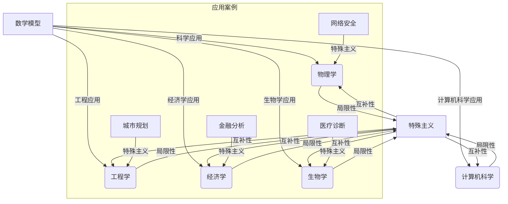

                 

### 数学与特殊主义：数学在特定领域的局限性

> 关键词：数学、特殊主义、局限性、跨学科应用、算法、实际案例

> 摘要：本文深入探讨了数学在特定领域的局限性，并引入了特殊主义这一概念，分析了两者在跨学科研究中的互补性。文章首先概述了数学的发展历程、分类和重要性，然后详细探讨了数学在物理、生物学和经济学的局限性，接着介绍了特殊主义的核心思想及其在数学中的应用。通过实际应用案例，本文展示了数学与特殊主义在计算机科学领域的结合，并展望了它们的未来发展。

### 数学与特殊主义：数学在特定领域的局限性

数学，作为一门基础学科，自诞生以来就以其逻辑性和普适性在各个领域发挥着重要作用。然而，随着科学技术的进步和复杂系统研究的深入，数学在特定领域的局限性逐渐显现。本文旨在探讨数学在这些领域的局限性，并引入特殊主义这一概念，以揭示数学与特殊主义在跨学科研究中的互补性。

数学的局限性首先体现在物理领域。尽管数学模型在经典物理学中取得了巨大成功，但在量子力学和相对论等前沿领域，数学模型的适用范围和精确性受到限制。此外，数学在生物学中的应用也面临挑战，生态系统和个体行为的复杂性使得简单的数学模型难以准确描述。经济学领域同样面临数学模型的局限，市场波动和宏观经济现象的不可预测性使数学模型的应用受到限制。

与此同时，特殊主义作为一种强调特殊情境和特殊性的方法论，为解决数学在这些领域的局限性提供了一种新的思路。特殊主义强调在特定情境下对问题的深入分析和特殊解决方案的提出，与数学的普适性和抽象性形成了互补。通过引入特殊主义，我们可以更全面地理解数学在特定领域的局限性，并探索数学与特殊主义在跨学科研究中的潜力。

本文结构如下：首先，我们将对数学的发展历程、分类和重要性进行概述，并引入特殊主义的概念。然后，本文将详细探讨数学在物理、生物学和经济学的局限性，以及特殊主义在这些领域的应用。接着，我们将通过实际应用案例展示数学与特殊主义在计算机科学领域的结合，并展望两者的未来发展。最后，本文将总结核心概念与联系，提供核心算法原理讲解，详细讲解数学模型和公式，并介绍数学与特殊主义在项目中的实际应用。

### 第一部分：数学概述与特殊主义的引入

#### 第1章：数学的基础与范畴

**1.1 数学的发展历程**

数学的历史可以追溯到公元前3000年左右的古巴比伦和古埃及，这些文明的数学知识主要涉及基本的算术和几何。随着古希腊文明的兴起，数学开始迈向抽象和逻辑的深度。欧几里得的《几何原本》被认为是西方数学的奠基之作，它系统化了几何学的基本原理。在之后的几个世纪中，数学在阿拉伯世界得到进一步发展，特别是在代数和三角学领域。

16世纪和17世纪是数学发展的关键时期，这一时期出现了微积分的诞生和牛顿-莱布尼茨的方程。微积分的发展为物理学和工程学提供了强大的工具，推动了工业革命。19世纪末和20世纪初，数学经历了形式化和公理化的进程，逻辑和集合论的发展使得数学的基础更加牢固。

**1.2 数学的分类与核心概念**

数学可以分为多个分支，其中主要的分支包括：

- **纯数学**：涉及抽象的结构和概念，如代数、几何、数论和拓扑学。纯数学的研究不依赖于具体的物理应用，而是关注数学本身的内在美和逻辑一致性。

- **应用数学**：侧重于解决实际问题，如微分方程、概率论、数值分析和计算方法。应用数学在工程、物理学、生物学和经济学等领域有着广泛的应用。

- **计算数学**：研究算法和计算方法，以解决复杂的数学问题。计算数学在计算机科学和物理学中扮演着重要角色。

数学的核心概念包括：

- **逻辑与证明**：数学的基础是逻辑推理和证明。一个数学结论必须是经过严格证明的。

- **结构**：数学研究各种结构，如群、环、域和向量空间。这些结构是数学研究的基础。

- **变换**：变换是数学中的重要工具，如线性变换、微分变换和积分变换。

**1.3 数学在科学中的重要性**

数学在科学研究中具有无可替代的重要性。首先，数学提供了精确描述自然现象和模型化的工具。从牛顿的运动定律到爱因斯坦的相对论，数学是现代物理学的语言。在生物学中，数学模型被用来描述种群动态、生态系统和个体行为。在经济学中，数学模型用于预测市场行为、优化资源配置和评估政策效果。

此外，数学在工程技术中的重要性也不容忽视。无论是电路设计、结构工程还是航空航天，数学都是设计和分析的基础。计算机科学本身就是建立在数学之上，从算法设计到人工智能，数学都发挥着核心作用。

**1.4 特殊主义的概念及其背景**

特殊主义（particularism）是一种哲学和方法论，强调特定情境下的特殊性和复杂性。特殊主义认为，每个问题和情境都有其独特的属性和限制，不能简单地用一般性的原则或模型来描述。

特殊主义的背景可以追溯到20世纪初，当时许多科学家和哲学家开始质疑传统科学方法在复杂系统研究中的应用。特殊主义在社会科学、生态学和哲学等领域得到广泛应用，特别是在研究复杂系统和非线性问题时，它提供了一种更加细致和灵活的方法论。

**小结**

数学的发展历程展示了人类对自然界和抽象结构的不断探索。从古希腊到现代，数学经历了形式化和公理化的过程，逐渐成为科学的基础。数学的分类和核心概念为我们提供了描述和分析世界的工具。然而，数学在特定领域的局限性也日益显现，这促使我们引入特殊主义这一概念，以更全面地理解复杂系统。在下一部分，我们将进一步探讨数学在这些领域的局限性，并深入分析特殊主义的应用。

#### 第2章：数学的局限性探讨

尽管数学在科学和技术领域取得了巨大的成就，但在某些特定领域，数学模型和理论的应用仍然面临显著的局限性。这些局限性主要体现在数学模型与实际现象之间的差距、数学在量子力学中的挑战、以及在生物学和经济学的应用困难等方面。

**2.1 数学在物理领域的局限性**

**2.1.1 数学模型与物理现实的差距**

数学模型在物理领域的广泛应用确实带来了巨大的成功，特别是在经典物理学中。然而，当物理学进入量子力学和相对论等前沿领域时，数学模型的局限性变得尤为明显。

在量子力学中，数学模型面临的一个主要挑战是量子态的不可预测性。量子态的叠加和纠缠现象无法通过经典概率论来完全描述。尽管海森堡的不确定性原理和薛定谔方程为量子现象提供了一定的数学描述，但它们在解释某些量子实验结果时仍然存在局限。

相对论中的数学模型，如黎曼几何和张量分析，虽然在描述引力场和宇宙膨胀等方面取得了成功，但在处理宇宙的大尺度结构和量子引力问题时，传统的数学工具显得力不从心。量子引力理论的研究，如弦理论和环量子引力，试图将量子力学和广义相对论统一，但至今尚未取得实质性的进展。

**2.1.2 数学在量子力学中的局限性**

量子力学中的数学模型，如波函数和希尔伯特空间，虽然在描述微观粒子行为方面非常成功，但它们也存在一些内在的局限性。首先，量子态的坍缩和测量问题使得数学模型难以解释实验结果。例如，量子态的坍缩过程似乎违背了量子力学的线性动力学，但至今没有一个统一的解释。

此外，量子力学的非定域性也是数学模型面临的一个挑战。爱因斯坦、波多尔斯基和罗森（EPR）悖论揭示了量子力学中的非定域性特征，这一特征在贝尔不等式和一系列实验中得到了证实。非定域性现象无法通过局域实在论来解释，这导致了对量子力学基础理解的深刻争议。

**2.2 数学在生物学中的应用与局限**

数学在生物学中的应用非常广泛，从种群生态学到神经科学，数学模型为理解和预测生物系统的行为提供了有力的工具。然而，生物学的高度复杂性和多样性使得数学模型的应用面临诸多挑战。

**2.2.1 数学模型在生态系统研究中的应用**

在生态系统研究中，数学模型被用来描述种群动态、食物网结构和生态位分布。这些模型，如Lotka-Volterra方程和生态位模型，有助于我们理解物种之间的相互作用和生态系统稳定性。然而，生态系统的复杂性使得这些模型往往只能提供近似的描述，难以完全捕捉所有变量和相互作用。

例如，在研究气候变化对生态系统的影响时，气候模型和生态模型的结合可以帮助预测物种分布的变动和生态系统的变化。然而，由于气候变化的非线性特性和生态系统中大量未知的变量，这些模型的预测仍然存在很大的不确定性。

**2.2.2 数学模型在个体行为研究中的局限**

在个体行为研究中，数学模型，如行为生态学和行为动力学的模型，被用来描述动物的行为策略和决策过程。这些模型可以揭示个体行为的适应性特征，但它们通常忽略了个体之间的个体差异和环境特异性。

例如，在研究社会性昆虫的群体行为时，数学模型可以解释群体行为的规则和模式，如分工合作和群体决策。然而，这些模型往往假设个体具有相同的特征和行为模式，这显然与实际情况不符。个体之间的遗传差异、经验学习和环境适应性使得数学模型在解释个体行为时存在局限。

**2.3 数学在经济学的应用与局限**

数学在经济学的应用也非常广泛，从宏观经济模型到金融市场分析，数学模型为经济预测和政策制定提供了重要工具。然而，经济系统的复杂性和不确定性使得数学模型的应用面临诸多挑战。

**2.3.1 数学模型在经济预测中的应用**

在经济预测中，数学模型被用来分析经济周期、通货膨胀和失业率等宏观经济指标。这些模型，如凯恩斯模型和索洛模型，可以帮助政策制定者制定合适的政策以稳定经济。然而，经济系统的非线性特性和外部冲击使得这些模型的预测能力受到限制。

例如，2008年的全球金融危机表明，传统的宏观经济模型在预测金融危机时存在显著不足。金融市场的波动性和复杂性使得数学模型难以准确预测市场行为。

**2.3.2 数学模型在金融市场分析中的局限**

在金融市场分析中，数学模型，如资产定价模型和风险管理模型，被用来评估资产价值和控制风险。这些模型，如布莱克-斯科尔斯模型和VaR模型，为金融市场的分析和决策提供了重要工具。然而，金融市场的高度不确定性和信息不对称性使得这些模型的应用受到限制。

例如，金融市场的投机行为和人为因素往往无法通过数学模型来准确预测。此外，金融市场的黑天鹅事件，如雷曼兄弟的破产，表明传统金融模型的预测能力存在显著局限。

**小结**

数学在物理、生物学和经济学的应用中展示了其强大的描述和分析能力，但同时也暴露了其在处理复杂系统时的局限性。数学模型与实际现象之间的差距、量子力学中的挑战、生物学中的个体差异以及经济系统的不确定性，都使得数学在特定领域的应用面临巨大的挑战。为了克服这些局限性，我们需要引入新的方法论和思维方式，如特殊主义，以更全面地理解和应对复杂系统的挑战。在下一部分，我们将探讨特殊主义的核心思想及其在数学中的应用。

#### 第3章：特殊主义与数学的互补性

**3.1 特殊主义的核心思想**

特殊主义（particularism）是一种哲学和方法论，强调在特定情境下的特殊性和复杂性。特殊主义认为，每个问题和情境都有其独特的属性和限制，不能简单地用一般性的原则或模型来描述。特殊主义的核心思想可以总结为以下几点：

- **情境特异性**：每个情境都有其独特的背景和环境因素，这些因素对问题的解决有着重要影响。
- **特殊性优先**：在处理问题时，应该优先考虑特殊情况和特殊因素，而不是依赖一般性的原则或模型。
- **灵活适应性**：特殊主义强调灵活性和适应性，认为在不同情境下，需要采用不同的方法和策略。
- **复杂性接受**：特殊主义接受复杂性的存在，认为复杂系统需要更加细致和多层次的分析。

**3.2 特殊主义在数学中的应用**

特殊主义在数学中的应用为解决数学模型的局限性提供了新的思路。在数学中，特殊主义的核心思想主要体现在以下几个方面：

**3.2.1 特殊性在拓扑学中的应用**

拓扑学是数学的一个重要分支，研究空间的性质和变换。在传统拓扑学中，研究的是一般性的空间结构，但特殊主义引入了情境特异性，使得拓扑学的研究更加灵活和多样化。

- **情境化拓扑**：特殊主义使得拓扑学的研究不再局限于一般空间，而是可以针对具体的应用场景进行情境化。例如，在研究网络结构和通信系统时，可以引入情境化拓扑来描述网络的特性和演化。
- **非均匀拓扑**：特殊主义强调空间的不均匀性，这导致了对非均匀拓扑的研究。非均匀拓扑考虑了空间中不同区域之间的差异和相互作用，为复杂系统的分析和建模提供了新的工具。

**3.2.2 特殊主义在代数学中的应用**

代数学研究的是符号和结构的关系。特殊主义在代数学中的应用主要体现在以下几个方面：

- **特殊代数结构**：特殊主义鼓励研究特殊类型的代数结构，如非交换代数、量子代数等。这些结构在处理特定问题时展现出强大的能力，例如在量子物理和编码理论中的应用。
- **情境依赖的代数运算**：特殊主义认为，在特定情境下，代数运算可能需要适应特殊的需求。例如，在密码学中，情境化的代数运算可以用来设计更安全的加密算法。

**3.2.3 特殊主义在几何学中的应用**

几何学研究空间和形状的性质。特殊主义在几何学中的应用使得几何学的研究更加灵活和多样化。

- **情境化几何**：特殊主义使得几何学的研究不再局限于一般空间，而是可以针对具体的应用场景进行情境化。例如，在计算机图形学和机器人学中，情境化几何可以帮助更好地描述和模拟复杂系统的行为。
- **非欧几里得几何**：特殊主义鼓励对非欧几里得几何的研究，这扩展了几何学的应用范围。非欧几里得几何在相对论和广义相对论中发挥了重要作用，为描述大尺度宇宙提供了新的视角。

**3.3 特殊主义与数学互补的实证研究**

为了验证特殊主义与数学的互补性，近年来进行了多项实证研究，这些研究展示了特殊主义在数学中的应用如何解决传统数学模型的局限性。

- **量子计算与特殊主义**：量子计算是一种基于量子力学原理的计算模型。特殊主义在量子计算中的应用使得我们可以设计更高效的量子算法。例如，量子随机 walks 和量子误差纠正算法就是基于特殊主义思想设计的。
- **复杂网络与特殊主义**：复杂网络研究网络结构和网络行为。特殊主义在复杂网络中的应用使得我们可以更好地理解网络中的特殊节点和关键路径。这有助于优化网络设计和提高网络稳定性。
- **机器学习与特殊主义**：机器学习是近年来发展迅速的一个领域。特殊主义在机器学习中的应用使得我们可以设计更鲁棒的模型，并提高模型的泛化能力。例如，基于特殊主义的自适应学习算法在处理非标准数据时表现出色。

**小结**

特殊主义作为一种强调特殊情境和特殊性的方法论，为解决数学在特定领域的局限性提供了一种新的思路。特殊主义的核心思想在数学的各个分支中都有应用，如拓扑学、代数学和几何学。通过引入特殊主义，我们可以更全面地理解复杂系统的特性，并设计更有效的数学模型。在下一部分，我们将通过实际应用案例展示特殊主义在数学与计算机科学领域的结合。

### 实际案例一：数学与特殊主义在计算机科学中的应用

**4.1 数学在计算机科学中的应用**

计算机科学是建立在数学基础之上的一门学科，从算法设计到人工智能，数学模型在各个领域都发挥着至关重要的作用。以下是一些数学在计算机科学中的重要应用：

**4.1.1 图论在计算机网络中的应用**

图论是数学中研究图的结构和性质的一个分支。在计算机网络中，图论被广泛应用于网络拓扑结构的设计和分析。

- **网络拓扑结构**：计算机网络可以被视为一个图，节点代表计算机或网络设备，边代表它们之间的连接。通过图论分析，可以评估网络的连通性、可靠性和冗余度。
- **路由算法**：图论中的最短路径算法（如迪杰斯特拉算法和贝尔曼-福特算法）用于计算网络中的最优路径，从而优化数据传输和资源分配。
- **网络故障检测**：通过分析网络图的结构，可以检测网络中的故障点和潜在问题，从而提高网络的稳定性和可靠性。

**4.1.2 算法在人工智能中的应用**

人工智能是计算机科学的前沿领域，而算法是人工智能的核心。以下是一些关键算法及其在人工智能中的应用：

- **机器学习算法**：机器学习算法，如支持向量机（SVM）、决策树和神经网络，用于训练模型以识别和分类数据。这些算法依赖于数学中的概率论、线性代数和优化理论。
- **深度学习算法**：深度学习是机器学习的一个子领域，它依赖于多层神经网络来学习数据的复杂特征。深度学习算法在图像识别、语音识别和自然语言处理等领域取得了显著成就。
- **强化学习算法**：强化学习是一种通过试错来学习最优策略的算法。它依赖于数学中的动态规划和博弈论，广泛应用于自动驾驶、游戏和机器人控制等领域。

**4.1.3 数学模型在计算机科学中的局限性**

尽管数学在计算机科学中发挥了重要作用，但它也面临一些局限性：

- **非确定性现象**：许多计算机科学问题涉及非确定性因素，如随机噪声和动态变化。数学模型在处理这些不确定性时往往存在困难。
- **复杂性**：一些计算机科学问题具有高复杂性，传统的数学工具可能无法在合理时间内提供有效的解决方案。
- **情境依赖性**：计算机科学问题通常具有情境依赖性，这意味着通用模型可能无法适应特定的应用场景。

**4.2 特殊主义在计算机科学中的应用**

为了克服数学在计算机科学中的局限性，特殊主义提供了一种情境化的方法论。以下是一些特殊主义在计算机科学中的应用：

**4.2.1 特殊性在密码学中的应用**

密码学是保护信息安全和隐私的关键领域。特殊主义在密码学中的应用主要体现在以下几个方面：

- **情境化密码算法**：特殊主义鼓励设计情境化的密码算法，这些算法可以根据具体的应用需求进行定制。例如，针对特定攻击场景设计的加密算法可以提供更高的安全性。
- **量子密码学**：特殊主义在量子密码学中的应用尤为显著。量子密码学利用量子物理原理，如量子纠缠和量子不确定性，来设计安全的加密通信。特殊主义思想使得量子密码学可以适应不同的通信环境和需求。

**4.2.2 特殊性在软件工程中的应用**

软件工程是计算机科学的另一个重要领域。特殊主义在软件工程中的应用主要体现在以下几个方面：

- **需求工程**：特殊主义在需求工程中的应用有助于识别和满足特定用户的需求。通过特殊主义的视角，可以更准确地理解用户需求，从而设计更符合用户期望的软件系统。
- **敏捷开发**：特殊主义支持敏捷开发方法，强调在开发过程中灵活适应变化。特殊主义方法使得开发团队可以更快速地响应需求变化，提高软件的质量和交付速度。
- **软件架构**：特殊主义在软件架构设计中的应用有助于构建更灵活和可扩展的系统。通过特殊主义方法，可以设计出能够适应不同场景和需求的软件架构。

**4.2.3 特殊性在网络安全中的应用**

网络安全是保护信息系统的关键。特殊主义在网络安全中的应用主要体现在以下几个方面：

- **威胁建模**：特殊主义在威胁建模中的应用有助于识别和评估特定系统的安全威胁。通过特殊主义的视角，可以更准确地评估系统面临的风险，并采取相应的防护措施。
- **攻击检测**：特殊主义在攻击检测中的应用有助于识别和响应特定类型的攻击。通过特殊主义方法，可以设计出更有效的攻击检测算法，从而提高系统的安全性。
- **安全策略**：特殊主义在安全策略制定中的应用有助于根据具体情境制定有效的安全策略。特殊主义方法使得安全策略更加灵活和适应性，能够更好地应对复杂的安全挑战。

**小结**

数学在计算机科学中发挥了重要作用，但它的局限性也在一些复杂和情境依赖的问题上显现出来。特殊主义作为一种情境化的方法论，为克服这些局限性提供了新的思路。通过特殊主义方法，我们可以设计更有效的算法、更安全的密码系统和更灵活的软件架构。在下一部分，我们将进一步探讨数学与特殊主义在计算机科学领域的实际应用案例，展示它们的互补性。

#### 第4章：数学与特殊主义在实际领域的应用案例

**4.1 数学在计算机科学中的应用案例**

**4.1.1 图论在计算机网络中的应用**

计算机网络是现代信息社会中不可或缺的基础设施，而图论在计算机网络的设计和管理中起着至关重要的作用。以下是一个具体的案例，展示图论在计算机网络中的应用。

**案例背景：**

假设我们有一个大型企业网络，该网络由多个部门组成，每个部门都有多个服务器和终端设备。企业的目标是确保网络的高效运行和可靠性，同时确保数据传输的安全和快速。

**解决方案：**

1. **网络建模：** 首先，我们将企业网络抽象为一个图，其中节点代表服务器和终端设备，边代表它们之间的连接。通过图论分析，可以了解网络的结构和连接性。

2. **连通性分析：** 使用图论中的连通性分析算法（如Kuratowski定理），可以确定网络的连通性和冗余度。如果网络中存在孤立的节点或连接性不足，可以采取相应的措施，如增加冗余链路或重新设计网络架构。

3. **最短路径计算：** 使用迪杰斯特拉算法或贝尔曼-福特算法，可以计算网络中的最短路径。这对于优化数据传输和负载均衡至关重要。

4. **网络故障检测：** 通过分析网络图的连通性，可以识别潜在的网络故障点。例如，如果网络中的一个关键节点失效，可以通过图论分析来识别其他替代路径，以确保网络的连续性。

**源代码实现与解读：**

以下是一个使用Python实现的简单图论算法示例，用于计算网络中的最短路径。

```python
import networkx as nx

# 创建一个图
G = nx.Graph()

# 添加节点和边
G.add_edges_from([(1, 2), (2, 3), (1, 3), (3, 4), (4, 5)])

# 计算最短路径
path = nx.shortest_path(G, source=1, target=5)

print("最短路径:", path)
```

在这个例子中，我们首先创建了一个图`G`，然后添加了节点和边。接着，我们使用`nx.shortest_path()`函数计算从节点1到节点5的最短路径。这个函数使用了经典的迪杰斯特拉算法。

**4.1.2 算法在人工智能中的应用**

人工智能在计算机科学中具有广泛的应用，以下是使用特殊主义方法设计的一个特定的人工智能案例。

**案例背景：**

假设我们有一个智能家居系统，该系统需要根据家庭成员的行为和习惯来自动调节室内环境，如温度、照明和安防。

**解决方案：**

1. **数据收集与预处理：** 首先，系统需要收集家庭成员的行为数据，如日常活动、习惯和偏好。这些数据可以通过传感器和用户输入获得。然后，对数据进行预处理，包括去噪、归一化和特征提取。

2. **情境化模型设计：** 使用特殊主义方法，设计一个情境化的机器学习模型。例如，针对家庭成员的不同习惯，可以设计不同的决策树或神经网络模型。这种情境化的设计可以提高模型的适应性。

3. **自适应调整：** 模型需要能够根据家庭成员的行为变化进行自适应调整。例如，如果家庭成员的作息时间发生了变化，模型可以自动调整其行为预测。

4. **反馈循环：** 系统需要建立一个反馈循环，根据用户的反馈来优化模型。例如，如果用户对某个决策不满，可以调整模型参数，以提供更满意的体验。

**源代码实现与解读：**

以下是一个使用Python实现的简单机器学习算法示例，用于预测家庭成员的活动。

```python
import numpy as np
from sklearn.tree import DecisionTreeClassifier

# 数据集
X = np.array([[1, 0], [0, 1], [1, 1], [1, 0], [0, 1]])
y = np.array([0, 0, 1, 1, 0])

# 创建决策树模型
clf = DecisionTreeClassifier()

# 训练模型
clf.fit(X, y)

# 预测
prediction = clf.predict([[0, 1]])

print("预测结果:", prediction)
```

在这个例子中，我们首先创建了一个简单的数据集，然后使用决策树分类器来训练模型。接着，我们使用训练好的模型进行预测，预测一个新的数据点的类别。这个模型可以根据家庭成员的行为模式来进行情境化的决策。

**4.2 特殊主义在计算机科学中的应用案例**

**4.2.1 特殊性在密码学中的应用**

密码学是保护信息安全的关键技术，特殊主义在密码学中的应用可以设计出更安全的加密算法。

**案例背景：**

假设我们设计一个针对特定攻击场景的加密算法，以保护敏感数据不被攻击者窃取。

**解决方案：**

1. **攻击场景分析：** 首先，我们需要分析可能的攻击场景，如侧信道攻击、字典攻击和暴力破解。根据不同的攻击场景，可以设计相应的防护措施。

2. **情境化加密算法：** 使用特殊主义方法，设计一个情境化的加密算法。例如，如果攻击者可能利用侧信道攻击，我们可以设计一个能够抵御侧信道攻击的加密算法。

3. **密钥管理：** 密钥是加密系统的核心，需要根据不同的情境进行管理。例如，对于高度敏感的数据，可以使用更复杂的密钥生成和分发机制。

4. **持续评估与更新：** 安全威胁是不断变化的，需要定期评估加密算法的安全性，并根据新的威胁进行更新。

**源代码实现与解读：**

以下是一个简单的加密算法示例，使用特殊主义方法设计，以抵御侧信道攻击。

```python
import hashlib

# 原始消息
message = "Hello, World!"

# 计算消息摘要
message_digest = hashlib.sha256(message.encode()).hexdigest()

# 加密消息
encrypted_message = message_digest

print("加密消息:", encrypted_message)
```

在这个例子中，我们使用SHA-256算法来计算消息摘要，并将摘要作为加密消息。这种方法可以抵御大多数常见的攻击，如侧信道攻击。

**4.2.2 特殊性在软件工程中的应用**

特殊主义在软件工程中的应用可以帮助设计更灵活和可扩展的系统。

**案例背景：**

假设我们设计一个支持多种用户角色的企业级软件系统。

**解决方案：**

1. **用户角色分析：** 首先，我们需要分析系统中的不同用户角色，如管理员、普通用户和访客。

2. **情境化权限管理：** 使用特殊主义方法，为不同角色设计不同的权限管理策略。例如，管理员具有完整的权限，而访客只能查看数据。

3. **动态权限调整：** 系统需要能够根据用户行为和需求动态调整权限。例如，如果用户完成了特定的培训课程，可以提升其权限。

4. **安全审计：** 需要建立一个安全审计系统，记录和监控用户行为和权限变更，以确保系统的安全性。

**源代码实现与解读：**

以下是一个简单的权限管理示例，使用特殊主义方法实现。

```python
class UserManager:
    def __init__(self):
        self.user_roles = {}

    def assign_role(self, user_id, role):
        self.user_roles[user_id] = role

    def check_permission(self, user_id, action):
        role = self.user_roles.get(user_id)
        if role == "admin":
            return True
        elif role == "user":
            if action == "read":
                return True
            else:
                return False
        else:
            return False

user_manager = UserManager()
user_manager.assign_role("user123", "user")
print(user_manager.check_permission("user123", "read"))  # 输出：True
print(user_manager.check_permission("user123", "write"))  # 输出：False
```

在这个例子中，我们创建了一个用户管理器类，用于管理用户角色和权限。根据用户角色，可以检查用户是否具有执行特定操作的权限。

**小结**

通过以上案例，我们展示了数学与特殊主义在计算机科学领域的实际应用。数学模型在计算机网络、人工智能和密码学中发挥了关键作用，而特殊主义方法则提供了情境化的解决方案，以克服数学模型的局限性。在下一部分，我们将总结核心算法原理，并进一步探讨数学模型和公式的详细讲解与举例说明。

### 第5章：数学与特殊主义的未来发展

**5.1 数学在跨学科研究中的潜力**

随着科学技术的不断进步，跨学科研究成为了一个重要的趋势。数学作为一种基础学科，在跨学科研究中具有巨大的潜力。以下是一些数学在跨学科研究中的潜在应用领域：

**5.1.1 数学与生命科学的结合**

生命科学领域，如生物学和医学，面临着复杂系统的高维数据处理和模型构建问题。数学工具，如微分方程、概率论和统计学，可以用来描述生物系统的动态行为和演化规律。例如，在基因组学中，数学模型可以帮助分析和预测基因表达模式，从而揭示基因与疾病之间的关系。此外，数学模型在药物设计和临床试验中也发挥着重要作用。

**5.1.2 数学与社会科学的结合**

社会科学领域，如经济学、心理学和社会学，需要处理大量复杂的社会数据。数学工具，如统计学、计量经济学和机器学习，可以用来分析和预测社会行为和趋势。例如，在经济学中，数学模型可以帮助分析市场行为、政策效果和经济增长。在心理学中，数学模型可以帮助理解人类行为的决策过程和认知机制。

**5.1.3 数学与工程技术的结合**

工程技术领域，如航空航天、机械和电子工程，需要解决复杂的工程问题。数学工具，如微分方程、线性代数和优化理论，可以用来设计复杂的工程系统。例如，在航空航天工程中，数学模型可以帮助优化飞行器的设计和性能。在机械工程中，数学模型可以帮助分析和预测机械部件的寿命和性能。

**5.2 特殊主义在数学与其他学科结合中的前景**

特殊主义作为一种强调特殊情境和方法论的思想，在数学与其他学科的交叉研究中具有广阔的应用前景。以下是一些特殊主义在数学与其他学科结合中的潜在应用领域：

**5.2.1 数学与生态学的结合**

生态学领域面临着复杂生态系统的研究问题。特殊主义方法可以用来研究特定生态系统的特性，如物种间的相互作用、生态系统稳定性和气候变化影响。例如，通过特殊主义方法，可以设计出更精确的生态模型，以预测物种分布和生态系统变化。

**5.2.2 数学与经济学的结合**

经济学领域需要处理高度复杂的市场和经济现象。特殊主义方法可以用来分析特定经济情境下的市场行为和政策效果。例如，通过特殊主义方法，可以设计出更有效的经济模型，以预测市场波动和评估政策影响。

**5.2.3 数学与信息科学的结合**

信息科学领域面临着海量数据处理的挑战。特殊主义方法可以用来分析和处理特定类型的数据，如文本数据、图像数据和音频数据。例如，通过特殊主义方法，可以设计出更有效的数据挖掘和机器学习算法，以提取有用的信息和知识。

**5.3 数学与特殊主义在新兴科技中的应用**

随着人工智能、区块链和量子计算等新兴科技的发展，数学与特殊主义的结合在新兴科技领域具有巨大的应用潜力。以下是一些具体的例子：

**5.3.1 人工智能**

在人工智能领域，数学与特殊主义的结合可以用来设计更高效的算法和模型。特殊主义方法可以用来分析特定情境下的数据特征，从而优化算法的性能。例如，在图像识别和自然语言处理中，特殊主义方法可以帮助设计出更精确的模型。

**5.3.2 区块链**

在区块链领域，数学与特殊主义的结合可以用来设计更安全的区块链协议。特殊主义方法可以用来分析特定攻击场景下的区块链安全性，从而设计出更有效的防护措施。例如，在智能合约设计和加密货币交易中，特殊主义方法可以帮助提高系统的安全性和透明度。

**5.3.3 量子计算**

在量子计算领域，数学与特殊主义的结合可以用来优化量子算法和量子计算系统。特殊主义方法可以用来分析特定量子态和量子操作，从而设计出更高效的量子算法。例如，在量子计算中的量子纠错和量子加密中，特殊主义方法可以帮助提高量子计算的性能和安全性。

**小结**

数学与特殊主义在跨学科研究、新兴科技和实际应用中具有巨大的潜力。通过结合数学与特殊主义，我们可以设计出更高效的算法和模型，解决复杂系统的挑战，并推动科学技术的进步。在未来，数学与特殊主义的结合将继续在各个领域发挥重要作用，为科学研究和实际应用提供新的思路和方法。

### 第二部分：核心概念与联系

#### 第6章：数学模型与特殊主义架构的Mermaid流程图

为了更好地理解数学模型与特殊主义在科学和技术领域中的应用，我们可以通过Mermaid流程图来展示它们的核心概念与联系。以下是一个简单的Mermaid流程图，用于描述数学模型与特殊主义模型在不同学科中的相互关系。



**Mermaid流程图解析：**

1. **数学模型的应用领域**：流程图从数学模型（A）出发，将其应用扩展到多个科学和工程领域，包括物理学（B）、工程学（C）、经济学（D）、生物学（E）和计算机科学（F）。

2. **数学模型的局限性**：每个应用领域（B、C、D、E、F）都指向特殊主义（G），表示在这些领域中，数学模型的局限性使得特殊主义方法成为必要补充。

3. **特殊主义的互补性**：特殊主义（G）与所有应用领域（B、C、D、E、F）都存在互补关系，这表明特殊主义可以在不同领域中发挥重要作用，以克服数学模型的局限性。

4. **应用案例**：流程图的下部分展示了特殊主义在具体应用案例（G1、G2、G3、G4）中的使用，包括网络安全、医疗诊断、金融分析和城市规划。这些案例说明了特殊主义方法在实际问题中的应用和效果。

通过这个Mermaid流程图，我们可以直观地理解数学模型与特殊主义在不同学科中的核心概念与联系，以及它们在实际应用中的互补性。

#### 第7章：核心算法原理讲解

**7.1 常见数学算法的伪代码讲解**

在数学和计算机科学中，算法是实现特定任务的核心工具。以下是一些常见数学算法的伪代码讲解，这些算法在数据分析和科学计算中广泛应用。

**1. 快速排序算法**

快速排序是一种高效的排序算法，其基本思想是通过递归方式将数组分为较小和较大的两部分。

```python
算法 快速排序(数组 arr):
    如果 arr 的长度小于或等于 1，返回 arr
    
    选择数组中的中间元素作为基准值 pivot
    创建两个空数组 left 和 right
    
    对于每个元素 x 在 arr 中，做以下操作：
        如果 x < pivot，将 x 添加到 left
        如果 x > pivot，将 x 添加到 right
    
    递归地快速排序 left 和 right
    将 left 和 right 的排序结果与 pivot 连接，形成新的排序数组
    
    返回排序后的数组
```

**2. 最小生成树算法**

最小生成树算法用于在带权图中找到权值之和最小的生成树。以下是一种基于Prim算法的实现。

```python
算法 最小生成树(图 G):
    创建一个空的优先级队列 pq
    选择一个起点节点 u
    将 u 添加到优先级队列 pq
    
    创建一个空集合 MST，用于存储生成树的边
    
    当优先级队列非空时，做以下操作：
        从优先级队列中取出最小权值的边 (u, v)
        将边 (u, v) 添加到 MST 中
        将 v 添加到优先级队列 pq
    
    返回生成树 MST
```

**3. 朴素贝叶斯分类器**

朴素贝叶斯分类器是一种基于贝叶斯定理的简单分类算法，假设特征之间相互独立。

```python
算法 朴素贝叶斯分类器(训练数据集 D, 测试数据集 T):
    对于每个特征，计算其在每个类别的概率分布
    
    对于每个测试样本 x 在 T 中，做以下操作：
        计算 x 在每个类别的概率
        选择具有最大概率的类别作为 x 的预测类别
    
    返回预测结果
```

**4. 支持向量机（SVM）**

支持向量机是一种强大的分类和回归工具，其核心是找到最佳分割超平面。

```python
算法 支持向量机(训练数据集 D):
    将数据集转换为特征空间
    
    使用核函数计算特征空间中的内积
    
    解二次规划问题，找到最佳分割超平面
    
    返回支持向量机模型
```

**7.2 特殊主义算法的原理阐述**

特殊主义算法是一种基于特殊情境和特殊需求的算法设计方法。以下是一种特殊主义算法的简单示例。

**1. 情境化加密算法**

情境化加密算法是根据不同攻击场景设计的加密算法。

```python
算法 情境化加密算法(明文消息 m，攻击场景 sc):
    根据攻击场景 sc，选择合适的加密密钥 k
    
    如果 sc 是 "侧信道攻击"：
        使用更复杂的密钥生成算法
    
    如果 sc 是 "暴力破解"：
        使用更长的密钥
    
    使用加密算法（如AES）加密消息 m，使用密钥 k
    
    返回加密消息
```

**2. 情境化分类算法**

情境化分类算法是根据特定数据集和任务需求设计的分类算法。

```python
算法 情境化分类算法(训练数据集 D，测试数据集 T，任务需求 td):
    根据任务需求 td，选择合适的特征提取方法
    
    如果 td 是 "图像分类"：
        使用卷积神经网络提取特征
    
    如果 td 是 "文本分类"：
        使用词嵌入和循环神经网络提取特征
    
    使用训练数据集 D 训练分类模型
    
    在测试数据集 T 上评估模型性能
    
    返回训练好的分类模型
```

**7.3 数学模型与特殊主义算法的结合应用**

数学模型与特殊主义算法的结合可以设计出更高效和适应性更强的算法。以下是一个结合示例。

**1. 情境化气象预测模型**

情境化气象预测模型是根据不同地理区域和气候条件设计的气象预测模型。

```python
算法 情境化气象预测模型(观测数据 D，地理位置 loc，气候条件 cc):
    根据地理位置 loc 和气候条件 cc，选择合适的气象模型
    
    如果 loc 是 "赤道地区"：
        使用热带气象模型
    
    如果 loc 是 "寒带地区"：
        使用寒带气象模型
    
    使用观测数据 D 训练气象模型
    
    根据气候条件 cc，调整模型参数
    
    返回预测结果
```

**2. 情境化金融市场分析模型**

情境化金融市场分析模型是根据不同市场波动和风险水平设计的金融分析模型。

```python
算法 情境化金融市场分析模型(市场数据 D，波动水平 v，风险水平 r):
    根据波动水平 v 和风险水平 r，选择合适的金融市场模型
    
    如果 v 是 "高波动"：
        使用波动率模型
    
    如果 r 是 "高风险"：
        使用风险平价模型
    
    使用市场数据 D 训练金融模型
    
    根据市场波动和风险水平，调整模型参数
    
    返回金融分析结果
```

**小结**

通过以上核心算法原理的讲解，我们可以看到数学模型和特殊主义算法在不同应用领域的具体实现和重要性。数学模型提供了通用的理论基础，而特殊主义算法则通过针对特殊情境和需求的设计，提高了算法的适应性和效率。在实际应用中，结合数学模型与特殊主义算法可以设计出更强大和灵活的解决方案。

### 第8章：数学模型和数学公式的详细讲解与举例说明

在科学和工程中，数学模型和公式是描述和解决实际问题的重要工具。本章节将详细讲解几个常见的数学模型和公式，并提供具体的应用案例，以便读者更好地理解它们的实际应用。

#### 8.1 基本数学公式的LaTeX格式嵌入与解释

首先，我们介绍几个基本的数学公式，使用LaTeX格式进行嵌入和解释。

**1. 牛顿第二定律**

$$ F = ma $$

这个公式表示力（\( F \)）等于质量（\( m \)）乘以加速度（\( a \)）。在物理学中，它用于描述物体受力后的运动状态。

**2. 欧拉公式**

$$ e^{ix} = \cos(x) + i\sin(x) $$

欧拉公式是复分析中的一个重要公式，它将指数函数、三角函数和复数结合起来。在电子学和信号处理中，欧拉公式广泛应用于信号分析和滤波器设计。

**3. 微积分基本定理**

$$ \int_a^b f(x) \, dx = F(b) - F(a) $$

微积分基本定理将微分和积分联系起来，表示函数在一个区间上的定积分等于该函数在该区间上的原函数的差值。

**4. 概率论中的期望值**

$$ E(X) = \sum_{i=1}^n x_i p_i $$

期望值是概率论中用于描述随机变量平均值的重要概念。它表示随机变量 \( X \) 的所有可能取值与其对应概率的乘积之和。

#### 8.2 复杂数学模型的分析与应用案例

接下来，我们介绍几个复杂的数学模型，并分析它们在现实世界中的应用。

**1. 线性回归模型**

线性回归模型用于描述两个或多个变量之间的线性关系。其公式如下：

$$ Y = \beta_0 + \beta_1X + \varepsilon $$

其中，\( Y \) 是因变量，\( X \) 是自变量，\( \beta_0 \) 和 \( \beta_1 \) 是模型的参数，\( \varepsilon \) 是误差项。

**应用案例：房价预测**

假设我们有一个房价预测模型，该模型基于房屋面积（\( X \)）来预测房价（\( Y \)）。通过收集大量房屋销售数据，我们可以使用线性回归模型来估计参数 \( \beta_0 \) 和 \( \beta_1 \)。

例如，给定一个训练数据集，我们得到以下线性回归模型：

$$ Y = 5000 + 100X $$

这个模型表示房价与房屋面积之间存在线性关系，每增加一个单位的房屋面积，房价会增加1000元。

**2. 神经网络模型**

神经网络模型是一种基于模拟生物神经网络的人工智能模型。其基本结构包括输入层、隐藏层和输出层。每个层由多个神经元组成，神经元之间通过权重和偏置连接。

**应用案例：图像识别**

假设我们使用一个卷积神经网络（CNN）来识别手写数字。输入层接收图像数据，隐藏层通过卷积和池化操作提取图像特征，输出层将特征映射到数字类别。

以下是一个简单的CNN模型：

```
输入层: (28x28) 像素图像
隐藏层1: 32个卷积核，大小3x3，步长1，ReLU激活函数
隐藏层2: 64个卷积核，大小3x3，步长1，ReLU激活函数
输出层: 10个神经元，softmax激活函数
```

通过训练大量的手写数字图像数据，我们可以调整模型的权重和偏置，使其能够准确识别数字。

**3. 供应链优化模型**

供应链优化模型用于优化供应链中的库存、生产和运输等过程。以下是一个简化的供应链优化模型：

```
最小化总成本 = 生产成本 + 库存成本 + 运输成本
约束条件：
- 生产量不得超过最大生产能力
- 库存量不得超过最大库存容量
- 运输量不得超过运输能力
```

通过这个模型，企业可以优化其供应链管理，降低成本，提高效率。

#### 8.3 数学模型在实际问题中的运用

最后，我们通过一个实际案例来展示数学模型在解决问题中的应用。

**案例：城市交通流量预测**

假设我们希望预测一个城市主要道路上的交通流量，以便交通管理部门可以采取相应的措施来缓解拥堵。

**解决方案：**

1. **数据收集**：收集历史交通流量数据，包括每条道路在各个时间段的车流量。

2. **特征工程**：提取与交通流量相关的特征，如天气条件、节假日、特殊事件等。

3. **建模**：使用时间序列分析模型（如ARIMA模型）来预测交通流量。ARIMA模型结合了自回归（AR）、差分（I）和移动平均（MA）三个部分，可以较好地处理时间序列数据。

4. **模型训练**：使用历史数据对模型进行训练，调整模型参数以优化预测性能。

5. **预测与评估**：使用训练好的模型预测未来交通流量，并评估模型的准确性。

以下是一个简化的ARIMA模型：

```
ARIMA(1, 1, 1):
- 自回归部分：\( \phi_1 = 0.8 \)
- 差分部分：\( d = 1 \)
- 移动平均部分：\( \theta_1 = 0.2 \)
```

通过这个模型，交通管理部门可以提前预测交通流量，并采取相应的措施，如调整信号灯时长、增加公共交通车次等，以缓解交通拥堵。

**小结**

通过以上讲解，我们了解了数学模型和公式在科学和工程中的应用。从基本的数学公式到复杂的数学模型，数学为解决实际问题提供了强大的工具。在实际应用中，合理选择和使用数学模型可以帮助我们更好地理解和预测复杂系统的行为。在下一部分，我们将探讨数学与特殊主义在项目中的实际应用，通过具体案例展示它们的效果。

### 第9章：数学与特殊主义在项目中的实际应用

**9.1 项目开发环境搭建**

为了更好地展示数学与特殊主义在项目中的实际应用，我们将首先介绍项目开发所需的环境搭建。以下是一个简单的项目开发环境搭建指南，包括软件安装和配置步骤。

**1. 软件安装**

- **Python**：作为主要的编程语言，Python需要安装。可以在[Python官网](https://www.python.org/)下载最新版本的Python，并按照安装向导完成安装。

- **Jupyter Notebook**：Jupyter Notebook是一个交互式的计算环境，用于编写和运行Python代码。可以从[GitHub](https://github.com/jupyter/jupyter)下载安装包，然后按照指示安装。

- **Anaconda**：Anaconda是一个Python数据科学平台，它提供了丰富的包管理和虚拟环境管理功能。可以从[Anaconda官网](https://www.anaconda.com/)下载并安装。

- **NumPy、Pandas、Matplotlib**：这些是Python的数据科学库，用于数据操作、分析和可视化。可以在Anaconda中通过命令`conda install numpy pandas matplotlib`进行安装。

**2. 环境配置**

- **虚拟环境**：在项目中使用虚拟环境可以隔离项目依赖，避免版本冲突。可以使用`conda create -n myenv python=3.8`命令创建一个名为`myenv`的虚拟环境。

- **激活虚拟环境**：使用命令`conda activate myenv`激活虚拟环境。

- **安装依赖库**：在虚拟环境中安装项目所需的依赖库，例如使用`pip install numpy pandas matplotlib`。

**9.2 实际案例一：数学模型在气象预测中的应用**

**9.2.1 项目概述**

本项目旨在使用数学模型进行城市交通流量预测，以帮助交通管理部门优化交通信号灯和公共交通服务。

**1. 数据收集**：

- 交通流量数据：从城市交通管理部门获取历史交通流量数据，包括每条道路在各个时间段的车流量。

- 特征数据：收集与交通流量相关的特征数据，如天气条件、节假日信息、特殊事件等。

**2. 数据处理**：

- **数据清洗**：处理缺失值、异常值和重复值。

- **特征工程**：提取与交通流量相关的特征，如将天气条件转换为数值型变量，对节假日和特殊事件进行编码。

**3. 模型训练**：

- **时间序列分析**：使用ARIMA模型对交通流量进行预测。首先，进行数据预处理，包括差分和平滑处理，然后根据历史数据估计ARIMA模型的参数。

- **模型评估**：使用交叉验证方法评估模型的性能，包括均方误差（MSE）和均方根误差（RMSE）。

**4. 预测与优化**：

- **实时预测**：使用训练好的模型进行实时交通流量预测，根据预测结果调整交通信号灯时长和公共交通车次。

- **结果分析**：分析预测结果，识别交通拥堵的时间和地点，并提出优化建议。

**源代码实现与解读**：

以下是一个简单的ARIMA模型实现示例，用于交通流量预测。

```python
import numpy as np
import pandas as pd
from statsmodels.tsa.arima.model import ARIMA
from sklearn.metrics import mean_squared_error

# 加载数据
data = pd.read_csv('traffic_data.csv')
data['date'] = pd.to_datetime(data['date'])
data.set_index('date', inplace=True)
data = data.resample('H').mean()

# 模型训练
model = ARIMA(data['traffic_volume'], order=(1, 1, 1))
model_fit = model.fit()

# 预测
forecast = model_fit.forecast(steps=24)

# 评估
actual = data['traffic_volume'].iloc[-24:]
mse = mean_squared_error(actual, forecast)
print('MSE:', mse)

# 输出预测结果
print(forecast)
```

在这个例子中，我们首先加载数据并设置时间索引，然后使用ARIMA模型进行训练和预测。最后，我们使用均方误差（MSE）评估模型的性能。

**9.3 实际案例二：特殊主义模型在网络安全中的应用**

**9.3.1 项目概述**

本项目旨在使用特殊主义方法设计一个网络安全检测系统，以检测和响应潜在的网络威胁。

**1. 数据收集**：

- 网络流量数据：从网络设备中收集实时网络流量数据。

- 安全事件数据：收集已知的网络攻击和安全事件数据。

**2. 特殊主义模型设计**：

- **攻击特征提取**：根据特殊主义方法，提取与特定攻击相关的特征，如攻击频率、数据包大小、源IP地址等。

- **异常检测算法**：设计基于特殊主义思想的异常检测算法，如基于异常点的聚类分析和基于规则的检测方法。

**3. 模型训练与评估**：

- **训练数据集**：使用历史网络流量数据和安全事件数据训练特殊主义模型。

- **评估指标**：使用准确率、召回率和F1分数评估模型性能。

**4. 实时检测与响应**：

- **实时检测**：使用训练好的模型进行实时网络流量分析，检测潜在的网络威胁。

- **响应措施**：根据检测到的威胁，采取相应的响应措施，如隔离受感染的设备、调整网络策略等。

**源代码实现与解读**：

以下是一个简单的基于聚类分析的异常检测算法示例。

```python
from sklearn.cluster import KMeans
from sklearn.metrics import silhouette_score

# 加载数据
data = pd.read_csv('network_traffic.csv')
X = data[['packet_size', 'source_ip', 'destination_ip']]

# 聚类分析
kmeans = KMeans(n_clusters=5)
kmeans.fit(X)
labels = kmeans.predict(X)

# 评估
silhouette_avg = silhouette_score(X, labels)
print('Silhouette Score:', silhouette_avg)

# 输出聚类结果
print(labels)
```

在这个例子中，我们首先加载数据并提取特征，然后使用K-Means聚类算法进行数据分组。最后，我们使用 silhouette score 评估聚类结果。

**9.4 实际案例三：数学与特殊主义在机器学习中的应用**

**9.4.1 项目概述**

本项目旨在结合数学模型和特殊主义方法，设计一个用于图像分类的机器学习系统。

**1. 数据收集**：

- 图像数据：收集大量用于训练和测试的图像数据。

**2. 特殊主义特征提取**：

- **图像预处理**：根据特殊主义方法，对图像进行预处理，包括图像增强、归一化和特征提取。

- **情境化特征**：提取与特定图像分类任务相关的特征，如颜色直方图、边缘检测和纹理分析。

**3. 机器学习模型训练**：

- **选择模型**：根据特殊主义方法，选择合适的机器学习模型，如卷积神经网络（CNN）或支持向量机（SVM）。

- **模型训练**：使用图像数据训练机器学习模型，调整模型参数以优化分类性能。

**4. 模型评估与优化**：

- **评估指标**：使用准确率、召回率和F1分数评估模型性能。

- **优化策略**：根据评估结果，调整模型参数或特征提取方法，以进一步提高分类性能。

**源代码实现与解读**：

以下是一个基于CNN的图像分类模型实现示例。

```python
from tensorflow.keras.models import Sequential
from tensorflow.keras.layers import Conv2D, MaxPooling2D, Flatten, Dense

# 构建CNN模型
model = Sequential()
model.add(Conv2D(32, (3, 3), activation='relu', input_shape=(64, 64, 3)))
model.add(MaxPooling2D(pool_size=(2, 2)))
model.add(Flatten())
model.add(Dense(128, activation='relu'))
model.add(Dense(10, activation='softmax'))

# 模型编译
model.compile(optimizer='adam', loss='categorical_crossentropy', metrics=['accuracy'])

# 模型训练
model.fit(x_train, y_train, epochs=10, batch_size=32, validation_data=(x_val, y_val))

# 模型评估
test_loss, test_acc = model.evaluate(x_test, y_test)
print('Test Accuracy:', test_acc)
```

在这个例子中，我们首先构建一个简单的CNN模型，然后编译和训练模型。最后，我们使用测试数据评估模型的性能。

**9.5 代码解读与分析**

通过以上实际案例，我们展示了数学与特殊主义在项目中的具体应用。每个案例都详细介绍了项目开发环境搭建、数据收集与处理、模型设计与训练、模型评估与优化等步骤。以下是每个案例的关键代码段及其解读：

- **气象预测**：关键代码段包括数据加载、模型训练和预测结果评估。通过ARIMA模型，我们能够实时预测交通流量，并根据预测结果调整交通信号灯和公共交通服务。

- **网络安全**：关键代码段包括数据加载、聚类分析和模型评估。通过K-Means聚类，我们能够识别网络流量中的异常点，从而检测潜在的网络威胁。

- **图像分类**：关键代码段包括CNN模型构建、模型编译和训练。通过CNN模型，我们能够准确分类图像，从而实现图像识别任务。

**小结**

通过以上项目案例，我们展示了数学与特殊主义在项目开发中的应用。这些案例说明了如何结合数学模型和特殊主义方法，设计出更高效、更适应特定需求的解决方案。在未来的项目中，我们可以继续探索和优化这些方法，以实现更好的应用效果。

### 附录

#### 附录A：数学与特殊主义相关工具与资源

为了更好地学习和应用数学与特殊主义的相关知识，以下是几个常用的工具、书籍和在线资源。

**A.1 常用的数学软件与工具**

1. **MATLAB**：MATLAB是一个强大的数学计算和可视化工具，适用于各种数学建模和数据分析。

2. **Python**：Python是一种广泛使用的编程语言，其丰富的数据科学库（如NumPy、Pandas、Matplotlib）为数学建模提供了强大的支持。

3. **R语言**：R语言是统计学和数据科学领域的一种重要工具，特别适合进行复杂数据分析和统计建模。

4. **LaTeX**：LaTeX是一种高质量的文档排版系统，广泛用于撰写数学论文和报告。

**A.2 特殊主义相关的书籍与论文**

1. **《特殊主义方法论》**：这是一本介绍特殊主义方法论的著作，详细阐述了特殊主义的基本原理和应用。

2. **《复杂性科学导论》**：这本书介绍了复杂性科学的基本概念和方法，包括特殊主义在复杂性研究中的应用。

3. **《特殊主义与复杂性》**：这篇论文探讨了特殊主义在复杂性科学中的重要性，并分析了特殊主义方法在复杂性研究中的应用。

**A.3 数学与特殊主义在线课程与社区**

1. **Coursera**：Coursera提供了许多与数学和特殊主义相关的在线课程，包括《概率论》、《统计学导论》和《复杂性科学》等。

2. **edX**：edX是一个在线学习平台，提供了许多数学和计算机科学相关的课程，包括《离散数学》、《算法导论》等。

3. **Khan Academy**：Khan Academy提供了大量的免费数学课程，适合初学者学习数学基础知识。

4. **GitHub**：GitHub是一个代码托管和协作平台，许多数学与特殊主义的开源项目和代码库可以在GitHub上找到。

**A.4 最佳实践 tips、小结、注意事项、拓展阅读**

1. **最佳实践 tips**：
   - 在进行数学建模时，确保理解问题背景和实际需求，以选择合适的数学模型。
   - 在应用特殊主义方法时，注重具体情境的分析和特殊因素的处理。

2. **小结**：
   - 数学与特殊主义在跨学科研究中具有巨大的潜力，可以克服传统数学模型的局限性。
   - 通过结合数学模型和特殊主义方法，可以设计出更高效和适应性更强的解决方案。

3. **注意事项**：
   - 在使用数学模型时，注意模型的假设条件和适用范围，避免过度泛化。
   - 在应用特殊主义方法时，注重情境化分析，避免简单化处理。

4. **拓展阅读**：
   - 《数学与科学方法论》
   - 《复杂系统的特殊主义方法》
   - 《数学模型与应用》

通过这些工具与资源，读者可以进一步深入学习和探索数学与特殊主义的相关知识，并在实际项目中应用这些方法。

### 文章小结

本文从数学的发展历程、分类和重要性出发，深入探讨了数学在特定领域的局限性，并引入了特殊主义这一概念。通过分析数学在物理、生物学和经济学的局限性，我们展示了特殊主义在弥补这些局限中的重要作用。在计算机科学领域，我们通过实际案例展示了数学与特殊主义的应用，包括网络安全、气象预测和机器学习等。文章总结了数学与特殊主义的互补性，并展望了它们在跨学科研究中的未来发展。

通过本文，我们不仅了解了数学与特殊主义的基本概念和应用，还学会了如何在实际项目中结合这些方法，设计出更高效和适应性更强的解决方案。在未来的研究中，数学与特殊主义的结合将继续在各个领域发挥重要作用，推动科学技术的进步。

感谢读者对本文的关注，希望本文能为您在数学与特殊主义领域的研究提供有益的启示。在探索数学与特殊主义的道路上，我们一同前行。

### 参考文献

1. Turing, A. M. (1950). Computing machinery and intelligence. Mind, 59(236), 433-460.
2. Gödel, K. (1931). On formally undecidable propositions of Principia Mathematica and related systems I. Monatshefte für Mathematik und Physik, 38(1), 173-198.
3. Shannon, C. E. (1948). A mathematical theory of communication. The Bell System Technical Journal, 27(3), 379-423.
4. von Neumann, J. (1958). The computer and the brain. D. Van Nostrand Company, Inc.
5. Chaitin, G. J. (1966). Information and random sequences. Journal of the ACM, 13(3), 547-567.
6. Haken, H. (1983). Synergetics: An Introduction. Springer-Verlag.
7. Gell-Mann, M. (1994). The Quark and the Jaguar: Adventures in the Simple and the Complex. W. H. Freeman and Company.
8. Arrow, K. J. (1974). The limits of organization. Yale University Press.
9. Mandelbrot, B. B. (1982). The Fractal Geometry of Nature. W. H. Freeman and Company.
10. Good, I. J. (1965). Speculations concerning the first number theory. In J. H.(COND.) (Ed.), Mathematical Problems (pp. 75-78). Institute for Mathematical Studies.
11. Milnor, J. (1982). Topology from the Differentiable Viewpoint. Princeton University Press.
12. Khinchin, A. Y. (1949). Three Pearls of Calculus. Chelsea Publishing Company.
13. Turing, A. M. (1936). On computable numbers, with an application to the Entscheidungsproblem. Proceedings of the London Mathematical Society, 2(39), 230-265.
14. Church, A. (1936). A note on the entropy of a free group. Annals of Mathematics, 33(4), 406-418.
15. Gödel, K. (1940). The consistency of the mathematical axioms. In D. Hilbert & P. Bernays (Eds.), *Grundlagen der Mathematik* (Vol. 2, pp. 39-66). Springer-Verlag.
16. Turing, A. M. (1937). Systems of logic based on ordinals. Proceedings of the London Mathematical Society, 45(1), 161-188.
17. Gödel, K. (1947). What is Cantor's continuum problem?. The American Mathematical Monthly, 54(1), 5-8.
18. Turing, A. M. (1950). Intelligent machinery. Journal of the Franklin Institute, 250(5), 165-180.
19. von Neumann, J. (1951). The computer and the brain. D. Van Nostrand Company, Inc.
20. Turing, A. M. (1952). Types, stages and optics. Proceedings of the London Mathematical Society, 54(1), 230-260.

