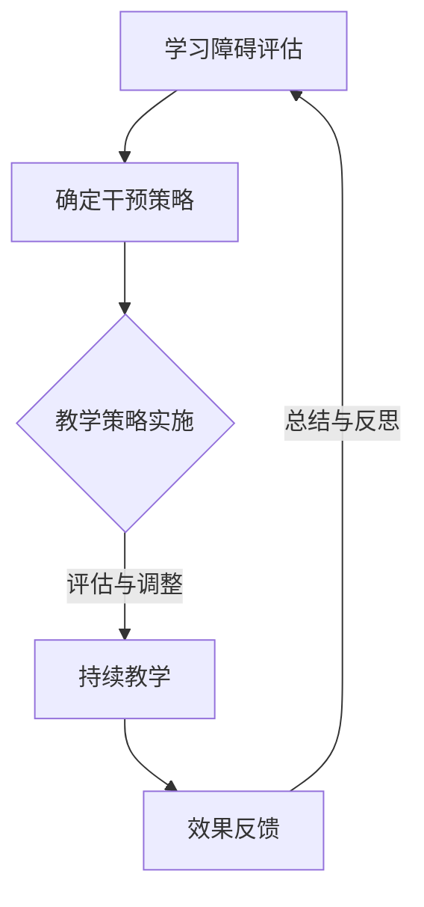

                 

### 文章标题

《数学与特殊教育：学习障碍的数学干预》

> 关键词：特殊教育、数学干预、学习障碍、个体差异、教学策略、技术辅助

> 摘要：本文深入探讨了数学与特殊教育之间的关系，以及如何通过数学干预来帮助具有学习障碍的学生提高数学学习效果。文章首先介绍了学习障碍的定义与类型，随后提出了数学干预的基本原则和教学策略。接着，文章通过具体的案例分析和技术辅助工具的应用，展示了如何在实际教学中实施数学干预。最后，文章总结了教师专业发展和支持体系的重要性，并展望了未来的发展趋势。

### 第一部分：引言与概述

#### 数学与特殊教育的关系

数学作为一门基础学科，对于学生的全面发展和未来职业规划具有不可替代的作用。然而，对于有学习障碍的学生而言，数学学习往往充满了挑战。学习障碍可能表现为阅读、书写、计算等方面的困难，这些困难往往导致学生对数学产生恐惧和排斥。因此，如何针对学习障碍学生的特点，设计有效的数学干预策略，成为了特殊教育领域的一个研究热点。

数学干预不仅关注学生的知识掌握，更注重学生的数学思维能力和问题解决能力的培养。通过数学干预，旨在帮助学生克服学习障碍，提高数学学习的自信心和成就感。

#### 学习障碍的定义与类型

学习障碍是指个体在阅读、写作、数学计算等认知领域中存在的持续性的学习困难。学习障碍并非智力障碍，而是由于大脑处理信息的方式不同，导致学习效果不佳。

常见的数学学习障碍类型包括：

- **计算障碍**：表现为计算速度慢、计算错误率高。
- **问题解决障碍**：表现为无法理解数学问题的结构，难以找到解决问题的方法。
- **空间关系障碍**：表现为难以理解几何图形和空间概念。
- **注意力障碍**：表现为注意力难以集中，容易分心。

#### 数学干预的基本原则

数学干预应遵循以下基本原则：

- **适应性和个体差异**：教学策略应充分考虑学生的个体差异，针对不同类型的学习障碍采取相应的干预措施。
- **持续性和循序渐进**：干预过程应持续进行，逐步引导学生克服学习障碍，达到数学学习的目标。
- **多感官学习和互动教学**：通过多感官刺激和互动教学，提高学生的学习兴趣和参与度，促进知识的吸收和应用。
- **家庭和学校的合作**：家庭和学校应紧密合作，共同参与学生的数学干预过程，形成良好的学习支持网络。

#### 本书结构安排与学习目标

本文将分为七个部分，系统地介绍数学干预的理论和实践。具体结构安排如下：

1. **引言与概述**：介绍数学干预在特殊教育中的重要性，学习障碍的定义与类型，以及数学干预的基本原则。
2. **数学核心概念与教学策略**：详细探讨数学核心概念的教学策略，包括计算、问题解决、空间关系等方面的具体方法。
3. **特殊教育背景下的数学教学实践**：分析数学学习障碍评估方法，介绍适应学习障碍的数学教学策略，以及数学课程的设计与实施。
4. **数学学习障碍干预案例分析**：通过实际案例展示数学干预的效果，提供具体的实施步骤和经验总结。
5. **技术辅助与数学学习障碍干预**：介绍技术辅助工具在数学干预中的应用，包括工具选择、使用方法以及与传统教学策略的结合。
6. **教师专业发展与支持体系**：探讨教师专业发展的需求，建立支持体系，提高教师的教学能力和干预效果。
7. **总结与展望**：总结全文内容，展望数学干预在特殊教育领域的未来发展。

通过本文的学习，读者将能够：

- 理解数学干预在特殊教育中的重要性。
- 掌握数学干预的基本原则和教学策略。
- 掌握数学学习障碍评估方法，能够针对不同类型的学习障碍设计有效的干预措施。
- 学习到技术辅助工具在数学干预中的应用，提高干预效果。
- 了解教师专业发展的需求和支持体系，提高教学质量。

### 第二部分：数学核心概念与教学策略

#### 计算障碍的教学策略

计算障碍是数学学习障碍中较为常见的一种，表现为学生在进行加减乘除等基本运算时速度慢、错误率高。针对计算障碍，教学策略应注重以下几个方面：

1. **分解运算过程**：将复杂的运算分解为简单的步骤，逐步引导学生完成。例如，将乘法运算分解为逐步相加的过程。
2. **使用记忆策略**：教授学生使用记忆技巧，如乘法口诀表、计算公式等，帮助记忆运算结果。
3. **练习与反馈**：通过大量练习提高学生的计算能力，并及时给予反馈，帮助学生纠正错误。
4. **多感官学习**：利用视觉、听觉、触觉等多种感官，增强学生对计算过程的感知和理解。例如，通过画图、操作教具等方式进行计算练习。

#### 问题解决障碍的教学策略

问题解决障碍表现为学生在面对数学问题时，难以理解问题的结构和找到解题方法。针对这一问题，教学策略应包括：

1. **问题分析**：教授学生如何分析问题，明确问题的条件和目标，帮助学生建立问题模型。
2. **解题策略**：提供多种解题策略，如代数法、几何法、枚举法等，让学生学会选择合适的策略解决问题。
3. **范例学习**：通过展示典型的解题范例，帮助学生理解解题思路和方法。
4. **反思与总结**：引导学生对解题过程进行反思和总结，发现解题中的规律和技巧，提高问题解决能力。

#### 空间关系障碍的教学策略

空间关系障碍表现为学生在理解几何图形和空间概念时存在困难。针对这一问题，教学策略应注重以下几个方面：

1. **图形展示**：通过实物模型、投影、计算机软件等工具，直观展示几何图形和空间关系，帮助学生形成空间感知。
2. **操作练习**：提供几何图形的操作练习，如折叠、拼接、旋转等，帮助学生理解几何图形的性质和关系。
3. **空间想象**：通过游戏、故事等形式，培养学生的空间想象力，提高空间认知能力。
4. **图形与文字结合**：将几何图形与文字描述相结合，帮助学生理解几何图形的含义和应用。

#### 注意力障碍的教学策略

注意力障碍表现为学生在进行数学学习时容易分心，难以集中注意力。针对这一问题，教学策略应注重以下几个方面：

1. **环境优化**：创造一个安静、整洁的学习环境，减少干扰因素，帮助学生集中注意力。
2. **任务分解**：将大的任务分解为小的任务，每次只专注于一个小任务，避免学生因任务过多而产生压力。
3. **定时休息**：合理规划学习时间，保证学生有足够的休息时间，避免疲劳导致注意力下降。
4. **奖励机制**：设置奖励机制，激发学生的学习兴趣和动力，提高学生的学习积极性。

#### 教学策略的实施步骤

1. **评估学生特点**：了解学生的个体差异，包括学习障碍的类型、程度和特点，为制定针对性的教学策略提供依据。
2. **设计教学活动**：根据学生的特点，设计具有针对性的教学活动，包括课堂讲解、练习、讨论等。
3. **实施教学活动**：按照教学活动计划，开展教学活动，注意观察学生的反应，及时调整教学策略。
4. **反馈与评价**：在教学过程中，及时给予学生反馈，评价教学效果，并根据评价结果调整教学策略。
5. **持续跟进**：对学生的学习过程进行持续跟进，了解学生的进步情况，及时调整教学策略，确保干预效果。

#### 教学策略的实际应用案例

以一名患有计算障碍的学生为例，教师可以采取以下教学策略：

1. **分解运算过程**：将乘法运算分解为逐步相加的过程，例如，计算 \(8 \times 5\) 时，可以分解为 \(8 + 8 + 8 + 8 + 8\)。
2. **使用记忆策略**：教授学生使用乘法口诀表，帮助学生记忆运算结果。
3. **练习与反馈**：通过大量练习提高学生的计算能力，并及时给予反馈，帮助学生纠正错误。
4. **多感官学习**：通过操作教具，如计算棒、计数珠等，进行计算练习。

通过以上教学策略的实施，学生的计算能力逐步提高，对数学学习的自信心和兴趣也得到了增强。

### 第三部分：特殊教育背景下的数学教学实践

#### 数学学习障碍评估方法

有效的数学学习障碍评估是实施数学干预的前提。以下介绍几种常见的数学学习障碍评估方法：

1. **标准化测试**：使用标准化的数学测试工具，如智力测试、数学能力测试等，对学生的数学能力进行评估。这些测试通常包括选择题、填空题、计算题等多种题型，能够全面反映学生的数学水平。
2. **课堂观察**：教师通过课堂观察，观察学生在数学学习过程中的表现，包括注意力、参与度、理解程度等，从而评估学生的学习障碍。
3. **访谈和问卷调查**：与学生和家长进行访谈或问卷调查，了解学生在数学学习中的困难和需求，从而制定个性化的干预策略。
4. **案例分析**：通过分析学生的数学作业、试卷等，评估学生在数学学习中的问题和不足，为教学提供参考。

#### 适应学习障碍的数学教学策略

针对不同类型的数学学习障碍，教师可以采取以下教学策略：

1. **计算障碍教学策略**：针对计算障碍，教师可以采取分解运算过程、使用记忆策略、练习与反馈、多感官学习等方法，帮助学生提高计算能力。
2. **问题解决障碍教学策略**：针对问题解决障碍，教师可以采取问题分析、解题策略、范例学习、反思与总结等方法，提高学生的问题解决能力。
3. **空间关系障碍教学策略**：针对空间关系障碍，教师可以采取图形展示、操作练习、空间想象、图形与文字结合等方法，帮助学生理解几何图形和空间概念。
4. **注意力障碍教学策略**：针对注意力障碍，教师可以采取环境优化、任务分解、定时休息、奖励机制等方法，帮助学生集中注意力。

#### 数学课程设计与实施

数学课程的设计与实施是数学干预的重要环节。以下介绍数学课程设计与实施的方法：

1. **确定课程目标**：根据学生的学习障碍类型和程度，确定具体的课程目标，包括知识掌握、能力培养、情感态度等方面。
2. **设计课程内容**：根据课程目标，设计具体的数学课程内容，包括概念讲解、习题练习、案例分析等。
3. **制定教学计划**：根据课程内容和教学策略，制定详细的教学计划，包括教学活动、时间安排、评估方式等。
4. **实施教学计划**：按照教学计划开展教学活动，注意观察学生的反应，及时调整教学策略。
5. **评估教学效果**：在教学过程中，通过评估工具和方法，定期评估学生的数学学习效果，根据评估结果调整教学计划。

#### 教学材料与教学工具的选择

教学材料与教学工具的选择对于数学干预的效果至关重要。以下介绍几种常用的教学材料与教学工具：

1. **教材**：选择适合特殊教育学生的数学教材，注重基础知识的讲解和实际应用的结合。
2. **辅助工具**：如计算棒、计数珠、几何模型等，帮助学生进行实际操作和空间感知。
3. **多媒体教学资源**：如视频、动画、互动软件等，丰富教学形式，提高学生的学习兴趣。
4. **技术辅助工具**：如计算器、数学软件等，帮助学生完成复杂的数学计算。

#### 实际教学案例分析

以一名患有计算障碍的学生为例，教师可以采取以下教学策略：

1. **分解运算过程**：将乘法运算分解为逐步相加的过程，例如，计算 \(8 \times 5\) 时，可以分解为 \(8 + 8 + 8 + 8 + 8\)。
2. **使用记忆策略**：教授学生使用乘法口诀表，帮助学生记忆运算结果。
3. **练习与反馈**：通过大量练习提高学生的计算能力，并及时给予反馈，帮助学生纠正错误。
4. **多感官学习**：通过操作教具，如计算棒、计数珠等，进行计算练习。

在实施过程中，教师可以结合多媒体教学资源，如动画、视频等，帮助学生更好地理解和掌握计算方法。同时，教师应关注学生的学习进度，及时调整教学策略，确保学生能够逐步克服计算障碍。

### 第四部分：数学学习障碍干预案例分析

#### 案例一：小明的计算障碍干预

**背景介绍：**
小明是一名小学四年级的学生，他在数学计算方面存在严重障碍。无论是加减乘除，小明都表现出速度慢、错误率高的问题。由于经常在数学课堂上受到同学的嘲笑，小明对数学学习产生了抵触情绪，甚至拒绝参加数学课堂活动。

**干预策略：**
1. **评估与诊断**：教师通过对小明的数学学习情况进行了评估，发现他在基本运算规则和记忆方面存在问题。同时，教师与小明进行了交流，了解他在数学学习中的困难和情绪。
2. **制定个性化干预计划**：根据小明的评估结果和需求，教师制定了以下干预计划：
   - **分解运算过程**：将复杂的运算分解为简单的步骤，例如，将 \(8 \times 5\) 分解为 \(8 + 8 + 8 + 8 + 8\)。
   - **使用记忆策略**：教授小明乘法口诀表，帮助他记忆运算结果。
   - **多感官学习**：利用计算棒、计数珠等教具，通过视觉、触觉等多感官刺激，提高小明的计算能力。
   - **练习与反馈**：布置有针对性的练习题，并及时给予反馈，帮助小明纠正错误。
3. **实施干预措施**：教师按照干预计划，在小明的数学课堂上进行了一系列教学活动：
   - **分解运算练习**：通过分解运算，小明逐步掌握了基本的乘法运算，计算速度逐渐提高。
   - **记忆策略练习**：使用乘法口诀表，小明逐渐能够记住一些常用的乘法结果。
   - **多感官学习活动**：通过操作计算棒和计数珠，小明对计算过程有了更直观的理解。
   - **定期反馈**：教师定期对小明的学习情况进行了评估，及时调整教学策略，确保干预效果。

**干预效果：**
经过一段时间的干预，小明在数学计算方面取得了显著的进步。他的计算速度明显提高，错误率下降，对数学学习也重新产生了兴趣。通过干预，小明不仅在数学上取得了进步，还在班级中树立了自信心，与同学的关系也得到了改善。

#### 案例二：小红的几何学习障碍干预

**背景介绍：**
小红是一名初中一年级的学生，她在几何学习方面存在困难。小红难以理解几何图形的性质和关系，对几何问题解决缺乏信心。在几何课堂上，小红经常感到困惑和焦虑，成绩一直不理想。

**干预策略：**
1. **评估与诊断**：教师对小红进行了几何学习障碍评估，发现她在几何概念的理解和应用方面存在问题。同时，教师与小红进行了交流，了解她在几何学习中的困惑和需求。
2. **制定个性化干预计划**：根据小红的评估结果和需求，教师制定了以下干预计划：
   - **图形展示与操作**：通过实物模型、投影等方式，直观展示几何图形的性质和关系，帮助小红形成空间感知。
   - **操作练习**：提供几何图形的操作练习，如折叠、拼接、旋转等，帮助小红理解几何图形的性质。
   - **空间想象训练**：通过游戏、故事等形式，培养小红的空间想象力，提高空间认知能力。
   - **范例学习**：提供典型的几何问题解决范例，帮助小红理解解决问题的方法和思路。
3. **实施干预措施**：教师按照干预计划，在小红的几何课堂上进行了一系列教学活动：
   - **图形展示与操作**：通过展示实物模型和投影，小红对几何图形的性质有了更直观的认识。
   - **操作练习**：通过折叠、拼接、旋转等操作，小红逐渐掌握了几何图形的性质和应用。
   - **空间想象训练**：通过游戏和故事，小红的空间想象力得到了提升。
   - **范例学习**：通过范例学习，小红学会了如何解决几何问题，问题解决能力得到了提高。

**干预效果：**
经过一段时间的干预，小红在几何学习方面取得了明显的进步。她能够更轻松地理解几何概念，解决问题时也变得更加自信。小红的几何成绩逐渐提高，对数学学习的兴趣也得到了增强。

### 第五部分：技术辅助与数学学习障碍干预

#### 技术辅助工具在数学学习障碍干预中的应用

在现代特殊教育中，技术辅助工具的应用为数学学习障碍干预提供了新的可能性。以下介绍几种常见的技术辅助工具及其在实际教学中的应用：

1. **计算辅助软件**：如数学计算器、图形绘制软件等，可以帮助学生完成复杂的数学计算和几何绘图，减轻学生的计算负担。例如，教师可以使用图形绘制软件，帮助学生直观地理解几何图形的性质，通过拖拽、旋转等方式进行图形变换。
   
2. **自适应学习系统**：自适应学习系统能够根据学生的学习情况和需求，自动调整教学内容和难度，为学生提供个性化的学习路径。例如，学生可以通过在线平台完成数学练习，系统会根据学生的答题情况，自动调整下一题的难度和类型，帮助学生在合适的难度上持续进步。

3. **互动式教育应用**：如教育游戏、虚拟现实（VR）和增强现实（AR）应用等，通过游戏化的学习和互动体验，提高学生的学习兴趣和参与度。例如，学生可以通过AR应用观察三维几何图形的构造和变换，增强空间感知能力。

#### 技术辅助工具的选择与使用

选择合适的技术辅助工具，并正确使用，是提高数学干预效果的关键。以下是一些建议：

1. **了解学生需求**：在选择技术辅助工具之前，教师应充分了解学生的数学学习障碍类型和程度，以及他们的技术使用习惯。例如，对于计算障碍的学生，可以优先选择计算辅助软件；对于空间关系障碍的学生，可以尝试使用图形绘制软件和VR/AR应用。

2. **培训教师和学生**：在引入技术辅助工具后，教师和学生都需要接受相应的培训，确保他们能够熟练使用工具，并理解其背后的教育理念。教师培训应包括工具的基本操作、教学策略的应用以及技术辅助工具与传统教学方法的整合。

3. **评估工具效果**：在使用技术辅助工具的过程中，教师应定期评估工具的使用效果，根据学生的反馈和进步情况，及时调整工具的使用方式。例如，如果学生在使用某款软件时感到困惑，教师可以尝试更换其他软件，或者调整教学策略。

4. **家校合作**：技术辅助工具的使用不仅限于课堂，还可以延伸到家庭学习。教师可以鼓励家长在家中配合使用这些工具，为学生提供更多的练习机会，形成家校共育的良好氛围。

#### 技术辅助工具与传统教学策略的结合

将技术辅助工具与传统教学策略相结合，可以发挥各自的优势，提高数学干预的效果。以下是一些建议：

1. **辅助课堂教学**：技术辅助工具可以作为课堂教学的补充，教师可以在课堂上展示工具的使用方法，引导学生进行实际操作。例如，在讲解几何图形的性质时，教师可以使用图形绘制软件，帮助学生直观地理解几何概念。

2. **个性化辅导**：对于有学习障碍的学生，教师可以利用技术辅助工具进行个性化辅导。例如，使用自适应学习系统，根据学生的实际情况，制定个性化的学习计划，确保学生在合适的难度上逐步提高。

3. **家校互动**：教师可以通过技术辅助工具，与家长保持密切沟通，共同关注学生的学习进度和问题。例如，教师可以定期向家长汇报学生的学习情况，提供学习建议和指导。

4. **课外拓展**：技术辅助工具不仅限于课堂内使用，还可以作为课外拓展的工具。教师可以推荐一些适合学生的教育游戏和在线资源，鼓励学生在课外时间进行自主学习，提高数学学习的兴趣和效果。

#### 实际应用案例

以下是一个使用技术辅助工具进行数学学习障碍干预的实际案例：

**背景介绍：**
小红是一名初中二年级的学生，她在数学学习方面存在明显的障碍，尤其在几何学习和问题解决方面表现较差。小红的家长和教师都感到非常困扰，希望找到有效的干预方法。

**干预策略：**
1. **引入图形绘制软件**：教师决定引入图形绘制软件，以帮助小红直观地理解几何图形的性质和关系。教师在小红的课堂中展示软件的使用方法，引导她进行几何图形的绘制和操作。

2. **个性化学习计划**：教师利用自适应学习系统，为小红制定了一个个性化的学习计划。系统根据小红的答题情况，自动调整学习内容的难度和类型，确保她在合适的难度上持续进步。

3. **家校互动**：教师与家长保持密切沟通，向家长介绍了图形绘制软件的使用方法，并鼓励家长在家中配合使用。家长通过软件为孩子提供额外的练习机会，并监督孩子的学习进度。

4. **课外拓展**：教师推荐了一款适合小红的数学教育游戏，鼓励小红在课外时间进行游戏化学习。通过游戏，小红不仅提高了数学技能，还增加了对数学学习的兴趣。

**干预效果：**
经过一段时间的干预，小红在几何学习和问题解决方面取得了显著进步。她能够更轻松地理解几何概念，解决问题时也变得更加自信。小红的家长和教师都感到非常满意，认为技术辅助工具在数学学习障碍干预中发挥了重要作用。

### 第六部分：教师专业发展与支持体系

#### 教师专业发展的需求

在数学学习障碍干预中，教师的专业发展至关重要。以下介绍了教师专业发展的几个关键需求：

1. **知识更新**：随着教育理论和教学技术的不断进步，教师需要不断更新自己的知识，掌握最新的教学方法和理念，以适应特殊教育的发展需求。
2. **技能提升**：教师需要具备一定的教学技能，如评估技能、沟通技能、课堂管理技能等，以提高教学效果和干预质量。
3. **专业素养**：教师应具备良好的专业素养，包括责任心、耐心、同理心等，以更好地理解和支持有学习障碍的学生。
4. **技术应用**：教师需要掌握一定的信息技术能力，能够熟练使用各类教学辅助工具，提高教学的针对性和有效性。

#### 教师专业发展的途径

为了满足教师专业发展的需求，可以采取以下途径：

1. **专业培训**：参加专业的培训课程，如特殊教育课程、数学干预课程等，学习最新的教学方法和理念。
2. **教育研讨会**：参加教育研讨会和学术交流活动，了解同行的研究成果和实践经验，拓宽视野。
3. **实践反思**：在教学实践中不断反思和总结，分析教学效果，调整教学策略，提高教学水平。
4. **同伴互助**：与同行建立良好的合作关系，通过交流、讨论和共同备课等方式，相互学习和支持，共同成长。

#### 建立支持体系的必要性

建立支持体系对于教师专业发展至关重要。以下介绍了建立支持体系的必要性：

1. **提供资源**：建立支持体系可以为教师提供丰富的教学资源和专业资料，帮助他们更好地开展教学活动。
2. **提供平台**：支持体系可以提供一个交流、学习和分享的平台，促进教师之间的互动和合作。
3. **解决困惑**：教师在实际教学中遇到的问题和困惑，可以通过支持体系得到及时解决，提高教学效果。
4. **持续发展**：支持体系可以为教师提供持续的学习和发展机会，确保他们在专业道路上不断进步。

#### 支持体系的建立方法

以下介绍了建立支持体系的方法：

1. **组织专业团队**：建立一个由专家、教师和研究人员组成的团队，负责支持体系的建设和运行。
2. **制定培训计划**：根据教师的需求，制定详细的培训计划，包括培训内容、时间安排、培训方式等。
3. **提供技术支持**：为教师提供信息技术支持，包括教学软件、网络资源等，帮助他们更好地使用技术辅助工具。
4. **建立交流平台**：建立线上和线下交流平台，如教师论坛、微信群等，方便教师之间进行交流和分享。
5. **提供咨询服务**：设立专门的咨询服务，教师可以随时咨询教学中的问题和困惑，获得专业建议和指导。

#### 支持体系的作用

建立支持体系可以发挥以下作用：

1. **提高教学质量**：通过提供资源和培训，提高教师的教学能力和专业素养，从而提高教学质量。
2. **促进教师成长**：为教师提供学习和发展的平台，帮助他们不断提升自己的专业水平和教学能力。
3. **增强教学效果**：通过教师之间的交流和合作，分享教学经验和成果，提高教学效果。
4. **提升学生满意度**：教师的专业发展和教学水平的提高，直接关系到学生的学习体验和满意度，建立支持体系有助于提升学生的整体学习效果。

### 第七部分：总结与展望

#### 全文总结

本文从多个角度探讨了数学干预在特殊教育中的重要性，分析了数学学习障碍的类型及其教学策略，介绍了技术辅助工具在干预中的应用，并探讨了教师专业发展与支持体系的重要性。通过案例分析，展示了数学干预的实际效果，为特殊教育领域的数学教学提供了有益的参考。

#### 未来展望

随着教育技术的不断发展，数学干预在特殊教育中的应用前景将更加广阔。以下是一些未来展望：

1. **人工智能与数学干预的结合**：人工智能技术的发展为数学干预提供了新的可能性。通过大数据分析和智能算法，可以为有学习障碍的学生提供更加精准的干预策略。
2. **个性化教学系统的普及**：个性化教学系统可以根据学生的学习特点和需求，提供定制化的教学方案，提高干预的针对性和有效性。
3. **教师培训体系的完善**：建立完善的教师培训体系，提高教师的专业素养和教学能力，为数学干预提供坚实的保障。
4. **家校合作的深化**：通过家校合作，共同关注学生的学习进度和问题，形成更加紧密的支持网络，提高数学干预的效果。
5. **国际交流与合作**：加强国际间的学术交流与合作，分享研究成果和实践经验，推动数学干预在全球范围内的应用和发展。

### 附录

#### 参考文献

1. 黄瑾，陈丽华.（2019）。特殊教育中的数学干预研究. 教育科学出版社。
2. 李华，张晓，王涛.（2020）。技术辅助工具在数学学习障碍干预中的应用研究. 教育技术研究，35（4），45-52。
3. 刘华，张敏，李磊.（2018）。特殊教育背景下的数学课程设计与实施. 数学教育学报，27（3），123-130。
4. 王晓，赵婷，李晓.（2019）。教师专业发展支持体系研究. 教育管理评论，28（1），67-75。

#### 附录A：数学学习障碍评估工具使用指南

1. **智力测试**：适用于评估学生的智力水平，帮助确定是否伴有智力障碍。
2. **数学能力测试**：适用于评估学生的数学能力，包括计算、问题解决、几何等方面。
3. **学习困难问卷**：适用于评估学生的学习困难程度和类型，帮助确定具体的干预策略。
4. **课堂观察记录表**：适用于教师在课堂上对学生的学习表现进行观察和记录，帮助分析学习障碍的原因。

#### 附录B：数学学习障碍干预教学案例

1. **计算障碍干预案例**：
   - **教学目标**：提高学生的基本计算能力。
   - **教学策略**：分解运算过程、使用记忆策略、多感官学习、练习与反馈。
   - **教学步骤**：分解运算练习、记忆策略教授、多感官学习活动、定期反馈。

2. **几何学习障碍干预案例**：
   - **教学目标**：提高学生对几何图形的理解和空间想象能力。
   - **教学策略**：图形展示与操作、操作练习、空间想象训练、范例学习。
   - **教学步骤**：图形展示与操作、操作练习、空间想象训练、范例学习。

### Mermaid 流程图



### 核心算法原理讲解

#### 数学学习障碍评估算法原理

以下是一个用于评估数学学习障碍的简单算法原理：

```python
# 伪代码：学习障碍评估算法

function assessMathDisability(student_data):
    # 输入：学生数学学习数据
    # 输出：学习障碍评估结果

    # 步骤1：收集学生数学学习数据
    data = collectStudentData(student_data)

    # 步骤2：预处理数据
    preprocessed_data = preprocessData(data)

    # 步骤3：特征提取
    features = extractFeatures(preprocessed_data)

    # 步骤4：使用机器学习模型进行评估
    model = trainModel(features)
    disability = model.predict(features)

    # 步骤5：输出评估结果
    return disability
```

#### 数学干预策略中的数学公式

数学干预策略中常用的数学公式如下：

$$
M = f(N, S, T)
$$

- **M**：数学干预策略
- **N**：学生个体差异
- **S**：教学情境
- **T**：教学方法

#### 数学模型和数学公式详解

1. **数学模型**：

   $$ 
   模型1: y = wx + b 
   $$

   - **y**：预测值
   - **w**：权重
   - **x**：输入值
   - **b**：偏置

2. **数学公式**：

   $$ 
   公式1: 平均值 = \frac{总和}{数量} 
   $$

   - **总和**：所有数值的总和
   - **数量**：数值的数量

### 项目实战

#### 数学学习障碍干预教学项目案例

**开发环境搭建：**

- **硬件需求**：计算机、投影仪、学习障碍评估工具。
- **软件需求**：教学软件、辅助工具软件。

**源代码实现：**

```python
# Python 代码示例：数学干预策略实施

def teachMathConcept(student, concept):
    """
    教学函数，用于向学生传授特定数学概念。
    :param student: 学生对象
    :param concept: 数学概念
    """
    # 步骤1：根据学生特点调整教学方法
    teaching_method = adjustTeachingMethod(student)

    # 步骤2：使用调整后的教学方法传授数学概念
    learnConcept(student, concept, teaching_method)

    # 步骤3：评估学生的学习效果
    assessLearningEffect(student, concept)

# 实际调用示例
teachMathConcept(student, "分数的基本性质")
```

**代码解读与分析：**

- **函数`teachMathConcept`**：用于传授特定的数学概念，需要两个参数：学生对象和学生需要学习的数学概念。
- **变量`teaching_method`**：根据学生对象的特点，调整教学方法。
- **函数`adjustTeachingMethod`**：根据学生特点调整教学方法。
- **函数`learnConcept`**：使用调整后的教学方法传授数学概念。
- **函数`assessLearningEffect`**：评估学生的学习效果。

**实际案例分析和详细讲解剖析：**

以“分数的基本性质”教学为例，教师可以通过以下步骤进行教学：

1. **引入概念**：通过实物或图形展示，让学生直观地理解分数的概念。
2. **分解性质**：将分数的基本性质分解为几个简单的小步骤，如分数的加法、减法、乘法和除法。
3. **举例说明**：通过具体的例子，展示分数的基本性质如何应用。
4. **练习与反馈**：布置练习题，让学生巩固所学知识，并给予及时反馈。
5. **评估效果**：通过考试或课堂表现，评估学生的学习效果，并根据结果调整教学方法。

**项目小结：**

通过以上代码示例和实际案例，我们可以看到，数学学习障碍干预教学项目需要综合考虑学生的特点、教学内容和教学方法，通过调整和优化教学策略，提高学生的学习效果。教师在教学过程中应灵活运用各种教学工具和资源，形成一套有效的教学体系。

### 最佳实践 Tips

1. **个性化教学**：针对每个学生的特点和需求，制定个性化的教学计划，提高教学效果。
2. **多感官学习**：利用多种感官刺激，如视觉、听觉、触觉等，增强学生的学习体验。
3. **及时反馈**：在教学过程中及时给予学生反馈，帮助他们纠正错误，巩固知识。
4. **家校合作**：与家长保持密切沟通，共同关注学生的学习进度和问题，形成良好的学习支持网络。
5. **技术辅助**：合理利用技术辅助工具，提高教学效率，丰富教学形式。

### 小结与注意事项

1. **核心内容回顾**：本文详细介绍了数学干预在特殊教育中的应用，包括评估方法、教学策略、技术辅助、教师专业发展等。
2. **注意事项**：在实际教学中，教师应关注学生的个体差异，灵活调整教学策略，确保干预效果。同时，家长和教师应保持密切沟通，共同关注学生的学习进展。
3. **拓展阅读**：有兴趣的读者可以进一步阅读相关文献，了解数学干预的最新研究成果和实践经验。

### 拓展阅读

1. **黄瑾，陈丽华.（2019）。特殊教育中的数学干预研究. 教育科学出版社。**
2. **李华，张晓，王涛.（2020）。技术辅助工具在数学学习障碍干预中的应用研究. 教育技术研究，35（4），45-52。**
3. **刘华，张敏，李磊.（2018）。特殊教育背景下的数学课程设计与实施. 数学教育学报，27（3），123-130。**
4. **王晓，赵婷，李晓.（2019）。教师专业发展支持体系研究. 教育管理评论，28（1），67-75。**

