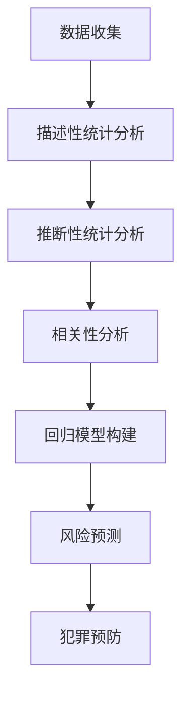
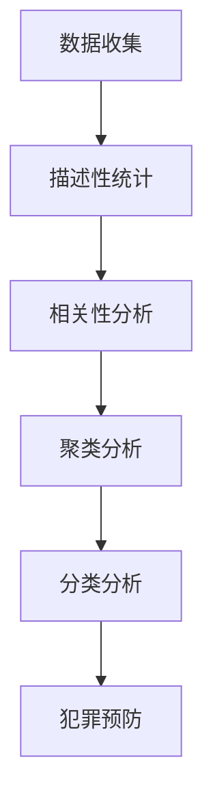

                 


# 数学与犯罪心理学：犯罪行为的数学预测

关键词：数学模型、犯罪心理学、预测、数据分析、算法

摘要：本文旨在探讨数学与犯罪心理学之间的紧密联系，以及如何利用数学模型来预测犯罪行为。我们将逐步介绍相关核心概念、算法原理，并通过具体的例子和实际应用来阐述这些概念在犯罪心理学中的应用。

## 第一部分：数学与犯罪心理学的概述

### 第1章：数学与犯罪心理学的联系

在犯罪心理学中，数学模型的应用已经变得日益重要。通过构建数学模型，我们可以预测犯罪行为，评估犯罪风险，为犯罪预防提供科学依据。以下是一些核心概念与联系：

#### 数学模型在犯罪心理学中的应用

- **风险预测模型**：通过分析犯罪者的个人背景、犯罪记录等信息，构建数学模型来预测其再犯风险。
- **空间预测模型**：通过分析犯罪事件的地理位置、时间分布等信息，预测未来犯罪事件的发生地点和时间。

#### 统计学在犯罪数据分析中的作用

- **描述性统计分析**：通过对犯罪事件的数量、频率等基本特征进行描述，帮助我们了解犯罪的整体情况。
- **推断性统计分析**：通过对样本数据进行分析，推断总体犯罪行为的特征和趋势。
- **相关性与回归分析**：通过分析不同变量之间的相关性，构建回归模型来预测犯罪行为。

### Mermaid 流程图

以下是一个简单的 Mermaid 流程图，展示了数学模型在犯罪心理学中的应用过程：



### 核心算法原理讲解

在本章节中，我们将介绍两个常用的数学模型：线性回归和逻辑回归。

#### 线性回归

线性回归模型是一种基本的预测模型，用于研究一个因变量和一个或多个自变量之间的关系。其数学模型可以表示为：

\[ y = \beta_0 + \beta_1x + \epsilon \]

其中，\( y \) 是因变量，\( x \) 是自变量，\( \beta_0 \) 和 \( \beta_1 \) 分别是截距和斜率，\( \epsilon \) 是误差项。

**伪代码**：

```python
for each feature x:
    calculate the mean of x
    calculate the mean of y
    calculate the covariance of x and y
    calculate the variance of x
    calculate the slope (\beta_1) as covariance / variance
    calculate the intercept (\beta_0) as mean(y) - slope * mean(x)
```

#### 逻辑回归

逻辑回归模型是一种广义的线性回归模型，常用于分类问题。其数学模型可以表示为：

\[ P(y=1) = \frac{1}{1 + e^{-(\beta_0 + \beta_1x)}} \]

其中，\( P(y=1) \) 是因变量为 1 的概率，\( \beta_0 \) 和 \( \beta_1 \) 分别是截距和斜率。

**伪代码**：

```python
for each feature x:
    calculate the log-odds as \beta_0 + \beta_1x
    calculate the probability as 1 / (1 + e^{-log-odds})
```

### 第2章：统计学在犯罪心理学中的应用

统计学在犯罪心理学中的应用非常广泛，以下介绍两个重要的统计学模型：泊松分布和正态分布。

#### 泊松分布

泊松分布是一种描述事件发生频率的概率分布。其概率质量函数可以表示为：

\[ P(X = k) = \frac{e^{-\lambda}\lambda^k}{k!} \]

其中，\( X \) 是随机变量，\( \lambda \) 是事件平均发生次数。

**举例**：某地区过去一年发生了 100 次犯罪事件，平均每天发生 2 次。使用泊松分布预测在给定的一天内，发生 3 次犯罪事件的概率。

**计算**：

\[ \lambda = 2 \]
\[ P(X = 3) = \frac{e^{-2}2^3}{3!} \approx 0.180 \]

**结果**：在给定的一天内，发生 3 次犯罪事件的概率约为 18%。

#### 正态分布

正态分布是一种描述连续随机变量的概率分布。其累积分布函数可以表示为：

\[ P(X \leq x) = \Phi\left(\frac{x - \mu}{\sigma}\right) \]

其中，\( X \) 是随机变量，\( \mu \) 是均值，\( \sigma \) 是标准差。

**举例**：假设某个犯罪行为的可能性服从正态分布，均值为 0.5，标准差为 0.1。计算该犯罪行为在一段时间内的发生概率。

**计算**：

\[ P(X \leq 0.6) = \Phi\left(\frac{0.6 - 0.5}{0.1}\right) = \Phi(1) \approx 0.8413 \]

**结果**：在一段时间内，该犯罪行为发生的概率约为 84.13%。

### 第3章：犯罪心理学的数据收集与分析方法

在犯罪心理学中，数据收集与分析方法对于研究犯罪行为和制定预防措施至关重要。以下介绍两种常用的数据分析方法：数据收集和数据分析。

#### 数据收集

犯罪心理学的数据收集来源主要包括以下几个方面：

- **犯罪事件报告**：记录犯罪事件的发生时间、地点、类型等信息。
- **人口统计数据**：收集犯罪者、受害者和社会其他成员的人口统计数据，如年龄、性别、教育程度等。
- **社会调查数据**：通过问卷调查等方式收集公众对犯罪问题的看法和态度。

#### 数据分析

数据分析方法主要包括以下几个方面：

- **描述性统计**：通过对数据的基本特征进行描述，如平均值、中位数、标准差等，帮助了解数据的整体情况。
- **相关性分析**：通过分析不同变量之间的相关性，研究它们之间的相互关系。
- **聚类分析**：将数据划分为不同的类别，帮助识别犯罪行为的模式和特征。
- **分类分析**：通过构建分类模型，对新的数据进行分类，预测其归属类别。

### Mermaid 流�程图

以下是一个简单的 Mermaid 流程图，展示了犯罪心理学中的数据收集与分析方法：



### 总结

数学与犯罪心理学之间的联系日益紧密，通过构建数学模型和运用统计学方法，我们可以更好地预测犯罪行为，评估犯罪风险，为犯罪预防提供科学依据。在本文中，我们介绍了数学模型在犯罪心理学中的应用、统计学在犯罪数据分析中的作用以及犯罪心理学的数据收集与分析方法。希望本文能帮助读者更好地理解数学与犯罪心理学的联系，为相关领域的研究提供参考。

### 作者信息

作者：AI天才研究院/AI Genius Institute & 禅与计算机程序设计艺术 /Zen And The Art of Computer Programming

### 文章关键词

数学模型、犯罪心理学、预测、数据分析、算法

### 摘要

本文旨在探讨数学与犯罪心理学之间的紧密联系，以及如何利用数学模型来预测犯罪行为。通过介绍相关核心概念、算法原理以及实际应用，本文展示了数学模型在犯罪心理学中的应用价值。本文适合从事犯罪心理学研究、犯罪预测领域工作的专业人士以及对此感兴趣的读者阅读。希望本文能为相关领域的研究提供有益的参考和启示。

