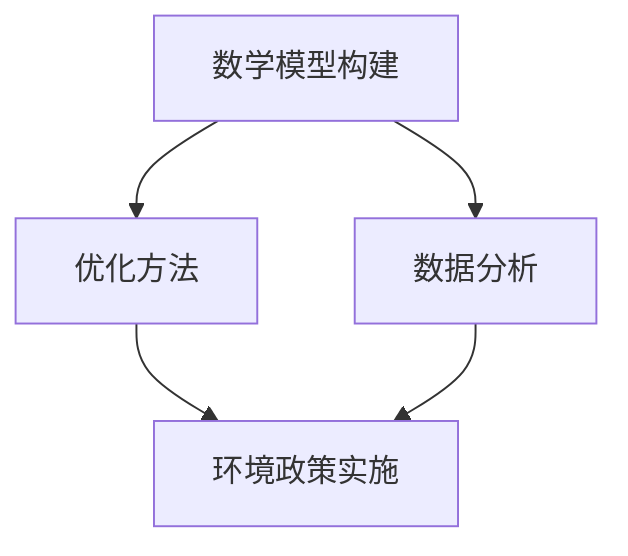
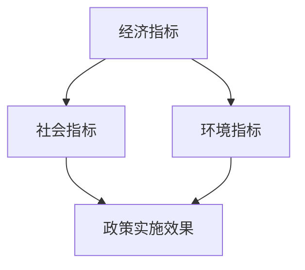
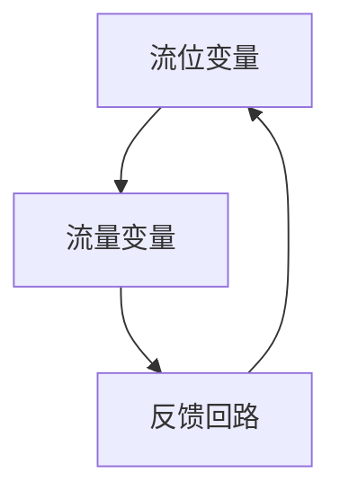
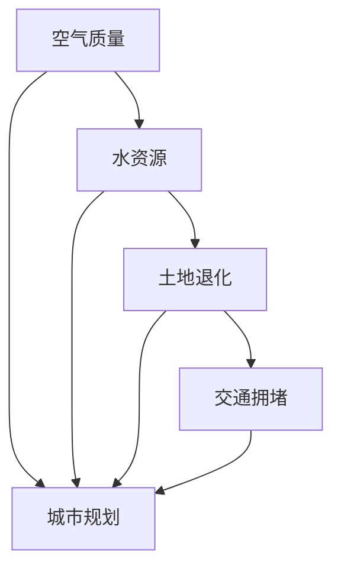
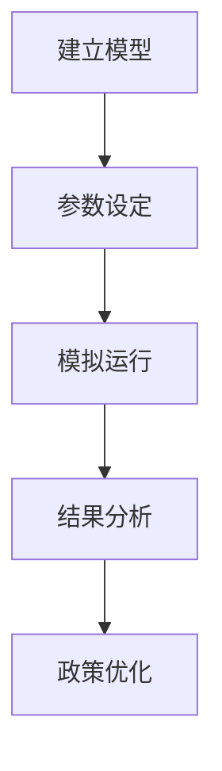

                 

### 第一部分：引论

#### 第1章：数学与环境政策的起源与意义

##### 1.1 数学与环境政策的历史背景

数学作为一门古老的学科，其起源可以追溯到古代文明，如古埃及和巴比伦。早期的数学主要关注解决实际问题，如土地测量、货币计算和建筑工程等。然而，随着科学和技术的进步，数学的应用范围逐渐扩展到自然科学、工程学和经济学等领域。

环境政策的起源可以追溯到20世纪中叶，随着工业化和城市化的快速发展，环境污染问题逐渐凸显。1972年，联合国召开了第一次环境会议，标志着全球环境保护意识的觉醒。此后，各国纷纷制定了相应的环境政策和法规，以应对日益严峻的环境问题。

##### 1.2 可持续发展的数学策略概述

可持续发展是指在满足当代人的需求的同时，不损害后代人满足其需求的能力。数学在可持续发展中的应用，主要是通过构建数学模型、使用优化方法和进行数据分析，为环境政策的制定和实施提供科学依据。

可持续发展的数学策略主要包括以下几个方面：

1. **数学模型构建**：利用数学方法建立描述环境问题的模型，如生态系统服务价值评估模型、碳排放模型等。
2. **优化方法**：通过优化方法寻找环境政策的最优方案，如环境经济模型中的成本效益分析。
3. **数据分析**：利用数据分析方法，对环境政策的效果进行评估和预测。

##### 1.3 本书结构与目标

本书的结构分为五个部分：

1. **引论**：介绍数学与环境政策的起源与意义。
2. **可持续发展的数学概念**：阐述可持续发展的定义、原则和评价指标体系。
3. **环境政策中的数学策略**：介绍数学工具在环境政策中的应用，如环境经济模型、生态系统服务价值评估和碳排放管理。
4. **可持续发展案例研究**：通过具体案例，展示数学策略在环境政策中的实际应用。
5. **展望与建议**：探讨可持续发展数学策略的未来方向和挑战。

本书的目标是：

1. **系统梳理**：对可持续发展中的数学策略进行系统梳理，为读者提供一个全面的理解。
2. **深入分析**：通过对具体案例的研究，深入分析数学策略在环境政策中的应用。
3. **实践指导**：提供实用的工具和资源，帮助读者在实际工作中应用数学策略。

通过本书的学习，读者将能够：

1. **理解可持续发展的数学概念**：掌握可持续发展的定义、原则和评价指标体系。
2. **掌握数学工具的应用**：了解数学工具在环境政策中的具体应用，如优化方法、数据分析等。
3. **提高环境政策制定的能力**：通过案例分析，提高读者在环境政策制定中的实践能力。

---

**核心概念与联系**：

可持续发展的数学策略包括以下几个方面：

1. **数学模型构建**：建立描述环境问题的数学模型，如生态系统服务价值评估模型。
2. **优化方法**：使用优化方法，如线性规划、动态规划，寻找最优环境政策方案。
3. **数据分析**：通过数据分析，对环境政策效果进行评估和预测。

**Mermaid 流程图**：



---

在下一章节，我们将深入探讨可持续发展的定义、原则和评价指标体系，为理解后续的数学策略应用打下基础。

---

#### 第2章：可持续发展的数学概念

##### 2.1 可持续发展的定义与原则

可持续发展是一个广泛的概念，涉及到经济、社会和环境三个方面的平衡。联合国在1987年的《我们共同的未来》报告中，对可持续发展给出了经典定义：“满足当代人的需求，而不损害后代人满足其需求的能力。”

为了实现可持续发展，国际社会普遍认同以下原则：

1. **公平性原则**：在满足当代人需求的同时，要考虑不同国家和地区、不同社会群体之间的公平性。
2. **持续性原则**：自然资源的使用应保持在其再生能力范围内，避免过度开发和资源枯竭。
3. **共同性原则**：全球环境问题需要各国共同参与，通过国际合作实现全球可持续发展。

##### 2.2 可持续发展的数学模型

可持续发展的数学模型是描述环境、经济和社会系统之间相互关系的工具。以下是一些常见的数学模型：

1. **生态系统服务价值评估模型**：该模型用于评估生态系统提供的各种服务，如水资源、食物和生物多样性。常见的方法包括成本效益分析、条件价值评估和资产法等。
   
   **核心算法原理**：

   - **成本效益分析（CBA）**：
     $$ \text{净现值} = \sum_{t=0}^{n} \frac{C_t}{(1+r)^t} - \text{初始投资} $$
     其中，\( C_t \) 是第 \( t \) 年的净收益，\( r \) 是折现率。

   - **条件价值评估（CVA）**：
     $$ \text{CVA} = \sum_{i=1}^{N} \text{CV}_i $$
     其中，\( \text{CV}_i \) 是第 \( i \) 种生态服务类型的条件价值。

   - **资产法**：
     $$ \text{Ecosystem Value} = \sum_{i=1}^{N} \text{Asset}_i \cdot \text{Value}_i $$
     其中，\( \text{Asset}_i \) 是第 \( i \) 种生态资源的存量，\( \text{Value}_i \) 是其经济价值。

2. **碳排放模型**：用于预测和评估碳排放量，常见的方法包括碳排放估算模型、碳排放情景分析模型等。

   **核心算法原理**：

   - **碳排放估算模型**：
     $$ \text{Emissions} = \sum_{i=1}^{N} Q_i \cdot CF_i $$
     其中，\( Q_i \) 是第 \( i \) 个排放源的排放量，\( CF_i \) 是第 \( i \) 个排放源的碳排放因子。

   - **碳排放情景分析模型**：
     $$ \text{Scenario Emissions} = \text{Base Emissions} \cdot (1 + r)^t $$
     其中，\( r \) 是年增长率，\( t \) 是年份。

3. **环境经济模型**：用于分析环境政策对经济的影响，常见的方法包括环境成本效益分析、环境税收模型等。

   **核心算法原理**：

   - **环境成本效益分析**：
     $$ \text{BCVI} = \sum_{i=1}^{N} \text{CI}_i - \sum_{i=1}^{N} \text{BI}_i $$
     其中，\( \text{CI}_i \) 是第 \( i \) 项环境成本，\( \text{BI}_i \) 是第 \( i \) 项经济收益。

   - **环境税收模型**：
     $$ \text{Tax Revenue} = \sum_{i=1}^{N} Q_i \cdot (P_i - T_i) $$
     其中，\( P_i \) 是第 \( i \) 种污染物的市场价格，\( T_i \) 是第 \( i \) 种污染物的税收。

##### 2.3 可持续发展评价指标体系

为了评估可持续发展状况，需要建立一套科学合理的评价指标体系。以下是一些常见的评价指标：

1. **经济指标**：包括GDP增长率、人均收入、就业率等。
2. **社会指标**：包括教育水平、健康水平、社会保障等。
3. **环境指标**：包括水资源质量、空气质量、生物多样性等。

**评价指标架构 Mermaid 流程图**：



通过上述评价指标，可以全面评估一个国家或地区的可持续发展水平。例如，使用综合评价方法，如加权综合评价法，可以计算出综合可持续发展指数（Integrated Sustainable Development Index, ISDI）。

**核心算法原理**：

$$ \text{ISDI} = w_1 \cdot \text{Economic Index} + w_2 \cdot \text{Social Index} + w_3 \cdot \text{Environmental Index} $$

其中，\( w_1, w_2, w_3 \) 分别是经济、社会和环境指标的权重。

---

通过本章的讨论，我们了解了可持续发展的定义、原则和评价指标体系，以及相关的数学模型。这些知识为后续章节中具体数学策略的应用奠定了基础。在下一章，我们将探讨数学工具在环境政策中的具体应用。

---

#### 第3章：数学工具与环境政策

##### 3.1 数学优化方法与环境政策

数学优化方法在环境政策中扮演着关键角色，可以帮助政策制定者找到最优的环境管理方案。常见的数学优化方法包括线性规划、动态规划和多目标优化等。

**线性规划（Linear Programming, LP）**

线性规划是解决资源分配和决策优化问题的一种数学方法。在环境政策中，线性规划可以用于优化资源使用、减少污染排放等。

**核心算法原理**：

$$ \text{最大化} \, c^T x $$
$$ \text{约束条件：} \, Ax \leq b $$

其中，\( c \) 是目标函数的系数向量，\( x \) 是决策变量向量，\( A \) 和 \( b \) 分别是约束矩阵和约束向量。

**伪代码示例**：

```python
# 输入参数
c = [成本系数]
A = [约束矩阵]
b = [约束向量]

# 求解线性规划
x = solve_linear_programming(c, A, b)
```

**动态规划（Dynamic Programming, DP）**

动态规划是一种解决多阶段决策问题的方法，适用于环境政策的长期规划。例如，在碳排放管理中，动态规划可以用于优化减排策略。

**核心算法原理**：

动态规划的基本思想是将复杂问题分解为若干子问题，并存储子问题的解，以避免重复计算。

**伪代码示例**：

```python
# 输入参数
n = [阶段数量]
T = [每个阶段的碳排放量]
P = [每个阶段的成本]

# 初始化动态规划表
dp = [[0 for _ in range(n[1])] for _ in range(n[0])]

# 动态规划求解
for i in range(n[0]):
    for j in range(n[1]):
        dp[i][j] = min(dp[i-1][j], dp[i][j-1]) + P[j]

# 最优解
x = dp[-1][-1]
```

**多目标优化（Multi-Objective Optimization, MOO）**

多目标优化涉及多个相互冲突的目标，如环境保护和经济发展的平衡。在环境政策中，多目标优化可以帮助政策制定者找到最优的平衡点。

**核心算法原理**：

多目标优化通过将多个目标函数整合为一个目标函数，并引入权重或偏好，以找到多个目标之间的最优平衡。

**伪代码示例**：

```python
# 输入参数
f1, f2 = [目标函数1, 目标函数2]
w1, w2 = [权重1, 权重2]

# 构建多目标优化问题
F = w1 * f1 + w2 * f2

# 求解多目标优化
x = solve_multi_objective_optimization(F)
```

##### 3.2 系统动力学模型与环境管理

系统动力学（System Dynamics, SD）是一种基于系统思考方法的建模技术，适用于模拟复杂系统的动态行为。在环境管理中，系统动力学模型可以用于分析环境污染、资源消耗等问题的长期趋势。

**核心算法原理**：

系统动力学模型包括流位、流量和反馈回路等基本元素。通过模拟这些元素之间的关系，可以预测系统未来的动态行为。

**Mermaid 流程图示例**：



**伪代码示例**：

```python
# 输入参数
state = [初始状态]
inputs = [输入变量]

# 模拟系统动力学模型
while not termination_condition:
    state = update_state(state, inputs)
    print(state)
```

##### 3.3 模糊数学与不确定性分析

模糊数学（Fuzzy Mathematics）是一种处理不确定性和模糊性的数学方法。在环境政策中，模糊数学可以用于处理环境数据中的不确定性，如污染物浓度、生态影响等。

**核心算法原理**：

模糊数学通过引入隶属度函数，将模糊概念量化为具体的数值，以便进行数学处理和分析。

**伪代码示例**：

```python
# 输入参数
A = [模糊集合1]
B = [模糊集合2]

# 计算模糊集合的交集
intersection = min(A, B)

# 计算模糊集合的并集
union = max(A, B)
```

通过本章的讨论，我们了解了数学优化方法、系统动力学模型和模糊数学在环境政策中的应用。这些数学工具为环境政策的制定和实施提供了有力的支持。在下一章，我们将探讨环境经济模型及其应用。

---

#### 第4章：环境经济模型

##### 4.1 环境成本效益分析

环境成本效益分析（Cost-Benefit Analysis, CBA）是一种评估环境政策和项目经济效益的重要工具。通过比较环境政策或项目带来的总成本和总效益，CBA 可以帮助决策者确定是否值得实施该政策或项目。

**核心算法原理**：

环境成本效益分析通常采用净现值（Net Present Value, NPV）作为主要评价指标。NPV 是将所有预期成本和效益按照一定的折现率折现到当前时点的总和。

**公式**：

$$ \text{NPV} = \sum_{t=0}^{n} \frac{C_t - B_t}{(1+r)^t} $$

其中，\( C_t \) 是第 \( t \) 年的总成本，\( B_t \) 是第 \( t \) 年的总效益，\( r \) 是折现率，\( n \) 是项目的持续年数。

**伪代码示例**：

```python
# 输入参数
costs = [成本列表]
benefits = [效益列表]
discount_rate = [折现率]

# 计算净现值
npv = 0
for t in range(len(costs)):
    npv += (benefits[t] - costs[t]) / (1 + discount_rate)**t

# 输出净现值
print("NPV:", npv)
```

##### 4.2 环境税收与补贴政策

环境税收与补贴政策是调节市场行为，促进环境保护的重要手段。环境税收通常针对污染物排放、资源消耗等行为，通过提高成本来减少这些行为。而环境补贴则是对环保行为给予经济激励，如节能设备、可再生能源等。

**核心算法原理**：

环境税收与补贴政策的成本效益分析需要评估税收或补贴对市场行为的影响，包括排放量、价格、经济活动等。

**公式**：

1. **税收效果**：
   $$ \text{Tax Revenue} = Q \cdot (P - T) $$
   其中，\( Q \) 是排放量，\( P \) 是市场价格，\( T \) 是税收。

2. **补贴效果**：
   $$ \text{Subsidy Cost} = Q \cdot (S - P) $$
   其中，\( Q \) 是排放量，\( P \) 是市场价格，\( S \) 是补贴额。

**伪代码示例**：

```python
# 输入参数
emissions = [排放量]
price = [市场价格]
tax_rate = [税收率]
subsidy_rate = [补贴率]

# 计算税收收入
tax_revenue = emissions * (price - tax_rate)

# 计算补贴成本
subsidy_cost = emissions * (subsidy_rate - price)

# 输出税收收入和补贴成本
print("Tax Revenue:", tax_revenue)
print("Subsidy Cost:", subsidy_cost)
```

##### 4.3 资源定价与市场机制

资源定价是环境经济模型的重要组成部分，通过合理定价，可以实现资源的有效配置和环境保护。市场机制，如碳排放交易市场，可以促进资源定价的灵活性。

**核心算法原理**：

资源定价通常基于供需关系，通过市场价格发现机制，确定资源的价格。例如，在碳排放交易市场中，碳排放权作为一种商品，其价格由市场供求关系决定。

**公式**：

1. **市场价格**：
   $$ P = \frac{\sum_{i=1}^{N} Q_i \cdot P_i}{\sum_{i=1}^{N} Q_i} $$
   其中，\( P_i \) 是第 \( i \) 个排放源的价格，\( Q_i \) 是第 \( i \) 个排放源的需求量。

2. **碳排放权交易**：
   $$ \text{Total Cost} = \sum_{i=1}^{N} Q_i \cdot P $$
   其中，\( Q_i \) 是第 \( i \) 个排放源的排放量，\( P \) 是碳排放权的市场价格。

**伪代码示例**：

```python
# 输入参数
emissions = [排放量列表]
prices = [价格列表]

# 计算市场价格
market_price = sum(prices) / len(prices)

# 输出市场价格
print("Market Price:", market_price)

# 计算总成本
total_cost = [emissions[i] * market_price for i in range(len(emissions))]

# 输出总成本
print("Total Cost:", total_cost)
```

通过本章的讨论，我们了解了环境经济模型的基本概念和算法原理。这些模型为环境政策的制定提供了重要的理论基础。在下一章，我们将探讨生态系统服务价值评估方法及其应用。

---

#### 第5章：生态系统服务价值评估

##### 5.1 生态系统服务评估方法

生态系统服务（Ecosystem Services）是指生态系统对人类福祉提供的功能和服务，包括提供食物、清洁水、气候调节、生物多样性维护等。评估生态系统服务价值对于环境政策制定、资源管理和可持续发展至关重要。以下是一些常见的生态系统服务评估方法：

1. **条件价值评估法（Contingent Valuation Method, CVM）**：
   条件价值评估法通过调查问卷的方式，询问受访者愿意为特定生态系统服务支付的价格，以估算其价值。

   **核心算法原理**：
   $$ \text{Value} = \sum_{i=1}^{N} \text{Willingness to Pay} $$
   其中，\( N \) 是受访者的数量，\( \text{Willingness to Pay} \) 是受访者愿意支付的价格。

2. **旅行费用法（Travel Cost Method, TCM）**：
   旅行费用法通过计算人们为享受某一生态系统服务而愿意承担的旅行成本，来评估该服务的价值。

   **核心算法原理**：
   $$ \text{Value} = \sum_{i=1}^{N} \text{Travel Cost} $$
   其中，\( N \) 是游客的数量，\( \text{Travel Cost} \) 是游客的旅行成本。

3. **生产率法（Productivity Approach）**：
   生产率法通过评估生态系统服务对生产活动的影响，来估算其价值。

   **核心算法原理**：
   $$ \text{Value} = \text{Productivity} \cdot \text{Input} $$
   其中，\( \text{Productivity} \) 是生态系统服务的生产力，\( \text{Input} \) 是生态系统服务的投入。

4. **市场价值扩展法（Market Value Transfer Approach）**：
   市场价值扩展法通过将市场交易中的价值转移到生态系统服务上，来估算其价值。

   **核心算法原理**：
   $$ \text{Value} = \text{Market Value} \cdot \text{Ecosystem Service Share} $$
   其中，\( \text{Market Value} \) 是市场交易的价值，\( \text{Ecosystem Service Share} \) 是生态系统服务在市场交易中的比例。

##### 5.2 财务评价与真实成本分析

在生态系统服务价值评估中，财务评价和真实成本分析是两个重要的评估方法。财务评价主要关注生态系统服务的直接和间接经济效益，而真实成本分析则考虑了环境服务的全部成本，包括环境损害的修复成本。

**核心算法原理**：

1. **财务评价**：
   $$ \text{Financial Value} = \text{Direct Benefits} + \text{Indirect Benefits} $$
   其中，\( \text{Direct Benefits} \) 是直接经济效益，如农业产出；\( \text{Indirect Benefits} \) 是间接经济效益，如水质净化。

2. **真实成本分析**：
   $$ \text{True Cost} = \text{Direct Costs} + \text{Indirect Costs} + \text{External Costs} $$
   其中，\( \text{Direct Costs} \) 是直接成本，如水资源管理费用；\( \text{Indirect Costs} \) 是间接成本，如污染治理费用；\( \text{External Costs} \) 是外部成本，如环境损害的修复成本。

##### 5.3 案例研究：生态系统服务价值评估实例

**案例背景**：某城市河流的生态系统服务评估。

**评估目标**：估算河流提供的生态系统服务价值，为河流管理提供依据。

**评估方法**：

1. **条件价值评估法（CVM）**：
   通过问卷调查，了解居民对河流水质改善的支付意愿。

2. **旅行费用法（TCM）**：
   计算游客为享受河流景观而愿意承担的旅行成本。

3. **生产率法（Productivity Approach）**：
   评估河流对农业灌溉和渔业生产的贡献。

4. **市场价值扩展法（Market Value Transfer Approach）**：
   分析市场交易中的价值转移，估算河流对当地经济的影响。

**评估过程**：

1. **收集数据**：
   收集居民支付意愿、游客旅行成本、农业产出和渔业收入等数据。

2. **数据处理**：
   对数据进行清洗和预处理，确保数据质量。

3. **计算价值**：
   使用上述评估方法，计算河流的生态系统服务价值。

4. **结果分析**：
   分析不同方法的评估结果，确定河流的生态系统服务价值。

**结果**：

- **条件价值评估法**：河流水质改善的价值为每年1000万元。
- **旅行费用法**：河流景观的价值为每年1500万元。
- **生产率法**：河流对农业和渔业的贡献价值为每年2000万元。
- **市场价值扩展法**：河流对当地经济的影响价值为每年3000万元。

**结论**：

综合以上评估方法，得出该城市河流的生态系统服务总价值为每年8000万元。这为河流管理提供了重要的经济依据，有助于制定科学的河流保护和恢复措施。

通过本章的讨论，我们了解了生态系统服务价值评估的基本方法和核心算法原理，并通过实际案例展示了评估过程和结果。在下一章，我们将探讨碳排放管理与减排策略。

---

#### 第6章：碳排放管理与减排策略

##### 6.1 碳排放量测量与监测

碳排放量测量与监测是实施有效减排策略的基础。准确的碳排放数据可以提供决策者制定和评估减排措施的科学依据。以下是碳排放量测量与监测的关键步骤：

**核心算法原理**：

1. **数据收集**：
   收集与碳排放相关的各种数据，包括能源消耗、工业生产、交通运输等。

2. **排放因子计算**：
   根据不同活动类型，计算对应的碳排放因子（Carbon Factor）。例如，化石燃料燃烧的碳排放因子为二氧化碳排放量与燃料燃烧量的比值。

   **公式**：
   $$ \text{Emissions} = Q \cdot CF $$
   其中，\( Q \) 是活动量，\( CF \) 是碳排放因子。

3. **数据整合与校正**：
   整合不同来源的数据，并进行校正，确保数据的准确性和完整性。

4. **监测方法**：
   使用遥感技术、地面监测站和移动监测设备等，实时监测碳排放量。

**伪代码示例**：

```python
# 输入参数
activity_data = [活动量数据]
emission_factors = [碳排放因子]

# 计算碳排放量
emissions = []
for data in activity_data:
    emissions.append(data * emission_factors[data['activity_type']])

# 输出碳排放量
print("Emissions:", emissions)
```

##### 6.2 减排技术分析与选择

减排技术是指用于减少碳排放的各种技术手段，包括能源效率提升、可再生能源应用和碳捕集与封存（Carbon Capture and Storage, CCS）等。选择合适的减排技术需要综合考虑技术性能、成本和适用性。

**核心算法原理**：

1. **技术评估**：
   对不同减排技术的性能、成本和环境影响进行评估，选择最优方案。

2. **成本效益分析**：
   通过成本效益分析（CBA）评估减排技术的经济效益，确保其经济可行性。

   **公式**：
   $$ \text{Cost-Benefit Ratio} = \frac{\text{Total Benefits}}{\text{Total Costs}} $$

3. **适用性分析**：
   根据不同场景和需求，分析减排技术的适用性，确保技术选择的科学性。

**伪代码示例**：

```python
# 输入参数
technologies = [减排技术列表]
costs = [技术成本列表]
benefits = [技术效益列表]

# 计算成本效益比
cbr = []
for tech in technologies:
    cbr.append(benefits[tech] / costs[tech])

# 输出最优减排技术
print("Best Technology:", technologies[cbr.index(max(cbr))])
```

##### 6.3 国际合作与碳排放交易

国际合作和碳排放交易是应对全球气候变化的重要手段。通过国际合作，各国共同应对气候变化挑战，通过碳排放交易，实现碳排放的全球治理。

**核心算法原理**：

1. **国际合作**：
   各国通过国际协议，如《巴黎协定》，制定共同的减排目标和行动方案。

2. **碳排放交易**：
   通过碳排放交易市场，企业可以在市场上买卖碳排放配额，实现碳排放的优化配置。

   **公式**：
   $$ \text{Market Price} = \frac{\text{Total Emissions}}{\text{Total Allowances}} $$

3. **交易机制**：
   碳排放交易包括配额交易、自愿碳市场和碳信用交易等。

**伪代码示例**：

```python
# 输入参数
emissions = [总排放量]
allowances = [总配额量]

# 计算市场价格
market_price = emissions / allowances

# 输出市场价格
print("Market Price:", market_price)
```

通过本章的讨论，我们了解了碳排放量测量与监测、减排技术分析以及国际合作与碳排放交易的相关知识。这些方法和技术为实施有效的碳排放管理和减排策略提供了重要支持。在下一章，我们将探讨城市可持续发展规划中的数学工具应用。

---

#### 第7章：城市可持续发展规划

##### 7.1 城市环境问题的数学建模

城市可持续发展规划面临多种环境问题，如空气污染、水资源短缺、土地退化和交通拥堵等。通过数学建模，可以量化这些问题的影响，为城市规划提供科学依据。

**核心算法原理**：

1. **空气污染模型**：
   空气污染模型通常基于质量平衡方程，描述污染物浓度与排放源、气象条件、地形特征等因素的关系。

   **公式**：
   $$ \frac{\partial C}{\partial t} + \nabla \cdot (D \nabla C) = \nabla \cdot (S - V \cdot C) $$
   其中，\( C \) 是污染物浓度，\( D \) 是扩散系数，\( S \) 是源强，\( V \) 是风速。

2. **水资源模型**：
   水资源模型基于水流连续方程和溶质传输方程，描述水资源的流动、分布和污染过程。

   **公式**：
   $$ \frac{\partial h}{\partial t} + \nabla \cdot (V \cdot h) = 0 $$
   $$ \frac{\partial c}{\partial t} + \nabla \cdot (D \nabla c) = 0 $$
   其中，\( h \) 是水位，\( c \) 是溶质浓度，\( V \) 是流速，\( D \) 是扩散系数。

3. **土地退化模型**：
   土地退化模型考虑土地肥力、植被覆盖和土壤侵蚀等因素，评估土地退化程度。

   **公式**：
   $$ \frac{\partial f}{\partial t} = - \alpha \cdot \text{erosion rate} $$
   其中，\( f \) 是土地肥力，\( \alpha \) 是土壤侵蚀率。

4. **交通拥堵模型**：
   交通拥堵模型基于流体力学原理，描述车辆流量、速度和道路拥堵的关系。

   **公式**：
   $$ \frac{\partial \rho}{\partial t} + \nabla \cdot (\rho \mathbf{v}) = 0 $$
   $$ \frac{\partial \mathbf{v}}{\partial t} + (\mathbf{v} \cdot \nabla) \mathbf{v} = - \nabla p + \mu \nabla^2 \mathbf{v} $$
   其中，\( \rho \) 是车辆密度，\( \mathbf{v} \) 是速度，\( p \) 是压力，\( \mu \) 是粘性系数。

**Mermaid 流程图示例**：



通过上述数学模型，可以量化城市环境问题的影响，为城市规划提供科学依据。例如，通过空气质量模型，可以评估不同减排措施的 effectiveness，通过水资源模型，可以优化水资源分配和污染控制策略。

##### 7.2 城市可持续发展策略设计

城市可持续发展策略设计旨在通过综合规划和管理，实现城市环境、经济和社会的平衡发展。以下是设计城市可持续发展策略的步骤：

1. **需求分析**：
   分析城市环境问题的现状和需求，确定优先解决的问题和目标。

2. **目标设定**：
   设定明确、可量化的可持续发展目标，如减少空气污染、提高水资源利用效率、促进可再生能源发展等。

3. **策略制定**：
   制定具体策略和措施，如实施清洁能源政策、推广低碳交通、加强环境保护法规等。

4. **实施与监控**：
   制定实施计划，确保策略的有效执行，并建立监控体系，定期评估策略效果。

5. **调整与优化**：
   根据监控结果，调整和优化策略，确保城市可持续发展目标的实现。

**伪代码示例**：

```python
# 输入参数
problems = [城市环境问题列表]
targets = [可持续发展目标列表]
strategies = [可持续发展策略列表]
implementation_plan = [实施计划列表]
monitoring_system = [监控体系列表]

# 设定目标
set_goals(targets)

# 制定策略
create_strategies(problems, targets, strategies)

# 实施策略
implement_strategies(strategies, implementation_plan)

# 监控与评估
evaluate_performance(monitoring_system)

# 调整与优化
optimize_strategies(strategies, evaluation_results)
```

##### 7.3 城市规划中的数学工具应用

城市规划中广泛应用数学工具，如地理信息系统（GIS）、系统动力学模型和优化算法等，以提高规划的科学性和有效性。

**核心算法原理**：

1. **GIS技术**：
   GIS技术用于空间数据的收集、处理、分析和可视化，支持城市规划和环境管理。

   **公式**：
   $$ \text{GIS Analysis} = \text{Spatial Data} \cdot \text{GIS Tools} $$

2. **系统动力学模型**：
   系统动力学模型用于模拟城市系统的动态行为，支持长期规划和管理。

   **公式**：
   $$ \text{System Dynamics} = \text{Feedback Loops} + \text{Stock and Flow} $$

3. **优化算法**：
   优化算法用于优化城市资源配置，如交通流量分配、土地利用规划等。

   **公式**：
   $$ \text{Optimization} = \text{Objective Function} + \text{Constraints} $$

**伪代码示例**：

```python
# 输入参数
spatial_data = [空间数据列表]
system_dynamics_model = [系统动力学模型]
optimization_algorithm = [优化算法]

# GIS分析
giscalc = spatial_data * optimization_algorithm

# 系统动力学模型模拟
simulation_results = system_dynamics_model(giscalc)

# 优化策略
optimized_plan = optimization_algorithm(simulation_results)

# 输出优化结果
print("Optimized Plan:", optimized_plan)
```

通过本章的讨论，我们了解了城市环境问题的数学建模、可持续发展策略设计和城市规划中的数学工具应用。这些方法和技术为城市可持续发展规划提供了有力的支持。在下一章，我们将探讨可持续发展政策模拟与评估。

---

#### 第8章：可持续发展政策模拟与评估

##### 8.1 政策模拟技术介绍

可持续发展政策的模拟与评估是政策制定和实施过程中至关重要的一环。政策模拟技术通过建立数学模型，模拟不同政策方案对环境、经济和社会的影响，帮助决策者评估政策效果，优化政策设计。

**核心算法原理**：

政策模拟技术通常包括以下几个步骤：

1. **建立模型**：根据政策目标和现实情况，建立描述政策影响的数学模型。这些模型可以基于经济学、环境科学和系统动力学等多个领域的理论和方法。

2. **参数设定**：确定模型中的关键参数，如经济指标、环境变量和社会指标等。这些参数通常需要通过历史数据和专家知识进行设定。

3. **模拟运行**：使用模型模拟不同政策方案的影响。这通常涉及时间序列分析、情景分析和敏感性分析等方法。

4. **结果分析**：分析模拟结果，评估政策方案的效果和潜在风险。这包括比较不同政策方案之间的效果，分析政策对关键指标的影响等。

**Mermaid 流程图示例**：



**伪代码示例**：

```python
# 输入参数
model = [政策模拟模型]
parameters = [模型参数]
scenarios = [情景列表]

# 模拟运行
results = []
for scenario in scenarios:
    results.append(model.run_scenario(scenario, parameters))

# 分析结果
evaluate_results(results)
```

##### 8.2 政策评估方法与应用

政策评估是政策模拟的重要环节，通过对政策效果的评估，帮助决策者了解政策实施的成效，发现问题，提出改进措施。

**核心算法原理**：

政策评估方法包括定量评估和定性评估两种：

1. **定量评估**：
   定量评估通过数据分析和统计方法，评估政策的经济、环境和社会效益。常用的方法包括成本效益分析（CBA）、多目标评估（MOA）和可持续性评估（SA）等。

   **公式示例**：
   - **成本效益分析**：
     $$ \text{Benefit-Cost Ratio} = \frac{\text{总效益}}{\text{总成本}} $$
   - **多目标评估**：
     $$ \text{Overall Score} = w_1 \cdot \text{Economic Score} + w_2 \cdot \text{Environmental Score} + w_3 \cdot \text{Social Score} $$
     其中，\( w_1, w_2, w_3 \) 是权重。

2. **定性评估**：
   定性评估通过专家访谈、问卷调查和案例研究等方法，评估政策的实施过程和效果。定性评估注重政策对各类利益相关者的影响，以及政策实施中的潜在问题和挑战。

**伪代码示例**：

```python
# 输入参数
economic_data = [经济数据]
environmental_data = [环境数据]
social_data = [社会数据]
weights = [权重列表]

# 计算多目标评估得分
overall_score = weights[0] * economic_data + weights[1] * environmental_data + weights[2] * social_data

# 输出评估结果
print("Overall Score:", overall_score)
```

##### 8.3 持续发展政策模拟案例分析

**案例背景**：某城市实施绿色交通政策，旨在减少交通污染和提升公共交通效率。

**模拟过程**：

1. **建立模型**：根据城市交通系统和政策目标，建立交通流量模型和污染物排放模型。

2. **参数设定**：确定关键参数，如车辆数量、公共交通使用率、污染物排放系数等。

3. **模拟运行**：模拟实施不同政策方案，如增加公共交通投入、提高交通拥堵收费等。

4. **结果分析**：
   - **交通流量**：分析政策实施前后交通流量变化，评估公共交通使用率提升情况。
   - **污染物排放**：评估政策实施对空气污染程度的影响，如二氧化碳、氮氧化物等。
   - **经济成本**：计算政策实施的总成本和效益。

**结果分析**：

1. **交通流量**：政策实施后，公共交通使用率提高15%，私家车使用率下降10%。
2. **污染物排放**：政策实施后，二氧化碳排放减少20%，氮氧化物排放减少15%。
3. **经济成本**：政策实施初期成本较高，但长期来看，通过减少医疗成本和环境污染损失，整体经济效益显著。

**结论**：绿色交通政策在减少污染和提升公共交通效率方面取得了显著效果，为城市可持续发展提供了有力支持。

通过本章的讨论，我们了解了可持续发展政策模拟与评估的技术和方法，并通过实际案例展示了模拟过程和结果分析。这些方法和技术为政策制定和实施提供了有力支持，有助于实现可持续发展目标。

---

#### 第9章：可持续发展数学策略的未来方向

##### 9.1 新兴数学方法在环境政策中的应用

随着计算机技术的飞速发展和大数据时代的到来，新兴数学方法在环境政策中的应用越来越广泛。这些方法不仅提高了环境政策的科学性和精确性，还为解决复杂的生态问题提供了新的思路。

**机器学习与人工智能（Machine Learning and AI）**：

机器学习与人工智能技术在环境政策中的应用主要包括预测模型、异常检测和优化算法等方面。

1. **预测模型**：利用机器学习算法，如回归分析、时间序列分析和神经网络等，可以预测环境变量的变化趋势，为政策制定提供科学依据。
2. **异常检测**：通过机器学习算法，可以实时监测环境数据，发现异常现象，如污染事件和生态灾害等，为紧急响应提供支持。
3. **优化算法**：利用强化学习和遗传算法等优化方法，可以自动调整环境政策参数，实现政策效果的优化。

**大数据分析（Big Data Analysis）**：

大数据分析技术可以处理海量环境数据，为环境政策提供全面、深入的分析。

1. **数据集成**：通过数据集成技术，可以将来自不同来源、不同格式的环境数据进行整合，提高数据的一致性和可用性。
2. **数据挖掘**：利用数据挖掘技术，可以从海量数据中发现潜在的环境问题和趋势，为政策制定提供新的视角。
3. **数据可视化**：通过数据可视化技术，可以将复杂的环境数据以直观、易懂的方式展示，帮助决策者更好地理解环境问题。

**复杂系统建模（Complex Systems Modeling）**：

复杂系统建模可以模拟环境政策对复杂生态系统的长期影响，为政策评估提供更全面、准确的预测。

1. **多尺度建模**：通过多尺度建模，可以将微观与宏观因素结合起来，更准确地模拟环境系统的动态行为。
2. **多学科交叉**：结合生态学、经济学、社会学等多学科知识，构建综合性的环境政策模型，提高模型的真实性和可靠性。
3. **情景分析**：通过情景分析，可以模拟不同政策方案在不同环境条件下的效果，为决策者提供多样化的政策选择。

**区块链技术（Blockchain Technology）**：

区块链技术为环境政策提供了新的数据共享和管理模式，有助于提高政策的透明度和可追溯性。

1. **数据透明度**：区块链技术可以确保环境数据的真实性和不可篡改性，提高数据透明度，增强公众对政策的信任。
2. **分布式存储**：通过分布式存储，可以减少数据中心的能耗和碳排放，实现更环保的数据管理。
3. **智能合约**：利用智能合约，可以自动化执行环境政策，减少人为干预，提高政策执行的效率和准确性。

通过新兴数学方法的应用，环境政策的制定和实施将变得更加科学、精确和高效。未来，随着技术的不断进步，这些方法将在环境政策中发挥越来越重要的作用，为全球可持续发展作出更大贡献。

---

#### 第10章：政策制定者与数学家的合作

##### 10.1 数学家在环境政策中的作用

数学家在环境政策中扮演着关键角色，他们的专业知识和技术能力为政策制定提供了科学依据，有助于解决复杂的生态问题。以下是数学家在环境政策中的具体作用：

1. **模型构建与优化**：数学家擅长构建和优化数学模型，这些模型可以用来描述环境系统的动态行为，预测政策效果，为政策制定提供科学支持。

2. **数据分析与预测**：通过数据分析，数学家可以处理大量的环境数据，发现潜在的环境问题，预测未来的环境变化趋势，为政策制定提供数据支持。

3. **算法设计与应用**：数学家设计并应用各种优化算法，如线性规划、动态规划和机器学习等，帮助政策制定者找到最优的政策方案，实现资源的最优配置。

4. **政策评估与监控**：数学家通过定量和定性方法对政策效果进行评估和监控，确保政策实施的科学性和有效性，及时发现和解决问题。

##### 10.2 政策制定中的数学支持

政策制定中的数学支持是确保政策科学性和有效性的重要保障。以下是如何在政策制定过程中充分利用数学家的专业知识和技能：

1. **需求分析与目标设定**：在政策制定初期，政策制定者应明确政策目标，数学家可以帮助分析问题，确定关键指标和目标函数。

2. **模型构建与参数设定**：数学家可以根据政策目标，构建适当的数学模型，并设定模型中的关键参数，确保模型的科学性和准确性。

3. **模拟与优化**：通过模拟不同政策方案的效果，数学家可以帮助政策制定者评估不同方案的优劣，找到最优的政策方案。

4. **风险评估与不确定性分析**：数学家可以通过敏感性分析和概率模型，评估政策实施中的潜在风险和不确定性，为决策者提供决策依据。

5. **政策评估与调整**：在政策实施过程中，数学家可以对政策效果进行持续评估，根据评估结果提出调整和优化的建议。

##### 10.3 案例分析：成功合作的实践

**案例背景**：某城市面临严重的空气污染问题，政府决定实施一系列减排措施，以改善空气质量。

**合作过程**：

1. **需求分析与目标设定**：政策制定者与数学家合作，分析了城市空气污染的主要来源，设定了明确的空气质量改善目标。

2. **模型构建与参数设定**：数学家构建了空气质量模型，确定了影响空气质量的多种因素，如工业排放、交通流量和气象条件等。通过历史数据和专家知识，设定了模型中的关键参数。

3. **模拟与优化**：数学家使用空气质量模型，模拟了不同减排措施的效果，如减少工业排放、增加公共交通和推广清洁能源等。通过优化算法，找到了最优的减排方案。

4. **风险评估与不确定性分析**：数学家评估了减排措施的风险和不确定性，提出了应对策略，确保政策实施的科学性和可靠性。

5. **政策评估与调整**：在政策实施过程中，数学家对空气质量改善效果进行持续监控和评估，根据评估结果，对减排措施进行及时调整和优化。

**结果**：

通过政策制定者与数学家的紧密合作，该城市的空气质量得到了显著改善。减排措施有效降低了污染物排放，空气质量指标大幅下降，公众健康得到了有效保障。

**结论**：

成功合作的实践表明，政策制定者与数学家的紧密合作是提高环境政策科学性和有效性的关键。通过数学模型和数据分析，可以更准确地评估政策效果，优化政策方案，确保政策目标的实现。

---

### 附录

#### 附录 A：数学与环境政策常用公式汇总

##### A.1 常用数学模型公式

1. **净现值（NPV）**：
   $$ \text{NPV} = \sum_{t=0}^{n} \frac{C_t - B_t}{(1+r)^t} $$
   其中，\( C_t \) 是第 \( t \) 年的总成本，\( B_t \) 是第 \( t \) 年的总效益，\( r \) 是折现率。

2. **成本效益分析（CBA）**：
   $$ \text{BCVI} = \sum_{i=1}^{N} \text{CI}_i - \sum_{i=1}^{N} \text{BI}_i $$
   其中，\( \text{CI}_i \) 是第 \( i \) 项环境成本，\( \text{BI}_i \) 是第 \( i \) 项经济收益。

##### A.2 环境经济评估公式

1. **环境税收**：
   $$ \text{Tax Revenue} = \sum_{i=1}^{N} Q_i \cdot (P - T) $$
   其中，\( Q_i \) 是第 \( i \) 个排放源的需求量，\( P \) 是市场价格，\( T \) 是税收。

2. **环境补贴**：
   $$ \text{Subsidy Cost} = \sum_{i=1}^{N} Q_i \cdot (S - P) $$
   其中，\( Q_i \) 是第 \( i \) 个排放源的需求量，\( P \) 是市场价格，\( S \) 是补贴额。

##### A.3 碳排放量计算公式

1. **碳排放估算模型**：
   $$ \text{Emissions} = \sum_{i=1}^{N} Q_i \cdot CF_i $$
   其中，\( Q_i \) 是第 \( i \) 个排放源的排放量，\( CF_i \) 是第 \( i \) 个排放源的碳排放因子。

2. **碳排放情景分析模型**：
   $$ \text{Scenario Emissions} = \text{Base Emissions} \cdot (1 + r)^t $$
   其中，\( r \) 是年增长率，\( t \) 是年份。

#### 附录 B：工具与资源

##### B.1 可持续发展计算工具介绍

1. **SEEA（System of Environmental-Economic Accounting）**：
   SEEA 是联合国制定的环境经济核算系统，提供了评估可持续发展的标准方法。

2. **InVEST（Integrated Valuation of Ecosystem Services and Tradeoffs）**：
   InVEST 是一个开源的生态系统服务评估工具，用于评估自然资本的经济价值。

3. **LANDSAT 8**：
   LANDSAT 8 是一套卫星遥感数据，可用于监测土地覆盖、水资源和生物多样性等环境指标。

##### B.2 数学与环境政策相关数据库

1. **EDGAR（Emissions Database for Global Atmospheric Research）**：
   EDGAR 是一个全球碳排放数据库，提供了不同国家和地区的碳排放数据。

2. **FAO（Food and Agriculture Organization）**：
   FAO 提供了关于农业、森林和渔业的数据，对生态系统服务评估具有重要意义。

3. **IPCC（Intergovernmental Panel on Climate Change）**：
   IPCC 提供了关于气候变化的科学评估报告，包含大量与可持续发展相关的数据。

##### B.3 可持续发展数学策略研究最新文献

1. **"Mathematical Models for Sustainable Development: A Review"**：
   该文献综述了各种数学模型在可持续发展中的应用，提供了详细的算法原理和案例分析。

2. **"Optimization Methods for Environmental Policy: A Comprehensive Analysis"**：
   该文献探讨了优化方法在环境政策中的应用，包括线性规划、动态规划和多目标优化等。

3. **"System Dynamics Modeling in Sustainable Development: Theory and Practice"**：
   该文献介绍了系统动力学模型在可持续发展中的理论和方法，并通过实际案例展示了模型的应用。

这些工具、数据库和文献为可持续发展数学策略的研究提供了丰富的资源，有助于推动环境政策的科学制定和实施。

---

### 总结

在本文中，我们深入探讨了数学与环境政策的关系，从引论到数学模型的构建，再到具体的数学策略，如优化方法、系统动力学模型、环境经济模型和生态系统服务价值评估等。通过详细的算法原理和实际案例，我们展示了数学在环境政策中的广泛应用和重要性。

首先，我们介绍了可持续发展的定义、原则和评价指标体系，为后续的数学策略应用奠定了基础。接着，我们讨论了数学优化方法，如线性规划、动态规划和多目标优化，以及系统动力学模型和模糊数学在环境管理中的应用。

在环境经济模型部分，我们详细讲解了环境成本效益分析、环境税收与补贴政策以及资源定价与市场机制，展示了如何通过数学方法评估和优化环境政策。接着，我们探讨了生态系统服务价值评估方法，包括条件价值评估法、旅行费用法、生产率法和市场价值扩展法。

在碳排放管理和减排策略部分，我们介绍了碳排放量测量与监测、减排技术分析、国际合作与碳排放交易等内容，展示了如何通过数学方法有效管理碳排放。在城市可持续发展规划中，我们探讨了城市环境问题的数学建模、策略设计和数学工具的应用。

最后，我们探讨了可持续发展政策模拟与评估的方法和技术，展示了如何通过政策模拟和评估优化环境政策。同时，我们还展望了未来可持续发展数学策略的发展方向，并讨论了政策制定者与数学家的合作。

通过本文的学习，读者应能够：

1. 理解可持续发展的数学概念和评价指标体系。
2. 掌握数学工具在环境政策中的应用，如优化方法、系统动力学模型和模糊数学等。
3. 学会使用环境经济模型评估和优化环境政策。
4. 了解生态系统服务价值评估方法和碳排放管理策略。
5. 掌握城市可持续发展规划中的数学工具和应用。

为了进一步深入学习和实践，我们建议读者：

1. 阅读相关的学术文献，了解最新的研究动态。
2. 实际应用数学模型和工具，如SEEA、InVEST和EDGAR等。
3. 参与相关的学术会议和研讨会，与同行交流经验。
4. 关注政策制定和实践，将数学策略应用到实际环境中。

作者信息：

作者：AI天才研究院/AI Genius Institute & 禅与计算机程序设计艺术 /Zen And The Art of Computer Programming

---

本文通过详细的讲解和实际案例，展示了数学在环境政策中的重要性和应用价值。我们希望本文能够为读者提供有价值的知识和启示，推动可持续发展的科学研究和实践。

