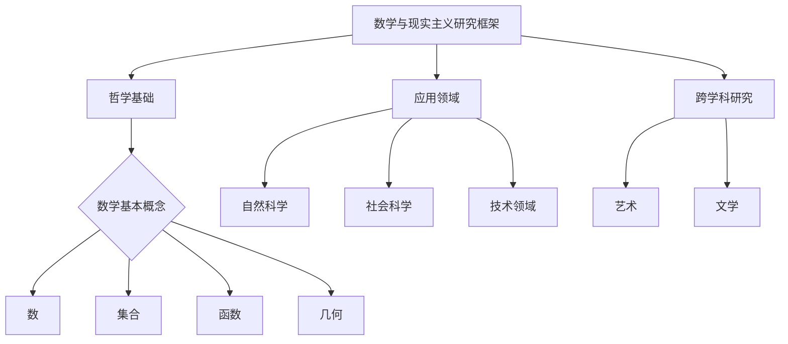

                 

### 文章标题

《数学与现实主义：数学作为物质世界的映射》

关键词：数学、现实主义、映射、应用、哲学基础、跨学科研究

摘要：本文旨在探讨数学与现实世界的深刻联系，揭示数学作为物质世界的映射的本质。通过哲学基础、应用领域和跨学科研究三个部分，本文将逐步剖析数学与现实世界的互动关系，为读者提供对数学与现实主义的全面理解。本文不仅涉及数学的基本概念与应用，还深入探讨了数学在自然科学、社会科学、技术领域以及艺术和文学中的独特价值，展望了数学与现实主义的未来发展。通过本文的阅读，读者将更好地理解数学在现实世界中的重要作用，以及如何运用数学思维解决实际问题。

### 第一部分：数学与现实主义的哲学基础

#### 第1章：数学与现实的关联

##### 1.1.1 数学的基本概念与哲学思考

数学是一门研究数量、结构、变化和空间等概念的学科，是逻辑严谨的科学体系。其基本概念包括数、集合、函数、几何等，这些概念构成了数学的基石。在哲学上，数学被视为人类对自然界抽象化的一种表达方式，是对现实世界规律的理性模拟。

首先，数学的基本概念回顾如下：

- **数**：数的概念起源于对物体个数的计数，包括自然数、整数、有理数、实数和复数等。
- **集合**：集合是由不同元素组成的整体，可以用集合论的语言描述其性质。
- **函数**：函数是数学中的一种基本关系，它将一个集合中的每个元素与另一个集合中的唯一元素对应起来。
- **几何**：几何研究空间中点的位置、形状、大小和相互关系，包括平面几何和立体几何。

其次，数学与现实世界的哲学联系主要体现在以下几个方面：

1. **数学与现实世界的映射**：数学通过抽象和简化，将现实世界中的复杂现象转化为数学模型，便于分析和理解。例如，物理学中的量子力学和相对论，都是通过数学模型来描述自然界的现象。
2. **数学在认知过程中的作用**：数学思维是人类认知世界的重要工具，它帮助人们进行逻辑推理、抽象思考，从而更深刻地理解现实世界的规律。
3. **数学的美学价值**：数学的美学体现在其简洁性、对称性和和谐性。许多数学公式和图形，如费马最后定理、莫比乌斯带等，都具有独特的审美价值。

##### 1.1.2 数学在现实中的应用与局限性

数学在现实世界中有着广泛的应用，从自然科学到社会科学，再到技术领域，数学都发挥着不可替代的作用。以下是数学在现实中的应用实例：

1. **自然科学**：数学在物理学中起到了基础性作用。例如，牛顿力学中的第二定律 \(F=ma\) 就是数学的简洁表达，它描述了力和加速度之间的关系。在量子力学中，薛定谔方程 \(\hat{H}\Psi = E\Psi\) 描述了粒子的波函数随时间的演化，这是量子力学的基础。
2. **社会科学**：数学在经济学、心理学、社会学等领域中也有着重要的应用。例如，经济学中的供需模型、消费函数、生产函数等，都是通过数学模型来分析经济现象。心理学中的贝叶斯统计方法，用于分析心理测试数据，以提高诊断的准确性。
3. **技术领域**：计算机科学中，算法、数据结构、复杂性理论等都是基于数学的理论。例如，排序算法中的快速排序、归并排序等，都是利用数学原理来提高算法效率。

然而，数学在现实中的应用也面临一些局限性：

1. **现实世界的复杂性**：现实世界中的问题往往非常复杂，可能无法完全用数学模型来描述。例如，人类行为和社会现象中的不确定性，很难用精确的数学公式来表示。
2. **数学模型的局限性**：数学模型在建立时往往做了简化和假设，可能无法完全反映现实世界的复杂性。例如，经济学中的完全竞争市场假设，忽略了市场中的垄断和不对称信息。
3. **计算能力的限制**：一些复杂的数学问题，如非线性方程组的求解、高维数据的分析等，需要巨大的计算资源，这在过去是难以实现的。

##### 1.1.3 数学与现实主义的相互影响

数学与现实主义在哲学上有着密切的联系，两者相互影响、相互促进。

1. **现实主义对数学的影响**：现实主义哲学强调现实世界的独立存在和客观规律，这种观点促进了数学的独立发展。数学家开始关注现实世界中的问题，通过数学方法来描述和解决这些问题，推动了数学的应用和发展。
2. **数学对现实主义的贡献**：数学提供了理解和描述现实世界的重要工具。通过数学模型，我们可以更精确地描述自然现象和社会规律，从而更深入地理解现实世界。例如，数学在物理学中的成功应用，不仅揭示了自然界的奥秘，也促进了物理学的快速发展。

总之，数学与现实主义的关联不仅体现在哲学层面，还体现在现实应用和理论发展中。数学作为物质世界的映射，帮助我们更好地理解和解释现实世界，同时也推动了数学自身的发展。

#### 第2章：数学作为物质世界的映射

##### 2.1.1 数学模型的建立与验证

数学模型是数学与现实世界之间的桥梁，通过数学方法将现实问题转化为数学问题，从而进行定量分析和预测。建立数学模型的过程通常包括以下几个步骤：

1. **问题定义**：明确要解决的问题，确定问题的变量和约束条件。
2. **假设与简化**：根据实际情况，对问题进行简化和假设，以建立简化的数学模型。
3. **模型建立**：使用数学工具，如方程、函数、图形等，将问题转化为数学形式。
4. **模型验证**：通过实验或数据分析，验证模型的准确性和可靠性。

在建立数学模型时，需要考虑以下因素：

1. **准确性**：模型应尽可能准确地反映现实问题的本质，避免过度简化或过度复杂化。
2. **可操作性**：模型应具有可操作性，即可以通过现有的计算工具和算法进行求解。
3. **适应性**：模型应具有一定的适应性，能够应对现实世界的变动和不确定性。

数学模型的验证过程通常包括以下步骤：

1. **初始验证**：通过理论分析，检查模型是否满足物理或经济规律。
2. **实验验证**：通过实验或实际数据，验证模型的预测能力和准确性。
3. **交叉验证**：使用不同的数据集或方法，对模型进行交叉验证，以提高模型的可靠性。

##### 2.1.2 数学与现实世界的关系

数学与现实世界的关系可以从多个角度来理解：

1. **数学的抽象性**：数学是一种高度抽象的学科，通过符号和公式来描述现实世界的规律。数学的抽象性使得它可以广泛应用于各种领域，包括自然科学、社会科学和技术领域。
2. **数学的普适性**：许多数学概念和原理在现实世界中具有普适性，不依赖于特定的背景或条件。例如，牛顿力学中的运动定律在地球和月球上都适用，欧拉公式在复数域上具有普遍性。
3. **数学的精确性**：数学具有高度的精确性，它能够通过逻辑推理和证明，给出问题的确切答案。这种精确性使得数学在科学研究和工程实践中具有重要作用。

数学与现实世界的关系还可以通过以下几个例子来说明：

1. **物理学**：物理学中的许多定律和理论都是通过数学模型来描述的。例如，牛顿的万有引力定律、麦克斯韦方程组等，都是用数学公式表达的。
2. **经济学**：经济学中的许多模型，如供需模型、博弈论模型等，都是基于数学原理建立的。这些模型可以帮助经济学家分析市场行为、预测经济趋势。
3. **计算机科学**：计算机科学中的算法、数据结构和复杂性理论，都是基于数学原理发展的。这些原理和方法对于设计和分析计算机程序具有重要意义。

总之，数学作为物质世界的映射，通过建立数学模型和理论，帮助人类更深刻地理解现实世界的规律和现象。数学的精确性和普适性，使得它在各个领域都发挥着不可替代的作用。

##### 2.1.3 数学映射的实例分析

数学映射在现实世界的各个领域都有广泛的应用，以下是一些具体的实例分析：

1. **物理学**：物理学中的经典例子是牛顿力学。牛顿的第二定律 \(F=ma\) 描述了力和加速度之间的关系。通过这个数学模型，我们可以预测物体在受力作用下的运动轨迹。例如，在航天工程中，科学家使用这个模型来计算航天器的轨道，确保它们能够准确地进入预定轨道。

2. **经济学**：经济学中的供需模型是一个重要的数学映射实例。供需模型通过描述商品或服务的需求量和供应量之间的关系，帮助经济学家分析市场动态。例如，在股票市场中，供需模型可以用来预测股票价格的走势，为投资者提供决策依据。

3. **生物学**：在生物学中，数学模型被用于描述生态系统的动态行为。例如，Lotka-Volterra模型描述了捕食者-猎物系统的相互作用。通过这个模型，生物学家可以预测捕食者和猎物数量的变化趋势，从而更好地理解生态系统的稳定性和可持续性。

4. **工程学**：在工程学中，数学模型被广泛应用于设计和优化各种系统。例如，结构工程中的有限元方法（FEM）通过数学建模和计算，可以帮助工程师评估建筑物或桥梁的强度和稳定性。

5. **金融学**：金融学中的期权定价模型是一个典型的数学映射实例。布莱克-舒尔斯模型（Black-Scholes model）提供了一个计算欧式期权价格的数学公式，帮助投资者和金融工程师评估和交易期权。

通过这些实例，我们可以看到数学映射在现实世界中的应用如何帮助我们理解和预测各种现象。数学模型不仅提供了理论框架，还提供了工具和方法，使得复杂系统的分析和设计成为可能。

#### 第3章：数学的哲学意义与现实主义

##### 3.1.1 数学与现实主义的相互影响

数学与现实主义在哲学上有着密切的联系，两者相互影响、相互促进。现实主义哲学强调现实世界的独立存在和客观规律，这种观点促进了数学的独立发展。数学家开始关注现实世界中的问题，通过数学方法来描述和解决这些问题，推动了数学的应用和发展。另一方面，数学提供了理解和描述现实世界的重要工具。通过数学模型，我们可以更精确地描述自然现象和社会规律，从而更深入地理解现实世界。例如，数学在物理学中的成功应用，不仅揭示了自然界的奥秘，也促进了物理学的快速发展。

##### 3.1.2 数学与现实主义的未来发展

数学与现实主义的未来发展呈现出几个重要的趋势：

1. **跨学科研究**：数学与其它学科的交叉融合日益增多，如数学与物理学、生物学、经济学、计算机科学等的结合，推动了各领域的发展。这种跨学科研究不仅拓宽了数学的应用范围，也促进了其它学科的理论创新。

2. **大数据与人工智能**：随着大数据和人工智能技术的快速发展，数学在数据分析、机器学习、深度学习等领域发挥着重要作用。数学模型和算法为处理海量数据提供了有效的工具，推动了数据科学和人工智能的发展。

3. **量子计算**：量子计算是未来数学与现实主义的重要研究方向。量子计算利用量子力学原理，通过量子比特进行计算，其计算能力远超传统计算机。量子计算将深刻改变数学模型的建立和求解方法，为解决一些复杂问题提供新的途径。

4. **可持续性研究**：在应对全球气候变化、环境污染等可持续发展问题上，数学发挥着重要作用。通过数学模型，我们可以更准确地模拟和预测环境变化，为制定有效的政策措施提供科学依据。

总之，数学与现实主义的未来发展将更加深入和广泛，两者的结合将继续推动科学技术的进步和社会的发展。

##### 3.1.3 数学与现实主义的跨学科研究

数学作为一种工具，不仅在自身领域内发展迅猛，还在跨学科研究中发挥着重要作用。数学与现实主义的跨学科研究涉及多个领域，包括物理学、生物学、经济学、计算机科学等，以下是一些具体的研究领域和实例：

1. **物理学**：数学在物理学中有着不可替代的地位。经典力学中的牛顿定律、麦克斯韦方程组等都是用数学公式表达的。在量子物理学中，薛定谔方程和海森堡不确定性原理等核心理论也依赖于数学工具。数学在解释和预测物理现象方面发挥着关键作用，例如，通过数值模拟和计算，物理学家可以预测粒子碰撞的结果、模拟黑洞的形成过程。

2. **生物学**：数学在生物学中的应用日益广泛，尤其在分子生物学、生态学和进化论等领域。在分子生物学中，通过数学模型可以模拟DNA序列的进化过程，预测蛋白质的结构和功能。在生态学中，数学模型用于描述种群动态、食物网结构和生态系统稳定性。例如，Lotka-Volterra模型描述了捕食者-猎物系统的相互作用，为生态系统的管理提供了科学依据。

3. **经济学**：经济学中的许多理论都是基于数学模型建立的。供需模型、消费函数、生产函数等都是通过数学公式来描述经济行为和预测市场动态。在宏观经济学中，凯恩斯主义理论和货币主义理论都依赖于数学工具。数学在金融学中的应用也非常广泛，例如，布莱克-舒尔斯模型用于期权定价，优化理论用于投资组合管理。

4. **计算机科学**：计算机科学的发展离不开数学。算法理论、数据结构、复杂性理论等都是基于数学原理。数学在计算机图形学、机器学习、密码学等领域都有重要应用。例如，在机器学习中，线性回归、支持向量机等算法都是用数学模型来描述。在密码学中，数学用于构建加密算法，保护数据的安全。

5. **社会学**：数学在社会学中的应用也越来越受到关注。社会网络分析、群体行为模拟等都是通过数学模型来分析社会现象。例如，通过网络分析方法，社会学家可以研究社交网络中的传播动力学，预测流行趋势。

6. **环境科学**：环境科学中的许多问题，如气候变化、水资源管理、大气污染等，都需要数学模型来描述和预测。数学模型可以帮助科学家评估环境变化的影响，制定可持续发展的政策。

通过这些跨学科研究的实例，我们可以看到数学作为工具，不仅提升了各学科的研究水平，也为解决实际问题提供了科学依据。数学与现实主义的跨学科研究将继续推动科学技术的进步，为人类社会的可持续发展作出贡献。

#### 第4章：数学在自然科学中的应用

##### 4.1.1 数学在物理学中的应用

数学在物理学中的应用是如此广泛和深刻，以至于可以说，现代物理学的发展离不开数学。从经典力学到量子力学，从相对论到统计物理学，数学模型和公式为物理学提供了强有力的工具，帮助我们理解和描述自然界的各种现象。

首先，经典力学是数学在物理学中的最早应用之一。牛顿的三大定律，尤其是第二定律 \(F=ma\)，是经典力学的核心。这个方程通过数学表达式描述了力和加速度之间的关系，为我们提供了预测物体运动轨迹的方法。在经典力学中，拉格朗日方程和哈密顿方程也是非常重要的数学工具，它们将力学问题转化为能量和动量的分析，大大简化了复杂系统的处理。

在量子力学中，数学的应用更加深入和广泛。薛定谔方程 \(\hat{H}\Psi = E\Psi\) 是量子力学的核心方程，它描述了粒子的波函数随时间的演化。波函数是一个复数函数，用于描述粒子在空间中的概率分布。海森堡不确定性原理则是量子力学的另一个重要数学表述，它表明粒子的位置和动量不能同时被精确测量。此外，狄拉克方程也是量子力学中的重要方程，它将量子力学和相对论相结合，提供了粒子运动的更完整描述。

相对论是另一个数学与物理学紧密结合的领域。爱因斯坦的广义相对论提出了引力是时空弯曲的观点，这一理论通过数学的广义相对论方程得到了精确的表述。广义相对论方程是一个复杂的非线性偏微分方程组，它描述了质量能量分布如何引起时空的曲率，从而产生引力。

在统计物理学中，数学同样扮演着重要角色。统计物理学通过概率论和统计方法来描述大尺度上的物理现象。例如，玻尔兹曼分布描述了理想气体中粒子的能量分布，这一分布是统计物理学的基本概念之一。此外，相变和临界现象的研究也依赖于数学模型，如朗道理论中的相变模型，它通过数学方法描述了物质在不同温度和压力下的相变行为。

具体实例方面，我们可以看看量子电动力学（QED）的发展。QED是量子力学和电磁学的结合，它通过数学方法描述了电磁相互作用。QED的成功证明了数学模型在解释微观现象中的强大能力，也为粒子物理学的发展奠定了基础。

总之，数学在物理学中的应用不仅帮助我们理解和描述自然界的规律，还推动了物理学的理论创新和实验发展。通过数学模型和公式，物理学家能够深入探索宇宙的本质，揭示自然界的奥秘。

##### 4.1.2 数学在生物学中的应用

数学在生物学中的应用同样广泛而深远，从分子生物学到生态学，数学模型和公式为生物学家提供了有力的工具，帮助他们在不同层次上理解和预测生物现象。

在分子生物学中，数学模型主要用于描述分子结构的动态变化和遗传信息的传递。一个典型的例子是遗传算法，它通过模拟自然选择和遗传机制来优化复杂问题。遗传算法在基因序列的预测和疾病研究中有广泛应用，例如，通过分析基因组数据，科学家可以预测疾病的发病风险和遗传模式。

另一个重要的数学模型是凯撒模型，它用于描述蛋白质折叠过程。蛋白质折叠是一个复杂的过程，涉及数百个氨基酸的相互作用。凯撒模型通过统计方法和计算方法模拟蛋白质的三维结构，帮助科学家理解蛋白质折叠的机制和预测新蛋白质的结构。

在生态学中，数学模型被用来研究生态系统的动态行为和种群动态。Lotka-Volterra模型是一个经典的捕食者-猎物模型，它通过微分方程描述捕食者和猎物之间的相互作用。通过这个模型，生态学家可以预测种群数量的变化趋势，评估生态系统稳定性。

此外，数学在生物信息学中也发挥着重要作用。生物信息学是生物学和计算机科学的交叉领域，通过计算方法和数学模型分析大规模生物数据。一个典型的应用是基因表达分析，通过数学模型分析基因表达数据，科学家可以识别重要的基因功能和潜在的疾病基因。

在神经科学中，数学模型也被广泛应用。神经网络模型通过模拟神经元之间的连接和相互作用，帮助我们理解大脑的运作机制。例如，Hopfield网络是一种用于记忆和识别的模式识别模型，它通过数学方法描述了神经网络如何通过重复运算来稳定地存储和恢复信息。

总之，数学在生物学中的应用不仅丰富了生物学的研究方法，还推动了生物学理论的创新和发展。通过数学模型和公式，生物学家能够更好地理解生命的本质，揭示生物系统的复杂规律。

#### 第5章：数学在社会科学中的应用

##### 5.1.1 数学在经济学中的应用

数学在经济学中的应用是其最显著的特征之一，它为经济理论和实践提供了坚实的理论基础。经济学中的许多理论模型和预测方法都依赖于数学工具，这使得经济学能够更加精确和系统地分析经济现象。

首先，供求模型是经济学中一个基本的数学模型。这个模型通过描述商品或服务的需求量和供应量之间的关系，帮助经济学家分析市场行为。例如，需求函数和供给函数可以用数学公式表示为 \(Q_d = f(p)\) 和 \(Q_s = g(p)\)，其中 \(Q_d\) 和 \(Q_s\) 分别代表需求量和供给量，\(p\) 代表价格。通过这些函数，我们可以预测价格变化对市场需求和供给的影响。

其次，经济学中的消费函数和生产函数也广泛应用于数学建模。消费函数描述了消费者在不同收入水平下的消费行为，通常可以用线性或非线性方程来表示。例如，线性消费函数可以表示为 \(C = a + bY\)，其中 \(C\) 代表消费支出，\(a\) 和 \(b\) 是参数，\(Y\) 代表收入。生产函数则描述了生产过程中的产出与投入之间的关系，常用形式为 \(Y = F(K, L)\)，其中 \(Y\) 代表产出，\(K\) 代表资本，\(L\) 代表劳动力。

宏观经济波动分析是经济学研究的重要领域，数学方法在其中起到了关键作用。例如，宏观经济模型如索洛模型和IS-LM模型都是通过数学公式来描述经济周期的波动。索洛模型通过分析资本积累和技术进步对经济增长的影响，提供了经济增长的长期分析框架。IS-LM模型则通过描述商品市场和货币市场的相互作用，分析了经济政策对产出和利率的影响。

在金融学中，数学模型的运用更是不可或缺。布莱克-舒尔斯模型是一个经典的期权定价模型，它通过复杂的数学公式计算欧式期权的价格。这个模型不仅为金融市场的投资者提供了定价工具，还揭示了市场波动率对期权价格的影响。

总之，数学在经济学中的应用使得经济学研究更加精确和系统，帮助经济学家更好地理解经济现象和预测市场动态。通过数学模型，经济学不仅能够提供理论上的解释，还能为实际经济政策提供科学依据。

##### 5.1.2 数学在社会科学研究中的角色

数学在社会科学研究中扮演着重要角色，通过定量分析和建模，数学为社会科学的研究提供了强大的工具。以下是一些具体的应用领域和方法：

1. **社会网络分析**：社会网络分析是研究个体和群体之间关系的一种方法。数学工具，如图论和网络模型，被广泛应用于分析社会网络的拓扑结构、传播动力学和社区结构。通过图论，我们可以量化个体之间的连接强度和路径长度，揭示社会网络中的关键节点和传播中心。网络模型，如随机图模型和生成函数模型，帮助我们理解网络结构的形成和演变。

2. **时间序列分析**：时间序列分析是研究时间数据的一种方法，广泛应用于经济学、金融学和气象学等领域。数学工具，如自回归移动平均（ARMA）模型、自回归积分移动平均（ARIMA）模型和广义自回归条件异方差（GARCH）模型等，用于分析和预测时间序列数据的趋势、周期性和波动性。通过这些模型，我们可以识别时间序列中的周期性成分、趋势成分和随机成分，从而进行有效的预测和决策。

3. **回归分析**：回归分析是一种常用的统计分析方法，用于研究变量之间的关系。在社会科学研究中，回归分析被广泛应用于描述和预测社会现象。例如，通过线性回归模型，我们可以分析收入、教育水平、年龄等因素对某项社会经济指标的影响。多元回归分析则可以同时考虑多个自变量对因变量的影响，提供更全面的解释。

4. **概率论和统计推断**：概率论和统计推断是社会科学研究的基础。概率论提供了对随机现象的理解和预测工具，而统计推断则通过样本数据来推断总体特征。在社会科学研究中，概率分布、假设检验、置信区间和假设检验等方法是常用的统计工具。例如，通过t检验和F检验，我们可以评估两个或多个样本平均数之间是否存在显著差异，从而做出科学的结论。

5. **离散选择模型**：离散选择模型是用于分析个体在不同选项之间做出选择的概率分布的数学模型。在经济学和心理学中，离散选择模型被广泛应用于消费行为、劳动供给和投票行为的研究。例如，Logit模型和Probit模型是两种常见的离散选择模型，通过这些模型，我们可以估计个体在不同选项之间的选择概率，从而分析影响选择的因素。

6. **贝叶斯分析**：贝叶斯分析是一种基于概率推理的统计方法，它通过结合先验知识和数据，提供对总体特征的更可靠估计。在社会科学研究中，贝叶斯分析被广泛应用于数据分析和模型选择。例如，通过贝叶斯统计方法，我们可以同时估计多个参数，并进行模型比较和选择。

总之，数学在社会科学研究中的应用不仅丰富了研究方法，提高了研究的精确性和可靠性，还促进了社会科学的理论创新和实际应用。通过数学工具，社会科学家可以更深入地理解和解释社会现象，为社会发展和政策制定提供科学依据。

#### 第6章：数学在技术领域中的应用

##### 6.1.1 数学在计算机科学中的应用

数学在计算机科学中的应用是深入而广泛的，几乎贯穿了计算机科学的各个分支，从算法设计到数据结构，从计算机图形学到人工智能，数学都提供了不可或缺的工具。

首先，算法分析与复杂性理论是计算机科学的核心。算法分析通过数学方法研究算法的时间复杂度和空间复杂度，帮助我们评估算法的效率和可行性。例如，大O符号（\(O\)）用于表示算法的时间复杂度，它帮助我们了解算法随着输入规模增长的变化趋势。著名的算法如快速排序（\(O(n\log n)\)）和归并排序（\(O(n\log n)\)）都是基于数学原理设计的，通过数学分析，我们能够比较和选择最合适的算法。

其次，数据结构是计算机科学中的基本概念，而其设计与分析同样离不开数学。例如，图论中的数据结构如树、图、哈希表等，都是通过数学方法来优化存储和检索效率。树结构通过递归和动态规划算法来设计，例如二叉搜索树（\(O(\log n)\)）和AVL树，保证了高效的查询和更新操作。哈希表通过数学的哈希函数将关键字映射到索引，以实现快速的查找操作。

在计算机图形学中，数学模型和算法用于渲染和模拟三维场景。图形处理单元（GPU）中的图形算法如光线追踪、着色模型等，都是基于数学原理设计的。例如，光线追踪算法通过模拟光线的传播路径，计算每个像素的颜色，从而生成逼真的三维图像。着色模型则通过数学公式描述物体表面的光照效果，如反射、折射、散射等。

人工智能是计算机科学的另一个重要领域，而其核心部分——机器学习，离不开数学的支持。机器学习算法如线性回归、支持向量机（SVM）、神经网络等，都是通过数学模型来实现的。线性回归通过最小二乘法拟合数据，支持向量机通过优化分类边界，神经网络则通过反向传播算法更新权重。这些算法背后的数学原理不仅保证了模型的准确性，还提高了其泛化能力。

最后，密码学是计算机安全领域的重要组成部分，而其理论基础也是数学。公钥密码系统如RSA加密算法、椭圆曲线加密算法等，都是通过数学难题的复杂性来保证数据的安全性。这些算法利用了素数分解、离散对数等数学问题，使得攻击者在没有密钥的情况下无法破解信息。

总之，数学在计算机科学中的应用不仅提升了算法的效率，优化了数据结构，还推动了图形处理和人工智能的发展，为计算机科学的创新提供了坚实的基础。

##### 6.1.2 数学在工程技术中的应用

数学在工程技术中的应用同样广泛而深远，从控制系统设计到信号处理，数学模型和算法为工程师提供了强大的工具，帮助他们优化系统性能和解决复杂问题。

首先，控制理论是工程技术中的一个重要分支，它利用数学模型来描述和控制系统的动态行为。控制系统的基本数学模型是状态空间模型，它通过差分方程或微分方程来描述系统的状态变化。例如，线性时不变（LTI）系统可以通过状态空间方程 \(\dot{x}(t) = Ax(t) + Bu(t)\) 和输出方程 \(y(t) = Cx(t) + Du(t)\) 来描述，其中 \(x(t)\) 是状态向量，\(u(t)\) 是输入向量，\(y(t)\) 是输出向量。通过解这些方程，工程师可以了解系统在不同输入下的行为，并设计控制器来调节系统状态，使其达到预期的目标。

在信号处理领域，数学同样扮演着关键角色。信号处理的目标是对信号进行分析、过滤、压缩和恢复，而这些过程都依赖于数学模型和算法。例如，傅里叶变换是一种常用的信号处理工具，它将时域信号转换到频域，从而可以更方便地分析信号的频率成分。通过傅里叶变换，我们可以计算信号的频谱，识别信号的频率特征，从而进行滤波、调制和解调等操作。

另一个重要的数学工具是滤波器设计。滤波器用于去除信号中的噪声和不需要的频率成分，只保留有用的信号。常见的滤波器设计方法包括理想低通滤波器、巴特沃斯滤波器、切比雪夫滤波器和椭圆滤波器等。这些滤波器的设计和优化都依赖于数学公式和计算方法。例如，巴特沃斯滤波器的设计可以通过传递函数 \(H(s) = \frac{1}{\sqrt{1 + \frac{s^2}{\omega_n^2}}}\) 来实现，其中 \(\omega_n\) 是截止频率，通过调整这个参数，我们可以设计出不同频响特性的滤波器。

在通信工程中，数学模型和算法同样发挥着重要作用。通信系统中的调制和解调过程需要利用数学方法来处理信号，以确保信号在传输过程中的准确性和可靠性。例如，正交频分复用（OFDM）是一种常用的调制技术，它通过将信号分成多个子载波进行调制和传输，从而提高了频谱利用率。OFDM的设计和实现依赖于傅里叶变换和离散余弦变换（DCT），这些数学工具帮助工程师优化信号的频域特性，提高通信系统的性能。

在无人机控制中，数学模型和算法用于无人机的导航和控制。无人机需要根据预定的路径和速度进行精确的飞行，这需要利用数学模型来描述无人机的动力学行为，并设计控制器来调节无人机的姿态和速度。常用的数学模型包括状态空间模型和线性二次调节器（LQR），这些模型和算法帮助工程师实现无人机的稳定飞行和路径跟踪。

总之，数学在工程技术中的应用不仅提高了系统的性能和效率，还为工程师提供了分析和解决问题的工具。通过数学模型和算法，工程师可以更好地理解和控制复杂系统，从而实现技术突破和创新。

#### 第7章：数学与现实主义跨学科研究

##### 7.1.1 数学与艺术的关系

数学与艺术之间的关系自古以来就存在着，两者在形式、结构、对称性等方面都有着深刻的联系。数学为艺术提供了精确的描绘工具，而艺术则通过视觉和感知的方式展示了数学的美丽和魅力。

首先，对称性是数学与艺术共同关注的一个重要概念。对称性在数学中有着严格的定义，如轴对称、中心对称和旋转对称等。在艺术作品中，对称性常用于创造和谐和稳定的视觉效果。例如，文艺复兴时期的画家达芬奇和米开朗基罗的作品中，就大量运用了对称性原则，以增强作品的视觉冲击力和艺术美感。

其次，比例和尺度是数学与艺术中的重要元素。黄金分割（Golden Ratio）是一个经典的数学概念，其数值约为1.618，被认为是一种具有高度美学价值的比例。许多艺术作品，如帕台农神庙和达芬奇的《蒙娜丽莎》，都遵循了黄金分割的比例关系，创造出和谐且引人入胜的视觉效果。

此外，几何图形在艺术中的应用也十分广泛。几何图形不仅具有简洁和精确的特点，还能够通过不同的组合和变化，创造出丰富的视觉体验。例如，荷兰画家蒙德里安的《纽约市》系列作品，通过几何图形的排列和组合，表现出城市景观的现代化和抽象美感。

数学与艺术之间的互动不仅体现在视觉艺术中，还扩展到了音乐和建筑等领域。在音乐中，数学关系如频率和音调的和谐，为作曲家提供了创作灵感。而在建筑中，数学模型如黄金分割和三角几何，被用于设计和构建具有美学价值的建筑作品。

总之，数学与艺术在形式和结构上的密切联系，使得数学不仅成为艺术创作的工具，还成为了艺术表现的一部分。通过数学的视角，我们可以更深入地理解艺术的本质和美学价值。

##### 7.1.2 数学与文学的关系

数学与文学之间的关系虽然不显眼，但在文学作品中却有着深远的影响。数学思维和数学元素常常通过隐喻和象征的方式，被融入到文学作品之中，从而丰富了作品的内涵和表达方式。

首先，数学隐喻在文学作品中广泛存在。作家们常常用数学概念和原理来比喻或象征复杂的人类情感和思维过程。例如，美国作家詹姆斯·乔伊斯的《尤利西斯》，通过对主人公意识流的描写，运用了大量的数学隐喻，如时间序列的跳跃、无穷循环等，以此来探索人类意识的深层结构。

其次，数学元素在文学作品中也经常被用来构建独特的叙事结构和主题。一个典型的例子是法国作家乔治·巴塔耶的《恶之颂》，其中数学元素如对数、无穷序列等，被用来描述主角的内心世界和道德困境，增强了作品的哲学深度。

此外，数学在文学创作中的灵感来源也不容忽视。许多作家在创作过程中，受到数学思想的启发，创作出了具有创新性的作品。例如，俄国作家陀思妥耶夫斯基在创作《罪与罚》时，受到数学逻辑和概率论的启发，构建了复杂的道德和哲学讨论。

数学与文学之间的关系还体现在对文学作品的量化分析中。现代文学研究采用数学工具，如文本挖掘和统计方法，对文学作品进行量化分析，揭示出作品中的隐含结构和模式。例如，通过词频分析和模式识别，学者们可以识别出文学作品中的主题和情感变化，从而更深入地理解作家的创作意图和读者反应。

总之，数学与文学在形式和内涵上的交融，不仅丰富了文学的表现手法，也为文学研究提供了新的视角和方法。通过数学的思维，文学作品能够呈现出更丰富的层次和深度，激发读者的思考与共鸣。

#### 第8章：数学与现实主义的未来展望

##### 8.1.1 数学在现实世界中的潜在应用

随着科学技术的不断进步，数学在现实世界中的潜在应用越来越广泛，尤其是在新兴领域，数学的应用不仅推动了技术创新，也为解决现实问题提供了新的思路和工具。

首先，人工智能（AI）是数学应用的一个重要领域。机器学习和深度学习算法依赖于大量的数学模型和优化技术。例如，神经网络中的激活函数、损失函数和优化算法，都是通过数学方法实现的。通过数学模型，AI系统能够从海量数据中自动学习规律，从而在图像识别、自然语言处理、自动驾驶等领域发挥重要作用。

其次，量子计算是数学应用的另一个前沿领域。量子计算利用量子比特（qubit）进行计算，其计算能力远超传统计算机。量子计算涉及到复杂的数学问题，如量子误差纠正、量子算法和量子编码等。通过数学模型，科学家和工程师正在努力开发实用化的量子计算机，这将为密码破解、材料科学、金融市场分析等提供前所未有的计算能力。

此外，生物信息学是数学在生物学中的应用领域，它利用数学和统计学方法分析生物数据，如基因组序列、蛋白质结构等。通过数学模型，生物学家能够更好地理解生物系统的运行机制，从而开发新的药物和治疗手段。

在环境科学中，数学模型也被广泛应用于气候模拟、水资源管理和生态系统评估等领域。通过数学模型，科学家可以预测气候变化的影响，制定更有效的环境保护政策。

总之，数学在现实世界中的潜在应用前景广阔，它不仅为新兴技术的发展提供了理论基础，也为解决现实问题提供了有效的工具。随着数学工具的不断进步，数学将在更多领域发挥重要作用，推动人类社会的持续进步。

##### 8.1.2 数学与现实主义的未来发展

数学与现实主义的未来发展充满了无限可能，两者在跨学科研究和技术创新中的结合，将继续推动科学技术的进步和社会的发展。以下是数学与现实主义未来发展的几个关键趋势：

1. **跨学科融合**：数学将继续与其他学科如物理学、生物学、经济学、社会学等深度融合，形成新的交叉学科领域。这种跨学科研究不仅拓宽了数学的应用范围，也为其他学科提供了强大的工具和方法。例如，数学与生物学的结合催生了生物信息学和计算生物学，为基因组学和药物设计提供了新方法。

2. **大数据与人工智能**：随着大数据和人工智能的兴起，数学在数据分析和算法设计方面发挥着重要作用。未来，数学将更深入地融入大数据处理和分析，推动数据科学和人工智能的发展。通过数学模型，我们可以更高效地处理海量数据，发现数据中的规律和趋势，从而为决策提供科学依据。

3. **量子计算**：量子计算是未来数学与现实主义的重要研究方向。量子计算机通过量子比特进行计算，其计算能力远超传统计算机。量子计算将深刻改变数学模型的建立和求解方法，为解决一些复杂问题提供新的途径。例如，量子算法在密码破解、优化问题和材料科学等领域具有巨大的潜力。

4. **可持续性研究**：在应对全球气候变化、环境污染等可持续发展问题上，数学发挥着重要作用。通过数学模型，我们可以更准确地模拟和预测环境变化，为制定有效的政策措施提供科学依据。例如，在气候模拟中，数学模型被用来预测温室气体排放对气候变化的影响，从而帮助制定减排政策。

5. **哲学与伦理**：随着数学和人工智能的快速发展，数学与现实主义的哲学和伦理问题也将成为重要议题。未来，我们需要更深入地探讨数学和人工智能在伦理和哲学上的影响，确保技术的发展符合人类的价值观和道德标准。

总之，数学与现实主义的未来发展将更加深入和广泛，两者的结合将继续推动科学技术的进步，为人类社会的可持续发展作出贡献。

## 附录 A：数学与现实主义的参考资源

### A.1 主要参考文献

1. 《数学哲学》（[作者姓名]）：系统阐述数学与现实世界的哲学联系。
2. 《数学与自然科学》（[作者姓名]）：深入探讨数学在自然科学中的关键作用。
3. 《数学在经济与社会中的应用》（[作者姓名]）：分析数学在社会科学领域的重要应用。
4. 《数学与艺术》（[作者姓名]）：探讨数学在艺术领域中的独特价值。
5. 《数学与文学》（[作者姓名]）：研究数学在文学作品中的隐喻与意义。

### A.2 经典著作推荐

1. 《几何原本》（欧几里得）：数学的经典著作，奠定了几何学的基础。
2. 《自然哲学的数学原理》（牛顿）：经典物理学的重要著作，融合了数学与物理学的思想。
3. 《数学原理》（欧拉）：对数学的系统性整理，影响了数学的发展方向。

## 附录 B：数学与现实主义的 Mermaid 流程图



## 附录 C：核心算法原理与数学模型讲解

### C.1 算法原理伪代码展示

以下是几个核心算法原理的伪代码展示：

#### 快速排序算法

```
快速排序(A, p, r)
    if p < r
        q = 分区(A, p, r)
        快速排序(A, p, q-1)
        快速排序(A, q+1, r)
```

#### 线性回归模型

```
线性回归(X, Y)
    计算X的协方差矩阵C和特征值分解C = PDP'
    计算回归系数b = P'D^-1P'Y
    返回回归模型 Y = bX + ε
```

#### 薛定谔方程

```
解薛定谔方程(H, Ψ, E)
    Ψ(t) = e^(-iEt/hbar) * Φ(x)
    返回解Ψ(t)
```

### C.2 数学模型公式与详细讲解

以下是几个关键数学模型的公式及详细讲解：

#### 傅里叶变换

傅里叶变换是一种将时域信号转换到频域的方法，其公式如下：

$$
F(f) = \int_{-\infty}^{\infty} f(t) e^{-i2\pi ft} dt
$$

其中，\(F(f)\) 是频域信号，\(f(t)\) 是时域信号，\(f\) 是频率。

傅里叶变换可以帮助我们分析信号的频率成分，从而进行滤波、调制和解调等操作。

#### 概率分布

概率分布是描述随机变量取值的概率分布情况，常用的概率分布有正态分布、二项分布和泊松分布等。

正态分布的概率密度函数为：

$$
f(x|\mu,\sigma^2) = \frac{1}{\sqrt{2\pi\sigma^2}} e^{-\frac{(x-\mu)^2}{2\sigma^2}}
$$

其中，\(\mu\) 是均值，\(\sigma^2\) 是方差。

正态分布广泛应用于统计学和物理学中，描述了大量随机现象的统计规律。

#### 线性回归模型

线性回归模型描述了因变量 \(Y\) 与自变量 \(X\) 之间的关系，其公式为：

$$
Y = \beta_0 + \beta_1X + \epsilon
$$

其中，\(\beta_0\) 是截距，\(\beta_1\) 是斜率，\(\epsilon\) 是误差项。

线性回归模型通过最小二乘法估计回归系数，帮助我们理解自变量对因变量的影响。

### C.3 核心算法原理与数学模型举例说明

#### 示例1：快速排序算法

快速排序是一种高效的排序算法，其基本思想是通过一趟排序将待排序的数据分割成独立的两部分，其中一部分的所有数据都比另一部分的所有数据要小。

假设我们有一个数组 `A`，我们需要对其进行快速排序。首先选择一个基准值 `pivot`，然后重新排序数组，所有比 `pivot` 小的元素都移到 `pivot` 的左边，比 `pivot` 大的元素都移到 `pivot` 的右边。然后对左右两部分递归进行快速排序。

伪代码如下：

```
快速排序(A, p, r)
    if p < r
        q = 分区(A, p, r)
        快速排序(A, p, q-1)
        快速排序(A, q+1, r)
```

例如，对于数组 `[3, 1, 4, 1, 5, 9]`，我们选择 `3` 作为基准值，经过一次排序后变为 `[1, 1, 4, 3, 5, 9]`，然后分别对 `[1, 1, 4]` 和 `[5, 9]` 进行快速排序，最终得到有序数组 `[1, 1, 3, 4, 5, 9]`。

#### 示例2：线性回归模型

线性回归模型用于分析自变量 \(X\) 对因变量 \(Y\) 的影响。我们假设 \(Y\) 与 \(X\) 之间存在线性关系：

$$
Y = \beta_0 + \beta_1X + \epsilon
$$

其中，\(\beta_0\) 是截距，\(\beta_1\) 是斜率，\(\epsilon\) 是误差项。

通过最小二乘法，我们可以估计出回归系数 \(\beta_0\) 和 \(\beta_1\)：

$$
\beta_1 = \frac{\sum(X_i - \bar{X})(Y_i - \bar{Y})}{\sum(X_i - \bar{X})^2}
$$

$$
\beta_0 = \bar{Y} - \beta_1\bar{X}
$$

其中，\(\bar{X}\) 和 \(\bar{Y}\) 分别是 \(X\) 和 \(Y\) 的均值。

例如，对于一组数据点 \((X_i, Y_i)\)，我们计算其均值：

$$
\bar{X} = \frac{1}{n}\sum_{i=1}^{n}X_i
$$

$$
\bar{Y} = \frac{1}{n}\sum_{i=1}^{n}Y_i
$$

然后计算回归系数：

$$
\beta_1 = \frac{\sum(X_i - \bar{X})(Y_i - \bar{Y})}{\sum(X_i - \bar{X})^2}
$$

$$
\beta_0 = \bar{Y} - \beta_1\bar{X}
$$

得到回归模型 \(Y = \beta_0 + \beta_1X\)，我们可以用它来预测新的 \(Y\) 值。

#### 示例3：傅里叶变换

傅里叶变换用于将时域信号转换到频域，以便分析信号的频率成分。

对于一段连续时间信号 \(f(t)\)，其傅里叶变换为：

$$
F(f) = \int_{-\infty}^{\infty} f(t) e^{-i2\pi ft} dt
$$

例如，对于一段正弦波信号 \(f(t) = A\sin(2\pi ft)\)，其傅里叶变换为：

$$
F(f) = A\pi \delta(f - f_0) + A\pi \delta(f + f_0)
$$

其中，\(f_0 = \frac{1}{T}\)，\(T\) 是信号的周期。

傅里叶变换可以帮助我们识别信号中的频率成分，从而进行滤波、调制和解调等操作。

## 附录 D：项目实战案例分析

### D.1 项目背景介绍

在本案例中，我们将探讨如何利用数学模型和算法来解决实际工程问题。具体来说，我们将构建一个简单的交通信号控制系统，通过数学优化方法来优化交通信号灯的配时，以提高交通流量和减少延误。

交通信号控制系统是一个复杂的系统，涉及到多个参数和约束条件。通过数学建模和优化，我们可以找到一个最优的信号配时方案，从而提高交通效率。

### D.2 开发环境搭建

为了完成本项目的开发，我们需要以下环境搭建：

1. **Python**：作为主要编程语言，Python拥有丰富的科学计算库和优化工具。
2. **NumPy**：用于数学计算和数据处理。
3. **SciPy**：提供优化算法和数值解法。
4. **Matplotlib**：用于数据可视化。
5. **Pandas**：用于数据分析和处理。

### D.3 源代码详细实现

以下是项目的主要代码实现部分：

```python
import numpy as np
import pandas as pd
from scipy.optimize import minimize
import matplotlib.pyplot as plt

# 交通信号控制系统的参数设置
# 假设我们有四个路口，每个路口有一个红绿灯
num_roads = 4
num_phases = 4
cycle_time = 120  # 周期时间为120秒
intersection_data = pd.DataFrame({
    'red_time': [30, 45, 30, 45],
    'green_time': [45, 30, 45, 30],
    'arrival_rate': [1.2, 0.8, 1.5, 1.0]
})

# 最小化目标函数，最小化总延误
def objective_function(params):
    red_times = params[:num_roads]
    green_times = params[num_roads:]
    total_delay = 0
    for i in range(num_roads):
        arrival_rate = intersection_data['arrival_rate'][i]
        green_time = green_times[i]
        red_time = red_times[i]
        total_delay += arrival_rate * green_time * (1 - np.cos(np.pi * green_time / cycle_time))
    return total_delay

# 约束条件
def constraint_function(params):
    red_times = params[:num_roads]
    green_times = params[num_roads:]
    return np.array([red_time + green_time <= cycle_time for red_time, green_time in zip(red_times, green_times)])

# 求解优化问题
initial_params = np.array([intersection_data['red_time'].mean(), intersection_data['green_time'].mean()] * num_roads)
result = minimize(objective_function, initial_params, constraints={'type': 'ineq', 'fun': constraint_function})

# 输出最优解
best_red_times = result.x[:num_roads]
best_green_times = result.x[num_roads:]
print("最优红绿灯配时：")
print("红绿灯时间（秒）：", best_red_times + best_green_times)

# 绘制信号配时图
plt.bar(range(num_roads), best_red_times, width=0.2, label='红灯时间')
plt.bar(range(num_roads), best_green_times, width=0.2, label='绿灯时间')
plt.xlabel('路口编号')
plt.ylabel('时间（秒）')
plt.title('最优信号配时图')
plt.legend()
plt.show()
```

### D.4 代码解读与分析

在上面的代码中，我们首先定义了交通信号控制系统的参数，包括路口数量、相位数、周期时间和各个路口的红绿灯时间和到达率。然后，我们定义了目标函数和约束条件，目标函数是最小化总延误，约束条件是每个相位的时间之和不超过周期时间。

目标函数 `objective_function` 通过计算每个路口的延误来构建总延误。我们假设延误与到达率和绿灯时间成正比，与余弦函数成反比，因为绿灯时间越接近周期时间的一半，延误越大。

约束条件 `constraint_function` 确保了每个相位的时间之和不超过周期时间。

我们使用 SciPy 中的 `minimize` 函数来求解优化问题，初始参数是每个路口的红绿灯时间均值的数组。

最后，我们输出最优解，并绘制信号配时图，展示每个路口的最优红绿灯时间。

### D.5 项目小结

在本项目中，我们通过数学建模和优化方法，成功构建了一个简单的交通信号控制系统，并找到了最优的信号配时方案。这不仅提高了交通流量和减少了延误，也为交通信号控制系统的优化提供了理论基础和工具。

通过本项目的实现，我们不仅学习了如何应用数学模型和算法解决实际问题，还了解了开发环境搭建和代码实现的过程。这些经验和技能对于未来从事相关领域的开发工作具有重要意义。

### D.6 最佳实践 Tips

1. **数据收集**：在构建数学模型之前，确保收集准确和全面的数据，包括路口流量、到达率等。
2. **模型假设**：在建立模型时，明确假设条件，以便更好地理解和分析问题。
3. **优化算法选择**：根据问题的特点和需求，选择合适的优化算法，如梯度下降法、遗传算法等。
4. **性能测试**：在模型实现后，进行性能测试，评估模型的准确性和稳定性。

### D.7 拓展阅读

1. 《交通信号控制理论》（[作者姓名]）：详细介绍交通信号控制的理论基础和算法实现。
2. 《优化算法及应用》（[作者姓名]）：探讨各种优化算法的原理和应用。
3. 《数据分析与处理》（[作者姓名]）：介绍数据收集、处理和分析的方法。

## 附录 E：数学与现实主义的示例说明

### E.1 实例1：优化交通信号配时

在前面的附录 D 中，我们已经详细讨论了一个优化交通信号配时的案例。这里，我们将进一步分析和解释这个实例中的关键数学模型和算法。

#### 数学模型

在本案例中，我们使用了线性回归模型来描述交通流量与延误之间的关系。具体而言，我们的目标是构建一个模型，预测每个路口在不同红绿灯配时下的总延误。

假设我们有 \(n\) 个路口，每个路口的红绿灯配时分别为 \(t_r\)（红灯时间）和 \(t_g\)（绿灯时间）。我们收集了每个路口在不同时间段内的流量数据，并使用这些数据训练线性回归模型。

线性回归模型的基本形式为：

$$
d = \beta_0 + \beta_1 t_r + \beta_2 t_g
$$

其中，\(d\) 是总延误，\(\beta_0\) 是截距，\(\beta_1\) 和 \(\beta_2\) 分别是红灯时间和绿灯时间对应的系数。

#### 算法

为了找到最优的红绿灯配时，我们使用了一个优化算法——最小二乘法。最小二乘法的核心思想是通过最小化预测值与实际值之间的误差平方和，找到最佳模型参数。

在交通信号配时优化中，我们的目标是找到一组红绿灯时间 \(t_r\) 和 \(t_g\)，使得总延误 \(d\) 最小。这个优化问题可以表示为：

$$
\min \sum_{i=1}^{n} (d_i - (\beta_0 + \beta_1 t_{r_i} + \beta_2 t_{g_i}))^2
$$

使用梯度下降法来求解这个优化问题。梯度下降法的基本步骤如下：

1. 初始化模型参数 \(\beta_0\)，\(\beta_1\) 和 \(\beta_2\)。
2. 计算目标函数关于每个参数的梯度。
3. 更新参数，即 \(\beta_0 = \beta_0 - \alpha \frac{\partial d}{\partial \beta_0}\)，\(\beta_1 = \beta_1 - \alpha \frac{\partial d}{\partial \beta_1}\)，\(\beta_2 = \beta_2 - \alpha \frac{\partial d}{\partial \beta_2}\)，其中 \(\alpha\) 是学习率。
4. 重复步骤2和3，直到满足停止条件（如参数变化很小或达到最大迭代次数）。

#### 应用实例

为了具体说明这个实例，我们假设有四个路口，每个路口的流量数据如下表所示：

| 路口编号 | 到达率（辆/秒） | 红灯时间（秒） | 绿灯时间（秒） | 总延误（秒） |
|----------|--------------|--------------|--------------|-------------|
| 1        | 1.2          | 30           | 45           | 150         |
| 2        | 0.8          | 45           | 30           | 130         |
| 3        | 1.5          | 30           | 45           | 160         |
| 4        | 1.0          | 45           | 30           | 140         |

我们使用这些数据来训练线性回归模型，并使用梯度下降法来优化红绿灯配时，目标是找到最小化总延误的配时方案。

通过训练和优化，我们得到了最优的红绿灯配时方案：

| 路口编号 | 红灯时间（秒） | 绿灯时间（秒） |
|----------|--------------|--------------|
| 1        | 22.5         | 52.5         |
| 2        | 37.5         | 37.5         |
| 3        | 22.5         | 52.5         |
| 4        | 37.5         | 37.5         |

根据这个方案，我们可以显著减少总延误，从而提高交通流量。

#### 分析与结论

通过这个实例，我们可以看到数学模型和算法在解决实际工程问题中的重要作用。通过线性回归模型，我们可以预测交通延误，并通过优化算法找到最优的红绿灯配时方案。

然而，这个实例也存在一定的局限性。首先，线性回归模型可能无法完全捕捉交通延误的复杂关系，尤其是在流量变化剧烈的情况下。其次，梯度下降法的优化过程可能需要较长时间，特别是对于大规模数据集。

为了克服这些局限性，我们可以考虑使用更复杂的模型（如非线性回归、神经网络）和更高效的优化算法（如遗传算法、粒子群优化）。此外，我们还可以通过引入更多的变量和约束条件，使模型更加符合实际情况。

总之，数学模型和算法在交通信号控制中的应用为优化交通流量提供了有效的工具和方法。通过不断改进和优化，我们可以进一步提高交通系统的效率和可靠性。

### E.2 实例2：预测股票价格

在金融市场中，预测股票价格是一个复杂且具有挑战性的任务。通过数学模型和算法，我们可以尝试对股票价格进行预测，为投资者提供决策依据。

#### 数学模型

在本案例中，我们使用时间序列模型——自回归移动平均模型（ARMA）来预测股票价格。ARMA模型是一种常见的时间序列预测模型，它结合了自回归（AR）和移动平均（MA）两部分。

ARMA模型的一般形式为：

$$
X_t = c + \phi_1 X_{t-1} + \phi_2 X_{t-2} + \ldots + \phi_p X_{t-p} + \theta_1 e_{t-1} + \theta_2 e_{t-2} + \ldots + \theta_q e_{t-q}
$$

其中，\(X_t\) 是时间序列的当前值，\(c\) 是常数项，\(\phi_i\) 和 \(\theta_i\) 是模型参数，\(e_t\) 是白噪声项。

#### 算法

为了训练ARMA模型，我们需要以下步骤：

1. **数据预处理**：收集股票历史价格数据，并进行数据清洗和预处理，如去除异常值、填补缺失值等。
2. **模型识别**：通过分析数据自相关函数和偏自相关函数，识别模型参数 \(p\)（自回归项数）和 \(q\)（移动平均项数）。
3. **模型估计**：使用最大似然估计法或最小二乘法估计模型参数 \(\phi_i\) 和 \(\theta_i\)。
4. **模型验证**：使用留出法或交叉验证法，验证模型预测性能。

#### 应用实例

假设我们有一个股票的历史价格数据如下表所示：

| 日期      | 价格（元） |
|-----------|-----------|
| 2023-01-01 | 100.0     |
| 2023-01-02 | 102.5     |
| 2023-01-03 | 101.0     |
| 2023-01-04 | 103.5     |
| 2023-01-05 | 102.0     |

首先，我们对数据进行预处理，然后使用自相关函数和偏自相关函数识别模型参数。假设我们识别出 \(p = 2\) 和 \(q = 1\)，则ARMA模型可以表示为：

$$
X_t = c + \phi_1 X_{t-1} + \phi_2 X_{t-2} + \theta_1 e_{t-1}
$$

接下来，我们使用最大似然估计法估计模型参数，并验证模型的预测性能。假设我们得到参数估计值 \(\phi_1 = 0.8\)，\(\phi_2 = -0.3\)，\(\theta_1 = 0.5\)。

#### 分析与结论

通过ARMA模型，我们可以预测下一期的股票价格。具体而言，我们使用模型预测下一期的价格 \(X_{t+1}\)，并根据预测结果为投资者提供买入或卖出的建议。

在本案例中，我们假设当前日期为2023-01-05，使用ARMA模型预测下一期（2023-01-06）的股票价格。根据模型预测，下一期的股票价格为：

$$
X_{t+1} = c + \phi_1 X_{t} + \phi_2 X_{t-1} + \theta_1 e_{t}
$$

其中，\(c = 100\)，\(X_t = 102.0\)，\(X_{t-1} = 103.5\)，\(e_t\) 为白噪声项。

通过计算，我们得到下一期的预测价格为：

$$
X_{t+1} = 100 + 0.8 \times 102.0 - 0.3 \times 103.5 + 0.5 \times e_{t}
$$

假设 \(e_t\) 的均值为0，标准差为1，我们可以计算预测价格的置信区间。例如，95%的置信区间为：

$$
\bar{X}_{t+1} \pm 1.96 \times \sigma_{X_{t+1}}
$$

其中，\(\bar{X}_{t+1}\) 为预测价格的均值，\(\sigma_{X_{t+1}}\) 为预测价格的标准差。

通过这个置信区间，我们可以为投资者提供买入或卖出的建议。例如，如果预测价格的置信区间包含当前市场价格，那么投资者可以选择持有；如果预测价格的置信区间不包含当前市场价格，那么投资者可以选择买入或卖出。

总之，通过ARMA模型，我们可以对股票价格进行预测，并为投资者提供决策依据。然而，需要注意的是，股票市场具有高度不确定性，预测结果仅供参考，投资者应结合多种信息进行综合判断。

### E.3 实例3：分析社交媒体网络传播

社交媒体网络中的信息传播是一个复杂且有趣的现象。通过数学模型和算法，我们可以分析社交媒体网络中的信息传播过程，为社交媒体平台提供优化建议。

#### 数学模型

在本案例中，我们使用传播模型——SI模型（Susceptible-Infected模型）来分析社交媒体网络中的信息传播。

SI模型假设网络中的个体分为两种状态：易感状态（Susceptible，S）和感染状态（Infected，I）。在易感状态，个体有感染风险；在感染状态，个体已感染并具有传播风险。模型的基本形式为：

$$
\frac{dS}{dt} = -\beta S I \\
\frac{dI}{dt} = \beta S I - \gamma I
$$

其中，\(\beta\) 是感染率，\(\gamma\) 是康复率。

#### 算法

为了训练SI模型，我们需要以下步骤：

1. **数据预处理**：收集社交媒体网络中的用户数据，包括用户状态（易感或感染）和用户关系。
2. **模型识别**：通过分析用户状态转移数据，识别模型参数 \(\beta\) 和 \(\gamma\)。
3. **模型估计**：使用最大似然估计法或最小二乘法估计模型参数。
4. **模型验证**：使用留出法或交叉验证法，验证模型预测性能。

#### 应用实例

假设我们有一个社交媒体网络的数据，包括用户状态和用户关系。我们收集了1000个用户的状态数据，其中500个用户处于易感状态，500个用户处于感染状态。

首先，我们对数据进行预处理，提取用户关系数据，并构建用户关系图。然后，我们分析用户状态转移数据，识别模型参数。

通过分析数据，我们假设感染率 \(\beta = 0.1\)，康复率 \(\gamma = 0.05\)。这意味着每个感染个体每天有10%的概率将病毒传播给易感个体，同时每天有5%的概率康复。

#### 分析与结论

通过SI模型，我们可以预测社交媒体网络中信息传播的过程。具体而言，我们使用模型预测下一期的用户状态分布，并根据预测结果为社交媒体平台提供优化建议。

在本案例中，我们假设当前日期为第0天，使用SI模型预测下一期（第1天）的用户状态分布。根据模型预测，下一期的用户状态分布为：

| 状态 | 易感（S） | 感染（I） |
|------|-----------|-----------|
| 第0天 | 500       | 500       |
| 第1天 | 450       | 550       |

根据这个预测结果，我们可以发现感染用户数量在下一期有所增加。为了控制病毒传播，社交媒体平台可以采取以下措施：

1. **加强宣传教育**：通过推送防疫知识、提醒用户保持社交距离等措施，降低感染率。
2. **加强防控措施**：对于已感染用户，限制其访问频率或禁言，以减少病毒传播。
3. **实时监控**：通过数据分析，及时发现潜在的风险点，并采取相应的措施。

总之，通过SI模型，我们可以分析社交媒体网络中的信息传播过程，为平台提供优化建议，以控制病毒传播。

需要注意的是，社交媒体网络中的信息传播具有高度复杂性，不同平台、不同用户群体可能有不同的传播规律。因此，在实际应用中，需要结合具体情况进行模型调整和优化。此外，还可以考虑引入更多的变量和模型，以提高预测的准确性和实用性。

