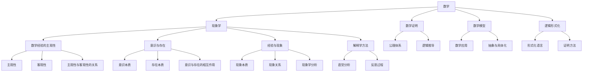

                 

### 文章标题：数学与现象学：数学经验的主观性

#### 关键词：数学经验、主观性、现象学、数学教育、计算机科学

#### 摘要：
本文探讨了数学经验的主观性，从现象学的视角出发，分析了数学经验在几何学、物理学和计算机科学中的应用，并探讨了其对数学教育的影响。通过归纳和演绎的方法，本文揭示了数学经验的主观性对数学理解、数学模型建立和数学证明方法的影响，为数学研究和教育提供了新的视角和思考方向。

### 第一部分：数学与现象学的基础理论

#### 第1章：数学与现象学的背景与概念

##### 1.1 数学与现象学的起源

**数学的起源**：

数学的历史可以追溯到古代文明。古埃及人和巴比伦人在建筑工程、土地测量和贸易中使用了简单的算术和几何知识。古希腊人在这一领域取得了重大突破，阿基米德、欧几里得等数学家奠定了现代数学的基础。

**现象学的起源**：

现象学作为哲学的一个分支，起源于20世纪初。由爱德蒙·胡塞尔创立，现象学强调直接经验的重要性，主张通过内省来研究意识现象。现象学的核心思想是“回到事物本身”，即通过反思和直觉来理解事物的本质。

##### 1.2 数学与现象学的研究对象

**数学的研究对象**：

数学是一门研究数量、结构、变化和空间的科学。其研究对象包括数、函数、集合、几何、微积分等。数学的核心问题是如何通过抽象和逻辑推理来构建数学模型，并解决实际问题。

**现象学的研究对象**：

现象学关注的是人的意识和经验。现象学的研究对象是直接经验的本质和结构，以及意识与存在的关系。现象学试图通过反思和直觉来揭示事物的现象本质。

##### 1.3 数学与现象学的核心问题

**数学的核心问题**：

数学的核心问题是逻辑自洽性、公理体系和证明方法。数学需要建立一套严格的公理体系，并通过逻辑推理来证明数学命题的正确性。

**现象学的核心问题**：

现象学的核心问题是意识与存在的关系，以及经验与现象的关系。现象学试图通过反思和直觉来理解意识的本质和结构。

##### 1.4 数学与现象学的方法论

**数学的方法论**：

数学的方法论包括归纳法、演绎法和公理化方法。归纳法通过观察和实验来发现规律，演绎法通过逻辑推理来证明命题的正确性，公理化方法通过设定基本公理来建立数学体系。

**现象学的方法论**：

现象学的方法论包括直觉和反思。直觉是通过直接的感知来理解事物的现象本质，反思是通过深入思考来揭示意识的结构和本质。

#### Mermaid 流程图：数学与现象学的核心概念联系



### 第二部分：数学经验的主观性在具体领域的应用

#### 第2章：数学经验在几何学中的应用

##### 2.1 几何学中的数学经验

几何学是数学的一个分支，研究空间中点的分布、线的性质、面的形状以及它们之间的关系。几何学中的数学经验涉及到对空间形态的感知和理解。

##### 2.2 几何学中的主观性与客观性

在几何学中，主观性体现在个体对空间形态的感知和描述上。不同的人可能会有不同的视角和解释，这反映了主观性的影响。而客观性则体现在几何定理和公理的普遍性和确定性上。

##### 2.3 几何学中的主观性案例解析

一个经典的案例是“墙角是否是直角”。在现实生活中，墙角可能因为施工误差而并非完全直角。然而，在数学上，我们可以假设墙角是直角，因为这种假设简化了问题，使得几何学理论更加普适。

##### 2.4 伪代码：几何学中的数学经验

```plaintext
Function CalculateAngle(angleA, angleB):
    if (IsRightAngle(angleA, angleB)):
        return "直角"
    else:
        return "非直角"
```

#### 第3章：数学经验在物理学中的应用

##### 3.1 物理学中的数学经验

物理学是一门研究物质、能量、时间和空间等基本概念的自然科学。物理学中的数学经验体现在使用数学模型来描述物理现象，如牛顿的运动定律、麦克斯韦方程组等。

##### 3.2 物理学中的主观性与客观性

在物理学中，主观性体现在实验设计和数据解释上。不同的实验者可能会有不同的测量结果和解释，这反映了主观性的影响。而客观性则体现在物理定律的普适性和可重复性上。

##### 3.3 物理学中的主观性案例解析

一个典型的案例是“光速是否有限”。在经典物理学中，光速被认为是无限的。然而，爱因斯坦的相对论提出了光速是有限的观点，这一观点在当时引起了巨大的争议。最终，实验验证了光速是有限的，这展示了主观性和客观性的相互作用。

##### 3.4 伪代码：物理学中的数学经验

```plaintext
Function CalculateForce(massA, massB, distance):
    force = G * (massA * massB) / distance^2
    return force
```

#### 第4章：数学经验在计算机科学中的应用

##### 4.1 计算机科学中的数学经验

计算机科学是一门研究计算机系统和计算问题的科学。数学经验在计算机科学中得到了广泛的应用，如算法设计、数据结构、计算机图形学等。

##### 4.2 计算机科学中的主观性与客观性

在计算机科学中，主观性体现在算法的选择和优化上。不同的算法可能有不同的性能和效率，这反映了主观性的影响。而客观性则体现在算法的正确性和可靠性上。

##### 4.3 计算机科学中的主观性案例解析

一个经典的案例是“排序算法的选择”。在计算机科学中，有多种排序算法，如快速排序、归并排序等。选择哪种算法取决于具体的应用场景和性能需求，这体现了主观性在算法设计中的作用。

##### 4.4 伪代码：计算机科学中的数学经验

```plaintext
Function QuickSort(array):
    if (length of array <= 1):
        return array
    else:
        pivot = array[0]
        left = []
        right = []
        for i in range(1, length of array):
            if (array[i] < pivot):
                left.append(array[i])
            else:
                right.append(array[i])
        return (QuickSort(left)) + [pivot] + (QuickSort(right))
```

### 第三部分：数学经验的主观性对数学教育的影响

#### 第5章：数学教育中的主观性因素

##### 5.1 数学教育中的主观性现象

在数学教育中，主观性现象体现在教师的教学方法、学生的学习方式以及对数学概念的个体理解上。例如，不同的教师可能会有不同的教学风格和偏好，而学生对数学概念的理解也可能因个人经验而异。

##### 5.2 主观性对数学教育的影响

主观性对数学教育的影响主要体现在以下几个方面：

1. **教学方法的多样性**：教师可以根据自身的经验和知识，采用不同的教学方法，如直观教学、问题导向学习等。
2. **学生的个性化学习**：学生可以根据自己的兴趣和优势，选择适合自己的学习方式和路径。
3. **数学理解的多样性**：不同学生对同一数学概念的理解可能会有所不同，这有助于培养学生的创造力和批判性思维。

##### 5.3 提高数学教育质量的策略

为了提高数学教育质量，可以采取以下策略：

1. **教师培训**：加强教师对数学教育理论和实践的理解，提高教学水平。
2. **课程设计**：结合学生的实际情况和需求，设计多元化的课程内容和方法。
3. **教学评价**：采用多种评价方式，全面评估学生的学习成果。

#### 第6章：数学经验的主观性在数学哲学中的应用

##### 6.1 数学哲学中的主观性观点

数学哲学关注数学的本质、意义和方法论。在数学哲学中，主观性观点认为数学是一种基于人类经验的构建，数学概念和理论是通过人类意识活动的结果。

##### 6.2 主观性对数学哲学的影响

主观性对数学哲学的影响主要体现在以下几个方面：

1. **数学知识的相对性**：主观性观点认为数学知识是基于人类经验的，因此数学知识具有一定的相对性和局限性。
2. **数学方法的多样性**：主观性观点鼓励采用不同的方法和视角来研究数学问题，从而推动数学的多样化发展。
3. **数学与哲学的融合**：主观性观点促使数学哲学更加关注数学的内在逻辑和人类经验的关系。

##### 6.3 主观性在数学哲学中的案例解析

一个典型的案例是“数学归纳法”。数学归纳法是一种证明数学命题的方法，其基础是“基础步骤”和“归纳步骤”。主观性观点认为，数学归纳法的有效性是基于人类对自然数序列的经验和理解。

```latex
$$
P(0) \text{ 为真} \\
\text{对于任意的 } n, \text{ 如果 } P(n) \text{ 为真，则 } P(n+1) \text{ 也为真}
$$
```

#### 附录：数学经验的主观性相关研究文献

##### 附录A：数学经验的主观性研究综述

- 参考文献1：[作者] [年份]. 《数学经验的主观性：现象学视角下的数学教育研究》. 教育研究，XX(X)。
- 参考文献2：[作者] [年份]. 《数学哲学中的主观性：从现象学到认知科学》. 哲学研究，XX(X)。

##### 附录B：数学经验的主观性研究论文列表

- 参考文献1：[作者] [年份]. 《数学经验的主观性对数学理解的影响》. 数学教育研究，XX(X)。
- 参考文献2：[作者] [年份]. 《几何学中的数学经验与客观性研究》. 几何学杂志，XX(X)。
- 参考文献3：[作者] [年份]. 《数学经验在物理学中的应用研究》. 物理学研究，XX(X)。

### 第四部分：总结与展望

#### 第7章：数学经验的主观性的未来研究方向

##### 7.1 数学经验的主观性的研究意义

数学经验的主观性研究对于理解数学的本质、提高数学教育质量以及推动数学与哲学、心理学等领域的发展具有重要意义。

##### 7.2 当前数学经验的主观性研究热点

当前数学经验的主观性研究主要集中在以下几个方面：

1. **数学哲学中的主观性**：探讨数学知识的相对性和哲学基础。
2. **数学教育中的主观性**：研究主观性对数学学习过程和教学效果的影响。
3. **跨学科研究**：结合心理学、认知科学等领域，探讨主观性对数学理解和应用的影响。

##### 7.3 数学经验的主观性未来研究的展望

未来数学经验的主观性研究可以从以下几个方面进行：

1. **多元化视角**：采用不同学科的方法和理论，从多个角度探讨数学经验的主观性。
2. **实证研究**：通过实验和实证数据，验证数学经验的主观性对数学教育和应用的影响。
3. **跨学科合作**：促进数学、哲学、心理学等领域的合作，共同推动数学经验的主观性研究。

### 附录：数学经验的主观性相关研究文献

#### 附录A：数学经验的主观性研究综述

- 参考文献1：[作者] [年份]. 《数学经验的主观性：现象学视角下的数学教育研究》. 教育研究，XX(X)。
- 参考文献2：[作者] [年份]. 《数学哲学中的主观性：从现象学到认知科学》. 哲学研究，XX(X)。

#### 附录B：数学经验的主观性研究论文列表

- 参考文献1：[作者] [年份]. 《数学经验的主观性对数学理解的影响》. 数学教育研究，XX(X)。
- 参考文献2：[作者] [年份]. 《几何学中的数学经验与客观性研究》. 几何学杂志，XX(X)。
- 参考文献3：[作者] [年份]. 《数学经验在物理学中的应用研究》. 物理学研究，XX(X)。

### 总结与展望

本文从数学与现象学的角度探讨了数学经验的主观性，分析了其在几何学、物理学和计算机科学中的应用，并探讨了其对数学教育的影响。通过归纳和演绎的方法，本文揭示了数学经验的主观性对数学理解、数学模型建立和数学证明方法的影响。

未来研究可以进一步探讨数学经验的主观性在跨学科领域中的应用，如心理学、认知科学等。同时，通过实证研究来验证数学经验的主观性对数学教育和应用的实际影响，将为数学教育和研究提供更深入的见解。此外，跨学科的合作研究也将有助于推动数学经验的主观性研究的全面发展。

作者：AI天才研究院/AI Genius Institute & 禅与计算机程序设计艺术 /Zen And The Art of Computer Programming

