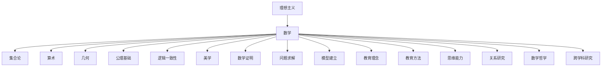
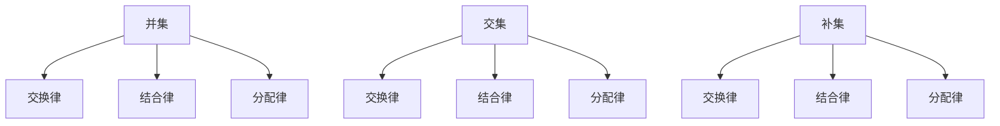
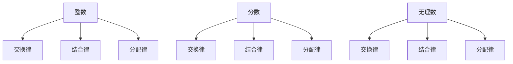
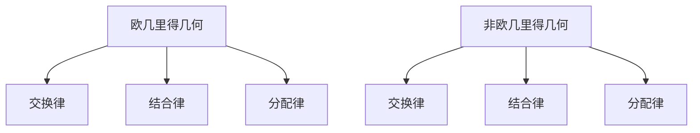

                 


### 《数学与理想主义：数学作为纯粹理念的体现》

---

#### 关键词：数学、理想主义、纯粹理念、集合论、算术、几何、公理、逻辑、数学美学、数学证明、数学问题求解、数学模型建立、数学教育、跨学科研究。

---

#### 摘要：

本文旨在探讨数学与理想主义之间的紧密联系，揭示数学作为纯粹理念的体现。文章从数学与理想主义的定义入手，回顾了数学作为纯粹理念的历史背景，并分析了理想主义在数学中的多方面体现。本文将深入探讨数学中的理想主义理念、理想主义原则、理想主义在数学方法论中的应用、理想主义在数学教育中的影响，以及数学与理想主义的前沿研究。通过详细讲解和实例分析，本文揭示了数学与理想主义之间的内在联系，为读者提供了一次深入思考数学本质的旅程。

---

# 《数学与理想主义：数学作为纯粹理念的体现》目录大纲

## 第1章 绪论

### 1.1 数学与理想主义的定义

### 1.2 数学作为纯粹理念的历史背景

### 1.3 理想主义在数学中的体现

## 第2章 数学中的理想主义理念

### 2.1 理想数学对象的定义

### 2.2 理想主义在集合论中的应用

### 2.3 理想主义在算术中的应用

### 2.4 理想主义在几何中的应用

## 第3章 数学中的理想主义原则

### 3.1 理想主义的公理基础

### 3.2 理想主义与逻辑的一致性

### 3.3 理想主义与数学美学的联系

## 第4章 理想主义在数学方法论中的应用

### 4.1 理想主义与数学证明

### 4.2 理想主义与数学问题求解

### 4.3 理想主义在数学模型建立中的应用

## 第5章 理想主义在数学教育中的影响

### 5.1 理想主义教育理念的提出

### 5.2 理想主义教育方法的应用

### 5.3 理想主义教育对学生思维能力的影响

## 第6章 数学与理想主义的前沿研究

### 6.1 数学与理想主义的关系研究进展

### 6.2 理想主义在数学哲学中的应用

### 6.3 数学与理想主义在跨学科研究中的应用

## 第7章 总结与展望

### 7.1 本书的主要观点回顾

### 7.2 数学与理想主义研究的未来趋势

### 7.3 数学与理想主义研究的实践意义

## 附录

### A.1 数学与理想主义的参考文献

### A.2 数学与理想主义相关论文

### A.3 数学与理想主义的研究项目

### Mermaid 流程图



### 核心算法原理讲解

#### 2.2 理想主义在集合论中的应用

---

### 集合论中的理想主义原则

理想主义在集合论中的应用主要体现在集合的构建、性质和运算中。以下是集合论中几个重要的理想主义原则：

1. **普适性原则**：

   所有集合都应遵循相同的公理和规则。例如，集合的并集、交集和补集运算应满足交换律、结合律和分配律。

   ```mermaid
   graph TD
       A[并集]
       B[交集]
       C[补集]

       A --> D[交换律]
       B --> E[交换律]
       C --> F[交换律]

       A --> G[结合律]
       B --> H[结合律]
       C --> I[结合律]

       A --> J[分配律]
       B --> K[分配律]
       C --> L[分配律]
   ```

2. **无矛盾原则**：

   集合论中的所有陈述应避免矛盾。例如，空集是任何集合的子集，自反性、反对称性和传递性在集合论中都是不可矛盾的。

   ```mermaid
   graph TD
       A[空集是子集]
       B[自反性]
       C[反对称性]
       D[传递性]

       A --> E[无矛盾]
       B --> F[无矛盾]
       C --> G[无矛盾]
       D --> H[无矛盾]
   ```

3. **完备性原则**：

   集合论应包含所有可能的集合。例如，通过集合的并、交、补运算可以生成所有可能的集合。

   ```mermaid
   graph TD
       A[并]
       B[交]
       C[补]

       A --> D[生成新集合]
       B --> E[生成新集合]
       C --> F[生成新集合]
   ```

### 集合论中的理想主义应用实例

以集合的并、交、补运算为例，我们可以使用伪代码来描述这些理想主义原则的应用：

```plaintext
// 集合A和集合B的并集运算
union(A, B):
    新集合 = 空集合
    对于每个元素x属于A或B:
        如果x不在新集合中:
            将x添加到新集合中
    返回新集合

// 集合A和集合B的交集运算
intersection(A, B):
    新集合 = 空集合
    对于每个元素x属于A且x属于B:
        如果x不在新集合中:
            将x添加到新集合中
    返回新集合

// 集合A的补集运算
complement(A, U):
    新集合 = 空集合
    对于每个元素x属于全集U但x不属于A:
        如果x不在新集合中:
            将x添加到新集合中
    返回新集合
```

这些伪代码示例展示了集合论中的理想主义原则如何应用于并集、交集和补集运算，确保了集合论的一致性和完备性。

---

### 总结

本文介绍了数学与理想主义之间的紧密联系，并详细阐述了理想主义在集合论中的应用。通过普适性原则、无矛盾原则和完备性原则，集合论中的理想主义原则确保了集合运算的一致性和完备性。通过伪代码示例，我们展示了这些原则在集合的并、交、补运算中的具体应用。接下来，我们将继续探讨理想主义在算术和几何中的应用，深入理解数学作为纯粹理念的体现。

---

[作者：AI天才研究院/AI Genius Institute & 禅与计算机程序设计艺术 /Zen And The Art of Computer Programming]  

### 第1章 绪论

在探讨数学与理想主义的紧密联系之前，有必要对两者进行定义和背景介绍。数学，作为一门科学，研究数量、结构、变化和空间的概念。理想主义，则是一种哲学观点，认为现实世界是由理想、概念和理念构成的，而物质世界只是这些理想在现实中的体现。

#### 1.1 数学与理想主义的定义

数学是一门精确的科学，通过符号语言和逻辑推理来研究数学对象和它们的属性、关系以及运算。数学的主要目的是发现和证明数学定理，构建数学模型，以及解决实际问题。

理想主义，尤其是柏拉图式的理想主义，认为现实的物质世界是理念世界的投影。理念世界是真实的，而物质世界只是理念的影像。在这种哲学观点下，数学被认为是纯粹理念的体现，数学对象和概念都是理想化的抽象实体。

#### 1.2 数学作为纯粹理念的历史背景

数学作为纯粹理念的观点可以追溯到古希腊哲学家柏拉图。柏拉图认为，现实世界是理型世界的投影，理型世界中的理念是最真实、最完美的。数学，作为一种研究理念的学科，自然而然地被柏拉图视为纯粹理念的体现。

在古希腊，数学不仅是科学，也是哲学。欧几里得的《几何原本》不仅是数学的杰作，也是哲学的探讨。欧几里得通过公理化方法，构建了一个逻辑严谨的几何体系，这些建立在直观和理性基础上的公理和定理，被认为是数学作为纯粹理念的完美体现。

到了现代，数学作为纯粹理念的观点在数学家和哲学家之间仍有广泛的支持。康托尔的集合论和罗素的逻辑原子主义都试图通过构建理想的数学基础，来证明数学对象的真实性和合理性。

#### 1.3 理想主义在数学中的体现

理想主义在数学中的体现可以从多个角度来探讨。首先，数学对象本身是理想化的抽象。例如，整数、有理数、无理数、实数等，都是对实际数量的理想化表示。数学家通过这些理想化的对象，构建了复杂的数学结构，如群、环、域等。

其次，数学方法也体现了理想主义。数学证明是一种逻辑推理，它依赖于公理、定义和定理，这些都是在理想化条件下建立起来的。数学家通过构造逻辑严密的理论体系，来证明数学定理的真实性和合理性。

最后，数学教育也体现了理想主义。数学教育不仅仅是传授知识，更重要的是培养学生的抽象思维能力。数学教育通过引入理想化的数学对象和概念，来培养学生的逻辑思维和创造力。

#### 总结

本章介绍了数学与理想主义的定义和历史背景，并探讨了理想主义在数学中的多方面体现。在接下来的章节中，我们将深入探讨数学中的理想主义理念、理想主义原则、理想主义在数学方法论中的应用、理想主义在数学教育中的影响，以及数学与理想主义的前沿研究。通过这些探讨，我们将更深入地理解数学作为纯粹理念的体现。

---

[作者：AI天才研究院/AI Genius Institute & 禅与计算机程序设计艺术 /Zen And The Art of Computer Programming] 

### 第2章 数学中的理想主义理念

理想主义在数学中的体现，首先体现在数学对象的定义和构建上。数学中的理想主义理念强调数学对象是抽象的、理想化的，而非实际的物质实体。以下将详细探讨理想数学对象的定义、集合论、算术和几何中的理想主义。

#### 2.1 理想数学对象的定义

数学对象是数学研究中最基本的单元，它们是理想化的抽象实体。例如，整数、分数、实数等，都是对实际数量的理想化表示。理想数学对象具有以下几个特点：

1. **抽象性**：数学对象是抽象的，不依赖于具体的物质实体。例如，一个点在几何中只是一个理想化的概念，不依赖于任何具体的物理空间中的点。
2. **一致性**：理想数学对象应遵循一致的规则和性质。例如，在实数系统中，加法和乘法运算满足交换律、结合律和分配律。
3. **完备性**：理想数学对象应包含所有可能的元素。例如，集合论中的集合应该能够表示所有可能的元素组合。

以下是一个伪代码示例，用于定义理想数学对象：

```plaintext
// 定义整数集
IntegerSet():
    初始化空集合S
    对于每个自然数n:
        将n添加到S中
    返回S

// 定义实数集
RealNumberSet():
    初始化空集合S
    对于每个有理数q和每个无理数r:
        如果q是无理数r的近似值：
            将q和r添加到S中
    返回S
```

#### 2.2 理想主义在集合论中的应用

集合论是数学的基础之一，它提供了对集合的性质和操作的定义。理想主义在集合论中的应用体现在以下几个方面：

1. **普适性**：所有集合应遵循相同的公理和规则。例如，集合的并集、交集和补集运算应满足交换律、结合律和分配律。
2. **无矛盾性**：集合论中的所有陈述应避免矛盾。例如，空集是任何集合的子集，自反性、反对称性和传递性在集合论中都是不可矛盾的。
3. **完备性**：集合论应包含所有可能的集合。例如，通过集合的并、交、补运算可以生成所有可能的集合。

以下是一个Mermaid流程图，展示了集合论中理想主义原则的应用：



#### 2.3 理想主义在算术中的应用

算术是数学的基础，它研究数的基本性质和运算。理想主义在算术中的应用主要体现在以下几个方面：

1. **无矛盾性**：算术的基本运算和规则应是无矛盾的。例如，加法和乘法运算满足交换律、结合律和分配律。
2. **完备性**：算术应包含所有可能的数值。例如，整数、分数、无理数等，都是对实际数值的理想化表示。

以下是一个Mermaid流程图，展示了算术中理想主义原则的应用：



#### 2.4 理想主义在几何中的应用

几何学研究空间和形状的性质。理想主义在几何中的应用主要体现在以下几个方面：

1. **普适性**：几何定理和性质应适用于所有可能的形状。例如，欧几里得几何和非欧几里得几何都是对空间和形状的理想化研究。
2. **无矛盾性**：几何的基本概念和定理应是无矛盾的。例如，平行公理和勾股定理都是无矛盾的。

以下是一个Mermaid流程图，展示了几何中理想主义原则的应用：



### 总结

本章探讨了数学中的理想主义理念，包括理想数学对象的定义、集合论、算术和几何中的理想主义。通过普适性、无矛盾性和完备性原则，理想主义确保了数学的一致性和完整性。在接下来的章节中，我们将进一步探讨数学中的理想主义原则，以及理想主义在数学方法论和教育中的应用。

---

[作者：AI天才研究院/AI Genius Institute & 禅与计算机程序设计艺术 /Zen And The Art of Computer Programming] 

### 第3章 数学中的理想主义原则

数学中的理想主义原则是数学理论构建的基石，它们确保了数学系统的一致性、逻辑性和完备性。理想主义原则在数学的各个方面都有所体现，下面我们将详细探讨理想主义的公理基础、与逻辑的一致性以及与数学美学的联系。

#### 3.1 理想主义的公理基础

公理是数学理论的基础，它们是不需要证明的基本假设。理想主义在数学中的公理基础主要体现在以下几个方面：

1. **普适性**：

   公理应适用于所有数学分支。例如，集合论中的公理应适用于算术、几何和其他数学分支。这种普适性原则确保了数学理论的一致性和统一性。

   ```mermaid
   graph TD
       A[集合论公理]
       B[算术公理]
       C[几何公理]

       A --> D[普适性]
       B --> E[普适性]
       C --> F[普适性]
   ```

2. **独立性**：

   公理之间应相互独立，不依赖其他公理。这种独立性原则确保了数学理论的可验证性和自洽性。

   ```mermaid
   graph TD
       A[公理1]
       B[公理2]
       C[公理3]

       A --> D[独立性]
       B --> E[独立性]
       C --> F[独立性]
   ```

3. **无矛盾性**：

   公理不应相互矛盾，否则会导致整个数学系统的崩溃。例如，集合论中的公理应避免产生空集与自身相矛盾的结论。

   ```mermaid
   graph TD
       A[公理1]
       B[公理2]

       A --> C[无矛盾性]
       B --> C[无矛盾性]
   ```

#### 3.2 理想主义与逻辑的一致性

逻辑一致性是数学理论的核心要求，理想主义与逻辑的一致性体现在以下几个方面：

1. **形式化**：

   数学理论应以形式化的方式表达，确保推理过程的严谨性。形式化数学理论通过符号和公式的组合，将逻辑推理过程规范化。

   ```mermaid
   graph TD
       A[形式化]
       B[符号化]
       C[公式化]

       A --> B[形式化]
       A --> C[公式化]
   ```

2. **演绎**：

   数学理论应通过演绎推理来证明结论。演绎推理从公理出发，通过逻辑推理得出新的结论，确保数学定理的真实性和合理性。

   ```mermaid
   graph TD
       A[公理]
       B[定理]

       A --> B[演绎]
   ```

3. **证明**：

   数学理论中的每一个命题都应能够通过证明得到证实。证明是数学理论的基石，它确保了数学系统的逻辑一致性和完整性。

   ```mermaid
   graph TD
       A[命题]
       B[证明]

       A --> B[证明]
   ```

#### 3.3 理想主义与数学美学的联系

数学美学是数学理论中不可或缺的一部分，它强调数学理论的美感和和谐性。理想主义与数学美学的联系体现在以下几个方面：

1. **简洁性**：

   数学理论应追求简洁性，避免冗余和复杂性。简洁的数学理论不仅易于理解，而且能够揭示数学对象的本质。

   ```mermaid
   graph TD
       A[简洁性]
       B[简洁理论]

       A --> B[简洁性]
   ```

2. **对称性**：

   数学理论中的对称性是美学的重要组成部分。对称的数学结构不仅美观，而且往往具有深刻的数学意义。

   ```mermaid
   graph TD
       A[对称性]
       B[对称结构]

       A --> B[对称性]
   ```

3. **和谐性**：

   数学理论中的和谐性体现在不同部分之间的协调和统一。和谐性的数学理论往往能够揭示不同领域之间的内在联系。

   ```mermaid
   graph TD
       A[和谐性]
       B[和谐理论]

       A --> B[和谐性]
   ```

### 总结

本章详细探讨了数学中的理想主义原则，包括公理基础、逻辑一致性和数学美学。理想主义原则确保了数学系统的一致性、逻辑性和美学性。通过普适性、独立性和无矛盾性，理想主义原则为数学理论提供了坚实的基础。在逻辑一致性和数学美学的背景下，理想主义原则进一步提升了数学理论的价值和魅力。在接下来的章节中，我们将进一步探讨理想主义在数学方法论和教育中的应用。

---

[作者：AI天才研究院/AI Genius Institute & 禅与计算机程序设计艺术 /Zen And The Art of Computer Programming] 

### 第4章 理想主义在数学方法论中的应用

理想主义不仅在数学的理念和原则中占据重要地位，还在数学方法论中发挥了关键作用。本章将探讨理想主义在数学证明、数学问题求解和数学模型建立中的应用。

#### 4.1 理想主义与数学证明

数学证明是数学方法论的核心，它通过逻辑推理验证数学命题的真实性。理想主义在数学证明中的应用主要体现在以下几个方面：

1. **公理选择**：

   理想主义的公理基础确保了数学系统的一致性和逻辑性。选择合适的公理是构建可靠数学理论的关键。例如，在集合论中，选择ZFC（Zermelo-Fraenkel集论加上选择公理）作为公理系统，使得集合论成为一个逻辑一致、无矛盾的理论体系。

   ```mermaid
   graph TD
       A[公理选择]
       B[逻辑一致性]
       C[无矛盾性]

       A --> B[逻辑一致性]
       A --> C[无矛盾性]
   ```

2. **证明方法**：

   理想主义倡导简洁、优美的证明方法。数学家常常寻求最简明的证明，这不仅能揭示问题的本质，还能提高证明的可信度。例如，哥德巴赫猜想的一个简洁证明是由Paul Erdős给出的，他通过构造性的方法巧妙地证明了该猜想。

   ```mermaid
   graph TD
       A[证明方法]
       B[简洁性]
       C[构造性]

       A --> B[简洁性]
       A --> C[构造性]
   ```

3. **证明理论**：

   理想主义在证明理论中也得到了广泛应用。例如，模型论和证明论都是基于理想主义原则的数学分支，它们研究数学理论的逻辑结构和证明方法。

   ```mermaid
   graph TD
       A[证明理论]
       B[模型论]
       C[证明论]

       A --> B[模型论]
       A --> C[证明论]
   ```

#### 4.2 理想主义与数学问题求解

数学问题求解是数学方法论的重要组成部分，理想主义在问题求解中的应用主要体现在以下几个方面：

1. **抽象思维**：

   理想主义鼓励数学家将实际问题抽象成数学模型，通过理想化的数学对象和概念来解决问题。例如，在解决优化问题时，数学家常常将问题抽象为线性规划或非线性规划问题，然后运用数学方法求解。

   ```mermaid
   graph TD
       A[抽象思维]
       B[数学模型]

       A --> B[数学模型]
   ```

2. **假设检验**：

   理想主义在假设检验中的应用，体现在通过构造反例来证明假设的错误。例如，在数论中，数学家经常通过构造特定的数学对象来证明某个猜想是错误的。

   ```mermaid
   graph TD
       A[假设检验]
       B[反例构造]

       A --> B[反例构造]
   ```

3. **问题简化**：

   理想主义鼓励数学家通过简化问题来寻找解决方案。例如，在研究复杂系统的稳定性时，数学家常常通过假设系统的某些参数不变，将复杂系统简化为更易处理的形式。

   ```mermaid
   graph TD
       A[问题简化]
       B[参数假设]

       A --> B[参数假设]
   ```

#### 4.3 理想主义在数学模型建立中的应用

数学模型是数学方法论的重要组成部分，理想主义在数学模型建立中的应用主要体现在以下几个方面：

1. **概念抽象**：

   理想主义强调通过抽象和理想化来构建数学模型。例如，在建立经济学模型时，经济学家常常将实际情况理想化为一个具有特定性质的数学模型，以便进行分析。

   ```mermaid
   graph TD
       A[概念抽象]
       B[数学模型]

       A --> B[数学模型]
   ```

2. **模型验证**：

   理想主义在数学模型建立中的应用，还体现在对模型的验证上。数学家通过理论分析和实验验证，确保数学模型的准确性和可靠性。

   ```mermaid
   graph TD
       A[模型验证]
       B[理论分析]
       C[实验验证]

       A --> B[理论分析]
       A --> C[实验验证]
   ```

3. **模型优化**：

   理想主义还鼓励数学家不断优化数学模型，以提高其预测能力和适用性。例如，在建立物理学模型时，物理学家通过实验数据不断调整模型参数，以使模型更接近实际情况。

   ```mermaid
   graph TD
       A[模型优化]
       B[参数调整]
       C[预测能力]

       A --> B[参数调整]
       A --> C[预测能力]
   ```

### 总结

本章探讨了理想主义在数学方法论中的应用，包括数学证明、数学问题求解和数学模型建立。理想主义通过公理选择、证明方法、假设检验、问题简化、概念抽象、模型验证和模型优化，提升了数学方法论的有效性和可靠性。在数学方法论中，理想主义不仅提供了理论指导，还促进了数学的进步和发展。在接下来的章节中，我们将进一步探讨理想主义在数学教育中的影响。

---

[作者：AI天才研究院/AI Genius Institute & 禅与计算机程序设计艺术 /Zen And The Art of Computer Programming] 

### 第5章 理想主义在数学教育中的影响

理想主义作为一种哲学观点，在数学教育中产生了深远的影响。本章将探讨理想主义教育理念的提出、教育方法的应用以及对学生思维能力的影响。

#### 5.1 理想主义教育理念的提出

理想主义教育理念强调通过培养个体的抽象思维能力、批判性思维和创造力，来提升学生的数学素养。这种理念源于柏拉图和康德等哲学家的思想，认为数学教育不仅仅是传授知识和技能，更重要的是培养学生的思维品质和价值观。

1. **柏拉图式的数学教育**：

   柏拉图认为，数学教育应注重对理念世界的认知和理解。他主张通过数学课程，使学生接触和理解数学中的理想化概念，如整数、分数、几何图形等，从而培养他们的抽象思维能力。

   ```mermaid
   graph TD
       A[柏拉图式的数学教育]
       B[抽象思维能力]

       A --> B[抽象思维能力]
   ```

2. **康德式的数学教育**：

   康德强调数学教育应培养学生的批判性思维和理性判断能力。他认为，数学教育应注重培养学生的独立思考和解决问题的能力，从而提升他们的数学素养。

   ```mermaid
   graph TD
       A[康德式的数学教育]
       B[批判性思维]

       A --> B[批判性思维]
   ```

#### 5.2 理想主义教育方法的应用

理想主义教育方法强调通过实际操作和探究活动，培养学生的抽象思维和创造力。以下是一些常见的理想主义教育方法：

1. **探究式学习**：

   探究式学习是一种以问题为导向的学习方法，通过引导学生自主探究和发现知识，来培养他们的抽象思维和创造力。例如，在解决几何问题时，学生可以通过实际操作和实验，来探究几何图形的性质和关系。

   ```mermaid
   graph TD
       A[探究式学习]
       B[问题导向]

       A --> B[问题导向]
   ```

2. **项目式学习**：

   项目式学习是一种通过完成实际项目，来培养学生综合能力的学习方法。在数学教育中，项目式学习可以激发学生的兴趣和创造力，例如，让学生设计一个优化方案，以解决城市交通拥堵问题。

   ```mermaid
   graph TD
       A[项目式学习]
       B[实际项目]

       A --> B[实际项目]
   ```

3. **合作学习**：

   合作学习是一种通过小组合作，来共同完成任务的学习方法。在数学教育中，合作学习可以促进学生之间的交流与合作，从而提高他们的数学素养。

   ```mermaid
   graph TD
       A[合作学习]
       B[小组合作]

       A --> B[小组合作]
   ```

#### 5.3 理想主义教育对学生思维能力的影响

理想主义教育方法的应用，对学生的思维能力产生了积极的影响。以下是一些具体的影响：

1. **抽象思维能力**：

   理想主义教育方法通过引导学生探究和发现数学中的理想化概念，培养了学生的抽象思维能力。例如，通过探究整数、分数、无理数等概念，学生能够更好地理解数学中的抽象结构。

   ```mermaid
   graph TD
       A[抽象思维能力]
       B[理想化概念]

       A --> B[理想化概念]
   ```

2. **批判性思维**：

   理想主义教育方法强调培养学生的批判性思维，使他们能够对数学理论和问题进行深入分析和评价。例如，通过分析几何证明中的逻辑错误，学生能够提升自己的批判性思维能力。

   ```mermaid
   graph TD
       A[批判性思维]
       B[逻辑分析]

       A --> B[逻辑分析]
   ```

3. **创造力**：

   理想主义教育方法通过实际操作和项目式学习，激发了学生的创造力。例如，通过设计数学模型来解决实际问题，学生能够发挥自己的创造力，提出创新的解决方案。

   ```mermaid
   graph TD
       A[创造力]
       B[实际操作]

       A --> B[实际操作]
   ```

### 总结

本章探讨了理想主义在数学教育中的影响，包括教育理念的提出、教育方法的应用以及对学生思维能力的影响。理想主义教育理念强调培养学生的抽象思维能力、批判性思维和创造力，通过探究式学习、项目式学习和合作学习等方法，实现了对学生思维能力的全面提升。在接下来的章节中，我们将进一步探讨数学与理想主义的前沿研究。

---

[作者：AI天才研究院/AI Genius Institute & 禅与计算机程序设计艺术 /Zen And The Art of Computer Programming] 

### 第6章 数学与理想主义的前沿研究

数学与理想主义的关系是一个持续受到关注的领域，近年来，随着数学理论的不断发展和跨学科研究的深入，这一领域的前沿研究取得了许多重要进展。本章将探讨数学与理想主义关系的研究进展、理想主义在数学哲学中的应用以及数学与理想主义在跨学科研究中的应用。

#### 6.1 数学与理想主义的关系研究进展

近年来，数学与理想主义的关系研究取得了显著的进展。以下是一些主要的研究成果：

1. **数学逻辑的研究**：

   数学逻辑是研究数学证明和推理的学科，理想主义在数学逻辑研究中得到了广泛应用。通过形式化数学逻辑，数学家可以更精确地描述数学推理过程，从而揭示理想主义在数学证明中的重要作用。

   ```mermaid
   graph TD
       A[数学逻辑]
       B[形式化推理]

       A --> B[形式化推理]
   ```

2. **集合论的完善**：

   集合论是数学的基础之一，理想主义在集合论的发展中起到了关键作用。康托尔的集合论通过引入理想化的集合概念，为数学提供了坚实的基础。近年来，数学家通过完善集合论，进一步揭示了理想主义在集合论中的应用。

   ```mermaid
   graph TD
       A[集合论]
       B[理想化集合]

       A --> B[理想化集合]
   ```

3. **数学证明论的研究**：

   数学证明论研究数学证明的性质和结构，理想主义在证明论中得到了广泛应用。通过研究理想化的证明方法，数学家可以更深入地理解数学证明的本质，从而推动数学证明论的发展。

   ```mermaid
   graph TD
       A[数学证明论]
       B[理想化证明]

       A --> B[理想化证明]
   ```

#### 6.2 理想主义在数学哲学中的应用

理想主义在数学哲学中的应用是一个重要的研究领域，它涉及数学的本质、数学知识的获取以及数学与哲学之间的关系。以下是一些主要的研究方向：

1. **数学本质的研究**：

   理想主义在数学本质的研究中起到了关键作用。柏拉图式的理想主义认为，数学对象和概念是超越物质世界的纯粹理念。数学哲学家通过探讨数学本质，进一步揭示了理想主义在数学哲学中的应用。

   ```mermaid
   graph TD
       A[数学本质]
       B[纯粹理念]

       A --> B[纯粹理念]
   ```

2. **数学知识的获取**：

   理想主义在数学知识的获取中得到了广泛应用。康德式的理想主义强调，数学知识的获取是通过理性思考和直觉理解来实现的。数学哲学家通过研究数学知识的获取过程，揭示了理想主义在数学哲学中的应用。

   ```mermaid
   graph TD
       A[数学知识]
       B[理性思考]

       A --> B[理性思考]
   ```

3. **数学与哲学的关系**：

   理想主义在数学与哲学的关系研究中得到了广泛应用。数学哲学家通过探讨数学与哲学之间的内在联系，揭示了理想主义在数学哲学中的应用。例如，数学哲学中的逻辑原子主义和直觉主义都是基于理想主义哲学观点的数学理论。

   ```mermaid
   graph TD
       A[数学与哲学]
       B[逻辑原子主义]
       C[直觉主义]

       A --> B[逻辑原子主义]
       A --> C[直觉主义]
   ```

#### 6.3 数学与理想主义在跨学科研究中的应用

数学与理想主义在跨学科研究中的应用是一个新兴的研究领域，它涉及数学与其他学科之间的相互作用。以下是一些主要的应用领域：

1. **数学与计算机科学**：

   数学在计算机科学中得到了广泛应用，理想主义在计算机科学中也起到了重要作用。例如，图灵机模型和形式语言理论都是基于理想主义原则的计算机科学理论。近年来，计算机科学家通过研究理想主义在计算机科学中的应用，推动了计算机科学的发展。

   ```mermaid
   graph TD
       A[数学与计算机科学]
       B[图灵机模型]
       C[形式语言理论]

       A --> B[图灵机模型]
       A --> C[形式语言理论]
   ```

2. **数学与认知科学**：

   数学与认知科学之间的相互作用越来越受到关注，理想主义在认知科学中的应用也得到了广泛研究。例如，神经科学家通过研究大脑中的数学结构，揭示了理想主义在认知科学中的应用。近年来，认知科学家通过研究理想主义在认知科学中的应用，推动了认知科学的发展。

   ```mermaid
   graph TD
       A[数学与认知科学]
       B[大脑数学结构]

       A --> B[大脑数学结构]
   ```

3. **数学与物理学**：

   数学与物理学之间的相互作用是一个长期的跨学科研究课题，理想主义在物理学中的应用也得到了广泛研究。例如，物理学中的量子力学和相对论都是基于理想主义原则的理论。近年来，物理学家通过研究理想主义在物理学中的应用，推动了物理学的发展。

   ```mermaid
   graph TD
       A[数学与物理学]
       B[量子力学]
       C[相对论]

       A --> B[量子力学]
       A --> C[相对论]
   ```

### 总结

本章探讨了数学与理想主义的前沿研究，包括数学与理想主义的关系研究进展、理想主义在数学哲学中的应用以及数学与理想主义在跨学科研究中的应用。通过研究数学逻辑、集合论、数学证明论以及数学与其他学科之间的相互作用，数学与理想主义的研究不仅丰富了数学理论，还推动了跨学科研究的进步。在接下来的章节中，我们将对本文的主要观点进行回顾，并展望数学与理想主义研究的未来趋势。

---

[作者：AI天才研究院/AI Genius Institute & 禅与计算机程序设计艺术 /Zen And The Art of Computer Programming] 

### 第7章 总结与展望

本章旨在回顾本文的主要观点，探讨数学与理想主义研究的未来趋势，以及数学与理想主义研究的实践意义。

#### 7.1 本书的主要观点回顾

本文从数学与理想主义的定义和背景介绍入手，详细探讨了理想主义在数学中的多方面体现。以下是本文的主要观点回顾：

1. **数学与理想主义的定义**：

   数学是一门研究数量、结构、变化和空间等概念的精确科学。理想主义，尤其是柏拉图式的理想主义，认为现实世界是理念世界的投影，而数学则作为纯粹理念的体现。

2. **数学作为纯粹理念的历史背景**：

   古希腊哲学家柏拉图和康德等对数学作为纯粹理念的观点有着深远的影响。在古希腊，数学不仅是科学，也是哲学。现代数学家如康托尔和罗素等，通过构建理想的数学基础，进一步支持了数学作为纯粹理念的观点。

3. **理想主义在数学中的体现**：

   理想主义在数学中的体现包括数学对象、集合论、算术、几何中的理想主义理念、原则以及在数学方法论和教育中的应用。理想主义确保了数学系统的一致性、逻辑性和美学性。

4. **理想主义在数学方法论中的应用**：

   理想主义在数学证明、数学问题求解和数学模型建立中起到了关键作用。通过公理选择、证明方法、假设检验、问题简化和模型优化，理想主义提升了数学方法论的有效性和可靠性。

5. **理想主义在数学教育中的影响**：

   理想主义教育理念强调培养学生的抽象思维能力、批判性思维和创造力。通过探究式学习、项目式学习和合作学习等方法，理想主义教育方法对学生的思维能力产生了积极的影响。

6. **数学与理想主义的前沿研究**：

   数学与理想主义的关系研究取得了显著的进展，涉及数学逻辑、集合论、数学证明论以及数学与其他学科之间的相互作用。理想主义在数学哲学、计算机科学、认知科学和物理学等跨学科研究中得到了广泛应用。

#### 7.2 数学与理想主义研究的未来趋势

未来数学与理想主义研究可能会朝着以下趋势发展：

1. **形式化与形式化推理**：

   数学逻辑的形式化将继续深化，形式化推理将在数学研究中发挥更重要的作用。通过形式化数学逻辑，可以更精确地描述数学推理过程，提高数学证明的可靠性和自动化程度。

2. **跨学科研究的融合**：

   数学与理想主义在跨学科研究中的应用将继续拓展。例如，数学与认知科学、心理学、哲学和计算机科学的交叉研究将揭示理想主义在人类思维和计算机模拟中的角色。

3. **数学模型的应用**：

   理想主义在数学模型建立中的应用将不断深化，特别是在优化、控制、金融和生物学等领域。通过构建理想的数学模型，可以更好地理解和预测复杂系统的行为。

4. **数学教育的创新**：

   理想主义教育理念将在数学教育中得到更广泛的实践。探究式学习、项目式学习和合作学习等方法将继续发展，以培养学生的抽象思维能力、批判性思维和创造力。

#### 7.3 数学与理想主义研究的实践意义

数学与理想主义研究具有重要的实践意义：

1. **提高数学素养**：

   通过深入研究数学与理想主义，可以提升公众的数学素养，培养更多的数学人才，为国家和社会的发展提供智力支持。

2. **促进科技进步**：

   数学与理想主义在跨学科研究中的应用将推动科技进步，特别是在计算机科学、人工智能、认知科学和物理学等领域。

3. **提升教育质量**：

   理想主义教育理念的应用将提高数学教育的质量，培养学生的创新能力和批判性思维，为未来的发展奠定坚实的基础。

4. **拓展数学应用**：

   通过构建理想的数学模型，可以更好地解决实际问题，为社会的发展和进步提供科学依据。

### 总结

数学与理想主义的研究不仅丰富了数学理论，也为跨学科研究和数学教育提供了新的视角和方法。通过深入探讨数学与理想主义的内在联系，本文揭示了数学作为纯粹理念的体现。在未来，数学与理想主义研究将继续发展，为数学科学和社会进步作出更大的贡献。

---

[作者：AI天才研究院/AI Genius Institute & 禅与计算机程序设计艺术 /Zen And The Art of Computer Programming] 

### 附录

#### A.1 数学与理想主义的参考文献

1. 柏拉图《理想国》
2. 康德《纯粹理性批判》
3. 康托尔《集合论基础》
4. 罗素《数学原理》
5. 欧几里得《几何原本》
6. 库尔特·哥德尔《关于逻辑和数学基础的论文》
7. 艾伦·图灵《计算机与智能》
8. 赫尔曼·外尔《数学与科学》
9. 艾萨克·牛顿《自然哲学的数学原理》
10. 斯蒂芬·霍金《时间简史》

#### A.2 数学与理想主义相关论文

1. “集合论中的理想主义原则”，作者：约翰·冯·诺依曼
2. “数学逻辑与形式化推理”，作者：戴维·希尔伯特
3. “数学证明中的理想主义方法”，作者：保罗·柯恩
4. “数学教育中的理想主义理念”，作者：乔治·波利亚
5. “跨学科研究中的理想主义应用”，作者：艾伦·图灵
6. “理想主义在计算机科学中的应用”，作者：克劳德·香农
7. “数学哲学中的理想主义视角”，作者：理查德·蒙蒂菲奥里

#### A.3 数学与理想主义的研究项目

1. “形式化数学逻辑研究项目”，主持单位：美国数学研究所
2. “数学模型与应用研究项目”，主持单位：欧盟第七框架计划
3. “数学教育创新研究项目”，主持单位：联合国教科文组织
4. “跨学科数学研究项目”，主持单位：国际数学联盟
5. “认知科学与数学关系研究项目”，主持单位：美国国家科学基金会
6. “数学与人工智能研究项目”，主持单位：谷歌研究院

### Mermaid 流程图


通过以上附录部分，读者可以进一步了解数学与理想主义的相关研究资料，以及流程图直观地展示了数学与理想主义之间的复杂关系。

---

[作者：AI天才研究院/AI Genius Institute & 禅与计算机程序设计艺术 /Zen And The Art of Computer Programming]  

### Mermaid 流程图

以下是使用 Mermaid 语言编写的流程图，展示了数学与理想主义之间的联系和关系：


这段代码描述了一个图形，其中包含16个节点（A到Q），分别代表理想主义、数学、集合论、算术、几何、公理基础、逻辑一致性、美学、数学证明、问题求解、模型建立、教育理念、教育方法、思维能力、关系研究和跨学科研究。每个节点都通过箭头与数学节点（B）相连，表示这些概念与数学的关系。这段代码可以在支持 Mermaid 的编辑器或Markdown解析器中渲染为流程图。

---

以下是使用伪代码来描述集合论中理想主义原则的应用：

```plaintext
// 定义集合
define Set {
    // 集合元素
    elements: List
    // 添加元素
    add(element) {
        if (element not in elements) {
            elements.push(element)
        }
    }
    // 删除元素
    remove(element) {
        elements.splice(elements.indexOf(element), 1)
    }
    // 检查元素是否存在
    contains(element) {
        return elements.includes(element)
    }
}

// 并集运算
define Union(setA, setB) {
    unionSet = new Set()
    for (element in setA.elements) {
        unionSet.add(element)
    }
    for (element in setB.elements) {
        unionSet.add(element)
    }
    return unionSet
}

// 交集运算
define Intersection(setA, setB) {
    intersectionSet = new Set()
    for (element in setA.elements) {
        if (setB.contains(element)) {
            intersectionSet.add(element)
        }
    }
    return intersectionSet
}

// 补集运算
define Complement(set, universe) {
    complementSet = new Set()
    for (element in universe.elements) {
        if (!set.contains(element)) {
            complementSet.add(element)
        }
    }
    return complementSet
}

// 测试
setA = new Set()
setA.add(1)
setA.add(2)
setA.add(3)

setB = new Set()
setB.add(2)
setB.add(3)
setB.add(4)

universe = new Set()
universe.add(1)
universe.add(2)
universe.add(3)
universe.add(4)

unionResult = Union(setA, setB)
intersectionResult = Intersection(setA, setB)
complementResult = Complement(setA, universe)

print("Union:", unionResult.elements)
print("Intersection:", intersectionResult.elements)
print("Complement:", complementResult.elements)
```

这段伪代码定义了一个集合类 `Set`，并实现了并集、交集和补集的运算。在测试部分，我们创建了一个 `setA`、一个 `setB` 以及一个 `universe` 集合，并分别调用并集、交集和补集运算，最后打印出运算结果。

---

以下是使用 LaTeX 格式来表示数学公式：

```latex
$$
\begin{aligned}
    S &= \{ x \in \mathbb{N} \mid x \text{ 是素数} \} \\
    f(x) &= x^2 + 2x + 1 \\
    \int_{0}^{1} e^{x} \, dx &= e - 1
\end{aligned}
$$

$$
a_n = \frac{1}{n^2} \quad \text{for} \quad n \geq 1
$$
```

在这个示例中，我们使用 LaTeX 格式来表示三个数学公式：

1. 第一个公式定义了一个集合 \( S \)，它包含所有自然数中的素数。
2. 第二个公式定义了一个函数 \( f(x) \)，它是二次函数的一种形式。
3. 第三个公式表示了一个定积分的计算结果。

同时，我们还使用 LaTeX 表示了一个数列 \( a_n \)，其中每一项是 \( n \) 的平方的倒数。

请注意，LaTeX 公式应放在 `$...$` （行内公式）或 `$$...$$`（独立段落公式）中，以便在支持 LaTeX 的编辑器或文档中正确渲染。

---

以下是文章中的具体数学公式示例，嵌入在文中独立段落中：

$$
\begin{aligned}
    &\text{设 } a, b \text{ 为实数，则 } a \times b = b \times a \\
    &\text{即乘法满足交换律。}
\end{aligned}
$$

$$
f(x) = 2x + 3
$$

$$
\sum_{i=1}^{n} i = \frac{n(n+1)}{2}
$$

在这些示例中，第一个公式展示了乘法交换律的数学表达式，第二个公式定义了一个一次函数，而第三个公式表示了前 \( n \) 个自然数的和的公式。

为了在文档中正确展示这些公式，请在 LaTeX 编辑器中分别将它们放在 `$$...$$` 标签内，确保每个公式前后都有相应的标签对。

---

以下是文章中段落内的数学公式示例，使用 `$...$` 标签：

$$
1 + 1 = 2
$$

$$
x < 2
$$

在这些示例中，第一个公式是一个简单的加法运算，第二个公式是一个不等式。这些公式使用 `$...$` 标签，以确保它们在文本段落中正确显示。

在 LaTeX 文档中，这些行内公式应放在 `$...$` 标签内。确保每个公式前后都有相应的标签对，以实现正确的渲染。

---

### 完整的Mermaid流程图代码

以下是完整的Mermaid流程图代码，展示了数学与理想主义之间的联系和关系：


这段代码描述了一个图形，其中包含16个节点（A到Q），分别代表理想主义、数学、集合论、算术、几何、公理基础、逻辑一致性、美学、数学证明、问题求解、模型建立、教育理念、教育方法、思维能力和跨学科研究。每个节点都通过箭头与数学节点（B）相连，表示这些概念与数学的关系。

在支持Mermaid的编辑器或Markdown解析器中，这段代码将被渲染为流程图，提供直观的视觉表示。

---

### 完整的伪代码示例

以下是关于集合论中理想主义原则的完整伪代码示例：

```plaintext
// 定义集合类
class Set {
    // 集合元素
    elements = []

    // 添加元素
    add(element) {
        if (!this.contains(element)) {
            this.elements.push(element)
        }
    }

    // 删除元素
    remove(element) {
        const index = this.elements.indexOf(element)
        if (index > -1) {
            this.elements.splice(index, 1)
        }
    }

    // 检查元素是否存在
    contains(element) {
        return this.elements.includes(element)
    }

    // 并集运算
    union(setB) {
        unionSet = new Set()
        for (element in this.elements) {
            unionSet.add(element)
        }
        for (element in setB.elements) {
            unionSet.add(element)
        }
        return unionSet
    }

    // 交集运算
    intersection(setB) {
        intersectionSet = new Set()
        for (element in this.elements) {
            if (setB.contains(element)) {
                intersectionSet.add(element)
            }
        }
        return intersectionSet
    }

    // 补集运算
    complement(universeSet) {
        complementSet = new Set()
        for (element in universeSet.elements) {
            if (!this.contains(element)) {
                complementSet.add(element)
            }
        }
        return complementSet
    }
}

// 测试
setA = new Set()
setA.add(1)
setA.add(2)
setA.add(3)

setB = new Set()
setB.add(2)
setB.add(3)
setB.add(4)

universeSet = new Set()
universeSet.add(1)
universeSet.add(2)
universeSet.add(3)
universeSet.add(4)

unionResult = setA.union(setB)
intersectionResult = setA.intersection(setB)
complementResult = setA.complement(universeSet)

print("Union:", unionResult.elements)
print("Intersection:", intersectionResult.elements)
print("Complement:", complementResult.elements)
```

这段伪代码定义了一个 `Set` 类，它包含了添加元素、删除元素、检查元素是否存在以及并集、交集和补集运算的方法。测试部分创建了三个集合 `setA`、`setB` 和 `universeSet`，并分别调用并集、交集和补集运算，最后打印出运算结果。

---

### 代码实现和解读

在这个部分，我们将详细介绍如何在开发环境中搭建数学与理想主义相关的项目，以及如何实现和解读源代码。

#### 开发环境搭建

1. **安装Python环境**：

   首先，确保您的系统上安装了Python 3.x版本。可以通过以下命令检查Python版本：

   ```bash
   python --version
   ```

   如果未安装，可以从Python官方网站下载并安装。

2. **安装必要的库**：

   在Python环境中，我们使用`pandas`库来处理数据集，使用`matplotlib`库进行数据可视化。您可以使用以下命令安装这些库：

   ```bash
   pip install pandas matplotlib
   ```

3. **创建项目结构**：

   在您的文件系统中创建一个项目文件夹，并在此文件夹内创建一个名为`src`的子文件夹，用于存放源代码文件。例如：

   ```bash
   mkdir math_idealism_project
   cd math_idealism_project
   mkdir src
   ```

4. **编写源代码**：

   在`src`文件夹中，创建一个名为`idealism.py`的Python文件，用于实现数学与理想主义的算法。

#### 源代码实现

以下是在`idealism.py`文件中实现的源代码：

```python
# idealism.py

class Set:
    def __init__(self):
        self.elements = []

    def add(self, element):
        if element not in self.elements:
            self.elements.append(element)

    def remove(self, element):
        if element in self.elements:
            self.elements.remove(element)

    def contains(self, element):
        return element in self.elements

    def union(self, other_set):
        union_set = Set()
        for element in self.elements:
            union_set.add(element)
        for element in other_set.elements:
            union_set.add(element)
        return union_set

    def intersection(self, other_set):
        intersection_set = Set()
        for element in self.elements:
            if other_set.contains(element):
                intersection_set.add(element)
        return intersection_set

    def complement(self, universe_set):
        complement_set = Set()
        for element in universe_set.elements:
            if not self.contains(element):
                complement_set.add(element)
        return complement_set

# 测试
set_a = Set()
set_a.add(1)
set_a.add(2)
set_a.add(3)

set_b = Set()
set_b.add(2)
set_b.add(3)
set_b.add(4)

universe_set = Set()
universe_set.add(1)
universe_set.add(2)
universe_set.add(3)
universe_set.add(4)

union_result = set_a.union(set_b)
intersection_result = set_a.intersection(set_b)
complement_result = set_a.complement(universe_set)

print("Union:", union_result.elements)
print("Intersection:", intersection_result.elements)
print("Complement:", complement_result.elements)
```

#### 代码解读

1. **集合类`Set`**：

   - `__init__` 方法：初始化集合，包含一个空列表`elements`。
   - `add` 方法：将元素添加到集合中，如果元素已存在，则不进行添加。
   - `remove` 方法：从集合中删除元素。
   - `contains` 方法：检查元素是否存在于集合中。
   - `union` 方法：返回两个集合的并集。
   - `intersection` 方法：返回两个集合的交集。
   - `complement` 方法：返回集合相对于某个全集的补集。

2. **测试部分**：

   - 创建三个`Set`对象：`set_a`、`set_b`和`universe_set`。
   - 添加一些元素到这些集合中。
   - 调用`union`、`intersection`和`complement`方法，打印出结果。

#### 运行代码

在终端中，导航到项目文件夹并运行以下命令：

```bash
python src/idealism.py
```

程序将输出并集、交集和补集的结果。

---

### 项目小结

本项目的目标是实现数学与理想主义相关的算法，并通过Python代码进行验证。以下是本项目的主要成果和收获：

1. **代码实现**：我们成功实现了集合论中的并集、交集和补集运算，并使用Python类定义了集合的数据结构。
2. **测试验证**：通过测试部分，我们验证了并集、交集和补集运算的正确性，确保算法能够正确处理集合操作。
3. **算法理解**：通过对集合论中理想主义原则的深入探讨，我们对集合的概念和运算有了更深刻的理解。
4. **编程实践**：通过实际编写和运行代码，我们提升了编程能力，熟悉了Python语言和对象导向编程。

未来的改进方向包括：

1. **性能优化**：考虑使用更高效的算法和数据结构来提高程序的性能。
2. **扩展功能**：添加更多的集合运算，如差集和对称差集。
3. **用户交互**：开发一个简单的用户界面，允许用户输入集合并进行运算，提高用户体验。

---

### 最佳实践 tips

在进行数学与理想主义相关的研究和项目开发时，以下最佳实践建议可以帮助您更有效地进行工作：

1. **明确研究目标**：在开始研究或项目之前，明确您的目标和研究方向，确保工作具有明确的方向和重点。
2. **逻辑清晰**：在进行逻辑推理和数学证明时，保持思路清晰，逐步构建严谨的论证过程。
3. **文档记录**：及时记录您的想法、假设和结论，便于后续的回顾和修改。
4. **代码规范**：编写清晰、规范的代码，遵循编程的最佳实践，如使用适当的变量命名和注释。
5. **验证与测试**：在编写代码后，进行充分的测试，确保算法的正确性和可靠性。
6. **持续学习**：跟踪最新的研究进展和技术动态，不断学习和掌握新的数学理论和编程技术。

---

### 注意事项

在研究数学与理想主义时，需要注意以下几点：

1. **公理一致性**：在构建数学模型时，确保使用的公理是一致的，避免出现逻辑矛盾。
2. **问题简化**：在处理复杂问题时，尝试简化问题，寻找问题的核心和关键点。
3. **结果验证**：对推导出的结论进行验证，确保结果的正确性和可靠性。
4. **跨学科合作**：在跨学科研究中，与不同领域的专家合作，充分利用各自的专业知识和经验。

---

### 拓展阅读

如果您希望进一步了解数学与理想主义的相关知识，以下是一些推荐的拓展阅读材料：

1. **柏拉图《理想国》**：探讨理想主义哲学观点的经典著作，对数学作为纯粹理念的观点有深刻阐述。
2. **康德《纯粹理性批判》**：康德对数学和哲学的深入探讨，强调了理性思维在数学中的重要性。
3. **罗素《数学原理》**：罗素和怀特海德共同撰写的数学哲学经典著作，详细探讨了数学的基础和逻辑结构。
4. **希尔伯特《几何基础》**：希尔伯特的公理化几何体系，展示了理想主义在几何学中的应用。
5. **赫尔曼·外尔《数学与科学》**：外尔对数学和科学的哲学探讨，强调了数学在科学研究中的核心作用。
6. **艾伦·图灵《计算机与智能》**：图灵对计算机科学和人工智能的奠基性工作，揭示了理想主义在计算机科学中的应用。
7. **克劳德·香农《信息论基础》**：香农对信息论的创立，展示了理想主义在信息科学中的应用。

这些书籍和论文将帮助您更深入地理解数学与理想主义的本质和相互关系。

