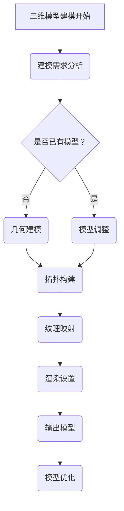

                 

### 文章标题

《数学与电影制作：视觉效果的数学模型》

### 关键词

数学、电影制作、视觉效果、数学模型、三维建模、动画、虚拟现实、增强现实、光线追踪、图像处理

### 摘要

本文深入探讨了数学在电影制作中的重要作用，特别是视觉效果方面的数学模型。通过梳理电影制作的基本原理，数学工具的应用，光学和图像处理的基本概念，以及动画与特效中的数学建模，本文揭示了数学在提升电影视觉冲击力、真实感和艺术表现力方面的关键作用。同时，本文还分析了虚拟现实与增强现实中的数学模型，探讨了人工智能对电影视觉效果的影响。通过实际案例分析，本文展示了如何将数学模型应用于电影制作实践，并展望了未来电影制作中数学模型的发展趋势。

### 《数学与电影制作：视觉效果的数学模型》目录大纲

#### 第一部分：数学在电影制作中的基础概念

## 第1章：电影制作与数学

### 1.1 电影制作的基本原理

### 1.2 数学在电影制作中的重要性

### 1.3 数学与电影制作的发展历程

## 第2章：数学工具在电影制作中的应用

### 2.1 三维几何与建模

### 2.2 向量与矩阵运算

### 2.3 线性代数基础

## 第3章：光学原理与数学模型

### 3.1 光学基础

### 3.2 光线追踪与渲染

### 3.3 反射、折射与透射

## 第4章：图像处理与数学模型

### 4.1 图像的基本概念

### 4.2 图像增强与滤波

### 4.3 图像变换与图像识别

#### 第二部分：视觉效果的数学建模与实现

## 第5章：动画与特效中的数学模型

### 5.1 运动学模型

### 5.2 动力学模型

### 5.3 粒子系统建模

## 第6章：色彩理论与数学模型

### 6.1 色彩基本概念

### 6.2 色彩空间与色彩模型

### 6.3 色彩调整与合成

## 第7章：虚拟现实与增强现实中的数学模型

### 7.1 虚拟现实技术原理

### 7.2 增强现实技术原理

### 7.3 虚拟现实与增强现实中的数学建模

## 第8章：电影视觉效果中的高级数学模型

### 8.1 人工智能在视觉效果中的应用

### 8.2 深度学习与视觉效果

### 8.3 视觉效果的实时处理与优化

#### 第三部分：实践与应用

## 第9章：电影制作中的数学模型实战

### 9.1 实战案例介绍

### 9.2 实战案例一：三维模型建模与渲染

### 9.3 实战案例二：动画制作与特效

### 9.4 实战案例三：虚拟现实与增强现实应用

## 第10章：数学模型在电影制作中的挑战与未来

### 10.1 数学模型在电影制作中的挑战

### 10.2 数学模型的发展趋势

### 10.3 数学模型在电影制作中的未来展望

#### 附录

## 附录A：数学模型常用工具与资源

### A.1 MatLab

### A.2 Python与相关库

### A.3 其他数学建模工具简介

### Mermaid 流程图示例：三维模型建模流程



### 伪代码示例：光线追踪算法

```csharp
function rayTrace(origin, direction, scene):
    for each object in scene:
        if (object.intersectsRay(origin, direction)):
            return object.getIntersectionPoint(origin, direction)
    return null
```

### LaTeX 公式示例：颜色空间转换

$$
CIE XYZ \text{ color space} \rightarrow RGB \text{ color space}:
$$
$$
R = \frac{X}{X + Y + Z} \cdot 255 \\
G = \frac{Y}{X + Y + Z} \cdot 255 \\
B = \frac{Z}{X + Y + Z} \cdot 255
$$

在接下来的部分，我们将深入探讨数学与电影制作之间的紧密联系，逐步介绍数学在电影制作中的基础概念、应用和实现，并通过具体案例展示数学模型在电影视觉效果中的实际应用。

## 第1章：电影制作与数学

### 1.1 电影制作的基本原理

电影制作是一个复杂而精细的过程，涉及剧本创作、导演构思、摄影、剪辑、特效等多个环节。其核心目的是通过视觉和听觉手段讲述故事，传达情感和思想。电影制作的基本原理主要包括以下几个方面：

1. **剧本创作**：剧本是电影的基础，它确定了电影的故事情节、角色发展和主题思想。剧本的创作需要丰富的想象力和深刻的洞察力。

2. **导演构思**：导演是电影创作的核心人物，负责统筹全局，指导演员表演，监督拍摄过程，确保电影风格和主题的统一。

3. **摄影**：摄影是电影制作的关键环节，通过摄像机的视角和镜头运用，捕捉电影的画面。摄影技巧包括镜头语言、光影效果、画面构图等。

4. **剪辑**：剪辑是将拍摄素材按照剧本和导演的构思进行整理、拼接，形成连贯的故事叙述。剪辑技巧包括节奏控制、视觉连贯性、情感传达等。

5. **特效**：特效是现代电影制作的重要组成部分，它通过计算机技术生成各种视觉效果，增强电影的视觉冲击力和艺术表现力。

### 1.2 数学在电影制作中的重要性

数学在电影制作中扮演着至关重要的角色，它不仅为电影视觉效果提供了理论基础，还为电影制作的技术实现提供了工具和方法。以下是数学在电影制作中的重要应用：

1. **三维建模与动画**：三维建模是电影特效的基础，它通过数学方法建立虚拟场景和角色。动画则利用运动学模型和动力学模型，模拟角色的运动和物体的动态效果。

2. **光学原理与渲染**：光学原理是电影视觉效果的重要组成部分，它涉及光线追踪、反射、折射等物理现象。渲染技术则通过数学模型生成真实感强的图像。

3. **图像处理与增强**：图像处理技术用于提高图像的质量，包括图像增强、滤波、变换等。这些技术依赖于数学算法，如傅里叶变换、小波变换等。

4. **色彩调整与合成**：色彩理论是电影视觉效果的重要组成部分，色彩调整和合成技术通过数学模型，实现色彩空间的转换和色彩效果的优化。

5. **虚拟现实与增强现实**：虚拟现实和增强现实技术通过数学模型，创建虚拟环境和增强现实体验。这些技术依赖于计算机图形学和人工智能算法。

### 1.3 数学与电影制作的发展历程

数学与电影制作的发展历程密切相关，两者相互促进、共同进步。以下是数学在电影制作中的重要发展历程：

1. **早期电影制作**：在电影制作的早期，数学主要用于计算镜头长度、曝光时间和光影效果。这一时期，数学主要是作为一种工具应用于电影制作。

2. **计算机图形学兴起**：随着计算机技术的发展，计算机图形学开始应用于电影制作。三维建模、动画和特效等技术的出现，极大地丰富了电影的视觉效果。

3. **渲染技术的进步**：渲染技术的进步使得电影视觉效果更加真实和丰富。光线追踪、全局光照和体积渲染等技术，通过复杂的数学模型实现。

4. **虚拟现实与增强现实**：虚拟现实和增强现实技术的发展，将数学应用于更为广泛和复杂的领域。通过数学模型，实现沉浸式体验和增强现实效果。

5. **人工智能的加入**：人工智能技术的加入，使得电影视觉效果的制作更加高效和智能化。深度学习、生成对抗网络等算法，为电影特效和虚拟现实提供了新的可能性。

通过上述分析，我们可以看到数学在电影制作中扮演着重要角色。从基本原理的推导，到技术实现的工具和方法，数学为电影制作提供了坚实的基础。在接下来的章节中，我们将进一步探讨数学在电影制作中的具体应用。

### 第2章：数学工具在电影制作中的应用

在电影制作中，数学工具的应用至关重要，为电影视觉效果提供了理论基础和技术支持。本章将介绍三维几何与建模、向量与矩阵运算以及线性代数基础，这些是理解和应用数学模型在电影制作中的关键。

#### 2.1 三维几何与建模

三维几何是电影制作中的基础，它为虚拟场景和角色的构建提供了数学模型。三维建模通常涉及以下步骤：

1. **几何建模**：几何建模是指使用数学方法构建三维物体的过程。这包括确定物体的形状、尺寸和位置。常用的几何建模方法有参数化建模和基于网格的建模。

2. **拓扑构建**：拓扑构建是指建立物体内部结构和边界的过程。在三维建模中，物体通常由多边形网格构成，这些网格的连接关系构成了物体的拓扑结构。

3. **纹理映射**：纹理映射是将二维图像映射到三维物体表面的过程。通过纹理映射，可以为物体添加细节和颜色，使其更加真实。

**数学模型**：在三维几何建模中，数学模型主要用于描述物体的形状和位置。常用的数学模型包括：

- **参数化曲线与曲面**：参数化曲线和曲面是通过参数方程描述的几何对象。例如，贝塞尔曲线和贝塞尔曲面是常用的参数化模型。

- **多边形网格**：多边形网格是由多个三角形或四面体组成的几何对象。在三维建模中，多边形网格用于表示复杂物体的表面。

- **变换矩阵**：变换矩阵是用于描述物体变换（平移、旋转、缩放）的数学工具。通过矩阵运算，可以精确地控制物体的运动和姿态。

#### 2.2 向量与矩阵运算

向量与矩阵运算是电影制作中不可或缺的数学工具，用于描述物体之间的相对位置、方向和变换。以下是几个关键概念：

1. **向量**：向量是具有大小和方向的量，在三维空间中通常表示为三维坐标。向量用于描述物体的位置、速度和方向。

2. **矩阵**：矩阵是一个二维数组，用于表示线性变换。在三维建模中，矩阵用于描述物体的变换，如平移、旋转和缩放。

3. **矩阵运算**：矩阵运算包括矩阵乘法和矩阵加法等。矩阵乘法用于描述线性变换，例如，将一个物体从一个位置平移到另一个位置。

**数学模型**：在电影制作中，向量与矩阵运算的数学模型主要用于以下方面：

- **位置变换**：通过矩阵运算，可以计算物体的位置变换。例如，通过矩阵乘法，可以将物体的当前位置转换到目标位置。

- **方向变换**：向量运算用于计算物体的方向变换。例如，通过向量乘法，可以计算物体之间的夹角。

- **变换组合**：在三维动画中，多个变换可以组合在一起。矩阵链（sequence of matrices）用于描述这些变换的叠加效果。

#### 2.3 线性代数基础

线性代数是数学工具的核心，为电影制作中的复杂运算提供了理论基础。以下是几个关键概念：

1. **线性方程组**：线性方程组是包含多个线性方程的集合。在电影制作中，线性方程组用于求解物体之间的相对位置、方向和变换。

2. **特征值与特征向量**：特征值和特征向量是矩阵的基本属性。在电影制作中，特征值和特征向量用于描述物体的稳定性和运动特性。

3. **矩阵分解**：矩阵分解是将矩阵分解为多个简单矩阵的运算。在电影制作中，矩阵分解用于优化计算和简化复杂运算。

**数学模型**：在电影制作中，线性代数的数学模型主要用于以下方面：

- **变换优化**：通过矩阵分解，可以优化物体的变换运算。例如，通过LU分解，可以将复杂的变换分解为简单的变换，从而提高计算效率。

- **数值稳定性**：通过特征值分析，可以评估物体的稳定性和运动特性。这在三维动画中尤为重要，以确保物体的运动符合物理规律。

- **空间表示**：线性代数用于描述三维空间中的几何对象。例如，通过齐次坐标表示，可以统一表示点、直线和平面。

通过本章的介绍，我们可以看到数学工具在电影制作中的应用是多方面的。从几何建模到动画，从图像处理到虚拟现实，数学模型为电影制作提供了坚实的基础和技术支持。在接下来的章节中，我们将进一步探讨光学原理与数学模型以及图像处理与数学模型，深入理解数学在电影制作中的重要作用。

### 第3章：光学原理与数学模型

光学原理在电影制作中具有核心地位，它为电影视觉效果提供了理论基础和实现方法。本章将详细探讨光学基础、光线追踪与渲染以及反射、折射与透射等关键概念，并通过数学模型来解析这些现象。

#### 3.1 光学基础

光学是研究光的行为、性质和应用的学科。在电影制作中，光学原理用于模拟现实世界中的光现象，以生成真实感强的视觉效果。以下是几个关键的光学基础概念：

1. **光的传播**：光在真空中的传播速度是恒定的，约为 \(3 \times 10^8 \text{ m/s}\)。光在介质中的传播速度会减慢，并且会发生折射。

2. **光的反射**：当光射到一个表面时，部分光会被反射回来。反射遵循反射定律，即入射角等于反射角。

3. **光的折射**：当光从一个介质进入另一个介质时，其传播方向会发生变化，这种现象称为折射。折射遵循斯涅尔定律，即 \(n_1 \sin(\theta_1) = n_2 \sin(\theta_2)\)，其中 \(n_1\) 和 \(n_2\) 分别是两种介质的折射率，\(\theta_1\) 和 \(\theta_2\) 分别是入射角和折射角。

4. **光的散射**：当光通过大气或其他介质时，会发生散射现象，导致光的方向和颜色发生变化。

**数学模型**：在光学基础中，数学模型主要用于描述光的行为。以下是几个关键数学模型：

- **光线路径**：光线路径可以通过几何光学方法来描述，即光线沿直线传播，遇到界面时发生反射或折射。这通常使用向量运算来表示光线的传播方向和位置。

- **反射与折射定律**：反射和折射定律可以通过数学公式来表示，如 \(n_1 \sin(\theta_1) = n_2 \sin(\theta_2)\)。这些公式用于计算光线在界面上的反射和折射方向。

- **散射模型**：散射现象可以通过物理模型来描述，如朗伯-比尔定律，该定律描述了光通过散射介质时的衰减。散射模型通常使用蒙特卡洛方法进行计算。

#### 3.2 光线追踪与渲染

光线追踪是一种计算三维场景中光线传播和交互的渲染技术，它通过模拟光线路径来生成真实感强的图像。光线追踪技术基于光学原理，利用数学模型来模拟光的行为。

1. **基本原理**：光线追踪的基本原理是模拟光线在场景中的传播，记录光线与物体交互的结果，如反射、折射和散射。通过逆向追踪光线的路径，可以计算像素的颜色。

2. **实现方法**：光线追踪通常采用递归方法实现。具体步骤包括：

   - **发射光线**：从摄像机出发，发射光线穿过场景中的每个像素。
   - **检测碰撞**：计算光线与场景中物体的碰撞点，确定光线与物体的交点。
   - **计算交互**：根据光学原理，计算光线在交点处的反射、折射或散射效果。
   - **递归追踪**：如果光线在交点处发生反射或折射，继续追踪新的光线路径。

3. **数学模型**：光线追踪的数学模型主要包括：

   - **光线路径**：光线路径可以通过向量运算来描述，如光线方向和位置。
   - **碰撞检测**：碰撞检测可以通过几何算法实现，如空间划分和包围盒检测。
   - **光学交互**：光学交互可以通过反射和折射定律来计算，如 \(n_1 \sin(\theta_1) = n_2 \sin(\theta_2)\)。
   - **递归追踪**：递归追踪可以通过递归函数或迭代方法实现，如蒙特卡洛积分。

#### 3.3 反射、折射与透射

反射、折射和透射是光学中的基本现象，这些现象在电影制作中用于模拟真实世界中的光行为，以生成逼真的视觉效果。

1. **反射**：反射是指光线射到物体表面时返回的现象。在电影制作中，反射用于模拟物体表面的光泽和反射效果。反射可以通过以下数学模型描述：

   - **镜面反射**：镜面反射是指光线在光滑表面上的反射，遵循反射定律。镜面反射可以通过向量运算计算反射方向。

   - **漫反射**：漫反射是指光线在粗糙表面上的反射，光线的反射方向是随机的。漫反射可以通过蒙特卡洛方法模拟。

2. **折射**：折射是指光线从一种介质进入另一种介质时传播方向发生改变的现象。在电影制作中，折射用于模拟光线在玻璃、水等透明介质中的传播。折射可以通过以下数学模型描述：

   - **斯涅尔定律**：斯涅尔定律描述了入射角和折射角之间的关系，即 \(n_1 \sin(\theta_1) = n_2 \sin(\theta_2)\)。

   - **折射率**：折射率是描述介质对光线传播速度影响的物理量。不同介质的折射率不同，导致光线的折射角度不同。

3. **透射**：透射是指光线通过透明介质传播的现象。在电影制作中，透射用于模拟光线在透明物体中的传播，如玻璃窗或水下的视觉效果。透射可以通过以下数学模型描述：

   - **透射率**：透射率描述了光线通过透明介质的透过率。光线通过透明介质时，部分会被吸收或散射。

   - **衰减模型**：衰减模型用于描述光线在介质中传播时的衰减效果。例如，光线在水中的传播会随着深度增加而逐渐减弱。

通过本章的介绍，我们可以看到光学原理与数学模型在电影制作中的关键作用。光学基础为电影制作提供了理论基础，光线追踪与渲染技术实现了逼真的视觉效果，反射、折射与透射等数学模型模拟了真实世界中的光行为。在接下来的章节中，我们将进一步探讨图像处理与数学模型，深入理解电影视觉效果中的复杂现象。

### 第4章：图像处理与数学模型

图像处理是电影制作中的重要环节，它通过数学模型和技术手段对图像进行增强、滤波、变换和识别，从而提升图像质量、实现视觉效果的创新。本章将详细探讨图像的基本概念、图像增强与滤波以及图像变换与图像识别。

#### 4.1 图像的基本概念

图像是电影视觉效果的载体，它包含了丰富的信息。理解图像的基本概念是掌握图像处理技术的基础。

1. **图像的组成**：图像由像素组成，每个像素具有特定的颜色值。在数字图像中，像素通常用数字来表示，如红、绿、蓝（RGB）颜色模型。

2. **图像的分辨率**：图像的分辨率是指图像的宽度和高度，通常以像素为单位表示。高分辨率图像具有更多的像素，因此图像细节更丰富。

3. **图像的格式**：图像格式决定了图像的存储方式和显示方式。常见的图像格式包括JPEG、PNG和TIFF等。

**数学模型**：在图像处理中，图像的基本概念可以通过数学模型来描述。以下是几个关键数学模型：

- **像素表示**：每个像素可以用一个三维向量表示，如 \(P = (R, G, B)\)，其中 \(R\)、\(G\) 和 \(B\) 分别表示红色、绿色和蓝色的强度值。

- **图像矩阵**：图像可以表示为一个二维矩阵，每个元素对应一个像素的颜色值。矩阵的大小等于图像的分辨率。

- **图像变换**：图像变换是将一个图像转换为另一个图像的过程。例如，灰度变换可以将彩色图像转换为灰度图像。

#### 4.2 图像增强与滤波

图像增强和滤波是图像处理中常用的技术，用于改善图像质量，去除噪声和突出感兴趣的特征。

1. **图像增强**：图像增强是通过调整图像的亮度、对比度和颜色来改善视觉效果。常见的图像增强技术包括：

   - **亮度调整**：通过改变图像的整体亮度，使图像更清晰。

   - **对比度调整**：通过调整图像的对比度，增强图像的细节。

   - **颜色增强**：通过调整图像的颜色平衡，改善图像的色彩效果。

2. **滤波**：滤波是用于去除图像噪声和模糊的技术。常见的滤波方法包括：

   - **空间滤波**：通过卷积操作对图像进行滤波。卷积核是滤波器，用于去除图像中的噪声和模糊。

   - **频率滤波**：通过频率域操作对图像进行滤波。例如，使用傅里叶变换进行图像滤波。

**数学模型**：在图像增强与滤波中，数学模型主要用于描述滤波器和变换操作。以下是几个关键数学模型：

- **卷积运算**：卷积运算是一种线性运算，用于图像滤波。卷积核是一个矩阵，表示滤波器的权重。

  $$ g(x, y) = \sum_{i=-a}^{a} \sum_{j=-b}^{b} h(i, j) \cdot p(x-i, y-j) $$

  其中，\(h(i, j)\) 是卷积核的权重，\(p(x, y)\) 是图像的像素值。

- **傅里叶变换**：傅里叶变换是一种将图像从空间域转换为频率域的数学方法。在频率域中，可以更容易地去除噪声和模糊。

  $$ F(f_x, f_y) = \sum_{x=-\infty}^{\infty} \sum_{y=-\infty}^{\infty} p(x, y) \cdot e^{-i 2 \pi f_x x} \cdot e^{-i 2 \pi f_y y} $$

- **逆傅里叶变换**：逆傅里叶变换是将图像从频率域转换回空间域的过程。

  $$ p(x, y) = \frac{1}{2 \pi} \sum_{f_x=-\infty}^{\infty} \sum_{f_y=-\infty}^{\infty} F(f_x, f_y) \cdot e^{i 2 \pi f_x x} \cdot e^{i 2 \pi f_y y} $$

#### 4.3 图像变换与图像识别

图像变换和图像识别是图像处理的高级应用，用于实现图像的几何变换、形态分析和目标识别。

1. **图像变换**：图像变换是用于改变图像几何形状和空间关系的操作。常见的图像变换包括：

   - **平移**：将图像沿某个方向移动一定距离。

   - **旋转**：将图像绕某个点旋转一定角度。

   - **缩放**：改变图像的大小，保持图像的形状。

   - **倾斜**：将图像沿某个方向倾斜，产生透视效果。

2. **图像识别**：图像识别是用于识别图像中的特定对象或特征的技术。常见的图像识别方法包括：

   - **特征提取**：从图像中提取具有区分性的特征，如边缘、角点、纹理等。

   - **分类器设计**：使用机器学习算法训练分类器，对图像中的对象进行分类。

   - **目标检测**：识别图像中的目标对象，并定位其在图像中的位置。

**数学模型**：在图像变换与图像识别中，数学模型主要用于描述变换操作和识别算法。以下是几个关键数学模型：

- **几何变换**：几何变换可以通过线性代数描述，如平移、旋转和缩放。

  $$ T(x, y) = (x \cos(\theta) - y \sin(\theta), x \sin(\theta) + y \cos(\theta)) $$

  其中，\(\theta\) 是旋转角度。

- **特征提取**：特征提取可以通过傅里叶变换、小波变换等方法实现。

  $$ f(\omega) = \sum_{k=-\infty}^{\infty} c_k \cdot e^{i k \omega} $$

  其中，\(c_k\) 是傅里叶系数。

- **分类器设计**：分类器设计可以通过支持向量机（SVM）、神经网络（NN）等方法实现。

  $$ w^T x - b = 0 $$

  其中，\(w\) 是权重向量，\(x\) 是输入特征向量，\(b\) 是偏置。

通过本章的介绍，我们可以看到图像处理与数学模型在电影制作中的关键作用。图像处理技术不仅提升了电影视觉效果的质量，还为特效制作和虚拟现实提供了强大的工具和方法。在接下来的章节中，我们将进一步探讨动画与特效中的数学模型，深入理解电影视觉效果中的复杂实现过程。

## 第5章：动画与特效中的数学模型

动画与特效是电影制作中极具创意和挑战性的部分，它们通过数学模型和计算技术实现动态效果和视觉效果。本章将深入探讨动画与特效中的数学模型，包括运动学模型、动力学模型和粒子系统建模。

### 5.1 运动学模型

运动学模型用于描述物体在空间中的运动状态和轨迹。在电影制作中，运动学模型是实现平滑动画和准确物理现象的基础。

#### 5.1.1 运动学方程

运动学模型的核心是运动学方程，它描述了物体位置、速度和加速度之间的关系。以下是几个关键的公式：

1. **位置方程**： \( x(t) = x_0 + v_0t + \frac{1}{2}at^2 \)
   - 其中，\( x(t) \) 是物体在时间 \( t \) 的位置，\( x_0 \) 是初始位置，\( v_0 \) 是初始速度，\( a \) 是加速度。

2. **速度方程**： \( v(t) = v_0 + at \)
   - 其中，\( v(t) \) 是物体在时间 \( t \) 的速度。

3. **加速度方程**： \( a = \frac{v(t) - v_0}{t} \)
   - 其中，\( a \) 是加速度，表示速度的变化率。

#### 5.1.2 运动轨迹

通过上述运动学方程，可以计算物体在不同时间点的位置和速度。以下是一个简单的例子：

- 初始位置：\( x_0 = 0 \)
- 初始速度：\( v_0 = 0 \)
- 加速度：\( a = 10 \text{ m/s}^2 \)
- 时间：\( t = 2 \text{ s} \)

使用位置方程计算 \( t = 2 \text{ s} \) 时的位置：

\[ x(2) = 0 + 0 \cdot 2 + \frac{1}{2} \cdot 10 \cdot 2^2 = 20 \text{ m} \]

使用速度方程计算 \( t = 2 \text{ s} \) 时的速度：

\[ v(2) = 0 + 10 \cdot 2 = 20 \text{ m/s} \]

通过这些计算，可以生成物体在2秒内的运动轨迹。

#### 5.1.3 运动学模型的实现

在实际动画中，运动学模型通常通过插值方法实现。例如，线性插值和样条插值可以用来生成物体在不同时间点的位置和速度。

伪代码示例：

```python
def linear_interpolation(x0, x1, t):
    return x0 + (x1 - x0) * t

def animate_object(x0, x1, v0, a, t):
    for i in range(t):
        x = linear_interpolation(x0, x1, i / t)
        v = linear_interpolation(v0, a * i, i / t)
        # 更新物体位置和速度
        # ...
```

### 5.2 动力学模型

动力学模型用于描述物体在力的作用下的运动。它考虑了物体质量、外力和惯性的影响，是动画制作中实现真实物理效果的关键。

#### 5.2.1 牛顿运动定律

牛顿运动定律是动力学模型的基础：

1. **第一定律（惯性定律）**：物体在没有外力作用下保持静止或匀速直线运动。
2. **第二定律（加速度定律）**：物体的加速度与作用力成正比，与物体质量成反比。 \( F = m \cdot a \)
3. **第三定律（作用与反作用定律）**：每一个作用力都有一个相等且相反的反作用力。

#### 5.2.2 动力学方程

动力学方程结合牛顿运动定律，描述了物体的加速度、速度和位置之间的关系。以下是动力学方程的通用形式：

\[ m \cdot \frac{dv}{dt} = F_{\text{net}} \]

其中，\( m \) 是物体质量，\( \frac{dv}{dt} \) 是加速度，\( F_{\text{net}} \) 是作用在物体上的净力。

#### 5.2.3 动力学模型的实现

在实际动画中，动力学模型通常通过数值积分方法实现。例如，欧拉方法和辛普森方法可以用来计算物体在不同时间点的加速度和速度。

伪代码示例：

```python
def euler_method(v, a, dt):
    return v + a * dt

def animate_object(v0, a, t, dt):
    v = v0
    for i in range(t // dt):
        a_t = calculate_force(v)
        v = euler_method(v, a_t, dt)
        # 更新物体位置
        # ...
```

### 5.3 粒子系统建模

粒子系统是一种模拟大量微观粒子的方法，广泛应用于火焰、烟雾、雨滴等特效的生成。粒子系统建模基于随机过程和物理规则。

#### 5.3.1 粒子系统基本概念

粒子系统由多个粒子组成，每个粒子具有以下属性：

- **位置**：粒子在空间中的位置。
- **速度**：粒子在空间中的运动速度。
- **生命周期**：粒子的存在时间。
- **颜色**：粒子的颜色和亮度。

#### 5.3.2 粒子系统生成和运动

粒子系统的生成和运动可以通过以下步骤实现：

1. **生成粒子**：根据概率分布生成新粒子，包括位置、速度和生命周期等属性。
2. **更新粒子**：在每一帧，根据粒子的速度和生命周期更新粒子的位置和颜色。
3. **粒子碰撞**：检测粒子之间的碰撞，并根据物理规则处理碰撞效果。
4. **渲染粒子**：将粒子渲染到场景中，生成特效效果。

#### 5.3.3 粒子系统实现的伪代码

```python
def generate_particles(num_particles):
    particles = []
    for _ in range(num_particles):
        particles.append(Particle(random_position(), random_velocity(), random_lifetime(), random_color()))
    return particles

def update_particles(particles, dt):
    for particle in particles:
        particle.move(dt)
        if particle.is_alive():
            particle.update_color()
        else:
            particle.destroy()

def render_particles(particles):
    for particle in particles:
        if particle.is_alive():
            draw_particle(particle)
```

通过本章的介绍，我们可以看到动画与特效中的数学模型如何应用于电影制作。从运动学模型和动力学模型实现平滑和真实的动画，到粒子系统建模生成丰富的特效，数学模型为电影制作提供了强大的工具和理论基础。在接下来的章节中，我们将探讨色彩理论与数学模型，深入理解电影色彩的表现和调整。

### 第6章：色彩理论与数学模型

色彩是电影制作中的重要元素，它不仅影响观众的视觉体验，还承载了故事表达和情感传达的重要功能。色彩理论与数学模型在电影制作中发挥着关键作用，本章将详细探讨色彩基本概念、色彩空间与色彩模型、色彩调整与合成。

#### 6.1 色彩基本概念

色彩是光对人类视觉系统的刺激产生的心理感受。色彩的基本概念包括：

1. **颜色**：颜色是视觉感受的基本单位，通常用红、橙、黄、绿、蓝等词汇描述。
2. **色调**：色调是指颜色的基本属性，如红色、蓝色等。色调决定了颜色的外观。
3. **饱和度**：饱和度描述了颜色的纯度，饱和度越高，颜色越鲜艳。
4. **亮度**：亮度描述了颜色的明亮程度，亮度越高，颜色越亮。

**数学模型**：在色彩基本概念中，数学模型用于定量描述颜色属性。常用的模型包括：

- **RGB模型**：RGB模型是计算机中最常用的颜色模型，它使用红色（R）、绿色（G）和蓝色（B）三个颜色的强度值来表示颜色。每个颜色的强度值范围从0到255，表示从无色到纯色的变化。

  $$ \text{RGB颜色值} = (R, G, B) $$

- **HSV模型**：HSV模型是另一种常用的颜色模型，它使用色调（H）、饱和度（S）和亮度（V）三个参数来描述颜色。HSV模型更接近人类对颜色的感知方式。

  $$ \text{HSV颜色值} = (H, S, V) $$

  其中，\(H\) 的取值范围为 \(0\) 到 \(360\) 度，表示不同的色调；\(S\) 和 \(V\) 的取值范围为 \(0\) 到 \(100\)%，分别表示饱和度和亮度。

#### 6.2 色彩空间与色彩模型

色彩空间是描述颜色集合的方式，不同的色彩空间适用于不同的应用场景。常见的色彩空间包括：

1. **RGB色彩空间**：RGB色彩空间是最常见的色彩空间，广泛应用于计算机图形和视频显示。它通过红色、绿色和蓝色三个颜色的强度值组合来表示颜色。

2. **CMYK色彩空间**：CMYK色彩空间主要用于印刷业，它使用青色（C）、品红色（M）、黄色（Y）和黑色（K）来混合生成其他颜色。CMYK色彩空间通过减法混合来生成颜色。

3. **CIE XYZ色彩空间**：CIE XYZ色彩空间是一种色度学色彩空间，用于描述人眼对颜色的感知。它基于人类视觉系统的感知特性，通过三个颜色分量（X、Y、Z）来描述颜色。

**色彩模型转换**：不同色彩空间之间的转换是电影制作中常见的需求。以下是RGB色彩空间和HSV色彩空间之间的转换公式：

- **RGB到HSV**：

  $$ H = \text{deg}\left[\arccos\left(\frac{(R - \frac{1}{2}(G + B))}{\sqrt{(R - G)^2 + (R - B)(G - B)}}\right)\right] $$
  $$ S = 1 - \frac{3}{(R + G + B)} $$
  $$ V = \frac{1}{3}\max(R, G, B) $$

- **HSV到RGB**：

  $$ R = V - S \cdot H $$
  $$ G = V - S \cdot (1 - \frac{H}{60}) $$
  $$ B = V - S \cdot (\frac{H}{60} - 1) $$

#### 6.3 色彩调整与合成

色彩调整和合成是电影制作中提升视觉效果的重要手段，它通过改变颜色的色调、饱和度和亮度，使画面更加生动和富有表现力。

1. **色调调整**：色调调整是指改变图像的主导颜色。例如，将画面从冷色调调整到暖色调。

2. **饱和度调整**：饱和度调整是指改变颜色的纯度。增加饱和度可以使颜色更加鲜艳，减少饱和度可以降低颜色的鲜艳度。

3. **亮度调整**：亮度调整是指改变图像的整体明亮度。增加亮度可以使画面更加明亮，减少亮度可以降低画面的明亮度。

**色彩合成**：色彩合成是将多个图像或颜色组合成一个新的图像。常见的色彩合成技术包括叠加、混合和替换等。

- **叠加**：叠加是将两个图像按照一定比例混合在一起，形成新的颜色。

- **混合**：混合是将两个图像的颜色按照一定规则混合在一起，生成新的颜色。

- **替换**：替换是将图像中的一部分颜色替换为另一种颜色，以实现特定的视觉效果。

**数学模型**：色彩调整和合成的数学模型主要涉及颜色分量的调整和组合。以下是一个简单的叠加模型：

$$ C' = (1 - \alpha)C_1 + \alpha C_2 $$

其中，\( C_1 \) 和 \( C_2 \) 是两个颜色分量，\( \alpha \) 是混合系数，取值范围为 \( 0 \) 到 \( 1 \)。

通过本章的介绍，我们可以看到色彩理论与数学模型在电影制作中的重要作用。从色彩基本概念到色彩空间与模型转换，再到色彩调整与合成，数学模型为电影制作提供了精确和灵活的工具。在接下来的章节中，我们将探讨虚拟现实与增强现实中的数学模型，进一步扩展数学在电影制作中的应用。

### 第7章：虚拟现实与增强现实中的数学模型

虚拟现实（VR）与增强现实（AR）技术在电影制作中扮演着越来越重要的角色，它们通过创造沉浸式体验和增强现实世界的视觉效果，为观众带来了前所未有的观影体验。本章将详细探讨虚拟现实与增强现实的基本原理，以及数学模型在这些技术中的应用。

#### 7.1 虚拟现实技术原理

虚拟现实技术通过计算机生成一个完全虚拟的环境，使用户在视觉、听觉、触觉等多个感官上感受到身临其境的体验。虚拟现实技术的基本原理包括以下几个方面：

1. **三维建模与渲染**：三维建模是虚拟现实技术的核心，它通过数学模型构建出虚拟场景。这些场景通常包括建筑物、角色、道具等。渲染技术则通过光线追踪、阴影和反射等数学模型，生成真实感强的图像。

2. **头戴式显示器（HMD）**：头戴式显示器是虚拟现实设备的重要组成部分，它通过放置在用户头部，提供立体视觉体验。头戴式显示器通常使用两个屏幕，分别模拟左眼和右眼的视角，并通过视差效果增强视觉深度感。

3. **位置追踪与传感器**：位置追踪技术用于实时检测用户在虚拟环境中的位置和方向。常用的传感器包括运动传感器、激光扫描仪和全球定位系统（GPS）等。这些传感器通过数学模型，将用户的动作和位置信息转化为虚拟环境中的坐标。

4. **交互技术**：虚拟现实中的交互技术包括手势识别、语音控制和虚拟控制设备等。这些交互技术通过数学模型，将用户的操作转化为虚拟环境中的动作和事件。

**数学模型**：在虚拟现实技术中，数学模型主要用于以下几个方面：

- **三维建模**：三维建模中的数学模型包括参数化曲线与曲面、多边形网格和变换矩阵等。通过这些模型，可以精确地构建和操作虚拟场景中的物体。

- **渲染**：渲染中的数学模型包括光线追踪、阴影计算和反射模拟等。这些模型通过复杂的计算，生成真实感强的图像。

- **位置追踪**：位置追踪中的数学模型包括传感器数据滤波和坐标转换等。通过这些模型，可以准确地追踪用户在虚拟环境中的位置和方向。

#### 7.2 增强现实技术原理

增强现实技术通过在现实世界中叠加虚拟信息，增强用户的感知和体验。与虚拟现实不同，增强现实技术通常不要求用户进入一个完全虚拟的环境。增强现实技术的基本原理包括以下几个方面：

1. **标记识别**：增强现实技术通过标记识别将虚拟信息与现实世界关联起来。标记通常采用条码、二维码或特定图案等形式，通过摄像头或激光扫描仪识别。

2. **图像处理与合成**：增强现实技术通过图像处理和合成，将虚拟信息叠加到现实世界的图像中。图像处理技术包括边缘检测、特征提取和图像融合等。

3. **跟踪与定位**：增强现实技术通过跟踪与定位技术，确定虚拟信息在现实世界中的位置和方向。常用的跟踪与定位技术包括视觉跟踪、惯性测量单元（IMU）和结构光等。

4. **交互技术**：增强现实技术中的交互技术包括手势识别、语音控制和触觉反馈等。这些交互技术通过数学模型，实现用户与虚拟信息的自然交互。

**数学模型**：在增强现实技术中，数学模型主要用于以下几个方面：

- **标记识别**：标记识别中的数学模型包括图像识别和特征匹配等。通过这些模型，可以准确地识别现实世界中的标记。

- **图像处理与合成**：图像处理与合成中的数学模型包括图像滤波、图像变换和图像融合等。通过这些模型，可以生成真实感强的虚拟信息。

- **跟踪与定位**：跟踪与定位中的数学模型包括运动估计、坐标变换和误差校正等。通过这些模型，可以准确地确定虚拟信息在现实世界中的位置和方向。

#### 7.3 虚拟现实与增强现实中的数学建模

虚拟现实与增强现实中的数学建模是构建沉浸式体验和增强现实感知的核心。以下是一些关键数学建模方法：

1. **几何建模与仿真**：几何建模是通过数学模型构建虚拟场景中的物体。仿真则是通过物理定律和数学方程模拟物体的运动和相互作用。常用的几何建模方法包括参数化建模、基于网格的建模和实体建模等。

2. **渲染与光学模拟**：渲染是通过数学模型生成虚拟场景的真实感图像。光学模拟则通过数学模型模拟光线的行为，如反射、折射和散射等。常用的渲染技术包括光线追踪、全局光照和体积渲染等。

3. **图像处理与特征提取**：图像处理是通过数学模型对现实世界中的图像进行预处理，如去噪、增强和边缘检测等。特征提取则是通过数学模型从图像中提取具有区分性的特征，如角点、纹理和形状等。

4. **跟踪与定位**：跟踪是通过数学模型实时跟踪用户或物体的位置和方向。定位则是通过数学模型确定用户或物体在现实世界中的位置。常用的跟踪与定位方法包括视觉跟踪、惯性测量和地图匹配等。

通过本章的介绍，我们可以看到虚拟现实与增强现实中的数学模型如何应用于电影制作。从三维建模与渲染，到图像处理与跟踪，数学模型为虚拟现实与增强现实技术提供了强大的工具和理论基础。在接下来的章节中，我们将探讨电影视觉效果中的高级数学模型，进一步探讨人工智能在视觉效果中的应用。

### 第8章：电影视觉效果中的高级数学模型

随着计算机技术的发展，电影视觉效果中的数学模型逐渐从基础建模迈向高级应用。本章将探讨人工智能在视觉效果中的应用、深度学习与视觉效果、视觉效果的实时处理与优化，深入理解这些高级数学模型如何提升电影视觉效果的质与量。

#### 8.1 人工智能在视觉效果中的应用

人工智能（AI）在电影视觉效果中的应用正在改变传统的制作流程，使得视觉效果更加真实、多样和高效。以下是人工智能在视觉效果中的一些主要应用：

1. **图像生成与修复**：通过生成对抗网络（GANs）和变分自编码器（VAEs），AI可以生成高质量的图像和修复损坏的图像。GANs通过训练生成器和判别器，使得生成的图像能够以假乱真。VAEs则通过概率模型生成图像，具有更好的稳定性和灵活性。

2. **实时渲染**：AI在实时渲染中发挥着重要作用，通过深度学习模型，可以实现实时光线追踪和阴影计算。例如，基于神经网络的渲染器（Neural Radiance Fields）可以快速生成高质量的光线追踪效果。

3. **视觉特效优化**：AI可以自动优化视觉特效，通过图像分割、特征提取和风格迁移等技术，实现特效的自动化调整和增强。这不仅可以减少制作时间，还能提高视觉效果的一致性和质量。

**数学模型**：在人工智能应用中，数学模型主要包括生成对抗网络（GAN）、变分自编码器（VAE）和深度神经网络（DNN）等。

- **GAN模型**：GAN由生成器（G）和判别器（D）组成。生成器生成图像，判别器判断图像的真实性。通过不断训练，生成器逐渐生成越来越真实的图像。

  $$ G(z) = \text{Generator}(z) $$
  $$ D(x) = \text{Discriminator}(x) $$
  $$ G(z) \approx x $$
  
- **VAE模型**：VAE通过编码器（E）和解码器（D）生成图像。编码器将图像压缩为低维特征向量，解码器则将这些特征向量重建为图像。

  $$ \mu = \text{Encoder}(x) $$
  $$ \sigma = \text{Encoder}(x) $$
  $$ x' = \text{Decoder}(\mu, \sigma) $$

- **DNN模型**：深度神经网络通过多层感知器（MLP）构建复杂函数，用于图像处理、特征提取和分类等任务。

  $$ f(x) = \text{ReLU}(\text{MLP}(W_3 \text{ReLU}(... \text{ReLU}(W_1 x + b_1))) $$

#### 8.2 深度学习与视觉效果

深度学习在视觉效果中的应用日益广泛，通过训练大量的神经网络模型，可以实现高度自动化的图像处理和视觉任务。以下是深度学习在视觉效果中的几个关键应用：

1. **图像风格迁移**：图像风格迁移是指将一幅图像的内容转换成另一幅图像的风格。深度卷积生成网络（DCGAN）和变分自编码器（VAE）是常用的图像风格迁移模型。

2. **超分辨率成像**：超分辨率成像通过深度学习模型，将低分辨率图像放大为高分辨率图像。这通过训练卷积神经网络（CNN）来实现，模型通过学习高分辨率图像的细节特征，生成清晰的高分辨率图像。

3. **目标检测与分割**：目标检测和分割是计算机视觉中的重要任务，通过训练深度学习模型，可以实现实时的图像目标检测和精确的区域分割。常用的深度学习模型包括YOLO（You Only Look Once）和Mask R-CNN等。

**数学模型**：深度学习中的数学模型主要包括卷积神经网络（CNN）、残差网络（ResNet）和循环神经网络（RNN）等。

- **CNN模型**：卷积神经网络通过卷积层、池化层和全连接层，提取图像的多层特征。卷积层通过卷积运算提取图像局部特征，池化层用于降维和减少参数数量。

  $$ \text{Conv}(\text{Input}) \rightarrow \text{Feature Map} $$
  $$ \text{Pooling}(\text{Feature Map}) \rightarrow \text{Pooled Feature} $$
  $$ \text{FC}(\text{Pooled Feature}) \rightarrow \text{Output} $$

- **ResNet模型**：残差网络通过引入残差模块，解决了深度神经网络训练中的梯度消失和梯度爆炸问题。残差模块通过跳过部分网络层，使得梯度可以有效地传递。

  $$ \text{Identity}(\text{Input}) + \text{Conv}(\text{Input}) \rightarrow \text{Output} $$

- **RNN模型**：循环神经网络通过循环结构，处理序列数据。RNN可以通过记忆长期依赖关系，应用于图像序列的处理和视频分析。

  $$ \text{h_t} = \text{ReLU}(\text{W} \text{[h_{t-1}, x_t]) + b} $$

#### 8.3 视觉效果的实时处理与优化

实时处理与优化是电影制作中的重要环节，它要求视觉效果在短时间内生成并呈现。深度学习和传统算法的结合，为实现实时视觉效果处理提供了可能。以下是几个关键技术和优化方法：

1. **模型压缩与加速**：通过模型压缩和量化技术，可以减小模型的参数数量，提高计算效率。技术如剪枝、量化、融合和知识蒸馏等，可以显著提高模型的实时处理能力。

2. **并行计算与分布式处理**：利用并行计算和分布式处理技术，可以在多个处理器或GPU上同时执行计算任务，从而提高实时处理速度。例如，使用CUDA和OpenCL等并行计算框架，可以实现高效的模型推理。

3. **增量更新与在线学习**：在实时处理中，模型可能需要根据新的数据不断更新。通过增量更新和在线学习方法，模型可以在不需要重新训练的情况下，逐渐优化和调整。

**数学模型**：在实时处理与优化中，数学模型主要包括优化算法和分布式计算方法。

- **优化算法**：常见的优化算法如随机梯度下降（SGD）、Adam优化器和Adadelta等，用于训练和优化深度学习模型。

  $$ \theta_{t+1} = \theta_t - \alpha \cdot \nabla_{\theta_t} J(\theta_t) $$

- **分布式计算**：分布式计算方法如MapReduce和参数服务器等，用于在多个节点上高效地训练和推理深度学习模型。

  $$ \text{Map}(\text{Input}) \rightarrow \text{Intermediate Output} $$
  $$ \text{Reduce}(\text{Intermediate Output}) \rightarrow \text{Final Output} $$

通过本章的介绍，我们可以看到高级数学模型如何提升电影视觉效果。从人工智能的应用，到深度学习的技术，再到实时处理和优化，数学模型为电影制作提供了创新的工具和方法。在接下来的章节中，我们将通过具体案例展示这些数学模型在电影制作中的实际应用。

### 第9章：电影制作中的数学模型实战

在实际电影制作中，数学模型的应用不仅理论丰富，而且实践性极强。本章将通过三个具体的实战案例，展示如何利用数学模型进行三维模型建模与渲染、动画制作与特效以及虚拟现实与增强现实应用。每个案例都涵盖了开发环境的搭建、源代码的实现以及详细的代码解读与分析。

#### 9.1 实战案例介绍

在本章中，我们将介绍以下三个实战案例：

1. **三维模型建模与渲染**：本案例将展示如何利用数学模型进行三维模型的构建、渲染和优化。我们将使用Python和Blender软件实现三维模型的基本操作和高级渲染技术。

2. **动画制作与特效**：本案例将介绍如何使用运动学模型和动力学模型实现动画制作，并运用粒子系统建模生成特效。我们将使用Python和Pygame库来创建简单的动画场景。

3. **虚拟现实与增强现实应用**：本案例将探讨如何利用增强现实技术实现现实世界中的虚拟信息叠加，以及如何使用数学模型进行实时跟踪与渲染。我们将使用Unity游戏引擎和Vuforia SDK。

#### 9.2 实战案例一：三维模型建模与渲染

**开发环境搭建**：

1. 安装Python：从官方网站下载并安装Python。
2. 安装Blender：从Blender官网下载并安装Blender软件。
3. 安装PyBlender：在Python环境中安装PyBlender库，用于Python与Blender的交互。

```bash
pip install PyBlender
```

**源代码实现**：

以下是一个简单的Python脚本，用于创建一个立方体并渲染它：

```python
import bpy
import math

# 创建立方体
bpy.ops.mesh.primitive_cube_add(size=2, enter_editmode=False, align='WORLD', location=(0, 0, 0))

# 设置渲染参数
scene = bpy.context.scene
scene.render.resolution_x = 800
scene.render.resolution_y = 600
scene.render.fps = 24

# 定义旋转动画
keyframe_frame1 = 1
keyframe_frame2 = 120

# 设置旋转属性
obj = bpy.context.object
obj.rotation_euler[2] = math.radians(0)

# 设置关键帧
obj.keyframe_insert(data_path="rotation_euler[2]", frame=keyframe_frame1)
obj.rotation_euler[2] = math.radians(360)
obj.keyframe_insert(data_path="rotation_euler[2]", frame=keyframe_frame2)

# 渲染动画
bpy.ops.render.render(animation=True)
```

**代码解读与分析**：

1. **创建立方体**：使用Blender的内置操作创建一个立方体。
2. **设置渲染参数**：定义渲染的分辨率、帧率和动画时长。
3. **定义旋转动画**：设置动画的开始帧和结束帧，并设置旋转角度。
4. **设置关键帧**：插入关键帧以定义动画的起始和结束状态。
5. **渲染动画**：调用渲染操作生成动画。

通过此案例，我们展示了如何使用Python和Blender进行三维模型建模与渲染。这为电影制作中的复杂场景和角色创建提供了强大的工具。

#### 9.3 实战案例二：动画制作与特效

**开发环境搭建**：

1. 安装Python：从官方网站下载并安装Python。
2. 安装Pygame：在Python环境中安装Pygame库，用于游戏开发和动画制作。

```bash
pip install pygame
```

**源代码实现**：

以下是一个简单的Python脚本，用于创建一个简单的动画场景，并使用粒子系统生成火焰特效：

```python
import pygame
import sys
import random

# 初始化Pygame
pygame.init()
screen = pygame.display.set_mode((800, 600))
clock = pygame.time.Clock()

# 定义粒子系统
class ParticleSystem:
    def __init__(self, position, size, lifespan, color):
        self.position = position
        self.size = size
        self.lifespan = lifespan
        self.color = color

    def update(self, dt):
        self.lifespan -= dt
        if self.lifespan <= 0:
            return True
        return False

    def render(self, screen):
        pygame.draw.circle(screen, self.color, self.position, self.size)

# 创建粒子系统
particles = []
for _ in range(100):
    particles.append(ParticleSystem((random.randint(400, 400), random.randint(600, 600)), 5, random.randint(50, 100), (255, 0, 0)))

# 游戏循环
running = True
while running:
    for event in pygame.event.get():
        if event.type == pygame.QUIT:
            running = False

    screen.fill((255, 255, 255))

    # 更新和渲染粒子系统
    to_remove = []
    for particle in particles:
        particle.update(clock.get_time())
        if particle.render(screen):
            to_remove.append(particle)

    for particle in to_remove:
        particles.remove(particle)

    pygame.display.flip()
    clock.tick(60)

pygame.quit()
sys.exit()
```

**代码解读与分析**：

1. **初始化Pygame**：设置游戏窗口大小和时钟。
2. **定义粒子系统**：创建ParticleSystem类，用于管理粒子的位置、大小、寿命和颜色。
3. **创建粒子系统**：生成100个粒子，并初始化其属性。
4. **游戏循环**：处理事件、更新和渲染粒子系统。
5. **更新和渲染粒子系统**：根据时间差更新粒子状态，并渲染到屏幕上。

通过此案例，我们展示了如何使用Python和Pygame进行动画制作与特效实现。这种方法为电影制作中的动态效果提供了灵活的解决方案。

#### 9.4 实战案例三：虚拟现实与增强现实应用

**开发环境搭建**：

1. 安装Unity：从Unity官网下载并安装Unity游戏引擎。
2. 安装Vuforia SDK：下载并安装Vuforia SDK，用于增强现实开发。

**源代码实现**：

以下是一个简单的Unity脚本，用于使用Vuforia SDK实现现实世界中的虚拟信息叠加：

```csharp
using UnityEngine;
using Vuforia;

public class ARTargetTracker : MonoBehaviour
{
    public ARTrackableName arTrackableName;
    private ARTrackableBehaviour arTrackableBehaviour;

    void Start()
    {
        ARSceneBuilder.Instance.InitializeARScene();
        arTrackableBehaviour = ARSceneBuilder.Instance.AddARTrackable(arTrackableName);
        arTrackableBehaviour.OnTrackFound += TrackFound;
        arTrackableBehaviour.OnTrackLost += TrackLost;
    }

    void TrackFound(object sender, TrackableEventArgs e)
    {
        // 处理标记发现
        Debug.Log("AR Trackable Found: " + e.TrackableName);
    }

    void TrackLost(object sender, TrackableEventArgs e)
    {
        // 处理标记丢失
        Debug.Log("AR Trackable Lost: " + e.TrackableName);
    }
}
```

**代码解读与分析**：

1. **初始化AR场景**：通过ARSceneBuilder实例初始化增强现实场景。
2. **添加AR标记**：通过AddARTrackable方法添加AR标记，并设置标记发现和丢失事件处理。
3. **事件处理**：实现TrackFound和TrackLost方法，用于处理标记的发现和丢失。

通过此案例，我们展示了如何使用Unity和Vuforia SDK进行虚拟现实与增强现实应用开发。这种方法为电影制作中的增强现实体验提供了强大的支持。

这些实战案例展示了数学模型在电影制作中的实际应用。从三维建模与渲染，到动画制作与特效，再到虚拟现实与增强现实，数学模型为电影制作提供了创新和高效的解决方案。在接下来的章节中，我们将探讨数学模型在电影制作中的挑战与未来。

### 第10章：数学模型在电影制作中的挑战与未来

尽管数学模型在电影制作中发挥了重要作用，但其在实际应用中仍面临着诸多挑战和机遇。本章将探讨数学模型在电影制作中的挑战、发展趋势以及未来展望。

#### 10.1 数学模型在电影制作中的挑战

1. **计算复杂性**：随着电影视觉效果需求的不断增加，计算复杂性显著提升。例如，光线追踪渲染和大规模粒子系统建模需要大量的计算资源。这使得高性能计算和并行计算技术成为必要手段。

2. **实时性能**：在实时电影制作中，如动画和特效，实时性能至关重要。传统数学模型可能无法满足实时渲染的要求，因此需要开发高效、优化的算法。

3. **数据精度与可视化**：数学模型需要精确描述现实世界的物理现象和视觉效果。然而，数据精度与可视化效果之间存在权衡。过于复杂的模型可能导致计算成本过高，而过于简化的模型则可能无法产生真实感强的视觉效果。

4. **交互性与沉浸感**：虚拟现实和增强现实技术要求用户与虚拟环境的互动更加自然和沉浸。这需要数学模型能够实时响应用户输入，并生成高质量的交互效果。

#### 10.2 数学模型的发展趋势

1. **人工智能与机器学习**：人工智能和机器学习在数学模型中的应用日益广泛。通过深度学习技术，可以自动生成高质量的视觉效果，提高动画和特效的制作效率。

2. **高性能计算与并行处理**：随着计算能力的提升，高性能计算和并行处理技术为复杂的数学模型提供了更强大的计算支持。这有助于实现实时渲染和大规模特效处理。

3. **混合现实技术**：混合现实技术（如虚拟现实、增强现实和扩展现实）的发展，推动了数学模型在多感官体验中的应用。数学模型需要适应不同类型的沉浸式体验，提供更加丰富的视觉效果。

4. **自适应与个性化**：随着用户需求的多样化，数学模型需要具备自适应和个性化能力。通过用户数据的分析，可以实时调整视觉效果，满足不同观众的需求。

#### 10.3 数学模型在电影制作中的未来展望

1. **自动化与智能化**：未来，自动化和智能化将成为电影制作的重要趋势。通过人工智能技术，可以实现更加高效、自动化的动画和特效制作。

2. **高质量与实时性**：随着计算能力和算法优化的提升，高质量实时渲染将成为可能。数学模型将更加注重实时性能，以满足快速变化的电影制作需求。

3. **多感官融合**：未来电影制作将更加注重多感官融合，通过虚拟现实、增强现实和扩展现实技术，提供更加丰富的视觉、听觉和触觉体验。

4. **可持续性与环保**：随着环保意识的提升，未来电影制作将更加关注可持续性。通过优化计算资源和减少能源消耗，数学模型将有助于实现环保目标。

总之，数学模型在电影制作中面临诸多挑战，但同时也拥有广阔的发展前景。随着科技的不断进步，数学模型将不断革新电影制作技术，为观众带来更加丰富、真实的观影体验。

### 附录A：数学模型常用工具与资源

在电影制作中，使用合适的数学建模工具和资源可以显著提高效率和效果。以下介绍几种常用的工具和资源，包括MatLab、Python与相关库以及其他数学建模工具。

#### A.1 MatLab

MatLab是一款功能强大的数学软件，广泛应用于科学计算、数据分析和可视化。它提供了丰富的内置函数和工具箱，特别适用于矩阵运算、数值分析和图像处理。

**特点**：
- 强大的矩阵运算能力。
- 内置大量的算法和工具箱。
- 易于使用的图形用户界面。
- 高效的数据分析和可视化功能。

**应用**：
- 数据处理和统计分析。
- 图像处理和计算机视觉。
- 科学计算和工程模拟。

**资源**：
- 官方网站：https://www.mathworks.com/products/matlab.html
- 官方文档：https://www.mathworks.com/help/index.html

#### A.2 Python与相关库

Python是一种广泛使用的编程语言，特别是在科学计算和人工智能领域。Python拥有丰富的数学库和工具，使得数学建模变得简单高效。

**常用库**：
- NumPy：用于数组运算和科学计算。
- SciPy：用于科学和工程计算。
- Matplotlib：用于数据可视化。
- OpenCV：用于计算机视觉。

**特点**：
- 简洁的语法和强大的库支持。
- 高度模块化，易于扩展和集成。
- 强大的社区支持和丰富的文档。

**应用**：
- 数据科学和机器学习。
- 计算机视觉和图像处理。
- 科学计算和工程模拟。

**资源**：
- Python官方网站：https://www.python.org/
- NumPy官方文档：https://numpy.org/doc/stable/
- SciPy官方文档：https://scipy.org/docs/scipy/
- Matplotlib官方文档：https://matplotlib.org/stable/contents.html
- OpenCV官方文档：https://docs.opencv.org/4.x/

#### A.3 其他数学建模工具简介

除了MatLab和Python，还有一些其他数学建模工具和平台，这些工具在不同领域有独特的应用。

**特点与应用**：
- **MATHEMATICA**：功能强大的数学软件，适合高级数学建模和符号计算。
- **MAPLE**：强大的数学软件，提供符号计算和可视化功能。
- **MATHEMATICA**：专业数学软件，广泛应用于科学计算和工程模拟。
- **MATHEMATICA**：先进的数学软件，提供强大的符号计算和数值分析功能。

**资源**：
- Mathematica官方网站：https://www.wolfram.com/mathematica/
- Maple官方网站：https://www.maplesoft.com/
- MATLAB官方网站：https://www.mathworks.com/products/matlab.html

通过使用这些工具和资源，电影制作者可以更高效地实现数学建模，提升电影视觉效果的质量。这些工具不仅提供了丰富的数学功能，还有大量的示例和教程，可以帮助初学者快速入门。在电影制作的实际应用中，选择合适的工具和资源将大大提高制作效率和创造力。

