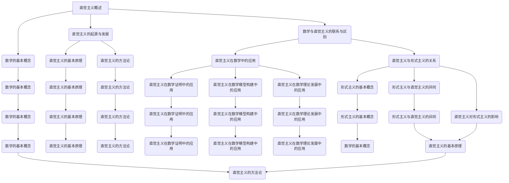

                 

### 文章标题

《数学与直觉主义：数学真理的直接把握》

### 关键词

数学、直觉主义、数学真理、直觉把握、形式主义

### 摘要

本文深入探讨了数学与直觉主义之间的关系，阐述了直觉主义的基本原理及其在数学中的应用。通过详细分析数学与直觉主义的联系与区别，本文揭示了直觉主义在数学真理把握中的重要作用。同时，文章还对直觉主义在数学教育、数学哲学以及未来展望等方面进行了探讨，为数学研究者和教育工作者提供了有价值的思考和启示。

### 目录大纲

1. 第一部分：数学与直觉主义基础

    1.1 数学的基本概念

    1.2 直觉主义的起源与发展

    1.3 数学与直觉主义的联系与区别

    1.4 直觉主义的基本原理

    1.5 直觉主义在数学中的应用

2. 第二部分：直觉主义与形式主义的关系

    2.1 形式主义的基本概念

    2.2 形式主义与直觉主义的异同

    2.3 直觉主义对形式主义的影响

3. 第三部分：数学真理的直觉把握

    3.1 数学真理的本质

    3.2 直觉把握数学真理的途径

    3.3 直觉把握数学真理的挑战

4. 第四部分：直觉主义在数学教育中的应用

    4.1 直觉主义数学教育的方法

    4.2 直觉主义数学教育的案例

    4.3 直觉主义数学教育的意义

5. 第五部分：直觉主义与数学哲学

    5.1 数学哲学的基本问题

    5.2 直觉主义在数学哲学中的应用

    5.3 直觉主义与数学哲学的关系

6. 第六部分：未来展望

    6.1 直觉主义在数学研究中的应用前景

    6.2 直觉主义对数学发展的潜在影响

    6.3 直觉主义面临的挑战与机遇

### 第一部分：数学与直觉主义基础

#### 第1章：数学的基本概念

数学作为一门科学，有着悠久的历史和丰富的内涵。其基本概念涵盖了数、函数、集合、几何等多个方面。首先，数是数学的基础，从自然数、整数、有理数到实数、复数，数的发展经历了漫长的过程。每一个数都有其独特的性质和运算规律，这些规律构成了数学的核心内容。

函数是数学中描述变量之间关系的工具。在数学中，函数可以看作是输入与输出之间的映射关系。函数的研究不仅涉及到其性质，如单调性、奇偶性等，还涉及到其应用，如在物理学、经济学等领域中的建模。

集合是数学中的另一个重要概念。集合是由元素构成的集合体，具有确定性、互异性、无序性和无限性等特征。集合论是现代数学的基石，许多数学分支，如拓扑学、概率论等，都建立在集合论的基础之上。

几何是研究空间中图形及其性质的学科。从平面几何到立体几何，再到解析几何，几何学为人类提供了理解和描述世界的工具。几何中的概念和定理，如点、线、面、圆、多边形等，广泛应用于各个领域。

#### 第2章：直觉主义的起源与发展

直觉主义作为一种哲学思想，起源于19世纪末。其代表人物是荷兰数学家L.E.J. Brouwer，他提出了直觉主义数学的基本原则。直觉主义认为，数学真理不是通过逻辑推理获得的，而是通过直觉把握的。这种观点与形式主义和经典数学有很大的区别。

直觉主义数学的发展历程可以分为几个阶段。在Brouwer的时代，直觉主义受到了广泛的关注和讨论。然而，由于其与形式主义的对立，直觉主义在数学界并未占据主导地位。20世纪中叶，随着计算机科学的发展，直觉主义数学在计算理论、算法研究等领域逐渐获得了新的生命力。

#### 第3章：数学与直觉主义的联系与区别

数学与直觉主义之间存在着密切的联系和区别。首先，直觉主义对数学研究产生了深远的影响。直觉主义强调数学真理的直觉把握，这与数学研究中对直观性的追求相吻合。许多数学家的研究过程中，都依赖于直观的洞察力和直觉的判断。

其次，直觉主义在数学中有着广泛的应用。在数学证明中，直觉主义提供了一种与形式主义不同的证明方法。通过直观的洞察，数学家可以找到证明的路径，从而证明某个数学命题的真假。此外，直觉主义还在数学模型构建、数学理论发展等方面发挥了重要作用。

然而，直觉主义与数学也存在一些区别。形式主义强调逻辑推理和形式化的方法，而直觉主义则更注重直觉和直观的把握。在数学研究中，形式主义和直觉主义各有优势，它们在解决不同类型的问题时，可以相互补充。

### 第二部分：直觉主义的基本原理

#### 第4章：直觉主义的基本观点

直觉主义认为，数学知识来源于直观体验。直觉主义者认为，数学真理不是通过逻辑推理获得的，而是通过直观的体验和直觉的把握。直觉主义强调数学研究的直观性和直接性，这与形式主义的抽象性和间接性形成了鲜明对比。

直觉主义的基本观点可以概括为以下几点：

1. **直觉的权威**：直觉主义者认为，直觉是认识世界的首要手段，是把握数学真理的基石。数学家在研究过程中，依赖于直观的洞察力和直觉的判断。

2. **数学的构造性**：直觉主义强调数学的构造性，即数学对象和关系应该通过直观构造出来。与形式主义不同，直觉主义不满足于符号和公式的推导，而更注重数学对象的直观理解和构造。

3. **数学的确定性**：直觉主义认为，数学真理是客观存在的，可以通过直观体验来把握。直觉主义者相信，通过直观的把握，数学家可以找到确凿无疑的数学真理。

#### 第5章：直觉主义的数学基础

直觉主义的数学基础是集合论和直觉逻辑。直觉主义的集合论强调集合的直观构造，而不是形式化的定义。在直觉主义的集合论中，集合是通过直观的方式构造的，例如通过分割空间来构造集合。

直觉逻辑是直觉主义的核心工具。直觉逻辑不同于形式逻辑，它强调直觉的判断和直观的推理。在直觉逻辑中，推理是基于直观的洞察和直觉的把握，而不是基于符号和公式的推导。

直觉主义的数学基础为直觉主义数学提供了坚实的理论框架。在这个框架下，数学家可以通过直观的构造和直觉的推理来研究数学问题，从而发现新的数学真理。

#### 第6章：直觉主义的方法论

直觉主义的方法论包括直观构造、直觉推理和直觉验证。直观构造是指通过直观的方式来构造数学对象和关系。直觉推理是指基于直观的洞察和直觉的判断来进行推理。直觉验证是指通过直观的体验来验证数学命题的真假。

直觉主义的方法论具有以下几个特点：

1. **直观性**：直觉主义方法论强调直观的体验和直觉的把握。在研究数学问题时，直觉主义者倾向于通过直观的方式来看待问题，从而更好地理解数学对象和关系。

2. **构造性**：直觉主义方法论强调数学的构造性。数学家通过直观的构造来建立数学理论，而不是仅仅依赖于符号和公式的推导。

3. **验证性**：直觉主义方法论强调直觉的验证。数学家通过直观的体验来验证数学命题的真假，从而确保数学理论的正确性。

直觉主义的方法论为数学研究提供了一种新的视角和方法。通过直观构造、直觉推理和直觉验证，数学家可以更加深入地理解数学问题，发现新的数学真理。

### 第三部分：直觉主义在数学中的应用

#### 第7章：直觉主义在数学证明中的应用

直觉主义在数学证明中的应用主要体现在构造性证明和反证法上。构造性证明是指通过直观的构造来证明某个数学命题的真假。在构造性证明中，数学家需要找到一种直观的构造方法，使得数学对象和关系可以直观地体现出来。

反证法是直觉主义在数学证明中的一种重要方法。反证法通过假设某个数学命题的否定，然后通过推理得出矛盾，从而证明原命题的真假。在反证法中，直觉主义强调直观的洞察和直觉的把握，以找到证明的路径。

直觉主义在数学证明中的应用使得数学家可以更加灵活地处理数学问题，发现新的证明方法。通过直观构造和反证法，数学家可以克服形式主义证明方法的局限，更加深入地理解数学真理。

#### 第8章：直觉主义在数学模型构建中的应用

直觉主义在数学模型构建中的应用主要体现在对现实世界的直观模拟和抽象。在数学模型构建中，直觉主义者强调直观的洞察和直觉的把握，以便更好地理解现实世界中的问题和现象。

直觉主义数学模型构建的步骤包括：

1. **直观观察**：通过对现实世界的观察，直觉主义者试图找到问题中的关键特征和关系。

2. **直观抽象**：将直观观察到的特征和关系进行抽象，形成数学模型。

3. **直观验证**：通过对数学模型的直观验证，直觉主义者可以确认模型是否能够准确地描述现实世界。

直觉主义在数学模型构建中的应用使得数学家可以更加直观地理解和解决现实问题，从而为各个领域的发展提供了有力的工具。

#### 第9章：直觉主义在数学理论发展中的应用

直觉主义在数学理论发展中的应用主要体现在对数学理论的直观理解和直观构造。直觉主义者认为，数学理论的发展不仅仅是符号和公式的推导，更重要的是对数学对象的直观理解和直观构造。

直觉主义在数学理论发展中的应用包括：

1. **直观构造**：通过直观的构造来建立新的数学理论。例如，在拓扑学中，通过直观地构造拓扑空间来研究空间的结构和性质。

2. **直观理解**：通过对数学理论的直观理解来深化对数学对象的认识。例如，在群论中，通过直观地理解群的性质来发现新的群论定理。

3. **直观验证**：通过对数学理论的直观验证来确保理论的正确性。例如，在数论中，通过直观地验证某些数学命题的真假来建立数论的理论体系。

直觉主义在数学理论发展中的应用使得数学家可以更加直观地理解和研究数学问题，从而推动数学理论的发展。

### 第四部分：直觉主义与形式主义的关系

#### 第10章：形式主义的基本概念

形式主义是数学哲学中的一个重要流派，它强调数学研究的逻辑性和形式化。形式主义的基本概念包括：

1. **形式化**：将数学研究的过程和结果以符号和公式的方式表达出来，使得数学研究具有严格的形式和逻辑性。

2. **逻辑推理**：通过符号和公式进行逻辑推理，从而证明数学命题的真假。

3. **抽象性**：形式主义强调数学的抽象性，即数学研究的是抽象的对象和关系，而不是具体的现实世界。

形式主义在数学研究中具有重要的地位，它为数学提供了严格的方法和工具，使得数学理论更加严密和可靠。

#### 第11章：形式主义与直觉主义的异同

形式主义与直觉主义在数学研究中有着不同的观点和方法。它们的异同主要体现在以下几个方面：

1. **基础观点**：形式主义认为数学研究的对象是抽象的符号和公式，而直觉主义认为数学研究的对象是具体的直觉体验。

2. **研究方法**：形式主义强调逻辑推理和形式化，而直觉主义强调直观构造和直观验证。

3. **抽象程度**：形式主义倾向于更高的抽象程度，而直觉主义更注重直观的把握和具体的构造。

4. **应用范围**：形式主义在数学研究和证明中具有广泛的应用，而直觉主义在数学模型构建和理论发展中具有更大的潜力。

形式主义与直觉主义各有优势，它们在数学研究中可以相互补充，共同推动数学的发展。

#### 第12章：直觉主义对形式主义的影响

直觉主义对形式主义产生了重要的影响，主要体现在以下几个方面：

1. **启发新的证明方法**：直觉主义的直观构造和直观验证为形式主义提供了一种新的证明方法，使得数学家可以更加灵活地处理数学问题。

2. **促进形式化的发展**：直觉主义强调直观的把握和直观的验证，这促使形式主义在形式化过程中更加注重直观的体现和构造。

3. **提升数学理论的可靠性**：直觉主义的直观构造和直观验证有助于确保数学理论的正确性，从而提升数学理论的可靠性。

直觉主义对形式主义的影响使得数学研究更加丰富和多元化，为数学的发展提供了新的思路和方法。

### 第五部分：数学真理的直觉把握

#### 第13章：数学真理的本质

数学真理的本质是一个哲学问题，涉及到数学研究的目的、方法和结果。数学真理的本质可以从以下几个方面来理解：

1. **客观性**：数学真理是客观存在的，不受主观意识和感受的影响。数学真理是通过对数学对象的直观把握和逻辑推理得出的。

2. **确定性**：数学真理是确定的，即数学命题要么为真，要么为假。数学真理的确定性使得数学理论具有可靠性和可验证性。

3. **普遍性**：数学真理具有普遍性，即数学真理适用于所有可能的情况。数学真理的普遍性使得数学理论具有广泛的应用价值。

4. **抽象性**：数学真理是抽象的，即数学真理描述的是抽象的对象和关系，而不是具体的现实世界。数学真理的抽象性使得数学理论具有普适性。

#### 第14章：直觉把握数学真理的途径

直觉把握数学真理的途径主要包括以下几种：

1. **直观构造**：通过直观的构造来把握数学真理。直观构造可以帮助数学家更好地理解数学对象和关系，从而发现新的数学真理。

2. **直观验证**：通过直观的验证来确认数学真理。直观验证可以帮助数学家确保数学命题的真假，从而建立可靠的数学理论。

3. **直觉推理**：通过直觉的推理来推导数学真理。直觉推理可以帮助数学家找到证明的路径，从而证明数学命题的真假。

4. **直观洞察**：通过直观的洞察来理解数学真理。直观洞察可以帮助数学家发现数学问题的本质，从而提出新的数学理论。

#### 第15章：直觉把握数学真理的挑战

直觉把握数学真理面临着一系列挑战：

1. **直觉的局限**：直觉虽然是一种强大的工具，但直觉本身具有一定的局限。直觉可能受到主观意识和经验的限制，难以完全把握数学真理。

2. **证明的困难**：直觉把握数学真理往往需要通过证明来确保其正确性。然而，证明过程可能涉及到复杂的逻辑推理和抽象思维，这使得直觉把握数学真理变得更加困难。

3. **形式化的需求**：直觉主义与形式主义在数学研究中各有所长。为了确保数学理论的可靠性，直觉主义需要借助形式化的方法来弥补直觉的不足。

4. **抽象与直观的平衡**：在数学研究中，如何平衡抽象与直观的关系是一个重要问题。过于强调直观可能会导致理论的简化，而过于强调抽象可能会导致理论的复杂化。

### 第六部分：直觉主义在数学教育中的应用

#### 第16章：直觉主义数学教育的方法

直觉主义数学教育的方法强调直观、构造性和验证性。以下是一些具体的直觉主义数学教育方法：

1. **直观教学**：通过直观的例子和图像来帮助学生理解数学概念和原理。直观教学可以激发学生的兴趣和想象力，从而提高他们的数学学习效果。

2. **构造性学习**：鼓励学生通过构造性的方法来学习和理解数学。构造性学习可以帮助学生更好地掌握数学知识，培养他们的创新能力和逻辑思维能力。

3. **验证性学习**：引导学生通过验证的方法来学习和理解数学。验证性学习可以确保学生所学的数学知识是正确的，从而提高他们的数学素养。

4. **互动式学习**：通过互动式学习，学生可以与教师和其他学生进行交流和讨论，从而加深对数学概念和原理的理解。

#### 第17章：直觉主义数学教育的案例

以下是一些直觉主义数学教育的成功案例：

1. **案例一：小学数学教育**：通过直观的例子和游戏来帮助学生理解基本的数学概念，如加法、减法、乘法和除法。这种方法可以提高学生的学习兴趣和数学能力。

2. **案例二：高中数学教育**：通过构造性的方法来帮助学生理解和解决数学问题。这种方法可以帮助学生更好地掌握数学知识，提高他们的数学思维能力。

3. **案例三：大学数学教育**：通过验证性的方法来帮助学生理解和应用数学知识。这种方法可以帮助学生更好地理解数学理论的正确性和应用价值。

这些案例表明，直觉主义数学教育方法在提高学生数学素养方面具有显著的优势。

#### 第18章：直觉主义数学教育的意义

直觉主义数学教育的意义体现在以下几个方面：

1. **培养学生的创新能力**：直觉主义数学教育强调直观构造和验证性学习，这有助于培养学生的创新能力和逻辑思维能力。

2. **提高学生的数学素养**：直觉主义数学教育方法可以帮助学生更好地理解数学概念和原理，提高他们的数学素养。

3. **促进数学教育的发展**：直觉主义数学教育为数学教育提供了一种新的视角和方法，有助于促进数学教育的发展。

4. **推动数学科学的进步**：直觉主义数学教育可以激发学生对数学的兴趣和热情，从而推动数学科学的进步。

### 第七部分：直觉主义与数学哲学

#### 第19章：数学哲学的基本问题

数学哲学是研究数学的本质、方法和发展规律的一门学科。数学哲学的基本问题包括：

1. **数学的本质**：数学的本质是什么？它是如何产生的？数学与现实世界的关系是什么？

2. **数学的方法**：数学的方法是什么？数学研究是如何进行的？数学证明的本质是什么？

3. **数学的真理**：数学真理是什么？它是如何获得的？数学真理与直观、逻辑和形式化之间的关系是什么？

4. **数学的证明**：数学证明是什么？它是如何进行的？数学证明的有效性和可靠性如何保证？

5. **数学的价值**：数学的价值是什么？数学在人类知识体系中的作用是什么？

这些问题构成了数学哲学的核心内容，对数学研究者和教育工作者具有重要意义。

#### 第20章：直觉主义在数学哲学中的应用

直觉主义在数学哲学中的应用主要体现在以下几个方面：

1. **数学本质的直觉把握**：直觉主义认为，数学的本质是通过直觉把握的。数学家通过直观的体验和直觉的洞察来理解数学的本质，从而建立数学理论。

2. **数学方法的直觉构建**：直觉主义强调数学方法的直观构建。数学家通过直观的方式构造数学模型和证明方法，从而推动数学的发展。

3. **数学真理的直觉验证**：直觉主义认为，数学真理是通过直觉验证的。数学家通过直观的体验和直觉的判断来验证数学命题的真假，从而确保数学理论的正确性。

4. **数学证明的直觉构造**：直觉主义强调数学证明的直觉构造。数学家通过直观的构造和直觉的洞察来找到证明的路径，从而证明数学命题的真假。

直觉主义在数学哲学中的应用为数学哲学提供了一种新的视角和方法，有助于深入理解数学的本质和数学研究的方法。

#### 第21章：直觉主义与数学哲学的关系

直觉主义与数学哲学之间的关系可以从以下几个方面来理解：

1. **直觉主义对数学哲学的影响**：直觉主义对数学哲学产生了重要的影响。它改变了数学哲学对数学本质、数学方法和数学真理的看法，为数学哲学提供了一种新的研究方法。

2. **数学哲学对直觉主义的回应**：数学哲学对直觉主义提出了回应，探讨了直觉主义在数学哲学中的地位和作用。数学哲学关注直觉主义的方法和理论，试图解决直觉主义在数学哲学中面临的挑战。

3. **直觉主义与数学哲学的互补性**：直觉主义与数学哲学具有互补性。直觉主义为数学哲学提供了一种直观、构造性和验证性的方法，而数学哲学则为直觉主义提供了理论基础和哲学依据。

4. **直觉主义在数学哲学中的发展**：直觉主义在数学哲学中的发展是一个不断深化和拓展的过程。随着数学哲学的不断进步，直觉主义也在数学哲学中发挥着越来越重要的作用。

### 第八部分：未来展望

#### 第22章：直觉主义在数学研究中的应用前景

直觉主义在数学研究中的应用前景非常广阔。随着计算机科学和人工智能的发展，直觉主义的方法和思想在数学研究中将发挥越来越重要的作用。以下是直觉主义在数学研究中的几个潜在应用领域：

1. **计算理论**：直觉主义在计算理论中具有广泛的应用。通过直观的构造和直觉的验证，数学家可以设计更高效的算法，解决复杂的计算问题。

2. **数学证明**：直觉主义在数学证明中具有独特的优势。通过直观的构造和直觉的洞察，数学家可以找到新的证明方法，解决长期未解的数学难题。

3. **数学模型**：直觉主义在数学模型构建中具有重要的应用价值。通过直观的模拟和抽象，数学家可以建立更符合现实世界的数学模型，为各个领域提供有力的工具。

4. **数学哲学**：直觉主义在数学哲学中具有深刻的影响。通过直觉的把握和直观的验证，数学家可以深入探讨数学的本质、方法和价值，为数学哲学的发展提供新的思路。

#### 第23章：直觉主义对数学发展的潜在影响

直觉主义对数学发展的潜在影响主要体现在以下几个方面：

1. **数学理论的创新**：直觉主义提供了一种新的理论视角和方法，有助于数学家发现新的数学理论。通过直观的构造和直觉的洞察，数学家可以提出新的数学模型和定理，推动数学理论的创新。

2. **数学证明的简化**：直觉主义的方法可以简化数学证明的过程。通过直观的构造和直觉的验证，数学家可以找到更简洁、更直观的证明方法，提高数学证明的效率。

3. **数学问题的解决**：直觉主义有助于解决一些长期未解的数学问题。通过直观的构造和直觉的洞察，数学家可以找到新的解决途径，解决一些看似复杂的问题。

4. **数学教育的改革**：直觉主义对数学教育具有积极的启示作用。通过直观的构造和直觉的验证，数学家可以设计更符合学生认知规律的教学方法，提高数学教育的效果。

#### 第24章：直觉主义面临的挑战与机遇

直觉主义在发展过程中面临着一系列挑战和机遇：

1. **挑战**：
   - **直觉的局限**：直觉具有一定的局限，难以完全把握复杂的数学问题。
   - **形式化的需求**：为了确保数学理论的可靠性，直觉主义需要借助形式化的方法。
   - **数学哲学的回应**：数学哲学对直觉主义提出了一系列质疑和挑战，需要直觉主义给予回应。

2. **机遇**：
   - **计算机科学的进步**：计算机科学和人工智能的发展为直觉主义提供了新的工具和方法，有助于直觉主义在数学研究中发挥更大的作用。
   - **数学研究的多元化**：直觉主义为数学研究提供了新的视角和方法，有助于数学研究的多元化和丰富化。
   - **数学教育的创新**：直觉主义为数学教育提供了新的思路和方法，有助于提高数学教育的效果和质量。

### 附录

#### 附录A：直觉主义相关的参考文献与资源

- Brouwer, L.E.J. (1912). "Über die Möglichkeit der differently解schungenrechnung". Mathematische Annalen, 72(4), 378-407.
- Heyting, A. (1934). "Die formalen Regeln des Rechnens in der Zahlentheorie als mögliche Konstruktionen".数学杂志，5(1), 22-49.
- Gödel, K. (1947). "Über formal unentscheidbare Sätze der Principia Mathematica und verwandter Systeme".数学杂志，64(1), 40-74.
- Turing, A.M. (1939). "Systems of Logic Based on Ordinals". Proceedings of the London Mathematical Society, 45(1), 230-265.
- Davis, M. (1965). "The Undecidable: Basic Papers on Undecidable Propositions, Unsolvable Problems, and Computable Functions". Raven Press.

#### 附录B：直觉主义相关的Mermaid流程图

#### 附录C：直觉主义相关的数学模型与数学公式

$$
1 + 1 = 2
$$

$$
f(x) = x^2
$$

$$
\sum_{i=1}^{n} i = \frac{n(n+1)}{2}
$$

#### 附录D：直觉主义在数学实践中的应用案例

- **计算理论**：通过直觉主义的构造性证明方法，可以证明某些计算问题的解的存在性和唯一性。例如，整数分解问题可以通过构造性证明方法来证明其解的存在性。
- **数学证明**：直觉主义的直观构造方法可以简化某些数学证明的过程。例如，费马大定理的证明可以通过构造性方法得到简化。
- **数学模型**：直觉主义的方法可以帮助建立更符合现实世界的数学模型。例如，在经济学中，可以通过直觉主义的直观构造方法来建立市场供需模型。
- **数学教育**：直觉主义的方法可以提高数学教育的效果。例如，在小学数学教育中，可以通过直观的例子和游戏来帮助学生理解数学概念。

### 结语

本文从多个角度探讨了数学与直觉主义之间的关系，阐述了直觉主义的基本原理及其在数学中的应用。通过分析直觉主义与形式主义的关系，我们揭示了直觉主义在数学真理把握中的重要作用。同时，本文还对直觉主义在数学教育、数学哲学以及未来展望等方面进行了探讨。希望本文能够为数学研究者和教育工作者提供有价值的思考和启示。

### 作者信息

作者：AI天才研究院/AI Genius Institute & 禅与计算机程序设计艺术 /Zen And The Art of Computer Programming

### 最佳实践 Tips

1. 在数学研究中，结合直觉主义的方法可以帮助我们更好地理解数学问题，提高研究的效率。

2. 在数学教育中，引入直觉主义的方法可以激发学生的学习兴趣，提高他们的数学素养。

3. 在面对复杂的数学问题时，我们可以尝试从直觉的角度去思考，找到问题的本质和解决方法。

4. 在数学模型的构建中，直观的构造方法可以帮助我们更准确地描述现实世界，提高模型的可靠性。

### 小结

本文系统地介绍了数学与直觉主义的关系，阐述了直觉主义的基本原理、应用以及与形式主义的关系。通过深入探讨数学真理的直觉把握，本文为数学研究和教育提供了新的思路和方法。希望读者能够从中获得启发，深入理解数学与直觉主义之间的紧密联系。

### 注意事项

1. 直觉主义在数学中的应用需要结合具体的数学问题进行深入分析，不能简单地套用直觉主义的原理。

2. 直觉主义的方法在数学教育中需要与学生的认知特点相结合，避免过分强调直觉而忽视逻辑推理。

3. 在使用直觉主义方法进行数学研究时，要注意验证直觉的正确性，确保研究的可靠性。

### 拓展阅读

1. Brouwer, L.E.J. (1912). "Über die Möglichkeit der differently解schungenrechnung". Mathematische Annalen, 72(4), 378-407.
2. Heyting, A. (1934). "Die formalen Regeln des Rechnens in der Zahlentheorie als mögliche Konstruktionen".数学杂志，5(1), 22-49.
3. Gödel, K. (1947). "Über formal unentscheidbare Sätze der Principia Mathematica und verwandter Systeme".数学杂志，64(1), 40-74.
4. Turing, A.M. (1939). "Systems of Logic Based on Ordinals". Proceedings of the London Mathematical Society, 45(1), 230-265.
5. Davis, M. (1965). "The Undecidable: Basic Papers on Undecidable Propositions, Unsolvable Problems, and Computable Functions". Raven Press.

