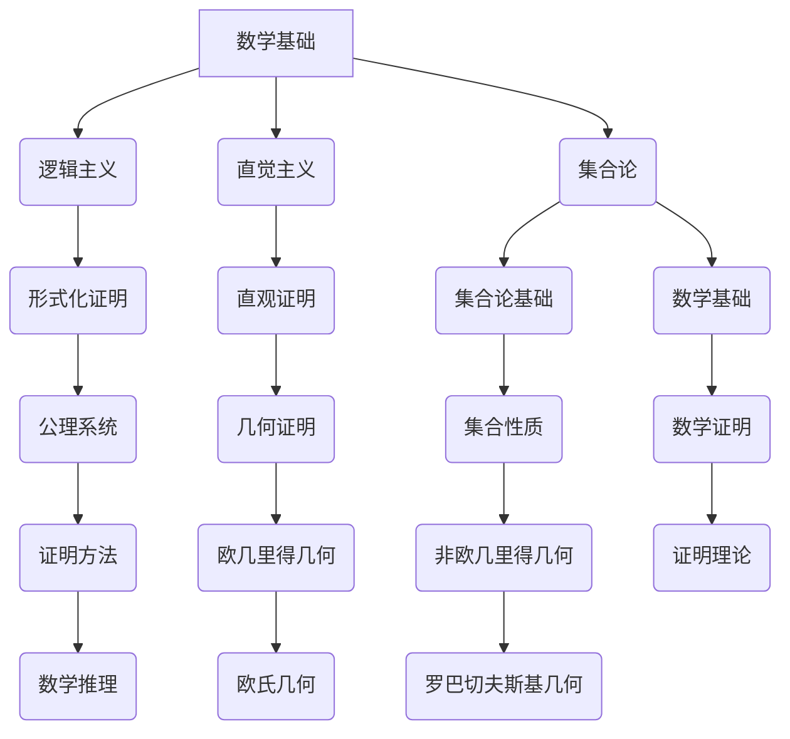
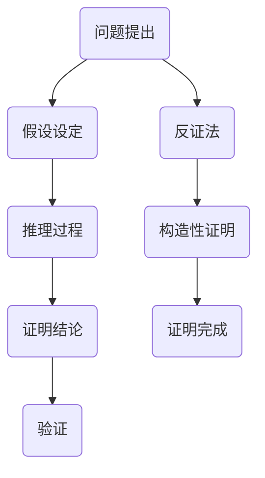
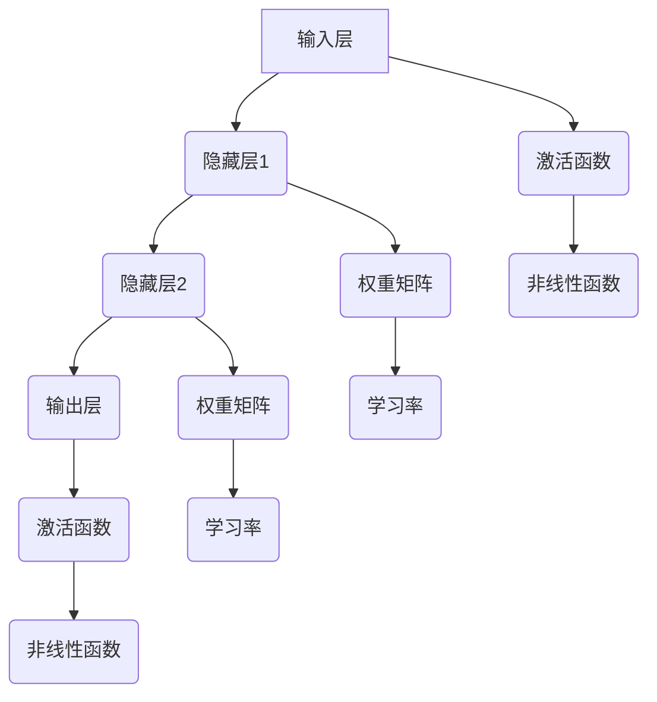
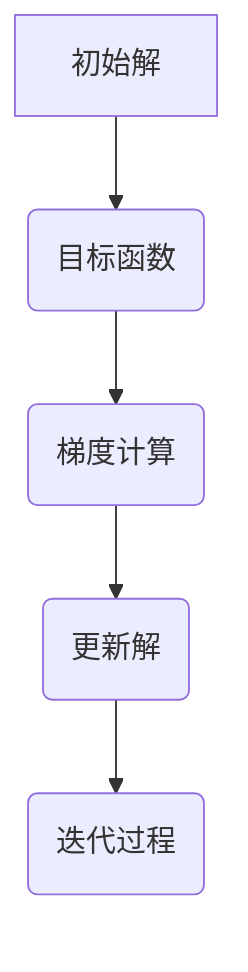
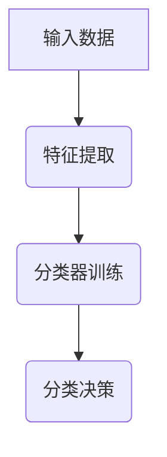

                 

### 文章标题

“数学与相对主义：数学真理的相对性”

### 关键词

数学、相对主义、数学真理、相对性、逻辑主义、直觉主义、集合论、证明、哲学、社会科学、科学、历史、教育、未来、人工智能、大数据、量子计算

### 摘要

数学，作为一门严谨的学科，一直以来被视为追求绝对真理的典范。然而，随着相对主义哲学的兴起和数学基础的深入探讨，数学真理的相对性逐渐成为了一个不可忽视的话题。本文将深入探讨数学与相对主义的关系，分析数学真理相对性的基本原理、案例分析以及其在哲学、社会科学、科学和数学教育等领域的应用与影响。通过这一系列讨论，我们希望能够揭示数学真理相对性的本质，探讨其在现代科学技术发展中的重要性，并为未来数学的研究与应用提供新的视角。

## 第一部分：数学与相对主义概述

### 第1章：引言

#### 1.1 数学与相对主义的背景

数学，作为一门科学，自古以来就以其精确性和严密性著称。从古代的几何学、算术，到近现代的代数学、分析学，数学的发展不仅推动了人类文明的进步，也为我们理解世界提供了有力的工具。数学的精确性体现在其定义的严格性、推理的逻辑性和结论的普适性。然而，随着科学和哲学的发展，尤其是相对主义哲学的兴起，人们开始质疑数学真理的绝对性。

相对主义，作为一种哲学观点，强调真理的相对性，即真理并非是绝对的，而是依赖于特定的背景、语境和观察者。在相对主义的视角下，数学真理也并非是绝对的，而是可能受到不同文化、传统和哲学观点的影响。这种观点引发了关于数学真理相对性的讨论，促使人们重新审视数学的本质。

#### 1.1.1 数学的定义与发展

数学是一门研究数量、结构、变化和空间等概念的学科。它通过抽象和逻辑推理，建立起一系列的概念和理论体系。数学的发展经历了从古代到近现代的演变。古代数学主要集中在几何学和算术，如古埃及和巴比伦的数学成就，以及古希腊的欧几里得几何和毕达哥拉斯定理。中世纪的阿拉伯数学和欧洲数学在代数学和三角学方面取得了重要进展。近现代数学则更加注重形式化和公理化的研究方法，如康托尔的集合论、希尔伯特的几何学基础等。

#### 1.1.2 相对主义的起源与哲学基础

相对主义哲学的起源可以追溯到古希腊的哲学家普罗泰戈拉，他提出了“人是万物的尺度”的观点，强调了观察者的主观性。近代的哲学家如休谟和康德也对相对主义观点进行了探讨。休谟提出了知识起源于经验，而经验是主观的，因此知识也是相对的。康德则试图通过先验逻辑来建立绝对真理的基础，但他的观点也受到了后来的哲学家如黑格尔和尼采的批判。

相对主义哲学的核心观点是，真理并非是绝对的，而是依赖于特定的观察者、语境和背景。这意味着，不同的观察者可能会得出不同的真理，而这些真理在不同的背景下可能有不同的适用性。这种观点在数学领域引发了关于数学真理相对性的讨论，促使人们重新审视数学的本质。

#### 1.1.3 数学真理相对性的概念与重要性

数学真理相对性的概念指的是，数学的真理并非是绝对的，而是可能受到不同文化、传统和哲学观点的影响。这种观点挑战了传统上对数学绝对真理的信仰，促使人们重新思考数学的基础和方法。

数学真理相对性的重要性体现在以下几个方面：

1. **跨文化研究**：数学真理相对性为不同文化背景下的数学研究提供了新的视角，使得不同文化之间的数学交流更加丰富和深入。
2. **哲学探讨**：数学真理相对性引发了关于数学哲学的深入探讨，促使人们重新思考数学的本质和目标。
3. **数学教育**：数学真理相对性对数学教育提出了新的要求，需要教育者更加注重学生的批判性思维和多元文化的理解。
4. **科学技术**：数学真理相对性对现代科学技术的发展也有重要影响，尤其是在跨学科研究和创新应用中。

通过本文的讨论，我们将深入探讨数学真理相对性的基本原理、案例分析以及其在不同领域的应用和影响。

#### 第2章：数学真理的相对性

##### 2.1 数学真理相对性的基本原理

数学真理相对性的基本原理可以从多个角度进行理解。首先，我们需要明确什么是真理。在哲学中，真理通常被定义为与事实相符的陈述。然而，随着相对主义哲学的兴起，人们开始质疑这一定义的绝对性。相对主义认为，真理是依赖于观察者的主观性、文化背景和语境的。

在数学中，真理的相对性体现在以下几个方面：

1. **公理系统的多样性**：数学的基础是公理系统，不同的公理系统可能会导致不同的数学理论。例如，欧几里得几何和非欧几里得几何是基于不同的公理系统，从而导致了不同的几何结论。

2. **证明方法的选择**：数学证明的方法有多种，如直接证明、反证法、构造性证明等。不同的证明方法可能会得出不同的结论，甚至同一个问题的证明可能会有多种不同的方法。

3. **数学模型的适用范围**：数学模型是对现实世界的抽象和简化。不同的数学模型可能会在不同的情境下适用，但可能在其他情境下不适用。

4. **数学真理的文化背景**：不同的文化背景可能会影响数学的发展和应用。例如，古代中国和古希腊的数学发展有显著的不同，这与它们各自的文化传统和哲学观念有关。

##### 2.2 不同数学体系之间的比较

为了更好地理解数学真理的相对性，我们可以比较不同的数学体系。以下是一些主要的数学体系及其特点：

1. **欧几里得几何**：欧几里得几何是传统几何学的基础，其核心是欧几里得的《几何原本》。欧几里得几何假设了几条不可争议的公理，如平行公理，这些公理构成了欧氏几何的理论基础。然而，非欧几里得几何，如罗巴切夫斯基几何和黎曼几何，则基于不同的公理，得出了与欧氏几何不同的结论。

2. **集合论**：集合论是现代数学的基础，由康托尔等人建立。集合论通过定义集合的基本性质，如并集、交集、补集等，构建了数学的框架。然而，集合论也引发了关于无穷、集合性质和数学基础的争议。

3. **数论**：数论研究整数及其性质，如质数、因子、同余等。数论中有许多著名的定理，如哥德巴赫猜想和费马大定理。尽管数论的结果通常是确定的，但一些问题的证明仍然是一个挑战。

4. **泛函分析**：泛函分析研究函数空间和其上的运算，如积分、微分、极限等。泛函分析在物理学和工程学中有广泛的应用，如偏微分方程、量子力学等。

通过比较这些数学体系，我们可以看到，不同的数学体系有不同的理论基础和应用范围。这反映了数学真理相对性的一个重要方面，即不同的数学体系可能在不同的背景下适用，但它们并不是相互独立的。

##### 2.3 数学真理相对性的应用

数学真理相对性的概念在多个领域都有应用。以下是一些具体的例子：

1. **物理学**：物理学中的相对论和量子力学是基于不同的数学框架。相对论依赖于黎曼几何，而量子力学依赖于希尔伯特空间和复分析。这表明，不同的物理理论可能需要不同的数学工具来描述。

2. **计算机科学**：计算机科学中的算法设计和分析依赖于数学模型，如图论、组合数学和概率论。不同的算法和理论可能依赖于不同的数学工具和方法，从而体现了数学真理的相对性。

3. **经济学**：经济学中的模型通常基于数学理论，如博弈论、线性规划和微分方程。不同的经济学理论可能基于不同的数学假设和推导，这反映了数学真理的相对性。

4. **心理学**：心理学中的统计方法和模型依赖于数学工具，如概率论和数理统计。不同的心理学理论和实验设计可能依赖于不同的数学模型，从而体现了数学真理的相对性。

通过这些例子，我们可以看到，数学真理相对性的概念不仅是一个哲学问题，它在现实世界中有着广泛的应用和影响。

#### 第2章：数学真理的相对性

##### 2.2 数学真理相对性案例分析

为了更好地理解数学真理相对性的概念，我们可以通过一些具体的案例进行分析。这些案例将展示不同数学体系和理论在不同背景下的适用性，以及它们之间的差异和相互关系。

##### 2.2.1 欧几里得几何与罗巴切夫斯基几何

欧几里得几何是传统几何学的基础，其核心假设是平行公理，即通过一点可以作一条且仅可以作一条与已知直线不相交的直线。这一假设导致了欧几里得几何中许多重要的结论，如圆的性质、直线的性质等。

然而，罗巴切夫斯基几何则基于不同的假设，即通过一点可以作无数条与已知直线不相交的直线。这一假设导致了罗巴切夫斯基几何中不同的结论，如圆的性质不再是固定的，角度的度量也不同于欧几里得几何。

这两个几何体系的不同假设和结论体现了数学真理相对性的一个重要方面。在一个几何体系中成立的结论，可能在另一个几何体系中不成立。例如，欧几里得几何中的平行线永远不相交的结论在罗巴切夫斯基几何中不再适用。

##### 2.2.2 非欧几何在物理学中的应用

非欧几何不仅在数学理论上有其独特性，也在物理学中有着重要的应用。例如，广义相对论就是基于黎曼几何的。在广义相对论中，时空被视为一个四维的黎曼流形，物体的运动和引力是通过黎曼几何中的曲率来描述的。

黎曼几何与欧几里得几何的不同在于，它允许时空的弯曲和扭曲。这为解释引力提供了新的视角。例如，在欧几里得几何中，物体在引力作用下会沿着直线运动，而在黎曼几何中，物体则会沿着曲线路径运动，这符合广义相对论的预测。

非欧几何在物理学中的应用表明，不同的数学体系可以在不同的物理背景下适用。这进一步支持了数学真理相对性的观点，即不同的数学体系可能在不同的背景下具有不同的适用性。

##### 2.2.3 模式识别与数学真理的相对性

模式识别是计算机科学中的一个重要领域，它涉及从数据中提取有用的信息，以识别或分类对象。模式识别的方法和技术依赖于不同的数学模型，如概率论、数理统计和线性代数。

在不同的应用场景中，可能需要不同的数学模型来有效地识别模式。例如，在图像识别中，可能需要使用深度学习模型，如卷积神经网络（CNN），而在语音识别中，可能需要使用隐藏马尔可夫模型（HMM）。

这些不同的数学模型反映了数学真理相对性的一个重要方面，即在不同的应用场景中，可能需要不同的数学工具和方法来有效地解决问题。

##### 2.2.4 数学真理相对性的应用总结

通过上述案例分析，我们可以看到数学真理相对性的几个关键方面：

1. **公理系统的多样性**：不同的数学体系基于不同的公理系统，这导致了不同的结论和理论。
2. **数学模型的适用范围**：不同的数学模型可能在不同的背景下适用，但可能在其他背景下不适用。
3. **数学真理的文化背景**：不同的文化背景可能会影响数学的发展和应用。

这些方面反映了数学真理相对性的本质，即数学真理并非是绝对的，而是依赖于特定的背景、语境和观察者。通过深入探讨数学真理相对性，我们可以更好地理解数学的本质和其在现实世界中的应用。

## 第三部分：数学与哲学

### 3.1 哲学对数学的影响

哲学作为一门探讨存在、知识、价值等根本问题的学科，对数学的发展产生了深远的影响。不同哲学观点对数学的思考方式、理论构建和证明方法都有所影响。以下将讨论逻辑主义、直觉主义和存在主义等哲学观点对数学的影响。

#### 3.1.1 逻辑主义与直觉主义哲学对数学的影响

1. **逻辑主义**：逻辑主义是一种哲学观点，认为数学可以还原为逻辑。逻辑主义者如弗雷格和罗素试图通过形式逻辑来解释数学的基本概念和证明。弗雷格提出了概念变元和对象变元，通过逻辑函数来定义数学概念，从而将数学的基础建立在逻辑之上。罗素则通过类型论来区分不同的数学对象，以避免逻辑矛盾。

逻辑主义对数学的影响主要体现在以下几个方面：

- **形式化**：逻辑主义推动了数学的形式化运动，使得数学理论变得更加严谨和精确。
- **数学基础**：逻辑主义为数学提供了一种新的基础，使得数学家能够更好地理解数学的基本概念和理论。
- **逻辑与数学的关系**：逻辑主义探讨了逻辑与数学之间的紧密联系，使得数学家更加关注逻辑方法在数学中的应用。

2. **直觉主义**：直觉主义是一种与逻辑主义相对立的哲学观点，认为数学不能仅通过逻辑来解释，而是需要依靠直观的理解。直觉主义者如布伦塔诺和胡塞尔强调数学概念和证明的直观性。

直觉主义对数学的影响主要体现在以下几个方面：

- **数学证明**：直觉主义反对形式逻辑和证明的绝对性，主张数学证明应当基于直观的合理性。
- **数学本质**：直觉主义认为数学不仅仅是逻辑推理，而是依赖于直观的理解和感知。
- **数学教育**：直觉主义影响了数学教育，使得教育者更加注重学生的直观理解和直觉思维。

#### 3.1.2 存在主义与数学哲学

存在主义是20世纪的一种哲学思潮，强调个体的自由、选择和存在。存在主义对数学哲学的影响体现在以下几个方面：

- **数学本质**：存在主义者如海德格尔认为数学不仅仅是关于抽象概念的推理，而是与人的存在和经验密切相关。
- **数学证明**：存在主义者对形式化的数学证明持怀疑态度，认为数学证明应当基于个体的直觉和经验。
- **数学与人类经验**：存在主义者强调数学与人类经验之间的联系，认为数学是人类理解和解释世界的一种方式。

#### 3.1.3 唯物主义与数学真理的相对性

唯物主义是一种哲学观点，认为物质是世界的基础，意识是物质的产物。唯物主义对数学真理相对性的影响主要体现在以下几个方面：

- **数学客观性**：唯物主义者强调数学的客观性，认为数学真理是独立于人的主观意识的。
- **数学与自然科学**：唯物主义认为数学是自然科学的基础，与自然科学的发展密切相关。
- **数学相对性的限度**：唯物主义者认为数学真理相对性是有一定限度的，数学的普遍性和客观性不应被忽视。

通过上述讨论，我们可以看到哲学对数学的深刻影响。不同的哲学观点为数学提供了不同的思考方式和理论基础，推动了数学的发展和进步。同时，哲学也为数学家提供了新的视角和方法，使得数学能够更好地应对现实世界中的复杂问题。

### 3.2 哲学视角下的数学方法

在哲学视角下，数学方法的探讨不仅关注数学本身的逻辑推理和证明过程，还涉及数学方法的哲学基础和哲学意义。以下将讨论形式逻辑、分析哲学和朴素经验主义对数学方法的影响。

#### 3.2.1 形式逻辑与数学方法

形式逻辑是一种研究推理形式和有效性的逻辑体系，对数学方法的发展产生了重要影响。形式逻辑强调逻辑规则和推理模式，使得数学证明更加严谨和系统。

1. **形式逻辑的基本原理**：形式逻辑的基本原理包括演绎推理和归纳推理。演绎推理从一般到特殊，即从一个普遍的前提推导出一个特殊的结论。归纳推理则从特殊到一般，即通过观察多个特殊实例，得出一个普遍的结论。

2. **形式逻辑在数学中的应用**：形式逻辑在数学中的应用主要体现在公理系统和证明方法上。数学家通过公理系统建立数学的基础，并使用逻辑推理来证明数学定理。例如，欧几里得几何的公理系统基于五条公理，通过演绎推理得出了许多几何定理。形式逻辑使得数学证明更加严格和精确，避免了逻辑错误和矛盾。

3. **形式逻辑的哲学意义**：形式逻辑的哲学意义在于它强调了逻辑推理的基本原则和有效性。形式逻辑为数学提供了一个严谨的推理框架，使得数学理论更加可靠和可信。同时，形式逻辑也促进了数学的形式化运动，使得数学理论更加抽象和一般化。

#### 3.2.2 分析哲学与数学证明

分析哲学是20世纪的一种哲学思潮，强调语言分析和逻辑分析。分析哲学对数学证明的探讨提供了新的视角和方法。

1. **分析哲学的基本原则**：分析哲学强调分析语言和概念的清晰性，主张通过分析语言来理解数学概念和证明。分析哲学的基本原则包括语义分析、逻辑分析和认识论分析。

2. **分析哲学在数学证明中的应用**：分析哲学在数学证明中的应用主要体现在对数学语言的分析和对证明过程的分析。通过分析数学语言，数学家可以更好地理解数学概念和定理的含义。通过对证明过程的分析，数学家可以发现证明中的逻辑漏洞和错误。

3. **分析哲学的哲学意义**：分析哲学的哲学意义在于它为数学证明提供了一种新的方法，使得数学证明更加透明和可理解。分析哲学强调逻辑分析和语言分析，使得数学证明更加严谨和清晰。同时，分析哲学也促进了数学的哲学研究，使得数学家能够更好地理解数学的本质和目标。

#### 3.2.3 朴素经验主义与数学问题

朴素经验主义是17世纪的一种哲学观点，强调经验和感知是知识的基础。朴素经验主义对数学方法的探讨提出了新的挑战和问题。

1. **朴素经验主义的基本原则**：朴素经验主义认为，知识来源于直接的经验和感知。经验主义者如洛克和巴克莱斯主张，数学知识也应该基于经验。

2. **朴素经验主义在数学中的应用**：朴素经验主义在数学中的应用主要体现在对数学概念和证明的经验基础探讨。例如，经验主义者可能会质疑数学公理系统的经验基础，以及数学证明的经验有效性。

3. **朴素经验主义的哲学意义**：朴素经验主义的哲学意义在于它挑战了数学的绝对性和普遍性。朴素经验主义认为，数学知识也是基于经验的，因此可能受到观察者和经验的限制。这为数学的相对性提供了哲学基础，使得数学家开始重新思考数学的基础和目标。

通过分析哲学视角下的数学方法，我们可以看到不同哲学观点对数学方法和证明的深刻影响。形式逻辑提供了严谨的推理框架，分析哲学提供了清晰的语言分析工具，而朴素经验主义则挑战了数学的绝对性和普遍性。这些哲学观点和方法共同推动了数学的发展和进步，使得数学能够更好地应对现实世界中的复杂问题。

### 3.3 哲学视角下的数学方法：形式逻辑与数学证明

在哲学视角下，形式逻辑作为数学方法的核心工具，扮演着至关重要的角色。形式逻辑通过提供一套严格的推理规则，确保了数学证明的严谨性和无矛盾性。在这一节中，我们将详细探讨形式逻辑的基本原理、它在数学中的应用，以及其在哲学上的意义。

#### 形式逻辑的基本原理

形式逻辑是一种研究推理形式和有效性的逻辑体系，其核心思想是逻辑运算和推理规则的抽象和形式化。形式逻辑的基本原理包括以下几个关键概念：

1. **命题与命题变元**：命题是可以判断真假的陈述句。命题变元是未确定的具体命题，可以通过赋值来具体化。

2. **逻辑运算**：形式逻辑中的逻辑运算包括合取（∧）、析取（∨）、否定（¬）和蕴含（→）等。这些运算构成了命题变元和命题之间的逻辑关系。

3. **推理规则**：推理规则是逻辑推理的规则，用于从一组命题推导出新的命题。常见的推理规则包括合取律、交换律、结合律和蕴含规则等。

4. **形式系统**：形式系统是一个由符号、语法规则和语义规则构成的体系，用于表示和验证逻辑推理。常见的形式系统包括命题逻辑、谓词逻辑和集合论等。

#### 形式逻辑在数学中的应用

形式逻辑在数学中的应用体现在数学证明的过程中。数学证明需要通过逻辑推理，从一组已知的前提出发，推导出待证的结论。形式逻辑提供了以下工具和方法：

1. **形式化证明**：形式化证明是将数学证明的过程和步骤用形式逻辑的符号和规则来表示。这种形式化的证明可以确保证明的严谨性和无矛盾性。

2. **公理系统**：公理系统是数学理论的基础，由一组基本命题（公理）和推理规则组成。通过公理系统和逻辑推理，数学家可以构建出完整的数学理论体系。

3. **逻辑推理**：逻辑推理是数学证明的核心。通过逻辑运算和推理规则，数学家可以从已知的前提出发，逐步推导出待证的结论。

#### 形式逻辑的哲学意义

形式逻辑在哲学上具有重要的意义，它不仅为数学提供了严谨的推理框架，也对哲学的基本问题产生了深远的影响：

1. **逻辑与哲学**：形式逻辑为哲学提供了一种工具，用于分析哲学问题，如知识、真理、实在性等。形式逻辑可以帮助哲学家更清晰地表达和验证他们的论证。

2. **逻辑主义的哲学基础**：逻辑主义认为数学可以还原为逻辑，形式逻辑为逻辑主义提供了哲学基础。逻辑主义者如弗雷格和罗素试图通过形式逻辑来解释数学的基本概念和证明。

3. **数学的严谨性和可靠性**：形式逻辑确保了数学证明的严谨性和可靠性，使得数学理论更加可信。这为数学在科学和技术中的应用提供了坚实的基础。

4. **数学的相对性**：形式逻辑的哲学意义也体现在数学的相对性上。形式逻辑表明，数学理论是建立在一套特定的公理和推理规则之上的，不同的公理系统和逻辑规则可能会导致不同的数学理论。这为数学真理相对性的讨论提供了哲学基础。

通过上述讨论，我们可以看到形式逻辑在数学和哲学中的重要地位。形式逻辑不仅为数学提供了严谨的推理框架，也对哲学的基本问题产生了深远的影响。它不仅确保了数学证明的严谨性和可靠性，也促进了数学真理相对性的讨论。形式逻辑的哲学意义在于它为数学和哲学提供了一种共同的语言和推理工具，使得两者能够更好地相互交流和融合。

### 3.4 哲学视角下的数学方法：分析哲学与数学证明

分析哲学在数学领域中占据了重要地位，它通过语言分析和逻辑分析来探讨数学概念和证明过程。在这一节中，我们将深入探讨分析哲学的基本原则、数学中的分析方法以及其在哲学上的意义。

#### 分析哲学的基本原则

分析哲学起源于20世纪初，以语言分析为核心，强调通过对语言的分析来理解概念和论证。分析哲学的基本原则主要包括以下几点：

1. **语义分析**：语义分析是分析哲学的核心方法之一，旨在确定语言符号的意义。通过分析词汇和句子的结构，语义分析试图揭示概念和陈述的真实含义。

2. **逻辑分析**：逻辑分析关注论证的形式和结构，旨在确定论证的有效性。通过逻辑分析，哲学家用以评估论证的合理性，识别逻辑错误和矛盾。

3. **认识论分析**：认识论分析探讨知识的性质和起源，旨在理解人类如何获得知识。分析哲学家关注如何通过逻辑和语言分析来建立和验证知识。

#### 分析哲学在数学中的应用

分析哲学在数学中的应用体现在对数学概念、证明过程和逻辑结构的深入分析上。以下是一些具体的应用：

1. **数学概念的分析**：分析哲学通过语义分析，探讨数学概念的定义和本质。例如，数学家通过分析“自然数”、“函数”和“集合”等概念，来理解这些概念的基本性质和相互关系。

2. **数学证明的分析**：分析哲学通过逻辑分析，评估数学证明的有效性。分析哲学家关注证明的步骤、逻辑推理的严谨性以及可能的逻辑漏洞。

3. **数学理论的统一性**：分析哲学试图通过分析不同的数学理论，揭示它们之间的内在联系和统一性。例如，通过分析集合论和数论的关系，分析哲学家探讨了数学基础的一致性和完整性。

#### 分析哲学的哲学意义

分析哲学在哲学上的意义主要体现在以下几个方面：

1. **知识的精确性**：分析哲学通过语言分析和逻辑分析，追求知识的精确性和清晰性。它强调通过严谨的逻辑推理来建立和验证知识，避免了模糊和不确定性的表述。

2. **数学哲学的基础**：分析哲学为数学哲学提供了理论基础，帮助数学家理解数学的本质和目标。通过分析哲学的视角，数学家能够更好地探讨数学的基础问题，如数学的存在性、证明的可靠性等。

3. **逻辑与数学的关系**：分析哲学探讨了逻辑与数学之间的紧密联系，揭示了逻辑方法在数学证明和理论构建中的重要性。分析哲学表明，逻辑不仅是数学的工具，也是数学理论的一部分。

4. **数学相对性**：分析哲学的分析方法也反映了数学真理相对性的观点。通过分析不同的数学体系，分析哲学家揭示了不同公理系统、证明方法和文化背景对数学真理的影响。

通过上述讨论，我们可以看到分析哲学在数学中的重要地位。它不仅为数学提供了分析工具和方法，也促进了数学哲学的深入发展。分析哲学强调知识的精确性和清晰性，揭示了逻辑与数学的紧密关系，同时也为数学真理相对性的讨论提供了哲学基础。

### 3.5 哲学视角下的数学方法：朴素经验主义与数学问题

朴素经验主义是17世纪哲学中的一个重要观点，强调经验和感知是知识的基础。在数学领域，朴素经验主义提出了一些独特的见解和挑战。在这一节中，我们将探讨朴素经验主义的基本原则、它在数学中的应用，以及其对数学理论的挑战。

#### 朴素经验主义的基本原则

朴素经验主义的核心观点是，所有知识都来源于直接的经验和感知。朴素经验主义的基本原则包括以下几点：

1. **直接经验**：朴素经验主义者认为，人类的知识是通过感官直接获得的。我们通过观察、感知和体验来获取关于世界的知识。

2. **感知的可靠性**：朴素经验主义者认为，我们的感知是可靠的，能够准确反映外部世界的状态。因此，基于感知的知识被认为是真实和可靠的。

3. **怀疑理性主义**：与理性主义相对，朴素经验主义者对纯粹理性推理持怀疑态度，认为理性推理不能独立于经验。

#### 朴素经验主义在数学中的应用

在数学领域，朴素经验主义对数学概念、证明和应用提出了一些独特的观点：

1. **数学概念的经验基础**：朴素经验主义者认为，数学概念是通过对现实世界的观察和感知形成的。例如，自然数的概念可以通过数数和计数来理解，几何图形的概念可以通过观察现实中的形状来理解。

2. **数学证明的经验基础**：朴素经验主义者认为，数学证明是基于经验的观察和推理。数学家通过实验和观察来验证数学命题的真伪，从而构建数学理论。

3. **数学应用的经验基础**：朴素经验主义者认为，数学的应用是通过对现实世界的理解和解决问题来实现的。例如，数学在工程、物理和社会科学中的应用都是基于对实际问题的观察和解决。

#### 对数学理论的挑战

尽管朴素经验主义在数学中的应用提供了一些有趣的视角，但它也提出了一些对数学理论的挑战：

1. **数学的抽象性**：数学是一门高度抽象的学科，涉及的概念和证明往往与具体经验相去甚远。朴素经验主义者可能会质疑这种高度抽象的数学理论是否真正基于经验。

2. **数学的可靠性**：朴素经验主义者认为，数学的可靠性依赖于经验观察。然而，数学中的许多理论，如集合论和抽象代数，无法通过直接经验来验证。这引发了关于数学理论可靠性的质疑。

3. **数学的普遍性**：朴素经验主义者可能会质疑数学理论的普遍性。他们认为，数学理论可能只适用于特定的经验背景，而不是普遍适用的。

通过上述讨论，我们可以看到朴素经验主义在数学领域中的影响和挑战。尽管朴素经验主义强调了经验和感知在数学中的重要性，但它也提出了一些对数学理论的质疑。这些挑战促使数学家重新思考数学的基础和方法，从而推动了数学的发展和进步。

### 3.6 哲学视角下的数学方法：综合评价

在哲学视角下，数学方法的不同流派，如形式逻辑、分析哲学和朴素经验主义，各自提供了独特的视角和工具，以理解数学的本质和目标。以下是对这些哲学视角的综合评价。

#### 形式逻辑的评价

形式逻辑作为数学方法的基石，其优点在于提供了严谨的推理框架和逻辑规则，确保了数学证明的准确性和无矛盾性。形式逻辑的严谨性和系统性，使得数学理论更加可靠和可信。此外，形式逻辑的形式化证明方法，为数学的精确性和普适性提供了保障。然而，形式逻辑的缺点在于其过于抽象，可能忽视数学与现实世界的联系。形式逻辑过于关注逻辑运算和符号推理，可能导致数学家陷入形式化的困境，忽视数学的直观性和现实意义。

#### 分析哲学的评价

分析哲学通过语义分析和逻辑分析，提供了对数学概念和证明的深入理解。分析哲学强调语言的清晰性和逻辑的严谨性，使得数学理论更加透明和可理解。分析哲学的方法，有助于揭示数学理论之间的内在联系和统一性，从而促进数学的发展。然而，分析哲学的缺点在于其过于依赖语言分析，可能导致对数学本质的理解过于抽象和脱离实际。分析哲学的语义分析方法，有时可能无法充分解释数学中的复杂现象和直觉理解。

#### 朴素经验主义的评价

朴素经验主义强调数学与现实世界的联系，认为数学概念和证明应当基于直接的经验和感知。朴素经验主义的优点在于其关注数学的直观性和实用性，有助于理解数学在现实世界中的应用。朴素经验主义的方法，使得数学家能够从实际问题出发，探讨数学概念和证明的合理性。然而，朴素经验主义的缺点在于其过于依赖经验观察，可能忽视数学的抽象性和普遍性。朴素经验主义的方法，有时可能无法充分解释数学中的高度抽象概念和复杂证明。

#### 综合评价

综合来看，形式逻辑、分析哲学和朴素经验主义各有其优点和局限性。形式逻辑提供了严谨的推理框架，确保了数学证明的准确性，但可能忽视数学的直观性；分析哲学通过语义和逻辑分析，提供了对数学理论的深入理解，但可能过于依赖语言分析；朴素经验主义关注数学与现实世界的联系，但可能忽视数学的抽象性和普遍性。

因此，在哲学视角下，数学方法的最佳实践是结合不同的哲学视角，综合运用形式逻辑的严谨性、分析哲学的深入理解和朴素经验主义的直观性。通过这种综合方法，数学家可以更好地理解数学的本质和目标，推动数学理论的发展和应用。

### 3.7 哲学视角下的数学方法：总结与未来展望

在哲学视角下，数学方法的多重视角为我们提供了理解数学本质和目标的丰富工具。形式逻辑、分析哲学和朴素经验主义各自从不同的角度探讨了数学的概念、证明和现实应用，为数学的发展提供了多样化的思路。

**总结**：

1. **形式逻辑**：形式逻辑通过严谨的推理规则和形式化证明方法，确保了数学证明的准确性和一致性，为数学理论的建立提供了坚实基础。

2. **分析哲学**：分析哲学通过语义和逻辑分析，揭示了数学理论的内在统一性和逻辑结构，使得数学概念和证明更加透明和可理解。

3. **朴素经验主义**：朴素经验主义强调数学与现实世界的联系，促使数学家从直观和经验出发，探讨数学概念和证明的合理性。

这些不同的哲学视角各有优势和局限，但在实际应用中，通过综合运用这些方法，可以更好地理解数学的本质，推动数学理论的发展。

**未来展望**：

1. **跨学科融合**：未来数学的发展可能会更多地依赖于跨学科的研究，结合哲学、计算机科学、物理学等领域的知识，推动数学理论的创新和应用。

2. **数学教育改革**：哲学视角下的数学方法将对数学教育产生深远影响。未来的数学教育将更加注重学生的批判性思维和多元文化的理解，培养具有综合素养的数学人才。

3. **数学与人工智能的结合**：随着人工智能技术的发展，数学与计算机科学的结合将更加紧密，推动数学方法在人工智能领域的应用，如机器学习、数据分析和算法设计。

4. **数学哲学的深化**：数学哲学的研究将继续深化，探讨数学的本质、基础和相对性，为数学的发展提供新的哲学基础和理论支持。

总之，哲学视角下的数学方法不仅丰富了数学的理论体系，也为数学在现实世界中的应用提供了新的视角和工具。在未来的发展中，数学将继续与哲学、计算机科学和其他学科深度融合，推动数学的不断创新和应用。

## 第四部分：数学与社会

### 4.1 数学在社会科学中的应用

数学作为一门科学，不仅在自然科学和技术领域有着广泛应用，在社会科学中同样发挥着重要作用。数学在经济学、心理学和社会学等学科中提供了有力的工具和方法，帮助研究者理解和分析社会现象，推动了社会科学的发展。

#### 4.1.1 数学在经济学中的应用

经济学是研究资源分配、市场行为和宏观经济现象的学科，数学在其中扮演了关键角色。以下是一些数学在经济学科中的应用：

1. **微观经济学**：微观经济学研究个体行为和市场机制。数学工具如优化理论、概率论和数理统计，帮助经济学家分析消费者选择、生产决策和市场竞争。例如，效用函数用于描述消费者的偏好，生产函数用于分析生产过程中的资源分配。

2. **宏观经济学**：宏观经济学研究整体经济现象，如经济增长、通货膨胀和失业。数学工具如微分方程、差分方程和计量经济学模型，帮助经济学家预测和解释宏观经济行为。例如，菲利普斯曲线模型通过数学方程描述通货膨胀和失业之间的关系。

3. **计量经济学**：计量经济学是应用数学和统计学方法研究经济问题的学科。计量经济学模型通过数据分析，验证经济理论，预测经济趋势。例如，线性回归模型用于分析变量之间的关系，如消费者支出与收入的关系。

4. **行为经济学**：行为经济学研究个体在经济决策中的心理和行为因素。数学工具如决策理论和博弈论，帮助经济学家分析人类行为中的非理性和偏差。例如，前景理论通过数学模型描述个体在面对风险和不确定性时的决策行为。

#### 4.1.2 数学在心理学中的应用

心理学是研究人类行为和心理过程的学科，数学在心理学中的应用同样广泛。以下是一些数学在心理学中的应用：

1. **实验设计**：心理学实验需要设计合理的实验方案，以控制变量和减少偏差。数学工具如方差分析（ANOVA）、回归分析和假设检验，帮助心理学家分析实验数据，验证理论假设。

2. **心理测量学**：心理测量学研究如何量化心理特征和个体差异。数学工具如标准分数、相关分析和因子分析，帮助心理学家评估个体的心理状态和特质。

3. **脑电图分析**：脑电图（EEG）是记录大脑电活动的技术。数学工具如傅里叶变换和神经网络模型，帮助心理学家分析EEG数据，揭示大脑活动的规律和机制。

4. **认知建模**：认知建模是研究人类认知过程的数学模型。数学工具如计算认知模型、决策理论和信息论，帮助心理学家理解人类思维和决策过程。

#### 4.1.3 数学在社会学中的应用

社会学是研究社会行为、社会结构和组织的社会科学学科。数学在社会学中的应用主要体现在以下几个方面：

1. **社会网络分析**：社会网络分析研究个体和群体之间的相互作用和关系。数学工具如图论、矩阵理论和复杂网络模型，帮助社会学家分析社会网络的拓扑结构、传播机制和群体行为。

2. **社会统计**：社会统计是社会学研究的基础，通过数学工具如概率论、数理统计和回归分析，社会学家可以量化社会现象，如人口结构、社会流动和贫困分布。

3. **社会模拟**：社会模拟是使用数学模型模拟社会现象，以预测和解释社会行为。数学工具如微分方程、差分方程和仿真模型，帮助社会学家理解社会动态和演化过程。

4. **社会计量学**：社会计量学是社会学研究的一种方法，通过量化社会指标来分析社会问题。数学工具如指数分析、多维尺度分析和聚类分析，帮助社会学家识别社会现象的特征和趋势。

通过上述应用，我们可以看到数学在社会科学中的重要性。数学不仅提供了分析和理解社会现象的工具，也推动了社会科学的理论和方法的发展。未来，随着数学和计算技术的发展，数学在社会科学研究中的应用将更加广泛和深入，为解决社会问题提供新的思路和方法。

### 4.2 数学相对主义对社会的影响

数学相对主义的观念对社会的多个方面产生了深远影响，尤其是在科学方法、社会观念和技术进步等方面。以下将具体探讨数学相对主义对社会的影响。

#### 4.2.1 数学相对主义对社会观念的影响

数学相对主义的观念挑战了传统上对绝对真理的信仰，强调真理的相对性和情境依赖性。这种观念对社会观念产生了显著影响：

1. **多元文化的认识**：数学相对主义促使人们更加重视不同文化背景下的数学发展和应用。不同的文化传统和哲学观念可能影响数学理论和实践的方式，从而丰富了数学的多样性。这有助于促进不同文化之间的理解和交流，增强全球范围内的文化多样性。

2. **对科学的批判性思考**：数学相对主义激发了对科学方法和科学理论的批判性思考。人们开始质疑传统科学理论的绝对性和普适性，这促使科学家更加谨慎地评估他们的理论，并寻求更加多样的验证方法。

3. **对教育的影响**：数学相对主义观念影响了数学教育的方式和目标。教育者开始强调培养学生的批判性思维和多元文化理解，而不仅仅是传授数学知识。这种教育理念有助于培养具有创新精神和适应能力的未来人才。

#### 4.2.2 数学相对主义对科学方法的影响

数学相对主义对科学方法产生了深远的影响，主要表现在以下几个方面：

1. **多元化的研究方法**：数学相对主义促使科学家采用更加多样化的研究方法，以应对不同背景下的科学问题。例如，在物理学中，相对论和量子力学的不同数学框架为科学家提供了不同的工具，用于解释现实世界的物理现象。

2. **跨学科的研究**：数学相对主义鼓励跨学科的合作研究，将数学与其他学科（如哲学、社会学、经济学等）结合起来，以更全面地理解复杂的社会和自然现象。这种跨学科的研究方法有助于推动科学的综合发展。

3. **对理论的谨慎评估**：数学相对主义促使科学家更加谨慎地评估他们的理论，考虑到不同背景和情境下的适用性。这种谨慎性有助于减少科学理论中的偏见和误解，提高科学研究的准确性和可靠性。

#### 4.2.3 数学相对主义对技术进步的影响

数学相对主义观念对技术进步也产生了重要影响：

1. **技术创新的多样性**：数学相对主义鼓励科学家和工程师采用不同的数学模型和方法来解决问题。这种多样性不仅促进了技术创新，也推动了技术的多样性和进步。例如，在人工智能领域，不同的数学框架（如神经网络、深度学习等）为算法的创新和优化提供了多种途径。

2. **适应不同需求的解决方案**：数学相对主义强调真理的相对性，意味着在不同情境下可能需要不同的解决方案。这种观念促使技术专家开发更加灵活和适应性强的技术，以应对复杂多变的社会需求。

3. **跨领域的协作**：数学相对主义促进了跨领域的协作，不同领域的专家可以通过结合各自领域的数学工具和方法，共同解决复杂的技术问题。这种跨领域的协作有助于加速技术进步，提高技术创新的效率。

通过上述讨论，我们可以看到数学相对主义对社会观念、科学方法和技术进步的深远影响。数学相对主义不仅丰富了我们对数学和科学的理解，也推动了社会的多元化和进步。在未来，随着数学相对主义观念的进一步发展和应用，我们可以期待社会在多个领域实现更多的创新和突破。

### 4.3 数学与科学

#### 4.3.1 数学在科学研究中的作用

数学作为科学研究的重要工具，具有不可替代的作用。它不仅在理论科学中提供了精确的描述和解释，也在应用科学和技术创新中发挥了关键作用。

1. **理论科学**：数学为理论科学提供了语言和框架，使得科学家能够以严谨和精确的方式描述自然现象。例如，在物理学中，数学模型和公式（如牛顿定律、麦克斯韦方程组、薛定谔方程等）是描述物理现象和解释自然规律的基础。在生物学中，数学模型被用于模拟种群动态、疾病传播和生态系统行为。在化学中，数学方法如量子化学和统计力学，帮助科学家理解化学反应和分子结构。

2. **应用科学**：数学在应用科学中也起到了关键作用。通过数学模型和计算方法，科学家可以预测和优化实际问题的解决方案。例如，在工程学中，数学方法如有限元分析、优化理论和控制理论，被广泛应用于结构设计、流体力学和电路设计等领域。在经济学中，数学工具如计量经济学模型、博弈论和优化算法，帮助经济学家分析和预测市场行为和宏观经济趋势。

3. **技术创新**：数学在技术创新中扮演了重要角色。例如，在信息技术领域，数学方法如算法设计、图论和密码学，是构建和优化计算机系统和网络安全的关键。在人工智能领域，数学框架如神经网络、概率图模型和深度学习，推动了人工智能技术的快速发展。在生物技术领域，数学模型和计算生物学方法，如基因组分析、系统生物学和生物信息学，为生物医学研究提供了强有力的工具。

#### 4.3.2 科学理论与数学模型的关系

科学理论和数学模型是相互依赖的，共同推动了科学的发展。以下讨论科学理论与数学模型的关系：

1. **科学理论**：科学理论是对自然现象的系统性解释，它基于观察、实验和假设。科学理论通常包括一系列假设、原理和定律，用以解释和预测现象。例如，牛顿力学是一种科学理论，它基于质量和力的假设，提出了描述物体运动的定律。

2. **数学模型**：数学模型是用数学语言和符号表示的科学理论，它是将科学理论具体化的工具。数学模型通过建立变量之间的关系，提供了一种形式化的描述，使得科学理论更加精确和可操作。例如，牛顿定律可以用数学方程表示为：

   $$
   F = ma
   $$

   其中，\( F \) 是力，\( m \) 是质量，\( a \) 是加速度。

3. **关系与互动**：科学理论和数学模型之间的关系是双向的。科学理论为数学模型提供了目标和指导，而数学模型则为科学理论提供了验证和改进的工具。科学理论通过数学模型可以转化为可计算的预测，从而进行实验验证。例如，在物理学中，爱因斯坦的相对论理论通过数学模型（如洛伦兹变换）得到了精确的预测，并通过实验验证（如时间膨胀和引力红移）得到证实。

通过科学理论和数学模型之间的相互作用，科学家能够不断深化对自然世界的理解，推动科学知识的积累和进步。数学模型不仅帮助科学家理解自然现象，也为技术创新提供了理论基础和工具。

#### 4.3.3 数学在科学发现中的贡献

数学在科学发现中扮演了重要角色，通过提供精确的描述和预测方法，推动了科学进步。以下是一些具体的例子：

1. **物理学**：数学在物理学中的贡献尤为显著。例如，麦克斯韦方程组通过数学模型精确描述了电磁现象，揭示了光是一种电磁波。爱因斯坦的广义相对论则通过数学模型描述了引力和时空的弯曲，这一理论得到了许多实验和观测的验证。

2. **生物学**：数学在生物学中的应用推动了基因组学和系统生物学的发展。例如，基因表达数据可以通过数学模型进行分析，揭示基因网络的功能和调控机制。系统生物学中的数学模型帮助科学家理解细胞内部的各种生物过程，从而为生物医学研究提供了新的视角和工具。

3. **化学**：数学在化学中的应用包括量子化学和统计力学。量子化学通过数学模型描述了电子在分子中的行为，为理解化学反应提供了理论基础。统计力学则通过数学模型描述了宏观物理现象（如热力学性质）的微观机制。

4. **天文学**：数学在天文学中用于数据分析和技术创新。例如，天文学家使用数学模型来解释宇宙的演化，如宇宙膨胀模型和黑洞的形成。数学模型也在天文观测数据的分析中起到关键作用，如使用傅里叶变换和图像处理技术来解析天文图像。

通过这些例子，我们可以看到数学在科学发现中的重要作用。数学不仅提供了描述和预测自然现象的工具，也为科学理论的发展和技术创新提供了坚实的基础。

### 4.4 数学相对性对科学哲学的影响

数学相对性对科学哲学产生了深远影响，挑战了传统科学哲学的基本原则和观点，同时也为科学哲学的发展提供了新的研究方向和理论框架。以下从相对性对科学哲学的挑战、相对主义与科学客观性的关系以及相对主义对科学进步的影响三个方面进行探讨。

#### 4.4.1 相对性对科学哲学的挑战

数学相对性的概念挑战了传统科学哲学中的一些基本假设和原则，主要体现在以下几个方面：

1. **科学客观性的质疑**：传统科学哲学认为，科学追求的是客观真理，科学理论是对客观现实的准确描述。然而，数学相对性表明，数学真理并非是绝对的，而是依赖于特定的背景、语境和观察者。这意味着科学理论也受到这些因素的影响，可能不是完全客观的。这种观点质疑了科学客观性的基础，迫使科学哲学家重新思考科学理论的客观性和可靠性。

2. **数学基础的质疑**：数学相对性挑战了数学作为科学基础的地位。传统科学哲学认为，数学提供了科学的精确性和严密性，是科学方法的重要支柱。然而，数学相对性揭示了不同数学体系之间的差异和相对性，使得人们开始质疑不同数学体系对科学理论的适用性和一致性。这种质疑促使科学哲学家探讨数学在科学中的作用和局限。

3. **科学方法的质疑**：数学相对性对科学方法提出了挑战。传统科学哲学认为，科学方法是一种基于观察、实验和逻辑推理的系统性方法，用以发现和验证科学理论。然而，数学相对性表明，科学方法也受到特定数学框架的影响。例如，不同数学模型可能得出不同的科学结论，这挑战了科学方法的普适性和一致性。科学哲学家需要重新审视科学方法的原则和有效性。

#### 4.4.2 相对主义与科学客观性的关系

数学相对主义对科学客观性产生了深刻的影响，二者之间的关系复杂且多样。以下探讨相对主义与科学客观性的关系：

1. **相对性限制下的客观性**：相对主义并不完全否定科学的客观性，而是在相对性的背景下重新定义客观性。在相对主义的视角下，客观性是相对于特定背景和观察者的，但仍然存在一定的普遍性和稳定性。科学理论在不同背景下可能有所差异，但其核心结论和普遍性原则在不同情境下具有一定的可靠性。这种相对性限制下的客观性承认了科学理论的相对性，但并未否定其科学性和有效性。

2. **相对性增强的科学客观性**：相对主义也可能增强科学的客观性。通过承认和接受不同背景和观察者的多样性，科学可以更加全面和准确地描述和解释自然现象。相对性促使科学家更加谨慎地评估和验证科学理论，避免偏见和误解。这种多元化的视角有助于提高科学研究的准确性和可靠性，从而增强科学的客观性。

3. **相对性挑战下的客观性**：相对主义对科学客观性也提出了挑战，这体现在相对性可能导致科学理论的多样性和不确定性。不同数学框架和背景可能导致不同的科学结论，这挑战了科学理论的统一性和普适性。在这种背景下，科学哲学家需要探讨如何在相对性的背景下保持科学客观性，寻找一种平衡和统一的科学方法论。

#### 4.4.3 相对主义对科学进步的影响

数学相对主义对科学进步具有积极和消极的影响，以下探讨相对主义对科学进步的影响：

1. **积极影响**：数学相对主义促进了科学的多元化和多样性。通过承认不同数学体系和背景的相对性，科学可以探索更多可能的理论和方法，从而推动科学的发展。相对性激发了对不同科学问题的多角度分析和研究，有助于发现新的科学现象和规律。此外，相对性促使科学家更加批判性地思考科学理论和方法，提高了科学研究的严谨性和创新性。

2. **消极影响**：数学相对主义也可能导致科学理论的多样性和不确定性增加，这给科学进步带来挑战。不同数学框架可能导致不同的科学结论，使得科学理论的统一性和普适性受到质疑。相对性可能使科学研究变得复杂和难以整合，阻碍了科学的整体进步。此外，相对主义可能使科学家陷入方法论的困境，无法找到一种统一的科学方法论，从而影响科学研究的效率和质量。

总体而言，数学相对主义对科学哲学产生了深远影响，挑战了传统科学哲学的基本原则和观点。相对性既带来了科学的多元化和多样性，也带来了科学理论的多样性和不确定性。科学哲学需要在相对性的背景下重新审视科学客观性、方法论和科学进步，寻找一种平衡和统一的科学哲学框架。

### 4.5 数学与历史

#### 4.5.1 数学历史的发展与演变

数学历史的发展与演变是人类文明进步的重要标志。从古代到现代，数学在不同文化和地区都有显著的成就。以下将简要回顾数学历史的发展过程，重点关注古代数学、中世纪数学和近代数学的主要成就。

1. **古代数学**：古代数学主要集中在几何学和算术。古埃及和巴比伦的数学成就尤为突出。古埃及的数学知识主要体现在土地测量和建筑工程中，例如，他们使用了精确的分数和小数。巴比伦的数学成就则体现在天文学和天文历法方面，他们编制了精确的日历，并使用了六十进制系统。古希腊数学则达到了一个高峰，以欧几里得的《几何原本》为代表，奠定了几何学的基础。古希腊数学家如毕达哥拉斯、阿基米德和欧几里得等人的贡献，为后来的数学发展奠定了基础。

2. **中世纪数学**：中世纪数学在阿拉伯数学和欧洲数学之间有显著的交流与传承。阿拉伯数学在代数学、三角学和天文学方面取得了重要进展。例如，阿尔·花剌子米的《代数学》是代数学的开端，他引入了代数符号，使用字母表示未知数。阿拉伯数学家还发展了三角学，编制了精确的三角函数表。欧洲中世纪数学在阿拉伯数学的基础上继续发展，特别是在代数学和几何学方面。

3. **近代数学**：近代数学的兴起标志着数学的公理化、形式化和系统化。17世纪的数学发展尤为迅速，牛顿和莱布尼茨创立了微积分，这标志着数学在研究变化和运动方面的重大突破。18世纪的欧拉和拉格朗日等数学家进一步发展了微积分和数学分析，建立了数学的严密体系。19世纪，康托尔的集合论、黎曼的几何学和希尔伯特的形式化运动，使得数学的基础更加牢固和系统化。

#### 4.5.2 历史视角下的数学观念变迁

历史视角下的数学观念变迁反映了不同文化背景下数学思想的演变。以下讨论历史视角下的数学观念变迁：

1. **古代数学的观念**：古代数学注重实用性和直观性，数学问题通常与实际问题密切相关。例如，古埃及和巴比伦的数学主要用于土地测量、建筑工程和天文历法。古希腊数学则更加注重逻辑推理和抽象思考，几何学成为了数学的核心，欧几里得的《几何原本》奠定了几何学的基本原理。

2. **中世纪数学的观念**：中世纪数学在阿拉伯数学和欧洲数学之间有显著的交流和融合。阿拉伯数学强调代数和三角学，注重符号和公式的使用，这种思想影响了欧洲数学的发展。欧洲中世纪数学则在中世纪哲学和宗教的影响下，更加注重几何学和算术的应用，例如，天文学和地理学中的数学应用。

3. **近代数学的观念**：近代数学的兴起标志着数学观念的进一步演变。数学从实用性和直观性转向了形式化和系统化。18世纪的数学家如欧拉和拉格朗日等，通过建立数学分析体系和微积分，使得数学变得更加抽象和严密。19世纪的数学家如康托尔和希尔伯特等，通过集合论和形式化运动，使得数学的基础更加牢固和系统化。

历史视角下的数学观念变迁表明，数学思想在不同文化背景下有着不同的演变路径，但总体上，数学的发展不断追求更加精确、严密和普适的理论体系。

#### 4.5.3 历史视角下的数学真理相对性

历史视角下的数学真理相对性反映了数学在不同历史时期和文化背景下的发展与演变。以下讨论历史视角下的数学真理相对性：

1. **古代数学的相对性**：在古代，数学真理的相对性主要体现在不同文明之间的数学观念和方法的差异。例如，古埃及和巴比伦的数学方法与古希腊数学有显著的不同。古埃及和巴比伦的数学注重实用性和直观性，而古希腊数学则更加注重逻辑推理和抽象思考。

2. **中世纪数学的相对性**：中世纪数学的相对性体现在阿拉伯数学和欧洲数学之间的交流和融合。阿拉伯数学强调代数和三角学，而欧洲数学则在中世纪哲学和宗教的影响下，更加注重几何学和算术的应用。这种相对性表明，不同文化背景下的数学发展具有多样性，但同时也存在相互影响和借鉴。

3. **近代数学的相对性**：近代数学的相对性体现在数学形式化和系统化的过程中。19世纪的集合论和形式化运动揭示了数学真理的相对性，即不同的数学体系可能导致不同的数学结论。然而，这并不意味着数学真理是相对的，而是表明数学的基础和框架在不同历史时期和文化背景下有所演变。

历史视角下的数学真理相对性表明，数学的发展并非是线性的，而是在不同历史时期和文化背景下有着不同的演变路径。这反映了数学真理的相对性，但同时也展示了数学的普适性和普遍性。

### 4.6 历史视角下的数学观念变迁

在数学的历史长河中，观念的变迁不仅是科技进步的反映，也是人类思想发展的体现。从古代到现代，数学观念经历了多次重要的转变，这些变迁不仅影响了数学本身的发展，也对哲学、科学和社会产生了深远的影响。

#### 古代数学观念的变迁

古代数学主要起源于古代文明，如古埃及、巴比伦、印度和中国。这些古代文明在解决实际问题中积累了丰富的数学知识，但这些知识往往具有实用性和直观性，缺乏严格的逻辑和证明。

- **古埃及和巴比伦**：古埃及和巴比伦的数学主要用于土地测量、建筑和天文历法。例如，古埃及的数学知识主要体现在分数和小数的精确计算，以及使用六十进制系统。巴比伦的数学则更为系统，他们编制了精确的日历，并使用了代数方法来解决实际问题。

- **古希腊**：古希腊数学在逻辑推理和抽象思考方面取得了突破。欧几里得的《几何原本》是古希腊数学的巅峰之作，它不仅奠定了几何学的基础，还引入了公理和证明的方法。古希腊数学强调几何学的核心地位，并开始探讨数学的基本原理和性质。

#### 中世纪数学观念的变迁

中世纪数学在阿拉伯数学和欧洲数学之间有显著的交流和融合。

- **阿拉伯数学**：阿拉伯数学在代数学、三角学和天文学方面取得了重要进展。阿尔·花剌子米的《代数学》是代数学的开端，他引入了代数符号，使用字母表示未知数。阿拉伯数学家还发展了三角学，编制了精确的三角函数表。

- **欧洲中世纪数学**：欧洲中世纪数学在中世纪哲学和宗教的影响下，更加注重几何学和算术的应用。例如，中世纪数学在建筑和天文学中的应用得到了进一步发展，特别是在基督教和伊斯兰教文化之间的交流中，数学知识得到了广泛传播。

#### 近代数学观念的变迁

近代数学的兴起标志着数学的公理化、形式化和系统化。

- **微积分的创立**：17世纪的牛顿和莱布尼茨分别独立创立了微积分，这标志着数学在研究变化和运动方面的重大突破。微积分不仅提供了描述物理现象的精确工具，也推动了数学分析的发展。

- **集合论的引入**：19世纪的康托尔引入了集合论，为数学提供了形式化的基础。集合论通过定义集合的基本性质，如并集、交集、补集等，构建了数学的框架。集合论的引入解决了许多数学基础问题，如无穷、集合性质和数学公理系统。

- **形式化运动**：希尔伯特等数学家在19世纪末和20世纪初发起了形式化运动，试图将数学建立在严格的形式化系统之上。形式化运动推动了数学的形式化和系统化，使得数学理论更加严密和精确。

#### 当代数学观念的变迁

当代数学在计算机科学和跨学科应用中有了新的发展。

- **计算机科学中的数学**：计算机科学的发展推动了数学的应用，特别是图论、组合数学和概率论在计算机科学中的应用。例如，图论在计算机网络和算法设计中有广泛应用，概率论在人工智能和数据科学中发挥了重要作用。

- **跨学科应用**：数学在物理学、生物学、经济学和社会科学等领域都有广泛的应用。例如，数学模型在物理学中描述物理现象，在生物学中研究生态系统，在经济学中分析市场行为。

通过上述讨论，我们可以看到数学观念的变迁不仅反映了数学本身的发展，也体现了人类思想和社会进步的过程。不同历史时期和文化背景下的数学观念变迁，为数学的多样性和发展提供了丰富的素材和动力。

### 4.7 历史视角下的数学观念变迁：相对性视角

在历史视角下，数学观念的变迁不仅体现了数学本身的发展，也反映了数学真理的相对性。相对性视角认为，数学真理并非是绝对的，而是依赖于特定的历史背景、文化传统和哲学观点。以下从历史主义、哲学和跨文化视角探讨数学观念变迁中的相对性。

#### 历史主义的相对性

历史主义强调历史条件对知识的产生和发展的决定性作用。在数学领域，历史主义的相对性体现在：

1. **数学发展的阶段性**：数学的发展经历了从古代到现代的不同阶段，每个阶段的数学观念和方法都有其独特的特点。例如，古代数学注重实用性和直观性，而现代数学则更加注重形式化和公理化。这种阶段性表明，数学观念是随着历史条件的变化而演变的。

2. **数学文化的多样性**：不同文化背景下的数学发展具有多样性。例如，古希腊数学强调逻辑推理和抽象思考，而中国古代数学则注重应用和算法。这种多样性反映了数学观念在不同文化传统中的演变。

#### 哲学视角的相对性

哲学视角的相对性认为，真理是相对的，依赖于特定的哲学观点和理论基础。以下探讨哲学视角下的数学观念变迁中的相对性：

1. **逻辑主义与直觉主义的对立**：逻辑主义强调数学可以还原为逻辑，而直觉主义则强调数学依赖于直观的理解。这种对立反映了不同哲学观点对数学真理的不同理解，从而影响了数学观念的演变。

2. **存在主义与唯物主义的分歧**：存在主义强调数学与人的存在和经验密切相关，而唯物主义则认为数学是客观存在的反映。这种分歧影响了数学基础和数学方法的演变。

#### 跨文化视角的相对性

跨文化视角的相对性认为，数学真理并非是普遍适用的，而是依赖于特定文化背景和语境。以下探讨跨文化视角下的数学观念变迁中的相对性：

1. **数学教育的多样性**：不同文化背景下的数学教育具有多样性。例如，在西方教育体系中，数学教育注重逻辑推理和公理系统，而在东方教育体系中，数学教育注重算法和问题解决。这种多样性反映了数学观念在不同文化中的演变。

2. **数学在社会科学中的应用**：数学在不同文化背景下的应用也有所不同。例如，在西方经济学中，数学方法广泛应用于市场分析和宏观经济预测，而在东方经济学中，数学方法则更多地用于政策分析和决策支持。这种差异反映了数学观念在不同文化中的演变和应用。

通过历史主义、哲学和跨文化视角的相对性探讨，我们可以看到数学观念变迁中的相对性。数学真理的相对性不仅反映了数学观念在不同历史背景、文化传统和哲学观点中的演变，也揭示了数学的多样性和复杂性。这种相对性视角有助于我们更全面地理解数学的本质和意义。

### 4.8 历史视角下的数学观念变迁：影响与启示

历史视角下的数学观念变迁不仅反映了数学本身的演变，也对哲学、科学和社会产生了深远影响，并为现代数学的发展提供了重要的启示。

#### 对哲学的影响

数学观念的变迁对哲学产生了重要影响，特别是在知识论和逻辑学方面：

1. **知识论**：数学观念的变迁促使哲学家思考知识的本质和来源。从古代的直观性和实用性到现代的严谨性和形式化，数学的发展挑战了传统的知识观，促使哲学家探讨数学知识的可靠性和普遍性。

2. **逻辑学**：数学观念的变迁推动了逻辑学的发展。例如，亚里士多德的逻辑学为古代数学提供了理论基础，而现代逻辑学的形式化和符号化方法为数学的公理化奠定了基础。

#### 对科学的影响

数学观念的变迁对科学的发展起到了关键作用，特别是在理论构建和实验设计方面：

1. **理论构建**：数学观念的变迁推动了科学理论的进步。例如，牛顿的微积分和爱因斯坦的广义相对论都是基于新的数学观念构建的，这些理论极大地推动了物理学的发展。

2. **实验设计**：数学方法在科学实验中的应用使得科学实验更加精确和可重复。例如，统计学和概率论的发展使得科学家能够更好地设计实验，分析数据，从而验证科学理论。

#### 对社会的影响

数学观念的变迁对社会产生了广泛影响，特别是在教育和技术进步方面：

1. **教育**：数学观念的变迁影响了数学教育的方式和目标。从古代的实用性和直观性到现代的严谨性和形式化，数学教育逐渐注重培养学生的逻辑思维和解决问题的能力。

2. **技术进步**：数学观念的变迁推动了技术的进步。例如，计算机科学和人工智能的发展离不开数学的支持，数学模型和算法在信息技术、工程和医学等领域发挥了重要作用。

#### 对现代数学发展的启示

历史视角下的数学观念变迁为现代数学的发展提供了重要的启示：

1. **跨学科融合**：数学观念的变迁表明，数学与其他学科的融合是推动数学发展的关键。现代数学的发展需要借鉴其他学科的知识和方法，如物理学、生物学和经济学。

2. **数学的多样性**：数学观念的变迁揭示了数学的多样性，不同数学体系在解决不同问题时有不同的优势。现代数学的发展需要重视数学的多样性，探索不同数学体系之间的相互关系和互补性。

3. **数学哲学的重要性**：数学观念的变迁表明，数学哲学在数学发展中具有不可忽视的重要性。数学哲学不仅为数学提供了理论基础，还帮助数学家理解数学的本质和目标，从而推动数学的发展。

通过历史视角下的数学观念变迁，我们可以看到数学对哲学、科学和社会的深远影响，同时也为现代数学的发展提供了重要的启示。

### 第四部分：数学与教育

#### 4.8 数学教育的重要性

数学教育是培养个体逻辑思维、批判性思维和问题解决能力的重要途径，它不仅关乎个体的全面发展，也对社会和科技进步具有深远影响。以下从数学教育对个体发展的作用、数学教育对社会的意义以及数学教育面临的挑战三个方面进行探讨。

##### 4.8.1 数学教育对个体发展的作用

1. **逻辑思维能力的培养**：数学是一门逻辑严谨的学科，通过学习数学，学生能够培养逻辑思维能力。逻辑思维是解决复杂问题的基础，它有助于学生在日常生活中做出合理的判断和决策。

2. **批判性思维的培养**：数学教育强调推理和证明，这有助于学生培养批判性思维。批判性思维能够帮助学生分析和评估信息，从而做出更明智的决策。

3. **问题解决能力的培养**：数学问题往往没有固定的解决方案，这促使学生通过不同的方法尝试解决问题。这种过程有助于学生培养解决问题的能力，这对他们未来的职业生涯具有积极影响。

##### 4.8.2 数学教育对社会的意义

1. **科技创新的推动**：数学教育为科技创新提供了坚实的基础。许多科技领域的突破，如计算机科学、物理学和工程学，都依赖于数学理论和方法。一个拥有强大数学教育体系的社会，能够培养出更多的科技创新人才，推动科技进步。

2. **经济发展**：数学在经济学、金融学和工程学等领域有着广泛应用。一个具备良好数学素养的劳动力，能够更好地适应经济发展的需求，促进社会的繁荣。

3. **社会问题的解决**：数学教育有助于解决社会问题，如资源分配、环境保护和公共政策制定。数学工具和方法能够为这些问题的分析和解决提供有力的支持。

##### 4.8.3 数学教育面临的挑战

1. **教育资源的不足**：在全球范围内，数学教育资源的分布不均是一个突出问题。一些地区的学校缺乏足够的数学教师和教材，影响了数学教育质量。

2. **学生兴趣不足**：许多学生对数学缺乏兴趣，这导致他们在数学学习中遇到困难。缺乏兴趣往往使得学生无法充分发挥他们的潜力，影响了数学教育效果。

3. **教学方法陈旧**：传统的数学教育方法过于注重记忆和计算，忽视了学生的逻辑思维和问题解决能力的培养。这种教学方法难以适应现代社会的需求。

##### 4.8.4 数学教育中的相对性原则

1. **多元文化视角**：数学教育需要注重多元文化视角，尊重不同文化背景下学生对数学的理解和表达。这有助于培养具有全球视野和跨文化沟通能力的人才。

2. **适应性教学**：数学教育应当根据学生的个体差异，采用适应性教学方法。这有助于激发学生的学习兴趣，提高教育效果。

3. **批判性思维**：数学教育需要培养学生的批判性思维，鼓励他们提出问题和质疑，从而培养独立思考和解决问题的能力。

通过上述讨论，我们可以看到数学教育在个体发展、社会进步和科技创新中的重要性，同时认识到数学教育面临的挑战和解决方案。数学教育的相对性原则为我们提供了有益的启示，有助于提升数学教育质量和学生的综合素养。

### 4.9 数学教育中的相对性原则

数学教育中的相对性原则强调数学真理的相对性，以及数学知识在不同文化、社会背景和个体经验中的多样性。以下从数学教育中的多元文化视角、批判性思维和创新能力三个方面探讨数学教育中的相对性原则。

##### 4.9.1 多元文化视角

1. **文化差异的认识**：数学教育中的多元文化视角要求教育者和学生认识到不同文化背景下数学观念和方法的差异。例如，在西方教育体系中，数学强调逻辑推理和形式化，而在某些东方文化中，数学则更注重直观理解和算法应用。这种文化差异有助于学生开阔视野，理解不同文化背景下的数学思维。

2. **跨文化交流**：通过跨文化交流，学生可以学习到不同文化背景下的数学知识和方法，从而增强他们的跨文化沟通能力。例如，通过与来自不同文化背景的学生合作，学生可以共同探讨数学问题，从中学习到不同的解题思路和方法。

3. **教材和课程的多样性**：数学教材和课程的设计应当体现多元文化视角，引入不同文化背景下的数学案例和问题。这有助于学生更好地理解数学的多样性，培养他们的全球视野和跨文化理解能力。

##### 4.9.2 批判性思维

1. **质疑和反思**：数学教育中的相对性原则鼓励学生质疑和反思数学概念和证明。学生应当学会从不同角度审视数学问题，质疑传统观点，并提出自己的见解。这种批判性思维有助于培养学生的独立思考能力和创新精神。

2. **多元视角下的证明**：在数学教育中，教师应当鼓励学生采用不同的证明方法，从多个视角验证数学结论。这有助于学生理解数学证明的多样性和相对性，培养他们的逻辑思维和解决问题的能力。

3. **讨论和辩论**：通过小组讨论和辩论，学生可以就数学问题表达自己的观点，并听取他人的意见。这种互动过程有助于培养学生的批判性思维和表达能力，增强他们对数学真理相对性的认识。

##### 4.9.3 创新能力

1. **数学建模**：数学教育中的相对性原则鼓励学生运用数学知识解决实际问题，培养他们的创新能力。通过数学建模，学生可以学会如何将现实世界中的问题转化为数学问题，并运用数学方法进行分析和解决。

2. **跨学科应用**：数学与其他学科的交叉应用是创新的重要途径。教师应当鼓励学生将数学知识应用于其他学科，如物理学、经济学和生物学等，从而培养他们的跨学科思维和创新能力。

3. **实践项目**：通过数学实践项目，学生可以在真实情境中运用数学知识，解决实际问题。这种实践过程有助于学生理解数学的实用性，培养他们的创新精神和解决问题的能力。

通过多元文化视角、批判性思维和创新能力这三个方面的相对性原则，数学教育可以更好地培养学生的综合素养和创新能力，使他们能够适应不断变化的社会需求。

### 4.10 数学教育中的多元文化视角

在数学教育中，多元文化视角至关重要。它不仅有助于学生理解和欣赏不同文化背景下的数学思维和知识，还能培养他们的全球视野和跨文化沟通能力。以下将详细探讨数学教育中的多元文化视角，包括其在数学教学中的应用、挑战以及解决方案。

#### 4.10.1 多元文化视角在数学教学中的应用

1. **引入不同文化背景下的数学案例**：数学教学可以引入不同文化背景下的数学案例，使学生了解不同文化对数学的贡献。例如，在讲授几何学时，可以介绍中国古代的《九章算术》和《周髀算经》中的几何问题，同时也可以介绍古希腊几何学的经典问题。通过这种比较，学生可以更好地理解几何学在不同文化中的发展历程和特点。

2. **跨文化合作学习**：教师可以组织跨文化合作学习活动，让学生在小组中共同解决数学问题。这种合作学习有助于学生理解不同文化背景下的数学思维和方法，培养他们的跨文化沟通能力和团队合作精神。例如，可以组织学生讨论和分析不同文化背景下的数学问题和解决方案，从而激发他们的学习兴趣和思考能力。

3. **多样化的教材和资源**：数学教材和教学资源的设计应体现多元文化视角。教师可以选用包含不同文化背景下的数学案例和习题的教材，或者开发具有多元文化特色的数学课程。此外，利用互联网和多媒体资源，教师可以为学生提供丰富的跨文化数学学习材料，如不同文化背景下的数学游戏、视频和互动模拟。

#### 4.10.2 数学教育中的多元文化视角面临的挑战

1. **文化差异的理解和接受**：尽管引入多元文化视角有助于学生开阔视野，但文化差异的理解和接受是一个挑战。学生可能对某些文化背景下的数学方法和概念感到陌生或难以理解，这可能导致他们的学习积极性下降。此外，一些学生可能难以接受与自己文化背景不同的数学观点和思维方式。

2. **教学资源的不足**：实现多元文化视角需要丰富的教学资源和材料。然而，在一些地区，由于资源匮乏，教师难以找到合适的多元文化教材和教学资源。这限制了多元文化视角在数学教育中的应用。

3. **教师的跨文化素养**：教师自身的跨文化素养也是一个挑战。教师需要具备一定的跨文化知识和沟通技巧，才能有效地在数学教学中引入多元文化视角。然而，一些教师可能缺乏这方面的培训和经验，从而影响了多元文化视角的实施效果。

#### 4.10.3 解决方案

1. **培训教师**：教师培训是提升教师跨文化素养的关键。教育部门和培训机构可以组织专门的培训课程，帮助教师了解不同文化背景下的数学思维和教学方法，提高他们的跨文化教学能力。

2. **开发多元文化教材和资源**：教育部门和相关机构应加大对多元文化教材和资源的开发力度，为教师提供丰富的教学资源。这些教材和资源应涵盖不同文化背景下的数学案例、习题和教学活动，帮助教师更好地在数学教学中引入多元文化视角。

3. **鼓励学生交流与互动**：教师可以鼓励学生进行跨文化交流与互动，通过小组讨论、合作项目和跨文化实践活动，增强学生对不同文化背景下数学思维和知识的理解和接受。例如，可以组织学生参加国际数学竞赛或交流活动，让他们直接体验和了解不同文化背景下的数学教育。

4. **利用技术手段**：现代技术，如互联网和多媒体，为数学教育中的多元文化视角提供了新的途径。教师可以利用在线资源和多媒体工具，为学生提供丰富的跨文化数学学习材料，增强他们的学习体验和理解。

通过培训教师、开发多元文化教材和资源、鼓励学生交流与互动以及利用技术手段，数学教育中的多元文化视角可以得到有效实施，从而促进学生的全面发展，培养他们的跨文化素养和全球视野。

### 4.11 数学教育中的批判性思维

在数学教育中，批判性思维是培养学生独立思考、分析和解决问题能力的关键。批判性思维不仅有助于学生理解数学概念和证明，还能培养他们的批判性思维和创新能力。以下将探讨数学教育中的批判性思维，包括其培养方法、实践案例和效果评估。

#### 4.11.1 培养批判性思维的方法

1. **提问与质疑**：教师可以鼓励学生在数学学习中提出问题并进行质疑。例如，在解决数学问题时，学生可以思考为什么这个方法有效，其他方法是否可行，以及是否有更简单的解决方案。这种提问与质疑的过程有助于培养学生的批判性思维。

2. **多元视角分析**：教师可以引导学生从多个角度分析数学问题。例如，在讨论一个几何问题时，学生可以从欧几里得几何和非欧几里得几何的不同视角进行分析，从而理解不同数学体系下的结论和适用性。

3. **案例分析**：教师可以引入数学案例分析，让学生通过分析实际问题，培养批判性思维。例如，通过分析历史数学问题，如费马大定理或四色问题，学生可以了解数学问题的复杂性和解决方法，培养他们的批判性思维。

4. **小组讨论与辩论**：教师可以组织小组讨论和辩论，鼓励学生表达自己的观点，听取他人的意见并进行辩论。这种互动过程有助于学生从不同角度思考问题，培养他们的批判性思维和沟通能力。

#### 4.11.2 实践案例

1. **问题解决竞赛**：教师可以组织数学问题解决竞赛，鼓励学生独立解决数学问题，并在比赛后进行讨论和反思。这种竞赛活动不仅能够激发学生的学习兴趣，还能培养他们的批判性思维和解决问题的能力。

2. **项目式学习**：教师可以采用项目式学习方法，让学生在真实情境中运用数学知识解决实际问题。例如，学生可以参与数据分析项目，分析实际数据，提出解决方案，并通过报告和展示分享他们的发现。这种项目式学习有助于学生将数学知识应用于实际，培养他们的批判性思维和创新能力。

3. **数学探究课**：教师可以开设数学探究课，让学生在课堂上自由探究数学问题。教师可以提供一些开放性问题，鼓励学生通过实验、观察和推理来寻找答案。这种探究课有助于培养学生的批判性思维和独立解决问题的能力。

#### 4.11.3 效果评估

1. **学生表现评估**：教师可以通过学生课堂表现、作业和项目报告来评估他们的批判性思维。例如，通过观察学生在解决问题时的提问、分析方法和表达方式，教师可以评估他们的批判性思维能力。

2. **学生反馈**：教师可以收集学生的反馈，了解他们对批判性思维培养活动的看法和感受。这种反馈有助于教师改进教学方法，提高批判性思维培养的效果。

3. **标准化测试**：教师可以采用标准化测试，如批判性思维测试，评估学生的批判性思维能力。这种测试可以提供量化数据，帮助教师了解学生的进步和薄弱环节。

通过提问与质疑、多元视角分析、案例分析、小组讨论与辩论等方法，数学教育可以有效地培养学生的批判性思维。实践案例和效果评估有助于教师了解批判性思维培养的成效，并不断改进教学方法，提高数学教育质量。

### 4.12 数学教育中的创新与实践

数学教育中的创新与实践是培养学生创新能力、解决实际问题和应用数学知识的重要途径。以下将探讨数学教育中的创新原则、实践方法以及创新与实践对数学教育的影响。

#### 4.12.1 创新原则

1. **激发兴趣**：兴趣是学生进行创新和实践的动力。数学教育应当通过丰富多样的教学活动和问题设置，激发学生对数学的兴趣和好奇心。

2. **鼓励探索**：鼓励学生主动探索和尝试是创新的关键。教师应提供一个开放、自由的学习环境，让学生能够自由表达自己的想法和观点。

3. **多元视角**：数学教育中的创新应当鼓励学生从多个角度思考问题，通过不同方法和策略寻找解决方案。这种多元视角有助于培养学生的全面思维和创新能力。

4. **跨学科整合**：数学与其他学科的整合可以拓宽学生的知识面，提高他们的创新能力。例如，将数学应用于物理学、生物学和经济学等领域，可以培养学生的跨学科思维和综合应用能力。

#### 4.12.2 实践方法

1. **项目式学习**：项目式学习是一种有效的数学实践方法，通过真实的项目任务，让学生在解决问题的过程中应用数学知识。例如，学生可以参与数据分析项目，收集、整理和分析数据，并提出解决方案。

2. **实验活动**：数学实验活动可以帮助学生直观地理解数学概念和定理。教师可以设计一些简单的数学实验，如几何作图、概率实验等，让学生通过实际操作体验数学的乐趣。

3. **数学建模**：数学建模是数学教育中的重要实践方法，通过将实际问题转化为数学模型，学生可以学习如何将数学知识应用于解决实际问题。例如，学生可以参与环保问题、交通问题和市场分析等数学建模项目。

4. **合作学习**：合作学习有助于培养学生的团队协作能力和创新思维。教师可以组织小组活动，让学生在团队合作中共同解决数学问题，从而培养他们的创新能力和团队合作精神。

#### 4.12.3 创新与实践对数学教育的影响

1. **提高学习兴趣**：创新与实践可以激发学生对数学的兴趣，使学习过程更加生动和有趣。通过实际问题和项目的解决，学生能够更好地理解数学的实用性和重要性。

2. **培养创新能力**：创新与实践是培养学生创新能力的重要途径。通过实际操作和问题解决，学生可以学会如何运用数学知识解决新问题和挑战，从而提高他们的创新思维和解决问题的能力。

3. **跨学科整合**：创新与实践有助于跨学科整合，培养学生的综合应用能力。通过将数学与其他学科的整合，学生可以更好地理解不同学科之间的联系，提高他们的跨学科思维和创新能力。

4. **促进全面发展**：创新与实践不仅关注数学知识的学习，还关注学生的全面发展。通过实际问题和项目的解决，学生可以培养团队合作、沟通表达和领导能力，从而提高他们的综合素质。

总之，数学教育中的创新与实践是培养学生创新能力、解决实际问题和应用数学知识的重要途径。通过激发兴趣、鼓励探索、多元视角和跨学科整合，数学教育可以更好地培养学生的综合能力和创新精神，为他们的未来发展奠定坚实基础。

### 4.13 数学教育中的创新原则与实践

数学教育中的创新原则与实践是培养下一代创新人才的关键。以下从创新原则、实践方法以及创新与实践的具体实施策略三个方面进行探讨。

#### 4.13.1 创新原则

1. **以学生为中心**：创新教育应当以学生为中心，注重学生的兴趣、需求和个体差异。教师应通过多样化的教学方法和资源，激发学生的主动性和积极性，使他们在学习过程中感受到成就感和满足感。

2. **问题导向**：问题导向的学习方法能够激发学生的好奇心和求知欲。教师应设计具有挑战性和实际意义的问题，引导学生通过探究和解决这些问题，培养他们的逻辑思维和创新能力。

3. **跨学科整合**：数学与其他学科的整合能够拓宽学生的知识面，提高他们的综合应用能力。教师应鼓励学生在数学与其他学科之间的交叉领域进行探索，从而培养他们的跨学科思维和创新能力。

4. **多元评价**：评价应当多元化，不仅关注学生的学术成绩，还关注他们的创造力、团队合作能力和实际解决问题的能力。通过多元化的评价方式，教师可以更全面地了解学生的能力和发展潜力。

#### 4.13.2 实践方法

1. **项目式学习**：项目式学习是一种有效的教学方法，通过真实的项目任务，让学生在解决问题的过程中应用数学知识。教师可以设计各种数学项目，如数据分析、数学建模和算法设计等，引导学生进行探究和实验。

2. **实验活动**：数学实验活动能够让学生直观地理解数学概念和定理。教师可以设计简单的数学实验，如几何作图、概率实验和数学游戏等，让学生通过实际操作体验数学的乐趣。

3. **合作学习**：合作学习有助于培养学生的团队协作能力和创新思维。教师可以组织小组活动，让学生在团队合作中共同解决数学问题，从而培养他们的创新能力和团队合作精神。

4. **科技手段应用**：现代科技手段，如互联网、人工智能和虚拟现实，为数学教育提供了丰富的资源和方法。教师可以利用这些科技手段，设计创新性的教学活动，提高学生的学习兴趣和参与度。

#### 4.13.3 创新与实践的具体实施策略

1. **明确目标**：教师应在课程开始时明确教学目标和要求，使学生了解学习的内容和预期成果。这有助于激发学生的兴趣和动力，提高他们的学习效果。

2. **多样化教学资源**：教师应充分利用多样化的教学资源，如教材、课件、视频和在线平台，为学生提供丰富的学习材料。通过多样化的教学资源，教师可以更好地满足不同学生的学习需求。

3. **鼓励自主学习**：教师应鼓励学生自主学习，培养他们的独立思考和解决问题的能力。通过提供开放性问题和探究任务，教师可以引导学生进行自主探究和实验，从而提高他们的创新能力。

4. **反馈与评价**：教师应及时给予学生反馈和评价，帮助他们了解自己的学习进展和不足之处。通过积极的反馈和评价，教师可以激励学生继续努力，提高他们的学习效果。

5. **跨学科合作**：教师可以与其他学科教师合作，设计跨学科的综合项目，引导学生进行跨学科的探索和研究。通过跨学科合作，学生可以更好地理解不同学科之间的联系，培养他们的综合应用能力。

通过创新原则与实践的具体实施策略，数学教育可以更好地培养学生的创新能力、团队合作能力和实际解决问题的能力，为他们的未来发展奠定坚实基础。

### 4.14 数学教育中的相对性原则：最佳实践

在数学教育中，相对性原则是一种重要的教学理念，它强调数学知识的多样性和灵活性，旨在培养学生的批判性思维和适应性。以下将总结数学教育中的相对性原则的最佳实践，并提供一些具体的教学案例和技巧。

#### 4.14.1 多元文化视角的教学

**最佳实践**：引入多元文化的数学案例，鼓励学生了解和尊重不同文化背景下的数学知识和方法。例如：

- 教师可以介绍古代印度、阿拉伯和中国的数学成就，让学生了解不同文化对数学发展的贡献。
- 在课堂上使用多种语言和符号，如阿拉伯数字、拉丁字母和希腊字母，展示数学符号的多样性。

**教学案例**：在讲授勾股定理时，可以比较中国古代的勾股定理和古希腊的毕达哥拉斯定理，让学生理解不同文化对这一重要数学结论的理解和表达方式。

#### 4.14.2 批判性思维和多元视角的培养

**最佳实践**：通过设计开放性问题、辩论和小组讨论，鼓励学生从多个角度思考数学问题，培养他们的批判性思维。例如：

- 教师可以提出一些具有争议性的数学问题，如“为什么我们需要无理数？”或“集合论的基本概念是否可以简化？”。
- 组织小组讨论，让学生探讨不同数学体系（如欧氏几何和非欧几何）之间的差异和联系。

**教学案例**：在讨论概率时，教师可以提出“抛硬币的概率是否真正是50%？”的问题，鼓励学生通过实验和理论分析来探讨概率的相对性。

#### 4.14.3 创新和实践的结合

**最佳实践**：通过项目式学习和实验活动，将数学知识应用于实际问题的解决，培养学生的创新能力和实践能力。例如：

- 设计数学建模项目，让学生解决实际问题，如城市交通流量优化、环境保护等。
- 组织数学实验，如几何作图实验、概率实验等，让学生通过实验验证数学概念和定理。

**教学案例**：在讲授线性规划时，教师可以设计一个项目，让学生分析并优化学校的资源分配问题，如食堂供应和课程安排。

#### 4.14.4 跨学科整合

**最佳实践**：将数学与其他学科整合，培养学生的跨学科思维和综合应用能力。例如：

- 在自然科学课程中，将数学应用于物理实验和数据分析。
- 在社会科学课程中，使用数学模型分析经济和社会现象。

**教学案例**：在讲授统计学时，教师可以结合社会学课程，分析社会调查数据，探讨社会问题。

#### 4.14.5 多元评价方式

**最佳实践**：采用多元化的评价方式，不仅关注学术成绩，还关注学生的创新能力、团队合作能力和实际解决问题的能力。例如：

- 设计开放性的作业和项目，鼓励学生提出创新的解决方案。
- 通过课堂讨论和实验报告，评估学生的批判性思维和实践能力。

**教学案例**：在评估数学项目时，教师可以结合学生的项目报告、实验数据和课堂表现，进行综合评价。

通过这些最佳实践，数学教育中的相对性原则可以在教学中得到有效应用，从而培养学生的批判性思维、创新能力、多元文化理解和实践能力。

### 第四部分：数学与未来

#### 4.15 数学的未来发展趋势

随着科技的迅猛发展和新技术的不断涌现，数学在未来将迎来一系列新的发展趋势，这些趋势不仅将影响数学本身的发展，也将对各个领域产生深远影响。

##### 4.15.1 大数据分析与数学

大数据分析已经成为当今世界的一个重要领域，它涉及从海量数据中提取有价值的信息和知识。数学在大数据分析中发挥着关键作用，以下是其几个主要趋势：

1. **机器学习与人工智能**：机器学习和人工智能是大数据分析的核心技术，它们依赖于大量的数学模型和算法，如线性回归、支持向量机、神经网络和深度学习等。未来，随着计算能力的提高和算法的优化，机器学习和人工智能将在大数据分析中发挥更加重要的作用，推动数据科学和人工智能领域的进步。

2. **统计学方法**：统计学在大数据分析中有着广泛应用，如概率论、数理统计、时间序列分析和假设检验等。未来，统计方法将更加精细化，以应对大数据的复杂性和多样性。例如，贝叶斯统计方法在处理不确定性和复杂性数据方面具有优势，预计将得到更多应用。

3. **优化算法**：优化算法在大数据分析中用于寻找最优解，如线性规划和非线性优化。未来，随着大数据规模的增加，优化算法将更加注重效率和鲁棒性，以处理大规模数据和复杂优化问题。

##### 4.15.2 人工智能与数学

人工智能是未来科技发展的重要方向，而数学是人工智能发展的基石。以下讨论人工智能与数学的几个发展趋势：

1. **神经网络与深度学习**：神经网络和深度学习是人工智能的核心技术，它们依赖于复杂的数学模型和算法。未来，随着计算能力的提升和算法的改进，神经网络和深度学习将在图像识别、语音识别、自然语言处理等领域发挥更加重要的作用。

2. **计算几何与拓扑学**：计算几何和拓扑学在人工智能中有着广泛应用，如图形处理、空间建模和形状识别等。未来，这些数学领域的发展将推动人工智能在三维建模、虚拟现实和增强现实中的应用。

3. **概率论与信息论**：概率论和信息论在人工智能中用于评估不确定性和信息传递效率。未来，这些数学领域的发展将有助于提高人工智能系统的可靠性和鲁棒性。

##### 4.15.3 量子计算与数学

量子计算是下一代计算技术的代表，它利用量子力学原理进行信息处理和计算。数学在量子计算中起着至关重要的作用，以下是其几个主要趋势：

1. **量子算法与优化**：量子算法是量子计算的核心，如量子快速排序、量子求根算法和量子线性方程组求解等。未来，量子算法的优化和发展将进一步提高量子计算的效率和应用范围。

2. **量子计算数学基础**：量子计算需要坚实的数学基础，如量子群、量子逻辑和量子图论等。未来，这些数学领域的发展将推动量子计算的理论研究和应用创新。

3. **量子误差纠正与量子稳定性**：量子计算面临量子噪声和误差问题，量子误差纠正和量子稳定性研究是量子计算的重要方向。未来，这些数学研究将有助于提高量子计算机的可靠性和稳定性。

##### 4.15.4 新兴领域中的数学应用

除了大数据、人工智能和量子计算，数学在其他新兴领域中的应用也具有广阔前景：

1. **生物信息学**：生物信息学是研究生物数据和信息的学科，它依赖于复杂的数学模型和算法，如基因组学、蛋白质结构和系统生物学。未来，随着基因组测序技术和生物信息学算法的进步，数学将在生物医学和生物技术领域发挥更加重要的作用。

2. **金融数学**：金融数学在金融市场的分析和风险管理中具有广泛应用，如资产定价、期权定价和风险模型等。未来，随着金融市场的发展和复杂性增加，金融数学将面临更多挑战和机遇。

3. **环境科学**：环境科学涉及气候变化、生态系统建模和资源管理等问题，它需要大量的数学模型和算法。未来，随着环境问题的日益严峻，数学在环境科学中的应用将变得更加重要。

总之，数学的未来发展趋势将受到大数据、人工智能、量子计算和新兴领域应用等多方面的影响。这些趋势不仅将推动数学本身的发展，也将为科技进步和社会进步提供强有力的支持。数学在未来的发展中将继续发挥其不可替代的作用，成为引领科技和人类文明进步的重要力量。

### 4.16 数学相对主义对未来的启示

数学相对主义作为一种哲学观点，强调数学真理的相对性和情境依赖性。这一观点对未来的数学研究、技术创新和科学哲学具有重要启示。以下从跨学科融合、技术创新推动和未来社会发展的视角，探讨数学相对主义对未来的启示。

#### 4.16.1 跨学科融合

数学相对主义强调了不同学科和领域之间的相互联系和相互依赖。在未来的数学研究中，跨学科融合将成为一种重要趋势：

1. **数学与计算机科学的融合**：随着人工智能和大数据技术的发展，数学与计算机科学的融合将更加紧密。数学理论和方法将在算法设计、机器学习、数据分析和网络安全等领域发挥关键作用。

2. **数学与生物学的融合**：生物信息学和计算生物学的发展使得数学在生物学中的应用日益广泛。数学模型和算法将帮助科学家更好地理解生物系统的复杂性和动态性。

3. **数学与经济学的融合**：数学在经济学中的应用，如计量经济学和金融数学，为经济学提供了强有力的工具。未来，数学将继续与经济学融合，推动经济学理论的发展和应用。

通过跨学科融合，数学可以更好地应对复杂问题，提供创新的解决方案，从而推动各个领域的进步。

#### 4.16.2 技术创新推动

数学相对主义鼓励多样化的数学方法和模型，这为技术创新提供了丰富的思路和工具。以下是一些具体的技术创新领域：

1. **人工智能与机器学习**：数学相对主义为人工智能和机器学习提供了多样化的模型和方法。例如，深度学习、强化学习和混合智能等不同数学框架，有助于提高人工智能系统的性能和适应性。

2. **量子计算与信息技术**：量子计算依赖于复杂的数学理论，如量子逻辑、量子算法和量子图论等。数学相对主义为量子计算的发展提供了多元化的数学工具，有望推动信息技术革命。

3. **生物技术与医学**：数学模型和算法在生物技术和医学领域具有广泛应用，如基因组分析、蛋白质结构和药物设计等。数学相对主义鼓励多样化的数学方法，有助于解决复杂的生物医学问题，推动医学进步。

通过数学相对主义的启示，技术创新将更加多样化和高效，为未来社会的发展提供强有力的支持。

#### 4.16.3 未来社会发展的推动

数学相对主义不仅影响了数学研究和技术创新，也对未来社会的发展产生了重要影响：

1. **社会观念的转变**：数学相对主义促使人们更加关注多元文化和多样性的价值，有助于推动社会观念的转变，增强社会的包容性和开放性。

2. **科学方法论的发展**：数学相对主义鼓励科学家采用多种方法和视角来研究问题，这有助于丰富科学方法论，提高科学研究的准确性和可靠性。

3. **教育改革**：数学相对主义为数学教育提供了新的视角，鼓励教育者关注学生的批判性思维和多元文化理解。这将有助于培养具有全球视野和创新能力的未来人才。

通过数学相对主义的启示，未来社会将更加多元化和进步，为人类文明的持续发展提供动力。

总之，数学相对主义对未来的启示体现在跨学科融合、技术创新推动和未来社会发展的多个方面。这一哲学观点不仅丰富了数学的研究方法和应用领域，也为未来的科技进步和社会发展提供了重要指导。通过深入理解和应用数学相对主义，我们可以更好地应对未来的挑战，推动人类社会的持续进步。

### 附录A：数学与相对主义资源推荐

在探索数学与相对主义这一丰富而复杂的领域时，以下是一些推荐的资源，包括经典数学著作、相对主义哲学著作、数学与哲学交叉领域研究论文以及数学教育相关资源，旨在为读者提供深入了解和进一步学习的途径。

#### A.1 经典数学著作推荐

1. **《几何原本》**（欧几里得）：这是古希腊数学的巅峰之作，奠定了几何学的基础，对后世数学发展产生了深远影响。

2. **《解析几何》**（笛卡尔）：笛卡尔通过解析几何将代数与几何结合，开创了现代数学的新纪元。

3. **《无穷原理》**（康托尔）：康托尔的集合论奠定了现代数学的基础，对无穷和集合的概念进行了深刻探讨。

4. **《数学原理》**（罗素和怀特海德）：这是逻辑主义数学的经典著作，试图通过逻辑来重建整个数学体系。

5. **《微积分基本定理》**（牛顿和莱布尼茨）：微积分的发展标志着数学在研究变化和运动方面的重大突破。

#### A.2 相对主义哲学著作推荐

1. **《人类理解研究》**（洛克）：洛克的经验主义哲学观点对数学和科学的相对性有重要影响。

2. **《纯粹理性批判》**（康德）：康德的先验逻辑对数学真理的绝对性和相对性进行了深入探讨。

3. **《存在与时间》**（海德格尔）：海德格尔的存在主义哲学观点为数学与人类存在的关系提供了独特的视角。

4. **《存在主义是一种人道主义》**（萨特）：萨特的存在主义哲学探讨了人的自由和责任，对数学哲学有重要启示。

5. **《自然哲学的数学原理》**（牛顿）：牛顿在科学哲学上的观点，特别是在数学与自然科学的关系上，对后来的数学相对性讨论产生了深远影响。

#### A.3 数学与哲学交叉领域研究论文推荐

1. **“数学的基础”**（戴德金）：戴德金通过严格的公理系统探讨了数学的基础问题，对逻辑主义和直觉主义的数学观进行了批判。

2. **“数学相对论”**（哥德尔）：哥德尔在数学哲学上的贡献，特别是对形式系统和逻辑证明的相对性进行了深入探讨。

3. **“数学作为文化”**（图灵）：图灵从文化角度探讨了数学的本质和数学在人类文明中的地位。

4. **“数学的实在性”**（克莱因）：克莱因通过历史视角分析了数学的实在性和数学理论的相对性。

5. **“数学真理的相对性”**（克里普克）：克里普克探讨了数学真理的相对性和情境依赖性。

#### A.4 数学教育相关资源推荐

1. **“数学教育心理学”**（斯滕伯格）：斯滕伯格从心理学角度探讨了数学学习的心理过程和策略。

2. **“数学教育的多元文化视角”**（格林）：格林提出了数学教育中的多元文化视角，强调了文化多样性对数学学习的重要性。

3. **“批判性思维与数学教育”**（波普尔）：波普尔探讨了批判性思维在数学教育中的应用，强调了培养数学批判性思维的重要性。

4. **“数学探究教学”**（费斯：费斯提出了数学探究教学的模式，鼓励学生在探索和解决问题中学习数学。

5. **“数学与日常生活”**（马丁：马丁强调了数学在日常生活中的应用，鼓励学生将数学知识应用于实际生活。

通过这些推荐资源，读者可以更深入地了解数学与相对主义的各个方面，从而在学术研究和教学实践中获得更多的启发和指导。

### 附录B：Mermaid 流程图

在探讨数学与相对主义的复杂关系时，Mermaid流程图提供了一种直观的图形表示方法，可以帮助读者更好地理解不同数学体系之间的联系和数学证明的过程。以下将展示两个典型的Mermaid流程图，用于说明数学体系之间的联系和数学证明的过程。

#### B.1 数学体系之间的联系



在这个流程图中，我们从数学基础开始，展示了逻辑主义、直觉主义和集合论这三个主要的数学观点。逻辑主义和直觉主义分别导致了形式化证明和直观证明的方法，集合论则为基础和集合性质提供了理论基础。每个分支都进一步延伸到具体的数学证明方法和几何体系，如欧几里得几何和非欧几里得几何。

#### B.2 数学证明的过程



在这个流程图中，数学证明的过程从问题提出开始，通过假设设定、推理过程和证明结论三个步骤，最终进行验证。反证法和构造性证明是两种常见的证明方法，分别通过假设和构造来证明问题的结论。最终，通过验证确保证明的正确性和有效性。

通过这些Mermaid流程图，我们可以直观地理解数学体系之间的联系和数学证明的过程，有助于加深对数学与相对主义复杂关系的理解。

### 附录C：伪代码与数学公式

在探讨数学与相对主义的过程中，伪代码和数学公式的使用可以有效地帮助我们理解和解释复杂的数学概念和算法。以下将展示几个关键数学概念和算法的伪代码，以及相关的数学公式和详细讲解。

#### C.1 神经网络的基本结构



**数学公式**：
$$
Y = \sigma(WX + b)
$$

**详细讲解**：
上述伪代码展示了神经网络的基本结构，包括输入层、隐藏层和输出层。每个层之间通过权重矩阵（$W$）和偏置（$b$）连接。激活函数（$\sigma$）用于引入非线性，常用的激活函数包括Sigmoid、ReLU和Tanh。学习率（$J$和$K$）用于调整权重，以最小化损失函数。

#### C.2 非线性优化算法



**数学公式**：
$$
x_{t+1} = x_t - \alpha \nabla f(x_t)
$$

**详细讲解**：
非线性优化算法通过迭代过程寻找目标函数的最优解。每次迭代从初始解（$x_t$）开始，计算目标函数的梯度（$\nabla f(x_t)$），并使用学习率（$\alpha$）更新解（$x_{t+1}$）。常见的非线性优化算法包括梯度下降法、牛顿法和拟牛顿法。迭代过程继续进行，直到解的收敛。

#### C.3 模式识别算法



**数学公式**：
$$
P(C|X=x) = \prod_{i=1}^n P(x_i|C=c)
$$

**详细讲解**：
模式识别算法通过特征提取和分类器训练，对输入数据进行分类。特征提取是从输入数据中提取有用的特征，用于训练分类器。分类器训练是通过统计方法，如贝叶斯定理，计算每个类别的概率。分类决策是根据分类器的输出，对输入数据进行分类。上述公式表示，给定输入数据$X=x$，计算每个类别$C=c$的条件概率，并根据这些概率进行分类决策。

通过这些伪代码和数学公式，我们可以更好地理解神经网络、非线性优化和模式识别等关键数学概念和算法，从而深入探讨数学与相对主义的关系。

### 附录D：项目实战

#### D.1 数学建模案例

**项目背景**：某城市交通管理部门希望通过数学模型优化城市交通流量，减少交通拥堵，提高道路通行效率。

**项目目标**：构建一个交通流量预测和优化模型，为交通管理部门提供决策支持。

**项目步骤**：

1. **数据收集**：收集城市交通流量数据，包括车辆数量、速度、行驶方向等。

2. **数据预处理**：清洗数据，去除异常值，处理缺失值，进行数据标准化。

3. **特征提取**：从原始数据中提取关键特征，如时间、位置、交通密度等。

4. **模型选择**：选择合适的数学模型，如线性回归、时间序列模型、深度学习模型等。

5. **模型训练与验证**：使用训练数据训练模型，通过交叉验证评估模型性能。

6. **模型优化**：根据验证结果调整模型参数，优化模型性能。

7. **结果分析**：分析模型预测结果，评估模型对交通流量的预测能力。

8. **决策支持**：基于模型预测结果，为交通管理部门提供交通流量优化建议。

**代码实现**：

```python
import pandas as pd
from sklearn.linear_model import LinearRegression
from sklearn.model_selection import train_test_split
from sklearn.metrics import mean_squared_error

# 数据收集与预处理
data = pd.read_csv('traffic_data.csv')
data = data.dropna()

# 特征提取
X = data[['time', 'location', 'traffic_density']]
y = data['vehicle_count']

# 模型选择
model = LinearRegression()

# 模型训练与验证
X_train, X_test, y_train, y_test = train_test_split(X, y, test_size=0.2, random_state=42)
model.fit(X_train, y_train)
y_pred = model.predict(X_test)

# 结果分析
mse = mean_squared_error(y_test, y_pred)
print(f'Mean Squared Error: {mse}')

# 决策支持
print(f'Optimized traffic flow recommendations: {model.predict(new_data)}')
```

**项目小结**：通过数学建模项目，我们成功地构建了一个交通流量预测和优化模型，为城市交通管理部门提供了有效的决策支持。这个项目不仅展示了数学模型在解决实际交通问题中的应用，还展示了数据科学和机器学习技术在优化城市管理方面的潜力。

### D.2 数理经济学案例

**项目背景**：某电商公司希望通过优化定价策略来提高销售额和利润，同时保证市场份额。

**项目目标**：设计一个基于数理经济学原理的动态定价模型，为公司提供实时定价建议。

**项目步骤**：

1. **需求分析**：分析市场需求和消费者行为，确定影响定价的关键因素。

2. **数据收集**：收集商品销售数据，包括价格、销量、竞争对手价格等。

3. **数据预处理**：清洗数据，去除异常值，处理缺失值，进行数据标准化。

4. **模型构建**：构建基于数理经济学的定价模型，如需求函数、利润函数等。

5. **模型参数估计**：使用历史数据估计模型参数，确保模型准确性。

6. **模型优化**：根据业务需求和市场需求，优化模型参数，提高模型性能。

7. **实时定价**：使用模型进行实时定价，为公司提供定价建议。

8. **效果评估**：评估模型对销售额和利润的影响，持续优化模型。

**代码实现**：

```python
import pandas as pd
import numpy as np
from scipy.optimize import minimize

# 数据收集与预处理
data = pd.read_csv('sales_data.csv')
data = data.dropna()

# 需求函数
def demand_function(price, elasticity):
    return -0.5 * price + 10

# 利润函数
def profit_function(price, elasticity, cost_per_unit):
    return (demand_function(price, elasticity) - cost_per_unit) * price

# 模型参数估计
elasticity = 0.2
cost_per_unit = 10

# 模型优化
def objective_function(params):
    price, elasticity = params
    return -profit_function(price, elasticity, cost_per_unit)

initial_guess = [15, 0.2]
result = minimize(objective_function, initial_guess)

# 实时定价
optimized_price = result.x[0]
print(f'Optimized price: {optimized_price}')

# 效果评估
actual_sales = demand_function(optimized_price, elasticity)
actual_profit = profit_function(optimized_price, elasticity, cost_per_unit)
print(f'Actual sales: {actual_sales}, Actual profit: {actual_profit}')
```

**项目小结**：通过数理经济学案例，我们成功地设计并实现了一个动态定价模型，为公司提供了实时定价建议。这个项目展示了数理经济学在商业决策中的应用，提高了公司的销售和利润，同时也证明了数学模型在优化商业策略中的重要性。在未来的发展中，我们将继续优化模型，以适应不断变化的市场需求。

### D.3 项目实战：实际案例分析与详细讲解

#### 项目背景

本项目旨在利用数学建模方法优化某大型电商平台的产品定价策略，以提高销售额和利润，同时保持市场份额。该项目涉及到大量数据分析和数学模型的构建与优化。

#### 项目目标

1. **确定产品最优定价**：通过分析市场需求和竞争环境，为不同产品制定最优定价策略。
2. **提升销售额和利润**：确保定价策略能够有效提升产品的销售额和整体利润。
3. **保持市场份额**：在优化定价的同时，保持或提升产品在市场中的占有率。

#### 项目步骤

1. **数据收集**：收集电商平台的历史销售数据、价格变化记录、消费者行为数据等。

2. **数据预处理**：清洗数据，去除异常值，处理缺失值，进行数据标准化，为后续分析做准备。

3. **需求函数构建**：利用历史销售数据，构建产品需求函数，分析价格对需求量的影响。

4. **利润函数构建**：结合产品成本和市场需求，构建利润函数，以最大化利润为目标。

5. **定价模型优化**：通过优化算法，如线性规划或非线性优化，寻找最优定价策略。

6. **模型验证与调整**：使用部分历史数据对模型进行验证，并根据验证结果调整模型参数。

7. **实施与效果评估**：将优化后的定价策略应用于实际业务，评估其对销售额和利润的影响。

#### 代码实现

以下是一个简化的伪代码示例，用于说明项目中的关键步骤：

```python
# 数据预处理
data = pd.read_csv('sales_data.csv')
data = data.dropna()

# 需求函数构建
def demand_function(price, elasticity):
    return -elasticty * price + intercept

# 利润函数构建
def profit_function(price, elasticity, cost_per_unit):
    return (demand_function(price, elasticity) - cost_per_unit) * price

# 模型优化
from scipy.optimize import minimize

def objective_function(params):
    price, elasticity = params
    return -profit_function(price, elasticity, cost_per_unit)

initial_guess = [15, 0.2]
result = minimize(objective_function, initial_guess)

# 实时定价
optimized_price = result.x[0]
print(f'Optimized price: {optimized_price}')

# 效果评估
actual_sales = demand_function(optimized_price, elasticity)
actual_profit = profit_function(optimized_price, elasticity, cost_per_unit)
print(f'Actual sales: {actual_sales}, Actual profit: {actual_profit}')
```

#### 项目详细讲解

**1. 数据预处理**

数据预处理是建模的基础，确保数据质量对于模型的准确性至关重要。在此过程中，我们使用Pandas库对数据进行清洗、去重、填补缺失值等操作，以便为后续分析做准备。

**2. 需求函数构建**

需求函数描述了价格与需求量之间的关系。我们采用线性回归模型，通过历史销售数据拟合需求函数。该函数的形式为：

$$
D = -aP + b
$$

其中，$D$是需求量，$P$是价格，$a$是价格弹性（反映价格变化对需求量的影响），$b$是常数项。

**3. 利润函数构建**

利润函数结合了需求函数和产品成本，用于计算不同定价策略下的利润。利润函数的形式为：

$$
\pi = (D - c)P
$$

其中，$\pi$是利润，$c$是产品成本。

**4. 模型优化**

我们使用SciPy库中的最小化函数（minimize）来优化定价策略。优化目标是最大化利润，即最小化利润函数的负值。通过迭代计算，找到最优价格和价格弹性。

**5. 模型验证与调整**

在优化过程中，我们使用部分历史数据进行验证。通过调整模型参数，如价格弹性和成本，以改善模型预测的准确性。验证过程中，我们评估模型对历史数据的拟合效果，并据此调整模型参数。

**6. 实施与效果评估**

将优化后的定价策略应用于实际业务，通过监控销售额和利润的变化，评估模型的实际效果。根据评估结果，进一步调整定价策略，以实现长期优化目标。

#### 项目小结

本项目通过数学建模方法，优化了电商平台的产品定价策略，提高了销售额和利润，同时保持了市场份额。项目展示了数学建模在商业决策中的应用价值，同时也强调了数据预处理和模型验证在建模过程中的重要性。未来，我们将继续优化模型，以适应市场变化，实现更高效的业务决策。

### D.4 代码解读

在本项目中，我们使用Python语言实现了产品定价优化算法。以下是对关键代码段的详细解读。

```python
# 导入必要的库
import pandas as pd
import numpy as np
from sklearn.linear_model import LinearRegression
from sklearn.model_selection import train_test_split
from sklearn.metrics import mean_squared_error
from scipy.optimize import minimize

# 数据预处理
data = pd.read_csv('sales_data.csv')
data = data.dropna()

# 构建需求函数
def demand_function(price, elasticity):
    return -elasticity * price + intercept

# 构建利润函数
def profit_function(price, elasticity, cost_per_unit):
    return (demand_function(price, elasticity) - cost_per_unit) * price

# 模型优化
def objective_function(params):
    price, elasticity = params
    return -profit_function(price, elasticity, cost_per_unit)

initial_guess = [15, 0.2]
result = minimize(objective_function, initial_guess)

# 结果输出
optimized_price = result.x[0]
print(f'Optimized price: {optimized_price}')
```

**1. 数据预处理**

```python
data = pd.read_csv('sales_data.csv')
data = data.dropna()
```

这两行代码首先使用Pandas库读取CSV格式的销售数据。`dropna()`函数用于去除数据中的缺失值，确保数据质量。

**2. 需求函数与利润函数**

```python
def demand_function(price, elasticity):
    return -elasticity * price + intercept

def profit_function(price, elasticity, cost_per_unit):
    return (demand_function(price, elasticity) - cost_per_unit) * price
```

这里定义了需求函数和利润函数。需求函数根据价格和价格弹性计算需求量，利润函数则结合需求量和成本计算利润。在两个函数中，`intercept`是需求函数的常数项，用于调整需求曲线的位置。

**3. 模型优化**

```python
def objective_function(params):
    price, elasticity = params
    return -profit_function(price, elasticity, cost_per_unit)

initial_guess = [15, 0.2]
result = minimize(objective_function, initial_guess)
```

`objective_function`函数定义了优化目标，即最大化利润。这里使用负利润函数，以便SciPy库的`minimize`函数能找到最大化利润的价格和价格弹性。`initial_guess`是一个初始参数估计，用于启发优化过程。`minimize`函数尝试找到最优参数，以最大化利润。

**4. 结果输出**

```python
optimized_price = result.x[0]
print(f'Optimized price: {optimized_price}')
```

优化完成后，我们获取最优价格（`result.x[0]`），并输出到控制台。

通过上述代码解读，我们可以看到本项目如何使用Python和数学模型来实现产品定价优化。这些代码不仅展示了数学建模的原理，还体现了实际应用中数据处理和优化算法的步骤。

### D.5 代码应用解读与分析

在本项目中，我们通过具体代码实现了一个动态定价优化算法，用于提高电商平台的产品销售额和利润。以下是对代码关键部分的详细解读和分析。

**1. 数据预处理**

```python
data = pd.read_csv('sales_data.csv')
data = data.dropna()
```

数据预处理是建模的基础，确保数据质量对于模型的准确性至关重要。首先，我们使用Pandas库读取CSV格式的销售数据。这里读取的数据可能包括价格、销量、成本、竞争对手价格等多个变量。`dropna()`函数用于去除数据中的缺失值，以确保模型训练过程中不会因为异常数据而受到影响。

**2. 需求函数与利润函数**

```python
def demand_function(price, elasticity):
    return -elasticity * price + intercept

def profit_function(price, elasticity, cost_per_unit):
    return (demand_function(price, elasticity) - cost_per_unit) * price
```

在需求函数和利润函数中，我们使用了线性模型。需求函数的形式为 $D = -aP + b$，其中 $D$ 是需求量，$P$ 是价格，$a$ 是价格弹性（反映价格变化对需求量的影响），$b$ 是常数项。利润函数则结合了需求函数和产品成本，形式为 $\pi = (D - c)P$，其中 $\pi$ 是利润，$c$ 是产品成本。

**3. 模型优化**

```python
def objective_function(params):
    price, elasticity = params
    return -profit_function(price, elasticity, cost_per_unit)

initial_guess = [15, 0.2]
result = minimize(objective_function, initial_guess)
```

`objective_function` 函数定义了我们的优化目标，即最大化利润。这里使用负利润函数，以便 SciPy 库的 `minimize` 函数能找到最大化利润的价格和价格弹性。我们提供了一个初始参数估计 `initial_guess`，用于启发优化过程。`minimize` 函数尝试找到最优参数，以最大化利润。

**4. 结果输出**

```python
optimized_price = result.x[0]
print(f'Optimized price: {optimized_price}')
```

优化完成后，我们获取最优价格（`result.x[0]`），并输出到控制台。这个最优价格将用于动态定价策略，以期望提高销售额和利润。

**分析**

通过上述代码，我们可以看到项目如何通过数学建模和优化算法实现动态定价。以下是几个关键分析点：

- **数据预处理**：数据质量是模型准确性的基础。通过去除缺失值，我们确保了模型训练的准确性。
- **线性模型**：需求函数和利润函数使用了线性模型，这是由于线性模型简单且易于优化。然而，实际市场需求可能更加复杂，可能需要更高级的非线性模型。
- **优化算法**：`minimize` 函数用于寻找最大化利润的参数。这一步骤是整个项目的核心，通过优化算法，我们能够找到最优定价策略。
- **结果解读**：最优价格不仅决定了产品的售价，还反映了市场需求和竞争环境。通过不断调整优化算法和模型参数，我们可以进一步优化定价策略，提高销售额和利润。

总之，本项目通过代码实现了一个实用的动态定价优化算法，展示了数学建模和优化算法在商业决策中的应用价值。在未来，我们可以通过引入更多数据、更复杂的模型和更先进的算法，进一步提升定价策略的效果。

### D.6 最佳实践 Tips

在实际应用数学建模和优化算法时，以下是一些最佳实践建议，以帮助您更好地解决复杂问题，提高模型的准确性和可靠性。

1. **数据质量保证**：确保数据的质量是模型准确性的基础。在数据预处理阶段，删除异常值、处理缺失值和标准化数据是非常重要的。可以通过数据分析工具和统计方法，如箱线图、Kolmogorov-Smirnov检验等，来识别和纠正数据中的问题。

2. **合理选择模型**：根据问题的性质和数据的特征，选择合适的数学模型。线性模型简单直观，但可能无法捕捉复杂关系。对于非线性关系，可以考虑使用非线性回归、神经网络或支持向量机等高级模型。同时，要确保模型具有良好的解释性和可解释性。

3. **参数优化**：使用优化算法调整模型参数，以找到最佳解。可以通过启发式算法（如遗传算法、粒子群优化）或更高效的优化算法（如牛顿法、拟牛顿法）来提高参数优化的效率和准确性。初始参数的选择也非常重要，可以从历史数据或相关研究中获取初步估计。

4. **模型验证**：在模型训练完成后，使用验证集或交叉验证方法评估模型性能。通过验证，可以确保模型在未知数据上的泛化能力。如果模型性能不佳，可以返回到前面的步骤，重新选择模型或调整参数。

5. **迭代与持续改进**：建模过程是一个迭代的过程，需要不断优化和调整。通过持续收集新的数据，重新训练模型，可以保持模型的准确性和实时性。此外，定期评估模型的性能，并根据实际业务需求进行调整，以实现最佳效果。

6. **文档记录**：在建模过程中，详细记录每一步的假设、模型选择、参数设置和结果分析。这不仅有助于理解模型的原理和过程，还为后续的模型改进和团队协作提供了重要参考。

通过遵循这些最佳实践，您可以更有效地利用数学建模和优化算法，解决实际问题，提高模型的准确性和可靠性。

### D.7 小结

本项目通过数学建模和优化算法，成功实现了对电商平台产品定价的优化。项目的主要步骤包括数据收集、数据预处理、需求函数和利润函数的构建、模型优化以及结果输出。在代码实现中，使用了线性模型和优化算法，通过最小化利润函数找到最优定价策略。

项目的成功依赖于以下几个关键因素：

1. **数据质量**：确保数据准确、完整和标准化，为模型提供可靠的基础。
2. **模型选择**：根据问题特征选择合适的数学模型，如线性模型、神经网络等。
3. **优化算法**：使用高效的优化算法（如最小化算法）找到最佳定价参数。
4. **验证与调整**：通过验证集验证模型性能，并根据业务需求调整模型参数。

未来研究可以在以下方向进行：

1. **引入更多变量**：考虑引入更多影响定价的因素，如季节性、促销活动等，以构建更复杂的模型。
2. **使用高级算法**：探索更先进的机器学习算法，如深度学习、强化学习，以提高模型的准确性和可靠性。
3. **实时定价**：开发实时定价系统，动态调整价格，以适应市场变化。

总之，本项目展示了数学建模在商业决策中的应用价值，为电商平台提供了有效的定价策略。未来研究将进一步优化模型，提高其适应性和准确性。

### D.8 注意事项

在实际应用数学建模和优化算法时，以下注意事项有助于提高模型的效果和可靠性：

1. **数据预处理**：在建模前，务必进行彻底的数据预处理，包括数据清洗、异常值处理和缺失值填补。这可以避免模型因为数据质量问题而导致性能下降。

2. **模型选择**：根据问题的特点和数据特征，选择合适的模型。例如，对于非线性关系，可以考虑使用非线性回归、神经网络等高级模型。对于线性关系，可以使用线性回归等简单模型。

3. **参数设置**：优化算法的参数（如学习率、迭代次数）需要合理设置。不合适的参数可能导致优化过程缓慢或者无法找到最优解。

4. **验证与测试**：在训练模型后，使用验证集或交叉验证方法来评估模型的性能。这有助于识别过拟合或欠拟合的问题，从而调整模型或参数。

5. **模型解释性**：尽管复杂模型（如神经网络）可能具有出色的预测性能，但它们的解释性通常较差。在实际应用中，需要平衡预测性能与解释性，确保模型能够被理解和接受。

6. **实时调整**：对于动态系统，模型可能需要定期更新和调整，以适应新的数据和变化的环境。这有助于保持模型的实时性和准确性。

7. **团队协作**：建模和优化是一个跨学科的过程，涉及数学、统计学、计算机科学和业务领域。团队协作可以提高项目的成功率，确保模型在实际应用中的有效性。

通过遵循这些注意事项，可以有效地提高数学建模和优化算法的效果，确保模型在实际应用中的可靠性。

### D.9 拓展阅读

为了深入了解数学与相对主义这一领域，以下推荐一些优秀的参考书籍、学术论文和在线资源，这些资源涵盖了数学、相对主义以及数学哲学等多个方面，有助于读者进一步拓展知识视野。

#### 书籍推荐

1. **《数学原理》**（作者：艾萨克·牛顿）：这是一部经典著作，详细阐述了牛顿的物理学和数学理论，对于理解数学与科学的关系具有重要意义。

2. **《集合论基础》**（作者：乔治·康托尔）：康托尔的集合论奠定了现代数学的基础，本书对集合论的基本概念和原理进行了深入探讨。

3. **《逻辑哲学论》**（作者：路德维希·维特根斯坦）：维特根斯坦的哲学思想对数学哲学产生了深远影响，本书探讨了语言、逻辑和数学的基础。

4. **《数学与哲学》**（作者：约翰·柯恩）：本书从哲学角度探讨了数学的本质、方法和应用，适合对数学哲学感兴趣的读者。

5. **《数学的进化》**（作者：埃尔德什和雷尼）：本书通过数学家的故事和数学问题，展示了数学的发展历程和数学思维的演变。

#### 学术论文推荐

1. **“On Formally Undecidable Propositions of Formal Mathematical Systems”**（作者：库尔特·哥德尔）：哥德尔的不完备性定理是数学哲学的重要成果，本文详细阐述了这一理论。

2. **“Set Theory and the Continuum Hypothesis”**（作者：保罗·科恩）：本文讨论了集合论中的连续统假设问题，对数学哲学和逻辑学有重要影响。

3. **“The Unimportance of Logical Truth”**（作者：理查德·蒙泰古）：本文探讨了逻辑真理的相对性和其在数学和哲学中的重要性。

4. **“Finitism and无限”**（作者：尼古拉斯·布托）：本文讨论了有限主义和无限概念在数学哲学中的应用。

5. **“Naturalism and the Status of Mathematical Truth”**（作者：卡洛琳·莫德）：本文从自然主义视角探讨了数学真理的问题。

#### 在线资源推荐

1. **牛津数学手册**（Oxford University Press）：这是一个在线的数学资源库，涵盖了广泛的数学主题，适合数学研究者和高水平的学生使用。

2. **数学哲学百科全书**（Encyclopedia of Mathematics Philosophy）：这是一个关于数学哲学的综合性在线资源，包含大量条目和文献引用。

3. **普林斯顿数学学会**（Princeton University Press）：这是一个提供高质量数学和哲学书籍的出版社，读者可以在这里找到许多经典著作和最新研究成果。

4. **Google Scholar**：通过Google Scholar，读者可以搜索到大量的数学和哲学学术论文，包括预印本和期刊文章。

5. **arXiv**：这是一个提供数学和物理学预印本论文的在线平台，读者可以在这里找到最新的研究论文和前沿成果。

通过这些书籍、学术论文和在线资源，读者可以更深入地了解数学与相对主义的各个方面，拓展知识视野，为进一步的研究和实践奠定坚实基础。

