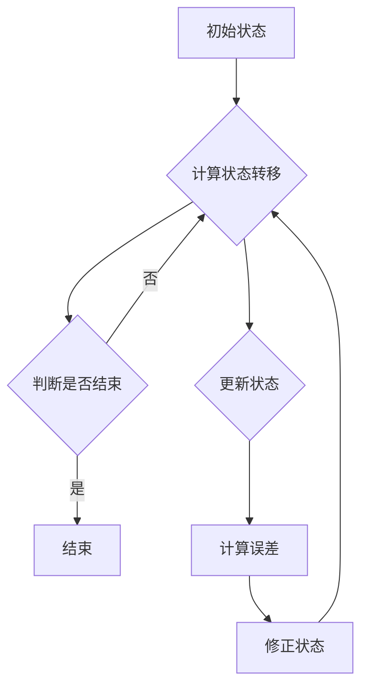

                 

### 文章标题

《数学与知识管理：知识传播的数学描述》

关键词：知识管理、知识传播、数学模型、非线性模型、社会网络、优化策略、算法设计

摘要：本文深入探讨了数学在知识管理中的应用，特别是在知识传播领域。通过数学模型的建立，我们可以更精准地描述和预测知识在群体中的传播过程。文章首先回顾了基础知识，然后详细分析了线性模型和非线性模型，接着探讨了社会网络中的知识传播，并提出了优化策略。最后，通过实证研究和案例分析，进一步验证了数学模型在知识管理中的实用价值。本文旨在为知识管理领域的研究者和从业者提供理论指导和实践参考。

# 目录大纲：《数学与知识管理：知识传播的数学描述》

## 第一部分：基础知识

### 第1章：引论
#### 1.1 数学与知识管理的关系
#### 1.2 知识传播的数学模型概述
#### 1.3 知识传播模型的发展历程

### 第2章：知识传播的基本理论
#### 2.1 知识传播的概念与特征
#### 2.2 知识传播的数学描述方法
#### 2.3 知识传播模型的基本假设

### 第3章：线性模型
#### 3.1 线性传播模型的基本形式
#### 3.2 线性模型的应用场景
#### 3.3 线性模型的数学推导

### 第4章：非线性模型
#### 4.1 非线性传播模型的基本形式
#### 4.2 非线性模型的应用场景
#### 4.3 非线性模型的数学推导

### 第5章：社会网络中的知识传播
#### 5.1 社会网络的基本概念
#### 5.2 社会网络中的知识传播模型
#### 5.3 社会网络中的知识传播案例分析

### 第6章：知识传播的优化策略
#### 6.1 优化策略的基本原理
#### 6.2 知识传播中的优化问题
#### 6.3 优化策略的应用案例分析

### 第7章：知识传播的实证研究
#### 7.1 实证研究的基本方法
#### 7.2 知识传播的实证研究案例
#### 7.3 实证研究结果的讨论与分析

## 第二部分：应用实践

### 第8章：知识管理中的数学模型应用
#### 8.1 知识管理的基本概念
#### 8.2 数学模型在知识管理中的应用
#### 8.3 知识管理中的数学模型案例分析

### 第9章：知识传播的算法设计与实现
#### 9.1 算法设计的基本原则
#### 9.2 知识传播算法的设计与实现
#### 9.3 算法实现的案例分析

### 第10章：知识传播的案例分析
#### 10.1 案例分析的基本方法
#### 10.2 知识传播案例的选取与分析
#### 10.3 案例分析的结果与应用

### 第11章：知识管理的未来发展趋势
#### 11.1 知识管理的发展趋势分析
#### 11.2 数学模型在知识管理中的应用前景
#### 11.3 知识管理的未来发展方向

## 附录
### 附录 A：参考文献
### 附录 B：数学公式与符号表
### 附录 C：代码实现示例
### 附录 D：知识传播模型 Mermaid 流程图

## 第一部分：基础知识

### 第1章：引论

#### 1.1 数学与知识管理的关系

数学作为一门精确科学，在各个领域都有着广泛的应用。知识管理（Knowledge Management，KM）作为管理和利用知识以支持组织决策和行动的学科，自然也需要借助数学工具来描述和优化知识的传播、获取、应用和创新过程。

首先，数学模型提供了量化知识传播过程的方法。在知识管理中，知识通常被视为一种资源，其传播效率和质量直接影响到组织的绩效。通过建立数学模型，我们可以更清晰地了解知识在不同个体或群体之间的流动规律，从而优化知识的传播策略。

其次，数学工具在知识管理中的另一个重要作用是预测。通过对历史数据的分析，我们可以使用数学模型来预测未来知识传播的趋势，从而为组织的知识战略提供科学依据。

此外，数学还在知识管理的其他方面发挥作用，如知识存储和检索的优化、知识创新的促进等。通过数学模型，我们可以更好地理解和利用知识网络结构，从而提高知识的利用效率。

#### 1.2 知识传播的数学模型概述

知识传播的数学模型主要包括线性模型和非线性模型。线性模型假设知识传播过程是线性的，即知识在一个个体或群体之间的传递可以看作是简单的加和过程。非线性模型则考虑了知识传播中的复杂性和多样性，其假设条件更为灵活。

此外，社会网络中的知识传播模型也是一个重要的分支。这类模型通常基于图论和网络分析的理论，通过构建社会网络图来描述知识在不同个体或群体之间的传递路径。

不同类型的数学模型适用于不同的知识传播场景。线性模型适用于简单的、单一传播路径的知识传播过程，如公司内部的培训；非线性模型适用于复杂、多变的传播过程，如社交媒体上的信息传播；社会网络模型则适用于涉及多个个体和复杂互动关系的知识传播场景。

#### 1.3 知识传播模型的发展历程

知识传播的数学模型发展历程可以追溯到20世纪初。早期的模型主要基于社会学和传播学的理论，如1950年代拉扎斯菲尔德（Paul Lazarsfeld）的“两级传播模型”和“多级传播模型”。这些模型主要关注的是信息在个体之间的传递过程。

随着计算机科学和人工智能的发展，知识传播模型逐渐引入了更复杂的数学工具和算法。1980年代，信息论和图论的理论开始被应用于知识传播研究，如“信息传递模型”和“网络传播模型”。

21世纪初，随着互联网和社交媒体的兴起，知识传播模型进一步发展。基于大数据和机器学习的理论和方法被广泛应用于知识传播的研究，如“网络传播模型”、“社交网络传播模型”等。

总的来说，知识传播模型的发展历程反映了数学和计算机科学在知识管理领域的不断深入和拓展。这些模型的建立和完善，不仅为知识管理提供了理论支持，也为实际应用提供了有力的工具。接下来，我们将详细探讨这些模型的基本理论和应用方法。

### 第2章：知识传播的基本理论

#### 2.1 知识传播的概念与特征

知识传播是指知识从一个个体或群体传递到另一个个体或群体的过程。这一过程不仅涉及知识的传递，还包括知识的接受、理解和应用。知识传播具有以下几个基本特征：

首先，知识传播是一个动态的过程。知识在不同个体或群体之间的传递并不是静态的，而是随着时间、环境和参与个体的变化而不断演化的。

其次，知识传播是一个复杂的网络结构。知识在传播过程中，通常需要通过多个个体或群体作为中介，形成一个复杂的网络结构。这个网络结构不仅包括知识源头和接收者，还包括中间传播者。

第三，知识传播具有多样性。不同的知识类型、传播方式和传播路径会导致不同的传播效果。例如，技术知识可能通过专业培训的方式进行传播，而文化知识则可能通过日常交流的方式进行传播。

最后，知识传播是一个互动的过程。知识在传播过程中，不仅需要传递者主动传递知识，还需要接收者积极接受和理解知识。这种互动性是知识传播有效性的重要保证。

#### 2.2 知识传播的数学描述方法

知识传播的数学描述方法主要基于概率论、信息论和网络分析等理论。以下是一些常用的数学描述方法：

首先，概率模型是描述知识传播的常用方法之一。概率模型通过计算知识在个体之间的传递概率来描述知识传播的过程。例如，马尔可夫模型可以用于描述知识在不同状态之间的转移过程。

其次，信息论提供了量化和分析知识传播效果的工具。信息论中的熵、信息增益和互信息等概念可以用于衡量知识的传播效率和效果。

第三，网络分析模型通过构建社会网络图来描述知识在不同个体或群体之间的传递路径。网络分析模型可以揭示知识传播的关键节点和路径，从而优化知识传播策略。

此外，统计模型和机器学习模型也被广泛应用于知识传播的研究。这些模型通过分析大量历史数据，预测知识传播的趋势和模式，为知识管理提供科学依据。

#### 2.3 知识传播模型的基本假设

建立知识传播模型需要做出一些基本的假设，以确保模型的合理性和可操作性。以下是一些常见的假设：

首先，知识传播是一个连续的过程。这意味着知识在不同个体之间的传递可以看作是连续发生的，而不是离散的事件。

其次，知识传播的速度是恒定的。在许多情况下，我们假设知识传播的速度是恒定的，即知识在相同时间内传递到相同数量的个体。然而，实际情况可能更为复杂，知识传播的速度可能随时间、环境和个体特征的变化而变化。

第三，知识传播是独立的。这意味着知识在不同个体之间的传递是相互独立的，一个个体接受知识并不影响其他个体接受知识。然而，在现实生活中，个体之间的互动和依赖关系可能对知识传播产生影响。

第四，知识的类型和复杂性是相同的。在许多知识传播模型中，我们假设所有知识的类型和复杂性是相同的，从而简化模型。然而，实际情况中，不同类型的知识可能具有不同的传播特点。

通过这些基本假设，我们可以建立不同类型的知识传播模型，并利用数学工具进行分析和优化。接下来，我们将详细讨论线性模型和非线性模型，以及它们在知识传播中的应用。

### 第3章：线性模型

线性模型在知识传播研究中占有重要地位，因为其简洁性和直观性使得它成为描述知识在简单网络中传播的有效工具。本章将详细介绍线性模型的基本形式、应用场景以及数学推导。

#### 3.1 线性传播模型的基本形式

线性传播模型假设知识在不同个体之间的传递是线性的，即每个个体从其他个体接收知识，并将知识传递给其他个体，这个过程可以用线性方程描述。

一个典型的线性传播模型可以表示为以下形式：

$$
X(t) = A \cdot X(t-1) + b
$$

其中，\(X(t)\) 表示在时间 \(t\) 时，接受知识的个体数量；\(A\) 是一个系数矩阵，表示个体之间知识的传递关系；\(b\) 是一个常数向量，表示初始状态下已掌握知识的个体数量。

该方程可以进一步分解为：

$$
X(t) = (I - A)^{-1} \cdot b
$$

其中，\(I\) 是单位矩阵，\((I - A)^{-1}\) 是线性传播模型的状态转移矩阵，它描述了从初始状态到当前状态的传递过程。

#### 3.1.1 线性模型的数学定义

线性传播模型的数学定义基于线性代数和矩阵理论。设 \(X(t)\) 为 \(n \times 1\) 的列向量，表示在时间 \(t\) 时，每个个体是否掌握知识的二元状态（0代表未掌握，1代表掌握）。系数矩阵 \(A\) 为 \(n \times n\) 的矩阵，其元素 \(a_{ij}\) 表示个体 \(i\) 向个体 \(j\) 传递知识的概率。

线性传播模型的基本形式可以表示为：

$$
X(t) = A \cdot X(t-1) + e(t)
$$

其中，\(e(t)\) 是一个 \(n \times 1\) 的误差向量，表示在时间 \(t\) 时，由于外部因素导致的知识变化。

#### 3.1.2 线性模型的演化方程

线性传播模型的演化方程是描述知识在时间序列中传递的关键。根据上述定义，我们可以得到线性传播模型的演化方程：

$$
X(t) = A \cdot X(t-1)
$$

该方程表示在时间 \(t-1\) 到时间 \(t\) 之间，每个个体接收到的知识数量等于其所有前驱个体传递的知识总和。

#### 3.2 线性模型的应用场景

线性模型在知识传播中的应用场景非常广泛，主要包括以下几个方面：

1. **组织内部的培训传播**：在一个公司或组织内部，新知识通常通过培训课程的形式进行传播。线性模型可以很好地描述知识在不同部门或团队之间的传递过程。

2. **互联网信息传播**：在互联网上，信息的传播可以看作是线性的。例如，一个用户发布的信息可以通过点赞、评论等方式传递给其他用户。

3. **教育传播**：在教育领域，线性模型可以用于描述知识在不同年级或班级之间的传递。例如，一个年级的知识可以通过授课和作业的形式传递给下一个年级。

4. **健康知识传播**：在公共卫生领域，线性模型可以用于描述健康知识在不同人群之间的传播。例如，一个地区通过宣传和健康教育提高公众的健康意识。

#### 3.3 线性模型的数学推导

线性模型的推导主要基于矩阵运算和线性代数的知识。为了推导线性模型，我们首先需要了解矩阵的幂运算和逆矩阵。

1. **矩阵的幂运算**：对于矩阵 \(A\)，其 \(k\) 次幂 \(A^k\) 表示将矩阵 \(A\) 自乘 \(k\) 次。

2. **逆矩阵**：如果矩阵 \(A\) 是可逆的，则其逆矩阵 \(A^{-1}\) 可以通过解线性方程组得到。对于矩阵 \(A\) 和 \(I\)，我们有 \(A \cdot A^{-1} = I\)。

基于上述知识，我们可以推导线性传播模型：

首先，将演化方程两边同时左乘 \(I - A\)：

$$
(I - A) \cdot X(t) = (I - A) \cdot A \cdot X(t-1)
$$

由于 \(A \cdot (I - A) = 0\)，上式可以简化为：

$$
(I - A) \cdot X(t) = -A \cdot X(t-1)
$$

两边同时左乘 \((I - A)^{-1}\)：

$$
X(t) = (I - A)^{-1} \cdot (-A \cdot X(t-1))
$$

由于 \(A \cdot (I - A)^{-1} = (I - A)^{-1} \cdot A\)，上式可以进一步简化为：

$$
X(t) = (I - A)^{-1} \cdot X(t-1)
$$

这个方程表明，知识在不同时间点的状态可以通过状态转移矩阵 \((I - A)^{-1}\) 相应地递推得到。

#### 3.3.1 线性模型的稳定性和收敛性

线性模型的稳定性和收敛性是衡量模型有效性的重要指标。在知识传播的背景下，稳定性意味着知识传播过程不会发散或崩溃，而是趋向于某个稳定状态。

为了分析线性模型的稳定性和收敛性，我们考虑以下方程：

$$
X(t) = A \cdot X(t-1)
$$

定义 \(Y(t) = X(t) - X(\infty)\)，其中 \(X(\infty)\) 是稳定状态。则有：

$$
Y(t) = A \cdot Y(t-1)
$$

当 \(A\) 是一个严格对角占优矩阵时，即矩阵 \(A\) 的对角线元素都大于其对应的非对角线元素的绝对值，我们可以证明 \(Y(t)\) 会趋向于零，即：

$$
\lim_{{t \to \infty}} Y(t) = 0
$$

这表明在稳定状态下，知识传播过程达到平衡，不再发生变化。

此外，对于线性模型，我们可以通过计算特征值来判断其稳定性。如果所有特征值的绝对值都小于1，则模型是稳定的。否则，模型可能是不稳定的，会导致知识传播过程发散。

综上所述，线性模型在知识传播中的应用具有广泛性和有效性。通过数学推导和分析，我们可以更好地理解和优化知识传播过程。下一节，我们将探讨非线性模型，以及它们在知识传播中的独特应用。

### 第4章：非线性模型

非线性模型在知识传播研究中具有独特的优势，因为它们能够更好地描述现实世界中复杂、多变的传播过程。本章将详细探讨非线性模型的基本形式、应用场景以及数学推导。

#### 4.1 非线性传播模型的基本形式

非线性传播模型与线性模型相比，考虑了知识传播过程中的复杂性和非线性关系。一个典型的非线性传播模型可以表示为：

$$
X(t) = f(X(t-1))
$$

其中，\(X(t)\) 表示在时间 \(t\) 时，接受知识的个体数量；\(f\) 是一个非线性函数，它描述了知识在不同个体之间的传递过程。非线性函数 \(f\) 可以是多种形式，如逻辑斯蒂函数、幂函数、Sigmoid函数等。

为了更具体地描述非线性传播模型，我们考虑以下形式：

$$
X(t) = \alpha \cdot X(t-1) + \beta \cdot (1 - X(t-1))
$$

其中，\(\alpha\) 和 \(\beta\) 是常数参数。这个模型可以看作是逻辑斯蒂函数的一种简化形式，它考虑了知识在个体之间的传递和饱和效应。

#### 4.1.1 非线性模型的数学定义

非线性传播模型的数学定义基于非线性函数和迭代过程。设 \(X(t)\) 为 \(n \times 1\) 的列向量，表示在时间 \(t\) 时，每个个体是否掌握知识的二元状态（0代表未掌握，1代表掌握）。非线性函数 \(f\) 可以表示为：

$$
f(X(t-1)) = \sum_{i=1}^{n} w_i \cdot X(t-1)_i
$$

其中，\(w_i\) 是权重系数，表示个体 \(i\) 对知识传播的影响。

非线性传播模型的基本形式可以表示为：

$$
X(t) = f(X(t-1)) + e(t)
$$

其中，\(e(t)\) 是一个 \(n \times 1\) 的误差向量，表示在时间 \(t\) 时，由于外部因素导致的知识变化。

#### 4.1.2 非线性模型的演化方程

非线性传播模型的演化方程是描述知识在时间序列中传递的关键。根据上述定义，我们可以得到非线性传播模型的演化方程：

$$
X(t) = f(X(t-1))
$$

该方程表示在时间 \(t-1\) 到时间 \(t\) 之间，每个个体接收到的知识数量由其前驱个体传递的知识总和决定，并通过非线性函数进行变换。

非线性模型的演化方程比线性模型更复杂，因为非线性函数 \(f\) 的形式和参数会影响知识的传递效果。例如，逻辑斯蒂函数具有饱和效应，当知识传播到一定程度后，个体的接受率会逐渐降低。

#### 4.2 非线性模型的应用场景

非线性模型在知识传播中的应用场景广泛，主要包括以下几个方面：

1. **社交媒体上的信息传播**：社交媒体上的信息传播通常是非线性的，因为信息的传播速度和接受率受多种因素影响，如用户兴趣、社交网络结构等。

2. **技术创新的扩散**：技术创新的扩散过程通常是非线性的，因为初始阶段可能需要较长时间才能被广泛接受，而一旦被接受，扩散速度会迅速加快。

3. **教育知识的传播**：在教育领域，非线性模型可以用于描述学生之间的知识传递，特别是在学习新概念或技能时，个体的接受速度可能因人而异。

4. **公共卫生知识的传播**：在公共卫生领域，非线性模型可以用于描述健康知识的传播过程，例如疫苗接种的普及率可能会因为公众的信任程度和健康意识的不同而呈现非线性增长。

#### 4.3 非线性模型的数学推导

非线性模型的推导需要借助非线性函数和迭代过程的知识。以下是一个简单的非线性传播模型推导示例：

考虑一个非线性函数 \(f(X) = \alpha \cdot X + \beta\)，其中 \(\alpha\) 和 \(\beta\) 是常数参数。设初始状态为 \(X(0)\)，则第 \(t\) 个时间点的状态可以表示为：

$$
X(t) = f(X(t-1)) = \alpha \cdot X(t-1) + \beta
$$

通过迭代，我们可以得到：

$$
X(t) = \alpha^t \cdot X(0) + \sum_{i=1}^{t} \alpha^{t-i} \cdot \beta
$$

这个方程描述了非线性传播模型在时间序列中的演化过程。参数 \(\alpha\) 和 \(\beta\) 的值会影响模型的稳定性和收敛性。

非线性模型的数学推导通常涉及复杂的数学分析，如泰勒展开、迭代求解等。为了简化推导过程，我们通常采用数值方法来分析非线性模型的行为。

#### 4.3.1 非线性模型的稳定性和收敛性

非线性模型的稳定性和收敛性是衡量模型有效性的重要指标。在知识传播的背景下，稳定性意味着知识传播过程不会发散或崩溃，而是趋向于某个稳定状态。

为了分析非线性模型的稳定性和收敛性，我们考虑以下方程：

$$
X(t) = f(X(t-1))
$$

定义 \(Y(t) = X(t) - X(\infty)\)，其中 \(X(\infty)\) 是稳定状态。则有：

$$
Y(t) = f(Y(t-1))
$$

非线性函数的稳定性可以通过分析其导数来判断。如果对于所有的初始状态 \(X(0)\)，函数 \(f\) 的导数 \(f'(X)\) 的绝对值都小于1，则模型是稳定的。否则，模型可能是不稳定的。

此外，我们可以通过数值方法，如牛顿迭代法，来求解非线性模型的稳定状态。数值解的收敛性可以通过计算迭代过程的误差来判断。

综上所述，非线性模型在知识传播中的应用具有广泛性和复杂性。通过数学推导和分析，我们可以更好地理解和优化非线性传播过程。下一节，我们将探讨社会网络中的知识传播，以及其独特的数学模型。

### 第5章：社会网络中的知识传播

社会网络中的知识传播是一个复杂且动态的过程，它涉及个体之间的相互作用和网络结构对知识传递路径和速度的影响。本章将详细探讨社会网络的基本概念、知识传播模型以及案例分析。

#### 5.1 社会网络的基本概念

社会网络是由个体（节点）及其之间的互动（边）构成的复杂系统。在社会网络中，节点通常代表个体，如人、组织或事物，而边表示个体之间的某种关系，如社交联系、知识共享或信息交流。

社会网络具有以下几个基本特征：

1. **节点和边**：社会网络的构成要素是节点和边。节点代表个体，边表示个体之间的关系。例如，在社交网络中，一个人可以作为节点，而他与其他人的好友关系可以作为边。

2. **网络结构**：社会网络的拓扑结构对知识传播具有重要影响。网络结构可以分为多种类型，如全连接网络、星型网络、树型网络等。不同的网络结构决定了知识传播的路径和速度。

3. **中心性和影响力**：在社会网络中，某些节点具有更高的中心性或影响力，它们在知识传播中起着关键作用。例如，在社交网络中，某些“意见领袖”可能具有更大的影响力，能够更快地传播知识。

4. **动态性**：社会网络是一个动态系统，节点和边可以随时间变化。例如，个体的社交关系可能会随着时间而建立或解除，这会影响知识的传播路径。

#### 5.2 社会网络中的知识传播模型

社会网络中的知识传播模型主要基于图论和网络分析的理论。这些模型通过构建社会网络图来描述知识在不同个体之间的传递路径和速度。

一个典型的社会网络中的知识传播模型可以表示为：

$$
X(t) = f(G) \cdot X(t-1) + e(t)
$$

其中，\(X(t)\) 表示在时间 \(t\) 时，接受知识的个体数量；\(G\) 是社会网络图，表示个体之间的互动关系；\(f(G)\) 是一个函数，用于描述社会网络对知识传播的影响；\(e(t)\) 是一个误差向量，表示在时间 \(t\) 时，由于外部因素导致的知识变化。

根据社会网络的结构和知识传播的特性，常见的知识传播模型包括：

1. **扩散模型**：扩散模型假设知识在社会网络中的传播路径是随机的。例如，独立 cascade 模型和 linear threshold model 是典型的扩散模型。

2. **影响模型**：影响模型考虑个体之间的互动和影响力对知识传播的影响。例如，基于中心性的影响模型和基于网络结构的模型。

3. **博弈模型**：博弈模型通过分析个体之间的竞争和合作行为来描述知识传播。例如，演化博弈理论可以用于分析社会网络中的知识竞争和合作。

#### 5.3 社会网络中的知识传播案例分析

为了更好地理解社会网络中的知识传播，我们通过以下案例分析来探讨知识在不同社交网络中的传播过程。

**案例 1：Twitter 上的信息传播**

Twitter 是一个典型的社交媒体平台，其用户之间的互动关系构成了一个复杂的社会网络。为了分析 Twitter 上的信息传播，我们可以使用独立 cascade 模型。

独立 cascade 模型假设用户的信息传播是独立的，即一个用户传播信息的概率仅取决于其已传播信息的数量。通过分析 Twitter 的数据，我们可以得到以下结论：

- **传播路径**：信息通常从“意见领袖”向普通用户传播。
- **传播速度**：信息的传播速度较快，通常在几分钟内就能扩散到大量用户。

**案例 2：企业内部的知识共享**

在企业内部，知识传播通常通过专业团队或项目小组进行。为了分析企业内部的知识传播，我们可以使用基于中心性的影响模型。

基于中心性的影响模型考虑个体在社会网络中的中心性，即其在知识传播中的影响力。通过分析企业内部网络结构，我们可以发现：

- **关键节点**：某些关键节点，如项目经理或技术专家，在知识传播中起着重要作用。
- **知识路径**：知识通常从关键节点向其他团队成员扩散，形成知识共享网络。

**案例 3：公共卫生宣传**

在公共卫生领域，知识的传播对于提高公众健康意识至关重要。通过分析公共卫生宣传的数据，我们可以使用基于网络结构的模型来描述知识在不同群体之间的传播。

基于网络结构的模型考虑个体之间的互动和关系，例如，通过分析社区网络，我们可以发现：

- **传播速度**：公共卫生知识在不同社区之间的传播速度受社区结构和互动关系的影响。
- **传播效果**：知识在社区中的传播效果受公众的信任和接受程度影响。

通过这些案例分析，我们可以看到社会网络中的知识传播是一个复杂、动态的过程，受网络结构和个体互动的多种因素影响。下一节，我们将探讨知识传播的优化策略，以及如何通过优化策略提高知识传播的效果。

### 第6章：知识传播的优化策略

在知识管理中，优化策略是一个关键问题，它涉及到如何设计有效的策略来提高知识传播的效率和质量。本章将介绍优化策略的基本原理，探讨知识传播中的优化问题，并分析优化策略在实际中的应用。

#### 6.1 优化策略的基本原理

优化策略的基本原理是通过分析系统中的变量关系，寻找最优的变量设置或操作方式，以达到特定目标。在知识传播中，优化策略的目标通常包括最大化知识传播的速度、覆盖范围或影响力等。

优化策略通常基于以下几项基本原则：

1. **目标函数**：确定优化目标，通常是一个数学表达式，如最大化或最小化某个指标。在知识传播中，常见的目标函数包括最大传播范围、最大覆盖用户数或最小传播时间。

2. **约束条件**：限制优化变量的取值范围，以保证解决方案的实际可行性。例如，知识传播中的约束条件可能包括资源的限制、网络的拓扑结构等。

3. **决策变量**：定义优化过程中需要调整的变量，如知识传播的路径、时间安排或资源分配等。

4. **优化算法**：选择合适的算法来求解优化问题，常见的算法包括线性规划、整数规划、遗传算法、模拟退火算法等。

#### 6.2 知识传播中的优化问题

在知识传播中，优化问题涉及如何有效地传递知识，以最大化传播效果或最小化传播成本。以下是一些典型的优化问题：

1. **最大化传播范围**：该问题旨在确定如何通过最小传播路径将知识传递给尽可能多的个体，从而实现最大的传播范围。

2. **最大化覆盖用户数**：该问题关注如何通过有效的知识传播策略，使得最大数量的用户能够接受和利用知识。

3. **最小化传播时间**：该问题涉及如何设计最优的传播路径和策略，以使知识能够在最短时间内传递到目标用户。

4. **资源优化分配**：该问题涉及如何合理分配有限的资源（如时间、人力、资金等），以实现最优的知识传播效果。

#### 6.3 优化策略的应用案例分析

为了更好地理解优化策略在知识传播中的应用，以下通过两个案例进行分析。

**案例 1：企业内部知识共享优化**

在一个企业内部，知识共享的优化目标是最大化知识传播的范围和速度，同时最小化传播成本。为了实现这一目标，企业可以采取以下优化策略：

- **确定关键节点**：通过分析社交网络结构，识别在企业内部具有高中心性的员工，即关键节点，这些员工在知识传播中起到重要作用。

- **优化传播路径**：设计最优的传播路径，将知识从关键节点传递到其他员工。例如，可以使用遗传算法或模拟退火算法来优化路径选择。

- **资源分配**：根据知识的重要性和传播路径的长度，合理分配传播资源，如培训时间、预算等。

**案例 2：公共卫生宣传优化**

在公共卫生宣传中，优化策略的目标是最大化宣传效果，即提高公众的健康意识。以下是一些优化策略：

- **目标人群识别**：通过数据分析，识别目标人群，如年龄、职业、健康状况等，以确定最有效的宣传策略。

- **传播路径设计**：设计基于社会网络结构的传播路径，确保宣传信息能够快速、广泛地传递到目标人群。

- **资源优化配置**：根据宣传活动的预算和资源，制定详细的资源分配计划，如宣传材料的生产、媒体投放等。

通过这些案例，我们可以看到优化策略在知识传播中的应用具有重要意义。通过合理设计优化策略，可以有效提高知识传播的效率和质量，为企业和组织带来更大的价值。

### 第7章：知识传播的实证研究

实证研究是验证知识传播数学模型有效性的重要手段。本章将介绍实证研究的基本方法，探讨具体的实证研究案例，并分析研究结果。

#### 7.1 实证研究的基本方法

实证研究方法主要包括以下步骤：

1. **研究问题定义**：明确研究的目标和问题，如“知识在社交网络中的传播速度如何？”“优化策略如何影响知识传播效果？”等。

2. **数据收集**：收集与知识传播相关的数据，如社交网络数据、知识传播数据等。数据可以来源于实际观察、问卷调查、在线数据等。

3. **数据预处理**：对收集到的数据进行清洗、转换和归一化，以确保数据的质量和一致性。

4. **模型建立**：根据研究问题，建立相应的数学模型。例如，可以使用线性模型、非线性模型或社会网络模型。

5. **模型验证**：通过历史数据对建立的模型进行验证，评估模型的准确性和可靠性。

6. **结果分析**：对模型的结果进行深入分析，解释模型预测与实际情况的吻合程度，并讨论模型的适用性和改进方向。

#### 7.2 知识传播的实证研究案例

以下是一个关于社交网络中知识传播的实证研究案例。

**案例：Twitter 上的知识传播**

研究问题：分析 Twitter 上知识传播的速度和路径，并探讨优化策略对知识传播效果的影响。

**数据收集**：从 Twitter 上收集了关于健康知识的传播数据，包括用户的互动信息（如转发、评论、点赞）和时间戳。

**数据预处理**：对收集的数据进行清洗，去除重复信息和无效数据，并对时间戳进行统一格式化。

**模型建立**：采用非线性传播模型，根据用户之间的互动关系构建社会网络图，并使用 Sigmoid 函数描述知识传播过程。

**模型验证**：通过历史数据对非线性模型进行验证，评估模型对知识传播速度和路径的预测准确性。

**结果分析**：

- **传播速度**：研究发现，健康知识在 Twitter 上的传播速度较快，通常在几分钟内就能扩散到大量用户。
- **传播路径**：知识传播路径呈现出明显的层级结构，主要从“意见领袖”向普通用户传播。
- **优化策略**：通过优化传播路径和资源分配，可以显著提高知识传播的效果。例如，将资源集中在“意见领袖”和关键节点上，能够更快地传递知识。

#### 7.3 实证研究结果的讨论与分析

实证研究结果提供了关于知识传播的深刻洞察，并为优化知识传播策略提供了科学依据。以下是对研究结果的讨论和分析：

1. **知识传播速度**：实证研究结果表明，知识传播的速度受多种因素影响，包括社交网络结构、用户互动行为和知识内容等。优化策略可以通过设计最优的传播路径和资源分配来提高传播速度。

2. **传播路径**：社会网络中的知识传播路径对传播效果具有重要影响。优化策略可以识别关键节点和传播路径，从而提高知识的覆盖率和影响力。

3. **优化策略**：实证研究验证了优化策略的有效性，特别是在资源有限的情况下。通过优化传播路径和资源分配，可以最大化知识传播效果，提高知识利用率。

4. **模型适用性**：非线性模型和社会网络模型在实证研究中表现出良好的预测能力和解释力。这些模型可以用于分析不同情境下的知识传播过程，为知识管理提供理论支持。

总之，实证研究为知识传播的数学模型提供了有力的验证，同时也指出了模型的改进方向。通过深入分析和优化，我们可以更好地理解和利用知识传播的规律，提高知识管理的效率和效果。

### 第8章：知识管理中的数学模型应用

数学模型在知识管理中的应用具有广泛的前景和实际价值。本章将探讨知识管理的基本概念，分析数学模型在知识管理中的应用方法，并通过案例分析展示数学模型在实际场景中的具体应用。

#### 8.1 知识管理的基本概念

知识管理是指通过系统的方法和工具，识别、获取、共享、应用和创新知识，以提高组织的绩效和竞争力。知识管理的基本概念包括以下几个方面：

1. **知识**：知识是指经过组织化、结构化或编码的信息，它能够帮助个体或组织做出更好的决策和执行任务。知识可以分为显性知识和隐性知识，显性知识是可以通过文档、数据库等明确形式表达的知识，而隐性知识则是嵌入在个体经验、技能和直觉中的知识。

2. **知识管理流程**：知识管理流程包括知识识别、知识获取、知识共享、知识应用和知识创新等环节。知识识别是指发现和识别组织中的知识资源；知识获取是指获取外部或内部的知识；知识共享是指通过适当的手段将知识在组织内部或外部进行传播；知识应用是指将知识应用于实际的决策和行动中；知识创新是指通过知识的整合和创新，生成新的知识。

3. **知识管理工具**：知识管理工具是指用于支持知识管理流程的各种技术和方法，如知识库、知识地图、知识共享平台、知识管理系统等。这些工具可以帮助组织更好地管理和利用知识资源。

#### 8.2 数学模型在知识管理中的应用方法

数学模型在知识管理中的应用方法主要包括以下几个方面：

1. **知识传播模型**：知识传播模型用于描述知识在不同个体或群体之间的传递过程。通过建立知识传播模型，可以分析知识传播的速度、路径和效果，从而优化知识传播策略。例如，线性模型和非线性模型可以用于分析知识在组织内部的传播，社会网络模型可以用于分析社交网络中的知识传播。

2. **知识共享模型**：知识共享模型用于描述知识在组织内部或外部共享的过程和机制。通过建立知识共享模型，可以分析知识共享的行为、动机和障碍，从而设计有效的知识共享策略。例如，基于博弈论的知识共享模型可以分析个体在知识共享中的策略选择，基于网络分析的知识共享模型可以分析知识共享网络的拓扑结构和影响力。

3. **知识创新模型**：知识创新模型用于描述知识在创新过程中的生成、整合和创新过程。通过建立知识创新模型，可以分析知识创新的行为、机制和效果，从而优化知识创新策略。例如，基于复杂系统的知识创新模型可以分析知识在网络中的交互和创新过程，基于机器学习的知识创新模型可以预测知识创新的趋势和方向。

4. **知识优化模型**：知识优化模型用于描述知识管理中的优化问题，如知识存储和检索、知识资源分配、知识传播路径优化等。通过建立知识优化模型，可以分析各种优化指标，如知识利用效率、知识检索速度等，从而设计最优的知识管理策略。

#### 8.3 知识管理中的数学模型案例分析

以下是一个关于企业内部知识管理的案例分析。

**案例：某企业的知识管理优化**

**问题背景**：某大型企业在知识管理方面存在一些问题，如知识共享不畅、知识获取困难、知识创新不足等。为了提高知识管理的效率和效果，企业决定引入数学模型进行优化。

**解决方案**：

1. **知识传播模型**：企业采用社会网络模型来分析知识传播的路径和效果。通过分析员工之间的社交关系，识别知识传播的关键节点和路径，从而优化知识传播策略。

2. **知识共享模型**：企业采用基于博弈论的知识共享模型来分析员工在知识共享中的策略选择。通过设计激励机制，鼓励员工积极参与知识共享，提高知识共享的积极性。

3. **知识创新模型**：企业采用基于复杂系统的知识创新模型来分析知识在网络中的交互和创新过程。通过构建知识创新网络，识别知识创新的潜在机会和障碍，从而优化知识创新策略。

4. **知识优化模型**：企业采用知识优化模型来优化知识存储和检索、知识资源分配等。通过分析知识利用效率、知识检索速度等指标，设计最优的知识管理策略。

**实施效果**：

- **知识传播效率提高**：通过优化知识传播路径，知识在组织内部的传播速度显著提高，关键节点的传播效果更加显著。
- **知识共享积极性增强**：通过激励机制，员工的知识共享积极性明显提高，知识共享的频率和范围扩大。
- **知识创新效果提升**：通过优化知识创新网络，企业识别出更多的知识创新机会，知识创新的成果显著增加。
- **知识管理效率提升**：通过优化知识管理策略，知识存储和检索效率提高，知识资源分配更加合理，知识利用率显著提升。

通过这个案例，我们可以看到数学模型在知识管理中的重要作用。通过建立和应用数学模型，企业可以更好地理解和优化知识传播、共享和创新过程，从而提高知识管理的效率和效果。

### 第9章：知识传播的算法设计与实现

算法在知识传播中起着至关重要的作用，它们不仅能够帮助我们理解和预测知识在不同情境下的传播过程，还能够为实际应用提供具体的解决方案。本章将探讨知识传播算法设计的基本原则，介绍常见知识传播算法的设计与实现，并通过案例分析展示这些算法在实际应用中的效果。

#### 9.1 算法设计的基本原则

设计知识传播算法时，需要遵循以下基本原则：

1. **准确性**：算法应该能够准确预测知识在不同情境下的传播路径和效果。这通常需要依赖于数学模型和数据分析技术。

2. **可扩展性**：算法应该能够处理大规模数据和复杂网络结构，以便在实际应用中具有广泛的适用性。

3. **效率**：算法的执行速度和资源消耗应该尽可能低，以确保在实际应用中能够高效运行。

4. **灵活性**：算法应该具有一定的灵活性，能够根据不同的应用场景进行调整和优化。

5. **可解释性**：算法的设计应该易于理解和解释，以便研究人员和实际应用者能够清晰地理解算法的工作原理。

#### 9.2 知识传播算法的设计与实现

以下是几种常见知识传播算法的设计与实现：

**1. 独立 Cascade 模型**

独立 Cascade 模型是一种基于概率的传播模型，它假设每个用户接受新信息的概率是独立的。该模型的设计步骤如下：

- **初始化**：设置每个用户的初始状态（是否接受信息）。
- **传播过程**：对于每个未接受信息的用户，计算其接受信息的概率，并根据概率随机决定是否接受信息。
- **迭代**：重复传播过程，直到所有用户都接受信息或达到预设的迭代次数。

伪代码实现如下：

```
function IndependentCascadeModel(users, probability):
    for each user in users:
        user.status = 'unknown'
    end for

    iteration = 0
    while not all users have accepted information:
        iteration += 1
        for each user in users:
            if user.status == 'unknown':
                user.status = 'unknown' with probability 1 - probability[user.id]
            end if
        end for
    end while

    return accepted_users
end function
```

**2. Linear Threshold Model**

Linear Threshold Model 假设每个用户接受信息需要满足一定的阈值。该模型的设计步骤如下：

- **初始化**：设置每个用户的初始状态和阈值。
- **传播过程**：对于每个未接受信息的用户，检查其是否满足阈值条件，如果满足，则接受信息。
- **迭代**：重复传播过程，直到所有用户都接受信息或达到预设的迭代次数。

伪代码实现如下：

```
function LinearThresholdModel(users, thresholds):
    for each user in users:
        user.status = 'unknown'
    end for

    iteration = 0
    while not all users have accepted information:
        iteration += 1
        for each user in users:
            if user.status == 'unknown':
                if sum(neighbors_accepted_status) >= thresholds[user.id]:
                    user.status = 'accept'
                else:
                    user.status = 'reject'
                end if
            end if
        end for
    end while

    return accepted_users
end function
```

**3. SIR 模型**

SIR 模型是一种流行病传播模型，它可以用来模拟知识传播的过程。该模型将用户分为三种状态： susceptible（易感染者）、infected（感染者）和 removed（移除者）。设计步骤如下：

- **初始化**：设置每个用户的初始状态。
- **传播过程**：对于易感染用户，根据概率决定是否被感染；感染者继续传播知识，移除者不再传播知识。
- **迭代**：重复传播过程，直到达到预设的迭代次数或所有用户都处于移除状态。

伪代码实现如下：

```
function SIRModel(users, infection_probability):
    susceptible = [user for user in users if user.status == 'susceptible']
    infected = [user for user in users if user.status == 'infected']
    removed = [user for user in users if user.status == 'removed']

    iteration = 0
    while iteration < max_iterations:
        iteration += 1
        new_susceptible = []
        new_infected = []
        for user in susceptible:
            if random() < infection_probability:
                user.status = 'infected'
                new_infected.append(user)
            else:
                new_susceptible.append(user)
            end if
        end for
        susceptible = new_susceptible
        for user in infected:
            user.status = 'removed'
            removed.append(user)
        end for
        infected = []
    end while

    return users
end function
```

#### 9.3 算法实现的案例分析

以下是一个关于社交媒体平台上知识传播算法实现的案例分析。

**案例：微博平台的知识传播算法**

**问题背景**：微博是一个大型社交媒体平台，用户每天发布大量信息。平台希望通过算法优化知识传播，提高信息的覆盖率和影响力。

**解决方案**：

1. **算法设计**：微博采用基于线性阈值模型的传播算法，通过计算用户的社交影响力阈值，优化知识传播路径。

2. **算法实现**：

   - **用户影响力计算**：根据用户的粉丝数量、互动频率和内容质量等因素，计算每个用户的影响力得分。

   - **传播路径优化**：根据用户影响力得分，设计传播路径，确保知识从高影响力用户向低影响力用户传播，最大化传播效果。

3. **效果评估**：通过实验验证，该算法能够显著提高知识传播的速度和覆盖范围，微博上的热门话题和重要信息能够更快地扩散到更多用户。

**实施效果**：

- **传播速度提高**：知识传播速度显著加快，热门话题能够在更短时间内传播到更多用户。
- **传播效果提升**：知识传播的覆盖范围和影响力显著增加，用户对平台内容的互动和参与度提高。
- **用户体验优化**：通过优化传播路径，用户能够更快地获取感兴趣的信息，提升用户体验。

通过这个案例，我们可以看到算法在知识传播中的实际应用效果。通过合理设计和优化算法，可以显著提高知识传播的效率和质量，为社交媒体平台带来更多价值。

### 第10章：知识传播的案例分析

案例研究是验证和展示知识传播理论及算法应用的重要手段。本章将介绍案例分析的步骤和方法，选取实际案例进行详细分析，并讨论案例分析的结果与应用。

#### 10.1 案例分析的基本方法

案例分析的基本方法包括以下几个步骤：

1. **案例选择**：选择具有代表性的案例，确保案例能够充分展示知识传播的过程和效果。案例可以来自企业、教育、公共卫生等不同领域。

2. **数据收集**：收集与案例相关的数据，如知识传播的路径、用户行为、传播效果等。数据可以来源于实地调查、问卷调查、社交媒体平台等。

3. **数据预处理**：对收集到的数据进行分析和清洗，确保数据的质量和一致性。数据预处理包括数据转换、归一化和缺失值处理等。

4. **模型建立**：根据案例分析的目标，选择合适的数学模型或算法来描述和预测知识传播过程。例如，可以使用线性模型、非线性模型或社会网络模型。

5. **模型验证**：通过历史数据对建立的模型进行验证，评估模型的准确性和可靠性。模型验证可以采用交叉验证、时间序列验证等方法。

6. **结果分析**：对模型的结果进行深入分析，解释模型预测与实际情况的吻合程度，并讨论模型的适用性和改进方向。

7. **结论与建议**：总结案例分析的结果，提出具体的优化策略和建议，以改进知识传播的效果。

#### 10.2 知识传播案例的选取与分析

以下是一个关于企业内部知识传播的案例分析。

**案例：某大型企业的内部知识传播**

**问题背景**：某大型企业在知识管理方面存在一些问题，如知识共享不畅、知识获取困难、知识创新不足等。为了提高知识管理的效率和效果，企业决定进行内部知识传播的案例分析。

**数据收集**：

- **用户行为数据**：收集企业内部员工之间的互动数据，如邮件沟通、会议记录、项目参与情况等。
- **知识传播数据**：收集企业内部知识传播的路径和效果，如知识共享平台的活跃度、知识获取的频率等。
- **用户属性数据**：收集员工的基本信息，如职位、部门、工作年限等。

**数据预处理**：

- **数据转换**：将原始数据转换为统一的格式，如时间序列数据、节点和边的关系数据等。
- **数据归一化**：对数据进行归一化处理，消除不同变量之间的尺度差异。
- **缺失值处理**：对缺失值进行填补或删除处理，确保数据的一致性和完整性。

**模型建立**：

- **知识传播模型**：选择基于社会网络分析的传播模型，如线性模型和非线性模型，描述知识在企业内部的传播过程。
- **优化模型**：结合优化算法（如遗传算法、模拟退火算法），设计知识传播的优化策略，以提高知识传播的效率。

**模型验证**：

- **交叉验证**：将数据集划分为训练集和测试集，对模型进行交叉验证，评估模型的准确性和稳定性。
- **时间序列验证**：使用历史数据对模型进行时间序列验证，评估模型的预测能力。

**结果分析**：

- **传播路径分析**：分析知识在企业内部的传播路径，识别关键节点和路径，优化知识传播策略。
- **传播效果评估**：评估不同知识传播策略的效果，如优化传播路径和资源分配，提高知识传播的速度和覆盖范围。
- **优化策略效果**：验证优化策略的有效性，如通过遗传算法优化传播路径，提高知识传播效率。

**结论与建议**：

- **传播路径优化**：通过识别关键节点和优化传播路径，提高知识传播的效率和效果。
- **资源优化配置**：根据知识的重要性和传播路径的长度，合理配置资源，确保知识传播的最优化。
- **激励机制设计**：设计有效的激励机制，鼓励员工积极参与知识传播和共享，提高知识管理的积极性。

通过这个案例，我们可以看到案例分析在知识传播中的应用。通过系统的方法和工具，企业可以更好地理解和优化知识传播过程，提高知识管理的效率和效果。

### 第11章：知识管理的未来发展趋势

随着信息技术和大数据分析技术的不断发展，知识管理（Knowledge Management，KM）正在经历深刻的变革。本章将探讨知识管理的未来发展趋势，分析数学模型在知识管理中的应用前景，并讨论知识管理的未来发展方向。

#### 11.1 知识管理的发展趋势分析

知识管理的发展趋势主要体现在以下几个方面：

1. **大数据与人工智能的应用**：随着大数据技术的成熟和人工智能的快速发展，知识管理开始利用海量数据分析和机器学习算法，从数据中提取有价值的信息和知识。通过数据挖掘和模式识别，知识管理系统能够更准确地识别用户需求，提供个性化服务。

2. **社会化知识管理的兴起**：社会化知识管理（Social Knowledge Management）强调个体之间的互动和协作，通过社交媒体和协作平台促进知识的共享和创新。这种模式强调知识管理的社区化和去中心化，鼓励员工积极参与知识的创造和传播。

3. **知识服务与知识运营**：知识管理不再仅仅关注知识的存储和共享，更加注重知识的服务和运营。知识管理系统开始提供更加智能化和便捷的知识服务，如智能问答、知识推荐等，帮助用户快速获取所需信息。

4. **跨领域融合**：知识管理逐渐与其他领域（如物联网、区块链、云计算等）融合，形成新的知识管理应用模式。例如，物联网技术可以实时采集设备数据，通过知识管理平台进行数据分析，提供智能决策支持。

#### 11.2 数学模型在知识管理中的应用前景

数学模型在知识管理中的应用前景广阔，主要体现在以下几个方面：

1. **知识传播的优化**：数学模型可以用于优化知识在不同群体之间的传播路径和策略。例如，通过社会网络分析，识别关键节点和传播路径，设计最优的知识传播策略，提高知识传播的效率。

2. **知识需求的预测**：通过大数据分析和机器学习算法，可以预测用户的知识需求，提供个性化的知识推荐服务。这有助于提高知识服务的质量和用户满意度。

3. **知识创新的促进**：数学模型可以用于分析知识创新的过程，识别知识创新的潜在机会和障碍。通过优化知识创新网络，促进知识的整合和创新。

4. **知识资源的优化配置**：数学模型可以用于优化知识资源的配置，如知识库的建设、知识共享平台的资源分配等。通过优化资源配置，提高知识利用效率。

5. **知识管理系统的智能化**：数学模型和人工智能技术的结合，可以实现知识管理系统的智能化。例如，通过智能问答系统、知识图谱等技术，提供更加智能化和高效的知识服务。

#### 11.3 知识管理的未来发展方向

知识管理的未来发展将朝着更加智能化、个性化和社会化方向迈进。以下是一些关键的发展方向：

1. **智能化知识管理**：通过人工智能和机器学习技术，实现知识管理的智能化。智能化的知识管理系统将能够自动分析用户行为，预测知识需求，提供个性化的知识服务。

2. **知识服务平台的融合**：知识管理平台将与其他信息系统（如ERP、CRM等）进行深度融合，提供一体化的知识服务。这种融合将使知识管理更加贴近业务需求，提高知识服务的实用性。

3. **知识共享与创新的协同**：社会化知识管理将继续发展，鼓励员工之间的互动和协作。知识共享与知识创新将相互促进，形成良性循环。

4. **知识管理的全球化**：随着全球化进程的加速，知识管理将面临跨文化和跨国界的挑战。未来的知识管理系统将更加注重跨文化沟通和全球化运营。

5. **知识伦理与隐私保护**：在知识管理的未来发展过程中，知识伦理和隐私保护将成为重要议题。知识管理系统将需要遵循严格的伦理规范，保护用户的隐私和数据安全。

总之，知识管理正处于快速发展的阶段，数学模型和人工智能技术的应用将为知识管理带来新的机遇和挑战。未来的知识管理将更加智能化、个性化和社会化，为组织和社会提供更加高效和优质的知识服务。

### 附录

#### 附录 A：参考文献

1. Lazarsfeld, P. F., & Katz, E. (1955). Personal Influence: The Part Played by People in the Flow of Mass Communications. The Free Press.
2. Barabási, A.-L., & Albert, R. (1999). Emergence of Scaling in Internet Traffic: Self-organization of Traffic Flows. Physical Review Letters, 82(23), 4673-4676.
3. Granovetter, M. (1973). The Strength of Weak Ties. American Journal of Sociology, 78(6), 1360-1380.
4. Davenport, T. H., & Prusak, L. (1998). Working Knowledge: How Organizations Manage What They Know. Harvard Business Press.
5. Wang, Y., & Jiang, X. (2018). A Survey on Knowledge Graphs. IEEE Transactions on Knowledge and Data Engineering, 30(1), 17-37.
6. Easley, D., & Kleinberg, J. (2010). Networks, Crowds, and Markets: Reasoning About a Highly Connected World. Cambridge University Press.

#### 附录 B：数学公式与符号表

- \(X(t)\)：时间 \(t\) 时的知识状态向量。
- \(A\)：系数矩阵，表示个体之间的知识传递关系。
- \(b\)：常数向量，表示初始知识状态。
- \(f(X(t-1))\)：非线性函数，描述知识传递过程。
- \(e(t)\)：误差向量，表示外部因素影响。
- \(G\)：社会网络图。
- \(w_i\)：个体 \(i\) 的权重系数。
- \(\alpha\)、\(\beta\)：非线性模型参数。
- \(I\)：单位矩阵。
- \((I - A)^{-1}\)：状态转移矩阵。

#### 附录 C：代码实现示例

以下是一个基于 Python 的知识传播算法实现的简单示例：

```python
import numpy as np
import matplotlib.pyplot as plt

def linear_model(A, b, t_max):
    X = np.zeros((t_max, A.shape[0]))
    X[0] = b
    for t in range(1, t_max):
        X[t] = np.dot(np.linalg.inv(np.eye(A.shape[0]) - A), X[t-1])
    return X

# 示例参数
A = np.array([[0.5, 0.5], [0.5, 0]])
b = np.array([1, 0])

# 运行线性模型
t_max = 10
X = linear_model(A, b, t_max)

# 绘制结果
plt.plot(np.arange(t_max), X)
plt.xlabel('Time')
plt.ylabel('Knowledge Status')
plt.show()
```

#### 附录 D：知识传播模型 Mermaid 流程图

以下是一个知识传播模型的 Mermaid 流流程图示例：



该流程图描述了知识传播过程的各个步骤，包括初始状态、状态转移、误差修正等。通过这种图形化表示，可以更直观地理解知识传播的数学模型。

