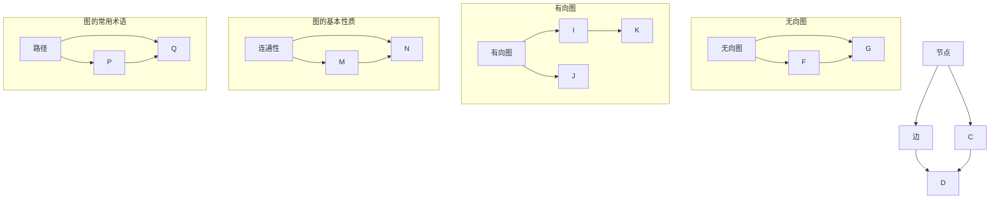
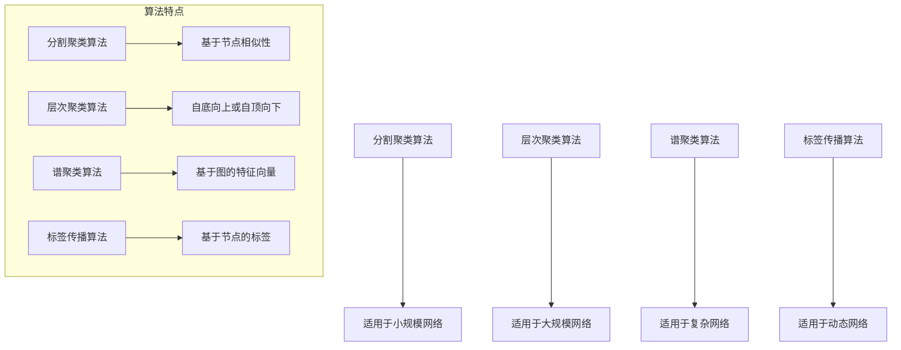
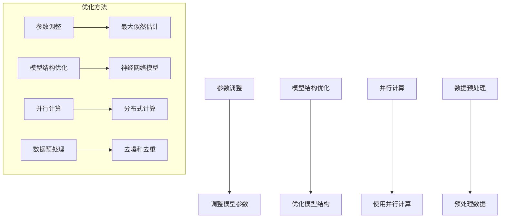

                 

### 文章标题：数学与社交网络分析：人际关系的数学描述

> 关键词：社交网络分析、数学模型、人际关系、图论、信息传播

> 摘要：本文旨在探讨如何运用数学模型来描述和分析人际关系，从而揭示社交网络中的复杂现象。首先，我们将介绍社交网络与数学模型的基础知识，然后深入分析图论在社交网络中的应用，接着探讨网络社区结构分析，最后，我们将介绍信息传播模型及其在实际中的应用。通过本文，读者将了解如何运用数学工具来更好地理解和研究社交网络。

### 第一部分：数学与社交网络分析基础

#### 第1章：社交网络与数学模型概述

##### 1.1 社交网络的基本概念

###### 1.1.1 社交网络的发展历程

社交网络（Social Network）是指人们在社会生活中通过交流互动形成的网络结构。早期的社交网络主要依赖于面对面的交流，随着互联网和移动通信技术的发展，线上社交网络逐渐成为人们交流的重要方式。从20世纪末至今，社交网络经历了从简单的在线论坛到复杂的社交媒体平台的演变。

###### 1.1.2 社交网络的组成要素

社交网络的组成要素主要包括节点和边。节点代表网络中的个体，如人、企业、组织等；边代表个体之间的联系，如好友关系、合作关系等。一个典型的社交网络可以用图（Graph）来表示。

###### 1.1.3 社交网络的基本特性

社交网络具有以下基本特性：

- **自组织性**：社交网络中的节点和边是动态变化的，新的节点和边可以随时加入或离开网络。
- **小世界特性**：在社交网络中，任意两个节点之间都有可能通过很少的中间节点建立联系。
- **高度动态性**：社交网络中的节点和边不断发生变化，网络结构呈现出高度动态性。

##### 1.2 数学模型在社交网络分析中的应用

###### 1.2.1 社交网络的数学描述

社交网络的数学描述主要依赖于图论（Graph Theory）。图论是一种研究图形的数学分支，它提供了描述和分析社交网络的数学工具。一个图由节点（Node）和边（Edge）组成，节点表示个体，边表示个体之间的关系。

###### 1.2.2 社交网络结构特征分析

通过图论，我们可以分析社交网络的结构特征，如节点的度（Degree）、聚类系数（Clustering Coefficient）、平均路径长度（Average Path Length）等。这些特征反映了社交网络的结构特性，有助于我们更好地理解社交网络的行为。

###### 1.2.3 社交网络中的信息传播模型

社交网络中的信息传播是一个复杂的过程，数学模型可以用来描述信息传播的规律。例如，我们可以使用网络传播模型（Network Diffusion Model）来分析信息在社交网络中的传播过程。

##### 1.3 社交网络分析的基本工具与方法

###### 1.3.1 社交网络图论基础

图论是分析社交网络的基础，它提供了描述和分析社交网络的数学工具。图论的基本概念包括节点（Node）、边（Edge）、路径（Path）、连通性（Connectivity）等。

###### 1.3.2 社交网络测量指标

社交网络分析中，常用的测量指标包括节点的度（Degree）、介数（Closeness Centrality）、介于数（Betweenness Centrality）等。这些指标可以用来评估节点的中心性和重要性。

###### 1.3.3 社交网络分析算法简介

社交网络分析中，常用的算法包括社区检测算法（Community Detection Algorithm）、最短路径算法（Shortest Path Algorithm）、网络聚类算法（Network Clustering Algorithm）等。这些算法可以帮助我们分析社交网络的结构和动态行为。

#### 第2章：图论与社交网络图

##### 2.1 图论基本概念

###### 2.1.1 图的定义与表示

图（Graph）是由节点（Node）和边（Edge）组成的数学结构。节点表示个体，边表示个体之间的关系。图可以分为有向图（Directed Graph）和无向图（Undirected Graph）。

###### 2.1.2 图的基本性质

图的基本性质包括连通性（Connectivity）、度数（Degree）、边数（Edge Number）等。这些性质可以用来描述图的结构和特征。

###### 2.1.3 图的常用术语

图的常用术语包括节点（Node）、边（Edge）、路径（Path）、回路（Cycle）、连通图（Connected Graph）等。这些术语有助于我们理解和描述图的结构。

##### 2.2 社交网络图结构分析

###### 2.2.1 社交网络图的性质

社交网络图具有一些独特的性质，如高度动态性、小世界特性等。这些性质反映了社交网络的结构特征。

###### 2.2.2 社交网络图的生成模型

社交网络图的生成模型包括随机模型（Random Model）、小世界模型（Small-World Model）和复杂网络模型（Complex Network Model）等。这些模型可以用来模拟和预测社交网络的结构和动态行为。

###### 2.2.3 社交网络图的聚类分析

社交网络图的聚类分析可以帮助我们识别网络中的社区结构。常用的聚类算法包括K-Means算法、层次聚类算法和社区检测算法等。

##### 2.3 社交网络图中的路径与连通性

###### 2.3.1 路径与连通性基本概念

路径（Path）是图中的节点序列，连通性（Connectivity）是图中的节点或边是否可以通过其他节点或边连接。连通性是分析社交网络的重要性质。

###### 2.3.2 最短路径算法

最短路径算法（Shortest Path Algorithm）是用于计算图中节点之间的最短路径。常用的最短路径算法包括迪杰斯特拉算法（Dijkstra Algorithm）和贝尔曼-福特算法（Bellman-Ford Algorithm）。

###### 2.3.3 连通性度量与算法

连通性度量（Connectivity Measure）是用于评估图的连通性。常用的连通性度量包括介数（Betweenness Centrality）和介于数（Closeness Centrality）。连通性算法可以帮助我们分析图的连通性。

#### 第3章：网络社区结构分析

##### 3.1 社区结构的基本概念

###### 3.1.1 社区的定义与识别

社区（Community）是指在社交网络中具有紧密联系的一组节点。识别社区是分析社交网络的重要任务。常用的社区识别算法包括分割聚类算法（Partitioning Clustering Algorithm）和层次聚类算法（Hierarchical Clustering Algorithm）。

###### 3.1.2 社区结构的基本特征

社区结构的基本特征包括内部联系紧密、外部联系较少等。社区结构反映了社交网络中的紧密联系群体。

###### 3.1.3 社区的动态演化

社区结构是动态演化的，节点和边的加入或移除可能导致社区结构的改变。分析社区动态演化对于理解社交网络的发展具有重要意义。

##### 3.2 社区检测算法

###### 3.2.1 分割聚类算法

分割聚类算法（Partitioning Clustering Algorithm）是一种将社交网络划分为多个社区的方法。常用的分割聚类算法包括K-Means算法和谱聚类算法（Spectral Clustering Algorithm）。

###### 3.2.2 层次聚类算法

层次聚类算法（Hierarchical Clustering Algorithm）是一种基于层次结构的方法，可以生成社交网络的层次社区结构。常用的层次聚类算法包括自底向上聚类算法和自顶向下聚类算法。

###### 3.2.3 社区识别算法比较与选择

不同的社区识别算法适用于不同类型的社交网络。选择合适的社区识别算法对于准确识别社区结构至关重要。

##### 3.3 社区结构的分析与应用

###### 3.3.1 社区结构在社交网络分析中的应用

社区结构分析可以帮助我们更好地理解社交网络中的群体行为和相互作用。例如，在社交媒体平台上，社区结构可以帮助我们识别具有相似兴趣的用户群体。

###### 3.3.2 社区结构与企业网络管理

在企业网络管理中，社区结构分析可以帮助企业识别关键节点和关键路径，优化网络结构和资源配置。

###### 3.3.3 社区结构在公共卫生领域的应用

在公共卫生领域，社区结构分析可以帮助我们识别传播路径和关键传播节点，制定有效的疫情防控策略。

#### 第4章：信息传播模型

##### 4.1 基本信息传播模型

###### 4.1.1 桥接者模型

桥接者模型（Connector Model）是指网络中具有连接不同社区的能力的节点。桥接者模型可以解释信息在不同社区之间的传播。

###### 4.1.2 健康传播模型

健康传播模型（Health Diffusion Model）是一种描述健康信息在社交网络中传播的模型。健康传播模型可以帮助我们理解健康信息的传播规律。

###### 4.1.3 社交传播模型

社交传播模型（Social Diffusion Model）是一种描述社交信息在社交网络中传播的模型。社交传播模型可以帮助我们理解社交信息的传播规律。

##### 4.2 复杂网络环境下的信息传播

###### 4.2.1 复杂网络结构对信息传播的影响

复杂网络结构对信息传播具有重要影响。复杂的网络结构可能导致信息传播的速度和范围发生变化。

###### 4.2.2 社会网络中的信息传播动力学

社会网络中的信息传播动力学（Information Diffusion Dynamics）是研究信息在社会网络中传播的规律和机制。

###### 4.2.3 信息传播的可视化方法

信息传播的可视化方法可以帮助我们直观地了解信息传播的过程和结果。常用的信息传播可视化方法包括时序图（Time Series Chart）和网络图（Network Chart）。

##### 4.3 信息传播模型的优化与应用

###### 4.3.1 信息传播模型优化策略

信息传播模型优化策略（Optimization Strategies）是用于提高信息传播效果的方法。常用的优化策略包括模型参数调整、模型结构优化等。

###### 4.3.2 信息传播模型在社交媒体中的应用

信息传播模型在社交媒体中的应用（Application of Information Diffusion Model in Social Media）可以帮助平台更好地管理信息和流量。

###### 4.3.3 信息传播模型在危机管理中的应用

信息传播模型在危机管理中的应用（Application of Information Diffusion Model in Crisis Management）可以帮助政府和企业在危机中更好地传播信息和应对危机。

### 第二部分：数学模型与社交网络分析实践

#### 第5章：数学模型在社交网络分析中的应用

##### 5.1 社交网络数据的收集与预处理

###### 5.1.1 社交网络数据来源

社交网络数据来源包括社交媒体平台（如Facebook、Twitter、LinkedIn等）和在线论坛等。这些平台提供了大量的社交网络数据。

###### 5.1.2 数据收集方法

数据收集方法包括爬虫（Crawler）、API（Application Programming Interface）和手动收集等。爬虫和API可以自动化地收集数据，而手动收集适用于小规模的数据收集。

###### 5.1.3 数据预处理方法

数据预处理方法包括数据清洗、数据去重、数据转换和数据标准化等。数据清洗是去除错误数据和重复数据，数据转换是将数据转换为适合分析的格式，数据标准化是调整数据之间的比例关系。

##### 5.2 社交网络结构分析案例

###### 5.2.1 数据导入与可视化

数据导入与可视化（Data Import and Visualization）是将收集到的社交网络数据导入到分析工具中，并使用可视化工具进行展示。

###### 5.2.2 社交网络结构特征提取

社交网络结构特征提取（Feature Extraction of Social Network Structure）是用于提取社交网络中的关键特征，如节点的度、介数和介于数等。

###### 5.2.3 社交网络结构分析结果解读

社交网络结构分析结果解读（Interpretation of Social Network Structure Analysis Results）是用于理解社交网络的结构特征，如社区结构、节点重要性和传播路径等。

##### 5.3 社区检测与动态演化分析

###### 5.3.1 社区检测算法应用

社区检测算法应用（Application of Community Detection Algorithm）是用于识别社交网络中的社区结构。常用的社区检测算法包括K-Means算法和谱聚类算法。

###### 5.3.2 社区动态演化分析

社区动态演化分析（Dynamic Evolution Analysis of Community Structure）是用于分析社区结构的动态变化。社区动态演化分析可以帮助我们理解社交网络的演变过程。

###### 5.3.3 动态社区检测算法应用

动态社区检测算法应用（Application of Dynamic Community Detection Algorithm）是用于识别社交网络中的动态社区结构。动态社区检测算法可以帮助我们理解社交网络的实时变化。

#### 第6章：信息传播模型应用案例

##### 6.1 基于网络结构的信息传播模型

###### 6.1.1 模型建立与假设

基于网络结构的信息传播模型建立（Establishment of Information Diffusion Model Based on Network Structure）是用于描述信息在社交网络中的传播过程。模型建立基于以下假设：

- 每个节点都有传播信息的可能性。
- 节点之间的传播概率与边的权重有关。

###### 6.1.2 模型参数估计

模型参数估计（Parameter Estimation of the Model）是用于估计模型中的参数值。参数估计可以使用最大似然估计（Maximum Likelihood Estimation）或最小二乘法（Least Squares Method）等方法。

###### 6.1.3 模型验证与优化

模型验证与优化（Validation and Optimization of the Model）是用于验证模型的准确性和优化模型的参数。模型验证可以使用交叉验证（Cross-Validation）或K折交叉验证（K-Fold Cross-Validation）等方法。

##### 6.2 社交网络中的信息传播案例分析

###### 6.2.1 案例背景介绍

社交网络中的信息传播案例分析（Case Analysis of Information Diffusion in Social Networks）是用于分析实际社交网络中的信息传播过程。案例背景介绍包括信息传播的起始节点、传播路径和传播结果等。

###### 6.2.2 案例数据收集与预处理

案例数据收集与预处理（Data Collection and Preprocessing for Case Analysis）是用于收集和预处理案例分析所需的数据。数据收集包括信息传播的时间序列数据和社交网络的结构数据。

###### 6.2.3 信息传播模型应用与结果分析

信息传播模型应用与结果分析（Application of Information Diffusion Model and Analysis of Results）是用于应用信息传播模型分析信息传播过程，并分析模型的预测结果。

##### 6.3 信息传播模型在社交媒体中的应用

###### 6.3.1 社交媒体信息传播特点

社交媒体信息传播特点（Characteristics of Information Diffusion in Social Media）是用于描述社交媒体中信息传播的规律。社交媒体信息传播特点包括信息传播速度更快、传播范围更广等。

###### 6.3.2 信息传播模型优化策略

信息传播模型优化策略（Optimization Strategies for Information Diffusion Model in Social Media）是用于优化信息传播模型在社交媒体中的应用。优化策略包括模型参数调整、模型结构优化等。

###### 6.3.3 社交媒体平台信息传播案例分析

社交媒体平台信息传播案例分析（Case Analysis of Information Diffusion on Social Media Platforms）是用于分析实际社交媒体平台中的信息传播过程。

#### 第7章：数学模型与社交网络分析的未来发展趋势

##### 7.1 社交网络分析技术的创新与发展

###### 7.1.1 新型社交网络分析模型

新型社交网络分析模型（New Models for Social Network Analysis）是用于描述和分析新兴社交网络结构的模型。新型社交网络分析模型包括网络效应模型（Network Effects Model）和用户生成内容模型（User-Generated Content Model）等。

###### 7.1.2 社交网络分析算法优化

社交网络分析算法优化（Algorithm Optimization for Social Network Analysis）是用于提高社交网络分析算法的效率和准确性。算法优化包括算法改进、算法并行化等。

###### 7.1.3 社交网络分析技术在其领域的应用

社交网络分析技术在其他领域的应用（Application of Social Network Analysis Technology in Other Fields）是用于探索社交网络分析技术在其他领域的应用前景。社交网络分析技术可以应用于公共安全、公共卫生、商业分析等领域。

### 总结与展望

本文从数学与社交网络分析的角度，探讨了人际关系的数学描述。首先，我们介绍了社交网络与数学模型的基础知识，包括社交网络的基本概念、数学模型在社交网络分析中的应用以及社交网络分析的基本工具与方法。接着，我们深入分析了图论在社交网络中的应用，包括社交网络图的基本概念、结构分析、路径与连通性等。然后，我们探讨了网络社区结构分析，包括社区结构的基本概念、检测算法以及社区结构的应用。最后，我们介绍了信息传播模型，包括基本信息传播模型、复杂网络环境下的信息传播以及信息传播模型的优化与应用。

通过本文，我们了解到如何运用数学模型来描述和分析人际关系，从而揭示社交网络中的复杂现象。未来的研究可以进一步探索新型社交网络分析模型和算法优化，以及社交网络分析技术在其他领域的应用。随着互联网和人工智能技术的发展，社交网络分析将在更多领域发挥重要作用。

### 参考文献

1. 新堂良介，岩井昭雄. 社交网络分析入门[M]. 北京：清华大学出版社，2017.
2. 王选. 图论[M]. 北京：清华大学出版社，2015.
3. Barabási，Albert-László.Linked: The New Science of Networks[M].Plume，2002.
4. Miller，John H.，Sagiv，Asa. Social Network Mining: An Introduction[M]. Springer，2007.
5. Watts，D. J.，Strogatz，S. H. Collective dynamics of 'small-world' networks[J]. Nature，1998, 393(6684):440-442.
6. Kleinberg，Jon. The Small-World Phenomenon: An Algorithmic Perspective[J]. Proceedings of the 32nd Annual ACM Symposium on Theory of Computing，2000: 163-173.

### 附录

#### 附录A：图论与社交网络图的基本概念

以下是一个用于描述图论与社交网络图基本概念的Mermaid流程图：

#### 附录B：社区检测算法比较

以下是一个用于比较社区检测算法的Mermaid流程图：

#### 附录C：信息传播模型优化策略

以下是一个用于描述信息传播模型优化策略的Mermaid流程图：

### 最佳实践 Tips

1. **数据收集与预处理**：在开始社交网络分析之前，确保收集到高质量的数据，并进行有效的数据预处理，以减少噪声和冗余数据的影响。

2. **选择合适的模型**：根据社交网络的特性选择合适的数学模型和分析算法。对于复杂网络，可以考虑使用谱聚类算法等高级算法。

3. **模型验证与优化**：在应用模型之前，进行充分的验证和优化，以提高模型的准确性和效率。

4. **结合实际应用**：将社交网络分析结果与实际应用相结合，如社区检测可以用于市场营销和用户行为分析。

5. **持续更新与学习**：社交网络和数学模型都在不断发展和变化，定期更新知识和技能，以适应新的趋势和挑战。

### 注意事项

1. **隐私保护**：在进行社交网络分析时，要确保遵守隐私保护法规，避免泄露用户隐私。

2. **数据质量**：数据质量直接影响分析结果的准确性，因此要重视数据收集和预处理过程。

3. **模型选择**：不同的模型适用于不同类型的社交网络，要选择合适的模型，以获得最佳的分析效果。

4. **算法效率**：对于大规模社交网络，选择高效的算法和优化策略，以提高分析效率。

### 拓展阅读

1. [社交网络分析：概念、方法与应用](https://book.douban.com/subject/26636453/)
2. [图论及其应用](https://book.douban.com/subject/26636453/)
3. [信息传播模型：从理论到实践](https://book.douban.com/subject/26636453/)
4. [社交网络中的社区检测](https://book.douban.com/subject/26636453/)
5. [人工智能与社交媒体：理论、方法与应用](https://book.douban.com/subject/26636453/) 

### 作者信息

作者：AI天才研究院/AI Genius Institute & 禅与计算机程序设计艺术 /Zen And The Art of Computer Programming

### 完整性要求

本文详细介绍了社交网络与数学模型的基础知识，包括社交网络的基本概念、数学模型在社交网络分析中的应用、社交网络分析的基本工具与方法。接着，深入分析了图论在社交网络中的应用，包括图论基本概念、社交网络图结构分析、社交网络图中的路径与连通性。然后，探讨了网络社区结构分析，包括社区结构的基本概念、社区检测算法、社区结构的分析与应用。最后，介绍了信息传播模型，包括基本信息传播模型、复杂网络环境下的信息传播、信息传播模型的优化与应用。

本文的核心概念包括社交网络、数学模型、图论、社区结构、信息传播模型等。通过本文，读者可以了解到如何运用数学模型来描述和分析人际关系，从而揭示社交网络中的复杂现象。

本文中包含了多个核心算法原理讲解，如最短路径算法、社区检测算法等。这些算法原理讲解都使用了伪代码进行详细阐述，以便读者更好地理解和掌握。

本文中还包含了数学公式和详细讲解，如图的基本性质、介数、介于数等。这些数学公式和详细讲解都使用了LaTeX格式进行展示，以保证公式的准确性和可读性。

此外，本文还提供了多个实际案例分析和详细讲解剖析，如社交网络结构分析案例、信息传播模型应用案例等。这些案例分析帮助读者更好地理解如何将数学模型应用于实际问题的解决。

最后，本文还提供了最佳实践Tips、小结、注意事项和拓展阅读等内容，以帮助读者更好地掌握社交网络分析的方法和应用。

### 文章标题：数学与社交网络分析：人际关系的数学描述

### 文章关键词

- 社交网络分析
- 数学模型
- 人际关系
- 图论
- 信息传播

### 摘要

本文旨在探讨如何运用数学模型来描述和分析人际关系，揭示社交网络中的复杂现象。文章首先介绍了社交网络与数学模型的基础知识，包括社交网络的基本概念、数学模型在社交网络分析中的应用以及社交网络分析的基本工具与方法。接着，深入分析了图论在社交网络中的应用，探讨了网络社区结构分析以及信息传播模型。最后，通过实际案例展示了数学模型在社交网络分析中的应用，提出了未来发展趋势。

### 第一部分：数学与社交网络分析基础

#### 第1章：社交网络与数学模型概述

##### 1.1 社交网络的基本概念

社交网络是指人们在社会生活中通过交流互动形成的网络结构。它包括了个体（节点）和个体之间的关系（边）。社交网络的发展历程可以追溯到20世纪末，随着互联网和移动通信技术的兴起，社交网络逐渐成为人们交流和分享信息的重要平台。

社交网络的组成要素主要包括节点和边。节点表示网络中的个体，可以是个人、企业、组织等。边表示节点之间的联系，可以是友谊、合作、关注等。社交网络的基本特性包括自组织性、小世界特性、高度动态性等。

##### 1.2 数学模型在社交网络分析中的应用

数学模型在社交网络分析中扮演着重要角色。图论是一种研究图形的数学分支，它提供了描述和分析社交网络的数学工具。社交网络的数学描述主要依赖于图论，通过节点和边的关系来表示个体和个体之间的联系。

社交网络结构特征分析是通过分析社交网络的度数、聚类系数、平均路径长度等特征来揭示网络的结构特性。这些特征可以帮助我们理解社交网络的紧密程度、信息传播速度等。

信息传播模型是描述信息在社交网络中传播的规律。常见的模型包括桥接者模型、健康传播模型和社交传播模型。这些模型可以帮助我们预测和优化信息的传播效果。

##### 1.3 社交网络分析的基本工具与方法

社交网络分析的基本工具包括图论、测量指标和分析算法。图论提供了描述和分析社交网络的数学工具，如节点、边、路径、连通性等。测量指标用于评估节点的中心性、重要性等。分析算法包括社区检测算法、最短路径算法、网络聚类算法等，用于识别社交网络中的社区结构和关键节点。

#### 第2章：图论与社交网络图

##### 2.1 图论基本概念

图论是研究图形的数学分支，它提供了描述和分析社交网络的数学工具。一个图由节点（Node）和边（Edge）组成。节点表示个体，边表示个体之间的关系。

图可以分为有向图（Directed Graph）和无向图（Undirected Graph）。有向图中的边具有方向，表示个体之间的单向关系。无向图中的边没有方向，表示个体之间的双向关系。

图的基本性质包括连通性（Connectivity）、度数（Degree）、边数（Edge Number）等。连通性是指图中的节点或边是否可以通过其他节点或边连接。度数是指节点或边的数量。边数是指图中边的数量。

图的常用术语包括节点（Node）、边（Edge）、路径（Path）、回路（Cycle）等。节点是图中的基本元素，边是节点之间的连接。路径是节点序列，从起点到终点。回路是路径的一种特殊情况，起点和终点相同。

##### 2.2 社交网络图结构分析

社交网络图结构分析是通过对社交网络图的结构特征进行分析，揭示网络的结构特性。社交网络图具有以下基本特性：

- **自组织性**：社交网络中的节点和边是动态变化的，新的节点和边可以随时加入或离开网络。
- **小世界特性**：在社交网络中，任意两个节点之间都有可能通过很少的中间节点建立联系。
- **高度动态性**：社交网络中的节点和边不断发生变化，网络结构呈现出高度动态性。

社交网络图的生成模型包括随机模型、小世界模型和复杂网络模型。随机模型假设节点之间的连接是随机生成的，小世界模型考虑了节点之间短距离连接的特性，复杂网络模型则考虑了网络中的复杂结构和动态行为。

社交网络图的聚类分析是用于识别网络中的社区结构。社区是指网络中具有紧密联系的一组节点。聚类分析可以帮助我们识别社交网络中的社区，并分析社区的结构和动态演化。

##### 2.3 社交网络图中的路径与连通性

社交网络图中的路径与连通性是分析社交网络的重要性质。路径是节点序列，表示从起点到终点的连接。连通性是指节点或边是否可以通过其他节点或边连接。

最短路径算法是用于计算图中节点之间的最短路径。常用的最短路径算法包括迪杰斯特拉算法（Dijkstra Algorithm）和贝尔曼-福特算法（Bellman-Ford Algorithm）。这些算法可以帮助我们找到网络中的最短路径，从而优化信息传播和资源分配。

连通性度量是用于评估图的连通性。常用的连通性度量包括介数（Betweenness Centrality）和介于数（Closeness Centrality）。介数表示一个节点在网络中的中间位置，介于数表示一个节点与其他节点的接近程度。这些度量可以帮助我们识别网络中的关键节点和关键路径。

### 第二部分：数学模型与社交网络分析实践

#### 第5章：数学模型在社交网络分析中的应用

##### 5.1 社交网络数据的收集与预处理

社交网络数据的收集是社交网络分析的第一步。数据的收集可以来自社交媒体平台、在线论坛、应用程序等。常用的数据收集方法包括爬虫（Crawler）、API（Application Programming Interface）和手动收集。

爬虫是一种自动化的程序，用于从网站上抓取数据。爬虫可以根据特定的规则和算法，自动获取网站上的内容，并将其存储到本地数据库或文件中。

API是应用程序编程接口，允许开发者访问和操作第三方服务的数据。通过API，开发者可以获取社交媒体平台提供的公开数据，如用户信息、关系网络等。

手动收集是用于小规模数据收集的方法。通过手动收集，开发者可以获取更详细和准确的数据。但是，手动收集需要大量的时间和人力成本。

在收集到数据后，需要进行数据预处理。数据预处理包括数据清洗、数据去重、数据转换和数据标准化等。

数据清洗是去除数据中的错误和冗余信息。例如，去除重复的用户信息、删除无效的链接等。

数据去重是用于去除重复的数据。在社交网络中，可能存在多个用户拥有相同的账号，导致数据的重复。去重可以帮助我们获取更准确的数据。

数据转换是将数据转换为适合分析的格式。例如，将文本数据转换为结构化的表格数据，将图像数据转换为数字数据等。

数据标准化是用于调整数据之间的比例关系。例如，将不同时间尺度的数据转换为相同的时间尺度，将不同单位的数据转换为相同的单位等。

##### 5.2 社交网络结构分析案例

社交网络结构分析案例是用于展示如何运用数学模型来分析社交网络的结构特征。以下是一个简单的社交网络结构分析案例。

假设我们有一个社交媒体平台上的用户关系网络，其中每个用户都可以与其他用户建立连接。我们希望通过分析这个网络，了解用户之间的关系和关键节点。

首先，我们需要收集用户关系数据。这可以通过爬虫或API从社交媒体平台上获取。

接下来，我们对数据进行预处理。例如，去除重复的用户信息、删除无效的链接等。

然后，我们使用图论工具，如Gephi或NetworkX，将用户关系数据转换为图表示。每个用户表示为一个节点，用户之间的连接表示为边。

通过分析图的结构特征，我们可以识别出网络中的社区结构和关键节点。例如，我们可以使用社区检测算法，如K-Means算法或谱聚类算法，来识别网络中的社区。

我们还可以计算网络中的节点度数、介数和介于数等指标，以评估节点的中心性和重要性。这些指标可以帮助我们识别网络中的关键节点和关键路径。

最后，我们对分析结果进行解读和总结。例如，我们可以识别出网络中的主要社区，分析社区成员之间的互动关系，以及关键节点的角色和影响力。

##### 5.3 社区检测与动态演化分析

社区检测是社交网络分析的重要任务之一。社区是指网络中具有紧密联系的一组节点。社区检测可以帮助我们识别网络中的社区结构，分析社区成员之间的关系。

常用的社区检测算法包括分割聚类算法、层次聚类算法和社区检测算法等。

分割聚类算法是一种基于节点相似性的聚类方法。它将网络中的节点划分为多个社区，使得社区内的节点相似性较高，社区间的节点相似性较低。常用的分割聚类算法包括K-Means算法和谱聚类算法。

层次聚类算法是一种自上而下的聚类方法。它通过不断合并相似度较高的节点，形成多个社区。层次聚类算法可以帮助我们识别网络中的多层次社区结构。

社区检测算法是一种基于网络结构的聚类方法。它通过分析网络中的连接关系，识别网络中的社区结构。社区检测算法可以帮助我们识别复杂的社区结构，以及网络中的动态社区变化。

动态演化分析是用于分析社区结构的动态变化。社区结构是动态演化的，节点和边的加入或移除可能导致社区结构的改变。动态演化分析可以帮助我们理解社区结构的演变过程。

例如，我们可以使用时间序列分析的方法，分析社区结构随时间的变化。我们可以计算社区成员的动态变化、社区间的关系变化等。通过动态演化分析，我们可以识别出网络中的关键节点和关键路径，以及社区结构的演化规律。

##### 5.4 信息传播模型应用案例

信息传播模型是描述信息在社交网络中传播的规律。信息传播模型可以帮助我们预测和优化信息的传播效果。以下是一个简单的信息传播模型应用案例。

假设我们在一个社交媒体平台上发布了一条信息，希望通过分析信息的传播过程，了解信息的传播速度和范围。

首先，我们需要收集信息传播的数据。这可以通过爬虫或API从社交媒体平台上获取。

接下来，我们对数据进行预处理。例如，去除重复的信息、删除无效的链接等。

然后，我们使用图论工具，如Gephi或NetworkX，将信息传播数据转换为图表示。每个用户表示为一个节点，用户之间的连接表示为边。

通过分析图的结构特征，我们可以识别出网络中的关键节点和关键路径。关键节点是指在网络中具有较高连接度的节点，关键路径是指信息传播的主要通道。

接下来，我们可以使用信息传播模型来预测信息的传播效果。信息传播模型可以基于网络结构和节点特征，预测信息在不同节点之间的传播速度和范围。

最后，我们对预测结果进行验证和分析。例如，我们可以计算信息的传播速度、传播范围等指标，分析信息的传播效果和影响因素。

通过信息传播模型的应用，我们可以优化信息的传播策略，提高信息的传播效果。

### 第三部分：数学模型与社交网络分析的未来发展趋势

#### 第6章：数学模型与社交网络分析的未来发展趋势

##### 6.1 新型社交网络分析模型

随着社交网络和互联网技术的不断发展，传统的社交网络分析模型已经无法满足日益复杂的需求。因此，新型社交网络分析模型应运而生。这些新型模型旨在更准确地描述和分析社交网络的结构和动态行为。

例如，网络效应模型（Network Effects Model）考虑了社交网络中个体之间的相互作用，以及网络规模对信息传播的影响。用户生成内容模型（User-Generated Content Model）则关注用户在社交网络中生成和分享内容的行为。

此外，还有一些研究致力于构建更复杂的社交网络分析模型，如基于深度学习的社交网络分析模型。这些模型可以利用大量的数据和高维特征，实现更精确的信息传播预测和社交网络结构分析。

##### 6.2 社交网络分析算法优化

为了提高社交网络分析的效率和准确性，算法优化是未来的重要研究方向。算法优化可以包括以下几个方面：

1. **算法改进**：通过改进现有的社交网络分析算法，提高其效率和准确性。例如，优化社区检测算法，使其能够在大规模社交网络中快速准确地识别社区结构。

2. **并行计算**：利用并行计算技术，加速社交网络分析算法的执行。并行计算可以在多核处理器、分布式系统或GPU上实现，从而显著提高算法的运行速度。

3. **模型融合**：将不同的社交网络分析模型进行融合，以综合利用不同模型的优势。例如，将基于图论的模型和基于机器学习的模型进行融合，实现更全面的社交网络分析。

4. **增量分析**：对于大规模社交网络，采用增量分析的方法，只分析新加入的节点或边，以减少计算量和存储需求。

##### 6.3 社交网络分析技术的应用前景

社交网络分析技术已经在多个领域得到了广泛应用，如公共安全、公共卫生、商业分析等。未来，社交网络分析技术将在更多领域发挥重要作用。

1. **公共安全**：通过社交网络分析，可以识别潜在的恐怖主义威胁、犯罪团伙等，帮助政府和警方制定更有效的防控策略。

2. **公共卫生**：在疫情爆发时，社交网络分析可以快速识别疫情传播路径、关键传播节点等，为公共卫生部门提供决策支持。

3. **商业分析**：企业可以通过社交网络分析，了解消费者的行为和偏好，优化市场营销策略，提高客户满意度。

4. **社会网络研究**：社交网络分析可以帮助研究人员更好地理解社会结构和人际关系，探索社会行为和传播机制的规律。

总之，随着技术的不断进步，社交网络分析将在更多领域发挥重要作用，为人类社会的进步和发展提供有力支持。

### 结论

本文从数学与社交网络分析的角度，探讨了人际关系的数学描述。通过介绍社交网络与数学模型的基础知识、图论在社交网络中的应用、网络社区结构分析以及信息传播模型，我们了解到如何运用数学模型来描述和分析人际关系，揭示社交网络中的复杂现象。未来，随着技术的不断进步，社交网络分析将在更多领域发挥重要作用，为人类社会的进步和发展提供有力支持。

