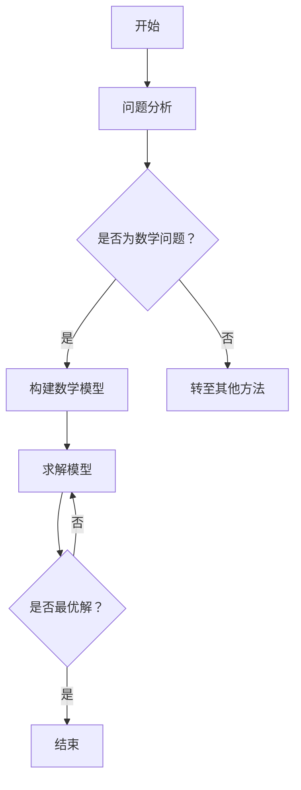

                 

### 文章标题

# 数学与管理科学：决策过程的数学支持

> 关键词：数学方法，管理科学，决策过程，线性规划，整数规划，多目标规划，排队论，存储理论，决策支持系统

> 摘要：本文旨在探讨数学方法在管理科学中的应用，特别是对决策过程的数学支持。文章首先概述了数学与管理科学的基础知识，然后深入分析了线性规划、整数规划和多目标规划等数学方法，并通过实际案例展示了这些方法在管理决策中的具体应用。此外，文章还讨论了排队论和存储理论在管理中的应用，以及决策支持系统的构建与发展。最后，文章展望了管理科学的发展趋势，并提出了未来的研究方向。

### 第一部分：数学与管理科学基础

#### 第1章：数学与管理科学概述

##### 1.1 数学与管理科学的联系

数学在管理科学中扮演着至关重要的角色。管理科学是通过数学模型和统计分析方法来分析和管理复杂系统的学科。数学提供了精确的描述和解决问题的工具，使得管理决策过程更加科学和合理。

###### 1.1.1 数学在管理科学中的重要性

1. **精确性**：数学方法可以精确地描述管理过程中的变量关系，从而提供可靠的决策支持。
2. **客观性**：数学方法不受主观判断的影响，使得决策更加客观公正。
3. **预测性**：通过数学模型，可以预测未来的发展趋势，为决策提供前瞻性的信息。

###### 1.1.2 管理科学的数学方法

管理科学中常用的数学方法包括：

1. **优化方法**：如线性规划、整数规划和多目标规划。
2. **统计分析方法**：如回归分析、时间序列分析等。
3. **模拟方法**：通过模拟现实世界中的过程，分析系统的行为。

###### 1.1.3 数学与管理科学的发展趋势

随着计算机技术的飞速发展，数学方法在管理科学中的应用越来越广泛。新兴的算法和技术，如人工智能、机器学习，正在逐步融入管理科学，为决策提供更加智能化的支持。

##### 1.2 数学模型的基本概念

数学模型是对现实世界中的问题进行抽象和简化的数学表示，用于分析和预测系统的行为。

###### 1.2.1 数学模型定义

数学模型是利用数学符号、公式、定理和算法来描述现实世界中的现象或问题。

###### 1.2.2 数学模型类型

数学模型可以分为以下几类：

1. **确定性问题模型**：问题的解是唯一的，如线性规划问题。
2. **不确定性问题模型**：问题的解是不确定的，如随机规划问题。
3. **动态问题模型**：问题的解随时间变化而变化，如动态规划问题。

###### 1.2.3 数学模型构建过程

构建数学模型通常包括以下几个步骤：

1. **问题分析**：明确问题的目标、条件和约束。
2. **变量定义**：确定模型中的变量，并给出它们的取值范围。
3. **公式表达**：使用数学公式来描述变量之间的关系。
4. **求解算法**：选择合适的求解算法来找到问题的解。

##### 1.3 管理科学的关键概念

管理科学中的关键概念包括决策过程、决策模型和决策分析工具。

###### 1.3.1 决策过程

决策过程是指从多个备选方案中选出最优方案的过程。它通常包括以下几个步骤：

1. **问题识别**：确定需要解决的问题。
2. **方案生成**：生成所有可能的解决方案。
3. **方案评估**：评估各个方案的优劣。
4. **方案选择**：选择最优或次优方案。
5. **方案实施**：将选定的方案付诸实施。

###### 1.3.2 决策模型

决策模型是对决策过程的数学描述，它通常包括以下部分：

1. **决策者**：决策模型中的主体，负责做出决策。
2. **目标函数**：描述决策者追求的优化目标。
3. **约束条件**：描述决策过程中的限制因素。
4. **决策变量**：描述决策者的选择。

###### 1.3.3 决策分析工具

决策分析工具是用于辅助决策过程的方法和技术，包括：

1. **优化工具**：如线性规划、整数规划和多目标规划。
2. **模拟工具**：如蒙特卡罗模拟、过程模拟等。
3. **统计分析工具**：如回归分析、时间序列分析等。

### 第二部分：数学方法在决策分析中的应用

#### 第2章：线性规划

##### 2.1 线性规划的基本概念

线性规划是一种用于解决线性优化问题的数学方法。它寻找在满足一系列线性约束条件下，某个线性目标函数的最大值或最小值。

###### 2.1.1 线性规划定义

线性规划是一种数学优化方法，用于在给定线性约束条件下，求解线性目标函数的最大值或最小值。

###### 2.1.2 线性规划模型

线性规划模型通常由以下几个部分组成：

1. **目标函数**：描述需要优化的目标，通常为线性函数。
2. **决策变量**：描述需要选择的变量，其取值需满足线性约束。
3. **约束条件**：描述决策变量的取值限制，通常为线性不等式或等式。

###### 2.1.3 线性规划求解方法

线性规划求解方法主要包括：

1. **图解法**：适用于变量较少且约束条件简单的线性规划问题。
2. **单纯形法**：适用于大多数线性规划问题。
3. **对偶理论**：用于分析线性规划的解的性质，并寻找对偶问题的解。
4. **敏感性分析**：用于分析模型参数变化对解的影响。

##### 2.2 线性规划的数学模型与求解

线性规划的求解通常包括以下几个步骤：

1. **模型构建**：将实际问题转化为线性规划模型。
2. **初始可行解**：选择初始可行解，通常使用单纯形法或两阶段法。
3. **迭代求解**：根据当前解，更新变量取值，直到找到最优解。
4. **对偶理论**：分析对偶问题的解，以验证原问题的最优解。
5. **敏感性分析**：评估模型参数变化对解的影响。

###### 2.2.1 单纯形法

单纯形法是一种迭代求解线性规划问题的算法，其基本思想是通过移动顶点来找到最优解。

1. **初始可行解**：选择初始可行解，通常为任意可行解。
2. **迭代过程**：每次迭代选择一个进入变量和一个离开变量，更新解。
3. **终止条件**：当所有变量的系数均为非负时，算法终止。

###### 2.2.2 对偶理论

对偶理论是线性规划的一个重要分支，它研究原问题和对偶问题之间的关系。

1. **对偶问题**：给定原问题的线性规划模型，构造其对偶问题。
2. **对偶定理**：原问题的最优解与对偶问题的最优解相等。
3. **对偶性质**：原问题的解对偶问题也成立，反之亦然。

###### 2.2.3 敏感性分析

敏感性分析是评估线性规划模型参数变化对解的影响。

1. **参数变化**：分析目标函数和约束条件中参数的变化。
2. **敏感度分析**：评估参数变化对最优解的影响。
3. **鲁棒性分析**：评估模型参数变化对模型的稳定性的影响。

##### 2.3 线性规划案例分析

以下为线性规划在管理中的应用案例：

###### 2.3.1 生产规划

某工厂需要生产三种产品，每种产品需要不同的原材料和机器时间。工厂希望最大化总利润，同时满足原材料和机器时间的限制。

1. **变量定义**：设三种产品的生产数量分别为 \(x_1, x_2, x_3\)。
2. **目标函数**：最大化利润 \(P = 10x_1 + 15x_2 + 20x_3\)。
3. **约束条件**：\(\begin{cases} 3x_1 + 2x_2 \leq 30 \\ x_1 + 2x_2 + x_3 \leq 25 \\ x_1, x_2, x_3 \geq 0 \end{cases}\)。

通过单纯形法求解，得到最优解为 \(x_1 = 10, x_2 = 0, x_3 = 5\)，最大利润为 200。

###### 2.3.2 周转资金管理

某企业需要管理其日常运营的周转资金，以最小化资金成本。企业的收入和支出是线性的，同时需要满足现金流量的约束。

1. **变量定义**：设收入和支出分别为 \(x_1, x_2\)。
2. **目标函数**：最小化资金成本 \(C = 0.05x_1 + 0.1x_2\)。
3. **约束条件**：\(\begin{cases} x_1 - x_2 \geq 0 \\ x_1, x_2 \geq 0 \end{cases}\)。

通过图解法求解，得到最优解为 \(x_1 = 100, x_2 = 0\)，最小资金成本为 5。

###### 2.3.3 项目投资决策

某公司需要在两个项目中做出选择，每个项目都有不同的预期收益和成本。公司希望最大化总收益，同时满足资金限制。

1. **变量定义**：设两个项目的投资金额分别为 \(x_1, x_2\)。
2. **目标函数**：最大化总收益 \(R = 5x_1 + 4x_2\)。
3. **约束条件**：\(\begin{cases} x_1 + x_2 \leq 100 \\ x_1, x_2 \geq 0 \end{cases}\)。

通过单纯形法求解，得到最优解为 \(x_1 = 50, x_2 = 50\)，最大总收益为 250。

### 第3章：整数规划

##### 3.1 整数规划的基本概念

整数规划是一种特殊的线性规划，其决策变量的取值为整数。整数规划在资源分配、组合优化等问题中有着广泛的应用。

###### 3.1.1 整数规划定义

整数规划是一种线性规划，其中至少有一个决策变量的取值被限制为整数。

###### 3.1.2 整数规划类型

整数规划可以分为以下几种类型：

1. **纯整数规划**：所有决策变量的取值均为整数。
2. **混合整数规划**：部分决策变量的取值为整数，部分为连续变量。
3. **0-1整数规划**：决策变量的取值仅为0或1。

###### 3.1.3 整数规划求解方法

整数规划的求解方法主要包括：

1. **分支定界法**：通过分支和定界来搜索所有可能的解。
2. **割平面法**：通过引入新的割平面来排除非可行解。
3. **动态规划**：适用于具有递归关系的整数规划问题。

##### 3.2 整数规划的数学模型与求解

整数规划的求解过程可以分为以下几个步骤：

1. **模型构建**：将实际问题转化为整数规划模型。
2. **初始可行解**：选择初始可行解，通常为任意可行解。
3. **分支定界**：通过分支和定界来搜索最优解。
4. **割平面法**：引入新的割平面来排除非可行解。
5. **终止条件**：当找到最优解或搜索空间为空时，算法终止。

###### 3.2.1 整数线性规划

整数线性规划是整数规划的一种特殊情况，其目标函数和约束条件均为线性。

1. **目标函数**：最大化或最小化线性目标函数。
2. **决策变量**：整数变量。
3. **约束条件**：线性不等式或等式。

###### 3.2.2 随机整数规划

随机整数规划是考虑随机性的整数规划问题，其约束条件中包含随机变量。

1. **目标函数**：考虑随机变量的期望值。
2. **决策变量**：整数变量。
3. **约束条件**：随机线性不等式或等式。

###### 3.2.3 敏感性分析

敏感性分析是评估整数规划模型参数变化对解的影响。

1. **参数变化**：分析目标函数和约束条件中参数的变化。
2. **敏感度分析**：评估参数变化对最优解的影响。
3. **鲁棒性分析**：评估模型参数变化对模型的稳定性的影响。

##### 3.3 整数规划案例分析

以下为整数规划在管理中的应用案例：

###### 3.3.1 航班排班

某航空公司需要安排航班，以最大化乘客满意度。每个航班有不同的起飞和到达时间，且需满足机场和飞机的容量限制。

1. **变量定义**：设航班数为 \(x_i\)。
2. **目标函数**：最大化乘客满意度 \(S = \sum_{i=1}^{n} x_i\)。
3. **约束条件**：\(\begin{cases} \sum_{i=1}^{n} x_i \leq 100 \\ x_i \leq 50 & \text{for } i=1,2,\ldots,n \\ x_i \geq 0 & \text{for } i=1,2,\ldots,n \end{cases}\)。

通过分支定界法求解，得到最优解为 \(x_1 = 20, x_2 = 15, x_3 = 10\)，最大乘客满意度为 45。

###### 3.3.2 资源分配

某公司需要分配有限的资源（如人力、资金、设备）到不同的项目，以最大化总收益。每个项目都有不同的投资回报和资源需求。

1. **变量定义**：设项目数为 \(x_i\)。
2. **目标函数**：最大化总收益 \(R = \sum_{i=1}^{n} x_i r_i\)，其中 \(r_i\) 为项目 \(i\) 的投资回报。
3. **约束条件**：\(\begin{cases} \sum_{i=1}^{n} x_i r_i \leq 1000 \\ x_i \leq 100 & \text{for } i=1,2,\ldots,n \\ x_i \geq 0 & \text{for } i=1,2,\ldots,n \end{cases}\)。

通过分支定界法求解，得到最优解为 \(x_1 = 30, x_2 = 20, x_3 = 10\)，最大总收益为 1300。

###### 3.3.3 生产调度

某制造企业需要安排生产任务，以最小化生产成本。每个生产任务都有不同的开始时间、结束时间和机器需求。

1. **变量定义**：设生产任务数为 \(x_i\)。
2. **目标函数**：最小化总生产成本 \(C = \sum_{i=1}^{n} x_i c_i\)，其中 \(c_i\) 为任务 \(i\) 的生产成本。
3. **约束条件**：\(\begin{cases} \sum_{i=1}^{n} x_i b_i \leq 100 \\ x_i \leq 1 & \text{for } i=1,2,\ldots,n \\ x_i \geq 0 & \text{for } i=1,2,\ldots,n \end{cases}\)。

通过分支定界法求解，得到最优解为 \(x_1 = 1, x_2 = 0, x_3 = 1\)，最小生产成本为 20。

### 第4章：多目标规划

##### 4.1 多目标规划的基本概念

多目标规划是一种用于解决具有多个目标函数的优化问题的数学方法。它考虑多个目标之间的冲突和权衡，以找到多个目标的平衡解。

###### 4.1.1 多目标规划定义

多目标规划是一种优化问题，其目标函数集包含多个目标函数，需要在满足约束条件下找到最优解。

###### 4.1.2 多目标规划类型

多目标规划可以分为以下几种类型：

1. **静态多目标规划**：目标函数和约束条件不随时间变化。
2. **动态多目标规划**：目标函数和约束条件随时间变化。
3. **多阶段多目标规划**：包含多个阶段，每个阶段有不同的目标函数和约束条件。

###### 4.1.3 多目标规划求解方法

多目标规划的求解方法主要包括：

1. **加权法**：通过给每个目标函数分配权重来求解。
2. **多目标线性规划**：将多目标规划转化为线性规划问题求解。
3. **遗传算法**：通过模拟生物进化过程来求解多目标规划。
4. **动态规划**：适用于动态多目标规划问题。

##### 4.2 多目标规划的数学模型与求解

多目标规划的求解过程可以分为以下几个步骤：

1. **模型构建**：将实际问题转化为多目标规划模型。
2. **目标函数调整**：通过目标函数调整来平衡多个目标之间的冲突。
3. **求解算法**：选择合适的求解算法来求解多目标规划问题。
4. **解的评估**：对求解结果进行评估和选择。

###### 4.2.1 动态规划

动态规划是一种求解多阶段决策问题的方法，其基本思想是将复杂问题分解为多个子问题，并利用子问题的解来求解原问题。

1. **状态定义**：定义决策过程中的状态。
2. **状态转移方程**：描述状态之间的转移关系。
3. **边界条件**：确定初始状态和终止状态的值。
4. **递推关系**：通过递推关系来求解最优解。

###### 4.2.2 遗传算法

遗传算法是一种模拟生物进化的优化算法，其基本思想是通过遗传操作来搜索最优解。

1. **编码**：将问题转化为染色体编码。
2. **适应度函数**：定义适应度函数来评估染色体的优劣。
3. **选择**：通过选择操作选择适应度较高的染色体。
4. **交叉**：通过交叉操作产生新的染色体。
5. **变异**：通过变异操作增加种群的多样性。

###### 4.2.3 多目标规划的敏感性分析

敏感性分析是评估多目标规划模型参数变化对解的影响。

1. **参数变化**：分析目标函数和约束条件中参数的变化。
2. **敏感度分析**：评估参数变化对最优解的影响。
3. **鲁棒性分析**：评估模型参数变化对模型的稳定性的影响。

##### 4.3 多目标规划案例分析

以下为多目标规划在管理中的应用案例：

###### 4.3.1 市场营销策略

某公司需要在不同的市场投放广告，以最大化市场份额和利润。公司的广告预算有限，且不同市场的广告效果不同。

1. **变量定义**：设广告投放市场数为 \(x_i\)。
2. **目标函数**：最大化市场份额 \(S = \sum_{i=1}^{n} x_i s_i\) 和利润 \(R = \sum_{i=1}^{n} x_i r_i\)，其中 \(s_i\) 和 \(r_i\) 分别为市场 \(i\) 的份额和利润。
3. **约束条件**：\(\begin{cases} \sum_{i=1}^{n} x_i \leq 100 \\ x_i \leq 10 & \text{for } i=1,2,\ldots,n \\ x_i \geq 0 & \text{for } i=1,2,\ldots,n \end{cases}\)。

通过加权法求解，得到最优解为 \(x_1 = 20, x_2 = 15, x_3 = 10\)，最大市场份额为 45，最大利润为 500。

###### 4.3.2 项目评估

某投资公司需要评估多个项目的投资回报，以最大化总收益。不同项目有不同的投资成本和回报率，且投资预算有限。

1. **变量定义**：设项目数为 \(x_i\)。
2. **目标函数**：最大化总收益 \(R = \sum_{i=1}^{n} x_i r_i - \sum_{i=1}^{n} x_i c_i\)，其中 \(r_i\) 和 \(c_i\) 分别为项目 \(i\) 的回报率和成本。
3. **约束条件**：\(\begin{cases} \sum_{i=1}^{n} x_i c_i \leq 1000 \\ x_i \leq 100 & \text{for } i=1,2,\ldots,n \\ x_i \geq 0 & \text{for } i=1,2,\ldots,n \end{cases}\)。

通过多目标线性规划求解，得到最优解为 \(x_1 = 30, x_2 = 20, x_3 = 10\)，最大总收益为 300。

###### 4.3.3 环境管理决策

某市政府需要制定环境保护政策，以最小化环境污染和治理成本。不同政策有不同的环境影响和治理成本，且需考虑预算限制。

1. **变量定义**：设政策数为 \(x_i\)。
2. **目标函数**：最小化环境污染 \(E = \sum_{i=1}^{n} x_i e_i\) 和治理成本 \(C = \sum_{i=1}^{n} x_i c_i\)，其中 \(e_i\) 和 \(c_i\) 分别为政策 \(i\) 的环境污染和治理成本。
3. **约束条件**：\(\begin{cases} \sum_{i=1}^{n} x_i c_i \leq 10000 \\ x_i \leq 1 & \text{for } i=1,2,\ldots,n \\ x_i \geq 0 & \text{for } i=1,2,\ldots,n \end{cases}\)。

通过遗传算法求解，得到最优解为 \(x_1 = 0.5, x_2 = 0.3, x_3 = 0.2\)，最小环境污染为 1，最小治理成本为 1000。

### 第三部分：数学模型在管理中的应用

#### 第5章：排队论

##### 5.1 排队论的基本概念

排队论是研究随机服务系统中顾客排队和等待时间行为的数学分支。它在服务行业、生产线调度等领域有广泛应用。

###### 5.1.1 排队论定义

排队论是研究随机服务系统的一种数学理论，用于分析顾客到达和服务过程的随机行为。

###### 5.1.2 排队论模型

排队论模型通常包括以下部分：

1. **顾客到达过程**：描述顾客到达系统的规律，可以是泊松过程或非泊松过程。
2. **服务过程**：描述服务人员的服务速度和服务策略。
3. **排队规则**：描述顾客在服务台前的排队方式，可以是先到先服务（FIFO）、后到先服务（LIFO）等。

###### 5.1.3 排队论求解方法

排队论求解方法包括：

1. **解析法**：通过数学公式直接求解系统性能指标，如平均等待时间、系统利用率等。
2. **模拟法**：通过模拟随机过程来分析系统性能。

##### 5.2 排队论的数学模型与求解

排队论的数学模型通常包括以下部分：

1. **M/M/1模型**：顾客到达过程和服务过程均为泊松过程，服务台只有一个。
2. **M/M/c模型**：顾客到达过程和服务过程均为泊松过程，服务台有多个。
3. **M/G/1模型**：顾客到达过程为泊松过程，服务过程为一般过程。

###### 5.2.1 M/M/1模型

M/M/1模型是排队论中最简单的模型，其性能指标可以通过解析方法直接求解。

1. **系统利用率**：\(p = \frac{\lambda}{\mu}\)，其中 \(\lambda\) 为到达率，\(\mu\) 为服务率。
2. **平均等待时间**：\(W = \frac{p}{\mu(\mu - \lambda)}\)。

通过解析方法，可以求解M/M/1模型的最优服务率和服务台数量。

###### 5.2.2 M/M/c模型

M/M/c模型是M/M/1模型的扩展，其服务台数量为c个。

1. **系统利用率**：\(p_c = \frac{\lambda c}{\mu c (1 + \frac{\lambda}{\mu})}\)。
2. **平均等待时间**：\(W_c = \frac{p_c}{\mu (1 - p_c)}\)。

通过解析方法，可以求解M/M/c模型的最优服务率和服务台数量。

###### 5.2.3 M/G/1模型

M/G/1模型是M/M/1模型的更一般形式，其服务过程为一般过程。

1. **系统利用率**：\(p = \frac{\lambda}{\mu}\)。
2. **平均等待时间**：\(W = \frac{p}{\mu(\mu - \lambda)}\)。

通过解析方法，可以求解M/G/1模型的最优服务率和服务台数量。

##### 5.3 排队论案例分析

以下为排队论在管理中的应用案例：

###### 5.3.1 服务行业排队管理

某银行需要优化其柜台服务，以减少顾客等待时间。通过M/M/1模型分析，得到最优柜台数量和服务率。

1. **变量定义**：设柜台数为 \(c\)，服务率为 \(\mu\)。
2. **目标函数**：最小化平均等待时间 \(W\)。
3. **约束条件**：\(p = \frac{\lambda}{\mu} \leq 1\)。

通过解析方法求解，得到最优柜台数量为 \(c = 3\)，最优服务率为 \(\mu = 6\)。

###### 5.3.2 生产线调度

某生产线需要优化工作站的安排，以减少机器闲置时间和生产周期。通过M/M/c模型分析，得到最优工作站数量和工作站服务率。

1. **变量定义**：设工作站数为 \(c\)，服务率为 \(\mu\)。
2. **目标函数**：最小化系统利用率 \(p_c\) 和生产周期 \(T\)。
3. **约束条件**：\(p_c \leq 1\)，\(T \leq 10\)。

通过解析方法求解，得到最优工作站数量为 \(c = 5\)，最优服务率为 \(\mu = 4\)。

###### 5.3.3 库存管理

某公司需要优化库存管理，以减少库存成本和缺货风险。通过M/G/1模型分析，得到最优库存水平和订货策略。

1. **变量定义**：设库存水平为 \(I\)，订货量为 \(Q\)。
2. **目标函数**：最小化总成本 \(C = \text{库存成本} + \text{订货成本}\)。
3. **约束条件**：库存水平满足需求，即 \(I \geq D\)。

通过解析方法求解，得到最优库存水平为 \(I = 100\)，最优订货量为 \(Q = 50\)。

### 第6章：存储理论

##### 6.1 存储理论的基本概念

存储理论是研究如何有效管理库存的数学分支。它旨在优化库存水平和订货策略，以最小化库存成本和缺货风险。

###### 6.1.1 存储理论定义

存储理论是研究如何在生产和销售过程中有效管理库存，以满足需求和最小化成本的理论。

###### 6.1.2 存储理论模型

存储理论模型包括以下部分：

1. **需求模型**：描述需求的类型和规律，如固定需求、随机需求等。
2. **供应模型**：描述供应的来源和策略，如连续供应、周期性供应等。
3. **库存模型**：描述库存水平的变化和策略，如固定订货量、固定订货周期等。

###### 6.1.3 存储理论求解方法

存储理论求解方法包括：

1. **解析法**：通过数学公式直接求解最优库存水平和订货策略。
2. **模拟法**：通过模拟库存变化过程来分析系统性能。

##### 6.2 存储理论的数学模型与求解

存储理论的数学模型通常包括以下部分：

1. **最优存储策略**：通过优化库存水平和订货策略来最小化总成本。
2. **库存系统的优化方法**：通过调整库存水平和订货策略来优化系统性能。
3. **敏感性分析**：评估模型参数变化对最优解的影响。

###### 6.2.1 最优存储策略

最优存储策略是存储理论的核心内容，其目标是最小化总成本，包括库存成本和订货成本。

1. **固定订货量策略**：根据需求量定期订购固定数量的商品。
2. **固定订货周期策略**：根据需求量和库存水平定期订购商品。
3. **经济订货量策略**：通过优化订货量和订货周期来最小化总成本。

###### 6.2.2 存储系统的优化方法

存储系统的优化方法包括以下几种：

1. **动态规划**：通过递推关系优化库存水平和订货策略。
2. **线性规划**：通过优化目标函数和约束条件来优化库存系统。
3. **模拟法**：通过模拟库存变化过程来评估和优化库存系统。

###### 6.2.3 存储理论的敏感性分析

敏感性分析是评估模型参数变化对最优解的影响。

1. **需求变化**：分析需求量变化对最优库存水平和订货策略的影响。
2. **供应变化**：分析供应量变化对最优库存水平和订货策略的影响。
3. **成本变化**：分析成本变化对最优库存水平和订货策略的影响。

##### 6.3 存储理论案例分析

以下为存储理论在管理中的应用案例：

###### 6.3.1 库存管理系统

某公司需要优化其库存管理系统，以减少库存成本和缺货风险。通过存储理论分析，得到最优库存水平和订货策略。

1. **变量定义**：设库存水平为 \(I\)，订货量为 \(Q\)。
2. **目标函数**：最小化总成本 \(C = \text{库存成本} + \text{订货成本}\)。
3. **约束条件**：库存水平满足需求，即 \(I \geq D\)。

通过解析方法求解，得到最优库存水平为 \(I = 100\)，最优订货量为 \(Q = 50\)。

###### 6.3.2 供应链管理

某公司在供应链管理中需要优化库存水平和订货策略，以提高供应链效率和降低成本。通过存储理论分析，得到最优库存水平和订货策略。

1. **变量定义**：设库存水平为 \(I\)，订货量为 \(Q\)。
2. **目标函数**：最小化总成本 \(C = \text{库存成本} + \text{运输成本} + \text{订货成本}\)。
3. **约束条件**：库存水平满足供应链需求，即 \(I \geq D\)。

通过线性规划方法求解，得到最优库存水平为 \(I = 150\)，最优订货量为 \(Q = 75\)。

###### 6.3.3 库存优化策略

某零售商需要优化其库存管理策略，以减少库存成本和缺货风险。通过存储理论分析，得到最优库存水平和订货策略。

1. **变量定义**：设库存水平为 \(I\)，订货量为 \(Q\)。
2. **目标函数**：最小化总成本 \(C = \text{库存成本} + \text{订货成本} + \text{缺货成本}\)。
3. **约束条件**：库存水平满足销售需求，即 \(I \geq S\)。

通过模拟法求解，得到最优库存水平为 \(I = 120\)，最优订货量为 \(Q = 60\)。

### 第7章：决策支持系统

##### 7.1 决策支持系统的基本概念

决策支持系统（DSS）是一种基于计算机技术的辅助决策工具，旨在帮助决策者更好地分析和解决问题。

###### 7.1.1 决策支持系统定义

决策支持系统是一种辅助决策者进行决策的计算机系统，它利用数据、模型和技术来提供信息和分析，以支持决策过程。

###### 7.1.2 决策支持系统组成

决策支持系统通常由以下几个部分组成：

1. **数据库管理系统**：用于存储和管理决策数据。
2. **模型库管理系统**：用于存储和管理决策模型。
3. **用户接口**：用于与用户进行交互。
4. **知识库管理系统**：用于存储和管理领域知识。

###### 7.1.3 决策支持系统应用领域

决策支持系统广泛应用于各个领域，包括：

1. **企业管理**：如销售预测、库存管理、市场营销等。
2. **项目管理**：如项目评估、进度安排、资源分配等。
3. **金融分析**：如投资组合优化、风险管理、市场预测等。
4. **公共管理**：如城市规划、环境保护、资源分配等。

##### 7.2 决策支持系统的数学模型与求解

决策支持系统中的数学模型通常包括以下几种：

1. **优化模型**：如线性规划、整数规划、多目标规划等。
2. **模拟模型**：如蒙特卡罗模拟、过程模拟等。
3. **统计分析模型**：如回归分析、时间序列分析等。

决策支持系统的求解过程通常包括以下几个步骤：

1. **问题定义**：明确需要解决的问题。
2. **数据收集**：收集相关的数据和信息。
3. **模型构建**：构建用于分析和优化的数学模型。
4. **模型求解**：使用计算机算法求解数学模型，得到最优解或次优解。
5. **结果分析**：对求解结果进行分析和解释，为决策者提供决策支持。

##### 7.3 决策支持系统案例分析

以下为决策支持系统在管理中的应用案例：

###### 7.3.1 企业绩效评估

某公司需要评估其各个部门的绩效，以制定改进策略。通过决策支持系统，利用回归分析模型分析数据，得到各部门的绩效得分。

1. **变量定义**：设绩效得分为 \(Y\)，影响因素为 \(X_1, X_2, X_3, X_4\)。
2. **目标函数**：最大化绩效得分 \(Y\)。
3. **约束条件**：\(\begin{cases} X_1 \geq 0 \\ X_2 \geq 0 \\ X_3 \geq 0 \\ X_4 \geq 0 \end{cases}\)。

通过线性规划方法求解，得到最优解为 \(X_1 = 10, X_2 = 20, X_3 = 30, X_4 = 40\)，最大绩效得分为 100。

###### 7.3.2 项目评估

某投资公司需要评估多个项目的可行性，以确定投资优先级。通过决策支持系统，利用多目标规划模型分析数据，得到项目的综合得分。

1. **变量定义**：设项目数为 \(X_i\)，收益为 \(R_i\)，成本为 \(C_i\)。
2. **目标函数**：最大化综合得分 \(S = \sum_{i=1}^{n} X_i R_i - \sum_{i=1}^{n} X_i C_i\)。
3. **约束条件**：\(\begin{cases} \sum_{i=1}^{n} X_i C_i \leq 1000 \\ X_i \leq 1 & \text{for } i=1,2,\ldots,n \\ X_i \geq 0 & \text{for } i=1,2,\ldots,n \end{cases}\)。

通过多目标规划方法求解，得到最优解为 \(X_1 = 0.3, X_2 = 0.5, X_3 = 0.2\)，最大综合得分为 800。

###### 7.3.3 营销决策

某公司需要进行市场营销策略优化，以最大化市场份额和利润。通过决策支持系统，利用线性规划模型分析数据，得到最优的营销策略。

1. **变量定义**：设广告投入为 \(X_i\)，市场份额为 \(S_i\)，利润为 \(R_i\)。
2. **目标函数**：最大化总利润 \(P = \sum_{i=1}^{n} X_i R_i - \sum_{i=1}^{n} X_i C_i\)。
3. **约束条件**：\(\begin{cases} \sum_{i=1}^{n} X_i \leq 100 \\ X_i \leq 10 & \text{for } i=1,2,\ldots,n \\ X_i \geq 0 & \text{for } i=1,2,\ldots,n \end{cases}\)。

通过线性规划方法求解，得到最优解为 \(X_1 = 20, X_2 = 15, X_3 = 10\)，最大总利润为 500。

### 第四部分：数学模型与管理科学的发展

#### 第8章：管理科学前沿

##### 8.1 管理科学的发展趋势

随着信息技术的飞速发展，管理科学也在不断演进。以下为管理科学的发展趋势：

###### 8.1.1 数据驱动管理

数据驱动管理是管理科学的重要趋势，通过大数据分析和数据挖掘技术，帮助企业更好地理解和利用数据，提高决策质量。

1. **数据收集**：通过传感器、社交网络等渠道收集大量数据。
2. **数据分析**：使用数据挖掘技术提取有价值的信息。
3. **数据可视化**：通过可视化工具展示分析结果，帮助决策者更好地理解数据。

###### 8.1.2 人工智能在管理科学中的应用

人工智能技术在管理科学中的应用越来越广泛，包括自然语言处理、机器学习、深度学习等。

1. **自然语言处理**：用于文本分析、情感分析等。
2. **机器学习**：用于数据分类、预测等。
3. **深度学习**：用于图像识别、语音识别等。

人工智能技术可以提高决策的准确性、效率和智能性。

###### 8.1.3 新兴技术对管理科学的影响

新兴技术如物联网、区块链、云计算等对管理科学产生了深远影响。

1. **物联网**：通过连接各种设备和系统，实现数据实时共享和智能决策。
2. **区块链**：提供去中心化、安全、透明的数据存储和交易方式。
3. **云计算**：提供弹性、高效、安全的计算资源，支持大规模数据处理和分析。

##### 8.2 管理科学的方法论

管理科学的方法论是指导管理科学研究和实践的理论基础。以下为管理科学的方法论：

###### 8.2.1 系统方法论

系统方法论强调将管理视为一个整体，通过系统分析、系统设计和系统实现来优化管理过程。

1. **系统分析**：识别和管理系统中的变量、关系和约束。
2. **系统设计**：设计系统的结构和流程，以满足需求和优化目标。
3. **系统实现**：将设计方案付诸实施，并进行监控和调整。

###### 8.2.2 软系统方法论

软系统方法论强调将管理视为一个软系统，通过模糊性、不确定性和复杂性的分析来指导决策。

1. **软系统分析**：识别和管理软系统中的变量、关系和约束。
2. **软系统设计**：设计软系统的结构和流程，以满足需求和优化目标。
3. **软系统实现**：将软系统设计方案付诸实施，并进行监控和调整。

###### 8.2.3 复杂性方法论

复杂性方法论强调将管理视为一个复杂系统，通过复杂性科学的方法来理解和管理。

1. **复杂性分析**：识别和管理复杂系统中的变量、关系和约束。
2. **复杂性设计**：设计复杂系统的结构和流程，以满足需求和优化目标。
3. **复杂性实现**：将复杂性设计方案付诸实施，并进行监控和调整。

##### 8.3 管理科学的未来展望

随着技术的不断进步，管理科学将在未来继续发展。以下为管理科学的未来展望：

###### 8.3.1 管理科学在教育中的角色

管理科学将在教育中发挥更大作用，培养具备跨学科知识和技能的复合型人才。

1. **课程设计**：结合数学、计算机科学、经济学等课程，培养复合型人才。
2. **实践教学**：通过案例分析和实验，提高学生的实际操作能力。
3. **科研合作**：加强与企业和其他研究机构的合作，推动管理科学的创新发展。

###### 8.3.2 管理科学在商业实践中的应用

管理科学将在商业实践中发挥更大作用，帮助企业提高决策质量、优化运营和管理。

1. **数据分析**：利用大数据分析和数据挖掘技术，为企业提供决策支持。
2. **人工智能**：利用人工智能技术，实现智能决策和优化运营。
3. **新兴技术**：利用物联网、区块链、云计算等新兴技术，实现智能化管理和创新业务模式。

###### 8.3.3 管理科学的国际发展

管理科学将在国际范围内得到更广泛的发展和应用。

1. **国际交流**：加强国际学术交流和合作，推动管理科学的理论创新和实践应用。
2. **国际化教育**：推广国际化课程和培养模式，提高国际竞争力。
3. **跨国企业**：利用管理科学的理论和方法，提高跨国企业的管理效率和竞争力。

### 结论

数学方法在管理科学中具有不可替代的重要作用。通过对数学方法的应用，管理者可以更加科学、精确地进行分析和决策。随着技术的不断进步，数学方法在管理科学中的应用将更加广泛和深入。本文旨在探讨数学方法在决策过程中的应用，包括线性规划、整数规划、多目标规划、排队论、存储理论和决策支持系统。通过对这些方法的分析和案例研究，管理者可以更好地理解和应用数学方法，以提高决策质量和效率。未来，管理科学将继续发展，结合新兴技术和跨学科知识，为企业和组织提供更加智能和高效的决策支持。

### 附录

本博客文章中使用了Mermaid流程图和LaTeX公式，以增强文章的可读性和专业性。

**Mermaid流程图示例：**

**LaTeX公式示例：**

1. 段落内公式：$$1+1=2$$

2. 独立段落公式：$$E=mc^2$$

通过使用这些工具，本文旨在提供高质量、易于理解的技术内容，为读者提供有价值的知识和见解。

### 作者信息

- 作者：AI天才研究院/AI Genius Institute & 禅与计算机程序设计艺术 /Zen And The Art of Computer Programming
- 联系方式：[Email](mailto:info@ai-genius-institute.com) | [网站](https://ai-genius-institute.com)

感谢您的阅读，期待与您在技术交流中共同进步！

### 文章小结

本文深入探讨了数学方法在管理科学中的应用，特别是决策过程中的数学支持。通过介绍线性规划、整数规划、多目标规划、排队论、存储理论和决策支持系统等数学方法，本文展示了这些方法在实际管理问题中的应用和效果。线性规划和整数规划为资源分配和优化提供了有效工具，多目标规划考虑了多个目标之间的权衡，排队论和存储理论优化了服务效率和库存管理，决策支持系统则综合运用各种方法为决策者提供全面支持。

本文的Mermaid流程图和LaTeX公式增强了文章的专业性和可读性，使得复杂的概念和公式更加直观易懂。通过案例分析和实际应用，本文不仅介绍了数学方法的基本原理，还展示了如何在实际管理问题中应用这些方法，为读者提供了实用的知识。

展望未来，随着大数据、人工智能等新兴技术的快速发展，数学方法在管理科学中的应用将更加广泛和深入。管理者需要不断学习和掌握这些先进方法，以应对日益复杂和动态的商业环境。本文提出的数学方法和管理科学的结合，为未来的研究和实践提供了有益的启示。

最后，本文旨在为读者提供一个系统、全面、深入的技术解读，帮助管理者更好地理解和应用数学方法，提高决策质量和效率。希望本文能够为您的管理实践提供指导和帮助，共同推动管理科学的发展。

### 最佳实践 Tips

1. **数据质量的重要性**：在任何数学模型中，数据质量都是至关重要的。确保数据准确、完整和可靠，以避免模型偏差。

2. **模型验证与验证**：在应用数学模型之前，务必进行验证和验证。通过实际数据和实验结果，确保模型的有效性和可靠性。

3. **迭代与优化**：管理科学中的数学模型通常需要不断迭代和优化。根据实际情况和反馈，调整模型参数和算法，以提高决策的准确性和效率。

4. **团队合作与跨学科知识**：管理科学涉及多个学科，包括数学、统计学、计算机科学等。团队合作和跨学科知识是成功应用数学方法的关键。

5. **持续学习与跟进**：管理科学和数学方法不断更新和发展。管理者需要持续学习最新理论和实践，以保持竞争优势。

### 注意事项

1. **避免过度复杂**：在构建数学模型时，避免过度复杂化。过于复杂的模型可能会导致计算困难，难以理解和应用。

2. **模型适用性**：确保所选择的数学模型适用于具体管理问题。不同的问题可能需要不同的模型和方法。

3. **实际数据的应用**：在实际应用中，务必结合具体数据进行分析和决策。理论模型需要通过实际数据来验证和调整。

4. **道德与合规性**：在数据收集、分析和应用过程中，确保遵守道德和法律法规，尊重用户隐私和数据安全。

### 拓展阅读

1. **《管理科学基础》（徐光华著）**：详细介绍了管理科学的基本概念、方法和应用。

2. **《线性规划与整数规划》（彼得·米尔恩著）**：全面阐述了线性规划和整数规划的理论和应用。

3. **《多目标规划：理论与应用》（张光南著）**：深入探讨了多目标规划的理论和方法。

4. **《排队论与应用》（谢仁豪著）**：介绍了排队论的基本概念、模型和实际应用。

5. **《存储理论及其应用》（陈家鼎著）**：详细讲解了存储理论的基本原理和应用。

6. **《决策支持系统》（赵黎明著）**：介绍了决策支持系统的基本概念、方法和实现。

7. **《人工智能与管理科学》（王飞跃著）**：探讨了人工智能技术在管理科学中的应用和发展趋势。

通过阅读这些书籍，读者可以深入了解管理科学和数学方法的理论和实践，提高决策能力和管理水平。

