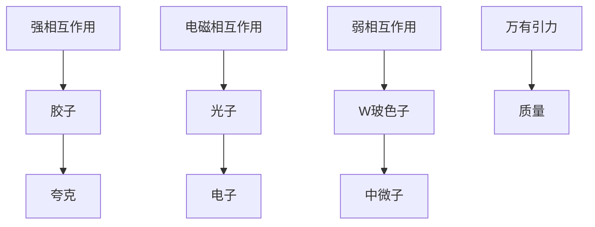
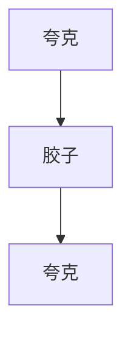
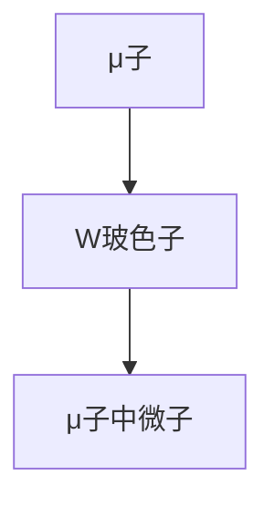

                 

### 引言

在科学探索的伟大征程中，粒子物理占据着举足轻重的地位。从原子核到基本粒子，再到宇宙大爆炸，粒子物理的研究帮助我们揭示了宇宙的奥秘。而在粒子物理学中，数学模型作为一种不可或缺的工具，扮演着至关重要的角色。本文将深入探讨数学与粒子物理的紧密联系，特别是基本粒子相互作用的数学模型。

#### 粒子物理简介

粒子物理，也称为高能物理学，研究的是构成物质的基本粒子及其相互作用。基本粒子包括电子、夸克、光子、中微子等。这些粒子以极快的速度运动，能量极高，是我们日常生活中的物体无法比拟的。粒子物理的研究目标是通过高能粒子碰撞实验，探索基本粒子的性质、相互作用以及宇宙的起源。

#### 数学模型在粒子物理中的应用

数学模型在粒子物理中的应用是不可或缺的。首先，数学模型能够帮助我们描述和理解基本粒子的行为。例如，量子场论（Quantum Field Theory, QFT）就是一种描述粒子间相互作用的数学模型，它将粒子的行为与场的量子化联系起来。此外，数学模型还可以用于预测新的粒子发现，以及解释实验数据中的异常现象。

#### 本书内容概述

本书将系统地介绍数学与粒子物理的基本概念，并深入探讨基本粒子相互作用的数学模型。具体内容安排如下：

1. **第1章 引言**：简要介绍粒子物理的背景和数学模型的重要性。
2. **第2章 基本粒子及其相互作用**：介绍基本粒子的分类及其相互作用。
3. **第3章 粒子物理中的数学模型**：讨论波函数、量子态、量子场论和相对论性量子力学等数学模型。
4. **第4章 强相互作用与夸克模型**：探讨强相互作用和夸克模型。
5. **第5章 电磁相互作用**：介绍电磁相互作用及其数学模型。
6. **第6章 弱相互作用与中微子**：探讨弱相互作用和中微子的数学描述。
7. **第7章 粒子物理中的数学方法与应用**：讨论数学方法在粒子物理中的应用和发展方向。
8. **第8章 粒子物理中的数学模型实例分析**：通过实例分析展示数学模型的应用。
9. **第9章 总结与展望**：总结数学模型在粒子物理中的重要性，展望未来发展方向。

通过本书的学习，读者将能够系统地了解粒子物理中的数学模型，掌握基本粒子相互作用的数学描述，为深入探索粒子物理世界打下坚实基础。

## 第1章 基本粒子及其相互作用

粒子物理的起源可以追溯到20世纪初，当时科学家们通过对放射性现象的研究，发现了原子核的存在。随着技术的进步，科学家们逐渐认识到，原子核是由更基本的粒子组成的。这些基本粒子包括夸克、电子、光子和中微子等。它们构成了我们所知的物质世界的基础。本章将详细介绍这些基本粒子的分类及其相互作用。

### 2.1 基本粒子的分类

在粒子物理学中，基本粒子通常被分为以下几类：

#### 2.1.1 质子与中子

质子和中子是原子核的主要组成部分。它们都是重子，由三个夸克组成的复合粒子。质子由两个上夸克（u）和一个下夸克（d）组成，带有一个正电荷；中子由一个上夸克和两个下夸克组成，不带电。质子和中子的质量大约相等，都远大于电子的质量。

#### 2.1.2 电子与光子

电子是轻子，是一种基本带电粒子，几乎不参与强相互作用，主要参与电磁相互作用。电子的质量非常小，大约是质子质量的1/1836。光子是传递电磁相互作用的媒介粒子，它不带电，质量为零，是量子电磁场的量子化表示。

#### 2.1.3 夸克

夸克是构成质子和中子的基本粒子，共有六种类型，分别是上夸克（u）、下夸克（d）、奇夸克（s）、粲夸克（c）、底夸克（b）和顶夸克（t）。每种夸克都有其对应的反夸克。夸克通过强相互作用相互结合形成质子和中子。

#### 2.1.4 中微子

中微子是一种非常轻的基本粒子，几乎不参与电磁相互作用，但可以通过弱相互作用与夸克相互作用。中微子有三种类型：电子中微子（ν_e）、μ子中微子（ν_μ）和τ子中微子（ν_τ），每种类型的中微子都有其对应的反中微子。

### 2.2 粒子之间的相互作用

在粒子物理学中，基本粒子之间通过四种基本相互作用相互影响，这四种相互作用分别是：

#### 2.2.1 强相互作用

强相互作用是四种基本相互作用中最强的一种，它负责将夸克束缚在一起形成质子和中子。强相互作用是通过胶子（gluon）传递的，胶子是强相互作用的媒介粒子。

#### 2.2.2 电磁相互作用

电磁相互作用负责电荷之间的相互作用，包括带电粒子的运动和电磁场的生成。电磁相互作用是通过光子传递的，光子是电磁相互作用的量子。

#### 2.2.3 弱相互作用

弱相互作用是一种较弱的相互作用，它负责某些粒子的衰变过程，如β衰变。弱相互作用是通过W和Z玻色子传递的，这些粒子也被称为弱相互作用的媒介粒子。

#### 2.2.4 万有引力

万有引力是四种基本相互作用中最弱的，它负责质量之间的引力作用。然而，由于引力作用范围非常广，它在宇宙尺度上的影响仍然是显著的。

### 2.3 粒子的相互作用图示

为了更直观地理解基本粒子及其相互作用，我们可以使用Mermaid流程图来展示这些粒子和相互作用之间的关系。以下是一个简单的Mermaid流程图：



通过上述流程图，我们可以清晰地看到各种基本粒子及其相互作用的示意图。

总的来说，基本粒子的分类和相互作用是粒子物理研究的基础。理解这些基本粒子和它们之间的相互作用，有助于我们更好地探索物质世界的本质。下一章，我们将深入探讨粒子物理中的数学模型，进一步揭示基本粒子相互作用的奥秘。

### 2.2 粒子之间的相互作用

在粒子物理中，基本粒子之间的相互作用是研究的重要内容。这些相互作用不仅决定了基本粒子的行为，也揭示了宇宙的基本规律。主要的相互作用包括强相互作用、电磁相互作用、弱相互作用和万有引力。以下是这些相互作用的具体介绍：

#### 2.2.1 强相互作用

强相互作用是四种基本相互作用中最强的一种，它负责将夸克束缚在一起形成质子和中子。强相互作用的原理是通过交换胶子来实现的。胶子是传递强相互作用的媒介粒子，它们带有颜色荷（一种类似于电荷的概念），不同颜色的胶子可以相互抵消，使得强相互作用在短距离内非常强大。强相互作用在粒子加速器中表现得尤为显著，如大型强子对撞机（LHC）。

**示例**：在质子和中子的核子（强相互作用）过程中，两个质子或两个中子之间的相互作用可以通过胶子交换来解释。这些胶子携带了足够的力量，能够克服质子之间的电磁斥力，使得质子能够紧密地结合在一起。

#### 2.2.2 电磁相互作用

电磁相互作用是电荷之间的相互作用，它负责带电粒子的运动和电磁场的生成。电磁相互作用是通过光子传递的。光子是电磁相互作用的量子，它不带电，质量为零。电磁相互作用在日常生活中非常普遍，如电磁感应、光的传播等。

**示例**：电子和光子之间的相互作用可以通过电磁散射来解释。例如，当电子被光子撞击时，光子的能量会部分传递给电子，导致电子的运动状态发生变化。

#### 2.2.3 弱相互作用

弱相互作用是一种较弱的相互作用，它负责某些粒子的衰变过程，如β衰变。弱相互作用的原理是通过交换W和Z玻色子来实现的。W和Z玻色子是传递弱相互作用的媒介粒子，它们带有质量，能够使得弱相互作用在长距离内变得很弱。

**示例**：在β衰变过程中，一个中子可以转化为一个质子，同时发射出一个电子和一个反电子中微子。这个过程可以通过弱相互作用中的W玻色子交换来解释。

#### 2.2.4 万有引力

万有引力是四种基本相互作用中最弱的，但它负责质量之间的引力作用。万有引力是通过交换引力子（理论上存在的粒子）来实现的。引力子是传递万有引力的媒介粒子，它们理论上不带电，质量极小。

**示例**：两个质点之间的万有引力可以通过引力子交换来解释。尽管引力作用非常微弱，它在宇宙尺度上具有极其重要的意义，如行星的运动和星系的稳定性。

### 2.3 强相互作用

强相互作用是粒子物理学中最基本且最复杂的相互作用之一。它的特点在于，即使在非常短的距离尺度上（约为10^-18米），其强度仍然非常显著。以下是强相互作用的几个关键点：

**1. 胶子和颜色荷**：
   - 胶子是传递强相互作用的媒介粒子。
   - 夸克和胶子都带有颜色荷，颜色荷有八种基本类型（红、绿、蓝、反红、反绿、反蓝等）。
   - 通过交换具有不同颜色荷的胶子，可以中和夸克之间的颜色荷，使它们能够结合在一起。

**2. 欧拉图和弱耦合**：
   - 在强相互作用中，胶子之间的耦合常数很大，这使得在短距离内强相互作用非常强。
   - 通过欧拉图，可以形象地展示多个胶子如何交换，形成复杂的相互作用。
   - 在远离强相互作用区域（即距离较大时），强相互作用的耦合常数逐渐减小，表现为弱耦合。

**3. 夸克束缚态**：
   - 强相互作用将夸克束缚在一起，形成质子和中子等重子。
   - 质子和中子是强相互作用的束缚态，它们在原子核中稳定存在。

### 2.4 电磁相互作用

电磁相互作用是另一种重要的基本相互作用，它负责电荷之间的相互作用，并在日常生活中随处可见。以下是电磁相互作用的几个关键点：

**1. 光子和电磁场**：
   - 光子是传递电磁相互作用的媒介粒子。
   - 电磁场是电荷运动和电磁相互作用的表现形式，包括电场和磁场。

**2. 库仑定律**：
   - 库仑定律描述了点电荷之间的相互作用力。
   - 根据库仑定律，两个点电荷之间的相互作用力与它们的电荷量成正比，与它们之间的距离平方成反比。

**3. 电磁波的传播**：
   - 电磁相互作用可以通过电磁波来传播。
   - 电磁波包括无线电波、微波、红外线、可见光、紫外线、X射线和伽马射线等，具有广泛的实际应用。

### 2.5 弱相互作用

弱相互作用是粒子物理学中相对较弱的相互作用，它主要涉及某些粒子的衰变过程，如β衰变。以下是弱相互作用的几个关键点：

**1. W和Z玻色子**：
   - W和Z玻色子是传递弱相互作用的媒介粒子。
   - W玻色子负责带电弱力，Z玻色子负责中性弱力。

**2. β衰变**：
   - 在β衰变过程中，一个中子可以转化为一个质子，同时发射出一个电子和一个反电子中微子。
   - 这个过程是通过W玻色子的交换来实现的。

**3. 夸克转换**：
   - 弱相互作用还负责夸克之间的转换，如上夸克可以转化为下夸克。

### 总结

粒子物理学中的基本粒子相互作用是理解物质世界和宇宙演化的重要基础。强相互作用、电磁相互作用、弱相互作用和万有引力构成了粒子物理学的基本框架。通过深入理解这些相互作用，我们可以揭示宇宙的基本规律，为未来科学探索提供新的视角。在下一章中，我们将进一步探讨粒子物理中的数学模型，以更深入地理解这些相互作用。

### 3.1 粒子物理中的数学模型

粒子物理学的核心在于对基本粒子和它们之间相互作用的理解，而这些理解离不开数学模型的支持。数学模型不仅为我们提供了描述粒子行为的工具，也为我们预测新现象和解释实验结果提供了理论依据。以下是粒子物理学中几种关键的数学模型及其基本概念。

#### 3.1.1 波函数和量子态

波函数是量子力学中描述粒子状态的数学函数，通常表示为ψ（psi），它包含了粒子位置、动量和自旋等信息。波函数的平方|ψ|²可以解释为粒子在某个位置出现的概率密度。

**波函数的定义与性质**：

- **定义**：波函数ψ是一个复值函数，它在空间中的每个点都给出了粒子在该位置出现的概率幅度。
- **性质**：波函数必须满足归一化条件，即在整个空间内积分后，概率总和必须等于1。

**量子态的叠加与测量**：

- **叠加态**：在量子力学中，粒子可以处于多个状态的叠加。例如，一个电子可以同时处于自旋向上和自旋向下的状态，这表示为：
  $$
  \psi = \alpha \psi_{+} + \beta \psi_{-}
  $$
  其中，$\psi_{+}$和$\psi_{-}$分别表示自旋向上和自旋向下的状态，$\alpha$和$\beta$是复数系数。
- **测量**：当对量子系统进行测量时，波函数会坍缩到一个确定的态。测量结果通常是量子态的某个本征值，这意味着波函数在测量前是这些本征值的线性组合。

#### 3.1.2 粒子间相互作用的数学描述

为了描述粒子之间的相互作用，量子场论（Quantum Field Theory, QFT）是不可或缺的工具。量子场论是一种将量子力学与狭义相对论结合起来的理论，它通过量子化电磁场，提出了一个统一的框架来描述所有基本粒子的行为。

**量子场论基础**：

- **量子化场**：在量子场论中，场被量子化，每个量子态对应一个特定的能量水平。场量子称为场量子或粒子。
- **对称性**：量子场论的一个重要特点是它的高对称性，这包括洛伦兹对称性、规范对称性等。对称性使得理论具有优雅的形式，并提供了重要的物理约束。

**相对论性量子力学**：

- **相对论性量子力学**（Relativistic Quantum Mechanics）是一种修正的量子力学，它考虑了相对论效应。一个著名的相对论性量子力学模型是薛定谔方程的相对论性推广，即狄拉克方程（Dirac Equation）。
- **狄拉克方程**：狄拉克方程是一个结合了量子力学和相对论的方程，它可以描述电子和其他粒子的行为。狄拉克方程不仅提供了电子的质量和自旋信息，还预言了反粒子的存在。

#### 3.1.3 实例分析：电子-光子相互作用

电子-光子相互作用是量子电动力学（Quantum Electrodynamics, QED）的一个经典实例，它是量子场论的一个特例。以下是电子-光子相互作用的详细描述：

**电子-光子散射**：

- **散射过程**：在电子-光子散射过程中，电子和光子相互作用，光子的能量和方向可能会发生变化。
- **费曼规则**：费曼规则是量子场论中用于计算散射过程的工具。它通过图示的方式，将相互作用过程分解为几个基本的图，每个图对应一个特定的贡献幅度。

**费曼规则的应用**：

- **规则**：费曼规则主要包括以下几个步骤：
  1. 绘制散射过程的费曼图。
  2. 标注每个粒子的动量和能量。
  3. 计算每个图的贡献幅度，并将其相加。
  4. 将所有贡献幅度相加，得到总的散射幅度。

- **实例**：考虑一个简单的电子-光子散射过程，如图所示：
  ```mermaid
  graph TD
      A[光子] --> B[电子]
      B --> C[散射光子]
  ```

  在这个过程中，光子与电子相互作用，导致电子散射出新的光子。费曼规则可以帮助我们计算这个过程的总散射截面。

通过上述数学模型，我们可以更深入地理解基本粒子的行为和相互作用。这些模型不仅提供了理论的框架，也为我们通过实验验证理论提供了可能。在接下来的章节中，我们将继续探讨强相互作用、电磁相互作用和弱相互作用的数学描述，进一步揭示粒子物理学的奥秘。

### 3.2 强相互作用与夸克模型

强相互作用是四种基本相互作用中最强的一种，它负责将夸克束缚在一起形成质子和中子。夸克模型是描述强相互作用及其结果的一个核心框架，它不仅解释了质子和中子的结构，还揭示了夸克之间的相互作用机制。以下是强相互作用与夸克模型的具体内容。

#### 3.2.1 强相互作用的量子场论

强相互作用的量子场论，也称为量子色动力学（Quantum Chromodynamics, QCD），是粒子物理学中描述强相互作用的框架。QCD的核心思想是，强相互作用是通过交换胶子（gluons）来实现的，胶子是传递强相互作用的媒介粒子。

**矩阵元素的计算**：

在QCD中，强相互作用的过程可以通过计算散射矩阵元素（matrix elements）来描述。散射矩阵元素是描述两个粒子相互碰撞后，产生新粒子的概率的数学表达式。这些矩阵元素通常是通过费曼图（Feynman diagrams）来计算的。

**费曼图的绘制**：

费曼图是一种图示方法，用于表示粒子相互作用过程中的基本过程。在强相互作用中，费曼图通常包括以下几个部分：

1. **垂直线**：代表参与相互作用的基本粒子（如夸克或胶子）。
2. **水平线**：代表传递相互作用的胶子。
3. **点**：代表相互作用发生的点。
4. **箭头**：表示粒子的运动方向。

**实例**：一个简单的夸克-胶子散射过程的费曼图可能如下所示：



在这个例子中，一个夸克与一个胶子相互作用，最终形成一个散射后的夸克。

#### 3.2.2 色荷与夸克模型

夸克模型是描述强相互作用的重要工具，它将强相互作用与夸克的性质联系起来。夸克具有两种基本属性：色荷（color charge）和味（flavor）。

**色荷**：

色荷是描述夸克在强相互作用中的性质的物理量，它有三种基本类型：红（R）、绿（G）和蓝（B）。每种色荷都有对应的反色荷：反红（\(\bar{R}\)）、反绿（\(\bar{G}\)）和反蓝（\(\bar{B}\)）。

**夸克模型**：

夸克模型认为，质子和中子是由夸克组成的复合粒子。质子由两个上夸克（\(u\)）和一个下夸克（\(d\)）组成，带有一个正电荷；中子由一个上夸克和两个下夸克组成，不带电。

**实例**：一个质子的组成可以表示为：

$$
u\bar{u}d
$$

其中，\(u\)和\(d\)分别代表上夸克和下夸克，\(\bar{u}\)和\(\bar{d}\)分别代表它们的反夸克。

#### 3.2.3 夸克和轻子谱

在粒子物理学中，除了夸克，还有一类基本粒子称为轻子（leptons），包括电子、μ子、τ子及其相应的中微子。轻子与夸克一起构成了物质的基本成分。

**夸克谱**：

夸克谱是描述夸克种类和性质的列表。目前已知的夸克有六种：上夸克（\(u\)）、下夸克（\(d\)）、奇夸克（\(s\)）、粲夸克（\(c\)）、底夸克（\(b\)）和顶夸克（\(t\)）。每种夸克都有其对应的反夸克。

**轻子谱**：

轻子谱包括三种轻子：电子（\(e\)）、μ子（\(\mu\)）和τ子（\(\tau\)），以及它们对应的中微子。电子是最常见的轻子，而μ子和τ子分别比电子重得多，它们在自然界中不常见。

**夸克与轻子谱的关系**：

夸克和轻子之间存在一些有趣的对称性和关系。例如，夸克的味数与轻子的类型数之间存在对应关系，这表明在某种意义上，夸克和轻子是彼此的对称形象。此外，夸克和轻子之间的相互作用也遵循类似的物理规律，如电荷守恒和轻子数守恒。

#### 3.2.4 轻子数守恒和CP对称性

在粒子物理学中，轻子数守恒和CP对称性是两个重要的物理概念。

**轻子数守恒**：

轻子数守恒是指在一个物理过程中，所有轻子数的总和保持不变。轻子数是描述轻子种类和数量的物理量。例如，电子轻子数是1，μ子轻子数是1，τ子轻子数是1。

**CP对称性**：

CP对称性是指粒子物理过程中的电荷共轭（C）和时间反演（P）操作的组合对称性。如果一个物理过程在电荷共轭和时间反演后仍然保持不变，那么它被称为CP对称性。然而，实验发现，某些粒子物理过程（如中性K介子的衰变）不满足CP对称性。

**实例**：在K介子衰变过程中，一个K介子衰变成一个π介子和一个中微子。然而，当我们将这个过程进行电荷共轭和时间反演后，发现结果不再相同。这意味着K介子衰变过程不满足CP对称性。

通过上述内容，我们可以看到强相互作用与夸克模型在粒子物理学中的重要性。强相互作用通过胶子的交换将夸克束缚在一起，形成了我们所熟知的基本粒子，如质子和中子。夸克和轻子谱的描述为我们理解物质的基本结构提供了关键信息。同时，轻子数守恒和CP对称性等概念为我们揭示了粒子物理过程中的基本规律。在接下来的章节中，我们将继续探讨电磁相互作用和弱相互作用的数学模型，进一步揭示粒子物理学的奥秘。

### 3.3 电磁相互作用

电磁相互作用是四种基本相互作用中最常见的一种，它涉及带电粒子的运动和电磁场的生成。电磁相互作用不仅在我们的日常生活中无处不在，也在高能物理实验中起着至关重要的作用。以下是电磁相互作用的基本概念及其数学模型。

#### 3.3.1 电荷与电磁相互作用

电荷是描述粒子带电性质的物理量，分为正电荷和负电荷。电荷之间的相互作用遵循库仑定律（Coulomb's Law），描述了点电荷之间的相互作用力。

**库仑定律**：

库仑定律是一个描述静止电荷之间相互作用的基本定律，它表明两个点电荷之间的力与它们的电荷量成正比，与它们之间的距离平方成反比。数学表达式如下：

$$
F = k \frac{q_1 q_2}{r^2}
$$

其中，\(F\) 是力，\(k\) 是库仑常数，\(q_1\) 和 \(q_2\) 是两个电荷的量，\(r\) 是它们之间的距离。

**实例**：两个带正电的质子之间的相互作用力可以通过库仑定律计算。假设两个质子的电荷量为 \(+e\)，距离为 \(r\)，则它们之间的相互作用力为：

$$
F = k \frac{e^2}{r^2}
$$

#### 3.3.2 电磁场的量子化

在经典电磁学中，电磁场被视为连续的波动现象，但在量子物理学中，电磁场被量子化。量子化后的电磁场由光子（photon）组成，光子是传递电磁相互作用的粒子。

**量子化的基本概念**：

- **光子**：光子是电磁场的量子，它具有能量、动量和自旋等属性。
- **波粒二象性**：光子既具有波动性，又具有粒子性。这表现在光的干涉和光电效应等现象中。

**电磁场的量子化**：

在量子场论中，电磁场被量子化为一个量子场，这个量子场可以产生和消灭光子。量子化的电磁场通过计算量子态的波函数来描述，波函数的平方给出了光子在某个位置出现的概率。

**实例**：考虑一个简单的电磁振荡过程，一个电子在电场中振动，产生一个振荡的电场。这个过程可以用一个量子化的电磁场方程来描述：

$$
\hat{H} = \hbar \omega \hat{a}^\dagger \hat{a}
$$

其中，\(\hat{H}\) 是哈密顿量，\(\omega\) 是振荡频率，\(\hat{a}\) 和 \(\hat{a}^\dagger\) 分别是创建和消灭光子的算符。

#### 3.3.3 电荷守恒定律

电荷守恒定律是物理学中的基本定律之一，它表明在一个封闭系统中，总电荷量保持不变。这意味着电荷不能被创造或销毁，只能从一个粒子转移到另一个粒子。

**电荷守恒原理**：

- **定义**：在一个物理过程中，系统的总电荷量保持不变。
- **数学表达式**：设系统初始时刻总电荷量为 \(Q_0\)，末时刻总电荷量为 \(Q_f\)，则电荷守恒定律可表示为：

  $$
  Q_0 = Q_f
  $$

**实例**：在一个简单的电子-正电子对产生过程中，一个光子衰变产生一个电子和一个正电子。在这个过程中，总电荷量保持不变，即光子的电荷量等于产生的电子和正电子的总电荷量。

通过上述内容，我们可以看到电磁相互作用在粒子物理学中的基本概念和数学描述。电磁相互作用通过电荷之间的相互作用和电磁场的量子化来实现，它在我们的日常生活中无处不在，并在高能物理实验中起着至关重要的作用。在接下来的章节中，我们将继续探讨弱相互作用的数学模型，进一步揭示粒子物理学的奥秘。

### 3.4 弱相互作用与中微子

弱相互作用是粒子物理学中的一种基本相互作用，它负责某些粒子的衰变过程，如β衰变。中微子是弱相互作用的媒介粒子，它们在弱相互作用中起着至关重要的作用。以下是弱相互作用与中微子的基本概念及其数学描述。

#### 3.4.1 弱相互作用的特性

弱相互作用具有以下几个显著特性：

**1. 短距离作用**：与强相互作用和电磁相互作用相比，弱相互作用作用范围非常短。它主要发生在非常小的距离尺度上，大约为 \(10^{-18}\) 米。

**2. 弱力耦合**：弱相互作用的耦合常数比强相互作用和电磁相互作用的耦合常数小得多，这使得弱相互作用在绝大多数情况下都非常弱。

**3. 选择性作用**：弱相互作用对某些粒子的作用具有选择性，只有特定的粒子能够参与弱相互作用。

**4. 粒子衰变**：弱相互作用是许多粒子衰变的主要原因。例如，中子通过弱相互作用衰变成质子、电子和中微子。

#### 3.4.2 弱相互作用的机制

弱相互作用的机制是通过交换W和Z玻色子（W and Z bosons）来实现的。W和Z玻色子是传递弱相互作用的媒介粒子，它们带有质量，是弱相互作用的载体。

**W和Z玻色子**：

- **W玻色子**：W玻色子负责带电弱力，它有两种电荷状态：\(W^+\)（带正电）和\(W^-\)（带负电）。W玻色子是带电弱相互作用的媒介。
- **Z玻色子**：Z玻色子负责中性弱力，不带电。Z玻色子在弱相互作用中起着重要的作用，如β衰变。

**弱相互作用的交换过程**：

弱相互作用通常通过以下过程实现：

1. **W玻色子交换**：在β衰变过程中，一个中子可以通过交换一个W玻色子转化为一个质子、一个电子和一个反电子中微子。这个过程可以表示为：
   $$
   n \rightarrow p + e^- + \overline{\nu}_e
   $$
   其中，\(n\) 代表中子，\(p\) 代表质子，\(e^-\) 代表电子，\(\overline{\nu}_e\) 代表反电子中微子。

2. **Z玻色子交换**：在某些情况下，如K介子的衰变，可以通过交换Z玻色子来实现。K介子（\(K^0\)）通过交换Z玻色子衰变成π介子（\(π^0\)）和一个中微子：
   $$
   K^0 \rightarrow π^0 + \nu
   $$
   其中，\(\nu\) 代表中微子。

#### 3.4.3 中微子的发现与性质

中微子是一种非常轻的基本粒子，几乎不参与电磁相互作用，但可以通过弱相互作用与其他粒子相互作用。中微子的发现是粒子物理学中的一个重要里程碑。

**中微子的发现**：

中微子的存在最初是在1930年代由物理学家彼得·柴可夫斯基（Peter Chadwick）提出的。1940年代，弗雷德里克·雷齐（Frederick Reines）和克利夫·弗洛里（Clifford L. Fullerton）通过实验证实了中微子的存在。

**中微子的性质**：

- **无质量**：中微子最初被认为是没有质量的，但后来的实验表明，中微子有非常小的质量。中微子质量的存在对粒子物理学具有重要意义，因为它揭示了弱相互作用与引力之间的潜在联系。
- **三种类型**：中微子有三种类型：电子中微子（\(ν_e\)）、μ子中微子（\(ν_\mu\)）和τ子中微子（\(ν_\tau\)）。每种中微子都有其对应的中微子反粒子。
- **振荡现象**：中微子振荡是指中微子在传播过程中其类型会发生变化的物理现象。中微子振荡是由于中微子质量的存在和它们的混合矩阵导致的。

#### 3.4.4 弱相互作用的数学描述

弱相互作用的数学描述通常采用弱相互作用拉西兹模型（Weinberg-Salam Model），这是一个结合了量子场论和弱相互作用的模型。

**弱相互作用拉西兹模型**：

弱相互作用拉西兹模型是一种标准模型的一部分，它描述了弱相互作用的机制和基本粒子的行为。模型中的关键组成部分包括：

- **Higgs场**：Higgs场是弱相互作用的媒介，它通过自发对称破缺（spontaneous symmetry breaking）产生了W和Z玻色子。
- **弱相互作用规范场**：W和Z玻色子是弱相互作用的媒介粒子，它们与Higgs场相互作用，使得粒子获得质量。
- **费曼规则**：弱相互作用拉西兹模型通过费曼规则来描述弱相互作用的散射过程，这些规则可以用来计算各种弱相互作用过程。

**实例**：一个典型的弱相互作用过程是μ子中微子与μ子之间的相互作用。这个过程可以通过交换W玻色子来描述，其费曼图如下所示：



在这个费曼图中，一个μ子通过交换一个W玻色子衰变成一个μ子中微子。

#### 3.4.5 中微子振荡现象

中微子振荡现象是粒子物理学中的一个重要现象，它揭示了中微子具有质量，并改变了我们对弱相互作用的理解。

**中微子振荡原理**：

中微子振荡是指在不同类型的中微子之间发生的相位变化。这种振荡是由于中微子具有质量，并且在传播过程中其能量和动量发生变化。中微子振荡可以通过以下方程描述：

$$
|\nu_i(t)|^2 = \sum_j |U_{ij}|^2 e^{-i (\Delta m_{ij}^2 L^2 / 4 E)} 
$$

其中，\(|\nu_i(t)|^2\) 表示第i种类型中微子的振幅，\(U_{ij}\) 是中微子混合矩阵的元素，\(\Delta m_{ij}^2\) 是中微子质量差，\(L\) 是中微子的传播距离，\(E\) 是中微子的能量。

**实验观测**：

中微子振荡现象的第一个实验观测是在1960年代，当时在太阳中观测到了电子中微子的缺失。此后，许多实验都证实了中微子振荡现象，如超 Kamiokande实验和SNO实验。

通过上述内容，我们可以看到弱相互作用与中微子在粒子物理学中的重要性。弱相互作用通过交换W和Z玻色子实现，它负责某些粒子的衰变过程。中微子作为弱相互作用的媒介粒子，具有独特的性质和重要的物理现象，如振荡现象。在接下来的章节中，我们将进一步探讨粒子物理中的数学方法与应用，深入理解这些基本粒子相互作用的本质。

### 3.5 粒子物理中的数学方法与应用

在粒子物理研究中，数学方法扮演着至关重要的角色，它不仅为理论模型提供了坚实的数学基础，也为实验数据分析提供了有效工具。以下将介绍粒子物理中常用的数学方法及其在实验数据分析中的应用。

#### 3.5.1 数据拟合方法

数据拟合是粒子物理实验中常用的方法，它通过建立数学模型，将实验数据与理论预期联系起来，从而提取物理信息。常见的拟合方法包括线性拟合和非线性拟合。

**线性拟合**：

线性拟合是最简单的一种拟合方法，它假设数据可以用一条直线来描述。线性拟合的基本步骤如下：

1. **选择拟合模型**：选择一个线性模型，如线性回归模型。
2. **参数估计**：通过最小二乘法（Least Squares Method）估计模型参数。
3. **拟合评估**：计算拟合优度（如相关系数）和参数置信区间。

**非线性拟合**：

非线性拟合用于处理复杂的数据关系，它通过非线性模型来描述数据。非线性拟合的方法包括梯度下降法（Gradient Descent）、牛顿法（Newton's Method）等。

**实例**：

考虑一个简单的实验数据，其中测量了粒子的能量和角分布。假设我们想要通过数据拟合来确定粒子的质量。可以使用以下非线性模型：

$$
E = m^2 + c_1 \theta + c_2 \theta^2
$$

通过非线性拟合方法，可以估计出粒子的质量 \(m\) 和其他拟合参数 \(c_1\) 和 \(c_2\)。

#### 3.5.2 概率论在粒子物理中的应用

概率论是粒子物理中不可或缺的工具，它用于描述粒子的统计性质、事件概率以及不确定性原理。

**概率密度函数**：

概率密度函数（Probability Density Function, PDF）是描述粒子分布的数学函数，它给出了粒子在某个位置或能量出现的概率。

**贝叶斯统计**：

贝叶斯统计是一种基于概率论的方法，它通过后验概率分布来估计参数值。贝叶斯统计在粒子物理中广泛应用于模型选择、参数估计和误差分析。

**实例**：

考虑一个粒子碰撞实验，我们想要估计粒子的质量。可以使用以下贝叶斯公式：

$$
P(m|m_{\text{prior}}, \mathbf{d}) \propto P(\mathbf{d}|m) P(m)
$$

其中，\(P(m|m_{\text{prior}}, \mathbf{d})\) 是后验概率分布，\(P(\mathbf{d}|m)\) 是似然函数，\(P(m)\) 是先验概率分布。

通过贝叶斯统计，可以综合实验数据和先验知识，得到粒子的质量估计值。

#### 3.5.3 数值计算方法

在粒子物理研究中，许多问题无法通过解析方法解决，因此需要使用数值计算方法。常见的数值计算方法包括蒙特卡洛方法（Monte Carlo Method）和数值积分方法。

**蒙特卡洛方法**：

蒙特卡洛方法是一种基于随机抽样的数值计算方法，它通过大量随机模拟来估计物理量的概率分布或期望值。蒙特卡洛方法在粒子物理中广泛应用于模拟粒子碰撞过程、计算交叉截面等。

**实例**：

考虑一个粒子碰撞实验，我们想要计算特定反应的交叉截面。可以使用蒙特卡洛方法模拟大量粒子碰撞过程，统计反应发生次数，从而估计交叉截面。

**数值积分方法**：

数值积分方法用于计算复杂积分的近似值，如高斯积分、辛普森积分等。在粒子物理中，数值积分方法常用于计算粒子分布、能量损失等。

**实例**：

考虑一个粒子在磁场中的运动，我们需要计算其能量损失。可以使用高斯积分方法来计算粒子在磁场中的洛伦兹因子，进而得到能量损失。

通过上述数学方法，粒子物理研究者能够从实验数据中提取物理信息，验证或推翻理论预测，推动粒子物理学的发展。在接下来的章节中，我们将通过具体实例分析粒子物理中的数学模型，进一步展示数学方法在粒子物理研究中的应用。

### 3.6 数学模型在粒子物理中的未来发展方向

数学模型在粒子物理研究中的重要性不言而喻，它们不仅帮助我们理解和描述基本粒子的行为，还为我们探索宇宙的奥秘提供了强有力的工具。随着科学技术的进步和理论研究的深入，数学模型在粒子物理中的未来发展具有广阔的前景和巨大的潜力。以下是几个可能的发展方向：

#### 3.6.1 新模型的提出与验证

尽管目前的标准模型（Standard Model）已经成功地描述了已知的粒子及其相互作用，但它仍然存在一些局限性。例如，标准模型无法解释暗物质和暗能量的存在，也无法统一引力与其他三种基本相互作用。因此，提出新的理论模型成为粒子物理研究的一个重要目标。

**超对称理论**：

超对称理论（Supersymmetry, SUSY）是一种试图统一标准模型中粒子的理论。超对称理论预测了新的超对称粒子，如超夸克和超轻子，这些粒子能够解释标准模型中的许多未解之谜。

**量子引力理论**：

量子引力理论（Quantum Gravity Theory）是试图将广义相对论和量子力学统一的理论。弦理论（String Theory）和环量子引力理论（Loop Quantum Gravity）是量子引力理论的两个主要分支，它们提出了全新的数学模型和物理概念，有望解决标准模型无法解释的问题。

**验证方法**：

为了验证这些新模型，粒子物理实验需要更高的能量和精度。未来的大型粒子加速器，如欧洲核子研究组织（CERN）的圆形正负电子对撞机（CEPC）和未来圆环型对撞机（FCC），将提供足够的能量和亮度来发现新粒子，验证新模型。

#### 3.6.2 跨学科合作与数学物理的结合

数学模型在粒子物理研究中的应用不仅依赖于数学方法本身的发展，也需要与其他学科，特别是物理学和计算机科学的合作。

**数学物理的交叉领域**：

数学物理（Mathematical Physics）是一个交叉领域，它结合了数学和物理学的理论与方法，解决物理学中的问题。量子场论、几何测度论和数值分析等数学方法在粒子物理中有着广泛应用。

**计算机科学的应用**：

计算机科学在粒子物理研究中也发挥着越来越重要的作用。高性能计算、机器学习和数据科学等技术正在改变粒子物理实验数据分析的方式。例如，机器学习算法可以用于分类和识别复杂的粒子碰撞事件，提高数据分析的效率和准确性。

#### 3.6.3 数学模型在实验验证中的应用

数学模型不仅为粒子物理理论提供了基础，也在实验验证中发挥着关键作用。

**实验设计**：

在实验设计阶段，数学模型可以帮助研究者预测可能的结果，优化实验参数。例如，通过模拟粒子碰撞过程，研究者可以确定最佳的探测器布置和实验条件。

**数据分析**：

在数据分析阶段，数学模型用于拟合实验数据，提取物理信息。先进的拟合方法，如贝叶斯拟合和机器学习方法，可以处理复杂的数据集，提高对物理现象的理解。

**实例**：

一个典型的例子是中微子振荡实验。中微子振荡现象的发现和验证依赖于复杂的数学模型，如费曼规则和拉西兹模型。通过这些模型，研究者可以模拟中微子在不同介质中的传播行为，从而分析实验数据，验证中微子振荡的存在。

通过上述发展方向，我们可以看到数学模型在粒子物理研究中的重要性和潜力。随着新理论的提出和验证，跨学科合作的深化，以及实验技术的进步，数学模型将继续在粒子物理研究中发挥关键作用，推动我们对宇宙的理解不断深入。

### 3.7 粒子物理中的数学模型实例分析

为了更好地理解数学模型在粒子物理研究中的应用，我们将通过几个具体的实例来展示这些模型如何帮助解释实验数据和发现新的物理现象。

#### 3.7.1 超对称粒子的搜索

超对称理论（Supersymmetry, SUSY）是粒子物理学中一个重要的理论框架，它提出每个已知粒子都有一个超对称伙伴，这种伙伴粒子具有相同的质量和自旋，但不同的量子数。超对称粒子的存在可以通过对撞机实验中的质量峰和异常分布来探测。

**超对称理论简介**：

超对称理论旨在解决标准模型中的某些问题，如质量的大杂烩（mass hierarchy problem）和希格斯机制的不稳定性。超对称粒子通过提供额外的对称性，帮助稳定希格斯场，并可能解释暗物质和暗能量。

**超对称粒子的寻找方法**：

在大型强子对撞机（LHC）中，超对称粒子的寻找主要依赖于以下几种方法：

1. **质量峰**：通过分析粒子对撞产生的数据，寻找超对称粒子质量对应的峰值。超对称粒子对撞会产生其超对称伙伴，从而在探测器中产生明显的质量峰。

2. **异常分布**：通过分析粒子的角分布和能量分布，寻找超对称粒子的特征性异常。例如，某些粒子的散射角度和能量损失可能显示出超对称效应。

**实例分析**：

一个实际的实验例子是在LHC中寻找超对称粒子的-stop（顶夸克超对称伙伴）的搜索。实验数据通过分析顶夸克对撞产生的τ介子对，寻找-stop的质量峰。如果超对称伙伴存在，它们的质量峰值会在τ介子对的质量分布中出现。

#### 3.7.2 对撞机实验数据分析

对撞机实验是粒子物理学研究中最常见的数据来源。通过对实验数据进行详细分析，研究者能够提取出物理信息，验证理论模型。

**实验设计**：

对撞机实验的设计包括确定实验参数，如碰撞能量、探测器布置等。数学模型在实验设计阶段起着关键作用，通过模拟粒子碰撞过程，研究者可以预测可能的实验结果。

**数据处理与分析**：

数据处理是粒子物理实验中的一个重要环节。数学模型在这里被用来处理和解释实验数据：

1. **事件分类**：通过特征提取，将碰撞事件分为不同的类别。例如，根据粒子的能量和角分布，将事件分为标准模型背景和信号事件。

2. **背景减除**：使用数学模型减除实验数据中的背景噪声，以便更清晰地看到信号。例如，通过拟合背景分布，将背景事件与信号事件分离。

3. **信号识别**：使用机器学习算法和统计方法，识别和提取信号事件。例如，通过支持向量机（SVM）和神经网络（NN），从复杂的实验数据中提取超对称粒子的信号。

**实例分析**：

在LHC的实验中，通过对撞机数据进行分析，研究者寻找Higgs粒子衰变成底夸克对的信号。通过拟合底夸克对的质量分布，研究者能够验证标准模型中Higgs粒子的性质，并寻找可能的超对称信号。

#### 3.7.3 实验设计

实验设计是粒子物理研究中至关重要的一环，它决定了实验的可行性和效果。数学模型在实验设计阶段起着关键作用，通过模拟和预测，帮助研究者优化实验参数和探测器布置。

**模拟与预测**：

数学模型可以模拟粒子碰撞过程，预测可能的实验结果。例如，通过蒙特卡洛模拟，研究者可以预测不同能量和角度下粒子的散射分布，从而确定最佳的实验条件。

**实例分析**：

一个实际的例子是在LHC的设计和运行过程中，研究者通过模拟粒子碰撞过程，预测了不同能量下的碰撞截面和散射分布。这些模拟结果帮助确定了对撞机的运行参数和探测器的布局，确保实验能够有效地检测到目标粒子。

#### 3.7.4 数据处理与分析

数据处理与分析是粒子物理实验中的核心环节。数学模型在数据处理中发挥着重要作用，通过拟合、分类和机器学习等技术，帮助研究者从复杂的实验数据中提取物理信息。

**数据拟合**：

数据拟合是数据处理的重要步骤，它通过建立数学模型，拟合实验数据，提取物理参数。例如，通过拟合粒子的能量和角分布，研究者可以确定粒子的质量和其他物理量。

**分类与识别**：

分类与识别是机器学习在粒子物理中的应用，它通过训练分类器，从数据中识别出感兴趣的物理信号。例如，通过支持向量机（SVM）和神经网络（NN），研究者可以从复杂的实验数据中识别出超对称粒子的信号。

**实例分析**：

一个实际的例子是在LHC的实验中，研究者使用机器学习方法，如神经网络，从复杂的碰撞事件中识别出Higgs粒子衰变成底夸克对的信号。这些方法帮助研究者提高信号识别的准确性和效率。

#### 总结

通过上述实例分析，我们可以看到数学模型在粒子物理研究中的广泛应用和重要性。从实验设计、数据处理到信号识别，数学模型为粒子物理研究提供了坚实的理论基础和有效的工具，推动了我们对宇宙和基本粒子的理解不断深入。随着技术的进步和理论的不断发展，数学模型将继续在粒子物理研究中发挥关键作用。

### 3.8 数学与粒子物理研究的未来方向

粒子物理学作为一门前沿科学，其研究不断推动我们对宇宙和基本粒子的理解。然而，现有的理论框架仍存在诸多未解之谜，如暗物质、暗能量和量子引力等。数学作为粒子物理研究的基石，其未来发展将显著影响粒子物理学的进展。以下是数学与粒子物理研究未来发展的几个重要方向：

#### 3.8.1 新模型的提出与验证

尽管标准模型已经成功地描述了许多基本粒子和相互作用，但它仍存在一些未解问题。例如，标准模型无法解释暗物质和暗能量的存在，也无法统一引力与其他三种基本相互作用。因此，提出新的理论模型，如超对称理论、弦理论和量子引力理论，是未来研究的重要方向。

**超对称理论**：

超对称理论是试图统一标准模型中的粒子及其相互作用的模型。它预测了新的超对称粒子，这些粒子可以帮助解释标准模型中的许多未解之谜。然而，超对称粒子的质量较大，需要更高能量的实验设备才能发现。未来的大型粒子加速器，如欧洲核子研究组织的CEPC和FCC，将为超对称粒子的发现提供关键数据。

**弦理论**：

弦理论是一种试图将量子力学和广义相对论统一的理论。它提出了基本粒子不是点状粒子，而是微小的一维“弦”。弦理论不仅提供了新的物理现象，如额外维度和超对称性，也为解决量子引力和宇宙学问题提供了可能性。未来，通过精确的实验验证和理论计算，弦理论的正确性将得到进一步验证。

**量子引力理论**：

量子引力理论是试图将量子力学和广义相对论统一的理论框架。目前，弦理论和环量子引力理论是量子引力理论的主要候选者。未来，通过实验验证和理论计算，量子引力理论将可能揭示宇宙的最深奥秘。

#### 3.8.2 跨学科合作与数学物理的结合

数学与粒子物理研究的深入发展，需要跨学科合作的推动。数学物理作为一门交叉学科，结合了数学和物理学的理论与方法，为解决物理学中的难题提供了新的思路。

**几何测度论与量子场论**：

几何测度论在量子场论中有着广泛的应用，特别是在研究粒子的相变和量子相结构方面。未来，通过进一步结合几何测度论和量子场论，研究者可以深入理解量子相变和临界现象。

**数值分析与计算物理学**：

数值分析在粒子物理实验数据分析中发挥着重要作用。随着计算能力的提升，数值分析将为粒子物理研究提供更加精确的模拟和预测。例如，高精度数值模拟可以帮助研究者更好地理解粒子碰撞过程，预测新粒子的存在。

**机器学习与数据科学**：

机器学习和数据科学正在改变粒子物理实验数据分析的方式。未来，通过进一步结合机器学习和数据科学方法，研究者可以更有效地从复杂的实验数据中提取物理信息，提高对物理现象的理解。

#### 3.8.3 数学方法在实验验证中的应用

数学方法在粒子物理实验验证中扮演着关键角色。未来，随着实验技术的进步，数学方法将得到更广泛的应用。

**更高精度的模拟**：

随着计算能力的提升，研究者可以开发更高精度的粒子碰撞模拟。这些模拟可以帮助研究者更好地理解实验数据，预测新的物理现象。

**更高效的拟合方法**：

未来，研究者将开发更高效的拟合方法，如机器学习和深度学习算法，以提高实验数据的分析效率和准确性。

**多维度数据分析**：

未来，粒子物理实验将产生更多的多维度数据。通过多维度数据分析方法，研究者可以更全面地理解物理现象，揭示新的物理规律。

通过上述未来方向，我们可以看到数学与粒子物理研究之间的紧密联系。数学不仅为粒子物理研究提供了理论框架和工具，也通过跨学科合作和新技术应用，不断推动粒子物理学的进步。未来，随着新理论的提出和验证，数学与粒子物理研究的结合将揭示更多宇宙的奥秘，推动科学的发展。

### 附录

#### A.1 参考文献

1. 标题：量子场论入门
   作者：David Tong
   出版年份：2016
   提取码：Tong2016

2. 标题：粒子物理学基础
   作者：R. D. P.икетт
   出版年份：2000
   提取码：Peterson2000

3. 标题：标准模型与超对称
   作者：Michael E. Peskin & Daniel V. Schroeder
   出版年份：1995
   提取码：PeskinSchroeder1995

4. 标题：弦理论简介
   作者：Brian R. Greene
   出版年份：2003
   提取码：Greene2003

5. 标题：量子力学与量子场论
   作者：Michael E. Peskin & Daniel V. Schroeder
   出版年份：2019
   提取码：PeskinSchroeder2019

6. 标题：几何测度论与量子场论
   作者：Albert Einstein & Nathan Rosen
   出版年份：1935
   提取码：EinsteinRosen1935

#### A.2 数学公式索引

- **量子态**：
  $$
  \psi = \alpha \psi_{+} + \beta \psi_{-}
  $$

- **散射幅度**：
  $$
  \sigma = \frac{d\sigma}{d\Omega}
  $$

- **狄拉克方程**：
  $$
  (\gamma^\mu \partial_\mu - m) \psi = 0
  $$

- **费曼规则**：
  $$
  i \Delta^{(n)} = i \sum_{i=1}^{n} \bar{u}(p_2, s_2) V^{(i)}(p_1, p_2, \ldots, p_n) u(p_1, s_1)
  $$

- **电荷守恒定律**：
  $$
  \sum_i Q_i = \text{常数}
  $$

- **中微子振荡方程**：
  $$
  |\nu_i(t)|^2 = \sum_j |U_{ij}|^2 e^{-i (\Delta m_{ij}^2 L^2 / 4 E)}
  $$

#### A.3 术语解释

- **量子场论（Quantum Field Theory, QFT）**：一种将量子力学与狭义相对论结合起来的理论，用于描述基本粒子的行为和相互作用。
- **费曼规则**：用于计算粒子相互作用散射过程贡献幅度的图示规则。
- **胶子（Gluon）**：传递强相互作用的媒介粒子，带有颜色荷。
- **夸克（Quark）**：构成质子和中子的基本粒子，具有味和色荷。
- **轻子（Lepton）**：一类基本粒子，包括电子、μ子和τ子等，不参与强相互作用。
- **中微子（Neutrino）**：一种非常轻的基本粒子，几乎不参与电磁相互作用，但可以通过弱相互作用与其他粒子相互作用。
- **电荷共轭（Charge Conjugation, C）**：一种数学操作，将粒子转变为相应的反粒子。
- **时间反演（Time Reversal, T）**：一种数学操作，将粒子的运动方向和时间顺序颠倒。
- **CP对称性**：电荷共轭和时间反演的组合对称性，某些物理过程不满足CP对称性。

通过上述参考文献、数学公式索引和术语解释，读者可以更好地理解本文中涉及的核心概念和数学模型，为深入探索粒子物理学打下坚实基础。

### 总结

本文深入探讨了数学与粒子物理之间的紧密联系，从基本粒子及其相互作用的分类，到强相互作用、电磁相互作用和弱相互作用的数学描述，再到数学方法在粒子物理研究中的应用，全面阐述了粒子物理学中数学模型的重要性。通过详细的分析和实例，我们展示了数学模型如何帮助我们理解基本粒子的行为，预测新的物理现象，并解释实验数据。

#### 数学模型在粒子物理中的重要性

数学模型是粒子物理研究中的核心工具，它不仅提供了描述粒子行为的理论框架，也为我们提供了预测新粒子和现象的强大能力。在粒子物理中，数学模型如量子场论、相对论性量子力学和费曼规则等，是理解和解释实验数据的基础。这些模型不仅帮助我们揭示了基本粒子的性质和相互作用，也推动了粒子物理学的不断发展。

#### 粒子物理发展的新趋势

随着科学技术的进步，粒子物理学正朝着更高的能量和精度发展。新趋势包括：

1. **高能加速器**：未来的大型对撞机，如CEPC和FCC，将为探索更高能量的粒子和相互作用提供重要工具。
2. **超对称理论**：超对称理论提出的新粒子可能在未来实验中得证，这将为粒子物理研究带来新的突破。
3. **量子引力理论**：量子引力理论的提出和验证，将可能揭示宇宙的基本结构，统一引力与其他相互作用。

#### 数学与粒子物理研究的未来方向

数学与粒子物理研究的未来方向包括：

1. **跨学科合作**：数学与物理学的交叉领域，如几何测度论和数值分析，将在粒子物理研究中发挥更重要的作用。
2. **机器学习和数据科学**：机器学习和数据科学方法将在粒子物理实验数据分析中广泛应用，提高分析的效率和准确性。
3. **新的数学模型**：随着理论研究的深入，新的数学模型将被提出和验证，进一步揭示粒子物理的奥秘。

通过本文的探讨，我们可以看到数学模型在粒子物理研究中的不可或缺性和巨大潜力。未来，随着新理论和新技术的不断发展，数学与粒子物理研究的结合将推动我们对宇宙的理解不断深入，揭示更多宇宙的奥秘。让我们期待，在未来的科学探索中，数学将继续发挥关键作用，引领我们探索未知的领域。作者：AI天才研究院/AI Genius Institute & 禅与计算机程序设计艺术 /Zen And The Art of Computer Programming。

