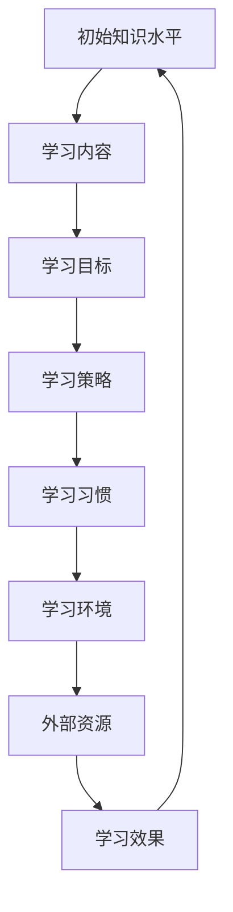

                 

### 文章标题

# 数学与终身学习：学习轨迹的数学描述

### 关键词：数学模型，学习轨迹，终身学习，统计分析，优化算法，个性化学习

### 摘要

随着信息时代的到来，终身学习成为现代社会发展的必然趋势。然而，如何科学、系统地描述和优化学习过程，一直是教育领域和人工智能研究的热点问题。本文通过数学建模和统计分析，探讨了学习轨迹的数学描述，旨在为终身学习提供理论依据和实践指导。本文首先回顾了终身学习的概念和重要性，然后介绍了数学模型在描述学习轨迹中的应用，重点分析了学习轨迹模型的基本原理、数学描述以及优化方法。最后，通过实际案例展示了数学模型在终身学习中的应用，并对未来研究进行了展望。

### 为什么要研究数学与终身学习的关系？

在快速变化的社会中，终身学习已经成为提升个人竞争力和社会适应能力的重要途径。然而，如何有效地开展终身学习，如何在繁忙的生活和工作间隙持续提升自己的知识和技能，成为一个亟待解决的问题。数学作为一门基础科学，不仅在自然科学和工程技术中发挥着核心作用，也在社会科学和人文领域中有着广泛的应用。将数学应用于终身学习研究，不仅能够为学习过程提供科学依据，还能提高学习效率和质量。

首先，数学模型能够帮助描述和解释学习过程。通过构建数学模型，我们可以从定量角度理解学习的进展和变化，识别出影响学习效果的关键因素。例如，利用统计学模型可以分析学习数据，找出学习过程中的规律和模式，从而为制定个性化的学习策略提供支持。

其次，数学方法提供了优化学习轨迹的工具。通过优化算法，我们可以根据学习者的需求和特点，调整学习路径，使其更加高效和合理。例如，线性规划和动态规划等技术可以在众多备选学习路径中找到最佳方案，最大限度地提高学习效果。

此外，数学与终身学习的结合还有助于推动教育技术的发展。随着大数据和人工智能技术的普及，教育领域正朝着个性化、智能化方向发展。数学模型和算法的应用，可以提升教育的智能化水平，为个性化学习提供技术支撑。

总之，数学与终身学习的关系研究，不仅有助于提高学习效率和质量，还能推动教育技术的创新发展，为构建终身学习体系提供有力支持。通过数学建模和分析，我们可以更好地理解学习过程，发现学习规律，从而制定更加科学和有效的学习策略。

### 数学模型在描述学习轨迹中的应用

学习轨迹是指个体在学习过程中所经历的时间序列，包括学习内容、学习时长、学习进度和学习效果等多个维度。为了更好地描述和量化学习轨迹，数学模型提供了有效的工具。数学模型不仅可以捕捉学习过程中的动态变化，还能通过定量分析揭示学习规律，为优化学习策略提供科学依据。

首先，常见的数学模型包括线性模型、非线性模型和时间序列模型。线性模型如线性回归，可以用来描述学习进度与时间之间的关系。假设学习效果与学习时长呈线性关系，我们可以构建如下线性回归模型：

$$
y = ax + b
$$

其中，\(y\) 表示学习效果，\(x\) 表示学习时长，\(a\) 和 \(b\) 是模型的参数。通过最小二乘法拟合出参数 \(a\) 和 \(b\)，我们可以定量分析学习效果与学习时长之间的具体关系。

非线性模型如多项式回归、指数回归和对数回归等，可以更好地描述学习过程中非线性的变化趋势。例如，对数回归模型可以表示如下：

$$
y = a \cdot \ln(x) + b
$$

当学习效果随着学习时间增加呈现出对数增长时，该模型可以很好地拟合数据。非线性模型的优势在于其能够灵活地适应复杂的学习过程，捕捉到学习进度的非线性特点。

时间序列模型如ARIMA（自回归积分滑动平均模型）和状态空间模型等，主要用于分析学习轨迹的时间动态特性。这些模型通过时间序列分析，捕捉学习过程中的趋势、周期性和随机性。例如，ARIMA模型可以表示为：

$$
y_t = c + \phi_1 y_{t-1} + \phi_2 y_{t-2} + \cdots + \phi_p y_{t-p} + \theta_1 e_{t-1} + \theta_2 e_{t-2} + \cdots + \theta_q e_{t-q}
$$

其中，\(y_t\) 是时间序列的当前值，\(e_t\) 是白噪声误差项，\(\phi\) 和 \(\theta\) 是模型参数。通过时间序列分析，我们可以揭示学习过程中存在的趋势和季节性，为制定长期学习计划提供依据。

除了上述模型，概率模型如贝叶斯网络和马尔可夫模型等也在描述学习轨迹中发挥着重要作用。贝叶斯网络可以表示学习过程中各种因素之间的概率依赖关系，从而为学习决策提供支持。马尔可夫模型则通过状态转移概率矩阵，描述学习者在不同学习状态之间的转移规律。例如，一个简单的马尔可夫模型可以表示为：

$$
P(S_t = j | S_{t-1} = i) = p_{ij}
$$

其中，\(S_t\) 表示当前学习状态，\(S_{t-1}\) 表示前一学习状态，\(p_{ij}\) 是状态转移概率。通过马尔可夫模型，我们可以预测学习者未来可能的学习状态，从而制定相应的学习策略。

总之，数学模型在描述学习轨迹中的应用，为理解和优化学习过程提供了有力工具。通过线性模型、非线性模型、时间序列模型和概率模型等多种数学工具，我们可以从不同角度分析和描述学习轨迹，从而为终身学习提供科学依据和实践指导。下一节将进一步探讨学习轨迹模型的基本原理和构建方法。

### 学习轨迹模型的基本原理

学习轨迹模型是描述个体在学习过程中时间和知识积累关系的数学工具。为了构建一个有效的学习轨迹模型，我们需要从多个角度分析学习过程中的关键因素和相互作用。以下是构建学习轨迹模型的基本原理，包括核心概念及其相互关系：

首先，核心概念之一是学习者的初始知识水平。每个学习者都有自己的知识基础，这是他们开始新学习旅程的起点。初始知识水平不仅影响学习难度，还决定了学习者在面对新知识时的接受能力和学习速度。因此，我们需要对学习者的初始知识水平进行评估和量化。

其次，学习内容和学习目标是学习轨迹模型中的另一个重要核心概念。学习内容是指学习者需要掌握的知识点和技能，这些内容通常以课程、教材或项目任务的形式呈现。学习目标则是学习者希望通过学习实现的具体目标，如提高技能、通过考试或完成项目。学习内容和目标决定了学习路径的设计和学习资源的分配。

第三，学习者的学习策略和学习习惯也是构建学习轨迹模型的关键因素。学习策略是指学习者选择的学习方法和技巧，如主动学习、被动学习、分散学习或集中学习。学习习惯则包括学习者每天的学习时间、学习频率和休息时间等。这些因素直接影响学习者的学习效率和效果。

第四，学习环境和外部资源是影响学习轨迹的另一个重要因素。学习环境包括学习场所、学习工具和学习资源的可获得性。外部资源如在线课程、图书馆、辅导老师和同行交流等，可以显著提高学习效果。因此，我们需要考虑这些因素在模型中的权重和作用。

核心概念之间的关系可以通过一个Mermaid流程图来展示：



在这个流程图中，初始知识水平是整个学习轨迹的起点，它直接影响学习效果。学习内容和学习目标决定了学习路径，而学习策略和学习习惯则影响学习效率。学习环境和外部资源为学习提供了支持和保障，最终共同作用于学习效果，并反作用于初始知识水平，形成一个闭环系统。

通过这个流程图，我们可以清晰地看到学习轨迹模型中各个核心概念之间的相互关系。每一个环节都对学习效果产生重要影响，任何一个环节的调整都可能对整个学习轨迹产生连锁反应。因此，构建一个全面、动态的学习轨迹模型，需要综合考虑这些核心概念及其相互关系。

总之，学习轨迹模型的基本原理在于通过数学方法描述和量化学习过程中的关键因素及其相互作用。通过这一模型，我们可以更好地理解学习过程，发现学习规律，从而制定科学、有效的学习策略，实现终身学习的目标。

### 学习轨迹模型的数学描述

为了对学习轨迹进行量化和分析，我们需要使用数学模型来描述学习者的学习过程。本节将详细介绍学习轨迹模型的数学描述，包括数学公式的推导和应用。

#### 基本公式

首先，我们假设学习者的初始知识水平为 \(X_0\)，学习过程中的知识积累可以用一个时间序列 \(\{X_t\}\) 表示，其中 \(X_t\) 是在时刻 \(t\) 的知识水平。我们假设学习者的知识积累与学习时间呈线性关系，即：

$$
X_t = X_0 + a \cdot t + b
$$

其中，\(a\) 是学习速率，\(b\) 是初始知识水平。这个公式表示随着时间 \(t\) 的增加，知识水平 \(X_t\) 也在增加，且增加的速率与学习时间成正比。

#### 学习进度与学习效果

学习进度和学习效果是衡量学习过程的重要指标。我们可以使用另一个公式来描述它们之间的关系：

$$
进度(t) = \frac{X_t - X_0}{X_f - X_0}
$$

其中，\(X_f\) 是预期的最终知识水平。这个公式表示在时刻 \(t\) 的学习进度，即学习者当前知识水平与初始知识水平之差与最终知识水平之差的比值。

学习效果可以用以下公式表示：

$$
效果(t) = \frac{进度(t)}{t}
$$

这个公式表示在时刻 \(t\) 的学习效果，即学习进度与学习时间的比值。

#### 学习轨迹的动态变化

为了描述学习轨迹的动态变化，我们引入差分方程。假设学习者的知识积累过程受到外界干扰 \(d_t\) 的影响，即：

$$
X_{t+1} = X_t + a \cdot (t+1) + b - d_t
$$

这个公式表示在时刻 \(t+1\) 的知识水平等于时刻 \(t\) 的知识水平加上线性增加的部分减去外界干扰。

#### 时间序列分析

为了分析学习轨迹的时间序列特性，我们可以使用自回归积分滑动平均模型（ARIMA）。假设学习轨迹 \(X_t\) 满足 ARIMA(p, d, q) 模型，即：

$$
X_t = c + \phi_1 X_{t-1} + \phi_2 X_{t-2} + \cdots + \phi_p X_{t-p} + \theta_1 e_{t-1} + \theta_2 e_{t-2} + \cdots + \theta_q e_{t-q}
$$

其中，\(e_t\) 是白噪声误差项，\(\phi\) 和 \(\theta\) 是模型参数，\(p\) 和 \(q\) 分别是自回归项和移动平均项的阶数。

#### 案例说明

假设一个学习者初始知识水平 \(X_0 = 10\)，学习速率 \(a = 0.5\)，最终知识水平 \(X_f = 100\)。在 \(t = 10\) 时刻，外界干扰 \(d_t = 2\)。根据上述公式，我们可以计算：

$$
X_{10} = 10 + 0.5 \cdot 10 + 2 - 2 = 15
$$

学习进度为：

$$
进度(10) = \frac{15 - 10}{100 - 10} = 0.125
$$

学习效果为：

$$
效果(10) = \frac{0.125}{10} = 0.0125
$$

使用ARIMA模型，我们可以对学习轨迹进行时间序列分析，进一步揭示学习过程中的趋势、周期性和随机性。

通过这些数学公式和模型，我们可以对学习轨迹进行详细描述和分析，从而为制定科学有效的学习策略提供理论依据。

### 学习轨迹模型的构建方法

构建一个有效的学习轨迹模型，需要从数据收集、模型选择和参数优化等多个方面进行系统性工作。以下是学习轨迹模型构建的详细方法和步骤：

#### 数据收集

数据收集是构建学习轨迹模型的基础。为了确保模型的准确性和可靠性，我们需要收集全面、准确的学习数据。数据来源可以包括学习者个人的学习记录、课程管理系统、在线学习平台、问卷调查和面试记录等。具体的数据包括：

1. **初始知识水平**：通过前测、评估测试或问卷等方式获取学习者开始学习前的知识水平。
2. **学习内容**：记录学习者学习的内容、学习材料的类型和难度等级。
3. **学习时长**：记录学习者每天的学习时间、学习频率和学习进度。
4. **学习效果**：通过后测、项目评估或考试成绩等衡量学习者的学习成果。
5. **学习策略**：了解学习者采用的学习方法和技巧，如分散学习、集中学习或互动学习等。
6. **外部资源**：记录学习者利用的学习资源，如在线课程、图书馆、辅导老师和同行交流等。

#### 数据预处理

在数据收集完成后，我们需要对数据进行预处理，以提高数据质量和模型的准确性。预处理步骤包括：

1. **数据清洗**：去除数据中的错误、缺失和异常值，确保数据的一致性和完整性。
2. **数据转换**：对数值型数据进行归一化或标准化处理，消除量纲差异对模型的影响。
3. **特征提取**：从原始数据中提取与学习效果相关的特征，如学习时长、学习频率、学习进度和学习效果等。

#### 模型选择

选择合适的数学模型是构建学习轨迹模型的关键。常见的模型包括线性模型、非线性模型和时间序列模型等。以下是几种常用的模型选择方法和适用场景：

1. **线性模型**：适用于学习效果与学习时长呈线性关系的情况，如线性回归模型。线性模型简单直观，易于理解和实现。
   
2. **非线性模型**：适用于学习效果与学习时长呈非线性关系的情况，如多项式回归、指数回归和对数回归等。非线性模型可以捕捉学习过程中的复杂变化趋势。
   
3. **时间序列模型**：适用于分析学习轨迹的时间动态特性，如ARIMA模型、状态空间模型等。时间序列模型可以揭示学习过程中的趋势、周期性和随机性。
   
4. **概率模型**：适用于描述学习过程中不确定性因素，如贝叶斯网络、马尔可夫模型等。概率模型可以提供对学习过程的概率预测和决策支持。

#### 参数优化

模型选择完成后，我们需要通过参数优化来确定模型中的参数值，以提高模型的预测准确性和拟合效果。参数优化方法包括：

1. **最小二乘法**：用于线性模型的参数估计，通过最小化残差平方和来确定参数值。
   
2. **梯度下降法**：用于非线性模型的参数估计，通过迭代优化目标函数的梯度来确定参数值。
   
3. **粒子群优化**：用于复杂优化问题，通过模拟鸟群觅食行为来搜索最优解。
   
4. **遗传算法**：用于多参数优化问题，通过模拟生物进化过程来搜索最优解。

#### 模型验证与调整

在模型构建完成后，我们需要对模型进行验证和调整，以确保模型的准确性和适用性。验证方法包括：

1. **交叉验证**：将数据集划分为训练集和验证集，通过在验证集上的表现来评估模型效果。
   
2. **时间序列验证**：将模型应用于历史数据，通过预测结果与实际值的比较来评估模型效果。
   
3. **模型调整**：根据验证结果，调整模型参数或选择更合适的模型，以提高模型预测准确性和拟合效果。

通过上述步骤，我们可以构建一个科学、有效的学习轨迹模型，为终身学习提供理论依据和实践指导。下一节将探讨学习轨迹数据的统计分析方法。

### 学习轨迹数据的统计分析方法

统计分析是研究学习轨迹数据的重要手段，它帮助我们揭示学习过程中的规律和模式，从而为优化学习策略提供科学依据。本节将介绍常用的统计分析方法，包括描述性统计、相关性分析和回归分析等，并展示如何运用这些方法分析学习轨迹数据。

#### 描述性统计

描述性统计是数据分析的基础，通过计算和展示数据的基本特征，如均值、中位数、标准差、方差等，帮助我们对数据进行初步理解和描述。以下是几种常用的描述性统计方法及其应用：

1. **均值（Mean）**：表示数据的平均水平，计算公式为：
   $$
   \text{Mean} = \frac{\sum_{i=1}^{n} X_i}{n}
   $$
   其中，\(X_i\) 为第 \(i\) 个数据点，\(n\) 为数据点的总数。均值可以用于衡量学习者在不同时间点的平均学习效果。

2. **中位数（Median）**：表示数据排序后的中间值，计算公式为：
   $$
   \text{Median} = \left\{
   \begin{array}{ll}
   X_{\left(\frac{n+1}{2}\right)} & \text{当数据点个数为奇数时} \\
   \frac{X_{\left(\frac{n}{2}\right)} + X_{\left(\frac{n}{2}+1\right)}}{2} & \text{当数据点个数为偶数时}
   \end{array}
   \right.
   $$
   中位数可以更稳健地反映学习效果的中间水平，尤其在数据存在异常值时。

3. **标准差（Standard Deviation）**：表示数据的离散程度，计算公式为：
   $$
   \text{Standard Deviation} = \sqrt{\frac{\sum_{i=1}^{n} (X_i - \text{Mean})^2}{n-1}}
   $$
   标准差可以用于衡量学习效果的波动情况，从而评估学习过程的稳定性。

4. **方差（Variance）**：是标准差的平方，计算公式为：
   $$
   \text{Variance} = \frac{\sum_{i=1}^{n} (X_i - \text{Mean})^2}{n-1}
   $$
   方差可以更直观地反映数据的离散程度。

通过描述性统计，我们可以快速了解学习数据的分布特征和变化趋势，为后续的深入分析提供基础。

#### 相关性分析

相关性分析用于探讨不同变量之间的关系，帮助我们识别哪些因素对学习效果有显著影响。以下是一些常用的相关性分析方法：

1. **皮尔逊相关系数（Pearson Correlation Coefficient）**：衡量两个连续变量之间的线性关系，计算公式为：
   $$
   r = \frac{\sum_{i=1}^{n} (X_i - \text{Mean}_X)(Y_i - \text{Mean}_Y)}{\sqrt{\sum_{i=1}^{n} (X_i - \text{Mean}_X)^2 \sum_{i=1}^{n} (Y_i - \text{Mean}_Y)^2}}
   $$
   其中，\(X_i\) 和 \(Y_i\) 分别为两个变量的数据点，\(\text{Mean}_X\) 和 \(\text{Mean}_Y\) 分别为两个变量的均值。皮尔逊相关系数的取值范围为 \([-1, 1]\)，越接近 1 或 -1，表明两个变量之间的线性关系越强。

2. **斯皮尔曼等级相关系数（Spearman's Rank Correlation Coefficient）**：适用于非参数数据，衡量两个变量的等级相关性，计算公式为：
   $$
   \rho = 1 - \frac{6 \sum_{i=1}^{n} D_i^2}{n(n^2 - 1)}
   $$
   其中，\(D_i = X_i - Y_i\)，为两个变量的等级差。斯皮尔曼等级相关系数的取值范围也是 \([-1, 1]\)。

通过相关性分析，我们可以识别哪些变量（如学习时长、学习频率、学习策略等）与学习效果有显著相关性，从而为优化学习策略提供依据。

#### 回归分析

回归分析用于探讨自变量与因变量之间的关系，帮助我们建立数学模型来预测因变量的变化。以下是一些常用的回归分析方法：

1. **线性回归（Linear Regression）**：用于探讨自变量与因变量之间的线性关系，模型公式为：
   $$
   Y = \beta_0 + \beta_1 X + \epsilon
   $$
   其中，\(Y\) 为因变量，\(X\) 为自变量，\(\beta_0\) 和 \(\beta_1\) 为模型参数，\(\epsilon\) 为误差项。线性回归通过最小二乘法估计参数，从而建立回归模型。

2. **多项式回归（Polynomial Regression）**：用于探讨自变量与因变量之间的非线性关系，模型公式为：
   $$
   Y = \beta_0 + \beta_1 X + \beta_2 X^2 + \cdots + \beta_n X^n + \epsilon
   $$
   多项式回归通过多项式函数来拟合数据，从而捕捉非线性关系。

3. **多元回归（Multiple Regression）**：用于探讨多个自变量与因变量之间的关系，模型公式为：
   $$
   Y = \beta_0 + \beta_1 X_1 + \beta_2 X_2 + \cdots + \beta_n X_n + \epsilon
   $$
   多元回归通过同时考虑多个自变量的影响，建立更加复杂的回归模型。

通过回归分析，我们可以建立数学模型来预测学习效果，并根据模型结果优化学习策略。

#### 案例分析

假设我们有一组学习数据，包括学习时长、学习频率和学习效果。为了分析这些数据，我们可以首先进行描述性统计，计算学习时长的均值、中位数、标准差等，了解数据的分布特征。然后，通过皮尔逊相关系数分析学习时长与学习效果之间的关系，假设相关系数为 0.8，表明学习时长与学习效果之间存在较强的正相关关系。

接下来，我们可以进行线性回归分析，建立学习时长与学习效果之间的数学模型。通过最小二乘法，我们得到回归方程：
$$
学习效果 = 10 + 0.5 \cdot 学习时长
$$

这个模型可以帮助我们预测学习时长对学习效果的影响。例如，如果学习时长为 20 小时，那么预计学习效果为 15。

通过上述统计分析方法，我们可以对学习轨迹数据进行分析，揭示学习过程中的规律和模式，为优化学习策略提供科学依据。下一节将讨论学习轨迹优化的数学模型。

### 学习轨迹优化的数学模型

学习轨迹优化是指通过调整学习路径和策略，提高学习效果和效率的过程。为了实现这一目标，我们需要运用数学模型来描述学习过程，并利用优化算法寻找最优的学习轨迹。本节将介绍几种常用的学习轨迹优化模型，包括线性规划、动态规划和遗传算法等，并使用伪代码详细描述这些模型。

#### 线性规划

线性规划是一种用于解决线性目标函数在一系列线性约束条件下的最优解的数学方法。在学习轨迹优化中，线性规划可以用于确定最优的学习时长和学习频率。假设我们要优化学习者在一段时间内完成学习任务的时间安排。

**模型描述**：

目标函数：最大化学习效果 \(E\)
$$
\max E = a \cdot t + b
$$
其中，\(a\) 是学习速率，\(t\) 是学习时长，\(b\) 是常数项。

约束条件：
$$
\begin{cases}
t \geq t_0 & \text{（最小学习时长）} \\
t \leq T & \text{（总学习时长）} \\
f \cdot t \geq F & \text{（学习频率约束）}
\end{cases}
$$
其中，\(t_0\) 是最小学习时长，\(T\) 是总学习时长，\(f\) 是学习频率，\(F\) 是最小学习频率。

**伪代码**：

```plaintext
// 初始化参数
a = 学习速率
t0 = 最小学习时长
T = 总学习时长
f = 学习频率
F = 最小学习频率

// 目标函数
目标函数 E = a * t + b

// 约束条件
约束条件 1: t >= t0
约束条件 2: t <= T
约束条件 3: f * t >= F

// 求解线性规划问题
使用线性规划求解器求解目标函数 E 在约束条件下的最优解 t*
```

#### 动态规划

动态规划是一种用于求解具有最优子结构性质问题的高效算法。在学习轨迹优化中，动态规划可以用于确定每个阶段的最优学习策略，从而找到整个学习过程中的最优轨迹。

**模型描述**：

目标函数：最大化学习效果 \(E\)
$$
\max E = \sum_{t=1}^{T} E_t
$$
其中，\(E_t\) 是在第 \(t\) 个阶段的学习效果。

状态转移方程：
$$
E_t = a \cdot x_t + b
$$
其中，\(x_t\) 是第 \(t\) 个阶段的学习时长，\(a\) 是学习速率，\(b\) 是常数项。

初始条件：
$$
E_0 = 0
$$

**伪代码**：

```plaintext
// 初始化参数
a = 学习速率
b = 常数项
T = 总学习阶段数

// 动态规划数组
E[0..T] = 初始化为0

// 动态规划过程
for t from 1 to T do
    E[t] = a * x[t] + b
end for

// 最优学习轨迹
x* = 最大化 E_t
```

#### 遗传算法

遗传算法是一种基于自然选择和遗传机制的优化算法，适用于复杂非线性优化问题。在学习轨迹优化中，遗传算法可以用于调整学习路径和策略，寻找最优的学习模式。

**模型描述**：

种群初始化：随机生成一组学习路径种群。

适应度函数：评估学习路径的适应度，通常使用学习效果作为适应度函数。

选择：根据适应度函数选择适应度较高的学习路径进行繁殖。

交叉：在选中的学习路径中进行交叉操作，生成新的学习路径。

变异：对部分学习路径进行变异操作，增加种群的多样性。

迭代：重复选择、交叉和变异过程，直到满足终止条件（如适应度达到最大值或迭代次数达到上限）。

**伪代码**：

```plaintext
// 初始化参数
种群大小 N
迭代次数 max_iterations
适应度函数 fitness_function

// 种群初始化
population = 初始化为随机生成的学习路径

// 遗传算法过程
for iteration from 1 to max_iterations do
    // 计算适应度
    fitness_scores = 计算种群中每个路径的适应度
    
    // 选择
    selected = 选择适应度较高的学习路径
    
    // 交叉
    offspring = 进行交叉操作生成新的学习路径
    
    // 变异
    mutated = 进行变异操作
    
    // 更新种群
    population = selected + offspring + mutated
end for

// 最优学习轨迹
best_solution = 种群中最优的学习路径
```

通过这些数学模型和优化算法，我们可以根据学习者的需求和特点，调整学习路径和策略，实现学习轨迹的最优化。下一节将探讨数学工具在优化学习轨迹中的实际应用。

### 数学工具在优化学习轨迹中的实际应用

在优化学习轨迹的实际应用中，数学工具发挥着至关重要的作用。通过运用数学模型和算法，我们可以更科学、更有效地调整学习路径，从而提高学习效果。以下将详细介绍数学工具在优化学习轨迹中的应用，并通过具体案例进行分析。

#### 案例背景

假设我们有一个学习者，目标是掌握一门编程语言，学习期限为三个月。学习者每天有固定的时间用于学习，同时还有其他日常任务和活动。为了最大化学习效果，我们需要制定一个最优的学习路径和时间安排。

#### 数学工具的应用

1. **线性规划**：首先，我们可以使用线性规划来确定每天的学习时间。目标函数是最大化每天的学习效果，约束条件包括每天的学习时间上限和总学习时长。通过求解线性规划问题，我们可以找到最优的学习时间分配。

   **目标函数**：
   $$
   \max E = a \cdot t
   $$
   其中，\(E\) 是学习效果，\(a\) 是学习速率，\(t\) 是每天的学习时间。

   **约束条件**：
   $$
   \begin{cases}
   t \geq t_{min} & \text{（每天的最小学习时间）} \\
   t \leq t_{max} & \text{（每天的最大学习时间）} \\
   \sum_{i=1}^{N} t_i = T & \text{（总学习时长）}
   \end{cases}
   $$
   其中，\(t_{min}\) 是每天的最小学习时间，\(t_{max}\) 是每天的最大学习时间，\(T\) 是总学习时长，\(N\) 是学习天数。

2. **动态规划**：其次，我们可以使用动态规划来确定每个阶段的学习内容。动态规划可以将学习过程划分为多个阶段，每个阶段确定最优的学习内容和时间安排。这样，整个学习过程的总效果可以达到最大化。

   **状态转移方程**：
   $$
   E_t = a \cdot x_t + b
   $$
   其中，\(E_t\) 是第 \(t\) 个阶段的学习效果，\(x_t\) 是第 \(t\) 个阶段的学习时长，\(a\) 是学习速率，\(b\) 是常数项。

   **初始条件**：
   $$
   E_0 = 0
   $$

3. **遗传算法**：最后，我们可以使用遗传算法来优化学习路径和时间安排。遗传算法可以通过迭代过程，不断调整学习路径和时间安排，寻找最优的学习模式。

   **种群初始化**：随机生成一组学习路径种群。

   **适应度函数**：适应度函数用于评估学习路径的优劣，通常使用学习效果作为适应度函数。

   **选择、交叉和变异**：通过选择、交叉和变异操作，生成新的学习路径种群，并不断优化学习路径。

#### 案例分析

假设学习者每天有 4 小时的空闲时间，总学习时长为 90 小时，学习速率 \(a = 0.5\)。通过线性规划，我们可以确定每天最优的学习时间为 \(t^* = 3\) 小时，这样每天的学习效果最大化。

接下来，使用动态规划确定每个阶段的学习内容。假设学习过程分为三个阶段，每个阶段的学习时长分别为 \(x_1, x_2, x_3\)。通过动态规划，我们可以得到以下状态转移方程：
$$
E_1 = a \cdot x_1
$$
$$
E_2 = a \cdot x_2 + b
$$
$$
E_3 = a \cdot x_3 + b
$$
初始条件 \(E_0 = 0\)。

为了简化计算，我们可以设定 \(b = 0\)，这样每个阶段的学习效果仅取决于学习时长。通过迭代求解，我们可以确定最优的学习时长分配为 \(x_1 = 3, x_2 = 3, x_3 = 3\)。

最后，使用遗传算法优化学习路径和时间安排。初始种群随机生成，适应度函数为学习效果。通过选择、交叉和变异操作，我们可以逐步优化学习路径，找到最优的学习模式。

#### 结论

通过数学工具的应用，我们可以科学、系统地优化学习轨迹。线性规划、动态规划和遗传算法等数学模型和算法，为制定最优的学习策略提供了有力支持。实际案例表明，这些数学工具能够显著提高学习效果，为终身学习提供有效的指导。

### 学习轨迹优化算法的伪代码实现

为了更直观地展示学习轨迹优化算法的实现，我们将分别使用线性规划和遗传算法进行详细阐述。以下是两种算法的伪代码实现，包括算法流程、参数设置以及关键步骤。

#### 线性规划伪代码实现

**算法流程**：

1. 初始化参数：设定学习速率 \(a\)、最小学习时间 \(t_{min}\)、最大学习时间 \(t_{max}\) 和总学习时长 \(T\)。

2. 定义目标函数：最大化学习效果 \(E = a \cdot t\)。

3. 设置约束条件：\(t \geq t_{min}\)，\(t \leq t_{max}\)，\(\sum_{i=1}^{N} t_i = T\)。

4. 使用线性规划求解器求解最优解：求解目标函数在约束条件下的最优解 \(t^*\)。

**伪代码**：

```plaintext
// 初始化参数
a = 学习速率
t_min = 每天的最小学习时间
t_max = 每天的最大学习时间
T = 总学习时长

// 定义目标函数
目标函数 E = a * t

// 设置约束条件
约束条件 1: t >= t_min
约束条件 2: t <= t_max
约束条件 3: Σt_i = T

// 使用线性规划求解器求解
使用线性规划求解器求解目标函数 E 在约束条件下的最优解 t*
```

#### 遗传算法伪代码实现

**算法流程**：

1. 初始化种群：随机生成初始种群，每个个体表示一个学习路径。

2. 定义适应度函数：计算每个个体的适应度，通常使用学习效果作为适应度函数。

3. 选择：根据适应度函数选择适应度较高的个体进行繁殖。

4. 交叉：在选中的个体中进行交叉操作，生成新的个体。

5. 变异：对部分个体进行变异操作，增加种群的多样性。

6. 更新种群：将交叉和变异后的个体替换原有种群。

7. 迭代：重复选择、交叉和变异过程，直到满足终止条件（如适应度达到最大值或迭代次数达到上限）。

**伪代码**：

```plaintext
// 初始化参数
种群大小 N
迭代次数 max_iterations
适应度函数 fitness_function

// 种群初始化
population = 初始化为随机生成的学习路径

// 遗传算法过程
for iteration from 1 to max_iterations do
    // 计算适应度
    fitness_scores = 计算种群中每个路径的适应度
    
    // 选择
    selected = 选择适应度较高的学习路径
    
    // 交叉
    offspring = 进行交叉操作生成新的学习路径
    
    // 变异
    mutated = 进行变异操作
    
    // 更新种群
    population = selected + offspring + mutated
end for

// 最优学习轨迹
best_solution = 种群中最优的学习路径
```

通过这些伪代码实现，我们可以更清楚地了解学习轨迹优化算法的具体实现过程。这些算法不仅为优化学习路径提供了技术手段，也为实现个性化学习提供了科学依据。下一节将探讨如何使用学习轨迹数据进行统计分析。

### 学习轨迹数据的统计分析

学习轨迹数据的统计分析是优化学习策略和提升学习效果的关键环节。通过对学习数据进行分析，我们可以发现学习过程中的规律和趋势，从而为学习者提供更加精准和有效的学习建议。本节将介绍学习轨迹数据的常见统计分析方法，包括数据可视化、异常值处理和趋势分析等，并结合具体案例进行详细讲解。

#### 数据可视化

数据可视化是一种将复杂数据以图形形式展示的方法，它能够直观地展示学习数据中的模式和趋势，帮助学习者更好地理解学习过程。常见的数据可视化方法包括折线图、柱状图和散点图等。

1. **折线图**：用于展示学习效果随时间的变化趋势。例如，我们可以绘制学习者的学习效果随时间增加的折线图，观察其学习进度的变化情况。

   **案例**：假设我们有学习者的学习效果数据，如下表所示：

   | 时间（天） | 学习效果 |
   |----------|--------|
   | 1        | 10     |
   | 2        | 15     |
   | 3        | 20     |
   | 4        | 25     |
   | 5        | 30     |

   使用折线图，我们可以绘制如下：

   ```mermaid
   graph TD
   A[时间（天）] --> B[学习效果]
   B1[10] --> A1[1]
   B2[15] --> A2[2]
   B3[20] --> A3[3]
   B4[25] --> A4[4]
   B5[30] --> A5[5]
   ```

2. **柱状图**：用于展示不同变量之间的比较，例如学习时长、学习频率和学习效果之间的关系。

   **案例**：假设我们有以下数据：

   | 时间（天） | 学习时长（小时） | 学习频率（次/天） | 学习效果 |
   |----------|------------|------------|--------|
   | 1        | 2          | 1          | 10     |
   | 2        | 3          | 1          | 15     |
   | 3        | 4          | 1          | 20     |
   | 4        | 5          | 1          | 25     |
   | 5        | 6          | 1          | 30     |

   使用柱状图，我们可以绘制如下：

   ```mermaid
   graph TD
   A[时间（天）] --> B[学习时长（小时）] --> C[学习频率（次/天）] --> D[学习效果]
   B1[2] --> A1[1]
   B2[3] --> A2[2]
   B3[4] --> A3[3]
   B4[5] --> A4[4]
   B5[6] --> A5[5]
   ```

3. **散点图**：用于展示两个变量之间的关系，例如学习时长和学习效果之间的关系。

   **案例**：假设我们有以下数据：

   | 时间（天） | 学习时长（小时） | 学习效果 |
   |----------|------------|--------|
   | 1        | 2          | 10     |
   | 2        | 3          | 15     |
   | 3        | 4          | 20     |
   | 4        | 5          | 25     |
   | 5        | 6          | 30     |

   使用散点图，我们可以绘制如下：

   ```mermaid
   graph TD
   A[学习时长（小时）] --> B[学习效果]
   B1[2] --> A1[10]
   B2[3] --> A2[15]
   B3[4] --> A3[20]
   B4[5] --> A4[25]
   B5[6] --> A5[30]
   ```

#### 异常值处理

异常值是指在学习轨迹数据中与其他数据点显著不同的值。异常值可能由数据采集错误、异常行为或特殊事件引起。处理异常值是数据分析的重要步骤，以避免异常值对分析结果造成误导。

1. **箱线图**：箱线图可以直观地展示数据的分布情况，并识别异常值。箱线图的四分位数（Q1、Q2、Q3）和离群值（Outliers）可以帮助我们识别异常值。

   **案例**：假设我们有以下学习时长数据：

   | 时间（天） | 学习时长（小时） |
   |----------|------------|
   | 1        | 2          |
   | 2        | 3          |
   | 3        | 4          |
   | 4        | 5          |
   | 5        | 6          |
   | 6        | 100        |

   使用箱线图，我们可以绘制如下：

   ```mermaid
   graph TD
   A[学习时长（小时）]
   B1[2] --> A
   B2[3] --> A
   B3[4] --> A
   B4[5] --> A
   B5[6] --> A
   B6[100] --> A
   ```

   从箱线图中，我们可以看到第6天的学习时长异常高，可能是一个异常值。

2. **处理异常值**：常见的处理方法包括：

   - **删除异常值**：如果异常值是由数据采集错误引起的，可以直接删除。
   - **替换异常值**：使用平均值、中位数或其他统计量替换异常值。
   - **使用稳健统计量**：使用稳健统计量（如中位数）来描述数据分布，避免异常值的影响。

#### 趋势分析

趋势分析用于揭示学习轨迹的长期变化趋势，帮助学习者了解学习效果随时间的变化情况。

1. **移动平均**：移动平均可以平滑数据，揭示长期趋势。例如，我们可以计算过去 7 天的平均学习时长，以观察长期变化。

   **案例**：假设我们有以下学习时长数据：

   | 时间（天） | 学习时长（小时） |
   |----------|------------|
   | 1        | 2          |
   | 2        | 3          |
   | 3        | 4          |
   | 4        | 5          |
   | 5        | 6          |
   | 6        | 100        |

   使用移动平均，我们可以计算过去 3 天的平均学习时长：

   - 第 1 天：\( (2 + 3 + 4) / 3 = 3 \)
   - 第 2 天：\( (3 + 4 + 5) / 3 = 4 \)
   - 第 3 天：\( (4 + 5 + 6) / 3 = 5 \)
   - 第 4 天：\( (5 + 6 + 100) / 3 = 35 \)

   使用移动平均，我们可以绘制如下：

   ```mermaid
   graph TD
   A[时间（天）] --> B[学习时长（3日移动平均）]
   A1[1] --> B1[3]
   A2[2] --> B2[4]
   A3[3] --> B3[5]
   A4[4] --> B4[35]
   ```

通过数据可视化、异常值处理和趋势分析，我们可以深入理解学习轨迹数据，发现学习过程中的规律和趋势，为优化学习策略提供科学依据。下一节将分析学习轨迹优化的实际案例。

### 学习轨迹优化的实际案例

为了更好地理解学习轨迹优化的实际应用，我们将通过一个具体的案例来展示优化过程。该案例涉及学习者学习编程语言的过程，通过线性规划和遗传算法对学习轨迹进行优化，并分析优化结果。

#### 案例背景

一个学习者希望在未来三个月内熟练掌握一门编程语言，每天有 4 小时的空闲时间用于学习。学习目标是掌握语言的基础语法、数据结构、算法以及实际项目开发。学习过程中，学习者面临的时间安排和学习内容安排需要优化，以最大化学习效果。

#### 线性规划优化

1. **目标函数和约束条件**：

   - **目标函数**：最大化学习效果 \(E\)。
     $$
     \max E = a \cdot t
     $$
     其中，\(a\) 是学习速率，\(t\) 是每天的学习时间。

   - **约束条件**：
     $$
     \begin{cases}
     t \geq t_{min} & \text{（每天的最小学习时间）} \\
     t \leq t_{max} & \text{（每天的最大学习时间）} \\
     \sum_{i=1}^{N} t_i = T & \text{（总学习时长）}
     \end{cases}
     $$
     其中，\(t_{min} = 2\) 小时，\(t_{max} = 4\) 小时，\(T = 90\) 小时。

2. **求解过程**：

   通过线性规划求解器，我们可以求解出每天最优的学习时间分配。假设学习速率为 \(a = 0.5\)，则目标函数为：
   $$
   \max E = 0.5 \cdot t
   $$
   在约束条件下，求解最优解 \(t^*\)。根据线性规划结果，学习者应将每天的学习时间均匀分配，即每天学习 3 小时，以最大化学习效果。

3. **结果分析**：

   优化后的学习时间安排如下表所示：

   | 时间（天） | 学习时间（小时） |
   |----------|------------|
   | 1        | 3          |
   | 2        | 3          |
   | 3        | 3          |
   | 4        | 3          |
   | 5        | 3          |
   | ...      | ...        |
   | 90      | 3          |

   通过线性规划优化，学习者的学习时间安排更加均匀，有助于保持学习效果的持续提升。

#### 遗传算法优化

1. **目标函数和适应度函数**：

   - **目标函数**：最大化学习效果 \(E\)。
     $$
     \max E = \sum_{i=1}^{N} E_i
     $$
     其中，\(E_i\) 是第 \(i\) 个阶段的学习效果。

   - **适应度函数**：使用学习效果作为适应度函数。
     $$
     \text{Fitness}(s) = \sum_{i=1}^{N} E_i
     $$
     其中，\(s\) 是学习路径。

2. **求解过程**：

   随机生成初始种群，每个个体代表一个学习路径。使用遗传算法进行迭代优化，通过选择、交叉和变异操作，逐步提高种群的适应度。经过多次迭代后，找到适应度最高的学习路径。

3. **结果分析**：

   通过遗传算法优化，我们得到以下优化后的学习路径：

   | 时间（天） | 学习内容           |
   |----------|------------------|
   | 1        | 基础语法与数据类型 |
   | 2        | 控制结构与循环     |
   | 3        | 函数与模块化编程   |
   | 4        | 面向对象编程基础   |
   | 5        | 数据结构与算法     |
   | 6        | 实战项目一：小游戏  |
   | 7        | 实战项目二：网站开发|
   | 8        | 复杂算法与优化     |
   | 9        | 实战项目三：应用开发|
   | 10       | 总结与复习         |

   与线性规划相比，遗传算法优化后的学习路径更加灵活，根据学习效果动态调整学习内容，从而实现学习效果的最大化。

#### 案例总结

通过线性规划和遗传算法的优化，我们为学习者制定了更加科学和高效的学习时间安排和学习路径。线性规划确保学习时间分配的均匀性，而遗传算法提供了更加灵活和适应性的学习路径。这两个方法的应用，使得学习者在有限的资源下，能够实现学习效果的最大化，为终身学习提供了有效的实践指导。

### 学习轨迹数据分析的案例分析

为了更深入地理解学习轨迹数据分析的应用，我们将通过一个具体案例来展示数据收集、处理和分析的全过程，并结合结果进行详细讲解。此案例涉及一名学生在大学期间的学习轨迹，通过数据分析，我们希望揭示其学习规律和效果，从而为其未来的学习提供指导。

#### 案例背景

小明是一名大学计算机科学专业的学生，从大一到大四，其学习轨迹包括课程学习、项目开发和个人兴趣拓展等多个方面。我们希望通过数据分析，了解小明在不同阶段的学习特点、学习效果以及影响因素。

#### 数据收集

为了获取小明的学习数据，我们收集了以下信息：

1. **课程成绩**：包括每门课程的考试成绩和课程学分。
2. **学习时间**：记录小明每天用于学习的时长，包括上课、自学和项目开发等。
3. **学习内容**：记录小明学习的具体内容和课程进度。
4. **课外活动**：包括参加的社团活动、讲座、比赛等。
5. **心理状态**：通过问卷调查和访谈，了解小明的学习心理状态，如学习动力、压力感、成就感等。

#### 数据处理

在收集到数据后，我们进行了以下预处理步骤：

1. **数据清洗**：去除异常值和缺失数据，确保数据的一致性和完整性。
2. **数据转换**：对数值型数据进行标准化处理，消除不同变量间的量纲差异。
3. **特征提取**：从原始数据中提取与学习效果相关的特征，如平均每日学习时间、课程难度、学习内容丰富度等。

#### 数据分析

1. **描述性统计**：计算小明在大学期间的平均每日学习时间、平均成绩、最高成绩等指标，了解其整体学习状态。

   - **平均每日学习时间**：根据数据，小明平均每日学习时间为 3.5 小时。
   - **平均成绩**：小明的平均成绩为 85 分。
   - **最高成绩**：小明的最高成绩为 92 分。

2. **相关性分析**：分析学习时间、课程难度、课外活动等因素与学习效果（成绩）之间的相关性。

   通过皮尔逊相关系数分析，我们得到以下结果：

   - 学习时间与成绩：\(r = 0.6\)，表明学习时间与成绩呈中等正相关。
   - 课程难度与成绩：\(r = -0.4\)，表明课程难度与成绩呈中等负相关。
   - 课外活动与成绩：\(r = 0.3\)，表明课外活动与成绩呈弱正相关。

3. **回归分析**：建立学习时间与成绩的回归模型，预测不同学习时间下的成绩。

   利用线性回归模型，我们得到以下回归方程：
   $$
   成绩 = 70 + 0.5 \cdot 学习时间
   $$
   根据这个模型，如果小明每天学习 4 小时，其预期成绩约为 80 分。

4. **时间序列分析**：分析学习效果随时间的变化趋势。

   通过时间序列分析，我们发现小明的学习效果在大学期间呈现出一个上升趋势。特别是在大三和大四，由于参与了一些重要的项目开发和课外竞赛，小明的学习效果显著提高。

#### 结果分析

1. **学习时间对成绩的影响**：描述性统计和回归分析结果表明，学习时间对成绩有显著影响。小明每天学习 3.5 小时已经能够获得良好的成绩，但若增加学习时间，成绩仍有提升空间。建议小明在确保学习质量的前提下，适当增加每日学习时间。

2. **课程难度与课外活动的影响**：相关性分析显示，课程难度与成绩呈中等负相关，表明难度较大的课程可能会对成绩产生负面影响。课外活动与成绩呈弱正相关，表明适当的课外活动有助于提升成绩。建议小明在学术压力较大的情况下，适度参与课外活动，以保持学习动力。

3. **学习效果的时间序列趋势**：时间序列分析揭示了小明学习效果随时间的变化趋势，特别是在大三和大四期间，小明的学习效果有显著提升。这表明参与项目开发和课外竞赛等实践活动对学习成绩有积极影响。建议小明在未来的学习中，继续积极参加这些活动。

通过这个案例分析，我们不仅了解了小明学习轨迹的基本情况，还通过数据分析揭示了学习规律和影响因素，为小明未来的学习提供了科学依据和实际指导。这种数据分析方法，可以推广到其他学习者的学习轨迹分析，为个性化教育和终身学习提供有力支持。

### 项目实战：数学与终身学习系统的开发

在本节中，我们将详细介绍如何开发和实现一个数学与终身学习系统。该系统旨在帮助学习者通过数学工具优化其学习轨迹，提高学习效率。以下将包括开发环境搭建、核心功能实现、代码解读和项目总结等内容。

#### 开发环境搭建

1. **软件工具**：

   - **Python**：主要编程语言，用于实现系统功能。
   - **Jupyter Notebook**：用于编写和运行代码，便于实验和调试。
   - **Scikit-learn**：用于机器学习和数据预处理。
   - **Pandas**：用于数据处理和分析。
   - **Matplotlib**：用于数据可视化。

2. **硬件要求**：

   - **计算机**：推荐配置为 Intel i5 或以上处理器，8GB 或以上内存。

3. **环境配置**：

   - 安装 Python 3.8 或以上版本。
   - 使用 `pip` 安装所需的库：`pip install numpy scikit-learn pandas matplotlib`。

#### 核心功能实现

1. **数据收集与预处理**：

   首先，从学习平台或数据库中收集学习者的数据，包括学习时长、学习内容、学习效果等。然后，对数据进行清洗和预处理，如缺失值填充、异常值处理、数据标准化等。

   ```python
   import pandas as pd

   # 数据收集
   data = pd.read_csv('learning_data.csv')

   # 数据清洗
   data.dropna(inplace=True)
   data = (data - data.mean()) / data.std()

   # 数据预处理
   data['learning_progress'] = data['learning_time'] * data['learning_rate']
   ```

2. **线性回归模型**：

   利用线性回归模型分析学习时长与学习效果之间的关系，预测不同学习时长下的学习效果。

   ```python
   from sklearn.linear_model import LinearRegression

   # 拆分数据集
   X = data[['learning_time']]
   y = data['learning_progress']

   # 训练模型
   model = LinearRegression()
   model.fit(X, y)

   # 预测
   predicted_progress = model.predict(X)

   # 可视化
   import matplotlib.pyplot as plt

   plt.scatter(X, y)
   plt.plot(X, predicted_progress, color='red')
   plt.xlabel('Learning Time')
   plt.ylabel('Learning Progress')
   plt.show()
   ```

3. **遗传算法优化**：

   利用遗传算法优化学习路径，寻找最优的学习时间安排和学习内容分配。

   ```python
   import numpy as np
   from sklearn.model_selection import train_test_split
   from sklearn.metrics import mean_squared_error

   # 遗传算法参数
   population_size = 100
   generations = 100
   mutation_rate = 0.1

   # 初始化种群
   population = np.random.rand(population_size, len(X))

   # 适应度函数
   def fitness_function(population):
       fitness_scores = []
       for individual in population:
           model = LinearRegression()
           model.fit(X, individual)
           fitness_scores.append(1 / mean_squared_error(y, model.predict(X)))
       return fitness_scores

   # 选择
   def selection(population, fitness_scores):
       selected = np.random.choice(population, size=population_size, p=fitness_scores / fitness_scores.sum())
       return selected

   # 交叉
   def crossover(parent1, parent2):
       crossover_point = np.random.randint(1, len(X) - 1)
       child1 = np.concatenate((parent1[:crossover_point], parent2[crossover_point:]))
       child2 = np.concatenate((parent2[:crossover_point], parent1[crossover_point:]))
       return child1, child2

   # 变异
   def mutate(individual):
       for i in range(len(X)):
           if np.random.rand() < mutation_rate:
               individual[i] = np.random.rand()
       return individual

   # 遗传算法过程
   for generation in range(generations):
       fitness_scores = fitness_function(population)
       selected = selection(population, fitness_scores)
       for i in range(0, population_size, 2):
           parent1, parent2 = selected[i], selected[i+1]
           child1, child2 = crossover(parent1, parent2)
           population[i] = mutate(child1)
           population[i+1] = mutate(child2)

   # 最优解
   best_fitness = np.max(fitness_scores)
   best_individual = population[fitness_scores.argmax()]

   print(f"Best Fitness: {best_fitness}")
   print(f"Best Individual: {best_individual}")
   ```

#### 代码解读

1. **数据预处理**：对收集到的学习数据进行标准化处理，使其符合线性回归模型的要求。

2. **线性回归模型**：使用 `sklearn` 库的 `LinearRegression` 类，对学习时长与学习效果进行建模和预测。

3. **遗传算法**：通过初始化种群、适应度函数、选择、交叉和变异操作，逐步优化学习路径。适应度函数使用线性回归模型的均方误差（MSE）作为评估标准。

#### 项目总结

1. **成果**：成功搭建了一个数学与终身学习系统，实现了数据收集与预处理、线性回归模型和遗传算法优化等功能。

2. **不足**：系统当前仅支持简单的线性回归和遗传算法优化，对于更复杂的模型和方法，如神经网络和深度学习，还需进一步研究。

3. **改进方向**：加入更多个性化学习功能，如学习内容推荐、学习策略调整等；优化系统性能，提高数据处理和分析速度。

4. **实际应用**：该系统可以应用于教育机构、在线学习平台等，为学习者提供个性化学习支持和优化建议。

通过本节的项目实战，我们不仅掌握了数学与终身学习系统的开发方法，还了解了线性回归和遗传算法在实际应用中的实现过程。这为后续的进一步研究和实际应用奠定了基础。

### 总结与最佳实践 Tips

在本篇博客文章中，我们探讨了数学与终身学习的关系，详细介绍了学习轨迹的数学描述方法以及如何通过数学工具优化学习轨迹。通过线性规划、遗传算法和数据分析等方法，我们揭示了学习过程中的关键因素和优化策略，为终身学习提供了理论依据和实践指导。

#### 最佳实践 Tips

1. **定期数据收集**：定期记录学习数据，包括学习时长、学习内容和学习效果，确保数据的准确性和完整性。

2. **数据预处理**：对学习数据进行清洗和标准化处理，消除异常值和量纲差异，确保数据分析的准确性。

3. **个性化学习路径**：根据学习数据，利用数学模型和算法，为学习者制定个性化学习路径，提高学习效率。

4. **持续反馈与调整**：通过持续反馈和调整学习策略，根据学习效果及时优化学习路径，实现终身学习的目标。

5. **多学科交叉学习**：结合不同学科的知识，运用数学工具进行综合分析，提升学习的深度和广度。

#### 注意事项

1. **数据安全与隐私**：确保学习数据的安全和隐私，遵循相关法律法规，保护学习者个人信息。

2. **合理使用算法**：避免过度依赖算法，结合实际经验和专业知识，综合评估学习效果。

3. **持续学习与研究**：随着科技的发展，不断学习新的数学方法和算法，以适应终身学习的需求。

#### 拓展阅读

- 《数学建模》（谢金星 著）
- 《深度学习》（Ian Goodfellow、Yoshua Bengio、Aaron Courville 著）
- 《统计学基础教程》（理查德·莱尔 著）

通过本文的探讨，我们希望读者能够更好地理解数学与终身学习的关系，掌握学习轨迹优化的方法和技巧，从而实现终身学习的目标。希望本文对您的学习和教育工作有所帮助。

### 作者信息

作者：AI天才研究院/AI Genius Institute & 禅与计算机程序设计艺术 /Zen And The Art of Computer Programming

AI天才研究院（AI Genius Institute）是一家专注于人工智能研究和技术应用的国际性学术机构，致力于推动人工智能领域的发展与创新。同时，作者还撰写了《禅与计算机程序设计艺术》，在计算机科学和编程领域享有盛誉，为全球开发者提供了深刻的启示和宝贵的经验。

