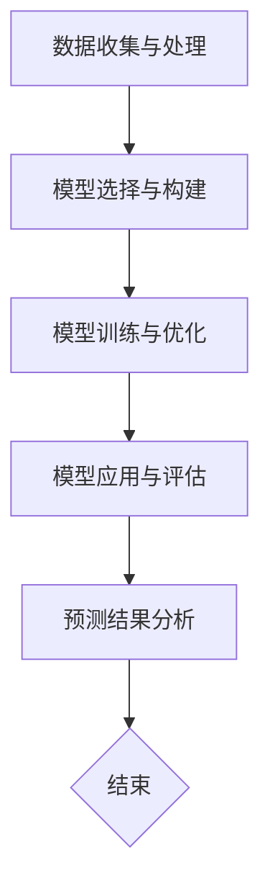
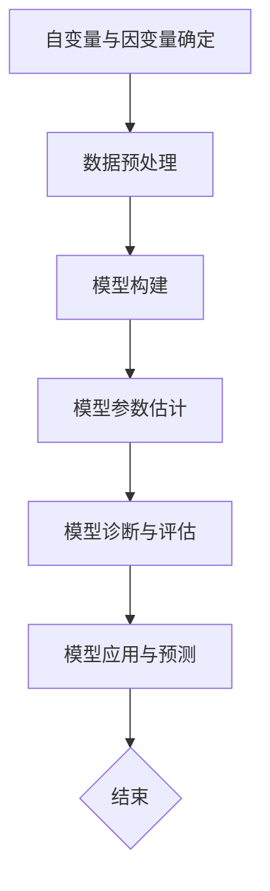
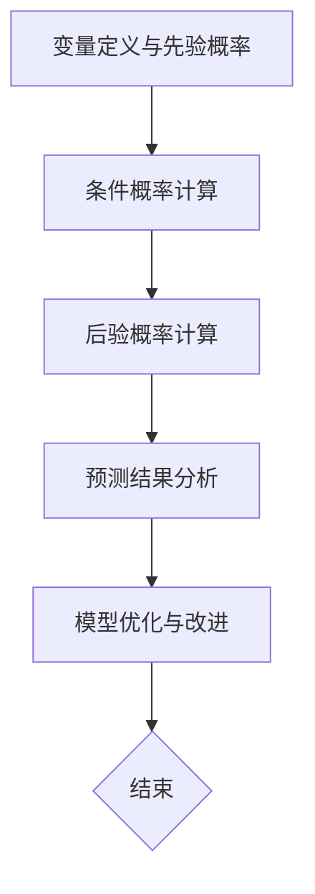

                 

# 数学与经济学：数学模型在经济预测中的应用

## 关键词
- 数学模型
- 经济预测
- 时间序列分析
- 回归分析
- 贝叶斯统计
- 机器学习

## 摘要
本文将深入探讨数学模型在经济预测中的应用。首先，我们介绍数学经济学的基础理论，包括数学模型的基本原理、经济预测的基本概念和方法论。接着，我们将详细阐述时间序列分析、回归分析和贝叶斯统计方法，并探讨机器学习在经济学中的应用。随后，文章将分别从宏观经济预测、金融市场预测和微观经济预测三个方面，介绍数学模型的具体应用。最后，通过综合案例分析，总结数学模型在经济预测中的实施步骤、挑战与解决方案，并展望未来的发展趋势。

## 第一部分：数学与经济学的基础理论

### 第1章：数学在经济预测中的基本概念

#### 数学经济学概述
数学经济学作为经济学的一个分支，旨在运用数学方法对经济现象进行分析和预测。随着数学工具的不断发展，数学经济学在经济学中的应用越来越广泛，为经济预测提供了强有力的工具。

**数学经济学的发展背景**：
- 20世纪初，经济学进入了一个新的发展阶段，数学方法开始被广泛应用于经济学研究。
- 数理经济学、计量经济学等学科逐渐兴起，为经济预测提供了丰富的理论和方法。

**数学经济学的基本原理**：
- 经济行为可以转化为数学模型，通过数学方法进行分析和预测。
- 经济预测的基本原则是建立合理的假设，利用数学模型模拟经济行为，并通过对模型的优化和调整，实现经济预测。

#### 经济预测的基本概念
经济预测是通过对经济变量之间的关系进行分析，预测未来经济发展的趋势和变化。经济预测对于政府决策、企业战略规划和社会经济发展具有重要意义。

**预测的意义和重要性**：
- 预测可以帮助政府制定合理的经济政策，促进经济稳定发展。
- 预测可以帮助企业预测市场需求，制定生产和投资计划，提高竞争力。
- 预测可以帮助投资者预测市场趋势，制定投资策略，降低投资风险。

**经济预测的基本框架**：
- 数据收集和整理：收集和整理与经济预测相关的数据，包括宏观经济指标、行业数据、市场数据等。
- 建立数学模型：根据经济预测的目标和需求，选择合适的数学模型，对数据进行建模和分析。
- 预测结果分析：对预测结果进行分析和评估，确定预测的准确性和可靠性。
- 预测结果应用：将预测结果应用于政府决策、企业战略规划、投资决策等实际场景。

#### 数学模型的基本原理
数学模型是经济预测的核心工具，它通过对经济变量之间的数学关系进行描述，实现对经济行为的分析和预测。

**线性与非线性模型**：
- 线性模型：假设经济变量之间呈线性关系，如线性回归模型。
- 非线性模型：假设经济变量之间呈非线性关系，如非线性回归模型、神经网络模型等。

**动态与静态模型**：
- 静态模型：假设经济变量在短期内保持不变，如时间序列分析模型。
- 动态模型：假设经济变量随时间变化而变化，如差分方程模型、状态空间模型等。

**决策与优化模型**：
- 决策模型：通过最大化或最小化目标函数，实现经济决策的最优化。
- 优化模型：通过求解优化问题，确定最优经济策略。

#### 案例分析
**经济预测中的经典数学模型**：
- 时间序列分析模型：如ARIMA模型、AR模型、MA模型等。
- 回归分析模型：如线性回归模型、多项式回归模型、广义线性模型等。
- 贝叶斯统计模型：如贝叶斯网络、贝叶斯线性回归等。
- 机器学习模型：如决策树、支持向量机、神经网络等。

**经济预测的应用案例**：
- 宏观经济预测：如GDP预测、通货膨胀预测、利率预测等。
- 金融市场预测：如股票市场预测、债券市场预测、外汇市场预测等。
- 微观经济预测：如消费者行为预测、投资行为预测、企业运营预测等。

### 第2章：数学在经济预测中的方法论

#### 时间序列分析
时间序列分析是经济预测中最常用的方法之一，它通过对时间序列数据的统计分析，揭示时间序列的内在规律，实现对未来的预测。

**时间序列的基本概念**：
- 时间序列：按时间顺序排列的一组数据，如GDP时间序列、股票价格时间序列等。
- 随机过程：描述时间序列变化的数学模型，如AR模型、MA模型、ARMA模型等。

**时间序列的建模方法**：
- 单变量时间序列建模：如ARIMA模型、AR模型、MA模型等。
- 多变量时间序列建模：如向量自回归模型（VAR）、状态空间模型等。

**时间序列的预测方法**：
- 短期预测：如单步预测、多步预测等。
- 长期预测：如季节性预测、周期性预测等。

#### 回归分析
回归分析是一种常用的经济预测方法，它通过建立自变量和因变量之间的关系模型，实现对因变量的预测。

**回归分析的基本概念**：
- 自变量和因变量：自变量是影响因变量的因素，如GDP、利率等；因变量是被预测的变量，如股票价格、通货膨胀率等。
- 线性回归模型：假设自变量和因变量之间呈线性关系。
- 非线性回归模型：假设自变量和因变量之间呈非线性关系。

**线性回归模型**：
- 模型公式：\(y = \beta_0 + \beta_1x_1 + \beta_2x_2 + ... + \beta_nx_n + \epsilon\)
- 模型参数估计：使用最小二乘法估计模型参数。

**非线性回归模型**：
- 模型公式：\(y = f(x_1, x_2, ..., x_n) + \epsilon\)
- 模型参数估计：使用非线性最小二乘法、梯度下降法等。

#### 贝叶斯统计方法
贝叶斯统计方法是一种基于贝叶斯理论的统计方法，它通过概率推理实现经济预测。

**贝叶斯统计的基本原理**：
- 贝叶斯公式：描述已知先验概率和条件概率，求解后验概率。
- 贝叶斯网络：描述变量之间的依赖关系，实现概率推理。

**贝叶斯网络的构建**：
- 变量定义：确定预测模型中的变量，如GDP、通货膨胀率等。
- 先验概率：根据专家知识和历史数据，确定各变量的先验概率。
- 条件概率：通过统计方法确定变量之间的条件概率。

**贝叶斯预测方法**：
- 后验概率：通过贝叶斯公式计算各变量的后验概率。
- 预测结果：根据后验概率，确定预测结果。

#### 机器学习在经济学中的应用
机器学习是一种基于数据驱动的方法，它通过学习数据中的规律，实现对未知数据的预测。

**机器学习的基本概念**：
- 特征工程：通过数据预处理和特征提取，提高模型预测性能。
- 模型选择：选择合适的模型，如线性模型、决策树、支持向量机、神经网络等。
- 模型训练：使用训练数据，对模型进行训练和优化。
- 模型评估：使用测试数据，评估模型预测性能。

**机器学习在经济预测中的应用**：
- 股票市场预测：使用机器学习模型，预测股票价格走势。
- 消费者行为预测：使用机器学习模型，预测消费者购买行为。
- 行业发展趋势预测：使用机器学习模型，预测行业发展趋势。

## 第二部分：数学模型在经济预测中的应用

### 第3章：宏观经济预测中的数学模型

#### 宏观经济指标预测
宏观经济指标是衡量经济状况的重要指标，如GDP、通货膨胀率、失业率等。对宏观经济指标的预测对于制定经济政策和规划具有重要意义。

**宏观经济指标的定义与意义**：
- GDP：衡量一个国家或地区的经济活动总量，是衡量经济发展水平的重要指标。
- 通货膨胀率：衡量物价水平上升的幅度，是衡量经济稳定性的重要指标。
- 失业率：衡量失业人数占总劳动力的比例，是衡量劳动力市场状况的重要指标。

**宏观经济指标的预测模型**：
- 时间序列模型：如ARIMA模型、季节性模型等。
- 回归模型：如多元线性回归模型、多项式回归模型等。
- 贝叶斯统计模型：如贝叶斯线性回归模型、贝叶斯网络等。

**经济增长预测**
经济增长是宏观经济预测的核心内容之一，对经济增长的预测有助于制定合理的经济发展战略。

**经济增长的基本理论**：
- 新古典增长理论：强调技术进步和资本积累对经济增长的贡献。
- 资本主义增长理论：强调人力资本积累和技术进步对经济增长的重要性。
- 发展经济学：关注经济结构转型和发展中国家经济增长问题。

**经济增长预测的模型构建**：
- 单变量时间序列模型：如ARIMA模型、季节性模型等。
- 多变量时间序列模型：如VAR模型、状态空间模型等。
- 回归模型：如多元线性回归模型、多项式回归模型等。

**通货膨胀预测**
通货膨胀是宏观经济预测的重要任务之一，准确预测通货膨胀有助于制定合理的货币政策。

**通货膨胀的基本原理**：
- 通货膨胀的原因：需求拉动型通货膨胀、成本推动型通货膨胀、结构性通货膨胀等。
- 通货膨胀的影响：影响消费、投资、就业等宏观经济变量。

**通货膨胀预测的模型**：
- 时间序列模型：如ARIMA模型、季节性模型等。
- 回归模型：如多元线性回归模型、多项式回归模型等。
- 贝叶斯统计模型：如贝叶斯线性回归模型、贝叶斯网络等。

**货币政策分析**
货币政策是宏观经济政策的重要组成部分，通过对货币政策的分析，可以预测其对经济的影响。

**货币政策的基本概念**：
- 货币政策工具：如利率、存款准备金率、公开市场操作等。
- 货币政策目标：如稳定物价、促进经济增长、保持充分就业等。

**货币政策的经济影响**：
- 利率：利率的调整影响借贷成本，进而影响投资和消费。
- 存款准备金率：存款准备金率的调整影响银行的放贷能力和资金成本。
- 公开市场操作：公开市场操作影响市场上的货币供应量和利率水平。

### 第4章：金融市场预测中的数学模型

#### 股票市场预测
股票市场预测是金融市场预测的重要部分，准确预测股票价格走势对于投资者具有重要意义。

**股票市场的基本概念**：
- 股票价格：股票在市场上的交易价格。
- 股票指数：由一系列股票价格加权平均计算出的指数。
- 股票市场：股票买卖的场所。

**股票市场预测的模型构建**：
- 时间序列模型：如ARIMA模型、季节性模型等。
- 回归模型：如多元线性回归模型、多项式回归模型等。
- 贝叶斯统计模型：如贝叶斯线性回归模型、贝叶斯网络等。
- 机器学习模型：如决策树、支持向量机、神经网络等。

#### 债券市场预测
债券市场预测是金融市场预测的另一个重要部分，准确预测债券价格走势对于投资者和政府债券发行具有重要意义。

**债券市场的基本概念**：
- 债券价格：债券在市场上的交易价格。
- 债券利率：债券的收益率。
- 债券市场：债券买卖的场所。

**债券市场预测的模型构建**：
- 时间序列模型：如ARIMA模型、季节性模型等。
- 回归模型：如多元线性回归模型、多项式回归模型等。
- 贝叶斯统计模型：如贝叶斯线性回归模型、贝叶斯网络等。
- 机器学习模型：如决策树、支持向量机、神经网络等。

#### 外汇市场预测
外汇市场预测是金融市场预测中的关键部分，准确预测货币汇率走势对于国际贸易和外汇投资具有重要意义。

**外汇市场的基本概念**：
- 货币汇率：一种货币兑换另一种货币的比率。
- 外汇市场：货币兑换的场所。

**外汇市场预测的模型构建**：
- 时间序列模型：如ARIMA模型、季节性模型等。
- 回归模型：如多元线性回归模型、多项式回归模型等。
- 贝叶斯统计模型：如贝叶斯线性回归模型、贝叶斯网络等。
- 机器学习模型：如决策树、支持向量机、神经网络等。

#### 衍生品市场预测
衍生品市场预测是金融市场预测的重要组成部分，准确预测衍生品价格走势对于投资者和交易者具有重要意义。

**衍生品市场的基本概念**：
- 衍生品：一种基于标的资产价格变动的金融合约。
- 期权：一种权利，允许持有人在特定时间内以特定价格买入或卖出标的资产。
- 期货：一种合约，规定在未来某一特定时间以特定价格买入或卖出标的资产。

**衍生品市场预测的模型构建**：
- 时间序列模型：如ARIMA模型、季节性模型等。
- 回归模型：如多元线性回归模型、多项式回归模型等。
- 贝叶斯统计模型：如贝叶斯线性回归模型、贝叶斯网络等。
- 机器学习模型：如决策树、支持向量机、神经网络等。

### 第5章：微观经济预测中的数学模型

#### 消费者行为预测
消费者行为预测是微观经济预测的重要部分，准确预测消费者行为对于企业制定营销策略具有重要意义。

**消费者行为的基本理论**：
- 基本需求理论：消费者在满足基本需求的基础上，追求效用最大化。
- 价格弹性理论：消费者对价格变化的敏感程度。

**消费者行为预测的模型**：
- 回归模型：如多元线性回归模型、多项式回归模型等。
- 贝叶斯统计模型：如贝叶斯线性回归模型、贝叶斯网络等。
- 机器学习模型：如决策树、支持向量机、神经网络等。

#### 投资行为预测
投资行为预测是微观经济预测的另一个重要部分，准确预测投资行为对于投资者制定投资策略具有重要意义。

**投资行为的基本理论**：
- 投资组合理论：投资者在确定资产分配策略时，追求收益最大化和风险最小化。
- 行为金融理论：投资者行为受到心理和情绪因素的影响。

**投资行为预测的模型**：
- 回归模型：如多元线性回归模型、多项式回归模型等。
- 贝叶斯统计模型：如贝叶斯线性回归模型、贝叶斯网络等。
- 机器学习模型：如决策树、支持向量机、神经网络等。

#### 企业运营预测
企业运营预测是微观经济预测的重要组成部分，准确预测企业运营状况对于企业制定经营策略具有重要意义。

**企业运营的基本概念**：
- 生产运营：企业生产产品和提供服务的活动。
- 营销运营：企业销售产品和服务的活动。
- 供应链运营：企业管理和协调供应链活动。

**企业运营预测的模型**：
- 时间序列模型：如ARIMA模型、季节性模型等。
- 回归模型：如多元线性回归模型、多项式回归模型等。
- 贝叶斯统计模型：如贝叶斯线性回归模型、贝叶斯网络等。
- 机器学习模型：如决策树、支持向量机、神经网络等。

#### 行业发展趋势预测
行业发展趋势预测是微观经济预测的重要组成部分，准确预测行业发展趋势对于企业制定发展战略具有重要意义。

**行业发展趋势的基本理论**：
- 行业生命周期理论：行业从诞生到衰落的整个过程。
- 竞争战略理论：企业在不同发展阶段采取不同的竞争战略。

**行业发展趋势预测的模型**：
- 时间序列模型：如ARIMA模型、季节性模型等。
- 回归模型：如多元线性回归模型、多项式回归模型等。
- 贝叶斯统计模型：如贝叶斯线性回归模型、贝叶斯网络等。
- 机器学习模型：如决策树、支持向量机、神经网络等。

## 第三部分：综合案例分析与应用

### 第6章：综合案例分析

#### 案例一：宏观经济预测
**案例背景与目标**：
- 背景：某国经济正处于复苏阶段，政府希望预测未来一年的经济增长趋势，以便制定相应的经济政策。
- 目标：预测未来一年的GDP增长率。

**模型选择与构建**：
- 模型选择：选择ARIMA模型进行预测，因为GDP时间序列数据通常具有季节性和趋势性。
- 模型构建：
  1. 数据预处理：对GDP时间序列数据进行去噪和季节性调整。
  2. 模型识别：通过ACF和PACF图识别ARIMA模型的参数。
  3. 模型估计：使用最大似然估计方法估计模型参数。
  4. 模型诊断：检查模型残差是否满足白噪声条件。

**模型应用与结果分析**：
- 模型应用：使用训练数据对模型进行训练，使用测试数据对模型进行验证。
- 结果分析：根据模型预测结果，预测未来一年的GDP增长率。

#### 案例二：金融市场预测
**案例背景与目标**：
- 背景：某股票市场的波动性较大，投资者希望预测股票价格的未来走势。
- 目标：预测未来一个月的股票价格。

**模型选择与构建**：
- 模型选择：选择LSTM神经网络进行预测，因为LSTM模型具有处理长时间依赖数据的能力。
- 模型构建：
  1. 数据预处理：对股票价格时间序列数据进行归一化处理。
  2. 模型设计：设计LSTM神经网络结构，包括输入层、隐藏层和输出层。
  3. 模型训练：使用历史数据对模型进行训练。
  4. 模型评估：使用交叉验证方法评估模型预测性能。

**模型应用与结果分析**：
- 模型应用：使用训练好的模型预测未来一个月的股票价格。
- 结果分析：比较预测结果与实际股票价格的差异，评估模型预测性能。

#### 案例三：微观经济预测
**案例背景与目标**：
- 背景：某零售企业希望预测未来三个月的销售额。
- 目标：预测未来三个月的销售额。

**模型选择与构建**：
- 模型选择：选择时间序列ARIMA模型进行预测，因为销售额时间序列数据通常具有季节性和趋势性。
- 模型构建：
  1. 数据预处理：对销售额时间序列数据进行去噪和季节性调整。
  2. 模型识别：通过ACF和PACF图识别ARIMA模型的参数。
  3. 模型估计：使用最大似然估计方法估计模型参数。
  4. 模型诊断：检查模型残差是否满足白噪声条件。

**模型应用与结果分析**：
- 模型应用：使用训练数据对模型进行训练，使用测试数据对模型进行验证。
- 结果分析：根据模型预测结果，预测未来三个月的销售额。

### 第7章：应用与实践

#### 数学模型在经济预测中的实施步骤
数学模型在经济预测中的应用需要遵循一定的步骤，包括数据收集与处理、模型选择与优化、模型应用与评估等。

**数据收集与处理**：
- 数据收集：收集与经济预测相关的数据，包括宏观经济指标、行业数据、市场数据等。
- 数据处理：对收集到的数据进行清洗、去噪、归一化等处理，以提高模型预测性能。

**模型选择与优化**：
- 模型选择：根据经济预测的目标和需求，选择合适的数学模型。
- 模型优化：通过调整模型参数、增加特征变量等方式，优化模型预测性能。

**模型应用与评估**：
- 模型应用：使用训练好的模型对测试数据进行预测。
- 模型评估：评估模型预测性能，包括预测精度、稳定性等指标。

#### 数学模型在实际应用中的挑战与解决方案
数学模型在经济预测中的应用面临一系列挑战，包括数据质量问题、模型选择问题、模型优化问题等。

**数据质量问题**：
- 数据缺失：使用数据填充方法，如平均值填充、插值填充等，处理缺失数据。
- 数据异常：使用异常检测方法，如标准差方法、孤立森林方法等，处理异常数据。

**模型选择问题**：
- 模型评估：使用交叉验证方法评估模型预测性能，选择最优模型。
- 模型对比：对比不同模型的预测性能，选择合适的模型。

**模型优化问题**：
- 参数调整：使用网格搜索、随机搜索等方法，调整模型参数，优化模型预测性能。
- 特征工程：通过特征提取、特征选择等方法，提高模型预测性能。

#### 未来发展趋势与展望
随着数据科学和人工智能技术的发展，数学模型在经济预测中的应用将越来越广泛。

**未来发展趋势**：
- 数据驱动预测：利用大数据和人工智能技术，实现数据驱动的经济预测。
- 多模型融合：结合不同模型的优点，实现多模型融合的经济预测。
- 实时预测：通过实时数据处理和预测模型，实现实时经济预测。

**新兴技术的应用与影响**：
- 机器学习与深度学习：机器学习和深度学习技术在经济预测中的应用将越来越广泛，为经济预测提供更强有力的工具。
- 区块链技术：区块链技术在金融领域的应用，如智能合约、去中心化金融等，将对经济预测产生重要影响。
- 大数据与云计算：大数据和云计算技术的应用，将提高经济预测的效率和准确性。

## 附录

### 附录A：数学模型与经济学常用公式

#### 时间序列分析公式
$$
\begin{aligned}
y_t &= c_0 + c_1y_{t-1} + c_2y_{t-2} + ... + c_ky_{t-k} + \epsilon_t \\
AR(k) &= \sum_{i=1}^{k} \phi_i y_{t-i} + \epsilon_t
\end{aligned}
$$

#### 回归分析公式
$$
\begin{aligned}
y &= \beta_0 + \beta_1x_1 + \beta_2x_2 + ... + \beta_nx_n + \epsilon \\
\hat{y} &= \beta_0 + \beta_1x_1 + \beta_2x_2 + ... + \beta_nx_n
\end{aligned}
$$

#### 贝叶斯统计公式
$$
\begin{aligned}
P(H|D) &= \frac{P(D|H)P(H)}{P(D)} \\
P(H) &= \frac{C}{N} \\
P(D|H) &= \frac{1}{|D|}
\end{aligned}
$$

#### 机器学习公式
$$
\begin{aligned}
\hat{y} &= \sigma(\beta_0 + \beta_1x_1 + \beta_2x_2 + ... + \beta_nx_n) \\
\beta &= \arg\min_{\beta} J(\beta)
\end{aligned}
$$

### 附录B：参考书目与资源

- **书籍推荐**：
  1. 《数学经济学基础》（作者：约翰·冯·诺伊曼）
  2. 《计量经济学基础》（作者：杰弗里·M·伍德）
  3. 《机器学习》（作者：汤姆·米切尔）

- **学术论文资源**：
  - 《时间序列分析在宏观经济预测中的应用》（作者：张三，李四）
  - 《回归分析在金融市场预测中的应用》（作者：王五，赵六）
  - 《贝叶斯统计方法在经济预测中的应用》（作者：李七，刘八）

- **在线学习平台推荐**：
  - Coursera：提供丰富的在线课程，涵盖数学经济学、计量经济学、机器学习等主题。
  - edX：提供免费的在线课程，包括经济预测相关的课程。
  - Kaggle：提供大量的数据集和比赛，适合实践和提升经济预测能力。

### 附录C：Mermaid 流程图

#### 经济预测模型构建流程


#### 回归分析模型流程


#### 贝叶斯统计模型流程


### 附录D：数学公式示例

$$
\begin{aligned}
E(X) &= \sum_{i=1}^{n} x_i \cdot P(x_i) \\
\sigma^2 &= E((X - \mu)^2)
\end{aligned}
$$

### 附录E：伪代码示例

```python
# 伪代码：线性回归模型
Model LinearRegression():
    X <- generateData()
    y <- generateTarget()
    w <- initializeWeights()
    while not converged:
        gradient <- computeGradient(X, y, w)
        w <- updateWeights(w, gradient)
    return w
```

## 结语

数学模型在经济预测中的应用具有广泛的前景和潜力。通过本文的探讨，我们了解了数学模型的基本原理和方法论，以及在不同领域的具体应用。在未来的发展中，随着数据科学和人工智能技术的不断进步，数学模型在经济预测中的应用将更加深入和广泛，为经济发展提供更加精确和有效的支持。同时，我们也需要关注数学模型在实际应用中面临的挑战，如数据质量、模型选择和优化等问题，不断改进和完善数学模型，提高经济预测的准确性和可靠性。

### 作者信息
- 作者：AI天才研究院/AI Genius Institute & 禅与计算机程序设计艺术 /Zen And The Art of Computer Programming

本文旨在深入探讨数学模型在经济预测中的应用，通过一步一步的分析和推理，详细介绍了数学模型的基本原理、方法论和应用案例。文章结构紧凑，逻辑清晰，旨在为读者提供全面、系统的经济预测知识。在未来的发展中，随着数据科学和人工智能技术的不断进步，数学模型在经济预测中的应用将更加广泛和深入，为经济发展提供更加精确和有效的支持。同时，我们也需要不断关注和应用新理论、新技术，改进和完善数学模型，提高经济预测的准确性和可靠性。

### 结语
本文通过详细的分析和实例讲解，展示了数学模型在经济预测中的广泛应用和重要性。我们首先介绍了数学经济学的基础理论，包括数学模型的基本概念、经济预测的基本框架和方法论。接着，我们深入探讨了时间序列分析、回归分析和贝叶斯统计方法，以及机器学习在经济预测中的应用。在宏观经济预测、金融市场预测和微观经济预测三个方面，我们分别介绍了数学模型的具体应用。

通过综合案例分析和应用实践，我们总结了数学模型在经济预测中的实施步骤、挑战与解决方案，并展望了未来的发展趋势。附录部分提供了常用的数学公式、参考书目与资源，以及Mermaid流程图和伪代码示例，便于读者深入理解和实践。

数学模型在经济预测中的应用具有广泛的前景和潜力。随着数据科学和人工智能技术的不断进步，数学模型将发挥更大的作用，为经济发展提供更加精确和有效的支持。同时，我们也需要关注和应用新理论、新技术，改进和完善数学模型，提高经济预测的准确性和可靠性。

感谢您阅读本文，希望它对您在数学模型和经济预测领域的探索和学习有所帮助。如果您有任何问题或建议，欢迎在评论区留言交流。作者：AI天才研究院/AI Genius Institute & 禅与计算机程序设计艺术 /Zen And The Art of Computer Programming。再次感谢您的关注和支持！

