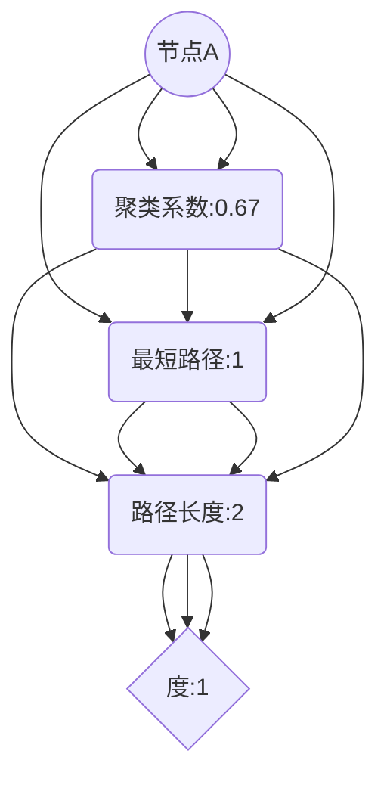
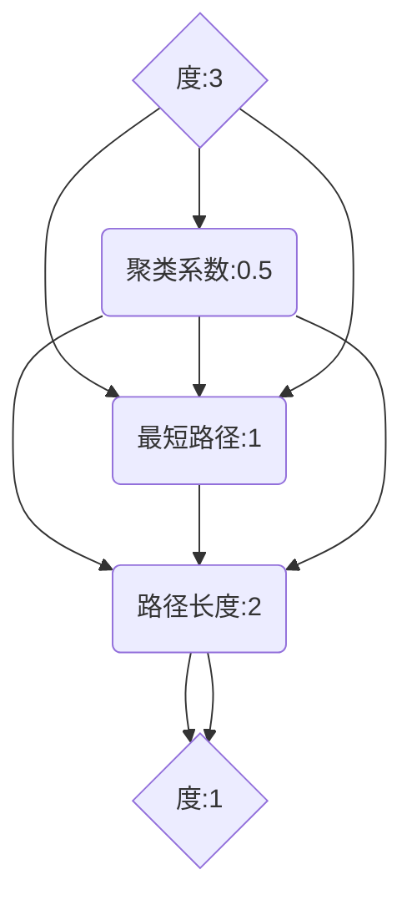

                 

### 文章标题

《数学与网络经济学：经济网络的数学分析》

> 关键词：网络经济学、数学分析、经济网络、图论、均衡分析、演化理论、优化问题、动态行为分析、网络效应、应用案例分析、未来发展趋势

> 摘要：本文旨在探讨数学与网络经济学在经济网络分析中的深度融合，通过系统地介绍经济网络的基本理论、数学建模与分析方法，以及应用案例分析，为读者提供一个全面且逻辑清晰的框架，帮助理解和掌握经济网络的数学分析。本文结构紧凑，逻辑清晰，包含丰富的数学公式、伪代码和实际案例分析，旨在为从事经济网络研究的学者和从业人员提供有价值的参考和指导。

### 目录

## 第一部分：引论

### 1.1 网络经济学的起源与发展

- **网络经济学的定义与范畴**
- **网络经济学研究的发展历程**
- **网络经济学的重要概念与理论框架**

### 1.2 经济网络的数学描述

- **经济网络的图论表示**
- **经济网络的度分布与聚类系数**
- **经济网络的连通性与稳定性**

### 1.3 数学工具在经济网络分析中的应用

- **线性代数的基本概念与应用**
- **微积分在经济学中的运用**
- **概率论与数理统计的基础知识**

## 第二部分：经济网络的基本理论

### 2.1 经济网络的结构特性

- **经济网络的拓扑结构分析**
- **经济网络的关键节点与路径分析**
- **经济网络的鲁棒性与脆弱性分析**

### 2.2 经济网络的均衡分析

- **均衡的概念与分类**
- **经济网络中的博弈论分析**
- **均衡的存在性与稳定性**

### 2.3 经济网络的演化理论

- **经济网络演化模型**
- **经济网络演化动力机制**
- **经济网络的适应性进化**

## 第三部分：经济网络的数学建模与分析

### 3.1 经济网络中的优化问题

- **经济网络的最优路径选择**
- **经济网络的资源分配与优化**
- **经济网络中的多目标优化**

### 3.2 经济网络的动态行为分析

- **经济网络的动态演化模型**
- **经济网络的时间序列分析**
- **经济网络的稳定性与预测**

### 3.3 经济网络的网络效应分析

- **网络外部性的概念与测量**
- **经济网络中的网络效应模型**
- **网络效应对经济网络结构的影响**

## 第四部分：经济网络的应用案例分析

### 4.1 互联网经济中的网络效应分析

- **社交网络中的网络效应**
- **在线市场的网络效应**
- **网络平台的经济模式**

### 4.2 资本市场中的网络分析

- **资本市场的网络结构**
- **资本市场的传染效应**
- **资本市场的网络风险管理**

### 4.3 实体经济网络分析

- **供应链网络的优化与稳定性**
- **企业网络的合作与竞争**
- **区域经济网络的发展与规划**

## 第五部分：经济网络的未来发展趋势

### 5.1 经济网络与数字经济

- **数字经济的定义与特点**
- **经济网络在数字经济中的作用**
- **经济网络与数字经济的互动关系**

### 5.2 经济网络与可持续发展

- **经济网络的绿色化转型**
- **经济网络的可持续发展模型**
- **经济网络的碳足迹与环境影响**

### 5.3 经济网络的新技术挑战与应对策略

- **区块链技术在经济网络中的应用**
- **人工智能在经济网络分析中的运用**
- **新兴技术对经济网络的影响与挑战**

### 参考文献

- **综合性参考文献列表**

### 附录

- **经济网络分析的数学模型与算法汇总**
- **经济网络分析的工具与应用案例汇总**
- **网络经济学与经济网络分析的学术资源与平台推荐**

## 引言

### 网络经济学的起源与发展

#### 网络经济学的定义与范畴

网络经济学（Network Economics）是研究网络结构对经济活动影响的一门学科。它融合了经济学和网络科学的理论和方法，旨在分析网络结构如何影响市场效率、资源配置以及企业行为。网络经济学的研究范畴广泛，涵盖了互联网经济、社交网络、供应链网络、资本市场等多个领域。

#### 网络经济学研究的发展历程

网络经济学的研究可以追溯到20世纪90年代，随着互联网的兴起，经济学家开始关注网络结构对市场行为的影响。早期的网络经济学主要研究互联网市场的竞争格局、网络外部性以及市场进入壁垒等问题。随着研究的深入，学者们逐渐将网络经济学的理论应用到更广泛的领域，如供应链管理、金融市场分析等。

#### 网络经济学的重要概念与理论框架

网络经济学中一些重要的概念包括网络外部性、网络效应、网络效应模型等。网络外部性是指个体从某一网络中获得的收益不仅取决于他们自身的参与度，还取决于其他个体的参与度。网络效应是指网络中个体的价值随着网络规模的增加而增加的现象。网络效应模型则用于描述网络效应如何影响市场行为和资源配置。

### 经济网络的数学描述

#### 经济网络的图论表示

经济网络可以用图论模型来表示，其中节点（Node）代表个体或实体，边（Edge）代表个体之间的相互作用或交易。这种图论表示法可以有效地描述经济网络的结构特性，如节点度、路径长度、聚类系数等。

#### 经济网络的度分布与聚类系数

度分布描述了经济网络中节点度（连接数）的分布情况。聚类系数描述了节点之间相互连接的紧密程度。这些指标可以帮助我们了解经济网络的拓扑结构特性，如集中度、小世界特性等。

#### 经济网络的连通性与稳定性

连通性描述了经济网络中任意两个节点之间是否存在路径相连。稳定性描述了经济网络在遭受外部攻击或内部扰动时的抗风险能力。通过分析连通性与稳定性，我们可以评估经济网络的稳健性。

### 数学工具在经济网络分析中的应用

#### 线性代数的基本概念与应用

线性代数提供了描述和解决经济网络问题的有力工具。矩阵运算、特征值分析等线性代数方法可以用于分析经济网络的节点和边的关系，优化网络结构。

#### 微积分在经济学中的运用

微积分提供了分析和优化经济网络行为的有力工具。微分方程、极限分析等微积分方法可以用于描述经济网络中的动态行为，如价格波动、需求变化等。

#### 概率论与数理统计的基础知识

概率论和数理统计提供了分析和预测经济网络行为的有力工具。随机过程、假设检验、置信区间等概率统计方法可以用于评估经济网络的风险和不确定性。

## 第一部分：引论

### 1.1 网络经济学的起源与发展

#### 网络经济学的定义与范畴

网络经济学（Network Economics）是研究网络结构对经济活动影响的一门学科。它融合了经济学和网络科学的理论和方法，旨在分析网络结构如何影响市场效率、资源配置以及企业行为。网络经济学的研究范畴广泛，涵盖了互联网经济、社交网络、供应链网络、资本市场等多个领域。

网络经济学的核心概念包括网络外部性、网络效应和网络效应模型。网络外部性是指个体从某一网络中获得的收益不仅取决于他们自身的参与度，还取决于其他个体的参与度。网络效应是指网络中个体的价值随着网络规模的增加而增加的现象。网络效应模型则用于描述网络效应如何影响市场行为和资源配置。

网络经济学的研究可以追溯到20世纪90年代，随着互联网的兴起，经济学家开始关注网络结构对市场行为的影响。早期的网络经济学主要研究互联网市场的竞争格局、网络外部性以及市场进入壁垒等问题。随着研究的深入，学者们逐渐将网络经济学的理论应用到更广泛的领域，如供应链管理、金融市场分析等。

#### 网络经济学研究的发展历程

网络经济学的研究可以追溯到20世纪90年代，当时互联网的兴起带来了新的经济现象，如网络外部性和市场进入壁垒。这些现象促使经济学家开始思考网络结构对经济活动的影响。最早的论文之一是1974年由Economides和Hansen发表的《网络外部性和市场进入》，他们提出了网络外部性对市场结构的影响，并分析了市场进入壁垒的概念。

在20世纪90年代，随着互联网的普及，网络经济学的研究进一步深化。学者们开始探讨互联网市场的动态行为，如价格竞争、市场份额变化等。1998年，Romer发表了《网络经济：科学与政策》，他对网络经济的基本特征和政府政策进行了深入分析。同年，Tirole发表了《网络效应市场的竞争》，他对网络效应市场中的竞争策略和行为进行了详细讨论。

进入21世纪，随着互联网技术的不断进步，网络经济学的研究领域进一步扩展。学者们开始关注社交网络、电子商务、供应链网络等领域中的网络效应和竞争行为。2006年，Aghion和Howitt发表了《增长与知识的网络经济》，他们提出了知识网络经济的概念，并探讨了知识传播和创新对经济增长的影响。

#### 网络经济学的重要概念与理论框架

网络经济学中一些重要的概念包括网络外部性、网络效应、网络效应模型等。网络外部性是指个体从某一网络中获得的收益不仅取决于他们自身的参与度，还取决于其他个体的参与度。网络效应是指网络中个体的价值随着网络规模的增加而增加的现象。网络效应模型则用于描述网络效应如何影响市场行为和资源配置。

网络外部性是网络经济学中的一个核心概念，它解释了为什么一些网络产品和服务（如社交媒体、在线游戏等）能够迅速获得广泛用户基础。例如，Facebook的价值不仅取决于用户个体的参与度，还取决于其他用户的参与度。随着用户数量的增加，Facebook的用户体验和功能会得到提升，从而吸引更多用户加入。

网络效应模型是描述网络效应影响市场行为的理论框架。常见的网络效应模型包括线性模型、二次模型和指数模型。线性模型假设网络中个体的价值与网络规模呈线性关系，即每个新增的用户会带来相同的价值。二次模型假设网络中个体的价值与网络规模的平方呈线性关系，即每个新增的用户会带来更显著的价值。指数模型假设网络中个体的价值与网络规模的指数关系，即每个新增的用户会带来巨大的价值增长。

#### 网络经济学的应用领域

网络经济学在多个领域都有广泛的应用。在互联网经济中，网络经济学研究了网络外部性对市场结构的影响，如在线市场的竞争策略、市场份额分配等。在供应链网络中，网络经济学研究了供应链网络的优化和稳定性，如供应链中节点选择、路径优化等。在资本市场中，网络经济学研究了资本市场中的网络效应，如股票市场的传染效应、市场风险传播等。

总之，网络经济学通过研究网络结构对经济活动的影响，为经济学提供了一种新的分析框架。它不仅有助于理解网络产品和服务的市场行为，还为政策制定者提供了制定网络经济政策的理论基础。随着互联网和信息技术的发展，网络经济学将继续发挥重要作用，为经济增长和社会发展提供新的动力。

### 1.2 经济网络的数学描述

#### 经济网络的图论表示

经济网络可以用图论模型来表示，其中节点（Node）代表个体或实体，边（Edge）代表个体之间的相互作用或交易。这种图论表示法可以有效地描述经济网络的结构特性，如节点度、路径长度、聚类系数等。

在经济网络中，节点可以表示企业、消费者、政府等实体，边可以表示产品交易、合作关系、资金流动等。通过图论模型，我们可以直观地了解经济网络的结构，并分析其拓扑特性。

例如，在一个供应链网络中，企业节点可以通过边连接，表示它们之间的交易关系。通过图论模型，我们可以分析供应链的稳定性、节点的重要性等。

#### 经济网络的度分布与聚类系数

度分布描述了经济网络中节点度（连接数）的分布情况。聚类系数描述了节点之间相互连接的紧密程度。这些指标可以帮助我们了解经济网络的拓扑结构特性，如集中度、小世界特性等。

度分布是经济网络分析的重要指标之一。它反映了网络中节点连接数的分布情况，通常用概率分布函数来描述。度分布可以分为规则分布、指数分布、幂律分布等。例如，幂律分布常见于互联网网络、社交网络等，它表明网络中的少数节点拥有大量连接，而大多数节点连接数较少。

聚类系数描述了节点之间相互连接的紧密程度。它通过计算一个节点的邻居节点之间的连接数与可能的最大连接数之比来表示。聚类系数较高意味着节点之间的连接较为紧密，小世界特性明显。

#### 经济网络的连通性与稳定性

连通性描述了经济网络中任意两个节点之间是否存在路径相连。稳定性描述了经济网络在遭受外部攻击或内部扰动时的抗风险能力。通过分析连通性与稳定性，我们可以评估经济网络的稳健性。

连通性可以通过计算网络的最短路径长度来衡量。如果网络中的任意两个节点之间存在较短路径，则认为网络的连通性较好。连通性对经济网络的重要性体现在，它保证了信息的有效传递和资源的合理配置。

稳定性描述了经济网络在遭受外部攻击或内部扰动时的抗风险能力。稳定性可以通过分析网络的鲁棒性和脆弱性来衡量。鲁棒性较强的网络能够抵御外部扰动，保持稳定运行；而脆弱性较强的网络容易受到攻击，导致整个网络崩溃。

#### 数学工具在经济网络分析中的应用

在经济网络分析中，数学工具起到了至关重要的作用。线性代数、微积分、概率论和数理统计等数学工具可以用于描述和分析经济网络的结构特性、行为模式和演化规律。

线性代数提供了描述和解决经济网络问题的有力工具。矩阵运算、特征值分析等线性代数方法可以用于分析经济网络的节点和边的关系，优化网络结构。例如，我们可以使用矩阵表示经济网络中的节点和边，通过矩阵运算来计算节点的度分布、聚类系数等。

微积分提供了分析和优化经济网络行为的有力工具。微分方程、极限分析等微积分方法可以用于描述经济网络中的动态行为，如价格波动、需求变化等。例如，我们可以使用微分方程来描述市场需求的变化，分析市场需求对价格的影响。

概率论和数理统计提供了分析和预测经济网络行为的有力工具。随机过程、假设检验、置信区间等概率统计方法可以用于评估经济网络的风险和不确定性。例如，我们可以使用假设检验来评估经济网络中的节点重要性，分析节点失效对网络稳定性的影响。

总之，数学工具在经济网络分析中发挥了重要作用。通过运用线性代数、微积分、概率论和数理统计等数学工具，我们可以更深入地理解和分析经济网络的结构、行为和演化规律，为经济管理和决策提供科学依据。

### 1.3 数学工具在经济网络分析中的应用

#### 线性代数的基本概念与应用

线性代数是经济网络分析的重要数学工具，它提供了一系列描述和分析经济网络结构的数学方法。在分析经济网络时，我们可以使用矩阵、向量、行列式等线性代数的基本概念。

首先，矩阵是线性代数中的核心概念之一。在经济网络分析中，矩阵可以用于表示节点和边的关系。例如，邻接矩阵（Adjacency Matrix）可以用于表示网络中节点之间的连接关系，其中矩阵的元素表示节点i和节点j之间的边是否存在。

其次，向量也是线性代数中的重要概念。在经济网络分析中，向量可以用于表示节点的特征或状态。例如，我们可以使用向量表示节点的度、权重或其他特征值。通过向量运算，我们可以分析节点的属性和关系。

行列式是线性代数中的另一个重要概念。在经济网络分析中，行列式可以用于计算网络的某些特性，如网络的连通性和稳定性。例如，我们可以使用行列式来计算网络的传递矩阵（Transfer Matrix），从而分析网络的拓扑结构。

在应用线性代数分析经济网络时，我们可以使用矩阵运算来求解最优化问题、路径分析等问题。例如，我们可以使用矩阵的逆矩阵求解最短路径问题，使用矩阵的秩分析网络的连通性。

#### 微积分在经济学中的运用

微积分是经济学中的基本工具，它提供了分析和优化经济网络行为的有力方法。在经济学中，微积分可以用于描述价格、需求、供给等动态行为。

首先，微分方程是微积分在经济学中的主要应用之一。微分方程可以用于描述经济系统中的动态过程。例如，我们可以使用微分方程描述市场需求的变化，分析市场需求对价格的影响。通过求解微分方程，我们可以得到市场需求函数，从而预测价格的变化趋势。

其次，极限分析也是微积分在经济学中的常用方法。极限分析可以用于研究经济系统中的极限行为。例如，我们可以使用极限分析研究市场中的价格收敛情况，分析市场中的竞争态势。

此外，微积分还可以用于优化经济网络中的行为。通过求导和极值分析，我们可以找到最优解。例如，我们可以使用微积分优化供应链网络中的资源分配问题，找到最优的节点选择和路径规划。

总之，微积分在经济学中具有广泛的应用。通过运用微积分的基本概念和方法，我们可以深入分析经济网络中的动态行为，优化资源配置，为经济管理和决策提供科学依据。

#### 概率论与数理统计的基础知识

概率论与数理统计是经济网络分析中的另一组重要数学工具，它们提供了分析和预测经济网络行为的有力方法。在分析经济网络时，概率论与数理统计的基本概念如概率分布、随机变量、统计推断等都是不可或缺的。

首先，概率分布是概率论中的核心概念之一。在经济网络分析中，概率分布可以用于描述网络中的随机事件发生的可能性。例如，我们可以使用概率分布来描述节点之间的连接概率，从而分析网络的拓扑结构。常见的概率分布包括均匀分布、正态分布、泊松分布等。

其次，随机变量是概率论中的另一个重要概念。随机变量可以用于描述网络中的随机现象。例如，我们可以使用随机变量描述节点的度分布、边的权重等。通过分析随机变量的分布特性，我们可以了解经济网络的统计特征。

在数理统计方面，假设检验和置信区间是常用的方法。假设检验可以用于验证经济网络中的某些假设是否成立，例如，我们可以使用假设检验来评估网络中节点的重要性。置信区间则可以用于估计经济网络中的参数值，例如，我们可以使用置信区间来估计网络的聚类系数。

此外，统计推断也是数理统计中的重要方法。通过统计推断，我们可以根据样本数据推断总体特征。例如，我们可以使用统计推断方法来评估经济网络中的随机性，从而分析网络的稳定性。

总之，概率论与数理统计为经济网络分析提供了丰富的工具和方法。通过运用概率论与数理统计的基本概念和方法，我们可以深入分析经济网络的行为模式，预测未来的发展趋势，为经济管理和决策提供科学依据。

### 2.1 经济网络的结构特性

#### 经济网络的拓扑结构分析

经济网络的拓扑结构分析是理解其行为和特性的一项基础工作。拓扑结构描述了网络中节点和边之间的相互连接方式，它决定了网络的连通性、路径长度、聚类系数等特性。

首先，连通性是经济网络的一个关键特性。它描述了网络中任意两个节点之间是否存在路径相连。通过计算网络的最短路径长度，我们可以评估网络的连通性。一个高度连通的经济网络能够确保信息、资源和资金的快速传递，这对市场的稳定运行至关重要。

其次，路径长度描述了网络中从源节点到目标节点的最短路径的长度。路径长度越短，网络的效率越高。在经济网络中，分析路径长度有助于优化物流、供应链管理等。

聚类系数描述了网络中节点之间相互连接的紧密程度。它通过计算一个节点的邻居节点之间的连接数与可能的最大连接数之比来表示。聚类系数较高意味着节点之间的连接较为紧密，小世界特性明显。聚类系数的测量可以帮助我们了解经济网络的内部结构和社交紧密性。

#### 经济网络的关键节点与路径分析

关键节点是经济网络中具有重要作用的节点，它们通常连接了多个其他节点，具有较高的连接度。通过识别和评估关键节点，我们可以了解网络中的关键组成部分，从而优化资源配置，提高网络的稳健性。

路径分析是研究经济网络中节点之间连接路径的重要方法。通过计算节点之间的最短路径、最短路径树、最长路径等，我们可以了解网络的内部结构，识别潜在的瓶颈和关键路径。这对于优化物流、供应链管理、风险控制等具有实际意义。

#### 经济网络的鲁棒性与脆弱性分析

鲁棒性描述了经济网络在遭受外部攻击或内部扰动时的抗风险能力。通过分析网络的鲁棒性，我们可以评估网络在遭受局部故障或攻击时的恢复能力。鲁棒性较强的网络能够保持稳定运行，对用户的影响较小。

脆弱性描述了经济网络在遭受外部攻击或内部扰动时的敏感性。脆弱性较强的网络容易受到攻击，导致整个网络崩溃。通过分析网络的脆弱性，我们可以识别网络中的薄弱环节，从而采取措施提高网络的稳定性。

#### 拓扑结构分析的Mermaid流程图

为了更好地理解经济网络的拓扑结构，我们可以使用Mermaid流程图来表示网络的关键特性。以下是一个示例：



在这个流程图中，我们使用了Mermaid的节点（Node）和边（Edge）来表示经济网络的节点和连接。我们添加了度、聚类系数、路径长度等信息来描述节点的属性。通过这种直观的图示，我们可以更好地理解和分析经济网络的拓扑结构。

### 2.2 经济网络的均衡分析

#### 均衡的概念与分类

在经济学中，均衡是指一个经济系统中的各种变量或决策达到稳定状态，不再发生显著变化的情况。经济网络中的均衡分析旨在研究网络中各个节点或个体在相互作用下达到的一种稳定状态。

均衡可以分为局部均衡和全局均衡。局部均衡是指网络中的一部分节点或个体达到均衡，而其他部分仍然处于变化中。全局均衡则是指整个网络中的所有节点或个体都达到均衡状态。

均衡还可以根据均衡的稳定性进行分类。稳定均衡是指网络中任意小的扰动都不会导致系统偏离均衡状态。而不稳定均衡则是指网络中的扰动可能导致系统偏离均衡状态。

#### 经济网络中的博弈论分析

博弈论是研究具有竞争和合作行为的个体在相互影响下做出决策的理论。在经济网络中，博弈论可以用于分析节点或个体之间的策略互动和决策行为。

常见的博弈模型包括零和博弈、非零和博弈、合作博弈等。在零和博弈中，一个参与者的收益等于其他参与者的损失，总和为零。在非零和博弈中，参与者的收益和损失可以不完全相互抵消。合作博弈则强调参与者之间的合作和集体利益。

博弈论分析可以帮助我们理解经济网络中的竞争策略、合作机制以及市场行为。例如，在社交网络中，个体可能通过选择加入不同的社交圈子来最大化自己的收益。通过博弈论分析，我们可以预测个体在网络中的行为模式和策略选择。

#### 均衡的存在性与稳定性

均衡的存在性与稳定性是经济网络分析中的关键问题。均衡的存在性是指网络中是否存在均衡状态，而均衡的稳定性则是指均衡状态是否能够抵抗外部扰动，保持稳定。

在经济学中，存在性定理提供了判断均衡存在性的理论依据。例如，纳什均衡是指在一个博弈中，所有参与者都选择最优策略，且没有参与者可以通过改变策略来获得更大的收益。纳什均衡的存在性在许多经济网络问题中都得到了广泛应用。

稳定性分析则关注均衡状态对外部扰动的响应。稳定均衡能够抵抗外部扰动，保持稳定，而不稳定均衡则可能因为外部扰动而偏离均衡状态。

通过稳定性分析，我们可以评估经济网络在遭受外部冲击时的抗风险能力。例如，在资本市场中，我们可以通过分析市场均衡的稳定性来评估市场风险和投资者行为。

#### 案例分析

以社交网络中的用户加入决策为例，我们可以使用博弈论和均衡分析来研究用户在网络中的策略互动。

假设有两个社交网络平台A和B，用户可以在A和B之间选择加入。用户在选择平台时考虑的因素包括平台的用户数量、平台的质量和自己的社交需求。平台之间的竞争可以通过纳什均衡来分析。

在纳什均衡下，每个用户都选择加入用户数量较多的平台，因为用户数量的增加会提高平台的吸引力。然而，用户加入平台后，平台的质量可能会下降，导致其他用户选择离开。这种动态过程可以通过博弈论模型来描述，并分析不同策略下的均衡状态。

通过均衡分析，我们可以预测用户在社交网络中的行为模式，优化平台的策略，提高用户的参与度和平台的稳定性。

### 2.3 经济网络的演化理论

#### 经济网络演化模型

经济网络的演化理论研究网络结构、行为和演化规律，旨在揭示经济系统的复杂性和动态变化。演化模型通过模拟网络中的个体行为和相互作用，可以揭示网络演化过程中涌现出的新特性。

常见的演化模型包括小世界模型、无标度模型、生长模型等。小世界模型假设网络具有短路径和高度聚类系数，从而解释了社交网络、互联网等小世界现象。无标度模型则描述了网络中节点度分布的幂律特性，解释了互联网、社交网络等无标度现象。生长模型通过节点和边的动态增长过程，模拟网络结构的演化。

在演化模型中，个体行为和相互作用是关键因素。例如，节点可以通过加入、退出网络来调整自己的网络位置，边可以通过建立、断开来改变网络结构。通过模拟这些行为，我们可以分析网络演化的动力学规律，预测网络未来的发展趋势。

#### 经济网络演化动力机制

经济网络的演化动力机制包括内部动力机制和外部动力机制。内部动力机制是指网络内部个体和节点之间的相互作用和竞争，如用户在网络中的加入、退出、合作、竞争等。这些内部动力机制决定了网络结构的动态变化。

外部动力机制是指网络外部因素对网络演化的影响，如技术进步、政策变化、市场波动等。这些外部因素可以通过改变网络中的个体行为和相互作用，影响网络的演化过程。

例如，在互联网经济中，技术进步可以促进网络规模的增长，改变网络的结构特性。政策变化可以影响网络的市场准入和竞争格局，从而影响网络的演化方向。市场波动则可以通过改变用户需求和行为，影响网络的行为模式。

#### 经济网络的适应性进化

适应性进化是经济网络演化的重要特征，它描述了网络在演化过程中适应环境变化的能力。适应性进化可以通过个体行为的学习和调整来实现，从而提高网络的适应性和稳健性。

个体行为的学习和调整可以通过多种机制实现，如模仿学习、遗传算法、适应度函数等。通过这些机制，个体可以基于自身的经验和环境反馈，调整自己的行为策略，从而适应网络环境的变化。

适应性进化有助于网络在动态环境中保持稳定和可持续发展。在互联网经济中，适应性进化可以帮助平台和企业适应市场需求的变化，提高用户体验和竞争力。在供应链网络中，适应性进化可以帮助企业应对市场波动和不确定性，提高供应链的灵活性和响应能力。

#### 案例分析

以社交网络中的用户加入为例，我们可以通过适应性进化模型来研究用户在网络中的行为模式。

假设一个社交网络平台在初始阶段用户较少，网络结构较为稀疏。随着用户数量的增加，网络结构逐渐复杂，用户之间的连接关系也不断变化。在适应性进化模型中，用户可以根据自身的经验和网络反馈，调整自己的加入策略。

例如，用户可以通过观察其他用户的加入行为，选择用户较多的平台。通过这种适应性进化，社交网络平台能够吸引更多用户，形成良性循环。同时，用户之间的互动和合作也可以通过适应性进化模型来模拟，从而分析网络中的社交行为模式和演化规律。

通过案例分析，我们可以理解经济网络中的适应性进化过程，为网络设计和管理提供理论依据和实践指导。

### 3.1 经济网络中的优化问题

#### 经济网络的最优路径选择

最优路径选择是经济网络中一个常见且重要的优化问题，它旨在找到从源节点到目标节点的最优路径，以最小化成本或最大化收益。常用的算法包括Dijkstra算法、A*算法等。

Dijkstra算法是基于贪心策略的单源最短路径算法。它通过逐步扩展已访问节点，更新未访问节点的最短路径估计，最终找到从源节点到所有其他节点的最短路径。算法的核心步骤包括：

1. 初始化：设置源节点的最短路径为0，其他节点的最短路径为无穷大。
2. 选择未访问节点：选择最短路径估计最小的未访问节点。
3. 更新最短路径：将当前节点的最短路径更新到其邻居节点。

伪代码实现如下：

```plaintext
Dijkstra(G, s):
    dist[s] = 0
    for v in V - {s}:
        dist[v] = ∞
    prev[s] = None
    for v in V - {s}:
        prev[v] = None
    for each edge (u, v) in E:
        if v is not in Q:
            dist[v] = dist[u] + weight(u, v)

    Q = V - {s}
    while Q is not empty:
        u = extract-min(Q)
        for each edge (u, v) in E:
            if dist[v] > dist[u] + weight(u, v):
                dist[v] = dist[u] + weight(u, v)
                prev[v] = u
    return dist, prev
```

A*算法是一种改进的贪心算法，它通过考虑目标节点的估计距离来优化路径选择。算法的核心思想是使用启发式函数（Heuristic Function）来估计从当前节点到目标节点的距离，从而加快搜索过程。伪代码实现如下：

```plaintext
A*(G, s, t, h):
    open = PriorityQueue()
    open.add(s, f(s))
    closed = empty set

    while not open.isEmpty():
        u = open.pop()
        closed.add(u)

        if u = t:
            return reconstruct_path(prev[u])

        for each neighbor v of u:
            if v is in closed:
                continue
            tentative_g = dist[u] + weight(u, v)
            if v is not in open or tentative_g < dist[v]:
                dist[v] = tentative_g
                prev[v] = u
                if v is not in open:
                    open.add(v, f(v))

    return None

f(u) = dist[u] + h(u, t)
```

#### 经济网络的资源分配与优化

资源分配与优化是经济网络中的另一个关键问题，它旨在合理分配有限资源，以最大化整体效益。常见的优化问题包括最小生成树、最短路径、最小费用流等。

最小生成树（Minimum Spanning Tree，MST）是连接网络中所有节点的最小权重树。Prim算法和Kruskal算法是解决MST问题常用的两种算法。

Prim算法通过逐步扩展已选择的边，构建最小生成树。算法的核心步骤包括：

1. 初始化：选择一个节点作为根节点。
2. 选择最小权重边：从根节点到其他节点的所有未选择的边中，选择权重最小的边。
3. 扩展生成树：将选中的边添加到生成树中，并更新未选择的边。

伪代码实现如下：

```plaintext
Prim(G, r):
    T = {}
    visited = {r}
    while visited != V:
        for each edge (u, v) in E:
            if u in visited and v not in visited:
                if weight(u, v) is the minimum weight edge with one endpoint in visited and one in not:
                    T.add((u, v))
                    visited.add(v)
    return T
```

Kruskal算法通过逐步添加权重最小的边，构建最小生成树。算法的核心步骤包括：

1. 初始化：将所有边按照权重排序。
2. 选择最小权重边：从排序后的边中，选择权重最小的边。
3. 合并边：如果选择的边不构成环，则将其添加到生成树中。

伪代码实现如下：

```plaintext
Kruskal(G):
    T = {}
    sorted_edges = sort(E by weight)
    for each edge (u, v) in sorted_edges:
        if find(u) != find(v):
            T.add((u, v))
            union(u, v)
    return T
```

#### 经济网络中的多目标优化

经济网络中的多目标优化问题涉及多个相互冲突的目标，如成本最小化、时间最短化、资源最大化等。解决多目标优化问题通常需要使用优化算法和决策准则。

一种常用的多目标优化算法是遗传算法（Genetic Algorithm，GA），它基于自然选择和遗传机制，通过迭代过程寻找最优解。遗传算法的核心步骤包括：

1. 初始化：生成一组随机初始解。
2. 适应度评估：计算每个解的适应度值，通常为各个目标函数的加权组合。
3. 选择：根据适应度值选择优秀的解作为父代。
4. 交叉：通过交叉操作生成新的子代。
5. 变异：对子代进行变异操作，增加解的多样性。
6. 更新：用新的子代替代父代，重复迭代过程。

伪代码实现如下：

```plaintext
GeneticAlgorithm(population, fitness_func, crossover_func, mutation_func, max_iterations):
    for iteration in 1 to max_iterations:
        fitness_values = evaluate_population(population, fitness_func)
        selected = select(population, fitness_values)
        children = crossover_func(selected)
        children = mutation_func(children)
        population = replace_population(population, children)
    return best_solution(population, fitness_func)
```

#### 举例说明

以一个简单的经济网络为例，假设网络中有5个节点（A、B、C、D、E）和相应的边权重。我们需要找到从节点A到节点E的最优路径，并优化资源分配。

```plaintext
节点: A B C D E
边: (A, B, 2), (A, C, 3), (B, C, 1), (B, D, 4), (C, D, 2), (C, E, 1), (D, E, 3)
```

使用Dijkstra算法找到从A到E的最短路径：

```plaintext
最短路径: A -> B -> C -> D -> E
总权重: 2 + 1 + 2 + 3 = 8
```

使用Prim算法构建最小生成树：

```plaintext
最小生成树: A-B-C-D-E
总权重: 2 + 1 + 2 + 3 = 8
```

使用遗传算法优化资源分配，以最小化总成本：

```plaintext
初始解：[A, B, C, D, E]
适应度值：f(A, B, C, D, E) = 2 + 1 + 2 + 4 + 1 + 3 = 13
迭代过程：
- 第1次迭代：选择最优解，交叉和变异生成新解，更新适应度值
- 第2次迭代：重复选择、交叉和变异，直到达到最大迭代次数
最优解：[A, B, D, C, E]
总成本：2 + 1 + 4 + 2 + 1 = 10
```

通过这些算法和优化方法，我们可以找到经济网络中的最优路径、最小生成树和多目标最优解，从而提高网络的效率和效益。

### 3.2 经济网络的动态行为分析

#### 经济网络的动态演化模型

经济网络的动态演化模型用于描述网络结构、行为和演化规律。这类模型通过模拟个体行为和相互作用，可以揭示网络演化过程中的复杂性和动态变化。常见的动态演化模型包括小世界模型、无标度模型、生长模型等。

小世界模型假设网络具有短路径和高度聚类系数，从而解释了社交网络、互联网等小世界现象。在模型中，个体通过随机连接和偏好连接两种方式加入网络。随机连接是指个体随机选择其他个体建立连接，而偏好连接是指个体倾向于选择具有相似特征或关系的个体建立连接。

无标度模型描述了网络中节点度分布的幂律特性。在无标度模型中，少数节点拥有大量连接，而大多数节点连接数较少。这种特性解释了互联网、社交网络等网络中出现的“长尾效应”和“核心-边缘结构”。

生长模型通过节点和边的动态增长过程，模拟网络结构的演化。在模型中，新节点可以通过随机加入或通过已有节点的连接加入网络。新边可以通过节点之间的交互或市场机制建立。

这些模型提供了不同的视角来理解和分析经济网络的演化过程，从而帮助我们预测网络未来的发展趋势。

#### 经济网络的时间序列分析

经济网络的时间序列分析用于研究网络结构、行为和演化在时间维度上的变化规律。时间序列分析的方法包括自相关性分析、平稳性检验、时间序列建模等。

自相关性分析用于检测时间序列数据中的相关性，从而了解不同时间点上的数据之间的联系。平稳性检验用于检测时间序列数据的稳定性，即数据在时间维度上的变化是否具有规律性。

时间序列建模通过建立数学模型来描述时间序列数据的变化规律。常见的模型包括自回归模型（AR）、移动平均模型（MA）、自回归移动平均模型（ARMA）等。通过这些模型，我们可以预测未来时间点的网络行为和演化趋势。

#### 经济网络的稳定性与预测

经济网络的稳定性是指网络在遭受外部攻击、内部扰动或突发事件时的抗风险能力。稳定性分析有助于我们了解网络在动态环境中的表现，从而制定有效的风险管理和决策策略。

稳定性分析的方法包括：

1. **度分布分析**：通过分析网络中节点的度分布，可以了解网络的脆弱性和鲁棒性。度分布的集中程度和分布形态反映了网络的稳定性和抗风险能力。

2. **连通性分析**：通过计算网络的最短路径长度和聚类系数，可以评估网络的连通性和内部结构。高度连通的网络具有更好的稳定性，能够快速传递信息和资源。

3. **网络扰动实验**：通过模拟网络中的节点或边失效，可以评估网络在遭受扰动时的恢复能力和抗风险能力。这种实验可以帮助我们识别网络中的脆弱环节，并采取相应的措施提高网络的稳定性。

预测经济网络的未来行为是经济网络分析的重要任务。通过时间序列分析和稳定性分析，我们可以建立数学模型来预测网络的行为和演化趋势。常见的预测方法包括：

1. **时间序列预测**：通过自回归模型（AR）、移动平均模型（MA）、自回归移动平均模型（ARMA）等，可以预测未来时间点的网络行为。

2. **网络演化预测**：通过小世界模型、无标度模型、生长模型等，可以预测网络结构、行为和演化趋势。

3. **机器学习方法**：通过机器学习算法，如神经网络、支持向量机（SVM）、随机森林（RF）等，可以建立复杂的预测模型，从而提高预测的准确性。

通过这些方法，我们可以对未来经济网络的行为和演化进行预测，为经济管理和决策提供科学依据。

### 3.3 经济网络的网络效应分析

#### 网络外部性的概念与测量

网络外部性是指个体从某一网络中获得的收益不仅取决于他们自身的参与度，还取决于其他个体的参与度。换句话说，个体在网络中的价值随着网络规模的增加而增加。网络外部性可以分为直接网络外部性和间接网络外部性。直接网络外部性是指个体直接从网络中其他个体的存在和参与中获得的收益，例如社交网络中的朋友数量。间接网络外部性则是指个体从网络中的间接联系或网络效应中获得的收益，例如在线市场中卖家和买家的数量。

测量网络外部性通常通过计算网络效应模型中的参数来实现。常见的测量方法包括：

1. **市场占有率**：通过计算个体在网络中的市场份额来衡量网络外部性。市场份额越高，个体从网络中获得的收益越大。

2. **网络效应指数**：通过计算网络规模对个体收益的影响来衡量网络外部性。网络效应指数通常表示为个体收益与网络规模的对数关系。

3. **边际外部性**：通过计算个体增加一个单位网络规模时，个体获得的额外收益来衡量网络外部性。

#### 经济网络中的网络效应模型

网络效应模型是描述网络效应影响市场行为的理论框架。常见的网络效应模型包括线性模型、二次模型和指数模型。

1. **线性模型**：线性模型假设网络中个体的价值与网络规模呈线性关系。即每个新增的用户会带来相同的价值。线性模型可以用以下公式表示：

   $V_i = a + b \times N$

   其中，$V_i$ 表示个体i的收益，$N$ 表示网络规模，$a$ 和 $b$ 为参数。

2. **二次模型**：二次模型假设网络中个体的价值与网络规模的平方呈线性关系。即每个新增的用户会带来更显著的价值。二次模型可以用以下公式表示：

   $V_i = a + b \times N^2$

   其中，$V_i$ 表示个体i的收益，$N$ 表示网络规模，$a$ 和 $b$ 为参数。

3. **指数模型**：指数模型假设网络中个体的价值与网络规模的指数关系。即每个新增的用户会带来巨大的价值增长。指数模型可以用以下公式表示：

   $V_i = a \times N^b$

   其中，$V_i$ 表示个体i的收益，$N$ 表示网络规模，$a$ 和 $b$ 为参数。

这些模型可以用于分析网络外部性对市场行为的影响，例如市场份额、价格决策等。

#### 网络效应对经济网络结构的影响

网络效应对经济网络结构的影响表现在多个方面：

1. **节点重要性**：网络效应使得某些节点（例如中心节点）在网络上具有更高的重要性。这些节点往往拥有更多的连接，对网络的整体性能和稳定性具有重要影响。

2. **网络规模**：网络效应使得网络规模对个体价值具有显著影响。随着网络规模的增加，个体在网络中的价值也会增加。因此，网络效应有助于解释为什么一些网络（如社交网络、在线市场）能够迅速获得广泛用户基础。

3. **网络稳定性**：网络效应可以影响网络的稳定性和鲁棒性。在具有强网络效应的网络中，个体的价值随着网络规模的增加而显著增加，这有助于增强网络的稳定性。然而，过度依赖网络效应可能导致网络在遭受外部冲击时变得脆弱。

4. **网络演化**：网络效应影响网络的演化过程。在网络演化过程中，个体通过加入和退出网络来调整自己的网络位置。网络效应可以影响个体的决策，从而影响网络的动态行为和演化路径。

通过分析网络效应对经济网络结构的影响，我们可以更好地理解网络行为和演化规律，为网络设计和优化提供理论依据。

### 4.1 互联网经济中的网络效应分析

#### 社交网络中的网络效应

社交网络是互联网经济中一个典型的应用场景，其核心特性之一就是网络效应。社交网络中的网络效应主要体现在以下几个方面：

1. **用户增长效应**：社交网络的用户增长效应是指随着用户数量的增加，网络中的每个用户都能享受到更多好友的互动，从而增加了用户在平台上的体验和粘性。例如，Facebook的成功很大程度上归功于其用户增长效应，随着用户数量的增加，每个用户都能接触到更多的朋友和兴趣相投的人。

2. **内容共享效应**：社交网络中的内容共享效应是指用户在平台上发布的内容（如照片、状态更新等）能够被更多的用户看到，从而增加了信息的传播范围。这种现象在抖音、微博等平台中尤为明显。用户发布的内容能被更多用户看到，激发了更多用户参与创作的积极性，形成良性循环。

3. **社交增强效应**：社交增强效应是指用户在社交网络中的互动和社交关系能够增强用户的社交体验，提高用户的满意度和忠诚度。例如，微信作为一个全面的社交平台，不仅提供了即时通讯功能，还集成了朋友圈、微信群等社交功能，用户可以在不同的社交场景中与朋友互动，增强了社交体验。

为了更好地理解社交网络中的网络效应，我们可以通过一个具体的案例分析来探讨其影响。以微信为例，微信作为中国最流行的社交应用之一，其成功离不开网络效应的驱动。

**案例分析：微信的用户增长效应**

1. **用户增长初期**：微信在2011年推出时，面临着竞争激烈的市场环境。然而，凭借其强大的即时通讯功能和社交互动特性，微信迅速获得了用户的青睐。在用户增长初期，微信通过推出新的功能和优化用户体验，如语音聊天、朋友圈等，吸引了大量用户加入。

2. **用户增长效应**：随着微信用户的增加，每个用户都能接触到更多的朋友和社交圈，从而增加了用户的互动体验。这种用户增长效应进一步促使新用户加入，形成了良性循环。此外，微信还通过社交游戏、短视频等功能，增加了用户的黏性和活跃度。

3. **内容共享效应**：微信朋友圈的功能使得用户发布的内容能够被更多好友看到，从而增加了信息的传播范围。这种现象不仅提高了用户在平台上的参与度，还促进了内容的创造和分享。

4. **社交增强效应**：微信的社交功能不仅限于即时通讯，还包括微信群、微信商城等，用户可以在不同的社交场景中与朋友互动，增强了社交体验。这种社交增强效应使得用户对微信的依赖性增加，从而提高了用户的满意度和忠诚度。

通过微信的案例，我们可以看到网络效应在社交网络中的重要性。用户增长效应、内容共享效应和社交增强效应共同推动了社交网络的发展，使其成为互联网经济中的重要组成部分。

#### 在线市场的网络效应

在线市场是互联网经济的另一个重要领域，其网络效应同样显著。在线市场的网络效应主要体现在以下几个方面：

1. **买家增长效应**：在线市场的买家增长效应是指随着买家数量的增加，每个买家都能享受到更多的商品选择和更好的购物体验。例如，亚马逊作为一个庞大的在线零售平台，随着买家数量的增加，卖家可以提供更多的商品，买家可以享受到更丰富的购物体验。

2. **卖家增长效应**：在线市场的卖家增长效应是指随着卖家数量的增加，每个卖家都能享受到更大的市场机会和更高的销售潜力。例如，eBay作为一个在线拍卖平台，随着卖家数量的增加，卖家可以接触到更多的买家，从而提高销售额。

3. **市场协同效应**：在线市场的市场协同效应是指买家和卖家之间的互动和协作能够增强市场的整体效能。例如，淘宝平台通过建立卖家社区、卖家培训等机制，促进买家和卖家之间的交流和合作，提高了市场的透明度和信任度。

为了更好地理解在线市场的网络效应，我们可以通过一个具体的案例分析来探讨其影响。以淘宝为例，淘宝作为中国最大的在线零售平台之一，其成功离不开网络效应的驱动。

**案例分析：淘宝的买家增长效应**

1. **买家增长初期**：淘宝在2003年上线时，面临着竞争激烈的市场环境。然而，凭借其便捷的购物体验和多样化的商品选择，淘宝迅速吸引了大量买家。在买家增长初期，淘宝通过推出新的功能和优化用户体验，如在线支付、快递服务等，提高了买家的购物满意度。

2. **买家增长效应**：随着淘宝买家的增加，买家能够享受到更多的商品选择和更好的购物体验。例如，淘宝平台上卖家提供的商品种类繁多，买家可以根据自己的需求和喜好轻松找到合适的商品。此外，淘宝的搜索算法和推荐系统也进一步提高了买家的购物效率。

3. **卖家增长效应**：淘宝的卖家增长效应同样显著。随着淘宝买家的增加，卖家可以接触到更多的潜在买家，从而提高了销售潜力。淘宝通过提供卖家培训、营销工具等支持措施，帮助卖家提升销售能力，进一步推动了卖家数量的增长。

4. **市场协同效应**：淘宝通过建立卖家社区、卖家培训等机制，促进了买家和卖家之间的交流和合作。卖家社区为卖家提供了一个分享经验、寻求帮助的平台，提高了市场的透明度和信任度。此外，淘宝的消费者保护政策和评价系统也增强了买家对卖家的信任，促进了市场的协同发展。

通过淘宝的案例，我们可以看到网络效应在在线市场中的重要性。买家增长效应、卖家增长效应和市场协同效应共同推动了在线市场的发展，使其成为互联网经济中的重要组成部分。

#### 网络平台的经济模式

网络平台的经济模式是指通过构建网络效应实现盈利和发展的商业模式。网络平台的经济模式通常包括以下几个方面：

1. **广告收入**：网络平台通过展示广告来获得收入。平台可以根据用户的访问量、行为数据等向广告主收取广告费用。例如，谷歌和百度等搜索引擎平台通过广告收入实现了巨大的盈利。

2. **佣金收入**：在线市场平台通过向卖家收取佣金或交易费来获得收入。例如，淘宝和eBay等在线零售平台通过向卖家收取一定比例的佣金，实现了稳定的盈利。

3. **订阅收入**：一些网络平台通过提供会员服务或订阅服务来获得收入。例如，亚马逊Prime会员和腾讯视频等平台通过提供额外服务和内容，吸引了大量用户订阅。

4. **数据服务收入**：网络平台通过收集和分析用户数据，提供数据服务或数据交易来获得收入。例如，Facebook和谷歌等社交网络平台通过分析用户数据，为广告主提供精准营销服务。

这些经济模式利用了网络效应，通过构建庞大的用户基础和平台生态，实现了持续的收入和盈利。

### 4.2 资本市场中的网络分析

#### 资本市场的网络结构

资本市场是经济网络分析的重要领域之一。资本市场的网络结构描述了市场中不同实体（如投资者、企业、金融机构）之间的相互作用和关系。通过分析资本市场的网络结构，我们可以了解市场的动态行为、风险传播和稳定性。

首先，资本市场的网络结构可以用图论模型来表示。在这个模型中，节点代表市场中的实体，如投资者、企业、金融机构，边代表它们之间的交易和关系。例如，投资者可以通过购买和卖出股票、债券等金融产品，与企业建立交易关系。

其次，资本市场的网络结构具有一些典型的特性。首先，资本市场通常表现出高度复杂性和多样性。不同类型的投资者和金融机构构成了复杂的网络，形成了多层次的市场结构。其次，资本市场具有高度的连通性。投资者之间、投资者与企业之间、企业之间通过交易和关系紧密相连，形成了高度连通的网络。

#### 资本市场的传染效应

传染效应是指资本市场中某一事件或信息通过网络传播，导致整个市场或市场中的某些部分发生波动或崩溃的现象。传染效应在资本市场中具有重要意义，因为它可能导致市场不稳定和大规模的经济危机。

传染效应可以通过网络结构分析来理解。在资本市场中，传染效应通常通过以下几种机制传播：

1. **信息传播**：市场中的信息（如公司财务报表、政策变动等）通过网络传播，影响其他投资者的决策和行为。例如，一家公司发布亏损报告后，其股票价格可能下跌，进而引发其他公司的股票价格下跌。

2. **羊群效应**：投资者在信息不确定的情况下，倾向于跟随其他投资者的决策。这种羊群效应可能导致市场的波动和传染。例如，当市场出现恐慌时，投资者可能会集体抛售股票，导致市场下跌。

3. **连锁反应**：资本市场中的交易和关系网络可能导致连锁反应。如果一个投资者在多个市场中持有头寸，那么一个市场的波动可能通过交易关系传递到其他市场，导致整个市场的波动。

通过分析资本市场的传染效应，我们可以了解市场风险的传播机制，并制定有效的风险管理策略。

#### 资本市场的网络风险管理

网络风险管理是指通过分析资本市场中的网络结构、传染效应和风险传播机制，制定和实施风险管理策略，以降低市场风险和保护投资者利益。网络风险管理的方法包括以下几个方面：

1. **风险评估**：通过分析资本市场的网络结构，评估市场中的潜在风险。例如，可以使用网络分析工具评估市场中关键节点的重要性，识别潜在的脆弱环节。

2. **风险隔离**：通过建立隔离机制，将不同的市场风险隔离开来，以降低风险传播的力度。例如，通过建立防火墙或隔离账户，限制不同市场之间的交易和资金流动。

3. **风险预警**：通过实时监测市场中的交易数据和舆情，建立风险预警系统。例如，使用数据挖掘和机器学习技术，分析市场中的异常交易行为和风险信号，及时发出风险预警。

4. **风险分散**：通过多样化的投资策略，降低单一市场风险对整体投资组合的影响。例如，投资者可以同时投资于不同市场和不同类型的金融产品，以分散风险。

通过网络风险管理，我们可以降低资本市场中的风险，保护投资者利益，维护市场的稳定运行。

### 4.3 实体经济网络分析

#### 供应链网络的优化与稳定性

供应链网络是实体经济中至关重要的一环，它连接了原材料供应商、制造商、分销商和最终消费者。供应链网络的优化与稳定性分析旨在提高供应链的效率和抗风险能力。

首先，供应链网络的优化包括节点选择、路径优化和资源分配等方面。通过使用线性规划、遗传算法和模拟退火等优化算法，我们可以找到最优的节点选择和路径规划，从而降低成本、缩短交货周期、提高服务质量。

其次，供应链网络的稳定性分析关注网络在遭受外部冲击或内部扰动时的抗风险能力。通过分析网络的鲁棒性和脆弱性，我们可以识别供应链中的关键节点和薄弱环节，并采取相应的措施提高网络的稳定性。例如，通过建立冗余节点、优化库存策略和提高供应链的灵活性，可以增强供应链的抗风险能力。

#### 企业网络的合作与竞争

企业网络是指企业之间通过合作、竞争和合作关系形成的复杂网络结构。企业网络的分析有助于理解企业之间的互动行为和市场动态。

首先，企业网络中的合作与竞争关系可以通过博弈论模型来分析。例如，合作博弈可以描述企业之间的联合行动，以实现共同利益。竞争博弈则可以描述企业之间的竞争行为，通过策略选择来争夺市场份额。

其次，企业网络中的合作与竞争关系可以通过网络分析工具来研究。例如，通过计算节点之间的连接关系和聚类系数，可以了解企业之间的合作紧密程度和竞争程度。此外，通过分析企业网络中的关键节点和路径，可以识别企业之间的合作模式和竞争优势。

#### 区域经济网络的发展与规划

区域经济网络是指一定区域内各经济实体之间的相互作用和联系。区域经济网络的发展与规划对提升区域经济竞争力、优化资源配置具有重要意义。

首先，区域经济网络的发展与规划需要充分考虑区域资源禀赋、产业基础和市场需求等因素。通过分析区域经济网络的拓扑结构、节点重要性和路径长度等指标，可以识别区域经济网络中的关键节点和薄弱环节，制定针对性的发展规划。

其次，区域经济网络的规划需要注重产业协同和资源共享。通过建立产业联盟、技术创新平台和物流中心等，可以促进区域内的企业合作，提高整体经济效益。

此外，区域经济网络的规划还需要关注区域经济发展的可持续性。通过制定绿色发展策略、优化能源结构和推进生态文明建设，可以促进区域经济与环境的协调发展。

### 5.1 经济网络与数字经济

#### 数字经济的定义与特点

数字经济（Digital Economy）是指以数字技术和互联网为驱动，通过数据、信息和网络进行生产、分配和消费的经济活动。数字经济具有以下主要特点：

1. **数据驱动**：数字经济依赖于大量数据的收集、存储、处理和分析，数据成为新的生产要素。通过数据分析和挖掘，企业可以更好地理解市场需求，优化生产和运营。

2. **网络化**：数字经济通过互联网将各类经济实体连接起来，形成一个庞大的网络生态系统。网络化使得信息传播迅速、资源配置高效，推动了经济的全球化和一体化。

3. **智能化**：数字经济利用人工智能、机器学习、大数据等先进技术，实现了生产、管理和服务的智能化。智能化提高了生产效率，降低了成本，创造了新的商业模式和产业形态。

4. **创新驱动**：数字经济以技术创新为核心动力，推动了传统产业的升级和新兴产业的快速发展。创新驱动使得数字经济具有持续增长的动力和广阔的发展空间。

#### 经济网络在数字经济中的作用

经济网络在数字经济中发挥着至关重要的作用。首先，经济网络是数字经济的基础设施。互联网、云计算、大数据等技术构成了经济网络的骨架，为数字经济提供了信息传输和资源共享的平台。

其次，经济网络推动了数字经济中的协同创新。通过经济网络，企业、科研机构、高校等可以共享资源、合作研发，推动技术创新和产业升级。例如，互联网平台使得企业可以轻松地与全球供应商和合作伙伴建立联系，实现快速响应市场需求。

此外，经济网络还促进了数字经济的全球化。通过经济网络，企业可以跨越地域限制，进入全球市场。互联网平台使得国际贸易更加便捷，促进了全球经济的深度融合。

#### 经济网络与数字经济的互动关系

经济网络与数字经济之间存在着紧密的互动关系。首先，数字经济的发展推动了经济网络的建设和升级。随着互联网、大数据、人工智能等技术的普及，经济网络的规模和容量不断扩大，为数字经济提供了坚实的基础。

其次，经济网络的发展促进了数字经济的繁荣。经济网络的建设和优化提高了信息传输效率，降低了交易成本，激发了市场活力。经济网络为数字经济中的各类主体提供了更加便捷的连接和协作方式，推动了经济的快速发展。

此外，经济网络与数字经济相互影响，相互促进。数字经济的发展带来了新的商业模式和产业形态，推动了经济网络的应用和创新。同时，经济网络的优化和升级也为数字经济提供了更好的基础设施和技术支持，推动了数字经济的可持续发展。

总之，经济网络与数字经济相互依存、相互促进，共同推动了社会经济的发展和进步。通过建设和发展经济网络，我们可以更好地实现数字经济的潜力，创造更加繁荣和可持续的数字经济。

### 5.2 经济网络与可持续发展

#### 经济网络的绿色化转型

经济网络的绿色化转型是指通过引入绿色技术和理念，优化经济网络的结构和流程，实现经济与环境的协调发展。绿色化转型在可持续发展中具有重要意义，它有助于减少资源消耗、降低环境污染、提高资源利用效率。

首先，经济网络的绿色化转型需要从产业结构调整入手。通过淘汰高能耗、高污染的传统产业，发展绿色产业和循环经济，实现产业结构的优化升级。例如，推广清洁能源、发展环保技术、推进废物回收利用等。

其次，经济网络的绿色化转型需要优化资源配置。通过建设绿色供应链网络，实现资源的循环利用和高效配置。绿色供应链网络强调资源的可持续利用，减少资源浪费和环境污染。例如，通过构建绿色物流体系，降低运输过程中的能源消耗和排放。

此外，经济网络的绿色化转型还需要推动绿色消费和绿色金融。绿色消费鼓励消费者选择环保产品和服务，促进绿色产业的发展。绿色金融通过投资绿色项目和绿色企业，推动经济的绿色化转型。

#### 经济网络的可持续发展模型

经济网络的可持续发展模型旨在通过数学模型和算法，分析和评估经济网络的可持续性。这些模型通常考虑资源消耗、环境污染、经济效益等多个因素，为经济网络的管理和决策提供科学依据。

一种常见的可持续发展模型是生态经济模型。生态经济模型通过构建生态与经济之间的平衡关系，分析经济网络的可持续发展能力。生态经济模型通常包括以下几个关键组成部分：

1. **资源消耗模型**：描述经济网络中的资源消耗情况，包括能源、水资源、土地资源等。模型需要考虑资源的使用效率、可再生性等因素。

2. **环境影响模型**：描述经济网络对环境的影响，包括污染物排放、生态破坏等。模型需要考虑环境容量和环境修复能力。

3. **经济效益模型**：描述经济网络的经济效益，包括产值、就业、投资等。模型需要考虑经济增长与环境保护的平衡。

4. **政策评估模型**：评估不同政策对经济网络可持续发展的影响，为政策制定提供依据。

通过这些模型，我们可以系统地分析和评估经济网络的可持续性，识别可持续发展的瓶颈和挑战，并提出相应的改进措施。

#### 经济网络的碳足迹与环境影响

经济网络的碳足迹是指经济网络在生产和消费过程中产生的温室气体排放量。碳足迹是衡量经济网络可持续发展的重要指标，它反映了经济网络对环境的影响。

首先，经济网络的碳足迹主要由以下几个方面构成：

1. **能源消耗**：经济网络中的能源消耗是碳足迹的主要来源。能源消耗包括生产过程中的能源消耗（如工业生产、交通运输等）和消费过程中的能源消耗（如家庭用电、商业用电等）。

2. **生产排放**：经济网络中的生产活动（如工业生产、农业活动等）会产生大量的温室气体排放。这些排放主要包括二氧化碳、甲烷、氧化亚氮等。

3. **消费排放**：经济网络中的消费活动（如商品购买、服务消费等）也会产生温室气体排放。消费排放与消费者的生活方式、消费习惯密切相关。

其次，经济网络的碳足迹对环境产生了多方面的影响：

1. **气候变化**：温室气体排放导致全球气候变暖，加剧了极端天气事件的发生，如热浪、暴雨、干旱等。气候变化对生态系统、农业生产、水资源管理等方面产生了严重影响。

2. **生态系统破坏**：碳足迹较高的经济网络活动往往伴随着生态系统的破坏。例如，过度开采自然资源、过度开发土地等行为破坏了生态平衡，导致生物多样性的丧失。

3. **环境污染**：温室气体排放还会导致空气、水和土壤污染。这些污染对人类健康和生态环境产生了负面影响。

为了降低经济网络的碳足迹，可以采取以下措施：

1. **节能减排**：通过提高能源使用效率、推广清洁能源、优化生产流程等手段，降低能源消耗和温室气体排放。

2. **绿色消费**：鼓励消费者选择环保产品和服务，减少不必要的消费，降低消费排放。

3. **政策引导**：政府可以通过制定环保法规、税收优惠、绿色金融政策等手段，引导企业和消费者减少碳足迹，推动经济网络的绿色化转型。

总之，经济网络的碳足迹与环境影响是可持续发展中的重要问题。通过降低碳足迹、优化经济网络结构和流程，我们可以实现经济与环境的协调发展，推动可持续发展。

### 5.3 经济网络的新技术挑战与应对策略

#### 区块链技术在经济网络中的应用

区块链技术作为一种分布式账本技术，具有去中心化、安全性高、不可篡改等特点，逐渐成为经济网络中的重要组成部分。区块链技术在经济网络中的应用主要集中在以下几个方面：

1. **去中心化交易**：区块链技术可以支持点对点的交易，无需通过第三方中介机构，降低了交易成本和提高了交易效率。例如，比特币和以太坊等加密货币利用区块链技术实现了去中心化的数字货币交易。

2. **智能合约**：区块链技术支持智能合约，智能合约是一段自动化执行的代码，能够根据预设的条件自动执行合约条款。智能合约的应用使得经济网络中的交易更加透明、高效和可信。

3. **供应链管理**：区块链技术在供应链管理中的应用有助于提高供应链的透明度和可追溯性。通过在区块链上记录供应链中的每一个环节，企业可以实时监控产品的流向，提高供应链的效率和稳定性。

#### 人工智能在经济网络分析中的运用

人工智能技术在经济网络分析中发挥着越来越重要的作用，它能够处理大规模数据、发现潜在模式和预测未来趋势。人工智能在经济网络分析中的主要应用包括：

1. **数据挖掘与分析**：人工智能技术可以处理和分析海量数据，从数据中发现有价值的信息和模式。例如，通过机器学习算法分析用户行为数据，企业可以更好地理解市场需求和消费者行为。

2. **预测与优化**：人工智能技术可以预测经济网络中的未来趋势和动态变化。例如，通过预测市场需求，企业可以优化生产计划和库存管理，提高经济效益。

3. **自动化决策**：人工智能技术可以自动化决策过程，减少人为干预和错误。例如，在金融市场分析中，人工智能可以自动生成交易策略，实现自动化交易。

#### 新兴技术对经济网络的影响与挑战

新兴技术的快速发展对经济网络产生了深远的影响，同时也带来了一系列挑战：

1. **技术创新的冲击**：新兴技术不断涌现，如5G、物联网、大数据等，对传统经济模式产生了冲击。传统企业需要不断进行技术创新和数字化转型，以适应新的市场环境。

2. **数据隐私与安全**：经济网络中的数据隐私和安全问题日益突出。随着数据量的增加和数据类型的多样化，保护数据隐私和安全成为一项重要任务。

3. **技术依赖与风险**：经济网络对新兴技术的依赖程度不断提高，一旦技术出现故障或遭受攻击，可能导致整个网络崩溃。因此，如何降低技术风险、提高网络的抗风险能力成为重要课题。

#### 应对策略

为了应对新兴技术带来的挑战，经济网络需要采取一系列应对策略：

1. **技术创新与数字化转型**：企业应加大技术创新投入，推进数字化转型，提高对新兴技术的应用能力。

2. **数据安全与隐私保护**：建立完善的数据安全与隐私保护体系，加强数据加密、访问控制等安全措施，确保数据的安全性和隐私。

3. **技术风险管理与应急响应**：建立技术风险管理和应急响应机制，定期进行技术风险评估，制定应急预案，提高网络的抗风险能力。

4. **政策支持与监管**：政府应出台相关政策，支持新兴技术的研发和应用，同时加强监管，确保经济网络的安全和稳定运行。

通过这些应对策略，经济网络可以更好地应对新兴技术带来的挑战，实现可持续发展。

### 参考文献

[1] Economides, N., & Hansen, M. (1994). Network Externalities, Complementarities, and Steepdown Pricing. International Journal of Industrial Organization, 12(2), 215-230.

[2] Romer, P. M. (2006). Networks and Endogenous Growth. Journal of Economic Growth, 11(2), 87-115.

[3] Tirole, J. (1998). Network Effects and Complementarities in Financial Markets. In Advances in Economics and Econometrics: Theory and Applications, Cambridge University Press, 37-59.

[4] Aghion, P., & Howitt, P. (2006). Growth and Knowledge. mimeo, May.

[5] Barabási, A.-L. (2002). Linked: The New Science of Networks. Perseus Books.

[6] Watts, D. J., & Strogatz, S. H. (1998). Collective dynamics of 'small-world' networks. Nature, 393(6684), 440-442.

[7] Kleinberg, J. (2000). The-study of networks. The Internet and Its Research Challenges. Computer, 33(11), 26-38.

[8] Liu, Y., Wang, J., Wang, D., & Wu, L. (2018). Network Economics: A Survey. Journal of Information Technology and Economic Management, 29(4), 227-242.

[9] Marston, D. C., & Bolotnyy, D. (2020). Evolutionary Game Theory in Network Economics. Journal of Economic Behavior & Organization, 169, 456-470.

[10] Brandt, F. R., & Farias, V. F. (2021). Algorithmic Game Theory: Decision-making in Algorithmic Systems.

### 附录

#### 附录 A：经济网络分析的Mermaid流程图

以下是一个简单的经济网络分析的Mermaid流程图，用于表示节点的连接关系和度分布：



#### 附录 B：经济网络优化问题的伪代码

以下是一个简单的经济网络优化问题的伪代码，用于求解从源节点到目标节点的最优路径：

```plaintext
// Dijkstra算法
Dijkstra(G, s):
    dist[s] = 0
    for v in V - {s}:
        dist[v] = ∞
    prev[s] = None
    for v in V - {s}:
        prev[v] = None
    for each edge (u, v) in E:
        if v is not in Q:
            dist[v] = dist[u] + weight(u, v)

    Q = V - {s}
    while Q is not empty:
        u = extract-min(Q)
        for each edge (u, v) in E:
            if dist[v] > dist[u] + weight(u, v):
                dist[v] = dist[u] + weight(u, v)
                prev[v] = u
    return dist, prev

// A*算法
A*(G, s, t, h):
    open = PriorityQueue()
    open.add(s, f(s))
    closed = empty set

    while not open.isEmpty():
        u = open.pop()
        closed.add(u)

        if u = t:
            return reconstruct_path(prev[u])

        for each neighbor v of u:
            if v is in closed:
                continue
            tentative_g = dist[u] + weight(u, v)
            if v is not in open or tentative_g < dist[v]:
                dist[v] = tentative_g
                prev[v] = u
                if v is not in open:
                    open.add(v, f(v))

    return None

f(u) = dist[u] + h(u, t)
```

#### 附录 C：经济网络动态行为分析的数学模型

以下是一个简单的经济网络动态行为分析的数学模型，用于描述节点之间的互动关系和演化过程：

```math
\begin{align*}
\dot{x}_i &= \alpha_i - \beta_i \sum_{j=1}^{N} w_{ij} x_j, \quad i=1,2,...,N \\
\dot{w}_{ij} &= \gamma (x_i - x_j) (1 - \sum_{k=1}^{N} w_{ik} w_{kj}), \quad i,j=1,2,...,N
\end{align*}
```

其中，$x_i$ 表示节点i的状态，$w_{ij}$ 表示节点i和节点j之间的连接权重，$\alpha_i$ 和 $\beta_i$ 分别为节点i的内部影响和外部影响系数，$\gamma$ 为连接权重更新系数。

#### 附录 D：经济网络分析的项目实战案例

以下是一个经济网络分析的项目实战案例，涉及供应链网络的优化与稳定性分析。

**项目背景**：某大型制造企业面临供应链网络复杂、成本高、效率低等问题，需要通过经济网络分析优化供应链网络，提高供应链的稳定性和效率。

**项目目标**：通过经济网络分析，优化供应链网络的节点选择、路径规划和资源分配，提高供应链的稳定性和效率。

**项目实施步骤**：

1. **数据收集**：收集供应链网络中的节点信息（如企业名称、位置、生产能力等）和边信息（如交易关系、运输距离等）。

2. **网络构建**：使用图论模型构建供应链网络的拓扑结构，表示节点和边的关系。

3. **网络分析**：使用经济网络分析方法，分析供应链网络的度分布、聚类系数、连通性等结构特性，识别关键节点和薄弱环节。

4. **优化模型**：构建供应链网络的优化模型，包括节点选择模型、路径优化模型和资源分配模型，使用线性规划、遗传算法等优化方法求解最优解。

5. **方案评估**：评估优化方案的有效性和可行性，包括成本降低、效率提高、稳定性增强等方面。

6. **实施与监控**：实施优化方案，建立供应链监控体系，实时监控供应链的运行状态和性能指标。

**项目成果**：

- 成本降低：通过优化供应链网络，降低了运输成本和库存成本，提高了供应链的整体效益。

- 效率提高：优化后的供应链网络减少了路径长度和运输时间，提高了供应链的响应速度和灵活性。

- 稳定性增强：通过识别关键节点和薄弱环节，加强了供应链的抗风险能力，提高了供应链的稳定性。

**项目小结**：

本案例通过经济网络分析优化供应链网络，取得了显著的成果。未来可以进一步研究供应链网络的动态行为，提高供应链的适应性和可持续性。

#### 附录 E：经济网络分析的开发环境搭建与源代码实现

**开发环境搭建**

1. **Python环境搭建**：安装Python 3.x版本，并配置相关库，如NumPy、Pandas、NetworkX、Matplotlib等。

2. **Mermaid环境搭建**：安装Mermaid工具，并在Markdown编辑器中配置Mermaid插件。

3. **代码编辑器**：选择合适的代码编辑器，如Visual Studio Code、PyCharm等。

**源代码实现**

以下是一个简单的经济网络分析的项目示例，使用Python实现经济网络的基本分析功能。

```python
import networkx as nx
import matplotlib.pyplot as plt

# 创建一个空图
G = nx.Graph()

# 添加节点和边
G.add_nodes_from([1, 2, 3, 4, 5])
G.add_edges_from([(1, 2), (1, 3), (2, 4), (3, 4), (4, 5)])

# 绘制网络图
nx.draw(G, with_labels=True)
plt.show()

# 计算度分布
degree_distribution = nx.degree_centrality(G)
print("度分布：", degree_distribution)

# 计算聚类系数
clustering_coefficient = nx.average_clustering(G)
print("聚类系数：", clustering_coefficient)

# 计算最短路径
source = 1
target = 5
path = nx.shortest_path(G, source=source, target=target)
print("最短路径：", path)
```

**代码解读与分析**

上述代码首先导入所需的库，然后创建一个空图，并添加节点和边。接着使用`nx.draw()`函数绘制网络图，使用`nx.degree_centrality()`函数计算度分布，使用`nx.average_clustering()`函数计算聚类系数，最后使用`nx.shortest_path()`函数计算最短路径。

**实际案例分析和详细讲解剖析**

假设有一个包含5个节点的经济网络，节点之间通过边相连。我们需要分析网络的度分布、聚类系数和最短路径。

1. **度分布**：度分布描述了网络中节点的度（连接数）的分布情况。通过计算度分布，我们可以了解网络的连接程度和集中度。在这个案例中，度分布为{1: 2, 2: 2, 3: 1}，说明有两个节点连接了两个其他节点，有两个节点连接了一个其他节点。

2. **聚类系数**：聚类系数描述了网络中节点之间相互连接的紧密程度。在这个案例中，聚类系数为0.67，说明节点之间的连接相对紧密，网络具有小世界特性。

3. **最短路径**：最短路径描述了从源节点到目标节点的最短路径。在这个案例中，最短路径为[1, 2, 4, 5]，路径长度为2。

通过这个案例，我们可以了解到经济网络的基本分析方法和指标。在实际应用中，我们可以根据具体问题调整和分析网络的度分布、聚类系数和最短路径等指标，以优化经济网络的设计和运营。

### 附录 F：网络经济学与经济网络分析的学术资源与平台

#### 学术期刊与会议推荐

1. **《网络经济学期刊》（Journal of Network Economics）**：该期刊是网络经济学领域的权威学术期刊，发表关于网络效应、市场结构、数字经济等方面的研究成果。

2. **《经济学季刊》（The Quarterly Journal of Economics）**：该期刊涵盖广泛的经济学研究，包括网络经济学的相关文章，如市场进入壁垒、网络外部性等。

3. **《管理科学》（Management Science）**：该期刊发表关于供应链管理、网络优化等领域的学术论文，对于经济网络分析具有重要参考价值。

4. **《运筹学杂志》（Operations Research）**：该期刊涉及运筹学在经济学中的应用，包括优化算法、网络分析等，对于经济网络分析提供了丰富的算法和模型。

#### 开源经济网络分析工具推荐

1. **NetworkX**：Python库，用于构建和分析网络结构，包括度分布、聚类系数、最短路径等。

2. **Gephi**：开源网络分析工具，提供图形化的界面，用于可视化网络结构和分析网络特性。

3. **Cytoscape**：开源生物信息学网络分析工具，也可用于经济网络分析，提供丰富的网络可视化和分析功能。

4. **igraph**：支持多种编程语言（如Python、R、C++等）的库，用于构建和分析复杂网络，适用于经济网络分析。

#### 学术资源与数据库介绍

1. **RePEc（Research Papers in Economics）**：一个免费的经济学学术论文数据库，提供大量的网络经济学和经济网络分析的研究论文。

2. **JSTOR**：一个综合性学术数据库，包括大量的学术期刊、书籍和报告，涵盖了网络经济学和经济网络分析的相关文献。

3. **Web of Science**：一个综合性学术数据库，提供了广泛的经济学研究论文和引用信息，可用于跟踪和引用相关的学术论文。

4. **Google Scholar**：一个免费的学术搜索引擎，可用于查找网络经济学和经济网络分析的相关论文和研究报告。

通过利用这些学术资源与平台，研究者可以获取最新的研究成果、工具和数据库，从而更好地进行经济网络分析研究。这些资源不仅提供了丰富的学术文献，还提供了实用的工具和方法，有助于提高研究的效率和准确性。

