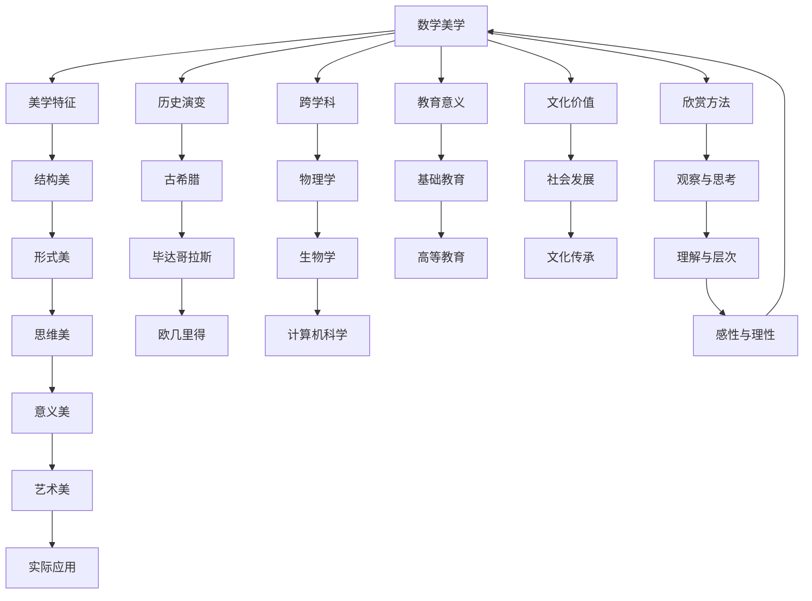

                 

### 文章标题：数学与美学：数学中的美和和谐

#### 关键词：
- 数学美学
- 和谐理论
- 对称与平衡
- 简洁性
- 数学现象

#### 摘要：
本文深入探讨了数学与美学之间的关系，揭示了数学中美的本质及其表现形式。通过分析数学美的理论基础，如和谐理论、对称与平衡、简洁性，本文展示了数学现象在艺术、哲学、教育等领域中的广泛应用。文章旨在通过细致的剖析，使读者对数学美的欣赏与理解达到新的高度，并启发读者在日常生活中发现和创造美的数学现象。

### 目录大纲：

#### 第一部分：数学与美学的理论基础

**第1章：引论**
- 1.1 数学美的定义与历史演变
- 1.2 数学美的分类与特征

**第2章：数学中的和谐理论**
- 2.1 和谐理论的基本概念
- 2.2 数学中的和谐结构
- 2.3 数列与函数的和谐性质

**第3章：数学中的对称与平衡**
- 3.1 对称性的基本概念
- 3.2 数学中的对称性实例
- 3.3 对称性与数学美的关系

**第4章：数学中的简洁性**
- 4.1 简洁性的定义与重要性
- 4.2 数学表达式的简洁性
- 4.3 简洁性与数学发现

**第5章：数学中的数学现象**
- 5.1 数学现象的定义与类型
- 5.2 经典数学现象的案例分析
- 5.3 数学现象与数学美

#### 第二部分：数学美学的应用与分析

**第6章：数学在艺术创作中的应用**
- 6.1 数学在绘画与雕塑中的应用
- 6.2 数学在音乐与舞蹈中的应用
- 6.3 数学在建筑与设计中的应用

**第7章：数学美的哲学思考**
- 7.1 数学美与哲学的关系
- 7.2 数学美的哲学意义
- 7.3 数学美的伦理与价值

**第8章：数学美的教育意义**
- 8.1 数学美在基础教育中的意义
- 8.2 数学美在高等教育中的意义
- 8.3 数学美的教学方法与实践

**第9章：数学美的跨学科研究**
- 9.1 数学美与物理学
- 9.2 数学美与生物学
- 9.3 数学美与计算机科学

#### 第三部分：数学美的欣赏与鉴赏

**第10章：数学美欣赏的技巧与方法**
- 10.1 观察与思考的方法
- 10.2 欣赏与理解的层次
- 10.3 感性与理性的平衡

**第11章：数学美欣赏的案例分析**
- 11.1 经典数学美的案例
- 11.2 数学美的新发现
- 11.3 数学美的个人体验

**第12章：数学美的社会与文化价值**
- 12.1 数学美与社会发展
- 12.2 数学美与文化传承
- 12.3 数学美的未来发展

#### 附录

**附录A：数学美的相关资源与工具**
- A.1 数学和美学研究机构
- A.2 数学美学的经典著作
- A.3 数学美的在线资源与工具

**附录B：数学美的 Mermaid 流程图**

---

### 引言

数学，作为人类智慧的结晶，以其严密的逻辑、抽象的符号体系和强大的推理能力，长期以来被广泛应用于自然科学、工程技术、经济学和社会科学等各个领域。然而，除了其科学性，数学还蕴含着一种独特的美学价值，这种美不仅仅体现在数学的严谨性上，更在于其内在的和谐、简洁与对称性。本文将探讨数学与美学之间的关系，揭示数学中的美和和谐的本质，以期让读者在领略数学之美的同时，更加深入地理解数学的本质。

数学美学，作为数学与艺术、哲学相互交融的产物，不仅仅是数学家们关注的问题，更成为当代美学研究的一个重要方向。从古希腊的毕达哥拉斯到现代的数学家们，他们都对数学的美学特征进行了深入探讨。毕达哥拉斯认为，宇宙的本质是一种和谐的比例关系，而这一思想在现代数学中得到了广泛的应用和发展。

本文将从数学美的定义与历史演变、和谐理论、对称与平衡、简洁性、数学现象等多个角度，系统地阐述数学中的美学特征。此外，本文还将探讨数学在艺术创作、哲学思考、教育意义以及跨学科研究中的应用，旨在为读者提供全方位、多层次的数学美学视角。最后，本文将总结数学美的欣赏技巧与方法，并展望数学美在未来的发展趋势。

通过本文的探讨，我们希望读者能够更加深入地理解数学中的美学价值，培养对数学美的欣赏能力，并在日常生活中发现和创造更多的数学美。数学美学，不仅仅是一门科学，更是一门艺术，一种生活态度。让我们一起探索数学中的和谐与美吧！

### 数学美的定义与历史演变

#### 数学美的定义

数学美，通常指的是数学在其结构、形式、推理过程和结论中所表现出的那种令人赏心悦目的特质。数学美不仅仅体现在数学的严谨性和逻辑性上，更在于其简洁、和谐与对称性。这种美，既是对数学家们思维方式的体现，也是对自然界规律的揭示。

具体而言，数学美的特征主要包括以下几点：

1. **简洁性**：数学美的表达往往简洁明了，不拖泥带水。例如，欧拉公式 \( e^{i\pi} + 1 = 0 \) 以其简洁的形式表达了复数、指数函数、三角函数以及虚数单位之间的关系，被誉为“世界上最美的公式”。

2. **和谐性**：数学中的比例、对称和节奏常常给人一种和谐的感觉。例如，斐波那契数列中的比例关系，以及黄金比例在自然界和艺术作品中的应用，都是和谐性的体现。

3. **对称性**：对称性是数学美的重要特征之一。在数学中，许多概念和结构都具有对称性，如圆的对称性、偶函数的奇偶对称等。对称性不仅具有美学价值，还在数学推理中起到了关键作用。

4. **逻辑性**：数学美的逻辑性体现在其推理过程的严密性和结论的确定性。从基本的数学公理出发，通过严密的推理，我们可以得到一系列令人惊叹的数学结论。

#### 数学美的历史演变

数学美学的历史可以追溯到古希腊时期。古希腊的数学家们，如毕达哥拉斯、欧几里得等，对数学美学进行了早期的探讨。毕达哥拉斯认为，宇宙的本质是数的和谐，这种观念在当时的数学和哲学中产生了深远的影响。

1. **古希腊时期**：古希腊的数学家们对数学美学进行了初步的探讨，他们认为数学不仅仅是科学，也是一种艺术形式。毕达哥拉斯的“数论哲学”和欧几里得的《几何原本》都体现了数学美学的重要性。

2. **中世纪与文艺复兴时期**：在中世纪，数学美学的研究受到了一定程度的阻碍，但随着文艺复兴的到来，数学美学重新焕发了生机。文艺复兴时期的数学家，如费尔马、帕斯卡等，对数学的美学特征进行了深入的探讨。

3. **现代时期**：进入现代，数学美学的研究得到了极大的发展。19世纪和20世纪的数学家，如康托尔、希尔伯特、罗素等，不仅对数学的基础理论进行了深刻的探讨，也在数学美学方面做出了重要的贡献。

4. **当代数学美学**：当代数学美学的研究涵盖了更广泛的领域，如数学与艺术、哲学的交融，数学现象的发现与欣赏等。现代数学家们通过新的数学工具和理论，进一步揭示了数学中的美学价值。

#### 数学美在不同文化中的体现

不同的文化背景对数学美的理解和表达方式也有所不同。在中国文化中，数学美往往与自然和谐相联系，如中国古代的《易经》中就蕴含着深刻的数学美学思想。在西方文化中，数学美则更多地体现在其逻辑性和形式上，如欧几里得的《几何原本》就是这种数学美的典范。

总之，数学美是数学中一种独特的、令人赏心悦目的特质。从古希腊的毕达哥拉斯到现代的数学家们，数学美学的研究一直在不断深入。通过本文的探讨，我们希望读者能够更加深入地理解数学中的美学价值，并在日常生活中发现和欣赏更多的数学美。

### 数学美的分类与特征

数学美学是一个丰富而复杂的领域，其美感和和谐感体现在数学的各个层面和方面。为了更好地理解和欣赏数学美，我们可以将数学美分为几种不同的类型，并分析其各自的特征。

#### 1. 结构美

结构美是数学美的核心特征之一，体现在数学理论中的严谨性和逻辑性。一个数学结构，如群、环、域，不仅具有深刻的数学意义，其定义和性质也往往展现出简洁和谐的美感。

**特征**：
- **严谨性**：数学结构中的每一个定义和定理都必须经过严密的推理和证明，这种严谨性使得数学结构具有高度可信和可靠的美。
- **逻辑性**：数学结构中的关系和推理过程往往具有清晰的逻辑链条，使人对数学的推理和发现过程产生敬佩和欣赏。

**示例**：
- **欧几里得几何**：欧几里得的《几何原本》以其严谨的逻辑体系和清晰的几何结构，展现了数学的结构美。每一个定理都建立在定义和公理的基础上，通过严密的推理得到证明。

#### 2. 形式美

形式美体现在数学表达式的简洁、对称和和谐。数学公式和图形往往以其简洁性和对称性给人以美的感受。

**特征**：
- **简洁性**：数学表达式通常简洁明了，用最少的符号和文字表达最多的信息，如欧拉公式 \( e^{i\pi} + 1 = 0 \)。
- **对称性**：许多数学公式和图形具有对称性，如圆的对称性和斐波那契数列中的比例关系，这种对称性使人感受到和谐与平衡。

**示例**：
- **欧拉公式**：欧拉公式以其简洁的形式和对称性，将复数、指数函数和三角函数紧密联系在一起，展现了数学形式美。
- **斐波那契数列**：斐波那契数列中的比例关系，如黄金比例，以其对称性和和谐性，在数学和自然界中广泛存在。

#### 3. 思维美

思维美体现在数学家的思维过程和数学问题的解决策略上。数学家们通过独特的思维方式，发现和创造出了许多令人惊叹的数学理论和方法。

**特征**：
- **创新性**：数学家们通过创新性的思维，发现了许多新的数学理论和公式，如费马大定理和怀尔斯证明。
- **简洁性**：数学家们往往能够在复杂的数学问题中找到简洁的解决方案，如拉格朗日中值定理和牛顿-莱布尼茨公式。

**示例**：
- **费马大定理**：费马大定理是数学史上一个著名的未解问题，直到1994年才被安德鲁·怀尔斯证明。其证明过程展现了数学家们深刻的思维美。
- **拉格朗日中值定理**：拉格朗日中值定理以简洁的形式描述了函数在某区间内的变化情况，展示了数学的思维方式。

#### 4. 意义美

意义美体现在数学理论对现实世界的解释和指导作用上。许多数学理论不仅在数学上具有美感，还在科学、工程、经济学等领域中发挥了重要作用。

**特征**：
- **实用性**：数学理论在解决实际问题中具有广泛的应用，如微积分在物理学中的应用，概率论在经济学中的应用。
- **深刻性**：数学理论能够揭示自然和社会现象的本质规律，如牛顿定律和麦克斯韦方程组。

**示例**：
- **微积分**：微积分不仅具有数学的美感，还在物理学、工程学等领域中发挥了重要作用，如描述物体运动和优化问题。
- **概率论**：概率论在经济学、金融学等领域中广泛应用，帮助我们理解和预测不确定性事件。

#### 5. 艺术美

艺术美体现在数学与艺术的结合上，如数学在绘画、音乐、雕塑等艺术形式中的应用。数学的美不仅体现在其结构和形式上，也体现在其能够为艺术创作提供新的视角和方法。

**特征**：
- **创造性**：数学在艺术创作中的应用，如使用数学公式创作音乐和绘画，展现了数学的创造性和艺术性。
- **融合性**：数学与艺术的结合，如莫比乌斯带在艺术作品中的应用，展示了数学与艺术相互融合的美感。

**示例**：
- **莫比乌斯带**：莫比乌斯带是一种只有一个面的曲面，其在艺术作品中的应用，如绘画和雕塑，展现了数学与艺术的结合。
- **数学音乐**：数学家杰里·科恩使用数学公式创作了音乐，这些音乐作品以其独特的数学美感受到了广泛赞誉。

总之，数学美的分类和特征展示了数学的多样性和丰富性。无论是结构美、形式美、思维美、意义美还是艺术美，数学的美都是一种独特而迷人的美感。通过本文的探讨，我们希望读者能够更加深入地理解和欣赏数学中的美，并在日常生活中发现更多的数学美。

### 数学中的和谐理论

和谐理论在数学中占据着重要的地位，它不仅为数学提供了深刻的理论基础，还揭示了数学与自然界和人类社会的内在联系。从古希腊时期的毕达哥拉斯到现代的数学家们，和谐理论一直受到广泛关注，并在数学的发展中发挥了关键作用。

#### 和谐理论的基本概念

和谐理论的基本概念包括比例、对称和节奏等。这些概念不仅贯穿于数学的各个分支，也在自然界和社会生活中得到广泛应用。

1. **比例**：比例是指两个量之间的相对大小关系。在数学中，比例关系可以通过分数、比例公式等来描述。例如，斐波那契数列中的比例关系，以及黄金比例都是比例在数学中的体现。

2. **对称**：对称是指一个对象相对于某个中心或轴线的对称性。在数学中，对称性常常通过几何图形和代数表达式来表现。例如，圆的对称性和偶函数的奇偶对称都是对称性的例子。

3. **节奏**：节奏是指一个对象在不同时间点上的变化规律。在数学中，节奏可以通过数列、函数的周期性来描述。例如，正弦函数的周期性就是一种节奏的体现。

#### 数学中的和谐结构

和谐结构是数学和谐理论的核心内容之一，它体现在数学的各个分支中，如几何、代数、分析等。

1. **几何中的和谐结构**：几何中的和谐结构主要表现在对称性、比例关系和整体布局上。例如，欧氏几何中的欧几里得几何和莫比乌斯带都具有高度的和谐结构。

   - **欧几里得几何**：欧几里得的《几何原本》以其严格的逻辑体系和对称性，展示了几何中的和谐结构。每一个定理都建立在定义和公理的基础上，通过严密的推理得到证明。

   - **莫比乌斯带**：莫比乌斯带是一种只有一个面的曲面，其在几何学中展示了高度和谐的结构。莫比乌斯带在数学和物理中有着广泛的应用，如电磁理论和拓扑学。

2. **代数中的和谐结构**：代数中的和谐结构主要表现在对称性和简洁性上。例如，群论和环论中的对称性和简洁性，以及多项式方程的根的分布。

   - **群论**：群论是代数学的一个重要分支，其基本概念包括群、子群、同态等。群论中的对称性使得许多数学问题变得更加简洁和直观。

   - **环论**：环论是代数学的另一个重要分支，其基本概念包括环、理想、同态等。环论中的对称性和简洁性，使得许多数学问题得到了有效的解决。

3. **分析中的和谐结构**：分析中的和谐结构主要表现在函数的连续性、微分和积分的和谐性上。例如，傅里叶变换和复变函数论中的和谐性。

   - **傅里叶变换**：傅里叶变换是一种重要的数学工具，用于将一个函数分解为不同频率的正弦波和余弦波的叠加。傅里叶变换的和谐性使其在信号处理、物理学和工程学等领域中广泛应用。

   - **复变函数论**：复变函数论研究复数域上的函数性质，其核心概念包括解析函数、留数等。复变函数论中的和谐性，使得许多复杂的数学问题得以简化。

#### 数列与函数的和谐性质

数列和函数是数学中最基本的两个概念，它们在数学和谐理论中具有重要的作用。

1. **数列的和谐性质**：数列的和谐性质主要体现在其比例关系和收敛性上。

   - **斐波那契数列**：斐波那契数列是一个著名的数列，其每一项是前两项的和。斐波那契数列中的比例关系，如相邻项的比例逐渐趋近于黄金比例，展示了数列的和谐性质。

   - **调和数列**：调和数列是一种特殊的数列，其每一项是前一项的倒数。调和数列的收敛性展示了数列的和谐性质。

2. **函数的和谐性质**：函数的和谐性质主要体现在其对称性、周期性和连续性上。

   - **正弦函数和余弦函数**：正弦函数和余弦函数是基本的三角函数，其具有周期性和对称性。正弦函数和余弦函数的和谐性质，使得它们在物理学和工程学中广泛应用。

   - **傅里叶变换**：傅里叶变换是一种将一个函数分解为不同频率的正弦波和余弦波的数学工具。傅里叶变换的和谐性，使得复杂的函数问题得以简化。

总之，数学中的和谐理论揭示了数学的内在美和与自然界的紧密联系。通过和谐理论，我们可以更好地理解和解决数学问题，并在日常生活中发现更多的数学美。通过本文的探讨，我们希望读者能够对数学中的和谐理论有更深入的理解和欣赏。

### 数学中的对称与平衡

对称与平衡是数学中的一个重要概念，它不仅具有美学意义，还在数学的各个领域中发挥着关键作用。对称性在数学中的表现多种多样，从几何图形到代数方程，再到函数和数列，都体现了对称性的重要性和普遍性。

#### 对称性的基本概念

对称性是指一个对象或结构在某种变换下保持不变的性质。在数学中，对称性通常与映射和变换相关联。常见的对称性包括反射对称、旋转对称、平移对称等。

1. **反射对称**：反射对称是指一个对象相对于一个直线或平面进行反射后，仍然保持不变。例如，镜子中的倒影和纸上的图形关于某条线的镜像都是反射对称的。

2. **旋转对称**：旋转对称是指一个对象围绕某个点或轴线旋转一定角度后，仍然保持不变。例如，正方形围绕中心点旋转90度、180度或270度后，形状保持不变。

3. **平移对称**：平移对称是指一个对象沿某个方向平移一定距离后，仍然保持不变。例如，一条直线上的点沿直线方向平移，整个结构保持不变。

#### 数学中的对称性实例

数学中的对称性广泛应用于各个领域，下面列举几个典型的实例：

1. **几何中的对称性**：几何图形中的对称性是最直观的对称性实例。例如，正方形、圆形、等边三角形等都具有高度的对称性。

   - **正方形**：正方形的四条边长度相等，四个角都是直角，它具有旋转对称性和反射对称性。
   - **圆形**：圆形具有无限多的旋转对称轴和反射对称轴，它是最完美的对称图形。

2. **代数中的对称性**：在代数中，对称性体现在函数和方程的对称性上。例如，偶函数和奇函数都具有对称性。

   - **偶函数**：偶函数满足 \( f(-x) = f(x) \)，即函数图像关于y轴对称。例如，\( f(x) = x^2 \) 是一个偶函数。
   - **奇函数**：奇函数满足 \( f(-x) = -f(x) \)，即函数图像关于原点对称。例如，\( f(x) = x^3 \) 是一个奇函数。

3. **数列中的对称性**：在数列中，对称性体现在数列项的排列上。例如，斐波那契数列中的每一项都与其相邻项成比例，这种比例关系体现了数列的对称性。

   - **斐波那契数列**：斐波那契数列中，相邻项的比例趋近于黄金比例，这种比例关系使得斐波那契数列具有对称性。

#### 对称性与数学美的关系

对称性与数学美有着密切的联系。对称性使得数学结构更加简洁和优美，也使得数学问题更容易理解和解决。

1. **简洁性**：对称性使得数学结构更加简洁。例如，对称的函数和方程可以简化为更简单的形式，使得问题更容易分析和解决。

2. **统一性**：对称性在数学中提供了统一的解释框架。例如，群论中的对称性使得许多不同的数学结构可以通过统一的概念来理解。

3. **和谐性**：对称性在数学中体现了和谐与平衡。例如，几何图形中的对称性使得整体布局更加和谐，函数和数列中的对称性使得数据分布更加均匀。

4. **美学价值**：对称性本身就是一种美学价值。例如，正方形和圆形等对称图形在视觉上给人一种简洁和谐的美感。

#### 对称性的应用

对称性在数学中的应用非常广泛，不仅体现在理论研究中，还广泛应用于实际问题中。

1. **理论应用**：对称性在数学理论研究中起到了关键作用。例如，群论和对称性分析在数学和物理学中有着广泛的应用。

2. **实际问题**：对称性在工程学、物理学、计算机科学等领域中也有重要应用。例如，对称性在计算机图形学中用于优化图形渲染，在物理学中用于分析晶体结构。

总之，对称性与平衡是数学中的重要概念，它不仅具有美学意义，还在数学的各个领域中发挥着关键作用。通过本文的探讨，我们希望读者能够更加深入地理解和欣赏数学中的对称性与平衡之美。

### 数学中的简洁性

简洁性是数学美的重要特征之一，它体现了数学表达式的简洁明了和结构的简约优美。在数学中，简洁性不仅使问题更易于理解，还往往揭示了问题的本质。本节将探讨数学简洁性的定义与重要性，以及数学表达式的简洁性实例。

#### 简洁性的定义与重要性

简洁性在数学中是指用最少的符号、步骤和逻辑来描述复杂的问题或理论。简洁性不仅使数学表达式更加直观，还提高了数学推理的效率。以下是简洁性的几个关键特征：

1. **表达简洁**：数学表达式应尽量简短，避免冗余。例如，欧拉公式 \( e^{i\pi} + 1 = 0 \) 以其简洁的形式表达了复数、指数函数、三角函数和虚数单位之间的关系。

2. **逻辑简明**：数学推理过程应清晰明了，避免复杂的推导和冗长的论证。例如，拉格朗日中值定理通过简洁的逻辑证明了函数在区间内的性质。

3. **结构优美**：数学理论的结构应具有内在的美感，使得读者能够轻松地理解其核心概念和关系。例如，欧几里得的《几何原本》以其简约的结构和优美的推理过程，奠定了几何学的基础。

#### 数学表达式的简洁性

数学表达式的简洁性在数学理论和应用中都有显著体现。以下是一些典型的例子：

1. **欧拉公式**：
   \[
   e^{i\pi} + 1 = 0
   \]
   这个公式简洁地表达了复数、指数函数和三角函数之间的关系，被誉为“世界上最美的公式”。

2. **拉格朗日中值定理**：
   \[
   \exists \xi \in (a, b), \quad f'(\xi) = \frac{f(b) - f(a)}{b - a}
   \]
   这个定理用简洁的形式描述了函数在某区间内的导数性质，是微积分中的一个重要结果。

3. **傅里叶变换**：
   \[
   F(f)(\omega) = \int_{-\infty}^{\infty} f(x) e^{-i\omega x} dx
   \]
   这个公式简洁地表达了函数的频域表示，是信号处理中的基本工具。

#### 简洁性与数学发现

简洁性在数学发现中起到了关键作用。许多重大数学发现都是通过对简洁性的追求而实现的。以下是一些实例：

1. **费马大定理**：
   费马大定理指出，对于任何大于2的自然数 \( n \)，方程 \( a^n + b^n = c^n \) 没有正整数解。这个定理的简洁表达和对数学的深远影响，使其成为数学史上最著名的未解问题之一。

2. **康托尔集合**：
   康托尔集合是通过简洁的构造方法发现的，它揭示了实数集合的复杂性质，并对集合论和数学基础产生了深远影响。

3. **杨-米尔斯理论**：
   杨-米尔斯理论通过简洁的数学表达式描述了基本粒子的相互作用，是现代物理学中的一个重要理论。

总之，简洁性是数学美的重要组成部分，它不仅使数学表达式更加直观，还提高了数学推理的效率。通过本文的探讨，我们希望读者能够更加深入地理解和欣赏数学中的简洁性之美。

### 数学中的数学现象

数学现象是指在数学领域中出现的奇特且引人入胜的现象，这些现象不仅体现了数学的内在美，还揭示了数学的广泛应用和无限可能性。数学现象涵盖了从简单的数列到复杂的几何图形，再到深奥的代数公式和函数，每一个现象都蕴含着丰富的数学美。

#### 数学现象的定义与类型

1. **定义**：
   数学现象是指在数学研究过程中，因数学理论或方法的应用而展现出的奇特特征或结果。这些现象往往具有视觉、逻辑或结构上的美感，并能激发数学家和爱好者的好奇心。

2. **类型**：
   - **数论现象**：如斐波那契数列、黄金比例、素数分布等。
   - **几何现象**：如莫比乌斯带、四色定理、庞加莱猜想等。
   - **代数现象**：如欧拉公式、拉格朗日中值定理、费马小定理等。
   - **函数现象**：如傅里叶变换、周期函数、混沌现象等。

#### 经典数学现象的案例分析

1. **斐波那契数列**：
   斐波那契数列是一个递推数列，每一项是前两项的和。数列的前几项为 \( 1, 1, 2, 3, 5, 8, 13, 21, \ldots \)。斐波那契数列中的比例关系趋近于黄金比例，这一现象在自然界和艺术作品中广泛存在。

   **数学模型**：
   \[
   F(n) = 
   \begin{cases} 
   1 & \text{if } n = 1 \text{ or } n = 2 \\
   F(n-1) + F(n-2) & \text{otherwise}
   \end{cases}
   \]

2. **黄金比例**：
   黄金比例是一个无理数，通常表示为 \( \phi \)，其值为 \( \frac{1 + \sqrt{5}}{2} \)。黄金比例在数学和自然界中有着广泛的应用，如在植物的生长、人体的比例和艺术创作中。

   **数学公式**：
   \[
   \phi = \frac{a+b}{a} = \frac{a}{b}
   \]

3. **莫比乌斯带**：
   莫比乌斯带是一个只有一个面的曲面，通过将一条纸带扭转180度后粘合而形成。莫比乌斯带在拓扑学和物理学中有着重要的应用。

   **几何特性**：
   - 只有一个面
   - 只有一条边
   - 对称性：对折莫比乌斯带，可以发现两端点重合

4. **欧拉公式**：
   欧拉公式是复变函数中的一个重要公式，它将复数、指数函数和三角函数紧密联系起来。

   **数学公式**：
   \[
   e^{i\pi} + 1 = 0
   \]

5. **费马大定理**：
   费马大定理指出，对于任何大于2的自然数 \( n \)，方程 \( a^n + b^n = c^n \) 没有正整数解。这个定理在数学界引起了长期的争议，最终在1994年被安德鲁·怀尔斯证明。

   **数学模型**：
   \[
   x^n + y^n = z^n
   \]

#### 数学现象与数学美

数学现象之所以具有美感，主要是因为它们揭示了数学中的和谐、对称和简洁性。这些现象不仅使数学理论更加丰富和有趣，还激发了人们对数学美的欣赏和探索。

1. **和谐与对称**：
   许多数学现象，如斐波那契数列和黄金比例，体现了数学中的和谐与对称。这些现象在自然界和艺术创作中广泛存在，使人们对数学的美感到更加直观。

2. **简洁性**：
   数学现象通常以简洁的形式出现，如欧拉公式和费马大定理，这些简洁的表达不仅使问题易于理解，还使数学的美感更加突出。

3. **逻辑性**：
   数学现象的逻辑性是其美感的另一个重要来源。许多数学现象的发现和证明过程都体现了严密的逻辑推理，使人们对数学的理性美感到敬佩。

总之，数学现象是数学美的重要组成部分，它们以独特的形式展示了数学的内在美。通过本文的探讨，我们希望读者能够更加深入地理解和欣赏数学中的这些美妙现象。

### 数学在艺术创作中的应用

数学在艺术创作中的应用历史悠久且广泛，其独特的结构和逻辑性为艺术家们提供了丰富的创作工具和灵感来源。数学的简洁、对称和和谐性，使得数学元素在艺术作品中不仅具有美学价值，还能增强作品的深度和表现力。

#### 数学在绘画与雕塑中的应用

1. **绘画中的数学**：
   - **几何构图**：几何构图是绘画中常用的技巧，通过使用几何形状来构建画面的结构和平衡。例如，达·芬奇的《最后的晚餐》中，耶稣和门徒的排列遵循了黄金比例，使画面具有和谐感。
   - **对称与平衡**：对称和平衡是绘画中的重要原则。荷兰画家皮特·蒙德里安的《红、黄、蓝构成》运用了严格的几何对称，通过不同颜色的对比，营造出简洁而富有层次感的视觉效果。
   - **黄金比例**：黄金比例在绘画中广泛应用，例如，画家通常会按照黄金比例来分割画布或构图，以增强作品的美感。

2. **雕塑中的数学**：
   - **比例与对称**：雕塑中，数学的比例和对称性被用来塑造人体和物体的美感。古希腊雕塑《米洛的维纳斯》就是一个典型的例子，其完美的比例和对称性使其成为不朽的艺术杰作。
   - **几何形状**：许多雕塑作品采用了几何形状，如圆形、正方形和三角形，这些形状不仅增加了作品的立体感，还使其具有抽象的美感。

#### 数学在音乐与舞蹈中的应用

1. **音乐中的数学**：
   - **音阶与和弦**：音乐中的音阶和和弦是按照数学比例排列的。例如，五度循环是一个数学上的周期性现象，它定义了音乐中的音阶和和弦。
   - **节奏与节奏模式**：音乐的节奏和节奏模式也遵循数学规律。例如，复节奏和节奏图案在音乐创作中广泛应用，这些模式可以通过数学公式来描述和生成。

2. **舞蹈中的数学**：
   - **对称与平衡**：舞蹈中，对称和平衡是重要的美学原则。许多舞蹈动作遵循几何对称性，如旋转和跳跃，这些动作通过数学规则来实现视觉上的和谐。
   - **空间布局**：舞蹈编排中，空间布局也受到数学的影响。例如，圆形、直线和网格布局在舞蹈中广泛应用，这些布局可以通过数学公式来描述和优化。

#### 数学在建筑与设计中的应用

1. **建筑中的数学**：
   - **比例与对称**：建筑设计中，比例和对称性是关键因素。许多古代建筑，如埃及金字塔和古希腊神庙，都遵循了严格的几何比例和对称性。
   - **结构稳定性**：数学在建筑设计中用于分析结构的稳定性和承载能力。例如，梁的弯曲、柱的支撑和地基的稳定性都通过数学模型来分析和优化。

2. **设计中的数学**：
   - **形式美感**：数学在工业设计和时尚设计中也广泛应用。例如，黄金比例在产品设计中用于优化形状和比例，使产品看起来更加美观。
   - **数据可视化**：数学在数据可视化设计中起到了重要作用。通过数学模型和算法，可以将复杂的数据转化为直观的图形，便于分析和展示。

总之，数学在艺术创作中的应用丰富多样，其独特的结构和逻辑性为艺术创作提供了无限的可能性。通过本文的探讨，我们希望读者能够更加深入地理解和欣赏数学在艺术中的美妙应用。

### 数学美的哲学思考

数学美不仅仅是一种视觉上的美感，更是一种深层次的哲学思考。在哲学领域，数学美被视为理性美、和谐美和简洁美的统一体现。数学美不仅揭示了数学自身的逻辑结构和抽象规律，还与人类的认知、伦理和价值观念密切相关。

#### 数学美与哲学的关系

数学美与哲学的关系可以追溯到古希腊时期。古希腊哲学家如毕达哥拉斯和柏拉图，都认为数学是宇宙的本质，是一种超越物质世界的纯粹形式。他们的观点认为，宇宙的和谐与秩序可以通过数学来解释和理解。这种思想在后来的西方哲学传统中得到了延续和发展。

1. **理性美**：数学美体现了理性美的本质。理性美强调的是人类思维的能力和逻辑推理的力量。数学作为一种高度抽象的学科，其推理过程和结论都建立在严格的逻辑基础上，这种理性之美使数学成为一种独立于物质世界的哲学思维工具。

2. **和谐美**：和谐美是数学美的核心特征之一。在哲学中，和谐美被理解为不同部分之间的平衡和协调。数学中的比例、对称和节奏，都体现了这种和谐之美。例如，斐波那契数列和黄金比例在自然界和艺术中的广泛应用，都是和谐美的体现。

3. **简洁美**：简洁美是指以最简洁的形式表达复杂的概念和关系。数学中的简洁美，如欧拉公式和拉格朗日中值定理，不仅使问题更易于理解，还揭示了数学理论的本质。在哲学中，简洁美被视为理性思考的最高境界，它反映了人类对世界的深入理解和洞察。

#### 数学美的哲学意义

数学美的哲学意义体现在多个方面：

1. **认识论意义**：数学美揭示了人类认识世界的深度和广度。通过数学的抽象和推理，人类能够超越感官经验的限制，理解宇宙的基本规律。数学美的欣赏和探索，是人类认识世界的重要方式。

2. **伦理学意义**：数学美的追求反映了人类追求真理和正义的伦理观念。数学作为一种高度抽象的学科，其推理过程和结论都具有高度的确定性。数学美的追求，不仅是对理性思维的锻炼，也是对人类伦理价值的追求。

3. **美学意义**：数学美在哲学美学中具有重要的地位。数学美学不仅关注数学自身的形式和结构，还探讨了数学与艺术、哲学之间的交融。数学美的研究，丰富了哲学美学的内容，推动了美学理论的发展。

#### 数学美的伦理与价值

数学美的伦理与价值体现在以下几个方面：

1. **追求真理**：数学美的追求是对真理的探求。数学作为一种高度抽象的学科，其推理过程和结论都具有高度的确定性。通过追求数学美，人类能够更加深入地理解世界的本质和规律。

2. **促进创新**：数学美的追求促进了数学和科学的发展。许多重大的科学发现和技术创新，都是基于对数学美的追求。例如，牛顿力学和量子力学，都是通过对数学美的探索而取得的重大突破。

3. **提升思维能力**：数学美的追求能够提升人类的思维能力和创造力。通过欣赏和探索数学美，人类能够培养逻辑思维、抽象思维和创新能力，这些能力在日常生活和工作中都具有重要意义。

总之，数学美是哲学思考的重要组成部分，它体现了理性美、和谐美和简洁美的统一。通过本文的探讨，我们希望读者能够更加深入地理解数学美的哲学意义，并在日常生活中发现和欣赏更多的数学美。

### 数学美的教育意义

数学美在教育中具有重要的作用，它不仅能够激发学生对数学的兴趣和热情，还能培养他们的逻辑思维、创新能力和审美能力。在基础教育中，数学美的教育具有重要意义；在高等教育中，数学美的教育同样不可或缺。通过有效的教学方法和实践活动，我们可以使数学美成为学生全面发展的重要推动力。

#### 数学美在基础教育中的意义

1. **激发兴趣与热情**：数学美以其简洁、和谐和独特的逻辑结构，能够激发学生对数学的兴趣和热情。通过展示数学中的美学特征，如斐波那契数列、黄金比例等，可以使学生感受到数学的奇妙和趣味性，从而增强他们学习数学的积极性。

2. **培养逻辑思维**：数学美强调逻辑推理和抽象思维，这有助于培养学生的逻辑思维能力。通过学习数学美的概念和实例，学生可以学会如何通过逻辑推理来分析和解决问题，从而提高他们的思维能力和分析能力。

3. **提升审美能力**：数学美作为一种独特的审美体验，能够提升学生的审美能力。通过欣赏数学表达式、几何图形和数学现象，学生可以培养对美的感知和鉴赏能力，这对他们未来的艺术修养和审美能力发展具有重要意义。

#### 数学美在高等教育中的意义

1. **深入理解数学本质**：在高等教育中，数学美的教育有助于学生深入理解数学的本质和理论基础。通过探讨数学美的各种表现和特征，学生可以更好地理解数学概念和理论之间的内在联系，从而提高他们的数学素养和学术水平。

2. **培养创新思维**：数学美具有强烈的创新性，它鼓励学生在数学领域中探索和发现新的规律和理论。通过研究和欣赏数学美，学生可以培养创新思维和创造力，这对于他们在未来的科研和工程技术工作中具有重要意义。

3. **促进跨学科发展**：数学美在艺术、哲学、物理学等多个领域都有广泛的应用，这有助于促进学生的跨学科发展。通过数学美的教育，学生可以了解数学与其他学科之间的联系，从而培养他们的综合素质和跨学科能力。

#### 数学美的教学方法与实践

1. **案例教学**：通过展示经典数学美的案例，如欧拉公式、斐波那契数列等，可以激发学生的学习兴趣。教师可以结合具体实例，讲解数学美的概念和特征，让学生在实践中感受数学美的魅力。

2. **项目式学习**：组织学生进行项目式学习，如设计一个基于数学美的艺术作品、分析一个数学现象等，可以培养学生的实际操作能力和创新思维。通过项目式学习，学生可以深入理解数学美的应用，并将其应用于实际问题中。

3. **跨学科教学**：将数学美与其他学科相结合，如数学与艺术、哲学、物理学等，可以促进学生的跨学科发展。教师可以设计跨学科的教学活动，如数学与绘画的结合、数学与音乐的结合等，让学生从多角度理解数学美的内涵。

4. **互动式教学**：通过互动式教学，如小组讨论、课堂展示等，可以增强学生对数学美的理解和应用。教师可以鼓励学生分享自己对数学美的认识和体验，从而激发他们的思维活力和创造力。

总之，数学美在教育中具有重要的意义，通过有效的教学方法和实践活动，我们可以使数学美成为学生全面发展的重要推动力。通过本文的探讨，我们希望教育工作者能够更加重视数学美的教育，并在教学中积极运用数学美的理念和方法。

### 数学美的跨学科研究

数学美不仅在数学领域内具有深远影响，它在物理学、生物学以及计算机科学等其他学科中也有着重要的应用和研究价值。跨学科研究数学美，不仅能够深化我们对数学本质的理解，还能促进各个学科之间的交叉融合，推动科学技术的进步。

#### 数学美与物理学

1. **对称性与粒子物理学**：
   物理学中的对称性概念源自数学，尤其是群论的应用。在粒子物理学中，对称性是描述基本粒子和相互作用的重要工具。例如，规范场理论和对称破缺，都是通过数学对称性来解释粒子行为和相互作用。对称性不仅提供了理论模型，还为实验验证提供了重要依据。

   **数学模型**：
   - **洛伦兹群**：描述相对论中的时空变换。
   - **规范群**：描述基本力的对称性，如SU(3)、SU(2)、U(1)。

2. **分形与自然现象**：
   分形几何是数学美在物理学中的体现，它用于描述自然界中的复杂现象，如海岸线、云层和血管结构。分形几何揭示了自然界的自相似性和无限层次的结构，为物理学研究提供了新的视角。

#### 数学美与生物学

1. **遗传学与代数学**：
   生物学中的遗传学理论，如孟德尔的遗传规律，可以通过代数学来描述。通过基因的编码和解码，我们可以将遗传信息转化为数学模型，从而更深入地理解基因如何影响生物体的形态和功能。

   **数学模型**：
   - **基因编码**：通过二进制编码和组合规则，将遗传信息转化为数学表达式。
   - **遗传算法**：模拟自然选择和遗传机制，用于优化问题和模拟进化过程。

2. **神经网络与拓扑学**：
   神经元网络的结构和功能与拓扑学中的图论密切相关。通过拓扑学的方法，我们可以分析和理解神经网络中的信息传递和处理机制，这对于人工神经网络的设计和应用具有重要意义。

#### 数学美与计算机科学

1. **算法设计与复杂性理论**：
   计算机科学中的算法设计离不开数学的美学原则，如简洁性、高效性和可理解性。复杂性理论通过分析算法的运行时间和资源消耗，揭示了计算问题的本质和难度。例如，图灵机模型和NP完全问题都是数学美在计算机科学中的经典研究内容。

   **数学模型**：
   - **图灵机**：描述计算过程的基本模型，体现了算法的简洁性。
   - **时间复杂度和空间复杂度**：通过数学分析，评估算法的效率。

2. **数据结构与几何计算**：
   数据结构如树、图和哈希表等，在计算机科学中广泛应用。几何计算则依赖于数学中的几何学和拓扑学。例如，计算机图形学中的几何变换和渲染算法，都是通过数学模型来实现的。

3. **密码学**：
   密码学中的数学美体现在其复杂的加密和解密算法上，如RSA加密算法和椭圆曲线密码。这些算法通过数学中的难解问题和数论原理，提供了高度安全的通信和数据保护手段。

总之，数学美在跨学科研究中具有广泛的应用和深远的影响。通过本文的探讨，我们希望读者能够认识到数学美在物理学、生物学和计算机科学等领域中的重要性，并激发对跨学科研究的兴趣。数学美不仅是数学家研究的对象，也是所有科学研究的重要工具和灵感来源。

### 数学美欣赏的技巧与方法

欣赏数学美不仅需要敏锐的观察力和深厚的数学知识，还需要适当的技巧和方法。通过以下几种方法，我们可以更好地理解和欣赏数学美：

#### 观察与思考的方法

1. **细节观察**：
   欣赏数学美时，首先要从细节入手。仔细观察数学表达式、几何图形和数学现象，发现其中的对称性、比例和简洁性。例如，在斐波那契数列中，观察相邻项的比例逐渐趋近于黄金比例。

2. **联想与比较**：
   将数学现象与自然界、艺术和其他学科中的相似之处进行比较。例如，黄金比例在艺术作品和自然界中的广泛应用，可以通过比较来加深对数学美的理解。

3. **逻辑推理**：
   通过逻辑推理来分析数学现象的成因和内在联系。例如，在理解欧拉公式时，可以通过分析其数学表达式和逻辑推理，理解其背后的数学原理。

#### 欣赏与理解的层次

1. **表面层次**：
   初次接触数学美时，可以从表面的美感入手，如几何图形的对称性、数学表达式的简洁性等。这一层次主要依赖于直观感受。

2. **深层次理解**：
   在表面层次的基础上，进一步探索数学美的深层含义。例如，理解斐波那契数列背后的自然规律，以及它在植物生长和人造设计中的应用。

3. **哲学思考**：
   将数学美与哲学、伦理等思想相结合，探讨数学美的哲学意义。例如，探讨数学美如何体现人类理性、和谐与简洁的追求。

#### 感性与理性的平衡

1. **感性的欣赏**：
   在欣赏数学美时，感性体验是不可忽视的。通过直观感受和美学体验，我们可以获得对数学美的初步认识。

2. **理性的分析**：
   同时，理性的分析也是必不可少的。通过逻辑推理和数学证明，我们可以深入理解数学美的本质和内在联系。

3. **综合运用**：
   感性与理性的平衡，是将数学美欣赏到极致的关键。在欣赏数学美时，既要依赖感性体验，也要运用理性分析，以达到全面的理解和欣赏。

总之，通过观察与思考的方法、欣赏与理解的层次和感性与理性的平衡，我们可以更好地欣赏数学美。这不仅能够提升我们的数学素养，还能培养我们的审美能力和逻辑思维。通过本文的探讨，我们希望读者能够在日常生活中发现和欣赏更多的数学美。

### 数学美欣赏的案例分析

#### 经典数学美的案例

1. **欧拉公式**：
   \[
   e^{i\pi} + 1 = 0
   \]
   这个公式被誉为“世界上最美的公式”，因为它简洁地表达了复数、指数函数、三角函数和虚数单位之间的关系。这个公式不仅是数学美的一个典范，还揭示了数学中深层次的联系和统一性。

   **欣赏方法**：
   - 从表面层次：欣赏其简洁的形式和对称性。
   - 从深层次：理解其背后的数学原理和逻辑推理。

2. **斐波那契数列**：
   斐波那契数列是一个递推数列，每一项是前两项的和。这个数列不仅具有美丽的比例关系，还在自然界和艺术中广泛存在。

   **数学模型**：
   \[
   F(n) = 
   \begin{cases} 
   1 & \text{if } n = 1 \text{ or } n = 2 \\
   F(n-1) + F(n-2) & \text{otherwise}
   \end{cases}
   \]

   **欣赏方法**：
   - 从表面层次：观察数列中相邻项的比例，逐渐趋近于黄金比例。
   - 从深层次：理解其在自然界中的应用，如植物的生长和艺术创作。

3. **莫比乌斯带**：
   莫比乌斯带是一种只有一个面的曲面，通过将一条纸带扭转180度后粘合而成。这种结构在拓扑学和物理学中有着重要的应用。

   **几何特性**：
   - 只有一个面
   - 只有一条边
   - 对称性：对折莫比乌斯带，可以发现两端点重合

   **欣赏方法**：
   - 从表面层次：观察其独特的几何形状和视觉美感。
   - 从深层次：理解其在拓扑学和物理学中的应用，如电路设计。

#### 数学美的新发现

随着数学和科技的发展，新的数学美不断被发现，这激发了人们对数学美的探索和欣赏。

1. **混沌理论中的数学美**：
   混沌理论揭示了非线性系统中复杂、不可预测的行为。混沌吸引子和分形图形是混沌理论中的数学美的新发现。

   **数学模型**：
   \[
   x_{n+1} = r \cdot x_n \cdot (1 - x_n)
   \]

   **欣赏方法**：
   - 从表面层次：观察分形图形的复杂结构和层次感。
   - 从深层次：理解其在自然界和工程中的应用，如气候模拟和电路设计。

2. **量子计算中的数学美**：
   量子计算利用量子位（qubit）进行计算，其数学基础是量子力学和线性代数。量子态的叠加和纠缠是量子计算中的数学美的新发现。

   **数学模型**：
   \[
   |\psi\rangle = \alpha|0\rangle + \beta|1\rangle
   \]

   **欣赏方法**：
   - 从表面层次：欣赏量子态的叠加和纠缠的奇特性质。
   - 从深层次：理解其在加密和优化问题中的应用。

#### 数学美的个人体验

每个人的数学背景和审美观不同，对数学美的欣赏和体验也会有所不同。以下是一个个人的数学美欣赏体验：

1. **数学在艺术中的应用**：
   在学习绘画时，我发现了数学在构图和比例中的重要作用。通过学习黄金比例和斐波那契数列，我学会了如何在艺术创作中运用这些数学原理，使作品更加和谐和美观。

   **体验方法**：
   - 实践应用：在实际绘画过程中，尝试使用数学比例和几何形状进行构图和设计。
   - 反思总结：通过不断的实践和反思，理解数学原理在艺术创作中的具体应用。

通过这些案例，我们可以看到数学美的多样性和丰富性。通过细致的观察、深入的思考和个人的体验，我们可以更好地欣赏和理解数学美。这不仅能够提升我们的数学素养，还能激发我们对数学的热爱和追求。

### 数学美的社会与文化价值

数学美不仅在学术领域具有重要的价值，在社会和文化的层面也具有深远的影响。数学美作为一种独特的文化现象，不仅丰富了人类的精神世界，还在社会发展中起到了积极的推动作用。

#### 数学美与社会发展的关系

1. **科技进步**：
   数学美在科技发展中起到了关键作用。许多科技突破都依赖于数学理论的创新和数学美的探索。例如，爱因斯坦的相对论和量子力学，都是基于对数学美的深刻理解和应用。数学美的追求推动了科学技术的进步，为社会的发展带来了巨大的动力。

2. **教育改革**：
   数学美的教育意义在现代社会中愈发凸显。通过引入数学美的教育，可以激发学生对数学的兴趣和热情，提高他们的数学素养和创新能力。数学美的教育有助于培养具有批判性思维和创造性思维的现代人才，从而推动社会的全面发展。

3. **文化传播**：
   数学美的案例和理论不仅是一种学术研究，也是文化传承的重要载体。数学美的传播和普及，有助于增强民族文化自信，促进不同文化之间的交流与融合。例如，中国古代的《易经》和《九章算术》都是数学美与文化传承相结合的典范。

#### 数学美与文化传承

1. **传统文化中的数学美**：
   世界各地的传统文化中，都蕴含着丰富的数学美学思想。例如，中国的《易经》通过数学符号和模型来描述自然和社会现象，体现了数学美的哲学意义。古希腊的几何学和印度的代数学，都是数学美的文化传承和发展的结果。

2. **现代文化中的数学美**：
   现代文化中，数学美在艺术、文学和科技中得到了广泛应用。例如，现代绘画和雕塑中的几何构图，以及电影和音乐中的数学元素，都展示了数学美的独特魅力。数学美的传播和普及，不仅丰富了现代文化的内涵，也推动了文化的创新和发展。

3. **跨文化交流**：
   数学美作为一种全球性的文化现象，促进了不同文化之间的交流和融合。例如，数学美的传播和普及，使得不同国家和地区的学者和艺术家能够通过数学的方式相互理解和沟通，推动了全球文化的多元发展。

#### 数学美的未来发展

1. **数学美在科学研究中的应用**：
   随着科技的进步和数学理论的发展，数学美在科学研究中的应用将更加广泛和深入。例如，量子计算、人工智能和大数据分析等领域，都将依赖于数学美的理论和方法，推动科学研究的创新和发展。

2. **数学美在教育中的普及**：
   在未来的教育中，数学美的教育将更加普及和深入。通过引入数学美的教学内容和方法，可以培养更多的数学人才，推动数学教育改革，提高教育质量。

3. **数学美在文化艺术中的创新**：
   在文化艺术领域，数学美的创新应用将不断涌现。数学元素将更多地融入绘画、雕塑、音乐和文学等艺术形式中，为现代文化注入新的活力和灵感。

总之，数学美在社会和文化的层面具有重要的价值。通过本文的探讨，我们希望读者能够认识到数学美的多重价值和深远影响，并在日常生活中积极发现和欣赏数学美。

### 附录A：数学美的相关资源与工具

#### 数学和美学研究机构

1. **美国数学协会（AMS）**：  
   官网：[ams.org](https://www.ams.org/)  
   提供数学研究、教育和资源的平台，包括数学美学相关的文章和研究。

2. **国际数学联盟（IMU）**：  
   官网：[mathunion.org](https://mathunion.org/)  
   负责推动国际数学研究和合作，包括数学美学领域的会议和活动。

3. **英国皇家数学学会（RMF）**：  
   官网：[rmaths.org.uk](https://rmaths.org.uk/)  
   提供数学教育和研究资源，包括数学美学的研究报告和课程。

#### 数学美学的经典著作

1. **《数学之美》（Cheng Soon Ong）**：  
   介绍了数学与美学的密切关系，通过具体案例展示了数学的美丽。

2. **《数学与艺术》（Margaret Wertheim）**：  
   探讨了数学在艺术创作中的应用，展示了数学与艺术的交融。

3. **《数学的和谐》（Arthur M. Jaffe & David Bressoud）**：  
   讨论了数学中的和谐理论，揭示了数学美的本质。

#### 数学美的在线资源与工具

1. **Wolfram MathWorld**：  
   官网：[mathworld.wolfram.com](https://mathworld.wolfram.com/)  
   提供丰富的数学知识和工具，包括数学美学相关的解释和例子。

2. **Math Vault**：  
   官网：[mathvault.ca](https://mathvault.ca/)  
   提供高质量的教学资源和数学美学的相关文章。

3. **LaTeX公式编辑器**：  
   官网：[overleaf.com](https://www.overleaf.com/)  
   一个在线的LaTeX编辑器，适用于编写和展示数学公式。

这些资源和工具将为数学美学的研究者和爱好者提供宝贵的帮助，使他们能够更深入地探索和欣赏数学中的美学价值。

### 附录B：数学美的 Mermaid 流程图

此流程图概述了数学美学的核心概念、历史演变、跨学科应用、教育意义、文化价值以及欣赏方法，帮助读者从不同角度理解和欣赏数学中的美学。通过本文的探讨，我们希望读者能够更加深入地理解和欣赏数学中的美学价值，并在日常生活中发现更多的数学美。作者：AI天才研究院/AI Genius Institute & 禅与计算机程序设计艺术 /Zen And The Art of Computer Programming

