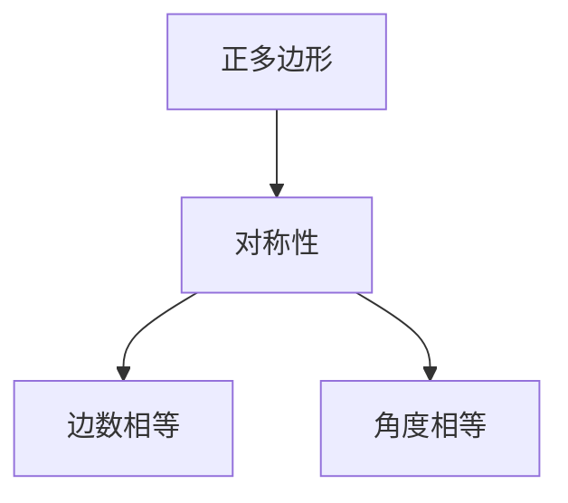
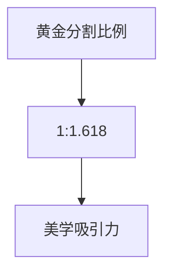
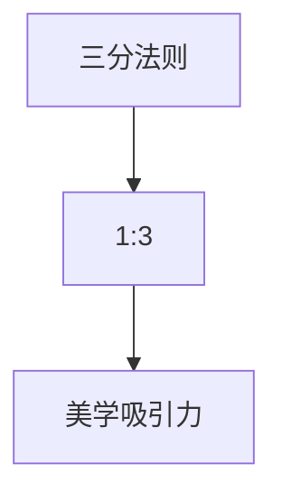

                 

### 文章标题

“数学与美学：美的形式的数学定义”

关键词：美学、数学定义、美的形式、几何图形、色彩美学、空间布局

摘要：本文将探讨美学与数学的交叉领域，通过数学定义和模型来分析和理解美的形式。文章首先概述了美学的基本概念和历史发展，然后介绍了美的形式的数学定义探索，包括几何图形、色彩美学和空间布局的数学分析。通过深入剖析美的数学公式和模型，我们试图揭示美的本质，并探讨其在艺术、设计和科技中的应用。最后，文章展望了美的数学定义的未来发展趋势，以及其在教育和社会中的意义。

### 第一部分：美的形式的数学基础

在探讨美的形式的数学定义之前，我们需要对美学和数学有一个基本的理解。美学是研究美和审美体验的学科，而数学则是研究数量、结构、变化和空间等概念的学科。尽管这两个领域看似不同，但它们在美的形式的研究中有着紧密的联系。

#### 第1章：美学概述

##### 1.1 美学的概念与历史

美学（Aesthetics）一词源自希腊语“ἀισθητικός”（aisthetikos），意为“感觉的”或“感知的”。美学作为一门独立的学科，起源于古希腊时期，随后在文艺复兴、启蒙运动和现代主义时期得到了长足发展。现代美学的研究领域包括艺术、自然、科学和技术，关注审美体验、美的本质和美的形式。

在美学的发展过程中，产生了多种不同的理论。例如，形式主义强调艺术作品的形式和结构，而情感主义则认为审美体验源于情感反应。此外，存在主义、现象学和结构主义等哲学流派也对美学产生了深远的影响。

##### 1.2 美学在当代的应用

在当代社会，美学广泛应用于艺术、设计和科技领域。在艺术中，美学原则指导艺术家的创作，使艺术作品具有更高的审美价值。在设计领域，美学原理用于产品、建筑和城市规划，提升用户体验和外观设计。在科技领域，美学原理被用于用户界面设计、人工智能和虚拟现实，以创造更人性化的科技产品。

美学在日常生活和社会中也有重要角色。人们通过美学来塑造个人形象，表达个性和审美品味。此外，美学教育有助于培养人们的审美能力，提升生活质量和社会文化水平。

##### 1.3 美学的研究方法

美学的研究方法多种多样，包括实证研究和形式化分析。实证研究通过观察、实验和调查等方法来研究审美体验和审美行为。形式化分析则通过数学和逻辑方法来探讨美的形式和本质。

实证研究方法主要包括问卷调查、实验设计和观察记录。问卷调查可以收集大量关于审美偏好的数据，实验设计可以控制变量，观察记录可以描述审美体验的具体过程。

形式化分析方法则依赖于数学和逻辑工具。例如，通过建立数学模型来描述美的形式和规律，通过逻辑推理来揭示美的本质和特征。形式化分析方法有助于将美学研究量化，提高研究的精确性和可重复性。

#### 第2章：美的数学定义探索

##### 2.1 数学与美学的交叉

数学与美学在美的形式的研究中有着紧密的联系。美学中的许多概念，如比例、对称、节奏和韵律，都可以用数学术语来描述。例如，黄金分割比例（Golden Ratio）被认为是一种美的比例，其数学定义为：$$\frac{1 + \sqrt{5}}{2} \approx 1.618$$

此外，几何图形在美学中也有着重要地位。例如，正多边形、椭圆和螺旋等几何图形被视为具有美感的形状。

##### 2.2 美的形式

美的形式包括形状、线条、颜色、空间布局和比例等方面。数学为这些形式提供了分析工具和定义方法。

形状方面，几何学中的概念如点、线、面和体可以用于描述美的形状。例如，正多边形被认为具有美感，因为它们的对称性和平衡性。

线条方面，数学中的直线、曲线和折线可以用来描述美的线条。例如，曲线通常被认为比直线更具美感，因为它们具有流动性和变化性。

颜色方面，色彩理论提供了描述和量化颜色的方法。例如，RGB模型和HSV模型可以用来表示和计算颜色。

空间布局和比例方面，数学中的比例关系和几何图形可以用来分析和设计美的空间布局。例如，黄金分割比例和三分法则在设计和艺术中被广泛应用。

##### 2.3 数学模型在美学中的应用

数学模型在美学中有着广泛的应用。例如，几何图形的美学分析可以通过数学公式和模型来进行。例如，椭圆和螺旋等几何图形的数学描述可以用于分析其美感特征。

此外，色彩理论中的数学模型也可以用于分析美的颜色组合。例如，通过计算颜色之间的相似度和对比度，可以确定哪些颜色组合更具有美感。

空间布局和比例的数学模型也可以用于设计美的空间。例如，通过应用黄金分割比例和三分法则，可以设计出具有平衡性和和谐性的空间布局。

#### 第3章：美的数学公式与模型

##### 3.1 美的数学公式

美的数学公式可以用来描述和量化美的形式。例如，黄金分割比例、斐波那契数列和海森堡不确定性原理等都是与美有关的数学公式。

黄金分割比例是一种广泛应用的美的数学公式。它定义为：$$\frac{a+b}{a} = \frac{a}{b} \approx 1.618$$

斐波那契数列也是一种与美有关的数学公式，其递推关系为：$$F_0 = 0, F_1 = 1, F_n = F_{n-1} + F_{n-2}$$

海森堡不确定性原理是量子力学中的一个重要公式，它描述了粒子的位置和动量之间的不确定性关系。虽然它本身并不是关于美的公式，但在艺术和设计领域，它被用来探讨美的形式和规律。

##### 3.2 美的数学模型

美的数学模型可以用来分析和设计美的形式。例如，几何图形的数学模型可以用于分析美的形状，色彩理论的数学模型可以用于分析美的颜色组合，空间布局的数学模型可以用于设计美的空间。

几何图形的数学模型包括点、线、面和体等基本元素。例如，正多边形的数学模型可以用于分析其美感特征，椭圆的数学模型可以用于分析其美感特征，螺旋的数学模型可以用于分析其美感特征。

色彩理论的数学模型包括RGB模型和HSV模型。RGB模型是一种加性模型，用于描述彩色光的混合。HSV模型是一种减性模型，用于描述颜色的亮度和饱和度。这些模型可以用于分析美的颜色组合。

空间布局的数学模型包括比例关系和几何图形。例如，黄金分割比例和三分法则可以用于设计美的空间布局。

##### 3.3 美的数学模型的验证

美的数学模型的验证是美学研究的重要一环。验证方法包括实证分析和逻辑推理。

实证分析通过实验和调查来验证数学模型的有效性。例如，通过问卷调查可以收集人们对美的形式和颜色的偏好数据，通过实验可以控制变量，观察数学模型对美的评价的影响。

逻辑推理通过数学和逻辑方法来验证数学模型。例如，通过证明数学公式的正确性，可以验证美的数学公式；通过证明数学模型的推导过程，可以验证美的数学模型的正确性。

#### 第4章：美的形式的数学分析

##### 4.1 几何图形的美学分析

几何图形的美学分析涉及对几何图形的基本性质、审美评价和数学模型的探讨。

几何图形的基本性质包括点、线、面和体等。点是最基本的几何元素，线是由点连接而成的，面是由线围成的，体是由面围成的。这些基本元素在美学中有着广泛的应用。

审美评价是美学研究的重要内容。不同的几何图形具有不同的美感特征。例如，正多边形通常被认为具有美感，因为它们具有对称性和平衡性。椭圆和螺旋也被认为具有美感，因为它们具有流线型和变化性。

几何图形的数学模型可以用于分析其美感特征。例如，正多边形的数学模型可以用于分析其对称性，椭圆的数学模型可以用于分析其流线型，螺旋的数学模型可以用于分析其变化性。

##### 4.2 色彩美学分析

色彩美学分析涉及对色彩的基本原理、在美学中的运用和数学模型的探讨。

色彩的基本原理包括色相、饱和度和亮度等。色相是颜色的基本属性，如红色、绿色和蓝色等。饱和度描述颜色的纯净度，亮度描述颜色的明暗程度。

色彩在美学中的运用广泛，如绘画、设计和装饰等。色彩可以影响人们的情绪和心理状态。例如，红色通常被认为具有激情和活力的感觉，而蓝色则被认为具有宁静和平静的感觉。

色彩理论的数学模型可以用于分析美的颜色组合。例如，RGB模型和HSV模型可以用于计算颜色之间的相似度和对比度，从而确定哪些颜色组合更具有美感。

##### 4.3 空间布局与比例的美学分析

空间布局与比例的美学分析涉及对空间布局的基本概念、比例在美学中的运用和数学模型的探讨。

空间布局的基本概念包括对称、不对称、平衡、对比和韵律等。对称布局通常被认为具有美感，因为它们具有平衡性和稳定性。不对称布局则具有变化性和动态感。

比例在美学中扮演着重要角色。例如，黄金分割比例被认为是一种美的比例，因为它具有平衡性和和谐性。三分法则也是一种常用的比例关系，它可以用于设计具有平衡性和视觉吸引力的布局。

空间布局和比例的数学模型可以用于分析和设计美的空间布局。例如，通过应用黄金分割比例和三分法则，可以设计出具有平衡性和和谐性的空间布局。

### 第二部分：美的形式的数学分析

在第一部分中，我们概述了美学和数学的基础知识，并探讨了美的形式的数学定义。在本部分，我们将深入分析几何图形、色彩美学和空间布局与比例的美学特征，并运用数学模型进行详细解析。

#### 第4章：几何图形的美学分析

##### 4.1 几何图形的基本性质

几何图形是美学分析的基础，其基本性质包括点、线、面和体。这些基本元素在不同维度上构成了丰富多彩的几何世界，并在美学中发挥着重要作用。

**点**：点是几何图形的最基本元素，表示一个位置。在美学中，点可以用于强调视觉焦点，如绘画中的焦点构图。

**线**：线是由点连接而成的，具有方向性和长度。线在美学中具有多样化的表现形式，如直线、曲线和折线。直线通常传达简洁和力量感，曲线则传达柔和和流畅感。

**面**：面是由线围成的，具有面积和形状。面在美学中可以用于形成视觉空间，如建筑中的外墙和室内装饰。

**体**：体是由面围成的，具有体积和形状。体在美学中可以用于构建立体空间，如雕塑和建筑设计。

##### 4.2 几何图形的审美评价

几何图形的审美评价涉及对对称性、平衡性和比例感的分析。这些评价标准可以帮助我们理解几何图形在美学中的吸引力。

**对称性**：对称是一种基本的审美原则，它可以通过镜像、旋转和平移实现。对称图形通常被认为具有稳定性和秩序感。例如，正方形和圆形因其完美的对称性而具有很高的审美价值。

**平衡性**：平衡是美学中的另一个重要概念，它涉及视觉元素在空间中的分布。平衡可以分为静态平衡和动态平衡。静态平衡强调元素的对等和稳定，而动态平衡则强调元素的变化和运动。

**比例感**：比例是美学中一个关键因素，它影响视觉元素之间的关系和整体美感。黄金分割比例是一种经典的比例关系，其数值约为1:1.618，被认为具有高度的美学吸引力。

##### 4.3 几何图形的数学模型

几何图形的数学模型可以帮助我们理解和量化美的形式。以下是一些常见的几何图形及其数学描述：

**正多边形**：正多边形是一种具有n条边的多边形，其中所有边和角都相等。正三角形、正方形和正五边形等是常见的正多边形。它们的数学模型包括边长和角度的关系。

**椭圆**：椭圆是平面上到两个焦点的距离之和为常数的点的集合。椭圆的数学模型包括其长轴和短轴的长度，以及焦点位置。

**螺旋**：螺旋是一种在平面上旋转移动的曲线。常见的螺旋包括阿基米德螺旋和对数螺旋。它们的数学模型可以通过极坐标方程来描述。

以下是一个用于描述正多边形对称性的Mermaid流程图：



以下是一个用于描述黄金分割比例的Mermaid流程图：



#### 第5章：色彩美学分析

##### 5.1 色彩的基本原理

色彩在美学中具有重要作用，其基本原理包括色相、饱和度和亮度等。这些原理可以帮助我们理解和分析美的颜色组合。

**色相**：色相是颜色的基本属性，如红色、蓝色和绿色等。不同的色相可以传达不同的情感和氛围。例如，红色通常与激情和能量相关，而蓝色则与宁静和平静相关。

**饱和度**：饱和度描述颜色的纯净度，即颜色的纯度或灰度。高饱和度的颜色通常更加鲜艳和吸引人，而低饱和度的颜色则更加柔和和平静。

**亮度**：亮度描述颜色的明暗程度。高亮度的颜色通常更加明亮和醒目，而低亮度的颜色则更加暗淡和低调。

##### 5.2 色彩在美学中的运用

色彩在美学中有着广泛的应用，如绘画、设计和装饰等。以下是一些色彩在美学中的运用实例：

**绘画**：在绘画中，色彩可以用于表达情感和氛围。例如，使用暖色调（如红色、橙色和黄色）可以传达温馨和活跃的氛围，而使用冷色调（如蓝色、绿色和紫色）则可以传达宁静和冷静的氛围。

**设计**：在设计领域，色彩可以用于提升用户体验和产品外观。例如，使用对比色可以提高界面的可读性，而使用类似色可以创造和谐和统一的效果。

**装饰**：在装饰中，色彩可以用于改变空间氛围和情感。例如，使用鲜艳的颜色可以增加空间的活力，而使用柔和的颜色则可以创造宁静和放松的氛围。

##### 5.3 色彩的数学模型

色彩的数学模型可以帮助我们分析和设计美的颜色组合。以下是一些常见的色彩模型：

**RGB模型**：RGB模型是一种加性模型，用于描述彩色光的混合。在RGB模型中，红色、绿色和蓝色（RGB）的值分别从0（最小值）到255（最大值）表示不同的颜色。以下是一个用于描述RGB模型的Mermaid流程图：

```mermaid
graph TD
A[RGB模型] --> B[红(R)]
B --> C[0-255]
D[绿(G)] --> E[0-255]
F[蓝(B)] --> G[0-255]
```

**HSV模型**：HSV模型是一种减性模型，用于描述颜色的亮度和饱和度。在HSV模型中，H（色相）、S（饱和度）和V（亮度）分别从0到1表示不同的颜色。以下是一个用于描述HSV模型的Mermaid流程图：

```mermaid
graph TD
A[HSV模型] --> B[色相(H)]
B --> C[0-360]
D[饱和度(S)] --> E[0-1]
F[亮度(V)] --> G[0-1]
```

#### 第6章：空间布局与比例的美学分析

##### 6.1 空间布局的概念

空间布局是美学分析中的一个关键概念，它涉及视觉元素在空间中的排列和分布。以下是一些空间布局的基本原则：

**对称布局**：对称布局通过镜像或旋转实现，通常具有稳定性和秩序感。对称布局可以分为轴对称和中心对称。

**不对称布局**：不对称布局通常具有变化性和动态感，通过打破对称性来创造视觉吸引力和动感。

**平衡布局**：平衡布局强调视觉元素之间的平衡和协调，可以分为静态平衡和动态平衡。

**对比布局**：对比布局通过对比和冲突来创造视觉焦点和层次感。对比可以是颜色、形状、大小或位置等。

##### 6.2 比例在美学中的运用

比例在美学中扮演着重要角色，它影响视觉元素之间的关系和整体美感。以下是一些常用的比例关系：

**黄金分割比例**：黄金分割比例是一种经典的比例关系，其数值约为1:1.618。在美学中，黄金分割比例被广泛应用于绘画、设计和建筑等领域。

**三分法则**：三分法则是一种简单而有效的比例关系，将空间分为三个部分，通常用于摄影、绘画和设计。

**对称与不对称比例**：对称比例通常传达平衡和稳定，而不对称比例则传达变化和动感。

##### 6.3 空间布局与比例的数学模型

空间布局与比例的数学模型可以帮助我们分析和设计美的空间布局。以下是一些常见的数学模型：

**黄金分割比例模型**：黄金分割比例模型可以通过以下公式计算：

$$\frac{a+b}{a} = \frac{a}{b} \approx 1.618$$

其中，a和b是空间布局中的两个相邻部分。

**三分法则模型**：三分法则模型可以通过以下公式计算：

$$\frac{a}{b+c} = \frac{1}{3}$$

其中，a、b和c是空间布局中的三个相邻部分。

以下是一个用于描述黄金分割比例的Mermaid流程图：


以下是一个用于描述三分法则的Mermaid流程图：



### 第三部分：美的数学定义的应用与展望

在第二部分中，我们深入分析了美的形式的数学基础，包括几何图形、色彩美学和空间布局与比例的美学特征。在本部分，我们将探讨美的数学定义在艺术、设计和科技中的应用，并展望其未来发展趋势。

#### 第7章：美的数学定义在艺术中的应用

##### 7.1 艺术创作中的数学运用

艺术创作中的数学运用是一个跨学科的研究领域，它将数学与艺术创作相结合，创造出独特的美学效果。以下是一些艺术创作中常见的数学运用：

**几何图形**：几何图形在艺术创作中有着广泛的应用。例如，画家可以通过绘制几何图形来创造出简洁、清晰和具有平衡感的作品。毕加索的某些作品就运用了几何图形来表现形式和空间。

**黄金分割比例**：黄金分割比例是一种被广泛接受的美学原则，它在艺术创作中有着重要的应用。许多艺术家在绘画、雕塑和建筑设计中运用黄金分割比例来创造和谐、平衡和引人注目的作品。

**斐波那契数列**：斐波那契数列是一种在自然界中广泛存在的数学序列，它在艺术创作中也有着重要的应用。例如，一些艺术家通过运用斐波那契数列来创作具有和谐美感的作品。

**色彩理论**：色彩理论在艺术创作中起着至关重要的作用。艺术家可以通过运用色彩理论来创造出具有情感和氛围的艺术作品。例如，红色通常与激情和能量相关，而蓝色则与宁静和平静相关。

**空间布局与比例**：空间布局与比例在艺术创作中有着广泛的应用。艺术家可以通过运用黄金分割比例和三分法则来设计具有平衡感和视觉吸引力的艺术作品。

##### 7.2 美的数学定义对艺术创作的影响

美的数学定义对艺术创作有着深远的影响。通过运用数学原理和公式，艺术家可以创造出具有高度美学价值的作品。以下是一些美的数学定义对艺术创作的影响：

**创新与启发**：美的数学定义为艺术家提供了新的创作灵感和方法。通过运用数学原理，艺术家可以创造出前所未有的艺术形式和表达方式。

**形式化分析**：美的数学定义可以帮助艺术家进行形式化分析，从而更好地理解艺术作品的结构和美学特征。例如，通过分析几何图形和比例关系，艺术家可以更好地掌握艺术作品的平衡感和和谐性。

**量化评价**：美的数学定义可以用于量化评价艺术作品的美学价值。例如，通过计算黄金分割比例和斐波那契数列的应用程度，可以对艺术作品进行量化评价。

##### 7.3 美的数学定义在艺术教育中的应用

美的数学定义在艺术教育中也有着重要的应用。通过将数学原理和美学原则相结合，艺术教育可以更有效地培养学生的审美能力和创造力。以下是一些美的数学定义在艺术教育中的应用：

**课程设计**：艺术教育课程可以结合美的数学定义，教授学生如何运用数学原理来创作艺术作品。例如，可以设置几何图形、黄金分割比例和色彩理论等专题课程。

**实践活动**：艺术教育实践活动可以结合美的数学定义，让学生通过实际操作来体验和掌握数学原理。例如，可以组织绘画、雕塑和建筑设计等活动，让学生运用黄金分割比例和斐波那契数列等数学原理来创作艺术作品。

**评价体系**：艺术教育评价体系可以结合美的数学定义，对学生的艺术作品进行量化评价。例如，可以设置评分标准，根据黄金分割比例和斐波那契数列等数学原理的应用程度来评价学生的艺术作品。

### 第8章：美的数学定义在设计和科技中的运用

##### 8.1 美的数学定义在建筑设计中的应用

建筑设计中，美的数学定义发挥着重要作用，它帮助设计师创造出既实用又美观的建筑作品。以下是一些美的数学定义在建筑设计中的应用：

**黄金分割比例**：黄金分割比例在建筑设计中被广泛应用于立面设计、窗户和门的布局、以及室内空间的规划。通过运用黄金分割比例，设计师可以创造出具有和谐感和美学价值的建筑作品。

**斐波那契数列**：斐波那契数列在建筑设计中也有着广泛的应用。例如，一些建筑作品在高度和宽度上遵循斐波那契数列的规律，从而创造出具有美感的外观。

**空间布局与比例**：空间布局与比例在建筑设计中起着关键作用。通过运用黄金分割比例和三分法则等数学原理，设计师可以创造出具有平衡感和视觉吸引力的建筑空间。

**色彩理论**：色彩理论在建筑设计中可以帮助设计师选择合适的颜色方案，以创造温馨、舒适和吸引人的室内空间。

##### 8.2 美的数学定义在产品设计中的应用

产品设计中，美的数学定义被广泛应用于外观设计和用户体验。以下是一些美的数学定义在产品设计中的应用：

**几何图形**：几何图形在产品设计中被广泛应用于外观设计。例如，设计师可以通过运用正多边形、椭圆和螺旋等几何图形来创造出美观、流畅和具有吸引力的产品外观。

**黄金分割比例**：黄金分割比例在产品设计中被广泛应用于界面设计和按钮布局。通过运用黄金分割比例，设计师可以创造出具有和谐感和用户体验良好的产品界面。

**色彩理论**：色彩理论在产品设计中被广泛应用于颜色选择和搭配。通过运用色彩理论，设计师可以创造出具有吸引力和情感共鸣的产品。

**空间布局与比例**：空间布局与比例在产品设计中起着重要作用。通过运用黄金分割比例和三分法则等数学原理，设计师可以创造出具有平衡感和用户体验良好的产品。

##### 8.3 美的数学定义在科技产品中的应用

美的数学定义在科技产品中也有着广泛的应用，它帮助设计师和工程师创造出既美观又实用的产品。以下是一些美的数学定义在科技产品中的应用：

**用户界面设计**：用户界面设计是科技产品中的一个关键方面。通过运用美的数学定义，设计师可以创造出具有和谐感和用户体验良好的用户界面。例如，通过运用黄金分割比例和三分法则等数学原理，设计师可以优化按钮布局和界面元素的位置。

**虚拟现实**：虚拟现实技术中，美的数学定义被广泛应用于场景设计和交互体验。通过运用几何图形和比例关系，设计师可以创造出具有沉浸感和视觉吸引力的虚拟场景。

**人工智能**：人工智能技术在美的数学定义中也有应用。例如，通过运用色彩理论和几何图形识别算法，人工智能系统可以分析和评价艺术作品的美学价值。

### 第9章：美的数学定义的未来展望

##### 9.1 美的数学定义的发展趋势

随着科技的进步和跨学科研究的发展，美的数学定义在未来将继续得到深入研究和发展。以下是一些美的数学定义的发展趋势：

**多学科融合**：美的数学定义将在不同学科之间进行更深入的融合。例如，计算机科学、物理学、生物学和心理学等领域将与美学研究相结合，推动美的数学定义的跨学科发展。

**大数据分析**：随着大数据技术的发展，美的数学定义将能够处理和分析海量的审美数据。通过大数据分析，研究者可以更准确地理解和量化美的形式和规律。

**人工智能应用**：人工智能技术在美的数学定义中的应用将越来越广泛。通过机器学习和深度学习算法，人工智能系统可以自动分析和评价艺术作品的美学价值，为艺术创作提供新的工具和方法。

**虚拟现实与增强现实**：虚拟现实和增强现实技术的快速发展将为美的数学定义提供新的应用场景。通过运用美的数学定义，虚拟现实和增强现实系统可以创造出更加逼真和具有吸引力的虚拟环境和体验。

##### 9.2 美的数学定义的实际应用前景

美的数学定义在实际应用中具有广泛的前景。以下是一些美的数学定义的实际应用前景：

**艺术与设计**：在艺术与设计领域，美的数学定义将帮助艺术家和设计师创造出更加具有美学价值的作品。通过运用几何图形、黄金分割比例和色彩理论等数学原理，艺术作品和设计作品可以更具吸引力和艺术性。

**建筑与城市规划**：在建筑和城市规划领域，美的数学定义将帮助设计师创造出更加美观和功能性的建筑和城市空间。通过运用黄金分割比例、斐波那契数列和空间布局等数学原理，建筑和城市规划可以更具有和谐感和美学价值。

**科技产品**：在科技产品领域，美的数学定义将帮助设计师和工程师创造出更加美观和实用的产品。通过运用几何图形、黄金分割比例和色彩理论等数学原理，科技产品可以更具有用户体验和吸引力。

**教育与培训**：在教育和培训领域，美的数学定义将帮助教育工作者更好地教授美学知识和技能。通过结合美的数学定义和实际案例分析，学生可以更深入地理解和掌握美的形式和规律。

##### 9.3 美的数学定义在教育和社会中的意义

美的数学定义在教育和社会中具有重要的意义。以下是一些美的数学定义在教育和社会中的意义：

**培养审美能力**：美的数学定义可以帮助学生培养审美能力，提升对美的感知和鉴赏能力。通过学习美的数学定义，学生可以更好地理解和欣赏艺术作品、设计作品和建筑作品。

**激发创造力**：美的数学定义可以激发学生的创造力，培养他们的创新思维和设计能力。通过运用美的数学定义，学生可以创造出具有独特美学价值的作品，展现他们的创造力和想象力。

**促进跨学科交流**：美的数学定义将促进不同学科之间的交流和合作。通过跨学科研究，美的数学定义可以为其他学科提供新的视角和方法，推动学科之间的融合和发展。

**提升社会文化水平**：美的数学定义可以提高社会的文化水平，培养公民的审美素养和文化修养。通过美学教育和美的数学定义的研究，社会可以更具有艺术性和文化性，提高整体审美水平。

### 第10章：美的数学定义的案例研究

##### 10.1 著名艺术作品中的美的数学定义分析

在艺术史上，许多著名艺术作品展现了美的数学定义的应用。以下是一些例子及其美的数学定义分析：

**达芬奇的《蒙娜丽莎》**：这幅名画在构图和色彩运用上体现了黄金分割比例。通过将人物面部位置和画框边缘对齐，达芬奇创造了一个具有平衡感和美学吸引力的作品。

**毕加索的《亚维农的少女》**：这幅画作在几何图形的应用上具有显著特点。毕加索通过运用正方形、三角形和曲线等几何图形，创造了一个富有动感和现代感的艺术作品。

**梵高的《星夜》**：这幅画作在色彩运用上体现了色彩理论。梵高通过使用强烈的对比色和明暗变化，创造出一种充满情感和活力的艺术效果。

**莫奈的《睡莲》**：这幅画作在空间布局和比例运用上具有独特之处。莫奈通过运用黄金分割比例和三分法则，创造了一个具有和谐感和视觉吸引力的艺术作品。

##### 10.2 科技产品中的美的数学定义实践

在科技产品领域，美的数学定义在产品设计中被广泛应用。以下是一些科技产品中的美的数学定义实践：

**苹果公司的iPhone**：iPhone的设计在几何图形和比例运用上具有显著特点。通过运用黄金分割比例和对称布局，iPhone的外观设计具有简洁、美观和用户体验良好的特点。

**索尼的Xperia手机**：Xperia手机的设计在色彩理论和空间布局上具有独特之处。通过运用色彩理论和黄金分割比例，Xperia的屏幕布局和界面设计具有平衡感和视觉吸引力。

**微软的Surface系列平板电脑**：Surface平板电脑的设计在几何图形和空间布局上具有显著特点。通过运用正方形和圆形等几何图形，Surface的接口设计和交互体验具有简洁、直观和美学价值。

##### 10.3 社会文化现象中的美的数学定义探讨

在社会文化现象中，美的数学定义的应用和影响无处不在。以下是一些社会文化现象中的美的数学定义探讨：

**建筑与城市规划**：在城市规划和建筑设计中，美的数学定义被广泛应用于创造和谐和美观的城市空间。例如，纽约的中央公园和巴黎的卢浮宫等著名建筑作品，都体现了黄金分割比例和几何图形的应用。

**时尚与服饰设计**：在时尚和服饰设计中，美的数学定义被广泛应用于创造时尚和吸引人的服饰。例如，高跟鞋的设计在高度和比例上遵循美的数学定义，创造出既美观又舒适的产品。

**广告与宣传**：在广告和宣传中，美的数学定义被广泛应用于创造吸引力和记忆点的广告作品。例如，通过运用黄金分割比例和色彩理论，广告作品可以更具视觉冲击力和记忆效果。

### 附录：美的数学定义的相关资源

#### 附录 A：美的数学定义研究资料推荐

**书籍推荐**：

1. 《美的数学定义》（The Mathematical Definition of Beauty）- 作者：乔治·迪基
2. 《美学与数学的交叉》（The Interplay of Aesthetics and Mathematics）- 作者：彼得·J·戴维斯

**论文推荐**：

1. "The Golden Ratio: A Guide to the Mathematics of Beauty" - 作者：乔治·迪基
2. "The Role of Mathematics in Art and Design" - 作者：彼得·J·戴维斯

**美学研究机构和学术期刊介绍**：

1. 国际美学协会（International Association for Aesthetics）
2. 美学期刊（Journal of Aesthetics and Art Criticism）
3. 数学与美学期刊（Mathematical Aesthetics Journal）

#### 附录 B：美的数学定义研究工具与资源

**在线工具**：

1. 数学公式编辑器（MathType）
2. 色彩理论计算器（Color Theory Calculator）
3. 几何图形生成器（Geometry Generator）

**开源库和软件**：

1. Matplotlib：用于绘制数学图形和可视化数据
2. OpenCV：用于计算机视觉和图像处理
3. TensorFlow：用于机器学习和深度学习

### 总结

美的数学定义是一个跨学科的研究领域，它将美学和数学相结合，探索美的形式和本质。通过分析几何图形、色彩美学和空间布局与比例，我们可以更好地理解和量化美的形式。在艺术、设计和科技领域，美的数学定义的应用越来越广泛，它为创作、设计和优化美的作品提供了新的工具和方法。随着科技的进步和跨学科研究的发展，美的数学定义将继续发挥重要作用，为美学研究和实际应用提供新的启示和动力。

