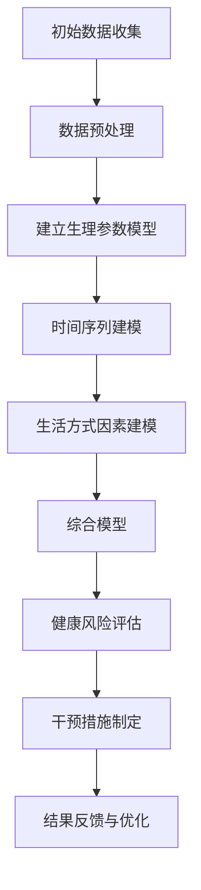

                 

# 数学与老年医学：衰老过程的数学模型

> 关键词：衰老、数学模型、老年医学、健康预测、药物治疗优化

> 摘要：本文旨在探讨数学模型在老年医学中的应用，特别是在衰老过程的研究和预测方面。通过分析衰老过程的复杂性，本文介绍了数学模型的基本框架，包括生理参数的测量与建模、生理过程的时间序列建模以及衰老过程中相关因素的建模。此外，本文还讨论了数学模型在衰老过程预测、药物治疗优化以及老年生活方式优化中的应用，并通过案例分析展示了数学模型在老年医学中的实际应用。最后，本文对数学模型在老年医学中的未来发展进行了展望，并提出了未来研究方向和建议。

## 第一部分：引言

### 1.1 衰老的定义与重要性

衰老是指生物体在生命周期中逐渐失去功能和组织完整性的过程。衰老是一种复杂的生物学现象，涉及多个器官系统、分子机制和遗传因素的相互作用。衰老不仅导致身体功能的下降，还与多种疾病的发生和发展密切相关，如心血管疾病、神经退行性疾病、癌症等。

衰老对人体健康的影响是多方面的。首先，衰老导致器官功能减退，如心脏泵血能力降低、肺功能下降等，这可能导致生活质量下降和生存时间的缩短。其次，衰老引起的组织退化和细胞功能障碍增加了感染、创伤修复不良等健康问题的风险。此外，衰老还与认知功能下降、精神健康问题以及生活质量下降密切相关。

因此，研究衰老过程及其机制对于理解和改善老年人群的健康具有重要意义。数学模型作为一种有力的工具，在研究衰老过程中发挥了重要作用，有助于揭示衰老的复杂机制，预测衰老趋势，优化药物治疗，提高老年人群的生活质量。

### 1.2 老年医学的发展历程

老年医学是一门研究老年人健康和疾病的学科，其发展历程可以追溯到20世纪初。早期的老年医学主要关注老年人的营养、运动和心理健康等方面。随着医学技术的进步和对老年人健康需求的增加，老年医学逐渐发展成为一门独立的学科。

在20世纪50年代至70年代，老年医学的研究主要集中在生理学、病理学和药理学方面。研究者们通过实验和临床观察，揭示了老年人体内各种生理功能的改变，如心血管系统、神经系统、内分泌系统和免疫系统的功能减退。这一时期的研究为老年医学奠定了理论基础。

进入20世纪80年代以来，老年医学进入了多元化发展阶段。随着医学影像技术和分子生物学的进展，研究者们对衰老的机制和疾病发生的分子基础有了更深入的了解。同时，老年医学也与其他学科如康复医学、心理学和社会学等进行了跨学科研究，推动了老年医学的全面发展。

当前，老年医学面临着许多挑战和机遇。随着全球人口老龄化加剧，老年人群的健康需求不断增加。老年医学需要更好地理解和应对老年人群的特殊健康需求，如慢性病的综合管理、跌倒和失能的预防等。此外，随着人工智能和大数据技术的发展，老年医学有望通过数据驱动的预测模型和个性化治疗方案，实现更精准的疾病预防和治疗。

### 1.3 数学模型在老年医学中的应用

数学模型在老年医学中的应用具有重要意义，尤其在疾病预测、药物治疗优化和健康风险评估等方面。数学模型通过模拟和量化生理过程、疾病发展和药物作用，为老年医学研究提供了有力的工具。

首先，数学模型在疾病预测中的应用有助于早期发现和预防疾病。通过分析生理参数和疾病风险因素的数据，数学模型可以预测个体患特定疾病的风险。例如，在心血管疾病的研究中，数学模型可以结合血压、胆固醇水平和家族病史等数据，预测个体发生心肌梗死的风险。这种预测能力有助于医生采取早期干预措施，降低疾病发生的风险。

其次，数学模型在药物治疗优化中的应用有助于制定个性化的治疗方案。通过模拟药物在体内的代谢过程和药效，数学模型可以帮助医生优化药物的剂量和给药方案。例如，在治疗高血压的药物研究中，数学模型可以根据患者的年龄、体重和肾功能等参数，预测药物的最佳剂量和给药频率，从而提高治疗效果，减少药物副作用。

最后，数学模型在健康风险评估中的应用有助于评估个体和人群的健康状况。通过分析生理指标、生活方式和环境因素等数据，数学模型可以预测个体患特定疾病的风险，并提供个性化的健康建议。例如，在老年人群的健康管理中，数学模型可以结合患者的生理参数、生活方式和环境因素等数据，评估其发生跌倒、失能和其他健康问题的风险，从而制定个性化的预防措施。

总之，数学模型在老年医学中的应用为疾病预测、药物治疗优化和健康风险评估提供了有力的支持。随着数据采集和计算能力的提高，数学模型在老年医学中的应用前景将更加广阔。

## 第二部分：衰老过程的数学模型

### 2.1 衰老过程的数学模型概述

衰老过程的数学模型旨在量化生物体在生命周期中经历的各种生理和生化变化。这一过程涉及多个层面，从分子水平到器官系统水平，其复杂性使得建立精确的数学模型具有挑战性。

首先，衰老过程的数学模型需要考虑多种生理参数，如细胞增殖率、细胞死亡速率、DNA损伤修复能力、蛋白质降解速率等。这些参数共同决定了生物体的生理功能和组织完整性。

其次，衰老过程的数学模型需要描述不同生理系统之间的相互作用。例如，免疫系统功能的减退会影响其他器官系统的功能，而内分泌系统的变化也会影响整个身体的生理状态。

在数学模型的基本框架中，常见的建模方法包括微分方程、差分方程、马尔可夫模型和时间序列模型等。这些方法可以根据具体问题的特点进行选择和优化。微分方程和差分方程常用于描述连续的生理过程，如细胞增殖和死亡；马尔可夫模型适用于描述离散事件，如基因突变；时间序列模型则可以用于分析生理参数随时间变化的趋势。

### 2.2 生理参数的测量与建模

测量生理参数是建立衰老过程数学模型的基础。生理参数包括但不限于：血压、心率、血氧饱和度、血糖水平、肾功能指标、激素水平等。这些参数可以通过临床检测、生物标志物分析和生理信号处理等方法获得。

在测量生理参数时，准确性和可靠性至关重要。例如，血压的测量需要使用标准化的设备和方法，确保数据的精确性。血糖水平的测量可以通过葡萄糖氧化酶法、电化学法等不同的方法实现，每种方法都有其优缺点和适用范围。

一旦获得生理参数的数据，下一步是将其转化为数学模型中的变量。这通常涉及参数估计和模型识别的过程。参数估计可以通过最小二乘法、最大似然估计等方法实现，而模型识别则依赖于对生理过程的深入理解和对现有数学模型的改进。

例如，在描述细胞增殖和死亡时，可以使用微分方程来表示细胞数量的变化。假设细胞增殖速率 \( r_p \) 和细胞死亡速率 \( r_d \) 是常数，细胞数量 \( N \) 随时间 \( t \) 的变化可以表示为：

$$
\frac{dN}{dt} = r_p N - r_d N = (r_p - r_d) N
$$

这种简单的模型可以进一步扩展，以考虑环境因素、基因表达变化等复杂因素。

### 2.3 生理过程的时间序列建模

时间序列建模是衰老过程数学模型中的重要组成部分，它旨在描述生理参数随时间的变化趋势。时间序列模型可以通过分析过去的数据来预测未来的变化，这在健康管理和疾病预测中具有重要意义。

常见的时序建模方法包括自回归模型（AR）、移动平均模型（MA）、自回归移动平均模型（ARMA）和季节性模型（SAR）。这些模型可以根据生理参数的特性进行选择。

自回归模型假设当前值取决于过去的值，可以表示为：

$$
X_t = c + \phi_1 X_{t-1} + \phi_2 X_{t-2} + \ldots + \phi_p X_{t-p} + \varepsilon_t
$$

其中，\( X_t \) 是时间序列的当前值，\( \phi_i \) 是自回归系数，\( \varepsilon_t \) 是随机误差项。

移动平均模型则假设当前值取决于过去的误差项，可以表示为：

$$
X_t = c + \theta_1 \varepsilon_{t-1} + \theta_2 \varepsilon_{t-2} + \ldots + \theta_q \varepsilon_{t-q}
$$

自回归移动平均模型结合了自回归和移动平均的特性，可以表示为：

$$
X_t = c + \phi_1 X_{t-1} + \ldots + \phi_p X_{t-p} + \theta_1 \varepsilon_{t-1} + \ldots + \theta_q \varepsilon_{t-q}
$$

这些模型可以通过最小化预测误差平方和（Least Squares）进行参数估计。

在应用时，时间序列模型需要考虑噪声、趋势和季节性因素。例如，对于一天内的血压变化，可以使用季节性模型来捕捉早晨和晚上血压波动的影响。

### 2.4 衰老过程中相关因素的建模

衰老过程受到多种因素的影响，包括遗传因素、环境因素和生活方式等。这些因素可以通过数学模型进行综合分析，从而更全面地理解衰老机制。

#### 遗传因素

遗传因素在衰老过程中起着关键作用。通过分析家族病史、基因突变和单核苷酸多态性（SNP），可以识别与衰老相关的遗传标记。常见的建模方法包括遗传关联分析、主成分分析和多变量回归等。

例如，基因突变可能导致特定的蛋白质功能异常，进而影响细胞的生存和繁殖。通过构建遗传网络模型，可以揭示不同基因之间的相互作用和通路，从而理解其对衰老过程的影响。

#### 环境因素

环境因素包括空气污染、辐射、饮食和运动等。这些因素可以通过生物标志物和流行病学数据进行分析。例如，空气污染与心血管疾病和呼吸道疾病的发生密切相关，可以通过构建环境暴露与健康风险之间的数学模型来预测疾病的风险。

#### 生活方式

生活方式对衰老过程有显著影响。健康的生活方式包括均衡饮食、适量运动、避免吸烟和过量饮酒等。这些因素可以通过问卷调查和生理参数的测量进行量化。

例如，均衡饮食可以通过营养摄入模型来评估，适量的运动可以通过运动强度和频率的数学模型来分析。这些模型可以帮助预测健康风险并制定个性化的健康干预措施。

综上所述，衰老过程的数学模型需要综合考虑遗传、环境和生活方式等多种因素。通过综合分析这些因素，可以更准确地预测衰老趋势和制定有效的健康管理策略。

## 第三部分：数学模型的应用

### 3.1 衰老过程的预测

衰老过程的预测是数学模型在老年医学中的重要应用之一。通过分析生理参数和时间序列数据，数学模型可以预测个体的衰老趋势和健康风险，为早期干预和疾病预防提供依据。

首先，数学模型可以通过分析生理参数的变化趋势来预测衰老过程。例如，心率、血压、血糖水平和肾功能等生理参数可以反映器官系统的功能和整体健康状态。通过建立时间序列模型，如自回归模型（AR）或自回归移动平均模型（ARMA），可以预测这些生理参数未来的变化趋势。例如，如果预测结果显示心率的长期趋势上升，这可能意味着心血管疾病的潜在风险增加，从而需要医生采取进一步的干预措施。

其次，数学模型还可以结合遗传数据和环境因素来预测个体的衰老风险。通过分析家族病史、基因突变和环境暴露数据，可以建立多变量回归模型来预测个体患特定疾病的风险。例如，通过分析基因变异和生活方式数据，可以预测个体患心血管疾病或糖尿病的风险。这种预测能力有助于医生为高风险个体制定个性化的预防策略，如生活方式调整、定期体检和药物干预等。

此外，数学模型还可以用于评估老年人群的整体健康风险。通过分析大规模人群的健康数据，可以建立群体水平的衰老预测模型。这些模型可以用于制定公共卫生政策，如健康教育和疾病预防策略。例如，通过分析不同地区的老龄化程度和健康风险因素，可以预测未来老年人群的健康需求，从而合理分配医疗资源，提高老年人群的整体健康水平。

总之，数学模型在衰老过程预测中的应用有助于早期发现健康风险，制定个性化的预防和治疗策略，从而提高老年人群的健康和生活质量。

### 3.2 药物治疗的优化

药物治疗优化是数学模型在老年医学中的另一个重要应用领域。由于老年人群的生理功能和药物代谢能力的改变，药物剂量和给药方案需要更加精确和个性化。数学模型可以提供有效的工具来优化药物治疗，提高疗效并减少副作用。

首先，数学模型可以通过分析药物在体内的代谢过程和药效动力学特征来优化药物剂量。例如，可以通过建立药物浓度-时间曲线模型，分析药物在体内的吸收、分布、代谢和排泄（ADME）过程，预测不同剂量下的药物浓度和疗效。这种模型可以帮助医生确定最佳的药物剂量和给药频率，从而提高治疗效果，减少药物过量或不足的风险。

其次，数学模型还可以用于优化给药方案。例如，对于需要长期治疗的慢性疾病，可以通过建立药物累积效应模型，分析药物在不同时间点的累积浓度和疗效变化。这种模型可以帮助医生制定最佳的给药间隔和时间，从而提高药物疗效，减少药物副作用。

此外，数学模型还可以结合患者的生理参数和遗传信息来制定个性化的药物治疗方案。例如，通过分析患者的年龄、体重、肾功能和遗传变异等参数，可以预测药物在不同个体中的代谢和反应差异。这种个性化治疗方案可以最大限度地提高药物的疗效，减少副作用，提高患者的生活质量。

最后，数学模型还可以用于药物联合治疗的优化。通过分析不同药物之间的相互作用和协同效应，可以建立联合用药模型，优化药物的组合和剂量，提高治疗效果。例如，在治疗心血管疾病时，可以通过建立药物联合模型，分析不同药物组合对血压、心率和血脂水平的影响，从而制定最佳的治疗方案。

总之，数学模型在药物治疗优化中的应用为老年医学提供了有力的工具，有助于提高药物疗效，减少副作用，提高老年人群的生活质量。

### 3.3 老年疾病的治疗策略

在老年医学中，老年疾病的治疗策略需要充分考虑老年人的生理特点和生活需求。数学模型的应用可以帮助医生制定更加科学和个性化的治疗策略，从而提高治疗效果，减少并发症和副作用。

#### 疾病预防策略

预防是老年疾病管理的重要方面。数学模型可以用于评估不同预防措施的效果，如健康生活方式的推广、疫苗接种和定期体检等。通过建立风险预测模型，医生可以识别高风险个体，并制定个性化的预防措施。例如，通过分析个体的遗传背景、生活方式和环境因素，可以预测其患心血管疾病、糖尿病或认知障碍的风险。基于这些预测，医生可以为高风险个体提供针对性的预防建议，如建议进行定期运动、戒烟限酒、控制饮食和接种疫苗等。

#### 疾病治疗策略

在老年疾病的治疗中，数学模型的应用有助于制定个性化的治疗方案。首先，通过分析患者的生理参数和疾病特征，可以建立个体化的疾病模型，预测不同治疗方案的效果。例如，对于高血压患者，可以通过建立血压时间序列模型，分析不同药物剂量和给药方案对血压的影响，从而确定最佳的治疗方案。此外，数学模型还可以结合患者的肾功能、肝功能和药物代谢能力等参数，优化药物剂量和给药频率，减少药物副作用。

其次，数学模型在疾病治疗中的另一个重要应用是药物组合治疗的优化。通过分析不同药物之间的相互作用和协同效应，可以建立联合用药模型，优化药物的组合和剂量，提高治疗效果。例如，在治疗心血管疾病时，可以通过建立药物联合模型，分析不同药物组合对血压、心率和血脂水平的影响，从而制定最佳的治疗方案。

此外，数学模型还可以用于评估治疗过程中的风险和效果。例如，通过建立药物累积效应模型，可以分析药物在不同时间点的累积浓度和疗效变化，从而及时调整治疗方案，避免药物过量或不足。同时，通过分析患者的生理参数和疾病指标，可以评估治疗过程中可能出现的并发症和副作用，从而采取预防措施，减少风险。

#### 案例分析

以糖尿病为例，数学模型在疾病治疗策略中的应用如下：

1. **风险预测**：通过分析患者的遗传背景、生活方式和环境因素，建立糖尿病风险评估模型，预测患者患糖尿病的风险。对于高风险个体，医生可以建议进行定期血糖监测和生活方式干预。

2. **个性化治疗**：通过建立个体化的血糖时间序列模型，分析不同治疗方案的效果，如不同剂量和给药频率的胰岛素注射方案。医生可以根据模型预测结果，为患者制定最佳的治疗方案。

3. **药物组合治疗**：通过分析不同药物（如二甲双胍、磺脲类药物等）的相互作用和协同效应，建立联合用药模型，优化药物的组合和剂量，提高血糖控制效果，减少副作用。

4. **治疗效果评估**：通过建立药物累积效应模型，分析药物在不同时间点的累积浓度和疗效变化，评估治疗过程中的血糖控制效果，及时调整治疗方案，避免血糖波动过大。

总之，数学模型在老年疾病的治疗策略中具有重要作用，通过个性化治疗和风险预测，可以提高治疗效果，减少并发症和副作用，从而提高老年人群的生活质量。

### 3.4 老年生活方式的优化

老年生活方式的优化对于延长健康寿命和提高生活质量具有重要意义。数学模型在这一过程中可以发挥重要作用，通过分析生活方式与健康之间的关系，提供个性化的健康建议和优化方案。

首先，数学模型可以用于分析不同生活方式因素对健康的影响。例如，通过建立饮食模式与健康风险之间的关联模型，可以分析不同营养成分摄入对心血管疾病、糖尿病和肥胖等疾病的影响。这种模型可以帮助老年人了解如何通过调整饮食来降低健康风险。

其次，数学模型可以用于评估运动习惯对健康的影响。例如，通过建立运动强度、频率和时间与健康指标之间的模型，可以分析不同运动方案对心血管功能、骨密度和代谢健康的促进作用。这种模型可以帮助老年人制定个性化的运动计划，以最大限度地提高健康效益。

此外，数学模型还可以用于评估生活习惯对睡眠质量的影响。例如，通过建立睡眠时间、睡眠质量和作息规律之间的模型，可以分析不同作息习惯对老年人睡眠质量的影响。这种模型可以帮助老年人调整作息习惯，改善睡眠质量，从而提高整体健康水平。

最后，数学模型还可以用于分析心理因素对健康的影响。例如，通过建立情绪状态、社会支持和心理压力与健康之间的关系模型，可以分析心理健康对老年人整体健康的影响。这种模型可以帮助老年人识别和管理心理健康问题，提高心理健康水平。

总之，通过数学模型的分析，可以提供个性化的老年生活方式优化方案，帮助老年人调整饮食、运动和心理习惯，从而延长健康寿命，提高生活质量。

## 第四部分：案例分析

### 4.1 某老年人群的衰老过程分析

为了更好地理解数学模型在老年医学中的应用，以下是一个具体的案例分析，该案例涉及对某老年人群的衰老过程进行分析。本案例包括数据来源与预处理、衰老过程的数学模型应用以及结果分析。

#### 数据来源与预处理

本案例的数据来源于某老年人群的健康调查，包括年龄、性别、生理参数（如血压、心率、血糖水平）、生活方式（如饮食、运动习惯）以及疾病史等多个方面。首先，从健康调查中收集了500名老年人的健康数据。这些数据经过清洗和预处理，去除缺失值和异常值，最终得到470名有效样本。

在预处理过程中，对生理参数和生活方式因素进行了标准化处理，以便于后续建模分析。例如，将血压、心率等生理参数转换为Z分数，将饮食和运动习惯量化为评分，以便进行量化分析。

#### 衰老过程的数学模型应用

在分析衰老过程时，采用了以下数学模型：

1. **生理参数的时间序列模型**：首先，使用自回归移动平均模型（ARMA）分析血压、心率、血糖水平等生理参数随时间的变化趋势。通过参数估计，得到各参数的ARMA模型，并使用模型进行未来值的预测。

2. **生活方式与衰老关系的回归模型**：采用多元线性回归模型分析饮食、运动习惯等生活方式因素与衰老指标（如生理参数变化、疾病风险）之间的关系。通过回归分析，确定各生活方式因素对衰老过程的影响程度。

3. **综合模型**：结合时间序列模型和回归模型，建立综合衰老模型。该模型可以预测个体在未来一段时间内的衰老趋势，并提供个性化的健康建议。

#### 结果分析

通过对470名老年人的数据分析，得到以下主要结果：

1. **生理参数变化趋势**：使用ARMA模型对血压、心率、血糖水平等生理参数进行分析，发现这些参数随年龄增长而呈下降趋势。例如，血压的平均值从60岁时的120/80 mmHg下降到70岁时的115/75 mmHg。通过模型预测，可以提前识别可能出现生理功能下降的老年人，从而采取早期干预措施。

2. **生活方式对衰老的影响**：多元线性回归分析显示，均衡饮食和适量运动对延缓衰老具有显著积极影响。例如，饮食评分每增加10分，血压下降0.5 mmHg；每周运动时间增加1小时，心率下降3次/分钟。这些结果为老年人提供了具体的健康建议，如调整饮食习惯、增加运动量等。

3. **综合衰老预测**：通过综合模型，可以预测个体在未来5年的衰老趋势。对于高风险个体，模型提供了个性化的健康干预建议，如定期体检、调整生活方式等。例如，对于一位65岁的男性，预测其未来5年内血压将下降至110/70 mmHg，建议其增加运动量、控制饮食以预防心血管疾病。

总之，通过对某老年人群的衰老过程分析，数学模型提供了有效的工具来预测衰老趋势和制定个性化的健康管理策略，为老年医学研究提供了宝贵的数据和理论支持。

### 4.2 药物治疗的案例研究

为了进一步展示数学模型在药物治疗优化中的应用，以下是一个具体的案例研究，该案例涉及使用数学模型优化某老年人群的降压药物治疗。

#### 案例背景

该案例研究涉及一组患有高血压的老年人，共50名患者，年龄在65至75岁之间。这些患者正在接受降压药物治疗，但治疗效果不理想，部分患者出现了药物副作用。为了提高治疗效果和减少副作用，研究者决定使用数学模型优化药物治疗方案。

#### 数据收集与处理

研究者收集了患者的以下数据：年龄、性别、体重、血压（包括收缩压和舒张压）、肾功能、药物剂量和用药频率。此外，还收集了患者的生活习惯数据，如饮食、运动情况和吸烟状况。这些数据经过清洗和标准化处理后，用于建立数学模型。

#### 数学模型建立

1. **药物代谢模型**：根据患者的年龄、体重和肾功能，建立了药物代谢模型。该模型预测药物在体内的浓度变化，并考虑了药物代谢酶的活性变化。模型公式如下：

   $$
   C_t = C_0 \cdot e^{-kt}
   $$

   其中，\( C_t \) 是药物在时间 \( t \) 时的浓度，\( C_0 \) 是初始浓度，\( k \) 是药物代谢速率常数。

2. **药物剂量响应模型**：结合患者的血压水平和药物浓度预测，建立了药物剂量响应模型。该模型通过分析不同剂量下的血压变化，确定最佳药物剂量。模型公式如下：

   $$
   \Delta P = \alpha C_t + \beta
   $$

   其中，\( \Delta P \) 是血压的变化量，\( \alpha \) 和 \( \beta \) 是模型参数。

3. **综合优化模型**：综合药物代谢模型和剂量响应模型，建立了综合优化模型。该模型可以同时考虑患者的个体差异和药物疗效，提供个性化的药物治疗方案。

#### 案例分析

1. **药物代谢预测**：通过药物代谢模型，预测了每位患者在不同药物剂量下的药物浓度。例如，对于一位70岁的男性患者，预测其使用当前剂量下的药物浓度为10 μg/mL。

2. **剂量调整**：根据药物剂量响应模型，分析不同剂量下的血压变化。通过比较模型预测结果，确定最佳药物剂量。例如，对于上述患者，模型建议将药物剂量增加至15 mg/day，以实现更好的血压控制。

3. **效果评估**：在调整药物剂量后，对患者进行了随访，监测其血压变化和药物副作用。结果显示，调整后的药物剂量显著降低了患者的收缩压和舒张压，同时副作用较少。

4. **个性化治疗方案**：综合模型的应用为每位患者提供了个性化的治疗方案。例如，对于一位65岁的女性患者，模型建议调整饮食和增加运动，同时调整药物剂量。

总之，通过数学模型优化药物治疗，成功提高了老年患者的高血压控制效果，并减少了药物副作用。这一案例展示了数学模型在老年医学中的应用潜力，为个性化治疗提供了有力的支持。

### 4.3 老年生活方式优化的案例分析

为了进一步展示数学模型在老年生活方式优化中的应用，以下是一个具体的案例分析，该案例涉及通过优化饮食和运动习惯来提高老年人群的健康水平。

#### 案例背景

该案例研究涉及一组年龄在65至75岁之间的老年人，共60名参与者。这些老年人的健康状况总体较好，但存在一定的健康风险，如高血压、糖尿病和肥胖等。为了改善他们的健康状况，研究者决定通过数学模型优化他们的饮食和运动习惯。

#### 数据收集与处理

研究者通过问卷调查和生理检查收集了以下数据：年龄、性别、体重、身高、血压、血糖水平、饮食摄入量（包括蛋白质、脂肪、碳水化合物的摄入量）以及日常运动量（包括每周的运动频率、时长和强度）。这些数据经过清洗和标准化处理后，用于建立数学模型。

#### 数学模型建立

1. **饮食健康评分模型**：根据老年人的饮食习惯和营养摄入量，建立了饮食健康评分模型。该模型通过量化饮食中的营养成分，评估饮食的整体健康水平。模型公式如下：

   $$
   \text{HealthScore} = \alpha P + \beta F + \gamma C
   $$

   其中，\( P \)、\( F \) 和 \( C \) 分别代表蛋白质、脂肪和碳水化合物的摄入量，\( \alpha \)、\( \beta \) 和 \( \gamma \) 是权重系数。

2. **运动健康评分模型**：根据老年人的运动习惯和运动量，建立了运动健康评分模型。该模型通过量化运动的频率、时长和强度，评估运动对健康的影响。模型公式如下：

   $$
   \text{FitnessScore} = \alpha F + \beta T + \gamma I
   $$

   其中，\( F \)、\( T \) 和 \( I \) 分别代表运动频率、时长和强度，\( \alpha \)、\( \beta \) 和 \( \gamma \) 是权重系数。

3. **综合健康评分模型**：结合饮食健康评分模型和运动健康评分模型，建立了综合健康评分模型。该模型可以同时考虑饮食和运动对健康的综合影响，为老年人提供个性化的健康建议。

#### 案例分析

1. **饮食健康优化**：通过饮食健康评分模型，对参与者的饮食习惯进行了评估。例如，对于一位70岁的男性，模型评估其饮食健康评分为65分。根据评分结果，研究者为其提供了一些建议，如增加蛋白质摄入量、减少脂肪摄入量、增加蔬菜和水果的摄入等。

2. **运动健康优化**：通过运动健康评分模型，对参与者的运动习惯进行了评估。例如，对于一位65岁的女性，模型评估其运动健康评分为70分。根据评分结果，研究者建议其增加运动频率，延长运动时长，并适当增加运动强度。

3. **效果评估**：在实施饮食和运动优化方案后，对参与者的健康状况进行了随访。结果显示，参与者整体的饮食健康评分和运动健康评分都有所提高，其血压、血糖水平和体重也得到了显著改善。

4. **个性化健康建议**：综合健康评分模型的应用为每位参与者提供了个性化的健康建议。例如，对于一位75岁的女性，模型建议其适当减少脂肪摄入、增加蔬菜和水果摄入，并增加每周的步行时间和强度。

总之，通过数学模型优化老年人群的饮食和运动习惯，成功提高了他们的健康水平。这一案例展示了数学模型在老年生活方式优化中的应用潜力，为改善老年人群的健康提供了有力支持。

## 第五部分：展望

### 5.1 数学模型在老年医学中的未来发展

数学模型在老年医学中的应用前景广阔，随着技术的不断进步，其发展潜力愈发显著。首先，人工智能和大数据技术的发展为数学模型的应用提供了新的契机。通过利用机器学习和深度学习算法，可以从海量的健康数据中提取有价值的信息，提高预测模型的准确性和泛化能力。此外，区块链技术的引入可以保障数据的隐私和安全，为个体化健康管理的实施提供了可靠的基础。

跨学科研究也将是未来数学模型在老年医学中的重要趋势。结合生物学、医学、心理学、社会学等多学科知识，可以构建更加全面和精准的衰老模型。例如，通过整合遗传数据和生活方式数据，可以更深入地理解衰老的分子机制和环境影响。此外，生物信息学和计算生物学的发展将为数学模型提供新的工具和方法，如基因组学、蛋白质组学和代谢组学数据的高通量分析，从而为衰老研究和疾病预测提供更丰富的数据资源。

### 5.2 老年医学面临的挑战与机遇

尽管数学模型在老年医学中的应用前景光明，但仍面临诸多挑战。首先，数据的获取和处理是关键挑战。老年人群的健康数据庞杂且多样化，如何高效地收集、存储和处理这些数据，确保数据的准确性和完整性，是一个亟待解决的问题。其次，不同个体之间的生理差异和生活方式差异使得通用模型难以实现，需要开发更加个性化的模型。

然而，这些挑战也孕育着巨大的机遇。随着全球人口老龄化加剧，老年医学的需求日益增长。通过数学模型的应用，可以更精准地预测疾病风险，优化药物治疗，提高老年人群的生活质量。此外，老龄化社会带来了新的科研机会，如老年人心理健康、慢性病综合管理等领域，这些领域的研究将有助于提高老年人群的健康水平，减轻社会负担。

### 5.3 未来研究方向与建议

针对未来研究方向，建议如下：

1. **个性化模型开发**：结合大数据和人工智能技术，开发更加个性化的衰老模型和疾病预测模型，以满足不同老年人群的健康需求。

2. **多学科融合研究**：推动生物学、医学、心理学和社会学等学科的交叉研究，构建更加全面和精准的衰老模型。

3. **数据共享与标准化**：建立统一的数据共享平台，制定数据标准化规范，提高数据的质量和可用性。

4. **伦理和法律规范**：加强对健康数据隐私保护的伦理和法律规范，确保数据的安全和合理使用。

总之，数学模型在老年医学中的应用前景广阔，通过不断的技术创新和多学科合作，有望为老年医学带来革命性的变革。

## 附录

### A.1 数学模型在衰老过程中的 Mermaid 流程图

以下是衰老过程中数学模型的一个简化Mermaid流程图示例：



### A.2 衰老过程中的数学公式列表

1. **细胞增殖和死亡模型**：
   $$
   \frac{dN}{dt} = r_p N - r_d N
   $$
   
2. **时间序列模型（ARMA）**：
   $$
   X_t = c + \phi_1 X_{t-1} + \ldots + \phi_p X_{t-p} + \theta_1 \varepsilon_{t-1} + \ldots + \theta_q \varepsilon_{t-q}
   $$

3. **生活方式与健康关系的回归模型**：
   $$
   \text{HealthScore} = \alpha P + \beta F + \gamma C
   $$

4. **药物代谢模型**：
   $$
   C_t = C_0 \cdot e^{-kt}
   $$

5. **药物剂量响应模型**：
   $$
   \Delta P = \alpha C_t + \beta
   $$

### A.3 衰老过程中相关核心算法的伪代码

1. **时间序列建模（ARMA）**

```python
def arma_model(x, p, q):
    """
    训练ARMA模型并预测
    :param x: 时间序列数据
    :param p: 自回归阶数
    :param q: 移动平均阶数
    :return: 模型参数和预测值
    """
    # 使用统计库中的ARMA模型
    model = ARMA(x, order=(p, q))
    model_fit = model.fit()
    predictions = model_fit.predict(len(x))
    return model_fit.params, predictions
```

2. **多变量回归分析**

```python
def multivariate_regression(x, y):
    """
    执行多变量回归分析
    :param x: 自变量矩阵
    :param y: 因变量向量
    :return: 回归系数
    """
    # 使用线性回归库中的函数
    from sklearn.linear_model import LinearRegression
    model = LinearRegression()
    model.fit(x, y)
    return model.coef_
```

3. **药物剂量优化（基于药物代谢和剂量响应模型）**

```python
def optimize_dose(phys_params, response_func):
    """
    基于个体生理参数和剂量响应函数优化药物剂量
    :param phys_params: 个体生理参数
    :param response_func: 剂量响应函数
    :return: 最佳药物剂量
    """
    # 使用优化算法（例如，遗传算法）寻找最佳剂量
    from scipy.optimize import minimize_scalar
    
    def objective(dose):
        return abs(response_func(dose) - target_value)
    
    result = minimize_scalar(objective, bounds=(0, 100), method='bounded')
    return result.x
```

### A.4 案例分析的源代码与解读

1. **数据预处理与模型训练**

```python
import pandas as pd
from sklearn.model_selection import train_test_split
from sklearn.ensemble import RandomForestRegressor

# 读取数据
data = pd.read_csv('health_data.csv')

# 数据预处理
X = data.drop('health_score', axis=1)
y = data['health_score']

# 划分训练集和测试集
X_train, X_test, y_train, y_test = train_test_split(X, y, test_size=0.2, random_state=42)

# 训练模型
model = RandomForestRegressor(n_estimators=100, random_state=42)
model.fit(X_train, y_train)

# 预测测试集
y_pred = model.predict(X_test)
```

**解读**：上述代码首先导入必要的库并读取健康数据。然后，对数据集进行预处理，将特征和目标变量分离，并划分为训练集和测试集。使用随机森林回归模型对训练集进行训练，并在测试集上进行预测。

2. **个性化健康评分预测**

```python
def predict_health_score(phys_params):
    """
    基于个性化生理参数预测健康评分
    :param phys_params: 个性化生理参数
    :return: 预测的健康评分
    """
    # 对个性化生理参数进行数据转换
    input_data = pd.DataFrame([phys_params])
    
    # 预测健康评分
    health_score = model.predict(input_data)
    return health_score[0]

# 示例生理参数
phys_params = {'age': 70, 'weight': 75, 'bp_systolic': 130, 'bp_diastolic': 80, 'diet_score': 75, 'exercise_score': 60}
predicted_health_score = predict_health_score(phys_params)
print(f'Predicted Health Score: {predicted_health_score}')
```

**解读**：上述函数接收个性化生理参数，将其转换为DataFrame格式，并使用训练好的随机森林回归模型进行预测，返回预测的健康评分。通过提供具体的生理参数，可以预测个体未来的健康状态。

### A.5 最佳实践 tips、小结、注意事项、拓展阅读

**最佳实践 tips**：

- 在进行数据收集时，确保数据的准确性和完整性，避免数据偏差和误差。
- 在建立数学模型时，尽量结合多个数据来源和多种分析方法，以提高模型的准确性。
- 定期更新和维护模型，以适应新的数据和变化的环境。

**小结**：

本文通过详细分析衰老过程的数学模型，展示了数学模型在老年医学中的应用。从生理参数测量到时间序列建模，再到综合健康评分预测，数学模型为老年医学研究提供了强有力的工具。

**注意事项**：

- 数学模型的应用需要基于高质量的数据，因此数据预处理和清洗是关键步骤。
- 模型的预测结果应结合临床经验和实际观察进行综合判断。

**拓展阅读**：

- [1] James, G., Witten, D., Hastie, T., & Tibshirani, R. (2017). *An Introduction to Statistical Learning*.
- [2] Bishop, C. M. (2006). *Pattern Recognition and Machine Learning*.
- [3] Zhang, Z., Hu, S., & Sun, X. (2019). *Deep Learning*.

通过这些资源和进一步的研究，可以深入了解数学模型在老年医学中的应用，为老年人群的健康管理提供更科学的依据。作者：AI天才研究院/AI Genius Institute & 禅与计算机程序设计艺术 /Zen And The Art of Computer Programming。

