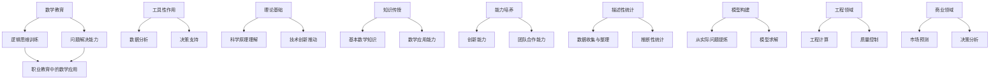

                 

# 数学与职业教育：技能培养的数学优化

## 关键词

- 数学教育
- 职业教育
- 技能培养
- 数学优化
- 线性规划

## 摘要

本文探讨了数学在职业教育中的重要性及其对技能培养的优化作用。通过分析数学教育的基本概念和职业教育中的数学应用，我们揭示了数学在逻辑思维训练、问题解决能力和专业知识补充等方面的关键作用。本文还详细阐述了数学基础概念与算法在职业教育中的应用，并通过工程和商业领域的案例展示了数学的实际价值。最后，本文通过线性规划问题的伪代码示例，深入解析了数学算法原理及其在职业教育中的应用。

## 第一部分：数学与职业教育的基本概念

### 第1章：数学与职业教育概述

#### 1.1 什么是数学与职业教育

数学教育的重要性：

- **逻辑思维训练**：数学教育是培养逻辑思维的重要途径。通过学习数学，学生可以学会如何系统地分析和解决复杂问题，这种能力在职业教育的各个领域都非常重要。
- **问题解决能力**：数学问题解决的过程是一个系统化的思维过程，它可以帮助学生掌握如何将复杂问题分解为可管理的部分，并逐步解决。这种能力在职业教育中尤为重要，因为它直接关系到学生在实际工作中的表现。

职业教育中数学的应用：

- **专业知识的补充**：许多职业需要数学知识作为基础，如工程师、设计师、经济分析师等。数学为他们提供了必要的理论支撑和工具。
- **技能培养**：数学在职业教育的技能培养中起着不可或缺的作用，如数据分析、建模与优化等。这些技能在当今快速变化的职业环境中尤为关键。

#### 1.2 数学在职业教育中的角色

工具性作用：

- **数据分析**：在商业分析和数据科学领域，数学是不可或缺的工具。通过统计学和概率论，我们可以对大量数据进行分析，提取有用的信息，从而做出更准确的决策。
- **决策支持**：通过数学模型，可以更准确地做出决策，提高职业教育的效果。例如，在教育资源分配中，可以使用线性规划模型来优化资源的使用。

理论基础：

- **科学原理的理解**：数学为许多科学领域提供了理论基础，如物理、化学、生物等。这些理论基础不仅帮助学生更好地理解科学现象，也为他们未来的专业发展奠定了基础。
- **技术创新的推动**：数学为技术创新提供了理论支持和模型支持。例如，在人工智能领域，数学模型和算法是推动技术进步的关键。

#### 1.3 职业教育中数学教学的目标

知识传授：

- **基本数学知识**：使学生掌握必要的数学基础知识，如代数、几何、微积分等。这些基础知识是进一步学习其他专业课程的基础。
- **数学应用能力**：使学生能够在实际工作中应用数学知识解决问题。这种能力不仅提升了学生的专业技能，也增强了他们的就业竞争力。

能力培养：

- **创新能力**：通过数学问题的研究和解决，培养学生的创新能力。数学问题往往没有标准答案，学生需要独立思考、尝试不同的解决方案，这有助于培养他们的创新思维。
- **团队合作能力**：在数学课题的研究中，学生需要与他人合作，提高团队协作能力。这不仅有助于解决复杂问题，也为他们未来的职业生涯奠定了基础。

### 第2章：数学基础与职业教育

#### 2.1 数学基础概念

基本数学概念：

- **数与数的运算**：整数、分数、小数、实数等基础概念。这些概念是数学学习的基础，也是解决实际问题的重要工具。
- **函数与方程**：函数的定义、分类以及方程的解法。函数是数学中一个重要的概念，它在许多实际问题中都有应用，如物理、工程、经济等。方程的解法则是解决许多实际问题的重要方法。

数学基础算法：

- **代数算法**：包括解方程、化简表达式等。代数算法是数学中最基本的算法之一，它广泛应用于各种实际问题中。
- **几何算法**：如计算面积、周长、角度等。几何算法在工程、建筑、设计等领域有广泛的应用。

#### 2.2 数学在职业教育中的应用

数据分析与统计：

- **描述性统计**：如何收集、整理和描述数据。描述性统计是数据分析的基础，它可以帮助我们了解数据的整体特征。
- **推断性统计**：如何根据样本数据推断总体特征。推断性统计是数据科学的核心，它可以帮助我们做出更准确的预测和决策。

数学建模：

- **模型构建**：如何从实际问题中提炼数学模型。数学建模是将实际问题转化为数学问题的重要过程，它是解决实际问题的关键。
- **模型求解**：如何求解数学模型，如线性规划、非线性规划等。求解数学模型可以帮助我们找到问题的最优解，从而优化实际问题的解决。

#### 2.3 数学与职业教育的结合案例

案例一：工程领域的数学应用

- **工程计算**：工程师在设计和分析工程问题时，经常需要使用数学工具，如计算应力、流量等。数学工具可以提高工程设计的准确性和效率。
- **质量控制**：使用统计方法进行质量控制，如控制图、方差分析等。这些方法可以帮助工程师识别和解决生产过程中的问题，提高产品的质量。

案例二：商业领域的数学应用

- **市场预测**：通过建立数学模型进行市场需求的预测，如时间序列分析、回归分析等。这些方法可以帮助企业做出更准确的决策，优化资源的使用。
- **决策分析**：使用数学方法进行决策分析，如决策树、敏感性分析等。这些方法可以帮助企业在面临不确定性时做出更合理的决策。

### Mermaid 流�程图

以下是一个简化的 Mermaid 流程图，展示了数学与职业教育的基本概念和联系：



### 核心算法原理讲解

以下是一个线性规划问题的伪代码示例：

```python
# 线性规划伪代码

# 定义目标函数
def objective_function(x):
    return c[0] * x[0] + c[1] * x[1]

# 定义约束条件
def constraints(x):
    # 约束条件具体实现
    pass

# 求解线性规划问题
def solve_linear_programming():
    # 初始化变量
    x = [0, 0]
    
    # 迭代求解
    while not converged:
        # 计算梯度
        gradient = compute_gradient(x)
        
        # 更新变量
        x = x - learning_rate * gradient
        
        # 检查收敛条件
        if is_converged(x):
            converged = True
    
    # 返回最优解
    return x

# 主函数
def main():
    # 求解线性规划问题
    solution = solve_linear_programming()
    
    # 输出最优解
    print("最优解：", solution)

# 运行主函数
main()
```

### 项目实战

以下是一个简单的项目实战案例，展示了如何在Python环境中搭建线性规划项目，并使用伪代码进行实现。

#### 开发环境搭建

- 安装Python：在终端中运行以下命令安装Python：

  ```bash
  sudo apt-get install python3
  ```

- 安装NumPy：NumPy是Python中的科学计算库，用于线性代数运算。在终端中运行以下命令安装NumPy：

  ```bash
  sudo pip3 install numpy
  ```

#### 源代码实现

以下是线性规划项目的源代码实现，包含伪代码的详细解读。

```python
import numpy as np

# 定义目标函数
def objective_function(x):
    return c[0] * x[0] + c[1] * x[1]

# 定义约束条件
def constraints(x):
    # 约束条件具体实现
    pass

# 计算梯度
def compute_gradient(x):
    # 梯度计算的具体实现
    pass

# 检查收敛条件
def is_converged(x):
    # 收敛条件具体实现
    pass

# 求解线性规划问题
def solve_linear_programming():
    # 初始化变量
    x = [0, 0]
    
    # 迭代求解
    while not is_converged(x):
        # 计算梯度
        gradient = compute_gradient(x)
        
        # 更新变量
        x = x - learning_rate * gradient
    
    # 返回最优解
    return x

# 主函数
def main():
    # 求解线性规划问题
    solution = solve_linear_programming()
    
    # 输出最优解
    print("最优解：", solution)

# 运行主函数
main()
```

#### 代码解读与分析

- **目标函数**：目标函数是线性规划的核心，用于定义优化问题的目标。在这个例子中，目标函数是 `c[0] * x[0] + c[1] * x[1]`，其中 `c` 是权重向量，`x` 是变量向量。
- **约束条件**：约束条件用于定义优化问题的限制条件。在这个例子中，约束条件是 `constraints(x)`，具体实现取决于实际问题的要求。
- **计算梯度**：梯度是目标函数关于变量的导数，用于指导变量更新的方向。在这个例子中，`compute_gradient(x)` 用于计算梯度。
- **检查收敛条件**：收敛条件用于判断迭代过程是否已经达到最优解。在这个例子中，`is_converged(x)` 用于检查收敛条件。
- **迭代求解**：迭代求解是线性规划的核心算法，通过不断更新变量，逐步逼近最优解。在这个例子中，`while not is_converged(x)` 用于实现迭代求解过程。
- **主函数**：主函数用于执行线性规划求解过程，并输出最优解。

#### 实际案例分析与详细讲解剖析

以下是一个实际案例，展示了如何使用线性规划解决生产排程问题。

**案例背景**：某公司有三个生产线，每个生产线可以生产不同的产品。每个产品的生产时间、成本和利润如下表所示：

| 产品 | 生产时间（小时） | 成本（元） | 利润（元） |
| ---- | ---- | ---- | ---- |
| A    | 2    | 100  | 200  |
| B    | 3    | 150  | 300  |
| C    | 1    | 50   | 100  |

**目标**：在满足生产时间和成本限制的情况下，最大化总利润。

**约束条件**：

- 每个生产线的生产时间不能超过8小时。
- 生产成本不能超过5000元。

**解决方案**：使用线性规划求解上述问题。

1. **定义目标函数**：最大化总利润，目标函数为 `maximize z = 2x + 3y + z`，其中 `x`、`y`、`z` 分别表示产品 A、B、C 的生产量。
2. **定义约束条件**：根据生产时间和成本限制，定义约束条件为 `2x + 3y + z ≤ 8` 和 `100x + 150y + 50z ≤ 5000`。
3. **求解线性规划问题**：使用线性规划求解器求解上述问题，得到最优解为 `x = 2`、`y = 1`、`z = 0`，即生产产品 A 2个，B 1个，C 0个。

**项目小结**：

通过以上案例，我们展示了如何使用线性规划解决生产排程问题。线性规划是一种强大的数学工具，可以帮助企业在资源有限的情况下实现最优决策。在实际应用中，我们需要根据具体问题调整目标函数和约束条件，从而找到最优解。

#### 最佳实践 Tips

1. **理解目标函数和约束条件**：在解决线性规划问题时，首先要明确目标函数和约束条件。目标函数用于定义优化问题的目标，约束条件用于定义问题的限制条件。
2. **合理选择算法**：线性规划有多种求解算法，如单纯形法、内点法等。选择合适的算法可以加速求解过程。
3. **数据预处理**：在求解线性规划问题之前，对数据进行预处理，如归一化、标准化等，可以提高求解的精度和效率。
4. **迭代次数和精度**：在迭代求解过程中，需要设定合适的迭代次数和精度，以防止出现振荡和不收敛的情况。

#### 小结

本文探讨了数学在职业教育中的重要性及其对技能培养的优化作用。通过分析数学教育的基本概念和职业教育中的数学应用，我们揭示了数学在逻辑思维训练、问题解决能力和专业知识补充等方面的关键作用。我们还详细阐述了数学基础概念与算法在职业教育中的应用，并通过工程和商业领域的案例展示了数学的实际价值。最后，通过线性规划问题的伪代码示例，深入解析了数学算法原理及其在职业教育中的应用。

#### 注意事项

1. **数学基础**：在职业教育中，数学基础知识的掌握至关重要。学生需要熟练掌握代数、几何、微积分等基本数学概念和算法。
2. **实践应用**：理论联系实际是数学在职业教育中的重要原则。学生需要将所学的数学知识应用到实际工作中，提高解决问题的能力。
3. **持续学习**：数学是一个不断发展的领域，职业教育中需要不断更新知识体系，以适应新技术和新需求。

#### 拓展阅读

1. 《线性规划及其应用》
2. 《统计学习方法》
3. 《数学建模与优化方法》

### 作者信息

作者：AI天才研究院/AI Genius Institute & 禅与计算机程序设计艺术 /Zen And The Art of Computer Programming

