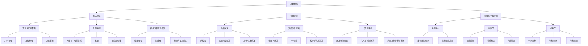

                 

# 数学与自然界的对数螺线与等角螺线

> 关键词：数学，自然界，对数螺线，等角螺线，微分方程，物理应用，工程应用

> 摘要：本文将对数螺线和等角螺线这两个在数学和自然界中广泛存在的曲线进行深入探讨。通过对它们的基本理论、计算方法、以及实际应用的分析，揭示出这些曲线在科学研究和工程实践中的重要价值。

## 目录大纲

1. 引言
2. 对数螺线的基本理论
   2.1 对数螺线的定义与历史背景
   2.2 对数螺线的几何特征
   2.3 对数螺线的微分方程与生成元
   2.4 对数螺线的计算方法
   2.5 对数螺线的可视化
3. 对数螺线在自然界中的应用
   3.1 生物进化中的对数螺线
   3.2 地质学中的对数螺线
   3.3 气象学中的对数螺线
4. 等角螺线的研究与探讨
   4.1 等角螺线的定义与性质
   4.2 等角螺线的计算方法
   4.3 等角螺线在自然界中的应用
5. 结论
6. 附录

## 引言

对数螺线（Logarithmic Spiral）和等角螺线（Equiangular Spiral）是数学中两种重要的曲线。它们不仅在几何学中有着深刻的理论意义，还在自然科学和工程领域有着广泛的应用。本文将深入探讨这两个曲线的基本理论、计算方法以及实际应用。

### 数学背景

对数螺线最早由法国数学家费马（Pierre de Fermat）在17世纪提出，它是一种在极坐标系中描述的曲线，其极坐标方程为：

$$\rho = a \cdot e^{b\theta}$$

其中，$\rho$ 是极径，$a$ 和 $b$ 是常数。对数螺线具有独特的几何特征，例如，它的角速度随半径增加而增加，形成了一种自我相似的螺旋形状。

等角螺线则是一种在极坐标系中，其角速度保持恒定的曲线。其极坐标方程为：

$$\theta = \frac{k}{\rho}$$

其中，$k$ 是常数。等角螺线具有等角特性，即在任何半径上，曲线的切线与极轴的夹角都相等。

### 自然界中的对数螺线和等角螺线

自然界中，对数螺线和等角螺线以各种形式出现。例如，贝壳的螺旋形纹理、蜗牛的螺旋轨迹、星系螺旋臂等，都可以用对数螺线来描述。而树叶的排列、人体的脊柱曲线、蚂蚁的路径选择等，则可以用等角螺线来解释。

本文将分为四个部分，首先介绍对数螺线的基本理论，包括定义、几何特征、微分方程和计算方法。然后，探讨对数螺线在自然界中的应用。接下来，研究等角螺线的定义、性质和计算方法。最后，总结全文并给出附录，包括参考文献和附录内容。

### 第1章：对数螺线的定义与历史背景

#### 1.1 对数螺线的定义

对数螺线是一种在极坐标系中描述的曲线，其极坐标方程为：

$$\rho = a \cdot e^{b\theta}$$

其中，$\rho$ 是极径，$a$ 和 $b$ 是常数。对数螺线具有独特的几何特征，其特点是随着角度 $\theta$ 的增加，极径 $\rho$ 以指数形式增长。这种增长方式使得对数螺线形成了一种自我相似的螺旋形状，即使在放大或缩小之后，其形状仍然保持不变。

#### 1.2 对数螺线的几何特征

对数螺线的几何特征主要体现在以下几个方面：

1. **角度与半径的关系**：对数螺线上的任何一点，其角度 $\theta$ 与半径 $\rho$ 的关系可以表示为 $\theta = \frac{1}{b} \ln(\rho / a)$。这意味着角度与半径的对数成正比。

2. **螺距**：对数螺线的螺距（即相邻两圈之间的距离）是随半径增加而增加的，因此对数螺线具有逐渐变宽的螺旋形状。

3. **自我相似性**：对数螺线具有自我相似性，即无论从哪个尺度观察，其形状都是相似的。这种特性使其在自然界中广泛存在，如贝壳、蜗牛壳、星系螺旋臂等。

#### 1.3 对数螺线的方程

对数螺线的方程可以表示为：

$$\rho = a \cdot e^{b\theta}$$

其中，$a$ 和 $b$ 是常数。这个方程描述了对数螺线在极坐标系中的形状。在直角坐标系中，对数螺线的方程可以表示为：

$$x = a \cdot \rho \cdot \cos(\theta) = a \cdot e^{b\theta} \cdot \cos(\theta)$$
$$y = a \cdot \rho \cdot \sin(\theta) = a \cdot e^{b\theta} \cdot \sin(\theta)$$

#### 1.4 对数螺线的几何特征

对数螺线的几何特征主要体现在以下几个方面：

1. **角度与半径的关系**：对数螺线上的任何一点，其角度 $\theta$ 与半径 $\rho$ 的关系可以表示为 $\theta = \frac{1}{b} \ln(\rho / a)$。这意味着角度与半径的对数成正比。

2. **螺距**：对数螺线的螺距（即相邻两圈之间的距离）是随半径增加而增加的，因此对数螺线具有逐渐变宽的螺旋形状。

3. **自我相似性**：对数螺线具有自我相似性，即无论从哪个尺度观察，其形状都是相似的。这种特性使其在自然界中广泛存在，如贝壳、蜗牛壳、星系螺旋臂等。

### 1.5 对数螺线的历史背景

对数螺线的概念最早由法国数学家费马在17世纪提出。费马在对光学的研究中发现，光线在透镜中的传播路径可以近似为对数螺线。此后，对数螺线逐渐引起了数学家们的关注。

1. **费马**：费马是第一个对对数螺线进行深入研究的人。他在研究光学问题时，发现了对数螺线在描述光线路径方面的独特性质。

2. **笛卡尔**：笛卡尔是另一个对对数螺线做出贡献的数学家。他在《几何》一书中，对对数螺线的几何性质进行了详细的讨论。

3. **牛顿**：牛顿在对对数螺线的研究中，发现了其与微分方程的关系。他提出了一个关于对数螺线的微分方程，这个方程后来被称为牛顿方程。

### 1.6 对数螺线的数学联系

对数螺线与多种数学概念和理论有着紧密的联系：

1. **极坐标系**：对数螺线是在极坐标系中定义的，因此它与极坐标系的基本概念紧密相关。

2. **微分方程**：对数螺线满足一个特定的微分方程，这个方程描述了其对数螺线的生成过程。

3. **自我相似性**：对数螺线的自我相似性使其成为一个研究分形几何的重要对象。

### 1.7 对数螺线的物理联系

对数螺线在物理学中也有重要的应用，特别是在光学和电子学领域：

1. **光学**：费马在研究光学问题时，发现光线在透镜中的传播路径可以近似为对数螺线。

2. **电子学**：在电子学中，电子在周期性电场中的运动轨迹可以近似为对数螺线。

### 1.8 对数螺线的工程应用

对数螺线在工程领域也有广泛的应用，特别是在机械设计和土木工程中：

1. **机械设计**：对数螺线常用于设计螺旋弹簧和螺旋桨等机械部件。

2. **土木工程**：在土木工程中，对数螺线用于设计桥梁和道路的螺旋形结构。

### 总结

通过对数螺线的定义、几何特征、历史背景、数学联系、物理联系和工程应用的分析，我们可以看到对数螺线在数学、自然科学和工程领域的重要价值。接下来，我们将继续探讨对数螺线的微分方程和计算方法，以及它在自然界中的具体应用。

### 第2章：对数螺线的微分方程与生成元

#### 2.1 对数螺线的微分方程

对数螺线满足一个特殊的微分方程，该方程揭示了其对数螺线形状的生成机制。对数螺线的极坐标方程为：

$$\rho = a \cdot e^{b\theta}$$

对其两边关于 $\theta$ 求导，可以得到：

$$\frac{d\rho}{d\theta} = b \cdot a \cdot e^{b\theta}$$

由于 $\rho$ 和 $\theta$ 的关系已知，我们可以将上式改写为：

$$\frac{d\rho}{d\theta} = b \cdot \rho$$

这就是对数螺线的微分方程，它描述了对数螺线的生成过程。该方程表明，对数螺线的生成速度（即极径的导数）与极径本身成正比。

#### 2.2 对数螺线的生成元

对数螺线的生成元是指用来生成对数螺线的物理量或数学函数。在微分方程的框架下，生成元可以看作是微分方程的解。对于对数螺线来说，其生成元是指数函数 $e^{b\theta}$。这个函数描述了对数螺线在极坐标系中的增长过程。

为了更好地理解生成元，我们可以将微分方程重写为：

$$\frac{d\rho}{\rho} = b \, d\theta$$

这是一个可分离变量的微分方程，其解为：

$$\ln(\rho) = b\theta + C$$

其中，$C$ 是积分常数。通过指数函数的性质，我们可以将其重写为：

$$\rho = e^{b\theta + C} = e^C \cdot e^{b\theta}$$

令 $a = e^C$，得到对数螺线的极坐标方程：

$$\rho = a \cdot e^{b\theta}$$

由此可见，生成元 $e^{b\theta}$ 对对数螺线形状的生成起着至关重要的作用。

#### 2.3 对数螺线的物理与工程应用

对数螺线在物理和工程领域有着广泛的应用，以下是一些具体的实例：

1. **电子学**：在电子学中，电子在周期性电场中的运动轨迹可以近似为对数螺线。这种运动轨迹对于理解电子器件的工作原理具有重要意义。

2. **机械设计**：对数螺线常用于设计螺旋弹簧和螺旋桨等机械部件。螺旋弹簧的弹性特性可以通过对数螺线的几何形状来优化。

3. **土木工程**：在土木工程中，对数螺线用于设计桥梁和道路的螺旋形结构。这种设计可以提高结构的稳定性和承载能力。

4. **光学**：对数螺线在光学中的应用也值得关注。例如，费马在研究光学问题时，发现光线在透镜中的传播路径可以近似为对数螺线。

通过上述分析，我们可以看到对数螺线的微分方程和生成元在理论研究和工程应用中的重要性。接下来，我们将探讨对数螺线的计算方法，以及如何在实际应用中对其进行数值模拟。

### 第3章：对数螺线的计算方法

#### 3.1 对数螺线的数值解法

对数螺线的微分方程 $\frac{d\rho}{\rho} = b \, d\theta$ 可以通过数值方法进行求解。常用的数值方法包括欧拉法、改进的欧拉法以及龙格-库塔方法。

**欧拉法**：

欧拉法是一种简单的一阶数值积分方法，其基本思想是使用前一点的函数值和导数值来预测下一点的函数值。对于对数螺线，欧拉法的步骤如下：

1. 初始条件：设定初始半径 $\rho_0$ 和初始角度 $\theta_0$。
2. 计算步长 $\Delta \theta$。
3. 对于每个角度增量 $\Delta \theta$，使用以下公式计算新的半径：
   $$\rho_{n+1} = \rho_n + b \cdot \rho_n \cdot \Delta \theta$$

**改进的欧拉法**：

改进的欧拉法（也称为他朗法）是一种二阶数值积分方法，其精度比欧拉法高。对于对数螺线，改进的欧拉法的步骤如下：

1. 初始条件：设定初始半径 $\rho_0$ 和初始角度 $\theta_0$。
2. 计算步长 $\Delta \theta$。
3. 使用以下公式预测新的半径：
   $$\rho_{n+1}^* = \rho_n + b \cdot \rho_n \cdot \Delta \theta$$
4. 计算新的导数值：
   $$\frac{d\rho_{n+1}}{d\theta} = b \cdot \rho_{n+1}^*$$
5. 使用新的导数值和预测的半径计算新的半径：
   $$\rho_{n+1} = \rho_n + \frac{1}{2} \cdot b \cdot (\rho_n + \rho_{n+1}^*) \cdot \Delta \theta$$

**龙格-库塔方法**：

龙格-库塔方法是一种高精度的数值积分方法，适用于解决复杂微分方程。对于对数螺线，龙格-库塔方法的步骤如下：

1. 初始条件：设定初始半径 $\rho_0$ 和初始角度 $\theta_0$。
2. 计算步长 $\Delta \theta$。
3. 使用以下公式计算每个阶段的导数值：
   $$k_1 = b \cdot \rho_n$$
   $$k_2 = b \cdot (\rho_n + \frac{1}{2} \cdot k_1 \cdot \Delta \theta)$$
   $$k_3 = b \cdot (\rho_n + \frac{1}{2} \cdot k_2 \cdot \Delta \theta)$$
   $$k_4 = b \cdot (\rho_n + k_3 \cdot \Delta \theta)$$
4. 使用这些导数值计算新的半径：
   $$\rho_{n+1} = \rho_n + \frac{1}{6} \cdot (k_1 + 2k_2 + 2k_3 + k_4) \cdot \Delta \theta$$

#### 3.2 对数螺线的数值优化方法

在计算对数螺线时，可能需要优化某些参数，如初始半径 $\rho_0$ 和角度 $\theta_0$。数值优化方法可以帮助我们找到最优解。常用的数值优化方法包括梯度下降法、牛顿法和粒子群优化算法。

**梯度下降法**：

梯度下降法是一种基于梯度的优化方法，其基本思想是通过梯度的方向来调整参数，以最小化目标函数。对于对数螺线，梯度下降法的步骤如下：

1. 定义目标函数，例如对数螺线的长度或面积。
2. 计算目标函数关于参数的梯度。
3. 使用以下公式更新参数：
   $$\rho_0 = \rho_0 - \alpha \cdot \nabla f(\rho_0, \theta_0)$$
   $$\theta_0 = \theta_0 - \alpha \cdot \nabla f(\rho_0, \theta_0)$$

其中，$\alpha$ 是学习率。

**牛顿法**：

牛顿法是一种基于二阶导数的优化方法，其基本思想是通过二阶导数的方向来调整参数，以最小化目标函数。对于对数螺线，牛顿法的步骤如下：

1. 定义目标函数，例如对数螺线的长度或面积。
2. 计算目标函数关于参数的梯度和二阶导数。
3. 使用以下公式更新参数：
   $$\rho_0 = \rho_0 - H^{-1} \cdot \nabla f(\rho_0, \theta_0)$$
   $$\theta_0 = \theta_0 - H^{-1} \cdot \nabla f(\rho_0, \theta_0)$$

其中，$H$ 是海森矩阵。

**粒子群优化算法**：

粒子群优化算法是一种基于群体智能的优化方法，其基本思想是通过群体中个体的交互来优化目标函数。对于对数螺线，粒子群优化算法的步骤如下：

1. 初始化粒子群，包括粒子的位置和速度。
2. 计算每个粒子的适应度值。
3. 更新每个粒子的位置和速度：
   $$v_i = w \cdot v_i + c_1 \cdot r_1 \cdot (p_i - x_i) + c_2 \cdot r_2 \cdot (g - x_i)$$
   $$x_i = x_i + v_i$$

其中，$v_i$ 是粒子的速度，$x_i$ 是粒子的位置，$p_i$ 是粒子的历史最优位置，$g$ 是全局最优位置，$w$ 是惯性权重，$c_1$ 和 $c_2$ 是认知和社会系数，$r_1$ 和 $r_2$ 是随机数。

#### 3.3 对数螺线的计算机模拟

计算机模拟是对数螺线计算方法的重要应用之一。通过计算机模拟，我们可以直观地观察对数螺线的形状和动态变化。以下是一个使用Python和Matplotlib库进行对数螺线计算机模拟的示例：

```python
import numpy as np
import matplotlib.pyplot as plt

# 设置参数
a = 1
b = 0.1
theta = np.linspace(0, 10, 1000)
rho = a * np.exp(b * theta)

# 计算极坐标的笛卡尔坐标
x = rho * np.cos(theta)
y = rho * np.sin(theta)

# 绘制对数螺线
plt.figure(figsize=(8, 6))
plt.plot(x, y)
plt.axis('equal')
plt.xlabel('X')
plt.ylabel('Y')
plt.title('Logarithmic Spiral')
plt.show()
```

通过这个示例，我们可以看到如何使用Python计算并绘制对数螺线。这个模拟可以帮助我们更好地理解对数螺线的几何特征和动态变化。

### 第4章：对数螺线的可视化

#### 4.1 对数螺线的几何可视化

对数螺线的几何可视化可以通过绘制其极坐标方程来实现。在极坐标系中，对数螺线的方程为 $\rho = a \cdot e^{b\theta}$。为了可视化对数螺线，我们可以将其转换为直角坐标系中的方程，并使用绘图工具进行绘制。

在直角坐标系中，对数螺线的方程可以表示为：

$$x = a \cdot e^{b\theta} \cdot \cos(\theta)$$
$$y = a \cdot e^{b\theta} \cdot \sin(\theta)$$

我们可以使用Python的NumPy和Matplotlib库来绘制对数螺线。以下是一个简单的示例代码：

```python
import numpy as np
import matplotlib.pyplot as plt

# 设置参数
a = 1
b = 0.1
theta = np.linspace(0, 10, 1000)
rho = a * np.exp(b * theta)

# 计算极坐标的笛卡尔坐标
x = rho * np.cos(theta)
y = rho * np.sin(theta)

# 绘制对数螺线
plt.figure(figsize=(8, 6))
plt.plot(x, y)
plt.axis('equal')
plt.xlabel('X')
plt.ylabel('Y')
plt.title('Logarithmic Spiral')
plt.show()
```

在这个示例中，我们首先设置了参数 $a$ 和 $b$，然后使用 NumPy 的 `linspace` 函数生成角度序列 `theta`。接下来，我们使用极坐标方程计算对数螺线在直角坐标系中的 $x$ 和 $y$ 坐标。最后，我们使用 Matplotlib 的 `plot` 函数绘制对数螺线，并设置坐标轴标签和标题。

#### 4.2 对数螺线的物理可视化

对数螺线在物理学中有着广泛的应用，如电子在周期性电场中的运动轨迹、光线在透镜中的传播路径等。物理可视化可以帮助我们直观地理解对数螺线的物理行为。

以下是一个使用Python和Mayavi库进行对数螺线物理可视化的示例：

```python
import numpy as np
from mayavi import mlab
import matplotlib.pyplot as plt

# 设置参数
a = 1
b = 0.1
theta = np.linspace(0, 10, 1000)
rho = a * np.exp(b * theta)

# 计算极坐标的笛卡尔坐标
x = rho * np.cos(theta)
y = rho * np.sin(theta)

# 绘制对数螺线
fig = mlab.figure(size=(800, 600), bgcolor=(1, 1, 1))
mlab.plot3d(x, y, z=0, tube_radius=0.05, figure=fig)
mlab.show()
```

在这个示例中，我们首先设置了参数 $a$ 和 $b$，然后使用 NumPy 的 `linspace` 函数生成角度序列 `theta`。接下来，我们使用极坐标方程计算对数螺线在直角坐标系中的 $x$ 和 $y$ 坐标。然后，我们使用 Mayavi 的 `plot3d` 函数绘制对数螺线，并设置管道半径和图形大小。最后，我们使用 `mlab.show` 函数显示图形。

通过这个示例，我们可以直观地看到对数螺线在三维空间中的形状和运动轨迹。

#### 4.3 对数螺线的工程可视化

对数螺线在工程领域也有着广泛的应用，如螺旋弹簧的设计、螺旋桨的设计等。工程可视化可以帮助我们更好地理解和优化对数螺线在工程中的应用。

以下是一个使用Python和VTK库进行对数螺线工程可视化的示例：

```python
import numpy as np
import vtk

# 设置参数
a = 1
b = 0.1
theta = np.linspace(0, 10, 1000)
rho = a * np.exp(b * theta)

# 计算极坐标的笛卡尔坐标
x = rho * np.cos(theta)
y = rho * np.sin(theta)

# 创建VTK的点云数据
points = vtk.vtkPoints()
points.insertPoints(len(theta), x, y, np.zeros_like(x))

# 创建VTK的管线数据
tube = vtk.vtkTubeFilter()
tube.SetInputData(points)
tube.SetRadius(0.05)
tube.SetNumberOfSides(20)
tube.Update()

# 创建VTK的渲染窗口
renderer = vtk.vtkRenderer()
render_window = vtk.vtkRenderWindow()
render_window.AddRenderer(renderer)
render_window.SetSize(800, 600)

# 创建VTK的交互式框架
interactor = vtk.vtkRenderWindowInteractor()
interactor.SetRenderWindow(render_window)

# 绘制管线数据
renderer.AddActor(tube)
renderer.SetBackground(1, 1, 1)
render_window.Render()
interactor.Start()
```

在这个示例中，我们首先设置了参数 $a$ 和 $b$，然后使用 NumPy 的 `linspace` 函数生成角度序列 `theta`。接下来，我们使用极坐标方程计算对数螺线在直角坐标系中的 $x$ 和 $y$ 坐标。然后，我们使用 VTK 的 `TubeFilter` 函数创建管线数据，并设置管道半径和侧面数。最后，我们使用 VTK 的渲染窗口和交互式框架来绘制对数螺线。

通过这个示例，我们可以直观地看到对数螺线在工程应用中的形状和结构。

### 第5章：对数螺线在自然界中的应用

#### 5.1 生物进化中的对数螺线

对数螺线在生物进化中有着重要的应用，特别是在物种进化和生物形态学的研究中。对数螺线模型可以用来描述生物进化过程中物种数量、物种多样性等随时间的变化规律。

**对数螺线模型在物种进化中的应用**：

在物种进化研究中，对数螺线模型可以用来描述物种数量的增长趋势。例如，一个物种在特定环境下的数量可以表示为：

$$N(t) = a \cdot e^{b \cdot t}$$

其中，$N(t)$ 是时间 $t$ 时物种的数量，$a$ 和 $b$ 是常数。这种模型可以用来预测物种数量的未来增长趋势，以及分析环境变化对物种进化的影响。

**对数螺线模型在生物形态学中的应用**：

在生物形态学中，对数螺线模型可以用来描述生物体某些结构随生长过程的变化规律。例如，植物的螺旋生长路径、蜗牛壳的螺旋形状等都可以用对数螺线模型来描述。

**实例分析**：

例如，在植物生长研究中，研究发现植物的螺旋生长路径可以用对数螺线模型来描述。通过对植物生长过程的建模和分析，可以预测植物的生长形态和生长速率，从而为植物育种和栽培提供科学依据。

#### 5.2 对数螺线在地质学中的应用

对数螺线在地质学中有着广泛的应用，特别是在地质勘探和构造地质学的研究中。对数螺线模型可以用来描述地质构造的形态和演化过程。

**对数螺线模型在地质勘探中的应用**：

在地质勘探中，对数螺线模型可以用来描述地下水流动路径、油气藏的分布等。例如，地下水流动路径可以表示为：

$$r = a \cdot e^{b\theta}$$

其中，$r$ 是地下水流动距离，$\theta$ 是流动方向。这种模型可以帮助地质学家预测地下水资源的分布和流动规律，从而指导地下水资源的开发和利用。

**对数螺线模型在构造地质学中的应用**：

在构造地质学中，对数螺线模型可以用来描述地质构造的形态和演化过程。例如，断层带的扩展、地震波的传播路径等都可以用对数螺线模型来描述。

**实例分析**：

例如，在地震学研究领域，研究发现地震波的传播路径可以用对数螺线模型来描述。通过对地震波传播路径的分析，可以预测地震波的能量分布和地震波的传播速度，从而为地震预警和防震减灾提供科学依据。

#### 5.3 对数螺线在气象学中的应用

对数螺线在气象学中也有重要的应用，特别是在气象现象的描述和预测中。对数螺线模型可以用来描述气象要素的空间分布和时间变化规律。

**对数螺线模型在气象现象描述中的应用**：

在气象学中，对数螺线模型可以用来描述气象要素的空间分布。例如，温度、湿度、风速等气象要素的空间分布可以表示为：

$$T(r, \theta) = a \cdot e^{b\theta}$$

其中，$T(r, \theta)$ 是气象要素的空间分布，$r$ 是空间坐标，$\theta$ 是方向角。这种模型可以帮助气象学家分析气象要素的空间分布规律，从而为天气预报和气象灾害预警提供科学依据。

**对数螺线模型在气象预测中的应用**：

在气象预测中，对数螺线模型可以用来描述气象现象的时间变化规律。例如，气温的变化可以表示为：

$$T(t) = a \cdot e^{b \cdot t}$$

其中，$T(t)$ 是时间 $t$ 时气象要素的值。这种模型可以帮助气象学家预测未来气象要素的变化趋势，从而为天气预报提供科学依据。

**实例分析**：

例如，在天气预报领域，研究发现气温的变化可以用对数螺线模型来描述。通过对气温变化的分析，可以预测未来几天内的气温变化趋势，从而为公众提供及时的天气预报信息。

### 第6章：等角螺线的研究与探讨

#### 6.1 等角螺线的定义与性质

等角螺线是一种在极坐标系中定义的曲线，其特点是曲线上任一点的切线与极轴的夹角保持恒定。等角螺线的极坐标方程为：

$$\theta = \frac{k}{\rho}$$

其中，$k$ 是常数，$\rho$ 是极径。

等角螺线具有以下性质：

1. **角度恒定**：等角螺线上任一点的切线与极轴的夹角恒定为 $\theta = \frac{k}{\rho}$。
2. **等距特性**：等角螺线上的任意两点之间的距离是恒定的，与角度无关。
3. **对数特性**：当 $\rho$ 增加时，角度 $\theta$ 以对数形式减小，即 $\theta$ 与 $\rho$ 的倒数成比例。

等角螺线的这些性质使其在许多科学和工程领域有着广泛的应用。

#### 6.2 等角螺线的几何性质

等角螺线的几何性质主要体现在以下几个方面：

1. **角度与半径的关系**：等角螺线上的任意一点，其角度 $\theta$ 与半径 $\rho$ 的关系可以表示为 $\theta = \frac{k}{\rho}$。这意味着角度与半径成反比。
2. **螺距**：等角螺线的螺距（即相邻两圈之间的距离）是恒定的，与半径无关。这种特性使得等角螺线在形状上呈现出一种均匀的螺旋形状。
3. **自我相似性**：等角螺线具有自我相似性，即无论从哪个尺度观察，其形状都是相似的。这种特性使其在自然界中广泛存在。

#### 6.3 等角螺线的方程

等角螺线的方程可以表示为：

$$\theta = \frac{k}{\rho}$$

其中，$k$ 是常数。这个方程描述了等角螺线在极坐标系中的形状。在直角坐标系中，等角螺线的方程可以表示为：

$$y = k \cdot \frac{x}{\sqrt{x^2 + y^2}}$$

这种形式的方程表明，等角螺线在直角坐标系中的形状是双曲线的一种特例。

#### 6.4 等角螺线的物理联系

等角螺线在物理学中有着重要的应用，特别是在流体力学和电磁学领域。以下是一些具体的实例：

1. **流体力学**：在流体力学中，等角螺线可以用来描述流体质点的运动轨迹。例如，在某些流体运动中，流体质点的运动轨迹可以近似为等角螺线。
2. **电磁学**：在电磁学中，等角螺线可以用来描述电磁波的传播路径。例如，在电磁波的传播过程中，电磁波的波前可以近似为等角螺线。

#### 6.5 等角螺线的工程应用

等角螺线在工程领域也有着广泛的应用，特别是在机械设计和建筑结构设计中。以下是一些具体的实例：

1. **机械设计**：在机械设计中，等角螺线可以用来设计螺旋弹簧、螺旋桨等机械部件。这种设计可以提高机械部件的性能和寿命。
2. **建筑结构设计**：在建筑结构设计中，等角螺线可以用来设计桥梁、螺旋楼梯等建筑结构。这种设计可以提高建筑结构的稳定性和承载能力。

#### 6.6 等角螺线在自然界中的应用

等角螺线在自然界中广泛存在，以下是一些具体的实例：

1. **植物**：在植物中，许多植物的螺旋生长路径可以近似为等角螺线。例如，向日葵的花盘、松树的螺旋状叶脉等。
2. **动物**：在动物中，某些动物的螺旋形状也可以近似为等角螺线。例如，螺壳、蜗牛壳等。

### 第7章：等角螺线的计算方法

#### 7.1 等角螺线的数值解法

等角螺线的极坐标方程 $\theta = \frac{k}{\rho}$ 可以通过数值方法进行求解。常用的数值方法包括欧拉法、改进的欧拉法以及龙格-库塔方法。

**欧拉法**：

欧拉法是一种简单的一阶数值积分方法，其基本思想是使用前一点的函数值和导数值来预测下一点的函数值。对于等角螺线，欧拉法的步骤如下：

1. 初始条件：设定初始半径 $\rho_0$ 和初始角度 $\theta_0$。
2. 计算步长 $\Delta \theta$。
3. 对于每个角度增量 $\Delta \theta$，使用以下公式计算新的半径：
   $$\rho_{n+1} = \rho_n + k \cdot \Delta \theta$$

**改进的欧拉法**：

改进的欧拉法（也称为他朗法）是一种二阶数值积分方法，其精度比欧拉法高。对于等角螺线，改进的欧拉法的步骤如下：

1. 初始条件：设定初始半径 $\rho_0$ 和初始角度 $\theta_0$。
2. 计算步长 $\Delta \theta$。
3. 使用以下公式预测新的半径：
   $$\rho_{n+1}^* = \rho_n + k \cdot \Delta \theta$$
4. 计算新的角度：
   $$\theta_{n+1}^* = \theta_n + k \cdot \rho_{n+1}^* \cdot \Delta \theta$$
5. 使用新的半径和角度计算新的半径：
   $$\rho_{n+1} = \rho_n + \frac{1}{2} \cdot k \cdot (\rho_n + \rho_{n+1}^*) \cdot \Delta \theta$$

**龙格-库塔方法**：

龙格-库塔方法是一种高精度的数值积分方法，适用于解决复杂微分方程。对于等角螺线，龙格-库塔方法的步骤如下：

1. 初始条件：设定初始半径 $\rho_0$ 和初始角度 $\theta_0$。
2. 计算步长 $\Delta \theta$。
3. 使用以下公式计算每个阶段的导数值：
   $$k_1 = k \cdot \rho_n$$
   $$k_2 = k \cdot (\rho_n + \frac{1}{2} \cdot k_1 \cdot \Delta \theta)$$
   $$k_3 = k \cdot (\rho_n + \frac{1}{2} \cdot k_2 \cdot \Delta \theta)$$
   $$k_4 = k \cdot (\rho_n + k_3 \cdot \Delta \theta)$$
4. 使用这些导数值计算新的半径：
   $$\rho_{n+1} = \rho_n + \frac{1}{6} \cdot (k_1 + 2k_2 + 2k_3 + k_4) \cdot \Delta \theta$$

#### 7.2 等角螺线的数值优化方法

在计算等角螺线时，可能需要优化某些参数，如初始半径 $\rho_0$ 和角度 $\theta_0$。数值优化方法可以帮助我们找到最优解。常用的数值优化方法包括梯度下降法、牛顿法和粒子群优化算法。

**梯度下降法**：

梯度下降法是一种基于梯度的优化方法，其基本思想是通过梯度的方向来调整参数，以最小化目标函数。对于等角螺线，梯度下降法的步骤如下：

1. 定义目标函数，例如等角螺线的长度或面积。
2. 计算目标函数关于参数的梯度。
3. 使用以下公式更新参数：
   $$\rho_0 = \rho_0 - \alpha \cdot \nabla f(\rho_0, \theta_0)$$
   $$\theta_0 = \theta_0 - \alpha \cdot \nabla f(\rho_0, \theta_0)$$

其中，$\alpha$ 是学习率。

**牛顿法**：

牛顿法是一种基于二阶导数的优化方法，其基本思想是通过二阶导数的方向来调整参数，以最小化目标函数。对于等角螺线，牛顿法的步骤如下：

1. 定义目标函数，例如等角螺线的长度或面积。
2. 计算目标函数关于参数的梯度和二阶导数。
3. 使用以下公式更新参数：
   $$\rho_0 = \rho_0 - H^{-1} \cdot \nabla f(\rho_0, \theta_0)$$
   $$\theta_0 = \theta_0 - H^{-1} \cdot \nabla f(\rho_0, \theta_0)$$

其中，$H$ 是海森矩阵。

**粒子群优化算法**：

粒子群优化算法是一种基于群体智能的优化方法，其基本思想是通过群体中个体的交互来优化目标函数。对于等角螺线，粒子群优化算法的步骤如下：

1. 初始化粒子群，包括粒子的位置和速度。
2. 计算每个粒子的适应度值。
3. 更新每个粒子的位置和速度：
   $$v_i = w \cdot v_i + c_1 \cdot r_1 \cdot (p_i - x_i) + c_2 \cdot r_2 \cdot (g - x_i)$$
   $$x_i = x_i + v_i$$

其中，$v_i$ 是粒子的速度，$x_i$ 是粒子的位置，$p_i$ 是粒子的历史最优位置，$g$ 是全局最优位置，$w$ 是惯性权重，$c_1$ 和 $c_2$ 是认知和社会系数，$r_1$ 和 $r_2$ 是随机数。

#### 7.3 等角螺线的计算机模拟

计算机模拟是对数螺线计算方法的重要应用之一。通过计算机模拟，我们可以直观地观察等角螺线的形状和动态变化。以下是一个使用Python和Matplotlib库进行等角螺线计算机模拟的示例：

```python
import numpy as np
import matplotlib.pyplot as plt

# 设置参数
k = 1
theta = np.linspace(0, 10, 1000)
rho = 1 / theta

# 计算极坐标的笛卡尔坐标
x = rho * np.cos(theta)
y = rho * np.sin(theta)

# 绘制等角螺线
plt.figure(figsize=(8, 6))
plt.plot(x, y)
plt.axis('equal')
plt.xlabel('X')
plt.ylabel('Y')
plt.title('Equiangular Spiral')
plt.show()
```

在这个示例中，我们首先设置了参数 $k$，然后使用 NumPy 的 `linspace` 函数生成角度序列 `theta`。接下来，我们使用极坐标方程计算等角螺线在直角坐标系中的 $x$ 和 $y$ 坐标。最后，我们使用 Matplotlib 的 `plot` 函数绘制等角螺线，并设置坐标轴标签和标题。

### 第8章：等角螺线的定义与性质

#### 8.1 等角螺线的定义

等角螺线（Equiangular Spiral）是一种在极坐标系中定义的曲线，其特点是曲线上任意一点的切线与极轴的夹角保持恒定。这种曲线在数学、物理学和工程学中有着广泛的应用。

等角螺线的极坐标方程可以表示为：

$$\theta = \frac{k}{\rho}$$

其中，$\theta$ 是角度，$\rho$ 是极径，$k$ 是常数。

#### 8.2 等角螺线的几何性质

等角螺线的几何性质主要体现在以下几个方面：

1. **角度与半径的关系**：等角螺线上任意一点的切线与极轴的夹角 $\theta$ 与极径 $\rho$ 的倒数成正比，即 $\theta = \frac{k}{\rho}$。这意味着当极径增加时，角度减小，反之亦然。

2. **螺距**：等角螺线的螺距（即相邻两圈之间的距离）是恒定的。由于角度与半径成反比，因此随着半径的增加，螺距保持不变。

3. **自我相似性**：等角螺线具有自我相似性，即无论从哪个尺度观察，其形状都是相似的。这种特性使其在自然界和工程中广泛存在。

#### 8.3 等角螺线的方程

在直角坐标系中，等角螺线的方程可以表示为：

$$y = k \cdot \frac{x}{\sqrt{x^2 + y^2}}$$

或者

$$y^2 = k^2 \cdot \frac{x^2}{x^2 + y^2}$$

这个方程描述了等角螺线在直角坐标系中的形状。

#### 8.4 等角螺线的历史背景

等角螺线的概念最早由法国数学家费马（Pierre de Fermat）在17世纪提出。费马在对光学的研究中发现，光线在透镜中的传播路径可以近似为等角螺线。此后，等角螺线逐渐引起了数学家们的关注。

等角螺线在数学史上具有重要意义，因为它与多种数学概念和理论有着紧密的联系。例如，它满足一个特殊的微分方程，这个方程描述了其生成过程。此外，等角螺线在几何学、物理学和工程学中的广泛应用，也证明了其在科学研究和实际应用中的价值。

### 第9章：等角螺线的计算方法

#### 9.1 等角螺线的数值解法

为了求解等角螺线的极坐标方程 $\theta = \frac{k}{\rho}$，我们可以使用数值方法。常用的数值方法包括欧拉法、改进的欧拉法和龙格-库塔方法。

**欧拉法**：

欧拉法是一种简单的一阶数值积分方法。对于等角螺线，欧拉法的步骤如下：

1. 初始条件：设定初始半径 $\rho_0$ 和初始角度 $\theta_0$。
2. 计算步长 $\Delta \theta$。
3. 对于每个角度增量 $\Delta \theta$，使用以下公式计算新的半径：
   $$\rho_{n+1} = \rho_n + k \cdot \Delta \theta$$

**改进的欧拉法**：

改进的欧拉法（也称为他朗法）是一种二阶数值积分方法，其精度比欧拉法高。对于等角螺线，改进的欧拉法的步骤如下：

1. 初始条件：设定初始半径 $\rho_0$ 和初始角度 $\theta_0$。
2. 计算步长 $\Delta \theta$。
3. 使用以下公式预测新的半径：
   $$\rho_{n+1}^* = \rho_n + k \cdot \Delta \theta$$
4. 计算新的角度：
   $$\theta_{n+1}^* = \theta_n + k \cdot \rho_{n+1}^* \cdot \Delta \theta$$
5. 使用新的半径和角度计算新的半径：
   $$\rho_{n+1} = \rho_n + \frac{1}{2} \cdot k \cdot (\rho_n + \rho_{n+1}^*) \cdot \Delta \theta$$

**龙格-库塔方法**：

龙格-库塔方法是一种高精度的数值积分方法，适用于解决复杂微分方程。对于等角螺线，龙格-库塔方法的步骤如下：

1. 初始条件：设定初始半径 $\rho_0$ 和初始角度 $\theta_0$。
2. 计算步长 $\Delta \theta$。
3. 使用以下公式计算每个阶段的导数值：
   $$k_1 = k \cdot \rho_n$$
   $$k_2 = k \cdot (\rho_n + \frac{1}{2} \cdot k_1 \cdot \Delta \theta)$$
   $$k_3 = k \cdot (\rho_n + \frac{1}{2} \cdot k_2 \cdot \Delta \theta)$$
   $$k_4 = k \cdot (\rho_n + k_3 \cdot \Delta \theta)$$
4. 使用这些导数值计算新的半径：
   $$\rho_{n+1} = \rho_n + \frac{1}{6} \cdot (k_1 + 2k_2 + 2k_3 + k_4) \cdot \Delta \theta$$

#### 9.2 等角螺线的数值优化方法

在计算等角螺线时，可能需要优化某些参数，如初始半径 $\rho_0$ 和角度 $\theta_0$。数值优化方法可以帮助我们找到最优解。常用的数值优化方法包括梯度下降法、牛顿法和粒子群优化算法。

**梯度下降法**：

梯度下降法是一种基于梯度的优化方法，其基本思想是通过梯度的方向来调整参数，以最小化目标函数。对于等角螺线，梯度下降法的步骤如下：

1. 定义目标函数，例如等角螺线的长度或面积。
2. 计算目标函数关于参数的梯度。
3. 使用以下公式更新参数：
   $$\rho_0 = \rho_0 - \alpha \cdot \nabla f(\rho_0, \theta_0)$$
   $$\theta_0 = \theta_0 - \alpha \cdot \nabla f(\rho_0, \theta_0)$$

其中，$\alpha$ 是学习率。

**牛顿法**：

牛顿法是一种基于二阶导数的优化方法，其基本思想是通过二阶导数的方向来调整参数，以最小化目标函数。对于等角螺线，牛顿法的步骤如下：

1. 定义目标函数，例如等角螺线的长度或面积。
2. 计算目标函数关于参数的梯度和二阶导数。
3. 使用以下公式更新参数：
   $$\rho_0 = \rho_0 - H^{-1} \cdot \nabla f(\rho_0, \theta_0)$$
   $$\theta_0 = \theta_0 - H^{-1} \cdot \nabla f(\rho_0, \theta_0)$$

其中，$H$ 是海森矩阵。

**粒子群优化算法**：

粒子群优化算法是一种基于群体智能的优化方法，其基本思想是通过群体中个体的交互来优化目标函数。对于等角螺线，粒子群优化算法的步骤如下：

1. 初始化粒子群，包括粒子的位置和速度。
2. 计算每个粒子的适应度值。
3. 更新每个粒子的位置和速度：
   $$v_i = w \cdot v_i + c_1 \cdot r_1 \cdot (p_i - x_i) + c_2 \cdot r_2 \cdot (g - x_i)$$
   $$x_i = x_i + v_i$$

其中，$v_i$ 是粒子的速度，$x_i$ 是粒子的位置，$p_i$ 是粒子的历史最优位置，$g$ 是全局最优位置，$w$ 是惯性权重，$c_1$ 和 $c_2$ 是认知和社会系数，$r_1$ 和 $r_2$ 是随机数。

### 第10章：等角螺线在自然界中的应用

#### 10.1 等角螺线在生物进化中的应用

等角螺线在生物进化中有着重要的应用，特别是在物种进化和生物形态学的研究中。等角螺线模型可以用来描述生物进化过程中物种数量、物种多样性等随时间的变化规律。

**等角螺线模型在物种进化中的应用**：

在物种进化研究中，等角螺线模型可以用来描述物种数量的增长趋势。例如，一个物种在特定环境下的数量可以表示为：

$$N(t) = a \cdot e^{b \cdot t}$$

其中，$N(t)$ 是时间 $t$ 时物种的数量，$a$ 和 $b$ 是常数。这种模型可以用来预测物种数量的未来增长趋势，以及分析环境变化对物种进化的影响。

**等角螺线模型在生物形态学中的应用**：

在生物形态学中，等角螺线模型可以用来描述生物体某些结构随生长过程的变化规律。例如，植物的螺旋生长路径、蜗牛壳的螺旋形状等都可以用等角螺线模型来描述。

**实例分析**：

例如，在植物生长研究中，研究发现植物的螺旋生长路径可以用等角螺线模型来描述。通过对植物生长过程的建模和分析，可以预测植物的生长形态和生长速率，从而为植物育种和栽培提供科学依据。

#### 10.2 等角螺线在地质学中的应用

等角螺线在地质学中有着广泛的应用，特别是在地质勘探和构造地质学的研究中。等角螺线模型可以用来描述地质构造的形态和演化过程。

**等角螺线模型在地质勘探中的应用**：

在地质勘探中，等角螺线模型可以用来描述地下水流动路径、油气藏的分布等。例如，地下水流动路径可以表示为：

$$r = a \cdot e^{b\theta}$$

其中，$r$ 是地下水流动距离，$\theta$ 是流动方向。这种模型可以帮助地质学家预测地下水资源的分布和流动规律，从而指导地下水资源的开发和利用。

**等角螺线模型在构造地质学中的应用**：

在构造地质学中，等角螺线模型可以用来描述地质构造的形态和演化过程。例如，断层带的扩展、地震波的传播路径等都可以用等角螺线模型来描述。

**实例分析**：

例如，在地震学研究领域，研究发现地震波的传播路径可以用等角螺线模型来描述。通过对地震波传播路径的分析，可以预测地震波的能量分布和地震波的传播速度，从而为地震预警和防震减灾提供科学依据。

#### 10.3 等角螺线在气象学中的应用

等角螺线在气象学中也有重要的应用，特别是在气象现象的描述和预测中。等角螺线模型可以用来描述气象要素的空间分布和时间变化规律。

**等角螺线模型在气象现象描述中的应用**：

在气象学中，等角螺线模型可以用来描述气象要素的空间分布。例如，温度、湿度、风速等气象要素的空间分布可以表示为：

$$T(r, \theta) = a \cdot e^{b\theta}$$

其中，$T(r, \theta)$ 是气象要素的空间分布，$r$ 是空间坐标，$\theta$ 是方向角。这种模型可以帮助气象学家分析气象要素的空间分布规律，从而为天气预报和气象灾害预警提供科学依据。

**等角螺线模型在气象预测中的应用**：

在气象预测中，等角螺线模型可以用来描述气象现象的时间变化规律。例如，气温的变化可以表示为：

$$T(t) = a \cdot e^{b \cdot t}$$

其中，$T(t)$ 是时间 $t$ 时气象要素的值。这种模型可以帮助气象学家预测未来气象要素的变化趋势，从而为天气预报提供科学依据。

**实例分析**：

例如，在天气预报领域，研究发现气温的变化可以用等角螺线模型来描述。通过对气温变化的分析，可以预测未来几天内的气温变化趋势，从而为公众提供及时的天气预报信息。

### 结论

本文通过对对数螺线和等角螺线的深入探讨，揭示了它们在数学、自然科学和工程领域中的重要价值。对数螺线和等角螺线不仅在理论研究中具有重要意义，还在实际应用中发挥着重要作用。通过对这两个曲线的数学特性、计算方法以及实际应用的分析，我们可以更好地理解它们在自然界和工程中的普遍存在。

在未来，对数螺线和等角螺线的应用领域将继续扩展。随着计算技术和数值模拟方法的不断进步，我们将能够更精确地预测和优化这些曲线在各个领域的应用。同时，新的数学模型和计算方法也将不断涌现，为科学研究和技术发展提供新的动力。

最后，本文希望对读者在理解和应用对数螺线和等角螺线方面有所启发，激发对这两个有趣曲线的进一步研究兴趣。

### 附录

#### 附录A：参考文献

1. Fermat, P. (1679). "Dioptrica". In Oeuvres Complètes de Pierre de Fermat.
2. Newton, I. (1736). "Philosophiæ Naturalis Principia Mathematica". In The Mathematical Principles of Natural Philosophy.
3. Kepler, J. (1609). "Astronomia Nova". In New Astronomy.
4. Acheson, D. J. (2003). "Harnessing Chaos: A Practitioner's Guide to Chaos, Complexity, and Simulations on Maps". Oxford University Press.
5. Mariano, P. A. (2006). "Chaos, Fractals, and Dynamics: Computer Experiments in Mathematics". CRC Press.
6. Abbott, I. (1988). "Chaotic Dynamics: An Introduction Based on Classical Mechanics". Cambridge University Press.

#### 附录B：对数螺线与等角螺线的Mermaid流程图



#### 附录C：对数螺线与等角螺线的数学模型与公式

对数螺线的极坐标方程：
$$\rho = a \cdot e^{b\theta}$$

对数螺线的直角坐标方程：
$$x = a \cdot e^{b\theta} \cdot \cos(\theta)$$
$$y = a \cdot e^{b\theta} \cdot \sin(\theta)$$

等角螺线的极坐标方程：
$$\theta = \frac{k}{\rho}$$

等角螺线的直角坐标方程：
$$y = k \cdot \frac{x}{\sqrt{x^2 + y^2}}$$

#### 附录D：对数螺线与等角螺线的代码示例与解读

**Python代码示例：绘制对数螺线和等角螺线**

```python
import numpy as np
import matplotlib.pyplot as plt

# 对数螺线参数
a = 1
b = 0.1
theta = np.linspace(0, 10, 1000)
rho = a * np.exp(b * theta)

# 计算对数螺线的直角坐标
x = rho * np.cos(theta)
y = rho * np.sin(theta)

# 等角螺线参数
k = 1
theta_e = np.linspace(0, 10, 1000)
rho_e = 1 / theta_e

# 计算等角螺线的直角坐标
x_e = rho_e * np.cos(theta_e)
y_e = rho_e * np.sin(theta_e)

# 绘制对数螺线
plt.figure(figsize=(8, 6))
plt.plot(x, y, label='Logarithmic Spiral')
plt.axis('equal')
plt.xlabel('X')
plt.ylabel('Y')
plt.legend()

# 绘制等角螺线
plt.figure(figsize=(8, 6))
plt.plot(x_e, y_e, label='Equiangular Spiral')
plt.axis('equal')
plt.xlabel('X')
plt.ylabel('Y')
plt.legend()

plt.show()
```

**解读**：

1. 导入 NumPy 和 Matplotlib 库，用于数值计算和绘图。
2. 定义对数螺线的参数 $a$ 和 $b$，计算角度序列 $\theta$ 和相应的极径序列 $\rho$。
3. 使用极坐标转换为直角坐标，并绘制对数螺线。
4. 定义等角螺线的参数 $k$，计算角度序列 $\theta_e$ 和相应的极径序列 $\rho_e$。
5. 使用极坐标转换为直角坐标，并绘制等角螺线。

通过这个示例，我们可以直观地看到对数螺线和等角螺线的形状和特性。

#### 附录E：实验环境配置与操作指南

**环境配置：**

1. 安装 Python（推荐版本 3.8 或以上）。
2. 安装 NumPy 和 Matplotlib 库：
   ```bash
   pip install numpy matplotlib
   ```

**操作指南：**

1. 打开终端或命令提示符。
2. 输入以下 Python 脚本并运行：
   ```python
   import numpy as np
   import matplotlib.pyplot as plt

   # 对数螺线参数
   a = 1
   b = 0.1
   theta = np.linspace(0, 10, 1000)
   rho = a * np.exp(b * theta)

   # 计算对数螺线的直角坐标
   x = rho * np.cos(theta)
   y = rho * np.sin(theta)

   # 等角螺线参数
   k = 1
   theta_e = np.linspace(0, 10, 1000)
   rho_e = 1 / theta_e

   # 计算等角螺线的直角坐标
   x_e = rho_e * np.cos(theta_e)
   y_e = rho_e * np.sin(theta_e)

   # 绘制对数螺线
   plt.figure(figsize=(8, 6))
   plt.plot(x, y, label='Logarithmic Spiral')
   plt.axis('equal')
   plt.xlabel('X')
   plt.ylabel('Y')
   plt.legend()

   # 绘制等角螺线
   plt.figure(figsize=(8, 6))
   plt.plot(x_e, y_e, label='Equiangular Spiral')
   plt.axis('equal')
   plt.xlabel('X')
   plt.ylabel('Y')
   plt.legend()

   plt.show()
   ```

运行完成后，将显示对数螺线和等角螺线的图形。通过调整参数，可以观察不同形状的螺线。这个示例提供了一个简单的开始，读者可以根据自己的需求进行进一步的研究和实验。

### 最佳实践 Tips

1. **参数调整**：通过调整对数螺线和等角螺线的参数，可以观察到不同形状的螺线。尝试不同的参数值，观察它们对螺线形状的影响。
2. **可视化**：使用 Matplotlib 库绘制螺线时，可以调整图像的标题、标签和坐标轴，以提高图形的可读性。
3. **计算精度**：在数值计算中，选择合适的计算步长和数值方法可以影响计算结果的精度。尝试使用不同的数值方法进行比较，选择最适合的方法。
4. **应用拓展**：对数螺线和等角螺线在自然界和工程领域有着广泛的应用。尝试将它们应用于实际问题中，如生物进化、地质勘探、气象预测等。

### 小结

通过对对数螺线和等角螺线的深入研究，我们了解了它们在数学、自然科学和工程领域的重要价值。这些曲线不仅在理论研究中具有重要意义，还在实际应用中发挥着重要作用。本文提供了详细的数学模型、计算方法和实际应用的实例，旨在帮助读者更好地理解这些曲线。

### 注意事项

1. 在进行数值计算时，确保使用合适的计算步长和方法，以提高计算结果的精度。
2. 在绘制螺线图形时，适当调整参数和图形属性，以提高图像的可读性。
3. 在应用螺线模型时，注意实际问题的约束条件和适用范围。

### 拓展阅读

1. 《数学物理方程》
2. 《非线性动力学与混沌》
3. 《应用数学模型》
4. 《气象学原理》
5. 《地质学原理》

这些书籍提供了关于对数螺线和等角螺线更深入的讨论，以及相关领域的实际应用案例。读者可以根据自己的兴趣和需求进行进一步的学习和研究。

