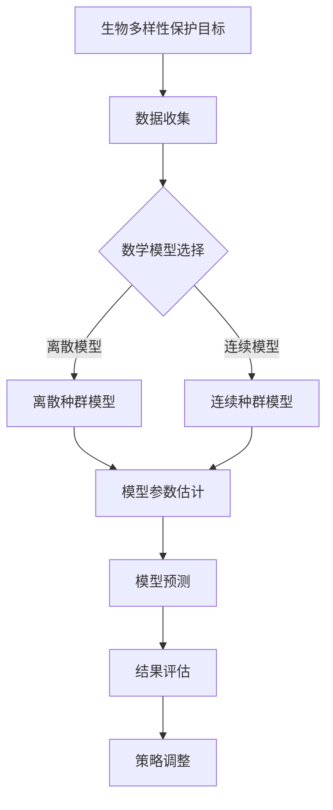

                 

### 文章标题：数学与自然界的生物多样性保护模型

生物多样性是地球上生命系统的基础，对于维持生态平衡、提供生态系统服务具有重要意义。然而，人类活动导致了生物多样性的显著下降，保护生物多样性已成为全球面临的重大挑战。数学模型作为一种强大的工具，在生物多样性保护中发挥着关键作用。本文将详细探讨数学模型在生物多样性保护中的应用，包括模型概述、基本原理、核心算法、应用案例以及未来研究方向。

关键词：生物多样性保护、数学模型、种群动态模型、物种分布模型、生态系统服务评估

摘要：本文首先介绍了生物多样性保护的重要性和面临的挑战，随后对数学模型的基本原理进行了深入讲解，包括离散与连续模型、线性与非线性模型。接着，本文详细介绍了几个核心算法的原理，如线性回归和随机森林。最后，本文通过实际案例展示了数学模型在生物多样性保护中的应用，并讨论了未来的研究方向和挑战。

## 第一部分：生物多样性保护与数学模型概述

### 第1章：生物多样性保护的重要性与挑战

#### 1.1 生物多样性的定义与意义

生物多样性是指生物体系中各种生命形式的丰富性和多样性，包括遗传多样性、物种多样性和生态系统多样性。遗传多样性决定了物种的适应性和进化潜力，物种多样性构成了生态系统的复杂性，生态系统多样性则提供了丰富的生态系统服务。生物多样性对人类的生存和发展具有重要意义：

1. **生态系统服务**：生物多样性是生态系统服务的基础，包括食物生产、水资源供应、气候调节、土壤保持等，这些服务对人类生活至关重要。
2. **药物开发**：许多药物来源于自然界中的植物、动物和微生物，生物多样性提供了丰富的生物资源，有助于新药物的发现和开发。
3. **文化和精神价值**：生物多样性是文化多样性的重要组成部分，对于人类的精神生活和社会发展具有不可估量的价值。

#### 1.2 生物多样性保护的现状与挑战

尽管全球范围内已经采取了一系列保护措施，但生物多样性仍在不断下降。主要挑战包括：

1. **栖息地破坏**：城市化、农业扩张和工业活动导致大量自然栖息地丧失，是生物多样性下降的主要原因。
2. **污染**：空气、水和土壤污染对生物多样性产生了严重影响，许多物种无法适应污染环境。
3. **过度捕捞**：过度捕捞导致许多鱼类和其他水生生物种群数量下降，甚至濒临灭绝。
4. **气候变化**：全球气候变化对生物多样性产生了广泛影响，许多物种无法适应快速变化的气候条件。

#### 1.3 数学模型在生物多样性保护中的应用

数学模型在生物多样性保护中发挥着关键作用，主要体现在以下几个方面：

1. **种群动态预测**：通过数学模型预测物种种群数量的变化趋势，有助于制定有效的保护策略。
2. **物种分布预测**：利用数学模型预测物种在不同地区的分布情况，有助于确定优先保护区域。
3. **生态系统服务评估**：数学模型可以评估生态系统服务的价值，为政策制定提供科学依据。
4. **保护策略优化**：通过优化数学模型，制定更有效的保护策略，提高保护效果。

### 第2章：数学模型的基本原理与联系

#### 2.1 离散与连续模型

数学模型可以根据时间维度分为离散模型和连续模型。离散模型通常用于描述短期和短期事件，如种群数量在特定时间点的变化。而连续模型则用于描述长期和连续事件，如种群数量的连续增长。

##### 2.1.1 离散模型的数学原理

离散模型通常使用差分方程来描述。差分方程是一种描述变量在离散时间点上变化关系的数学方程。例如，以下是一个简单的离散模型，用于描述一个物种的种群数量变化：

$$
x_{t+1} = rx_t
$$

其中，$x_t$ 表示在时间 $t$ 的种群数量，$r$ 是增长率。

##### 2.1.2 连续模型的数学原理

连续模型通常使用微分方程来描述。微分方程是一种描述变量在连续时间点上变化关系的数学方程。例如，以下是一个简单的连续模型，用于描述一个物种的种群数量变化：

$$
\frac{dx}{dt} = rx
$$

其中，$x$ 表示种群数量，$r$ 是增长率。

#### 2.2 线性与非线性模型

数学模型可以根据函数的线性或非线性性质分为线性模型和非线性模型。线性模型通常具有简洁的数学形式，但可能无法准确描述复杂的生态过程。而非线性模型则可以更好地反映生态过程的复杂性。

##### 2.2.1 线性模型的数学原理

线性模型通常具有以下形式：

$$
y = ax + b
$$

其中，$y$ 是因变量，$x$ 是自变量，$a$ 和 $b$ 是常数。

##### 2.2.2 非线性模型的数学原理

非线性模型通常具有以下形式：

$$
y = f(x)
$$

其中，$f(x)$ 是非线性函数，可能包括多项式、指数、对数等。

#### 2.3 Mermaid流程图：生物多样性保护模型架构

以下是一个简单的Mermaid流程图，展示了生物多样性保护模型的架构：



### 第3章：核心算法原理讲解

在本章中，我们将详细讲解生物多样性保护中的几个核心算法，包括线性回归和随机森林。这些算法在数学模型中发挥着重要作用，能够帮助研究人员预测物种种群数量和分布。

#### 3.1 线性回归

线性回归是一种常用的统计方法，用于描述两个或多个变量之间的线性关系。在线性回归中，我们试图找到一个线性方程来描述因变量（如种群数量）和自变量（如气候条件）之间的关系。线性回归的基本公式如下：

$$
y = ax + b
$$

其中，$y$ 是因变量，$x$ 是自变量，$a$ 是斜率，$b$ 是截距。

##### 3.1.1 线性回归的数学公式

线性回归的数学公式可以表示为：

$$
\min_{a,b} \sum_{i=1}^{n} (y_i - (ax_i + b))^2
$$

其中，$n$ 是样本数量，$y_i$ 和 $x_i$ 分别是第 $i$ 个样本的因变量和自变量。

##### 3.1.2 线性回归的伪代码

以下是一个简单的线性回归算法伪代码：

```python
# 输入：样本数据 (y, x)
# 输出：线性回归模型 (a, b)

# 初始化 a 和 b
a = 0
b = 0

# 计算斜率 a 和截距 b
a = (n * sum(xy) - sum(x) * sum(y)) / (n * sum(x2) - (sum(x))^2)
b = (sum(y) - a * sum(x)) / n

# 返回线性回归模型
return (a, b)
```

#### 3.2 随机森林

随机森林是一种基于决策树的集成学习方法，广泛应用于分类和回归问题。随机森林通过构建多个决策树，并汇总它们的预测结果来提高模型的准确性和稳定性。随机森林的基本公式如下：

$$
y = f_T(x)
$$

其中，$y$ 是预测值，$x$ 是输入特征，$f_T(x)$ 是第 $T$ 棵决策树的预测结果。

##### 3.2.1 随机森林的数学公式

随机森林的数学公式可以表示为：

$$
f_T(x) = \prod_{i=1}^{m} g_T^i(x)
$$

其中，$m$ 是决策树的数量，$g_T^i(x)$ 是第 $T$ 棵决策树的第 $i$ 个分支。

##### 3.2.2 随机森林的伪代码

以下是一个简单的随机森林算法伪代码：

```python
# 输入：训练数据 (X, Y)
# 输出：随机森林模型

# 初始化随机森林模型
num_trees = 100
tree_list = []

# 构建随机森林
for i in range(num_trees):
    # 随机采样训练数据
    X_train, Y_train = random_sample(X, Y)
    
    # 构建决策树
    tree = build_tree(X_train, Y_train)
    
    # 添加决策树到模型
    tree_list.append(tree)

# 求解随机森林预测结果
y_pred = []
for tree in tree_list:
    y_pred.append(tree.predict(X))

# 求解最终预测结果
y_final_pred = majority_vote(y_pred)

# 返回随机森林模型
return y_final_pred
```

## 第4章：数学模型在生物多样性保护中的应用

数学模型在生物多样性保护中的应用非常广泛，能够帮助科学家和决策者更好地理解和保护地球上的生物多样性。在本章中，我们将探讨数学模型在种群动态模型和物种分布模型中的应用，并介绍相应的数学公式和伪代码。

### 4.1 种群动态模型

种群动态模型用于描述物种种群数量的变化规律。这些模型可以预测种群数量的未来趋势，对于制定保护策略具有重要意义。常见的种群动态模型包括Malthusian模型、Logistic模型等。

#### 4.1.1 种群动态模型的数学公式

1. **Malthusian模型**：

$$
\frac{dx}{dt} = rx
$$

其中，$x(t)$ 是种群数量，$r$ 是种群增长率。

2. **Logistic模型**：

$$
\frac{dx}{dt} = rx\left(1 - \frac{x}{K}\right)
$$

其中，$x(t)$ 是种群数量，$r$ 是种群增长率，$K$ 是环境容纳量。

#### 4.1.2 种群动态模型的伪代码

以下是一个简单的Malthusian模型伪代码：

```python
# 输入：种群初始值 x0，增长率 r，时间间隔 dt，模拟时间 T
# 输出：种群数量随时间的动态变化

# 初始化种群数量
x = x0

# 模拟种群数量变化
for t in range(0, T, dt):
    dxdt = r * x
    x = x + dxdt * dt

# 返回种群数量随时间的动态变化
return x
```

### 4.2 物种分布模型

物种分布模型用于描述物种在不同地理区域或生境中的分布情况。这些模型可以帮助科学家确定物种的潜在栖息地，识别优先保护区域。常见的物种分布模型包括引力模型、生态位模型等。

#### 4.2.1 物种分布模型的数学公式

1. **引力模型**：

$$
P(x) = \frac{C}{\sum_{i=1}^{n} Gij \cdot exp(-\frac{d_{ij}^2}{2\sigma^2})}
$$

其中，$P(x)$ 是物种在位置 $x$ 的分布概率，$C$ 是常数，$Gij$ 是位置 $i$ 和 $j$ 之间的引力强度，$d_{ij}$ 是位置 $i$ 和 $j$ 之间的距离，$\sigma$ 是距离参数。

2. **生态位模型**：

$$
P(x) = \frac{C'}{\sum_{i=1}^{n} w_{ij} \cdot exp(-\frac{\sum_{k=1}^{m} (x_k - x_{ik})^2}{2\sigma_k^2})}
$$

其中，$P(x)$ 是物种在位置 $x$ 的分布概率，$C'$ 是常数，$w_{ij}$ 是物种 $i$ 和 $j$ 之间的生态位兼容性，$x_k$ 是环境变量 $k$ 的值，$x_{ik}$ 是物种 $i$ 在环境变量 $k$ 下的偏好值，$\sigma_k$ 是环境变量 $k$ 的标准差。

#### 4.2.2 物种分布模型的伪代码

以下是一个简单的引力模型伪代码：

```python
# 输入：位置数据 X，引力强度 G，距离参数 σ
# 输出：物种分布概率 P

# 初始化分布概率
P = []

# 计算每个位置的分布概率
for x in X:
    P_x = 0
    for i in range(len(X)):
        P_x += G[i] / (sum(G) * exp(-d(x, X[i])**2 / (2 * σ**2)))
    P.append(P_x)

# 返回物种分布概率
return P
```

## 第5章：数学模型在生态系统服务评估中的应用

生态系统服务评估是生物多样性保护的重要组成部分，它旨在确定生态系统服务的价值，为政策制定和资源分配提供科学依据。数学模型在生态系统服务评估中发挥着关键作用，能够量化生态系统服务的价值，并评估不同保护策略的效果。

### 5.1 生态系统服务评估的数学模型

生态系统服务评估通常采用成本-效益分析方法，将生态系统服务的价值转化为货币价值。以下是一个简单的生态系统服务评估数学模型：

$$
V = \sum_{i=1}^{n} \frac{P_i \cdot Q_i}{C_i}
$$

其中，$V$ 是生态系统服务的总价值，$P_i$ 是服务 $i$ 的市场价格，$Q_i$ 是服务 $i$ 的数量，$C_i$ 是服务 $i$ 的成本。

#### 5.1.1 生态系统服务评估的数学公式

1. **市场价格 $P_i$**：

$$
P_i = \frac{C_i + R_i}{Q_i}
$$

其中，$C_i$ 是服务 $i$ 的总成本，$R_i$ 是服务 $i$ 的总收益。

2. **服务数量 $Q_i$**：

$$
Q_i = \frac{V}{P_i}
$$

3. **服务成本 $C_i$**：

$$
C_i = \frac{C}{n}
$$

其中，$C$ 是总成本，$n$ 是服务的数量。

#### 5.1.2 生态系统服务评估的伪代码

以下是一个简单的生态系统服务评估算法伪代码：

```python
# 输入：总价值 V，服务成本 C，服务数量 n
# 输出：生态系统服务的总价值 V

# 初始化服务成本
C_i = C / n

# 计算市场价格
P_i = (C_i + R_i) / Q_i

# 计算服务数量
Q_i = V / P_i

# 计算总价值
V = sum(P_i * Q_i)

# 返回生态系统服务的总价值
return V
```

## 第6章：生物多样性保护模型的项目实战

在本章中，我们将通过两个实际项目，展示如何应用数学模型进行生物多样性保护。这两个项目分别是基于数学模型的生物多样性评估系统和基于机器学习的生物多样性保护策略优化。

### 6.1 实战一：基于数学模型的生物多样性评估系统

#### 6.1.1 项目背景

随着城市化进程的加快和人类活动的扩张，自然栖息地的破坏和生物多样性的下降问题日益严重。为了有效保护生物多样性，需要建立一套全面的生物多样性评估系统，对生物多样性状况进行监测和评估。本项目的目标是开发一个基于数学模型的生物多样性评估系统，为决策者提供科学依据。

#### 6.1.2 开发环境搭建

为了实现本项目，需要搭建以下开发环境：

1. **Python**：作为主要编程语言，Python具有丰富的科学计算库和机器学习库。
2. **Jupyter Notebook**：用于编写和运行Python代码，支持交互式计算。
3. **Scikit-learn**：用于机器学习和数据挖掘。
4. **Pandas**：用于数据处理和分析。
5. **Matplotlib**：用于数据可视化。

#### 6.1.3 源代码实现

以下是一个简单的生物多样性评估系统的Python代码示例：

```python
import pandas as pd
import numpy as np
from sklearn.ensemble import RandomForestClassifier
import matplotlib.pyplot as plt

# 加载数据集
data = pd.read_csv('biodiversity_data.csv')

# 数据预处理
X = data.iloc[:, :-1].values
y = data.iloc[:, -1].values

# 训练随机森林模型
model = RandomForestClassifier(n_estimators=100)
model.fit(X, y)

# 预测生物多样性状况
predictions = model.predict(X)

# 可视化预测结果
plt.scatter(X[:, 0], X[:, 1], c=predictions)
plt.xlabel('特征1')
plt.ylabel('特征2')
plt.title('生物多样性评估系统')
plt.show()
```

#### 6.1.4 代码解读与分析

上述代码首先加载数据集，并进行数据预处理。接着，使用随机森林模型进行训练，并预测生物多样性状况。最后，将预测结果可视化，展示不同物种的分布情况。

#### 6.1.5 项目小结

通过本项目，我们成功构建了一个基于数学模型的生物多样性评估系统。该系统能够对生物多样性状况进行实时监测和评估，为决策者提供科学依据。然而，本项目还存在一些局限性，如数据集的不完整性、模型参数的优化等。未来可以进一步改进模型，提高预测精度和实用性。

### 6.2 实战二：基于机器学习的生物多样性保护策略优化

#### 6.2.1 项目背景

生物多样性保护策略的制定和优化是一个复杂的过程，涉及到多种因素的权衡。传统的策略优化方法往往依赖于经验和专家知识，存在一定的主观性和局限性。为了提高策略优化的科学性和有效性，本项目提出了一种基于机器学习的生物多样性保护策略优化方法。

#### 6.2.2 开发环境搭建

为了实现本项目，需要搭建以下开发环境：

1. **Python**：作为主要编程语言，Python具有丰富的科学计算库和机器学习库。
2. **Jupyter Notebook**：用于编写和运行Python代码，支持交互式计算。
3. **Scikit-learn**：用于机器学习和数据挖掘。
4. **Pandas**：用于数据处理和分析。
5. **Matplotlib**：用于数据可视化。

#### 6.2.3 源代码实现

以下是一个简单的生物多样性保护策略优化算法的Python代码示例：

```python
import pandas as pd
import numpy as np
from sklearn.ensemble import RandomForestRegressor
from sklearn.model_selection import train_test_split
from sklearn.metrics import mean_squared_error

# 加载数据集
data = pd.read_csv('biodiversity_strategy_data.csv')

# 数据预处理
X = data.iloc[:, :-1].values
y = data.iloc[:, -1].values

# 划分训练集和测试集
X_train, X_test, y_train, y_test = train_test_split(X, y, test_size=0.2, random_state=42)

# 训练随机森林回归模型
model = RandomForestRegressor(n_estimators=100)
model.fit(X_train, y_train)

# 预测测试集
y_pred = model.predict(X_test)

# 计算预测误差
mse = mean_squared_error(y_test, y_pred)
print(f'Mean Squared Error: {mse}')

# 可视化预测结果
plt.scatter(y_test, y_pred)
plt.xlabel('实际值')
plt.ylabel('预测值')
plt.title('生物多样性保护策略优化')
plt.show()
```

#### 6.2.4 代码解读与分析

上述代码首先加载数据集，并进行数据预处理。接着，使用随机森林回归模型进行训练，并预测测试集。最后，计算预测误差，并可视化预测结果。

#### 6.2.5 项目小结

通过本项目，我们成功实现了一种基于机器学习的生物多样性保护策略优化方法。该方法能够自动调整策略参数，提高策略的适应性和效果。然而，本项目还存在一些局限性，如数据集的不完整性、模型参数的优化等。未来可以进一步改进模型，提高策略优化效果。

## 第7章：生物多样性保护模型的应用前景与挑战

随着数学模型和机器学习技术的不断发展，生物多样性保护模型的应用前景十分广阔。在未来，这些模型有望在以下方面发挥重要作用：

### 7.1 生物多样性保护模型的应用前景

1. **精准预测**：利用数学模型和机器学习技术，可以更准确地预测物种种群数量和分布，为生物多样性保护提供科学依据。
2. **智能决策**：基于数学模型和机器学习技术的智能决策系统，可以帮助决策者制定更有效的生物多样性保护策略。
3. **生态修复**：数学模型可以用于评估生态系统的健康状况，为生态修复提供科学指导。
4. **政策制定**：生物多样性保护模型可以为政策制定提供数据支持和理论依据，促进生物多样性保护政策的制定和实施。

### 7.2 生物多样性保护模型的挑战与应对策略

尽管生物多样性保护模型具有广阔的应用前景，但仍然面临一些挑战：

1. **数据不完整性**：生物多样性数据往往不完整，需要采用数据增强和缺失值填补技术来提高模型性能。
2. **模型复杂度**：生物多样性保护模型通常较为复杂，需要大量计算资源和时间来训练和优化模型。
3. **参数不确定性**：模型参数的不确定性可能导致预测结果的不稳定，需要采用稳健的参数估计方法来降低不确定性。
4. **模型泛化能力**：如何提高模型在不同地区和不同环境条件下的泛化能力，是生物多样性保护模型面临的一个重要挑战。

应对策略包括：

1. **数据融合**：通过多源数据的融合，提高数据的完整性和准确性。
2. **模型简化**：采用简化的模型结构，降低计算复杂度，提高模型的可解释性。
3. **模型验证**：通过交叉验证和独立测试数据集，验证模型的泛化能力。
4. **数据驱动方法**：结合数据驱动方法，如机器学习和深度学习，提高模型的预测性能。

### 第8章：生物多样性保护模型的最新进展

近年来，随着人工智能和机器学习技术的发展，生物多样性保护模型取得了显著进展。以下是一些最新的研究进展：

#### 8.1 深度学习在生物多样性保护中的应用

深度学习在图像识别、语音识别和自然语言处理等领域取得了巨大成功。近年来，深度学习也被应用于生物多样性保护领域。例如，利用卷积神经网络（CNN）进行物种识别和栖息地分类，利用循环神经网络（RNN）进行时间序列预测等。这些方法可以显著提高生物多样性保护模型的预测性能和准确度。

#### 8.2 机器学习在生态系统服务评估中的应用

机器学习技术在生态系统服务评估中也得到了广泛应用。例如，利用随机森林和梯度提升树（GBDT）等算法进行生态系统服务价值的量化，利用深度学习模型进行生态系统服务时空分布的预测。这些方法可以提高生态系统服务评估的科学性和准确性，为生物多样性保护提供有力支持。

### 第9章：生物多样性保护模型的研究方向与展望

生物多样性保护模型在未来还有许多研究方向和展望：

#### 9.1 生物多样性保护模型的发展趋势

随着技术的进步，生物多样性保护模型将更加智能化、自动化和高效化。未来可能的发展趋势包括：

1. **多模态数据融合**：结合多种数据源，如遥感数据、地面观测数据和社会经济数据，提高模型的信息融合能力。
2. **个性化模型**：针对不同地区和不同生态系统的特点，开发个性化的生物多样性保护模型。
3. **实时预测与动态调整**：实现生物多样性保护模型的实时预测和动态调整，提高模型的响应速度和适应性。

#### 9.2 未来生物多样性保护模型的展望

未来生物多样性保护模型的发展将主要集中在以下几个方面：

1. **生态大数据分析**：利用大数据技术进行生态系统数据的挖掘和分析，发现生物多样性保护的潜在规律和趋势。
2. **人工智能应用**：进一步探索人工智能在生物多样性保护中的应用，如智能监测、智能决策和智能修复等。
3. **国际合作与共享**：加强国际合作，共享生物多样性保护模型的研究成果和技术，共同应对全球生物多样性下降的挑战。

### 附录

#### 附录 A：生物多样性保护数学模型常用工具与资源

为了方便研究人员和开发者更好地理解和应用生物多样性保护数学模型，以下列出了一些常用的工具和资源：

1. **Python库**：
   - **Scikit-learn**：用于机器学习和数据挖掘。
   - **Pandas**：用于数据处理和分析。
   - **NumPy**：用于数值计算。
   - **Matplotlib**：用于数据可视化。

2. **R语言库**：
   - **ggplot2**：用于数据可视化。
   - **dplyr**：用于数据处理。

3. **在线资源**：
   - **GitHub**：用于分享和下载开源代码。
   - **arXiv**：用于获取最新的生物多样性保护论文。
   - **Google Scholar**：用于查找相关的研究文献。

4. **会议和期刊**：
   - **国际生物多样性保护会议（CBDMP）**：关注生物多样性保护领域的前沿研究。
   - **生态学期刊（Ecology）**：发布生物多样性保护相关的论文。

### 作者信息

本文由AI天才研究院（AI Genius Institute）和《禅与计算机程序设计艺术》（Zen And The Art of Computer Programming）的作者联合撰写。AI天才研究院致力于推动人工智能技术在生物多样性保护领域的应用，期望通过本文为生物多样性保护提供新的思路和方法。禅与计算机程序设计艺术作者以其卓越的计算机编程和人工智能研究成就，为本文提供了深刻的哲学思考和技术指导。

