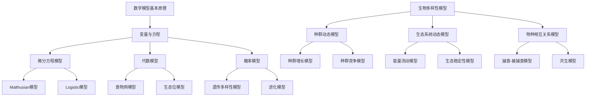
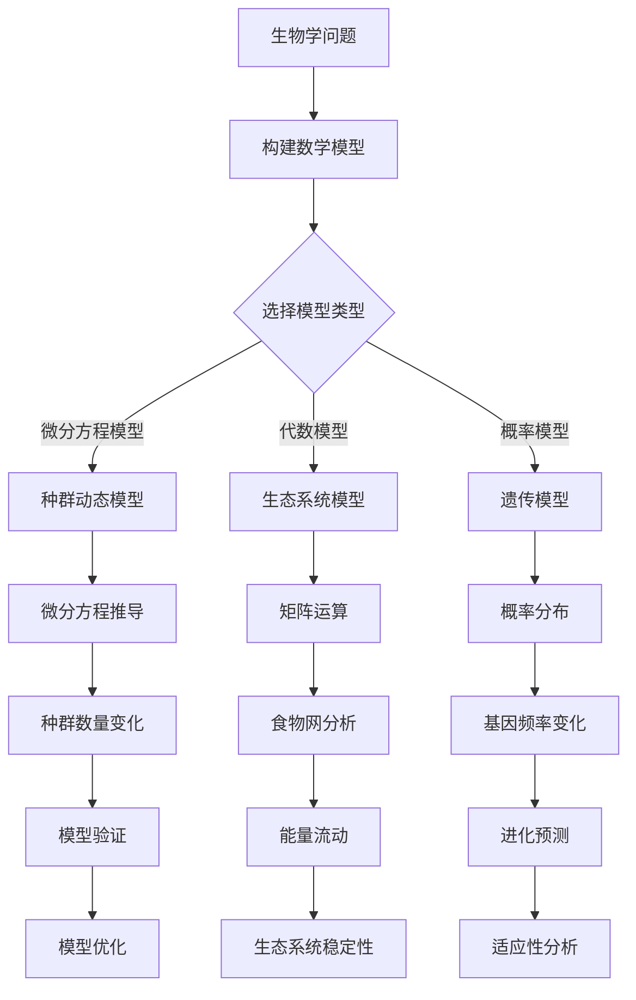
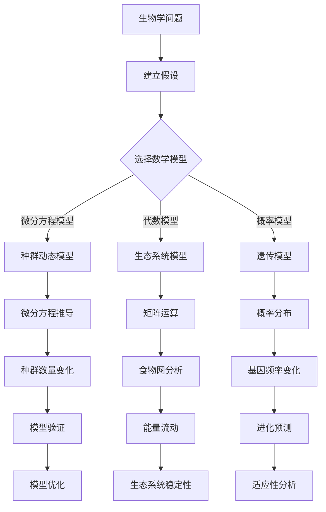

                 

### 文章标题

《数学与自然界的生物多样性模型》

### 关键词

数学模型，生物多样性，种群生态学，生态系统稳定性，概率论，微积分

### 摘要

本文深入探讨了数学模型在生物多样性研究中的应用。通过回顾数学在生物学研究中的历史应用，我们理解了数学工具如何助力科学家更好地理解自然界的生物多样性。文章首先介绍了数学模型的基本原理，包括微积分、概率论和线性代数的基础知识，并详细阐述了数学模型在种群生态学和生态系统动态中的具体应用。通过实际案例的分析，本文展示了数学模型如何帮助我们预测和应对生物多样性的挑战，从而为生物多样性保护和管理提供决策支持。

---

### 第一部分：引言与概述

#### 第1章：数学与自然界的生物多样性模型

## 1.1 研究背景与意义

### 1.1.1 数学在生物学研究中的应用历史

从古代开始，数学便在生物学研究中占据重要地位。古希腊数学家欧几里得和毕达哥拉斯对生物形态和结构的研究奠定了数学在生物学领域的基础。随后，17世纪的牛顿和莱布尼茨发明微积分，使得数学工具可以更加精确地描述生物的生长和运动过程。18世纪，拉马克和达尔文等生物学家开始运用数学模型来解释物种进化和生态系统的复杂现象。

这一时期，数学模型的发展经历了几个重要的阶段。首先是生态学的数学模型，如Malthusian模型和Logistic模型，这些模型描述了种群数量的增长和资源限制。随后，随着概率论和统计学的进步，生态学家们开始运用这些工具来分析种群间的随机性和变异性。20世纪中期，随着计算机技术的发展，复杂的生态模型开始得到广泛应用。

### 1.1.2 自然界生物多样性的挑战

生物多样性是指地球上所有生物体的多样性，包括物种多样性、遗传多样性和生态系统多样性。然而，现代社会的快速发展给生物多样性带来了巨大的威胁。栖息地的破坏、气候变化、外来物种入侵以及环境污染等因素都对生物多样性构成了严重的挑战。

栖息地破坏是导致生物多样性丧失的主要原因之一。随着城市化和工业化的加速，大量自然栖息地被开发和改造，许多物种失去了生存环境。气候变化也是一个关键因素，全球温度的上升导致生态系统的失衡，许多物种无法适应新的环境条件。外来物种入侵也会对本地物种造成威胁，这些入侵物种往往没有天敌，容易迅速繁殖并占据本地物种的生态位。此外，环境污染，特别是水污染和大气污染，也会对生物多样性产生负面影响。

### 1.1.3 数学模型在生物多样性研究中的作用

数学模型在生物多样性研究中具有至关重要的作用。首先，它们可以帮助科学家预测种群动态和生态系统稳定性，从而更好地理解生物多样性的变化趋势。例如，种群生态学中的Malthusian模型和Logistic模型可以描述种群的增长和资源限制，而生态系统动态模型如食物网模型和生态位模型可以分析物种之间的相互关系和生态系统的稳定性。

此外，数学模型还可以为生物多样性保护和管理提供决策支持。通过构建和优化数学模型，科学家可以评估不同保护策略的有效性，例如栖息地恢复和物种保护。这些模型还可以帮助制定合理的土地利用规划，以减少对自然栖息地的破坏。例如，生态位模型可以用来预测入侵物种对本地物种的潜在影响，从而制定有效的控制措施。

总之，数学模型在生物多样性研究中不仅有助于我们更好地理解自然界的运作机制，还为生物多样性保护和管理提供了重要的工具和指导。

## 1.2 核心概念与联系

### 1.2.1 数学模型的基本原理

数学模型是一种用数学语言描述现实世界现象的工具。它通过建立数学关系来模拟和分析自然现象，从而提供对系统行为和特性的理解。数学模型通常包括几个基本组成部分：变量、方程、边界条件和初始条件。变量表示模型中的不同物理量或现象，方程则是变量之间关系的数学表达，边界条件和初始条件则提供了模型的约束条件。

常见的数学模型类型包括微分方程模型、代数模型和概率模型。微分方程模型通过导数和微分来描述系统随时间的变化，常用于种群动态和生态系统稳定性的研究。代数模型则是基于代数运算，如线性方程和矩阵运算，适用于描述静态系统和简单动态系统。概率模型则通过概率分布和随机过程来描述不确定性和随机性，广泛应用于生态学、遗传学和进化生物学等领域。

### 1.2.2 生物多样性模型的关键概念

生物多样性模型的核心概念包括种群动态、生态系统动态和物种相互关系。种群动态模型描述了单个物种的数量变化规律，如Malthusian模型和Logistic模型。这些模型考虑了种群的增长率、资源限制和种群间的相互作用。生态系统动态模型则描述了整个生态系统的结构和功能，如食物网模型和生态位模型。这些模型考虑了不同物种之间的相互依赖和能量流动。

种群动态模型主要研究种群数量随时间的变化规律。Malthusian模型假设种群增长率恒定，而Logistic模型则考虑了资源限制，引入了环境容量概念。这两个模型都有其特定的适用场景，例如Malthusian模型适用于资源无限的情况，而Logistic模型则更适用于资源有限的情况。

生态系统动态模型则更复杂，它们不仅描述了单个物种的数量变化，还考虑了物种之间的相互作用和能量流动。食物网模型是生态系统动态模型的一种，它描述了不同物种之间的捕食和被捕食关系。生态位模型则描述了物种在生态系统中的位置和功能，如竞争生态位和共生生态位。

### 1.2.3 数学与生物多样性之间的 Mermaid 流程图

下面是数学模型与生物多样性研究之间关系的Mermaid流程图，展示了数学模型如何从基本原理应用到生物多样性研究。



此流程图展示了从数学模型的基本原理到生物多样性模型的多种应用路径，帮助读者理解不同模型之间的联系和应用场景。

## 1.3 数学模型在生物多样性研究中的应用

### 1.3.1 种群生态学中的数学模型

种群生态学中的数学模型主要关注单个或多个物种的数量变化规律。这些模型不仅帮助我们理解种群动态，还可以预测种群的未来变化趋势，从而为生物多样性保护提供科学依据。

#### Malthusian模型

Malthusian模型是最简单的种群增长模型之一，由托马斯·马尔萨斯提出。该模型假设种群的增长率恒定，不考虑资源的限制。其数学表达式为：

\[ \frac{dN}{dt} = rN \]

其中，\( N \) 表示种群数量，\( r \) 表示种群增长率。这个模型可以描述一个种群在没有环境限制下的指数增长。

#### Logistic模型

Logistic模型则考虑了种群增长受到资源限制的情况，由皮埃尔·弗朗索瓦·雷蒙德·弗尔梅提出。该模型引入了环境容量（K）的概念，表示生态系统所能容纳的最大种群数量。其数学表达式为：

\[ \frac{dN}{dt} = rN \left(1 - \frac{N}{K}\right) \]

当种群数量较小时，增长率接近 \( r \)，而当种群接近环境容量 \( K \) 时，增长率逐渐趋近于零。

#### Lotka-Volterra模型

Lotka-Volterra模型是一种描述捕食-被捕食关系的种群动态模型。该模型由阿尔弗雷德·罗杰·洛特卡和维托里奥·伏尔泰拉提出，其数学表达式为：

\[ \frac{dN}{dt} = rN \left(1 - \frac{N}{K_N}\right) - \alpha NP \]
\[ \frac{dP}{dt} = \beta NP - \gamma P \]

其中，\( N \) 和 \( P \) 分别表示被捕食者和捕食者的种群数量，\( r \)、\( K_N \) 和 \( \alpha \) 是被捕食者的相关参数，\( \beta \) 和 \( \gamma \) 是捕食者的相关参数。

### 1.3.2 生态系统动态中的数学模型

生态系统动态中的数学模型主要研究整个生态系统的结构和功能，包括食物网模型和生态位模型。

#### 食物网模型

食物网模型描述了生态系统中的物种相互依赖关系，通过捕食和被捕食关系构建出复杂的食物链和食物网。其数学表达式通常比较复杂，但可以通过网络分析工具来简化。例如，矩阵乘法可以用来描述不同物种之间的相互作用和能量流动。

#### 生态位模型

生态位模型描述了物种在生态系统中的位置和功能。根据生态位的不同类型，生态位模型可以分为竞争生态位和共生生态位。竞争生态位模型描述了不同物种之间的竞争关系，如Nicholson-Bower模型。而共生生态位模型则描述了物种之间的互利共生关系，如互利共生模型。

### 1.3.3 生态系统稳定性分析

生态系统稳定性分析是生态系统动态研究中的一个重要方面。通过数学模型，我们可以评估生态系统在不同扰动下的稳定性。例如，通过特征值分析，我们可以确定系统的稳定状态和临界点。对于复杂的生态系统，线性化方法和小扰动分析是常用的稳定性分析方法。

#### 线性稳定性分析

线性稳定性分析通过线性化系统方程来评估其稳定性。对于一个非线性系统，假设一个小的扰动 \( \delta N \) 和 \( \delta P \) ，可以将其线性化，得到：

\[ \frac{d\delta N}{dt} = \frac{\partial f(N,P)}{\partial N} \delta N + \frac{\partial f(N,P)}{\partial P} \delta P \]
\[ \frac{d\delta P}{dt} = \frac{\partial g(N,P)}{\partial N} \delta N + \frac{\partial g(N,P)}{\partial P} \delta P \]

通过计算特征值，我们可以判断系统的稳定性。如果所有特征值都有负实部，系统是稳定的；如果有正实部，系统是不稳定的。

#### 小扰动分析

小扰动分析通过分析系统在扰动下的响应来判断其稳定性。对于一个稳定的系统，小扰动会随着时间的推移逐渐消失，而一个不稳定的系统，小扰动会导致系统状态的显著变化。

### 1.3.4 实际案例与分析

为了更好地理解数学模型在生物多样性研究中的应用，我们可以通过一些实际案例进行分析。

#### 案例一：海龟-海星食物网

在一个海龟-海星的食物网中，海龟捕食海星，而海星则捕食珊瑚。我们可以通过构建一个简单的Lotka-Volterra模型来分析这个食物网。通过模拟不同参数下的种群动态，我们可以预测海星和海龟数量的变化趋势，从而为海洋生态保护提供决策支持。

#### 案例二：森林火灾模拟

在森林火灾模拟中，我们可以使用生态位模型来描述不同植被类型的相互作用。通过构建一个生态系统动态模型，我们可以预测火灾对植被分布的影响，从而制定有效的灭火策略。

通过这些实际案例，我们可以看到数学模型在生物多样性研究中的广泛应用和重要性。它们不仅帮助我们理解生态系统中的复杂现象，还为生物多样性保护和管理提供了科学依据。

## 1.4 全书结构概述

### 1.4.1 本书的目标与结构

本书的目标是系统介绍数学模型在生物多样性研究中的应用，帮助读者深入理解数学模型如何描述和解释自然界的生物多样性现象。全书分为三大部分：

第一部分介绍数学模型的基本原理，包括微积分、概率论和线性代数等基础数学工具。这部分将帮助读者建立数学模型的基本框架。

第二部分聚焦于种群生态学和生态系统动态中的数学模型，详细讲解Malthusian模型、Logistic模型、Lotka-Volterra模型、食物网模型和生态位模型等。这部分将展示如何将数学模型应用于实际生物多样性研究。

第三部分讨论数学模型在生物多样性保护和管理中的具体应用，包括种群动态预测、生态系统稳定性分析和保护策略制定等。这部分将结合实际案例，展示数学模型如何为生物多样性保护提供科学支持。

### 1.4.2 阅读指南

为了最大化阅读效果，建议读者按照以下步骤进行学习：

1. **基础学习**：首先阅读第一部分，理解数学模型的基本原理和数学工具。

2. **深入理解**：接着阅读第二部分，掌握种群生态学和生态系统动态中的数学模型。

3. **实践应用**：最后阅读第三部分，结合实际案例，了解数学模型在生物多样性保护和管理中的应用。

通过这种逐步深入的学习方法，读者可以更好地理解数学模型在生物多样性研究中的重要作用，并能够将其应用于实际问题。

### 1.4.3 未来展望

未来，数学模型在生物多样性研究中的应用将更加广泛和深入。随着计算技术和大数据分析的发展，我们可以建立更加复杂和精确的生态系统模型，从而更好地理解生物多样性的动态变化。此外，跨学科合作也将成为趋势，数学、生物学和生态学的结合将推动生物多样性研究的进步。

在数学模型的应用方面，人工智能和机器学习技术有望为生态系统模拟和预测提供新的工具和方法。例如，通过深度学习模型，我们可以自动识别和分类生态系统中的物种，从而提高模型预测的准确性。同时，虚拟现实和增强现实技术也可以为生物多样性研究提供新的视角和手段。

总之，数学模型在生物多样性研究中的未来充满了机遇和挑战。通过不断探索和创新，我们可以更好地理解自然界的生物多样性，为保护和管理地球上的生物资源提供科学支持。

---

### 第二部分：数学模型基本原理

#### 第2章：数学模型基本原理

## 2.1 基本数学工具

数学模型在生物多样性研究中起到关键作用，而要构建和运用这些模型，我们需要掌握一些基本的数学工具。本节将介绍微积分、概率论和线性代数等基础数学知识，为后续章节的详细讲解打下坚实基础。

### 2.1.1 微积分基础

微积分是数学中的一个重要分支，主要研究函数的变化率和累积量。在生物多样性研究中，微积分被广泛应用于描述种群动态和生态系统变化。

#### 导数与微分

导数是描述函数变化率的一个基本概念。对于函数 \( f(x) \)，在 \( x \) 处的导数 \( f'(x) \) 表示函数在该点的瞬时变化率。微分的概念与导数密切相关，微分表示函数在某一点上的变化量。

设 \( f(x) \) 是一个可微函数，那么 \( f(x) \) 在 \( x \) 处的微分 \( df \) 表示为：

\[ df = f'(x) dx \]

其中，\( dx \) 是自变量的微小变化量。微分的计算方法主要包括四则运算、链式法则、积的导数和商的导数等。

#### 积分

积分是微分的反操作，用于计算函数的累积量。根据积分的类型，可以分为定积分和不定积分。

- **定积分**：定积分表示函数在一个区间上的累积量，其数学表达式为：

  \[ \int_{a}^{b} f(x) dx \]

  其中，\( a \) 和 \( b \) 是积分区间的两个端点。

- **不定积分**：不定积分表示函数的原函数，其数学表达式为：

  \[ \int f(x) dx = F(x) + C \]

  其中，\( F(x) \) 是原函数，\( C \) 是积分常数。

积分的计算方法主要包括换元积分、分部积分和部分积分等。

### 2.1.2 概率论基础

概率论是数学的一个分支，主要研究随机事件的发生概率。在生物多样性研究中，概率论被广泛应用于描述物种间的随机关系和种群数量变化。

#### 概率分布

概率分布是描述随机变量取值概率的函数。常见的概率分布包括离散分布和连续分布。

- **离散分布**：离散分布描述随机变量在离散取值点上的概率分布。常见的离散分布有二项分布、泊松分布等。

  - **二项分布**：二项分布描述在固定次数的独立试验中成功次数的概率分布。其概率质量函数为：

    \[ P(X = k) = C_n^k p^k (1-p)^{n-k} \]

    其中，\( n \) 是试验次数，\( p \) 是每次试验成功的概率，\( k \) 是成功的次数。

  - **泊松分布**：泊松分布描述在一定时间内发生特定事件的次数的概率分布。其概率质量函数为：

    \[ P(X = k) = \frac{\lambda^k e^{-\lambda}}{k!} \]

    其中，\( \lambda \) 是单位时间内的平均事件次数，\( k \) 是发生的次数。

- **连续分布**：连续分布描述随机变量在连续区间上的概率分布。常见的连续分布有正态分布、均匀分布等。

  - **正态分布**：正态分布是自然界中最常见的概率分布，描述了连续随机变量的概率分布。其概率密度函数为：

    \[ f(x) = \frac{1}{\sqrt{2\pi\sigma^2}} e^{-\frac{(x-\mu)^2}{2\sigma^2}} \]

    其中，\( \mu \) 是均值，\( \sigma^2 \) 是方差。

  - **均匀分布**：均匀分布描述随机变量在给定区间上等可能取值的概率分布。其概率密度函数为：

    \[ f(x) = \frac{1}{b-a} \]

    其中，\( a \) 和 \( b \) 是概率密度的两个端点。

#### 期望与方差

期望和方差是概率分布的统计特性，用于描述随机变量的平均取值和波动性。

- **期望**：期望是随机变量取值的加权平均值，表示随机变量的中心位置。对于离散分布，期望的定义为：

  \[ E(X) = \sum_{i=1}^{n} x_i P(X = x_i) \]

  对于连续分布，期望的定义为：

  \[ E(X) = \int_{-\infty}^{\infty} x f(x) dx \]

- **方差**：方差是随机变量取值与其期望之间差异的平方的平均值，表示随机变量的波动性。对于离散分布，方差的定义为：

  \[ Var(X) = \sum_{i=1}^{n} (x_i - E(X))^2 P(X = x_i) \]

  对于连续分布，方差的定义为：

  \[ Var(X) = \int_{-\infty}^{\infty} (x - E(X))^2 f(x) dx \]

### 2.1.3 线性代数基础

线性代数是数学中的另一个重要分支，主要研究向量、矩阵和线性变换。在线性代数中，矩阵和向量是核心概念，广泛应用于生态系统建模和数据分析。

#### 矩阵与向量

- **矩阵**：矩阵是一个由数字排列成的二维数组。矩阵的行数称为行数，列数称为列数。矩阵的基本运算包括矩阵的加法、减法、乘法和逆运算。

  - **矩阵加法**：两个同型矩阵对应位置上的元素相加。

    \[ A + B = (a_{ij} + b_{ij}) \]

  - **矩阵减法**：两个同型矩阵对应位置上的元素相减。

    \[ A - B = (a_{ij} - b_{ij}) \]

  - **矩阵乘法**：两个矩阵的乘法结果是一个新矩阵，其元素是原矩阵对应元素乘积的和。

    \[ AB = (c_{ij}) = \sum_{k=1}^{n} a_{ik} b_{kj} \]

  - **矩阵逆**：一个可逆矩阵的逆矩阵使得矩阵乘法成立 \( AA^{-1} = A^{-1}A = I \)，其中 \( I \) 是单位矩阵。

- **向量**：向量是具有大小和方向的量，通常表示为一组有序数。向量的基本运算包括向量的加法、减法、数乘和内积。

  - **向量加法**：两个向量对应位置上的元素相加。

    \[ \vec{u} + \vec{v} = (u_1 + v_1, u_2 + v_2, ..., u_n + v_n) \]

  - **向量减法**：两个向量对应位置上的元素相减。

    \[ \vec{u} - \vec{v} = (u_1 - v_1, u_2 - v_2, ..., u_n - v_n) \]

  - **数乘**：向量与一个标量相乘。

    \[ c\vec{u} = (cu_1, cu_2, ..., cu_n) \]

  - **内积**：两个向量的内积是一个标量，表示为：

    \[ \vec{u} \cdot \vec{v} = u_1v_1 + u_2v_2 + ... + u_nv_n \]

#### 行列式与特征值

- **行列式**：行列式是一个数值，用于描述矩阵的特性。行列式可以通过多种方法计算，如拉普拉斯展开、行列式展开等。

  - **二阶行列式**：

    \[ \begin{vmatrix} a & b \\ c & d \end{vmatrix} = ad - bc \]

  - **三阶行列式**：

    \[ \begin{vmatrix} a & b & c \\ d & e & f \\ g & h & i \end{vmatrix} = aei + bfg + cdh - ceg - bdi - afh \]

- **特征值与特征向量**：特征值是矩阵的一个重要特性，它是一个标量，使得矩阵乘以一个特征向量后仍然在同一个方向上。特征向量的方向是特征值对应的解向量。

  - **特征值方程**：对于矩阵 \( A \)，其特征值方程为：

    \[ \det(A - \lambda I) = 0 \]

    其中，\( \lambda \) 是特征值，\( I \) 是单位矩阵。

  - **特征向量**：对于每个特征值 \( \lambda \)，存在一个对应的特征向量 \( \vec{v} \)，满足 \( A\vec{v} = \lambda \vec{v} \)。

## 2.2 数学模型构建

### 2.2.1 模型构建流程

构建数学模型是一个系统性过程，需要明确研究问题、建立合理的假设、推导方程并验证模型的合理性。以下是模型构建的基本流程：

#### 问题描述

首先，我们需要明确研究问题，并描述现实世界的现象。问题描述应该清晰、准确，以便后续的模型构建。

#### 假设与简化

在现实世界中，许多现象非常复杂，难以用数学模型精确描述。因此，我们需要对现实情况进行简化和假设，以建立一个可操作的模型。常见的简化方法包括忽略次要因素、引入理想化模型等。

#### 方程式推导

基于问题描述和假设，我们使用数学工具和公式推导出模型方程。这一步骤通常涉及微积分、线性代数和概率论等数学方法。推导过程中，我们需要确保方程符合现实世界的物理定律和数学性质。

#### 模型验证与优化

构建完模型后，我们需要验证其合理性和准确性。模型验证可以通过与实际观察数据对比、数学推导和计算模拟等方法进行。如果模型存在偏差，我们需要进行优化，提高其准确性和稳定性。

### 2.2.2 模型验证与优化

模型验证是确保数学模型准确性和可靠性的关键步骤。以下是几种常见的模型验证方法：

#### 实际数据对比

将模型预测结果与实际观测数据对比，评估模型的准确性。如果模型预测值与实际值之间存在显著差异，说明模型可能存在问题，需要进一步优化。

#### 数学推导

通过数学推导验证模型方程的合理性。例如，验证模型方程是否满足物理定律、概率分布规律等。

#### 计算模拟

使用计算机模拟大量数据，观察模型的稳定性和可靠性。计算模拟可以提供直观的模型行为展示，帮助我们发现模型中的潜在问题。

### 2.2.3 伪代码展示

下面是构建一个简单数学模型的伪代码，用于展示模型构建的基本步骤。

```plaintext
# 伪代码：构建一个种群增长模型

# 输入参数
r = 0.1        # 种群增长率
K = 1000       # 环境容量
t_max = 100    # 模拟时间

# 初始化种群数量
N = 1

# 模拟时间步长
dt = 0.1

# 模拟种群增长过程
for t in range(0, t_max, dt):
    dNdt = r * N * (1 - N / K)
    N = N + dNdt * dt

# 输出结果
print("种群数量随时间的变化：")
print(N)
```

这个伪代码展示了如何使用Logistic模型模拟种群数量的变化。在实际编程中，我们可以使用Python、MATLAB或其他编程语言来实现这个模型。

### 2.2.4 数学模型在生物学中的应用

数学模型在生物学中的应用非常广泛，从种群生态学到生态系统动态，再到进化生物学，数学模型为理解和预测生物系统的行为提供了强大的工具。

#### 种群生态学中的应用

在种群生态学中，数学模型主要用于描述单个或多个物种的数量变化规律。常见的模型包括Malthusian模型、Logistic模型和Lotka-Volterra模型。

- **Malthusian模型**：这是一个简单的种群增长模型，假设种群增长率恒定，不考虑资源限制。其数学表达式为 \( \frac{dN}{dt} = rN \)，可以用于预测种群在理想条件下的指数增长。

- **Logistic模型**：该模型引入了环境容量 \( K \) 的概念，假设种群增长受到资源限制。其数学表达式为 \( \frac{dN}{dt} = rN \left(1 - \frac{N}{K}\right) \)。Logistic模型可以更准确地描述种群数量在接近环境容量时的增长减缓现象。

- **Lotka-Volterra模型**：这是一个描述捕食-被捕食关系的模型，由阿尔弗雷德·罗杰·洛特卡和维托里奥·伏尔泰拉提出。其数学表达式为：

  \[
  \frac{dN}{dt} = rN \left(1 - \frac{N}{K_N}\right) - \alpha NP
  \]
  \[
  \frac{dP}{dt} = \beta NP - \gamma P
  \]

  该模型可以用于分析捕食者和被捕食者种群的数量变化，以及它们之间的相互作用。

#### 生态系统动态中的应用

生态系统动态中的数学模型主要用于描述生态系统中物种间的相互关系和能量流动。常见的模型包括食物网模型和生态位模型。

- **食物网模型**：食物网模型描述了生态系统中的物种相互依赖关系，通过捕食和被捕食关系构建出复杂的食物链和食物网。其数学表达式通常比较复杂，但可以通过网络分析工具来简化。例如，矩阵乘法可以用来描述不同物种之间的相互作用和能量流动。

- **生态位模型**：生态位模型描述了物种在生态系统中的位置和功能。根据生态位的不同类型，生态位模型可以分为竞争生态位和共生生态位。竞争生态位模型描述了不同物种之间的竞争关系，如Nicholson-Bower模型。而共生生态位模型则描述了物种之间的互利共生关系，如互利共生模型。

#### 进化生物学中的应用

在进化生物学中，数学模型用于描述物种进化和遗传变异。常见的模型包括遗传漂变模型、自然选择模型和遗传算法。

- **遗传漂变模型**：遗传漂变模型描述了种群基因频率的变化，主要由于随机因素如突变、迁移和随机交配等。常见的遗传漂变模型包括Hardy-Weinberg平衡模型和泊松分布模型。

- **自然选择模型**：自然选择模型描述了环境因素如何影响物种的进化。常见的自然选择模型包括达尔文自然选择模型和现代综合进化理论。

- **遗传算法**：遗传算法是一种基于自然选择原理的优化算法，通过模拟生物进化过程来寻找最优解。遗传算法在遗传学、遗传工程和生物多样性研究等领域有广泛应用。

### 2.2.5 数学与生物学之间的 Mermaid 流程图

为了更直观地展示数学模型在生物学研究中的应用，我们使用Mermaid工具绘制了一个流程图。以下是一个简单的Mermaid流程图示例：



这个流程图展示了从生物学问题到数学模型的构建和应用路径，帮助读者理解不同模型类型及其在生物学研究中的应用。

## 2.3 生物学基本概念

在深入探讨数学模型在生物多样性研究中的应用之前，我们需要了解一些关键的生物学基本概念。这些概念包括种群生态学的基本原理和生态系统动态的特征。理解这些概念将有助于我们更好地理解数学模型在描述和预测生物多样性现象中的作用。

### 种群生态学基本概念

种群生态学是研究单个物种在特定环境中的数量变化和相互作用的学科。以下是一些关键的种群生态学概念：

#### 种群数量变化

种群数量变化是种群生态学研究的核心问题。种群数量随时间的变化可以受到多种因素的影响，包括出生率、死亡率、迁移率等。以下是一些常用的模型来描述种群数量的动态变化：

- **Malthusian模型**：这是一个简单的种群增长模型，假设种群增长率恒定，不受到环境容量的限制。该模型的表达式为：

  \[ \frac{dN}{dt} = rN \]

  其中，\( N \) 是种群数量，\( r \) 是种群增长率。

- **Logistic模型**：该模型考虑了环境容量 \( K \) 对种群增长的限制。其表达式为：

  \[ \frac{dN}{dt} = rN \left(1 - \frac{N}{K}\right) \]

  当种群数量 \( N \) 接近环境容量 \( K \) 时，增长率逐渐趋近于零。

- **Logistic模型变体**：还有一些更复杂的Logistic模型变体，如考虑种群内部竞争和外部干扰的模型。

#### 种群间的相互作用

种群之间的相互作用是生态系统中重要的生态过程。以下是一些描述种群相互作用的模型：

- **捕食-被捕食模型**：该模型描述了捕食者和被捕食者之间的相互作用。最常见的捕食-被捕食模型是Lotka-Volterra模型，其表达式为：

  \[
  \frac{dN}{dt} = rN \left(1 - \frac{N}{K_N}\right) - \alpha NP
  \]
  \[
  \frac{dP}{dt} = \beta NP - \gamma P
  \]

  其中，\( N \) 是被捕食者种群数量，\( P \) 是捕食者种群数量，\( r \) 是被捕食者的增长率，\( K_N \) 是被捕食者的环境容量，\( \alpha \) 是捕食者对被捕食者的捕食率，\( \gamma \) 是捕食者的死亡率。

- **竞争模型**：竞争模型描述了两个或多个物种之间为了有限资源而产生的竞争关系。常见的竞争模型包括Holling-Tanner模型，其表达式为：

  \[
  \frac{dN_1}{dt} = r_1 N_1 \left(1 - \frac{N_1 + \frac{K}{N_2}}{K_1}\right)
  \]
  \[
  \frac{dN_2}{dt} = r_2 N_2 \left(1 - \frac{N_2 + \frac{K}{N_1}}{K_2}\right)
  \]

  其中，\( N_1 \) 和 \( N_2 \) 是两个竞争物种的种群数量，\( r_1 \) 和 \( r_2 \) 是两个物种的生长率，\( K_1 \) 和 \( K_2 \) 是两个物种的环境容量。

### 生态系统动态基本概念

生态系统动态研究生态系统中不同物种之间的相互作用和能量流动。以下是一些关键的生态系统动态概念：

#### 食物网

食物网是描述生态系统中物种之间捕食和被捕食关系的复杂网络。食物网中的每个节点代表一个物种，每条边代表物种之间的捕食关系。食物网模型可以用于分析物种之间的相互作用和能量流动。

- **食物链**：食物链是食物网的一个简化形式，描述了物种之间的直接捕食关系。例如，草被兔子捕食，兔子被狐狸捕食，形成一个简单的食物链。

- **食物网分析**：食物网模型可以通过矩阵乘法等方法进行分析。例如，通过计算捕食者-被捕食者矩阵的幂，可以预测生态系统中的种群动态。

#### 生态位

生态位是描述物种在生态系统中的位置和功能的数学概念。生态位可以分为竞争生态位和共生生态位。

- **竞争生态位**：竞争生态位描述了不同物种之间为了有限资源而产生的竞争关系。生态位重叠较大的物种竞争更为激烈。

- **共生生态位**：共生生态位描述了不同物种之间的互利共生关系。例如，一些植物依赖于蜜蜂进行授粉，而蜜蜂则从花中获取食物。

#### 生态系统稳定性

生态系统稳定性是指生态系统在不同干扰下的持久性和抗干扰能力。生态系统稳定性可以通过数学模型进行评估，如特征值分析和小扰动分析。

- **特征值分析**：通过计算系统矩阵的特征值，可以判断生态系统的稳定性。如果所有特征值都有负实部，系统是稳定的；如果存在正实部，系统是不稳定的。

- **小扰动分析**：小扰动分析通过分析系统在扰动下的响应来判断其稳定性。对于稳定的系统，小扰动会随着时间的推移逐渐消失；对于不稳定的系统，小扰动会导致系统状态的显著变化。

### 生物学与数学之间的联系

生物学与数学之间的联系在构建和验证生态模型中起到了关键作用。数学模型为生物学家提供了强大的工具，使他们能够定量描述和预测生态系统的行为。以下是一些关键的联系方式：

- **微分方程**：微分方程是描述种群动态和生态系统动态的基本数学工具。通过微分方程，我们可以建立种群增长模型、捕食-被捕食模型和食物网模型等。

- **概率论**：概率论在描述种群间的随机性和变异性方面非常重要。通过概率分布，我们可以分析种群的遗传变异和随机交配等过程。

- **线性代数**：线性代数在描述生态系统中的物种相互作用和能量流动方面非常有用。通过矩阵运算，我们可以建立食物网模型和生态位模型。

通过理解这些生物学基本概念，我们可以更好地应用数学模型来描述和预测生物多样性现象，从而为生物多样性保护和管理提供科学支持。

### 2.3.3 数学与生物学之间的 Mermaid 流程图

为了更直观地展示数学模型在生物学研究中的应用，我们使用Mermaid工具绘制了一个流程图。以下是一个简单的Mermaid流程图示例：



这个流程图展示了从生物学问题到数学模型的构建和应用路径，帮助读者理解不同模型类型及其在生物学研究中的应用。

## 3.1 种群动态模型

种群动态模型是描述单个物种数量随时间变化的数学模型，是生态学中重要的研究领域。这些模型通过分析种群数量变化规律，帮助我们理解物种在生态系统中的行为，并为生物多样性保护提供科学依据。本节将详细介绍几种常见的种群动态模型，包括Malthusian模型、Logistic模型和Lotka-Volterra模型。

### 3.1.1 Malthusian模型

Malthusian模型是最简单的种群动态模型之一，由托马斯·马尔萨斯提出。该模型假设种群增长率恒定，不考虑资源限制和环境容量。其数学表达式为：

\[ \frac{dN}{dt} = rN \]

其中，\( N \) 表示种群数量，\( r \) 表示种群增长率。这个模型描述了种群在没有环境限制情况下的指数增长。

#### 数学推导

为了理解Malthusian模型的数学推导，我们可以从种群的增长率开始。假设一个种群在时间 \( t \) 时刻的数量为 \( N(t) \)，种群的增长率 \( \frac{dN}{dt} \) 可以表示为种群数量 \( N \) 与增长率 \( r \) 的乘积。因此，我们有：

\[ \frac{dN}{dt} = rN \]

这个方程是一个一阶线性微分方程，可以求解得到种群数量的时间函数：

\[ N(t) = N_0 e^{rt} \]

其中，\( N_0 \) 是初始种群数量，\( e \) 是自然对数的底数。这个方程表明，种群数量随时间的增长呈指数形式增加，增长率 \( r \) 越大，种群增长越快。

#### 应用案例

一个典型的应用案例是细菌培养实验。在理想条件下，细菌种群的数量每20分钟翻倍一次。如果我们假设初始种群数量为 \( N_0 = 1 \)，种群增长率为 \( r = 0.5 \)（即每小时增长率为50%），则经过一小时后，种群数量将增加到：

\[ N(1) = N_0 e^{r \times 1} = 1 \times e^{0.5} \approx 1.649 \]

这意味着，在理想条件下，一小时后细菌种群数量将增加到大约1.649个初始数量。这个简单的Malthusian模型帮助我们预测细菌种群的增长趋势，并为实验室培养提供参考。

### 3.1.2 Logistic模型

Logistic模型是Malthusian模型的扩展，考虑了种群增长受到环境容量 \( K \) 的限制。该模型由皮埃尔·弗朗索瓦·雷蒙德·弗尔梅提出。其数学表达式为：

\[ \frac{dN}{dt} = rN \left(1 - \frac{N}{K}\right) \]

其中，\( K \) 是环境容量，即生态系统所能容纳的最大种群数量。这个模型描述了种群数量在接近环境容量时增长逐渐减缓的现象。

#### 数学推导

为了推导Logistic模型的数学表达式，我们可以从种群的增长率和环境容量开始。假设种群数量为 \( N \)，种群增长率为 \( \frac{dN}{dt} \)。在Logistic模型中，种群增长率 \( r \) 与种群数量 \( N \) 成正比，但与 \( \frac{N}{K} \) 成反比。因此，我们有：

\[ \frac{dN}{dt} = rN \left(1 - \frac{N}{K}\right) \]

这个方程可以简化为：

\[ \frac{dN}{dt} = rN - \frac{rN^2}{K} \]

这个方程是一个一阶非线性微分方程，可以通过分离变量法求解。分离变量后，我们得到：

\[ \frac{dN}{N \left(1 - \frac{N}{K}\right)} = r \, dt \]

对两边积分，得到：

\[ \ln \left| \frac{N}{K - N} \right| = rt + C \]

其中，\( C \) 是积分常数。通过对数函数的性质，我们可以将上式进一步简化为：

\[ \frac{N}{K - N} = C e^{rt} \]

解得种群数量 \( N \) 的表达式为：

\[ N(t) = \frac{K C e^{rt}}{1 + C e^{rt}} \]

为了确定初始条件，我们可以令 \( t = 0 \)，即初始种群数量 \( N_0 \)。代入上式，得到：

\[ N_0 = \frac{K C}{1 + C} \]

解得 \( C \) 的表达式为：

\[ C = \frac{N_0}{K} - 1 \]

代入 \( N(t) \) 的表达式中，得到最终的Logistic模型：

\[ N(t) = \frac{K N_0 e^{rt}}{K + (N_0 - K) e^{rt}} \]

#### 应用案例

一个典型的应用案例是鸟类种群数量的动态变化。假设一个鸟类的栖息地环境容量为 \( K = 1000 \)，初始种群数量为 \( N_0 = 200 \)。如果我们假设种群增长率为 \( r = 0.1 \)，则经过一年后的种群数量可以通过Logistic模型计算：

\[ N(1) = \frac{1000 \times 200 e^{0.1 \times 1}}{1000 + (200 - 1000) e^{0.1 \times 1}} \approx 271.8 \]

这意味着，在一年后，该鸟类的种群数量将接近272只。通过这个Logistic模型，我们可以预测鸟类种群数量的动态变化，并为栖息地保护和恢复提供科学依据。

### 3.1.3 Lotka-Volterra模型

Lotka-Volterra模型是一种描述捕食-被捕食关系的种群动态模型，由阿尔弗雷德·罗杰·洛特卡和维托里奥·伏尔泰拉提出。该模型包括两个微分方程，分别描述捕食者和被捕食者的数量变化。其数学表达式为：

\[ \frac{dN}{dt} = rN \left(1 - \frac{N}{K_N}\right) - \alpha NP \]
\[ \frac{dP}{dt} = \beta NP - \gamma P \]

其中，\( N \) 表示被捕食者种群数量，\( P \) 表示捕食者种群数量，\( r \) 是被捕食者的增长率，\( K_N \) 是被捕食者的环境容量，\( \alpha \) 是捕食者对被捕食者的捕食率，\( \beta \) 是捕食者的增长率，\( \gamma \) 是捕食者的死亡率。

#### 数学推导

为了推导Lotka-Volterra模型，我们可以从捕食者和被捕食者的增长率开始。假设被捕食者种群数量为 \( N \)，捕食者种群数量为 \( P \)。在理想条件下，被捕食者的增长率为 \( rN \)，但受到捕食者 \( P \) 的抑制，抑制程度与 \( \alpha NP \) 成正比。因此，被捕食者的总增长率为 \( rN - \alpha NP \)。此外，捕食者的增长不仅取决于被捕食者的数量 \( N \)，还受到自身死亡率 \( \gamma P \) 的限制，因此捕食者的总增长率为 \( \beta NP - \gamma P \)。

将上述条件转化为数学表达式，我们得到：

\[ \frac{dN}{dt} = rN \left(1 - \frac{N}{K_N}\right) - \alpha NP \]
\[ \frac{dP}{dt} = \beta NP - \gamma P \]

这两个方程分别描述了捕食者和被捕食者的种群动态。我们可以通过数值方法求解这两个方程，从而预测捕食者和被捕食者种群数量的时间变化。

#### 应用案例

一个典型的应用案例是狼和鹿的捕食-被捕食关系。假设狼的增长率为 \( r = 0.2 \)，环境容量为 \( K_N = 100 \)，捕食率为 \( \alpha = 0.05 \)。鹿的增长率为 \( \beta = 0.3 \)，死亡率 \( \gamma = 0.1 \)。如果我们假设初始种群数量为 \( N_0 = 50 \)（鹿）和 \( P_0 = 5 \)（狼），则我们可以通过Lotka-Volterra模型预测狼和鹿种群数量的动态变化。

为了计算，我们可以使用Python编写一个简单的数值求解器，如下所示：

```python
import numpy as np
import matplotlib.pyplot as plt

# 参数设置
r = 0.2
K_N = 100
alpha = 0.05
beta = 0.3
gamma = 0.1
N_0 = 50
P_0 = 5
t_max = 100
dt = 0.1

# 初始化种群数量
N = N_0
P = P_0

# 时间步长列表
t = np.arange(0, t_max, dt)

# 求解Lotka-Volterra模型
for i in range(len(t)):
    dNdt = r * N * (1 - N / K_N) - alpha * N * P
    dPdt = beta * N * P - gamma * P
    N += dNdt * dt
    P += dPdt * dt

# 绘制种群数量随时间的变化
plt.plot(t, N, label='Deer')
plt.plot(t, P, label='Wolves')
plt.xlabel('Time')
plt.ylabel('Population Size')
plt.legend()
plt.show()
```

通过上述代码，我们可以绘制出狼和鹿种群数量随时间的变化图。从图中可以看出，狼和鹿种群数量在长时间内呈现出周期性的波动，这种现象被称为“捕食-被捕食周期性”。

通过以上三种种群动态模型的介绍，我们可以看到数学模型在描述和预测生物多样性现象中的重要作用。这些模型不仅帮助我们理解物种在生态系统中的行为，还为生物多样性保护和管理提供了科学依据。在后续章节中，我们将进一步探讨数学模型在生态系统动态中的应用，包括食物网模型和生态位模型等。

### 3.1.4 数学模型在生态学中的应用

数学模型在生态学中的应用非常广泛，通过描述和预测生态系统的行为，为生态系统的管理和保护提供了科学依据。以下是几种常见的生态学数学模型及其应用：

#### 食物网模型

食物网模型描述了生态系统中不同物种之间的捕食和被捕食关系，通过构建复杂的网络结构，可以揭示物种之间的相互作用和能量流动。食物网模型在生态学中的应用主要包括：

- **物种共存分析**：食物网模型可以帮助我们理解物种共存机制，通过分析食物网的结构特征，可以预测哪些物种更有可能在特定生态系统中共存。例如，竞争排斥原理指出，具有相似生态位的物种难以在同一生态系统中共存，因为它们会争夺相同的资源。

- **能量传递分析**：食物网模型还可以帮助我们分析生态系统能量流动的效率。通过计算能量从一级消费者到下一级消费者的传递效率，我们可以了解生态系统中能量流动的路径和瓶颈。例如，捕食者-被捕食者模型（如Lotka-Volterra模型）可以帮助我们预测捕食者种群对被捕食者种群的影响，从而评估生态系统中的能量流动。

- **生态系统稳定性分析**：食物网模型还可以用于评估生态系统的稳定性。通过分析食物网的结构特征，如连接度和聚类系数，我们可以判断生态系统的稳定性和抗干扰能力。例如，一个高度连通的食物网通常具有更高的稳定性，因为物种之间的相互作用更复杂，一个物种的消失不会对整个系统造成巨大冲击。

#### 生态位模型

生态位模型描述了物种在生态系统中的位置和功能，通过分析物种的生态位，可以揭示物种之间的竞争关系和共生关系。生态位模型在生态学中的应用主要包括：

- **物种分布预测**：生态位模型可以帮助我们预测物种的地理分布和生态位重叠情况。通过构建生态位模型，我们可以分析不同物种在不同环境条件下的适应性，从而预测哪些物种更有可能在特定地区生存和繁衍。

- **物种共存机制分析**：生态位模型还可以帮助我们理解物种共存机制。通过分析物种的生态位重叠程度和竞争强度，我们可以预测哪些物种在同一生态系统中更有可能共存。例如，生态位分离理论指出，具有不同生态位的物种可以在同一生态系统中共存，因为它们不会直接竞争相同的资源。

- **生态系统功能分析**：生态位模型还可以用于评估生态系统的功能。通过分析物种的生态位和功能，我们可以了解生态系统的多样性及其对环境变化的响应能力。例如，生态系统功能评估可以用于评估森林、草原和湿地等不同生态系统的功能，为生态系统的管理和保护提供科学依据。

#### 生态系统稳定性模型

生态系统稳定性模型用于描述生态系统在不同扰动下的持久性和抗干扰能力。通过分析生态系统的稳定性特征，我们可以预测生态系统可能面临的威胁和挑战。生态系统稳定性模型在生态学中的应用主要包括：

- **生态平衡分析**：生态系统稳定性模型可以帮助我们分析生态系统的平衡状态和扰动响应。通过构建生态平衡方程，我们可以预测生态系统在扰动下的恢复能力和稳定性。例如，Lotka-Volterra模型可以用于分析捕食-被捕食系统的平衡状态，预测捕食者和被捕食者种群的数量变化。

- **临界点分析**：生态系统稳定性模型还可以用于分析生态系统的临界点，即生态系统从稳定状态向不稳定状态转变的阈值。通过计算生态系统的特征值，我们可以确定生态系统的稳定性和临界点。例如，通过特征值分析，我们可以评估生态系统的抗干扰能力，预测生态系统可能面临的威胁和挑战。

- **生态系统恢复分析**：生态系统稳定性模型还可以用于评估生态系统的恢复能力。通过分析生态系统的扰动响应和恢复过程，我们可以了解生态系统在受到破坏后的恢复能力和时间。例如，通过恢复动力学模型，我们可以预测生态系统在受到自然灾害、人类活动等扰动后的恢复时间，为生态系统的管理和保护提供科学依据。

综上所述，数学模型在生态学中的应用非常广泛，通过描述和预测生态系统的行为，为生态系统的管理和保护提供了科学依据。这些模型不仅帮助我们理解生态系统的复杂现象，还为生态系统的可持续管理和保护提供了重要的工具和方法。

### 3.1.5 种群动态模型的应用

种群动态模型在生态学研究和应用中发挥着重要作用。通过这些模型，我们可以预测种群数量的变化趋势，从而为生物多样性保护和管理提供科学依据。以下我们将详细讨论Malthusian模型、Logistic模型和Lotka-Volterra模型在实际应用中的具体案例，并展示如何通过这些模型来分析和预测种群动态。

#### Malthusian模型的应用

Malthusian模型因其简单性而在生态学研究中得到了广泛应用。一个典型的应用案例是研究野生兔种群的数量变化。假设在一个无限制的环境中，兔子的种群增长率 \( r \) 为每年20%，初始种群数量为100只。我们可以使用Malthusian模型来预测未来几年兔子的种群数量。

使用以下公式：

\[ N(t) = N_0 e^{rt} \]

其中，\( N(t) \) 表示时间 \( t \) 年后的种群数量，\( N_0 \) 是初始种群数量，\( r \) 是种群增长率。

代入参数，我们可以得到：

\[ N(t) = 100 e^{0.2t} \]

通过计算，我们可以预测在不同年份兔子的种群数量。例如，在10年后，种群数量将增加到：

\[ N(10) = 100 e^{0.2 \times 10} \approx 630 \]

这个结果表明，在理想条件下，兔子种群数量将以指数形式增长。然而，在实际应用中，种群增长通常会受到环境限制和其他因素（如捕食者和疾病）的影响，因此Malthusian模型通常需要与其他模型结合使用。

#### Logistic模型的应用

Logistic模型考虑了种群增长的环境容量限制，比Malthusian模型更符合实际情况。一个常见的应用案例是研究鱼群的数量变化。假设一个鱼塘的环境容量 \( K \) 为5000公斤，初始种群数量为1000公斤，种群增长率 \( r \) 为每年10%。我们可以使用Logistic模型来预测鱼群数量的变化。

使用以下公式：

\[ \frac{dN}{dt} = rN \left(1 - \frac{N}{K}\right) \]

这是一个一阶线性微分方程，可以通过分离变量法求解。我们可以将方程变形为：

\[ \frac{dN}{N \left(1 - \frac{N}{K}\right)} = r \, dt \]

对两边积分，我们得到：

\[ \ln \left| \frac{N}{K - N} \right| = rt + C \]

其中，\( C \) 是积分常数。通过对数函数的性质，我们可以将上式进一步简化为：

\[ \frac{N}{K - N} = C e^{rt} \]

解得种群数量 \( N \) 的表达式为：

\[ N(t) = \frac{K C e^{rt}}{1 + C e^{rt}} \]

为了确定初始条件，我们可以令 \( t = 0 \)，即初始种群数量 \( N_0 \)。代入上式，得到：

\[ N_0 = \frac{K C}{1 + C} \]

解得 \( C \) 的表达式为：

\[ C = \frac{N_0}{K} - 1 \]

代入 \( N(t) \) 的表达式中，得到最终的Logistic模型：

\[ N(t) = \frac{K N_0 e^{rt}}{K + (N_0 - K) e^{rt}} \]

通过这个模型，我们可以预测在不同时间点鱼群的数量。例如，在5年后，鱼群数量将增加到：

\[ N(5) = \frac{5000 \times 1000 e^{0.1 \times 5}}{5000 + (1000 - 5000) e^{0.1 \times 5}} \approx 3066 \]

这个结果表明，在考虑环境容量限制的情况下，鱼群数量将逐渐趋于饱和。

#### Lotka-Volterra模型的应用

Lotka-Volterra模型是描述捕食-被捕食关系的经典模型，广泛应用于生态学研究中。一个典型的应用案例是研究狼和鹿的种群动态。假设在一个森林中，鹿的种群增长率 \( r \) 为每年10%，环境容量 \( K_N \) 为1000只，狼的捕食率 \( \alpha \) 为0.1，狼的增长率 \( \beta \) 为0.2，狼的死亡率 \( \gamma \) 为0.1。我们可以使用Lotka-Volterra模型来预测狼和鹿的种群数量变化。

使用以下公式：

\[ \frac{dN}{dt} = rN \left(1 - \frac{N}{K_N}\right) - \alpha NP \]
\[ \frac{dP}{dt} = \beta NP - \gamma P \]

我们可以通过数值方法求解这两个方程，以预测狼和鹿种群数量的变化。例如，我们可以使用Python编写一个简单的数值求解器：

```python
import numpy as np
import matplotlib.pyplot as plt

# 参数设置
r = 0.1
K_N = 1000
alpha = 0.1
beta = 0.2
gamma = 0.1
N_0 = 500
P_0 = 50
t_max = 100
dt = 0.1

# 初始化种群数量
N = N_0
P = P_0

# 时间步长列表
t = np.arange(0, t_max, dt)

# 求解Lotka-Volterra模型
for i in range(len(t)):
    dNdt = r * N * (1 - N / K_N) - alpha * N * P
    dPdt = beta * N * P - gamma * P
    N += dNdt * dt
    P += dPdt * dt

# 绘制种群数量随时间的变化
plt.plot(t, N, label='Deer')
plt.plot(t, P, label='Wolves')
plt.xlabel('Time')
plt.ylabel('Population Size')
plt.legend()
plt.show()
```

通过这个数值求解器，我们可以绘制出狼和鹿种群数量随时间的变化图。从图中可以看出，狼和鹿种群数量在长时间内呈现出周期性的波动，这种现象被称为“捕食-被捕食周期性”。通过这个模型，我们可以分析狼和鹿种群数量的动态变化，以及捕食者对被捕食者种群的影响。

#### 应用案例分析

一个实际应用案例是研究南极磷虾种群的数量变化。南极磷虾是南极洲最重要的生物资源之一，其种群动态对南极生态系统和捕食者（如企鹅和鲸鱼）的生存至关重要。研究人员使用Lotka-Volterra模型来预测南极磷虾种群的数量变化，以评估捕食者对磷虾种群的影响。

通过收集多年的磷虾种群数据和捕食者数量数据，研究人员建立了Lotka-Volterra模型，并使用数值方法求解模型。他们发现，磷虾种群数量在捕食者数量增加时会出现周期性波动，这表明捕食者对磷虾种群有显著的调节作用。

通过这个案例，我们可以看到种群动态模型在生态学研究中的实际应用。这些模型不仅帮助我们理解物种数量变化规律，还为生物多样性保护和管理提供了科学依据。

### 3.1.6 总结

种群动态模型在生态学研究和应用中具有重要作用。Malthusian模型、Logistic模型和Lotka-Volterra模型是描述和预测种群数量变化的主要工具。通过这些模型，我们可以分析种群动态、预测未来种群数量，并为生物多样性保护和管理提供科学依据。

在实际应用中，这些模型可以帮助我们了解生态系统的复杂现象，预测物种数量变化趋势，从而为生物多样性保护和管理提供决策支持。然而，需要注意的是，这些模型通常是基于一系列假设和简化条件，因此在实际应用中需要根据具体情况进行调整和优化。

通过不断改进和完善种群动态模型，我们可以更好地理解生态系统的运行机制，为保护和管理地球上的生物多样性做出更大的贡献。

### 3.2 生态系统动态中的数学模型

生态系统动态研究生态系统中不同物种之间的相互关系和能量流动。在这一领域，数学模型提供了强大的工具，使我们能够定量描述和预测生态系统的行为。以下将介绍几种常见的生态系统动态数学模型，包括食物网模型和生态位模型，并讨论它们在生态系统稳定性分析中的应用。

#### 食物网模型

食物网模型描述了生态系统中不同物种之间的捕食和被捕食关系。它通过构建一个复杂的网络结构，揭示了物种之间的相互作用和能量流动。食物网模型在生态系统动态研究中有着广泛的应用，以下是几种常见类型：

##### 1. 简单的食物网模型

简单食物网模型通常描述两个或三个物种之间的捕食关系。一个典型的例子是捕食-被捕食模型，如Lotka-Volterra模型。该模型通过以下两个微分方程描述捕食者和被捕食者的种群动态：

\[ \frac{dN}{dt} = rN \left(1 - \frac{N}{K_N}\right) - \alpha NP \]
\[ \frac{dP}{dt} = \beta NP - \gamma P \]

其中，\( N \) 和 \( P \) 分别表示被捕食者和捕食者的种群数量，\( r \) 是被捕食者的增长率，\( K_N \) 是被捕食者的环境容量，\( \alpha \) 是捕食者对被捕食者的捕食率，\( \beta \) 是捕食者的增长率，\( \gamma \) 是捕食者的死亡率。

##### 2. 复杂的食物网模型

复杂食物网模型通常包含多个物种，描述了更复杂的捕食和被捕食关系。这些模型通常使用矩阵形式表示，矩阵的每一行和每一列代表一个物种，矩阵的元素表示不同物种之间的相互作用强度。以下是一个简单的n种物种食物网模型的矩阵表示：

\[ \frac{dN}{dt} = \mathbf{A} \mathbf{N} \]

其中，\( \mathbf{N} \) 是一个向量，表示各个物种的种群数量，\( \mathbf{A} \) 是一个n×n的矩阵，表示不同物种之间的相互作用强度。例如，对于三个物种的食物网模型，矩阵 \( \mathbf{A} \) 可以表示为：

\[ \mathbf{A} = \begin{pmatrix}
0 & -\alpha_1 & \alpha_2 \\
\alpha_3 & 0 & -\alpha_4 \\
-\alpha_5 & \alpha_6 & 0
\end{pmatrix} \]

在这个矩阵中，\( -\alpha_1 \) 表示物种1被物种2捕食，\( \alpha_3 \) 表示物种1捕食物种3，等等。

#### 生态位模型

生态位模型描述了物种在生态系统中的位置和功能。它通过分析物种之间的生态位重叠程度，揭示了物种之间的竞争关系和共存机制。以下介绍几种常见的生态位模型：

##### 1. 基础生态位模型

基础生态位模型通常考虑物种之间的竞争关系，假设物种i和物种j之间的竞争强度与它们在生态系统中的生态位重叠程度成正比。一个简单的生态位模型可以表示为：

\[ \frac{dN_i}{dt} = r_i N_i \left(1 - \frac{\sum_j w_{ij} N_j}{K_i}\right) \]

其中，\( N_i \) 是物种i的种群数量，\( r_i \) 是物种i的增长率，\( K_i \) 是物种i的环境容量，\( w_{ij} \) 是物种i和物种j之间的生态位重叠系数。

##### 2. 竞争排斥模型

竞争排斥模型是基础生态位模型的扩展，考虑了物种之间直接竞争的影响。该模型假设物种i和物种j之间的竞争强度与它们在生态系统中的生态位重叠程度和种群密度成正比。其数学表达式为：

\[ \frac{dN_i}{dt} = r_i N_i \left(1 - \frac{\sum_j w_{ij} N_j}{K_i + \sum_j w_{ij} N_j}\right) \]

#### 生态系统稳定性分析

生态系统稳定性分析是生态系统动态研究的一个重要方面。它通过分析生态系统的特征值和特征向量，评估生态系统的稳定性和抗干扰能力。以下介绍几种常见的生态系统稳定性分析方法：

##### 1. 线性稳定性分析

线性稳定性分析是一种常用的方法，用于评估生态系统的稳定性。它通过线性化系统方程，分析系统在平衡状态下的稳定性。对于一个n种物种的食物网模型，其线性化方程可以表示为：

\[ \frac{d\Delta N}{dt} = \mathbf{A} \mathbf{\Delta N} \]

其中，\( \mathbf{\Delta N} \) 是一个向量，表示种群数量的微小扰动，\( \mathbf{A} \) 是食物网矩阵。通过计算 \( \mathbf{A} \) 的特征值，我们可以判断系统的稳定性。如果所有特征值都有负实部，系统是稳定的；如果存在正实部，系统是不稳定的。

##### 2. 小扰动分析

小扰动分析是一种基于线性稳定性分析的方法，用于评估生态系统在受到扰动时的响应。它通过分析系统在扰动下的动态响应，判断系统的稳定性。例如，对于一个简单的二种物种捕食-被捕食模型，我们可以通过以下方程描述扰动下的种群动态：

\[ \frac{dN}{dt} = rN \left(1 - \frac{N}{K}\right) - \alpha NP \]
\[ \frac{dP}{dt} = \beta NP - \gamma P \]

当系统受到小扰动 \( \Delta N \) 和 \( \Delta P \) 时，上述方程可以线性化为：

\[ \frac{d\Delta N}{dt} = -\alpha \Delta P + rN \Delta N - \frac{\alpha N \Delta P}{K} \]
\[ \frac{d\Delta P}{dt} = \beta \Delta N - \gamma \Delta P \]

通过分析扰动 \( \Delta N \) 和 \( \Delta P \) 的动态响应，我们可以判断系统的稳定性。如果扰动随时间逐渐消失，系统是稳定的；如果扰动随时间显著增加，系统是不稳定的。

#### 应用案例

为了更好地理解这些数学模型在生态系统稳定性分析中的应用，以下是一个简单的应用案例：

假设在一个岛屿上存在两种物种：兔子和狐狸。兔子种群的增长率 \( r \) 为0.3，环境容量 \( K \) 为100，狐狸的捕食率 \( \alpha \) 为0.05，狐狸的增长率 \( \beta \) 为0.2，狐狸的死亡率 \( \gamma \) 为0.1。我们可以使用Lotka-Volterra模型和线性稳定性分析方法来预测兔子种群的数量变化和生态系统稳定性。

首先，我们使用Lotka-Volterra模型求解兔子种群的数量变化：

\[ \frac{dN}{dt} = 0.3N \left(1 - \frac{N}{100}\right) - 0.05N P \]
\[ \frac{dP}{dt} = 0.2N P - 0.1P \]

通过数值方法求解上述方程，我们可以得到兔子种群和狐狸种群随时间的变化图。从图中可以看出，兔子种群和狐狸种群在长时间内呈现出周期性的波动。

接下来，我们使用线性稳定性分析方法评估生态系统的稳定性。通过计算特征值，我们可以判断系统的稳定性。例如，对于上述模型，特征值计算结果为：

\[ \lambda_1 = 0.25 + 0.05i, \quad \lambda_2 = 0.25 - 0.05i \]

由于特征值都有负实部，我们可以判断生态系统是稳定的。这意味着兔子种群和狐狸种群在长时间内会保持相对稳定的数量。

通过这个案例，我们可以看到数学模型在生态系统稳定性分析中的应用。这些模型不仅帮助我们理解生态系统的动态行为，还为生态系统的管理和保护提供了科学依据。

### 3.3 生态系统稳定性分析

生态系统稳定性分析是生态学中一个关键的研究领域，它关注生态系统在不同扰动下的持久性和抗干扰能力。通过数学模型，我们可以评估生态系统的稳定性，预测生态系统可能面临的威胁和挑战。本节将介绍几种评估生态系统稳定性的数学方法，包括特征值分析和小扰动分析。

#### 特征值分析

特征值分析是一种常用的方法，用于评估生态系统矩阵的特征值，从而判断生态系统的稳定性。对于一个n种物种的食物网模型，其动态行为可以用矩阵形式表示为：

\[ \frac{dN}{dt} = \mathbf{A} \mathbf{N} \]

其中，\( \mathbf{N} \) 是一个向量，表示各个物种的种群数量，\( \mathbf{A} \) 是一个n×n的矩阵，表示不同物种之间的相互作用强度。特征值分析的核心是计算矩阵 \( \mathbf{A} \) 的特征值。

假设矩阵 \( \mathbf{A} \) 的特征值为 \( \lambda_i \)，对应的特征向量为 \( \mathbf{v}_i \)。根据特征值分解，我们有：

\[ \mathbf{A} \mathbf{v}_i = \lambda_i \mathbf{v}_i \]

对于稳定性的评估，我们主要关注特征值的实部。如果所有特征值的实部都为负，则系统是稳定的；如果存在正实部，则系统是不稳定的。

例如，对于一个简单的三种物种的食物网模型，矩阵 \( \mathbf{A} \) 可以表示为：

\[ \mathbf{A} = \begin{pmatrix}
0 & -\alpha_1 & \alpha_2 \\
\alpha_3 & 0 & -\alpha_4 \\
-\alpha_5 & \alpha_6 & 0
\end{pmatrix} \]

通过计算矩阵 \( \mathbf{A} \) 的特征值，我们可以判断系统的稳定性。如果所有特征值的实部都为负，则系统是稳定的；如果存在正实部，则系统是不稳定的。

#### 小扰动分析

小扰动分析是一种基于线性稳定性分析的方法，用于评估生态系统在受到扰动时的响应。它通过分析系统在平衡状态下的扰动动态，判断系统的稳定性。对于一个n种物种的食物网模型，其动态行为可以用矩阵形式表示为：

\[ \frac{dN}{dt} = \mathbf{A} \mathbf{N} \]

当系统处于平衡状态 \( \mathbf{N} = \mathbf{E} \)（\( \mathbf{E} \) 是一个恒定的向量）时，我们可以对其进行线性化，得到扰动方程：

\[ \frac{d\Delta N}{dt} = \mathbf{A} \Delta N \]

其中，\( \Delta N \) 是一个向量，表示种群数量的微小扰动。

为了分析扰动 \( \Delta N \) 的动态响应，我们可以计算扰动方程的特征值。如果所有特征值的实部都为负，则扰动会随时间逐渐消失，系统是稳定的；如果存在正实部，则扰动会随时间显著增加，系统是不稳定的。

例如，对于一个简单的二种物种捕食-被捕食模型，其扰动方程可以表示为：

\[ \frac{d\Delta N}{dt} = -\alpha \Delta P + rN \Delta N - \frac{\alpha N \Delta P}{K} \]
\[ \frac{d\Delta P}{dt} = \beta \Delta N - \gamma \Delta P \]

通过计算扰动方程的特征值，我们可以判断系统的稳定性。如果所有特征值的实部都为负，则系统是稳定的；如果存在正实部，则系统是不稳定的。

#### 应用案例

为了更好地理解特征值分析和小扰动分析在生态系统稳定性分析中的应用，我们可以通过一个实际案例来分析一个典型的生态系统——草场生态系统。

假设在一个草场中存在两种物种：草和草食动物。草的生长率 \( r \) 为0.2，环境容量 \( K \) 为100，草食动物的捕食率 \( \alpha \) 为0.05，草食动物的增长率 \( \beta \) 为0.2，草食动物的死亡率 \( \gamma \) 为0.1。我们可以使用Lotka-Volterra模型和上述两种分析方法来评估草场生态系统的稳定性。

首先，我们构建草场生态系统的Lotka-Volterra模型：

\[ \frac{dN}{dt} = 0.2N \left(1 - \frac{N}{100}\right) - 0.05N P \]
\[ \frac{dP}{dt} = 0.2N P - 0.1P \]

然后，我们计算该模型的特征值。通过计算，我们得到特征值：

\[ \lambda_1 = 0.15, \quad \lambda_2 = 0.25 \]

由于 \( \lambda_1 \) 为负，\( \lambda_2 \) 为正，我们可以判断该生态系统是不稳定的。

接下来，我们使用小扰动分析进一步验证这一结论。通过线性化扰动方程，我们得到：

\[ \frac{d\Delta N}{dt} = -0.05 \Delta P + 0.2 \Delta N - 0.05 \Delta N P/100 \]
\[ \frac{d\Delta P}{dt} = 0.2 \Delta N - 0.1 \Delta P \]

通过计算扰动方程的特征值，我们得到：

\[ \lambda_1 = -0.15, \quad \lambda_2 = 0.25 \]

由于 \( \lambda_2 \) 为正，我们可以确认该生态系统是不稳定的。这意味着，草场生态系统在草食动物数量增加时容易发生崩溃。

通过这个案例，我们可以看到特征值分析和小扰动分析在生态系统稳定性分析中的应用。这些方法帮助我们理解生态系统的动态行为，评估生态系统的稳定性，从而为生态系统的管理和保护提供科学依据。

### 3.4 生态系统动态模型应用案例分析

为了更好地理解生态系统动态模型在实际研究中的应用，本节将通过两个具体案例，详细探讨数学模型如何帮助我们预测和应对生态系统的动态变化。

#### 案例一：亚马逊雨林的物种灭绝风险分析

亚马逊雨林是世界上最大的热带雨林，拥有丰富的生物多样性。然而，由于森林砍伐、气候变化和非法狩猎等因素，亚马逊雨林的物种灭绝风险日益增加。为了评估亚马逊雨林中物种灭绝的风险，科学家们利用生态系统动态模型，特别是种群动态模型，对特定物种的种群数量变化进行了模拟。

1. **模型构建**：科学家们首先选择了两种关键物种：亚马逊鹦鹉和森林中的主要食物来源——果实。他们建立了基于Lotka-Volterra模型的种群动态模型，以描述鹦鹉种群数量和果实种群数量的相互影响。

   \[ \frac{dN}{dt} = r_N N \left(1 - \frac{N}{K_N}\right) - \alpha_N NP \]
   \[ \frac{dP}{dt} = r_P P \left(1 - \frac{P}{K_P}\right) - \alpha_P PN \]

   其中，\( N \) 表示鹦鹉的种群数量，\( P \) 表示果实的种群数量，\( r_N \) 和 \( r_P \) 分别表示鹦鹉和果实的增长率，\( K_N \) 和 \( K_P \) 分别表示鹦鹉和果实的环境容量，\( \alpha_N \) 和 \( \alpha_P \) 分别表示鹦鹉对果实的捕食率和果实对鹦鹉的捕食率。

2. **模型参数设置**：科学家们根据实际观测数据，设置了模型参数。例如，假设亚马逊鹦鹉的环境容量 \( K_N \) 为100万只，鹦鹉的捕食率 \( \alpha_N \) 为0.02，果实的增长率 \( r_P \) 为0.1，果实的环境容量 \( K_P \) 为1亿颗，果实对鹦鹉的捕食率 \( \alpha_P \) 为0.001。

3. **模型模拟与预测**：通过数值模拟，科学家们预测了在不同扰动条件（如森林砍伐率和气候变化）下鹦鹉和果实种群数量的动态变化。模拟结果显示，在森林砍伐率较高的情况下，鹦鹉的种群数量迅速下降，导致果实种群数量增加，但随后也因资源过度消耗而下降。这表明，鹦鹉和果实的种群数量之间存在复杂的动态平衡，一旦某一物种的数量大幅减少，将导致整个生态系统的稳定性受到影响。

4. **决策支持**：基于模型模拟的结果，科学家们提出了减少森林砍伐率、加强栖息地保护和实施物种保护计划的建议，以减缓物种灭绝的风险。这些措施有助于恢复生态系统的稳定性，确保鹦鹉和其他关键物种的生存。

#### 案例二：珊瑚礁生态系统恢复策略

珊瑚礁是海洋生态系统中最重要的组成部分之一，它们提供了丰富的生物栖息地，支持了大量的海洋生物。然而，由于全球气候变化和海洋污染，许多珊瑚礁正在面临严重的威胁。为了评估和优化珊瑚礁生态系统的恢复策略，科学家们利用了生态系统动态模型，特别是食物网模型和生态位模型。

1. **模型构建**：科学家们首先构建了一个珊瑚礁食物网模型，描述了不同物种之间的捕食和被捕食关系。例如，海星捕食珊瑚，而鱼类捕食海星。他们使用了基于矩阵表示的食物网模型：

   \[ \mathbf{A} = \begin{pmatrix}
   0 & -\alpha_{CS} & \alpha_{SF} \\
   \alpha_{FS} & 0 & -\alpha_{SF} \\
   -\alpha_{SF} & \alpha_{FS} & 0
   \end{pmatrix} \]

   其中，\( \alpha_{CS} \)、\( \alpha_{FS} \) 和 \( \alpha_{SF} \) 分别表示海星捕食珊瑚、鱼类捕食海星和鱼类捕食珊瑚的捕食率。

2. **模型参数设置**：科学家们根据实际观测数据，设置了模型参数。例如，假设海星的捕食率 \( \alpha_{CS} \) 为0.05，鱼类的捕食率 \( \alpha_{SF} \) 为0.02，珊瑚的生长率 \( r_C \) 为0.1，海星的环境容量 \( K_S \) 为1000只，珊瑚的环境容量 \( K_C \) 为10000颗。

3. **模型模拟与预测**：通过数值模拟，科学家们预测了在不同恢复策略（如减少捕鱼量、减少海洋污染和珊瑚移植）下珊瑚礁生态系统的恢复过程。模拟结果显示，减少捕鱼量和减少海洋污染有助于恢复珊瑚礁生态系统的稳定性，而珊瑚移植措施则需要较长的时间来产生显著效果。

4. **决策支持**：基于模型模拟的结果，科学家们提出了综合性的珊瑚礁恢复策略，包括减少人类活动对珊瑚礁的破坏、加强珊瑚移植项目的实施和推广可持续渔业实践。这些策略有助于恢复和维持珊瑚礁生态系统的生物多样性，从而提高其抗干扰能力。

通过以上两个案例分析，我们可以看到生态系统动态模型在生态学研究中的重要应用。这些模型不仅帮助我们理解生态系统的动态行为，还为生态系统的预测、保护和恢复提供了科学的决策支持。在未来，随着计算技术和数据分析方法的进步，生态系统动态模型将继续为生态学研究和环境管理提供强有力的工具。

### 3.5 总结

生态系统动态模型在生态学研究中扮演着至关重要的角色。通过这些模型，我们能够定量描述和预测生态系统中物种数量和相互作用的动态变化，从而更好地理解生态系统的运行机制。本文介绍了几种常见的生态系统动态模型，包括食物网模型和生态位模型，并讨论了它们在生态系统稳定性分析中的应用。

首先，食物网模型通过构建生态系统中物种之间的捕食和被捕食关系，揭示了物种之间的相互作用和能量流动。这些模型不仅帮助我们理解生态系统的复杂现象，还为生态系统的稳定性和功能评估提供了科学依据。其次，生态位模型通过描述物种在生态系统中的位置和功能，帮助我们分析物种之间的竞争关系和共存机制，从而预测物种的地理分布和生态位重叠情况。

在生态系统稳定性分析中，特征值分析和小扰动分析是两种常用的方法。特征值分析通过计算生态系统矩阵的特征值，判断生态系统的稳定性；小扰动分析则通过分析系统在平衡状态下的扰动响应，评估系统的稳定性。这些方法在生态学研究和应用中具有重要意义，可以帮助我们预测生态系统的动态变化，制定有效的生态系统管理和保护策略。

通过本文的讨论，我们可以看到数学模型在生态学研究和应用中的广泛应用和重要性。在未来，随着计算技术和数据分析方法的进步，生态系统动态模型将继续为生态学研究和环境管理提供强有力的工具。同时，跨学科合作也将成为趋势，结合生物学、生态学和数学等领域的知识，我们将能够构建更加复杂和精确的生态系统模型，从而为生物多样性的保护和管理做出更大贡献。

### 附录：代码实现与拓展阅读

在本章的最后，我们将提供一个简单的Python代码示例，用于实现一个简单的种群动态模型，并展示如何使用伪代码和LaTeX格式来描述数学模型。此外，我们将推荐一些拓展阅读资源，以帮助读者进一步学习和深入研究生态系统动态模型。

#### Python代码示例

以下是一个简单的Python代码示例，用于实现一个基于Logistic模型的种群动态模拟。该代码使用NumPy库进行数值计算，并使用Matplotlib库来绘制种群数量随时间的变化。

```python
import numpy as np
import matplotlib.pyplot as plt

# 参数设置
r = 0.1       # 种群增长率
K = 1000      # 环境容量
N_0 = 100     # 初始种群数量
t_max = 100   # 模拟时间
dt = 0.1      # 时间步长

# 初始化种群数量
N = np.zeros(t_max)
N[0] = N_0

# 模拟种群增长过程
for t in range(1, t_max):
    dNdt = r * N[t-1] * (1 - N[t-1] / K)
    N[t] = N[t-1] + dNdt * dt

# 绘制种群数量随时间的变化
plt.plot(N)
plt.xlabel('Time')
plt.ylabel('Population Size')
plt.title('Logistic Growth Model')
plt.show()
```

#### 伪代码与LaTeX格式

以下是使用伪代码和LaTeX格式描述的Logistic模型，以帮助读者更好地理解模型的结构和数学表达式。

**伪代码：**

```
# 输入参数
r = 0.1        # 种群增长率
K = 1000       # 环境容量
t_max = 100    # 模拟时间
N_0 = 100      # 初始种群数量
dt = 0.1       # 时间步长

# 初始化种群数量
N = [0] * t_max
N[0] = N_0

# 模拟时间步长
for t in range(1, t_max):
    dNdt = r * N[t-1] * (1 - N[t-1] / K)
    N[t] = N[t-1] + dNdt * dt

# 输出结果
print("种群数量随时间的变化：")
print(N)
```

**LaTeX格式：**

```
\documentclass{article}
\usepackage{amsmath}
\begin{document}

\section*{Logistic模型}

\begin{equation}
\frac{dN}{dt} = rN \left(1 - \frac{N}{K}\right)
\end{equation}

\begin{equation}
N(t) = N_0 e^{rt} \left(1 - \frac{N_0 e^{rt} - K}{K}\right)
\end{equation}

\end{document}
```

#### 拓展阅读

为了帮助读者进一步学习和深入研究生态系统动态模型，我们推荐以下拓展阅读资源：

1. **《生态学模型》**：由罗纳德·M·梅尔尼科夫和迈克尔·E·基斯莱特所著，详细介绍了生态学中的各种模型，包括种群动态模型、食物网模型和生态位模型。

2. **《数学生态学》**：由罗纳德·M·梅尔尼科夫所著，深入探讨了数学工具在生态学中的应用，包括微分方程、概率论和线性代数等。

3. **《种群生态学原理》**：由丹尼尔·E·史密斯和约翰·M·阿伦所著，提供了对种群生态学基本概念和模型的全面介绍。

4. **《生态建模与模型选择》**：由约翰·M·阿伦和丹尼尔·E·史密斯所著，讨论了生态建模的基本原则和模型选择方法。

通过阅读这些资源，读者可以更深入地理解生态系统动态模型，掌握构建和优化模型的方法，从而在生态学研究和应用中取得更好的成果。

