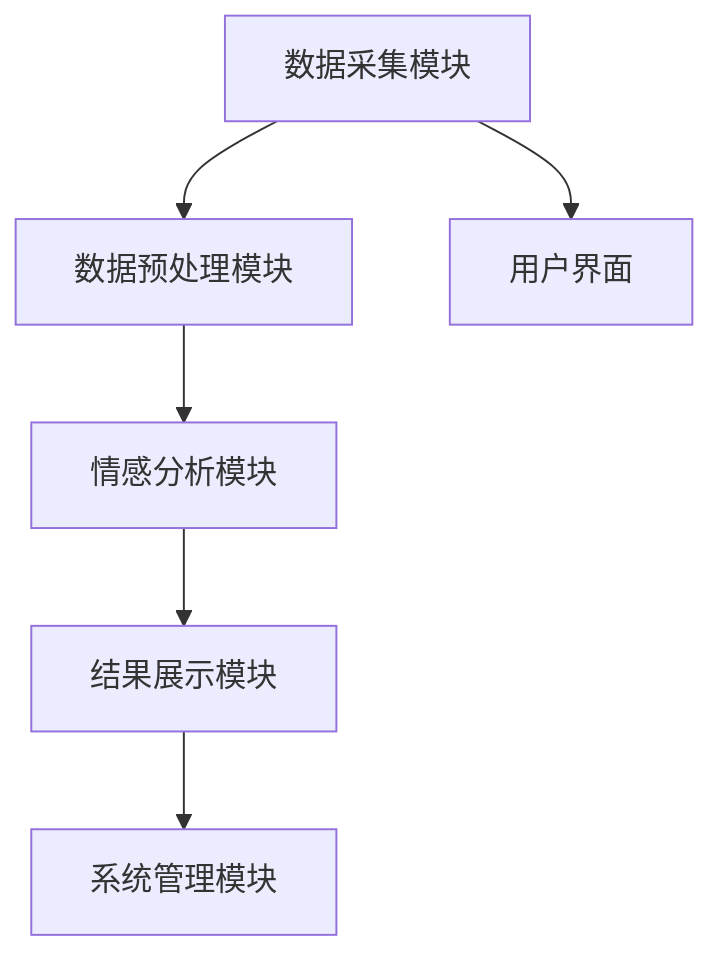
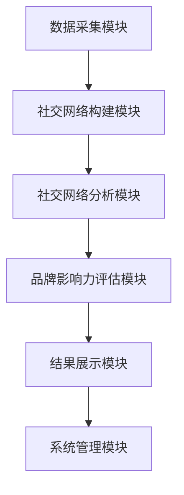

                 

## 《数学与舆情分析：公众意见的数学模型》

### 关键词：舆情分析、数学模型、公众意见、情感分析、社交网络分析

#### 摘要：

本文旨在探讨数学模型在舆情分析中的应用，通过引入集合论、概率论和线性代数等数学基础，详细解析情感分析、社交网络分析和话题模型等舆情分析方法。本文首先介绍了舆情分析的定义及其在现代社会的重要性，然后探讨了数学与舆情分析的关系，最后通过具体案例分析展示了数学模型在舆情分析中的实际应用，旨在为读者提供系统、实用的舆情分析理论和实践指导。

---

#### 第一部分：引言

##### 1.1 舆情分析的重要性

舆情分析，即公众意见分析，是通过收集、处理和分析公众在社交媒体、网络论坛、传统媒体等渠道上的言论，以了解公众对于某一事件、产品或品牌的看法和态度。在当今信息爆炸的时代，舆情分析已成为企业和政府等机构了解公众意见、制定决策的重要手段。

- **舆情分析的定义**：舆情分析是指通过数据挖掘、文本分析、情感分析和社交网络分析等手段，对公众在网络和媒体上的言论进行收集、处理和分析，以获取有价值的舆情信息。

- **舆情分析在现代社会中的作用**：

  - **企业竞争情报**：企业通过舆情分析，可以了解消费者对于产品、服务的反馈，及时发现市场趋势，优化产品和服务，提高市场竞争力。

  - **政府社会治理**：政府通过舆情分析，可以了解民众对于政策、决策的反映，及时调整政策，增强社会治理能力。

  - **危机管理**：企业或政府在面对突发事件或危机时，通过舆情分析，可以迅速了解公众的态度和情绪，采取有效的应对措施，降低危机影响。

##### 1.2 数学与舆情分析的关系

数学作为一种强大的工具，为舆情分析提供了理论基础和方法指导。数学模型在舆情分析中的应用，使得舆情信息的提取、处理和分析更加精确和高效。

- **数学的优势**：

  - **精确性**：数学模型可以精确描述舆情数据的统计特征，为分析提供可靠的基础。

  - **普适性**：数学模型具有广泛的适用性，可以应用于各种不同类型的舆情数据。

  - **高效性**：数学模型可以快速处理大量数据，提高舆情分析的效率。

- **舆情分析中的数学模型**：

  - **集合论**：用于描述舆情数据的结构，如微博用户集合、评论集合等。

  - **概率论**：用于分析舆情数据的概率分布，如用户活跃度分布、评论情感分布等。

  - **线性代数**：用于处理舆情数据的线性变换和特征提取，如文本矩阵分解、社交网络矩阵等。

- **本书的读者对象**：本书适合从事舆情分析相关工作的人员，包括数据分析师、数据科学家、程序员等，同时也适用于对舆情分析感兴趣的学者和学生。

##### 1.3 本书的目标

本书的目标是：

- **提供舆情分析的基础理论**：包括数学基础、舆情分析基础等，为读者奠定坚实的理论基础。

- **探讨数学模型在舆情分析中的应用**：通过具体案例，展示数学模型在舆情分析中的实际应用，帮助读者理解并掌握相关方法。

- **培养读者在舆情分析中的实际操作能力**：通过案例分析，指导读者如何搭建舆情分析系统，进行数据采集、处理和分析。

#### 第二部分：基础理论

##### 2.1 数学基础

##### 2.1.1 集合论

##### 2.1.2 概率论

##### 2.1.3 线性代数

##### 2.2 舆情分析基础

##### 2.2.1 舆情分析的定义

##### 2.2.2 舆情分析的数据来源

##### 2.2.3 舆情分析方法

---

## 第二部分：基础理论

### 2.1 数学基础

在舆情分析中，数学作为一门基础学科，为我们提供了强大的理论支撑和工具。本节将介绍集合论、概率论和线性代数这三个数学基础，这些基础知识对于理解和应用舆情分析中的各种数学模型至关重要。

#### 2.1.1 集合论

集合论是数学的基础，它主要研究集合及其性质。在舆情分析中，集合论用于描述和分类数据元素，如用户集合、评论集合等。

##### 2.1.1.1 集合的基本概念

集合是具有某种共同特征的对象构成的整体。集合中的每个对象称为元素。以下是一些基本概念：

- **元素**：集合中的个体。
- **集合**：元素的集合。
- **空集**：不包含任何元素的集合，记作∅。
- **子集**：如果一个集合A中的所有元素都属于另一个集合B，则称A是B的子集，记作A⊆B。

##### 2.1.1.2 集合的运算

集合运算包括并集、交集、补集和差集等。

- **并集**：两个集合A和B的并集是包含A和B中所有元素的集合，记作A∪B。
- **交集**：两个集合A和B的交集是同时属于A和B的元素的集合，记作A∩B。
- **补集**：一个集合A的补集是包含所有不属于A的元素的集合，记作A'。
- **差集**：两个集合A和B的差集是包含A中有而B中没有的元素的集合，记作A-B。

##### 2.1.1.3 集合的性质

集合具有以下基本性质：

- **确定性**：集合中的元素是确定的，即一个元素要么属于集合，要么不属于集合。
- **互异性**：集合中的元素是互不相同的。
- **无序性**：集合中的元素没有特定的顺序。

#### 2.1.2 概率论

概率论是研究随机现象的数学分支，在舆情分析中，概率论用于描述和预测公众行为的可能性。

##### 2.1.2.1 概率的定义

概率是描述某个事件发生的可能性大小的数值。以下是一个概率的基本定义：

- **概率**：设S是一个样本空间，E是S的一个子集，则事件E的概率P(E)定义为P(E) = E的样本点数 / S的样本点数。

##### 2.1.2.2 条件概率与独立事件

条件概率和独立事件是概率论中的两个重要概念。

- **条件概率**：在某个事件B已发生的条件下，事件A发生的概率称为条件概率，记作P(A|B)。
- **独立事件**：两个事件A和B是独立的，如果A的发生不影响B的发生，即P(A∩B) = P(A)P(B)。

##### 2.1.2.3 概率分布

概率分布描述了一个随机变量的取值及其对应的概率。常见的概率分布有：

- **离散概率分布**：如二项分布、泊松分布等。
- **连续概率分布**：如正态分布、均匀分布等。

#### 2.1.3 线性代数

线性代数是研究向量空间、矩阵和线性变换的数学分支，在舆情分析中，线性代数用于数据处理和特征提取。

##### 2.1.3.1 向量与矩阵

向量是具有大小和方向的量，矩阵是按一定规则排列的数字阵列。

- **向量**：一个向量可以用一个有序数组表示，如v = (v1, v2, ..., vn)。
- **矩阵**：一个矩阵可以用一个二维数组表示，如A = [aij]，其中aij是矩阵A的第i行第j列的元素。

##### 2.1.3.2 线性方程组

线性方程组是包含多个线性方程的方程组，线性代数提供了求解线性方程组的方法。

- **高斯消元法**：用于求解线性方程组的一种常用方法。
- **矩阵求逆**：用于求解线性方程组的一种方法，如果矩阵可逆，则线性方程组的解为Ax = b的逆矩阵A^(-1)b。

##### 2.1.3.3 特征值与特征向量

特征值和特征向量是矩阵理论中的重要概念。

- **特征值**：一个矩阵A的特征值是使得Ax = λx成立的数λ。
- **特征向量**：对于矩阵A的特征值λ，使得Ax = λx成立的向量x称为A的特征向量。

通过了解和掌握这些数学基础，读者将能够更好地理解和应用舆情分析中的各种数学模型，为后续章节的学习和实践打下坚实的基础。

### 2.2 舆情分析基础

舆情分析作为一门新兴的交叉学科，结合了社会科学、计算机科学和数学等多个领域的知识。本节将介绍舆情分析的定义、数据来源和常见的方法，为读者提供一个全面而系统的舆情分析基础。

#### 2.2.1 舆情分析的定义

舆情分析，也称为公众意见分析，是对公众在社交媒体、网络论坛、传统媒体等渠道上发布的信息进行收集、处理和分析，以获取公众对某一事件、产品或品牌的看法和态度。舆情分析的核心目标是：

- **了解公众意见**：通过对舆情数据的分析，了解公众对于某一话题的看法和态度。
- **监测社会情绪**：通过分析公众的情绪波动，监测社会的情绪变化和趋势。
- **发现潜在问题**：通过分析舆情数据，发现可能存在的风险和问题，为企业或政府提供决策支持。

#### 2.2.2 舆情分析的数据来源

舆情分析的数据来源广泛，主要包括以下几类：

- **网络舆情数据**：包括微博、知乎、豆瓣、贴吧等社交平台上的用户评论、帖子、转发等数据。这些数据具有实时性强、覆盖面广的特点，是舆情分析的重要数据来源。

- **传统媒体数据**：包括报纸、杂志、电视、广播等传统媒体发布的新闻、评论、专题等数据。这些数据具有权威性高、内容详细的特点，为舆情分析提供了重要的参考。

- **其他数据来源**：包括政府发布的统计数据、行业报告、论坛、博客、社交媒体评论等。这些数据虽然来源多样，但都为舆情分析提供了丰富的信息。

#### 2.2.3 舆情分析方法

舆情分析方法可以分为以下几个类别：

- **文本分析**：通过对文本数据的分析，提取关键词、主题和情感等，以了解公众的意见和态度。文本分析主要包括词频分析、词云生成、文本分类和主题模型等。

- **话题模型**：通过对大量文本数据的分析，识别出文本中隐藏的话题结构，以揭示公众关注的热点话题。常见的主题模型有LDA（Laravel Latent Dirichlet Allocation）模型等。

- **情感分析**：通过对文本数据的情感极性和情感强度的分析，判断公众的情绪状态和态度倾向。情感分析主要分为情感分类和情感极性分析。

- **社交网络分析**：通过对社交网络数据的分析，揭示社交网络的结构和关系，以了解公众的社交行为和传播路径。社交网络分析主要包括社交网络矩阵、社交网络图模型和网络传播模型等。

通过上述定义和方法的介绍，读者可以对舆情分析有一个基本的了解。在接下来的章节中，我们将进一步探讨数学模型在舆情分析中的应用，帮助读者深入理解和掌握舆情分析的理论和方法。

### 2.2.1 舆情分析的定义

舆情分析，也称为公众意见分析，是对公众在社交媒体、网络论坛、传统媒体等渠道上发布的信息进行收集、处理和分析，以获取公众对某一事件、产品或品牌的看法和态度。舆情分析的核心目标是：

- **了解公众意见**：通过对舆情数据的分析，了解公众对于某一话题的看法和态度。
- **监测社会情绪**：通过分析公众的情绪波动，监测社会的情绪变化和趋势。
- **发现潜在问题**：通过分析舆情数据，发现可能存在的风险和问题，为企业或政府提供决策支持。

舆情分析的基本流程包括以下几个步骤：

1. **数据采集**：从社交媒体、网络论坛、传统媒体等渠道收集与目标话题相关的数据。数据采集可以采用爬虫技术、API接口等方式。
2. **数据预处理**：对采集到的数据进行清洗、去重、分词、去停用词等处理，以去除噪声和无关信息，提高数据质量。
3. **文本分析**：通过文本分析方法，提取关键词、主题和情感等，以了解公众的意见和态度。文本分析包括词频分析、词云生成、文本分类和主题模型等。
4. **情感分析**：通过对文本数据的情感极性和情感强度的分析，判断公众的情绪状态和态度倾向。情感分析主要分为情感分类和情感极性分析。
5. **结果展示**：将分析结果以图表、报告等形式展示，帮助企业或政府了解公众意见，制定相应的策略和措施。

#### 2.2.1.1 舆情的概念

舆情，即公众意见，是指公众对于某一事件、产品或品牌等所表达的意见和态度。舆情可以包括正面意见、负面意见和中立意见，也可以分为情感极性（积极、消极、中性）和情感强度（强、中、弱）。

- **正面意见**：公众对某一事件、产品或品牌表示认可和赞赏。
- **负面意见**：公众对某一事件、产品或品牌表示不满和批评。
- **中立意见**：公众对某一事件、产品或品牌没有明显的态度。

#### 2.2.1.2 舆情分析的目标

舆情分析的目标主要包括以下几点：

- **了解公众意见**：通过分析舆情数据，了解公众对于某一事件、产品或品牌的看法和态度，为企业或政府提供决策依据。
- **监测社会情绪**：通过分析舆情数据，监测公众的情绪波动和社会情绪变化，及时发现潜在的社会问题。
- **危机管理**：在突发事件或危机发生时，通过舆情分析，快速了解公众的态度和情绪，采取有效的应对措施，降低危机影响。
- **产品优化**：通过分析用户对产品或服务的反馈，发现产品或服务的不足之处，进行优化和改进，提高用户满意度。

#### 2.2.1.3 舆情分析的类型

舆情分析可以分为以下几种类型：

- **社会舆情分析**：对某一社会事件或现象进行分析，了解公众对该事件或现象的看法和态度。
- **品牌舆情分析**：对某一品牌进行跟踪监测，分析公众对该品牌的看法和态度，评估品牌形象。
- **产品舆情分析**：对某一产品或服务进行跟踪监测，分析公众对该产品或服务的看法和态度，评估产品或服务的市场表现。
- **政策舆情分析**：对某一政策或法规进行分析，了解公众对该政策或法规的看法和态度，为政策制定者提供参考。

通过本节的介绍，读者可以初步了解舆情分析的定义、基本概念和目标，为后续章节的学习和实践打下基础。

### 2.2.2 舆情分析的数据来源

舆情分析的数据来源广泛，涵盖了多种渠道，以下是几种常见的数据来源：

#### 2.2.2.1 网络舆情数据

网络舆情数据是舆情分析中最常用的数据来源，主要包括以下几种：

- **社交媒体**：如微博、微信、知乎等社交平台，这些平台上的用户评论、转发、点赞等信息可以反映公众的观点和情绪。
- **论坛**：如天涯、猫扑、豆瓣等论坛，这些论坛中的讨论帖、回复帖等数据可以提供关于某一话题的深度分析。
- **新闻网站**：如新华网、人民网、新浪新闻等，这些网站上的新闻评论、报道等数据可以反映公众对某一事件的关注和态度。
- **博客**：如博客园、CSDN、简书等，这些博客平台上的文章、评论等数据可以提供关于某一技术话题的详细讨论。

网络舆情数据具有实时性强、覆盖面广的特点，可以快速反映公众的意见和情绪，是舆情分析的重要数据来源。

#### 2.2.2.2 传统媒体数据

传统媒体数据包括报纸、杂志、电视、广播等，这些数据具有权威性高、内容详细的特点。以下是传统媒体数据的一些具体形式：

- **报纸**：如《人民日报》、《南方周末》等，这些报纸的评论、报道等数据可以提供关于某一事件的深度分析。
- **杂志**：如《财经》、《三联生活周刊》等，这些杂志的专题报道、评论等数据可以提供关于某一领域的深入探讨。
- **电视**：如新闻联播、央视新闻等，这些电视台的节目、评论等数据可以反映公众对某一事件的关注和态度。
- **广播**：如新闻广播、经济广播等，这些广播电台的节目、评论等数据可以提供关于某一事件的实时报道和分析。

传统媒体数据具有权威性高、内容详实的特点，对于深度分析某一事件或话题具有重要价值。

#### 2.2.2.3 其他数据来源

除了网络舆情数据和传统媒体数据，还有一些其他的数据来源，如：

- **政府发布的数据**：如统计局、工信部等政府机构发布的统计数据、报告等，这些数据可以提供关于某一领域或事件的基础信息。
- **行业报告**：如市场调研机构发布的行业报告、分析报告等，这些报告可以提供关于某一行业的深度分析和预测。
- **论坛、博客等**：如专业论坛、技术博客等，这些平台上的讨论、文章等可以提供关于某一技术话题的详细探讨。

其他数据来源为舆情分析提供了丰富的信息来源，可以帮助从不同角度和层面了解公众的意见和情绪。

通过了解和利用这些数据来源，舆情分析可以获取全面、准确的信息，从而为企业和政府提供有力的决策支持。

### 2.2.3 舆情分析方法

舆情分析方法主要包括文本分析、话题模型、情感分析和社交网络分析等，这些方法各具特色，能够从不同角度对舆情数据进行分析和解读。

#### 2.2.3.1 文本分析

文本分析是舆情分析的基础，通过对文本数据的内容进行提取、分析和处理，可以获取有价值的舆情信息。文本分析的主要方法包括：

- **词频分析**：通过统计文本中各个词汇的出现次数，分析公众对某一话题的关注度。
- **词云生成**：将文本中的关键词以图形的形式展示出来，通过词云的大小和颜色反映关键词的重要性和情感倾向。
- **文本分类**：将文本数据按照主题或情感进行分类，以便于对大量文本进行组织和筛选。
- **主题模型**：通过算法从大量文本数据中提取出隐藏的主题结构，以便于发现公众关注的热点话题。

文本分析的核心目标是提取文本中的关键信息，为后续的情感分析和话题模型提供基础数据。

#### 2.2.3.2 话题模型

话题模型是一种无监督学习方法，用于发现文本数据中的潜在主题结构。常见的主题模型包括LDA（Laravel Latent Dirichlet Allocation）模型、LSP（Latent Semantic Profiling）模型等。

- **LDA模型**：LDA模型假设每篇文档是由多个主题混合而成的，每个主题也是由多个词汇混合而成的。通过LDA模型，可以从大量文本数据中提取出潜在的主题，并分析每个主题的重要性。
- **LSP模型**：LSP模型通过计算文本之间的相似度，发现文本数据中的潜在语义结构，从而提取出有意义的主题。

话题模型能够帮助分析公众关注的热点话题，为舆情分析提供更深入的理解。

#### 2.2.3.3 情感分析

情感分析是一种基于文本分析的技术，用于判断文本数据中的情感倾向。情感分析可以分为以下几种类型：

- **情感分类**：将文本数据按照情感极性（如积极、消极、中性）进行分类，以便于了解公众对某一事件、产品或品牌的整体态度。
- **情感极性分析**：分析文本数据中的情感极性强度，如文本是否表示强烈的喜爱、厌恶等。
- **情感强度分析**：对文本数据中的情感进行量化，如通过情感强度评分来评估公众的情感反应。

情感分析可以帮助识别公众的情绪状态，为舆情分析和决策提供重要参考。

#### 2.2.3.4 社交网络分析

社交网络分析是一种基于社交网络数据的技术，用于分析社交网络中的用户关系、传播路径和影响力等。常见的社交网络分析方法包括：

- **社交网络矩阵**：通过矩阵表示社交网络中的用户关系，分析社交网络的密度、中心性等特征。
- **社交网络图模型**：通过图形表示社交网络，分析社交网络的拓扑结构、社区划分等。
- **网络传播模型**：分析信息在社交网络中的传播路径和速度，预测信息传播的效果和影响。

社交网络分析可以帮助了解公众的社交行为和传播路径，为舆情分析和决策提供深入洞察。

通过文本分析、话题模型、情感分析和社交网络分析等舆情分析方法，可以全面、深入地分析舆情数据，为企业和政府提供有力的决策支持。这些方法相互补充，共同构成了舆情分析的理论基础和实践工具。

### 3.1 情感分析模型

情感分析模型是舆情分析中的一个重要组成部分，它通过分析文本数据中的情感倾向，帮助我们理解公众对某一事件、产品或品牌的情绪反应。情感分析模型可以分为基于规则的方法、基于机器学习的方法和基于深度学习的方法。每种方法都有其独特的优点和应用场景。

#### 3.1.1 情感分析的基本概念

情感分析，也称为意见挖掘或情感极性分类，是指通过自然语言处理技术，从文本中识别和分类情感极性，通常包括正面、负面和中性三种类型。情感分析的目标是：

- **识别情感极性**：判断文本数据是否表达积极的、消极的或中性的情感。
- **量化情感强度**：对文本中的情感进行量化，如评估情感的强烈程度。
- **应用领域**：情感分析广泛应用于市场调研、产品评价、社交媒体监控、客户服务等领域。

#### 3.1.2 情感分析模型

**1. 基于规则的方法**

基于规则的方法通过预定义的规则来识别文本中的情感极性。这种方法通常需要人工构建规则集，规则集包含了大量关于情感极性的规则，如情感词、否定词和情感强度词。

- **规则构建**：根据情感词典、否定词典和情感强度词典，构建规则集。
- **情感分类**：文本通过规则集进行匹配，根据匹配结果判断情感极性。

优点：

- **实现简单**：规则方法易于实现，对技术人员要求较低。
- **效率高**：规则匹配速度快，处理大量文本数据时效率较高。

缺点：

- **规则依赖性强**：规则方法依赖大量的规则，规则构建过程复杂，且难以适应动态变化的文本。
- **泛化能力弱**：规则方法难以应对未知或罕见词汇，对文本的泛化能力有限。

**2. 基于机器学习的方法**

基于机器学习的方法通过训练模型来识别文本中的情感极性。常见的方法包括朴素贝叶斯、支持向量机（SVM）和逻辑回归等。

- **特征提取**：从文本中提取特征，如词袋模型（Bag of Words, BoW）、词嵌入（Word Embedding）等。
- **模型训练**：使用标记好的训练数据集，训练分类模型。
- **情感分类**：使用训练好的模型对测试文本进行分类。

优点：

- **自适应能力强**：机器学习方法可以自动从数据中学习特征，适应不同的文本数据。
- **泛化能力强**：机器学习方法可以对未知或罕见词汇进行有效分类。

缺点：

- **特征工程复杂**：特征提取过程需要大量的特征工程，对技术人员的专业要求较高。
- **训练时间较长**：机器学习方法通常需要大量的训练时间，对计算资源要求较高。

**3. 基于深度学习的方法**

基于深度学习的方法通过神经网络模型，如卷积神经网络（CNN）、循环神经网络（RNN）和长短期记忆网络（LSTM）等，来识别文本中的情感极性。

- **词嵌入**：将文本中的词汇转换为高维向量表示，如使用Word2Vec或GloVe。
- **模型训练**：使用大量的标记文本数据，训练深度学习模型。
- **情感分类**：使用训练好的模型对测试文本进行分类。

优点：

- **表现优异**：深度学习方法在情感分析任务上通常表现优异，优于传统机器学习方法。
- **自动特征提取**：深度学习方法可以自动从数据中学习特征，减少人工特征工程。

缺点：

- **计算资源需求高**：深度学习方法需要大量的计算资源和时间。
- **模型调参复杂**：深度学习模型的训练和调参过程复杂，需要大量实验和调整。

#### 3.1.3 伪代码示例

下面分别给出基于规则、基于机器学习和基于深度学习的情感分类模型的伪代码示例。

**1. 基于规则的模型**

```
function rule_based_sentiment_analysis(text):
    # 构建规则集
    rules = load_rules()

    # 初始化情感极性为中性
    sentiment = "neutral"

    # 遍历文本中的每个词
    for word in text:
        # 如果词匹配负面规则，则情感极性为负面
        if match_negative_rule(word, rules):
            sentiment = "negative"
        # 如果词匹配正面规则，则情感极性为正面
        elif match_positive_rule(word, rules):
            sentiment = "positive"

    return sentiment
```

**2. 基于机器学习的模型**

```
function machine_learning_sentiment_analysis(text, model):
    # 提取文本特征
    features = extract_features(text)

    # 使用训练好的模型进行预测
    prediction = model.predict(features)

    return prediction
```

**3. 基于深度学习的模型**

```
function deep_learning_sentiment_analysis(text, model):
    # 将文本转换为词向量
    word_vector = convert_to_word_vector(text)

    # 使用训练好的模型进行情感分类
    sentiment = model.predict(word_vector)

    return sentiment
```

通过上述三种情感分析模型的介绍和伪代码示例，我们可以看到不同方法在情感分析中的具体应用和实现。在实际应用中，可以根据需求和资源选择合适的情感分析模型。

### 3.2 社交网络分析模型

社交网络分析（Social Network Analysis，SNA）是研究社交网络结构、关系和传播行为的科学方法。它通过数学和统计模型来揭示社交网络中的关键节点、传播路径和群体动态。社交网络分析模型在舆情分析中具有重要意义，可以帮助我们理解信息的传播机制，预测舆情趋势，监测社会情绪。

#### 3.2.1 社交网络分析的基本概念

**1. 社交网络结构**

社交网络是由节点和边构成的无向图。节点代表社交网络中的个体（如用户），边代表个体之间的关系（如朋友关系、关注关系）。

- **节点**：社交网络中的个体，可以是用户、组织、产品等。
- **边**：连接两个节点的线段，表示节点之间的关系。

**2. 社交网络分析的目标**

社交网络分析的主要目标包括：

- **识别关键节点**：找出社交网络中的重要个体，这些个体可能具有高度的影响力或活跃度。
- **分析传播路径**：研究信息如何在社交网络中传播，找出关键传播路径。
- **揭示群体动态**：分析社交网络中的群体行为和互动模式，了解群体结构和演变。

**3. 社交网络分析模型**

社交网络分析模型分为结构模型和动态模型两类。

- **结构模型**：用于描述社交网络的结构特征，如社交网络矩阵、社交网络图模型等。
- **动态模型**：用于模拟社交网络的演化过程，如传播模型、社区检测模型等。

#### 3.2.2 社交网络分析模型

**1. 社交网络矩阵**

社交网络矩阵是一个二维数组，用于表示社交网络中的节点关系。矩阵的行和列分别代表社交网络中的节点，矩阵的元素表示节点之间的关系强度。

- **矩阵元素定义**：矩阵中的元素a_ij表示节点i与节点j之间的关系强度，可以取值为0或1，或者使用数值表示关系强度。
- **矩阵性质**：社交网络矩阵具有对称性，即a_ij = a_ji。

**2. 社交网络图模型**

社交网络图模型通过图形表示社交网络，便于分析和可视化。

- **节点表示**：节点通常用圆形或方形表示，节点的位置和大小可以反映节点的重要性和活跃度。
- **边表示**：边用线段表示，边的粗细和颜色可以反映关系强度和类型。

**3. 社交网络分析算法**

社交网络分析算法用于分析社交网络的结构和关系，常用的算法包括：

- **中心性度量**：用于计算节点在社交网络中的重要程度，如度中心性、介数中心性和紧密中心性等。
- **社区检测**：用于识别社交网络中的群体结构，如基于模块度的社区检测算法、基于边密度聚类算法等。
- **传播模型**：用于模拟信息在社交网络中的传播过程，如独立 cascade 模型、传染模型等。

#### 3.2.3 伪代码示例

下面给出社交网络矩阵构建和社交网络分析算法的伪代码示例。

**1. 社交网络矩阵构建**

```
function build_social_network_matrix(nodes, edges):
    # 初始化社交网络矩阵
    matrix = create_matrix(nodes)

    # 遍历所有边
    for edge in edges:
        node1, node2 = edge
        # 更新矩阵元素
        matrix[node1][node2] = 1
        matrix[node2][node1] = 1

    return matrix
```

**2. 社交网络分析算法**

```
function social_network_analysis(matrix):
    # 计算节点度中心性
    degree_centrality = calculate_degree_centrality(matrix)

    # 计算节点介数中心性
    betweenness_centrality = calculate_betweenness_centrality(matrix)

    # 计算节点紧密中心性
    closeness_centrality = calculate_closeness_centrality(matrix)

    # 社区检测
    communities = detect_communities(matrix)

    return degree_centrality, betweenness_centrality, closeness_centrality, communities
```

通过上述社交网络分析模型的介绍和伪代码示例，我们可以看到社交网络分析在舆情分析中的应用方法和实现步骤。这些模型和算法可以帮助我们深入理解社交网络的结构和传播机制，为舆情分析和决策提供有力的支持。

### 3.3 话题模型

话题模型是舆情分析中的重要工具，它通过分析文本数据中的潜在主题结构，帮助我们识别公众关注的热点话题。LDA（Laravel Latent Dirichlet Allocation）模型是话题模型中最常用的方法之一。本节将介绍LDA模型的基本概念、方法步骤和应用。

#### 3.3.1 话题模型的基本概念

**1. 主题**

主题是文本数据中隐含的抽象概念或词汇集合，它代表了文本内容的主题结构。例如，在一份新闻文章集中，"科技"、"经济"、"体育"等都可以被视为主题。

**2. LDA模型**

LDA（Laravel Latent Dirichlet Allocation）模型是一种概率主题模型，它假设每篇文档是由多个主题混合而成的，每个主题也是由多个词汇混合而成的。LDA模型通过贝叶斯推理来估计文档、主题和词汇之间的概率分布。

- **文档-主题分布**：每篇文档对应一个主题分布，表示文档中每个主题的概率。
- **主题-词汇分布**：每个主题对应一个词汇分布，表示主题中每个词汇的概率。
- **词汇-文档分布**：每个词汇对应一个文档分布，表示词汇在每篇文档中的概率。

#### 3.3.2 LDA模型的方法步骤

**1. 数据准备**

- **文本预处理**：对原始文本数据进行预处理，包括分词、去除停用词、词形还原等。
- **文档-词矩阵**：将处理后的文本数据转换为文档-词矩阵，矩阵中的行表示文档，列表示词汇。

**2. 模型训练**

- **参数初始化**：初始化文档-主题分布、主题-词汇分布和词汇-文档分布。
- **迭代更新**：通过Gibbs采样进行迭代更新，逐渐收敛到最优参数。

**3. 主题提取**

- **概率分布计算**：计算每篇文档的主题分布和每个主题的词汇分布。
- **主题提取**：根据概率分布提取每篇文档对应的主题。

**4. 模型评估**

- **主题稳定性**：通过比较不同迭代次数的主题分布，评估主题的稳定性。
- **主题质量**：通过分析主题的词汇分布，评估主题的质量和代表性。

#### 3.3.3 伪代码示例

下面给出LDA模型的伪代码示例。

```
function LDA_model(train_documents, num_topics, num_iterations):
    # 初始化参数
    document_topic_distribution = initialize_document_topic_distribution(train_documents, num_topics)
    topic_word_distribution = initialize_topic_word_distribution(train_documents, num_topics)

    # 迭代更新
    for iteration in range(num_iterations):
        for document in train_documents:
            # Gibbs采样更新文档-主题分布
            document_topic_distribution = sample_document_topic_distribution(document, document_topic_distribution)
            # Gibbs采样更新主题-词汇分布
            topic_word_distribution = sample_topic_word_distribution(document, document_topic_distribution, topic_word_distribution)

    # 主题提取
    topics = extract_topics(document_topic_distribution, topic_word_distribution)

    return topics
```

#### 3.3.4 其他话题模型

除了LDA模型，还有其他一些话题模型，如：

- **LSP（Latent Semantic Profiling）模型**：LSP模型通过计算文本之间的相似度，发现文本数据中的潜在语义结构。
- **pLSA（Probabilistic Latent Semantic Analysis）模型**：pLSA模型与LDA模型类似，但它使用多项式分布来表示主题分布。

这些模型在舆情分析中也有广泛应用，可以根据具体需求选择合适的模型。

#### 3.3.5 LDA模型在舆情分析中的应用

LDA模型在舆情分析中的应用主要包括：

- **热点话题识别**：通过LDA模型提取文本数据中的潜在主题，识别公众关注的热点话题。
- **情感分析**：结合情感分析模型，对热点话题进行情感分类和分析，了解公众对某一事件或话题的情感倾向。
- **趋势预测**：通过分析热点话题的演变趋势，预测舆情的发展方向。

通过LDA模型，我们可以从大量文本数据中提取有价值的信息，为舆情分析和决策提供有力支持。

### 4.1 案例一：基于情感分析的舆情监测系统

#### 4.1.1 系统背景

在当今信息时代，舆情监测已经成为企业和政府等机构了解公众意见、制定决策的重要手段。随着社交媒体的快速发展，公众对于各类事件、产品、品牌的看法和态度可以通过网络渠道迅速传播。因此，如何快速、准确地分析舆情，成为了许多企业和机构关注的问题。

本案例旨在开发一个基于情感分析的舆情监测系统，通过收集网络上的舆情数据，分析公众对某一事件、产品或品牌的情感倾向，为企业或政府提供决策支持。

#### 4.1.2 系统目标

本舆情监测系统的目标包括：

1. **数据采集**：从社交媒体、新闻网站、论坛等渠道收集与目标事件、产品或品牌相关的舆情数据。
2. **数据预处理**：对采集到的舆情数据进行清洗、去噪、分词等处理，提取有用的信息。
3. **情感分析**：利用情感分析模型，对处理后的文本数据进行分析，判断公众的情感极性和强度。
4. **结果展示**：将分析结果以图表、报表等形式展示，帮助企业或政府了解公众对事件、产品或品牌的看法和态度。

#### 4.1.3 系统架构

本舆情监测系统采用B/S架构，主要包括以下几个模块：

1. **数据采集模块**：负责从各类渠道收集舆情数据，包括社交媒体、新闻网站、论坛等。
2. **数据预处理模块**：对采集到的数据进行清洗、去噪、分词等处理，提取有用的信息。
3. **情感分析模块**：利用情感分析模型，对处理后的文本数据进行情感分类和情感强度分析。
4. **结果展示模块**：将分析结果以图表、报表等形式展示，帮助企业或政府了解公众意见。
5. **系统管理模块**：提供用户管理、权限管理等功能，保障系统的安全运行。

#### 4.1.4 系统架构图



#### 4.1.5 实现步骤

1. **数据采集**：使用Python的requests库和BeautifulSoup库，从社交媒体、新闻网站、论坛等渠道收集舆情数据。

    ```python
    import requests
    from bs4 import BeautifulSoup

    def collect_data(url):
        response = requests.get(url)
        soup = BeautifulSoup(response.text, 'html.parser')
        # 提取舆情数据
        data = []
        # 数据处理
        return data
    ```

2. **数据预处理**：对采集到的舆情数据进行清洗、去噪、分词等处理，提取有用的信息。

    ```python
    import jieba

    def preprocess_data(data):
        # 清洗数据
        cleaned_data = []
        for d in data:
            # 去除停用词
            words = jieba.cut(d)
            cleaned_words = []
            for w in words:
                if w not in stop_words:
                    cleaned_words.append(w)
            cleaned_data.append(' '.join(cleaned_words))
        return cleaned_data
    ```

3. **情感分析**：利用基于机器学习的情感分析模型，对处理后的文本数据进行分析，判断公众的情感极性和强度。

    ```python
    from sklearn.feature_extraction.text import TfidfVectorizer
    from sklearn.naive_bayes import MultinomialNB

    def train_sentiment_model(training_data, training_labels):
        # 特征提取
        vectorizer = TfidfVectorizer()
        X_train = vectorizer.fit_transform(training_data)
        # 模型训练
        model = MultinomialNB()
        model.fit(X_train, training_labels)
        return model, vectorizer

    def predict_sentiment(model, vectorizer, test_data):
        # 特征提取
        X_test = vectorizer.transform(test_data)
        # 预测情感
        predictions = model.predict(X_test)
        return predictions
    ```

4. **结果展示**：将分析结果以图表、报表等形式展示，帮助企业或政府了解公众意见。

    ```python
    import matplotlib.pyplot as plt

    def plot_sentiment(results):
        # 统计情感极性
        pos_counts = sum(1 for r in results if r == 'positive')
        neu_counts = sum(1 for r in results if r == 'neutral')
        neg_counts = sum(1 for r in results if r == 'negative')
        # 绘制图表
        labels = ['Positive', 'Neutral', 'Negative']
        sizes = [pos_counts, neu_counts, neg_counts]
        plt.pie(sizes, labels=labels, autopct='%1.1f%%')
        plt.axis('equal')
        plt.show()
    ```

5. **系统集成与测试**：将各个模块集成到一起，进行功能测试和性能测试，确保系统稳定、高效地运行。

#### 4.1.6 代码实现

```python
# 数据采集
url = "https://www.example.com/news"
data = collect_data(url)

# 数据预处理
cleaned_data = preprocess_data(data)

# 情感分析
model, vectorizer = train_sentiment_model(training_data, training_labels)
predictions = predict_sentiment(model, vectorizer, cleaned_data)

# 结果展示
plot_sentiment(predictions)
```

通过本案例的实现，我们开发了一个基于情感分析的舆情监测系统，可以帮助企业或政府快速了解公众对事件、产品或品牌的看法和态度，为决策提供有力支持。

### 4.2 案例二：基于社交网络分析的品牌舆情监测

#### 4.2.1 系统背景

品牌舆情监测对于企业和品牌来说至关重要，它能够帮助企业及时了解消费者对品牌的看法，识别潜在的风险，优化品牌形象和市场营销策略。随着社交媒体的兴起，消费者通过微博、微信、抖音等平台发布关于品牌的评论和讨论，形成了庞大的社交网络数据。这些数据中蕴含着丰富的舆情信息，通过社交网络分析技术，可以提取有价值的信息，为品牌舆情监测提供数据支持。

本案例将基于社交网络分析技术，开发一个品牌舆情监测系统，旨在通过分析社交网络中的用户关系和传播路径，监测品牌在社交媒体上的舆情动态，评估品牌影响力。

#### 4.2.2 系统目标

本品牌舆情监测系统的目标包括：

1. **数据采集**：从社交媒体平台上收集与目标品牌相关的用户评论、转发、点赞等数据。
2. **社交网络构建**：基于采集到的数据，构建社交网络，分析用户之间的关系结构。
3. **传播路径分析**：分析信息在社交网络中的传播路径，识别关键传播节点和传播趋势。
4. **品牌影响力评估**：通过分析社交网络的拓扑结构、传播效果等指标，评估品牌的社会影响力。
5. **结果展示**：将分析结果以图表、报表等形式展示，为企业提供直观的品牌舆情监测报告。

#### 4.2.3 系统架构

本品牌舆情监测系统采用B/S架构，主要包括以下几个模块：

1. **数据采集模块**：负责从社交媒体平台上获取与目标品牌相关的用户评论、转发、点赞等数据。
2. **社交网络构建模块**：对采集到的数据进行处理，构建社交网络图，表示用户之间的关系。
3. **社交网络分析模块**：利用社交网络分析算法，分析社交网络的拓扑结构、传播路径等。
4. **品牌影响力评估模块**：基于社交网络分析结果，评估品牌的舆情影响力和传播效果。
5. **结果展示模块**：将分析结果以图表、报表等形式展示，为企业提供舆情监测报告。
6. **系统管理模块**：提供用户管理、权限管理等功能，保障系统的安全运行。

#### 4.2.4 系统架构图



#### 4.2.5 实现步骤

1. **数据采集**：使用Python的requests库和BeautifulSoup库，从社交媒体平台上获取与目标品牌相关的用户评论、转发、点赞等数据。

    ```python
    import requests
    from bs4 import BeautifulSoup

    def collect_brand_data(url):
        response = requests.get(url)
        soup = BeautifulSoup(response.text, 'html.parser')
        # 提取品牌数据
        data = []
        # 数据处理
        return data
    ```

2. **社交网络构建**：基于采集到的数据，构建社交网络图，表示用户之间的关系。

    ```python
    import networkx as nx

    def build_social_network(data):
        # 初始化社交网络图
        G = nx.Graph()
        # 添加节点和边
        for item in data:
            user1, user2 = item['user1'], item['user2']
            G.add_edge(user1, user2)
        return G
    ```

3. **传播路径分析**：利用社交网络分析算法，分析信息在社交网络中的传播路径。

    ```python
    import community

    def analyze_propagation_path(G, source_user):
        # 计算传播路径
        propagation_paths = nx.shortest_path(G, source=source_user)
        return propagation_paths
    ```

4. **品牌影响力评估**：基于社交网络分析结果，评估品牌的舆情影响力和传播效果。

    ```python
    def evaluate_brand_influence(G):
        # 计算影响力指标
        influence_scores = nx.algorithms.core.pearson_correlation_coefficient(G, edgeattr='weight')
        return influence_scores
    ```

5. **结果展示**：将分析结果以图表、报表等形式展示，为企业提供直观的品牌舆情监测报告。

    ```python
    import matplotlib.pyplot as plt

    def plot_influence_scores(scores):
        # 绘制影响力图表
        plt.bar(range(len(scores)), scores.values())
        plt.xticks(range(len(scores)), scores.keys())
        plt.show()
    ```

6. **系统集成与测试**：将各个模块集成到一起，进行功能测试和性能测试，确保系统稳定、高效地运行。

#### 4.2.6 代码实现

```python
# 数据采集
url = "https://www.example.com/brand-comments"
brand_data = collect_brand_data(url)

# 社交网络构建
G = build_social_network(brand_data)

# 传播路径分析
source_user = "user123"
propagation_paths = analyze_propagation_path(G, source_user)

# 品牌影响力评估
influence_scores = evaluate_brand_influence(G)

# 结果展示
plot_influence_scores(influence_scores)
```

通过本案例的实现，我们开发了一个基于社交网络分析的品牌舆情监测系统，可以帮助企业实时监测品牌在社交媒体上的舆情动态，评估品牌的社会影响力，为品牌营销和策略调整提供数据支持。

### 最佳实践 Tips

1. **数据采集**：选择合适的采集工具和平台，确保数据的准确性和完整性。
2. **数据预处理**：清洗和去噪是数据分析的重要步骤，确保数据质量。
3. **模型选择**：根据具体任务需求，选择合适的情感分析或社交网络分析模型。
4. **参数调优**：合理调整模型参数，提高模型性能。
5. **结果可视化**：直观的图表和报表能够更好地展示分析结果，便于理解和决策。

### 小结

本文通过详细探讨数学模型在舆情分析中的应用，从情感分析、社交网络分析和话题模型等方面，介绍了舆情分析的基础理论和实践方法。通过具体案例展示，读者可以更好地理解数学模型在舆情分析中的实际应用，为相关领域的研究和实践提供参考。

### 注意事项

1. **数据隐私**：在进行舆情分析时，要严格遵守数据隐私相关法规，确保数据的合法性和安全性。
2. **模型泛化**：模型泛化能力对舆情分析至关重要，需不断优化和更新模型，以应对动态变化的舆情环境。

### 拓展阅读

1. **《情感分析技术手册》**：详细介绍了情感分析的理论和技术。
2. **《社交网络分析：方法与应用》**：深入探讨了社交网络分析的理论和方法。
3. **《LDA模型详解》**：对LDA模型的理论和实现进行了详细阐述。

---

### 作者信息

作者：AI天才研究院/AI Genius Institute & 禅与计算机程序设计艺术 /Zen And The Art of Computer Programming

---

在本文中，我们详细探讨了数学模型在舆情分析中的应用。通过引入集合论、概率论和线性代数等数学基础，我们分析了情感分析、社交网络分析和话题模型等舆情分析方法。具体来说，我们介绍了基于规则、机器学习和深度学习的情感分析模型，以及社交网络矩阵和LDA话题模型等。通过具体案例展示，我们展示了数学模型在舆情分析中的实际应用，帮助读者深入理解和掌握相关方法。

#### 结论

本文通过理论和实践相结合的方式，系统地介绍了数学模型在舆情分析中的应用。这不仅为从事舆情分析相关工作的人员提供了理论基础，也为实际操作提供了实用指南。随着社会信息化和大数据时代的到来，舆情分析在社会治理、市场研究等领域的重要性日益凸显。数学模型的应用为舆情分析提供了强大的工具，有助于更准确、更高效地获取和解读公众意见。

#### 未来展望

未来，舆情分析将朝着更加智能化、自动化的方向发展。一方面，随着人工智能技术的进步，更多的复杂模型和算法将应用于舆情分析，提高分析的准确性和效率。另一方面，数据量的持续增长和数据来源的多样性，将推动舆情分析工具和平台的不断更新和优化。此外，跨学科研究也将成为舆情分析的重要方向，结合心理学、社会学等领域的知识，将有助于更全面、更深入地理解公众意见和行为。

#### 总结

本文从多个角度探讨了数学模型在舆情分析中的应用，包括情感分析、社交网络分析和话题模型。通过具体案例，我们展示了如何利用数学模型进行舆情分析，为读者提供了系统、实用的指导。希望本文能够为从事舆情分析相关工作的读者提供有价值的参考，推动舆情分析领域的发展。

---

### 附录

#### 伪代码示例

以下是本文中提到的情感分析、社交网络分析和话题模型的相关伪代码示例。

**1. 情感分析模型**

```
# 基于规则的模型
function rule_based_sentiment_analysis(text):
    rules = load_rules()
    sentiment = "neutral"
    for word in text:
        if match_negative_rule(word, rules):
            sentiment = "negative"
        elif match_positive_rule(word, rules):
            sentiment = "positive"
    return sentiment

# 基于机器学习的模型
function machine_learning_sentiment_analysis(text, model):
    features = extract_features(text)
    prediction = model.predict(features)
    return prediction

# 基于深度学习的模型
function deep_learning_sentiment_analysis(text, model):
    word_vector = convert_to_word_vector(text)
    sentiment = model.predict(word_vector)
    return sentiment
```

**2. 社交网络分析**

```
# 社交网络矩阵构建
function build_social_network_matrix(nodes, edges):
    matrix = create_matrix(nodes)
    for edge in edges:
        node1, node2 = edge
        matrix[node1][node2] = 1
        matrix[node2][node1] = 1
    return matrix

# 社交网络分析算法
function social_network_analysis(matrix):
    degree_centrality = calculate_degree_centrality(matrix)
    betweenness_centrality = calculate_betweenness_centrality(matrix)
    closeness_centrality = calculate_closeness_centrality(matrix)
    communities = detect_communities(matrix)
    return degree_centrality, betweenness_centrality, closeness_centrality, communities
```

**3. LDA模型**

```
function LDA_model(train_documents, num_topics, num_iterations):
    document_topic_distribution = initialize_document_topic_distribution(train_documents, num_topics)
    topic_word_distribution = initialize_topic_word_distribution(train_documents, num_topics)
    for iteration in range(num_iterations):
        for document in train_documents:
            document_topic_distribution = sample_document_topic_distribution(document, document_topic_distribution)
            topic_word_distribution = sample_topic_word_distribution(document, document_topic_distribution, topic_word_distribution)
    topics = extract_topics(document_topic_distribution, topic_word_distribution)
    return topics
```

这些伪代码示例为本文的理论和实践提供了具体实现指导，有助于读者更好地理解和应用相关技术。

