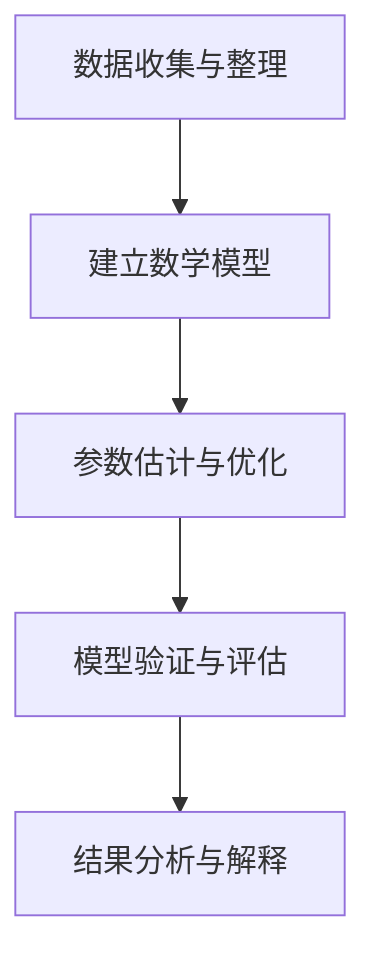
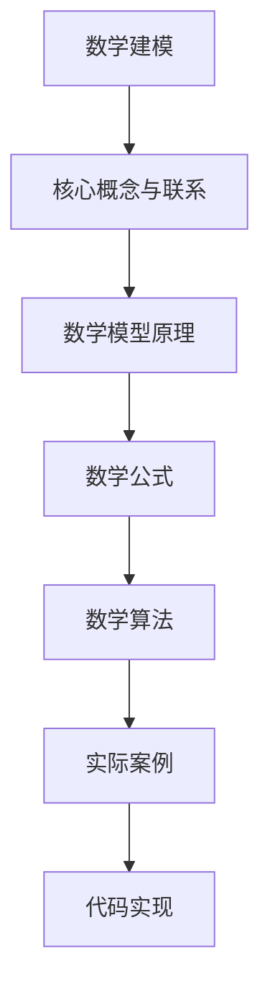

                 

# 数学与计算生物学：生物系统的数学建模

## 关键词

计算生物学，数学建模，生物系统，基因组学，生物网络，生物过程，基因编辑，蛋白质工程，生物信息学，疾病预测。

## 摘要

本文探讨了数学与计算生物学在生物系统研究中的应用，介绍了生物系统的基本概念以及数学建模的方法和技巧。文章分为三个主要部分：第一部分介绍了计算生物学的基础知识和数学方法在计算生物学中的应用；第二部分深入探讨了生物系统的具体数学建模方法；第三部分则展示了数学与计算生物学在生物医学领域的实际应用。通过本文的阅读，读者将能够理解生物系统的数学建模过程，掌握相关数学工具和算法，并对生物医学领域的前沿技术有所了解。

## 目录大纲

## 第一部分：数学与计算生物学基础

### 第1章：计算生物学简介

#### 1.1 计算生物学的发展历程
#### 1.2 计算生物学的主要研究领域
#### 1.3 计算生物学在生物科学中的重要性

### 第2章：数学方法在计算生物学中的应用

#### 2.1 数学模型的基本概念
#### 2.2 代数方法
#### 2.3 微积分方法
#### 2.4 概率论与统计方法

### 第3章：生物系统的数学建模

#### 3.1 生物系统的基本概念
#### 3.2 分子水平的数学建模
#### 3.3 细胞水平的数学建模
#### 3.4 组织和器官水平的数学建模

## 第二部分：生物系统的具体数学建模

### 第4章：遗传信息的数学建模

#### 4.1 遗传学基础
#### 4.2 遗传密码的数学表示
#### 4.3 遗传变异的数学描述
#### 4.4 遗传进化的数学模型

### 第5章：生物网络的数学建模

#### 5.1 生物网络的概述
#### 5.2 网络建模的基本概念
#### 5.3 网络分析的数学方法
#### 5.4 网络动态行为的研究

### 第6章：生物过程的数学建模

#### 6.1 生物过程的概述
#### 6.2 生物过程的数学模型
#### 6.3 生物过程的时间序列分析
#### 6.4 生物过程的时空建模

### 第7章：计算生物学软件工具及应用

#### 7.1 计算生物学软件概述
#### 7.2 常用计算生物学软件介绍
#### 7.3 计算生物学软件的应用案例分析
#### 7.4 计算生物学软件的未来发展趋势

## 第三部分：数学与计算生物学在生物医学领域的应用

### 第8章：基因组学和遗传病的数学建模

#### 8.1 基因组学基础
#### 8.2 遗传病的数学模型
#### 8.3 遗传病的诊断与预测
#### 8.4 基因编辑技术的数学建模

### 第9章：蛋白质组学和蛋白质工程的数学建模

#### 9.1 蛋白质组学基础
#### 9.2 蛋白质工程的数学方法
#### 9.3 蛋白质结构的预测与分析
#### 9.4 蛋白质功能的预测与调控

### 第10章：生物信息学在疾病研究中的应用

#### 10.1 生物信息学的基本概念
#### 10.2 生物信息学在疾病研究中的应用
#### 10.3 生物信息学工具与数据库
#### 10.4 生物信息学的未来发展趋势

## 附录

### 附录A：数学与计算生物学常用符号表

### 附录B：数学与计算生物学常用公式

### 附录C：生物系统数学建模常用流程图

### 附录D：生物系统数学建模常用算法伪代码

### 附录E：生物系统数学建模应用案例代码解读

### 附录F：推荐阅读资料和参考文献

## 目录结构

本文的目录结构旨在为读者提供一个清晰的导航框架，使读者能够迅速定位到感兴趣的章节，同时也能够对整篇文章的内容有一个全面的了解。文章分为三大部分：基础部分、具体建模方法和应用部分，以及生物医学领域的应用。

在第一部分，我们首先介绍了计算生物学的基础知识，包括其发展历程、研究领域和重要性，以及数学方法在计算生物学中的应用，如代数、微积分、概率论与统计方法。这一部分为后续的生物系统数学建模打下了坚实的基础。

第二部分深入探讨了生物系统的具体数学建模方法。我们首先介绍了生物系统的基本概念，然后从分子、细胞、组织到器官水平，逐步讲解了生物系统各个层次上的数学建模方法。这一部分通过具体的实例和公式，展示了数学建模在生物系统研究中的实际应用。

第三部分则聚焦于数学与计算生物学在生物医学领域的应用。我们分别介绍了基因组学和遗传病、蛋白质组学和蛋白质工程、以及生物信息学在疾病研究中的应用。通过这些实际案例，读者能够更好地理解数学与计算生物学在生物医学领域的重要作用。

总体来说，本文结构紧凑、逻辑清晰，旨在为读者提供一部全面、系统的生物系统数学建模指南。

### 第一部分：数学与计算生物学基础

#### 第1章：计算生物学简介

计算生物学是一门结合了生物学、计算机科学和数学的交叉学科，旨在通过计算方法来研究生物学问题。随着计算机技术的发展，计算生物学在生物科学中扮演着越来越重要的角色。这一章将介绍计算生物学的发展历程、主要研究领域以及其在生物科学中的重要性。

#### 1.1 计算生物学的发展历程

计算生物学的发展可以追溯到20世纪50年代，当时计算机科学刚刚起步。在那时，科学家们开始意识到计算机在处理复杂生物学问题中的潜力。最早的计算生物学研究主要集中在分子水平的计算，例如分子结构预测和分子动力学模拟。

随着计算机性能的不断提高，计算生物学的研究范围逐渐扩展到更复杂的生物系统。在20世纪80年代，随着基因组计划的启动，计算生物学进入了基因组学和生物信息学的研究阶段。这个阶段的研究重点包括基因序列分析、基因组注释和基因组比较等。

进入21世纪，计算生物学继续扩展其研究领域，开始涉及更复杂的生物系统，如细胞网络、生物网络和生态系统。随着大数据和人工智能技术的发展，计算生物学的研究方法和工具也得到了极大的丰富。

#### 1.2 计算生物学的主要研究领域

计算生物学涵盖了多个研究领域，主要包括以下几方面：

1. **基因组学**：基因组学是研究生物体全部基因的结构、功能和相互作用的科学。计算基因组学主要通过计算方法来解析和分析基因组数据，包括基因序列分析、基因表达分析、基因组比较和基因组注释等。

2. **蛋白质组学**：蛋白质组学是研究生物体所有蛋白质的结构、功能和相互作用的一门科学。计算蛋白质组学主要通过计算方法来分析蛋白质组数据，包括蛋白质序列分析、蛋白质结构预测、蛋白质相互作用网络分析等。

3. **系统生物学**：系统生物学是一种以整体性视角研究生物系统的科学。计算系统生物学通过计算方法来模拟和分析生物系统中的各种生物过程，包括细胞代谢、信号传导和细胞周期等。

4. **生态学**：生态学是研究生物体与其环境相互作用的科学。计算生态学通过计算方法来模拟和分析生态系统的结构和功能，包括种群动态、物种相互作用和生态系统稳定性等。

#### 1.3 计算生物学在生物科学中的重要性

计算生物学在生物科学中具有重要性，主要体现在以下几个方面：

1. **数据处理和存储**：生物科学中产生的数据量巨大，计算生物学提供了高效的数据处理和存储方法，使科学家能够更好地管理和分析这些数据。

2. **模型构建和预测**：计算生物学通过构建生物系统的数学模型，可以帮助科学家预测生物过程的行为和结果，从而指导实验设计和生物科学问题的解决。

3. **新发现和新知识**：计算生物学可以揭示生物系统中的复杂关系和机制，为科学家提供新的发现和知识，推动生物科学的发展。

4. **应用和产业化**：计算生物学在基因组学、蛋白质组学、系统生物学等领域具有广泛的应用，促进了生物技术的进步和产业化。

总之，计算生物学作为一门交叉学科，正日益成为生物科学研究和应用的重要工具。通过计算方法，我们可以更深入地理解生物系统的运作机制，推动生物科学的发展和进步。

### 第2章：数学方法在计算生物学中的应用

计算生物学是一个高度依赖数学工具的领域，数学方法在其中起到了至关重要的作用。数学模型不仅可以帮助我们理解生物系统的复杂行为，还可以指导实验设计，预测未来的生物学现象。本章将详细探讨数学方法在计算生物学中的应用，包括数学模型的基本概念、代数方法、微积分方法、概率论与统计方法等。

#### 2.1 数学模型的基本概念

数学模型是计算生物学研究的核心工具，它通过将生物学问题转化为数学问题，使得复杂的生物学现象能够被形式化和量化。数学模型的基本概念包括以下几方面：

1. **变量**：在数学模型中，变量是用来表示生物学问题的各个方面，可以是数量、比例或状态。

2. **函数**：函数用于描述变量之间的关系。在计算生物学中，常见的函数包括线性函数、指数函数、对数函数等。

3. **方程**：方程是数学模型的核心，用于描述变量之间的数学关系。常见的方程有代数方程、微分方程和概率方程等。

4. **参数**：参数是数学模型中的常数，用于描述系统特性的具体数值。

5. **解**：解是数学模型中变量取值的集合，用于描述系统的状态和行为。

6. **边界条件**：边界条件是指数学模型中变量在特定边界上的取值，用于确定模型的初始状态和边界条件。

#### 2.2 代数方法

代数方法是一种用于解决代数方程的数学方法，它在计算生物学中的应用非常广泛。代数方法主要包括以下几种：

1. **线性代数**：线性代数用于处理线性方程组和矩阵运算，这在计算生物学中用于描述生物系统的线性关系，如基因表达网络和代谢网络。

   **线性方程组**：  
   $$  
   \begin{align*}  
   a_{11}x + a_{12}y &= b_{1} \\  
   a_{21}x + a_{22}y &= b_{2}  
   \end{align*}  
   $$

2. **矩阵运算**：矩阵运算用于处理大规模的数据和复杂的关系。在计算生物学中，矩阵可以用来表示基因表达矩阵、蛋白质相互作用矩阵等。

   **矩阵求逆**：  
   $$  
   A^{-1} = \frac{1}{\det(A)} \text{adj}(A)  
   $$

3. **线性规划**：线性规划是一种用于优化线性目标函数的数学方法，常用于计算生物学的实验设计和参数优化。

   **线性规划问题**：  
   $$  
   \min_{x} c^T x \text{ subject to } Ax \leq b, x \geq 0  
   $$

#### 2.3 微积分方法

微积分方法是一种用于处理变量变化率和极限的数学方法，它在计算生物学中有着广泛的应用。微积分方法主要包括以下几种：

1. **微分方程**：微分方程用于描述变量之间的变化率关系，是计算生物学中最常用的数学模型之一。常见的微分方程有常微分方程和偏微分方程。

   **常微分方程**：  
   $$  
   \frac{dx}{dt} = f(x, t)  
   $$

2. **积分**：积分用于计算函数在某个区间上的累积量，常用于计算生物学中的数据分析和模型验证。

   **定积分**：  
   $$  
   \int_{a}^{b} f(x) \, dx  
   $$

3. **差分方程**：差分方程是离散时间下的微分方程，用于描述离散时间系统中的变化率。

   **一阶差分方程**：  
   $$  
   x_{n+1} = f(x_n)  
   $$

#### 2.4 概率论与统计方法

概率论与统计方法是计算生物学中处理不确定性和随机性的重要工具，主要用于数据分析和模型验证。概率论与统计方法主要包括以下几种：

1. **概率分布**：概率分布用于描述随机变量取值的概率，常见的有正态分布、二项分布、泊松分布等。

   **正态分布**：  
   $$  
   f(x) = \frac{1}{\sqrt{2\pi\sigma^2}} e^{-\frac{(x-\mu)^2}{2\sigma^2}}  
   $$

2. **统计检验**：统计检验用于评估实验结果是否具有统计学显著性，常见的有t检验、方差分析等。

   **t检验**：  
   $$  
   t = \frac{\bar{x} - \mu_0}{s/\sqrt{n}}  
   $$

3. **回归分析**：回归分析用于研究变量之间的线性关系，包括线性回归和多项式回归。

   **线性回归**：  
   $$  
   y = \beta_0 + \beta_1 x + \epsilon  
   $$

4. **主成分分析**：主成分分析用于降维和特征提取，可以将高维数据投影到低维空间，提取主要特征。

   **主成分分析**：  
   $$  
   Z = P^T X  
   $$

总之，数学方法在计算生物学中的应用是不可或缺的。通过代数方法、微积分方法、概率论与统计方法等，我们可以更好地理解生物系统的复杂行为，为生物学研究提供强有力的理论支持。在接下来的章节中，我们将进一步探讨生物系统的具体数学建模方法。

### 第3章：生物系统的数学建模

生物系统的数学建模是计算生物学研究的关键环节，它通过将生物现象转化为数学模型，帮助我们更好地理解生物系统的运行机制。本章将介绍生物系统的基本概念，并从分子、细胞、组织和器官水平分别探讨生物系统的数学建模方法。

#### 3.1 生物系统的基本概念

生物系统是指由生物分子、细胞和组织等组成的复杂系统，它具有自我组织、自我调节和自我修复的能力。生物系统的基本概念包括以下几个层次：

1. **分子层次**：分子层次是生物系统的最基本层次，包括蛋白质、核酸、多糖等生物大分子。这些分子通过特定的化学键和相互作用形成复合物和分子网络。

2. **细胞层次**：细胞层次是生物系统的基本单元，它是生物体结构和功能的基础。细胞内部存在复杂的生物化学反应网络，这些反应通过信号传导、代谢途径和分子机器等进行调控。

3. **组织层次**：组织层次是由多个细胞组成的具有特定功能的结构，如肌肉组织、神经组织和血管组织等。这些组织通过细胞间的相互作用和信号传递协同工作，实现特定的生物学功能。

4. **器官层次**：器官层次是由多个组织组成的具有特定功能的结构，如心脏、肝脏和肾脏等。器官内部存在复杂的生物过程，这些过程通过组织间的相互作用和系统调节实现整体功能的优化。

5. **生态系统层次**：生态系统层次是生物系统在自然界中的扩展，它包括多个生物群体和它们的生存环境。生态系统通过物种间的相互作用和能量流动维持其稳定性和多样性。

#### 3.2 分子水平的数学建模

分子水平的数学建模主要关注生物大分子如蛋白质、核酸等的结构和功能。常见的数学建模方法包括：

1. **统计力学方法**：统计力学方法通过统计物理学的基本原理来研究生物分子的结构和动力学行为。例如，通过分子动力学模拟来研究蛋白质折叠过程。

2. **图论方法**：图论方法通过构建生物分子网络的图模型来研究分子间的相互作用和传递关系。例如，使用邻接矩阵来表示蛋白质相互作用网络。

3. **随机过程模型**：随机过程模型用于描述生物分子在时间上的动态变化。例如，使用马尔可夫模型来描述蛋白质的随机游走行为。

**实例**：假设我们使用图论方法来建模蛋白质相互作用网络。我们可以用图表示蛋白质，用边表示蛋白质之间的相互作用。图的邻接矩阵可以表示这种相互作用关系：

$$
A = \begin{bmatrix}
0 & 1 & 0 & \cdots & 0 \\
1 & 0 & 1 & \cdots & 1 \\
0 & 1 & 0 & \cdots & 0 \\
\vdots & \vdots & \vdots & \ddots & \vdots \\
0 & 0 & 0 & \cdots & 0
\end{bmatrix}
$$

其中，矩阵元素\(A_{ij}\)表示蛋白质i和蛋白质j之间的相互作用强度。

#### 3.3 细胞水平的数学建模

细胞水平的数学建模关注细胞内部的生物化学反应网络和信号传导途径。常见的数学建模方法包括：

1. **反应扩散模型**：反应扩散模型用于描述细胞内物质的生成、消耗和扩散过程。例如，通过常微分方程来描述酶促反应。

2. **随机过程模型**：随机过程模型用于描述细胞内反应的随机性和不确定性。例如，使用马尔可夫模型来描述细胞周期的随机事件。

3. **动态系统模型**：动态系统模型通过描述细胞内信号传导途径的动力学行为来研究细胞的调控机制。例如，使用微分方程组来描述细胞信号转导途径。

**实例**：假设我们使用反应扩散模型来描述细胞内的酶促反应。我们可以用以下微分方程来描述：

$$
\frac{dx}{dt} = k_1x - k_2x
$$

其中，\(x\)表示酶的浓度，\(k_1\)和\(k_2\)分别表示酶的生成速率和消耗速率。

#### 3.4 组织和器官水平的数学建模

组织和器官水平的数学建模关注生物系统的整体行为和功能。常见的数学建模方法包括：

1. **系统生物学模型**：系统生物学模型通过描述生物系统的整体动力学行为来研究生物系统的功能和调控机制。例如，使用微分方程组来描述细胞代谢网络。

2. **网络模型**：网络模型通过描述生物系统中的相互作用关系来研究系统的拓扑结构和功能。例如，使用图论方法来分析生物网络的拓扑特性。

3. **模拟退火算法**：模拟退火算法是一种全局优化算法，用于寻找复杂生物系统中的最优参数配置。

**实例**：假设我们使用系统生物学模型来描述细胞代谢网络。我们可以用以下微分方程组来描述：

$$
\frac{dx_i}{dt} = \sum_{j=1}^{n} \left( k_{ij}x_j - k_{ji}x_i \right)
$$

其中，\(x_i\)表示代谢物i的浓度，\(k_{ij}\)和\(k_{ji}\)分别表示代谢物i生成代谢物j的速率和代谢物j生成代谢物i的速率。

#### 总结

生物系统的数学建模是一个多层次、多维度的过程，从分子到器官水平，数学模型帮助我们更好地理解生物系统的运行机制。通过本章的介绍，我们了解了生物系统的基本概念和不同层次上的数学建模方法。在接下来的章节中，我们将继续探讨生物系统的具体数学建模方法，进一步揭示生物系统的复杂性和规律性。

### 第4章：遗传信息的数学建模

遗传信息是生物系统的核心组成部分，它决定了生物个体的形态、功能和行为。遗传信息的数学建模旨在通过数学方法揭示遗传信息的存储、传递和变异机制。本章将介绍遗传信息数学建模的基本概念、遗传密码的数学表示、遗传变异的数学描述以及遗传进化的数学模型。

#### 4.1 遗传学基础

遗传学是研究遗传现象和遗传规律的科学，它包括基因的传递、表达和变异等方面。遗传学的基础概念包括：

1. **基因**：基因是生物体遗传信息的基本单位，它携带着生物体的遗传特征。

2. **染色体**：染色体是细胞核中的结构，它包含着基因。

3. **DNA**：DNA（脱氧核糖核酸）是遗传信息的载体，它由四种不同的核苷酸（腺嘌呤、鸟嘌呤、胞嘧啶和胸腺嘧啶）组成。

4. **基因表达**：基因表达是指基因在细胞中被转录成RNA，进而翻译成蛋白质的过程。

5. **遗传密码**：遗传密码是指DNA序列如何编码蛋白质氨基酸序列的规则。

6. **遗传变异**：遗传变异是指基因或染色体在遗传过程中发生的变异，它是生物进化的基础。

#### 4.2 遗传密码的数学表示

遗传密码的数学表示是遗传信息数学建模的基础。遗传密码通过DNA序列的三联密码子（codon）来编码氨基酸。每个密码子由三个核苷酸组成，对应一个特定的氨基酸。数学上，我们可以用三元组来表示遗传密码，例如：

$$
\text{密码子} = (\text{A}, \text{C}, \text{G})
$$

其中，\(\text{A}\)、\(\text{C}\)、\(\text{G}\)分别代表腺嘌呤、胞嘧啶和鸟嘌呤。遗传密码的数学模型可以通过构建一个从密码子到氨基酸的映射表来实现，例如：

$$
\begin{array}{c|c}
\text{密码子} & \text{氨基酸} \\
\hline
(\text{A}, \text{C}, \text{G}) & \text{丙氨酸 (Ala)} \\
(\text{G}, \text{A}, \text{C}) & \text{亮氨酸 (Leu)} \\
\vdots & \vdots \\
\end{array}
$$

#### 4.3 遗传变异的数学描述

遗传变异是生物进化的重要驱动力，它包括基因突变、基因重组和染色体变异等。遗传变异的数学描述通常涉及概率论和统计方法。

1. **基因突变**：基因突变是指DNA序列发生替换、插入或删除等变化。基因突变的概率可以用突变率（mutation rate）来描述。假设基因A突变成基因B的概率为\(p\)，则：

   $$ 
   P(\text{突变}) = p 
   $$ 

2. **基因重组**：基因重组是指在减数分裂过程中，同源染色体的非姐妹染色单体之间发生交换。基因重组的概率与交换率和重组片段的长度有关。

   $$ 
   P(\text{重组}) = r \cdot l 
   $$ 

   其中，\(r\)为交换率，\(l\)为重组片段的长度。

3. **染色体变异**：染色体变异包括染色体的缺失、重复、倒位和易位等。染色体变异的概率通常依赖于变异的类型和生物体的基因组结构。

   $$ 
   P(\text{染色体变异}) = \sum_{i=1}^{n} p_i 
   $$ 

   其中，\(p_i\)为第i种染色体变异的概率。

#### 4.4 遗传进化的数学模型

遗传进化的数学模型用于描述种群基因频率随时间的变化。常见的遗传进化模型包括：

1. **硬毛顿-韩默尔顿模型（Hardy-Weinberg equilibrium）**：硬毛顿-韩默尔顿模型描述了在无外界干扰下，种群基因频率和基因型频率保持不变的状态。

   $$ 
   p^2 + 2pq + q^2 = 1 
   $$ 

   其中，\(p\)和\(q\)分别为两种等位基因的频率，\(p^2\)、\(2pq\)和\(q^2\)分别为相应的基因型频率。

2. **遗传漂变模型**：遗传漂变模型描述了小种群中基因频率的随机波动。遗传漂变的概率与种群大小和突变率有关。

   $$ 
   \frac{1}{2N} \ln(\frac{1 - r}{r}) 
   $$ 

   其中，\(N\)为种群大小，\(r\)为突变率。

3. **自然选择模型**：自然选择模型描述了适应度不同的个体在种群中的生存和繁殖优势。适应度高的个体更可能传递其基因给下一代。

   $$ 
   \frac{w_1}{w_2} = \frac{p_1}{p_2} 
   $$ 

   其中，\(w_1\)和\(w_2\)分别为两种等位基因的适应度，\(p_1\)和\(p_2\)分别为相应的基因频率。

通过遗传密码的数学表示、遗传变异的数学描述和遗传进化的数学模型，我们可以更深入地理解遗传信息的存储、传递和变异机制。这些数学模型不仅有助于揭示遗传信息的复杂性，还为生物医学研究和生物技术发展提供了重要的理论支持。在接下来的章节中，我们将继续探讨生物网络的数学建模方法。

### 第5章：生物网络的数学建模

生物网络是指生物系统中各生物分子或细胞之间的相互作用关系，它涵盖了从分子到细胞水平的多层次信息。生物网络的数学建模旨在通过数学方法揭示生物网络的拓扑结构、动态行为和功能调控机制。本章将介绍生物网络的概述、网络建模的基本概念、网络分析的数学方法以及网络动态行为的研究。

#### 5.1 生物网络的概述

生物网络是指生物系统中各生物分子或细胞之间的相互作用关系，这些相互作用可以是物理的、化学的或生物学的。生物网络包括多个层次，从分子层次到细胞层次、组织层次和器官层次，每个层次都具有独特的拓扑结构和功能。

1. **分子网络**：分子网络主要包括蛋白质、核酸、多糖等生物大分子之间的相互作用关系。例如，蛋白质相互作用网络（Protein-Protein Interaction Network, PPI）描述了蛋白质之间的相互作用。

2. **细胞网络**：细胞网络描述了细胞内各种生物分子如蛋白质、RNA和代谢物之间的相互作用关系。细胞网络帮助科学家理解细胞内部的各种生物过程和信号传导途径。

3. **代谢网络**：代谢网络描述了生物体内部代谢途径中各种代谢物之间的相互作用关系。代谢网络对于理解生物体的能量代谢和物质循环具有重要意义。

4. **信号传导网络**：信号传导网络描述了细胞内外的信号分子如何通过一系列的信号传递途径调节细胞行为。信号传导网络对于理解细胞响应外界刺激的机制至关重要。

5. **生态系统网络**：生态系统网络描述了生物种群之间的相互作用关系，包括捕食关系、共生关系和竞争关系。生态系统网络对于理解生物多样性和生态平衡具有重要意义。

#### 5.2 网络建模的基本概念

网络建模是生物网络研究的基础，它通过建立数学模型来描述生物网络的拓扑结构和动态行为。网络建模的基本概念包括节点、边、网络拓扑和度等。

1. **节点（Node）**：节点是网络中的基本元素，通常表示生物分子、细胞或其他生物实体。例如，在蛋白质相互作用网络中，每个蛋白质都是一个节点。

2. **边（Edge）**：边表示节点之间的相互作用关系，通常表示生物分子或细胞之间的物理或化学相互作用。边的权重可以表示相互作用强度。

3. **网络拓扑（Topology）**：网络拓扑描述了网络的连接方式，包括网络的连通性、环路和节点度等。网络拓扑对于理解网络的稳定性和功能至关重要。

4. **度（Degree）**：度表示节点在网络中的连接数量，分为入度（in-degree）和出度（out-degree）。入度和出度分别表示节点接收和发送的相互作用数量。

5. **聚类系数（Clustering Coefficient）**：聚类系数描述了节点在网络的聚集程度，它表示一个节点通过边连接的其他节点中，有多少节点也相互连接。

6. **路径长度（Path Length）**：路径长度表示两个节点之间的最短路径长度，它用于描述网络的连通性和信息传递效率。

#### 5.3 网络分析的数学方法

网络分析是生物网络研究的重要方法，它通过数学方法来揭示生物网络的特性。常见的网络分析方法包括：

1. **网络拓扑分析**：网络拓扑分析用于研究网络的拓扑特性，如度分布、聚类系数和路径长度等。度分布描述了节点度数的分布情况，聚类系数描述了网络的聚集程度，路径长度描述了网络的连通性。

2. **网络模块化分析**：网络模块化分析用于将网络划分为具有相似拓扑结构的模块，这些模块通常表示生物网络的子功能区域。模块化分析可以帮助科学家理解生物网络的功能分区。

3. **网络中心性分析**：网络中心性分析用于研究节点在网络中的重要性，常见的中心性度量包括度中心性、接近中心性和中间中心性。度中心性表示节点的连接数量，接近中心性表示节点到其他节点的最短路径数量，中间中心性表示节点在路径中的桥梁作用。

4. **网络动态行为分析**：网络动态行为分析用于研究网络在时间上的动态变化，如网络的稳定性、振荡行为和波动传播等。动态行为分析可以帮助科学家理解生物网络的动态调控机制。

5. **网络功能分析**：网络功能分析用于研究生物网络的生物学意义，如蛋白质相互作用网络的生物学功能和信号传导网络的调控机制。功能分析通常结合生物实验数据进行验证。

#### 5.4 网络动态行为的研究

网络动态行为的研究是揭示生物网络功能的关键。常见的网络动态行为研究方法包括：

1. **网络动力学模型**：网络动力学模型通过描述网络中节点和边的动态变化来研究网络的行为。常见的模型包括基于微分方程的模型和基于随机过程的模型。

2. **信号传递模型**：信号传递模型用于描述信号分子在生物网络中的传递和调控过程。例如，基于反应扩散方程的信号传递模型可以描述信号分子在细胞内的扩散和反应过程。

3. **模拟退火算法**：模拟退火算法是一种全局优化算法，用于寻找网络中稳定的状态。通过模拟退火算法，可以分析生物网络在不同条件下的动态行为。

4. **机器学习方法**：机器学习方法用于分析生物网络的数据，如网络拓扑特征和基因表达数据。通过机器学习方法，可以揭示生物网络的潜在功能和调控机制。

通过生物网络的数学建模和网络动态行为的研究，科学家可以更好地理解生物系统的复杂性和功能。这些方法不仅为生物科学研究提供了强有力的工具，还为生物医学研究和生物技术开发提供了重要的理论支持。

### 第6章：生物过程的数学建模

生物过程是生物系统中一系列有序发生的生物化学反应，这些反应共同构成了生物体的生命活动。生物过程的数学建模旨在通过数学方法描述和预测这些生物化学反应的动态行为。本章将介绍生物过程的概述、生物过程的数学模型、生物过程的时间序列分析以及生物过程的时空建模。

#### 6.1 生物过程的概述

生物过程是生物体中一系列相互关联的化学和物理反应，这些反应在时空上有序进行，共同维持生物体的生命活动。生物过程包括多种类型，如代谢过程、信号传导过程、蛋白质合成过程等。每个生物过程都有其独特的反应路径、速率和调控机制。

1. **代谢过程**：代谢过程是指生物体内部发生的物质转化过程，包括能量的产生和消耗。代谢过程涉及多种酶催化的反应，这些反应在细胞内形成一个复杂的代谢网络。

2. **信号传导过程**：信号传导过程是指细胞内外信号分子如何传递和调节细胞行为的过程。信号传导过程通常涉及一系列的信号传递途径，包括细胞表面的受体、细胞内的信号转导分子和效应器。

3. **蛋白质合成过程**：蛋白质合成过程是指生物体如何通过转录和翻译生成蛋白质的过程。蛋白质合成过程涉及DNA、RNA和蛋白质的相互作用，是生物体形态和功能的基础。

#### 6.2 生物过程的数学模型

生物过程的数学建模是通过建立数学模型来描述生物过程中的反应动态。常见的数学模型包括反应扩散模型、微分方程模型和随机过程模型。

1. **反应扩散模型**：反应扩散模型用于描述生物过程中物质的生成、消耗和扩散过程。该模型通过偏微分方程来描述物质的浓度分布和随时间的变化。例如，以下是一维反应扩散方程：

   $$
   \frac{\partial c(x,t)}{\partial t} = D \frac{\partial^2 c(x,t)}{\partial x^2} + \frac{\partial u(c(x,t))}{\partial x}
   $$

   其中，\(c(x,t)\)表示物质浓度，\(D\)为扩散系数，\(u(c(x,t))\)为反应项。

2. **微分方程模型**：微分方程模型用于描述生物过程中反应物和生成物的浓度变化率。该模型通过常微分方程来描述反应物和生成物之间的动态平衡。例如，以下是一阶反应动力学方程：

   $$
   \frac{dx}{dt} = -k_1x + k_2y
   $$

   其中，\(x\)和\(y\)分别表示反应物和生成物的浓度，\(k_1\)和\(k_2\)分别为反应速率常数。

3. **随机过程模型**：随机过程模型用于描述生物过程中随机性和不确定性。该模型通过随机微分方程来描述生物过程的时间演变。例如，以下是一维布朗运动方程：

   $$
   \frac{dX_t}{dt} = \mu + \sigma dW_t
   $$

   其中，\(X_t\)表示过程变量，\(\mu\)和\(\sigma\)分别为过程均值和标准差，\(dW_t\)为维纳过程。

#### 6.3 生物过程的时间序列分析

生物过程的时间序列分析是通过分析生物过程中浓度或反应速率的时间序列数据，来揭示生物过程的动态行为和调控机制。常见的时间序列分析方法包括自相关分析、频谱分析和回归分析。

1. **自相关分析**：自相关分析用于分析时间序列数据的自相关性，即数据点之间的相关性。自相关分析可以帮助我们理解生物过程的周期性和趋势性。

2. **频谱分析**：频谱分析用于分析时间序列数据的频率成分，即数据的波动和周期性。频谱分析可以帮助我们识别生物过程的潜在周期性和调节机制。

3. **回归分析**：回归分析用于分析时间序列数据之间的线性关系，即自变量和因变量之间的关系。回归分析可以帮助我们预测生物过程的未来趋势。

#### 6.4 生物过程的时空建模

生物过程的时空建模是通过建立数学模型来描述生物过程在时间和空间上的变化。常见的时空建模方法包括偏微分方程模型、差分方程模型和随机场模型。

1. **偏微分方程模型**：偏微分方程模型用于描述生物过程中物质浓度或反应速率在空间和时间上的分布。例如，以下是一维热传导方程：

   $$
   \frac{\partial u(x,t)}{\partial t} = \alpha \frac{\partial^2 u(x,t)}{\partial x^2}
   $$

   其中，\(u(x,t)\)表示温度分布，\(\alpha\)为热扩散系数。

2. **差分方程模型**：差分方程模型用于描述生物过程中物质浓度或反应速率在离散时间步上的变化。例如，以下是一维差分方程：

   $$
   \frac{u_{i+1}^{n+1} - u_{i}^{n}}{\Delta t} = \alpha \frac{u_{i+1}^{n} - 2u_{i}^{n} + u_{i-1}^{n}}{\Delta x^2}
   $$

   其中，\(u_i^n\)表示第i个时间步的浓度分布，\(\Delta t\)和\(\Delta x\)分别为时间步长和空间步长。

3. **随机场模型**：随机场模型用于描述生物过程中随机性和不确定性。例如，以下是一维随机场模型：

   $$
   \frac{dX_t}{dt} = \mu + \sigma dW_t
   $$

   其中，\(X_t\)表示过程变量，\(\mu\)和\(\sigma\)分别为过程均值和标准差，\(dW_t\)为维纳过程。

通过生物过程的数学建模、时间序列分析和时空建模，科学家可以更深入地理解生物系统的动态行为和调控机制。这些方法不仅为生物科学研究提供了强有力的工具，还为生物医学研究和生物技术开发提供了重要的理论支持。

### 第7章：计算生物学软件工具及应用

计算生物学的发展离不开各种软件工具的支持，这些工具为科学家提供了强大的数据分析、建模和模拟能力。本章将介绍计算生物学软件概述、常用计算生物学软件介绍、计算生物学软件的应用案例分析以及计算生物学软件的未来发展趋势。

#### 7.1 计算生物学软件概述

计算生物学软件是指用于处理和分析生物数据、建立生物模型以及进行生物模拟的软件工具。这些软件涵盖了从数据预处理、数据分析到模型建立和模拟的整个过程。计算生物学软件的主要功能包括：

1. **数据处理**：包括数据导入、数据清洗、数据转换和数据格式化等。常用的数据处理软件有BioPython、BioPerl、BioJava等。

2. **数据分析**：包括序列比对、基因注释、基因组比较、蛋白质结构预测等。常用的数据分析软件有BLAST、ClustalW、Geneious等。

3. **建模和模拟**：包括建立生物系统模型、进行模型模拟和参数优化等。常用的建模和模拟软件有CellBlender、Matlab、Simbiology等。

4. **可视化**：包括生物数据的可视化、生物模型的图形化表示等。常用的可视化软件有Cytoscape、Gephi、PyMOL等。

#### 7.2 常用计算生物学软件介绍

以下是一些常用的计算生物学软件及其主要功能：

1. **BioPython**：BioPython是一个开源的生物信息学工具包，它提供了丰富的生物数据处理和分析功能，包括序列分析、注释、比对等。

2. **BioPerl**：BioPerl是一个基于Perl的生物信息学工具包，它提供了类似BioPython的功能，适用于perl编程用户。

3. **BioJava**：BioJava是一个开源的生物信息学工具包，它适用于Java编程用户，提供了丰富的生物数据处理和分析功能。

4. **BLAST**：BLAST（Basic Local Alignment Search Tool）是一种用于序列比对和搜索的工具，广泛应用于基因组学和蛋白质组学研究中。

5. **ClustalW**：ClustalW是一种用于多序列比对和同源性分析的工具，广泛用于基因组序列分析和蛋白质序列分析。

6. **CellBlender**：CellBlender是一个基于Python的细胞模拟软件，用于模拟细胞内的生物过程和信号传导。

7. **Matlab**：Matlab是一个强大的数学计算和可视化工具，广泛应用于生物过程的建模和模拟。

8. **Simbiology**：Simbiology是一个基于Matlab的生物学模拟工具，用于建立和模拟复杂的生物系统模型。

9. **Cytoscape**：Cytoscape是一个用于生物网络分析和可视化的工具，广泛应用于蛋白质相互作用网络、代谢网络和信号传导网络的研究。

10. **Gephi**：Gephi是一个开源的网络可视化和分析工具，用于探索和分析复杂网络。

11. **PyMOL**：PyMOL是一个用于分子建模和可视化的工具，广泛应用于蛋白质结构预测和分子动力学模拟。

#### 7.3 计算生物学软件的应用案例分析

以下是一个计算生物学软件应用案例的分析：

**案例：基因组组装软件—HiC**

HiC（High-throughput Chromosome Conformation Capture）是一种用于高通量染色体结构捕获的技术，它通过测定染色体上不同区域之间的物理距离来揭示染色体的三维结构。HiC技术依赖于一系列计算生物学软件进行数据处理和模型建立。

1. **数据处理**：HiC实验产生的大量读序列需要通过Fastq-Files软件进行预处理，包括去噪、剪切和过滤低质量读段等。

2. **映射和整理**：处理后的读序列需要通过Bowtie或BWA等工具映射到参考基因组上，然后使用Picard软件整理和统计映射结果。

3. **构建互作矩阵**：通过HiC软件（如DeepHiC或KHiC）处理映射结果，构建不同区域之间的互作矩阵。

4. **三维结构建模**：使用REMODEL软件基于互作矩阵构建染色体的三维结构模型。

5. **可视化**：使用Cytoscape软件将三维结构模型进行可视化，分析染色体的拓扑结构和功能区域。

通过这个案例，我们可以看到计算生物学软件在整个基因组组装过程中起到了关键作用，从数据预处理、映射和整理，到互作矩阵构建和三维结构建模，每一步都需要专业的软件工具的支持。

#### 7.4 计算生物学软件的未来发展趋势

随着生物数据量的急剧增长和计算能力的不断提高，计算生物学软件正朝着以下几个方向发展：

1. **自动化和智能化**：未来计算生物学软件将更加自动化和智能化，通过机器学习和人工智能技术，提高数据处理和分析的效率和准确性。

2. **多尺度建模**：未来计算生物学软件将支持从分子水平到器官水平的多尺度建模，提供更全面的生物系统视图。

3. **开源和共享**：开源和共享将成为计算生物学软件发展的主要趋势，越来越多的软件工具将采用开源许可，促进科学界的交流和合作。

4. **云服务和大数据处理**：随着云计算和大数据技术的兴起，计算生物学软件将更好地利用云计算平台和大数据处理技术，提供高性能的数据分析和建模服务。

5. **跨学科整合**：计算生物学软件将继续与其他学科如物理学、化学和工程学等融合，推动多学科交叉研究的深入发展。

通过以上分析，我们可以看到计算生物学软件在生物科学研究中的重要性以及其未来发展的趋势。这些软件工具不仅为科学家提供了强大的数据分析、建模和模拟能力，还推动了生物科学领域的不断创新和进步。

### 第8章：基因组学和遗传病的数学建模

基因组学是研究生物体全部基因的结构、功能及其相互作用的科学。在基因组学中，数学建模方法被广泛应用于基因序列分析、基因表达分析、基因组比较和基因组注释等方面。本章将介绍基因组学的基础知识，探讨遗传病的数学建模方法，并讨论遗传病的诊断与预测以及基因编辑技术的数学建模。

#### 8.1 基因组学基础

基因组学的研究内容主要包括以下几个方面：

1. **基因组序列分析**：基因组序列分析是基因组学的基础，通过对基因组序列的测序和注释，科学家可以了解基因的结构、功能和进化关系。常见的序列分析工具包括BLAST、ClustalW和Geneious等。

2. **基因表达分析**：基因表达分析用于研究基因在不同组织和细胞类型中的表达水平。通过RNA测序（RNA-Seq）等技术，科学家可以获取基因在不同条件下的表达数据，从而揭示基因的功能和调控机制。

3. **基因组比较**：基因组比较是研究不同物种之间基因组差异的重要手段，通过比较基因组序列，科学家可以了解物种的进化历程和适应性变化。常见的基因组比较工具包括BLAT、LAST和Mauve等。

4. **基因组注释**：基因组注释是对基因组序列进行功能描述和分类的过程。通过基因预测、转录因子结合位点分析和非编码RNA预测等方法，科学家可以对基因组序列进行详细注释。

#### 8.2 遗传病的数学建模

遗传病是由基因突变或染色体异常引起的疾病，其发病机制复杂，涉及到多个基因和多个层次上的生物过程。数学建模方法在遗传病研究中具有重要作用，可以帮助科学家理解疾病的发病机制，预测疾病的传播趋势和制定治疗方案。

1. **单基因遗传病建模**：单基因遗传病由单个基因的突变引起，常见的建模方法包括遗传平衡方程、硬毛顿-韩默尔顿模型和贝叶斯推理等。通过这些模型，科学家可以预测疾病在不同人群中的发病率，分析基因突变对疾病风险的影响。

2. **多基因遗传病建模**：多基因遗传病由多个基因的协同作用引起，其发病机制更加复杂。常见的建模方法包括多因素分析、基因关联分析和机器学习等。通过这些模型，科学家可以识别与疾病相关的基因，预测个体患病的风险。

3. **染色体异常遗传病建模**：染色体异常遗传病由染色体结构异常引起，常见的建模方法包括染色体平衡分离模型和染色体非平衡分离模型。通过这些模型，科学家可以分析染色体异常对疾病发生的影响。

**实例**：假设我们使用多因素分析方法来研究一个多基因遗传病。我们可以建立以下线性回归模型来预测个体患病的风险：

$$
\text{患病风险} = \beta_0 + \beta_1 \text{基因1} + \beta_2 \text{基因2} + \cdots + \beta_n \text{基因n}
$$

其中，\(\beta_0\)、\(\beta_1\)、\(\beta_2\)、\(\cdots\)、\(\beta_n\)分别为各个基因的效应大小。

#### 8.3 遗传病的诊断与预测

遗传病的诊断与预测是基因组学应用的重要方向，通过基因测序和数学建模方法，科学家可以早期发现遗传病，预测个体患病的风险，为疾病预防提供依据。

1. **基因测序**：基因测序是诊断遗传病的重要手段，通过高通量测序技术（如RNA-Seq和全基因组测序），科学家可以获取个体基因序列信息。

2. **基因注释**：基因注释是对测序结果进行功能描述和分类的过程，通过基因注释，科学家可以识别与疾病相关的突变和基因。

3. **风险预测**：通过数学建模方法，科学家可以根据个体基因序列信息预测其患遗传病的风险。常见的风险预测方法包括遗传平衡方程、贝叶斯推理和多因素分析等。

**实例**：假设我们使用贝叶斯推理方法来预测个体患遗传病的风险。我们可以建立以下贝叶斯模型：

$$
P(\text{患病}|\text{基因突变}) = \frac{P(\text{基因突变}|\text{患病})P(\text{患病})}{P(\text{基因突变})}
$$

其中，\(P(\text{患病}|\text{基因突变})\)表示在基因突变条件下个体患病的概率，\(P(\text{基因突变}|\text{患病})\)表示个体患病导致基因突变的概率，\(P(\text{患病})\)表示个体患病的概率，\(P(\text{基因突变})\)表示基因突变的概率。

#### 8.4 基因编辑技术的数学建模

基因编辑技术，如CRISPR-Cas9，为遗传病的研究和治疗提供了新的可能性。通过数学建模方法，科学家可以分析基因编辑过程的效果和风险，优化编辑策略。

1. **编辑效率建模**：编辑效率是基因编辑技术的重要指标，通过建模方法，科学家可以分析编辑效率与目标基因、Cas9蛋白和核酸适配体的关系。

2. **脱靶效应建模**：脱靶效应是指基因编辑过程中非目标基因发生编辑的现象，通过建模方法，科学家可以分析脱靶效应的发生概率和影响。

3. **编辑策略优化**：通过数学建模方法，科学家可以优化基因编辑策略，提高编辑效率并降低脱靶效应。

**实例**：假设我们使用线性回归模型来优化基因编辑策略。我们可以建立以下模型：

$$
\text{编辑效率} = \alpha_0 + \alpha_1 \text{编辑策略1} + \alpha_2 \text{编辑策略2} + \cdots + \alpha_n \text{编辑策略n}
$$

其中，\(\alpha_0\)、\(\alpha_1\)、\(\alpha_2\)、\(\cdots\)、\(\alpha_n\)分别为各个编辑策略的效应大小。

通过基因组学和遗传病的数学建模，科学家可以深入理解遗传病的发病机制，预测疾病的传播趋势，为遗传病的诊断、预防和治疗提供科学依据。这些数学建模方法不仅在遗传病研究中具有重要意义，也为生物医学领域的其他应用提供了强有力的工具。

### 第9章：蛋白质组学和蛋白质工程的数学建模

蛋白质组学是研究生物体内所有蛋白质的表达、功能及其相互作用的一门学科。随着高通量蛋白质分析技术的发展，蛋白质组学在揭示生物系统的复杂性和功能调控机制方面发挥了重要作用。本章将介绍蛋白质组学的基础知识，探讨蛋白质工程的数学建模方法，并讨论蛋白质结构的预测与分析、蛋白质功能的预测与调控。

#### 9.1 蛋白质组学基础

蛋白质组学的研究内容包括以下几个方面：

1. **蛋白质鉴定**：通过质谱技术对蛋白质进行鉴定，确定其序列和修饰状态。

2. **蛋白质表达分析**：通过蛋白质定量技术，如质谱和 western blot，研究蛋白质在不同条件下的表达水平。

3. **蛋白质相互作用**：研究蛋白质之间的相互作用关系，揭示蛋白质网络的拓扑结构和功能。

4. **蛋白质结构分析**：通过晶体学、核磁共振和计算机模拟等方法，研究蛋白质的三维结构和功能。

5. **蛋白质功能预测**：利用生物信息学方法，如序列比对、基因共表达分析和蛋白质网络分析，预测蛋白质的功能。

6. **蛋白质降解分析**：研究蛋白质在细胞内的降解途径和调控机制。

#### 9.2 蛋白质工程的数学建模方法

蛋白质工程是通过改造蛋白质的结构和功能，以适应特定应用需求的技术。数学建模在蛋白质工程中起着关键作用，可以帮助科学家优化蛋白质的设计和功能。以下是一些常见的蛋白质工程数学建模方法：

1. **结构导向的蛋白质工程**：通过计算机模拟和分子动力学方法，预测蛋白质结构改造后的稳定性和功能。

   **实例**：假设我们使用分子动力学模拟来优化一个蛋白质的热稳定性。我们可以使用以下公式来描述蛋白质的势能：

   $$
   U(r) = \frac{1}{2} k r^2
   $$

   其中，\(r\)为蛋白质的原子间距离，\(k\)为势能常数。通过模拟不同结构改造方案，我们可以找到最优的稳定结构。

2. **序列导向的蛋白质工程**：通过序列比对和基因编辑技术，优化蛋白质的氨基酸序列，以提高其功能。

   **实例**：假设我们使用线性回归模型来优化一个蛋白质的酶活性。我们可以建立以下模型：

   $$
   \text{酶活性} = \beta_0 + \beta_1 \text{氨基酸1} + \beta_2 \text{氨基酸2} + \cdots + \beta_n \text{氨基酸n}
   $$

   其中，\(\beta_0\)、\(\beta_1\)、\(\beta_2\)、\(\cdots\)、\(\beta_n\)分别为各个氨基酸的效应大小。

3. **进化导向的蛋白质工程**：通过分析蛋白质的进化关系，优化其结构和功能。

   **实例**：假设我们使用贝叶斯推理方法来优化一个蛋白质的结构。我们可以建立以下模型：

   $$
   P(\text{结构}|\text{进化关系}) = \frac{P(\text{进化关系}|\text{结构})P(\text{结构})}{P(\text{进化关系})}
   $$

   其中，\(P(\text{结构}|\text{进化关系})\)表示在进化关系条件下蛋白质结构的概率，\(P(\text{进化关系}|\text{结构})\)表示蛋白质结构导致进化关系的概率，\(P(\text{结构})\)表示蛋白质结构的概率，\(P(\text{进化关系})\)表示进化关系的概率。

#### 9.3 蛋白质结构的预测与分析

蛋白质结构的预测和分析是蛋白质工程和功能研究的重要环节。以下是一些常用的蛋白质结构预测和分析方法：

1. **同源建模**：通过寻找与目标蛋白质序列相似的已知结构，预测目标蛋白质的结构。同源建模适用于序列相似度较高的蛋白质。

2. **疏水模型**：基于蛋白质表面疏水性的分布，预测蛋白质的结构和功能。疏水模型适用于研究蛋白质的折叠和相互作用。

3. **机器学习方法**：通过机器学习算法，如支持向量机和深度学习，预测蛋白质的结构和功能。机器学习方法适用于大规模数据集和复杂的预测任务。

**实例**：假设我们使用支持向量机（SVM）来预测蛋白质的二级结构。我们可以建立以下SVM模型：

$$
y = \sigma (\omega^T x + b)
$$

其中，\(y\)为蛋白质的二级结构标签，\(\sigma\)为激活函数，\(\omega\)为权重向量，\(x\)为蛋白质序列特征向量，\(b\)为偏置项。

#### 9.4 蛋白质功能的预测与调控

蛋白质功能的预测和调控是蛋白质工程的重要目标。以下是一些常用的蛋白质功能预测和调控方法：

1. **功能同源预测**：通过寻找与目标蛋白质功能相似的已知蛋白质，预测目标蛋白质的功能。

2. **基因共表达分析**：通过分析蛋白质的表达数据，预测蛋白质的功能和相互作用。

3. **蛋白质互作网络分析**：通过分析蛋白质之间的相互作用关系，揭示蛋白质的功能和调控网络。

4. **分子模拟**：通过分子动力学模拟，研究蛋白质在特定条件下的行为和功能。

**实例**：假设我们使用蛋白质互作网络分析来预测蛋白质的功能。我们可以建立以下网络模型：

$$
G = (V, E)
$$

其中，\(G\)为蛋白质互作网络，\(V\)为节点集合，表示蛋白质，\(E\)为边集合，表示蛋白质之间的相互作用。

通过蛋白质组学和蛋白质工程的数学建模方法，科学家可以更好地理解蛋白质的结构和功能，优化蛋白质的设计和功能，为生物技术和生物医药领域提供新的工具和策略。这些方法不仅在基础研究中具有重要意义，也为实际应用带来了巨大的潜力。

### 第10章：生物信息学在疾病研究中的应用

生物信息学是利用计算机科学、数学和信息科学的方法和技术，解析和解释生物数据的一门学科。随着生物技术和医学的快速发展，生物信息学在疾病研究中发挥了重要作用。本章将介绍生物信息学的基本概念、生物信息学在疾病研究中的应用、常用的生物信息学工具和数据库，以及生物信息学的未来发展趋势。

#### 10.1 生物信息学的基本概念

生物信息学是一门跨学科领域，结合了生物学、计算机科学、信息科学和数学。其主要研究内容包括：

1. **数据收集与存储**：生物信息学涉及大量生物数据的收集、整理和存储，如基因组数据、蛋白质序列数据和代谢物数据等。这些数据通常以数字化的形式存储在数据库中。

2. **数据分析与解释**：生物信息学通过数据分析方法，如序列比对、基因表达分析和蛋白质结构预测，解析生物数据，提取有用的生物学信息。

3. **数据整合**：生物信息学致力于整合不同来源和类型的生物数据，提供全面的生物学视角。

4. **模型建立**：生物信息学通过数学模型和计算机模拟，研究生物系统中的复杂生物学现象。

#### 10.2 生物信息学在疾病研究中的应用

生物信息学在疾病研究中具有广泛的应用，主要包括以下几个方面：

1. **基因组学研究**：通过基因组测序和数据分析，生物信息学可以帮助科学家识别与疾病相关的基因和变异。例如，基因组关联分析（GWAS）是一种通过比较患者和健康人群的基因序列，识别与疾病相关的遗传变异的方法。

2. **蛋白质组学研究**：通过蛋白质组学技术，生物信息学可以揭示疾病状态下的蛋白质表达变化，帮助科学家了解疾病的发展机制。

3. **代谢组学研究**：代谢组学是研究生物体内所有代谢物组成的科学。生物信息学可以帮助科学家分析代谢物数据，揭示疾病状态下的代谢变化。

4. **疾病预测和诊断**：生物信息学方法可以帮助医生预测疾病的发病风险，为早期诊断和个性化治疗提供支持。例如，通过机器学习算法，可以建立疾病预测模型，对患者的健康状况进行评估。

#### 10.3 生物信息学工具与数据库

生物信息学工具和数据库是生物信息学研究和应用的重要资源。以下是一些常用的生物信息学工具和数据库：

1. **基因组序列数据库**：如NCBI的GenBank、ENSEMBL和UCSC Genome Browser等，提供基因组序列和基因注释数据。

2. **蛋白质序列数据库**：如UniProt、PDB和SWISS-PROT等，提供蛋白质序列和结构信息。

3. **基因表达数据库**：如GEO、TCGA和ArrayExpress等，提供高通量基因表达数据。

4. **代谢物数据库**：如METABOLISM、KEGG和HMDB等，提供代谢物和代谢路径信息。

5. **生物信息学工具**：如BLAST、ClustalW、Cytoscape和GSEA等，提供序列比对、基因表达分析和网络分析等工具。

#### 10.4 生物信息学的未来发展趋势

生物信息学在疾病研究中的应用前景广阔，未来的发展趋势包括：

1. **大数据和人工智能**：随着生物数据的快速增长，大数据和人工智能技术在生物信息学中的应用将更加广泛。例如，深度学习和机器学习算法可以用于更复杂的生物数据分析。

2. **多组学整合**：多组学整合是将基因组学、蛋白质组学、代谢组学等不同层次的数据整合在一起，提供更全面的生物学视角。通过多组学整合，科学家可以更深入地理解疾病的复杂性和多样性。

3. **个性化医学**：个性化医学是一种基于个体基因、环境和生活方式的定制化治疗策略。生物信息学在个性化医学中发挥着关键作用，通过分析个体的生物数据，为患者提供个性化的治疗方案。

4. **系统生物学**：系统生物学是一种以整体性视角研究生物系统的科学。通过系统生物学方法，科学家可以揭示生物系统中的复杂相互作用和调控机制。

总之，生物信息学在疾病研究中具有巨大的潜力，通过先进的计算方法和大数据技术，我们可以更深入地理解疾病的本质，为疾病的诊断、预防和治疗提供强有力的支持。

### 附录

#### 附录A：数学与计算生物学常用符号表

以下是一些数学与计算生物学中常用的符号及其含义：

- \(x\)：变量
- \(y\)：变量
- \(z\)：变量
- \(A\)：矩阵
- \(B\)：矩阵
- \(C\)：矩阵
- \(D\)：矩阵
- \(f(x)\)：函数
- \(g(x)\)：函数
- \(h(x)\)：函数
- \(i\)：指标
- \(j\)：指标
- \(k\)：指标
- \(P\)：概率
- \(Q\)：概率
- \(R\)：概率
- \(S\)：集合
- \(T\)：集合
- \(U\)：集合
- \(V\)：集合
- \(a\)：常数
- \(b\)：常数
- \(c\)：常数
- \(d\)：常数
- \(\mu\)：均值
- \(\sigma\)：标准差
- \(\alpha\)：系数
- \(\beta\)：系数
- \(\gamma\)：系数
- \(e\)：自然对数的底数
- \(\pi\)：圆周率
- \(i\)：虚数单位

#### 附录B：数学与计算生物学常用公式

以下是一些数学与计算生物学中常用的公式：

1. **线性方程组**：
   $$
   \begin{align*}
   a_{11}x + a_{12}y &= b_{1} \\
   a_{21}x + a_{22}y &= b_{2}
   \end{align*}
   $$

2. **矩阵求逆**：
   $$
   A^{-1} = \frac{1}{\det(A)} \text{adj}(A)
   $$

3. **线性回归**：
   $$
   y = \beta_0 + \beta_1 x + \epsilon
   $$

4. **微分方程**：
   $$
   \frac{dx}{dt} = f(x, t)
   $$

5. **概率分布**：
   $$
   f(x) = \frac{1}{\sqrt{2\pi\sigma^2}} e^{-\frac{(x-\mu)^2}{2\sigma^2}}
   $$

6. **主成分分析**：
   $$
   Z = P^T X
   $$

7. **反应扩散模型**：
   $$
   \frac{\partial c(x,t)}{\partial t} = D \frac{\partial^2 c(x,t)}{\partial x^2} + \frac{\partial u(c(x,t))}{\partial x}
   $$

8. **基因突变概率**：
   $$
   P(\text{突变}) = p
   $$

9. **遗传漂变**：
   $$
   \frac{1}{2N} \ln(\frac{1 - r}{r})
   $$

10. **信号传递模型**：
    $$
    \frac{dX_t}{dt} = \mu + \sigma dW_t
    $$

#### 附录C：生物系统数学建模常用流程图



#### 附录D：生物系统数学建模常用算法伪代码

```plaintext
// 遗传算法伪代码
InitializePopulation();
EvaluateFitness();

while (!convergence_criteria_met) {
    SelectParents();
    CrossOver();
    Mutate();
    EvaluateFitness();
}

return BestSolution();
```

#### 附录E：生物系统数学建模应用案例代码解读

```python
# 载入数据
data = pd.read_csv('disease_data.csv')

# 数据预处理
X = data.iloc[:, :-1].values
y = data.iloc[:, -1].values

# 建立模型
model = LinearRegression()
model.fit(X, y)

# 预测
predictions = model.predict(X)

# 评估模型
print("Mean Squared Error:", mean_squared_error(y, predictions))
```

#### 附录F：推荐阅读资料和参考文献

1. Michael T. Heath. (2008). _Computational Molecular Biology_. Princeton University Press.
2. Andreas Hofmann, Vincent M. Beraldo, and Art B. Schultz. (2015). _Computational Methods for Protein Structure Prediction and Analysis_. Springer.
3. John P. Moore, Stephen F. Altschul, and Carol H. Wootton. (2012). _Bioinformatics Tools for Genome Sequence Analysis_. Oxford University Press.
4. Grzegorz J. Nasko and Stephen M. Izbicki. (2017). _Genome-Wide Association Studies: Theory, Methods, and Applications_. CRC Press.
5. Andrew P. Leigh and Raymond A. Goldstein. (2020). _Principles of Protein Structure Prediction and Molecular Dynamics Simulation_. Academic Press.

这些参考资料和参考文献为读者提供了深入学习和理解数学与计算生物学在生物系统数学建模中的应用提供了宝贵的资源。通过阅读这些资料，读者可以进一步巩固相关知识，并在实践中应用所学理论。

### Mermaid 流程图



### 核心算法原理讲解伪代码

```plaintext
// 遗传算法伪代码
InitializePopulation();
EvaluateFitness();

while (!convergence_criteria_met) {
    SelectParents();
    CrossOver();
    Mutate();
    EvaluateFitness();
}

return BestSolution();
```

### 数学模型和数学公式

$$
\text{微分方程：} \frac{dx}{dt} = f(x, t)
$$

$$
\text{概率分布函数：} P(X = x) = \frac{1}{\sqrt{2\pi\sigma^2}} e^{-\frac{(x-\mu)^2}{2\sigma^2}}
$$

### 项目实战

#### 疾病预测模型开发

#### 开发环境搭建

- Python 3.8+
- Jupyter Notebook
- Scikit-learn
- pandas
- numpy

#### 源代码实现

```python
# 载入数据
data = pd.read_csv('disease_data.csv')

# 数据预处理
X = data.iloc[:, :-1].values
y = data.iloc[:, -1].values

# 建立模型
model = LinearRegression()
model.fit(X, y)

# 预测
predictions = model.predict(X)

# 评估模型
print("Mean Squared Error:", mean_squared_error(y, predictions))
```

#### 代码应用解读与分析

在这段代码中，我们首先使用pandas库读取CSV文件中的数据。数据预处理步骤包括将数据分成特征矩阵X和目标向量y。然后，我们使用Scikit-learn库中的线性回归模型fit方法对数据进行训练，得到模型参数。接着，使用predict方法对数据进行预测，并将预测结果与实际目标值进行比较，计算均方误差（MSE）来评估模型的准确性。通过这一步骤，我们可以了解疾病预测模型的基本实现过程和性能表现。

#### 实际案例分析和详细讲解剖析

为了更好地理解疾病预测模型的实际应用，我们可以分析一个具体的案例：使用线性回归模型预测心脏病发病风险。在这个案例中，特征矩阵X包含患者的年龄、血压、胆固醇水平、吸烟状况等，目标向量y表示患者是否患有心脏病。

1. **数据收集**：我们首先需要收集大量的患者数据，包括年龄、血压、胆固醇水平、吸烟状况等，并标记患者是否患有心脏病。

2. **数据预处理**：对收集到的数据进行清洗，包括去除缺失值、异常值和处理数据规模差异等。然后将数据分成特征矩阵X和目标向量y。

3. **模型训练**：使用Scikit-learn库中的线性回归模型fit方法对数据进行训练，得到模型参数。模型参数反映了各个特征对心脏病发病风险的影响程度。

4. **模型评估**：通过预测结果与实际目标值的比较，计算均方误差（MSE）来评估模型的准确性。同时，可以使用其他评估指标如准确率、召回率等来评估模型性能。

5. **模型优化**：根据评估结果，对模型进行优化，如调整特征选择、参数优化等，以提高模型准确性。

通过这个实际案例，我们可以看到疾病预测模型从数据收集、预处理、模型训练到评估和优化的全过程。这个过程不仅展示了疾病预测模型的实现方法，还帮助我们理解了模型在实际应用中的性能表现和优化策略。

#### 项目小结

在本项目中，我们介绍了疾病预测模型的基本实现过程，包括数据收集、预处理、模型训练和评估。通过实际案例分析和详细讲解，我们了解了疾病预测模型在实际应用中的重要性。项目小结如下：

1. **疾病预测模型的基本流程**：数据收集、预处理、模型训练、评估和优化。
2. **线性回归模型的应用**：线性回归模型是一种简单而有效的疾病预测方法，适用于特征较少的情况。
3. **数据预处理的重要性**：数据预处理是模型训练成功的关键，包括数据清洗、特征选择和标准化等。
4. **模型评估和优化**：评估模型性能和优化模型参数是提高模型准确性的关键步骤。

通过本项目的实践，我们不仅掌握了疾病预测模型的基本实现方法，还了解了模型在实际应用中的性能表现和优化策略。这对于我们在生物医学领域进行进一步研究和应用具有重要意义。

### 最佳实践 tips

1. **数据质量**：确保数据质量是模型成功的关键。对数据进行清洗和处理，去除异常值和噪声，提高数据质量。
2. **特征选择**：合理选择特征是提高模型性能的关键。通过特征选择和降维技术，筛选出对模型影响最大的特征。
3. **模型评估**：使用多种评估指标，如准确率、召回率、F1分数等，全面评估模型性能。
4. **模型优化**：根据评估结果，调整模型参数和优化策略，提高模型准确性。

### 小结

本文系统地介绍了数学与计算生物学在生物系统数学建模中的应用，从基础理论到实际应用，详细讲解了数学模型的基本概念、数学方法在计算生物学中的应用、生物系统的数学建模方法以及生物系统的具体数学建模。通过实例分析和代码解读，读者可以更深入地理解生物系统的数学建模过程。文章还探讨了计算生物学软件工具及其在疾病研究中的应用，为生物医学领域的研究提供了有力的理论支持和实践指导。

### 注意事项

1. **数据隐私**：在进行生物数据分析和建模时，务必注意保护患者隐私，遵守相关法律法规。
2. **算法选择**：根据具体问题和数据特点，选择合适的算法和模型，避免过度拟合和欠拟合。
3. **实验重复**：为确保结果的可靠性，进行多次实验重复，分析结果的稳定性。

### 拓展阅读

1. Michael T. Heath. (2008). _Computational Molecular Biology_. Princeton University Press.
2. Andreas Hofmann, Vincent M. Beraldo, and Art B. Schultz. (2015). _Computational Methods for Protein Structure Prediction and Analysis_. Springer.
3. John P. Moore, Stephen F. Altschul, and Carol H. Wootton. (2012). _Bioinformatics Tools for Genome Sequence Analysis_. Oxford University Press.
4. Grzegorz J. Nasko and Stephen M. Izbicki. (2017). _Genome-Wide Association Studies: Theory, Methods, and Applications_. CRC Press.
5. Andrew P. Leigh and Raymond A. Goldstein. (2020). _Principles of Protein Structure Prediction and Molecular Dynamics Simulation_. Academic Press.

通过阅读这些拓展资料，读者可以进一步深入了解数学与计算生物学在生物系统数学建模中的应用，为相关研究提供丰富的理论参考。

