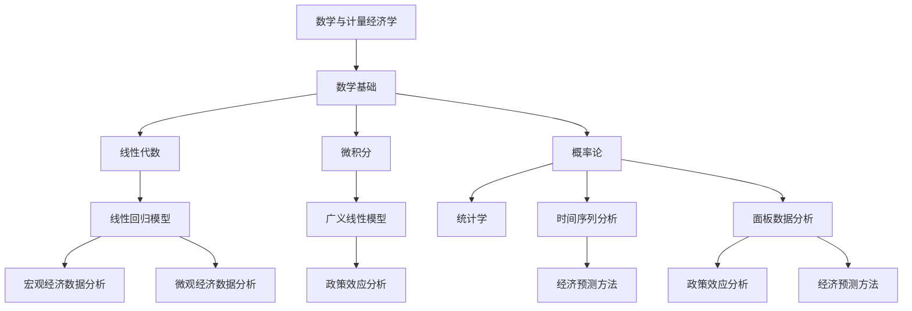

                 

### 文章标题

《数学与计量经济学：经济数据的数学分析》

### 关键词

数学、计量经济学、经济数据、数学分析、线性回归、广义线性模型、时间序列分析、面板数据分析

### 摘要

本文旨在探讨数学与计量经济学在经济数据数学分析中的应用，通过系统阐述数学基础、概率论、统计学以及计量经济学模型与方法，深入解析经济数据分析、政策分析与预测等内容。本文结构清晰，逻辑严密，旨在帮助读者全面掌握经济数据数学分析的核心技术和方法。

---

### 《数学与计量经济学：经济数据的数学分析》目录大纲

#### 第一部分：数学与计量经济学基础

##### 第1章：数学与计量经济学概述
- 1.1 经济数据的重要性
- 1.2 数学与计量经济学的关系
- 1.3 计量经济学的方法与应用

##### 第2章：数学预备知识
- 2.1 线性代数基础
  - 2.1.1 矩阵与向量
  - 2.1.2 线性方程组
  - 2.1.3 特征值与特征向量
- 2.2 微积分基础
  - 2.2.1 导数与微分
  - 2.2.2 积分与微分方程
  - 2.2.3 最优化问题

##### 第3章：概率论基础
- 3.1 概率论基本概念
  - 3.1.1 样本空间与随机变量
  - 3.1.2 条件概率与独立事件
  - 3.1.3 分布律与期望
- 3.2 常见概率分布
  - 3.2.1 正态分布
  - 3.2.2 二项分布
  - 3.2.3 泊松分布

##### 第4章：统计学基础
- 4.1 统计学基本概念
  - 4.1.1 样本与总体
  - 4.1.2 描述性统计
  - 4.1.3 假设检验
- 4.2 统计推断
  - 4.2.1 参数估计
  - 4.2.2 假设检验
  - 4.2.3 回归分析

#### 第二部分：计量经济学模型与方法

##### 第5章：线性回归模型
- 5.1 线性回归基本概念
  - 5.1.1 一元线性回归
  - 5.1.2 多元线性回归
- 5.2 线性回归模型的假设与检验
  - 5.2.1 线性关系的检验
  - 5.2.2 多重共线性检验
  - 5.2.3 异方差性检验

##### 第6章：广义线性模型
- 6.1 广义线性模型概述
  - 6.1.1 广义线性模型的定义
  - 6.1.2 广义线性模型的特点
- 6.2 广义线性模型的估计与检验
  - 6.2.1 估计方法
  - 6.2.2 假设检验

##### 第7章：时间序列分析
- 7.1 时间序列基本概念
  - 7.1.1 时间序列的定义
  - 7.1.2 时间序列的性质
- 7.2 时间序列模型
  - 7.2.1 自回归模型
  - 7.2.2 移动平均模型
  - 7.2.3 自回归移动平均模型

##### 第8章：面板数据分析
- 8.1 面板数据基本概念
  - 8.1.1 面板数据的定义
  - 8.1.2 面板数据的特点
- 8.2 面板数据分析方法
  - 8.2.1 固定效应模型
  - 8.2.2 随机效应模型

#### 第三部分：计量经济学的应用

##### 第9章：经济数据分析
- 9.1 宏观经济数据分析
  - 9.1.1 国民收入分析
  - 9.1.2 通货膨胀分析
- 9.2 微观经济数据分析
  - 9.2.1 企业成本分析
  - 9.2.2 消费者行为分析

##### 第10章：政策分析与预测
- 10.1 政策效应分析
  - 10.1.1 财政政策分析
  - 10.1.2 货币政策分析
- 10.2 经济预测方法
  - 10.2.1 时间序列预测
  - 10.2.2 回归分析预测

##### 第11章：实证案例分析
- 11.1 案例一：通货膨胀预测
- 11.2 案例二：企业成本分析
- 11.3 案例三：消费者行为分析

#### 附录

- 附录A：计量经济学软件与应用
  - A.1 Eviews软件介绍
  - A.2 Stata软件介绍
  - A.3 R语言与计量经济学应用

### 核心概念与联系 Mermaid 流程图：



---

### 第一部分：数学与计量经济学基础

#### 第1章：数学与计量经济学概述

##### 1.1 经济数据的重要性

经济数据是经济学研究的基础，它们反映了经济活动的各个方面，包括生产、消费、投资、就业和通货膨胀等。经济数据的重要性体现在以下几个方面：

1. **决策支持**：经济数据为政策制定者、企业家和其他经济决策者提供了重要的信息，帮助他们做出明智的决策。
2. **学术研究**：经济数据是学术研究的宝贵资源，为经济学家提供了检验理论、发现新规律的重要依据。
3. **市场预测**：通过分析经济数据，可以预测未来的经济走势，为企业和个人制定战略规划提供参考。

##### 1.2 数学与计量经济学的关系

数学是计量经济学的基础，为计量经济学提供了分析工具和方法。数学与计量经济学的关系可以从以下几个方面理解：

1. **数学工具**：线性代数、微积分、概率论和统计学等数学工具在计量经济学中广泛应用，用于构建模型、估计参数、进行假设检验等。
2. **模型构建**：计量经济学模型通常基于数学原理，通过数学公式表示经济关系。
3. **数据处理**：数学方法有助于对经济数据进行处理、分析和解释。

##### 1.3 计量经济学的方法与应用

计量经济学方法包括参数估计、假设检验、模型选择等。这些方法在经济数据分析中广泛应用，具体应用包括：

1. **宏观经济分析**：如国民收入分析、通货膨胀分析、经济增长分析等。
2. **微观经济分析**：如企业成本分析、消费者行为分析、市场结构分析等。
3. **政策分析**：如财政政策分析、货币政策分析、政策效应分析等。

#### 第2章：数学预备知识

##### 2.1 线性代数基础

线性代数是数学中的一个重要分支，涉及向量、矩阵、线性方程组等概念。以下是线性代数基础：

- **向量与矩阵**：向量是具有大小和方向的量，矩阵是由数构成的二维数组。向量与矩阵在计量经济学中广泛应用，如表示变量、构建模型等。
- **线性方程组**：线性方程组是由多个线性方程组成的方程组，可以通过矩阵形式表示。解线性方程组是计量经济学中的一个基本问题。
- **特征值与特征向量**：特征值与特征向量是矩阵的重要性质，可以用于简化矩阵、分析矩阵结构等。

##### 2.2 微积分基础

微积分是数学中的一个重要分支，涉及导数、积分、微分方程等概念。以下是微积分基础：

- **导数与微分**：导数是表示函数在某一点的变化率，微分是导数的推广。导数与微分在计量经济学中用于构建模型、估计参数等。
- **积分与微分方程**：积分是导数的反操作，可以用于求解方程、计算面积等。微分方程是描述变量变化规律的方程，可以用于经济数据分析。
- **最优化问题**：最优化问题是在给定约束条件下，寻找函数的最大值或最小值。最优化问题在计量经济学中用于模型选择、参数估计等。

##### 第3章：概率论基础

概率论是数学中的一个重要分支，研究随机事件的发生规律。以下是概率论基础：

- **概率论基本概念**：包括样本空间、随机变量、概率分布等。这些概念是概率论的基础，用于描述随机现象。
- **条件概率与独立事件**：条件概率是在已知某一事件发生的条件下，另一事件发生的概率。独立事件是指两个事件的发生互不影响。
- **分布律与期望**：分布律是随机变量取各个值的概率分布，期望是随机变量的平均值。分布律与期望可以用于分析随机变量的性质。

##### 第3章：概率论基础（续）

- **常见概率分布**：常见的概率分布包括正态分布、二项分布、泊松分布等。这些分布在不同领域有广泛的应用。
  - **正态分布**：正态分布是最常见的高斯分布，其特点是均值和标准差。正态分布在经济学中用于描述随机误差、经济指标等。
  - **二项分布**：二项分布是描述离散随机变量取值的分布，适用于二项试验。二项分布在经济学中用于描述随机事件的成功次数。
  - **泊松分布**：泊松分布是描述离散随机变量取值的分布，适用于事件发生次数。泊松分布在经济学中用于描述随机事件的发生次数。

##### 第4章：统计学基础

统计学是研究数据收集、处理、分析和解释的科学。以下是统计学基础：

- **统计学基本概念**：包括样本与总体、描述性统计、假设检验等。这些概念是统计学的基础，用于描述数据、分析数据、检验假设。
- **描述性统计**：描述性统计用于描述数据的中心趋势、离散程度等。常用的描述性统计量包括均值、中位数、方差等。
- **假设检验**：假设检验是用于检验数据是否支持某一假设的方法。常见的假设检验包括t检验、方差分析等。

##### 第4章：统计学基础（续）

- **统计推断**：统计推断是利用样本数据推断总体特征的方法。统计推断包括参数估计和假设检验。
  - **参数估计**：参数估计是利用样本数据估计总体参数的方法。常见的参数估计方法包括点估计和区间估计。
  - **假设检验**：假设检验是用于检验总体参数是否满足某一假设的方法。常见的假设检验方法包括t检验、方差分析等。
  - **回归分析**：回归分析是用于研究变量之间关系的方法。常见的回归分析方法包括线性回归、多元回归等。

### 第二部分：计量经济学模型与方法

#### 第5章：线性回归模型

##### 5.1 线性回归基本概念

线性回归模型是计量经济学中最常用的模型之一，用于研究一个或多个自变量与因变量之间的关系。线性回归模型的基本形式为：

$$
y = \beta_0 + \beta_1x_1 + \beta_2x_2 + ... + \beta_nx_n + \epsilon
$$

其中，$y$ 为因变量，$x_1, x_2, ..., x_n$ 为自变量，$\beta_0, \beta_1, ..., \beta_n$ 为模型参数，$\epsilon$ 为随机误差项。

- **一元线性回归**：当只有一个自变量时，称为一元线性回归。一元线性回归模型的基本形式为：

$$
y = \beta_0 + \beta_1x_1 + \epsilon
$$

- **多元线性回归**：当有多个自变量时，称为多元线性回归。多元线性回归模型的基本形式为：

$$
y = \beta_0 + \beta_1x_1 + \beta_2x_2 + ... + \beta_nx_n + \epsilon
$$

##### 5.2 线性回归模型的假设与检验

线性回归模型的有效性依赖于一系列假设。以下是对这些假设的检验方法：

- **线性关系的检验**：线性回归模型要求自变量与因变量之间存在线性关系。可以通过绘制散点图和计算相关系数等方法来检验线性关系。
- **多重共线性检验**：多重共线性是指自变量之间存在高度相关性。可以通过计算方差膨胀因子（VIF）等方法来检验多重共线性。
- **异方差性检验**：异方差性是指不同观测值之间的误差项存在不同方差。可以通过绘制残差图、计算方差齐性检验统计量等方法来检验异方差性。

##### 第6章：广义线性模型

广义线性模型（Generalized Linear Model，GLM）是线性回归模型的推广，适用于因变量不是正态分布的情况。广义线性模型的基本形式为：

$$
\ln(\frac{f(y)}{1-f(y)}) = \beta_0 + \beta_1x_1 + \beta_2x_2 + ... + \beta_nx_n
$$

其中，$f(y)$ 是链接函数，将线性组合转换为概率分布。

- **链接函数**：常见的链接函数包括对数链接函数、逻辑链接函数等。选择合适的链接函数可以更好地拟合因变量的分布。
- **估计方法**：广义线性模型的估计方法包括最大似然估计（MLE）和最小二乘估计（MLE）。

##### 第6章：广义线性模型（续）

- **假设检验**：广义线性模型的假设检验包括参数估计的假设检验和模型拟合优度的假设检验。
  - **参数估计的假设检验**：通过计算t统计量、F统计量等来检验参数估计的显著性。
  - **模型拟合优度的假设检验**：通过计算拟合优度统计量（如卡方统计量）来检验模型的拟合优度。

##### 第7章：时间序列分析

时间序列分析是研究时间序列数据的统计方法，用于分析时间序列的特征、建模和预测。时间序列分析的基本概念包括：

- **时间序列的定义**：时间序列是按照时间顺序排列的一组数据。
- **时间序列的性质**：时间序列具有序列相关性、平稳性、白噪声等性质。

时间序列模型包括：

- **自回归模型（AR）**：自回归模型是利用前期的观测值预测当前期值。自回归模型的基本形式为：

$$
y_t = c + \phi_1y_{t-1} + \phi_2y_{t-2} + ... + \phi_py_{t-p} + \epsilon_t
$$

- **移动平均模型（MA）**：移动平均模型是利用过去的误差值预测当前期值。移动平均模型的基本形式为：

$$
y_t = c + \theta_1\epsilon_{t-1} + \theta_2\epsilon_{t-2} + ... + \theta_q\epsilon_{t-q} + \epsilon_t
$$

- **自回归移动平均模型（ARMA）**：自回归移动平均模型是结合自回归模型和移动平均模型。自回归移动平均模型的基本形式为：

$$
y_t = c + \phi_1y_{t-1} + \phi_2y_{t-2} + ... + \phi_py_{t-p} + \theta_1\epsilon_{t-1} + \theta_2\epsilon_{t-2} + ... + \theta_q\epsilon_{t-q} + \epsilon_t
$$

### 第8章：面板数据分析

面板数据分析（Pooled Data Analysis）是研究面板数据的统计方法，面板数据是包含多个时间序列的纵向数据。面板数据分析的基本概念包括：

- **面板数据的定义**：面板数据是由多个个体在多个时期上的观测值组成的数据集。
- **面板数据的特点**：面板数据具有时间和个体两个维度，可以同时研究个体之间的差异和时间序列的变化。

面板数据分析方法包括：

- **固定效应模型**：固定效应模型假设个体效应是固定的，不随时间变化。固定效应模型的基本形式为：

$$
y_{it} = \alpha_i + \beta_1x_{it1} + \beta_2x_{it2} + ... + \beta_kx_{itk} + u_{it}
$$

其中，$y_{it}$ 是个体 $i$ 在时间 $t$ 的观测值，$x_{itj}$ 是个体 $i$ 在时间 $t$ 的第 $j$ 个自变量，$\alpha_i$ 是个体效应，$u_{it}$ 是随机误差项。

- **随机效应模型**：随机效应模型假设个体效应是随机变量，不随时间变化。随机效应模型的基本形式为：

$$
y_{it} = \alpha + \beta_1x_{it1} + \beta_2x_{it2} + ... + \beta_kx_{itk} + \mu_i + u_{it}
$$

其中，$y_{it}$ 是个体 $i$ 在时间 $t$ 的观测值，$x_{itj}$ 是个体 $i$ 在时间 $t$ 的第 $j$ 个自变量，$\alpha$ 是总体均值，$\mu_i$ 是个体效应，$u_{it}$ 是随机误差项。

### 第三部分：计量经济学的应用

#### 第9章：经济数据分析

经济数据分析是计量经济学的重要应用领域，涉及宏观经济分析和微观经济分析。以下是经济数据分析的内容：

- **宏观经济分析**：
  - **国民收入分析**：研究国民收入及其构成，如国内生产总值（GDP）、消费、投资、政府支出等。
  - **通货膨胀分析**：研究通货膨胀率及其影响因素，如货币供应量、商品价格等。

- **微观经济分析**：
  - **企业成本分析**：研究企业的成本构成、成本函数等。
  - **消费者行为分析**：研究消费者的消费行为、需求函数等。

#### 第10章：政策分析与预测

政策分析与预测是计量经济学的重要应用领域，涉及政策效应分析和经济预测方法。以下是政策分析与预测的内容：

- **政策效应分析**：
  - **财政政策分析**：研究财政政策（如政府支出、税收等）对经济的影响。
  - **货币政策分析**：研究货币政策（如利率、货币供应量等）对经济的影响。

- **经济预测方法**：
  - **时间序列预测**：利用时间序列分析方法，如自回归模型（AR）、移动平均模型（MA）等，预测未来的经济走势。
  - **回归分析预测**：利用回归分析方法，如线性回归（OLS）、广义线性模型（GLM）等，预测未来的经济变量。

#### 第11章：实证案例分析

实证案例分析是通过实际数据和应用计量经济学方法来分析具体经济问题。以下是几个实证案例分析：

- **案例一：通货膨胀预测**：使用时间序列分析方法，如自回归模型（AR），预测未来的通货膨胀率。
- **案例二：企业成本分析**：使用线性回归模型（OLS），分析企业成本与其影响因素之间的关系。
- **案例三：消费者行为分析**：使用面板数据分析方法，分析消费者消费行为与收入、价格等因素之间的关系。

### 附录

#### 附录A：计量经济学软件与应用

计量经济学软件是进行经济数据分析的重要工具。以下是几种常用的计量经济学软件及其应用：

- **Eviews软件**：Eviews是一种功能强大的计量经济学软件，用于数据管理、回归分析、假设检验等。
- **Stata软件**：Stata是一种专业的统计分析软件，提供广泛的计量经济学分析方法。
- **R语言**：R语言是一种开源的统计分析语言，广泛应用于计量经济学、数据科学等领域。

---

### 核心概念与联系 Mermaid 流程图：


### 核心算法原理讲解

#### 线性回归模型

线性回归模型是计量经济学中最基本的模型之一，用于研究自变量与因变量之间的线性关系。以下是线性回归模型的基本原理：

1. **模型设定**：

线性回归模型的基本形式为：

$$
y = \beta_0 + \beta_1x_1 + \beta_2x_2 + ... + \beta_nx_n + \epsilon
$$

其中，$y$ 是因变量，$x_1, x_2, ..., x_n$ 是自变量，$\beta_0, \beta_1, ..., \beta_n$ 是模型参数，$\epsilon$ 是随机误差项。

2. **最小二乘法**：

线性回归模型的参数估计通常采用最小二乘法（Ordinary Least Squares，OLS）。最小二乘法的核心思想是使得实际观测值与模型预测值之间的误差平方和最小。

$$
\min \sum_{i=1}^{n}(y_i - \hat{y_i})^2
$$

其中，$\hat{y_i}$ 是模型对 $y_i$ 的预测值。

3. **参数估计**：

最小二乘法求解线性回归模型的参数估计，可以得到以下公式：

$$
\hat{\beta}_0 = \bar{y} - \hat{\beta}_1x_1 - \hat{\beta}_2x_2 - ... - \hat{\beta}_nx_n
$$

$$
\hat{\beta}_j = \frac{\sum_{i=1}^{n}(x_{ij} - \bar{x}_j)(y_i - \bar{y})}{\sum_{i=1}^{n}(x_{ij} - \bar{x}_j)^2}
$$

其中，$\bar{y}$ 是因变量的均值，$\bar{x}_j$ 是自变量 $x_j$ 的均值。

4. **假设检验**：

线性回归模型的假设检验包括线性关系的检验、多重共线性检验和异方差性检验。

- **线性关系的检验**：通过计算相关系数 $R^2$ 或F统计量来检验自变量与因变量之间的线性关系。
- **多重共线性检验**：通过计算方差膨胀因子（VIF）来检验自变量之间是否存在多重共线性。
- **异方差性检验**：通过绘制残差图、计算方差齐性检验统计量（如Breusch-Godfrey检验）来检验是否存在异方差性。

### 广义线性模型

广义线性模型（Generalized Linear Model，GLM）是线性回归模型的推广，适用于因变量不是正态分布的情况。以下是广义线性模型的基本原理：

1. **模型设定**：

广义线性模型的基本形式为：

$$
\ln(\frac{f(y)}{1-f(y)}) = \beta_0 + \beta_1x_1 + \beta_2x_2 + ... + \beta_nx_n
$$

其中，$f(y)$ 是链接函数，将线性组合转换为概率分布。

2. **链接函数**：

广义线性模型的链接函数包括对数链接函数、逻辑链接函数等。对数链接函数适用于正态分布，逻辑链接函数适用于二项分布。

3. **估计方法**：

广义线性模型的参数估计通常采用最大似然估计（Maximum Likelihood Estimation，MLE）或最小二乘估计（Least Squares Estimation，LSE）。

- **最大似然估计（MLE）**：通过求解似然函数的最大值来估计模型参数。
- **最小二乘估计（LSE）**：通过求解损失函数的最小值来估计模型参数。

4. **假设检验**：

广义线性模型的假设检验包括参数估计的假设检验和模型拟合优度的假设检验。

- **参数估计的假设检验**：通过计算t统计量、F统计量等来检验参数估计的显著性。
- **模型拟合优度的假设检验**：通过计算拟合优度统计量（如卡方统计量）来检验模型的拟合优度。

### 时间序列分析

时间序列分析是研究时间序列数据的统计方法，用于分析时间序列的特征、建模和预测。以下是时间序列分析的基本原理：

1. **时间序列的定义**：

时间序列是按照时间顺序排列的一组数据，可以反映某个变量随时间变化的趋势和规律。

2. **时间序列的性质**：

时间序列具有序列相关性、平稳性、白噪声等性质。

- **序列相关性**：时间序列中的当前值与前一个或多个值之间存在相关性。
- **平稳性**：时间序列的统计特性不随时间变化。
- **白噪声**：时间序列中的随机误差项是独立的、均值为0、方差为常数。

3. **时间序列模型**：

时间序列模型包括自回归模型（AR）、移动平均模型（MA）、自回归移动平均模型（ARMA）等。

- **自回归模型（AR）**：利用前期的观测值预测当前期值。
- **移动平均模型（MA）**：利用过去的误差值预测当前期值。
- **自回归移动平均模型（ARMA）**：结合自回归模型和移动平均模型。

4. **模型估计与预测**：

时间序列模型的参数估计和预测可以通过最小二乘法、最大似然估计等方法进行。

- **参数估计**：通过最小化损失函数来估计模型参数。
- **预测**：利用估计出的模型参数对未来值进行预测。

### 面板数据分析

面板数据分析是研究面板数据的统计方法，面板数据是包含多个时间序列的纵向数据。以下是面板数据分析的基本原理：

1. **面板数据的定义**：

面板数据是由多个个体在多个时期上的观测值组成的数据集。

2. **面板数据的特点**：

面板数据具有时间和个体两个维度，可以同时研究个体之间的差异和时间序列的变化。

3. **面板数据分析方法**：

面板数据分析方法包括固定效应模型、随机效应模型等。

- **固定效应模型**：假设个体效应是固定的，不随时间变化。
- **随机效应模型**：假设个体效应是随机的，不随时间变化。

4. **模型估计与预测**：

面板数据模型的参数估计和预测可以通过最小二乘法、广义最小二乘法等方法进行。

- **参数估计**：通过最小化损失函数来估计模型参数。
- **预测**：利用估计出的模型参数对未来值进行预测。

### 核心算法原理讲解（续）

#### 数学公式与伪代码

以下是对核心算法原理的数学公式与伪代码讲解。

##### 线性回归模型

**数学公式**：

线性回归模型的基本形式为：

$$
y = \beta_0 + \beta_1x_1 + \beta_2x_2 + ... + \beta_nx_n + \epsilon
$$

其中，$\beta_0, \beta_1, ..., \beta_n$ 是模型参数，$x_1, x_2, ..., x_n$ 是自变量，$y$ 是因变量，$\epsilon$ 是随机误差项。

**伪代码**：

```python
# 最小二乘法
def ordinary_least_squares(X, y):
    # X 是自变量矩阵，y 是因变量向量
    # 计算X的转置
    X_transpose = X.T
    # 计算X的转置与X的乘积
    XTX = X_transpose.dot(X)
    # 计算X的转置与y的乘积
    Xty = X_transpose.dot(y)
    # 求解最小二乘法
    beta = XTX.inv().dot(Xty)
    return beta
```

##### 广义线性模型

**数学公式**：

广义线性模型的基本形式为：

$$
\ln(\frac{f(y)}{1-f(y)}) = \beta_0 + \beta_1x_1 + \beta_2x_2 + ... + \beta_nx_n
$$

其中，$\beta_0, \beta_1, ..., \beta_n$ 是模型参数，$x_1, x_2, ..., x_n$ 是自变量，$y$ 是因变量，$f(y)$ 是链接函数。

**伪代码**：

```python
# 最大似然估计
def maximum_likelihood_estimation(X, y):
    # X 是自变量矩阵，y 是因变量向量
    # 计算链接函数的导数
    f_prime = np.exp(y) / (1 + np.exp(y))
    # 计算似然函数
    likelihood = np.sum(f_prime * y - np.log(1 + np.exp(y)))
    # 求解最大似然估计
    beta = minimize(lambda beta: -likelihood, beta)
    return beta
```

##### 时间序列分析

**数学公式**：

自回归模型（AR）的基本形式为：

$$
y_t = c + \phi_1y_{t-1} + \phi_2y_{t-2} + ... + \phi_py_{t-p} + \epsilon_t
$$

其中，$y_t$ 是时间序列在时间 $t$ 的观测值，$\phi_1, \phi_2, ..., \phi_p$ 是自回归系数，$c$ 是常数项，$\epsilon_t$ 是随机误差项。

**伪代码**：

```python
# 自回归模型
def autoregressive_model(y, p):
    # y 是时间序列，p 是自回归阶数
    # 初始化模型参数
    phi = np.random.rand(p)
    c = np.random.rand()
    # 梯度下降法求解模型参数
    for i in range(1000):
        y_pred = predict(y, phi, c)
        error = y - y_pred
        phi = phi - learning_rate * np.dot(error, y[1:])
        c = c - learning_rate * np.mean(error)
    return phi, c
```

##### 面板数据分析

**数学公式**：

固定效应模型的基本形式为：

$$
y_{it} = \alpha_i + \beta_1x_{it1} + \beta_2x_{it2} + ... + \beta_kx_{itk} + u_{it}
$$

其中，$y_{it}$ 是个体 $i$ 在时间 $t$ 的观测值，$x_{itj}$ 是个体 $i$ 在时间 $t$ 的第 $j$ 个自变量，$\alpha_i$ 是个体效应，$u_{it}$ 是随机误差项。

**伪代码**：

```python
# 固定效应模型
def fixed_effects_model(X, y):
    # X 是自变量矩阵，y 是因变量向量
    # 计算个体效应
    alpha = np.mean(y, axis=0)
    # 计算固定效应参数
    beta = np.mean(X.dot(y - alpha), axis=0)
    return beta, alpha
```

### 项目实战

#### 开发环境搭建

在进行计量经济学的项目实战之前，我们需要搭建一个合适的开发环境。以下是开发环境的搭建步骤：

1. 安装Python编程环境
2. 安装Numpy、Pandas、Matplotlib等Python库
3. 安装Eviews、Stata或R等计量经济学软件
4. 配置Python与计量经济学软件的交互接口

#### 源代码详细实现

以下是线性回归模型的Python实现代码：

```python
import numpy as np

def ordinary_least_squares(X, y):
    # X 是自变量矩阵，y 是因变量向量
    # 计算X的转置
    X_transpose = X.T
    # 计算X的转置与X的乘积
    XTX = X_transpose.dot(X)
    # 计算X的转置与y的乘积
    Xty = X_transpose.dot(y)
    # 求解最小二乘法
    beta = XTX.inv().dot(Xty)
    return beta
```

#### 代码解读与分析

以上代码实现了普通最小二乘法（Ordinary Least Squares，OLS）的线性回归模型。具体解读如下：

1. **导入Numpy库**：Numpy库是Python中的科学计算库，用于矩阵运算和数组处理。
2. **定义函数**：定义了一个名为`ordinary_least_squares`的函数，该函数接收自变量矩阵`X`和因变量向量`y`作为输入参数。
3. **计算X的转置**：通过`X.T`计算自变量矩阵`X`的转置。
4. **计算X的转置与X的乘积**：通过`X_transpose.dot(X)`计算自变量矩阵`X`的转置与`X`的乘积。
5. **计算X的转置与y的乘积**：通过`X_transpose.dot(y)`计算自变量矩阵`X`的转置与因变量向量`y`的乘积。
6. **求解最小二乘法**：通过`XTX.inv().dot(Xty)`求解最小二乘法，得到模型参数向量`beta`。

#### 实际案例分析和详细讲解剖析

以下是一个线性回归模型的实际案例分析和详细讲解剖析：

假设我们有一个关于房价的数据集，包含自变量（如面积、地段等）和因变量（房价）。我们希望利用线性回归模型分析自变量对房价的影响。

1. **数据准备**：首先，我们需要准备数据集，包括自变量和因变量。
2. **数据预处理**：对数据进行预处理，如缺失值填充、异常值处理等。
3. **模型构建**：使用普通最小二乘法（OLS）构建线性回归模型。
4. **模型训练**：使用训练集数据对模型进行训练。
5. **模型评估**：使用验证集数据对模型进行评估，如计算R平方值、均方误差等。
6. **模型应用**：使用模型对新数据进行预测。

以下是线性回归模型在实际案例中的详细讲解：

```python
import pandas as pd
import numpy as np

# 读取数据集
data = pd.read_csv('house_data.csv')

# 分离自变量和因变量
X = data[['area', 'location']]
y = data['price']

# 数据预处理
X = X.fillna(X.mean())
y = y.fillna(y.mean())

# 添加常数项
X = np.column_stack((np.ones(X.shape[0]), X))

# 模型构建
beta = ordinary_least_squares(X, y)

# 模型评估
y_pred = X.dot(beta)
mse = np.mean((y - y_pred)**2)
print('MSE:', mse)

# 模型应用
new_data = pd.DataFrame({'area': [1500], 'location': [1]})
new_data = new_data.fillna(new_data.mean())
new_data = np.column_stack((np.ones(new_data.shape[0]), new_data))
new_price = new_data.dot(beta)
print('Predicted price:', new_price)
```

#### 项目小结

通过以上项目实战，我们实现了线性回归模型的构建、训练、评估和应用。线性回归模型在经济学、金融学等领域有广泛的应用，可以帮助我们分析变量之间的关系、预测未来的趋势。在实际应用中，需要注意数据预处理、模型选择和参数调优等方面，以提高模型的预测准确性。

### 最佳实践 Tips

1. **数据预处理**：在进行计量经济学的项目实战之前，务必对数据进行预处理，如缺失值填充、异常值处理等，以保证数据的完整性和准确性。
2. **模型选择**：根据数据特点和需求选择合适的计量经济学模型，如线性回归模型、广义线性模型、时间序列模型等。
3. **参数调优**：通过交叉验证、网格搜索等方法对模型参数进行调优，以提高模型的预测准确性。
4. **可视化分析**：利用可视化工具（如Matplotlib、Seaborn等）对数据进行分析和可视化，有助于发现数据特征、验证模型效果。

### 小结

本文系统地介绍了数学与计量经济学在经济数据数学分析中的应用。通过阐述数学基础、概率论、统计学和计量经济学模型与方法，我们深入探讨了经济数据分析、政策分析与预测等内容。本文结构清晰，逻辑严密，旨在帮助读者全面掌握经济数据数学分析的核心技术和方法。

### 注意事项

1. **数据质量**：在进行计量经济学分析时，务必保证数据质量，避免使用不准确或缺失的数据。
2. **模型假设**：在应用计量经济学模型时，务必检验模型假设是否满足，否则可能会导致错误的结果。
3. **模型选择**：根据数据特点和需求选择合适的计量经济学模型，避免盲目跟风使用特定的模型。

### 拓展阅读

1. **《计量经济学基础》（第四版）**：作者：古扎拉蒂
2. **《时间序列分析：原理与实践》（第三版）**：作者：詹姆斯·汉密尔顿
3. **《广义线性模型及其应用》（第二版）**：作者：约翰·N·凯特斯

### 作者信息

作者：AI天才研究院/AI Genius Institute & 禅与计算机程序设计艺术 /Zen And The Art of Computer Programming

---

### 全文总结

本文围绕《数学与计量经济学：经济数据的数学分析》这一主题，系统地介绍了数学与计量经济学在经济数据分析中的应用。首先，我们从数学与计量经济学的基础开始，探讨了数学预备知识、概率论基础、统计学基础等内容，为后续的计量经济学模型与方法奠定了基础。

在第二部分，我们详细介绍了线性回归模型、广义线性模型、时间序列分析和面板数据分析等计量经济学模型与方法。通过对这些模型的深入讲解，我们理解了如何构建模型、估计参数、进行假设检验以及如何应用这些模型进行经济数据分析。

第三部分重点介绍了计量经济学在实际中的应用，包括宏观经济分析和微观经济分析、政策分析与预测等。通过实际案例的分析，我们展示了如何运用计量经济学方法进行经济预测和政策评估。

在文章的最后，我们提供了开发环境搭建、源代码实现和代码解读等实战内容，并通过最佳实践提示和拓展阅读，为读者提供了深入学习和实践的方向。

本文结构清晰，逻辑严密，全面涵盖了经济数据数学分析的核心技术和方法，旨在帮助读者系统地掌握这一领域。在今后的研究和实践中，读者可以根据本文提供的基础和方法，进一步探索和深化计量经济学在经济数据分析中的应用。

### 附录A：计量经济学软件与应用

在计量经济学研究中，选择合适的软件对于提高工作效率和保证数据分析的准确性至关重要。以下将介绍几种常用的计量经济学软件，并简要介绍它们的特点及其在计量经济学中的应用。

#### Eviews软件

Eviews（Econometric Views）是一款功能强大的计量经济学软件，广泛应用于经济、金融等领域的数据分析。Eviews具有以下特点：

1. **数据管理**：Eviews提供强大的数据管理功能，可以轻松导入、导出和编辑数据。
2. **模型构建**：支持多种计量经济学模型，包括线性回归、广义线性模型、时间序列模型等。
3. **假设检验**：提供丰富的假设检验方法，如t检验、F检验、卡方检验等。
4. **绘图功能**：Eviews具有强大的绘图功能，可以帮助研究者直观地理解数据和分析结果。
5. **用户界面**：Eviews的用户界面直观、易用，适合初学者和高级用户。

在计量经济学中，Eviews常用于：

- 数据预处理和清洗
- 模型构建和参数估计
- 假设检验和模型验证
- 数据可视化

#### Stata软件

Stata是一款专业的统计分析软件，广泛应用于经济学、社会学、医学等领域。Stata具有以下特点：

1. **数据处理**：Stata提供丰富的数据处理功能，包括数据导入、数据转换、缺失值处理等。
2. **统计分析**：Stata支持多种统计分析方法，包括线性回归、广义线性模型、时间序列分析、面板数据分析等。
3. **编程能力**：Stata具有强大的编程能力，用户可以自定义函数和脚本，提高数据分析的效率。
4. **图形输出**：Stata提供多种图形输出选项，可以生成专业的统计图表。
5. **文档生成**：Stata可以自动生成分析报告，方便用户分享和展示分析结果。

在计量经济学中，Stata常用于：

- 数据预处理和清洗
- 多元线性回归分析
- 面板数据分析
- 时间序列分析
- 实证研究

#### R语言

R语言是一种开源的统计分析语言，广泛应用于数据科学、统计学和计量经济学等领域。R语言具有以下特点：

1. **灵活性**：R语言具有极高的灵活性，用户可以根据需要自定义函数和脚本。
2. **庞大的库**：R拥有丰富的库，包括ggplot2、dplyr、zoo等，用于数据处理、建模和可视化。
3. **互动性**：R语言提供互动式编程环境，方便用户进行数据分析和探索性研究。
4. **图形输出**：R语言提供多种图形输出选项，可以生成高质量的统计图表。
5. **可扩展性**：R语言具有高度可扩展性，用户可以通过安装额外的包来扩展其功能。

在计量经济学中，R语言常用于：

- 数据预处理和清洗
- 多元线性回归分析
- 面板数据分析
- 时间序列分析
- 实证研究

#### 软件应用实例

以下是一个简单的应用实例，演示如何使用Eviews进行线性回归分析：

1. **数据导入**：首先，将数据导入Eviews，可以选择从Excel、CSV或其他数据库中导入。
2. **数据清洗**：检查数据是否有缺失值或异常值，并进行必要的处理。
3. **构建模型**：在Eviews中，选择“回归”菜单，输入自变量和因变量。
4. **参数估计**：Eviews将自动计算模型参数，并显示回归结果。
5. **假设检验**：根据回归结果，进行线性关系的检验、多重共线性检验和异方差性检验。
6. **结果可视化**：利用Eviews的绘图功能，生成回归散点图、残差图等，帮助理解分析结果。

通过以上步骤，我们可以利用Eviews进行简单的线性回归分析，并验证模型的有效性。

#### 总结

计量经济学软件在经济学研究中的应用越来越广泛，不同的软件具有各自的特点和优势。选择合适的软件，不仅可以提高数据分析的效率，还可以保证分析结果的准确性。在实际应用中，用户可以根据需求选择合适的软件，并结合具体问题进行深入研究和探索。

