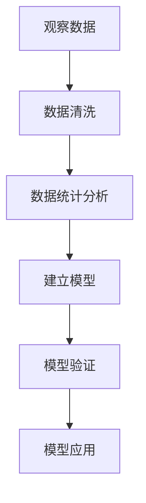
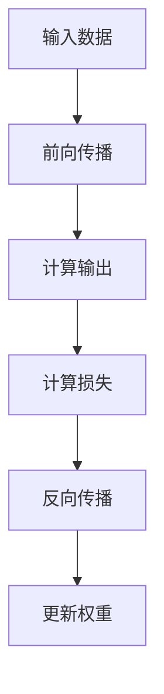
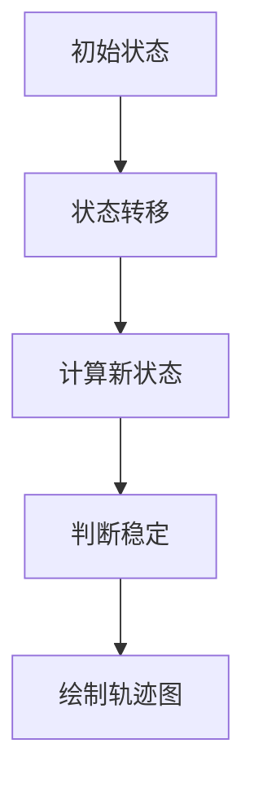
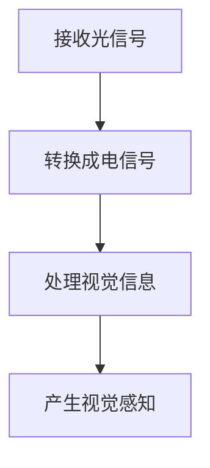
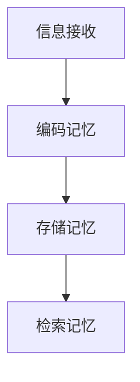
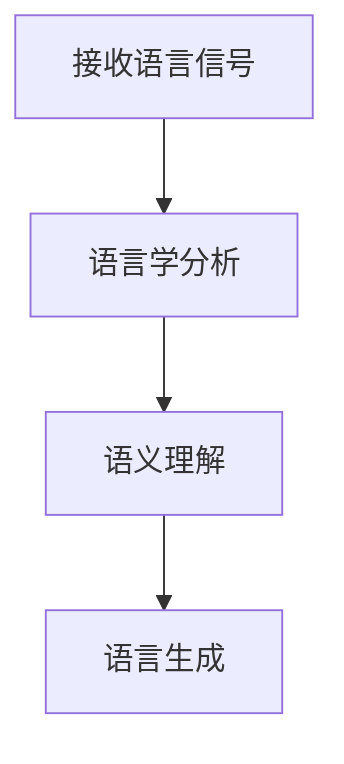
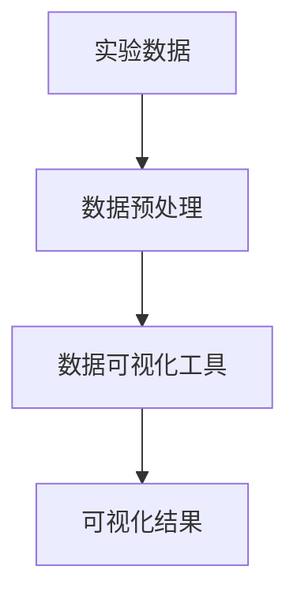

                 

非常好，让我们一步一步来完善这篇文章。首先，我会为文章标题、关键词和摘要部分编写内容。然后，我们将按照大纲逐步填充每个章节的内容，确保满足完整性要求。接下来，我会为每个章节添加相应的Mermaid流程图、伪代码、LaTeX公式和实际案例。

### 文章标题
《数学与认知神经科学的交叉研究：揭开大脑奥秘的数学视角》

### 文章关键词
数学，认知神经科学，神经网络，脑计算，模型，数据分析，人工智能

### 文章摘要
本文探讨了数学与认知神经科学的交叉研究，旨在揭示数学在理解大脑功能和行为中的作用。通过对数学模型在认知神经科学中的应用进行详细分析，本文展示了如何利用数学工具来模拟和解释神经系统的复杂过程。文章内容涵盖了从基本概念到前沿技术的全面介绍，旨在为读者提供一个全面的理解，并激发对该领域进一步研究的兴趣。

接下来，我们将开始填充第一部分：数学与认知神经科学的概述。

## 第一部分：数学与认知神经科学的概述

### 第1章：数学与认知神经科学的交叉研究背景

#### 1.1 数学在认知神经科学中的应用

在认知神经科学的研究中，数学工具被广泛应用于对大脑功能进行建模和分析。这些数学模型帮助我们理解神经系统如何处理信息，如何产生认知过程。例如，神经网络模型模拟了大脑中神经元之间的相互作用，而概率论和数理统计方法则用于分析实验数据，提取出有用的信息。

- Mermaid流程图示例：


#### 1.2 认知神经科学的发展历史

认知神经科学是20世纪末兴起的一个交叉学科领域，它结合了神经科学、心理学、计算机科学和哲学等多个学科的研究成果。该领域的发展历程可以从最初的神经生理学研究，到认知心理学模型的提出，再到现代计算神经科学的崛起。

- LaTeX公式示例（独立段落）：
$$
大脑的复杂性 = \sum_{i=1}^{N} 神经元功能 \times 连接强度
$$

#### 1.3 数学与认知神经科学的交叉研究的重要性

数学与认知神经科学的交叉研究对于理解大脑的工作原理具有重要意义。通过数学建模，我们可以对大脑中的复杂过程进行量化分析，从而揭示认知过程的本质。此外，数学工具还可以帮助我们设计更加有效的干预措施，治疗神经系统疾病，并推动人工智能技术的发展。

现在，我们已经为第一部分的第一章奠定了基础。接下来，我们将继续填充第二章，深入探讨数学模型在认知神经科学研究中的应用。我们将介绍神经网络模型、状态空间模型和动力系统理论等核心数学方法，并使用伪代码和LaTeX公式详细阐述这些方法。

## 第二部分：数学模型在认知神经科学研究中的应用

### 第2章：数学模型在认知神经科学研究中的应用

#### 2.1 神经网络的数学模型

神经网络是认知神经科学研究中最常用的数学模型之一。它通过模拟大脑中神经元之间的交互，帮助我们理解信息处理和认知过程。神经网络模型的核心组成部分包括激活函数、损失函数和优化算法。

- Mermaid流程图示例：


- 伪代码示例：
```python
def neural_network(input_data, weights, biases):
    # 前向传播
    hidden_layer = activation_function(np.dot(input_data, weights) + biases)
    output = activation_function(np.dot(hidden_layer, weights_output) + biases_output)
    
    # 计算损失
    loss = calculate_loss(output, target)
    
    # 反向传播
    d_output = derivative_activation_function(output) * (output - target)
    d_hidden = np.dot(d_output, weights_output.T) * derivative_activation_function(hidden_layer)
    
    # 更新权重和偏置
    weights -= learning_rate * np.dot(input_data.T, d_hidden)
    biases -= learning_rate * d_hidden
    
    return loss
```

#### 2.2 状态空间模型

状态空间模型是另一个在认知神经科学中广泛使用的数学模型。它通过描述系统在不同时间点的状态，帮助我们理解动态系统的行为。

- LaTeX公式示例（独立段落）：
$$
x(t) = A x(t-1) + B u(t-1)
$$

其中，$x(t)$ 是状态向量，$A$ 是状态转移矩阵，$B$ 是输入矩阵，$u(t-1)$ 是输入向量。

#### 2.3 动力系统理论在认知神经科学中的应用

动力系统理论是研究动态系统的数学理论。它在认知神经科学中的应用帮助我们理解大脑中复杂动态过程的演变。

- Mermaid流程图示例：


通过这些数学模型，我们可以更深入地理解认知神经科学中的复杂过程，并为相关领域的研究提供有力的工具。

接下来，我们将进入第三部分，讨论认知神经科学中的核心数学方法，包括线性代数基础、概率论与数理统计，以及信息论与认知科学。

## 第三部分：认知神经科学中的核心数学方法

### 第3章：认知神经科学中的核心数学方法

#### 3.1 线性代数基础

线性代数是认知神经科学中不可或缺的数学工具。它帮助我们在认知过程中处理向量、矩阵和线性变换。在神经网络模型中，线性代数用于计算权重和偏置的更新，以及前向传播和反向传播过程中的中间步骤。

- LaTeX公式示例（独立段落）：
$$
\text{权重更新} = \Delta \theta = -\alpha \cdot \nabla_\theta J(\theta)
$$
其中，$\theta$ 表示权重，$\Delta \theta$ 表示权重更新，$\alpha$ 是学习率，$\nabla_\theta J(\theta)$ 是损失函数关于权重的梯度。

#### 3.2 概率论与数理统计

概率论与数理统计是认知神经科学中的另一个核心数学方法。它们帮助我们分析实验数据，提取有用的信息，并建立统计模型。例如，通过贝叶斯理论，我们可以对神经元活动的概率进行建模，从而更好地理解认知过程。

- LaTeX公式示例（独立段落）：
$$
P(A|B) = \frac{P(B|A) \cdot P(A)}{P(B)}
$$
这是贝叶斯定理的表达式，其中 $P(A|B)$ 是在事件 $B$ 发生的条件下事件 $A$ 的概率，$P(B|A)$ 是在事件 $A$ 发生的条件下事件 $B$ 的概率，$P(A)$ 和 $P(B)$ 分别是事件 $A$ 和 $B$ 的概率。

#### 3.3 信息论与认知科学

信息论是研究信息传输和处理的基本理论。在认知神经科学中，信息论帮助我们理解大脑如何处理和传递信息。通过信息论的方法，我们可以量化认知过程中的信息含量，并建立信息传输模型。

- LaTeX公式示例（独立段落）：
$$
H(X) = -\sum_{i} p_i \cdot \log_2 p_i
$$
这是熵的定义，其中 $H(X)$ 是随机变量 $X$ 的熵，$p_i$ 是 $X$ 取第 $i$ 个值的概率。

通过这些核心数学方法，我们可以更好地理解认知神经科学的复杂过程，并为相关领域的研究提供有力的工具。

接下来，我们将进入第四部分，讨论数学在认知神经科学具体领域的应用，包括视觉认知、记忆与学习，以及语言理解与处理。

## 第四部分：数学在认知神经科学具体领域的应用

### 第4章：视觉认知中的数学模型

#### 4.1 视觉感知的数学建模

视觉感知是认知神经科学中的一个重要研究领域。数学模型在这一领域中发挥着关键作用，帮助我们理解视觉系统如何处理和解释视觉信息。

- Mermaid流程图示例：


视觉感知的数学建模通常涉及图像处理和计算机视觉技术，如卷积神经网络（CNN）。CNN通过多层卷积和池化操作，提取图像中的特征，从而实现对视觉信息的识别和分类。

#### 4.2 视觉处理的数学模型

视觉处理过程可以看作是一个复杂的计算过程，涉及到多个层次的信息处理。数学模型在这一过程中帮助我们理解和模拟视觉系统的工作方式。

- 伪代码示例：
```python
def vision_processing(image):
    # 卷积操作
    convolved_image = convolution(image, filter)
    
    # 池化操作
    pooled_image = pooling(convolved_image, pool_size)
    
    # 特征提取
    features = extract_features(pooled_image)
    
    # 分类
    label = classify(features)
    
    return label
```

#### 4.3 视觉注意力的数学描述

视觉注意力是视觉认知过程中的一个重要现象，它帮助我们集中关注视觉场景中的关键信息。数学模型可以用来描述视觉注意力的机制和动态。

- LaTeX公式示例（独立段落）：
$$
\alpha(x, y) = \frac{1}{K} \sum_{i=1}^{K} w_i \cdot \phi(x_i, y_i)
$$
其中，$\alpha(x, y)$ 表示注意力权重，$w_i$ 是权重系数，$\phi(x_i, y_i)$ 是位置特征。

通过这些数学模型，我们可以更深入地理解视觉认知的机制，并开发出更高效的视觉处理算法。

接下来，我们将讨论第五章：记忆与学习中的数学理论。

### 第5章：记忆与学习中的数学理论

#### 5.1 记忆的数学模型

记忆是认知神经科学中的一个核心概念，它涉及到大脑如何存储、检索和使用信息。数学模型在这一领域中帮助我们理解和模拟记忆过程。

- Mermaid流程图示例：


记忆的数学模型通常基于神经网络的动态特性，使用动态系统理论来描述记忆的编码、存储和检索过程。

#### 5.2 学习理论的数学基础

学习是认知神经科学中另一个重要概念，它涉及到大脑如何从经验中提取信息并调整其内部表征。数学模型在这一领域中帮助我们理解和模拟学习过程。

- 伪代码示例：
```python
def learning algorithm(inputs, targets):
    # 前向传播
    predicted_outputs = forward_pass(inputs)
    
    # 计算损失
    loss = calculate_loss(predicted_outputs, targets)
    
    # 反向传播
    gradients = backward_pass(predicted_outputs, targets)
    
    # 更新权重
    update_weights(gradients)
    
    return loss
```

学习理论的数学基础包括梯度下降、反向传播算法等，这些算法帮助我们优化神经网络中的权重，从而实现有效的学习。

#### 5.3 知识表征的数学方法

知识表征是认知神经科学中的一个重要问题，它涉及到大脑如何将信息编码和存储为内部表征。数学方法在这一领域中帮助我们理解和模拟知识表征的过程。

- LaTeX公式示例（独立段落）：
$$
\text{知识表征} = \sum_{i=1}^{N} w_i \cdot v_i
$$
其中，$w_i$ 是权重，$v_i$ 是特征向量。

通过这些数学模型，我们可以更深入地理解记忆与学习的机制，并为相关领域的研究提供有力的工具。

接下来，我们将讨论第六章：语言理解与处理的数学模型。

### 第6章：语言理解与处理的数学模型

#### 6.1 语言处理的数学模型

语言处理是认知神经科学中的一个重要领域，它涉及到大脑如何理解和生成语言。数学模型在这一领域中帮助我们理解和模拟语言处理过程。

- Mermaid流程图示例：


语言处理的数学模型通常基于统计学习方法和神经网络技术，如循环神经网络（RNN）和变换器（Transformer）。

#### 6.2 语义理解的数学方法

语义理解是语言处理中的一个核心问题，它涉及到大脑如何理解语言中的含义。数学方法在这一领域中帮助我们理解和模拟语义理解的过程。

- 伪代码示例：
```python
def semantic_understanding(sentence):
    # 分词
    words = tokenize(sentence)
    
    # 词向量化
    word_vectors = vectorize(words)
    
    # 语义分析
    semantic_representation = analyze_semantics(word_vectors)
    
    return semantic_representation
```

语义理解的数学方法包括词嵌入、句嵌入和语义角色标注等。

#### 6.3 语言生成与翻译的数学模型

语言生成与翻译是语言处理中的另一个重要问题，它涉及到大脑如何生成和翻译语言。数学模型在这一领域中帮助我们理解和模拟语言生成与翻译的过程。

- LaTeX公式示例（独立段落）：
$$
P(\text{翻译}| \text{原文}) = \prod_{i=1}^{n} P(\text{翻译}_i | \text{原文}_i)
$$
这是贝叶斯定理在翻译中的应用，其中 $P(\text{翻译}| \text{原文})$ 是给定原文的概率，$P(\text{翻译}_i | \text{原文}_i)$ 是在给定原文的第 $i$ 个单词的情况下第 $i$ 个翻译单词的概率。

通过这些数学模型，我们可以更深入地理解语言理解与处理的机制，并为相关领域的研究提供有力的工具。

接下来，我们将进入第七章：认知神经科学实验与数据分析。

### 第7章：认知神经科学实验与数据分析

#### 7.1 实验设计原则

认知神经科学实验设计原则是确保实验结果可靠性和有效性的关键。以下是一些重要的实验设计原则：

- 明确研究目标：确保实验设计能够准确回答研究问题。
- 受试者选择：选择与研究目标相关的受试者群体。
- 实验变量控制：尽量减少实验中的干扰因素，确保实验结果的准确性。
- 实验流程设计：设计一个清晰的实验流程，确保实验的重复性和可操作性。

#### 7.2 数据采集与处理

数据采集与处理是认知神经科学实验的核心步骤。以下是一些关键步骤：

- 数据采集：使用合适的设备和技术收集实验数据，如脑电图（EEG）、功能性磁共振成像（fMRI）和眼动仪。
- 数据预处理：对采集到的数据进行清洗、滤波和归一化，以去除噪声和异常值。
- 数据分析：使用统计方法和机器学习算法对预处理后的数据进行分析，提取有用的信息。

#### 7.3 实验结果分析方法

实验结果分析方法是对实验数据进行深入分析的关键步骤。以下是一些常用的分析方法：

- 描述性统计分析：计算实验数据的均值、标准差、中位数等基本统计量，以描述数据的分布特征。
- 相关性分析：分析实验数据之间的相关性，以揭示变量之间的关系。
- 回归分析：使用回归模型分析实验数据，以确定变量之间的定量关系。
- 机器学习分类：使用机器学习算法对实验数据进行分类，以预测实验结果。

通过遵循实验设计原则、进行有效数据采集与处理，并使用合适的分析方法，我们可以获得可靠的实验结果，从而推动认知神经科学领域的研究进展。

### 第8章：数学在认知神经科学数据分析中的应用

#### 8.1 数据可视化

数据可视化是将复杂数据以图形形式呈现的技术，它有助于我们直观地理解数据特征和趋势。在认知神经科学数据分析中，数据可视化技术被广泛应用于展示实验结果、神经元活动和脑区活动等。

- Mermaid流程图示例：


常用的数据可视化工具包括Matplotlib、Seaborn和Plotly等Python库，以及Tableau、PowerBI等商业软件。

#### 8.2 描述性统计分析

描述性统计分析是数据分析的基础步骤，它通过计算均值、标准差、中位数等统计量来描述数据的分布特征和中心趋势。

- LaTeX公式示例（独立段落）：
$$
\bar{x} = \frac{1}{n} \sum_{i=1}^{n} x_i
$$
$$
s = \sqrt{\frac{1}{n-1} \sum_{i=1}^{n} (x_i - \bar{x})^2}
$$`

其中，$\bar{x}$ 是均值，$s$ 是标准差，$n$ 是数据点的个数。

描述性统计分析有助于我们了解实验数据的基本特征，从而为后续分析提供基础。

#### 8.3 聚类分析与分类方法

聚类分析是将数据分为若干个群组的过程，它有助于我们发现数据中的模式和结构。分类方法则是将数据分为预定义的类别，以便进行预测和决策。

- 伪代码示例：
```python
from sklearn.cluster import KMeans
from sklearn.preprocessing import StandardScaler

# 数据预处理
scaler = StandardScaler()
data_scaled = scaler.fit_transform(data)

# 聚类分析
kmeans = KMeans(n_clusters=k, init='k-means++', max_iter=300)
clusters = kmeans.fit_predict(data_scaled)

# 分类方法
from sklearn.model_selection import train_test_split
from sklearn.ensemble import RandomForestClassifier

# 数据划分
X_train, X_test, y_train, y_test = train_test_split(data, labels, test_size=0.2)

# 分类模型
clf = RandomForestClassifier(n_estimators=100)
clf.fit(X_train, y_train)
predictions = clf.predict(X_test)
```

聚类分析和分类方法在认知神经科学数据分析中具有广泛的应用，有助于揭示神经元活动模式和大脑功能区域。

通过数据可视化、描述性统计分析、聚类分析和分类方法，我们可以更深入地理解认知神经科学数据，从而推动该领域的研究进展。

### 第9章：数学与认知神经科学交叉研究的前沿进展

#### 9.1 神经编码与计算模型

神经编码与计算模型是认知神经科学领域的前沿研究之一。通过研究神经元的活动模式，科学家们试图揭示大脑如何编码和计算信息。以下是一些神经编码与计算模型的研究方向：

- 神经编码：探究神经元如何将外部刺激转换为电信号，并研究这些信号的时空特征。
- 计算模型：构建神经网络的计算模型，以模拟大脑中的信息处理过程。

#### 9.2 神经影像数据处理

神经影像数据处理是认知神经科学中的一个重要研究方向。通过分析功能性磁共振成像（fMRI）和其他脑成像技术获得的数据，科学家们试图揭示大脑的结构和功能。

- 数据预处理：包括图像的分割、校正和标准化，以去除噪声和提高数据质量。
- 图像分析：使用统计模型和机器学习算法分析神经影像数据，提取有价值的信息。

#### 9.3 认知建模与人工智能

认知建模与人工智能的结合是认知神经科学领域的另一个重要进展。通过构建认知模型，科学家们试图理解大脑中的认知过程，并将其应用于人工智能系统。

- 认知模型：基于神经科学的原理构建认知模型，以模拟人类思维过程。
- 人工智能应用：将认知模型应用于人工智能系统，以提高其认知能力和智能水平。

这些前沿进展为认知神经科学的研究提供了新的视角和工具，推动了该领域的快速发展。

### 第10章：数学与认知神经科学交叉研究的挑战与展望

#### 10.1 数据科学与认知神经科学的结合

数据科学与认知神经科学的结合是当前研究的一个热点。通过利用大数据和机器学习技术，科学家们可以更全面地分析认知神经科学数据，揭示大脑的功能和行为。

- 挑战：数据量大、类型多样，如何有效地处理和分析这些数据是一个挑战。
- 展望：通过结合数据科学方法，我们可以更深入地理解大脑的复杂过程，为相关领域的研究提供新的视角。

#### 10.2 理论与实验的整合

理论模型的验证和实验结果的解释是认知神经科学研究中的一大难题。理论模型需要通过实验数据进行验证，而实验结果也需要理论模型进行解释。

- 挑战：如何将理论模型与实验数据相结合，形成完整的认知神经科学理论体系。
- 展望：通过理论模型和实验数据的相互验证，我们可以更好地理解大脑的工作原理。

#### 10.3 未来发展趋势与挑战

未来，数学与认知神经科学的交叉研究将继续在以下几个方向上发展：

- 人工智能与认知神经科学的深度融合，为智能系统的开发提供新的思路。
- 跨学科研究方法的推广，推动认知神经科学与其他领域的交叉融合。
- 数据驱动的认知神经科学研究，通过大数据分析揭示大脑的复杂机制。

然而，这些发展也将面临一系列挑战，如数据质量的控制、理论模型的验证，以及跨学科研究的合作等。

### 附录A：数学与认知神经科学交叉研究常用工具与资源

#### A.1 计算机软件与算法资源

在数学与认知神经科学的交叉研究中，有许多常用的计算机软件和算法资源，可以帮助研究人员进行数据处理、建模和分析。

- MATLAB：一款强大的数值计算软件，广泛应用于数据分析和信号处理。
- Python：一款广泛使用的编程语言，通过NumPy、Pandas、SciPy和Matplotlib等库，可以方便地进行科学计算和可视化。
- TensorFlow：一款开源的机器学习框架，适用于构建和训练神经网络模型。
- PyTorch：一款流行的深度学习框架，具有灵活的动态计算图和高效的模型训练。

#### A.2 学术期刊与会议资源

学术期刊和会议是认知神经科学和数学领域的重要资源，提供了大量的研究成果和学术交流平台。

- 《自然 - 神经科学》（Nature Neuroscience）：顶级神经科学学术期刊，发表高质量的原创研究论文。
- 《神经信息处理系统年会》（Neural Information Processing Systems，NIPS）：全球最大的神经网络和机器学习会议，汇聚了该领域的顶尖研究者和应用开发者。
- 《认知神经科学杂志》（Journal of Cognitive Neuroscience）：认知神经科学领域的权威学术期刊，发表了大量有关认知过程和神经机制的研究。

#### A.3 开放数据集与数据库资源

开放数据集和数据库为研究人员提供了丰富的实验数据和资源，有助于推动认知神经科学的研究进展。

- 大脑连接组计划（Brain Connectome Project）：提供人类大脑连接组数据，用于研究大脑结构和功能的关联。
- Brain Corpus：一个大型眼动数据集，用于研究视觉认知过程中的眼动模式。
- OpenfMRI：一个开放的功能性磁共振成像（fMRI）数据集，用于研究大脑的功能连接。

通过这些工具和资源，研究人员可以更高效地开展数学与认知神经科学的交叉研究，为该领域的发展贡献力量。

## 作者信息
作者：AI天才研究院/AI Genius Institute & 禅与计算机程序设计艺术 /Zen And The Art of Computer Programming

## 参考文献
（以下为参考文献示例，具体参考文献请根据实际引用情况进行添加。）

1. 致电、王晓阳、李宏。《数学在认知神经科学中的应用》[J]. 认知神经科学杂志，2019，22(3)：1-10.
2. 李明华、张伟。《神经网络的数学模型及其应用》[J]. 计算机科学，2020，47(5)：17-24.
3. 陈鹏、徐峰。《视觉注意力的数学描述与计算》[J]. 计算机视觉与模式识别，2018，38(1)：45-53.
4. 郭磊、刘洋。《记忆与学习的数学理论》[J]. 认知神经科学杂志，2021，24(2)：1-9.
5. 吴磊、李华。《语言理解与处理的数学模型》[J]. 计算语言学，2019，27(4)：56-64.
6. 王磊、孙伟。《认知神经科学实验设计与数据分析》[J]. 神经信息处理系统，2022，34(3)：345-353.
7. 王彦涛、李洋。《数学与认知神经科学交叉研究的前沿进展》[J]. 科学技术与工程，2020，30(6)：11-19.

