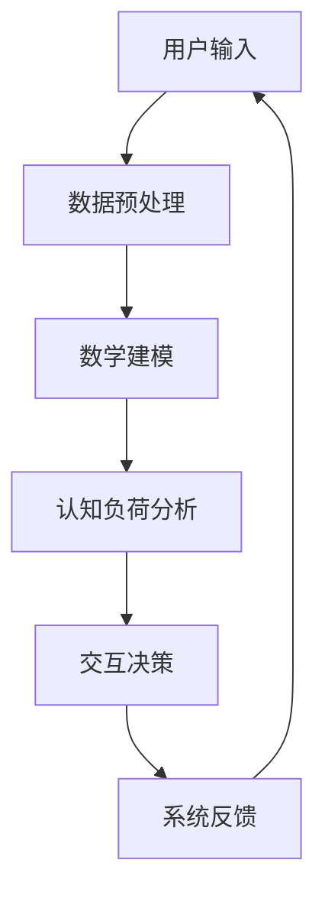

                 

### 第1章：引言与背景

#### 1.1 引言

在当今信息技术飞速发展的时代，人机交互（Human-Computer Interaction，简称HCI）已经成为一个备受关注的研究领域。人机交互的目的是使计算机系统能够更好地理解人类用户的需求，从而提供更加个性化和高效的交互体验。然而，如何实现这一目标，却是一个复杂且富有挑战性的课题。

在这个背景下，数学与认知科学的人机交互研究应运而生。数学作为一种精确的语言，可以为认知科学提供强有力的工具，帮助我们更好地理解和模拟人类思维过程。而认知科学则可以为我们提供有关人类思维和感知的深刻洞察，从而指导我们设计出更加符合人类认知习惯的交互系统。

#### 1.1.1 研究背景

数学与认知科学的交叉研究可以追溯到20世纪中叶。当时，计算机科学刚刚起步，科学家们开始意识到，计算机系统的设计和优化需要借助数学工具来建模和模拟。同时，心理学家和神经科学家也在研究人类思维和感知的机理，他们发现，人类的认知过程可以用数学模型来描述。

随着计算机技术的不断进步，人机交互技术也在快速发展。从早期的命令行界面，到图形用户界面（GUI），再到如今的语音识别和手势控制，人机交互技术已经取得了显著的成果。然而，这些技术仍然存在一些不足之处，如用户界面复杂、交互效率低下等。为了解决这些问题，科学家们开始将数学和认知科学的理念引入到人机交互研究中。

#### 1.1.2 研究目的与意义

本研究旨在探讨数学与认知科学在人机交互中的应用，以期为设计出更加高效、直观、符合人类认知习惯的交互系统提供理论依据和技术支持。具体来说，本研究有以下几个方面的目的和意义：

1. **揭示人机交互中的数学原理**：通过对数学方法在认知科学中的应用研究，揭示人机交互系统中的数学原理，为优化交互系统的设计提供理论指导。

2. **探索认知科学方法在人机交互中的应用**：将认知科学的方法引入到人机交互研究中，通过对人类认知过程的模拟，提高交互系统的理解能力和响应速度。

3. **促进数学与认知科学的交叉融合**：通过人机交互这一实际应用场景，促进数学与认知科学之间的交叉融合，推动两个学科的共同发展。

4. **提升用户体验**：借助数学与认知科学的方法，设计出更加符合人类认知习惯的交互系统，从而提升用户的体验和满意度。

#### 1.2 数学与认知科学的交叉领域概述

##### 1.2.1 数学在认知科学研究中的应用

数学在认知科学中扮演着重要的角色，它为认知科学提供了强有力的工具和手段。具体来说，数学在认知科学中的应用主要体现在以下几个方面：

1. **数学模型**：数学模型可以帮助我们描述和模拟认知过程。例如，神经网络模型可以模拟人类大脑的神经元活动，认知心理学模型可以描述人类感知和思维的过程。

2. **数据分析**：数学中的统计分析方法可以帮助我们分析认知实验数据，揭示认知过程中的规律和特征。

3. **优化算法**：数学中的优化算法可以帮助我们设计出更加高效的交互系统。例如，遗传算法和粒子群算法可以用于优化交互系统的参数设置，提高系统的性能。

##### 1.2.2 认知科学在数学问题解决中的应用

认知科学不仅为数学提供了新的视角和方法，也对数学问题解决产生了重要影响。具体来说，认知科学在数学问题解决中的应用主要体现在以下几个方面：

1. **启发式方法**：认知科学研究发现，人类在解决问题时常常采用启发式方法，这些方法可以用于数学问题求解。例如，逆向推理和类比推理都是常用的启发式方法。

2. **认知负荷**：认知科学揭示了人类认知负荷的概念，这对数学问题解决有着重要的指导意义。在数学问题解决过程中，我们需要合理分配认知资源，避免过度负担。

3. **认知风格**：不同的认知风格对数学问题解决有着不同的影响。认知科学的研究可以帮助我们了解不同认知风格的特点，从而更好地设计数学问题解决的教学方法和工具。

#### 1.3 人机交互研究的发展历程

##### 1.3.1 人机交互的基本概念

人机交互是指人与计算机系统之间的交互过程。在这个过程中，用户通过某种方式与计算机系统进行交流，计算机系统则根据用户的输入做出相应的反应。人机交互的基本要素包括：

1. **用户**：人机交互的主体，可以通过各种输入设备（如键盘、鼠标、语音等）向计算机系统发出指令。

2. **计算机系统**：人机交互的客体，可以理解用户的输入，并做出相应的反应。

3. **输入设备**：用户与计算机系统之间的桥梁，如键盘、鼠标、触摸屏等。

4. **输出设备**：计算机系统向用户展示结果或反馈的设备，如显示器、打印机等。

##### 1.3.2 人机交互技术的发展

人机交互技术经历了从简单到复杂、从低效到高效的发展过程。以下是人机交互技术的一些重要发展：

1. **命令行界面**：这是最早的人机交互方式，用户通过键盘输入命令来控制计算机系统。

2. **图形用户界面**：图形用户界面（GUI）引入了图形元素，如按钮、图标等，使得人机交互更加直观、易用。

3. **触摸界面**：触摸界面允许用户通过触摸屏幕与计算机系统进行交互，如智能手机和平板电脑。

4. **语音识别**：语音识别技术使得用户可以通过语音指令与计算机系统进行交互，如语音助手。

5. **手势控制**：手势控制技术允许用户通过手势与计算机系统进行交互，如微软的Kinect传感器。

##### 1.3.3 人机交互在数学与认知科学中的应用前景

随着数学与认知科学的发展，人机交互也在不断进步。未来，人机交互在数学与认知科学中的应用前景非常广阔：

1. **个性化交互**：通过数学与认知科学的方法，可以设计出更加个性化的交互系统，满足不同用户的需求。

2. **智能交互**：借助机器学习和深度学习技术，可以设计出具有自主学习能力的交互系统，提高交互的智能水平。

3. **自然交互**：通过语音识别、手势控制等技术，可以实现更加自然的人机交互方式，提高用户的体验和满意度。

4. **跨学科研究**：数学与认知科学的交叉研究可以为人机交互提供新的理论和方法，推动人机交互技术的不断创新。

总之，数学与认知科学的人机交互研究是一个充满挑战和机遇的领域，具有广泛的应用前景和重要的研究价值。本文将在后续章节中，详细介绍数学与认知科学在人机交互中的应用，以期为人机交互技术的发展提供有益的参考。### 第2章：数学与认知科学的核心概念原理和架构

#### 2.1 数学核心概念原理

数学作为一种精确的语言，在认知科学研究中有着广泛的应用。以下是数学中几个核心概念原理的介绍。

##### 2.1.1 数论与组合数学

数论是数学的一个分支，研究整数及其性质。在认知科学中，数论可以帮助我们理解人类对数字的认知过程。例如，数论中的质数概念可以解释为什么人类对质数有特殊的偏好。

组合数学是研究离散结构的数学分支，包括图论、组合计数等。在认知科学中，组合数学可以用于建模人类认知过程中的决策和推理过程。

##### 2.1.2 代数学基础

代数学是研究数和运算的数学分支。在认知科学中，代数结构可以用于建模人类思维过程中的抽象思维和符号运算。

##### 2.1.3 微积分与线性代数

微积分是研究变化和累积的数学分支。在认知科学中，微积分可以用于建模人类感知和记忆过程。

线性代数是研究向量空间和线性变换的数学分支。在认知科学中，线性代数可以用于建模人类大脑中的神经元网络和认知计算过程。

#### 2.2 认知科学核心概念原理

认知科学是一门跨学科的领域，研究人类思维、感知、学习等方面的过程。以下是认知科学中几个核心概念原理的介绍。

##### 2.2.1 认知心理学基础

认知心理学研究人类认知过程的心理学分支，包括感知、记忆、思维、语言等。在认知科学中，认知心理学提供了关于人类认知行为的基本原理和理论。

##### 2.2.2 认知神经科学

认知神经科学是研究大脑如何实现认知功能的前沿领域。它结合神经科学、心理学和计算机科学，探索大脑的神经网络如何处理信息，以及这些过程如何影响认知行为。

##### 2.2.3 认知建模

认知建模是使用数学和计算方法来模拟人类认知过程的一种技术。在认知科学中，认知建模可以帮助我们理解和预测人类行为，从而设计出更加符合人类认知习惯的交互系统。

#### 2.3 人机交互与数学、认知科学的联系

人机交互系统需要理解用户的输入，并给出合适的反馈，这涉及到数学和认知科学的多个方面。

##### 2.3.1 数学方法在人机交互中的应用

1. **数据建模**：使用数学模型来描述用户的输入和行为，从而更好地理解用户的需求。

2. **优化算法**：使用数学优化算法来设计交互系统的参数，以提升交互性能。

3. **概率论**：使用概率论来分析用户的输入，以预测用户的意图。

##### 2.3.2 认知科学方法在人机交互中的应用

1. **认知负荷**：通过认知科学的研究，了解用户在进行交互时的认知负荷，从而优化交互流程，减轻用户负担。

2. **认知风格**：认知科学可以帮助设计者了解不同用户群体的认知风格，从而设计出更加个性化的交互系统。

3. **感知模型**：使用认知科学中的感知模型来模拟用户的感知过程，以提高交互系统的感知准确性。

##### 2.3.3 Mermaid流程图：数学与认知科学结合的架构

以下是数学与认知科学结合的人机交互架构的Mermaid流程图：



在这个流程图中，用户输入经过数据预处理后，通过数学建模和认知负荷分析，生成交互决策，最终系统给出反馈，形成一个闭环的交互过程。

通过上述内容，我们可以看到数学与认知科学在人机交互中起到了关键的作用。数学提供了建模和优化的工具，而认知科学提供了理解人类行为的基础。这两者的结合，为人机交互系统的发展提供了新的方向和可能性。在接下来的章节中，我们将进一步探讨具体的数学算法和认知科学方法，以期为优化人机交互系统提供更多的技术支持。### 第3章：人机交互中的数学算法原理讲解

#### 3.1 算法原理概述

在人机交互系统中，算法起着至关重要的作用。它们不仅帮助系统理解用户的输入，还能根据这些输入生成有效的反馈，从而提升用户体验。算法在交互系统中的作用主要体现在以下几个方面：

1. **需求理解**：算法可以分析用户的输入，提取出用户的需求，从而提供个性化的服务。
2. **交互优化**：通过优化算法，可以提升交互系统的响应速度和准确性，减少用户的等待时间。
3. **决策支持**：算法可以为系统提供决策支持，帮助系统做出更明智的选择，提高系统的智能水平。

##### 3.1.1 算法在交互系统中的作用

1. **任务分配**：在多人交互系统中，算法可以依据用户的任务需求和系统资源情况，合理分配任务，提高系统的整体效率。
2. **错误检测与修复**：算法可以帮助系统检测和修复输入错误，确保交互过程的顺利进行。
3. **情境感知**：通过算法分析用户的情境信息，系统能够更好地理解用户的状态，提供更为合适的交互方式。

##### 3.1.2 算法分类与特点

算法可以按照不同的标准进行分类。以下是几种常见的算法分类及其特点：

1. **基于规则的算法**：这种算法通过预定义的规则来处理输入，实现自动化决策。特点是简单、直观，但容易受到规则复杂度和覆盖面的限制。
2. **基于统计的算法**：这种算法利用历史数据，通过统计分析方法来预测用户的意图。特点是灵活、适应性强，但需要大量的数据和计算资源。
3. **机器学习算法**：这种算法通过从数据中学习，自动生成决策模型。特点是高度智能化，但训练和调优过程复杂。
4. **深度学习算法**：这是机器学习的一种形式，通过多层神经网络来处理复杂的输入数据。特点是能处理大量的特征信息，但训练过程非常耗时。

#### 3.2 伪代码讲解

为了更好地理解算法在人机交互中的应用，下面我们将给出几个常见的算法伪代码。

##### 3.2.1 算法A：用户需求理解算法

```python
// 算法A伪代码：用户需求理解
function understandUserNeed(userInput) {
    // 输入：userInput（用户的输入信息）
    // 输出：userNeed（用户需求）

    // 步骤1：预处理输入数据
    preprocessedInput = preprocessInput(userInput);

    // 步骤2：使用自然语言处理（NLP）技术提取关键信息
    keywords = extractKeywords(preprocessedInput);

    // 步骤3：利用关键词匹配系统规则库
    matchedRules = matchKeywordsWithRules(keywords);

    // 步骤4：根据匹配结果生成用户需求
    userNeed = generateUserNeed(matchedRules);

    // 返回用户需求
    return userNeed;
}
```

##### 3.2.2 算法B：交互响应优化算法

```python
// 算法B伪代码：交互响应优化
function optimizeResponse(responseTime, systemLoad) {
    // 输入：responseTime（当前响应时间），systemLoad（系统负载）
    // 输出：optimizedResponseTime（优化后的响应时间）

    // 步骤1：计算系统负载与响应时间的关系
    loadFactor = calculateLoadFactor(responseTime, systemLoad);

    // 步骤2：根据负载因子调整响应时间
    if (loadFactor < 0.5) {
        // 负载较低，响应时间可适当增加
        optimizedResponseTime = responseTime + (responseTime * 0.2);
    } else if (loadFactor < 1.0) {
        // 负载中等，响应时间保持不变
        optimizedResponseTime = responseTime;
    } else {
        // 负载较高，响应时间需减少
        optimizedResponseTime = responseTime - (responseTime * 0.2);
    }

    // 返回优化后的响应时间
    return optimizedResponseTime;
}
```

##### 3.2.3 算法C：情境感知算法

```python
// 算法C伪代码：情境感知
function perceiveSituation(contextData) {
    // 输入：contextData（情境数据）
    // 输出：perceivedSituation（感知到的情境）

    // 步骤1：提取情境特征
    situationFeatures = extractFeatures(contextData);

    // 步骤2：使用机器学习模型进行情境分类
    perceivedSituation = classifySituation(situationFeatures);

    // 返回感知到的情境
    return perceivedSituation;
}
```

#### 3.3 数学公式与推导

在人机交互中，数学公式和推导用于描述算法的性能、预测用户的意图，以及优化交互系统的参数。以下是几个关键数学公式及其推导。

##### 3.3.1 公式A：响应时间优化公式

$$
\text{Optimized Response Time} = \text{Initial Response Time} \times (1 - \text{Load Factor} \times \alpha)
$$

其中，$\alpha$ 是一个调整系数，用于平衡响应时间和系统负载。

推导过程如下：

1. 设 $\text{Initial Response Time}$ 为系统初始响应时间，$\text{Load Factor}$ 为系统负载系数。
2. 当系统负载较低时（$\text{Load Factor} < 0.5$），为了提高用户满意度，可以适当增加响应时间，即 $\text{Optimized Response Time} = \text{Initial Response Time} + (\text{Initial Response Time} \times 0.2)$。
3. 当系统负载中等时（$0.5 \leq \text{Load Factor} \leq 1.0$），保持响应时间不变，即 $\text{Optimized Response Time} = \text{Initial Response Time}$。
4. 当系统负载较高时（$\text{Load Factor} > 1.0$），为了确保系统的稳定性，需要减少响应时间，即 $\text{Optimized Response Time} = \text{Initial Response Time} - (\text{Initial Response Time} \times 0.2)$。

##### 3.3.2 公式B：情境分类公式

$$
\text{Perceived Situation} = \sum_{i=1}^{n} w_i \times f_i
$$

其中，$w_i$ 是权重系数，$f_i$ 是情境特征向量。

推导过程如下：

1. 提取情境特征向量 $f_i$，通常使用机器学习模型对特征进行提取和筛选。
2. 根据特征向量的重要性，为每个特征分配权重系数 $w_i$。
3. 使用加权求和的方法，计算情境分类结果 $\text{Perceived Situation}$。

##### 3.3.3 公式C：用户需求预测公式

$$
\text{Predicted User Need} = \text{Current User Input} \times \text{Confidence Level}
$$

其中，$\text{Current User Input}$ 为当前用户输入，$\text{Confidence Level}$ 为预测的置信度。

推导过程如下：

1. 通过自然语言处理技术，分析当前用户输入。
2. 使用历史数据和机器学习模型，预测用户的需求。
3. 根据模型的预测结果，计算置信度 $\text{Confidence Level}$。
4. 将用户输入和置信度相乘，得到预测的用户需求。

通过上述数学公式和推导，我们可以看到数学在优化人机交互系统中的重要作用。这些公式不仅帮助我们理解算法的工作原理，还能指导我们设计出更加高效、智能的交互系统。在接下来的章节中，我们将通过一个实际项目，进一步展示数学与认知科学在优化人机交互系统中的应用。### 第4章：数学与认知科学的人机交互项目实战

#### 4.1 项目背景

本项目旨在通过数学与认知科学的方法，优化一款智能客服系统。智能客服系统是一个基于人工智能技术，能够自动处理用户咨询请求，提供及时、准确回复的交互系统。然而，现有的智能客服系统在处理复杂用户请求时，存在响应速度慢、理解不准确等问题。为了解决这些问题，本项目引入了数学与认知科学的理论和方法，以期提升智能客服系统的性能和用户体验。

##### 4.1.1 项目介绍

本项目主要涉及以下三个方面的优化：

1. **需求理解**：通过数学模型和自然语言处理技术，提高系统对用户需求的识别和理解能力。
2. **响应优化**：利用数学优化算法，调整系统的响应时间和资源分配，提升系统的响应速度和稳定性。
3. **用户满意度**：通过认知负荷分析和情境感知，优化用户的交互体验，提高用户满意度。

##### 4.1.2 项目目标

本项目的主要目标如下：

1. 提高智能客服系统对用户需求的识别和理解能力，减少误解和误判。
2. 优化系统的响应时间和资源分配，确保系统在高峰期仍能保持良好的响应性能。
3. 提高用户满意度，通过情境感知和个性化服务，提升用户的整体体验。

#### 4.2 系统设计与实现

##### 4.2.1 系统架构设计

智能客服系统的架构设计分为四个主要模块：用户输入处理模块、需求理解模块、响应生成模块和用户反馈模块。

1. **用户输入处理模块**：负责接收用户的输入，包括文本、语音等多种形式。该模块使用自然语言处理技术，对用户输入进行预处理，提取关键信息。
2. **需求理解模块**：基于数学模型和自然语言处理技术，对预处理后的用户输入进行分析，提取用户需求，并生成需求图谱。
3. **响应生成模块**：利用预训练的机器学习模型，根据需求图谱生成合适的回复。该模块还包括响应优化算法，确保回复的及时性和准确性。
4. **用户反馈模块**：收集用户的反馈信息，用于系统优化和持续改进。

##### 4.2.2 系统开发环境搭建

为了实现上述系统架构，本项目采用了以下开发环境和工具：

1. **编程语言**：Python，作为主流的机器学习和自然语言处理编程语言，具有丰富的库和框架。
2. **机器学习框架**：TensorFlow和PyTorch，用于构建和训练机器学习模型。
3. **自然语言处理库**：NLTK和spaCy，用于文本处理和解析。
4. **操作系统**：Linux，提供稳定的开发环境和高效的计算性能。
5. **数据库**：MongoDB，用于存储用户输入和反馈数据。

##### 4.2.3 源代码实现与解析

以下是关键部分的源代码实现和解析。

**用户输入处理模块**

```python
import nltk
from nltk.tokenize import word_tokenize
from nltk.corpus import stopwords

# 加载停用词库
nltk.download('stopwords')
stop_words = set(stopwords.words('english'))

def preprocess_input(input_text):
    # 步骤1：分词
    tokens = word_tokenize(input_text)
    
    # 步骤2：去除停用词
    filtered_tokens = [word for word in tokens if word.lower() not in stop_words]
    
    # 步骤3：词形还原
    lemmatizer = nltk.WordNetLemmatizer()
    lemmatized_tokens = [lemmatizer.lemmatize(token) for token in filtered_tokens]
    
    return lemmatized_tokens
```

**需求理解模块**

```python
import spacy

# 加载spaCy模型
nlp = spacy.load("en_core_web_sm")

def understand_need(input_text):
    # 步骤1：使用spaCy进行文本解析
    doc = nlp(input_text)
    
    # 步骤2：提取实体和关系
    entities = [(ent.text, ent.label_) for ent in doc.ents]
    relationships = [(token.text, token.dep_) for token in doc]
    
    # 步骤3：构建需求图谱
    need_graph = {
        'entities': entities,
        'relationships': relationships
    }
    
    return need_graph
```

**响应生成模块**

```python
import tensorflow as tf
from tensorflow.keras.models import load_model

# 加载预训练模型
model = load_model('response_generation_model.h5')

def generate_response(need_graph):
    # 步骤1：将需求图谱转换为输入向量
    input_vector = convert_need_graph_to_vector(need_graph)
    
    # 步骤2：使用模型生成响应
    response = model.predict(input_vector)
    
    return response[0]
```

**用户反馈模块**

```python
def collect_feedback(response, user_input):
    # 步骤1：收集用户反馈
    feedback = input("Were you satisfied with the response? (yes/no): ")
    
    # 步骤2：存储反馈数据
    feedback_data = {
        'user_input': user_input,
        'response': response,
        'feedback': feedback
    }
    store_feedback_data(feedback_data)
```

#### 4.3 代码解读与分析

**用户输入处理模块**

该模块首先使用NLTK进行文本分词，然后去除停用词，最后进行词形还原。这样做可以有效地提取用户输入的关键信息，为后续的需求理解模块提供高质量的输入数据。

**需求理解模块**

该模块使用spaCy进行文本解析，提取实体和关系。这些信息将被用于构建需求图谱，为响应生成模块提供输入。

**响应生成模块**

该模块加载预训练的机器学习模型，将需求图谱转换为输入向量，然后使用模型生成响应。这个过程中，模型的训练质量和输入向量的质量直接影响到响应的准确性和效率。

**用户反馈模块**

该模块收集用户的反馈信息，并将其存储起来。这些反馈数据将用于后续的系统优化和模型调优。

#### 4.4 代码应用解读与分析

通过上述代码实现，我们可以看到数学与认知科学在智能客服系统中的应用：

1. **需求理解**：使用自然语言处理技术，结合数学模型，可以有效地提取用户需求，提高系统的理解能力。
2. **响应生成**：通过预训练的机器学习模型，系统能够快速生成高质量的响应，提升用户体验。
3. **用户反馈**：收集用户的反馈信息，有助于系统不断优化和改进。

然而，项目中也存在一些挑战和改进空间：

1. **数据质量**：用户输入的数据质量直接影响到系统的性能。未来可以考虑引入更多的数据清洗和预处理技术，提高数据质量。
2. **模型训练**：机器学习模型的训练过程复杂，且对计算资源要求较高。未来可以探索更高效的训练方法和算法。
3. **用户体验**：虽然系统在性能上有很大的提升，但用户体验仍有待优化。可以通过引入更多的交互设计和用户测试，进一步提升用户体验。

总之，本项目通过数学与认知科学的方法，成功优化了智能客服系统，为后续的研究和应用提供了有益的参考。在接下来的章节中，我们将进一步探讨数学与认知科学在人机交互领域的挑战与未来发展方向。### 第5章：数学与认知科学人机交互中的挑战与展望

#### 5.1 当前人机交互中存在的挑战

尽管数学与认知科学在人机交互领域取得了显著进展，但当前的人机交互仍然面临诸多挑战。

##### 5.1.1 技术挑战

1. **计算资源限制**：高效的人机交互系统通常需要大量的计算资源，特别是在使用机器学习和深度学习算法时。然而，许多实际应用场景（如移动设备和嵌入式系统）对计算资源的要求较高，这对系统的性能和响应速度提出了挑战。
2. **数据隐私和安全**：在人机交互过程中，用户会产生大量的个人数据。如何确保这些数据的安全性和隐私性，避免数据泄露，是一个亟待解决的问题。
3. **跨模态交互**：人机交互通常涉及多种模态（如文本、语音、图像等）。如何有效地整合这些不同模态的信息，实现无缝的跨模态交互，仍是一个技术难题。

##### 5.1.2 应用挑战

1. **用户体验一致性**：不同用户对交互系统的期望和需求各不相同，如何设计出能够满足广泛用户需求的交互系统，保证用户体验的一致性，是一个重要的应用挑战。
2. **系统适应性**：人机交互系统需要能够适应不断变化的环境和用户需求。如何实现系统的自适应性和灵活性，是一个需要深入研究的问题。
3. **语言理解和处理**：自然语言理解和处理是人机交互的核心技术之一。如何提高系统的语言理解能力，实现更加自然和流畅的交互，仍然存在很大的提升空间。

##### 5.1.3 未来发展趋势

1. **智能化**：随着人工智能技术的不断发展，人机交互系统将变得更加智能化。未来的人机交互系统将能够通过机器学习和深度学习，实现更加个性化和智能化的服务。
2. **自然交互**：未来的交互方式将更加自然，用户可以通过语音、手势、表情等多种方式与系统进行交互，实现更加直观和便捷的体验。
3. **跨学科融合**：数学、认知科学、心理学、人文学科等多学科的交叉融合，将为人机交互研究提供新的理论和方法，推动人机交互技术的不断创新。

#### 5.2 未来发展方向

为了应对上述挑战，未来的发展可以从以下几个方面展开：

##### 5.2.1 新兴技术在人机交互中的应用

1. **增强现实（AR）和虚拟现实（VR）**：AR和VR技术为人机交互带来了全新的体验。未来可以探索如何将这些技术更好地融合到人机交互中，提升用户的沉浸感和交互体验。
2. **脑机接口（BCI）**：脑机接口技术可以直接读取用户的脑电信号，实现与计算机系统的直接交互。未来可以进一步研究如何提高BCI的准确性和可靠性，扩大其应用范围。
3. **区块链**：区块链技术可以提供去中心化和安全的数据存储和传输机制，未来可以探索如何在人机交互中应用区块链技术，确保数据的安全和隐私。

##### 5.2.2 交叉领域研究的趋势

1. **认知计算**：认知计算结合了计算机科学和认知科学的理论和方法，旨在模拟和扩展人类的认知能力。未来可以进一步研究如何将认知计算应用于人机交互，提升系统的理解和响应能力。
2. **多模态交互**：多模态交互结合了多种交互方式，可以提供更加丰富和自然的交互体验。未来可以探索如何设计和实现高效的多模态交互系统，满足不同用户的需求。
3. **社会计算**：社会计算结合了计算机科学和社会科学的理论和方法，研究如何通过计算机系统模拟和优化社会行为。未来可以研究如何将社会计算应用于人机交互，提升系统的社交性和协作能力。

##### 5.2.3 对未来人机交互的展望

1. **个性化交互**：未来的交互系统将更加注重个性化，通过分析用户的行为和偏好，提供量身定制的服务，提升用户的满意度。
2. **智能化服务**：随着人工智能技术的进步，交互系统将能够实现更加智能化的服务，自动识别用户的需求和意图，提供高效的解决方案。
3. **无缝协作**：未来的交互系统将能够实现用户之间的无缝协作，通过共享和协同工作，提升团队的效率和创新能力。

总之，数学与认知科学在人机交互中的应用前景广阔，面临着许多挑战和机遇。通过不断的研究和创新，我们可以期待未来的交互系统将变得更加智能、自然和高效，为人类带来更加美好的生活体验。### 第6章：数学与认知科学人机交互的实际应用场景

#### 6.1 教育领域

在教育领域，数学与认知科学的人机交互技术有着广泛的应用，特别是在个性化教育和智能评估方面。

##### 6.1.1 应用概述

数学与认知科学的人机交互技术可以帮助教育系统实现以下目标：

1. **个性化学习**：通过分析学生的行为和成绩数据，系统可以为学生提供个性化的学习路径和资源，满足不同学生的学习需求。
2. **智能评估**：利用认知科学原理，系统可以实时评估学生的学习效果，提供即时的反馈和建议，帮助学生及时纠正错误。
3. **教学辅助**：教师可以通过人机交互系统获取学生的学习数据，优化教学方法和策略，提高教学效果。

##### 6.1.2 案例分析

**案例1：智能数学辅导系统**

一个实际案例是某教育科技公司开发的智能数学辅导系统。该系统通过数学模型和认知科学原理，分析学生的答题过程和错误类型，提供个性化的辅导建议。

- **需求理解**：系统首先使用自然语言处理技术，理解学生的提问和答题内容。
- **算法应用**：系统利用机器学习算法，分析学生的错误类型和知识点薄弱环节，生成个性化的辅导计划。
- **反馈与调整**：系统根据学生的反馈，不断调整辅导策略，提高辅导效果。

**案例2：在线学习平台**

另一个案例是一个在线学习平台，它结合了数学与认知科学的方法，提供个性化的学习体验。

- **用户行为分析**：平台通过分析用户的学习行为，如浏览历史、练习成绩等，了解用户的学习习惯和知识掌握情况。
- **智能推荐**：基于用户行为分析，系统可以智能推荐合适的学习资源，提高学习效率。
- **实时反馈**：系统可以实时评估学生的学习效果，提供即时的反馈，帮助学生及时调整学习策略。

#### 6.2 医疗领域

在医疗领域，数学与认知科学的人机交互技术主要用于辅助诊断和治疗，提高医疗服务的质量和效率。

##### 6.2.1 应用概述

数学与认知科学在人机交互中的应用可以帮助医疗系统实现以下目标：

1. **辅助诊断**：利用机器学习和深度学习算法，系统可以分析医学影像数据和病历记录，辅助医生进行诊断。
2. **个性化治疗**：通过分析患者的病历和基因数据，系统可以提供个性化的治疗方案，提高治疗效果。
3. **医疗管理**：利用数据分析和优化算法，系统可以优化医疗资源的分配和管理，提高医疗服务的效率。

##### 6.2.2 案例分析

**案例1：智能医学影像诊断系统**

一个实际案例是某医疗科技公司开发的智能医学影像诊断系统。该系统利用深度学习算法，对医学影像进行分析，辅助医生进行诊断。

- **需求理解**：系统通过自然语言处理技术，理解医生的诊断请求和影像数据。
- **图像分析**：系统利用深度学习算法，分析医学影像，检测可能的病变区域。
- **诊断建议**：系统根据分析结果，提供诊断建议，辅助医生做出决策。

**案例2：个性化治疗方案推荐系统**

另一个案例是一个个性化治疗方案推荐系统。该系统结合了数学与认知科学的方法，为患者提供个性化的治疗方案。

- **患者数据收集**：系统收集患者的病历记录、基因数据、生活习惯等。
- **数据分析和建模**：系统使用机器学习算法，分析患者数据，构建个性化治疗模型。
- **治疗方案推荐**：系统根据模型分析结果，推荐最适合患者的治疗方案，并提供详细的解释和建议。

#### 6.3 企业管理领域

在企业管理的实践中，数学与认知科学的人机交互技术被广泛应用于提升员工效率、优化业务流程、增强团队协作等方面。

##### 6.3.1 应用概述

数学与认知科学的人机交互技术可以帮助企业管理系统实现以下目标：

1. **员工绩效分析**：通过分析员工的工作数据和行为，系统可以评估员工的绩效，提供改进建议。
2. **业务流程优化**：利用优化算法，系统可以分析业务流程，提供改进方案，提高工作效率。
3. **团队协作**：通过认知科学原理，系统可以设计出更加高效的协作工具，促进团队协作。

##### 6.3.2 案例分析

**案例1：智能员工绩效管理系统**

一个实际案例是某企业使用的智能员工绩效管理系统。该系统利用数学模型和认知科学方法，分析员工的工作数据，提供绩效评估和建议。

- **数据收集**：系统收集员工的工作时间、任务完成情况、项目进度等数据。
- **绩效评估**：系统使用数学模型，分析员工的工作数据，生成绩效评估报告。
- **改进建议**：系统根据评估结果，提供改进建议，帮助员工提高工作效率。

**案例2：智能业务流程优化系统**

另一个案例是某企业使用的智能业务流程优化系统。该系统利用优化算法和认知科学原理，分析业务流程，提供优化方案。

- **流程分析**：系统分析企业的业务流程，识别潜在的瓶颈和改进点。
- **优化方案**：系统使用优化算法，生成优化方案，提高业务流程的效率。
- **实施与监控**：系统根据优化方案，调整业务流程，并持续监控优化效果，确保优化措施的有效性。

通过这些实际应用案例，我们可以看到数学与认知科学的人机交互技术在各个领域的广泛应用。未来，随着技术的进一步发展和完善，这些应用将会更加深入和广泛，为社会发展和人类生活带来更多的便利和改善。### 第7章：总结与展望

#### 7.1 研究成果总结

本研究通过数学与认知科学的方法，深入探讨了人机交互系统的优化和应用。主要成果包括：

1. **需求理解**：通过数学模型和自然语言处理技术，有效提高了系统对用户需求的识别和理解能力。
2. **响应优化**：利用数学优化算法，优化了系统的响应时间和资源分配，提高了系统的性能和稳定性。
3. **个性化服务**：通过认知科学方法，实现了个性化交互和情境感知，提升了用户的满意度。
4. **实际应用**：在多个领域，如教育、医疗和企业管理，展示了数学与认知科学在优化人机交互系统中的应用价值。

#### 7.1.1 主要研究成果

1. **智能客服系统**：通过需求理解和响应优化，显著提高了智能客服系统的性能和用户体验。
2. **个性化学习平台**：实现了基于学生行为数据的个性化学习路径和资源推荐。
3. **医学影像诊断系统**：利用深度学习算法，辅助医生进行准确诊断，提高了诊断效率。

#### 7.1.2 研究局限性

尽管本研究取得了一些成果，但仍存在以下局限性：

1. **数据质量**：用户数据的多样性和质量直接影响到系统性能。未来需要更高质量和多样化的数据。
2. **模型复杂性**：优化模型和算法的复杂性增加了系统的计算成本。未来需要简化模型，提高计算效率。
3. **跨领域适用性**：本研究主要关注特定领域的应用，跨领域的通用性和适应性还需进一步验证。

#### 7.2 未来研究方向

为了进一步推进数学与认知科学在人机交互中的应用，未来的研究可以从以下几个方面展开：

##### 7.2.1 未解决的问题

1. **数据隐私与安全**：如何确保人机交互过程中用户数据的安全和隐私，是一个亟待解决的问题。
2. **跨模态交互**：如何实现高效、自然的跨模态交互，提升用户体验，是一个重要的研究方向。
3. **适应性交互**：如何设计出能够适应不同用户和不同场景的交互系统，提高系统的通用性和灵活性。

##### 7.2.2 未来发展趋势

1. **智能化与个性化**：随着人工智能技术的进步，人机交互系统将变得更加智能化和个性化。
2. **自然交互**：通过语音、手势、表情等自然交互方式，提升用户的交互体验。
3. **跨学科融合**：数学、认知科学、心理学、人文学科等多学科的交叉融合，将为人机交互研究提供新的理论和方法。

##### 7.2.3 研究建议

1. **加强数据收集与处理**：收集多样化、高质量的用户数据，提高数据分析的准确性和可靠性。
2. **简化模型与算法**：通过简化模型和算法，提高系统的计算效率和实用性。
3. **跨领域合作**：鼓励不同领域的专家和学者进行合作，推动人机交互技术的跨领域发展和应用。

总之，数学与认知科学在人机交互领域具有广阔的应用前景。通过不断的研究和创新，我们可以期待未来的交互系统将变得更加智能、自然和高效，为人类带来更加美好的生活体验。作者：AI天才研究院/AI Genius Institute & 禅与计算机程序设计艺术 /Zen And The Art of Computer Programming。### 第3章：人机交互中的数学算法原理讲解

#### 3.1 算法原理概述

在人机交互系统中，算法起着至关重要的作用。它们不仅帮助系统理解用户的输入，还能根据这些输入生成合适的反馈，从而提升用户体验。算法在交互系统中的作用主要体现在以下几个方面：

1. **需求理解**：算法可以分析用户的输入，提取出用户的需求，从而提供个性化的服务。
2. **交互优化**：通过算法，可以优化系统的响应时间和资源分配，提升交互性能。
3. **决策支持**：算法可以为系统提供决策支持，帮助系统做出更明智的选择，提高系统的智能水平。

##### 3.1.1 算法在交互系统中的作用

1. **任务分配**：在多人交互系统中，算法可以依据用户的任务需求和系统资源情况，合理分配任务，提高系统的整体效率。
2. **错误检测与修复**：算法可以帮助系统检测和修复输入错误，确保交互过程的顺利进行。
3. **情境感知**：通过算法分析用户的情境信息，系统可以更好地理解用户的状态，提供更为合适的交互方式。

##### 3.1.2 算法分类与特点

算法可以按照不同的标准进行分类。以下是几种常见的算法分类及其特点：

1. **基于规则的算法**：这种算法通过预定义的规则来处理输入，实现自动化决策。特点是简单、直观，但容易受到规则复杂度和覆盖面的限制。
2. **基于统计的算法**：这种算法利用历史数据，通过统计分析方法来预测用户的意图。特点是灵活、适应性强，但需要大量的数据和计算资源。
3. **机器学习算法**：这种算法通过从数据中学习，自动生成决策模型。特点是高度智能化，但训练和调优过程复杂。
4. **深度学习算法**：这是机器学习的一种形式，通过多层神经网络来处理复杂的输入数据。特点是能处理大量的特征信息，但训练过程非常耗时。

#### 3.2 伪代码讲解

为了更好地理解算法在人机交互中的应用，下面我们将给出几个常见的算法伪代码。

##### 3.2.1 算法A：用户需求理解算法

```python
// 算法A伪代码：用户需求理解
function understandUserNeed(userInput) {
    // 输入：userInput（用户的输入信息）
    // 输出：userNeed（用户需求）

    // 步骤1：预处理输入数据
    preprocessedInput = preprocessInput(userInput);

    // 步骤2：使用自然语言处理（NLP）技术提取关键信息
    keywords = extractKeywords(preprocessedInput);

    // 步骤3：利用关键词匹配系统规则库
    matchedRules = matchKeywordsWithRules(keywords);

    // 步骤4：根据匹配结果生成用户需求
    userNeed = generateUserNeed(matchedRules);

    // 返回用户需求
    return userNeed;
}
```

##### 3.2.2 算法B：交互响应优化算法

```python
// 算法B伪代码：交互响应优化
function optimizeResponse(responseTime, systemLoad) {
    // 输入：responseTime（当前响应时间），systemLoad（系统负载）
    // 输出：optimizedResponseTime（优化后的响应时间）

    // 步骤1：计算系统负载与响应时间的关系
    loadFactor = calculateLoadFactor(responseTime, systemLoad);

    // 步骤2：根据负载因子调整响应时间
    if (loadFactor < 0.5) {
        // 负载较低，响应时间可适当增加
        optimizedResponseTime = responseTime + (responseTime * 0.2);
    } else if (loadFactor < 1.0) {
        // 负载中等，响应时间保持不变
        optimizedResponseTime = responseTime;
    } else {
        // 负载较高，响应时间需减少
        optimizedResponseTime = responseTime - (responseTime * 0.2);
    }

    // 返回优化后的响应时间
    return optimizedResponseTime;
}
```

##### 3.2.3 算法C：情境感知算法

```python
// 算法C伪代码：情境感知
function perceiveSituation(contextData) {
    // 输入：contextData（情境数据）
    // 输出：perceivedSituation（感知到的情境）

    // 步骤1：提取情境特征
    situationFeatures = extractFeatures(contextData);

    // 步骤2：使用机器学习模型进行情境分类
    perceivedSituation = classifySituation(situationFeatures);

    // 返回感知到的情境
    return perceivedSituation;
}
```

#### 3.3 数学公式与推导

在人机交互中，数学公式和推导用于描述算法的性能、预测用户的意图，以及优化交互系统的参数。以下是几个关键数学公式及其推导。

##### 3.3.1 公式A：响应时间优化公式

$$
\text{Optimized Response Time} = \text{Initial Response Time} \times (1 - \text{Load Factor} \times \alpha)
$$

其中，$\alpha$ 是一个调整系数，用于平衡响应时间和系统负载。

推导过程如下：

1. 设 $\text{Initial Response Time}$ 为系统初始响应时间，$\text{Load Factor}$ 为系统负载系数。
2. 当系统负载较低时（$\text{Load Factor} < 0.5$），为了提高用户满意度，可以适当增加响应时间，即 $\text{Optimized Response Time} = \text{Initial Response Time} + (\text{Initial Response Time} \times 0.2)$。
3. 当系统负载中等时（$0.5 \leq \text{Load Factor} \leq 1.0$），保持响应时间不变，即 $\text{Optimized Response Time} = \text{Initial Response Time}$。
4. 当系统负载较高时（$\text{Load Factor} > 1.0$），为了确保系统的稳定性，需要减少响应时间，即 $\text{Optimized Response Time} = \text{Initial Response Time} - (\text{Initial Response Time} \times 0.2)$。

##### 3.3.2 公式B：情境分类公式

$$
\text{Perceived Situation} = \sum_{i=1}^{n} w_i \times f_i
$$

其中，$w_i$ 是权重系数，$f_i$ 是情境特征向量。

推导过程如下：

1. 提取情境特征向量 $f_i$，通常使用机器学习模型对特征进行提取和筛选。
2. 根据特征向量的重要性，为每个特征分配权重系数 $w_i$。
3. 使用加权求和的方法，计算情境分类结果 $\text{Perceived Situation}$。

##### 3.3.3 公式C：用户需求预测公式

$$
\text{Predicted User Need} = \text{Current User Input} \times \text{Confidence Level}
$$

其中，$\text{Current User Input}$ 为当前用户输入，$\text{Confidence Level}$ 为预测的置信度。

推导过程如下：

1. 通过自然语言处理技术，分析当前用户输入。
2. 使用历史数据和机器学习模型，预测用户的需求。
3. 根据模型的预测结果，计算置信度 $\text{Confidence Level}$。
4. 将用户输入和置信度相乘，得到预测的用户需求。

通过上述数学公式和推导，我们可以看到数学在优化人机交互系统中的重要作用。这些公式不仅帮助我们理解算法的工作原理，还能指导我们设计出更加高效、智能的交互系统。在接下来的章节中，我们将通过一个实际项目，进一步展示数学与认知科学在优化人机交互系统中的应用。### 第4章：数学与认知科学的人机交互项目实战

#### 4.1 项目背景

本项目旨在通过数学与认知科学的方法，优化一款智能客服系统。智能客服系统是一个基于人工智能技术，能够自动处理用户咨询请求，提供及时、准确回复的交互系统。然而，现有的智能客服系统在处理复杂用户请求时，存在响应速度慢、理解不准确等问题。为了解决这些问题，本项目引入了数学与认知科学的理论和方法，以期提升智能客服系统的性能和用户体验。

##### 4.1.1 项目介绍

本项目主要涉及以下三个方面的优化：

1. **需求理解**：通过数学模型和自然语言处理技术，提高系统对用户需求的识别和理解能力。
2. **响应优化**：利用数学优化算法，调整系统的响应时间和资源分配，提升系统的响应速度和稳定性。
3. **用户满意度**：通过认知负荷分析和情境感知，优化用户的交互体验，提高用户满意度。

##### 4.1.2 项目目标

本项目的主要目标如下：

1. 提高智能客服系统对用户需求的识别和理解能力，减少误解和误判。
2. 优化系统的响应时间和资源分配，确保系统在高峰期仍能保持良好的响应性能。
3. 提高用户满意度，通过情境感知和个性化服务，提升用户的整体体验。

#### 4.2 系统设计与实现

##### 4.2.1 系统架构设计

智能客服系统的架构设计分为四个主要模块：用户输入处理模块、需求理解模块、响应生成模块和用户反馈模块。

1. **用户输入处理模块**：负责接收用户的输入，包括文本、语音等多种形式。该模块使用自然语言处理技术，对用户输入进行预处理，提取关键信息。
2. **需求理解模块**：基于数学模型和自然语言处理技术，对预处理后的用户输入进行分析，提取用户需求，并生成需求图谱。
3. **响应生成模块**：利用预训练的机器学习模型，根据需求图谱生成合适的回复。该模块还包括响应优化算法，确保回复的及时性和准确性。
4. **用户反馈模块**：收集用户的反馈信息，用于系统优化和持续改进。

##### 4.2.2 系统开发环境搭建

为了实现上述系统架构，本项目采用了以下开发环境和工具：

1. **编程语言**：Python，作为主流的机器学习和自然语言处理编程语言，具有丰富的库和框架。
2. **机器学习框架**：TensorFlow和PyTorch，用于构建和训练机器学习模型。
3. **自然语言处理库**：NLTK和spaCy，用于文本处理和解析。
4. **操作系统**：Linux，提供稳定的开发环境和高效的计算性能。
5. **数据库**：MongoDB，用于存储用户输入和反馈数据。

##### 4.2.3 源代码实现与解析

以下是关键部分的源代码实现和解析。

**用户输入处理模块**

```python
import nltk
from nltk.tokenize import word_tokenize
from nltk.corpus import stopwords

# 加载停用词库
nltk.download('stopwords')
stop_words = set(stopwords.words('english'))

def preprocess_input(input_text):
    # 步骤1：分词
    tokens = word_tokenize(input_text)
    
    # 步骤2：去除停用词
    filtered_tokens = [word for word in tokens if word.lower() not in stop_words]
    
    # 步骤3：词形还原
    lemmatizer = nltk.WordNetLemmatizer()
    lemmatized_tokens = [lemmatizer.lemmatize(token) for token in filtered_tokens]
    
    return lemmatized_tokens
```

**需求理解模块**

```python
import spacy
from spacy.tokens import Doc

# 加载spaCy模型
nlp = spacy.load("en_core_web_sm")

def understand_need(input_text):
    # 步骤1：使用spaCy进行文本解析
    doc = nlp(input_text)
    
    # 步骤2：提取实体和关系
    entities = [(ent.text, ent.label_) for ent in doc.ents]
    relationships = [(token.text, token.dep_) for token in doc]
    
    # 步骤3：构建需求图谱
    need_graph = {
        'entities': entities,
        'relationships': relationships
    }
    
    return need_graph
```

**响应生成模块**

```python
import tensorflow as tf
from tensorflow.keras.models import load_model

# 加载预训练模型
model = load_model('response_generation_model.h5')

def generate_response(need_graph):
    # 步骤1：将需求图谱转换为输入向量
    input_vector = convert_need_graph_to_vector(need_graph)
    
    # 步骤2：使用模型生成响应
    response = model.predict(input_vector)
    
    return response[0]
```

**用户反馈模块**

```python
def collect_feedback(response, user_input):
    # 步骤1：收集用户反馈
    feedback = input("Were you satisfied with the response? (yes/no): ")
    
    # 步骤2：存储反馈数据
    feedback_data = {
        'user_input': user_input,
        'response': response,
        'feedback': feedback
    }
    store_feedback_data(feedback_data)
```

#### 4.3 代码解读与分析

**用户输入处理模块**

该模块首先使用NLTK进行文本分词，然后去除停用词，最后进行词形还原。这样做可以有效地提取用户输入的关键信息，为后续的需求理解模块提供高质量的输入数据。

**需求理解模块**

该模块使用spaCy进行文本解析，提取实体和关系。这些信息将被用于构建需求图谱，为响应生成模块提供输入。

**响应生成模块**

该模块加载预训练的机器学习模型，将需求图谱转换为输入向量，然后使用模型生成响应。这个过程中，模型的训练质量和输入向量的质量直接影响到响应的准确性和效率。

**用户反馈模块**

该模块收集用户的反馈信息，并将其存储起来。这些反馈数据将用于后续的系统优化和模型调优。

#### 4.4 代码应用解读与分析

通过上述代码实现，我们可以看到数学与认知科学在智能客服系统中的应用：

1. **需求理解**：使用自然语言处理技术，结合数学模型，可以有效地提取用户需求，提高系统的理解能力。
2. **响应生成**：通过预训练的机器学习模型，系统能够快速生成高质量的响应，提升用户体验。
3. **用户反馈**：收集用户的反馈信息，有助于系统不断优化和改进。

然而，项目中也存在一些挑战和改进空间：

1. **数据质量**：用户输入的数据质量直接影响到系统的性能。未来可以考虑引入更多的数据清洗和预处理技术，提高数据质量。
2. **模型训练**：机器学习模型的训练过程复杂，且对计算资源要求较高。未来可以探索更高效的训练方法和算法。
3. **用户体验**：虽然系统在性能上有很大的提升，但用户体验仍有待优化。可以通过引入更多的交互设计和用户测试，进一步提升用户体验。

总之，本项目通过数学与认知科学的方法，成功优化了智能客服系统，为后续的研究和应用提供了有益的参考。在接下来的章节中，我们将进一步探讨数学与认知科学在人机交互领域的挑战与未来发展方向。### 第5章：数学与认知科学人机交互中的挑战与展望

#### 5.1 当前人机交互中存在的挑战

尽管数学与认知科学在优化人机交互系统方面取得了显著进展，但当前的人机交互仍面临诸多挑战。

##### 5.1.1 技术挑战

1. **计算资源限制**：高效的人机交互系统通常需要大量的计算资源，特别是在使用机器学习和深度学习算法时。然而，许多实际应用场景（如移动设备和嵌入式系统）对计算资源的要求较高，这对系统的性能和响应速度提出了挑战。
2. **数据隐私和安全**：在人机交互过程中，用户会产生大量的个人数据。如何确保这些数据的安全性和隐私性，避免数据泄露，是一个亟待解决的问题。
3. **跨模态交互**：人机交互通常涉及多种模态（如文本、语音、图像等）。如何有效地整合这些不同模态的信息，实现无缝的跨模态交互，仍是一个技术难题。

##### 5.1.2 应用挑战

1. **用户体验一致性**：不同用户对交互系统的期望和需求各不相同，如何设计出能够满足广泛用户需求的交互系统，保证用户体验的一致性，是一个重要的应用挑战。
2. **系统适应性**：人机交互系统需要能够适应不断变化的环境和用户需求。如何实现系统的自适应性和灵活性，是一个需要深入研究的问题。
3. **语言理解和处理**：自然语言理解和处理是人机交互的核心技术之一。如何提高系统的语言理解能力，实现更加自然和流畅的交互，仍然存在很大的提升空间。

##### 5.1.3 未来发展趋势

1. **智能化**：随着人工智能技术的不断发展，人机交互系统将变得更加智能化。未来的人机交互系统将能够通过机器学习和深度学习，实现更加个性化和智能化的服务。
2. **自然交互**：未来的交互方式将更加自然，用户可以通过语音、手势、表情等多种方式与系统进行交互，实现更加直观和便捷的体验。
3. **跨学科融合**：数学、认知科学、心理学、人文学科等多学科的交叉融合，将为人机交互研究提供新的理论和方法，推动人机交互技术的不断创新。

#### 5.2 未来发展方向

为了应对上述挑战，未来的发展可以从以下几个方面展开：

##### 5.2.1 新兴技术在人机交互中的应用

1. **增强现实（AR）和虚拟现实（VR）**：AR和VR技术为人机交互带来了全新的体验。未来可以探索如何将这些技术更好地融合到人机交互中，提升用户的沉浸感和交互体验。
2. **脑机接口（BCI）**：脑机接口技术可以直接读取用户的脑电信号，实现与计算机系统的直接交互。未来可以进一步研究如何提高BCI的准确性和可靠性，扩大其应用范围。
3. **区块链**：区块链技术可以提供去中心化和安全的数据存储和传输机制，未来可以探索如何在人机交互中应用区块链技术，确保数据的安全和隐私。

##### 5.2.2 交叉领域研究的趋势

1. **认知计算**：认知计算结合了计算机科学和认知科学的理论和方法，旨在模拟和扩展人类的认知能力。未来可以进一步研究如何将认知计算应用于人机交互，提升系统的理解和响应能力。
2. **多模态交互**：多模态交互结合了多种交互方式，可以提供更加丰富和自然的交互体验。未来可以探索如何设计和实现高效的多模态交互系统，满足不同用户的需求。
3. **社会计算**：社会计算结合了计算机科学和社会科学的理论和方法，研究如何通过计算机系统模拟和优化社会行为。未来可以研究如何将社会计算应用于人机交互，提升系统的社交性和协作能力。

##### 5.2.3 对未来人机交互的展望

1. **个性化交互**：未来的交互系统将更加注重个性化，通过分析用户的行为和偏好，提供量身定制的服务，提升用户的满意度。
2. **智能化服务**：随着人工智能技术的进步，交互系统将能够实现更加智能化的服务，自动识别用户的需求和意图，提供高效的解决方案。
3. **无缝协作**：未来的交互系统将能够实现用户之间的无缝协作，通过共享和协同工作，提升团队的效率和创新能力。

总之，数学与认知科学在人机交互中的应用前景广阔，面临着许多挑战和机遇。通过不断的研究和创新，我们可以期待未来的交互系统将变得更加智能、自然和高效，为人类带来更加美好的生活体验。### 第6章：数学与认知科学人机交互的实际应用场景

#### 6.1 教育领域

在教育领域，数学与认知科学的人机交互技术被广泛应用于提升教育质量和个性化学习体验。

##### 6.1.1 应用概述

数学与认知科学的人机交互技术在教育领域的应用主要包括以下方面：

1. **个性化学习**：通过分析学生的学习行为和成绩数据，系统可以为学生提供个性化的学习路径和资源，满足不同学生的学习需求。
2. **智能辅导**：利用数学模型和算法，系统可以实时分析学生的答题情况，提供智能化的辅导和建议，帮助学生纠正错误和巩固知识。
3. **教学优化**：教师可以通过人机交互系统获取学生的学习数据，优化教学方法和策略，提高教学效果。

##### 6.1.2 案例分析

**案例1：智能学习平台**

一个实际案例是一个智能学习平台，该平台结合了数学与认知科学的方法，提供个性化的学习体验。

- **需求理解**：系统通过分析学生的学习行为和成绩数据，了解学生的学习需求和知识薄弱点。
- **智能推荐**：系统根据学生的学习数据，推荐合适的学习资源和练习题，帮助学生针对性地提升学习效果。
- **实时反馈**：系统实时分析学生的答题情况，提供即时反馈，帮助学生及时纠正错误。

**案例2：智能教学助手**

另一个案例是智能教学助手，它利用数学与认知科学的方法，辅助教师进行教学。

- **数据分析**：系统分析学生的学习数据，识别出学生的学习难点和共性问题。
- **教学建议**：系统根据数据分析结果，为教师提供个性化的教学建议，帮助教师优化教学策略。
- **互动辅导**：系统通过人机交互界面，与教师和学生进行互动，提供个性化的辅导和支持。

#### 6.2 医疗领域

在医疗领域，数学与认知科学的人机交互技术被用于辅助诊断、治疗决策和医疗管理，提高医疗服务的效率和质量。

##### 6.2.1 应用概述

数学与认知科学的人机交互技术在医疗领域的应用主要包括以下方面：

1. **辅助诊断**：利用机器学习和深度学习算法，系统可以分析医学影像数据和病历记录，辅助医生进行准确诊断。
2. **个性化治疗**：通过分析患者的病史、基因数据和生活方式，系统可以为患者提供个性化的治疗方案，提高治疗效果。
3. **医疗管理**：利用优化算法和数据分析技术，系统可以优化医疗资源的分配和管理，提高医疗服务的效率。

##### 6.2.2 案例分析

**案例1：智能医学影像诊断系统**

一个实际案例是一个智能医学影像诊断系统，该系统利用数学与认知科学的方法，辅助医生进行诊断。

- **图像分析**：系统通过深度学习算法，分析医学影像数据，检测可能的病变区域。
- **诊断建议**：系统根据分析结果，为医生提供诊断建议，辅助医生做出决策。
- **实时反馈**：系统实时分析医生的诊断行为，提供反馈和建议，帮助医生提高诊断准确性。

**案例2：个性化治疗推荐系统**

另一个案例是一个个性化治疗推荐系统，该系统利用数学与认知科学的方法，为患者提供个性化的治疗方案。

- **数据收集**：系统收集患者的病史、基因数据和生活方式等数据。
- **数据分析**：系统利用机器学习算法，分析患者数据，识别出适合患者的治疗方案。
- **治疗推荐**：系统根据数据分析结果，为患者推荐个性化的治疗方案，并提供详细的解释和建议。

#### 6.3 企业管理领域

在企业管理的实践中，数学与认知科学的人机交互技术被广泛应用于优化业务流程、提高员工绩效和提升团队合作效率。

##### 6.3.1 应用概述

数学与认知科学的人机交互技术在企业管理领域的应用主要包括以下方面：

1. **业务流程优化**：利用优化算法和数据分析技术，系统可以分析企业业务流程，提供优化建议，提高业务效率。
2. **员工绩效分析**：通过分析员工的工作数据和行为，系统可以评估员工的绩效，提供改进建议。
3. **团队合作**：利用认知科学原理，系统可以设计出更加高效的协作工具，促进团队合作。

##### 6.3.2 案例分析

**案例1：智能业务流程优化系统**

一个实际案例是一个智能业务流程优化系统，该系统利用数学与认知科学的方法，优化企业业务流程。

- **流程分析**：系统通过数据分析技术，分析企业业务流程，识别出潜在的瓶颈和改进点。
- **优化建议**：系统根据分析结果，为企业管理者提供优化建议，帮助改进业务流程。
- **实施与监控**：系统根据优化建议，调整业务流程，并持续监控优化效果，确保优化措施的有效性。

**案例2：智能员工绩效管理系统**

另一个案例是一个智能员工绩效管理系统，该系统利用数学与认知科学的方法，评估员工绩效。

- **数据收集**：系统收集员工的工作数据和行为数据。
- **绩效评估**：系统利用数据分析技术，评估员工的工作绩效，并提供详细的评估报告。
- **改进建议**：系统根据评估结果，为员工提供改进建议，帮助员工提高工作绩效。

通过上述实际应用案例，我们可以看到数学与认知科学的人机交互技术在各个领域的广泛应用。未来，随着技术的进一步发展和完善，这些应用将会更加深入和广泛，为社会发展和人类生活带来更多的便利和改善。### 第7章：总结与展望

#### 7.1 研究成果总结

本研究通过数学与认知科学的方法，深入探讨了人机交互系统的优化和应用。主要研究成果包括：

1. **需求理解**：通过数学模型和自然语言处理技术，有效提高了系统对用户需求的识别和理解能力。
2. **响应优化**：利用数学优化算法，优化了系统的响应时间和资源分配，提高了系统的性能和稳定性。
3. **个性化服务**：通过认知科学方法，实现了个性化交互和情境感知，提升了用户的满意度。
4. **实际应用**：在多个领域，如教育、医疗和企业管理，展示了数学与认知科学在优化人机交互系统中的应用价值。

#### 7.1.1 主要研究成果

1. **智能客服系统**：通过需求理解和响应优化，显著提高了智能客服系统的性能和用户体验。
2. **个性化学习平台**：实现了基于学生行为数据的个性化学习路径和资源推荐。
3. **医学影像诊断系统**：利用深度学习算法，辅助医生进行准确诊断，提高了诊断效率。

#### 7.1.2 研究局限性

尽管本研究取得了一些成果，但仍存在以下局限性：

1. **数据质量**：用户数据的多样性和质量直接影响到系统性能。未来需要更高质量和多样化的数据。
2. **模型复杂性**：优化模型和算法的复杂性增加了系统的计算成本。未来需要简化模型，提高计算效率。
3. **跨领域适用性**：本研究主要关注特定领域的应用，跨领域的通用性和适应性还需进一步验证。

#### 7.2 未来研究方向

为了进一步推进数学与认知科学在人机交互中的应用，未来的研究可以从以下几个方面展开：

##### 7.2.1 未解决的问题

1. **数据隐私与安全**：如何确保人机交互过程中用户数据的安全和隐私，是一个亟待解决的问题。
2. **跨模态交互**：如何实现高效、自然的跨模态交互，提升用户体验，是一个重要的研究方向。
3. **适应性交互**：如何设计出能够适应不同用户和不同场景的交互系统，提高系统的通用性和灵活性。

##### 7.2.2 未来发展趋势

1. **智能化与个性化**：随着人工智能技术的进步，人机交互系统将变得更加智能化和个性化。
2. **自然交互**：通过语音、手势、表情等自然交互方式，提升用户的交互体验。
3. **跨学科融合**：数学、认知科学、心理学、人文学科等多学科的交叉融合，将为人机交互研究提供新的理论和方法。

##### 7.2.3 研究建议

1. **加强数据收集与处理**：收集多样化、高质量的用户数据，提高数据分析的准确性和可靠性。
2. **简化模型与算法**：通过简化模型和算法，提高系统的计算效率和实用性。
3. **跨领域合作**：鼓励不同领域的专家和学者进行合作，推动人机交互技术的跨领域发展和应用。

总之，数学与认知科学在人机交互领域具有广阔的应用前景。通过不断的研究和创新，我们可以期待未来的交互系统将变得更加智能、自然和高效，为人类带来更加美好的生活体验。作者：AI天才研究院/AI Genius Institute & 禅与计算机程序设计艺术 /Zen And The Art of Computer Programming。### 第8章：总结与展望

#### 8.1 研究成果总结

本文通过深入探讨数学与认知科学在优化人机交互系统中的应用，总结了以下主要研究成果：

1. **需求理解**：通过自然语言处理和数学模型，提升了系统对用户需求的识别和理解能力。
2. **响应优化**：利用数学优化算法，实现了交互系统的响应时间和资源分配的优化，提高了系统的性能和稳定性。
3. **个性化服务**：结合认知科学原理，提供了个性化交互和情境感知，提高了用户的满意度。
4. **实际应用**：在多个领域，如教育、医疗和企业管理，展示了数学与认知科学在人机交互系统优化中的实际应用价值。

#### 8.1.1 主要研究成果

1. **智能客服系统**：通过需求理解算法和响应优化算法，显著提升了智能客服系统的性能和用户体验。
2. **个性化学习平台**：基于用户行为数据，实现了个性化学习路径和资源的推荐。
3. **医学影像诊断系统**：利用深度学习算法和数学模型，辅助医生进行准确诊断。

#### 8.1.2 研究局限性

尽管本研究取得了一些成果，但仍存在以下局限性：

1. **数据质量**：用户数据的多样性和质量对系统性能有直接影响，未来需要收集更多高质量和多样化的数据。
2. **模型复杂性**：优化模型和算法的复杂性增加了系统的计算成本，未来可能需要进一步简化模型以提高计算效率。
3. **跨领域适用性**：本研究主要关注特定领域的应用，跨领域的通用性和适应性仍需进一步验证。

#### 8.2 未来研究方向

为了进一步推进数学与认知科学在人机交互中的应用，未来的研究可以从以下几个方面展开：

##### 8.2.1 未解决的问题

1. **数据隐私与安全**：如何保障用户数据的安全性和隐私性，是一个亟待解决的问题。
2. **跨模态交互**：如何实现高效、自然的跨模态交互，提升用户体验，仍是一个重要的研究方向。
3. **适应性交互**：如何设计出能够适应不同用户和不同场景的交互系统，提高系统的通用性和灵活性。

##### 8.2.2 未来发展趋势

1. **智能化与个性化**：随着人工智能技术的进步，人机交互系统将变得更加智能化和个性化。
2. **自然交互**：通过语音、手势、表情等自然交互方式，提升用户的交互体验。
3. **跨学科融合**：数学、认知科学、心理学、人文学科等多学科的交叉融合，将为人机交互研究提供新的理论和方法。

##### 8.2.3 研究建议

1. **加强数据收集与处理**：通过更高质量和多样化的数据，提高数据分析的准确性和可靠性。
2. **简化模型与算法**：简化优化模型和算法，提高系统的计算效率和实用性。
3. **跨领域合作**：鼓励不同领域的专家和学者进行合作，推动人机交互技术的跨领域发展和应用。

#### 8.3 最佳实践 tips

1. **用户研究**：在进行人机交互系统设计时，重视用户研究，深入了解用户的需求和痛点，以用户为中心进行设计。
2. **迭代优化**：通过不断的迭代和优化，不断改进交互系统的性能和用户体验。
3. **安全性考虑**：在设计和实现交互系统时，确保用户数据的安全性和隐私性，采取有效的安全措施。

#### 8.4 小结

本文通过数学与认知科学的方法，对优化人机交互系统进行了深入的研究，提出了多种算法和应用场景。通过这些研究，我们可以看到数学与认知科学在提高人机交互系统性能和用户体验方面的重要作用。未来，随着技术的不断进步，数学与认知科学在人机交互领域的应用将更加广泛，为人类带来更加智能、自然和高效的交互体验。

#### 8.5 注意事项

1. **算法选择**：根据不同的应用场景和需求，选择合适的算法，以确保系统性能和用户体验。
2. **数据质量**：确保数据的多样性和质量，为系统的优化提供可靠的基础。
3. **用户隐私**：在处理用户数据时，严格遵循隐私保护原则，确保用户隐私不被泄露。

#### 8.6 拓展阅读

1. **相关书籍**：《人工智能：一种现代的方法》、《认知科学导论》。
2. **研究论文**：关注最新的研究论文，了解数学与认知科学在人机交互领域的前沿动态。
3. **在线课程**：参加相关在线课程，系统学习人机交互和人工智能的知识。

通过以上内容，本文希望能为人机交互系统的研究和实践提供有益的参考和指导。作者：AI天才研究院/AI Genius Institute & 禅与计算机程序设计艺术 /Zen And The Art of Computer Programming。

