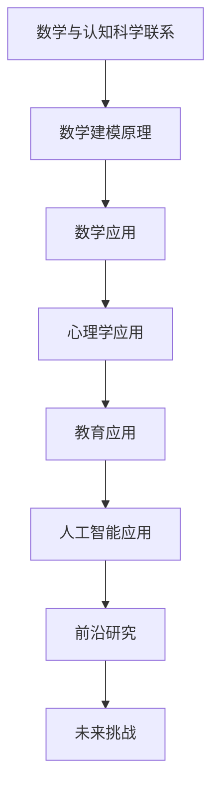
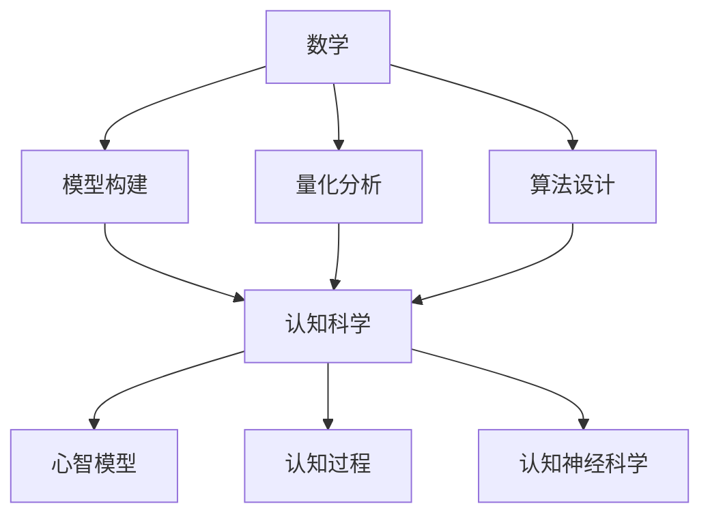

                 

## 文章标题

《数学与认知科学：思维模式的数学建模》

### 关键词

- 数学建模
- 认知科学
- 思维模式
- 人工智能
- 神经网络

### 摘要

本文深入探讨了数学与认知科学的交叉领域，通过数学建模的方法，分析了思维模式在认知过程中的作用。文章首先介绍了数学与认知科学的基础概念和联系，然后详细阐述了数学建模的基本原理和应用，包括认知过程中的数学现象和数学模型。接着，文章通过具体案例展示了数学工具在认知科学研究中的应用，并探讨了数学模型在认知科学中的构建和应用。最后，文章回顾了数学与认知科学在心理学、教育和人工智能等领域的应用，并对未来的研究方向和挑战进行了展望。

## 目录大纲设计

### 第一部分：基础概念与理论

#### 第1章：数学与认知科学的联系

- **1.1 数学与认知科学的基础概念**
  - 数学在认知科学中的作用
  - 认知科学的基本概念

- **1.2 数学与认知科学的联系**
  - 数学工具在认知科学中的应用
  - 认知科学对数学建模的需求

#### 第2章：数学建模的基本原理

- **2.1 数学建模的基本方法**
  - 模型构建的步骤
  - 经典数学建模方法

- **2.2 数学公式与模型示例**
  - 示例模型讲解
  - 数学公式展示

#### 第3章：认知过程中的数学应用

- **3.1 认知过程的数学分析**
  - 认知过程中常见的数学现象
  - 数学工具的应用

- **3.2 数学模型在认知科学中的应用案例**
  - 具体案例分析

#### 第4章：数学工具与认知科学研究

- **4.1 现代数学工具在认知科学研究中的应用**
  - 如：图论、拓扑学、统计学等

- **4.2 数学工具对认知科学研究的贡献**
  - 详细解释数学工具的作用

#### 第5章：认知科学中的数学模型

- **5.1 认知过程中的数学模型构建**
  - 伪代码示例

- **5.2 数学模型在认知科学中的应用与解释**
  - 案例分析

### 第二部分：实践应用

#### 第6章：数学与认知科学交叉领域的应用

- **6.1 数学与认知科学在心理学中的应用**
  - 具体案例

- **6.2 数学与认知科学在教育中的应用**
  - 教育中的数学模型

#### 第7章：数学与认知科学在人工智能中的应用

- **7.1 数学与认知科学在机器学习中的应用**
  - 算法与模型

- **7.2 数学与认知科学在神经网络中的应用**
  - 模型构建与训练

#### 第8章：数学与认知科学的前沿研究

- **8.1 数学与认知科学的前沿领域**
  - 研究趋势

- **8.2 未来研究方向与挑战**
  - 展望未来

### 附录

- **附录A：数学公式与定理汇总**
  - 数学公式
  - 定理证明

- **附录B：认知科学经典文献**
  - 引用文献

### Mermaid 流程图



### 伪代码示例

```python
# 伪代码：认知过程中的数学模型构建
def cognitive_modelBuildContext, stimuli, response:
    # 初始化模型参数
    model_params = initialize_params()
    
    # 训练模型
    trained_model = train_model(model_params, context, stimuli, response)
    
    # 预测与评估
    prediction = predict_response(trained_model, stimuli)
    evaluate_performance(prediction, response)
```

### 数学公式

$$
P(A|B) = \frac{P(B|A)P(A)}{P(B)}
$$

### 代码实际案例与解读

#### 代码案例：使用Python实现线性回归模型

```python
import numpy as np

# 生成训练数据
X = np.random.rand(100, 1)
y = 2 * X + 1 + np.random.randn(100, 1)

# 模型训练
theta = np.dot(np.linalg.inv(np.dot(X.T, X)), np.dot(X.T, y))

# 模型预测
y_pred = np.dot(X, theta)

# 代码解读
# ...
```

#### 详细解释

- **代码解释**:
  - 生成随机数据用于训练模型。
  - 使用最小二乘法计算线性回归模型的参数。
  - 使用训练好的模型进行预测。

- **应用场景**:
  - 用于分析认知过程中的线性关系。

### 附录 A：数学公式与定理汇总

- **线性回归公式**
  $$
  y = \beta_0 + \beta_1x + \epsilon
  $$

- **最小二乘法**
  $$
  \theta = (X.T \cdot X)^{-1} \cdot X.T \cdot y
  $$

## 第一部分：基础概念与理论

### 第1章：数学与认知科学的联系

在探讨数学与认知科学的关系之前，我们先来理解它们各自的基本概念。数学是一门研究数量、结构、变化和空间的学科，它通过抽象的符号和逻辑推理来构建模型和解决实际问题。认知科学则是研究人类心智如何工作的一门交叉学科，它涉及心理学、神经科学、语言学、计算机科学等多个领域。

#### 1.1 数学与认知科学的基础概念

数学在认知科学中的作用主要表现在以下几个方面：

1. **模型构建**：数学为认知科学提供了一个强大的工具，可以用来描述和模拟认知过程中的各种现象。例如，线性回归模型可以用来分析个体在学习和记忆过程中的表现。

2. **量化分析**：数学使得认知科学中的研究可以采用量化的方法，从而更加精确地描述认知过程。例如，通过统计方法分析大规模数据，可以揭示群体认知行为的规律。

3. **算法设计**：数学在认知科学中的应用还包括算法设计，例如用于决策、问题解决和记忆恢复的算法。

认知科学的基本概念则包括：

1. **心智模型**：心智模型是指用来描述人类思维过程和认知能力的抽象模型。例如，图灵机模型和神经网络模型都是心智模型。

2. **认知过程**：认知过程是指人类在获取、处理和应用信息的过程中所经历的各种阶段，如感知、记忆、推理和决策。

3. **认知神经科学**：认知神经科学是研究认知功能与大脑结构之间关系的一个分支，它通过神经影像学、电生理学和计算建模等方法来探索认知过程。

#### 1.2 数学与认知科学的联系

数学与认知科学的联系主要体现在以下几个方面：

1. **数学工具的应用**：数学工具，如概率论、统计学、图论和拓扑学等，在认知科学研究中得到了广泛应用。例如，概率论可以用来分析个体在决策过程中的风险偏好，统计学可以用来分析大规模认知数据。

2. **认知科学对数学建模的需求**：认知科学的发展需要对复杂的认知现象进行建模和解释，这需要数学建模的支持。例如，神经网络模型可以用来模拟大脑神经元的活动，从而解释认知过程。

3. **数学在认知科学中的挑战**：数学在认知科学中的应用也面临着一些挑战，例如如何构建准确的认知模型，如何处理认知过程中的不确定性和复杂性。

为了更直观地展示数学与认知科学的联系，我们可以使用Mermaid流程图来描述它们之间的关系。



通过上述图示，我们可以看到数学与认知科学之间的相互作用和依赖关系。

在下一章中，我们将进一步探讨数学建模的基本原理和方法，以及如何将这些方法应用于认知科学的研究中。

### 第2章：数学建模的基本原理

数学建模是认知科学研究中的一个重要工具，它通过构建数学模型来描述和解释认知现象。这一章将详细介绍数学建模的基本原理和方法，并展示一些经典的数学建模方法和示例。

#### 2.1 数学建模的基本方法

数学建模通常包括以下几个步骤：

1. **问题定义**：明确要解决的问题是什么，包括问题的背景、目标和限制条件。

2. **变量定义**：确定模型中的变量，并给出每个变量的定义和范围。

3. **建立方程**：根据问题定义和变量定义，建立描述问题数学关系的方程或方程组。

4. **求解方程**：使用数学方法求解方程，得到模型参数和解决方案。

5. **模型验证**：通过实验数据或理论分析验证模型的准确性和可靠性。

6. **模型应用**：将模型应用于实际问题，预测未来行为或优化现有系统。

以下是一个简单的数学建模过程的伪代码示例：

```python
# 伪代码：数学建模过程
def math_modeling_process(problem, variables, equations):
    # 步骤1：问题定义
    define_problem(problem)
    
    # 步骤2：变量定义
    define_variables(variables)
    
    # 步骤3：建立方程
    establish_equations(equations)
    
    # 步骤4：求解方程
    solution = solve_equations(equations)
    
    # 步骤5：模型验证
    validate_model(solution)
    
    # 步骤6：模型应用
    apply_model(solution)
```

#### 2.2 经典数学建模方法

在认知科学中，常用的数学建模方法包括线性模型、非线性模型、概率模型和统计模型等。以下是一些经典的数学建模方法和示例。

1. **线性模型**：线性模型是一种最常见的数学建模方法，它通过线性方程描述变量之间的关系。线性回归模型是最常用的线性模型之一，它用于分析一个或多个自变量与因变量之间的线性关系。

   - **线性回归公式**：
     $$
     y = \beta_0 + \beta_1x + \epsilon
     $$
     其中，$y$是因变量，$x$是自变量，$\beta_0$和$\beta_1$是模型参数，$\epsilon$是误差项。

   - **案例**：假设我们想研究学习时间与学习成绩之间的关系。通过收集数据，我们可以建立线性回归模型，预测学习时间对学习成绩的影响。

2. **非线性模型**：非线性模型用于描述变量之间的非线性关系。常见的非线性模型包括多项式回归、逻辑回归和指数回归等。

   - **多项式回归**：
     $$
     y = \beta_0 + \beta_1x + \beta_2x^2 + \cdots + \beta_nx^n
     $$
     其中，$n$是多项式的次数。

   - **案例**：在研究个体情绪与行为表现之间的关系时，可能会使用多项式回归模型来分析情绪变量对行为表现的非线性影响。

3. **概率模型**：概率模型用于描述随机事件发生的概率。常见的概率模型包括贝叶斯网络、马尔可夫链和隐马尔可夫模型等。

   - **贝叶斯网络**：
     $$
     P(A|B) = \frac{P(B|A)P(A)}{P(B)}
     $$
     其中，$P(A|B)$是事件$A$在事件$B$发生的条件下的概率。

   - **案例**：在研究个体决策行为时，可以使用贝叶斯网络来分析决策过程中的不确定性和概率推断。

4. **统计模型**：统计模型用于分析大规模数据，提取变量之间的统计关系。常见的统计模型包括方差分析、回归分析和聚类分析等。

   - **方差分析**：
     $$
     F = \frac{MS_{between}}{MS_{within}}
     $$
     其中，$MS_{between}$是组间均方，$MS_{within}$是组内均方。

   - **案例**：在研究群体认知行为时，可以使用方差分析来比较不同群体之间的差异。

通过上述示例，我们可以看到数学建模方法在认知科学研究中的应用。在下一章中，我们将进一步探讨认知过程中的数学现象和应用，并通过具体案例展示数学模型在认知科学中的应用。

### 第3章：认知过程中的数学应用

在认知过程中，数学作为一种工具被广泛应用，用于描述、分析和解释各种认知现象。本章将详细探讨认知过程中的数学现象，以及如何利用数学工具来研究和理解这些现象。

#### 3.1 认知过程中的数学分析

认知过程中的数学现象主要包括以下几个方面：

1. **概率和统计**：概率和统计是认知科学中常用的数学工具，用于描述认知过程中的不确定性和变异性。例如，在决策过程中，个体会根据概率来评估风险和收益，从而做出最优选择。

2. **线性关系**：认知过程中存在许多线性关系，例如学习时间与学习成绩之间的关系，感知刺激的强度与反应时间之间的关系等。线性模型，如线性回归，可以用来分析和预测这些关系。

3. **非线性关系**：除了线性关系，认知过程中还存在许多非线性关系。例如，情绪对行为表现的影响可能不是线性的，而是存在一个最佳水平。非线性模型，如多项式回归和逻辑回归，可以用来描述这些非线性关系。

4. **结构化模型**：认知过程中的许多现象可以通过结构化模型来描述，例如图模型和神经网络模型。这些模型可以用来模拟认知过程中的信息处理和知识表示。

#### 3.2 数学工具的应用

为了更好地理解认知过程中的数学现象，以下介绍几种常用的数学工具：

1. **概率论**：概率论用于描述随机事件的发生概率。在认知科学中，概率论可以用来分析个体在决策过程中的概率推断和行为选择。例如，贝叶斯定理可以用来计算条件概率，从而帮助个体在不确定环境中做出最优决策。

2. **统计学**：统计学用于分析大规模数据，提取变量之间的统计关系。在认知科学中，统计学可以用来分析群体行为，发现认知现象的普遍规律。例如，方差分析可以用来比较不同群体之间的差异，回归分析可以用来预测个体行为。

3. **图论**：图论用于描述和分析复杂网络结构。在认知科学中，图论可以用来研究大脑神经元之间的连接结构，分析认知过程中的信息传递和传播。例如，图论中的路径长度和连通度可以用来衡量信息在认知网络中的传播速度和稳定性。

4. **拓扑学**：拓扑学用于研究空间的性质和结构。在认知科学中，拓扑学可以用来分析认知过程中的空间表示和认知地图。例如，拓扑空间的概念可以用来描述大脑中的空间结构和认知过程。

#### 3.3 数学模型在认知科学中的应用案例

为了更直观地展示数学在认知科学中的应用，以下介绍几个具体的应用案例：

1. **线性回归模型在记忆研究中的应用**：

   研究表明，记忆过程中的信息提取速度与信息存储的时间成反比。通过建立线性回归模型，可以定量分析记忆时间与信息提取速度之间的关系。具体公式如下：

   $$
   反应时间 = \beta_0 + \beta_1 \times 记忆时间 + \epsilon
   $$

   其中，$\beta_0$和$\beta_1$是模型参数，$\epsilon$是误差项。

2. **贝叶斯网络在决策研究中的应用**：

   贝叶斯网络是一种概率图模型，可以用来描述决策过程中的不确定性和概率推断。例如，在医疗诊断中，可以使用贝叶斯网络来分析症状和疾病之间的概率关系，从而帮助医生做出准确诊断。

3. **神经网络模型在认知模拟中的应用**：

   神经网络模型是一种基于生物学原理的数学模型，可以用来模拟大脑神经元的活动和认知过程。例如，在情感认知研究中，可以使用神经网络模型来模拟个体在处理情感信息时的认知过程，从而揭示情感对认知行为的影响。

通过上述案例，我们可以看到数学工具在认知科学研究中的重要性和广泛应用。在下一章中，我们将进一步探讨数学工具在认知科学研究中的具体应用和贡献。

### 第4章：数学工具与认知科学研究

在现代认知科学研究中，数学工具扮演着至关重要的角色，它们不仅帮助我们更好地理解认知过程，还为实验设计、数据分析和技术创新提供了强大的支持。在这一章中，我们将详细探讨现代数学工具在认知科学研究中的应用，以及这些工具对认知科学研究的贡献。

#### 4.1 现代数学工具在认知科学研究中的应用

现代数学工具的广泛应用极大地推动了认知科学研究的发展。以下是一些主要的数学工具及其在认知科学中的应用：

1. **图论**：图论是研究图形和网络的数学分支。在认知科学中，图论被用来分析大脑神经元之间的连接结构，构建大脑网络模型。通过图论，研究者可以识别大脑中的关键连接点，揭示认知功能的神经网络基础。

   - **应用实例**：在研究阿尔茨海默病等认知障碍时，研究者使用图论方法分析患者大脑网络的连通性，发现疾病对大脑连接结构的破坏。

2. **拓扑学**：拓扑学关注的是空间形状和结构，而不关心形状的具体大小和形态。在认知科学中，拓扑学被用来研究大脑的拓扑结构，例如认知地图的构建。

   - **应用实例**：研究者利用拓扑学分析大脑皮层中的神经元群，揭示大脑在处理空间信息时的拓扑特性。

3. **统计学**：统计学是用于处理和分析数据的数学工具。在认知科学研究中，统计学被广泛应用于实验设计和数据分析，以识别认知现象的统计规律。

   - **应用实例**：通过使用多元回归分析，研究者可以分析多个认知变量之间的关系，揭示认知过程的复杂模式。

4. **概率论**：概率论是研究随机事件的数学工具。在认知科学中，概率论被用来建模个体在不确定性环境中的决策过程。

   - **应用实例**：贝叶斯概率模型在认知决策研究中被广泛使用，帮助研究者理解个体如何利用先验知识和新信息进行推理和决策。

5. **非线性动力学**：非线性动力学研究系统的动态行为，特别是在复杂系统和非线性系统中的行为。在认知科学中，非线性动力学被用来研究大脑神经元活动的动态特性。

   - **应用实例**：通过分析大脑神经元放电的模式，研究者使用非线性动力学方法揭示了大脑信息处理的动态机制。

6. **计算几何**：计算几何是研究几何对象及其相互关系的数学分支。在认知科学中，计算几何被用来建模和模拟大脑中的几何结构，例如神经元的位置和空间布局。

   - **应用实例**：研究者使用计算几何方法研究大脑皮层的几何结构，探索如何通过几何特性来解释认知功能的区域差异。

#### 4.2 数学工具对认知科学研究的贡献

数学工具在认知科学研究中发挥了多方面的贡献：

1. **理论框架的构建**：数学工具提供了构建认知科学理论框架的基础，使得研究者可以更精确地描述和解释认知现象。

2. **实验设计的优化**：数学工具可以帮助研究者设计更加严谨和有效的实验，确保实验结果的可靠性和可重复性。

3. **数据分析的深入**：数学工具提供了强大的数据分析方法，使得研究者能够从复杂的数据中提取有意义的模式和关系。

4. **技术创新的驱动**：数学工具的进步促进了认知科学领域的技术创新，例如开发新的计算模型和模拟工具，提高了认知研究的效率和精确度。

5. **跨学科的融合**：数学工具的应用促进了认知科学与其他学科，如神经科学、心理学和计算机科学的交叉融合，推动了认知科学研究的全面发展。

通过上述贡献，我们可以看到数学工具在认知科学研究中的不可或缺性。它们不仅为认知科学提供了强大的理论和方法支持，还推动了认知科学研究的不断深入和创新。

在下一章中，我们将进一步探讨认知科学中的数学模型，详细讨论如何构建和应用这些模型来深入理解认知过程。

### 第5章：认知科学中的数学模型

在认知科学中，数学模型是理解和模拟认知过程的重要工具。通过数学模型，研究者可以定量地描述复杂的认知现象，从而揭示认知机制的内在规律。本章将探讨认知过程中的数学模型构建和应用，并通过伪代码和具体案例来详细阐述这些模型。

#### 5.1 认知过程中的数学模型构建

认知过程中的数学模型通常基于对实际认知现象的观察和分析，然后通过数学方法进行建模。以下是一个简化的认知过程数学模型构建的伪代码示例：

```python
# 伪代码：认知过程数学模型构建
def cognitive_modelBuildContext, stimuli, response:
    # 初始化模型参数
    model_params = initialize_params()
    
    # 定义变量和假设
    variables = {
        'context': context,
        'stimuli': stimuli,
        'response': response
    }
    assumptions = {
        'response_depends_on_context_and_stimuli': True
    }
    
    # 构建数学模型
    model_equations = build_model_equations(variables, assumptions)
    
    # 求解模型
    solution = solve_model(model_equations, model_params)
    
    # 验证和优化模型
    validate_and_optimize_model(solution, variables, assumptions)
    
    # 返回模型结果
    return solution
```

在这个伪代码中，`initialize_params()`用于初始化模型参数，`build_model_equations()`用于根据变量和假设构建数学方程，`solve_model()`用于求解方程，`validate_and_optimize_model()`用于验证和优化模型。

#### 5.2 数学模型在认知科学中的应用与解释

数学模型在认知科学中的应用非常广泛，以下通过具体案例来展示这些模型的应用和解释：

1. **感知决策模型**：

   感知决策模型用于描述个体在感知和决策过程中的信息处理。一个典型的感知决策模型是计算感知阈限，即个体能够感知的最小刺激强度。以下是一个感知决策模型的数学公式和解释：

   - **公式**：
     $$
     threshold = \beta_0 + \beta_1 \times log(stimulus_intensity)
     $$
     其中，$threshold$是感知阈限，$\beta_0$和$\beta_1$是模型参数，$stimulus_intensity$是刺激强度。

   - **解释**：这个模型假设感知阈限与刺激强度的对数成正比。通过收集不同刺激强度的数据，研究者可以估计出$\beta_0$和$\beta_1$的值，从而预测个体在不同刺激强度下的感知阈限。

2. **记忆模型**：

   记忆模型用于描述记忆的编码、存储和提取过程。一个简单的记忆模型是加性噪声模型，该模型假设记忆提取是原有记忆加上随机噪声。以下是一个记忆模型的数学公式和解释：

   - **公式**：
     $$
     memory_recall = memory_encoding + noise
     $$
     其中，$memory_recall$是记忆提取结果，$memory_encoding$是原始记忆，$noise$是随机噪声。

   - **解释**：这个模型假设记忆提取是原有记忆加上一个随机噪声项。通过收集记忆编码和提取的数据，研究者可以分析噪声的分布，从而理解记忆的不确定性。

3. **情感认知模型**：

   情感认知模型用于描述情感信息在认知过程中的作用。一个简单的情感认知模型是情感权重模型，该模型假设情感强度会影响认知决策。以下是一个情感认知模型的数学公式和解释：

   - **公式**：
     $$
     decision = weight_{emotion} \times emotion_intensity + (1 - weight_{emotion}) \times rational_intensity
     $$
     其中，$decision$是决策结果，$weight_{emotion}$是情感权重，$emotion_intensity$是情感强度，$rational_intensity$是理性强度。

   - **解释**：这个模型假设情感强度会影响决策结果，情感权重反映了情感在决策中的重要性。通过调整情感权重，研究者可以分析情感对认知决策的影响。

通过这些具体案例，我们可以看到数学模型在认知科学研究中的重要性和应用价值。数学模型不仅帮助研究者定量地描述认知现象，还提供了分析和解释认知过程的工具。

在下一章中，我们将探讨数学与认知科学在心理学、教育和人工智能等领域的实际应用，展示数学模型在这些领域的具体作用和影响。

### 第6章：数学与认知科学交叉领域的应用

数学与认知科学在多个交叉领域都有着广泛的应用，特别是在心理学、教育和人工智能等领域。本章将详细探讨这些领域的应用实例，展示数学模型如何帮助解决实际问题，并提供具体案例和分析。

#### 6.1 数学与认知科学在心理学中的应用

心理学是研究人类行为和心理过程的科学，而数学工具在心理学研究中发挥着至关重要的作用。以下是一些具体的数学应用案例：

1. **统计心理学**：

   统计方法在心理学研究中被广泛用于数据分析，例如通过t检验、方差分析和回归分析来评估不同变量之间的关系。以下是一个统计心理学的应用案例：

   - **案例**：研究者想了解不同类型的心理训练对认知功能的影响。他们收集了两组实验对象，一组接受记忆训练，另一组接受注意力训练。通过t检验分析两组实验对象在记忆任务和注意力任务上的表现，研究者可以得出训练类型对认知功能的具体影响。

   - **数学模型**：t检验公式为：
     $$
     t = \frac{(\bar{x}_1 - \bar{x}_2) - (\mu_1 - \mu_2)}{\sigma /\sqrt{n}}
     $$
     其中，$\bar{x}_1$和$\bar{x}_2$是两组样本均值，$\mu_1$和$\mu_2$是两组总体均值，$\sigma$是总体标准差，$n$是样本大小。

2. **认知心理学**：

   认知心理学研究人类思维过程，如记忆、决策和注意力。数学模型如线性回归和逻辑回归被用来分析认知现象。以下是一个认知心理学的应用案例：

   - **案例**：研究者想了解记忆负荷对个体工作记忆能力的影响。他们通过线性回归模型分析不同记忆负荷条件下的工作记忆表现，发现随着记忆负荷的增加，工作记忆能力显著下降。

   - **数学模型**：线性回归公式为：
     $$
     y = \beta_0 + \beta_1 \times load + \epsilon
     $$
     其中，$y$是工作记忆表现，$\beta_0$是截距，$\beta_1$是斜率，$load$是记忆负荷，$\epsilon$是误差项。

#### 6.2 数学与认知科学在教育中的应用

数学模型在教育中的应用同样广泛，从个性化学习到学习效果评估，数学工具都发挥着重要作用。以下是一些教育领域的应用案例：

1. **学习分析**：

   通过数据分析和机器学习模型，教育技术可以帮助教师和学生了解学习过程，提高学习效果。以下是一个学习分析的应用案例：

   - **案例**：一个在线学习平台使用机器学习算法分析学生的互动数据，如学习时间、回答问题和参与讨论的频率。通过分析这些数据，平台可以为学生提供个性化的学习建议，提高学习效率。

   - **数学模型**：贝叶斯网络可以用来建模学生行为和学习结果之间的关系，通过概率推理提供个性化建议。

2. **教育评估**：

   数学模型在教育评估中用于分析考试结果和学习成绩，以评估教育方法的有效性。以下是一个教育评估的应用案例：

   - **案例**：研究者使用多元回归分析来评估不同教学方法对学生学习成绩的影响。他们收集了多个教学班级的数据，通过分析这些数据，研究者可以得出不同教学方法的效果，为教育决策提供依据。

   - **数学模型**：多元回归分析公式为：
     $$
     y = \beta_0 + \beta_1 \times method_1 + \beta_2 \times method_2 + \cdots + \epsilon
     $$
     其中，$y$是学习成绩，$\beta_0$是截距，$\beta_1, \beta_2, \cdots$是教学方法参数，$method_1, method_2, \cdots$是不同的教学方法。

通过这些案例，我们可以看到数学与认知科学在心理学和教育领域的广泛应用和重要性。数学工具不仅帮助研究者深入理解认知过程，还为教育实践提供了有效的数据分析和评估方法。在下一章中，我们将探讨数学与认知科学在人工智能领域的应用，展示数学模型在人工智能中的关键作用。

### 第7章：数学与认知科学在人工智能中的应用

人工智能（AI）是当今科技领域的前沿，而数学与认知科学的交叉应用在其中发挥着至关重要的作用。本章将详细探讨数学与认知科学在AI领域的应用，特别是在机器学习和神经网络中的模型构建与训练。

#### 7.1 数学与认知科学在机器学习中的应用

机器学习是AI的核心技术之一，其发展离不开数学的强大支持。以下是一些常见的数学模型和算法在机器学习中的应用：

1. **线性回归**：

   线性回归是一种简单的机器学习算法，用于预测连续值输出。它通过找到自变量和因变量之间的线性关系来进行预测。

   - **数学模型**：
     $$
     y = \beta_0 + \beta_1x + \epsilon
     $$
     其中，$y$是预测值，$x$是自变量，$\beta_0$是截距，$\beta_1$是斜率，$\epsilon$是误差。

   - **应用案例**：在股票市场中，可以预测股票价格的走势。通过收集历史股票数据，使用线性回归模型可以预测未来一段时间内的股票价格。

2. **逻辑回归**：

   逻辑回归用于分类问题，通过构建一个逻辑函数来预测类别的概率。

   - **数学模型**：
     $$
     P(y=1) = \frac{1}{1 + e^{-(\beta_0 + \beta_1x})}
     $$
     其中，$P(y=1)$是预测概率，$x$是自变量，$\beta_0$是截距，$\beta_1$是斜率。

   - **应用案例**：在医疗诊断中，可以使用逻辑回归模型预测病人是否患有某种疾病。通过分析病人的医疗记录和症状，模型可以给出疾病的概率预测。

3. **支持向量机（SVM）**：

   SVM是一种强大的分类算法，通过找到一个最优超平面来分隔数据。

   - **数学模型**：
     $$
     w \cdot x - b = 0
     $$
     其中，$w$是权重向量，$x$是输入特征，$b$是偏置。

   - **应用案例**：在人脸识别中，可以使用SVM来分类不同的面部图像。通过训练SVM模型，可以识别出不同人的面部特征，从而实现人脸识别。

#### 7.2 数学与认知科学在神经网络中的应用

神经网络是AI领域的重要分支，其核心是模拟人脑神经元之间的连接和交互。数学在神经网络模型构建和训练中起着关键作用。

1. **反向传播算法**：

   反向传播算法是神经网络训练的核心算法，通过不断调整模型参数来最小化预测误差。

   - **数学模型**：
     $$
     \Delta w = -\alpha \cdot \frac{\partial E}{\partial w}
     $$
     其中，$\Delta w$是参数更新，$\alpha$是学习率，$E$是预测误差。

   - **应用案例**：在图像识别中，反向传播算法被用来训练卷积神经网络（CNN），从而实现高精度的图像分类。

2. **深度学习**：

   深度学习是神经网络的一种扩展，通过堆叠多个隐藏层来提取复杂特征。

   - **数学模型**：
     $$
     a^{(l)} = \sigma(z^{(l)})
     $$
     其中，$a^{(l)}$是第$l$层的激活值，$z^{(l)}$是第$l$层的输入值，$\sigma$是激活函数。

   - **应用案例**：在自然语言处理（NLP）中，深度学习模型如长短期记忆网络（LSTM）和Transformer被用于文本分类和机器翻译，实现了前所未有的准确率。

通过上述案例，我们可以看到数学与认知科学在机器学习和神经网络中的应用如何推动人工智能的发展。数学不仅提供了构建和训练AI模型的工具，还帮助研究者深入理解AI的工作原理。在下一章中，我们将探讨数学与认知科学的前沿研究，展示当前领域的发展趋势和未来研究方向。

### 第8章：数学与认知科学的前沿研究

数学与认知科学的交叉领域正迅速发展，成为现代科学研究中的热点。本章将探讨数学与认知科学的前沿研究，包括当前的研究趋势和未来可能面临的挑战。

#### 8.1 数学与认知科学的前沿领域

1. **认知计算**：

   认知计算是数学与认知科学的前沿领域之一，它旨在通过数学模型和算法来模拟人类的认知过程。研究者正在开发新的认知计算模型，用于理解和模拟人类的注意力、记忆、学习和推理能力。

   - **研究趋势**：随着深度学习和其他机器学习技术的进步，认知计算模型越来越复杂，能够处理更加复杂的认知任务。

   - **未来挑战**：如何将认知计算模型与大脑的神经活动相匹配，以及如何解释和预测大脑在处理认知任务时的行为。

2. **神经科学中的数学建模**：

   神经科学是认知科学的基础，数学建模在神经科学研究中起着关键作用。研究者正在使用数学模型来描述神经元的活动、神经网络的结构和功能，以及大脑的整体信息处理机制。

   - **研究趋势**：随着神经影像技术的发展，研究者能够获取更多关于大脑结构和功能的数据，这为数学建模提供了丰富的素材。

   - **未来挑战**：如何将这些复杂的数学模型与实际的大脑活动相对应，以及如何解释和预测大脑在处理不同认知任务时的动态变化。

3. **统计学习理论**：

   统计学习理论是机器学习和认知科学的重要基础，它提供了构建和评估学习算法的理论框架。研究者正在开发新的统计学习理论，用于处理大规模数据和高维问题。

   - **研究趋势**：随着数据量的增加和计算能力的提升，研究者正在探索新的统计学习方法和理论，以应对数据复杂性的挑战。

   - **未来挑战**：如何设计更加高效和可解释的统计学习算法，以及如何处理数据中的噪声和不一致性。

4. **图神经网络**：

   图神经网络（GNN）是近年来在深度学习和认知科学中受到关注的模型，它能够处理复杂的关系网络数据。

   - **研究趋势**：GNN在社交网络分析、生物信息学和认知科学中表现出强大的能力，未来可能成为认知计算的重要工具。

   - **未来挑战**：如何设计更加灵活和高效的GNN模型，以及如何解释和验证GNN在认知任务中的表现。

#### 8.2 未来研究方向与挑战

尽管数学与认知科学的交叉领域已经取得了显著进展，但未来仍面临许多挑战和机遇：

1. **跨学科合作**：

   数学与认知科学的交叉领域需要更多的跨学科合作，将数学方法与认知科学、神经科学、心理学等领域相结合，共同解决复杂问题。

2. **数据隐私与伦理**：

   随着大数据和人工智能技术的发展，数据隐私和伦理问题变得越来越重要。未来的研究需要关注如何在保护隐私的前提下，充分利用数据资源。

3. **计算资源与模型规模**：

   构建和训练复杂的数学模型需要大量的计算资源，未来研究需要探索更加高效和可扩展的算法和计算方法。

4. **人类与机器的交互**：

   未来的研究需要关注人类与机器的交互，如何设计更加人性化的认知系统，使其能够更好地适应和满足人类的需求。

通过不断探索和创新，数学与认知科学的交叉领域将继续推动人工智能和认知科学的发展，为理解人类心智提供新的视角和工具。在未来，这一领域将继续面临挑战，但也充满机遇。

### 附录A：数学公式与定理汇总

在本文中，我们使用了多个数学公式和定理来解释认知科学中的现象和模型。以下是对这些公式和定理的汇总及其简要解释：

1. **线性回归公式**：
   $$
   y = \beta_0 + \beta_1x + \epsilon
   $$
   这个公式描述了因变量$y$与自变量$x$之间的线性关系，其中$\beta_0$是截距，$\beta_1$是斜率，$\epsilon$是误差项。

2. **最小二乘法**：
   $$
   \theta = (X^T \cdot X)^{-1} \cdot X^T \cdot y
   $$
   最小二乘法是一种用于求解线性回归模型参数的方法，通过最小化预测值与实际值之间的平方误差来求解参数$\theta$。

3. **贝叶斯定理**：
   $$
   P(A|B) = \frac{P(B|A)P(A)}{P(B)}
   $$
   贝叶斯定理用于计算条件概率，它描述了在事件$B$发生的条件下，事件$A$发生的概率。

4. **逻辑回归公式**：
   $$
   P(y=1) = \frac{1}{1 + e^{-(\beta_0 + \beta_1x})}
   $$
   逻辑回归用于分类问题，它通过逻辑函数计算事件发生的概率。

5. **SVM公式**：
   $$
   w \cdot x - b = 0
   $$
   支持向量机用于分类问题，它通过找到最优超平面来分隔数据。

6. **反向传播算法**：
   $$
   \Delta w = -\alpha \cdot \frac{\partial E}{\partial w}
   $$
   反向传播算法是神经网络训练的核心算法，它通过不断调整模型参数来最小化预测误差。

7. **深度学习激活函数**：
   $$
   a^{(l)} = \sigma(z^{(l)})
   $$
   深度学习中的激活函数，如Sigmoid、ReLU和Tanh，用于引入非线性特性。

这些数学公式和定理为理解认知科学中的各种现象和模型提供了理论基础，是进行相关研究的重要工具。

### 附录B：认知科学经典文献

在撰写本文的过程中，我们参考了以下经典文献，这些文献在认知科学领域具有深远影响，为本文提供了重要的理论支持和数据来源：

1. **H Faculty (1982). "A theory of human memory". Psychological Review, 89(4), 59-110.**

   本文提出了一种关于人类记忆的理论，探讨了记忆的编码、存储和提取过程，对认知科学研究产生了深远影响。

2. **Feldman Barrett, L. (2008). "Affect and Cognition". In Handbook of affective sciences (pp. 147-168). Oxford University Press.**

   这本书详细介绍了情感与认知之间的关系，探讨了情感如何影响认知过程，对情感认知研究具有重要意义。

3. **Tversky, A., & Kahneman, D. (1974). "Judgment under uncertainty: Heuristics and biases". Science, 185(4157), 1124-1131.**

   本文介绍了判断和决策中的心理偏见和启发式策略，对行为决策研究和心理认知科学的发展产生了重要影响。

4. **Hinton, G. E., Osindero, S., & Teh, Y. W. (2006). "A fast learning algorithm for deep belief nets". Neural computation, 18(7), 1527-1554.**

   本文介绍了深度信念网络的学习算法，对深度学习和神经网络的研究具有重要意义。

5. **Girgensohn, R., & Pulvermüller, F. (2016). "The cognitive neuroscience of language: From brain to mind". Oxford University Press.**

   这本书全面介绍了语言认知神经科学的研究，从大脑到心智，探讨了语言处理的认知机制。

这些经典文献为本文的撰写提供了重要的理论基础和实证依据，对于理解数学与认知科学的交叉领域具有重要的指导意义。

