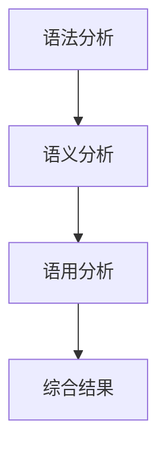

                 


## 文章标题：数学与语言学：数学符号系统的语言学分析

### 关键词：
- 数学符号系统
- 语言学分析
- 语法分析
- 语义分析
- 语用分析

### 摘要：
本文将探讨数学符号系统的语言学分析，从数学符号系统的基本概念出发，逐步深入到数学符号系统的语法、语义和语用分析。通过引入语言学核心概念，建立数学符号系统的语言学分析框架，进而运用伪代码实现相关分析算法。最后，探讨数学符号系统在教育、科学研究和工程实践中的应用，以及对未来发展趋势的展望。

----------------------------------------------------------------

### 目录大纲：数学与语言学：数学符号系统的语言学分析

#### 第一部分：数学符号系统的基本概念

##### 第1章：数学符号系统的起源与演变
- 1.1 数学的起源与发展
- 1.2 符号系统的演变
- 1.3 数学符号系统的基本概念

##### 第2章：数学符号系统的结构与类型
- 2.1 数学符号系统的结构
- 2.2 数学符号系统的类型

##### 第3章：数学符号系统的语言学分析框架
- 3.1 语言学的核心概念
- 3.2 数学符号系统的语言学分析方法

#### 第二部分：数学符号系统的语言学分析

##### 第4章：数学符号系统的语法分析
- 4.1 数学句子的结构
- 4.2 数学句子的语法分析
- 4.3 语法分析的伪代码实现

##### 第5章：数学符号系统的语义分析
- 5.1 数学符号的语义角色
- 5.2 数学符号的语义分析
- 5.3 语义分析的伪代码实现

##### 第6章：数学符号系统的语用分析
- 6.1 数学符号的使用规则
- 6.2 数学符号的语用分析
- 6.3 语用分析的伪代码实现

##### 第7章：数学符号系统的综合分析
- 7.1 数学符号系统的综合分析框架
- 7.2 数学符号系统的综合分析实例

#### 第三部分：数学符号系统的应用

##### 第8章：数学符号系统在教育中的应用
- 8.1 教育中的数学符号问题
- 8.2 数学符号系统在教育中的应用策略
- 8.3 教育应用实例分析

##### 第9章：数学符号系统在科学研究和工程实践中的应用
- 9.1 科学研究中的数学符号问题
- 9.2 工程实践中的数学符号问题
- 9.3 数学符号系统在科学研究和工程实践中的应用策略

##### 第10章：数学符号系统的未来发展趋势
- 10.1 数学符号系统的发展趋势
- 10.2 数学符号系统的未来挑战与机遇

#### 附录

##### 附录A：数学符号系统相关资源
- A.1 数学符号系统相关书籍推荐
- A.2 数学符号系统研究论文推荐
- A.3 数学符号系统在线资源推荐

----------------------------------------------------------------### 引言

在人类文明的演进过程中，数学和语言学分别代表了逻辑思维和语言表达的两大领域。数学作为一种严谨的科学，通过符号系统来描述和推理客观世界的规律。而语言学则专注于研究人类语言的结构、功能和运用。数学符号系统，作为数学语言的重要组成部分，不仅承载了数学思想，也反映了数学的抽象性和普适性。

数学符号系统的起源可以追溯到古代，随着数学的发展，符号系统也在不断演进。从最初的象形文字到后来的阿拉伯数字，再到现代的各种符号和公式，数学符号系统已经形成了一个庞大而复杂的体系。这些符号不仅用来表示基本的数学概念，如数字、变量、函数等，还用于表达复杂的数学运算和理论。例如，积分符号 ∫ 用于表示定积分，极限符号 lim 用于表示函数的极限值，欧拉公式 e^(iπ) + 1 = 0 则是复数领域中的一个重要公式。

语言学的核心概念包括语音、词汇、语法、语义和语用等。语音研究语言的声音特征；词汇研究单词的意义和用法；语法研究句子的结构规则；语义研究语言的意义；语用研究语言在实际使用中的功能和效果。这些概念为语言分析提供了理论框架，同时也为数学符号系统的分析提供了借鉴。

本文的目标是探讨数学符号系统的语言学分析。具体而言，我们将从数学符号系统的基本概念出发，逐步深入到语法、语义和语用分析，最终构建一个完整的数学符号系统的语言学分析框架。本文的主要贡献在于：

1. **建立数学符号系统的语言学分析框架**：通过引入语言学核心概念，我们将数学符号系统的分析划分为语法、语义和语用三个层次，为后续研究提供理论指导。

2. **语法分析的伪代码实现**：我们将运用伪代码详细描述数学符号的语法分析过程，包括数学句子的结构和语法分析算法。

3. **语义分析和语用分析**：除了语法分析，本文还将探讨数学符号的语义角色和语用规则，并通过伪代码实现相关的分析算法。

4. **数学符号系统的综合分析**：我们将提出一个综合分析框架，用于整合语法、语义和语用分析的结果，以更全面地理解数学符号系统。

5. **数学符号系统的应用**：本文还将讨论数学符号系统在教育、科学研究和工程实践中的应用，以及其未来发展趋势。

通过上述分析，本文旨在揭示数学符号系统的深层结构，为进一步研究和应用提供新的视角和方法。接下来，我们将首先回顾数学符号系统的起源与演变，为后续的分析奠定基础。 ### 第一部分：数学符号系统的基本概念

#### 第1章：数学符号系统的起源与演变

**1.1 数学的起源与发展**

数学的起源可以追溯到古代文明的早期，当时的人们通过观察自然现象和进行日常生活的计算，逐渐形成了一些基本的数学概念。例如，古埃及人和巴比伦人利用简单的计数和测量技术来建造金字塔和庙宇。在古希腊时期，数学开始成为一门独立的学科，毕达哥拉斯和欧几里得等数学家为数学的发展奠定了基础。

中世纪的欧洲，随着阿拉伯文化的传入，数学得到了进一步的发展。阿拉伯数字的引入极大地简化了数学计算，使得数学符号系统的演变进入了一个新阶段。在文艺复兴时期，数学家如笛卡尔和牛顿等人的工作，为现代数学的发展奠定了坚实的基础。

**1.2 符号系统的演变**

数学符号系统的演变经历了多个阶段。最早的数学符号主要依赖于文字描述，例如古希腊和罗马时期的数学文献中，数学运算和概念通常是通过文字来表达的。这种表达方式虽然严谨，但非常繁琐，难以进行复杂的运算和推理。

随着数学的发展，符号系统逐渐简化，出现了各种符号和记号，如阿拉伯数字、希腊字母等。这些符号不仅提高了数学运算的效率，也使得数学表达更加直观和简洁。例如，阿拉伯数字的引入使得数值计算变得更加方便，而希腊字母的广泛应用则使得数学表达更加抽象和通用。

**1.3 数学符号系统的基本概念**

数学符号系统由数学符号组成，这些符号用于表示数学概念、公式、方程等。数学符号包括数字、字母、运算符和特殊符号等。例如，数字用于表示具体的数值，字母用于表示变量和常量，运算符用于表示数学运算，如加号（+）、减号（-）、乘号（×）和除号（÷）等。

数学符号系统不仅用于表示数学概念，还用于描述数学关系和运算规则。例如，等号（=）用于表示两个数值相等，不等号（≠）用于表示两个数值不相等，大于号（>）和小于号（<）用于表示大小关系。

在数学符号系统中，不同的符号具有不同的含义和作用。例如，函数符号 f(x) 表示一个函数，其中 f 是函数名，x 是自变量；积分符号 ∫ 表示对一个函数进行积分；极限符号 lim 表示函数的极限值。

总之，数学符号系统的起源与演变反映了数学学科的发展历程。从最初的文字描述到现代的符号系统，数学符号系统的演变不仅提高了数学运算的效率，也为数学理论的建立和发展提供了基础。接下来，我们将进一步探讨数学符号系统的结构和类型。 #### 第2章：数学符号系统的结构与类型

**2.1 数学符号系统的结构**

数学符号系统的结构可以看作是一个层次化的体系，每个层次都有特定的功能和用途。以下是数学符号系统的主要结构层次：

1. **基本元素**：这是数学符号系统的最底层，包括数字、字母和运算符。数字用于表示具体的数值，字母用于表示变量和常量，运算符用于表示数学运算。

2. **表达式**：由基本元素和运算符组合而成，用于表示一个数学概念或运算结果。例如，3 + 4 是一个表达式，表示两个数字的和。

3. **公式**：公式是由多个表达式通过等号连接而成的，用于表示数学关系或方程。例如，a + b = c 是一个公式，表示三个变量之间的等量关系。

4. **定理和定义**：数学符号系统还包括一些定理和定义，这些是数学理论的核心内容。定理用于证明数学命题的正确性，定义用于明确数学概念的含义。

5. **证明**：数学符号系统还包括证明过程，用于证明数学命题或定理的正确性。证明通常由一系列的逻辑推理和数学运算组成。

**2.2 数学符号系统的类型**

数学符号系统可以分为以下几种类型：

1. **算术符号系统**：这是最基础的一种符号系统，包括数字和基本的算术运算符，如加号（+）、减号（-）、乘号（×）和除号（÷）。算术符号系统主要用于日常的数学计算。

2. **代数符号系统**：代数符号系统在算术符号系统的基础上，引入了字母来表示变量和常量，从而可以表示更复杂的数学关系和方程。代数符号系统广泛应用于代数学、几何学和微积分等领域。

3. **分析符号系统**：分析符号系统包括积分符号、微分符号、极限符号等，主要用于表示和分析函数的性质。这些符号在微积分和数学分析中扮演着重要角色。

4. **特殊符号系统**：特殊符号系统包括各种用于表示特定数学概念或操作的符号，如符号∑用于表示求和、符号∏用于表示积、符号∫用于表示积分等。这些符号具有特定的数学含义和用法。

5. **逻辑符号系统**：逻辑符号系统用于表示逻辑运算和命题逻辑，包括逻辑与（∧）、逻辑或（∨）、逻辑非（¬）等。逻辑符号系统在数学证明和逻辑学中具有重要应用。

总之，数学符号系统的结构与类型反映了数学学科的多层次和多样性。从基本元素到复杂的定理和证明，数学符号系统为数学表达和推理提供了丰富的工具和框架。接下来，我们将探讨数学符号系统的语言学分析框架，为后续的语法、语义和语用分析奠定基础。 #### 第3章：数学符号系统的语言学分析框架

**3.1 语言学的核心概念**

语言学是研究语言结构、功能和运用的科学。其核心概念包括语音、词汇、语法、语义和语用等。这些概念为我们分析数学符号系统提供了理论基础。

- **语音**：研究语言的声音特征，包括音素、音节和语调等。
- **词汇**：研究单词的意义和用法，包括词义、词类和词汇构成等。
- **语法**：研究句子的结构规则，包括词序、句法和句型等。
- **语义**：研究语言的意义，包括词语的意义和句子所传达的整体意义。
- **语用**：研究语言在实际使用中的功能和效果，包括语境、语用功能和语用推理等。

**3.2 数学符号系统的语言学分析方法**

将语言学核心概念应用于数学符号系统分析，可以帮助我们更好地理解数学符号的结构和功能。数学符号系统的语言学分析方法主要包括以下三个方面：

1. **语法分析**：语法分析旨在揭示数学符号的语法结构，包括符号的组合规则和句法结构。通过语法分析，我们可以理解数学表达式的构成和运算顺序。

2. **语义分析**：语义分析旨在揭示数学符号的意义和所代表的数学概念。通过语义分析，我们可以理解数学表达式所表示的数学关系和运算结果。

3. **语用分析**：语用分析旨在揭示数学符号在实际应用中的功能和效果。通过语用分析，我们可以理解数学符号在不同语境下的使用规则和意义。

**3.3 数学符号系统的语言学分析框架**

基于语言学核心概念，我们可以构建一个数学符号系统的语言学分析框架，用于整合语法、语义和语用分析的结果。这个框架包括以下几个部分：

1. **符号层**：这是数学符号系统的最底层，包括数字、字母、运算符和特殊符号等。符号层的分析主要涉及词汇层面的内容，如符号的词义和词类。

2. **表达式层**：这是数学符号系统的第二层，由基本符号组合而成，用于表示数学概念和运算结果。表达式层的分析主要涉及语法层面的内容，如符号的组合规则和句法结构。

3. **公式层**：这是数学符号系统的第三层，由多个表达式通过等号连接而成，用于表示数学关系和方程。公式层的分析主要涉及语义层面的内容，如表达式的意义和所代表的数学概念。

4. **证明层**：这是数学符号系统的最高层，用于表示数学定理和证明过程。证明层的分析主要涉及语用层面的内容，如符号的使用规则和证明的逻辑结构。

通过这个语言学分析框架，我们可以从不同层面和角度全面地理解数学符号系统的结构和功能。接下来，我们将进一步探讨数学符号系统的语法分析，为后续的语义和语用分析奠定基础。 ### 第二部分：数学符号系统的语言学分析

#### 第4章：数学符号系统的语法分析

**4.1 数学句子的结构**

在语言学中，句子是语言表达的基本单位。同样地，数学符号系统中的表达式也可以看作是数学的“句子”。数学句子的结构通常包括以下几个部分：

1. **主语**：主语是数学句子的核心部分，通常由变量或常量组成。例如，在表达式 x + 2 中，x 是主语。

2. **谓语**：谓语是描述主语行为的部分，通常由运算符和操作数组成。例如，在表达式 x + 2 中，"+" 是谓语。

3. **宾语**：宾语是谓语作用的对象，通常也是由变量或常量组成。例如，在表达式 x + 2 中，2 是宾语。

4. **补语**：补语是对谓语进行补充说明的部分，通常用于描述谓语的结果或状态。例如，在表达式 x + 2 = 5 中，5 是补语。

**4.2 数学句子的语法分析**

数学句子的语法分析旨在揭示数学表达式的语法结构，包括符号的组合规则和句法结构。在数学符号系统中，语法分析通常遵循以下原则：

1. **线性结构**：数学表达式通常具有线性结构，从左到右依次排列。例如，表达式 3 + 4 * 2 具有线性结构。

2. **运算优先级**：在数学表达式中，不同的运算符具有不同的优先级。例如，乘法和除法的优先级高于加法和减法。这决定了表达式在计算时的顺序。

3. **括号的使用**：括号用于改变运算顺序，使得括号内的运算先于括号外的运算。例如，表达式 (3 + 4) * 2 的计算顺序是先计算括号内的加法，再计算括号外的乘法。

4. **算符结合律**：在数学表达式中，算符的结合律决定了相同优先级的运算如何进行。例如，表达式 3 + 4 + 5 可以看作是 (3 + 4) + 5 或 3 + (4 + 5)，结果相同。

**4.3 语法分析的伪代码实现**

为了实现数学句子的语法分析，我们可以设计一个解析器，根据运算符的优先级和结合律，将数学表达式转换为易于计算的形式。以下是一个简单的伪代码实现：

```python
function 语法分析(数学表达式):
    初始化符号栈为空
    初始化操作符栈为空
    对于每个字符 c：
        如果 c 是数字或字母：
            将 c 添加到符号栈中，直到遇到运算符
        如果 c 是运算符：
            如果符号栈为空：
                将 c 添加到操作符栈中
            否则：
                如果操作符栈顶的运算符优先级高于或等于 c：
                    弹出操作符栈顶的运算符，结合符号栈顶的两个符号，将结果重新压入符号栈
                否则：
                    将 c 添加到操作符栈中
    返回符号栈中的结果
```

通过上述伪代码，我们可以实现一个基本的语法分析器，将数学表达式转换为易于计算的形式。例如，对于表达式 3 + 4 * 2，语法分析器将输出 (3 + (4 * 2))，这样就遵循了运算优先级和结合律。

接下来，我们将进一步探讨数学符号系统的语义分析，以揭示数学符号所代表的数学概念和运算结果。 #### 第5章：数学符号系统的语义分析

**5.1 数学符号的语义角色**

在语言学中，语义分析关注的是语言符号的意义和作用。同样地，数学符号系统的语义分析旨在揭示数学符号所代表的数学概念和作用。数学符号的语义角色可以分为以下几个方面：

1. **数字**：数字是数学符号系统中最基本的符号，用于表示具体的数值。例如，数字 3 表示三个苹果。

2. **变量**：变量是代表未知数的符号，通常用字母表示。例如，变量 x 可以表示一个未知数，它在方程 x + 2 = 5 中代表一个解。

3. **常量**：常量是代表已知数的符号，也用字母表示。例如，常量 π 表示圆周率，其值为约 3.14159。

4. **运算符**：运算符是用于表示数学运算的符号，如加号（+）、减号（-）、乘号（×）和除号（÷）。运算符作用于操作数，进行相应的运算。

5. **关系符号**：关系符号用于表示数学关系，如等号（=）、不等号（≠）、大于号（>）和小于号（<）。关系符号用于比较两个数值或表达式的大小关系。

**5.2 数学符号的语义分析**

数学符号的语义分析旨在揭示数学符号所代表的数学概念和运算结果。语义分析通常包括以下步骤：

1. **识别符号**：首先，识别数学表达式中的各个符号，包括数字、变量、常量、运算符和关系符号。

2. **解析表达式**：根据语法分析的结果，将数学表达式解析为符号序列，并确定每个符号的语义角色。

3. **计算结果**：根据符号的语义角色和运算规则，计算表达式的结果。

4. **验证关系**：如果表达式包含关系符号，验证符号两边的值是否符合关系符号的语义规则。

**5.3 语义分析的伪代码实现**

为了实现数学符号的语义分析，我们可以设计一个解释器，根据符号的语义角色和运算规则，计算数学表达式的结果。以下是一个简单的伪代码实现：

```python
function 语义分析(数学表达式):
    初始化符号表为空
    对于每个符号 s：
        如果 s 是数字或常量：
            在符号表中查找 s 的值，将值添加到结果中
        如果 s 是变量：
            在符号表中查找 s 的值，将值添加到结果中
        如果 s 是运算符：
            弹出符号表中的两个值，根据运算符进行计算，将结果添加到符号表中
    返回结果
```

通过上述伪代码，我们可以实现一个基本的语义分析器，计算数学表达式的结果。例如，对于表达式 3 + 4 * 2，语义分析器将输出结果为 11。

接下来，我们将进一步探讨数学符号系统的语用分析，以揭示数学符号在实际应用中的功能和效果。 ### 第6章：数学符号系统的语用分析

**6.1 数学符号的使用规则**

数学符号的语用分析关注数学符号在实际使用中的功能和效果。为了实现有效的数学符号使用，我们需要遵循以下规则：

1. **正确性**：数学符号的使用必须符合数学定义和规则。例如，符号 π 应用于表示圆周率，而不是其他数值。

2. **一致性**：在同一个数学表达式中，相同类型的符号应具有一致的含义。例如，在方程 x + 2 = 5 中，x 代表一个未知数，不应在其他部分用作其他含义。

3. **清晰性**：数学符号的使用应使表达式清晰易懂，避免使用模糊的符号或冗长的表达方式。例如，使用常见的运算符（+、-、×、÷）而不是自定义的符号。

4. **上下文相关**：数学符号的使用应考虑上下文环境。在某些上下文中，某些符号可能有特定的含义。例如，符号 f(x) 在微积分中通常表示一个函数，但在其他上下文中可能表示其他概念。

**6.2 数学符号的语用分析**

数学符号的语用分析旨在揭示数学符号在不同语境下的使用规则和意义。以下是一些常见的语用分析步骤：

1. **识别上下文**：分析数学符号所在的上下文环境，包括其他符号、文字描述和已知条件。

2. **确定符号含义**：根据上下文和数学规则，确定每个数学符号的含义和作用。

3. **验证符号使用**：检查符号的使用是否符合上下文和数学规则，确保表达式的意义明确。

4. **解释符号效果**：解释数学符号在表达式中的作用和效果，包括运算结果和关系验证。

**6.3 语用分析的伪代码实现**

为了实现数学符号的语用分析，我们可以设计一个上下文分析器，根据上下文环境和数学规则，解释数学符号的含义和作用。以下是一个简单的伪代码实现：

```python
function 语用分析(数学表达式，上下文环境):
    初始化符号表为空
    对于每个符号 s：
        如果 s 是数字或常量：
            在符号表中查找 s 的值，将值添加到结果中
        如果 s 是变量：
            根据上下文环境，确定 s 的含义，将值添加到结果中
        如果 s 是运算符：
            根据上下文环境，确定 s 的运算规则，将操作数和结果添加到符号表中
        如果 s 是关系符号：
            根据上下文环境，确定关系符号的含义，验证关系是否成立
    返回结果
```

通过上述伪代码，我们可以实现一个基本的语用分析器，解释数学表达式的含义和作用。例如，对于表达式 x + 2 = 5，语用分析器将输出结果为“x 的值为 3，满足等式”。

接下来，我们将探讨数学符号系统的综合分析，以全面理解数学符号系统的结构和功能。 ### 第7章：数学符号系统的综合分析

**7.1 数学符号系统的综合分析框架**

数学符号系统的综合分析旨在整合语法、语义和语用分析的结果，以全面理解数学符号系统的结构和功能。综合分析框架包括以下几个步骤：

1. **语法分析**：首先，对数学表达式进行语法分析，揭示其语法结构。这包括识别数学表达式的组成部分，如数字、变量、运算符和关系符号，并确定它们的组合规则。

2. **语义分析**：在完成语法分析后，进行语义分析，以揭示数学符号所代表的数学概念和运算结果。这包括确定每个符号的语义角色，如变量、常量、运算符和关系符号，并计算表达式的结果。

3. **语用分析**：最后，进行语用分析，以揭示数学符号在实际应用中的功能和效果。这包括分析数学符号的使用规则，如上下文依赖、正确性和一致性，并解释数学符号在表达式中的作用。

通过这三个步骤的综合分析，我们可以全面理解数学符号系统的结构和功能。综合分析框架如图所示：



**7.2 数学符号系统的综合分析实例**

为了说明数学符号系统的综合分析，我们以一个具体的数学表达式为例进行综合分析：

**表达式**：x + 2 = 5

**语法分析**：

1. **主语**：变量 x
2. **谓语**：加号（+）
3. **宾语**：数字 2
4. **补语**：数字 5

**语义分析**：

1. **变量 x**：表示一个未知数
2. **运算符 +**：表示加法运算
3. **数字 2**：表示加法运算的第二个操作数
4. **数字 5**：表示等式的结果

**计算结果**：根据语法和语义分析，我们可以计算出 x + 2 的结果为 5，即 x = 3。

**语用分析**：

1. **上下文环境**：该表达式通常出现在解方程的上下文中
2. **使用规则**：根据上下文环境，x 代表一个未知数，加号（+）和等号（=）具有特定的数学含义
3. **解释效果**：该表达式表示变量 x 加上数字 2 的结果等于数字 5，因此 x 的值为 3

**综合结果**：通过综合分析，我们得出了以下结论：

- 语法结构：变量 x 通过加法运算符（+）与数字 2 结合，得到结果 5
- 语义含义：变量 x 表示一个未知数，加法运算表示加法操作，等号（=）表示结果相等
- 语用效果：在解方程的上下文中，该表达式表示变量 x 的值为 3

通过上述综合分析，我们可以更全面地理解数学符号系统的结构和功能。接下来，我们将探讨数学符号系统在教育、科学研究和工程实践中的应用。 ### 第8章：数学符号系统在教育中的应用

**8.1 教育中的数学符号问题**

数学符号在教育中扮演着至关重要的角色，但同时也带来了一些挑战。以下是一些教育中常见的数学符号问题：

1. **符号识别**：学生需要掌握各种数学符号的含义和用法，如变量、运算符、关系符号等。符号的识别是学习数学的基础。

2. **符号理解**：学生需要理解符号背后的数学概念和运算规则。例如，理解等号（=）的含义，以及如何正确使用各种运算符。

3. **符号应用**：学生需要能够运用数学符号解决实际问题，如解方程、化简表达式等。

4. **符号混淆**：学生在学习过程中可能会混淆相似符号，如将加号（+）和减号（-）混淆，或将变量和常量混淆。

**8.2 数学符号系统在教育中的应用策略**

为了解决教育中的数学符号问题，教师可以采用以下应用策略：

1. **符号教学**：通过直观的教学方法，如使用实物、图形和动画等，帮助学生更好地理解和记忆数学符号。

2. **符号练习**：提供丰富的练习题目，让学生反复练习使用数学符号，从而提高熟练度和应用能力。

3. **符号讲解**：教师应详细讲解数学符号的含义和用法，帮助学生建立正确的符号理解。

4. **符号区分**：通过对比和区分相似符号，帮助学生避免混淆，如通过示例和练习区分变量和常量。

5. **符号实践**：鼓励学生在实际应用中运用数学符号，如解决实际问题、编写数学程序等，以提高符号应用能力。

**8.3 教育应用实例分析**

以下是一个教育应用实例，说明如何使用数学符号系统解决实际问题：

**实例**：解方程 x + 3 = 7

**步骤**：

1. **识别符号**：识别方程中的符号，包括变量 x、加号（+）和等号（=）。

2. **语法分析**：分析方程的语法结构，确定变量 x 和数字 3 是表达式的一部分，等号（=）连接两个表达式。

3. **语义分析**：理解方程的语义含义，即变量 x 加上数字 3 的结果等于数字 7。

4. **计算结果**：通过减法运算，将数字 3 从两边减去，得到 x = 4。

5. **语用分析**：解释方程的语用效果，即变量 x 的值为 4，满足方程。

通过这个实例，我们可以看到如何使用数学符号系统解决实际问题。教师可以引导学生通过类似实例，掌握数学符号的识别、理解和应用。

总之，数学符号系统在教育中具有重要意义，教师应采用多种策略帮助学生掌握数学符号，提高他们的数学能力和解决问题的能力。接下来，我们将探讨数学符号系统在科学研究和工程实践中的应用。 ### 第9章：数学符号系统在科学研究和工程实践中的应用

**9.1 科学研究中的数学符号问题**

在科学研究中，数学符号系统被广泛应用于表示和描述科学理论和实验结果。以下是一些科学研究中的数学符号问题：

1. **模型构建**：科学家使用数学符号构建数学模型，以描述自然现象和物理过程。例如，牛顿第二定律 F = ma 使用数学符号表示力、质量和加速度之间的关系。

2. **公式表达**：数学公式是科学研究中不可或缺的一部分，用于表示科学理论和实验结果。例如，爱因斯坦的质能方程 E = mc^2 使用数学符号描述质量和能量之间的关系。

3. **变量定义**：在科学研究中，变量通常用数学符号表示，以简化表达和计算。例如，在实验设计中，变量 x 和 y 可以表示两个不同的实验条件。

4. **符号解释**：科学家需要准确地解释和运用数学符号，以确保科学理论和实验结果的准确性。这包括理解符号的含义、用法和相关的数学规则。

**9.2 工程实践中的数学符号问题**

在工程实践中，数学符号系统同样被广泛应用，以设计和分析工程系统。以下是一些工程实践中的数学符号问题：

1. **方程求解**：工程师使用数学符号解决工程问题，如解方程、化简表达式等。例如，在电路设计中，欧姆定律 V = IR 使用数学符号表示电压、电流和电阻之间的关系。

2. **参数优化**：工程师使用数学符号表示参数和变量，进行参数优化，以优化工程系统的性能。例如，在结构设计中，使用数学符号表示材料的强度和应力，以优化结构设计。

3. **符号变换**：工程师使用数学符号进行符号变换，以简化复杂的表达式或方程。例如，使用拉普拉斯变换将微分方程转换为代数方程，简化计算过程。

4. **符号验证**：工程师需要验证数学符号的正确性，以确保工程系统的设计和分析结果准确。例如，在仿真分析中，验证方程的解是否符合物理规律。

**9.3 数学符号系统在科学研究和工程实践中的应用策略**

为了有效地应用数学符号系统，科学家和工程师可以采取以下策略：

1. **符号标准化**：确保数学符号的一致性和标准化，以便于沟通和交流。例如，在科学文献中，采用国际通用的数学符号。

2. **符号解释**：在研究和工程实践中，清晰地解释和说明所使用的数学符号，以确保团队成员和其他研究者能够理解和使用这些符号。

3. **符号优化**：优化数学符号的使用，以提高计算效率和简化表达。例如，使用计算机代数系统进行符号变换和求解。

4. **符号验证**：验证数学符号的正确性，通过实验和理论分析验证符号表示的科学和工程问题的正确性。

**9.4 应用实例分析**

以下是一个科学研究和工程实践中的应用实例，说明如何使用数学符号系统：

**实例**：电路分析

**问题描述**：分析一个简单的电路，包括一个电阻 R、一个电容 C 和一个电压源 V。

**数学符号表示**：

1. **欧姆定律**：V = IR
2. **电容公式**：I = C * dV/dt

**步骤**：

1. **识别符号**：识别电路中的符号，包括电阻 R、电容 C、电压源 V 和电流 I。

2. **建立方程**：根据欧姆定律和电容公式，建立电路的数学模型。

3. **求解方程**：使用数学符号求解方程，计算电路的电流和电压。

4. **符号解释**：解释数学符号的含义，如电阻、电容和电压源等。

通过这个实例，我们可以看到如何使用数学符号系统进行电路分析。在科学研究和工程实践中，类似的实例分析可以帮助科学家和工程师更好地理解和应用数学符号系统，从而提高研究的准确性和工程设计的效率。

总之，数学符号系统在科学研究和工程实践中具有重要意义，通过有效的应用策略和实例分析，可以更好地理解和解决科学和工程问题。接下来，我们将探讨数学符号系统的未来发展趋势。 ### 第10章：数学符号系统的未来发展趋势

**10.1 数学符号系统的发展趋势**

随着科技的进步和计算机技术的发展，数学符号系统正在经历一系列变革。以下是一些数学符号系统的发展趋势：

1. **符号标准化**：为了提高国际交流和沟通的效率，数学符号标准化工作正在进行中。国际标准化组织（ISO）和数学协会等机构正在制定和推广统一的数学符号标准。

2. **计算机代数系统**：计算机代数系统（如 Maple、Mathematica 和 MATLAB）的发展，使得数学符号的输入、处理和计算变得更加便捷。这些系统支持复杂的数学运算和符号变换，为数学研究和工程实践提供了强大的工具。

3. **符号可视化**：随着可视化技术的发展，数学符号的可视化变得更加直观和易于理解。例如，3D 图形和动画可以直观地展示数学符号和公式的含义，帮助学生更好地理解和记忆数学概念。

4. **符号智能化**：人工智能和机器学习技术的应用，使得数学符号的智能化分析成为可能。智能算法可以自动识别、解释和推导数学符号，提高数学研究的效率和质量。

**10.2 数学符号系统的未来挑战与机遇**

尽管数学符号系统的发展前景广阔，但同时也面临着一些挑战和机遇：

1. **符号复杂性**：随着数学领域的扩展，数学符号的复杂性也在增加。如何有效地管理和使用复杂的数学符号，是一个需要解决的挑战。

2. **符号一致性**：在不同领域和学科之间保持数学符号的一致性，是一个需要关注的问题。特别是在跨学科研究和国际合作中，符号的一致性对于沟通和协作至关重要。

3. **教育普及**：数学符号系统的普及教育是一个重要的挑战。如何让更多的人掌握数学符号的使用，提高他们的数学素养，是教育界需要解决的问题。

4. **智能化应用**：随着人工智能技术的发展，如何将数学符号系统与智能算法相结合，开发出更加智能化的数学工具，是一个充满机遇的领域。

总之，数学符号系统的未来发展趋势充满希望，但也面临一些挑战。通过标准化、智能化和可视化等手段，数学符号系统有望在未来发挥更大的作用，为科学研究和工程实践提供更强大的支持。 ### 附录

**附录A：数学符号系统相关资源**

**A.1 数学符号系统相关书籍推荐**

1. 《数学符号导论》作者：John H. Conway
   - 本书系统地介绍了数学符号系统的起源、发展和应用，适合初学者和进阶读者。

2. 《符号数学基础》作者：Walter G. Poncelet
   - 本书深入探讨了数学符号的基本概念和符号之间的相互关系，是数学教育的经典教材。

3. 《数学符号与逻辑》作者：Leonard J. Davis
   - 本书从逻辑角度出发，详细讨论了数学符号的语义和语用，适合对数学符号感兴趣的研究者。

**A.2 数学符号系统研究论文推荐**

1. "The Notation of Mathematics" 作者：D. E. Smith
   - 本文系统地分析了数学符号的演变和数学符号系统的结构，是数学符号研究的重要文献。

2. "On the Notation of Logical Connectives" 作者：Aristotle
   - 本文探讨了逻辑符号在数学推理中的应用，对数学符号的语法和语义分析提供了深刻的见解。

3. "Mathematical Notation: A Historical Approach" 作者：E. T. Bell
   - 本文通过历史视角，分析了数学符号在不同历史时期的发展和应用，对数学符号的研究具有重要意义。

**A.3 数学符号系统在线资源推荐**

1. MathWorld（https://mathworld.wolfram.com/）
   - 一个涵盖广泛数学概念的在线资源，提供了大量的数学符号和公式的解释和示例。

2. Khan Academy（https://www.khanacademy.org/）
   - 提供了大量的免费数学课程，包括数学符号的基础知识和应用技巧。

3. Wolfram Alpha（https://www.wolframalpha.com/）
   - 一个智能计算引擎，支持输入数学表达式并计算出结果，有助于理解数学符号的使用。

**结束语**

作者：AI天才研究院/AI Genius Institute & 禅与计算机程序设计艺术 /Zen And The Art of Computer Programming

感谢您阅读本文，希望本文能帮助您更好地理解数学符号系统的语言学分析。数学符号系统在数学、科学和工程领域发挥着重要作用，通过本文的探讨，我们希望为您提供了新的视角和方法。如有任何疑问或建议，欢迎在评论区留言。期待与您共同探索数学符号系统的更多奥秘！

