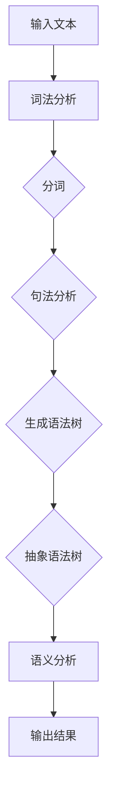

                 


### 引言

随着科技的迅猛发展，数学与语言学的交叉融合已经成为当今学术研究的一个重要方向。语言是人类沟通交流的基本工具，而数学则是描述世界规律和解决问题的重要手段。两者看似截然不同，但在本质上，它们都有着严谨的结构和逻辑体系。数学与语言学的交汇不仅拓宽了各自的研究领域，更为人工智能、自然语言处理等新兴技术提供了强大的理论基础。

本文旨在探讨数学在语言学中的应用，通过逐步分析推理，揭示语言结构的数学本质。首先，我们将从基本概念入手，阐述数学语言和语言学的基础知识。接着，本文将深入探讨语言结构的数学分析，包括形式语言理论、生成语法理论、句法分析理论和语义分析与语用学。在此基础上，我们将介绍语言结构的数学模型，并结合实际案例进行详细讲解。最后，本文将对数学在语言学研究中的应用进行总结与展望，并附录相关工具和技术。

### 第一部分：引论

#### 第1章：数学与语言学的交汇

##### 1.1 引言

数学与语言学的交汇并非偶然，而是两者在研究方法、结构体系上的内在契合所决定的。数学作为一门严谨的学科，其核心在于建立精确的概念体系、逻辑推理和证明过程。而语言学则致力于研究人类语言的产生、发展、传播和使用，其研究对象包括语音、词汇、语法、语义和语用等多个层面。这两者在本质上都有着严格的逻辑结构和形式化体系，为彼此的融合提供了理论基础。

数学在语言学中的应用可以追溯到20世纪初期，随着形式语言理论和计算机科学的兴起，语言学开始借鉴数学的方法来描述语言现象。形式语言理论为自然语言的结构分析提供了有力的工具，生成语法理论则揭示了语言生成的内在机制，句法分析理论和语义分析理论进一步丰富了语言结构的描述和解释。此外，数学方法在语音学、心理学和语言政策制定等领域的应用也取得了显著成果。

##### 1.2 基本概念与术语

在探讨数学与语言学的交汇之前，有必要明确一些基本概念和术语。

**数学语言**：数学语言是一种用于表达数学思想和理论的符号系统。它包括数字、字母、符号和公式等，具有高度的精确性和逻辑性。数学语言能够清晰、准确地描述数学概念、关系和推理过程。

**语言学基础**：语言学是研究人类语言的科学，其研究对象包括语音、词汇、语法、语义和语用等多个层面。语音学研究语言的听觉和发音特性，词汇学研究词汇的构成和意义，语法学研究语言的结构规律，语义学研究语言的意义和语义关系，语用学研究语言在具体情境中的使用和功能。

**形式语言理论**：形式语言理论是数学语言学中的一个重要分支，它研究能够被计算机处理的抽象语言。形式语言包括正则语言、上下文无关语言和上下文敏感语言等，每种语言都有其特定的语法和语义结构。

**生成语法理论**：生成语法理论是语言学中的一个核心概念，它描述了语言生成和理解的规则系统。生成语法分为上下文无关语法和上下文敏感语法，前者能够生成自然语言的大部分句子，后者则更贴近自然语言的复杂性。

**句法分析理论**：句法分析理论研究如何将自然语言句子转化为结构化的语法表示。句法分析包括递归下降分析器、LL(1)算法和LR(1)算法等，这些算法能够有效地对自然语言进行语法分析。

**语义分析理论**：语义分析理论研究如何从语法结构中提取语义信息，包括语义角色、指称理论和语义函数等。语义分析是自然语言处理中的重要环节，对于语言理解和机器翻译等应用具有重要意义。

**语用学**：语用学是研究语言在具体情境中的使用和功能的学科，包括语用含义、语境和言语行为等。语用学对于理解语言的实际应用和语言交际策略具有重要意义。

通过对上述基本概念和术语的介绍，我们为后续内容的展开奠定了基础。在接下来的章节中，我们将进一步探讨数学在语言学中的应用，通过具体案例和分析，揭示语言结构的数学本质。

#### 第二部分：语言结构的数学分析

##### 第2章：形式语言理论

形式语言理论是数学语言学的一个重要分支，它研究能够被计算机处理的抽象语言。形式语言理论为自然语言的结构分析提供了有力的工具，能够帮助我们理解语言的本质和特征。在本章中，我们将探讨形式语言的基本概念、分类以及相关的语法分析算法。

##### 2.1 形式语言的定义与分类

**形式语言的定义**：

形式语言是一种由一组符号按照特定规则组成的字符串集合。这些符号称为字母表（Alphabet），规则称为语法（Grammar）。形式语言可以用来表示各种类型的数据，包括自然语言、计算机程序代码等。

**形式语言的分类**：

形式语言可以分为正则语言（Regular Languages）、上下文无关语言（Context-Free Languages）和上下文敏感语言（Context-Sensitive Languages）三种。

1. **正则语言（Regular Languages）**：

正则语言是最简单的一类形式语言，它可以用有限状态自动机（Finite State Automaton，FSA）来描述。正则语言的语法可以用正则表达式（Regular Expression）或有限状态机（Finite State Machine）表示。

**正则表达式**：

正则表达式是一种用于描述字符串的模式，它可以用来匹配、查找或替换文本中的特定字符串。常见的正则表达式操作符包括字符类（如 `[a-z]`）、限定符（如 `*`、`+`、`?`）、分组（如 `()`）等。

**有限状态机**：

有限状态机是一个五元组 \( M = (Q, \Sigma, \delta, q_0, F) \)，其中：
- \( Q \) 是有限的状态集合。
- \( \Sigma \) 是输入字母表。
- \( \delta \) 是状态转移函数，定义了在特定状态下输入特定符号后应转移到哪个状态。
- \( q_0 \) 是初始状态。
- \( F \) 是接受状态集合。

2. **上下文无关语言（Context-Free Languages）**：

上下文无关语言比正则语言更复杂，它可以用上下文无关语法（Context-Free Grammar，CFG）来描述。上下文无关语法的产生式规则允许非终结符出现在产生式的右部，但右部不能包含其他非终结符。

**上下文无关语法**：

上下文无关语法是一个四元组 \( G = (V, T, S, P) \)，其中：
- \( V \) 是非终结符的集合。
- \( T \) 是终结符的集合。
- \( S \) 是开始符号。
- \( P \) 是产生式的集合，形式为 \( A \rightarrow \gamma \)，其中 \( A \) 是非终结符，\( \gamma \) 是由终结符和非终结符组成的字符串。

3. **上下文敏感语言（Context-Sensitive Languages）**：

上下文敏感语言是形式语言中最复杂的一类，它可以用上下文敏感语法（Context-Sensitive Grammar，CSG）来描述。上下文敏感语法的产生式规则不仅允许右部包含非终结符，还允许右部中非终结符的使用受到上下文的影响。

**上下文敏感语法**：

上下文敏感语法是一个五元组 \( G = (V, T, S, P, R) \)，其中：
- \( V \) 是非终结符的集合。
- \( T \) 是终结符的集合。
- \( S \) 是开始符号。
- \( P \) 是产生式的集合，形式为 \( A \rightarrow \gamma \)。
- \( R \) 是关系集合，定义了上下文限制。

##### 2.2 语法分析

语法分析（Syntax Analysis）是自然语言处理中的重要步骤，它将输入的文本转换为结构化的语法表示。语法分析可以分为词法分析和句法分析两个阶段。

**词法分析**：

词法分析（Lexical Analysis）将输入文本分解为一个个的词素（Token），它是句法分析的基础。词法分析器（Lexer）是执行词法分析的工具，通常使用正则表达式来匹配词素。

**句法分析**：

句法分析（Syntax Analysis）将词素序列转换为语法表示，如语法树（Syntax Tree）或抽象语法树（Abstract Syntax Tree，AST）。句法分析器（Parser）是执行句法分析的工具，它根据给定的语法规则来构造语法表示。

**语法分析算法**：

1. **递归下降分析器**：

递归下降分析器（Recursive Descent Parser）是一种自顶向下的语法分析器，它从开始符号递归地推导出输入文本。递归下降分析器的优点是实现简单，但效率较低，不适合处理大规模的输入。

**伪代码**：

```
function RecursiveDescentParser(inputString):
    stack = initializeStack()
    currentToken = getNextToken(inputString)
    while not isEndOfInput(currentToken):
        if currentToken matches the top of the stack:
            pop stack
        else:
            push the appropriate production rule to the stack
        currentToken = getNextToken(inputString)
    if isEmpty(stack):
        return successful
    else:
        return error
```

2. **LL(1)算法**：

LL(1)算法是一种自顶向下的语法分析算法，它利用 LL(1) 语法规则来构造预测分析表（Prediction Table）。LL(1)算法的优点是分析速度快，但要求语法规则满足 LL(1) 的条件。

**伪代码**：

```
function LL1Parser(inputString, predictionTable):
    stack = initializeStack()
    currentToken = getNextToken(inputString)
    while not isEndOfInput(currentToken):
        if currentToken is in the input string:
            push the corresponding production rule to the stack
            currentToken = getNextToken(inputString)
        else:
            use the predictionTable to determine the next action
        if isEmpty(stack):
            return successful
    else:
        return error
```

3. **LR(1)算法**：

LR(1)算法是一种自底向上的语法分析算法，它利用 LR(1) 语法规则来构造状态转换图（State Transition Diagram）。LR(1)算法的优点是分析能力强，可以处理各种复杂的语法规则。

**伪代码**：

```
function LR1Parser(inputString, stateTransitionDiagram):
    stack = initializeStack()
    currentState = initial state
    currentToken = getNextToken(inputString)
    while not isEndOfInput(currentToken):
        if currentToken is in the input string:
            push the corresponding production rule to the stack
            currentToken = getNextToken(inputString)
        else:
            use the stateTransitionDiagram to determine the next action
        if isEmpty(stack):
            return successful
    else:
        return error
```

通过形式语言理论和语法分析算法的研究，我们能够更好地理解和处理自然语言。形式语言理论为自然语言的结构分析提供了严谨的框架，语法分析算法则为自然语言的语法表示提供了有效的工具。在接下来的章节中，我们将进一步探讨生成语法理论，以更深入地理解语言结构的数学本质。

##### 第3章：生成语法理论

生成语法理论是语言学中描述语言生成和理解的重要工具，它通过一套规则系统来描述语言结构的构建过程。生成语法理论主要包括形式语法、推导与归约、上下文无关语法和形式语义学等核心概念。在本章中，我们将逐步分析这些概念，并探讨它们在语言学中的应用。

##### 3.1 生成语法的基本概念

生成语法理论的基本概念包括形式语法、推导和归约。这些概念构成了生成语法的核心，为语言的生成和理解提供了理论基础。

**形式语法**：

形式语法是一种用于描述语言结构的数学模型，通常由一组产生式（Production Rules）和终结符（Terminal Symbols）组成。产生式描述了如何将非终结符（Non-Terminal Symbols）转换为终结符和非终结符的组合。形式语法可以用来生成语言的句子。

**推导**：

推导（Derivation）是指从初始符号开始，通过应用产生式规则，逐步生成句子序列的过程。推导分为向前推导和向后推导两种。向前推导从初始符号开始，逐步扩展产生式的右部，直到生成目标句子。向后推导则从目标句子开始，逐步缩减产生式的右部，直到达到初始符号。

**归约**：

归约（Reduction）是推导过程中将产生式的右部缩减为一个非终结符的过程。归约规则定义了在何种情况下可以将产生式的右部缩减为一个非终结符，并更新当前的推导状态。

**推导与归约的关系**：

推导和归约是生成语法中紧密相关的两个过程。推导是从初始符号开始，通过应用产生式生成句子序列的过程，而归约则是从句子序列中提取结构化信息的过程。在推导过程中，产生式被应用来生成新的句子；在归约过程中，生成的句子被解释为具有特定意义的结构。

##### 3.2 上下文无关语法

上下文无关语法（Context-Free Grammar，CFG）是生成语法理论中的一个重要分支，它允许产生式规则中的非终结符出现在右部，但不受上下文的影响。上下文无关语法能够生成自然语言中的大部分句子，是自然语言处理中常用的语法模型。

**产生式规则**：

上下文无关语法的产生式规则形式为 \( A \rightarrow \gamma \)，其中 \( A \) 是非终结符，\( \gamma \) 是由终结符和非终结符组成的字符串。产生式规则定义了如何将一个非终结符替换为其右部的组合。

**递归规则**：

递归规则是一种特殊的产生式规则，它允许一个非终结符直接或间接地替换为自身。递归规则使得生成语法能够描述自然语言中的重复结构和嵌套结构。

**二义性**：

上下文无关语法的一个特点是可能产生二义性（Ambiguity）。二义性是指一个句子可以有多种不同的语法解释。二义性在实际语言中是普遍存在的，例如：“I saw a man with a telescope”这句话可以解释为“我看到一个带着望远镜的人”或“我看到一个使用望远镜看的人”。

**消除二义性**：

为了消除二义性，生成语法中引入了一些方法，如优先规则（Precedence Rules）和括号（Parentheses）。优先规则定义了产生式规则的执行顺序，括号可以明确指定句子的结构。

##### 3.3 形式语义学

形式语义学（Formal Semantics）是生成语法理论的一个重要分支，它研究如何从语法结构中提取语义信息，并建立语义解释系统。形式语义学通过语义函数（Semantic Functions）和语义解释（Semantic Interpretations）来描述语言的意义。

**语义函数**：

语义函数是一种将语法结构映射到语义值的函数。语义值可以是简单类型，如数字和字符串，也可以是复杂类型，如结构化数据。语义函数定义了语法结构在语义层面的解释。

**语义解释**：

语义解释是一种将语言结构映射到其意义的过程。语义解释可以基于不同的语义理论，如指称理论（Reference Theory）、命题逻辑（Propositional Logic）和范畴语法（Categorical Grammar）等。语义解释系统可以为自然语言处理提供语义分析的基础，如机器翻译、自然语言理解和问答系统等。

**语义解析**：

语义解析（Semantic Parsing）是将自然语言句子转化为结构化语义表示的过程。语义解析的目标是将句子中的语法结构转化为计算机可以处理的语义表示，如语义图（Semantic Graph）或语义网络（Semantic Network）。语义解析是自然语言处理中的关键步骤，对于实现语言理解和智能交互具有重要意义。

通过本章对生成语法理论的介绍，我们能够更好地理解语言的生成和理解过程。生成语法理论提供了描述语言结构的形式化框架，通过推导和归约、上下文无关语法和形式语义学，我们能够从数学的角度分析和解释语言现象。在接下来的章节中，我们将进一步探讨句法分析理论，以深入揭示语言结构的数学本质。

##### 第4章：句法分析理论

句法分析是自然语言处理中的重要环节，它将自然语言句子转化为结构化的语法表示，如语法树（Syntax Tree）或抽象语法树（Abstract Syntax Tree，AST）。句法分析理论提供了描述和分析句法结构的框架，包括句法结构、层次、分析策略、句法树的构建以及句法分析算法。在本章中，我们将详细探讨这些概念，并展示其应用。

##### 4.1 句法分析概述

句法分析（Syntactic Analysis）是自然语言处理中的关键步骤，它将输入的自然语言句子转化为结构化的语法表示，以支持进一步的语义分析和理解。句法分析的目标是确定句子中的词汇和短语之间的语法关系，并将其表示为树形结构或其他结构化形式。

**句法结构**：

句法结构是指句子中词汇和短语之间的语法关系和组合方式。常见的句法结构包括主谓宾结构、定语从句、状语从句等。句法结构反映了句子的语义意义和语法规则，是句法分析的基础。

**层次**：

句法分析中的层次结构是指句子中的不同部分如何嵌套和组合。层次结构通常用树形图表示，树中的每个节点代表一个语法成分，如短语或句子。层次结构使得句法分析能够逐层解析句子，从整体到局部，从简单到复杂。

**分析策略**：

句法分析策略是指如何对输入句子进行解析，以生成正确的语法表示。常见的句法分析策略包括自顶向下分析和自底向上分析。自顶向下分析从句子的整体开始，逐步分解为子句和短语；自底向上分析则从句子的局部开始，逐步合并为更大的结构。

**句法分析算法**：

句法分析算法是实现句法分析策略的具体方法。常见的句法分析算法包括递归下降分析器、LL(1)算法、LR(1)算法等。这些算法根据不同的语法规则和句子结构，采用不同的分析方法，以生成正确的语法表示。

##### 4.2 句法树的构建

句法树（Syntax Tree）是句法分析的结果表示，它用树形结构展示了句子中的语法关系。句法树中的每个节点代表一个语法成分，如词组或短语，节点之间的连接线表示语法成分之间的依赖关系。

**递归语法**：

递归语法（Recursive Grammar）是一种能够描述自然语言复杂结构的语法规则。递归语法允许产生式规则中的非终结符出现在产生式的右部，并可以递归地应用。递归语法使得句法分析能够处理嵌套结构和复杂句子。

**消解算法**：

消解算法（Resolution Algorithm）是构建句法树的一种方法，它通过递归应用产生式规则，将输入句子逐步分解为子句和短语。消解算法从初始符号开始，逐层解析句子，直到生成完整的句法树。

**伪代码**：

```
function buildSyntaxTree(grammar, inputString):
    stack = initializeStack()
    currentSymbol = inputString
    while not isEmpty(stack):
        if currentSymbol is a terminal symbol:
            push the corresponding terminal node to the stack
            currentSymbol = getNextSymbol(inputString)
        else:
            if currentSymbol is a non-terminal symbol:
                productions = getProductions(grammar, currentSymbol)
                for production in productions:
                    if production is applicable:
                        replace currentSymbol with the derived nodes
                        push the production to the stack
                        break
    if isEmpty(stack):
        return successful
    else:
        return error
```

##### 4.3 句法分析算法

句法分析算法是实现句法分析策略的具体工具，它们根据不同的语法规则和句子结构，采用不同的分析方法。以下介绍几种常见的句法分析算法。

**最大 munch 算法**：

最大 munch 算法（Maximum Munch Algorithm）是一种自底向上的句法分析算法，它从输入句子的末尾开始，逐个匹配最长的可行字符串，并将其转换为语法树。最大 munch 算法适用于 LL(1) 语法规则，它通过构造预测分析表（Prediction Table）来实现。

**伪代码**：

```
function MaximumMunchParser(inputString, predictionTable):
    stack = initializeStack()
    currentToken = inputString
    while not isEndOfInput(currentToken):
        if currentToken is in the input string:
            push the corresponding production rule to the stack
            currentToken = getNextToken(inputString)
        else:
            use the predictionTable to determine the next action
        if isEmpty(stack):
            return successful
    else:
        return error
```

**左递归消解**：

左递归消解（Left Recursion Resolution）是解决句法分析中左递归问题的一种方法。左递归是指产生式规则中的非终结符出现在规则的左侧。左递归会导致递归下降分析器陷入无限递归。左递归消解通过替换左递归产生式规则来消除左递归。

**伪代码**：

```
function resolveLeftRecursion(grammar):
    for production in grammar:
        if production has left recursion:
            replace the production with a new production that does not have left recursion
    return the updated grammar
```

**递归下降分析器**：

递归下降分析器（Recursive Descent Parser）是一种自顶向下的句法分析器，它根据语法规则递归地解析句子。递归下降分析器的优点是实现简单，但缺点是效率较低，不适合处理大规模的输入。

**伪代码**：

```
function RecursiveDescentParser(inputString):
    stack = initializeStack()
    currentToken = getNextToken(inputString)
    while not isEndOfInput(currentToken):
        if currentToken matches the top of the stack:
            pop stack
        else:
            push the appropriate production rule to the stack
        currentToken = getNextToken(inputString)
    if isEmpty(stack):
        return successful
    else:
        return error
```

通过本章对句法分析理论的介绍，我们能够更好地理解和实现自然语言的句法分析。句法分析理论提供了描述和分析句法结构的框架，通过递归语法、消解算法和句法分析算法，我们能够构建结构化的语法表示，为自然语言处理提供基础。在接下来的章节中，我们将探讨语义分析与语用学，进一步揭示语言结构的数学本质。

##### 第5章：语义分析与语用学

语义分析与语用学是自然语言处理中两个重要的研究领域，它们分别关注语言的意义和语言在具体情境中的使用。语义分析（Semantic Analysis）研究如何从语法结构中提取语义信息，而语用学（Pragmatics）则研究语言在实际情境中的使用和功能。在本章中，我们将探讨语义分析与语用学的基本概念、相关算法以及它们在实际应用中的作用。

##### 5.1 语义分析基础

语义分析是自然语言处理中的核心步骤，它将语法结构转换为具有明确意义的表示。语义分析的基础包括语义角色、指称理论和语义函数等。

**语义角色**：

语义角色是指句子中的词汇在语义上扮演的角色，如主语、谓语、宾语等。语义角色分析有助于理解句子的语义结构和意义。常见的语义角色包括动作执行者（Agent）、动作接受者（Patient）、工具（Instrument）等。

**指称理论**：

指称理论（Reference Theory）研究如何通过名词短语来确定词语的指称对象。指称理论涉及指称消解（Reference Resolution）和语义角色标注（Semantic Role Labeling），它们是实现语义分析的重要工具。

**语义函数**：

语义函数（Semantic Function）是一种将语法结构映射到其语义值的函数。语义函数可以用来描述句子中的词汇之间的关系，如谓词-主体关系（Predicate-Subject Relationship）和谓词-宾语关系（Predicate-Object Relationship）。

**语义解析算法**：

语义解析（Semantic Parsing）是将自然语言句子转化为结构化语义表示的过程。常见的语义解析算法包括语义角色标注、指称消解和语义解析图（Semantic Parsing Graph）构建等。

**伪代码**：

```
function SemanticParsing(inputString, grammar):
    syntaxTree = buildSyntaxTree(grammar, inputString)
    semanticGraph = buildSemanticGraph(syntaxTree)
    semanticValues = applySemanticFunctions(semanticGraph)
    return semanticValues
```

##### 5.2 语义解析

语义解析是将自然语言句子转化为计算机可以处理的结构化语义表示的过程。语义解析可以基于不同的语义理论，如命题逻辑、谓词逻辑和范畴语法等。

**语义网**：

语义网（Semantic Network）是一种用于表示语义关系的网络结构。在语义网中，节点表示语义实体，边表示实体之间的关系。语义网可以用来表示自然语言句子的语义结构，如因果关系、实体关系等。

**语义解析算法**：

常见的语义解析算法包括基于规则的方法、基于统计的方法和基于深度学习的方法。

**基于规则的方法**：

基于规则的方法使用预定义的规则库来分析句子的语义结构。规则库包括语义角色标注规则、指称消解规则等。基于规则的方法适用于处理简单的语言结构，但难以应对复杂和多变的语义情况。

**基于统计的方法**：

基于统计的方法使用大量的语言数据和统计模型来分析句子的语义结构。常见的统计模型包括隐马尔可夫模型（HMM）、条件随机场（CRF）和贝叶斯网络等。基于统计的方法适用于处理大规模的自然语言数据，但可能存在准确性和泛化性问题。

**基于深度学习的方法**：

基于深度学习的方法使用神经网络模型来分析句子的语义结构。常见的深度学习模型包括循环神经网络（RNN）、长短期记忆网络（LSTM）和变换器（Transformer）等。基于深度学习的方法在处理复杂和多变的语言结构方面具有优势，但需要大量的训练数据和计算资源。

**伪代码**：

```
function NeuralSemanticParser(inputString, neuralModel):
    tokenSequence = tokenize(inputString)
    embeddings = tokenize(tokenSequence)
    semanticRepresentation = neuralModel(embeddings)
    semanticValues = decodeSemanticRepresentation(semanticRepresentation)
    return semanticValues
```

##### 5.3 语用学

语用学是研究语言在具体情境中的使用和功能的学科。语用学关注语言的意义和效果，包括语用含义、语境和言语行为等。

**语用含义**：

语用含义（Pragmatic Meaning）是指语言在具体情境中的含义，它超出了语法和语义的含义。语用含义涉及语言的使用规则、交际策略和文化背景等因素。

**语境**：

语境（Context）是指语言使用的具体情境，包括时间、地点、说话人和听话人等因素。语境对语言的使用和理解具有重要作用，不同的语境会导致不同的语言含义。

**言语行为**：

言语行为（Speech Act）是语言使用者在交际过程中所实施的行为。常见的言语行为包括陈述（Statement）、请求（Request）、命令（Command）和道歉（Apology）等。言语行为理论提供了分析语言交际行为的框架。

**语用学应用**：

语用学在自然语言处理中的应用包括语用推理（Pragmatic Inference）、对话系统（Dialogue System）和情感分析（Sentiment Analysis）等。

**语用推理**：

语用推理（Pragmatic Inference）是推导语言在具体情境中的含义的过程。语用推理基于语言的使用规则、交际策略和文化背景，能够帮助计算机理解和生成自然语言。

**对话系统**：

对话系统（Dialogue System）是人与计算机之间进行自然语言交互的系统。对话系统需要理解用户的意图、回答问题并提供有用的信息。语用学为对话系统的设计和实现提供了理论基础。

**情感分析**：

情感分析（Sentiment Analysis）是分析文本中情感极性的过程。情感分析通常基于语用学理论，通过理解语言的情感含义来识别文本中的情感倾向。

通过本章对语义分析与语用学的探讨，我们能够更深入地理解自然语言的意义和功能。语义分析和语用学为自然语言处理提供了丰富的理论基础和实用的工具，使得计算机能够更好地理解和生成自然语言。在接下来的章节中，我们将进一步探讨语言结构的数学模型，以揭示语言结构的数学本质。

##### 第6章：语言结构的数学模型

语言结构的数学模型是自然语言处理和语言学研究中的一项重要成果，它通过数学方法来描述和分析语言的结构。本章将介绍语言结构的数学模型，包括集合论基础、递归结构和图模型在语言学中的应用，并探讨复杂系统理论与语言演变的关系。

##### 6.1 语言结构的数学建模

语言结构的数学建模旨在将语言现象转化为数学模型，以便进行形式化和分析。数学建模的语言结构包括集合论、图论和递归等基本概念。

**集合论基础**：

集合论是数学的基础，它提供了一种描述对象集合的抽象方法。在语言结构建模中，集合论用于描述词汇、语法成分和语义实体。例如，词汇表可以表示为集合，其中每个元素代表一个单词或词组。

**递归结构**：

递归结构在语言学中具有重要地位，它用于描述语言中的重复和嵌套结构。递归结构使得语言能够表达复杂的概念和复杂的句子。在数学建模中，递归可以通过递归定义和递归函数来表示。

**递归定义**：

递归定义是一种定义方法，它通过递归调用自身来定义一个对象。在语言学中，递归定义用于描述语法规则和语义规则。例如，一个简单的递归定义可以是：“一个句子可以是单词，或者是一个主语和一个谓语的组合”。

**递归函数**：

递归函数是一种函数，它通过递归调用自身来计算值。在语言学中，递归函数可以用于生成和解析语言结构。例如，一个递归函数可以用于生成所有可能的二元树结构，其中每个节点都是一个单词或一个复合结构。

**伪代码**：

```
function generateRecursiveTree(depth):
    if depth is 0:
        return [nil]
    else:
        trees = []
        for node in generateRecursiveTree(depth - 1):
            trees.append([node, generateRecursiveTree(depth - 1)])
            trees.append([node, generateRecursiveTree(depth - 1), node])
        return trees
```

**图模型在语言学中的应用**：

图模型是一种用于表示对象之间关系的数学模型。在语言学中，图模型可以用于描述词汇网络、句法结构和语义网络等。

**词汇网络**：

词汇网络是一种用于表示词汇之间关系的图模型。在词汇网络中，节点表示词汇，边表示词汇之间的关系。常见的词汇网络包括同义词网络、上下位网络和词簇网络等。

**句法分析图**：

句法分析图是一种用于表示句子结构的图模型。在句法分析图中，节点表示语法成分，边表示语法成分之间的关系。句法分析图可以用于表示句子的语法树或抽象语法树。

**伪代码**：

```
function buildSyntaxGraph(syntaxTree):
    graph = initializeGraph()
    for node in syntaxTree:
        addNode(graph, node)
        for child in node.children:
            addEdge(graph, node, child)
    return graph
```

**语义网络**：

语义网络是一种用于表示语义关系的图模型。在语义网络中，节点表示语义实体，边表示实体之间的关系。语义网络可以用于表示语义角色、指称关系和语义函数等。

**伪代码**：

```
function buildSemanticGraph(syntaxTree, semanticRules):
    graph = initializeGraph()
    for node in syntaxTree:
        if node is a semantic role:
            addNode(graph, node)
            for rule in semanticRules:
                if rule applies to node:
                    addEdge(graph, node, rule.semanticValue)
    return graph
```

##### 6.2 复杂系统理论与语言演变

复杂系统理论是研究复杂系统结构和动态行为的一门学科，它提供了分析和理解语言演变的有效工具。

**语言演化模型**：

语言演化模型是用于描述语言随时间演变的数学模型。语言演化模型可以基于遗传算法、神经网络和马尔可夫模型等理论。这些模型可以用于模拟语言的变化过程，如词汇的增减、语法规则的演变等。

**伪代码**：

```
function languageEvolutionModel(initialLanguage, evolutionRules, timeSteps):
    language = initialLanguage
    for step in timeSteps:
        language = applyEvolutionRules(language, evolutionRules)
    return language
```

**语言多样性分析**：

语言多样性分析是研究不同语言之间差异和相似性的方法。语言多样性分析可以基于聚类分析、社会网络分析和多维尺度分析等方法。这些方法可以帮助我们理解语言家族、语言分布和语言演变的历史。

**伪代码**：

```
function languageDiversityAnalysis(languages, diversityMetrics):
    clusters = clusterLanguages(languages, diversityMetrics)
    return clusters
```

通过本章对语言结构的数学模型介绍，我们能够更好地理解语言的结构和演化。数学模型为语言学研究提供了形式化的方法和工具，使得语言现象能够被精确描述和分析。在接下来的章节中，我们将探讨数学在语言学中的具体应用，以展示数学方法如何帮助解决实际语言处理问题。

##### 第7章：语言学的数学模型应用

数学模型在语言学中的应用已经广泛且深入，为语言识别与翻译、语言生成与创作以及语言分析与处理工具等领域的实际应用提供了强有力的支持。本章将重点介绍这些应用，通过具体案例进行分析和讲解，展示数学模型在实际操作中的效果和优势。

##### 7.1 语言识别与翻译

**语言识别**：

语言识别（Language Identification）是指通过算法自动判断文本所使用的语言。在互联网时代，多语言内容层出不穷，语言识别成为实现跨语言交流的基础。数学模型在此领域中的应用主要体现在特征提取和分类算法上。

**案例：基于马尔可夫模型的中文英文识别**：

马尔可夫模型是一种广泛应用于语言识别的统计模型，它能够根据当前状态和前一状态来预测下一个状态。以下是一个简化的马尔可夫模型在中文英文识别中的应用示例。

**伪代码**：

```
class MarkovModel:
    def __init__(self):
        self.transitionMatrix = initializeTransitionMatrix()
        self.emissionMatrix = initializeEmissionMatrix()

    def train(self, sentences):
        for sentence in sentences:
            updateTransitionMatrix(self.transitionMatrix, sentence)
            updateEmissionMatrix(self.emissionMatrix, sentence)

    def predict(self, sentence):
        probabilities = []
        for language in languages:
            probability = calculateProbability(self.transitionMatrix, self.emissionMatrix, sentence, language)
            probabilities.append(probability)
        return max(probabilities)

# 实际应用示例
model = MarkovModel()
model.train(trainingData)
predictedLanguage = model.predict(testSentence)
```

**翻译**：

翻译（Translation）是将一种语言的文本转换为另一种语言的文本的过程。数学模型在机器翻译中的应用已经取得了显著的进展，尤其是基于深度学习的神经翻译模型。

**案例：基于神经网络的机器翻译**：

神经机器翻译（Neural Machine Translation，NMT）是一种基于深度学习的翻译方法，它通过编码器-解码器（Encoder-Decoder）模型实现。以下是一个简化的神经翻译模型示例。

**伪代码**：

```
class NeuralTranslator:
    def __init__(self):
        self.encoder = initializeEncoder()
        self.decoder = initializeDecoder()

    def train(self, parallelCorpus):
        for sentencePair in parallelCorpus:
            encodeSentence(self.encoder, sentencePair.source)
            decodeSentence(self.decoder, sentencePair.target)

    def translate(self, sentence):
        encodedSentence = self.encoder.encode(sentence)
        translatedSentence = self.decoder.decode(encodedSentence)
        return translatedSentence

# 实际应用示例
translator = NeuralTranslator()
translator.train(trainingData)
translatedText = translator.translate(testSentence)
```

##### 7.2 语言生成与创作

**语言生成**：

语言生成（Language Generation）是指利用算法生成具有自然语言特征的文本。生成对抗网络（Generative Adversarial Network，GAN）是一种强大的生成模型，常用于文本生成。

**案例：基于生成对抗网络的文本生成**：

生成对抗网络由一个生成器和判别器组成，其中生成器生成文本，判别器判断文本的真实性。以下是一个简化的GAN在文本生成中的应用示例。

**伪代码**：

```
class TextGenerator:
    def __init__(self):
        self.generator = initializeGenerator()
        self.discriminator = initializeDiscriminator()

    def train(self, corpus):
        for sentence in corpus:
            self.generator.train(sentence)
            self.discriminator.train(sentence)

    def generate(self):
        generatedSentence = self.generator.generate()
        return generatedSentence

# 实际应用示例
generator = TextGenerator()
generator.train(trainingData)
generatedText = generator.generate()
```

**创作**：

在艺术创作中，利用数学模型生成诗歌、故事等文本也逐渐成为可能。以下是一个基于递归神经网络（RNN）的文本生成创作示例。

**伪代码**：

```
class TextArtist:
    def __init__(self):
        self.model = initializeRNNModel()

    def train(self, corpus):
        self.model.train(corpus)

    def create(self, seedText):
        generatedText = self.model.generate(seedText)
        return generatedText

# 实际应用示例
artist = TextArtist()
artist.train(poetryCorpus)
originalText = "夜空中最亮的星"
createdText = artist.create(originalText)
```

##### 7.3 语言分析与处理工具

**语言分析工具**：

语言分析工具是自然语言处理中不可或缺的一部分，它们帮助研究者高效地处理和分析文本数据。以下是一些常见的语言分析工具。

**NLTK（自然语言工具包）**：

NLTK是一个广泛使用的自然语言处理工具包，它提供了丰富的文本处理功能，包括分词、词性标注、句法分析等。

**伪代码**：

```
import nltk
nltk.download('punkt')
text = "这是一个示例句子。"
tokens = nltk.word_tokenize(text)
posTags = nltk.pos_tag(tokens)
```

**SpaCy**：

SpaCy是一个高效的自然语言处理库，它提供了丰富的语言分析功能，包括命名实体识别、句法分析、语义角色标注等。

**伪代码**：

```
import spacy
nlp = spacy.load("en_core_web_sm")
text = "This is a sample sentence."
doc = nlp(text)
for token in doc:
    print(token.text, token.lemma_, token.pos_, token.tag_, token.dep_, token.head.text, token.head.pos_)
```

通过本章对语言学中数学模型应用的介绍，我们可以看到数学方法如何帮助解决实际的语言学问题。从语言识别与翻译、语言生成与创作到语言分析与处理工具，数学模型的应用不仅提升了语言处理的效率，也为语言学的研究提供了新的视角和工具。在接下来的章节中，我们将继续探讨数学方法在语言学中的进一步应用。

##### 第8章：数学在语言学研究中的应用

数学方法在语言学研究中的应用已经成为一个重要的方向，这些方法不仅丰富了语言学的研究手段，还推动了语言技术的快速发展。在本章中，我们将深入探讨数学在语音学、心理学和语言政策制定中的应用，展示数学方法如何帮助解决实际的语言学问题。

##### 8.1 数学方法在语音学中的应用

语音学是研究语音产生、传播和感知的学科。数学方法在语音学中的应用主要体现在声学模型和语音识别算法上。

**声学模型**：

声学模型是一种用于描述语音信号特征的数学模型。它通过分析语音信号的频率、振幅和时间特征，将语音信号转换为数学表示。常见的声学模型包括隐马尔可夫模型（HMM）和高斯混合模型（GMM）。

**案例：基于隐马尔可夫模型的语音识别**：

隐马尔可夫模型（HMM）是一种统计模型，它用于描述连续观测数据序列的概率分布。在语音识别中，HMM可以用来表示语音信号的时变特性。

**伪代码**：

```
class HMM:
    def __init__(self):
        self.states = []
        self.initialProbability = []
        self.transitionProbability = []
        self.emissionProbability = []

    def train(self, observations):
        # 训练HMM模型
        pass

    def viterbi(self, observation):
        # Viterbi算法，用于找到最佳路径
        pass

# 实际应用示例
hmm = HMM()
hmm.train(voiceData)
predictedTranscript = hmm.viterbi(voiceSignal)
```

**语音识别算法**：

语音识别算法是将语音信号转换为文本的过程。常见的语音识别算法包括基于规则的算法、基于统计的算法和基于深度学习的算法。

**案例：基于深度学习的语音识别**：

深度学习算法，如卷积神经网络（CNN）和循环神经网络（RNN），在语音识别中取得了显著的进展。以下是一个简化的基于深度学习的语音识别算法示例。

**伪代码**：

```
class VoiceRecognizer:
    def __init__(self):
        self.model = initializeDeepLearningModel()

    def train(self, voiceData, transcriptData):
        self.model.train(voiceData, transcriptData)

    def recognize(self, voiceSignal):
        predictedTranscript = self.model.predict(voiceSignal)
        return predictedTranscript

# 实际应用示例
recognizer = VoiceRecognizer()
recognizer.train(voiceDataset)
predictedTranscript = recognizer.recognize(voiceSample)
```

##### 8.2 数学方法在心理学中的应用

心理学是研究人类行为和心理过程的学科。数学方法在心理学中的应用主要体现在语言习得模型和认知心理学研究中。

**语言习得模型**：

语言习得模型是用于描述儿童如何学习语言的理论模型。常见的语言习得模型包括输入假说（Input Hypothesis）和通用语法假说（Universal Grammar Hypothesis）。

**案例：基于输入假说的语言习得模型**：

输入假说认为，儿童通过接触和理解可理解的语言输入来学习语言。以下是一个简化的输入假说模型示例。

**伪代码**：

```
class InputHypothesisModel:
    def __init__(self):
        self.languageInput = []
        self.comprehensionLevel = []

    def train(self, inputLanguage, comprehensionLevel):
        self.languageInput = inputLanguage
        self.comprehensionLevel = comprehensionLevel

    def predict(self, newInput):
        comprehensionProbability = calculateProbability(self.comprehensionLevel, newInput)
        return comprehensionProbability

# 实际应用示例
model = InputHypothesisModel()
model.train(inputLanguageData, comprehensionLevelData)
comprehensionProbability = model.predict(newInput)
```

**认知心理学研究**：

认知心理学研究人类认知过程，如记忆、思维和语言处理。数学方法在认知心理学中的应用包括概率模型、决策理论和信息论等。

**案例：基于决策理论的阅读理解**：

决策理论可以用来分析读者在理解文本时的决策过程。以下是一个简化的基于决策理论的阅读理解模型示例。

**伪代码**：

```
class ReadingComprehensionModel:
    def __init__(self):
        self.knowledgeBase = []
        self.decisionRules = []

    def train(self, readingData):
        self.knowledgeBase = readingData

    def understand(self, text):
        understandingScore = applyDecisionRules(self.knowledgeBase, self.decisionRules, text)
        return understandingScore

# 实际应用示例
model = ReadingComprehensionModel()
model.train(readingData)
understandingScore = model.understand(testText)
```

##### 8.3 数学方法在语言政策制定中的应用

语言政策制定是政府为了维护和发展国家语言而制定的一系列政策。数学方法在语言政策制定中的应用可以帮助分析语言多样性和语言规划策略。

**语言多样性分析**：

语言多样性分析是用于评估一个地区或国家语言多样性的方法。常见的语言多样性指标包括语言丰富度、语言分布和语言接触频率等。

**案例：基于语言多样性指数的分析**：

语言多样性指数（Linguistic Diversity Index，LDI）是用于衡量语言多样性的指标。以下是一个简化的LDI计算示例。

**伪代码**：

```
def calculateLDI(speakers, languages):
    totalSpeakers = sum(speakers)
    maxLanguageCount = max(speakers)
    LDI = 1 - (sum((s / totalSpeakers) ** 2 for s in speakers) / maxLanguageCount)
    return LDI

# 实际应用示例
speakers = [1000, 800, 600, 400, 200]
LDI = calculateLDI(speakers, 5)
```

**语言规划策略**：

语言规划策略是政府为了促进语言发展而采取的措施。数学方法可以帮助制定有效的语言规划策略，如优化教育资源分配、预测语言需求等。

**案例：基于统计需求预测的语言规划**：

统计需求预测可以用来预测未来一段时间内的语言需求。以下是一个简化的统计需求预测模型示例。

**伪代码**：

```
class LanguagePlanningModel:
    def __init__(self):
        self.regressionModel = initializeRegressionModel()

    def train(self, historicalData):
        self.regressionModel.train(historicalData)

    def predict(self, futureYears):
        demandPredictions = self.regressionModel.predict(futureYears)
        return demandPredictions

# 实际应用示例
model = LanguagePlanningModel()
model.train(historicalDemandData)
predictedDemand = model.predict(futureYears)
```

通过本章对数学方法在语言学中的应用的介绍，我们可以看到数学方法在语音学、心理学和语言政策制定中的重要作用。数学方法不仅为语言学研究提供了新的视角和工具，也为实际应用带来了显著的效益。在未来的研究中，我们可以期待数学方法在语言学中发挥更大的作用，推动语言技术的不断进步。

##### 第9章：总结与展望

数学在语言学中的应用已经取得了显著的成果，为语言学研究提供了新的视角和工具。通过形式语言理论、生成语法理论、句法分析理论、语义分析和语用学，我们能够更深入地理解语言的结构和功能。同时，数学方法在语音学、心理学和语言政策制定等领域的应用也展示了其强大的潜力和广泛的应用前景。

**研究成果与贡献**：

1. **形式化描述语言现象**：数学方法使得我们能够用精确的数学语言描述语言现象，从而为语言学研究提供了可靠的理论基础。
2. **提升语言处理能力**：通过数学模型和算法的应用，语言处理技术得到了显著提升，如语言识别、翻译、语言生成等。
3. **推动语言技术的进步**：数学方法在自然语言处理中的成功应用，推动了语言技术的快速发展，为人工智能和计算机科学的发展做出了重要贡献。
4. **跨学科研究**：数学与语言学的交叉融合促进了跨学科研究，如认知心理学、社会语言学等，为人类理解语言和思维提供了新的视角。

**未来发展趋势**：

1. **深度学习与数学的结合**：随着深度学习技术的发展，未来的语言学研究将更多地结合数学方法，如基于深度学习的自然语言处理算法将进一步提升语言处理能力。
2. **跨模态语言理解**：未来的研究将朝着跨模态语言理解的方向发展，如结合图像、声音和文本等多模态信息进行语言理解。
3. **个性化语言模型**：未来的研究将注重个性化语言模型的发展，根据用户的行为和偏好生成定制化的语言内容和交互。
4. **语言多样性分析**：随着全球化的推进，对语言多样性的分析和研究将成为未来语言学研究的一个重要方向，为维护和发展语言多样性提供科学依据。

通过总结与展望，我们可以看到数学在语言学中的应用具有广阔的前景和深远的影响。未来，随着新技术的不断涌现，数学方法将在语言学研究和技术应用中发挥更大的作用，为人类更好地理解和利用语言提供有力支持。

### 附录

#### 附录A：数学与语言学常用工具与技术

##### A.1 数学工具

**LaTeX数学公式书写**

LaTeX是一种广泛应用于科学文档编写的排版系统，特别适合用于书写数学公式。以下是一些基本的LaTeX数学公式书写方法：

- **行内公式**：使用 `$` 和 `$` 将数学公式嵌入到文本中。
  $$ a^2 + b^2 = c^2 $$
  
- **独立段落公式**：使用 `$$` 和 `$$` 将数学公式独立成一段。
  $$
  E = mc^2
  $$

- **数学符号**：LaTeX提供了大量的数学符号，可以通过`\sigma`、`\pi`等命令直接使用。

- **数学环境**：使用特定的数学环境来书写复杂的公式，如`align`、`equation`等。
  $$
  \begin{align}
  a &= b + c \\
  b &= a - c
  \end{align}
  $$

**数学软件推荐**

- **Mathematica**：一款强大的数学软件，适用于符号计算、数值计算和可视化。
- **MATLAB**：一款功能强大的科学计算软件，特别适合工程和科学领域。
- **Maple**：一款优秀的数学软件，适用于符号计算、数值计算和图形可视化。

##### A.2 语言学工具

**语言分析软件**

- **NLTK（自然语言工具包）**：一个强大的Python库，提供了丰富的自然语言处理功能。
- **SpaCy**：一个快速且易于使用的自然语言处理库，适用于文本分类、命名实体识别和句法分析。
- **Stanford NLP**：一个开源的自然语言处理工具包，提供了词汇、句法和语义分析功能。

**自然语言处理库**

- **NLTK**：Python库，提供了文本处理、分类、词性标注等功能。
- **spaCy**：Python库，支持多种语言的文本处理和实体识别。
- **TensorFlow**：一个开源机器学习库，支持构建和训练深度学习模型。
- **PyTorch**：一个开源机器学习库，适用于构建和训练深度学习模型。

##### A.3 实战案例代码

以下是一个简单的自然语言处理实战案例，包括文本预处理、词性标注和句法分析。

**Python代码示例**

```
import nltk
from nltk.tokenize import word_tokenize
from nltk import pos_tag

# 下载必要的语言模型
nltk.download('punkt')
nltk.download('averaged_perceptron_tagger')

# 文本预处理
text = "这是一个示例句子。"
tokens = word_tokenize(text)

# 词性标注
tagged_tokens = pos_tag(tokens)

# 句法分析
print(tagged_tokens)

```

通过上述代码示例，我们可以看到如何使用NLTK进行文本预处理、词性标注和句法分析。这个简单的案例展示了数学与语言学结合在自然语言处理中的实际应用。

### Mermaid 流程图（示例）

以下是一个Mermaid流程图的示例，用于展示词法分析的过程：

```
graph TD
    A[输入文本] --> B[词法分析]
    B --> C{分词}
    C --> D{词性标注}
    D --> E{句法分析}
    E --> F{语义分析}
    F --> G[输出结果]
```

### 伪代码（示例）

以下是一个用于句法分析的伪代码示例：

```
function SyntaxAnalysis(inputString):
    tokens = tokenize(inputString)
    stack = initializeStack()
    while not isEmpty(stack) and not areAllTokensProcessed(tokens):
        token = getNextToken(tokens)
        if token matches the top of the stack:
            pop stack
        else:
            push the appropriate production rule to the stack
    if isEmpty(stack):
        return successful
    else:
        return error
```

这个伪代码展示了如何使用栈结构进行句法分析，实现了自顶向下的递归下降分析算法。

通过附录部分的内容，我们为读者提供了实用的数学与语言学工具、代码示例和流程图，帮助大家更好地理解和应用数学方法在语言学中的研究成果。希望这些工具和资源能够对读者在语言学研究和自然语言处理实践中的工作有所帮助。

### Mermaid 流程图（示例）

以下是一个用于展示句法分析过程的Mermaid流程图：



### 伪代码（示例）

以下是一个用于构建抽象语法树的伪代码示例：

```python
function buildAbstractSyntaxTree(tokens):
    if isEmpty(tokens):
        return None
    
    currentToken = tokens.pop(0)
    if isTerminalSymbol(currentToken):
        return createASTNode(currentToken)
    
    # 假设当前token是一个非终结符
    productionRule = getProductionRule(currentToken)
    childNodes = []

    for childToken in productionRule.rightHandSide:
        childNode = buildAbstractSyntaxTree(tokens)
        childNodes.append(childNode)
    
    parentASTNode = createASTNode(productionRule.leftHandSide, childNodes)
    return parentASTNode
```

这个伪代码展示了如何递归地构建抽象语法树（Abstract Syntax Tree，AST），从输入的词法符号序列中提取语法结构。在构建AST时，我们将每个非终结符替换为其对应的产生式规则，并将产生的子节点组织为树形结构。这种方法广泛应用于编译器和自然语言处理中。

通过上述Mermaid流程图和伪代码示例，我们进一步展示了句法分析和抽象语法树的构建过程，这有助于读者更直观地理解语言结构的数学分析。希望这些示例能够为实际编程和应用提供有益的参考。

