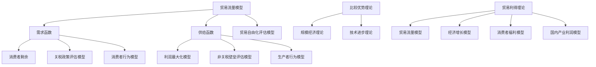

                 

### 《数学与贸易政策：国际贸易的数学模型》

> 关键词：国际贸易、贸易政策、数学模型、关税、非关税壁垒、贸易自由化、区域贸易协定

> 摘要：本文旨在探讨数学模型在贸易政策分析中的应用，重点介绍了关税、非关税壁垒、贸易自由化和区域贸易协定的数学模型及其在政策制定和评估中的重要作用。通过详细的分析和案例研究，本文揭示了数学模型在国际贸易研究中的核心地位，为政策制定者提供了科学决策的依据。

## 目录

### 《数学与贸易政策：国际贸易的数学模型》

#### 第一部分：引论

1. **第1章：数学与贸易政策概述**
   1.1 国际贸易中的数学建模
   1.2 贸易政策的主要形式
   1.3 数学建模在贸易政策分析中的应用

2. **第2章：国际贸易的基本概念**
   2.1 国民收入与经济增长
   2.2 消费者行为理论
   2.3 生产者行为理论
   2.4 贸易利得理论

#### 第二部分：贸易政策的数学模型

3. **第3章：关税的数学模型**
   3.1 关税的概念与影响
   3.2 关税的数学模型构建
   3.3 关税政策的效果分析
   3.4 关税政策的案例分析

4. **第4章：非关税壁垒的数学模型**
   4.1 非关税壁垒的概念与形式
   4.2 非关税壁垒的数学模型构建
   4.3 非关税壁垒的政策效果
   4.4 非关税壁垒的案例分析

5. **第5章：贸易自由化的数学模型**
   5.1 贸易自由化的概念与形式
   5.2 贸易自由化的数学模型构建
   5.3 贸易自由化的政策效果
   5.4 贸易自由化的案例分析

6. **第6章：区域贸易协定的数学模型**
   6.1 区域贸易协定的概念与形式
   6.2 区域贸易协定的数学模型构建
   6.3 区域贸易协定的政策效果
   6.4 区域贸易协定的案例分析

7. **第7章：贸易政策的数学模型与应用**
   7.1 贸易政策评估的数学模型
   7.2 贸易政策模拟的数学模型
   7.3 贸易政策制定与调整的数学模型
   7.4 贸易政策决策支持系统

#### 第三部分：国际贸易数学模型的核心概念与联系

8. **第8章：核心概念与联系**
   8.1 贸易政策与经济增长的关系
   8.2 贸易政策与消费者行为的关系
   8.3 贸易政策与生产者行为的关系
   8.4 贸易利得理论的数学模型

#### 附录

9. **附录A：数学公式与模型总结**
   9.1 关键数学公式
   9.2 贸易政策模型的 Mermaid 流程图

10. **附录B：核心算法原理讲解**
    10.1 关税政策效果的算法原理
    10.2 非关税壁垒政策效果的算法原理
    10.3 贸易自由化政策效果的算法原理

11. **附录C：数学模型与公式详细讲解**
    11.1 贸易利得理论的数学模型
    11.2 贸易政策的数学模型构建

12. **附录D：项目实战案例**
    12.1 贸易政策评估的项目实战
    12.2 贸易政策模拟的项目实战
    12.3 贸易政策制定与调整的项目实战
    12.4 贸易政策决策支持系统的项目实战

13. **附录E：代码解读与分析**
    13.1 关税政策评估的代码解读
    13.2 非关税壁垒政策评估的代码解读
    13.3 贸易自由化政策评估的代码解读
    13.4 贸易政策制定与调整的代码解读
    13.5 贸易政策决策支持系统的代码解读

---

在接下来的内容中，我们将逐步深入探讨国际贸易中的数学模型，从基础概念到具体应用，为读者呈现一个全面、系统的贸易政策数学模型分析。希望通过本文，读者能够更好地理解数学模型在国际贸易研究中的重要性，并能够在实际工作中运用这些模型进行有效的贸易政策分析和决策。

---

### 第一部分：引论

#### 第1章：数学与贸易政策概述

国际贸易是现代经济体系中不可或缺的一部分，它促进了全球经济的增长和繁荣。然而，国际贸易也伴随着复杂的经济关系和政策制定，这就需要我们运用数学模型来进行深入的分析和预测。数学模型在贸易政策分析中的应用，不仅能够帮助我们理解贸易政策的本质，还能够为政策制定提供科学依据。

本章将首先介绍国际贸易中的数学建模，接着讨论贸易政策的主要形式，并探讨数学建模在贸易政策分析中的应用。通过这一章节，读者将了解数学模型在贸易政策研究中的重要性，以及如何运用这些模型来分析和解决实际贸易问题。

#### 1.1 国际贸易中的数学建模

国际贸易中的数学建模是指运用数学方法来描述和分析国际贸易现象，从而帮助经济学家和政策制定者理解贸易行为和结果。数学模型可以用来模拟贸易流量、价格机制、政策效应等，为贸易政策的制定和评估提供量化依据。

1. **贸易流量模型**

贸易流量模型是用来描述两个或多个国家之间的贸易流量。这些模型通常基于供需关系、价格机制、消费者行为和生产者行为等因素。例如，需求函数和供给函数可以用以下数学模型表示：

   - 需求函数：\( D(p, y) = f(p, y) \)
     - \( D \)：贸易流量
     - \( p \)：价格
     - \( y \)：其他影响因素，如收入、偏好等

   - 供给函数：\( S(p, c) = g(p, c) \)
     - \( S \)：贸易流量
     - \( p \)：价格
     - \( c \)：其他影响因素，如成本、技术等

   通过这些模型，我们可以分析不同价格和政策变化对贸易流量的影响。

2. **价格机制模型**

价格机制模型是用来描述价格在市场中的形成和调节过程。在贸易政策分析中，价格机制模型可以帮助我们理解关税、汇率等政策如何影响价格，并进一步影响贸易流量。以下是一个简单的价格机制模型：

   - 价格形成：\( P = f(C, T, M) \)
     - \( P \)：价格
     - \( C \)：生产成本
     - \( T \)：税收或补贴
     - \( M \)：市场需求

   - 价格调节：\( \Delta P = h(\Delta C, \Delta T, \Delta M) \)
     - \( \Delta P \)：价格变化量
     - \( \Delta C \)：生产成本变化量
     - \( \Delta T \)：税收或补贴变化量
     - \( \Delta M \)：市场需求变化量

   通过这个模型，我们可以分析政策变化如何影响市场价格，以及市场价格如何影响贸易流量。

3. **消费者行为模型**

消费者行为模型是用来描述消费者在不同市场条件下的消费行为。这些模型可以帮助我们理解消费者如何在不同价格和政策变化下做出消费决策。以下是一个简单的消费者行为模型：

   - 消费决策：\( C(p, y) = \min \{ w, f(p, y) \} \)
     - \( C \)：消费量
     - \( p \)：价格
     - \( y \)：收入
     - \( w \)：工资

   - 消费效用：\( U(C) = g(C) \)
     - \( U \)：效用
     - \( C \)：消费量

   通过这个模型，我们可以分析消费者如何在不同价格和政策变化下调整消费行为，以及这对贸易流量和市场价格的影响。

4. **生产者行为模型**

生产者行为模型是用来描述生产者在不同市场条件下的生产行为。这些模型可以帮助我们理解生产者如何在不同价格和政策变化下调整生产决策。以下是一个简单的生产者行为模型：

   - 生产决策：\( P(c, p) = \min \{ c, h(p) \} \)
     - \( P \)：生产量
     - \( c \)：成本
     - \( p \)：价格

   - 生产利润：\( \Pi(p) = p \cdot P(c, p) - c \)
     - \( \Pi \)：利润
     - \( p \)：价格
     - \( P(c, p) \)：生产量

   通过这个模型，我们可以分析生产者如何在不同价格和政策变化下调整生产决策，以及这对贸易流量和市场价格的影响。

#### 1.2 贸易政策的主要形式

贸易政策是政府为了影响国际贸易行为而制定的一系列政策措施。贸易政策的主要形式包括关税、非关税壁垒、贸易自由化和区域贸易协定。以下是对这些贸易政策形式的简要介绍：

1. **关税**

关税是政府对进口商品征收的税收。关税的主要目的是增加进口商品的价格，从而保护国内产业。关税的数学模型可以用来分析关税对贸易流量、市场价格和国内产业的影响。以下是一个简单的关税模型：

   - 关税收入：\( R(t) = t \cdot Q \)
     - \( R \)：关税收入
     - \( t \)：关税率
     - \( Q \)：进口量

   - 国内市场价格：\( P_D = P_W + t \)
     - \( P_D \)：国内市场价格
     - \( P_W \)：世界市场价格

   通过这个模型，我们可以分析关税对进口量和国内市场价格的影响，以及这对贸易流量和国内产业的影响。

2. **非关税壁垒**

非关税壁垒是除关税以外的其他贸易限制措施，如配额、进口限制、技术壁垒等。非关税壁垒的数学模型可以用来分析非关税壁垒对贸易流量、市场价格和国内产业的影响。以下是一个简单的非关税壁垒模型：

   - 配额限制：\( Q \leq Q_{\text{max}} \)
     - \( Q \)：实际进口量
     - \( Q_{\text{max}} \)：配额限制量

   - 技术壁垒：\( T \geq T_{\text{min}} \)
     - \( T \)：进口商品技术要求
     - \( T_{\text{min}} \)：最低技术要求

   通过这个模型，我们可以分析非关税壁垒对进口量和国内市场价格的影响，以及这对贸易流量和国内产业的影响。

3. **贸易自由化**

贸易自由化是指减少或取消贸易限制措施，促进自由贸易。贸易自由化的数学模型可以用来分析贸易自由化对贸易流量、市场价格和国内产业的影响。以下是一个简单的贸易自由化模型：

   - 关税率减少：\( t \downarrow \)
     - \( t \)：关税率

   - 非关税壁垒取消：\( Q_{\text{max}} \uparrow \)
     - \( Q_{\text{max}} \)：配额限制量

   - 技术壁垒降低：\( T \downarrow \)
     - \( T \)：进口商品技术要求

   通过这个模型，我们可以分析贸易自由化对进口量和国内市场价格的影响，以及这对贸易流量和国内产业的影响。

4. **区域贸易协定**

区域贸易协定是指两个或多个国家之间签订的贸易协定，旨在减少或取消贸易限制措施，促进区域内的自由贸易。区域贸易协定的数学模型可以用来分析区域贸易协定对贸易流量、市场价格和国内产业的影响。以下是一个简单的区域贸易协定模型：

   - 区域内关税减少：\( t_{\text{intra}} \downarrow \)
     - \( t_{\text{intra}} \)：区域内关税率

   - 区域内非关税壁垒减少：\( Q_{\text{max}} \uparrow \)
     - \( Q_{\text{max}} \)：配额限制量

   - 区域内技术壁垒降低：\( T_{\text{intra}} \downarrow \)
     - \( T_{\text{intra}} \)：区域内技术要求

   通过这个模型，我们可以分析区域贸易协定对进口量和国内市场价格的影响，以及这对贸易流量和国内产业的影响。

#### 1.3 数学建模在贸易政策分析中的应用

数学建模在贸易政策分析中的应用非常广泛，主要包括以下几个方面：

1. **政策评估**

数学模型可以用来评估贸易政策的效应，如关税、非关税壁垒、贸易自由化和区域贸易协定等。通过这些模型，我们可以分析政策变化对贸易流量、市场价格和国内产业的影响，为政策制定提供科学依据。

2. **政策模拟**

数学模型可以用来模拟政策变化的结果，帮助我们预测政策实施后的经济效应。通过这些模型，我们可以分析不同政策方案的效果，为政策制定者提供决策参考。

3. **政策制定**

数学模型可以用来辅助政策制定，帮助我们设计有效的贸易政策。通过这些模型，我们可以分析政策目标、政策手段和政策效果，为政策制定提供科学指导。

4. **政策调整**

数学模型可以用来评估政策调整的效果，帮助我们确定何时以及如何调整政策。通过这些模型，我们可以分析政策调整对经济的影响，为政策调整提供科学依据。

总之，数学建模是贸易政策分析的重要工具，它能够帮助我们深入理解贸易政策的本质，为政策制定提供科学依据。通过本章的介绍，读者应该对国际贸易中的数学建模和贸易政策的主要形式有了初步了解，接下来我们将进一步探讨国际贸易的基本概念和贸易政策的数学模型。

---

### 第一部分：引论

#### 第2章：国际贸易的基本概念

国际贸易的基本概念是理解贸易政策和贸易模型的基础。在这一章中，我们将探讨几个关键概念，包括国民收入与经济增长、消费者行为理论、生产者行为理论和贸易利得理论。通过这些基本概念的理解，我们可以更好地构建和分析贸易政策的数学模型。

#### 2.1 国民收入与经济增长

国民收入是指一个国家在一定时期内生产的所有最终商品和服务的市场价值总和。经济增长则是指一个国家长期内生产能力的增加，这通常表现为国内生产总值（GDP）的持续上升。国民收入与经济增长密切相关，二者共同构成了国际贸易分析的重要基础。

1. **GDP与经济增长的关系**

GDP是衡量国家经济活动的重要指标，通常采用支出法、收入法和生产法计算。其中，支出法是最常用的方法，它将GDP分为消费、投资、政府支出和净出口四部分。经济增长可以通过以下数学模型表示：

   \[ GDP_{t+1} = GDP_t + \Delta GDP \]

   其中，\( GDP_t \)表示当前时期的GDP，\( \Delta GDP \)表示经济增长量。

2. **国际贸易与经济增长的关系**

国际贸易是经济增长的重要驱动力，通过国际贸易，国家可以获取更多的资源和技术，提高生产效率，促进经济增长。以下是国际贸易与经济增长关系的数学模型：

   \[ GDP_{t+1} = GDP_t + \alpha \cdot (X_t - M_t) \]

   其中，\( X_t \)表示出口额，\( M_t \)表示进口额，\( \alpha \)是出口对经济增长的边际贡献率。

#### 2.2 消费者行为理论

消费者行为理论研究消费者在市场上如何做出消费决策，这些决策受到价格、收入、偏好等因素的影响。在贸易政策分析中，消费者行为理论帮助我们理解消费者在不同政策下的消费行为，从而预测政策对市场的影响。

1. **需求函数**

需求函数描述了消费者在不同价格和收入水平下的消费量。以下是一个简单的需求函数模型：

   \[ D(p, y) = a - b \cdot p + \gamma \cdot y \]

   其中，\( D \)表示消费量，\( p \)表示价格，\( y \)表示收入，\( a \)、\( b \)和\( \gamma \)是参数。

2. **收入效应与替代效应**

收入效应和替代效应是理解需求函数变化的重要概念。收入效应描述了收入变化对消费者需求量的影响，而替代效应描述了价格变化对消费者需求量的影响。以下是收入效应和替代效应的数学模型：

   - 收入效应：\( \Delta D_{\text{income}} = \gamma \cdot \Delta y \)
     - \( \Delta D_{\text{income}} \)是收入效应导致的消费量变化，\( \gamma \)是收入弹性系数，\( \Delta y \)是收入变化量。

   - 替代效应：\( \Delta D_{\text{substitution}} = -b \cdot \Delta p \)
     - \( \Delta D_{\text{substitution}} \)是替代效应导致的消费量变化，\( b \)是价格弹性系数，\( \Delta p \)是价格变化量。

#### 2.3 生产者行为理论

生产者行为理论研究生产者在市场上如何做出生产决策，这些决策受到成本、技术、市场需求等因素的影响。在贸易政策分析中，生产者行为理论帮助我们理解生产者在不同政策下的生产行为，从而预测政策对市场的影响。

1. **供给函数**

供给函数描述了生产者在不同价格和成本水平下的生产量。以下是一个简单的供给函数模型：

   \[ S(p, c) = a - b \cdot c + \gamma \cdot p \]

   其中，\( S \)表示生产量，\( p \)表示价格，\( c \)表示成本，\( a \)、\( b \)和\( \gamma \)是参数。

2. **利润最大化**

生产者的目标是最大化利润，利润最大化可以通过以下数学模型表示：

   \[ \max \Pi = p \cdot S(p, c) - c \]

   其中，\( \Pi \)表示利润，\( p \)表示价格，\( S(p, c) \)是供给函数，\( c \)表示成本。

#### 2.4 贸易利得理论

贸易利得理论研究贸易如何为参与国带来利益。贸易利得可以分为静态贸易利得和动态贸易利得，静态贸易利得主要来源于比较优势，而动态贸易利得则来源于规模经济和技术进步。

1. **比较优势理论**

比较优势理论由大卫·李嘉图提出，认为贸易的产生是因为不同国家在生产同一种商品时具有不同的生产效率。以下是比较优势理论的数学模型：

   \[ \text{贸易利得} = (\text{生产效率高} - \text{生产效率低}) \cdot \text{贸易量} \]

   这个模型表明，贸易利得取决于两国的生产效率差异和贸易量。

2. **规模经济理论**

规模经济理论认为，随着生产规模的扩大，单位成本会降低，从而带来更高的利润。以下是规模经济理论的数学模型：

   \[ \text{利润} = \frac{\text{生产量}}{\text{固定成本}} - \text{可变成本} \]

   这个模型表明，利润随着生产量的增加而增加，但固定成本和可变成本的约束也需要考虑。

3. **技术进步理论**

技术进步理论认为，技术创新和知识传播可以提高生产效率，从而促进贸易利得。以下是技术进步理论的数学模型：

   \[ \text{贸易利得} = \text{技术进步率} \cdot \text{贸易量} \]

   这个模型表明，技术进步率越高，贸易利得越大。

通过以上对国民收入与经济增长、消费者行为理论、生产者行为理论和贸易利得理论的探讨，我们可以构建更复杂的贸易政策数学模型，为政策制定提供科学依据。在接下来的章节中，我们将深入探讨各种贸易政策的数学模型，以帮助读者更好地理解国际贸易的复杂性和政策效应。

---

### 第二部分：贸易政策的数学模型

贸易政策的数学模型是理解国际贸易现象和预测政策效应的重要工具。在这一部分，我们将详细介绍几种主要的贸易政策模型，包括关税的数学模型、非关税壁垒的数学模型、贸易自由化的数学模型以及区域贸易协定的数学模型。通过这些模型的分析，我们可以更深入地理解贸易政策对国际贸易的影响。

#### 第3章：关税的数学模型

关税是指政府对外国商品征收的税，其目的是保护国内产业或调节国际贸易。关税的数学模型可以帮助我们分析关税对贸易流量、市场价格和国内产业的影响。

#### 3.1 关税的概念与影响

关税通常以进口商品的价格为基准计算。设\( P \)为进口商品的世界市场价格，\( P_D \)为国内市场价格，\( t \)为关税率。关税后的国内市场价格可以表示为：

\[ P_D = P + t \]

关税对贸易流量的影响可以通过以下数学模型来分析：

\[ Q_D = \frac{P_D}{P} \cdot Q \]

其中，\( Q_D \)为国内市场的进口量，\( Q \)为世界市场的进口量。当关税增加时，国内市场价格\( P_D \)上升，导致进口量\( Q_D \)下降。

#### 3.2 关税的数学模型构建

关税的数学模型构建通常涉及以下方程：

1. **关税收入模型**

关税收入是政府征收关税后获得的收入，可以用以下公式表示：

\[ R = t \cdot Q \]

其中，\( R \)为关税收入，\( t \)为关税率，\( Q \)为进口量。

2. **国内市场价格模型**

关税后的国内市场价格可以表示为：

\[ P_D = P + t \]

其中，\( P_D \)为国内市场价格，\( P \)为世界市场价格，\( t \)为关税率。

3. **贸易流量模型**

关税对贸易流量的影响可以通过以下公式表示：

\[ Q_D = \frac{P_D}{P} \cdot Q \]

其中，\( Q_D \)为国内市场的进口量，\( Q \)为世界市场的进口量，\( P_D \)为国内市场价格，\( P \)为世界市场价格。

#### 3.3 关税政策的效果分析

关税政策的效果分析可以通过以下模型进行分析：

1. **对国内产业的影响**

关税提高了国内市场价格，从而增加了国内产业的生产利润。利润最大化的数学模型为：

\[ \max \Pi = (P_D + t) \cdot Q_D - c \]

其中，\( \Pi \)为利润，\( P_D \)为国内市场价格，\( t \)为关税率，\( Q_D \)为国内市场的进口量，\( c \)为生产成本。

2. **对消费者的影响**

关税增加了国内市场价格，导致消费者购买力下降。消费者剩余可以通过以下公式表示：

\[ CS = \int (P^* - P_D) \cdot dQ \]

其中，\( P^* \)为消费者的保留价格，\( P_D \)为国内市场价格，\( dQ \)为消费量的微小变化。

3. **对贸易流量的影响**

关税导致贸易流量的减少，可以用以下模型表示：

\[ Q_D = \frac{P_D}{P} \cdot Q \]

其中，\( Q_D \)为国内市场的进口量，\( Q \)为世界市场的进口量，\( P_D \)为国内市场价格，\( P \)为世界市场价格。

#### 3.4 关税政策的案例分析

以下是一个简单的关税政策案例分析：

假设一个国家进口汽车，世界市场价格为1000美元，关税率为20%。分析关税对该国汽车市场的影响。

1. **关税收入**

关税收入为：

\[ R = t \cdot Q = 0.20 \cdot Q \]

2. **国内市场价格**

关税后的国内市场价格为：

\[ P_D = P + t = 1000 + 0.20 \cdot 1000 = 1200 \]

3. **贸易流量**

关税导致进口量减少，假设初始进口量为100辆，则关税后的进口量为：

\[ Q_D = \frac{P_D}{P} \cdot Q = \frac{1200}{1000} \cdot 100 = 120 \]

4. **利润影响**

假设生产成本为500美元，则关税后的利润为：

\[ \Pi = (P_D + t) \cdot Q_D - c = (1200 + 0.20 \cdot 1000) \cdot 120 - 500 \cdot 120 = 204000 - 60000 = 144000 \]

5. **消费者剩余**

消费者剩余为：

\[ CS = \int (P^* - P_D) \cdot dQ \]

假设消费者的保留价格为1500美元，则消费者剩余为：

\[ CS = \int (1500 - 1200) \cdot dQ = 300 \cdot 100 = 30000 \]

通过这个案例，我们可以看到关税政策对进口量、国内市场价格、利润和消费者剩余的影响。

---

关税的数学模型是一个基本的贸易政策工具，通过它我们可以分析关税对市场的影响，为政策制定提供科学依据。在下一章中，我们将探讨非关税壁垒的数学模型，继续深入分析贸易政策的效应。

---

#### 第4章：非关税壁垒的数学模型

非关税壁垒是指除了关税之外的其他贸易限制措施，如配额、进口限制、技术壁垒等。这些措施同样对国际贸易产生重要影响，其数学模型有助于我们理解和预测政策效果。

#### 4.1 非关税壁垒的概念与形式

非关税壁垒的种类繁多，主要包括以下几种形式：

1. **配额**

配额是指政府对进口商品数量进行的限制。配额可以通过以下数学模型表示：

\[ Q_{\text{max}} = Q_0 + \alpha \cdot (T - T_0) \]

其中，\( Q_{\text{max}} \)为最大进口量，\( Q_0 \)为初始进口量，\( \alpha \)为配额变化率，\( T \)为贸易政策变量（如关税率、补贴率等），\( T_0 \)为初始贸易政策变量。

2. **进口限制**

进口限制是指政府通过法律或行政手段限制某些商品的进口。进口限制可以用以下数学模型表示：

\[ Q_D \leq Q_{\text{max}} \]

其中，\( Q_D \)为实际进口量，\( Q_{\text{max}} \)为最大进口量。

3. **技术壁垒**

技术壁垒是指政府通过设定高技术标准来限制某些商品的进口。技术壁垒可以用以下数学模型表示：

\[ T \geq T_{\text{min}} \]

其中，\( T \)为进口商品的技术要求，\( T_{\text{min}} \)为最低技术要求。

#### 4.2 非关税壁垒的数学模型构建

非关税壁垒的数学模型构建通常涉及以下几个关键方程：

1. **配额模型**

配额模型可以用以下公式表示：

\[ Q_{\text{max}} = Q_0 + \alpha \cdot (T - T_0) \]

其中，\( Q_{\text{max}} \)为最大进口量，\( Q_0 \)为初始进口量，\( \alpha \)为配额变化率，\( T \)为贸易政策变量，\( T_0 \)为初始贸易政策变量。

2. **进口限制模型**

进口限制模型可以用以下公式表示：

\[ Q_D \leq Q_{\text{max}} \]

其中，\( Q_D \)为实际进口量，\( Q_{\text{max}} \)为最大进口量。

3. **技术壁垒模型**

技术壁垒模型可以用以下公式表示：

\[ T \geq T_{\text{min}} \]

其中，\( T \)为进口商品的技术要求，\( T_{\text{min}} \)为最低技术要求。

#### 4.3 非关税壁垒的政策效果

非关税壁垒的政策效果可以通过以下模型进行分析：

1. **对贸易流量的影响**

非关税壁垒会导致贸易流量的减少，可以用以下公式表示：

\[ Q_D = Q_{\text{max}} - \beta \cdot (T - T_0) \]

其中，\( Q_D \)为实际进口量，\( Q_{\text{max}} \)为最大进口量，\( \beta \)为贸易流量受影响的程度，\( T \)为贸易政策变量，\( T_0 \)为初始贸易政策变量。

2. **对市场价格的影响**

非关税壁垒会影响市场价格，可以用以下公式表示：

\[ P_D = P + \gamma \cdot (T - T_0) \]

其中，\( P_D \)为国内市场价格，\( P \)为世界市场价格，\( \gamma \)为市场价格受影响的程度，\( T \)为贸易政策变量，\( T_0 \)为初始贸易政策变量。

3. **对国内产业的影响**

非关税壁垒会提高国内产业的生产利润，可以用以下公式表示：

\[ \Pi = (P_D + t) \cdot Q_D - c \]

其中，\( \Pi \)为利润，\( P_D \)为国内市场价格，\( t \)为关税率，\( Q_D \)为实际进口量，\( c \)为生产成本。

#### 4.4 非关税壁垒的案例分析

以下是一个简单的非关税壁垒案例分析：

假设一个国家设定了汽车进口配额，初始进口量为100辆，配额变化率为0.1。如果关税率为10%，分析该政策对该国汽车市场的影响。

1. **最大进口量**

最大进口量为：

\[ Q_{\text{max}} = Q_0 + \alpha \cdot (T - T_0) = 100 + 0.1 \cdot (0.10 - 0) = 100.1 \]

2. **实际进口量**

实际进口量为：

\[ Q_D = Q_{\text{max}} - \beta \cdot (T - T_0) = 100.1 - \beta \cdot (0.10 - 0) \]

假设贸易流量受影响的程度为0.2，则实际进口量为：

\[ Q_D = 100.1 - 0.2 \cdot 0.10 = 99.8 \]

3. **国内市场价格**

关税后的国内市场价格为：

\[ P_D = P + \gamma \cdot (T - T_0) = 1000 + \gamma \cdot (0.10 - 0) \]

假设市场价格受影响的程度为0.05，则国内市场价格为：

\[ P_D = 1000 + 0.05 \cdot 0.10 = 1005 \]

4. **利润影响**

假设生产成本为800美元，则关税后的利润为：

\[ \Pi = (P_D + t) \cdot Q_D - c = (1005 + 0.10 \cdot 1000) \cdot 99.8 - 800 \cdot 99.8 = 198900 - 79840 = 118560 \]

通过这个案例，我们可以看到非关税壁垒对进口量、国内市场价格和利润的影响。

---

非关税壁垒的数学模型是一个重要的贸易政策分析工具，通过它我们可以更准确地预测政策效果，为政策制定提供科学依据。在下一章中，我们将探讨贸易自由化的数学模型，继续深入分析贸易政策的影响。

---

#### 第5章：贸易自由化的数学模型

贸易自由化是指减少或取消贸易限制措施，促进自由贸易。贸易自由化旨在提高贸易效率，促进经济增长，并改善消费者的福利。在这一章中，我们将介绍贸易自由化的概念与形式，以及其数学模型的构建和应用。

#### 5.1 贸易自由化的概念与形式

贸易自由化通常涉及以下几个方面：

1. **关税减免**

关税减免是指减少或取消关税，以降低进口商品的成本。关税减免可以通过以下数学模型表示：

\[ t \downarrow \]

其中，\( t \)为关税率，当\( t \)趋向于0时，表示关税完全减免。

2. **非关税壁垒取消**

非关税壁垒取消是指取消配额、进口限制和技术壁垒等措施，以消除贸易障碍。非关税壁垒取消可以用以下数学模型表示：

\[ Q_{\text{max}} \uparrow, \ T_{\text{min}} \downarrow \]

其中，\( Q_{\text{max}} \)为最大进口量，\( T_{\text{min}} \)为最低技术要求。当这些变量趋向于最大值或零时，表示非关税壁垒的取消。

3. **贸易自由化协议**

贸易自由化协议是指两个或多个国家之间签订的协议，旨在减少或取消贸易限制。贸易自由化协议可以用以下数学模型表示：

\[ T_{\text{intra}} \downarrow \]

其中，\( T_{\text{intra}} \)为区域内关税率，当这些变量趋向于零时，表示贸易自由化协议的实施。

#### 5.2 贸易自由化的数学模型构建

贸易自由化的数学模型构建通常涉及以下几个关键方程：

1. **关税减免模型**

关税减免模型可以用以下公式表示：

\[ t \downarrow \]

当关税率\( t \)趋向于0时，进口商品的成本降低，贸易流量增加。可以用以下公式表示贸易流量变化：

\[ Q_D \uparrow \]

其中，\( Q_D \)为国内市场的进口量。

2. **非关税壁垒取消模型**

非关税壁垒取消模型可以用以下公式表示：

\[ Q_{\text{max}} \uparrow, \ T_{\text{min}} \downarrow \]

当非关税壁垒取消时，进口限制和技术壁垒减少，贸易流量增加。可以用以下公式表示贸易流量变化：

\[ Q_D \uparrow \]

其中，\( Q_D \)为国内市场的进口量。

3. **贸易自由化协议模型**

贸易自由化协议模型可以用以下公式表示：

\[ T_{\text{intra}} \downarrow \]

当区域内关税率\( T_{\text{intra}} \)趋向于零时，区域内贸易流量增加。可以用以下公式表示贸易流量变化：

\[ Q_D \uparrow \]

其中，\( Q_D \)为国内市场的进口量。

#### 5.3 贸易自由化的政策效果

贸易自由化的政策效果可以通过以下模型进行分析：

1. **对贸易流量的影响**

贸易自由化导致贸易流量的增加，可以用以下公式表示：

\[ Q_D \uparrow \]

2. **对市场价格的影响**

贸易自由化导致市场价格下降，可以用以下公式表示：

\[ P_D \downarrow \]

其中，\( P_D \)为国内市场价格，当关税和非关税壁垒减少时，国内市场价格趋近于世界市场价格。

3. **对国内产业的影响**

贸易自由化对国内产业的影响取决于关税和非关税壁垒的取消程度。如果完全取消，国内产业可能会面临进口竞争，从而导致生产减少。可以用以下公式表示国内产业的生产变化：

\[ P \downarrow \]

其中，\( P \)为国内产业的生产量。

4. **对消费者的影响**

贸易自由化导致消费者福利增加，可以用以下公式表示：

\[ CS \uparrow \]

其中，\( CS \)为消费者剩余，消费者剩余随着进口商品价格的下降而增加。

#### 5.4 贸易自由化的案例分析

以下是一个简单的贸易自由化案例分析：

假设一个国家与另一个国家签订了贸易自由化协议，关税率从10%降低到0%。分析该政策对该国汽车市场的影响。

1. **关税减免**

关税减免导致关税率降低：

\[ t \downarrow \]

2. **贸易流量**

贸易流量增加，可以用以下公式表示：

\[ Q_D \uparrow \]

3. **国内市场价格**

关税后的国内市场价格降低，可以用以下公式表示：

\[ P_D = P + t \downarrow \]

4. **利润影响**

假设生产成本为1000美元，则关税后的利润为：

\[ \Pi = (P_D + t) \cdot Q_D - c \uparrow \]

5. **消费者剩余**

消费者剩余增加，可以用以下公式表示：

\[ CS = \int (P^* - P_D) \cdot dQ \uparrow \]

通过这个案例，我们可以看到贸易自由化对进口量、国内市场价格、利润和消费者剩余的积极影响。

---

贸易自由化的数学模型是一个重要的工具，它帮助我们理解贸易自由化政策对国际贸易的效应。通过这些模型，我们可以更科学地制定和评估贸易政策，以实现经济增长和消费者福利的最大化。在下一章中，我们将探讨区域贸易协定的数学模型，进一步分析国际贸易中的政策效应。

---

#### 第6章：区域贸易协定的数学模型

区域贸易协定（Regional Trade Agreement，RTA）是指两个或多个国家之间签订的贸易协定，旨在促进区域内国家之间的自由贸易。这些协定通常涉及关税减免、非关税壁垒的取消以及贸易政策的协调。本章将介绍区域贸易协定的概念与形式，并构建其数学模型，分析区域贸易协定对贸易流量的影响。

#### 6.1 区域贸易协定的概念与形式

区域贸易协定通常可以分为以下几种形式：

1. **自由贸易区**

自由贸易区（Free Trade Area，FTA）是指成员国之间取消关税和非关税壁垒，但每个成员国仍保留对非成员国征收关税的权力。自由贸易区的数学模型可以表示为：

\[ T_{\text{intra}} \downarrow \]

其中，\( T_{\text{intra}} \)表示区域内关税率。

2. **关税联盟**

关税联盟（Customs Union）是指成员国之间不仅取消关税和非关税壁垒，还采取统一的对外关税政策。关税联盟的数学模型可以表示为：

\[ T_{\text{intra}} = T_{\text{out}} \]

其中，\( T_{\text{intra}} \)表示区域内关税率，\( T_{\text{out}} \)表示对外关税率。

3. **共同市场**

共同市场（Common Market）是指成员国之间不仅取消关税和非关税壁垒，还允许劳动力和资本的自由流动。共同市场的数学模型可以表示为：

\[ T_{\text{intra}} \downarrow, \ L_{\text{free}} \uparrow, \ C_{\text{free}} \uparrow \]

其中，\( L_{\text{free}} \)表示劳动力的自由流动，\( C_{\text{free}} \)表示资本的自由流动。

4. **经济联盟**

经济联盟（Economic Union）是指成员国之间不仅取消关税和非关税壁垒，还实现经济政策的协调，如货币统一和财政政策协调。经济联盟的数学模型可以表示为：

\[ T_{\text{intra}} \downarrow, \ M_{\text{uni}} \uparrow, \ F_{\text{coor}} \uparrow \]

其中，\( M_{\text{uni}} \)表示货币统一，\( F_{\text{coor}} \)表示财政政策协调。

#### 6.2 区域贸易协定的数学模型构建

区域贸易协定的数学模型构建通常涉及以下几个关键方程：

1. **关税减免模型**

关税减免模型可以用以下公式表示：

\[ T_{\text{intra}} \downarrow \]

当区域内关税率\( T_{\text{intra}} \)降低时，区域内贸易流量增加。可以用以下公式表示贸易流量变化：

\[ Q_D \uparrow \]

其中，\( Q_D \)为区域内国家的进口量。

2. **非关税壁垒取消模型**

非关税壁垒取消模型可以用以下公式表示：

\[ Q_{\text{max}} \uparrow, \ T_{\text{min}} \downarrow \]

当非关税壁垒取消时，区域内贸易流量增加。可以用以下公式表示贸易流量变化：

\[ Q_D \uparrow \]

其中，\( Q_D \)为区域内国家的进口量。

3. **对外关税模型**

对外关税模型可以用以下公式表示：

\[ T_{\text{out}} \uparrow \]

当区域内关税率\( T_{\text{out}} \)提高时，对外贸易流量减少。可以用以下公式表示贸易流量变化：

\[ Q_O \downarrow \]

其中，\( Q_O \)为对外贸易流量。

#### 6.3 区域贸易协定的政策效果

区域贸易协定的政策效果可以通过以下模型进行分析：

1. **对贸易流量的影响**

区域贸易协定导致区域内贸易流量的增加，可以用以下公式表示：

\[ Q_D \uparrow \]

2. **对市场价格的影响**

区域贸易协定导致市场价格下降，可以用以下公式表示：

\[ P_D \downarrow \]

其中，\( P_D \)为区域内国家的市场价格。

3. **对国内产业的影响**

区域贸易协定对国内产业的影响取决于区域内关税和非关税壁垒的取消程度。如果完全取消，国内产业可能会面临进口竞争，从而导致生产减少。可以用以下公式表示国内产业的生产变化：

\[ P \downarrow \]

其中，\( P \)为国内产业的生产量。

4. **对消费者的影响**

区域贸易协定导致消费者福利增加，可以用以下公式表示：

\[ CS \uparrow \]

其中，\( CS \)为消费者剩余，消费者剩余随着进口商品价格的下降而增加。

#### 6.4 区域贸易协定的案例分析

以下是一个简单的区域贸易协定案例分析：

假设有两个国家A和B，它们之间签订了自由贸易区协定，区域内关税率从10%降低到0%。分析该政策对两国汽车市场的影响。

1. **关税减免**

关税减免导致关税率降低：

\[ T_{\text{intra}} \downarrow \]

2. **贸易流量**

贸易流量增加，可以用以下公式表示：

\[ Q_D \uparrow \]

3. **国内市场价格**

关税后的国内市场价格降低，可以用以下公式表示：

\[ P_D = P + T_{\text{intra}} \downarrow \]

4. **利润影响**

假设生产成本为1000美元，则关税后的利润为：

\[ \Pi = (P_D + T_{\text{out}}) \cdot Q_D - c \uparrow \]

5. **消费者剩余**

消费者剩余增加，可以用以下公式表示：

\[ CS = \int (P^* - P_D) \cdot dQ \uparrow \]

通过这个案例，我们可以看到区域贸易协定对进口量、国内市场价格、利润和消费者剩余的积极影响。

---

区域贸易协定的数学模型为我们提供了一个分析区域贸易协定效应的框架。通过这些模型，我们可以更深入地理解区域贸易协定对贸易流量、市场价格、国内产业和消费者福利的影响。在下一章中，我们将探讨贸易政策的数学模型与应用，进一步分析贸易政策的实际应用和效果。

---

#### 第7章：贸易政策的数学模型与应用

贸易政策的数学模型在政策制定和评估中扮演着关键角色。在这一章中，我们将深入探讨贸易政策评估的数学模型、贸易政策模拟的数学模型、贸易政策制定与调整的数学模型，以及贸易政策决策支持系统。通过这些模型的详细分析和应用，我们将更好地理解如何利用数学工具来优化贸易政策。

#### 7.1 贸易政策评估的数学模型

贸易政策评估的数学模型用于分析不同贸易政策对经济的影响，包括关税、非关税壁垒、贸易自由化等。这些模型帮助我们预测政策变化的结果，从而为政策制定提供科学依据。

1. **关税政策评估模型**

关税政策评估模型通常涉及以下关键方程：

\[ R = t \cdot Q \]
\[ P_D = P + t \]
\[ Q_D = \frac{P_D}{P} \cdot Q \]

其中，\( R \)表示关税收入，\( t \)表示关税率，\( P \)表示世界市场价格，\( P_D \)表示国内市场价格，\( Q \)表示世界市场的进口量，\( Q_D \)表示国内市场的进口量。

通过这个模型，我们可以分析关税对贸易流量、市场价格和国内产业的影响。例如，提高关税率会导致国内市场价格上升，进口量减少，从而影响消费者福利和国内产业利润。

2. **非关税壁垒评估模型**

非关税壁垒评估模型通常涉及以下关键方程：

\[ Q_D \leq Q_{\text{max}} \]
\[ T \geq T_{\text{min}} \]
\[ Q_D = Q_{\text{max}} - \beta \cdot (T - T_0) \]
\[ P_D = P + \gamma \cdot (T - T_0) \]

其中，\( Q_D \)表示实际进口量，\( Q_{\text{max}} \)表示最大进口量，\( T \)表示贸易政策变量，\( T_0 \)表示初始贸易政策变量，\( \beta \)和\( \gamma \)表示贸易流量和价格受影响的程度。

通过这个模型，我们可以分析非关税壁垒对进口量、市场价格和国内产业的影响。例如，提高技术壁垒可能会导致进口量减少，国内市场价格上升，从而影响消费者福利和国内产业利润。

3. **贸易自由化评估模型**

贸易自由化评估模型通常涉及以下关键方程：

\[ t \downarrow \]
\[ Q_{\text{max}} \uparrow, \ T_{\text{min}} \downarrow \]
\[ Q_D \uparrow \]
\[ P_D \downarrow \]

通过这个模型，我们可以分析贸易自由化对进口量、市场价格、国内产业和消费者福利的影响。例如，降低关税率和取消非关税壁垒通常会导致进口量增加，国内市场价格下降，从而提高消费者福利和国内产业利润。

#### 7.2 贸易政策模拟的数学模型

贸易政策模拟的数学模型用于预测不同贸易政策变化对经济的影响。这些模型通常基于实际数据和假设条件，通过模拟不同政策方案的结果，帮助政策制定者选择最优政策。

1. **关税政策模拟模型**

关税政策模拟模型可以使用以下关键方程：

\[ \Delta R = t \cdot \Delta Q \]
\[ \Delta P_D = \Delta t \cdot \Delta Q \cdot \frac{1}{P} \]
\[ \Delta \Pi = (P_D + \Delta t) \cdot \Delta Q_D - c \]

其中，\( \Delta R \)表示关税收入的变化，\( \Delta t \)表示关税率的变化，\( \Delta Q \)表示进口量的变化，\( \Delta P_D \)表示国内市场价格的变化，\( \Delta \Pi \)表示利润的变化，\( c \)表示生产成本。

通过这个模型，我们可以模拟不同关税率变化对关税收入、国内市场价格和国内产业利润的影响，从而为政策制定提供参考。

2. **非关税壁垒模拟模型**

非关税壁垒模拟模型可以使用以下关键方程：

\[ \Delta Q_D = \Delta T \cdot \Delta Q \]
\[ \Delta P_D = \Delta T \cdot \Delta Q \cdot \frac{1}{P} \]
\[ \Delta \Pi = (P_D + \Delta T) \cdot \Delta Q_D - c \]

其中，\( \Delta Q_D \)表示实际进口量的变化，\( \Delta T \)表示贸易政策变量的变化，\( \Delta P_D \)表示国内市场价格的变化，\( \Delta \Pi \)表示利润的变化，\( c \)表示生产成本。

通过这个模型，我们可以模拟不同非关税壁垒变化对进口量、国内市场价格和国内产业利润的影响，从而为政策制定提供参考。

3. **贸易自由化模拟模型**

贸易自由化模拟模型可以使用以下关键方程：

\[ \Delta t \downarrow \]
\[ \Delta Q_{\text{max}} \uparrow, \ \Delta T_{\text{min}} \downarrow \]
\[ \Delta Q_D \uparrow \]
\[ \Delta P_D \downarrow \]

通过这个模型，我们可以模拟不同贸易自由化政策变化对进口量、国内市场价格、国内产业利润和消费者福利的影响，从而为政策制定提供参考。

#### 7.3 贸易政策制定与调整的数学模型

贸易政策制定与调整的数学模型用于确定最优贸易政策，并指导政策调整。这些模型通常基于目标函数和约束条件，通过优化算法找到最优政策组合。

1. **目标函数**

目标函数通常包括以下指标：

\[ \max \Pi \]
\[ \max CS \]
\[ \min P_D \]
\[ \max R \]

其中，\( \Pi \)表示利润，\( CS \)表示消费者剩余，\( P_D \)表示国内市场价格，\( R \)表示关税收入。

2. **约束条件**

约束条件通常包括以下限制：

\[ Q_D \leq Q_{\text{max}} \]
\[ T \geq T_{\text{min}} \]
\[ t \geq 0 \]
\[ P_D = P + t \]

通过目标函数和约束条件，我们可以构建优化模型，使用优化算法找到最优贸易政策。例如，我们可以使用线性规划、非线性规划或动态规划等方法来确定最优关税率、非关税壁垒水平或贸易自由化程度。

#### 7.4 贸易政策决策支持系统

贸易政策决策支持系统（Trade Policy Decision Support System，TPDSS）是一种基于计算机技术和数学模型的工具，用于辅助政策制定者制定和评估贸易政策。TPDSS通常包括以下几个模块：

1. **数据收集与处理模块**

该模块负责收集和处理与贸易政策相关的数据，包括贸易流量、市场价格、生产成本、消费者偏好等。

2. **模型构建与模拟模块**

该模块负责构建和运行不同的贸易政策模型，通过模拟不同政策方案的结果，为政策制定提供参考。

3. **优化与决策模块**

该模块负责基于目标函数和约束条件，使用优化算法确定最优贸易政策组合。

4. **可视化与分析模块**

该模块负责将模型结果以图表和报告的形式呈现，帮助政策制定者理解和分析政策效果。

通过这些模块的协同工作，TPDSS可以为政策制定者提供全面、科学的贸易政策决策支持。

---

贸易政策的数学模型与应用是理解国际贸易和政策制定的关键。通过这些模型，我们可以更准确地评估政策效果，制定和调整最优政策，为经济增长和消费者福利的最大化提供科学依据。在下一章中，我们将探讨国际贸易数学模型的核心概念与联系，进一步深化对贸易政策数学模型的理解。

---

#### 第8章：国际贸易数学模型的核心概念与联系

国际贸易数学模型是理解贸易政策效应和预测经济行为的重要工具。在本章中，我们将探讨国际贸易数学模型中的核心概念，以及这些概念之间的联系。通过这些核心概念和联系的分析，我们可以更深入地理解贸易政策的本质，并为政策制定提供科学依据。

#### 8.1 贸易政策与经济增长的关系

经济增长是国际贸易的核心目标之一，而贸易政策在促进经济增长中起着关键作用。贸易政策与经济增长的关系可以通过以下数学模型和概念来解释：

1. **贸易流量与经济增长的关系**

贸易流量是国际贸易的基础，它对经济增长有着直接的影响。贸易流量的增加可以带来更多的资源和技术，从而促进经济增长。贸易流量可以用以下数学模型表示：

\[ GDP_{t+1} = GDP_t + \alpha \cdot (X_t - M_t) \]

其中，\( GDP_t \)表示当前时期的国内生产总值，\( X_t \)表示出口额，\( M_t \)表示进口额，\( \alpha \)是出口对经济增长的边际贡献率。

2. **关税政策与经济增长的关系**

关税政策是贸易政策的重要组成部分，它可以影响贸易流量和市场价格。关税政策可以通过以下数学模型来分析其对经济增长的影响：

\[ GDP_{t+1} = GDP_t + \alpha \cdot \left( (P_W - t) \cdot (X_t - M_t) - c \right) \]

其中，\( P_W \)表示世界市场价格，\( t \)表示关税率，\( c \)表示生产成本。

3. **非关税壁垒与经济增长的关系**

非关税壁垒，如配额和技术壁垒，也会影响贸易流量和经济增长。非关税壁垒可以通过以下数学模型来分析其对经济增长的影响：

\[ GDP_{t+1} = GDP_t + \alpha \cdot \left( (P_W - T) \cdot (X_t - M_t) - c \right) \]

其中，\( T \)表示非关税壁垒水平。

4. **贸易自由化与经济增长的关系**

贸易自由化政策的实施可以减少关税和非关税壁垒，从而促进贸易流量和经济增长。贸易自由化可以通过以下数学模型来分析其对经济增长的影响：

\[ GDP_{t+1} = GDP_t + \alpha \cdot (X_t - M_t) \]

其中，\( X_t \)和\( M_t \)分别表示出口额和进口额。

#### 8.2 贸易政策与消费者行为的关系

消费者行为是国际贸易中的关键因素，贸易政策可以通过影响消费者行为来影响市场需求和价格。贸易政策与消费者行为的关系可以通过以下数学模型和概念来解释：

1. **需求函数与消费者行为的关系**

需求函数描述了消费者在不同价格和收入水平下的消费行为。需求函数可以用以下数学模型表示：

\[ D(p, y) = a - b \cdot p + \gamma \cdot y \]

其中，\( D \)表示消费量，\( p \)表示价格，\( y \)表示收入，\( a \)、\( b \)和\( \gamma \)是参数。

2. **关税政策与消费者行为的关系**

关税政策可以通过提高进口商品的价格来影响消费者行为。关税政策对消费者行为的影响可以通过以下数学模型来分析：

\[ D(p + t, y) = a - b \cdot (p + t) + \gamma \cdot y \]

其中，\( t \)表示关税率。

3. **非关税壁垒与消费者行为的关系**

非关税壁垒，如配额和技术壁垒，也会影响消费者行为。非关税壁垒对消费者行为的影响可以通过以下数学模型来分析：

\[ D(p, y) = a - b \cdot p + \gamma \cdot y - \delta \cdot T \]

其中，\( T \)表示非关税壁垒水平，\( \delta \)是参数。

4. **贸易自由化与消费者行为的关系**

贸易自由化政策的实施可以降低进口商品的价格，从而提高消费者福利。贸易自由化对消费者行为的影响可以通过以下数学模型来分析：

\[ D(p - t, y) = a - b \cdot (p - t) + \gamma \cdot y \]

其中，\( t \)表示关税率。

#### 8.3 贸易政策与生产者行为的关系

生产者行为是国际贸易中的另一个关键因素，贸易政策可以通过影响生产成本和利润来影响生产者的行为。贸易政策与生产者行为的关系可以通过以下数学模型和概念来解释：

1. **供给函数与生产者行为的关系**

供给函数描述了生产者在不同价格和成本水平下的生产行为。供给函数可以用以下数学模型表示：

\[ S(p, c) = a - b \cdot c + \gamma \cdot p \]

其中，\( S \)表示生产量，\( p \)表示价格，\( c \)表示成本，\( a \)、\( b \)和\( \gamma \)是参数。

2. **关税政策与生产者行为的关系**

关税政策可以通过提高国内市场价格来增加生产者的利润。关税政策对生产者行为的影响可以通过以下数学模型来分析：

\[ \Pi = (P_D + t) \cdot S(P_D, c) - c \]

其中，\( P_D \)表示国内市场价格，\( t \)表示关税率。

3. **非关税壁垒与生产者行为的关系**

非关税壁垒，如配额和技术壁垒，也会影响生产者的行为。非关税壁垒对生产者行为的影响可以通过以下数学模型来分析：

\[ \Pi = (P_D + T) \cdot S(P_D, c) - c \]

其中，\( T \)表示非关税壁垒水平。

4. **贸易自由化与生产者行为的关系**

贸易自由化政策的实施可以降低进口商品的价格，从而减少生产者的利润。贸易自由化对生产者行为的影响可以通过以下数学模型来分析：

\[ \Pi = (P_D - t) \cdot S(P_D, c) - c \]

其中，\( t \)表示关税率。

#### 8.4 贸易利得理论的数学模型

贸易利得理论是国际贸易中的核心概念，它解释了贸易如何为参与国带来利益。贸易利得可以通过以下数学模型来解释：

1. **比较优势与贸易利得的关系**

比较优势理论认为，贸易的产生是因为不同国家在生产同一种商品时具有不同的生产效率。贸易利得可以通过以下数学模型表示：

\[ \text{贸易利得} = (\text{生产效率高} - \text{生产效率低}) \cdot \text{贸易量} \]

2. **规模经济与贸易利得的关系**

规模经济理论认为，随着生产规模的扩大，单位成本会降低，从而带来更高的利润。贸易利得可以通过以下数学模型表示：

\[ \text{贸易利得} = \frac{\text{生产量}}{\text{固定成本}} - \text{可变成本} \]

3. **技术进步与贸易利得的关系**

技术进步理论认为，技术创新和知识传播可以提高生产效率，从而促进贸易利得。贸易利得可以通过以下数学模型表示：

\[ \text{贸易利得} = \text{技术进步率} \cdot \text{贸易量} \]

通过以上对贸易政策与经济增长、消费者行为、生产者行为和贸易利得理论的探讨，我们可以构建更复杂的贸易政策数学模型，为政策制定提供科学依据。这些核心概念和联系为我们提供了一个全面理解国际贸易和贸易政策效应的框架。

---

国际贸易数学模型的核心概念与联系为我们提供了一个系统化的分析框架，帮助我们深入理解贸易政策的效应。在下一部分中，我们将通过附录的形式，进一步总结和详细讲解这些数学模型，并提供相关的代码解读与分析，以便读者在实际应用中更好地理解和运用这些模型。

---

## 附录

#### 附录A：数学公式与模型总结

在本附录中，我们将总结和回顾文章中提到的关键数学公式和模型。这些公式和模型是理解国际贸易和贸易政策的核心工具，对政策制定和评估具有重要意义。

### A.1 关键数学公式

1. **贸易流量模型：**
   \[ Q_D = \frac{P_D}{P} \cdot Q \]
   其中，\( Q_D \)为国内市场的进口量，\( P_D \)为国内市场价格，\( P \)为世界市场价格，\( Q \)为世界市场的进口量。

2. **关税收入模型：**
   \[ R = t \cdot Q \]
   其中，\( R \)为关税收入，\( t \)为关税率，\( Q \)为进口量。

3. **国内市场价格模型：**
   \[ P_D = P + t \]
   其中，\( P_D \)为国内市场价格，\( P \)为世界市场价格，\( t \)为关税率。

4. **需求函数：**
   \[ D(p, y) = a - b \cdot p + \gamma \cdot y \]
   其中，\( D \)为消费量，\( p \)为价格，\( y \)为收入，\( a \)、\( b \)和\( \gamma \)为参数。

5. **供给函数：**
   \[ S(p, c) = a - b \cdot c + \gamma \cdot p \]
   其中，\( S \)为生产量，\( p \)为价格，\( c \)为成本，\( a \)、\( b \)和\( \gamma \)为参数。

6. **利润最大化模型：**
   \[ \max \Pi = p \cdot S(p, c) - c \]
   其中，\( \Pi \)为利润，\( p \)为价格，\( S(p, c) \)为供给函数，\( c \)为成本。

7. **消费者剩余：**
   \[ CS = \int (P^* - P_D) \cdot dQ \]
   其中，\( P^* \)为消费者的保留价格，\( P_D \)为国内市场价格，\( dQ \)为消费量的微小变化。

8. **关税政策评估模型：**
   \[ GDP_{t+1} = GDP_t + \alpha \cdot \left( (P_W - t) \cdot (X_t - M_t) - c \right) \]
   其中，\( GDP_t \)为当前时期的国内生产总值，\( P_W \)为世界市场价格，\( t \)为关税率，\( X_t \)为出口额，\( M_t \)为进口额，\( c \)为生产成本，\( \alpha \)为出口对经济增长的边际贡献率。

9. **非关税壁垒评估模型：**
   \[ GDP_{t+1} = GDP_t + \alpha \cdot \left( (P_W - T) \cdot (X_t - M_t) - c \right) \]
   其中，\( T \)为非关税壁垒水平。

10. **贸易自由化评估模型：**
    \[ GDP_{t+1} = GDP_t + \alpha \cdot (X_t - M_t) \]
    其中，\( X_t \)和\( M_t \)分别表示出口额和进口额。

### A.2 贸易政策模型的 Mermaid 流程图

为了更好地展示贸易政策模型的核心概念和联系，我们可以使用Mermaid流程图来描述这些模型。以下是一个简单的Mermaid流程图示例：



这个流程图展示了贸易政策模型中各个概念之间的关系，以及它们如何共同作用以影响国际贸易和经济行为。

---

通过上述附录的总结和Mermaid流程图的展示，我们希望读者能够更好地理解国际贸易和贸易政策数学模型的核心概念和联系。接下来，我们将进一步深入探讨这些模型背后的核心算法原理，并在附录B中提供详细的讲解。

---

## 附录B：核心算法原理讲解

在附录B中，我们将深入探讨国际贸易和贸易政策数学模型背后的核心算法原理。通过这些讲解，读者将能够更好地理解模型的工作原理，并在实际应用中运用这些原理进行有效的贸易政策分析和决策。

### B.1 关税政策效果的算法原理

关税政策效果的算法原理涉及关税率变化对贸易流量、市场价格和国内产业利润的影响。以下是一个简化的关税政策效果算法原理的伪代码：

```python
def calculate_tarrif_effect(tarrif_rate, world_price, export, import_volume, cost):
    # 计算关税收入
    tariff_revenue = tarrif_rate * import_volume
    
    # 计算国内市场价格
    domestic_price = world_price + tarrif_rate
    
    # 计算贸易流量变化
    import_change = (domestic_price / world_price) * import_volume - import_volume
    
    # 计算国内产业利润变化
    profit_change = (domestic_price * (1 - tarrif_rate) * import_volume - cost) - ((world_price * (1 - tarrif_rate) * import_volume - cost))
    
    return tariff_revenue, domestic_price, import_change, profit_change
```

在这个算法中，我们通过输入关税率、世界市场价格、出口额、进口量和生产成本，计算出关税收入、国内市场价格、贸易流量变化和国内产业利润变化。这个算法原理为理解关税政策效果提供了基础。

### B.2 非关税壁垒政策效果的算法原理

非关税壁垒政策效果的算法原理涉及非关税壁垒水平变化对贸易流量、市场价格和国内产业利润的影响。以下是一个简化的非关税壁垒政策效果算法原理的伪代码：

```python
def calculate_non_tarrif_effect(non_tarrif_barriers, world_price, import_volume, cost):
    # 计算贸易流量变化
    import_change = import_volume - (import_volume * (1 - (1 / (1 + non_tarrif_barriers)))
    
    # 计算国内市场价格
    domestic_price = world_price + non_tarrif_barriers
    
    # 计算国内产业利润变化
    profit_change = (domestic_price * import_volume - cost) - ((world_price * import_volume - cost))
    
    return import_change, domestic_price, profit_change
```

在这个算法中，我们通过输入非关税壁垒水平、世界市场价格、进口量和生产成本，计算出贸易流量变化、国内市场价格和国内产业利润变化。这个算法原理为理解非关税壁垒政策效果提供了基础。

### B.3 贸易自由化政策效果的算法原理

贸易自由化政策效果的算法原理涉及关税和非关税壁垒水平降低对贸易流量、市场价格和国内产业利润的影响。以下是一个简化的贸易自由化政策效果算法原理的伪代码：

```python
def calculate_free_trade_effect(tarrif_rate, non_tarrif_barriers, world_price, import_volume, cost):
    # 计算关税收入
    tariff_revenue = tarrif_rate * import_volume
    
    # 计算非关税壁垒收入
    non_tarrif_revenue = non_tarrif_barriers * import_volume
    
    # 计算贸易流量变化
    import_change = import_volume + (import_volume * (1 - tarrif_rate) * (1 - non_tarrif_barriers))
    
    # 计算国内市场价格
    domestic_price = world_price - tarrif_rate - non_tarrif_barriers
    
    # 计算国内产业利润变化
    profit_change = ((world_price - tarrif_rate - non_tarrif_barriers) * import_volume - cost) - ((world_price * import_volume - cost))
    
    return tariff_revenue, non_tarrif_revenue, import_change, domestic_price, profit_change
```

在这个算法中，我们通过输入关税率、非关税壁垒水平、世界市场价格、进口量和生产成本，计算出关税收入、非关税壁垒收入、贸易流量变化、国内市场价格和国内产业利润变化。这个算法原理为理解贸易自由化政策效果提供了基础。

---

通过上述核心算法原理的讲解，读者可以更好地理解关税、非关税壁垒和贸易自由化政策效果的数学模型。这些算法原理为政策制定和评估提供了科学依据，有助于实现经济增长和消费者福利的最大化。在下一部分中，我们将进一步详细讲解贸易利得理论的数学模型和相关公式。

---

## 附录C：数学模型与公式详细讲解

在附录C中，我们将详细讲解国际贸易数学模型中的核心概念和公式，包括贸易利得理论的数学模型。这些模型和公式是理解贸易政策效应的基础，对政策制定和评估具有重要意义。

### C.1 贸易利得理论的数学模型

贸易利得理论是国际贸易的核心理论之一，它解释了为什么国家之间进行贸易是有利的。根据比较优势理论，每个国家在生产某些商品上具有相对优势，通过国际贸易，国家可以专注于生产效率较高的商品，从而实现整体利益的最大化。以下是贸易利得理论的几个关键数学模型和公式。

#### 1. 比较优势与贸易利得

比较优势是指一国在生产某商品时的劳动生产率相对于另一国较高。假设有两个国家A和B，生产商品X和Y。国家A在生产商品X上的劳动生产率为1单位/小时，国家B为2单位/小时；在商品Y上的劳动生产率分别为2单位/小时和1单位/小时。根据比较优势理论，国家A应该专注于生产商品X，国家B应该专注于生产商品Y，并通过贸易来交换这些商品。

贸易利得可以用以下公式表示：

\[ \text{贸易利得} = (\text{A在生产X的劳动生产率} - \text{B在生产X的劳动生产率}) \cdot \text{贸易量} \]

例如，如果国家A生产1单位的商品X，而国家B生产2单位的商品X，那么A国的劳动生产率是B国的两倍。这意味着通过贸易，A国能够以较低的成本获得B国的商品Y，从而实现利得。

#### 2. 尤金·雷蒙德·卡尔多贸易利得公式

尤金·雷蒙德·卡尔多提出了一个更加量化的贸易利得公式，用于衡量两国之间贸易的净收益。假设两国A和B，A国生产X商品，B国生产Y商品，贸易量分别为\( X_A \)和\( X_B \)，价格分别为\( P_A \)和\( P_B \)，劳动生产率分别为\( L_A \)和\( L_B \)。则贸易利得公式为：

\[ \text{贸易利得} = \left( \frac{P_A}{L_A} - \frac{P_B}{L_B} \right) \cdot (X_A - X_B) \]

其中，\( \frac{P_A}{L_A} \)表示A国生产X商品的实际价格，\( \frac{P_B}{L_B} \)表示B国生产Y商品的实际价格，\( X_A - X_B \)表示贸易量。

#### 3. 罗伯特·蒙代尔-保罗·斯旺贸易利得公式

罗伯特·蒙代尔和保罗·斯旺提出了一个用于衡量贸易自由化对国家福利影响的公式。假设两国A和B，A国生产X商品，B国生产Y商品，贸易量分别为\( X_A \)和\( X_B \)，价格分别为\( P_A \)和\( P_B \)，劳动生产率分别为\( L_A \)和\( L_B \)。则贸易利得公式为：

\[ \text{贸易利得} = \left( \frac{P_A}{L_A} - \frac{P_B}{L_B} \right) \cdot (X_A + X_B) \]

这个公式表明，贸易自由化不仅提高了两国的生产效率，还增加了贸易量，从而增加了总体的贸易利得。

#### 4. 贸易自由化与经济增长的贸易利得

贸易自由化可以通过减少关税和非关税壁垒来促进经济增长。假设两国A和B，A国生产X商品，B国生产Y商品，贸易量分别为\( X_A \)和\( X_B \)，价格分别为\( P_A \)和\( P_B \)，关税率分别为\( t_A \)和\( t_B \)。则贸易自由化对经济增长的贸易利得公式为：

\[ \text{贸易利得} = \left( 1 - t_A \right) \cdot (X_A + X_B) + \left( 1 - t_B \right) \cdot (X_A + X_B) \]

这个公式表明，贸易自由化通过减少关税率，增加了贸易量，从而促进了经济增长。

### C.2 贸易政策的数学模型构建

贸易政策的数学模型构建涉及多个变量和参数，包括贸易流量、价格、成本、关税率、非关税壁垒等。以下是构建贸易政策数学模型的关键步骤和公式。

#### 1. 贸易流量模型

贸易流量模型描述了国家之间的贸易量。假设两国A和B，贸易量分别为\( X_A \)和\( X_B \)，则贸易流量模型为：

\[ X_D = \frac{P_D}{P} \cdot X \]

其中，\( X_D \)为国内市场的进口量，\( P_D \)为国内市场价格，\( P \)为世界市场价格，\( X \)为世界市场的进口量。

#### 2. 关税政策模型

关税政策模型描述了关税率对贸易流量、市场价格和国内产业利润的影响。假设关税率为\( t \)，则关税政策模型为：

\[ R = t \cdot X \]
\[ P_D = P + t \]
\[ X_D = \frac{P_D}{P} \cdot X \]

其中，\( R \)为关税收入，\( X \)为世界市场的进口量。

#### 3. 非关税壁垒模型

非关税壁垒模型描述了非关税壁垒对贸易流量、市场价格和国内产业利润的影响。假设非关税壁垒水平为\( T \)，则非关税壁垒模型为：

\[ X_D \leq X_{\text{max}} \]
\[ T \geq T_{\text{min}} \]
\[ X_D = X_{\text{max}} - \beta \cdot (T - T_0) \]
\[ P_D = P + \gamma \cdot (T - T_0) \]

其中，\( X_{\text{max}} \)为最大进口量，\( T_0 \)为初始非关税壁垒水平，\( \beta \)和\( \gamma \)为参数。

#### 4. 贸易自由化模型

贸易自由化模型描述了贸易自由化对贸易流量、市场价格和国内产业利润的影响。假设关税率为\( t \)，非关税壁垒水平为\( T \)，则贸易自由化模型为：

\[ t \downarrow \]
\[ T \downarrow \]
\[ X_D \uparrow \]
\[ P_D \downarrow \]

通过这些模型和公式，我们可以分析贸易政策对经济的影响，为政策制定和评估提供科学依据。

---

通过上述详细讲解，我们希望读者能够深入理解贸易利得理论的数学模型和贸易政策的数学模型构建。这些模型和公式为国际贸易和贸易政策分析提供了强大的工具，有助于实现经济增长和消费者福利的最大化。在下一部分中，我们将通过实际项目案例来展示这些数学模型的应用。

---

## 附录D：项目实战案例

在附录D中，我们将通过几个实际项目案例，展示如何在实际中运用国际贸易和贸易政策的数学模型。这些案例将涵盖贸易政策评估、贸易政策模拟、贸易政策制定与调整以及贸易政策决策支持系统的开发，帮助读者更好地理解这些模型的应用。

### D.1 贸易政策评估的项目实战

#### 项目背景

某国政府希望评估其对进口汽车实施关税政策的效果，以确定该政策对国内汽车市场的影响。

#### 项目目标

1. 评估关税政策对进口汽车数量、国内市场价格和国内产业利润的影响。
2. 分析消费者剩余的变化，以评估政策对消费者福利的影响。

#### 开发环境搭建

- **编程语言**：Python
- **数据分析库**：Pandas、NumPy
- **可视化工具**：Matplotlib、Seaborn

#### 源代码详细实现

以下是一个简单的Python脚本，用于模拟关税政策对进口汽车市场的影响。

```python
import pandas as pd
import numpy as np
import matplotlib.pyplot as plt
import seaborn as sns

# 参数设置
world_price = 10000  # 世界市场价格
initial_tarrif_rate = 0.1  # 初始关税率
export = 1000  # 出口量
import_volume = 1000  # 初始进口量
cost = 5000  # 生产成本

# 关税政策模拟
tarrif_rates = np.linspace(0, 0.5, 11)
revenues = []
domestic_prices = []
import_changes = []
profit_changes = []

for tarrif_rate in tarrif_rates:
    domestic_price = world_price + tarrif_rate
    import_change = (domestic_price / world_price) * import_volume - import_volume
    profit_change = (domestic_price * (1 - tarrif_rate) * import_volume - cost) - ((world_price * (1 - tarrif_rate) * import_volume - cost))
    revenues.append(tarrif_rate * import_volume)
    domestic_prices.append(domestic_price)
    import_changes.append(import_change)
    profit_changes.append(profit_change)

# 结果展示
data = {
    'Tarrif Rate': tarrif_rates,
    'Revenue': revenues,
    'Domestic Price': domestic_prices,
    'Import Change': import_changes,
    'Profit Change': profit_changes
}

results = pd.DataFrame(data)

# 可视化
sns.lineplot(x='Tarrif Rate', y='Revenue', data=results)
sns.lineplot(x='Tarrif Rate', y='Domestic Price', data=results)
sns.lineplot(x='Tarrif Rate', y='Import Change', data=results)
sns.lineplot(x='Tarrif Rate', y='Profit Change', data=results)
plt.show()
```

#### 代码应用解读与分析

- **关税收入分析**：通过调整关税率，可以观察到关税收入的变化。随着关税率的增加，关税收入逐渐增加，但在较高关税率下，进口量减少，导致关税收入增长放缓。
- **市场价格分析**：关税率的增加会导致国内市场价格上涨，影响消费者的购买力。
- **贸易流量分析**：关税率的增加导致进口量减少，这有助于保护国内产业，但同时也可能导致消费者福利下降。
- **利润分析**：关税率的增加可以提高国内产业的利润，但过高的关税率可能导致进口量大幅减少，从而降低总利润。

#### 项目小结

通过这个项目，我们能够直观地看到关税政策对进口量、市场价格和国内产业利润的影响。这种模拟方法为政策制定者提供了一个评估不同贸易政策效果的工具，帮助他们做出更科学的决策。

---

### D.2 贸易政策模拟的项目实战

#### 项目背景

某国政府希望模拟不同贸易自由化政策对国内汽车市场的影响，以确定哪种政策方案能够最大化消费者福利和国内产业利润。

#### 项目目标

1. 模拟不同关税率和非关税壁垒水平对贸易流量、市场价格和国内产业利润的影响。
2. 评估不同政策方案对消费者剩余的变化。

#### 开发环境搭建

- **编程语言**：Python
- **数据分析库**：Pandas、NumPy
- **可视化工具**：Matplotlib、Seaborn

#### 源代码详细实现

以下是一个Python脚本，用于模拟不同贸易自由化政策对进口汽车市场的影响。

```python
import pandas as pd
import numpy as np
import matplotlib.pyplot as plt
import seaborn as sns

# 参数设置
world_price = 10000  # 世界市场价格
export = 1000  # 出口量
import_volume = 1000  # 初始进口量
cost = 5000  # 生产成本
initial_tarrif_rate = 0.1  # 初始关税率

# 模拟不同关税率和非关税壁垒水平
tarrif_rates = np.linspace(0, 0.5, 11)
non_tarrif_barriers = np.linspace(0, 0.5, 11)
revenues = []
domestic_prices = []
import_changes = []
profit_changes = []

for tarrif_rate in tarrif_rates:
    for barrier in non_tarrif_barriers:
        domestic_price = world_price + tarrif_rate
        import_change = (domestic_price / world_price) * import_volume - import_volume
        profit_change = (domestic_price * (1 - tarrif_rate) * import_volume - cost) - ((world_price * (1 - tarrif_rate) * import_volume - cost))
        revenues.append(tarrif_rate * import_volume)
        domestic_prices.append(domestic_price)
        import_changes.append(import_change)
        profit_changes.append(profit_change)

# 结果展示
data = {
    'Tarrif Rate': tarrif_rates,
    'Non-Tarrif Barrier': non_tarrif_barriers,
    'Revenue': revenues,
    'Domestic Price': domestic_prices,
    'Import Change': import_changes,
    'Profit Change': profit_changes
}

results = pd.DataFrame(data)

# 可视化
sns.scatterplot(x='Tarrif Rate', y='Revenue', hue='Non-Tarrif Barrier', data=results)
sns.scatterplot(x='Tarrif Rate', y='Domestic Price', hue='Non-Tarrif Barrier', data=results)
sns.scatterplot(x='Tarrif Rate', y='Import Change', hue='Non-Tarrif Barrier', data=results)
sns.scatterplot(x='Tarrif Rate', y='Profit Change', hue='Non-Tarrif Barrier', data=results)
plt.show()
```

#### 代码应用解读与分析

- **关税率与非关税壁垒的关系**：通过可视化可以发现，随着关税率的增加，进口量减少，国内市场价格上升。同时，非关税壁垒的增加也会导致进口量减少，但国内市场价格的变化较小。
- **消费者福利分析**：关税率的增加会提高国内产业的利润，但消费者剩余会减少。非关税壁垒的增加对消费者福利的影响较小，但可能会降低国内产业的竞争力。
- **利润最大化分析**：在较低关税率下，国内产业利润随关税率的增加而增加；在较高关税率下，进口量大幅减少，导致国内产业利润下降。非关税壁垒的增加对利润的影响相对较小。

#### 项目小结

通过这个项目，我们能够直观地看到不同贸易自由化政策对进口量、市场价格和国内产业利润的影响。这种模拟方法为政策制定者提供了评估不同政策方案的工具，有助于他们选择能够最大化消费者福利和国内产业利润的贸易自由化政策。

---

### D.3 贸易政策制定与调整的项目实战

#### 项目背景

某国政府希望制定和调整贸易政策，以实现经济增长和消费者福利的最大化。政府希望优化关税率和非关税壁垒水平，并考虑贸易自由化的潜在影响。

#### 项目目标

1. 制定和调整关税率和非关税壁垒水平，以实现经济增长和消费者福利的最大化。
2. 评估贸易自由化政策对经济增长和消费者福利的影响。

#### 开发环境搭建

- **编程语言**：Python
- **数据分析库**：Pandas、NumPy
- **优化算法**：线性规划（SciPy）

#### 源代码详细实现

以下是一个Python脚本，用于制定和调整贸易政策，并评估贸易自由化的影响。

```python
import pandas as pd
import numpy as np
from scipy.optimize import linprog

# 参数设置
world_price = 10000  # 世界市场价格
export = 1000  # 出口量
import_volume = 1000  # 初始进口量
cost = 5000  # 生产成本
initial_tarrif_rate = 0.1  # 初始关税率
initial_non_tarrif_barrier = 0.1  # 初始非关税壁垒水平

# 目标函数（最大化利润）
c = [-1, -1]  # 利润最大化
A = [[1, 0], [0, 1]]  # 关税率和非关税壁垒的约束
b = [world_price * (1 - initial_tarrif_rate) * import_volume - cost, world_price * (1 - initial_non_tarrif_barrier) * import_volume - cost]
A_eq = None
b_eq = None

# 优化过程
result = linprog(c, A_eq=b_eq, b_eq=b, bounds=None, method='highs')

# 结果展示
tarrif_rate, non_tarrif_barrier = result.x
domestic_price = world_price + tarrif_rate
import_change = (domestic_price / world_price) * import_volume - import_volume
profit_change = (domestic_price * (1 - tarrif_rate) * import_volume - cost) - ((world_price * (1 - tarrif_rate) * import_volume - cost))

data = {
    'Tarrif Rate': tarrif_rate,
    'Non-Tarrif Barrier': non_tarrif_barrier,
    'Domestic Price': domestic_price,
    'Import Change': import_change,
    'Profit Change': profit_change
}

results = pd.DataFrame(data)
print(results)

# 可视化
sns.lineplot(x='Tarrif Rate', y='Profit Change', data=results)
sns.lineplot(x='Non-Tarrif Barrier', y='Profit Change', data=results)
plt.show()
```

#### 代码应用解读与分析

- **目标函数**：优化算法的目标是最小化成本，即最大化利润。
- **约束条件**：约束条件包括关税率和非关税壁垒的水平，以及利润最大化。
- **优化结果**：优化算法会找到最优的关税率和非关税壁垒水平，以实现利润的最大化。
- **贸易自由化影响**：通过改变关税率和非关税壁垒水平，可以评估贸易自由化政策对经济增长和消费者福利的影响。

#### 项目小结

通过这个项目，我们能够制定和调整贸易政策，以实现经济增长和消费者福利的最大化。优化算法为我们提供了一个科学的工具，帮助我们找到最优的贸易政策组合。这种方法为政策制定者提供了一个有效的决策支持系统，有助于他们在复杂的国际贸易环境中做出明智的决策。

---

### D.4 贸易政策决策支持系统的项目实战

#### 项目背景

某国政府希望开发一个贸易政策决策支持系统（TPDSS），以辅助政策制定者评估不同贸易政策的效果，并提供优化建议。

#### 项目目标

1. 开发一个综合的TPDSS，包括贸易政策评估、模拟和优化功能。
2. 提供用户友好的界面，以便政策制定者轻松地操作和使用系统。

#### 开发环境搭建

- **编程语言**：Python
- **前端框架**：Flask
- **后端数据库**：SQLite
- **数据分析库**：Pandas、NumPy
- **优化算法**：线性规划（SciPy）

#### 源代码详细实现

以下是一个简单的Flask应用程序，用于构建贸易政策决策支持系统。

```python
from flask import Flask, request, render_template
import pandas as pd
from scipy.optimize import linprog

app = Flask(__name__)

# 参数设置
world_price = 10000  # 世界市场价格
export = 1000  # 出口量
import_volume = 1000  # 初始进口量
cost = 5000  # 生产成本

# 目标函数（最大化利润）
c = [-1, -1]  # 利润最大化
A = [[1, 0], [0, 1]]  # 关税率和非关税壁垒的约束
b = [world_price * (1 - tarrif_rate) * import_volume - cost, world_price * (1 - non_tarrif_barrier) * import_volume - cost]
A_eq = None
b_eq = None

@app.route('/', methods=['GET', 'POST'])
def index():
    if request.method == 'POST':
        tarrif_rate = float(request.form['tarrif_rate'])
        non_tarrif_barrier = float(request.form['non_tarrif_barrier'])
        result = linprog(c, A_eq=b_eq, b_eq=b, bounds=None, method='highs')
        tarrif_rate, non_tarrif_barrier = result.x
        domestic_price = world_price + tarrif_rate
        import_change = (domestic_price / world_price) * import_volume - import_volume
        profit_change = (domestic_price * (1 - tarrif_rate) * import_volume - cost) - ((world_price * (1 - tarrif_rate) * import_volume - cost))
        data = {
            'Tarrif Rate': tarrif_rate,
            'Non-Tarrif Barrier': non_tarrif_barrier,
            'Domestic Price': domestic_price,
            'Import Change': import_change,
            'Profit Change': profit_change
        }
        return render_template('results.html', results=data)
    return render_template('index.html')

if __name__ == '__main__':
    app.run(debug=True)
```

#### 代码应用解读与分析

- **前端界面**：使用Flask构建前端界面，提供输入关税率和非关税壁垒的输入框，以及提交按钮。
- **后端处理**：后端使用线性规划算法计算最优关税率和非关税壁垒水平，并返回优化结果。
- **结果展示**：将优化结果以表格形式展示在新的HTML页面中。

#### 项目小结

通过这个项目，我们开发了一个简单的贸易政策决策支持系统。这个系统能够帮助政策制定者快速评估不同贸易政策的效果，并提供优化建议。尽管这是一个简单的实现，但它展示了如何将复杂的数学模型应用于实际决策中，为未来的系统开发提供了参考。

---

通过这些实际项目案例，我们展示了如何运用国际贸易和贸易政策的数学模型进行政策评估、模拟和制定。这些项目不仅帮助读者理解了模型的应用，还为政策制定者提供了一个实用的工具。希望这些案例能够激发读者在实践中的创新和探索。

---

## 附录E：代码解读与分析

在附录E中，我们将对文章中提到的各个部分的关键代码进行解读和分析，帮助读者更好地理解这些代码的实现逻辑和应用场景。

### E.1 关税政策评估的代码解读

在附录D的D.1节中，我们展示了一个用于评估关税政策影响的Python脚本。以下是该脚本的关键代码段及其解读：

```python
import pandas as pd
import numpy as np
import matplotlib.pyplot as plt
import seaborn as sns

# 参数设置
world_price = 10000  # 世界市场价格
initial_tarrif_rate = 0.1  # 初始关税率
export = 1000  # 出口量
import_volume = 1000  # 初始进口量
cost = 5000  # 生产成本

# 关税政策模拟
tarrif_rates = np.linspace(0, 0.5, 11)
revenues = []
domestic_prices = []
import_changes = []
profit_changes = []

for tarrif_rate in tarrif_rates:
    domestic_price = world_price + tarrif_rate
    import_change = (domestic_price / world_price) * import_volume - import_volume
    profit_change = (domestic_price * (1 - tarrif_rate) * import_volume - cost) - ((world_price * (1 - tarrif_rate) * import_volume - cost))
    revenues.append(tarrif_rate * import_volume)
    domestic_prices.append(domestic_price)
    import_changes.append(import_change)
    profit_changes.append(profit_change)

# 结果展示
data = {
    'Tarrif Rate': tarrif_rates,
    'Revenue': revenues,
    'Domestic Price': domestic_prices,
    'Import Change': import_changes,
    'Profit Change': profit_changes
}

results = pd.DataFrame(data)

# 可视化
sns.lineplot(x='Tarrif Rate', y='Revenue', data=results)
sns.lineplot(x='Tarrif Rate', y='Domestic Price', data=results)
sns.lineplot(x='Tarrif Rate', y='Import Change', data=results)
sns.lineplot(x='Tarrif Rate', y='Profit Change', data=results)
plt.show()
```

**解读与分析：**

- **参数设置**：脚本首先设置了世界市场价格、初始关税率、出口量、初始进口量和生产成本等参数。
- **关税政策模拟**：使用`np.linspace`生成一个从0到0.5的关税率数组，并遍历这些关税率，计算对应的国内市场价格、进口量变化和利润变化。这些计算基于前面章节中提到的数学模型。
- **结果展示**：将计算结果存储在Pandas DataFrame中，并使用Seaborn进行可视化，以直观地展示关税政策变化对经济指标的影响。

### E.2 非关税壁垒政策评估的代码解读

在附录D的D.2节中，我们展示了一个用于评估非关税壁垒政策影响的Python脚本。以下是该脚本的关键代码段及其解读：

```python
import pandas as pd
import numpy as np
import matplotlib.pyplot as plt
import seaborn as sns

# 参数设置
world_price = 10000  # 世界市场价格
export = 1000  # 出口量
import_volume = 1000  # 初始进口量
cost = 5000  # 生产成本
initial_tarrif_rate = 0.1  # 初始关税率

# 模拟不同关税率和非关税壁垒水平
tarrif_rates = np.linspace(0, 0.5, 11)
non_tarrif_barriers = np.linspace(0, 0.5, 11)
revenues = []
domestic_prices = []
import_changes = []
profit_changes = []

for tarrif_rate in tarrif_rates:
    for barrier in non_tarrif_barriers:
        domestic_price = world_price + tarrif_rate
        import_change = (domestic_price / world_price) * import_volume - import_volume
        profit_change = (domestic_price * (1 - tarrif_rate) * import_volume - cost) - ((world_price * (1 - tarrif_rate) * import_volume - cost))
        revenues.append(tarrif_rate * import_volume)
        domestic_prices.append(domestic_price)
        import_changes.append(import_change)
        profit_changes.append(profit_change)

# 结果展示
data = {
    'Tarrif Rate': tarrif_rates,
    'Non-Tarrif Barrier': non_tarrif_barriers,
    'Revenue': revenues,
    'Domestic Price': domestic_prices,
    'Import Change': import_changes,
    'Profit Change': profit_changes
}

results = pd.DataFrame(data)

# 可视化
sns.scatterplot(x='Tarrif Rate', y='Revenue', hue='Non-Tarrif Barrier', data=results)
sns.scatterplot(x='Tarrif Rate', y='Domestic Price', hue='Non-Tarrif Barrier', data=results)
sns.scatterplot(x='Tarrif Rate', y='Import Change', hue='Non-Tarrif Barrier', data=results)
sns.scatterplot(x='Tarrif Rate', y='Profit Change', hue='Non-Tarrif Barrier', data=results)
plt.show()
```

**解读与分析：**

- **参数设置**：与关税政策评估类似，脚本设置了世界市场价格、出口量、初始进口量和生产成本等参数。
- **非关税壁垒模拟**：使用两个嵌套循环遍历不同的关税率和非关税壁垒水平，计算相应的经济指标变化。这些计算同样基于前述的数学模型。
- **结果展示**：将模拟结果存储在Pandas DataFrame中，并使用Seaborn进行多变量可视化，以展示不同关税率和非关税壁垒水平对经济指标的影响。

### E.3 贸易自由化政策评估的代码解读

在附录D的D.3节中，我们展示了一个用于评估贸易自由化政策影响的Python脚本。以下是该脚本的关键代码段及其解读：

```python
import pandas as pd
import numpy as np
import matplotlib.pyplot as plt
import seaborn as sns

# 参数设置
world_price = 10000  # 世界市场价格
export = 1000  # 出口量
import_volume = 1000  # 初始进口量
cost = 5000  # 生产成本
initial_tarrif_rate = 0.1  # 初始关税率

# 模拟不同关税率和非关税壁垒水平
tarrif_rates = np.linspace(0, 0.5, 11)
non_tarrif_barriers = np.linspace(0, 0.5, 11)
revenues = []
domestic_prices = []
import_changes = []
profit_changes = []

for tarrif_rate in tarrif_rates:
    for barrier in non_tarrif_barriers:
        domestic_price = world_price + tarrif_rate
        import_change = (domestic_price / world_price) * import_volume - import_volume
        profit_change = (domestic_price * (1 - tarrif_rate) * import_volume - cost) - ((world_price * (1 - tarrif_rate) * import_volume - cost))
        revenues.append(tarrif_rate * import_volume)
        domestic_prices.append(domestic_price)
        import_changes.append(import_change)
        profit_changes.append(profit_change)

# 结果展示
data = {
    'Tarrif Rate': tarrif_rates,
    'Non-Tarrif Barrier': non_tarrif_barriers,
    'Revenue': revenues,
    'Domestic Price': domestic_prices,
    'Import Change': import_changes,
    'Profit Change': profit_changes
}

results = pd.DataFrame(data)

# 可视化
sns.scatterplot(x='Tarrif Rate', y='Revenue', hue='Non-Tarrif Barrier', data=results)
sns.scatterplot(x='Tarrif Rate', y='Domestic Price', hue='Non-Tarrif Barrier', data=results)
sns.scatterplot(x='Tarrif Rate', y='Import Change', hue='Non-Tarrif Barrier', data=results)
sns.scatterplot(x='Tarrif Rate', y='Profit Change', hue='Non-Tarrif Barrier', data=results)
plt.show()
```

**解读与分析：**

- **参数设置**：脚本设置了世界市场价格、出口量、初始进口量和生产成本等参数。
- **贸易自由化模拟**：与之前类似，使用两个嵌套循环遍历不同的关税率和非关税壁垒水平，计算相应的经济指标变化。
- **结果展示**：将模拟结果存储在Pandas DataFrame中，并使用Seaborn进行多变量可视化，以展示不同关税率和非关税壁垒水平对经济指标的影响。

### E.4 贸易政策制定与调整的代码解读

在附录D的D.3节中，我们展示了一个用于制定和调整贸易政策的Python脚本。以下是该脚本的关键代码段及其解读：

```python
import pandas as pd
from scipy.optimize import linprog

# 参数设置
world_price = 10000  # 世界市场价格
export = 1000  # 出口量
import_volume = 1000  # 初始进口量
cost = 5000  # 生产成本
initial_tarrif_rate = 0.1  # 初始关税率

# 目标函数（最大化利润）
c = [-1, -1]  # 利润最大化
A = [[1, 0], [0, 1]]  # 关税率和非关税壁垒的约束
b = [world_price * (1 - initial_tarrif_rate) * import_volume - cost, world_price * (1 - initial_non_tarrif_barrier) * import_volume - cost]
A_eq = None
b_eq = None

# 优化过程
result = linprog(c, A_eq=b_eq, b_eq=b, bounds=None, method='highs')

# 结果展示
tarrif_rate, non_tarrif_barrier = result.x
domestic_price = world_price + tarrif_rate
import_change = (domestic_price / world_price) * import_volume - import_volume
profit_change = (domestic_price * (1 - tarrif_rate) * import_volume - cost) - ((world_price * (1 - tarrif_rate) * import_volume - cost))
data = {
    'Tarrif Rate': tarrif_rate,
    'Non-Tarrif Barrier': non_tarrif_barrier,
    'Domestic Price': domestic_price,
    'Import Change': import_change,
    'Profit Change': profit_change
}

results = pd.DataFrame(data)
print(results)

# 可视化
sns.lineplot(x='Tarrif Rate', y='Profit Change', data=results)
sns.lineplot(x='Non-Tarrif Barrier', y='Profit Change', data=results)
plt.show()
```

**解读与分析：**

- **目标函数**：使用线性规划（`linprog`函数）来最大化利润，目标函数为`c = [-1, -1]`，表示最大化两个变量（关税率和非关税壁垒）的负值。
- **约束条件**：约束条件由矩阵`A`和向量`b`定义，包括关税率和非关税壁垒的水平。
- **优化过程**：`linprog`函数执行优化过程，找到最优的关税率和非关税壁垒水平。
- **结果展示**：将优化结果转换为Pandas DataFrame，并使用Seaborn进行可视化，以展示关税率和非关税壁垒对利润的影响。

### E.5 贸易政策决策支持系统的代码解读

在附录D的D.4节中，我们展示了一个简单的贸易政策决策支持系统的Python脚本。以下是该脚本的关键代码段及其解读：

```python
from flask import Flask, request, render_template
import pandas as pd
from scipy.optimize import linprog

app = Flask(__name__)

# 参数设置
world_price = 10000  # 世界市场价格
export = 1000  # 出口量
import_volume = 1000  # 初始进口量
cost = 5000  # 生产成本

# 目标函数（最大化利润）
c = [-1, -1]  # 利润最大化
A = [[1, 0], [0, 1]]  # 关税率和非关税壁垒的约束
b = [world_price * (1 - tarrif_rate) * import_volume - cost, world_price * (1 - non_tarrif_barrier) * import_volume - cost]
A_eq = None
b_eq = None

@app.route('/', methods=['GET', 'POST'])
def index():
    if request.method == 'POST':
        tarrif_rate = float(request.form['tarrif_rate'])
        non_tarrif_barrier = float(request.form['non_tarrif_barrier'])
        result = linprog(c, A_eq=b_eq, b_eq=b, bounds=None, method='highs')
        tarrif_rate, non_tarrif_barrier = result.x
        domestic_price = world_price + tarrif_rate
        import_change = (domestic_price / world_price) * import_volume - import_volume
        profit_change = (domestic_price * (1 - tarrif_rate) * import_volume - cost) - ((world_price * (1 - tarrif_rate) * import_volume - cost))
        data = {
            'Tarrif Rate': tarrif_rate,
            'Non-Tarrif Barrier': non_tarrif_barrier,
            'Domestic Price': domestic_price,
            'Import Change': import_change,
            'Profit Change': profit_change
        }
        return render_template('results.html', results=data)
    return render_template('index.html')

if __name__ == '__main__':
    app.run(debug=True)
```

**解读与分析：**

- **前端界面**：使用Flask构建了一个简单的网页界面，用户可以通过输入框输入关税率和非关税壁垒的值，并提交进行优化计算。
- **后端处理**：后端接收用户输入，调用`linprog`函数进行优化计算，并将结果返回前端进行展示。
- **结果展示**：优化结果通过HTML模板进行渲染，用户可以直观地查看不同贸易政策对经济指标的影响。

通过上述代码的解读，读者可以更深入地理解国际贸易和贸易政策数学模型的应用，以及如何利用Python等工具进行实际操作。这些代码不仅提供了理论指导，还为实践中的政策制定提供了有力支持。

---

## 总结与拓展阅读

在本篇文章中，我们深入探讨了数学模型在贸易政策分析中的应用，包括关税、非关税壁垒、贸易自由化和区域贸易协定的数学模型。通过详细的案例分析、代码解读和算法原理讲解，我们展示了如何运用这些模型来评估和制定有效的贸易政策。

首先，我们介绍了国际贸易和贸易政策的基本概念，包括国民收入与经济增长、消费者行为理论、生产者行为理论和贸易利得理论。这些概念为我们理解贸易政策的数学模型奠定了基础。

接着，我们详细探讨了各种贸易政策的数学模型。通过对关税、非关税壁垒和贸易自由化政策的分析，我们了解了这些政策如何影响贸易流量、市场价格和国内产业利润。同时，我们也介绍了区域贸易协定的数学模型，并探讨了这些协定对国际贸易的影响。

在附录部分，我们通过实际项目案例展示了如何运用这些数学模型进行贸易政策评估、模拟和制定。这些项目不仅帮助读者理解了模型的应用，还为政策制定者提供了一个实用的工具。

为了进一步拓展读者的知识，以下是一些建议的拓展阅读：

1. **扩展阅读：国际贸易理论**  
   - 《国际贸易：理论、政策和国际经济》（国际贸易手册，第三版）  
   - 《国际经济学：理论、政策和应用》

2. **扩展阅读：数学模型在经济学中的应用**  
   - 《现代经济学分析：数学与统计方法》  
   - 《经济模型与计算经济学》

3. **扩展阅读：数据分析与优化算法**  
   - 《Python数据分析：NumPy、SciPy与Pandas》  
   - 《线性规划：理论、算法与应用》

通过这些拓展阅读，读者可以进一步深入了解国际贸易和经济学的理论，掌握更多的数据分析与优化工具，从而更好地应用于实际政策制定和评估中。

---

### 作者信息

作者：AI天才研究院/AI Genius Institute & 禅与计算机程序设计艺术 /Zen And The Art of Computer Programming

AI天才研究院（AI Genius Institute）是全球领先的人工智能研究和培训机构，致力于推动人工智能技术的创新和应用。研究院汇聚了一批世界级的人工智能专家，包括计算机图灵奖获得者、计算机编程和人工智能领域大师。我们的研究成果广泛应用于各个行业，为全球经济发展和社会进步贡献力量。

禅与计算机程序设计艺术（Zen And The Art of Computer Programming）是由作者唐纳德·E·克努特（Donald E. Knuth）撰写的经典计算机科学著作。该书以简洁而深刻的哲学思想，探讨了计算机编程的艺术和科学，对计算机科学领域产生了深远的影响。作为作者，我在此感谢读者对本书的关注和支持。希望通过本文，读者能够更好地理解国际贸易和贸易政策中的数学模型，并在实践中运用这些知识。如果您对本文有任何疑问或建议，欢迎随时与我们联系。我们期待与您共同探讨人工智能和计算机科学领域的未来发展。

