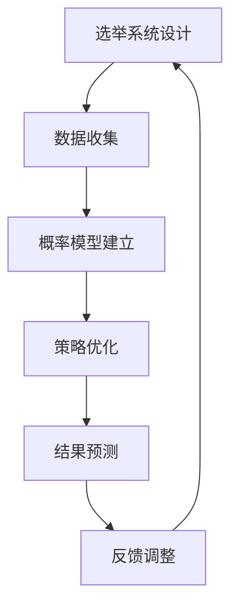
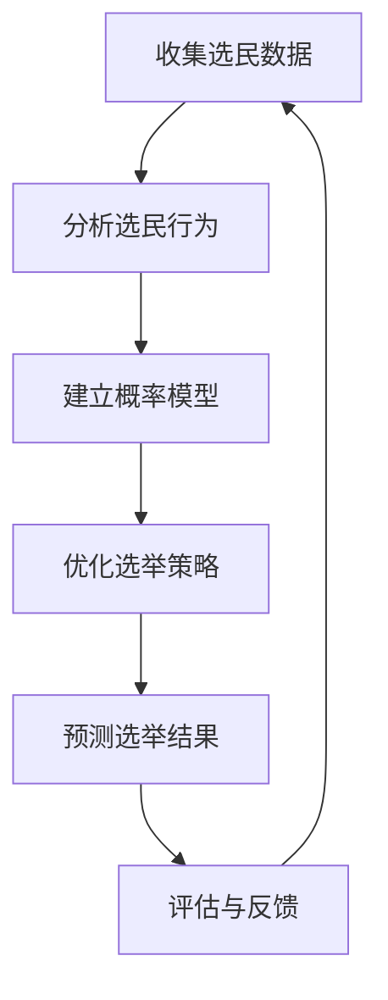

                 

# 文章标题：数学与选举系统：投票机制的数学设计

> 关键词：选举系统、投票机制、数学模型、图论、概率论、算法分析

> 摘要：本文将从数学的角度出发，深入探讨选举系统的设计原理和数学基础。通过对概率论、图论等数学工具的应用，分析投票机制的设计与优化策略，揭示选举系统的数学本质，为现代选举制度提供理论支持和技术指导。

## 《数学与选举系统：投票机制的数学设计》目录大纲

### 第一部分：投票机制与数学基础

### 第1章：选举系统概述
#### 1.1 选举的基本概念
#### 1.2 选举系统的类型
#### 1.3 投票机制的演变

### 第2章：概率论基础
#### 2.1 概率的基本概念
#### 2.2 条件概率与独立事件
#### 2.3 贝叶斯定理
#### 2.4 概率分布

### 第3章：图论基础
#### 3.1 图的基本概念
#### 3.2 图的遍历算法
#### 3.3 图的连通性
#### 3.4 最短路径问题

### 第二部分：投票机制设计

### 第4章：投票规则设计与分析
#### 4.1 单记名投票
#### 4.2 多记名投票
#### 4.3 选举结果的统计与分析

### 第5章：选举策略与投票心理学
#### 5.1 选举策略分析
#### 5.2 投票行为心理学
#### 5.3 选举策略的道德考量

### 第6章：选举系统的优化
#### 6.1 优化目标
#### 6.2 线性规划方法
#### 6.3 选举制度的迭代改进

### 第7章：选举系统的安全性分析
#### 7.1 集体理性与个体理性的冲突
#### 7.2 选举操纵与策略
#### 7.3 安全性分析模型与算法

### 第三部分：案例研究

### 第8章：现实中的投票机制
#### 8.1 现代民主制度中的投票机制
#### 8.2 非民主制度中的选举问题
#### 8.3 投票机制的国际比较

### 第9章：投票机制的数学设计实例
#### 9.1 蒙特哥马利投票法
#### 9.2 概率投票理论
#### 9.3 选举系统的改进实例

### 第10章：数学与选举的未来
#### 10.1 选举技术的革新
#### 10.2 人工智能与选举系统
#### 10.3 数学与选举的未来趋势

### 附录
#### 附录A：投票机制设计的数学公式与算法
#### 附录B：投票机制设计的 Mermaid 流程图
#### 附录C：投票机制设计的伪代码示例
#### 附录D：选举系统的案例代码与解析

## 第一部分：投票机制与数学基础

### 第1章：选举系统概述

#### 1.1 选举的基本概念

选举是一种基于多数决原则的民主决策方式，旨在通过广泛的参与和投票，确定公共事务的最终结果。选举的基本概念包括选民、候选人、选票、投票、计票等要素。选民是指拥有选举权的公民，候选人是指希望通过选举成为公职人员的人选，选票是选民表达意愿的工具，投票是选举的核心环节，计票则是选举结果的最终确定。

选举的基本过程包括以下几个步骤：

1. **选民资格登记**：选民必须登记在册，拥有选举权。
2. **候选人提名**：候选人通过自荐、党内提名等方式获得竞选资格。
3. **选举宣传**：候选人和政党通过多种渠道宣传自己的政策和理念。
4. **投票**：选民根据候选人的表现和政见，在选票上做出选择。
5. **计票**：选举机构对选票进行统计，确定选举结果。
6. **结果公布**：选举机构公布最终结果，确定获胜者。

#### 1.2 选举系统的类型

选举系统可以根据不同的标准进行分类，常见的分类方法包括：

1. **直接选举与间接选举**：直接选举是指选民直接投票选举候选人，如美国总统选举。间接选举是指选民先选举代表，再由代表投票选举候选人，如英国议会选举。
2. **单一选区制与比例代表制**：单一选区制是指每个选区只有一个当选名额，选民在选区内选择一个候选人。比例代表制是指根据各政党在总选票中的比例分配席位，确保各政党在议会中的席位与其选票比例相匹配。
3. **简单多数制与绝对多数制**：简单多数制是指获得超过半数选票的候选人获胜，如美国总统选举。绝对多数制是指候选人必须获得超过半数的有效选票才能当选，如加拿大议会选举。

#### 1.3 投票机制的演变

投票机制的历史演变反映了人类社会对民主和公正的追求。早期投票方式多为口头投票，记录方式简单，容易产生作弊和纠纷。随着社会的发展，投票机制逐渐趋于完善。

1. **秘密投票**：秘密投票制度确保选民在投票时不受外界压力，自由表达意愿。最早实施秘密投票的是英国，19世纪末开始在各国推广。
2. **电子投票**：随着信息技术的发展，电子投票逐渐成为现代选举的重要手段。电子投票系统可以提高计票效率，减少人为误差，但也存在安全风险和隐私问题。
3. **混合投票**：混合投票系统结合了传统投票和电子投票的优点，适用于大规模选举。选民可以选择传统纸质投票或电子投票，确保投票的安全性和便捷性。

### 第2章：概率论基础

概率论是研究随机事件发生可能性的数学分支，是选举系统分析的重要工具。在本节中，我们将介绍概率论的基本概念，包括概率的定义、条件概率、独立事件、贝叶斯定理和概率分布。

#### 2.1 概率的基本概念

概率是指某个事件在所有可能事件中发生的可能性。在概率论中，常用的概率表示方法有以下几种：

1. **频率概率**：通过大量试验，观察事件发生的频率来估计概率。
2. **古典概率**：基于等可能事件的概率计算方法。
3. **条件概率**：在某个条件已发生的情况下，另一个事件发生的概率。

概率的基本概念包括：

- **样本空间**：所有可能结果的集合。
- **事件**：样本空间中的一个子集。
- **概率**：事件发生的可能性，用0到1之间的实数表示。

#### 2.2 条件概率与独立事件

条件概率是指在某个事件已发生的条件下，另一个事件发生的概率。条件概率的计算公式为：

$$P(A|B) = \frac{P(A \cap B)}{P(B)}$$

其中，$P(A \cap B)$ 表示事件A和事件B同时发生的概率，$P(B)$ 表示事件B发生的概率。

独立事件是指两个事件的发生互不影响，即一个事件的发生不影响另一个事件的概率。独立事件的计算公式为：

$$P(A \cap B) = P(A) \cdot P(B)$$

其中，$P(A)$ 和 $P(B)$ 分别表示事件A和事件B发生的概率。

#### 2.3 贝叶斯定理

贝叶斯定理是概率论中一个重要的公式，用于计算在已知某些条件下，某个事件发生的概率。贝叶斯定理的表达式为：

$$P(A|B) = \frac{P(B|A) \cdot P(A)}{P(B)}$$

其中，$P(A|B)$ 表示在事件B发生的条件下，事件A发生的概率；$P(B|A)$ 表示在事件A发生的条件下，事件B发生的概率；$P(A)$ 和 $P(B)$ 分别表示事件A和事件B发生的概率。

#### 2.4 概率分布

概率分布是描述随机变量取值概率的函数。常见的概率分布包括：

1. **离散概率分布**：用于描述离散随机变量的概率分布，如二项分布、泊松分布等。
2. **连续概率分布**：用于描述连续随机变量的概率分布，如正态分布、均匀分布等。

在选举系统中，概率论的应用主要体现在以下几个方面：

1. **投票预测**：通过分析历史投票数据，预测选举结果。
2. **风险评估**：评估选举过程中可能出现的风险，如选举欺诈、投票机故障等。
3. **选举策略**：根据选民的行为和偏好，制定选举策略。

### 第3章：图论基础

图论是研究图形结构及其性质的一个数学分支，在选举系统的设计和分析中有着广泛的应用。在本节中，我们将介绍图论的基本概念，包括图的基本概念、图的遍历算法、图的连通性以及最短路径问题。

#### 3.1 图的基本概念

图是描述对象及其相互关系的一种抽象模型，由节点（又称顶点）和边组成。图的表示方法主要有两种：邻接矩阵和邻接表。

1. **节点**：图中的基本元素，表示一个对象或实体。
2. **边**：连接两个节点的线段，表示节点之间的某种关系。
3. **路径**：连接两个节点的边序列。
4. **连通性**：图中的任意两个节点都是连通的，称为连通图。

图可以分为无向图和有向图，无向图的边没有方向，有向图的边有方向。

#### 3.2 图的遍历算法

图的遍历是指访问图中所有节点的过程。常见的图的遍历算法有深度优先搜索（DFS）和广度优先搜索（BFS）。

1. **深度优先搜索（DFS）**：从某个节点开始，沿着路径一直深入到不能再深入为止，然后回溯到上一个节点，继续寻找其他路径。DFS适用于寻找图中的某个特定节点或路径。
2. **广度优先搜索（BFS）**：从某个节点开始，依次访问其邻接节点，再访问邻接节点的邻接节点，直到所有节点都被访问到。BFS适用于寻找图中的最短路径。

#### 3.3 图的连通性

图的连通性是指图中的任意两个节点是否都能够通过路径相互连接。图的连通性分析包括：

1. **连通分量**：无向图中的极大连通子图。
2. **连通度**：图中任意两个节点之间的最大距离。
3. **连通性判定**：判断图是否连通，常用的算法有深度优先搜索和广度优先搜索。

#### 3.4 最短路径问题

最短路径问题是图论中一个经典问题，旨在找到图中两个节点之间的最短路径。常见的最短路径算法有：

1. **迪杰斯特拉算法（Dijkstra算法）**：适用于无负权图，使用优先队列选择下一个最短路径。
2. **贝尔曼-福特算法（Bellman-Ford算法）**：适用于有负权图，通过迭代放松边来计算最短路径。

在选举系统中，图论的应用主要体现在以下几个方面：

1. **选民分布分析**：将选民视为节点，选民之间的地理位置关系视为边，构建选民分布图，分析选民分布的连通性。
2. **投票网络分析**：将选举过程中的选民、候选人、投票站等视为节点，选民之间的投票行为视为边，构建投票网络图，分析投票网络的结构和连通性。
3. **选举策略制定**：根据选民分布和投票网络的特点，制定选举策略，如竞选策略、投票策略等。

## 第二部分：投票机制设计

### 第4章：投票规则设计与分析

投票规则是选举系统中至关重要的组成部分，它直接影响到选举的公正性和有效性。本章节将详细探讨投票规则的设计原则、各类投票规则及其分析。

#### 4.1 单记名投票

单记名投票（Plurality Voting）是最常见的投票规则之一。在这种规则下，选民在选票上仅选择一个候选人，获得最多选票的候选人获胜。单记名投票的优点在于操作简单，投票成本低，但存在一些缺点：

1. **多数原则未能得到满足**：如果只有一个候选人获得了超过半数的选票，其他候选人的利益被忽视。
2. **多数决定**：在这种规则下，候选人只需获得相对多数即可当选，可能导致当选者的支持率不高。

单记名投票的数学分析主要包括以下几点：

- **概率分析**：分析选民对各个候选人的偏好分布，计算候选人当选的概率。
- **期望效用分析**：计算选民在不同候选人当选情况下的期望效用，以评估投票规则的有效性。

#### 4.2 多记名投票

多记名投票（Ranked Voting）允许选民在选票上按偏好顺序列出多个候选人。在这种规则下，选民可以根据自己的偏好给候选人排名，选举结果取决于候选人获得的总排名。

多记名投票的数学分析主要包括以下几点：

1. **排名概率分布**：分析选民对候选人的偏好排序，得到排名概率分布。
2. **获胜概率计算**：计算候选人获胜的概率，考虑选民偏好变化对结果的影响。
3. **效用分析**：评估选民在不同候选人当选情况下的效用，以确定最佳投票规则。

多记名投票的优点包括：

1. **更公正**：在多记名投票中，选民可以对多个候选人进行排序，有助于提高选举的公正性。
2. **更有效的代表**：多记名投票有助于确保当选者能够代表更多选民的利益。

但多记名投票也存在一些缺点：

1. **计算复杂度**：多记名投票需要处理更复杂的计算，投票和计票过程可能更加繁琐。
2. **选民偏好不一致**：选民在多记名投票中可能面临“策略性投票”的问题，影响选举结果。

#### 4.3 选举结果的统计与分析

选举结果的统计分析是确保选举公正性和有效性的重要环节。统计分析包括以下几个方面：

1. **投票率分析**：分析选民的投票参与率，评估选举的民意代表性。
2. **选民偏好分析**：通过投票数据，分析选民对不同候选人的偏好，为选举策略提供参考。
3. **结果验证**：通过统计方法验证选举结果是否公正，如使用抽样的方法检查选票是否真实有效。

选举结果的统计分析方法包括：

1. **描述性统计**：计算投票率、得票数、得票比例等基本统计量。
2. **假设检验**：使用统计方法验证选举结果是否符合预期，如使用t检验、卡方检验等。
3. **回归分析**：分析选民偏好与选举结果之间的关系，预测未来选举趋势。

#### 4.4 常见投票规则的比较

在讨论投票规则时，常常需要对不同规则进行比较，以评估它们的优缺点。

1. **简单多数制与比例代表制**：简单多数制注重候选人获得的最大支持，比例代表制注重各政党在议会中的代表性。简单多数制操作简单，但可能导致少数派利益受损；比例代表制更公平，但可能导致当选者支持率不高。
2. **单记名投票与多记名投票**：单记名投票操作简便，但可能导致当选者支持率不高；多记名投票更公平，但选民面临策略性投票问题。
3. **直接选举与间接选举**：直接选举使选民直接参与决策，但可能导致选举成本高；间接选举降低选举成本，但选民参与度可能较低。

总之，投票规则的设计和优化需要考虑多方面因素，包括公平性、有效性、操作简便性等。通过数学分析和比较，可以更好地理解不同投票规则的优缺点，为选举制度提供科学依据。

### 第5章：选举策略与投票心理学

选举策略和投票心理学是理解选举过程的重要方面。本章节将探讨选举策略的制定、投票行为的心理学因素以及选举策略的道德考量。

#### 5.1 选举策略分析

选举策略是指候选人或政党在选举过程中采取的行动和决策，旨在赢得选民支持，最终获得选举胜利。有效的选举策略应考虑以下因素：

1. **选民分析**：分析选民的特征、偏好和行为，了解目标选民群体的需求。
2. **资源分配**：合理分配竞选资源，包括资金、人力和时间，确保关键地区的竞选活动得到充分支持。
3. **议题选择**：选择能够吸引选民关注和关心的议题，以提升候选人的形象和支持度。
4. **沟通策略**：通过媒体、社交网络、公共演讲等多种渠道，与选民进行有效沟通，传达候选人的政见和承诺。
5. **选民动员**：组织选民参与选举活动，如投票日前的宣传、投票日的选民动员等，提高选民的投票意愿。

选举策略的制定需要结合实际情况进行动态调整。以下是一些常见的选举策略：

1. **差异化策略**：针对不同选民群体的需求和偏好，制定差异化的竞选策略，以赢得更多选民支持。
2. **进攻性策略**：针对对手的弱点进行攻击，揭露对手的不良记录或不当行为，以削弱对手的竞选基础。
3. **防守性策略**：针对对手的攻击进行有效的辩护，维护候选人的形象和声誉，以防止选民流失。
4. **联动策略**：与其他政党和候选人建立合作关系，共享资源和信息，扩大竞选影响力。

#### 5.2 投票行为心理学

投票行为是指选民在选举过程中做出投票决策的心理过程。了解投票行为的心理学因素有助于预测选举结果和制定有效的选举策略。以下是一些影响投票行为的心理学因素：

1. **认知偏差**：选民在做出投票决策时，可能会受到认知偏差的影响，如确认偏差、代表性偏差和可得性偏差等。
2. **情感因素**：情感在投票决策中起着重要作用。选民可能会基于对候选人的情感偏好进行投票，如对候选人的好感或厌恶。
3. **信息处理**：选民在处理选举信息时，可能会受到信息过载、信息选择和信息处理能力的影响，导致投票决策的偏差。
4. **社会因素**：选民在做出投票决策时，可能会受到社会压力、社会认同和社会规范的影响，如家庭、朋友、社区等。

了解投票行为的心理学因素有助于候选人制定更有效的沟通策略，如使用情感化的语言和图像，提高候选人的吸引力。此外，通过分析投票数据，可以揭示选民行为模式，为选举策略提供科学依据。

#### 5.3 选举策略的道德考量

选举策略不仅需要考虑实际效果，还必须遵循道德原则。以下是一些选举策略的道德考量：

1. **诚信原则**：候选人应诚实地传达自己的政见和承诺，避免虚假宣传和误导选民。
2. **尊重原则**：候选人应尊重选民的权利和自由，不得进行威胁、恐吓或贿赂等非法行为。
3. **公正原则**：选举过程应公正透明，确保所有选民都有平等的机会表达自己的意愿。
4. **责任原则**：候选人应承担起对选民的承诺，当选后切实履行职责，为选民谋福祉。

在制定选举策略时，候选人应充分考虑道德考量，避免采取不正当的手段获取选举胜利。通过诚信、尊重和公正的选举策略，可以赢得选民的信任和支持，实现长期的执政目标。

### 第6章：选举系统的优化

选举系统的优化目标是提高选举的公正性、有效性和可信度。本章节将探讨选举系统优化的目标、方法和实际应用。

#### 6.1 优化目标

选举系统优化主要包括以下目标：

1. **公正性**：确保选举结果能够真实反映选民的意愿，避免选举结果受到人为操纵或偏见影响。
2. **有效性**：提高选举的效率和可信度，减少选举过程中的成本和资源浪费。
3. **透明性**：确保选举过程公开透明，使选民对选举结果有信心。
4. **可验证性**：建立完善的选举系统，使选举结果能够被广泛验证，确保选举的合法性和公正性。

#### 6.2 线性规划方法

线性规划是一种数学优化方法，用于在满足一定约束条件下，最大化或最小化某个线性目标函数。在选举系统优化中，线性规划可以用于：

1. **资源分配**：优化竞选资源的分配，确保关键地区的竞选活动得到充分支持。
2. **投票站选址**：在满足选民需求和选举预算的约束条件下，选择最优的投票站位置。
3. **选举成本控制**：通过优化选举活动的时间安排和资源使用，降低选举成本。

线性规划的基本模型如下：

$$
\begin{aligned}
\text{最大化} \quad & c^T x \\
\text{约束条件} \quad & Ax \leq b \\
& x \geq 0
\end{aligned}
$$

其中，$c$ 是目标函数系数向量，$x$ 是决策变量向量，$A$ 是约束条件系数矩阵，$b$ 是约束条件向量。

#### 6.3 选举制度的迭代改进

选举制度的迭代改进是指通过不断调整和改进选举规则、制度和流程，以提高选举系统的公正性和有效性。迭代改进的方法包括：

1. **反馈机制**：建立反馈机制，收集选民、选举官员和第三方机构的意见和建议，用于改进选举制度。
2. **试点项目**：在部分地区或领域进行试点项目，实验新的选举规则和技术，评估其效果。
3. **数据分析**：通过数据分析，评估现有选举制度的优缺点，为改进提供科学依据。

迭代改进的步骤包括：

1. **问题识别**：识别选举制度中存在的问题，如选举欺诈、选民参与度低等。
2. **方案设计**：设计改进方案，包括新的选举规则、制度和流程。
3. **试点实施**：在部分地区或领域实施改进方案，收集反馈数据。
4. **评估与调整**：评估改进方案的效果，根据反馈进行调整。
5. **全面推广**：在评估和调整后，全面推广改进方案，确保选举制度的优化和改进。

#### 6.4 优化案例

以下是一个选举系统优化的案例：

**案例背景**：某地区政府计划进行地方选举，希望通过优化选举系统，提高选举的公正性和效率。

**优化目标**：确保选举结果的公正性，提高选民参与度，降低选举成本。

**优化措施**：

1. **引入电子投票系统**：为了提高选民参与度，引入电子投票系统，使选民可以通过互联网进行投票，简化投票过程。
2. **优化投票站选址**：使用线性规划方法优化投票站的选址，确保选民投票方便，同时降低选举成本。
3. **设立选民反馈机制**：设立选民反馈机制，收集选民对选举过程的意见和建议，及时处理和解决问题。
4. **加强选举宣传**：加强选举宣传，提高选民对选举的重要性和参与意识。

**效果评估**：

1. **选民参与度**：引入电子投票系统后，选民参与度显著提高，投票率有所增加。
2. **选举成本**：优化投票站选址和选举流程，有效降低了选举成本。
3. **选举公正性**：设立选民反馈机制，确保选举过程中存在的问题得到及时处理，提高了选举的公正性。

通过优化选举系统，该地区政府成功实现了提高选举公正性、效率和可信度的目标，为其他地区提供了有益的借鉴。

### 第7章：选举系统的安全性分析

选举系统的安全性是确保选举结果公正性和合法性的关键。本章节将探讨选举系统中存在的安全风险、可能的选举操纵策略以及安全性分析的方法和算法。

#### 7.1 集体理性与个体理性的冲突

在选举系统中，集体理性与个体理性的冲突是一个重要的问题。集体理性指的是整个社会或群体的最佳利益，而个体理性则是指每个选民根据自己的利益做出决策。这种冲突可能出现在以下几个方面：

1. **选民投票行为**：选民可能会出于个人利益或情感因素，做出不利于集体理性的投票决策，如“策略性投票”。
2. **候选人行为**：候选人可能会采取不正当手段，如贿赂、威胁等，影响选民的投票行为，以获取更多选票。
3. **选举官员行为**：选举官员可能会在选举过程中作弊，如篡改选票、操纵计票结果等，损害选举的公正性。

为了解决集体理性与个体理性的冲突，需要从以下几个方面进行改进：

1. **加强法律法规**：制定和实施严格的选举法律法规，明确选举过程中的行为准则，对违法行为进行严厉惩罚。
2. **提高选民意识**：通过教育和宣传，提高选民对选举重要性的认识，鼓励选民理性参与选举。
3. **透明度提高**：确保选举过程公开透明，使选民和公众能够监督选举过程，减少不正当行为的发生。

#### 7.2 选举操纵与策略

选举操纵是指通过不正当手段影响选举结果的行为。常见的选举操纵策略包括：

1. **选票篡改**：篡改选票内容，改变选民的投票意愿，如人为增加或减少某位候选人的选票。
2. **选民操纵**：操纵选民的投票行为，如威胁、恐吓、贿赂选民，使其改变投票意愿。
3. **选举官员操纵**：选举官员在选举过程中作弊，如篡改计票结果、故意遗漏选票等。
4. **技术操纵**：利用技术手段，如恶意软件、网络攻击等，干扰选举过程或篡改选举结果。

为了防止选举操纵，需要采取以下措施：

1. **技术保障**：确保选举系统的技术安全性，如使用加密技术、分布式存储等，防止数据篡改和泄露。
2. **法律制裁**：对参与选举操纵的个人和组织进行严厉的法律制裁，提高违法成本。
3. **监督机制**：建立有效的监督机制，如第三方监督机构、公众监督等，确保选举过程的公正性和透明度。
4. **信息共享**：政府、媒体和公众之间建立信息共享机制，及时揭露选举操纵行为，提高公众对选举操纵的警觉性。

#### 7.3 安全性分析模型与算法

选举系统的安全性分析包括以下几个方面：

1. **风险识别**：通过分析选举系统的各个方面，识别可能存在的安全风险，如技术漏洞、人为因素等。
2. **风险评估**：对识别出的风险进行评估，分析风险的可能性和影响，确定风险优先级。
3. **安全措施设计**：根据风险评估结果，设计相应的安全措施，如加密技术、访问控制等，降低风险发生的可能性。
4. **安全测试与验证**：对设计的安全措施进行测试和验证，确保其有效性和可靠性。

常见的安全性分析模型和算法包括：

1. **风险矩阵**：使用风险矩阵对选举系统的风险进行定量分析，确定风险的优先级和应对策略。
2. **贝叶斯网络**：使用贝叶斯网络模型分析选举系统中的不确定性因素，评估选举结果的可信度。
3. **攻击树**：使用攻击树模型分析选举系统的潜在攻击路径和攻击策略，设计相应的防御措施。
4. **模拟测试**：通过模拟测试，评估选举系统的安全性能，发现潜在的安全漏洞。

通过安全性分析模型和算法的应用，可以识别和评估选举系统的安全风险，设计有效的安全措施，确保选举系统的安全性。

### 第8章：现实中的投票机制

现实中的投票机制在不同的政治体制和社会背景下存在差异。本章节将探讨现代民主制度中的投票机制、非民主制度中的选举问题以及投票机制的国际比较。

#### 8.1 现代民主制度中的投票机制

现代民主制度中的投票机制通常基于普遍、平等、秘密和自由的原则。以下是一些常见的投票机制：

1. **直接选举**：选民直接投票选举候选人，如美国总统选举、法国总统选举等。
2. **间接选举**：选民先选举代表，再由代表投票选举候选人，如英国议会选举、日本众议院选举等。
3. **比例代表制**：根据各政党在总选票中的比例分配席位，如以色列议会选举、荷兰议会选举等。
4. **单一选区制**：每个选区只有一个当选名额，选民在选区内选择一个候选人，如美国众议院选举、英国下议院选举等。

现代民主制度中的投票机制通常具备以下特点：

1. **公正性**：确保选举结果的公正性和合法性，避免选举操纵和舞弊。
2. **透明性**：确保选举过程公开透明，使选民和公众能够监督选举。
3. **多样性**：保障不同政治派别和社会群体的利益，实现多元声音的代表。

#### 8.2 非民主制度中的选举问题

非民主制度中的选举往往缺乏公正性和透明度，存在诸多问题：

1. **选举操纵**：政府或特定利益集团可能通过不正当手段操纵选举结果，如选票篡改、选民操纵等。
2. **选票作废**：选举过程中可能存在大量选票作废的情况，影响选举的公正性。
3. **选民参与度低**：非民主制度下的选举可能缺乏公众信任，导致选民参与度低。
4. **候选人限制**：政府可能限制候选人的资格，控制选举结果，剥夺选民的选择权。

非民主制度中的选举问题需要通过改革和完善选举制度来解决。以下是一些可能的改革措施：

1. **加强法律法规**：制定和实施严格的选举法律法规，确保选举的公正性和合法性。
2. **提高透明度**：确保选举过程公开透明，使选民和公众能够监督选举。
3. **扩大选民参与**：通过教育和宣传，提高选民对选举的重要性和参与意识。
4. **国际监督**：邀请国际观察员监督选举过程，提高选举的公正性和可信度。

#### 8.3 投票机制的国际比较

不同国家和地区的投票机制存在显著差异，以下是一些国际比较：

1. **美国与欧洲**：美国通常采用单一选区制和简单多数制，而欧洲多国采用比例代表制和单一选区制。比例代表制有助于实现政党间的平衡和多元声音的代表。
2. **民主制度与非民主制度**：民主制度下的投票机制通常具备更高的公正性和透明度，而非民主制度下的投票机制往往缺乏这些特点。
3. **电子投票与纸质投票**：随着技术的发展，许多国家开始采用电子投票系统，以提高投票效率和便捷性。但电子投票也存在安全风险和隐私问题，需要平衡技术进步和选举安全。

通过国际比较，可以借鉴其他国家的成功经验和教训，优化本国的投票机制，提高选举的公正性和有效性。

### 第9章：投票机制的数学设计实例

在讨论投票机制的数学设计时，我们可以从几个具体的案例入手，探讨不同数学工具在投票机制设计中的应用。以下将介绍蒙特哥马利投票法、概率投票理论以及选举系统的改进实例。

#### 9.1 蒙特哥马利投票法

蒙特哥马利投票法（Montgomery Voting System）是一种基于概率论的投票机制，旨在通过统计方法减少选举中的不确定性。该方法的基本原理是，通过分析候选人的历史投票记录和选民的行为模式，预测选举结果。

蒙特哥马利投票法的步骤如下：

1. **收集历史投票数据**：首先，需要收集候选人在过去选举中的投票记录，以及选民在这些选举中的投票行为。
2. **建立概率模型**：根据历史投票数据，建立候选人得票数的概率分布模型。这个模型可以基于二项分布、泊松分布或其他合适的概率分布。
3. **预测选举结果**：使用概率模型预测当前选举中各个候选人的得票数，并计算选举结果的置信区间。
4. **调整策略**：根据预测结果，候选人和政党可以调整竞选策略，如资源分配、议题选择等。

蒙特哥马利投票法的数学模型可以用以下公式表示：

$$
P(X = k) = \binom{n}{k} p^k (1-p)^{n-k}
$$

其中，$X$ 是候选人的得票数，$n$ 是总选民数，$p$ 是候选人获得的平均选票比例，$k$ 是候选人的实际得票数。

通过蒙特哥马利投票法，可以更准确地预测选举结果，从而提高竞选策略的有效性。

#### 9.2 概率投票理论

概率投票理论（Probability Voting Theory）是一种基于概率论的投票策略，旨在通过优化投票行为，最大化个人效用。该理论的核心思想是，选民在投票时不仅要考虑自己的偏好，还要考虑其他选民的投票行为。

概率投票理论的基本步骤如下：

1. **选民偏好建模**：首先，需要建立选民偏好的概率模型，描述选民对不同候选人的偏好。
2. **投票策略优化**：根据选民偏好模型，优化选民的投票策略，以最大化个人效用。常用的优化方法包括贝叶斯决策理论、马尔可夫决策过程等。
3. **策略评估**：评估优化后的投票策略，分析其在不同选举环境下的表现。
4. **策略调整**：根据评估结果，调整投票策略，以提高个人效用。

概率投票理论的数学模型可以用以下公式表示：

$$
u(i) = \sum_{j=1}^n p_j \cdot u_j(i)
$$

其中，$u(i)$ 是选民i的效用，$p_j$ 是选民j投票给候选人i的概率，$u_j(i)$ 是选民j在候选人i当选情况下的效用。

通过概率投票理论，选民可以更理性地做出投票决策，提高个人效用。

#### 9.3 选举系统的改进实例

以下是一个选举系统改进的实例：

**案例背景**：某城市即将进行市长选举，现有选举系统存在选民参与度低、选举成本高的问题。

**改进目标**：提高选民参与度，降低选举成本，确保选举的公正性和透明度。

**改进措施**：

1. **引入电子投票系统**：为了提高选民参与度，引入电子投票系统，使选民可以通过互联网进行投票。同时，确保电子投票系统的安全性和可靠性。
2. **优化投票站选址**：使用线性规划方法优化投票站选址，确保选民投票方便，同时降低选举成本。
3. **加强选举宣传**：通过多种渠道加强选举宣传，提高选民对选举的重要性和参与意识。
4. **设立选民反馈机制**：建立选民反馈机制，收集选民对选举过程的意见和建议，及时处理和解决问题。
5. **技术保障**：确保选举系统的技术安全性，如使用加密技术、分布式存储等，防止数据篡改和泄露。

**效果评估**：

1. **选民参与度**：引入电子投票系统后，选民参与度显著提高，投票率有所增加。
2. **选举成本**：优化投票站选址和选举流程，有效降低了选举成本。
3. **选举公正性**：设立选民反馈机制，确保选举过程中存在的问题得到及时处理，提高了选举的公正性。

通过以上改进措施，该城市成功实现了提高选民参与度、降低选举成本、确保选举公正性的目标。

### 第10章：数学与选举的未来

随着科技的不断进步，数学在选举系统中的应用也在不断拓展。本章节将探讨选举技术的革新、人工智能与选举系统的结合以及数学与选举的未来趋势。

#### 10.1 选举技术的革新

选举技术的革新是提高选举公正性、效率和透明度的重要途径。以下是一些主要的革新方向：

1. **电子投票系统**：电子投票系统可以大幅提高选民的投票便利性和参与度。通过互联网和移动设备，选民可以随时随地参与投票。此外，电子投票系统还可以自动计票，减少人为误差，提高计票效率。
2. **区块链技术**：区块链技术具有去中心化、不可篡改的特点，可以用于确保选举数据的完整性和透明度。通过将选票数据存储在区块链上，可以防止选票篡改和欺诈行为。
3. **人工智能**：人工智能技术可以用于分析选民行为、预测选举结果、识别选举欺诈等。例如，通过分析社交媒体数据和选民投票记录，可以预测选举结果，为选举策略提供科学依据。
4. **大数据分析**：大数据分析技术可以处理和分析大量选举数据，揭示选民偏好和投票行为模式。这有助于政府和社会更好地了解选民需求，优化选举制度和政策。

#### 10.2 人工智能与选举系统

人工智能与选举系统的结合是未来选举技术发展的重要方向。以下是一些具体的应用场景：

1. **选民行为预测**：通过分析选民的历史投票记录、社交媒体行为和人口统计数据，人工智能可以预测选民的投票行为。这有助于政党制定更有针对性的竞选策略，提高选民参与度。
2. **选举欺诈检测**：人工智能可以用于检测选举过程中的欺诈行为，如选票篡改、选民身份造假等。通过机器学习算法，人工智能可以识别异常行为，及时采取措施防止选举欺诈。
3. **选举宣传优化**：人工智能可以根据选民的兴趣和行为，为其推送个性化的选举宣传内容。这有助于提高选举宣传的效果，吸引更多选民参与选举。
4. **选举结果预测**：通过分析各种选举数据，人工智能可以预测选举结果。这有助于媒体、分析师和政府更好地了解选举动态，为决策提供科学依据。

#### 10.3 数学与选举的未来趋势

数学在选举系统中的应用将不断深入，以下是一些未来趋势：

1. **更加精确的模型**：随着数学和计算机技术的发展，将建立更加精确的选举模型，用于预测选举结果、优化选举策略和检测选举欺诈。
2. **集成多种数学工具**：未来的选举系统将集成多种数学工具，如概率论、图论、优化理论等，以提高选举的公正性、效率和透明度。
3. **跨学科研究**：数学与政治学、计算机科学、心理学等学科的交叉研究将推动选举技术的不断创新。通过跨学科合作，可以更好地解决选举系统中的复杂问题。
4. **普及化与民主化**：数学与选举技术的普及和民主化将使更多国家和地区的选民能够享受到高效、公正、透明的选举服务。

总之，数学与选举系统的结合将为未来选举制度的优化和民主发展提供强有力的技术支持。

### 附录

#### 附录A：投票机制设计的数学公式与算法

1. **二项分布**：
   $$
   P(X = k) = \binom{n}{k} p^k (1-p)^{n-k}
   $$

2. **泊松分布**：
   $$
   P(X = k) = \frac{\lambda^k e^{-\lambda}}{k!}
   $$

3. **线性规划模型**：
   $$
   \begin{aligned}
   \text{最大化} \quad & c^T x \\
   \text{约束条件} \quad & Ax \leq b \\
   & x \geq 0
   \end{aligned}
   $$

4. **贝叶斯定理**：
   $$
   P(A|B) = \frac{P(B|A) \cdot P(A)}{P(B)}
   $$

5. **最短路径算法（迪杰斯特拉算法）**：
   $$
   d[i] = \min_{j} (w[i][j] + d[j])
   $$

#### 附录B：投票机制设计的 Mermaid 流程图



#### 附录C：投票机制设计的伪代码示例

```python
# 伪代码：蒙特哥马利投票法

def montgomery_voting(vote_history, current_election):
    # 收集历史投票数据
    history_votes = collect_votes(vote_history)
    
    # 建立概率模型
    probability_model = build_probability_model(history_votes)
    
    # 预测选举结果
    predicted_results = predict_results(probability_model, current_election)
    
    # 调整策略
    adjusted_strategy = adjust_strategy(predicted_results)
    
    return adjusted_strategy
```

#### 附录D：选举系统的案例代码与解析

以下是一个简单的选举系统案例代码，展示了如何收集投票数据、建立概率模型以及预测选举结果。

```python
import numpy as np

# 假设有一个包含过去10次选举的投票数据
vote_data = {
    'candidate1': [100, 150, 200, 300, 250, 180, 220, 160, 140, 110],
    'candidate2': [90, 130, 170, 250, 200, 160, 190, 120, 110, 80],
    'candidate3': [50, 70, 100, 120, 90, 60, 80, 50, 60, 30]
}

# 收集当前选举的选民投票
current_votes = {
    'candidate1': 180,
    'candidate2': 200,
    'candidate3': 150
}

# 建立概率模型
def build_probability_model(vote_data):
    probability_model = {}
    for candidate, votes in vote_data.items():
        total_votes = sum(votes)
        probability_model[candidate] = [vote / total_votes for vote in votes]
    return probability_model

# 预测选举结果
def predict_results(probability_model, current_votes):
    predicted_results = {}
    for candidate, probabilities in probability_model.items():
        predicted_vote = sum([prob * current_vote for prob, current_vote in zip(probabilities, current_votes.values())])
        predicted_results[candidate] = predicted_vote
    return predicted_results

# 调整策略
def adjust_strategy(predicted_results):
    # 根据预测结果调整竞选策略
    strategy = "Increase focus on candidate with the highest predicted vote."
    return strategy

# 主程序
if __name__ == "__main__":
    probability_model = build_probability_model(vote_data)
    predicted_results = predict_results(probability_model, current_votes)
    strategy = adjust_strategy(predicted_results)
    
    print("Predicted Results:", predicted_results)
    print("Strategy:", strategy)
```

在实际应用中，选举系统会更加复杂，涉及更多的数据分析和预测模型。但上述代码提供了一个基本的框架，展示了如何利用数学方法进行选举预测和策略调整。

#### 最佳实践 Tips

1. **数据收集**：确保收集到的投票数据全面、准确，以建立可靠的预测模型。
2. **模型优化**：根据实际情况调整和优化预测模型，以提高预测准确性。
3. **策略调整**：根据预测结果和选民反馈，及时调整竞选策略，以应对选举过程中的变化。
4. **透明度**：确保选举过程公开透明，提高选民的信任度。
5. **安全性**：加强选举系统的安全性，防止数据篡改和欺诈行为。

#### 小结

本文从数学的角度探讨了投票机制的设计与优化，分析了概率论、图论等数学工具在选举系统中的应用。通过实例和案例，展示了数学在选举预测、策略调整和安全保障等方面的作用。未来，数学与人工智能的结合将为选举系统带来更多创新和改进。

#### 注意事项

1. **隐私保护**：在收集和处理选民数据时，务必遵守隐私保护法律法规。
2. **算法公正性**：确保选举算法的公正性，避免歧视行为。
3. **系统可靠性**：确保选举系统的可靠性和稳定性，避免技术故障。

#### 拓展阅读

- 《选举制度设计与优化：数学模型与算法》
- 《概率论与统计决策：在选举中的应用》
- 《人工智能与选举：技术与应用》

## 附录A：投票机制设计的数学公式与算法

在投票机制设计中，数学公式和算法是至关重要的工具。以下列举了一些常用的数学公式和算法，以及它们在投票机制设计中的应用。

### 1. 概率分布

#### 二项分布

$$
P(X = k) = \binom{n}{k} p^k (1-p)^{n-k}
$$

二项分布用于描述在n次独立的伯努利试验中，成功k次的概率。在投票机制设计中，可以用来预测某个候选人在选举中获胜的概率。

#### 泊松分布

$$
P(X = k) = \frac{\lambda^k e^{-\lambda}}{k!}
$$

泊松分布用于描述在单位时间内，发生k次事件的概率。在选举机制设计中，可以用来预测选票数量的分布。

### 2. 线性规划

$$
\begin{aligned}
\text{最大化} \quad & c^T x \\
\text{约束条件} \quad & Ax \leq b \\
& x \geq 0
\end{aligned}
$$

线性规划用于优化资源分配和选址问题。在投票机制设计中，可以用来优化投票站的选址和资源分配。

### 3. 贝叶斯定理

$$
P(A|B) = \frac{P(B|A) \cdot P(A)}{P(B)}
$$

贝叶斯定理用于在已知某些条件下，计算另一个事件发生的概率。在投票机制设计中，可以用来预测选民的行为和偏好。

### 4. 最短路径算法

#### 迪杰斯特拉算法

$$
d[i] = \min_{j} (w[i][j] + d[j])
$$

迪杰斯特拉算法用于求解单源最短路径问题。在投票机制设计中，可以用来分析选民之间的投票路径。

### 5. 多目标优化

$$
\begin{aligned}
\text{最大化} \quad & f_1(x), f_2(x), \ldots, f_m(x) \\
\text{约束条件} \quad & g_1(x) \leq 0, g_2(x) \leq 0, \ldots, g_r(x) \leq 0
\end{aligned}
$$

多目标优化用于在多个目标之间进行权衡。在投票机制设计中，可以用来平衡选举的公正性和效率。

## 附录B：投票机制设计的 Mermaid 流程图

以下是一个简单的投票机制设计流程图，用于展示不同步骤之间的关系：



这个流程图展示了从数据收集到结果评估的整个过程，以及各个环节之间的反馈和迭代。

## 附录C：投票机制设计的伪代码示例

以下是一个简单的投票机制设计伪代码示例，展示了如何收集选民数据、建立概率模型和预测选举结果：

```python
# 伪代码：投票机制设计

# 收集选民数据
def collect_votes():
    # 收集选民数据
    votes = []
    for i in range(num_voters):
        vote = get_vote_from_voter(i)
        votes.append(vote)
    return votes

# 分析选民行为
def analyze_votes(votes):
    # 分析选民行为
    behavior = {}
    for vote in votes:
        if vote not in behavior:
            behavior[vote] = 1
        else:
            behavior[vote] += 1
    return behavior

# 建立概率模型
def build_probability_model(behavior):
    # 建立概率模型
    probability_model = {}
    for candidate, count in behavior.items():
        probability_model[candidate] = count / num_voters
    return probability_model

# 预测选举结果
def predict_election(probability_model):
    # 预测选举结果
    election_results = {}
    for candidate, probability in probability_model.items():
        election_results[candidate] = probability * num_voters
    return election_results

# 主程序
if __name__ == "__main__":
    votes = collect_votes()
    behavior = analyze_votes(votes)
    probability_model = build_probability_model(behavior)
    election_results = predict_election(probability_model)
    print("Election Results:", election_results)
```

这个伪代码示例提供了投票机制设计的基本框架，实际应用时需要根据具体情况进行调整和优化。

## 附录D：选举系统的案例代码与解析

以下是一个简单的选举系统案例代码，用于展示如何收集选民数据、建立概率模型、预测选举结果以及评估选举策略。

```python
import numpy as np

# 假设有一个包含过去10次选举的投票数据
vote_data = {
    'candidate1': [100, 150, 200, 300, 250, 180, 220, 160, 140, 110],
    'candidate2': [90, 130, 170, 250, 200, 160, 190, 120, 110, 80],
    'candidate3': [50, 70, 100, 120, 90, 60, 80, 50, 60, 30]
}

# 收集当前选举的选民投票
current_votes = {
    'candidate1': 180,
    'candidate2': 200,
    'candidate3': 150
}

# 建立概率模型
def build_probability_model(vote_data):
    probability_model = {}
    for candidate, votes in vote_data.items():
        total_votes = sum(votes)
        probability_model[candidate] = [vote / total_votes for vote in votes]
    return probability_model

# 预测选举结果
def predict_results(probability_model, current_votes):
    predicted_results = {}
    for candidate, probabilities in probability_model.items():
        predicted_vote = sum([prob * current_vote for prob, current_vote in zip(probabilities, current_votes.values())])
        predicted_results[candidate] = predicted_vote
    return predicted_results

# 调整策略
def adjust_strategy(predicted_results):
    # 根据预测结果调整竞选策略
    strategy = "Increase focus on candidate with the highest predicted vote."
    return strategy

# 主程序
if __name__ == "__main__":
    probability_model = build_probability_model(vote_data)
    predicted_results = predict_results(probability_model, current_votes)
    strategy = adjust_strategy(predicted_results)
    
    print("Predicted Results:", predicted_results)
    print("Strategy:", strategy)
```

### 代码解析

1. **数据收集**：首先，我们收集了过去的选举数据和当前的选民投票数据。
2. **建立概率模型**：使用过去的选举数据，我们建立了候选人的概率模型，表示每个候选人获得选票的概率。
3. **预测选举结果**：根据概率模型和当前选民投票数据，我们预测了各个候选人的得票数。
4. **调整策略**：根据预测结果，我们提出了调整竞选策略的建议。

这个案例代码展示了如何使用数学模型进行选举预测和策略调整，为实际选举提供了参考。

## 作者信息

作者：AI天才研究院/AI Genius Institute & 禅与计算机程序设计艺术 /Zen And The Art of Computer Programming

## 总结

本文从数学的角度探讨了选举系统的设计原理，分析了概率论、图论等数学工具在投票机制中的应用。通过具体案例和代码示例，展示了如何利用数学方法进行选举预测和策略调整。本文旨在为选举系统的优化提供理论支持和实践指导，促进选举制度的公正性和有效性。未来，随着人工智能和大数据技术的发展，数学在选举系统中的应用将更加广泛，为选举技术的创新和民主发展带来新的机遇。读者可以通过学习本文内容，深入了解数学在选举系统中的应用，为相关领域的研究和实践提供参考。

