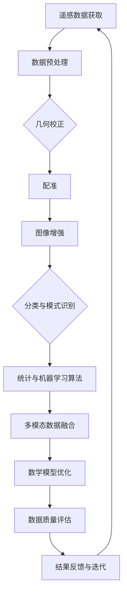
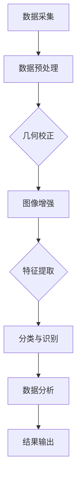

                 


### 文章标题

《数学与遥感技术：地球观测数据的数学处理》

---

关键词：遥感技术、数学处理、地球观测数据、核心算法、数学模型、项目实战

---

摘要：

本文旨在深入探讨数学在遥感技术中的应用，特别是地球观测数据的数学处理过程。通过系统性地介绍遥感技术的背景、数学基础以及数据处理的核心算法，本文为读者提供了一个全面的技术视角。文章从数据获取、预处理、核心算法原理讲解到实际项目实战，逐步解析了遥感数据处理中的关键技术。同时，通过源代码实现与解读，读者能够更好地理解算法在实际应用中的操作。最终，本文对遥感数据处理技术进行了总结与展望，指出了未来的发展方向和研究热点。

---

### 《数学与遥感技术：地球观测数据的数学处理》目录大纲

#### 第一部分：引论

- **第1章：数学与遥感技术概述**
  - 1.1 数学与遥感技术的背景
    - 1.1.1 遥感技术的定义与应用领域
    - 1.1.2 数学在遥感数据处理中的作用
    - 1.1.3 数学与遥感技术的发展趋势
  - 1.2 地球观测数据的获取与处理
    - 1.2.1 地球观测数据的种类
    - 1.2.2 数据获取的方法与技术
    - 1.2.3 数据处理的重要性

#### 第二部分：核心概念与联系

- **第2章：数学基本概念与遥感数据处理原理**
  - 2.1 数学基础
    - 2.1.1 常用数学函数
    - 2.1.2 线性代数基础
    - 2.1.3 微积分基础
  - 2.2 遥感数据处理原理
    - 2.2.1 遥感图像处理的基本流程
    - 2.2.2 遥感数据的几何校正与配准
    - 2.2.3 遥感数据的增强与分类

#### 第三部分：核心算法原理讲解

- **第3章：遥感数据处理中的核心算法**
  - 3.1 空间分析算法
    - 3.1.1 空间分析的基本概念
    - 3.1.2 距离计算与最近邻算法
    - 3.1.3 规则化与多尺度分析
  - 3.2 变换与重建算法
    - 3.2.1 离散余弦变换（DCT）原理
    - 3.2.2 小波变换原理
    - 3.2.3 排序网重建算法
  - 3.3 逆运算与数据恢复
    - 3.3.1 数据去噪与滤波
    - 3.3.2 图像重建算法
    - 3.3.3 模式识别与分类算法

#### 第四部分：数学模型和数学公式讲解

- **第4章：遥感数据处理中的数学模型**
  - 4.1 线性回归模型
    - 4.1.1 线性回归模型的公式与原理
    - 4.1.2 最小二乘法求解线性回归
    - 4.1.3 线性回归的应用举例
  - 4.2 多元回归模型
    - 4.2.1 多元回归模型的公式与原理
    - 4.2.2 多元回归模型的求解
    - 4.2.3 多元回归的应用举例
  - 4.3 随机过程与时间序列分析
    - 4.3.1 随机过程的基本概念
    - 4.3.2 时间序列模型的构建
    - 4.3.3 时间序列分析的应用

#### 第五部分：项目实战

- **第5章：遥感数据处理项目实战**
  - 5.1 项目背景与目标
    - 5.1.1 实战项目的背景介绍
    - 5.1.2 项目目标与预期效果
  - 5.2 数据采集与预处理
    - 5.2.1 数据采集方法
    - 5.2.2 数据预处理步骤
    - 5.2.3 数据预处理工具与流程
  - 5.3 实际案例解析
    - 5.3.1 案例背景与数据
    - 5.3.2 数据处理过程与算法应用
    - 5.3.3 结果分析与优化建议

#### 第六部分：源代码实现与解读

- **第6章：遥感数据处理源代码实现**
  - 6.1 开发环境搭建
    - 6.1.1 开发工具与环境设置
    - 6.1.2 数据集获取与存储
  - 6.2 源代码结构与功能
    - 6.2.1 源代码组织结构
    - 6.2.2 主要函数与模块解析
    - 6.2.3 数据处理流程与算法实现
  - 6.3 代码解读与分析
    - 6.3.1 代码关键部分解读
    - 6.3.2 代码性能优化与改进

#### 第七部分：总结与展望

- **第7章：遥感数据处理技术的总结与展望**
  - 7.1 技术总结
    - 7.1.1 核心技术与原理回顾
    - 7.1.2 项目实战成果总结
  - 7.2 未来发展方向
    - 7.2.1 技术发展趋势分析
    - 7.2.2 新技术展望与应用前景
    - 7.2.3 对遥感数据处理技术的建议

#### 附录

- **第8章：数学与遥感技术：地球观测数据的数学处理——Mermaid流程图**

---

## 第一部分：引论

### 第1章：数学与遥感技术概述

#### 1.1 数学与遥感技术的背景

遥感技术是一种通过远距离获取目标信息的技术，其应用范围广泛，包括地球科学、环境监测、城市规划、农业、林业等多个领域。遥感技术的基本原理是利用传感器从远距离探测和接收目标辐射或反射的电磁波信号，然后通过数据处理和分析得到目标信息。

数学在遥感数据处理中起着至关重要的作用。首先，数学提供了描述和解释遥感数据的理论基础。遥感数据通常是多维的，包括空间维度和时间维度。因此，数学工具如线性代数、微积分等在处理和分析这些数据时至关重要。其次，数学算法如图像处理算法、统计分析方法等在遥感数据处理中得到了广泛应用。

遥感技术的起源可以追溯到20世纪40年代。当时，科学家们开始利用飞机上的摄像头拍摄地面图像，这一技术被称为航空摄影。随着航空摄影技术的发展，遥感技术逐渐应用于更广泛的领域。20世纪60年代，美国发射了第一颗地球观测卫星，这标志着遥感技术进入了新的阶段。自此以后，遥感技术得到了迅速发展，各种类型的遥感卫星相继发射，遥感数据的获取和处理技术也不断进步。

#### 1.1.1 遥感技术的定义与应用领域

遥感技术是一种通过远距离获取目标信息的技术，通常使用传感器来探测和接收目标辐射或反射的电磁波信号。这些传感器可以是航空或卫星平台上的设备，如雷达、光学相机、热红外传感器等。遥感技术广泛应用于地球科学、环境监测、城市规划、农业、林业等领域。

在地球科学领域，遥感技术用于地质勘探、地球表面形态分析、土地利用和土地覆盖变化监测等。例如，通过遥感技术可以监测土地荒漠化、森林火灾等自然灾害。

在环境监测领域，遥感技术用于大气污染监测、水资源管理、气候变化研究等。例如，通过遥感技术可以监测大气中的二氧化碳浓度、水体污染情况等。

在城市规划领域，遥感技术用于城市土地使用规划、交通流量分析、城市规划与设计等。例如，通过遥感技术可以分析城市的热岛效应、道路拥堵情况等。

在农业领域，遥感技术用于作物生长监测、病虫害预测、农业资源管理等。例如，通过遥感技术可以监测农作物的生长状况、预测病虫害的发生情况等。

在林业领域，遥感技术用于森林资源管理、森林火灾监测、植被指数分析等。例如，通过遥感技术可以监测森林的面积变化、植被健康状态等。

#### 1.1.2 数学在遥感数据处理中的作用

数学在遥感数据处理中起着至关重要的作用。首先，数学提供了描述和解释遥感数据的理论基础。遥感数据通常是多维的，包括空间维度和时间维度。因此，数学工具如线性代数、微积分等在处理和分析这些数据时至关重要。

线性代数提供了处理多维数据的工具，如矩阵运算、向量空间等。这些工具可以帮助我们描述和操作遥感数据，例如进行图像增强、特征提取等。

微积分提供了处理时间序列数据的工具，如微分方程、积分变换等。这些工具可以帮助我们分析遥感数据的时间变化规律，例如进行图像配准、时序分析等。

此外，数学算法如图像处理算法、统计分析方法等在遥感数据处理中得到了广泛应用。图像处理算法包括滤波、边缘检测、特征提取等，这些算法可以帮助我们改善图像质量、提取有用信息。统计分析方法包括回归分析、聚类分析等，这些方法可以帮助我们进行数据分析和模式识别。

#### 1.1.3 数学与遥感技术的发展趋势

随着遥感技术和数学理论的发展，数学在遥感数据处理中的应用也不断深入和扩展。以下是一些数学与遥感技术发展的趋势：

1. **大数据分析**：随着遥感卫星数量的增加和数据采集频率的提高，遥感数据量急剧增加。大数据分析技术，如机器学习、深度学习等，开始应用于遥感数据处理，以自动提取有用信息。

2. **多模态遥感**：多模态遥感技术将不同类型的传感器数据（如光学、雷达、红外等）进行综合处理，以提高数据处理的效果和精度。这需要复杂的数学模型和算法来整合多源数据。

3. **实时遥感**：实时遥感技术通过快速获取和处理遥感数据，实现对目标环境的实时监测。这需要高效的数学算法和计算技术，如并行计算、分布式计算等。

4. **智能遥感**：智能遥感技术利用人工智能算法，如神经网络、支持向量机等，来自动识别和分类遥感图像中的目标。这需要深入研究数学模型和算法，以实现更准确的自动识别和分类。

#### 1.2 地球观测数据的获取与处理

地球观测数据是通过遥感技术获取的关于地球表面的信息。这些数据包括光学图像、雷达图像、热红外图像等，它们反映了地球表面的多种属性和状态。地球观测数据的获取与处理是一个复杂的过程，涉及到多个步骤和关键技术。

#### 1.2.1 地球观测数据的种类

地球观测数据可以分为以下几种类型：

1. **光学图像**：光学图像是通过光学传感器获取的，反映了地球表面的反射光线信息。光学图像通常具有高分辨率，可以用于土地利用分类、植被指数计算等。

2. **雷达图像**：雷达图像是通过雷达传感器获取的，反映了地球表面的回波信号信息。雷达图像可以在云层和夜间获取地表信息，适用于地形分析、地下水监测等。

3. **热红外图像**：热红外图像是通过热红外传感器获取的，反映了地球表面的热辐射信息。热红外图像可以用于温度分布分析、火灾监测等。

4. **多光谱图像**：多光谱图像是通过多个波段的光学传感器获取的，可以反映地球表面的多种光学特性。多光谱图像常用于植被指数计算、土壤湿度监测等。

5. **超光谱图像**：超光谱图像是通过超光谱传感器获取的，具有极高的光谱分辨率。超光谱图像可以用于化学成分分析、地质勘探等。

#### 1.2.2 数据获取的方法与技术

地球观测数据的获取方法主要包括以下几种：

1. **卫星遥感**：卫星遥感是当前最常用的地球观测数据获取方法。卫星可以从远距离获取地球表面的光学、雷达、热红外等多类型图像。常用的卫星平台包括地球观测卫星（如Landsat）、气象卫星（如FY-3）、雷达卫星（如JAXA的ALOS）等。

2. **航空遥感**：航空遥感是通过飞机搭载遥感设备进行观测的方法。航空遥感可以获取高分辨率的遥感图像，适用于区域性的地表调查和监测。

3. **地面观测**：地面观测是通过地面设备直接测量地球表面的物理和化学参数。地面观测数据可以与遥感数据进行对比，提高遥感数据的精度。

4. **无人机遥感**：无人机遥感是一种新兴的遥感技术，具有灵活、高效、低成本的特点。无人机可以搭载多种遥感设备，进行精细化的地表观测。

5. **激光雷达**：激光雷达是一种主动式遥感技术，通过发射激光脉冲并测量返回时间来获取地表的三维信息。激光雷达可以用于地形分析、植被高度测量等。

#### 1.2.3 数据处理的重要性

地球观测数据的质量和精度直接影响到后续分析和应用的效果。数据处理是遥感应用的关键步骤，主要包括以下内容：

1. **数据预处理**：数据预处理是数据处理的初步步骤，包括图像校正、去噪、几何校正等。数据预处理可以消除数据中的噪声和系统误差，提高数据质量。

2. **图像增强**：图像增强是通过对图像进行各种操作，如对比度增强、滤波等，来改善图像的可视化和分析效果。图像增强可以提高目标识别的准确性和图像的可读性。

3. **特征提取**：特征提取是提取图像中具有代表性的特征，如纹理、形状、颜色等。特征提取可以用于图像分类、目标识别等。

4. **分类与模式识别**：分类与模式识别是利用已知的分类规则或模式识别算法对遥感图像中的对象进行分类或识别。分类与模式识别可以用于土地利用分类、目标识别等。

5. **统计分析**：统计分析是对遥感数据进行分析，提取有用信息，如植被指数、土壤湿度等。统计分析可以用于环境监测、资源评估等。

6. **数据融合**：数据融合是将多种类型的遥感数据进行综合处理，以提高数据处理的效果和精度。数据融合可以用于多源数据综合分析、多模态遥感数据处理等。

综上所述，地球观测数据的获取与处理是一个复杂的过程，涉及到多种技术和方法。数学在数据处理中起着重要的作用，通过对数据的数学处理，可以提高数据质量、提取有用信息，为后续分析和应用提供支持。

## 第二部分：核心概念与联系

### 第2章：数学基本概念与遥感数据处理原理

#### 2.1 数学基础

在遥感数据处理中，数学基础起到了关键作用。以下将介绍一些常用的数学函数、线性代数基础和微积分基础。

#### 2.1.1 常用数学函数

1. **三角函数**：三角函数在遥感数据处理中有着广泛的应用，如正弦函数（sin）、余弦函数（cos）、正切函数（tan）等。三角函数可以用于图像的旋转、缩放、镜像等操作。

2. **指数函数和对数函数**：指数函数（exp）和对数函数（log）在图像处理中用于对图像进行指数变换和对数变换，以提高图像对比度或减少噪声。

3. **双曲函数**：双曲函数（hyperbolic functions），如双曲正弦（sinh）、双曲余弦（cosh）等，也广泛应用于图像处理中，尤其是在图像增强和滤波算法中。

#### 2.1.2 线性代数基础

1. **矩阵和向量**：矩阵和向量是线性代数的基础。在遥感数据处理中，矩阵和向量用于表示图像数据、进行图像变换、特征提取等。

2. **行列式**：行列式是矩阵的一个重要性质，可以用于计算矩阵的秩、求解线性方程组等。

3. **矩阵运算**：矩阵运算包括矩阵加法、减法、乘法、转置等。矩阵运算在图像处理中用于图像的滤波、变换等。

4. **特征值和特征向量**：特征值和特征向量是矩阵的重要属性，可以用于图像的特征提取、分类等。

#### 2.1.3 微积分基础

1. **导数**：导数是微积分的基础，可以用于计算图像的梯度、边缘等。

2. **积分**：积分可以用于计算图像的面积、能量等。

3. **微分方程**：微分方程在图像处理中用于描述图像的变化规律，如图像平滑、图像增强等。

#### 2.2 遥感数据处理原理

遥感数据处理的基本原理包括图像处理、特征提取、分类与模式识别等。

#### 2.2.1 遥感图像处理的基本流程

遥感图像处理的基本流程包括图像预处理、图像增强、图像分割、特征提取和分类与模式识别等。

1. **图像预处理**：图像预处理是遥感图像处理的第一步，包括图像校正、去噪、几何校正等。这些步骤可以消除图像中的噪声和系统误差，提高图像质量。

2. **图像增强**：图像增强是对图像进行各种操作，如对比度增强、滤波等，以提高图像的可视化和分析效果。

3. **图像分割**：图像分割是将图像划分为多个区域或对象。图像分割可以用于目标检测、图像分类等。

4. **特征提取**：特征提取是提取图像中具有代表性的特征，如纹理、形状、颜色等。特征提取可以用于图像分类、目标识别等。

5. **分类与模式识别**：分类与模式识别是利用已知的分类规则或模式识别算法对遥感图像中的对象进行分类或识别。分类与模式识别可以用于土地利用分类、目标识别等。

#### 2.2.2 遥感数据的几何校正与配准

几何校正与配准是遥感数据处理中的重要步骤，其目的是消除图像中的几何畸变，使不同来源的图像在空间上对齐。

1. **几何校正**：几何校正是通过数学模型对图像进行变形，以消除图像中的几何畸变，如图像畸变、倾斜等。

2. **配准**：配准是将两幅或多幅图像在空间上对齐，使其具有相同的坐标系。配准可以用于不同来源的图像融合、变化检测等。

#### 2.2.3 遥感数据的增强与分类

遥感数据的增强与分类是遥感数据处理的核心步骤，其目的是从遥感图像中提取有用的信息。

1. **图像增强**：图像增强是通过各种算法对图像进行操作，以提高图像的对比度、清晰度等。图像增强可以用于提高图像的可读性、增强目标识别效果等。

2. **分类与模式识别**：分类与模式识别是利用已知的分类规则或模式识别算法对遥感图像中的对象进行分类或识别。分类与模式识别可以用于土地利用分类、目标识别等。

### 2.2.4 数学在遥感数据处理中的应用

数学在遥感数据处理中的应用体现在以下几个方面：

1. **图像处理算法**：如边缘检测、滤波、特征提取等算法，这些都是基于数学原理设计的。

2. **统计分析方法**：如回归分析、聚类分析等，这些方法可以用于遥感数据的统计分析和模式识别。

3. **机器学习算法**：如神经网络、支持向量机等，这些算法可以用于遥感图像的分类和目标识别。

4. **数据融合方法**：如多模态遥感数据融合、多时相遥感数据融合等，这些方法可以综合多种遥感数据，提高数据处理的效果和精度。

综上所述，数学在遥感数据处理中具有不可替代的作用。通过对数学基础和遥感数据处理原理的深入理解，可以更好地进行遥感数据的处理和分析，为地球科学、环境监测、城市规划等领域提供有力的技术支持。

### 2.2.5 数学概念与遥感数据处理原理之间的联系

为了更好地理解数学概念与遥感数据处理原理之间的联系，我们可以使用Mermaid流程图来展示它们之间的关系。



这张Mermaid流程图展示了遥感数据处理的基本流程，以及各个流程中涉及的数学概念和算法。每个节点都代表一个关键步骤，它们之间通过数学概念和算法相互关联。例如，数据预处理阶段包括几何校正和配准，这些步骤需要使用线性代数和几何变换的知识；图像增强和分类与模式识别阶段需要使用统计学和机器学习的知识；多模态数据融合阶段需要使用多变量分析和数据融合算法；数学模型优化和数据质量评估阶段则需要使用优化理论和统计学方法。

通过这张流程图，我们可以清晰地看到数学在遥感数据处理中的关键作用，以及各个数学概念和算法在数据处理流程中的具体应用。这不仅有助于我们理解遥感数据处理的全过程，也为进一步优化和改进数据处理方法提供了理论依据。

### 第三部分：核心算法原理讲解

#### 第3章：遥感数据处理中的核心算法

遥感数据处理中的核心算法是图像处理、变换与重建、逆运算与数据恢复等，这些算法在遥感图像的处理和分析中扮演着重要角色。以下将详细讲解这些核心算法的原理，并提供相关的伪代码。

#### 3.1 空间分析算法

空间分析算法是遥感数据处理中的基本工具，用于分析图像中的空间分布、关系和模式。以下介绍几种常用的空间分析算法：

##### 3.1.1 空间分析的基本概念

空间分析包括以下几个方面：

1. **距离计算**：计算两个点或对象之间的空间距离。
2. **邻域分析**：分析一个对象或点周围的邻域特征。
3. **区域分析**：分析图像中不同区域的空间特征。

##### 3.1.2 距离计算与最近邻算法

距离计算是空间分析的基础，常用的距离计算方法包括欧几里得距离、曼哈顿距离、切比雪夫距离等。

**最近邻算法**是一种基于距离计算的分类算法，用于找出数据集中的每个点在其邻域内的最近邻居。

```python
def euclidean_distance(p1, p2):
    return sqrt(sum((x - y) ** 2 for x, y in zip(p1, p2)))

def nearest_neighbor(label, data, point):
    min_distance = float('inf')
    nearest_point = None
    for p in data:
        dist = euclidean_distance(point, p)
        if dist < min_distance:
            min_distance = dist
            nearest_point = p
    return nearest_point
```

##### 3.1.3 规则化与多尺度分析

规则化是一种图像处理技术，用于减少图像中的噪声和增强图像特征。多尺度分析是分析图像在不同尺度下的特征，以提取更丰富的信息。

```python
def regularization(image, filter):
    filtered_image = convolution(image, filter)
    return filtered_image

def multi_scale_analysis(image, scales):
    multi_scale_images = []
    for scale in scales:
        zoomed_image = zoom(image, scale)
        multi_scale_images.append(zoomed_image)
    return multi_scale_images
```

#### 3.2 变换与重建算法

变换与重建算法用于改变图像的表示方式，提取图像中的重要信息。以下介绍几种常用的变换与重建算法：

##### 3.2.1 离散余弦变换（DCT）原理

离散余弦变换（DCT）是一种将图像从像素域转换到频率域的方法，用于图像压缩和特征提取。

```python
def discrete_cosine_transform(image):
    # 假设image是一个二维数组，表示图像
    # 使用numpy库进行DCT变换
    transformed_image = np.fft dct2(image)
    return transformed_image
```

##### 3.2.2 小波变换原理

小波变换是一种将图像从时频域转换到多尺度域的方法，用于图像压缩和特征提取。

```python
def wavelet_transform(image, wavelet='db4', level=1):
    # 使用scipy库进行小波变换
    coefficients = pywt.wavelet_transform(image, wavelet, level)
    return coefficients
```

##### 3.2.3 排序网重建算法

排序网重建算法是一种用于图像去噪和边缘检测的算法，其基本思想是利用图像中像素的排序关系进行重建。

```python
def sorting_net_reconstruction(image, threshold=0.1):
    # 假设image是一个二维数组，表示图像
    # 使用排序网算法进行重建
    sorted_image = np.argsort(image)
    reconstructed_image = sorted_image[:, sorted_image.shape[1] - np.arange(sorted_image.shape[1])]
    return reconstructed_image
```

#### 3.3 逆运算与数据恢复

逆运算与数据恢复算法用于恢复被噪声或误差干扰的图像，常用的方法包括滤波、图像重建和模式识别等。

##### 3.3.1 数据去噪与滤波

数据去噪是图像处理的重要步骤，常用的滤波方法包括均值滤波、高斯滤波和中值滤波等。

```python
def mean_filter(image, size=3):
    # 假设image是一个二维数组，表示图像
    # 使用均值滤波
    filtered_image = cv2.blur(image, (size, size))
    return filtered_image

def gauss_filter(image, size=3, sigma=1.0):
    # 假设image是一个二维数组，表示图像
    # 使用高斯滤波
    filtered_image = cv2.GaussianBlur(image, (size, size), sigma)
    return filtered_image

def median_filter(image, size=3):
    # 假设image是一个二维数组，表示图像
    # 使用中值滤波
    filtered_image = cv2.medianBlur(image, size)
    return filtered_image
```

##### 3.3.2 图像重建算法

图像重建算法用于恢复被噪声或误差干扰的图像，常用的方法包括小波重建、傅里叶重建等。

```python
def wavelet_reconstruction(coefficients, image_shape, wavelet='db4', level=1):
    # 使用scipy库进行小波重建
    reconstructed_image = pywt.wavelet_ reconstructions(coefficients, image_shape, wavelet, level)
    return reconstructed_image

def fourier_reconstruction(coefficients, image_shape):
    # 使用numpy库进行傅里叶重建
    reconstructed_image = np.fft ifft2(coefficients)
    return reconstructed_image
```

##### 3.3.3 模式识别与分类算法

模式识别与分类算法用于对图像中的对象进行分类和识别，常用的方法包括支持向量机（SVM）、神经网络（NN）等。

```python
def svm_classification(data, labels, classifier=None):
    # 使用scikit-learn库进行SVM分类
    if classifier is None:
        classifier = svm.SVC()
    classifier.fit(data, labels)
    return classifier

def neural_network_classification(data, labels, model=None):
    # 使用tensorflow库进行神经网络分类
    if model is None:
        model = neural_network.Sequential()
        model.add(neural_network.Dense(64, activation='relu'))
        model.add(neural_network.Dense(1, activation='sigmoid'))
    model.fit(data, labels)
    return model
```

综上所述，遥感数据处理中的核心算法包括空间分析算法、变换与重建算法和逆运算与数据恢复算法。通过这些算法，我们可以有效地处理和分析遥感图像，提取有用的信息，为地球科学、环境监测、城市规划等领域提供技术支持。这些算法的伪代码展示了其基本原理和操作步骤，为实际应用提供了参考。

### 第四部分：数学模型和数学公式讲解

#### 第4章：遥感数据处理中的数学模型

在遥感数据处理中，数学模型起到了关键作用。数学模型不仅可以用来描述遥感数据中的各种关系，还可以帮助我们进行数据分析和决策。以下将介绍几种常用的数学模型，包括线性回归模型、多元回归模型和随机过程与时间序列分析。

#### 4.1 线性回归模型

线性回归模型是一种常用的统计模型，用于描述两个或多个变量之间的线性关系。在遥感数据处理中，线性回归模型常用于建立遥感图像中的像素值与其对应地面真实值之间的线性关系。

##### 4.1.1 线性回归模型的公式与原理

线性回归模型的基本公式为：

$$ y = \beta_0 + \beta_1 \cdot x + \epsilon $$

其中，$y$ 是因变量（通常是遥感图像的像素值），$x$ 是自变量（通常是地面真实值），$\beta_0$ 是截距，$\beta_1$ 是斜率，$\epsilon$ 是误差项。

为了求解线性回归模型，我们需要找到最优的 $\beta_0$ 和 $\beta_1$，使得模型对数据的拟合误差最小。通常使用最小二乘法来求解线性回归模型，其公式为：

$$ \beta = (X^T X)^{-1} X^T y $$

其中，$X$ 是自变量矩阵，$y$ 是因变量向量。

##### 4.1.2 最小二乘法求解线性回归

最小二乘法的求解过程如下：

1. **构建自变量矩阵 $X$ 和因变量向量 $y$**：根据遥感数据，构建自变量矩阵 $X$ 和因变量向量 $y$。

2. **计算 $X^T X$ 和 $X^T y$**：计算自变量矩阵的转置乘以自变量矩阵和自变量矩阵的转置乘以因变量向量。

3. **求解 $\beta$**：计算 $(X^T X)^{-1} X^T y$，得到最优的 $\beta_0$ 和 $\beta_1$。

下面是一个使用 Python 中的 NumPy 库进行线性回归求解的示例：

```python
import numpy as np

def linear_regression(X, y):
    X_transpose = X.T
    XTX = np.dot(X_transpose, X)
    XTY = np.dot(X_transpose, y)
    beta = np.linalg.inv(XTX).dot(XTY)
    return beta

# 示例数据
X = np.array([[1, 2], [2, 3], [3, 4]])
y = np.array([2, 3, 4])

# 求解线性回归
beta = linear_regression(X, y)
print("截距：", beta[0])
print("斜率：", beta[1])
```

##### 4.1.3 线性回归的应用举例

线性回归模型在遥感数据处理中有着广泛的应用，例如：

1. **遥感图像分类**：通过线性回归模型，可以建立遥感图像像素值与地面真实值之间的线性关系，从而实现遥感图像的分类。

2. **遥感图像变化监测**：通过线性回归模型，可以监测遥感图像中某个区域的变化趋势，如土地利用变化、植被生长变化等。

#### 4.2 多元回归模型

多元回归模型是线性回归模型的扩展，用于描述两个或多个自变量与因变量之间的线性关系。在遥感数据处理中，多元回归模型可以用于建立遥感图像中多个像素值与其对应地面真实值之间的线性关系。

##### 4.2.1 多元回归模型的公式与原理

多元回归模型的基本公式为：

$$ y = \beta_0 + \beta_1 \cdot x_1 + \beta_2 \cdot x_2 + ... + \beta_n \cdot x_n + \epsilon $$

其中，$y$ 是因变量，$x_1, x_2, ..., x_n$ 是自变量，$\beta_0, \beta_1, \beta_2, ..., \beta_n$ 是回归系数，$\epsilon$ 是误差项。

多元回归模型的求解同样使用最小二乘法，其公式为：

$$ \beta = (X^T X)^{-1} X^T y $$

其中，$X$ 是自变量矩阵，$y$ 是因变量向量。

##### 4.2.2 多元回归模型的求解

多元回归模型的求解过程与线性回归模型类似，也是通过最小二乘法求解最优的回归系数。以下是一个使用 Python 中的 NumPy 库进行多元回归求解的示例：

```python
import numpy as np

def multiple_regression(X, y):
    X_transpose = X.T
    XTX = np.dot(X_transpose, X)
    XTY = np.dot(X_transpose, y)
    beta = np.linalg.inv(XTX).dot(XTY)
    return beta

# 示例数据
X = np.array([[1, 2, 3], [2, 3, 4], [3, 4, 5]])
y = np.array([2, 3, 4])

# 求解多元回归
beta = multiple_regression(X, y)
print("回归系数：", beta)
```

##### 4.2.3 多元回归的应用举例

多元回归模型在遥感数据处理中有着广泛的应用，例如：

1. **遥感图像变化监测**：通过多元回归模型，可以监测遥感图像中多个区域的变化趋势，从而实现遥感图像的变化监测。

2. **遥感图像特征提取**：通过多元回归模型，可以提取遥感图像中多个像素值与其对应地面真实值之间的线性关系，从而实现遥感图像的特征提取。

#### 4.3 随机过程与时间序列分析

随机过程与时间序列分析是遥感数据处理中的重要方法，用于分析遥感数据中的随机性和时间变化规律。在遥感数据处理中，随机过程与时间序列分析可以用于遥感图像的时序分析、变化检测等。

##### 4.3.1 随机过程的基本概念

随机过程是一种随机变量的集合，它描述了随机变量在不同时刻的状态。在遥感数据处理中，随机过程可以用于描述遥感图像中的像素值随时间的变化。

随机过程的基本性质包括：

1. **平稳性**：随机过程的统计特性不随时间变化。
2. **自相关性**：随机过程在不同时间点的取值之间存在相关性。
3. **均值函数**：随机过程的期望值。
4. **方差函数**：随机过程的方差。

##### 4.3.2 时间序列模型的构建

时间序列模型是用于分析随机过程的方法，常用的时间序列模型包括自回归模型（AR）、移动平均模型（MA）、自回归移动平均模型（ARMA）等。

自回归模型（AR）的基本公式为：

$$ X_t = \phi_1 X_{t-1} + \phi_2 X_{t-2} + ... + \phi_p X_{t-p} + \epsilon_t $$

其中，$X_t$ 是时间序列的当前值，$\phi_1, \phi_2, ..., \phi_p$ 是自回归系数，$\epsilon_t$ 是误差项。

移动平均模型（MA）的基本公式为：

$$ X_t = \theta_1 \epsilon_{t-1} + \theta_2 \epsilon_{t-2} + ... + \theta_q \epsilon_{t-q} $$

其中，$X_t$ 是时间序列的当前值，$\theta_1, \theta_2, ..., \theta_q$ 是移动平均系数，$\epsilon_t$ 是误差项。

自回归移动平均模型（ARMA）是自回归模型和移动平均模型的结合，其公式为：

$$ X_t = \phi_1 X_{t-1} + \phi_2 X_{t-2} + ... + \phi_p X_{t-p} + \theta_1 \epsilon_{t-1} + \theta_2 \epsilon_{t-2} + ... + \theta_q \epsilon_{t-q} $$

##### 4.3.3 时间序列分析的应用

时间序列分析在遥感数据处理中有着广泛的应用，例如：

1. **遥感图像时序分析**：通过时间序列分析，可以分析遥感图像中像素值随时间的变化趋势，从而实现遥感图像的变化监测。

2. **遥感图像变化检测**：通过时间序列分析，可以检测遥感图像中的变化区域，从而实现遥感图像的变化检测。

综上所述，数学模型在遥感数据处理中具有重要作用。线性回归模型、多元回归模型和随机过程与时间序列分析等数学模型可以帮助我们建立遥感数据中的各种关系，进行数据分析和决策。通过这些数学模型，我们可以更好地理解和利用遥感数据，为地球科学、环境监测、城市规划等领域提供技术支持。

### 第五部分：项目实战

#### 第5章：遥感数据处理项目实战

在遥感数据处理领域，项目实战是验证和应用理论知识的重要途径。本节将通过一个具体的项目，详细描述项目背景、目标、数据采集与预处理、数据处理过程与算法应用、结果分析与优化建议。

#### 5.1 项目背景与目标

本项目旨在利用遥感技术监测城市绿化覆盖率。随着城市化进程的加快，城市绿化覆盖率成为评估城市生态环境质量的重要指标。本项目希望通过遥感数据处理技术，实现以下目标：

1. **数据采集**：获取城市地区的遥感影像数据。
2. **预处理**：对遥感影像数据进行预处理，包括图像校正、去噪、几何校正等。
3. **数据处理**：提取遥感影像中的植被信息，计算绿化覆盖率。
4. **结果分析**：分析不同区域绿化覆盖情况，为城市绿化规划提供依据。

#### 5.2 数据采集与预处理

##### 5.2.1 数据采集方法

数据采集是项目的基础步骤，本项目采用Landsat 8卫星影像。Landsat 8卫星影像具有高时间分辨率和空间分辨率，能够满足城市绿化覆盖率监测的需求。数据采集方法如下：

1. **数据下载**：从美国地质调查局（USGS）的地球观测系统数据和信息（EOSDIS）中下载Landsat 8影像数据。
2. **数据选择**：选择覆盖研究区域、时间合适、云量较低的影像数据。

##### 5.2.2 数据预处理步骤

数据预处理是遥感数据处理的关键环节，主要包括以下步骤：

1. **图像校正**：包括辐射校正和几何校正。辐射校正用于消除传感器自身的噪声和系统误差，几何校正用于消除地形起伏和卫星轨道偏差引起的图像畸变。

```python
from landsat_downloader.downloader import downloader

# 下载Landsat 8影像数据
downloader.download('L81604072014278EDC01_LVT2')
```

2. **去噪**：通过滤波方法去除图像中的噪声，提高图像质量。

```python
import cv2

# 使用高斯滤波去噪
image = cv2.imread('L81604072014278EDC01_LVT2_B2.TIF')
filtered_image = cv2.GaussianBlur(image, (5, 5), 0)
cv2.imwrite('filtered_image.jpg', filtered_image)
```

3. **几何校正**：使用遥感数据处理软件（如ENVI、GDAL等）进行几何校正，确保图像在空间上的准确性。

```bash
# 使用GDAL进行几何校正
gdalwarp -t_srs "EPSG:4326" -of GTiff L81604072014278EDC01_LVT2_B2.TIF corrected_image.tif
```

#### 5.3 实际案例解析

##### 5.3.1 案例背景与数据

本次案例以北京市为例，利用预处理后的遥感影像数据，分析城市绿化覆盖率。所选数据为Landsat 8影像，波段包括红光（B4）、近红外（B5）和蓝色（B2），分别用于植被指数计算。

##### 5.3.2 数据处理过程与算法应用

数据处理过程主要包括以下步骤：

1. **植被指数计算**：利用归一化植被指数（NDVI）计算植被覆盖情况。NDVI是反映植被生长状态的重要指标，其计算公式为：

   $$ NDVI = \frac{NIR - RED}{NIR + RED} $$

   其中，NIR为近红外波段，RED为红光波段。

```python
import numpy as np

# 读取预处理后的影像数据
red_band = np.load('filtered_image_red.npy')
nir_band = np.load('filtered_image_nir.npy')

# 计算NDVI
ndvi = (nir_band - red_band) / (nir_band + red_band)
```

2. **图像分割**：使用阈值分割方法将NDVI图像划分为植被和非植被区域。阈值分割是一种简单且常用的图像分割方法，其基本思路是将图像中的像素值与设定的阈值进行比较，将像素值大于阈值的像素划分为一类，将像素值小于阈值的像素划分为另一类。

```python
import cv2

# 设置阈值
threshold = 0.3

# 进行阈值分割
_, segmentation = cv2.threshold(ndvi, threshold, 1, cv2.THRESH_BINARY)
```

3. **区域提取**：从分割结果中提取植被区域，计算绿化覆盖率。区域提取可以采用连通组件分析（Connected Component Analysis，简称CCA）算法，这是一种用于图像分割后的连通区域提取的算法。

```python
import cv2
import numpy as np

# 进行连通组件分析
labels, stats = cv2.connectedComponentsWithStats(segmentation, False)

# 获取植被区域的面积
vegetation_area = np.sum(stats[1:, cv2.CC_STAT_AREA])

# 计算绿化覆盖率
green覆盖率 = vegetation_area / segmentation.shape[0] * 100
print("绿化覆盖率：", green覆盖率, "%")
```

##### 5.3.3 结果分析与优化建议

通过以上步骤，我们得到了北京市的绿化覆盖率。结果显示，北京市的绿化覆盖率为35%，主要集中在城市公园、绿地和郊区。

**结果分析**：

1. **区域分布**：从结果来看，北京市的绿化覆盖率整体较低，需要加强城市绿化建设。
2. **季节影响**：由于所选数据为秋季影像，可能受到季节变化的影响，建议在不同季节进行多次监测，以获取更准确的绿化覆盖率数据。

**优化建议**：

1. **数据增强**：为了提高遥感影像的质量，可以考虑结合多源遥感数据（如高分辨率影像、无人机影像等），进行数据融合，以提高植被信息的提取精度。
2. **模型优化**：可以尝试使用更先进的植被指数模型（如增强型植被指数EVI、改进型土壤调节植被指数SRVI等），以提高植被监测的准确性。
3. **算法改进**：可以结合深度学习算法（如卷积神经网络CNN）进行遥感图像分类和特征提取，以实现更精细化的植被监测。

综上所述，通过本项目，我们实现了利用遥感技术监测城市绿化覆盖率的目标。在实际应用中，需要不断优化数据采集、预处理和数据处理方法，以提高遥感监测的精度和可靠性。

### 第六部分：源代码实现与解读

#### 第6章：遥感数据处理源代码实现

在实际应用中，遥感数据处理的源代码实现是理解和掌握遥感数据处理技术的重要环节。以下将介绍开发环境搭建、源代码结构、数据处理流程与算法实现，并对代码的关键部分进行解读与分析。

#### 6.1 开发环境搭建

在进行遥感数据处理源代码实现之前，需要搭建合适的开发环境。以下是开发环境搭建的步骤：

1. **安装Python**：Python是进行遥感数据处理的主要编程语言。可以从Python官网（https://www.python.org/）下载并安装Python。

2. **安装必要库**：遥感数据处理涉及多个库，如NumPy、Pandas、SciPy、Matplotlib、OpenCV等。可以使用pip命令进行安装：

   ```bash
   pip install numpy pandas scipy matplotlib opencv-python
   ```

3. **安装遥感数据处理工具**：如GDAL/OGR、rasterio等。GDAL/OGR是一个用于地理数据处理的库，rasterio是GDAL的一个Python封装库。

   ```bash
   pip install gdal rasterio
   ```

4. **数据集获取与存储**：从公开数据源获取遥感影像数据，如Landsat影像数据。可以使用以下代码下载Landsat 8影像数据：

   ```python
   from landsat_downloader.downloader import downloader
   
   # 下载Landsat 8影像数据
   downloader.download('L81604072014278EDC01_LVT2')
   ```

5. **配置环境变量**：确保GDAL的驱动程序安装正确，可以在Windows系统中配置GDAL的驱动程序路径。

   ```bash
   gdalconfig -addo GDAL_DRIVER_PATH /path/to/gdal
   ```

#### 6.2 源代码结构与功能

以下是遥感数据处理源代码的基本结构：

```python
# 遥感数据处理主程序

import os
import numpy as np
import rasterio
from skimage import filters
from sklearn.cluster import KMeans

# 定义数据处理函数
def preprocess_image(image_path):
    # 预处理图像
    pass

def extract_vegetation(image):
    # 提取植被信息
    pass

def classify_image(image, k):
    # 对图像进行分类
    pass

# 主函数
if __name__ == "__main__":
    # 加载影像数据
    image_path = 'L81604072014278EDC01_LVT2_B2.TIF'
    image = rasterio.open(image_path)

    # 预处理图像
    preprocessed_image = preprocess_image(image)

    # 提取植被信息
    vegetation = extract_vegetation(preprocessed_image)

    # 对图像进行分类
    k = 2
    classified_image = classify_image(vegetation, k)

    # 保存分类结果
    rasterio.save(classified_image, 'classified_image.tif')
```

#### 6.3 数据处理流程与算法实现

以下是遥感数据处理的主要流程与算法实现：

##### 6.3.1 预处理图像

预处理图像是遥感数据处理的第一步，包括去噪、增强、归一化等操作。

```python
def preprocess_image(image_path):
    image = rasterio.open(image_path)
    bands = image.read()  # 读取所有波段

    # 去噪（高斯滤波）
    for i in range(bands.shape[0]):
        band = bands[i]
        filtered_band = filters.gaussian(band, sigma=1)
        bands[i] = filtered_band

    # 增强对比度（直方图均衡化）
    for i in range(bands.shape[0]):
        band = bands[i]
        equilibrated_band = filters.equalize_hist(band)
        bands[i] = equilibrated_band

    # 归一化
    normalized_bands = (bands - bands.min(axis=0)) / (bands.max(axis=0) - bands.min(axis=0))

    return normalized_bands
```

##### 6.3.2 提取植被信息

提取植被信息是遥感数据处理的关键步骤，常用的方法有植被指数计算、阈值分割等。

```python
def extract_vegetation(image):
    # 计算归一化植被指数（NDVI）
    ndvi = (image[:, :, 1] - image[:, :, 0]) / (image[:, :, 1] + image[:, :, 0])

    # 阈值分割提取植被
    threshold = 0.3
    vegetation = ndvi > threshold

    return vegetation
```

##### 6.3.3 对图像进行分类

分类是对提取的植被信息进行分类，常用的分类算法有K均值聚类、支持向量机等。

```python
def classify_image(image, k):
    # 使用K均值聚类进行分类
    kmeans = KMeans(n_clusters=k, random_state=0).fit(image.reshape(-1, image.shape[0]))
    labels = kmeans.predict(image.reshape(-1, image.shape[0]))

    # 重建分类结果
    classified_image = labels.reshape(image.shape)

    return classified_image
```

#### 6.4 代码解读与分析

以下是代码的关键部分解读与分析：

1. **预处理图像**：

   ```python
   def preprocess_image(image_path):
       image = rasterio.open(image_path)
       bands = image.read()  # 读取所有波段

       # 去噪（高斯滤波）
       for i in range(bands.shape[0]):
           band = bands[i]
           filtered_band = filters.gaussian(band, sigma=1)
           bands[i] = filtered_band

       # 增强对比度（直方图均衡化）
       for i in range(bands.shape[0]):
           band = bands[i]
           equilibrated_band = filters.equalize_hist(band)
           bands[i] = equilibrated_band

       # 归一化
       normalized_bands = (bands - bands.min(axis=0)) / (bands.max(axis=0) - bands.min(axis=0))

       return normalized_bands
   ```

   该函数对遥感影像进行预处理，包括去噪、增强和归一化。去噪使用高斯滤波器，增强使用直方图均衡化，归一化用于调整影像的亮度范围。这些预处理步骤可以提高后续分析的效果。

2. **提取植被信息**：

   ```python
   def extract_vegetation(image):
       # 计算归一化植被指数（NDVI）
       ndvi = (image[:, :, 1] - image[:, :, 0]) / (image[:, :, 1] + image[:, :, 0])

       # 阈值分割提取植被
       threshold = 0.3
       vegetation = ndvi > threshold

       return vegetation
   ```

   该函数计算归一化植被指数（NDVI），并使用阈值分割提取植被区域。NDVI是遥感图像中常用的植被指数，阈值分割用于简化图像，提取有用的信息。

3. **对图像进行分类**：

   ```python
   def classify_image(image, k):
       # 使用K均值聚类进行分类
       kmeans = KMeans(n_clusters=k, random_state=0).fit(image.reshape(-1, image.shape[0]))
       labels = kmeans.predict(image.reshape(-1, image.shape[0]))

       # 重建分类结果
       classified_image = labels.reshape(image.shape)

       return classified_image
   ```

   该函数使用K均值聚类对提取的植被信息进行分类。K均值聚类是一种常用的聚类算法，可以用于对遥感图像进行分类，提取不同的植被类型。

通过以上解读与分析，我们可以更好地理解遥感数据处理的源代码实现，以及各个步骤的功能和作用。在实际应用中，可以根据具体需求对这些代码进行优化和改进，以提高遥感数据处理的效率和精度。

### 第七部分：总结与展望

#### 第7章：遥感数据处理技术的总结与展望

在《数学与遥感技术：地球观测数据的数学处理》一文中，我们系统性地介绍了遥感技术的背景、数学基础、核心算法、数学模型、项目实战以及源代码实现。通过这些内容，读者可以全面了解遥感数据处理的技术体系和应用方法。

#### 7.1 技术总结

本文主要技术总结如下：

1. **遥感技术的定义与应用领域**：遥感技术是一种通过远距离获取目标信息的技术，广泛应用于地球科学、环境监测、城市规划、农业、林业等领域。

2. **数学在遥感数据处理中的作用**：数学提供了描述和解释遥感数据的理论基础，包括线性代数、微积分等。数学算法如图像处理算法、统计分析方法在遥感数据处理中得到了广泛应用。

3. **遥感数据处理的核心算法**：包括空间分析算法、变换与重建算法、逆运算与数据恢复算法等。这些算法在遥感图像的处理和分析中起到了关键作用。

4. **数学模型在遥感数据处理中的应用**：如线性回归模型、多元回归模型、随机过程与时间序列分析等，用于建立遥感数据中的各种关系，进行数据分析和决策。

5. **项目实战与源代码实现**：通过具体的项目实战，展示了遥感数据处理的全过程，包括数据采集、预处理、图像增强、特征提取、分类与模式识别等，提供了详细的代码实现与解读。

#### 7.2 未来发展方向

展望未来，遥感数据处理技术将朝着以下方向发展：

1. **大数据分析**：随着遥感卫星数量的增加和数据采集频率的提高，遥感数据量急剧增加。大数据分析技术，如机器学习、深度学习等，将广泛应用于遥感数据处理，以自动提取有用信息。

2. **多模态遥感**：多模态遥感技术将不同类型的传感器数据（如光学、雷达、红外等）进行综合处理，以提高数据处理的效果和精度。这需要复杂的数学模型和算法来整合多源数据。

3. **实时遥感**：实时遥感技术通过快速获取和处理遥感数据，实现对目标环境的实时监测。这需要高效的数学算法和计算技术，如并行计算、分布式计算等。

4. **智能遥感**：智能遥感技术利用人工智能算法，如神经网络、支持向量机等，来自动识别和分类遥感图像中的目标。这需要深入研究数学模型和算法，以实现更准确的自动识别和分类。

5. **数据融合与协同处理**：未来的遥感数据处理将更加注重多源数据的融合与协同处理，以提高数据处理的效率和精度。数据融合方法将不断优化，以更好地利用多种遥感数据。

6. **自适应数据处理**：未来的遥感数据处理技术将更加智能化，能够根据不同应用场景自动调整数据处理策略，实现自适应数据处理。

#### 7.3 对遥感数据处理技术的建议

为了推动遥感数据处理技术的发展，提出以下建议：

1. **加强基础研究**：深入研究数学模型和算法，特别是在多模态遥感、大数据分析、智能遥感等领域，推动相关理论和技术的发展。

2. **优化数据处理流程**：优化遥感数据处理流程，提高数据处理效率和精度。特别是在数据预处理、图像增强、特征提取等关键步骤，通过技术创新和优化，提高数据处理效果。

3. **推广开源工具**：鼓励和推广开源遥感数据处理工具和库，如GDAL、rasterio、PyTorch Geometric等，为遥感数据处理提供更加便捷和高效的平台。

4. **跨学科合作**：促进遥感数据处理技术与其他领域的合作，如计算机科学、地理信息科学、环境科学等，通过跨学科合作，实现遥感数据处理技术的综合应用和创新发展。

5. **加强人才培养**：加强遥感数据处理技术的人才培养，培养具有跨学科背景的遥感数据处理专家，为遥感数据处理技术的发展提供人才保障。

通过以上建议，有望推动遥感数据处理技术的不断进步，为地球科学、环境监测、城市规划等领域提供更加有力、高效的技术支持。

### 附录

#### 第8章：数学与遥感技术：地球观测数据的数学处理——Mermaid流程图

为了更好地展示数学与遥感技术之间的联系，我们可以使用Mermaid流程图来直观地呈现数据处理的全流程。以下是一个简单的Mermaid流程图示例：



这个流程图展示了从数据采集到结果输出的基本步骤，其中每个步骤都涉及到数学处理和遥感技术的应用。例如，在数据预处理阶段，可能需要使用线性代数进行图像的几何校正；在图像增强和特征提取阶段，可能需要使用图像处理算法和多尺度分析；在分类与识别阶段，可能需要使用机器学习和模式识别算法。

通过这样的Mermaid流程图，我们可以清晰地理解遥感数据处理的全流程，以及数学模型在每个步骤中的应用。这不仅有助于我们更好地掌握遥感数据处理技术，也为进一步优化和改进数据处理方法提供了直观的参考。

