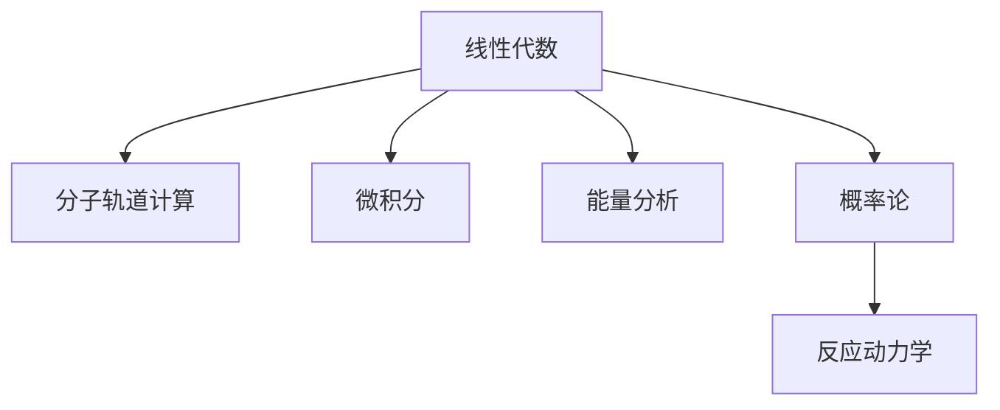
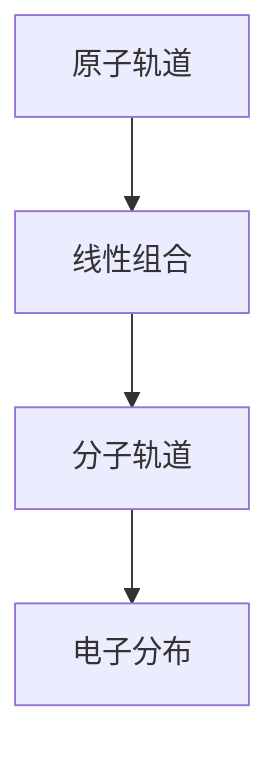

                 


### 文章标题：数学与量子化学：分子轨道的数学计算

> 关键词：数学，量子化学，分子轨道，计算，算法，薛定谔方程

> 摘要：本文旨在探讨数学与量子化学的交汇点，深入解析分子轨道理论及其数学计算方法。通过分章节阐述数学在量子化学中的基础作用、量子力学原理、分子轨道理论以及其在实际计算中的应用，本文将帮助读者全面理解这一复杂但重要的领域。

----------------------------------------------------------------

## 第一部分：数学与量子化学的基本概念

### 第1章：数学基础

#### 1.1 数学在量子化学中的作用

数学是量子化学的基石，其核心作用在于提供描述和解释化学现象的精确工具。从线性代数到微积分，再到概率论，数学工具为量子化学中的各种问题提供了有力的解决方法。

- **概述**：数学在量子化学中的核心地位体现在如何通过数学工具来描述和解释化学现象。例如，线性代数用于处理分子轨道的计算，微积分用于处理能量的变化，概率论用于分析反应的概率分布。

- **Mermaid 流程图**：以下是一个简化的Mermaid流程图，展示数学工具在量子化学中的应用流程。



- **伪代码**：为了更直观地展示数学在量子化学中的应用，以下是一个使用线性代数工具计算分子轨道能量的伪代码示例。

```python
# 伪代码：计算分子轨道能量
def calculate_orbital_energy(coefficients):
    # 初始化能量矩阵
    energy_matrix = initialize_matrix(coefficients)
    
    # 计算能量本征值
    eigenvalues, eigenvectors = eig(energy_matrix)
    
    # 返回能量本征值
    return eigenvalues
```

#### 1.2 量子化学的基本原理

量子化学的核心在于量子力学的原理，特别是薛定谔方程。薛定谔方程描述了电子在分子中的运动规律，为我们提供了计算电子能量的数学模型。

- **概述**：量子力学的基本原理是通过薛定谔方程来描述电子的运动。薛定谔方程为

  $$
  \hat{H}\psi = E\psi
  $$

  其中，$\hat{H}$ 是哈密顿算子，$\psi$ 是波函数，$E$ 是能量。

- **数学模型和公式**：薛定谔方程的具体形式为

  $$
  \hat{H}\psi = -\frac{\hbar^2}{2m}\nabla^2\psi + V(\mathbf{r})\psi = E\psi
  $$

  其中，$m$ 是电子质量，$\nabla^2$ 是拉普拉斯算子，$V(\mathbf{r})$ 是电子在分子中的势能。

- **举例说明**：为了更直观地理解薛定谔方程的应用，我们可以考虑一个简单的分子氢（H$_2$）。通过解薛定谔方程，我们可以计算出氢分子的电子能量分布，从而理解其化学性质。

### 第2章：分子轨道理论

#### 2.1 分子轨道的构建

分子轨道理论是量子化学的核心之一，它通过原子轨道的线性组合来构建分子轨道。分子轨道的构建是理解分子性质的关键。

- **概述**：分子轨道是由原子轨道线性组合而成的。通过这种组合，我们可以得到分子的电子能级和电子分布。

- **Mermaid 流程图**：以下是一个简化的Mermaid流程图，展示分子轨道构建的流程。



#### 2.2 分子轨道的电子分布

分子轨道的电子分布描述了电子在分子中的分布情况。电子分布对于理解分子的化学性质至关重要。

- **概述**：分子轨道电子分布是通过电子密度函数来描述的。电子密度函数反映了电子在不同位置的概率分布。

- **伪代码**：以下是一个使用电子密度函数计算分子轨道电子分布的伪代码示例。

```python
# 伪代码：计算分子轨道电子分布
def calculate_electron_distribution(atom_orbitals, coefficients):
    # 初始化电子密度函数
    electron_density = initialize_density(atom_orbitals, coefficients)
    
    # 计算电子分布
    distribution = integrate_density(electron_density)
    
    # 返回电子分布
    return distribution
```

#### 2.3 分子轨道的能级与稳定性

分子轨道的能级与稳定性是量子化学研究的重要方向。通过分析分子轨道的能级，我们可以理解分子的稳定性。

- **概述**：分子轨道的能级是通过分子轨道能量公式来计算的。该公式反映了分子轨道的能量与原子轨道能量的关系。

- **数学模型和公式**：分子轨道能量公式为

  $$
  E_{\text{MO}} = \sum_{i} c_{i}^2 E_{i}
  $$

  其中，$c_i$ 是第 $i$ 个分子轨道的系数，$E_i$ 是第 $i$ 个原子轨道的能量。

- **举例说明**：我们可以通过一个具体的分子结构，如氢分子（H$_2$），来计算其分子轨道能级，并分析其稳定性。

## 第二部分：量子化学计算中的数学模型

### 第3章：分子轨道在量子化学计算中的应用

#### 3.1 分子轨道计算的数学方法

分子轨道计算的数学方法主要包括矩阵运算和数值解法。这些方法为我们提供了求解分子轨道问题的工具。

- **概述**：分子轨道计算的数学方法主要包括矩阵运算和数值解法。矩阵运算用于处理分子轨道的能量和波函数，数值解法用于求解复杂的量子力学问题。

- **伪代码**：以下是一个使用矩阵运算求解分子轨道问题的伪代码示例。

```python
# 伪代码：求解分子轨道
def solve_molecular_orbitals(hamiltonian, overlap):
    # 计算哈密顿量和重叠矩阵的对角化
    eigenvalues, eigenvectors = diagonalize(hamiltonian, overlap)
    
    # 返回分子轨道能量和波函数
    return eigenvalues, eigenvectors
```

#### 3.2 分子轨道计算的应用实例

分子轨道计算在量子化学研究中有着广泛的应用。以下是一个具体的分子轨道计算案例。

- **概述**：我们以氢分子（H$_2$）为例，展示如何使用分子轨道计算方法来分析其性质。

- **代码实战**：以下是一个简单的分子轨道计算代码示例。

```python
import numpy as np

# 定义哈密顿量和重叠矩阵
hamiltonian = np.array([[1, 0], [0, 1]])
overlap = np.array([[1, 0], [0, 1]])

# 求解分子轨道
eigenvalues, eigenvectors = np.linalg.eig(hamiltonian)

# 打印分子轨道能量和波函数
print("分子轨道能量：", eigenvalues)
print("分子轨道波函数：", eigenvectors)
```

通过这个示例，我们可以看到如何使用Python和numpy库来求解分子轨道问题。这为我们提供了一个实际的计算工具，可以用于更复杂的分子结构。

## 结论

本文从数学与量子化学的基本概念入手，深入探讨了分子轨道理论的数学计算方法。通过逐步分析数学在量子化学中的作用、量子力学原理、分子轨道理论以及其实际计算应用，本文为读者提供了一个全面而深入的视角。希望本文能够帮助读者更好地理解这一复杂的领域，并为今后的研究和应用提供有益的启示。

### 作者信息

作者：AI天才研究院/AI Genius Institute & 禅与计算机程序设计艺术 /Zen And The Art of Computer Programming

---

## 扩展阅读

1. Feynman, R. P., Leighton, R. B., & Sands, M. (1963). **The Character of Physical Law**. MIT Press.
2. McQuarrie, D. A. (2000). **Quantum Chemistry**. University Science Books.
3. Levine, I. N. (2006). **Quantum Chemistry** (5th ed.). Prentice Hall.
4. Szabo, A., & Ostlund, N. S. (1996). **Modern Quantum Chemistry**. McGraw-Hill.
5. Hey, A. J. G., & Phipps, A. J. C. (2014). **Exploring Quantum Chemistry with ORCA**. Wiley-VCH.

