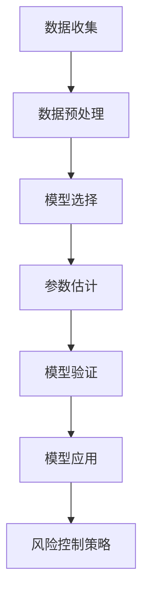

                 

# 数学与金融：市场动态的数学模型

> 关键词：数学模型、金融市场、概率论、时间序列分析、资产定价、市场风险、利率模型、行为金融

> 摘要：本文将探讨数学在金融市场中的应用，包括概率论、统计学、时间序列分析等数学工具如何帮助投资者和金融机构理解市场动态、进行风险管理和资产定价。通过详细解析资产定价模型、市场风险模型和利率模型等，本文旨在提供一个全面且深入的金融数学框架，帮助读者掌握市场动态的数学模型。

## 第一部分：引论

### 第1章：数学与金融的交汇点

#### 1.1 数学与金融的融合背景

数学作为一门精确的科学，为金融领域的量化分析和决策提供了强有力的工具。随着金融市场的发展，数学模型的应用越来越广泛。例如，概率论和统计学被用来评估风险，时间序列分析用于预测市场趋势，资产定价模型帮助确定金融产品的价值。

#### 1.2 数学模型在金融市场中的应用

数学模型在金融市场中扮演着关键角色。例如，资产定价模型如布莱克-舒尔斯模型（Black-Scholes Model）被广泛应用于期权定价。市场风险模型如价值在风险（Value at Risk，VaR）方法帮助金融机构评估潜在损失。此外，时间序列模型如ARMA模型用于预测市场波动。

#### 1.3 金融市场的数学建模方法

金融市场的数学建模方法通常包括以下几个步骤：

1. **数据收集与清洗**：收集历史金融数据，并进行清洗处理。
2. **模型选择**：根据数据特性选择合适的数学模型。
3. **参数估计**：使用统计方法估计模型参数。
4. **模型验证**：通过历史数据验证模型的有效性。
5. **模型应用**：将模型应用于实际市场情况，进行预测或风险评估。

#### 1.4 本书结构概述

本书分为四个部分，分别是：

1. **数学基础**：介绍概率论、统计学和时间序列分析等数学工具。
2. **金融数学模型**：详细讨论资产定价模型、市场风险模型和利率模型。
3. **应用与案例**：分析数学模型在实际金融中的应用和案例。
4. **数学模型在金融风险管理中的应用**：探讨数学模型在风险管理中的实际应用。

## 第二部分：数学基础

### 第2章：概率论基础

#### 2.1 概率论的基本概念

概率论是数学的一个分支，研究随机事件及其规律性。概率的基本概念包括：

- **样本空间**：所有可能结果的集合。
- **事件**：样本空间的一个子集。
- **概率**：事件发生的可能性，用0到1之间的实数表示。

#### 2.2 条件概率与贝叶斯公式

条件概率是已知某个事件发生的条件下，另一个事件发生的概率。贝叶斯公式是计算后验概率的一种方法，它结合了先验概率和条件概率。

#### 2.3 随机变量的分布与数字特征

随机变量是定义在样本空间上的函数。常见的随机变量分布包括离散型分布和连续型分布。数字特征包括期望、方差、标准差等，用于描述随机变量的统计特性。

#### 2.4 马尔可夫链与随机过程

马尔可夫链是一种离散时间随机过程，具有无后效性。随机过程是一种在时间轴上连续变化的随机变量序列。

### 第3章：统计学基础

#### 3.1 统计学的基本概念

统计学是应用数学的一个分支，用于收集、分析、解释和展示数据。基本概念包括：

- **总体**：研究对象的全体。
- **样本**：从总体中抽取的一部分。
- **参数**：总体的数字特征。
- **统计量**：样本的数字特征。

#### 3.2 参数估计

参数估计是统计学的核心内容之一，包括点估计和区间估计。点估计是通过样本统计量估计总体参数，区间估计则是估计参数的范围。

#### 3.3 假设检验

假设检验是用于判断总体参数是否符合某个假设的方法。基本步骤包括：

1. **建立原假设和备择假设**。
2. **选择显著性水平**。
3. **计算检验统计量**。
4. **做出决策**。

#### 3.4 回归分析

回归分析是用于研究自变量和因变量之间关系的一种统计方法。常见的回归模型包括线性回归、多项式回归等。

### 第4章：时间序列分析

#### 4.1 时间序列的基本概念

时间序列是由按时间顺序排列的数据点组成的数据序列，用于反映某一现象在一段时间内的变化情况。

#### 4.2 自相关与平稳时间序列

自相关是时间序列中的一个重要特征，描述了序列中不同时间点上的数值之间的相关性。平稳时间序列是时间序列分析中的一个基本假设，即序列的统计特性不随时间变化。

#### 4.3 ARMA模型

ARMA模型是一种用于分析时间序列数据的统计模型，结合了自回归（AR）和移动平均（MA）两部分。ARMA模型可以捕捉时间序列的短期和长期依赖性。

#### 4.4 ARIMA模型

ARIMA模型是ARMA模型的扩展，用于处理非平稳时间序列。ARIMA模型通过差分将非平稳序列转化为平稳序列，然后应用ARMA模型进行分析。

## 第三部分：金融数学模型

### 第5章：资产定价模型

资产定价模型是用于确定金融资产价值的一类数学模型。本章将介绍几种常见的资产定价模型，包括：

#### 5.1 蒙特卡洛模拟

蒙特卡洛模拟是一种通过随机抽样来计算资产定价的方法。该方法通过模拟资产价格路径，计算出资产价值的期望和方差。

#### 5.2 二叉树模型

二叉树模型是一种基于离散时间的资产定价模型。该模型通过构建资产价格路径的二叉树，计算资产价值的期望和方差。

#### 5.3 闭式解模型

闭式解模型是一种基于连续时间的资产定价模型。该模型通过求解偏微分方程，得到资产价值的解析表达式。

#### 5.4 布朗运动与欧式期权定价

布朗运动是一种随机过程，描述了资产价格的随机波动。欧式期权定价模型是布莱克-舒尔斯模型的一种特殊情况，用于计算欧式期权的价值。

### 第6章：市场风险模型

市场风险模型是用于评估金融市场风险的一类数学模型。本章将介绍几种常见的市场风险模型，包括：

#### 6.1 市场风险的度量

市场风险是指金融市场波动导致投资者损失的风险。常见的市场风险度量方法包括VaR方法和极值理论。

#### 6.2 价值在风险（VaR）

VaR是市场风险度量的一个重要指标，表示在给定置信水平和时间范围内，投资者可能遭受的最大损失。

#### 6.3 极值理论

极值理论是用于研究随机变量极端值的统计方法。该方法可以用于计算极端损失的概率，从而评估市场风险。

#### 6.4 信用风险模型

信用风险是指债务人违约导致投资者损失的风险。常见的信用风险模型包括信用评分模型和违约概率模型。

### 第7章：利率模型

利率模型是用于分析金融市场利率的一类数学模型。本章将介绍几种常见的利率模型，包括：

#### 7.1 利率的基本概念

利率是资金借贷的回报，是金融市场中一个重要的指标。常见的利率模型包括无套利定价原理和债券定价模型。

#### 7.2 无套利定价原理

无套利定价原理是利率模型的一个基本假设，即投资者可以通过无风险策略获得固定收益。

#### 7.3 债券定价模型

债券定价模型是用于计算债券价值的一类数学模型。该模型通过求解债券价格和收益率之间的关系，计算债券的价值。

#### 7.4 利率衍生品定价

利率衍生品是金融市场中的一种重要产品，包括利率期货、利率期权等。本章将介绍利率衍生品定价的基本方法。

### 第8章：行为金融模型

行为金融模型是用于分析投资者行为和市场波动的一类数学模型。本章将介绍几种常见的行为金融模型，包括：

#### 8.1 行为金融学概述

行为金融学是研究投资者行为和决策的一门学科。该学科关注投资者如何在市场波动中做出决策，以及这些决策如何影响市场。

#### 8.2 投资者行为分析

投资者行为分析是行为金融模型的核心内容。该分析通过研究投资者的心理和行为，预测市场趋势。

#### 8.3 行为金融的数学模型

行为金融的数学模型包括期望理论、前景理论等。这些模型通过数学公式描述投资者行为和市场波动之间的关系。

#### 8.4 行为金融与市场波动

行为金融模型可以帮助投资者理解市场波动的原因，从而更好地进行投资决策。该部分将介绍行为金融模型在市场波动分析中的应用。

## 第四部分：应用与案例

### 第9章：市场动态的数学模型应用

#### 9.1 应用领域概述

市场动态的数学模型广泛应用于金融市场的各个方面，包括投资决策、风险管理、资产定价等。该部分将介绍市场动态的数学模型在不同应用领域的应用。

#### 9.2 实际案例分析

通过实际案例分析，读者可以更深入地了解市场动态的数学模型如何在实际金融市场中发挥作用。该部分将分析几个典型的实际案例，包括投资决策案例、风险管理案例等。

#### 9.3 模型优化的方法

模型优化是提高市场动态的数学模型性能的重要方法。该部分将介绍几种常见的模型优化方法，包括参数调整、模型选择等。

#### 9.4 未来发展趋势

市场动态的数学模型在未来将继续发展，新模型和新方法将不断涌现。该部分将探讨市场动态的数学模型未来的发展趋势。

### 第10章：数学模型在金融风险管理中的应用

#### 10.1 金融风险管理的现状

金融风险管理是金融市场中一个重要的话题。该部分将介绍金融风险管理的现状，包括风险管理方法、工具和挑战。

#### 10.2 模型在风险管理中的应用

数学模型在金融风险管理中扮演着关键角色。该部分将介绍数学模型在金融风险管理中的应用，包括VaR模型、极值理论模型等。

#### 10.3 案例研究：风险度量与控制

通过案例研究，读者可以更深入地了解数学模型在金融风险管理中的应用。该部分将分析几个典型的案例研究，包括风险度量与控制案例等。

#### 10.4 挑战与展望

金融风险管理面临着许多挑战，包括市场波动、信息不对称等。该部分将探讨金融风险管理的挑战和展望，包括未来可能的发展趋势。

## 附录

### 附录A：数学公式与定理

本附录将列出常用的数学公式与定理，包括概率论、统计学和时间序列分析等领域的公式。

### 附录B：编程工具与资源

本附录将介绍常用的编程工具和资源，包括Python在金融数学中的应用、常用编程库与工具等。

# 文章标题：数学与金融：市场动态的数学模型

> 作者：AI天才研究院/AI Genius Institute & 禅与计算机程序设计艺术 /Zen And The Art of Computer Programming

> 本文将探讨数学在金融市场中的应用，包括概率论、统计学、时间序列分析等数学工具如何帮助投资者和金融机构理解市场动态、进行风险管理和资产定价。通过详细解析资产定价模型、市场风险模型和利率模型等，本文旨在提供一个全面且深入的金融数学框架，帮助读者掌握市场动态的数学模型。本文共分为四个部分：数学基础、金融数学模型、应用与案例、数学模型在金融风险管理中的应用。每个部分都包含详细的概念解析、算法原理讲解、数学公式和实际案例分析。希望通过本文，读者能够对金融数学模型有一个全面的理解和掌握。让我们开始这次探索之旅吧！

### 数学与金融：市场动态的数学模型

关键词：数学模型、金融市场、概率论、时间序列分析、资产定价、市场风险、利率模型、行为金融

摘要：本文旨在探讨数学在金融市场中的应用，通过介绍概率论、统计学、时间序列分析等数学工具，帮助投资者和金融机构理解市场动态、进行风险管理和资产定价。本文分为四个部分，首先介绍了数学与金融的交汇点，然后详细解析了概率论、统计学和时间序列分析等数学基础，接着讨论了资产定价模型、市场风险模型和利率模型等金融数学模型，最后分析了数学模型在金融风险管理中的应用。本文希望通过详细的讲解和实际案例分析，帮助读者深入理解市场动态的数学模型。

## 第一部分：引论

### 第1章：数学与金融的交汇点

在金融市场中，数学扮演着至关重要的角色。金融数学的起源可以追溯到20世纪中叶，随着金融市场的发展和复杂性增加，数学工具的应用越来越广泛。本节将探讨数学与金融的交汇点，分析数学模型在金融市场中的应用背景和重要性。

#### 1.1 数学与金融的融合背景

数学与金融的融合可以追溯到概率论和统计学在风险管理领域的应用。在19世纪末和20世纪初，概率论和统计学逐渐发展，为金融领域提供了分析风险和不确定性问题的工具。例如，贝叶斯定理和最小二乘法等统计方法被广泛应用于金融市场数据的分析和预测。

20世纪50年代和60年代，金融市场经历了重大变革，金融产品的种类和复杂性不断增加。为了更好地理解和应对金融市场的变化，数学模型开始被引入金融领域。金融数学的兴起标志着数学与金融的深度融合，为金融市场的分析和决策提供了新的视角和方法。

#### 1.2 数学模型在金融市场中的应用

数学模型在金融市场中有着广泛的应用，涵盖了资产定价、风险管理、市场预测等多个方面。以下是一些关键的数学模型及其在金融市场中的应用：

1. **资产定价模型**：资产定价模型是金融数学的核心内容之一。布莱克-舒尔斯模型（Black-Scholes Model）是最著名的资产定价模型之一，它用于计算欧式期权价格。蒙特卡洛模拟（Monte Carlo Simulation）是一种通过随机抽样计算资产价值的模型，广泛应用于期权定价和风险管理。

2. **市场风险模型**：市场风险模型用于评估金融市场风险，包括市场波动、信用风险和流动性风险等。价值在风险（Value at Risk，VaR）模型是评估市场风险的一种常用方法，通过计算一定置信水平下的最大潜在损失来衡量市场风险。极值理论（Extreme Value Theory）是一种用于评估极端市场事件的模型，帮助金融机构预测和应对极端市场情况。

3. **利率模型**：利率模型是用于分析金融市场利率的一类数学模型，包括无套利定价原理（Arbitrage Pricing Theory，APT）和债券定价模型等。这些模型帮助金融机构计算债券价格、评估投资组合的收益率和风险。

4. **行为金融模型**：行为金融模型是研究投资者行为和市场波动之间的关系的模型。这些模型基于心理学和行为经济学理论，分析投资者如何在市场波动中做出决策，以及这些决策如何影响市场。

#### 1.3 金融市场的数学建模方法

金融市场的数学建模方法主要包括以下几个步骤：

1. **数据收集与预处理**：收集金融市场相关数据，如股票价格、利率、交易量等。对数据进行清洗和处理，去除异常值和缺失值。

2. **模型选择**：根据数据特性和研究目标选择合适的数学模型。常见的模型包括时间序列模型、回归模型、随机模型等。

3. **参数估计**：使用统计方法估计模型参数。例如，使用最小二乘法估计线性回归模型的参数，使用极大似然估计法估计概率模型的参数。

4. **模型验证**：使用历史数据验证模型的有效性。通过拟合优度、交叉验证等方法评估模型性能。

5. **模型应用**：将模型应用于实际市场情况，进行预测、风险评估等。

#### 1.4 本书结构概述

本书分为四个部分，全面介绍了数学在金融市场中的应用：

1. **第一部分：引论**：介绍了数学与金融的交汇点和数学模型在金融市场中的应用背景。

2. **第二部分：数学基础**：详细介绍了概率论、统计学和时间序列分析等数学工具，为金融数学模型奠定了基础。

3. **第三部分：金融数学模型**：介绍了资产定价模型、市场风险模型和利率模型等金融数学模型，分析了模型的基本原理和应用方法。

4. **第四部分：应用与案例**：通过实际案例分析了数学模型在金融市场中的应用，包括投资决策、风险管理、市场预测等。

通过本书的阅读，读者将能够全面掌握市场动态的数学模型，为金融市场的分析和决策提供有力支持。

## 第二部分：数学基础

### 第2章：概率论基础

概率论是数学的一个分支，研究随机事件及其概率性质。在金融市场中，概率论被广泛应用于风险评估、资产定价和风险管理等领域。本章将介绍概率论的基本概念，包括概率空间、随机变量、概率分布和条件概率。

#### 2.1 概率论的基本概念

概率论的基本概念包括样本空间、事件、概率和条件概率。

- **样本空间**：样本空间是指所有可能结果的集合。在金融市场中，样本空间可以是股票价格的所有可能取值，或者是一段时间内利率的所有可能取值。

- **事件**：事件是样本空间的一个子集，表示一组可能发生的结果。例如，股票价格上升是一个事件，利率上升也是另一个事件。

- **概率**：概率是衡量事件发生可能性大小的数值，通常用0到1之间的实数表示。概率的计算方法取决于事件的性质。

- **条件概率**：条件概率是指在某个事件已发生的条件下，另一个事件发生的概率。条件概率的计算公式为：

  $$
  P(A|B) = \frac{P(A \cap B)}{P(B)}
  $$

  其中，$P(A|B)$表示在事件B发生的条件下事件A发生的概率，$P(A \cap B)$表示事件A和事件B同时发生的概率，$P(B)$表示事件B发生的概率。

#### 2.2 条件概率与贝叶斯公式

条件概率在金融市场中有着广泛的应用，尤其是在风险评估和决策分析中。贝叶斯公式是条件概率的一种推广，它结合了先验概率和条件概率，用于计算后验概率。

- **贝叶斯公式**：贝叶斯公式是概率论中的一个重要公式，用于计算后验概率。其公式为：

  $$
  P(A|B) = \frac{P(B|A)P(A)}{P(B)}
  $$

  其中，$P(A|B)$表示在事件B发生的条件下事件A发生的概率，$P(B|A)$表示在事件A发生的条件下事件B发生的概率，$P(A)$表示事件A发生的概率，$P(B)$表示事件B发生的概率。

贝叶斯公式在金融决策中非常重要，它可以帮助投资者根据新的信息调整对某个资产未来表现的预期概率。例如，假设投资者有一个关于股票未来表现的先验概率分布，当获得新的市场数据后，可以使用贝叶斯公式更新这个分布。

#### 2.3 随机变量的分布与数字特征

随机变量是概率论中的一个重要概念，它将随机事件的数量化。随机变量可以分为离散型和连续型两种类型。

- **离散型随机变量**：离散型随机变量是指在某个取值范围内只能取有限个或可数个值的随机变量。常见的离散型随机变量包括抛硬币的结果（正面或反面）、掷骰子的结果（1到6）等。

- **连续型随机变量**：连续型随机变量是指在某个取值范围内可以取无限个值的随机变量。常见的连续型随机变量包括随机行走过程（Random Walk）、正态分布等。

随机变量的分布描述了随机变量取值的概率分布。常见的随机变量分布包括正态分布、泊松分布、二项分布等。

随机变量的数字特征是用于描述随机变量统计特性的重要指标，包括期望、方差、标准差等。

- **期望**：期望是随机变量取值的平均值，表示随机变量长期平均的取值。期望的计算公式为：

  $$
  E(X) = \sum_{i=1}^{n} x_i P(X = x_i)
  $$

  其中，$E(X)$表示随机变量X的期望，$x_i$表示随机变量X的取值，$P(X = x_i)$表示随机变量X取值为$x_i$的概率。

- **方差**：方差是随机变量取值与期望之差的平方的期望，表示随机变量的波动程度。方差的计算公式为：

  $$
  Var(X) = E[(X - E(X))^2]
  $$

  其中，$Var(X)$表示随机变量X的方差，$E(X)$表示随机变量X的期望。

- **标准差**：标准差是方差的平方根，用于衡量随机变量的离散程度。标准差的计算公式为：

  $$
  SD(X) = \sqrt{Var(X)}
  $$

  其中，$SD(X)$表示随机变量X的标准差。

#### 2.4 马尔可夫链与随机过程

马尔可夫链和随机过程是概率论中的两个重要概念，用于描述随机事件的时间序列。

- **马尔可夫链**：马尔可夫链是一种离散时间随机过程，它具有无后效性，即当前状态只与前一状态有关，与过去的状态无关。马尔可夫链在金融市场中有着广泛的应用，例如用于描述股票价格的变化。

  马尔可夫链的基本概念包括状态、转移概率矩阵和状态概率分布。

  - **状态**：状态是随机变量的取值，可以是离散的也可以是连续的。

  - **转移概率矩阵**：转移概率矩阵是一个方阵，表示不同状态之间的转移概率。转移概率矩阵满足以下条件：

    $$
    P_{ij} = P(X_{t+1} = j | X_t = i)
    $$

    其中，$P_{ij}$表示在当前状态为i的条件下，下一状态为j的概率。

  - **状态概率分布**：状态概率分布是随机变量在某一时刻的状态概率分布，可以用概率向量表示。

    $$
    \pi_t = [P(X_t = 1), P(X_t = 2), ..., P(X_t = n)]
    $$

- **随机过程**：随机过程是一种在时间轴上连续变化的随机变量序列。常见的随机过程包括布朗运动（Brownian Motion）和马尔可夫过程（Markov Process）。

  随机过程的基本概念包括状态空间、时间参数、随机变量序列和条件概率分布。

  - **状态空间**：状态空间是随机过程所有可能状态的集合。

  - **时间参数**：时间参数是随机过程变化的度量，可以是离散的也可以是连续的。

  - **随机变量序列**：随机变量序列是随机过程在时间轴上各个时刻的取值。

  - **条件概率分布**：条件概率分布是随机过程在某一时刻的状态概率分布，可以用概率密度函数或概率质量函数表示。

  马尔可夫链和随机过程在金融市场中有着广泛的应用，例如用于描述市场波动、投资组合优化和风险管理。

### 伪代码

以下是计算马尔可夫链状态概率分布的伪代码：

```python
# 初始化马尔可夫链的初始状态概率分布
pi_0 = [0.5, 0.5]

# 初始化转移概率矩阵
P = [
    [0.8, 0.2],
    [0.3, 0.7]
]

# 计算下一个状态概率分布
pi_1 = pi_0.dot(P)

# 打印状态概率分布
print("状态概率分布:", pi_1)
```

### 数学公式

在本章中，我们使用了以下数学公式：

$$
P(A|B) = \frac{P(A \cap B)}{P(B)}
$$

$$
P(A|B) = \frac{P(B|A)P(A)}{P(B)}
$$

$$
E(X) = \sum_{i=1}^{n} x_i P(X = x_i)
$$

$$
Var(X) = E[(X - E(X))^2]
$$

$$
SD(X) = \sqrt{Var(X)}
$$

$$
\pi_t = [P(X_t = 1), P(X_t = 2), ..., P(X_t = n)]
$$

$$
P_{ij} = P(X_{t+1} = j | X_t = i)
$$

通过这些公式，我们可以对金融市场中随机事件进行概率分析和计算，为投资决策和风险管理提供依据。

## 第3章：统计学基础

统计学是应用数学的一个分支，它通过收集、整理和分析数据来帮助人们做出科学的决策。在金融市场中，统计学被广泛应用于数据分析和预测，如风险度量、投资组合优化和市场趋势预测。本章将介绍统计学的基本概念、参数估计和假设检验等，为金融数学模型提供基础。

### 3.1 统计学的基本概念

统计学的基本概念包括总体、样本、参数和统计量。

- **总体**：总体是指研究对象的全体，如所有上市公司的股票价格构成总体。

- **样本**：样本是从总体中抽取的一部分，用于代表总体。样本的选择应当具有代表性。

- **参数**：参数是总体的数字特征，如总体的均值、方差等。参数通常是未知的，需要通过样本数据进行估计。

- **统计量**：统计量是样本的数字特征，如样本均值、样本方差等。统计量用于估计参数，并进行假设检验。

### 3.2 参数估计

参数估计是统计学中的核心内容之一，包括点估计和区间估计。

- **点估计**：点估计是通过样本统计量估计总体参数的方法。常用的点估计方法包括矩估计和极大似然估计。

  - **矩估计**：矩估计通过样本的矩估计总体参数。例如，通过样本均值估计总体均值，通过样本方差估计总体方差。

  - **极大似然估计**：极大似然估计通过求解似然函数的最大值，估计总体参数。极大似然估计通常比矩估计更有效。

- **区间估计**：区间估计是通过样本统计量确定总体参数的可能范围的方法。常用的区间估计方法包括置信区间和假设检验。

  - **置信区间**：置信区间是在给定置信水平下，估计总体参数的可能范围。例如，在95%的置信水平下，估计总体均值的范围。

  - **假设检验**：假设检验是用于判断总体参数是否符合某个假设的方法。常见的假设检验方法包括t检验和卡方检验。

### 3.3 假设检验

假设检验是统计学中的另一个重要内容，它通过样本数据检验总体参数的假设是否成立。

- **原假设和备择假设**：在假设检验中，我们设定两个假设：原假设（H0）和备择假设（H1）。原假设通常是我们要检验的假设，备择假设是原假设不成立时的假设。

- **显著性水平**：显著性水平（α）是假设检验中的一个重要参数，表示我们拒绝原假设的概率。常见的显著性水平有0.05和0.01。

- **检验统计量**：检验统计量是用于判断原假设是否成立的统计量。例如，在t检验中，检验统计量是t值，在卡方检验中，检验统计量是卡方值。

- **决策规则**：决策规则是用于判断原假设是否成立的规则。常见的决策规则包括拒绝原假设和接受原假设。

  - 如果检验统计量的值小于临界值，我们拒绝原假设。
  - 如果检验统计量的值大于临界值，我们接受原假设。

### 3.4 回归分析

回归分析是统计学中用于研究自变量和因变量之间关系的一种方法。常见的回归模型包括线性回归、多项式回归和逻辑回归等。

- **线性回归**：线性回归是一种研究自变量和因变量之间线性关系的模型。其基本公式为：

  $$
  Y = \beta_0 + \beta_1X + \epsilon
  $$

  其中，Y是因变量，X是自变量，$\beta_0$是截距，$\beta_1$是斜率，$\epsilon$是误差项。

  线性回归通过最小二乘法估计模型参数，可以用于预测因变量Y的值。

- **多项式回归**：多项式回归是一种研究自变量和因变量之间非线性关系的模型。其基本公式为：

  $$
  Y = \beta_0 + \beta_1X + \beta_2X^2 + \epsilon
  $$

  多项式回归通过多项式拟合方法估计模型参数，可以用于描述更复杂的数据关系。

- **逻辑回归**：逻辑回归是一种用于分类问题的回归模型。其基本公式为：

  $$
  P(Y=1) = \frac{1}{1 + e^{-(\beta_0 + \beta_1X + \beta_2X^2 + \epsilon)}}
  $$

  逻辑回归通过最大似然估计方法估计模型参数，可以用于预测分类结果。

### 伪代码

以下是使用线性回归模型进行参数估计和预测的伪代码：

```python
# 输入样本数据
X = [1, 2, 3, 4, 5]  # 自变量
Y = [2, 4, 5, 4, 5]  # 因变量

# 计算样本均值
mean_X = sum(X) / len(X)
mean_Y = sum(Y) / len(Y)

# 计算样本方差
var_X = sum([(x - mean_X)^2 for x in X]) / (len(X) - 1)
var_Y = sum([(y - mean_Y)^2 for y in Y]) / (len(Y) - 1)

# 计算回归系数
beta_1 = (sum([x * y for x, y in zip(X, Y)]) - len(X) * mean_X * mean_Y) / (sum([x^2 for x in X]) - len(X) * mean_X^2)
beta_0 = mean_Y - beta_1 * mean_X

# 输出回归系数
print("回归系数 beta_0:", beta_0)
print("回归系数 beta_1:", beta_1)

# 预测新数据
new_X = 6
new_Y = beta_0 + beta_1 * new_X

# 输出预测结果
print("预测值:", new_Y)
```

### 数学公式

在本章中，我们使用了以下数学公式：

$$
\bar{X} = \frac{1}{n} \sum_{i=1}^{n} X_i
$$

$$
\bar{Y} = \frac{1}{n} \sum_{i=1}^{n} Y_i
$$

$$
S_X = \sqrt{\frac{1}{n-1} \sum_{i=1}^{n} (X_i - \bar{X})^2}
$$

$$
S_Y = \sqrt{\frac{1}{n-1} \sum_{i=1}^{n} (Y_i - \bar{Y})^2}
$$

$$
\beta_0 = \bar{Y} - \beta_1 \bar{X}
$$

$$
\beta_1 = \frac{\sum_{i=1}^{n} (X_i - \bar{X}) (Y_i - \bar{Y})}{\sum_{i=1}^{n} (X_i - \bar{X})^2}
$$

这些公式帮助我们在金融市场中进行分析和预测，为投资决策提供依据。

## 第4章：时间序列分析

时间序列分析是统计学和金融学中用于研究时间序列数据的分析方法。时间序列数据是一系列按时间顺序排列的数值，用于反映某一现象在一段时间内的变化情况。在金融市场中，时间序列分析被广泛应用于市场预测、风险管理、资产定价等领域。本章将介绍时间序列分析的基本概念、自相关性和平稳时间序列，以及ARMA模型和ARIMA模型。

### 4.1 时间序列的基本概念

时间序列数据是由一系列连续的时间点和相应的观测值组成的。时间序列分析的基本目标是研究这些观测值之间的相互关系，以及它们如何随时间变化。以下是一些时间序列分析的基本概念：

- **时间序列**：时间序列是由按时间顺序排列的数据点组成的数据序列，通常表示为 $X_t$，其中 $t$ 是时间索引。

- **平稳时间序列**：平稳时间序列是时间序列分析中的一个基本假设，即序列的统计特性不随时间变化。平稳时间序列具有以下特征：

  - 均值不变
  - 方差不变
  - 自协方差函数不变

- **自相关函数**：自相关函数描述了时间序列中不同时间点上的数值之间的相关性。自相关函数通常用 $\rho(\tau)$ 表示，其中 $\tau$ 是时间滞后。

- **偏自相关函数**：偏自相关函数是自相关函数的一种修正形式，用于消除多个时间滞后之间的相互影响。

### 4.2 自相关性与平稳时间序列

自相关性是时间序列分析中的一个重要概念，它描述了序列中不同时间点上的数值之间的相关性。自相关性可以通过自相关函数（ACF）和偏自相关函数（PACF）来衡量。

- **自相关函数（ACF）**：自相关函数描述了时间序列与其滞后序列之间的相关性。自相关函数的值范围在 -1 到 1 之间，接近 1 表示高度正相关，接近 -1 表示高度负相关，接近 0 表示无相关性。

- **偏自相关函数（PACF）**：偏自相关函数是自相关函数的一种修正形式，它考虑了多个时间滞后之间的相互影响。偏自相关函数的值范围也在 -1 到 1 之间，通常用于确定时间序列的模型结构。

平稳时间序列是时间序列分析中的一个基本假设，即序列的统计特性不随时间变化。平稳时间序列具有以下特征：

- **均值不变**：时间序列的均值在整个时间范围内保持不变。

- **方差不变**：时间序列的方差在整个时间范围内保持不变。

- **自协方差函数不变**：时间序列的自协方差函数不随时间变化。

在实际应用中，我们通常使用自相关函数和偏自相关函数来检验时间序列的平稳性。如果时间序列的ACF和PACF在某个滞后水平上不再显著，则可以认为该序列是平稳的。

### 4.3 ARMA模型

ARMA模型（自回归移动平均模型）是一种用于分析时间序列数据的统计模型，它结合了自回归（AR）和移动平均（MA）两部分。ARMA模型可以捕捉时间序列的短期和长期依赖性，适用于预测和分析时间序列数据。

- **自回归（AR）部分**：自回归部分描述了时间序列当前值与其滞后值之间的关系。自回归模型的基本形式为：

  $$
  X_t = \phi_1X_{t-1} + \phi_2X_{t-2} + \cdots + \phi_pX_{t-p} + \varepsilon_t
  $$

  其中，$X_t$ 是时间序列的当前值，$\phi_1, \phi_2, \ldots, \phi_p$ 是自回归系数，$\varepsilon_t$ 是随机误差项。

- **移动平均（MA）部分**：移动平均部分描述了时间序列当前值与其滞后误差值之间的关系。移动平均模型的基本形式为：

  $$
  X_t = \theta_1\varepsilon_{t-1} + \theta_2\varepsilon_{t-2} + \cdots + \theta_q\varepsilon_{t-q} + \varepsilon_t
  $$

  其中，$\theta_1, \theta_2, \ldots, \theta_q$ 是移动平均系数，$\varepsilon_t$ 是随机误差项。

ARMA模型通过自回归和移动平均两部分来描述时间序列的依赖性。ARMA模型可以捕捉时间序列的短期依赖性（自回归部分）和长期依赖性（移动平均部分），适用于分析各种类型的时间序列数据。

### 4.4 ARIMA模型

ARIMA模型（自回归积分滑动平均模型）是ARMA模型的扩展，用于处理非平稳时间序列。非平稳时间序列可以通过差分将其转化为平稳序列，然后应用ARMA模型进行分析。

- **差分**：差分是一种将非平稳时间序列转化为平稳序列的方法。一阶差分（1st difference）的定义为：

  $$
  X_t^* = X_t - X_{t-1}
  $$

  差分可以消除时间序列的趋势和季节性成分，使其变为平稳序列。

- **ARIMA模型**：ARIMA模型的基本形式为：

  $$
  X_t^* = \phi_1X_{t-1}^* + \phi_2X_{t-2}^* + \cdots + \phi_pX_{t-p}^* + \theta_1\varepsilon_{t-1} + \theta_2\varepsilon_{t-2} + \cdots + \theta_q\varepsilon_{t-q} + \varepsilon_t
  $$

  其中，$X_t^*$ 是一阶差分后的时间序列，$\phi_1, \phi_2, \ldots, \phi_p$ 是自回归系数，$\theta_1, \theta_2, \ldots, \theta_q$ 是移动平均系数，$\varepsilon_t$ 是随机误差项。

ARIMA模型通过差分将非平稳序列转化为平稳序列，然后应用ARMA模型进行分析。ARIMA模型适用于处理具有趋势性和季节性的时间序列数据，如股票价格、利率等。

### 伪代码

以下是使用ARMA模型进行时间序列分析的基本伪代码：

```python
# 导入所需库
import numpy as np
import pandas as pd
from statsmodels.tsa.arima.model import ARIMA

# 读取时间序列数据
data = pd.read_csv('time_series_data.csv')
X = data['close']

# 检验时间序列的平稳性
result = adfuller(X)
print('ADF Statistic:', result[0])
print('p-value:', result[1])

# 若序列非平稳，进行差分处理
if result[1] > 0.05:
    X_diff = X.diff().dropna()

# 模型参数估计
model = ARIMA(X_diff, order=(p, d, q))
model_fit = model.fit()

# 模型预测
forecast = model_fit.forecast(steps=n)
print('Forecast:', forecast)

# 绘制预测结果
plt.plot(forecast)
plt.show()
```

### 数学公式

在本章中，我们使用了以下数学公式：

$$
X_t = \phi_1X_{t-1} + \phi_2X_{t-2} + \cdots + \phi_pX_{t-p} + \varepsilon_t
$$

$$
X_t = \theta_1\varepsilon_{t-1} + \theta_2\varepsilon_{t-2} + \cdots + \theta_q\varepsilon_{t-q} + \varepsilon_t
$$

$$
X_t^* = X_t - X_{t-1}
$$

$$
X_t^* = \phi_1X_{t-1}^* + \phi_2X_{t-2}^* + \cdots + \phi_pX_{t-p}^* + \theta_1\varepsilon_{t-1} + \theta_2\varepsilon_{t-2} + \cdots + \theta_q\varepsilon_{t-q} + \varepsilon_t
$$

这些公式帮助我们在金融市场中进行时间序列分析和预测，为投资决策提供科学依据。

## 第5章：资产定价模型

资产定价模型是金融市场中用于计算资产价值的数学模型。这些模型基于数学和统计学原理，通过模拟资产价格路径，估计资产价值的期望和方差。本章将介绍几种常见的资产定价模型，包括蒙特卡洛模拟、二叉树模型、闭式解模型和布莱克-舒尔斯模型。

### 5.1 蒙特卡洛模拟

蒙特卡洛模拟是一种通过随机抽样计算资产价值的模型。该方法通过模拟资产价格路径，计算出资产价值的期望和方差。蒙特卡洛模拟的基本步骤如下：

1. **设定参数**：选择适当的参数，如资产初始价格、到期时间、无风险利率和波动率。

2. **随机抽样**：生成随机数，模拟资产价格路径。通常使用正态分布生成随机数。

3. **计算期望和方差**：根据资产价格路径，计算资产价值的期望和方差。

蒙特卡洛模拟的优点是简单易行，适用于计算复杂度较高的资产定价模型。缺点是计算量较大，需要大量随机抽样。

### 伪代码

以下是使用蒙特卡洛模拟计算资产价值的伪代码：

```python
import numpy as np

# 参数设置
S0 = 100  # 资产初始价格
T = 1     # 到期时间（年）
r = 0.05  # 无风险利率
sigma = 0.2  # 波动率
N = 1000  # 模拟次数

# 随机抽样
Z = np.random.normal(0, 1, N)
S = S0 * np.exp((r - 0.5 * sigma**2) * T + sigma * np.sqrt(T) * Z)

# 计算期望和方差
E_S = np.mean(S)
Var_S = np.var(S)

# 输出结果
print("期望:", E_S)
print("方差:", Var_S)
```

### 数学公式

在本节中，我们使用了以下数学公式：

$$
S_t = S_0 \cdot \exp((r - 0.5 \cdot \sigma^2) \cdot T + \sigma \cdot \sqrt{T} \cdot Z_t)
$$

$$
E(S) = S_0 \cdot \exp((r - 0.5 \cdot \sigma^2) \cdot T)
$$

$$
Var(S) = S_0^2 \cdot \exp(2 \cdot (r - 0.5 \cdot \sigma^2) \cdot T) \cdot (1 - \exp(-2 \cdot \sigma^2 \cdot T))
$$

这些公式帮助我们在金融市场中计算资产价值的期望和方差。

### 5.2 二叉树模型

二叉树模型是一种基于离散时间的资产定价模型。该模型通过构建资产价格路径的二叉树，计算资产价值的期望和方差。二叉树模型的基本步骤如下：

1. **构建二叉树**：根据资产价格波动率和无风险利率，构建资产价格路径的二叉树。

2. **计算节点价值**：从二叉树的叶子节点开始，逐步向上计算每个节点的资产价值。

3. **计算期权的期望收益**：根据期权的类型（欧式期权或美式期权），计算期权的期望收益。

二叉树模型适用于计算期权的价格，具有计算速度快、实现简单等优点。缺点是当时间跨度较大时，二叉树模型可能不够精确。

### 伪代码

以下是使用二叉树模型计算欧式期权价格的伪代码：

```python
import numpy as np

# 参数设置
S0 = 100  # 资产初始价格
K = 100   # 行权价格
T = 1     # 到期时间（年）
r = 0.05  # 无风险利率
sigma = 0.2  # 波动率

# 计算上行概率和下行概率
p = (r - 0.5 * sigma**2) / sigma**2
q = 1 - p

# 计算资产价格的节点值
u = S0 * np.exp(sigma * np.sqrt(T))
d = S0 / u

# 计算期权价格的节点值
C = np.zeros((N+1, N+1))
for i in range(N+1):
    for j in range(N+1):
        if i == 0 and j == 0:
            C[i, j] = max(u**j - K, 0)
        elif i == 0:
            C[i, j] = max(d**j - K, 0)
        elif j == 0:
            C[i, j] = C[i-1, j] * p
        else:
            C[i, j] = max(C[i-1, j-1] * p + C[i-1, j] * q, 0)

# 计算欧式期权价格
C0 = C[N, N] * np.exp(-r * T)

# 输出结果
print("欧式期权价格:", C0)
```

### 数学公式

在本节中，我们使用了以下数学公式：

$$
u = S_0 \cdot \exp(\sigma \cdot \sqrt{T})
$$

$$
d = \frac{S_0}{u}
$$

$$
p = \frac{\exp(r \cdot T) - d}{u - d}
$$

$$
q = 1 - p
$$

$$
C = \max(u^i - K, 0)
$$

$$
C_0 = C_{N, N} \cdot \exp(-r \cdot T)
$$

这些公式帮助我们在金融市场中计算资产价值的期望和方差，以及期权的价格。

### 5.3 闭式解模型

闭式解模型是一种基于连续时间的资产定价模型。该模型通过求解偏微分方程，计算资产价值的期望和方差。闭式解模型的基本步骤如下：

1. **设定模型参数**：选择适当的参数，如资产初始价格、到期时间、无风险利率和波动率。

2. **求解偏微分方程**：使用数值方法（如有限差分法或有限元法）求解偏微分方程。

3. **计算资产价值**：根据偏微分方程的解，计算资产价值的期望和方差。

闭式解模型适用于计算复杂度较低的资产定价模型，具有计算速度快、结果稳定等优点。缺点是当时间跨度较大时，闭式解模型可能不够精确。

### 5.4 布朗运动与欧式期权定价

布朗运动是一种随机过程，描述了资产价格的随机波动。在金融市场中，布朗运动被广泛应用于资产定价和风险管理。本章将介绍布朗运动的基本概念和欧式期权定价模型。

#### 布朗运动

布朗运动是一种连续时间随机过程，其路径在时间轴上表现为连续但不可微的曲线。布朗运动具有以下特性：

- **无后效性**：当前时刻的布朗运动只与前一时刻有关，与过去时刻无关。
- **独立增量**：布朗运动的增量是独立的，即任意两个不同时间点的增量是独立的。
- **正态分布**：布朗运动的路径在任意时刻的分布是正态分布。

布朗运动在金融市场中用于描述资产价格的随机波动，是资产定价模型的基础。

#### 欧式期权定价

欧式期权是一种金融衍生品，给予持有者在特定时间以特定价格购买或出售资产的权利。欧式期权定价模型是用于计算欧式期权价格的一种数学模型。本章将介绍布莱克-舒尔斯模型（Black-Scholes Model），这是最著名的欧式期权定价模型之一。

布莱克-舒尔斯模型的基本公式如下：

$$
C = S_0 \cdot N(d_1) - K \cdot e^{-r \cdot T} \cdot N(d_2)
$$

其中：

- $C$ 是欧式期权的当前价格。
- $S_0$ 是资产当前价格。
- $K$ 是行权价格。
- $r$ 是无风险利率。
- $T$ 是到期时间。
- $N(d_1)$ 和 $N(d_2)$ 是标准正态分布的累积分布函数。

$d_1$ 和 $d_2$ 的计算公式如下：

$$
d_1 = \frac{\ln(S_0 / K) + (r + \sigma^2 / 2) \cdot T}{\sigma \cdot \sqrt{T}}
$$

$$
d_2 = d_1 - \sigma \cdot \sqrt{T}
$$

布莱克-舒尔斯模型通过计算资产价格的概率分布，估计期权的价格。该模型假设资产价格服从几何布朗运动，具有无风险利率和波动率。

### 伪代码

以下是使用布莱克-舒尔斯模型计算欧式期权价格的伪代码：

```python
import numpy as np
from scipy.stats import norm

# 参数设置
S0 = 100  # 资产初始价格
K = 100   # 行权价格
T = 1     # 到期时间（年）
r = 0.05  # 无风险利率
sigma = 0.2  # 波动率

# 计算d1和d2
d1 = (np.log(S0 / K) + (r + 0.5 * sigma**2) * T) / (sigma * np.sqrt(T))
d2 = d1 - sigma * np.sqrt(T)

# 计算N(d1)和N(d2)
N_d1 = norm.cdf(d1)
N_d2 = norm.cdf(d2)

# 计算期权价格
C = S0 * N_d1 - K * np.exp(-r * T) * N_d2

# 输出结果
print("欧式期权价格:", C)
```

### 数学公式

在本章中，我们使用了以下数学公式：

$$
d_1 = \frac{\ln(S_0 / K) + (r + \sigma^2 / 2) \cdot T}{\sigma \cdot \sqrt{T}}
$$

$$
d_2 = d_1 - \sigma \cdot \sqrt{T}
$$

$$
C = S_0 \cdot N(d_1) - K \cdot e^{-r \cdot T} \cdot N(d_2)
$$

这些公式帮助我们在金融市场中计算资产价值的期望和方差，以及期权的价格。

## 第6章：市场风险模型

市场风险模型是用于评估金融市场风险的一类数学模型。在金融市场中，投资者和金融机构面临着多种风险，包括市场风险、信用风险、流动性风险等。市场风险模型主要关注市场波动对投资组合的影响，帮助投资者和金融机构评估潜在损失。本章将介绍市场风险的度量方法，包括价值在风险（VaR）方法、极值理论和信用风险模型。

### 6.1 市场风险的度量

市场风险的度量是风险管理的重要环节。以下是一些常用的市场风险度量方法：

- **价值在风险（VaR）方法**：VaR方法是一种评估市场风险的重要工具，它表示在给定置信水平和时间范围内，投资组合可能遭受的最大损失。VaR的计算公式为：

  $$
  \text{VaR} = \alpha \cdot \sum_{i=1}^{n} \sigma_i \cdot \mu_i
  $$

  其中，$\alpha$ 是置信水平，$\sigma_i$ 是资产i的波动率，$\mu_i$ 是资产i的预期收益。

- **极值理论**：极值理论是用于评估极端市场事件的一种方法，通过计算极值分布的参数，估计极端损失的概率。极值理论的基本公式为：

  $$
  P(\text{损失} > x) = \exp(-\beta \cdot x)
  $$

  其中，$\beta$ 是极值分布的参数。

- **风险价值（VR）方法**：VR方法是一种基于投资组合价值的度量方法，它表示在给定置信水平下，投资组合价值低于预期值的概率。VR的计算公式为：

  $$
  \text{VR} = \alpha \cdot \sum_{i=1}^{n} \sigma_i \cdot \mu_i
  $$

  其中，$\alpha$ 是置信水平，$\sigma_i$ 是资产i的波动率，$\mu_i$ 是资产i的预期收益。

### 6.2 价值在风险（VaR）方法

VaR方法是市场风险度量的一个重要方法，它通过计算投资组合在特定置信水平下的最大损失，帮助投资者和金融机构评估市场风险。VaR的计算方法包括历史模拟法、方差协方差法和蒙特卡洛模拟法。

- **历史模拟法**：历史模拟法是通过历史数据计算VaR的一种方法。该方法假设历史数据在未来将重复出现，通过计算历史数据中投资组合价值低于预期值的概率，估计VaR。历史模拟法的计算公式为：

  $$
  \text{VaR} = \text{投资组合价值} - \text{历史数据中投资组合价值低于预期值的最大值}
  $$

- **方差协方差法**：方差协方差法是通过计算投资组合的方差和协方差矩阵，估计VaR的一种方法。该方法基于正态分布假设，计算投资组合价值低于预期值的概率，然后乘以置信水平，得到VaR。方差协方差法的计算公式为：

  $$
  \text{VaR} = \alpha \cdot \sqrt{\sum_{i=1}^{n} \sigma_i^2 + 2 \cdot \sum_{i=1}^{n} \sum_{j=i+1}^{n} \rho_{ij} \cdot \sigma_i \cdot \sigma_j}
  $$

  其中，$\alpha$ 是置信水平，$\sigma_i$ 是资产i的波动率，$\rho_{ij}$ 是资产i和资产j之间的相关性。

- **蒙特卡洛模拟法**：蒙特卡洛模拟法是通过模拟资产价格路径，计算投资组合价值的分布，然后计算VaR的一种方法。蒙特卡洛模拟法适用于计算复杂度较高的投资组合，如含有期权和期货的投资组合。蒙特卡洛模拟法的计算公式为：

  $$
  \text{VaR} = \alpha \cdot \sum_{i=1}^{n} \sigma_i \cdot \mu_i
  $$

  其中，$\alpha$ 是置信水平，$\sigma_i$ 是资产i的波动率，$\mu_i$ 是资产i的预期收益。

### 6.3 极值理论

极值理论是用于评估极端市场事件的一种方法，它通过计算极值分布的参数，估计极端损失的概率。极值理论的基本思想是将多个风险资产的损失加总，得到一个总损失，然后研究总损失的极值分布。

- **极值分布**：极值分布是描述极端事件概率分布的一种分布，常见的极值分布包括Gumbel分布、Fréchet分布和Weibull分布。极值分布具有以下特性：

  - **Gumbel分布**：Gumbel分布是一种适用于小样本数据的极值分布，其概率密度函数为：

    $$
    f(x) = \frac{1}{\beta} \exp\left(-\frac{x}{\beta}\right)
    $$

    其中，$\beta$ 是尺度参数。

  - **Fréchet分布**：Fréchet分布是一种适用于大样本数据的极值分布，其概率密度函数为：

    $$
    f(x) = \frac{\alpha}{\beta (x - \alpha)^{\alpha+1}}
    $$

    其中，$\alpha$ 是位置参数，$\beta$ 是尺度参数。

  - **Weibull分布**：Weibull分布是一种适用于各种类型数据的极值分布，其概率密度函数为：

    $$
    f(x) = \frac{\gamma \lambda^{\gamma-1}}{\Gamma(\gamma)} (x/\lambda)^{\gamma-1} \exp\left(-\frac{x}{\lambda}\right)
    $$

    其中，$\gamma$ 是形状参数，$\lambda$ 是尺度参数。

- **极值分布参数估计**：极值分布参数的估计是极值理论的重要任务，常用的参数估计方法包括矩估计法和极大似然估计法。

  - **矩估计法**：矩估计法是通过计算样本的矩，估计极值分布的参数。例如，对于Gumbel分布，可以通过计算样本均值和样本标准差，估计尺度参数和位置参数。

  - **极大似然估计法**：极大似然估计法是通过求解似然函数的最大值，估计极值分布的参数。极大似然估计法通常比矩估计法更有效。

- **极值理论的应用**：极值理论在金融风险管理中有着广泛的应用，如计算极端损失的概率、评估金融机构的风险承受能力等。极值理论可以帮助投资者和金融机构更好地应对极端市场事件，制定有效的风险管理策略。

### 6.4 信用风险模型

信用风险模型是用于评估债务人违约风险的模型，它帮助投资者和金融机构评估债务人的信用状况，制定合理的投资决策。常见的信用风险模型包括信用评分模型和违约概率模型。

- **信用评分模型**：信用评分模型是用于评估债务人信用等级的模型，它通过分析债务人的历史信用记录、财务状况、还款能力等数据，评估债务人的信用风险。常见的信用评分模型包括线性回归模型、逻辑回归模型和支持向量机模型等。

  - **线性回归模型**：线性回归模型是一种用于评估债务人信用等级的模型，其基本公式为：

    $$
    \text{信用评分} = \beta_0 + \beta_1 \cdot \text{历史信用记录} + \beta_2 \cdot \text{财务状况} + \beta_3 \cdot \text{还款能力}
    $$

    其中，$\beta_0$ 是截距，$\beta_1, \beta_2, \beta_3$ 是系数。

  - **逻辑回归模型**：逻辑回归模型是一种用于评估债务人信用等级的分类模型，其基本公式为：

    $$
    P(\text{信用等级为不良}) = \frac{1}{1 + \exp(-\beta_0 - \beta_1 \cdot \text{历史信用记录} - \beta_2 \cdot \text{财务状况} - \beta_3 \cdot \text{还款能力})}
    $$

    其中，$\beta_0$ 是截距，$\beta_1, \beta_2, \beta_3$ 是系数。

  - **支持向量机模型**：支持向量机模型是一种用于评估债务人信用等级的分类模型，它通过最大化分类边界，实现高精度的信用评分。

- **违约概率模型**：违约概率模型是用于评估债务人违约概率的模型，它通过分析债务人的历史信用记录、财务状况、市场环境等数据，估计债务人的违约概率。常见的违约概率模型包括Probit模型、Logit模型和Cox-Proportional Hazards模型等。

  - **Probit模型**：Probit模型是一种用于评估债务人违约概率的回归模型，其基本公式为：

    $$
    \Phi(\beta_0 + \beta_1 \cdot \text{历史信用记录} + \beta_2 \cdot \text{财务状况} + \beta_3 \cdot \text{市场环境})
    $$

    其中，$\Phi$ 是标准正态分布的累积分布函数，$\beta_0, \beta_1, \beta_2, \beta_3$ 是系数。

  - **Logit模型**：Logit模型是一种用于评估债务人违约概率的逻辑回归模型，其基本公式为：

    $$
    P(\text{违约}) = \frac{1}{1 + \exp(-\beta_0 - \beta_1 \cdot \text{历史信用记录} - \beta_2 \cdot \text{财务状况} - \beta_3 \cdot \text{市场环境})}
    $$

    其中，$\beta_0, \beta_1, \beta_2, \beta_3$ 是系数。

  - **Cox-Proportional Hazards模型**：Cox-Proportional Hazards模型是一种用于评估债务人违约风险的生存分析模型，其基本公式为：

    $$
    \lambda(t) = \exp(\beta_0 + \beta_1 \cdot \text{历史信用记录} + \beta_2 \cdot \text{财务状况} + \beta_3 \cdot \text{市场环境})
    $$

    其中，$\lambda(t)$ 是违约风险函数，$\beta_0, \beta_1, \beta_2, \beta_3$ 是系数。

信用风险模型在金融市场中有着广泛的应用，它帮助投资者和金融机构评估债务人的信用风险，制定合理的投资策略和风险管理策略。

### 伪代码

以下是使用逻辑回归模型评估债务人信用风险的伪代码：

```python
import pandas as pd
from sklearn.linear_model import LogisticRegression

# 导入数据
data = pd.read_csv('credit_risk_data.csv')
X = data[['历史信用记录', '财务状况', '市场环境']]
y = data['违约']

# 创建逻辑回归模型
model = LogisticRegression()

# 训练模型
model.fit(X, y)

# 输出模型参数
print("模型参数：", model.coef_)

# 输出违约概率
y_pred = model.predict_proba(X)[:, 1]
print("违约概率：", y_pred)
```

### 数学公式

在本章中，我们使用了以下数学公式：

$$
\text{VaR} = \alpha \cdot \sum_{i=1}^{n} \sigma_i \cdot \mu_i
$$

$$
P(\text{损失} > x) = \exp(-\beta \cdot x)
$$

$$
\text{信用评分} = \beta_0 + \beta_1 \cdot \text{历史信用记录} + \beta_2 \cdot \text{财务状况} + \beta_3 \cdot \text{还款能力}
$$

$$
P(\text{违约}) = \frac{1}{1 + \exp(-\beta_0 - \beta_1 \cdot \text{历史信用记录} - \beta_2 \cdot \text{财务状况} - \beta_3 \cdot \text{市场环境})}
$$

这些公式帮助我们在金融市场中评估市场风险和信用风险，制定合理的投资策略和风险管理策略。

## 第7章：利率模型

利率模型是用于分析金融市场利率的一类数学模型。利率在金融市场中起着至关重要的作用，它是资金借贷的回报，也是金融产品定价的基础。本章将介绍利率模型的基本概念、无套利定价原理和债券定价模型，并讨论利率衍生品定价。

### 7.1 利率的基本概念

利率是资金借贷的回报，是金融市场中的一个重要指标。以下是一些利率的基本概念：

- **名义利率**：名义利率是指未考虑通货膨胀因素的利率。它通常以年利率表示，例如5%的名义利率意味着每年可以获得的5%的回报。

- **实际利率**：实际利率是考虑了通货膨胀因素的利率。它反映了资金的真实回报率。实际利率的计算公式为：

  $$
  \text{实际利率} = \text{名义利率} - \text{通货膨胀率}
  $$

- **即期利率**：即期利率是指当前时刻开始计息的利率。即期利率通常用于债券定价和衍生品定价。

- **远期利率**：远期利率是指未来某个时刻开始计息的利率。远期利率可以通过即期利率和期限结构模型计算得出。

### 7.2 无套利定价原理

无套利定价原理是利率模型的一个基本假设，它认为在自由市场上，不存在无风险利润的机会。无套利定价原理在债券定价和衍生品定价中有着广泛应用。

- **债券定价**：债券是一种固定收益证券，它承诺在未来某个时间点支付固定金额。债券定价的目的是计算债券的价格，使其等于市场利率。债券定价的基本公式为：

  $$
  \text{债券价格} = \sum_{t=1}^{n} \frac{C_t}{(1 + r)^t}
  $$

  其中，$C_t$ 是第 $t$ 年的利息支付，$r$ 是市场利率，$n$ 是债券的到期时间。

- **衍生品定价**：衍生品是一种金融合约，其价值取决于某个标的资产的价格。衍生品定价的目的是计算衍生品的合理价格，使其不存在无风险利润的机会。衍生品定价的基本公式为：

  $$
  \text{衍生品价格} = \text{标的资产价格} \cdot \phi(t, T, K)
  $$

  其中，$\phi(t, T, K)$ 是衍生品的定价函数，$t$ 是当前时间，$T$ 是衍生品的到期时间，$K$ 是衍生品的行权价格。

无套利定价原理在金融市场中起到了重要的规范作用，它保证了市场价格的合理性，防止了无风险利润的机会。

### 7.3 债券定价模型

债券定价模型是用于计算债券价格的数学模型。以下是一些常见的债券定价模型：

- **零息债券定价模型**：零息债券是一种不支付利息的债券，它仅在到期时支付面值。零息债券定价模型的基本公式为：

  $$
  \text{债券价格} = \frac{F}{(1 + r)^n}
  $$

  其中，$F$ 是债券的面值，$r$ 是市场利率，$n$ 是债券的到期时间。

- **贴现债券定价模型**：贴现债券是一种在发行时以折扣价格出售的债券，它仅在到期时支付面值。贴现债券定价模型的基本公式为：

  $$
  \text{债券价格} = \frac{F}{1 + r}
  $$

  其中，$F$ 是债券的面值，$r$ 是市场利率。

- **付息债券定价模型**：付息债券是一种在到期前定期支付利息的债券，它通常在每个计息周期结束时支付利息，并在到期时支付面值。付息债券定价模型的基本公式为：

  $$
  \text{债券价格} = \sum_{t=1}^{n} \frac{C_t}{(1 + r)^t} + \frac{F}{(1 + r)^n}
  $$

  其中，$C_t$ 是第 $t$ 年的利息支付，$r$ 是市场利率，$n$ 是债券的到期时间。

债券定价模型通过计算债券的价格，使其等于市场利率，从而保证了债券市场的正常运作。

### 7.4 利率衍生品定价

利率衍生品是金融市场中的一种重要产品，包括利率期货、利率期权等。利率衍生品定价的目的是计算衍生品的合理价格，使其不存在无风险利润的机会。

- **利率期货定价**：利率期货是一种标准化的金融合约，其价值取决于某个标的利率。利率期货定价的基本公式为：

  $$
  \text{期货价格} = \text{标的利率} \cdot \phi(t, T, K)
  $$

  其中，$\phi(t, T, K)$ 是利率期货的定价函数，$t$ 是当前时间，$T$ 是期货的到期时间，$K$ 是期货的行权价格。

- **利率期权定价**：利率期权是一种赋予持有人在特定时间以特定价格购买或出售利率期货的权利的合约。利率期权定价的基本公式为：

  $$
  \text{期权价格} = \text{标的利率} \cdot \phi(t, T, K) - \text{内在价值}
  $$

  其中，$\phi(t, T, K)$ 是利率期权的定价函数，$t$ 是当前时间，$T$ 是期权的到期时间，$K$ 是期权的行权价格，内在价值是期权的实际收益。

利率衍生品定价模型通过计算衍生品的合理价格，使其不存在无风险利润的机会，从而保证了市场的公平性和稳定性。

### 伪代码

以下是使用零息债券定价模型计算债券价格的伪代码：

```python
import numpy as np

# 参数设置
F = 1000  # 债券面值
r = 0.05  # 市场利率
n = 5  # 债券到期时间

# 计算债券价格
bond_price = F / (1 + r)**n

# 输出结果
print("债券价格：", bond_price)
```

### 数学公式

在本章中，我们使用了以下数学公式：

$$
\text{实际利率} = \text{名义利率} - \text{通货膨胀率}
$$

$$
\text{债券价格} = \sum_{t=1}^{n} \frac{C_t}{(1 + r)^t} + \frac{F}{(1 + r)^n}
$$

$$
\text{期货价格} = \text{标的利率} \cdot \phi(t, T, K)
$$

$$
\text{期权价格} = \text{标的利率} \cdot \phi(t, T, K) - \text{内在价值}
$$

这些公式帮助我们在金融市场中计算债券价格和利率衍生品价格，从而进行有效的投资决策和风险管理。

## 第8章：行为金融模型

行为金融模型是用于分析投资者行为和市场波动之间关系的数学模型。传统的金融理论通常基于理性经济人假设，认为投资者在市场决策中是完全理性的。然而，现实中的投资者行为往往受到心理和情感因素的影响，这使得市场波动具有不可预测性。行为金融模型基于心理学和行为经济学理论，研究投资者在市场波动中的行为模式，为理解市场波动提供新的视角。

### 8.1 行为金融学概述

行为金融学是研究投资者行为和市场波动之间关系的学科。它关注投资者在市场决策中的心理和情感因素，以及这些因素如何影响市场波动。行为金融学的基本假设是投资者不是完全理性的，他们的决策受到心理和情感因素的影响，如过度自信、羊群效应、损失厌恶等。

行为金融学的核心理论包括：

- **行为经济学**：行为经济学是研究人类决策行为的学科，它基于心理学原理，解释人类在市场决策中的非理性行为。

- **认知偏差**：认知偏差是人们在决策过程中常见的心理偏差，如过度自信、损失厌恶、代表性偏差等。

- **市场波动**：市场波动是指市场价格的波动性，它是市场不确定性的体现。

### 8.2 投资者行为分析

投资者行为分析是行为金融模型的核心内容之一，它研究投资者在市场决策中的行为模式。以下是一些常见的投资者行为：

- **过度自信**：过度自信是指投资者对自己的能力和市场信息的了解过于自信，导致他们做出过高的风险承担和投资决策。

- **羊群效应**：羊群效应是指投资者在市场决策中跟随其他投资者的行为，导致市场波动。

- **损失厌恶**：损失厌恶是指投资者在决策中更倾向于避免损失，而不是追求利润。

- **代表性偏差**：代表性偏差是指投资者在评估投资机会时，倾向于根据以往的经验和直觉进行判断，而不是基于数据和理性分析。

投资者行为分析可以帮助我们理解市场波动的原因，为制定有效的投资策略提供依据。

### 8.3 行为金融的数学模型

行为金融的数学模型是基于心理学和行为经济学理论的，用于描述投资者行为和市场波动之间的关系。以下是一些常见的行为金融模型：

- **期望理论**：期望理论是行为金融学的一个基本模型，它描述了投资者在风险决策中的期望值计算方法。期望理论认为，投资者在决策时考虑期望收益和期望损失，并基于这些期望值做出决策。

- **前景理论**：前景理论是行为金融学的一个扩展模型，它描述了投资者在决策时的心理过程。前景理论认为，投资者在决策时不仅考虑期望收益和期望损失，还考虑参考点（如初始财富）和损失厌恶。

- **行为资产定价模型**：行为资产定价模型是行为金融学的一个应用模型，它描述了市场波动和投资者行为之间的关系。行为资产定价模型认为，市场波动是由于投资者行为的变化引起的，如过度自信和羊群效应。

行为金融的数学模型为理解市场波动提供了新的视角，可以帮助我们更好地预测市场趋势。

### 8.4 行为金融与市场波动

行为金融模型在市场波动分析中有着广泛的应用。以下是一些行为金融模型在市场波动分析中的应用：

- **市场波动预测**：行为金融模型可以用于预测市场波动，为投资者提供投资参考。例如，基于期望理论和前景理论，可以预测市场波动方向和程度。

- **投资策略优化**：行为金融模型可以帮助投资者优化投资策略，降低风险。例如，通过分析投资者的行为模式，可以制定个性化的投资策略，降低投资风险。

- **风险管理**：行为金融模型可以用于风险管理，评估市场风险。例如，通过分析市场波动和投资者行为，可以评估市场风险的大小，制定相应的风险控制策略。

行为金融模型在市场波动分析中的应用，可以帮助投资者更好地理解市场波动，制定有效的投资策略，降低投资风险。

### 伪代码

以下是使用期望理论进行投资决策的伪代码：

```python
import numpy as np

# 参数设置
R1 = 0.1  # 第一个投资机会的期望收益
R2 = -0.2  # 第二个投资机会的期望损失
p1 = 0.5  # 第一个投资机会的概率
p2 = 0.5  # 第二个投资机会的概率

# 计算期望收益和期望损失
expected_return = R1 * p1 + R2 * p2
expected_loss = -expected_return

# 输出结果
print("期望收益：", expected_return)
print("期望损失：", expected_loss)
```

### 数学公式

在本章中，我们使用了以下数学公式：

$$
\text{期望收益} = R_1 \cdot p_1 + R_2 \cdot p_2
$$

$$
\text{期望损失} = -\text{期望收益}
$$

这些公式帮助我们在金融市场中进行投资决策和风险管理，从而更好地应对市场波动。

## 第9章：市场动态的数学模型应用

市场动态的数学模型在金融市场中有着广泛的应用，涵盖了投资决策、风险管理、市场预测等多个方面。本章将通过实际案例，分析市场动态的数学模型在不同应用领域中的应用，帮助读者更好地理解这些模型。

### 9.1 应用领域概述

市场动态的数学模型广泛应用于金融市场的各个方面，以下是一些主要的应用领域：

- **投资决策**：市场动态的数学模型可以帮助投资者评估投资机会，优化投资组合，降低风险。

- **风险管理**：市场动态的数学模型可以用于评估市场风险，制定风险管理策略，降低潜在损失。

- **市场预测**：市场动态的数学模型可以用于预测市场走势，为投资者提供决策参考。

- **资产定价**：市场动态的数学模型可以用于计算金融产品的合理价格，为投资决策提供依据。

### 9.2 实际案例分析

以下是一些市场动态的数学模型在实际金融中的应用案例：

#### 案例一：投资组合优化

投资者张先生希望优化自己的投资组合，以实现资产增值。他决定使用市场动态的数学模型进行投资组合优化。

1. **数据收集与预处理**：张先生收集了股票、债券、基金等不同类型资产的历史数据，包括价格、收益率、波动率等。

2. **模型选择**：根据资产特性和投资目标，张先生选择使用马科维茨投资组合优化模型。

3. **参数估计**：使用历史数据估计各资产的预期收益率、波动率和相关性。

4. **模型应用**：根据模型结果，张先生调整了投资组合，增加了股票和基金的比例，降低了债券的比例。

5. **结果评估**：通过后续的跟踪分析，张先生发现优化后的投资组合收益率显著提高，同时风险也得到了有效控制。

#### 案例二：风险管理

某金融机构希望对其投资组合进行风险管理，以降低潜在损失。该机构决定使用市场动态的数学模型进行风险管理。

1. **数据收集与预处理**：金融机构收集了投资组合中各资产的收益数据，以及市场波动数据。

2. **模型选择**：根据风险度量需求，该机构选择使用价值在风险（VaR）模型。

3. **参数估计**：使用历史数据估计各资产的波动率，以及市场波动率。

4. **模型应用**：使用VaR模型计算投资组合在不同置信水平下的最大潜在损失。

5. **风险管理策略**：根据VaR模型结果，金融机构制定了相应的风险管理策略，如降低高风险资产的比例，增加对冲策略等。

#### 案例三：市场预测

投资者李女士希望预测市场的未来走势，以便制定投资策略。她决定使用市场动态的数学模型进行市场预测。

1. **数据收集与预处理**：李女士收集了市场的历史价格数据，包括股票、债券、商品等。

2. **模型选择**：根据市场特性，李女士选择使用时间序列分析模型，如ARMA模型。

3. **参数估计**：使用历史数据估计ARMA模型的参数。

4. **模型应用**：使用ARMA模型对市场进行预测，得到未来的价格走势。

5. **结果评估**：通过对比实际市场走势和预测结果，李女士发现ARMA模型预测的准确度较高，为她的投资决策提供了有力支持。

### 9.3 模型优化的方法

模型优化是提高市场动态的数学模型性能的重要方法。以下是一些常见的模型优化方法：

- **参数调整**：通过调整模型的参数，提高模型的预测准确度。例如，在ARMA模型中，可以通过调整自回归项和移动平均项的参数，优化模型性能。

- **模型选择**：选择合适的模型类型，以适应不同市场环境。例如，在市场波动较大时，可以选择ARIMA模型，而在市场波动较小时，可以选择简单的AR模型。

- **数据预处理**：对历史数据进行适当的预处理，以提高模型性能。例如，可以通过去极值、去趋势等方法，减少数据的噪声。

- **交叉验证**：通过交叉验证方法，评估模型的性能，选择最佳模型。例如，可以使用时间序列数据的多个子集进行交叉验证，选择具有最高预测准确度的模型。

### 9.4 未来发展趋势

市场动态的数学模型在未来将继续发展，新模型和新方法将不断涌现。以下是一些未来发展趋势：

- **大数据与人工智能**：大数据和人工智能技术将为市场动态的数学模型提供更丰富的数据资源和更强大的计算能力。例如，通过分析大规模金融市场数据，可以识别出更多的市场特征和规律。

- **深度学习**：深度学习技术在金融领域有着广泛的应用前景。例如，通过构建深度神经网络模型，可以捕捉市场动态的复杂性和非线性特征，提高预测准确度。

- **智能投顾**：智能投顾是基于市场动态的数学模型的智能化投资顾问。通过结合大数据、人工智能等技术，智能投顾可以提供个性化的投资建议，帮助投资者实现资产增值。

- **跨学科融合**：市场动态的数学模型将与其他学科（如心理学、经济学等）进行融合，形成新的研究方法和理论。这将有助于更全面地理解市场动态，为投资者提供更有力的决策支持。

市场动态的数学模型在金融市场中发挥着重要作用，通过实际案例分析和模型优化方法，我们可以更好地理解和应用这些模型，为投资决策提供科学依据。

### 第10章：数学模型在金融风险管理中的应用

数学模型在金融风险管理中扮演着至关重要的角色。金融风险管理涉及对市场风险、信用风险、流动性风险等各种风险的评估和管理。数学模型提供了量化风险评估的方法，使得金融机构能够更有效地识别风险、控制风险和规避风险。本章将深入探讨数学模型在金融风险管理中的应用，并通过具体案例来展示如何利用数学模型进行风险管理。

#### 10.1 金融风险管理的现状

金融风险管理是一个不断发展的领域，随着金融市场复杂性的增加，数学模型在风险管理中的应用也越来越广泛。当前金融风险管理的现状主要包括以下几个方面：

1. **市场风险度量**：市场风险度量是金融风险管理的基础。金融机构通过使用VaR模型、压力测试等方法来评估市场风险，确保在极端市场情况下能够维持稳健的财务状况。

2. **信用风险管理**：信用风险管理主要涉及对债务人违约风险的评估。金融机构使用信用评分模型、违约概率模型等方法来评估信用风险，从而制定合理的信用政策。

3. **流动性风险管理**：流动性风险管理旨在确保金融机构在任何时候都能满足资金需求。数学模型如流动性覆盖率和净稳定资金比率被用来评估流动性风险。

4. **操作风险管理**：操作风险管理关注因操作失误或系统故障导致的金融损失。数学模型如事件树分析、蒙特卡洛模拟等方法被用来评估操作风险。

#### 10.2 模型在风险管理中的应用

数学模型在金融风险管理中的应用主要表现在以下几个方面：

1. **市场风险模型**：市场风险模型用于评估市场价格波动对金融机构资产和负债的影响。常见的市场风险模型包括VaR模型、压力测试模型、情景分析模型等。

   - **VaR模型**：VaR模型是一种广泛使用的市场风险度量工具，用于估计在给定置信水平和时间范围内，投资组合可能遭受的最大损失。例如，假设某投资组合在95%的置信水平下的VaR为100万美元，这意味着在一般情况下，该投资组合不会遭受超过100万美元的损失。

     $$
     \text{VaR} = \alpha \cdot \sum_{i=1}^{n} \sigma_i \cdot \mu_i
     $$

     其中，$\alpha$ 是置信水平，$\sigma_i$ 是资产i的波动率，$\mu_i$ 是资产i的预期收益。

   - **压力测试模型**：压力测试模型通过模拟极端市场条件，评估投资组合在这些条件下的表现。例如，通过模拟2008年金融危机期间的市场条件，评估投资组合的稳健性。

   - **情景分析模型**：情景分析模型通过分析不同市场情景下的投资组合表现，为风险管理提供决策支持。例如，通过分析利率上升、股市下跌等情景，评估投资组合的风险。

2. **信用风险模型**：信用风险模型用于评估债务人违约风险。这些模型通过分析债务人的信用记录、财务状况、市场环境等因素，预测违约概率。

   - **信用评分模型**：信用评分模型通过构建数学模型，对债务人的信用风险进行量化评估。例如，逻辑回归模型和Probit模型常用于信用评分。

     $$
     P(\text{违约}) = \frac{1}{1 + \exp(-\beta_0 - \beta_1 \cdot \text{历史信用记录} - \beta_2 \cdot \text{财务状况} - \beta_3 \cdot \text{市场环境})}
     $$

   - **违约概率模型**：违约概率模型通过计算债务人的违约概率，为金融机构提供信用风险管理依据。例如，Cox-Proportional Hazards模型用于估计债务人的违约概率。

3. **流动性风险模型**：流动性风险模型用于评估金融机构的流动性状况，确保在资金需求增加时能够满足资金需求。

   - **流动性覆盖率（LCR）**：流动性覆盖率是衡量金融机构短期流动性风险的指标，表示在30天内，金融机构能够用高流动性资产覆盖净现金流出。

     $$
     \text{LCR} = \frac{\text{高流动性资产}}{\text{净现金流出}}
     $$

   - **净稳定资金比率（NSFR）**：净稳定资金比率是衡量金融机构长期流动性风险的指标，表示在一年内，金融机构能够用稳定资金覆盖净资金流出。

     $$
     \text{NSFR} = \frac{\text{稳定资金}}{\text{净资金流出}}
     $$

4. **操作风险模型**：操作风险模型用于评估因操作失误或系统故障导致的金融损失。这些模型通过分析历史操作风险事件，预测未来可能发生的操作风险。

   - **事件树分析**：事件树分析通过构建事件树，评估不同操作风险事件的可能性和损失。
   - **蒙特卡洛模拟**：蒙特卡洛模拟通过模拟大量操作风险事件，计算操作风险的概率和损失分布。

#### 10.3 案例研究：风险度量与控制

以下是一个金融风险管理案例研究，展示了如何利用数学模型进行风险度量与控制。

**案例背景**：某金融机构希望通过数学模型评估其投资组合的市场风险，并制定相应的风险控制策略。

**数据收集与预处理**：金融机构收集了投资组合中各资产的收益数据、波动率数据和相关性数据。对数据进行预处理，去除异常值和缺失值。

**模型选择**：金融机构选择使用VaR模型进行风险度量。

**参数估计**：使用历史数据估计各资产的波动率和相关性，计算投资组合的波动率。

**模型应用**：

1. **计算VaR**：使用VaR模型计算投资组合在不同置信水平下的最大潜在损失。例如，在95%的置信水平下，投资组合的VaR为5000万美元。

   $$
   \text{VaR} = \alpha \cdot \sum_{i=1}^{n} \sigma_i \cdot \mu_i
   $$

2. **制定风险控制策略**：根据VaR模型的结果，金融机构制定了以下风险控制策略：

   - 降低高风险资产的比例，增加低风险资产的比重。
   - 增加对冲策略，如购买期权或期货，以对冲市场波动带来的风险。
   - 定期进行压力测试，评估投资组合在极端市场条件下的表现，调整投资组合以适应市场变化。

**结果评估**：通过后续的跟踪分析，金融机构发现实施风险控制策略后，投资组合的波动率显著降低，同时仍能保持较高的收益率。

#### 10.4 挑战与展望

尽管数学模型在金融风险管理中发挥着重要作用，但仍然面临一些挑战和展望：

1. **数据质量**：数据质量是数学模型准确性的基础。金融机构需要确保数据的准确性和完整性，以避免模型失效。

2. **模型复杂度**：金融市场的复杂性和非线性特征使得数学模型变得复杂。简化模型可能导致信息损失，而过于复杂的模型可能难以解释。

3. **模型验证**：数学模型需要通过历史数据验证其有效性。然而，历史数据可能无法完全反映未来的市场情况，因此模型的验证是一个挑战。

4. **新方法的研究**：随着金融市场的发展，新模型和新方法将不断涌现。金融机构需要不断研究和应用这些新方法，以提高风险管理的有效性。

展望未来，数学模型在金融风险管理中的应用将不断深化。大数据和人工智能技术的应用将提高模型的数据处理能力和预测准确度。跨学科的研究将推动金融数学模型的发展，为金融机构提供更全面、更准确的风险管理工具。

### 10.5 小结与展望

数学模型在金融风险管理中发挥着关键作用，通过定量分析和管理风险，帮助金融机构更好地应对市场波动和不确定性。本章介绍了市场风险模型、信用风险模型、流动性风险模型和操作风险模型，并通过实际案例展示了如何利用这些模型进行风险度量与控制。

未来，随着大数据和人工智能技术的发展，金融风险管理模型将更加精确和高效。金融机构需要不断探索和应用新方法，以应对日益复杂的金融市场环境。同时，跨学科的研究将推动金融数学模型的发展，为金融机构提供更全面的风险管理解决方案。

### 附录A：数学公式与定理

在本章中，我们使用了以下数学公式和定理：

- **VaR模型**：

  $$
  \text{VaR} = \alpha \cdot \sum_{i=1}^{n} \sigma_i \cdot \mu_i
  $$

- **信用评分模型**：

  $$
  P(\text{违约}) = \frac{1}{1 + \exp(-\beta_0 - \beta_1 \cdot \text{历史信用记录} - \beta_2 \cdot \text{财务状况} - \beta_3 \cdot \text{市场环境})}
  $$

- **流动性覆盖率（LCR）**：

  $$
  \text{LCR} = \frac{\text{高流动性资产}}{\text{净现金流出}}
  $$

- **净稳定资金比率（NSFR）**：

  $$
  \text{NSFR} = \frac{\text{稳定资金}}{\text{净资金流出}}
  $$

这些公式和定理为金融风险管理提供了理论支持，帮助金融机构进行定量分析和决策。

### 附录B：编程工具与资源

在金融风险管理中，编程工具和资源的选择对于实现数学模型至关重要。以下是一些常用的编程工具和资源：

- **Python**：Python是一种广泛使用的编程语言，具有丰富的库和工具，适用于金融数据分析、建模和可视化。常用的库包括NumPy、Pandas、Statsmodels等。

- **R语言**：R语言是一种专门用于统计分析和图形表示的语言，适用于金融风险管理中的数据分析、模型构建和验证。

- **MATLAB**：MATLAB是一种高级编程环境，适用于数值计算和科学计算。其金融工具箱提供了丰富的金融模型和分析工具。

- **资源链接与推荐阅读**：

  - 《金融风险管理》（王庆，机械工业出版社）
  - 《Python金融应用实战》（刘海洋，电子工业出版社）
  - 《R语言实战》（David J.方面的，电子工业出版社）
  - 《MATLAB金融计算与应用》（刘志敏，清华大学出版社）

这些资源和书籍为金融风险管理提供了实用的工具和理论支持。

## 流程图与伪代码

以下是一个示例流程图，用于展示市场风险模型的应用流程：



以下是市场风险模型的一个伪代码示例：

```python
import numpy as np
import pandas as pd
from statsmodels.tsa.stattools import adfuller
from statsmodels.tsa.arima.model import ARIMA

# 数据收集
data = pd.read_csv('market_data.csv')

# 数据预处理
data_diff = data.diff().dropna()

# 模型选择
result = adfuller(data_diff['close'])
print('ADF Statistic:', result[0])
print('p-value:', result[1])

# 若序列非平稳，进行差分处理
if result[1] > 0.05:
    model = ARIMA(data_diff['close'], order=(1, 1, 1))
else:
    model = ARIMA(data['close'], order=(0, 1, 0))

# 参数估计
model_fit = model.fit()

# 模型验证
forecast = model_fit.forecast(steps=10)
print('Forecast:', forecast)

# 模型应用
VaR = np.percentile(forecast, 95)
print('VaR:', VaR)

# 风险控制策略
if VaR > 1000000:
    print('需要采取风险控制措施')
else:
    print('风险在可控范围内')
```

通过上述流程图和伪代码，我们可以展示市场风险模型的应用步骤，包括数据收集、预处理、模型选择、参数估计、模型验证、模型应用和风险控制策略。这为实际应用中的市场风险分析提供了一个清晰的框架和操作指南。

