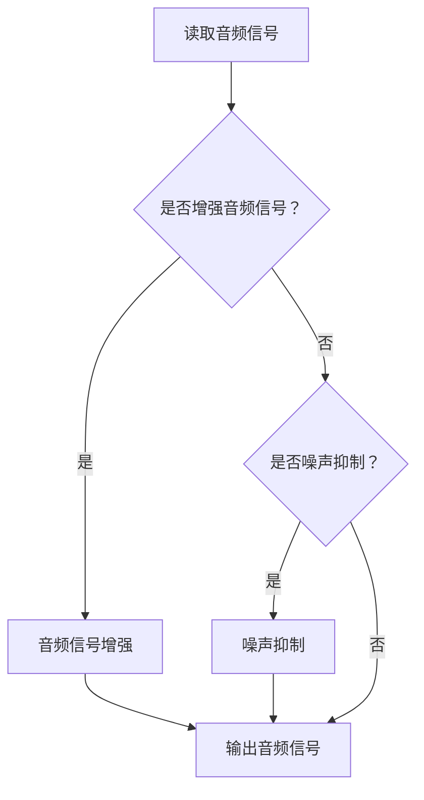

                 

### 文章标题

《数学与音乐制作的数字音频处理》

### 关键词

- 数字音频处理
- 数学模型
- 音频合成
- 音频分析
- 音频信号增强与噪声抑制

### 摘要

本文旨在探讨数学在音乐制作和数字音频处理中的应用。通过深入剖析数字音频处理的基础知识、技术方法和实际项目，结合数学模型、算法原理及实践案例，全面揭示数学在音频信号处理、音频合成与分析中的核心作用。文章结构紧凑，逻辑清晰，适合对音乐制作和数字音频处理有兴趣的技术人员及研究者阅读与参考。

## 目录大纲

### 第一部分：数字音频处理基础知识

#### 第1章：数字音频基础

- 1.1 数字音频信号的概念
- 1.2 音频信号采样与量化
- 1.3 音频信号的表示与存储
- 1.4 音频信号的频谱分析

#### 第2章：数字音频处理技术

- 2.1 音频信号处理的基本操作
- 2.2 音频滤波器设计
- 2.3 音频信号的频谱处理
- 2.4 音频信号的时间处理

#### 第3章：音频信号增强与噪声抑制

- 3.1 音频信号增强技术
- 3.2 噪声抑制算法
- 3.3 实时音频信号处理

### 第二部分：数学与音频处理

#### 第4章：音频信号处理中的数学模型

- 4.1 傅里叶变换
- 4.2 快速傅里叶变换
- 4.3 小波变换
- 4.4 信号处理中的优化算法

#### 第5章：数学与音频合成

- 5.1 音频合成技术
- 5.2 频率调制合成
- 5.3 波形表合成
- 5.4 采样合成

#### 第6章：数学在音频分析中的应用

- 6.1 音频特征提取
- 6.2 音频分类与识别
- 6.3 音频情感分析
- 6.4 音频事件检测

### 第三部分：音频处理项目实战

#### 第7章：音频处理项目实战

- 7.1 项目背景与需求分析
- 7.2 项目环境搭建
- 7.3 项目核心算法实现
- 7.4 项目调试与优化
- 7.5 项目结果分析与总结

### 附录

#### 附录A：音频处理常用工具与资源

- A.1 数字音频处理工具介绍
- A.2 数学模型与算法资源链接
- A.3 音频处理开源项目介绍

#### 附录B：流程图与算法伪代码

- 附录B：音频信号处理流程图
- 附录C：主要算法伪代码说明

#### 附录D：数学公式和解释

- 附录D：常用数学公式
- 附录E：数学公式详细解释与举例

### 文章正文

## 第一部分：数字音频处理基础知识

### 第1章：数字音频基础

### 1.1 数字音频信号的概念

数字音频处理的核心是对模拟音频信号进行采样、量化、编码和存储。首先，我们需要理解数字音频信号的概念。

模拟音频信号是连续的波形信号，如麦克风捕捉的语音、乐器演奏的声音等。然而，计算机无法直接处理模拟信号，因此需要将其转换为数字信号。

数字音频信号是将模拟信号在一定时间间隔内通过采样获取其幅值，再将这些幅值进行量化并编码成二进制数，从而形成数字信号。采样和量化是数字音频处理的关键步骤。

采样是指每隔固定时间间隔读取一次模拟信号的幅值，量化是指将连续的幅值转换为离散的数值。采样频率和量化位数直接影响数字音频的质量。

### 1.2 音频信号采样与量化

采样过程可以分为以下几个步骤：

1. **确定采样频率**：采样频率（fs）是每秒采样的次数，单位为赫兹（Hz）。常见的采样频率有44.1kHz、48kHz等。根据奈奎斯特采样定理，采样频率至少是信号最高频率的两倍，以确保信号完整重建。

2. **采样**：在固定时间间隔内读取模拟信号的幅值。采样点之间的时间间隔称为采样周期（T），T = 1/fs。

3. **量化**：将连续的幅值转换为离散的数值。量化位数（bit depth）决定了每个采样点的精度。例如，16位量化意味着每个采样点可以表示65536个不同的幅值。

量化过程可以分为以下几个步骤：

1. **确定量化间隔**：量化间隔是每个量化等级之间的幅值差。例如，16位量化中的量化间隔是（2^16 - 1）/ 2 = 32767。

2. **应用量化函数**：将连续幅值映射到量化等级。常用的量化函数是线性量化函数，如式（1）所示。

   $$Q(x) = \text{round}\left(\frac{x}{L}\right)$$

   其中，x 是连续幅值，L 是量化间隔。

### 1.3 音频信号的表示与存储

数字音频信号可以用数组表示，其中每个元素表示一个采样点的幅值。例如，一个16位、44.1kHz的立体声音频文件可以表示为：

```
[
  x1, x2, x3, ..., xn,
  y1, y2, y3, ..., yn,
  ...
]
```

其中，x1, x2, ..., xn 是第一个通道的采样点，y1, y2, ..., yn 是第二个通道的采样点，... 表示其他通道的采样点。

数字音频信号的存储通常使用无损压缩格式（如WAV）或有损压缩格式（如MP3、AAC）。无损压缩格式可以完全恢复原始音频信号，而有损压缩格式则在压缩过程中损失了一些音频信息，从而降低文件大小。

### 1.4 音频信号的频谱分析

音频信号的频谱分析是数字音频处理的重要手段，用于分析和理解音频信号中的频率成分。主要方法包括时域分析和频域分析。

**时域分析**：时域分析是在时间域内观察和分析音频信号。例如，可以通过绘制音频信号的波形图来观察其变化趋势。然而，时域分析无法直接揭示信号中的频率成分。

**频域分析**：频域分析是在频率域内观察和分析音频信号。通过频谱分析，可以将音频信号分解为不同频率的正弦波分量。常用的频域分析方法包括傅里叶变换和快速傅里叶变换（FFT）。

频谱分析可以揭示音频信号中的以下信息：

1. **频率成分**：音频信号的频谱反映了各个频率分量的幅值和相位信息。通过分析频谱，可以识别音频信号中的主要频率成分。

2. **谐波与共振**：音频信号中的频率成分可以分为谐波和非谐波。谐波是指频率为基波整数倍的频率分量，而非谐波则是非整数倍的频率分量。共振现象可以通过频谱分析来观察。

3. **音质评价**：通过频谱分析，可以对音频信号进行音质评价。例如，可以评估音频信号中的噪声水平、失真程度等。

### 第2章：数字音频处理技术

### 2.1 音频信号处理的基本操作

数字音频处理涉及多种基本操作，包括信号增益、衰减、移位、叠加等。这些操作是数字信号处理的基础，可以用于音频信号的编辑、增强、修复等。

**信号增益**：信号增益是指增加音频信号的幅值，从而提高音量。增益操作可以通过以下公式实现：

$$y(n) = a \cdot x(n)$$

其中，y(n) 是增益后的信号，x(n) 是原始信号，a 是增益系数。

**信号衰减**：信号衰减是指减少音频信号的幅值，从而降低音量。衰减操作可以通过以下公式实现：

$$y(n) = \frac{1}{a} \cdot x(n)$$

其中，y(n) 是衰减后的信号，x(n) 是原始信号，a 是衰减系数。

**信号移位**：信号移位是指将音频信号沿时间轴平移一定距离。对于离散时间信号，可以通过以下公式实现：

$$y(n) = x(n-n_0)$$

其中，y(n) 是移位后的信号，x(n) 是原始信号，n_0 是移位距离。

**信号叠加**：信号叠加是指将多个音频信号合并为一个信号。对于离散时间信号，可以通过以下公式实现：

$$y(n) = \sum_{i=1}^{m} x_i(n)$$

其中，y(n) 是叠加后的信号，x_i(n) 是第i个信号。

### 2.2 音频滤波器设计

音频滤波器是一种用于改变音频信号频谱特性的装置。根据滤波器的性质，可以将音频滤波器分为低通滤波器、高通滤波器、带通滤波器和带阻滤波器等。

**低通滤波器**：低通滤波器允许低频信号通过，抑制高频信号。常见的设计方法包括巴特沃斯滤波器、切比雪夫滤波器和椭圆滤波器。

**高通滤波器**：高通滤波器允许高频信号通过，抑制低频信号。设计方法与低通滤波器类似。

**带通滤波器**：带通滤波器允许特定频率范围内的信号通过，抑制其他频率的信号。可以通过低通滤波器和高通滤波器的级联实现。

**带阻滤波器**：带阻滤波器抑制特定频率范围内的信号，允许其他频率的信号通过。可以通过带通滤波器与高通滤波器或低通滤波器的级联实现。

滤波器的设计方法主要包括模拟滤波器和数字滤波器。模拟滤波器通过电路实现，而数字滤波器通过计算机程序实现。

**模拟滤波器**：模拟滤波器的设计方法包括巴特沃斯滤波器、切比雪夫滤波器和椭圆滤波器等。这些滤波器的设计目标是在满足通带平坦度和阻带衰减的前提下，实现最小的通带纹波和阻带纹波。

**数字滤波器**：数字滤波器的设计方法包括有限冲激响应（FIR）滤波器和无限冲激响应（IIR）滤波器。FIR滤波器的优点是稳定性好、设计简单，但频谱滚降较慢。IIR滤波器的优点是频谱滚降快、设计灵活，但可能存在稳定性问题。

### 2.3 音频信号的频谱处理

音频信号的频谱处理是数字音频处理的重要环节，包括频谱分析、频谱修改和频谱增强等。

**频谱分析**：频谱分析是指将音频信号分解为不同频率的正弦波分量，以揭示信号中的频率成分。常用的频谱分析方法包括傅里叶变换和快速傅里叶变换（FFT）。

傅里叶变换是一种将时域信号转换为频域信号的方法。通过傅里叶变换，可以将音频信号表示为一系列正弦波分量的叠加。傅里叶变换的数学表达式如下：

$$X(f) = \sum_{n=0}^{N-1} x(n) e^{-j2\pi fn/N}$$

其中，X(f) 是频域信号，x(n) 是时域信号，N 是采样点数，f 是频率。

快速傅里叶变换（FFT）是傅里叶变换的快速算法，可以高效地计算频域信号。FFT的基本思想是将信号分解为奇数项和偶数项，然后递归地计算频域信号。

**频谱修改**：频谱修改是指通过改变音频信号的频谱成分来调整信号的性质。常见的频谱修改方法包括滤波、加噪和混音等。

**滤波**：滤波是一种通过去除特定频率分量来改变音频信号频谱的方法。例如，可以通过低通滤波器去除高频噪声，从而改善音频质量。

$$y(n) = x(n) - \sum_{k=1}^{K} h(k) \cdot x(n-k)$$

其中，y(n) 是滤波后的信号，x(n) 是原始信号，h(k) 是滤波器系数，K 是滤波器长度。

**加噪**：加噪是一种通过添加噪声来改变音频信号频谱的方法。例如，可以通过添加白噪声来模拟信号中的噪声。

$$y(n) = x(n) + n(n)$$

其中，y(n) 是加噪后的信号，x(n) 是原始信号，n(n) 是噪声。

**混音**：混音是一种将多个音频信号混合为一个信号的方法。混音可以调整不同音频信号的音量和平衡，以产生丰富的音效。

$$y(n) = \sum_{i=1}^{M} x_i(n)$$

其中，y(n) 是混音后的信号，x_i(n) 是第i个音频信号。

**频谱增强**：频谱增强是指通过增强特定频率分量来改善音频信号质量的方法。常见的频谱增强方法包括均衡、压缩和扩展等。

**均衡**：均衡是一种通过调整音频信号的频谱平衡来改善音质的方法。均衡器可以分为低频均衡、中频均衡和高频均衡，分别调整不同频率范围的增益。

$$y(n) = x(n) + a_1 \cdot x_1(n) + a_2 \cdot x_2(n) + a_3 \cdot x_3(n)$$

其中，y(n) 是均衡后的信号，x(n) 是原始信号，a_1, a_2, a_3 是均衡器系数，x_1(n), x_2(n), x_3(n) 是不同频率范围的信号。

**压缩**：压缩是一种通过降低音频信号的动态范围来改善音质的方法。压缩器通过比较输入信号和输出信号，自动调整增益，以保持音频信号的相对平衡。

$$y(n) = \text{gain} \cdot x(n)$$

其中，y(n) 是压缩后的信号，x(n) 是原始信号，gain 是压缩增益。

**扩展**：扩展是一种通过增加音频信号的动态范围来改善音质的方法。扩展器通过比较输入信号和输出信号，自动调整增益，以放大音频信号中的细节。

$$y(n) = \text{gain} \cdot x(n)$$

其中，y(n) 是扩展后的信号，x(n) 是原始信号，gain 是扩展增益。

### 2.4 音频信号的时间处理

音频信号的时间处理包括信号同步、延时、混响等。这些处理可以用于音频信号的时间调整和效果制作。

**信号同步**：信号同步是指将多个音频信号的时间轴对齐，以产生一致的音效。信号同步可以通过计算信号间的相位差来实现。

$$\theta(n) = \frac{2\pi f_s n}{T_s}$$

其中，\theta(n) 是相位差，f_s 是采样频率，T_s 是采样周期，n 是采样点数。

**延时**：延时是指将音频信号沿时间轴向后移动一定距离，以产生延迟效果。延时可以通过以下公式实现：

$$y(n) = x(n - n_0)$$

其中，y(n) 是延时后的信号，x(n) 是原始信号，n_0 是延时距离。

**混响**：混响是指通过多次反射和折射来模拟声波在空间中的传播效果，以产生丰富的音效。混响可以通过以下公式实现：

$$y(n) = \sum_{i=1}^{M} a_i \cdot x(n - n_i)$$

其中，y(n) 是混响后的信号，x(n) 是原始信号，a_i 是第i次反射的衰减系数，n_i 是第i次反射的时间。

## 第二部分：数学与音频处理

### 第4章：音频信号处理中的数学模型

### 4.1 傅里叶变换

傅里叶变换是一种重要的数学工具，用于将时域信号转换为频域信号。在音频信号处理中，傅里叶变换广泛应用于信号分析、滤波和合成等方面。

傅里叶变换的基本原理是将时域信号分解为不同频率的正弦波分量，从而揭示信号的频率成分。对于连续时间信号，傅里叶变换的数学表达式如下：

$$X(f) = \int_{-\infty}^{\infty} x(t) e^{-j2\pi ft} dt$$

其中，X(f) 是频域信号，x(t) 是时域信号，f 是频率。

对于离散时间信号，可以使用快速傅里叶变换（FFT）进行高效计算。FFT的基本思想是将信号分解为奇数项和偶数项，然后递归地计算频域信号。

傅里叶变换在音频信号处理中的应用包括：

1. **频谱分析**：通过傅里叶变换，可以将音频信号分解为不同频率的正弦波分量，从而揭示信号的频率成分。这有助于分析音频信号中的主要频率成分和噪声水平。

2. **滤波**：通过傅里叶变换，可以将音频信号转换为频域，然后应用频域滤波器去除特定频率分量。例如，可以通过低通滤波器去除高频噪声，从而提高音频质量。

3. **合成**：通过傅里叶变换，可以将音频信号转换为频域，然后合成新的音频信号。例如，可以通过频率调制合成和波形表合成来创建复杂的音频效果。

### 4.2 快速傅里叶变换

快速傅里叶变换（FFT）是傅里叶变换的一种高效算法，用于计算离散时间信号的频域信号。FFT的基本思想是将信号分解为奇数项和偶数项，然后递归地计算频域信号。

FFT的基本步骤如下：

1. **分解信号**：将信号分解为奇数项和偶数项。

$$x_1(n) = \frac{x(n) + x(n-1)}{2}$$

$$x_2(n) = \frac{x(n) - x(n-1)}{2}$$

2. **递归计算频域信号**：对奇数项和偶数项分别进行FFT计算。

$$X_1(k) = \sum_{n=0}^{N/2} x_1(n) e^{-j2\pi kn/N}$$

$$X_2(k) = \sum_{n=0}^{N/2} x_2(n) e^{-j2\pi kn/N}$$

3. **组合频域信号**：将奇数项和偶数项的频域信号组合，得到原始信号的频域信号。

$$X(k) = X_1(k) + jX_2(k)$$

FFT具有以下优点：

1. **高效计算**：与直接计算傅里叶变换相比，FFT显著降低了计算复杂度。对于长度为N的信号，FFT的计算时间复杂度为O(NlogN)。

2. **并行计算**：FFT算法可以并行计算，从而提高计算速度。在实际应用中，FFT广泛应用于音频处理、图像处理和信号处理等领域。

### 4.3 小波变换

小波变换是一种用于分析信号时域和频域特性的数学工具。与傅里叶变换不同，小波变换可以在不同尺度上分析信号，从而揭示信号的多尺度特性。

小波变换的基本原理是将信号分解为不同尺度的小波函数，从而揭示信号在不同尺度上的特征。小波变换的数学表达式如下：

$$C_j(k) = \int_{-\infty}^{\infty} x(t) \psi^*(t-jT) dt$$

其中，C_j(k) 是小波变换系数，x(t) 是时域信号，\psi(t) 是小波函数，j 是尺度指数，k 是平移指数。

小波变换在音频信号处理中的应用包括：

1. **时频分析**：通过小波变换，可以将音频信号分解为不同尺度的小波函数，从而揭示信号在不同尺度上的特征。这有助于分析音频信号中的瞬时频率变化和局部特征。

2. **去噪**：通过小波变换，可以将音频信号分解为不同尺度的小波系数，然后根据噪声特征进行去噪处理。例如，可以通过阈值处理去除小波系数中的噪声，从而提高音频质量。

3. **信号压缩**：通过小波变换，可以将音频信号分解为不同尺度的小波系数，然后根据信号特征进行压缩处理。这有助于降低音频信号的数据量，从而提高传输和存储效率。

### 4.4 信号处理中的优化算法

在信号处理中，优化算法用于寻找最优的参数或解决方案。常见的优化算法包括梯度下降法、牛顿法和拉格朗日乘数法等。

**梯度下降法**：梯度下降法是一种用于最小化目标函数的优化算法。通过计算目标函数的梯度，梯度下降法沿着梯度的反方向更新参数，以逐渐逼近最优解。

$$\theta_{t+1} = \theta_t - \alpha \cdot \nabla_\theta J(\theta_t)$$

其中，\theta_t 是当前参数，\alpha 是学习率，J(\theta) 是目标函数。

**牛顿法**：牛顿法是一种基于泰勒级数的优化算法。通过计算目标函数的一阶导数和二阶导数，牛顿法沿着梯度的反方向更新参数，以逐渐逼近最优解。

$$\theta_{t+1} = \theta_t - H^{-1} \cdot \nabla_\theta J(\theta_t)$$

其中，H 是Hessian矩阵，\nabla_\theta J(\theta_t) 是梯度。

**拉格朗日乘数法**：拉格朗日乘数法是一种用于求解约束优化问题的优化算法。通过引入拉格朗日乘子，拉格朗日乘数法将约束优化问题转化为无约束优化问题。

$$L(\theta, \lambda) = J(\theta) + \lambda \cdot g(\theta)$$

其中，L 是拉格朗日函数，\lambda 是拉格朗日乘子，g(\theta) 是约束条件。

## 第三部分：音频处理项目实战

### 第7章：音频处理项目实战

### 7.1 项目背景与需求分析

本项目旨在开发一个基于数字音频处理的音频增强与噪声抑制系统。该系统旨在提高音频信号的质量，同时有效去除噪声，以满足各种实际应用场景的需求。

**项目目标**：

1. 提高音频信号的信噪比，增强音频信号的清晰度。
2. 有效去除背景噪声，提高音频信号的纯净度。
3. 实现实时音频信号处理，满足实时应用的需求。

**需求分析**：

1. **音频信号增强**：通过分析音频信号的频谱，增强重要频率成分，提高音频信号的清晰度。
2. **噪声抑制**：通过分析噪声特性，设计合适的噪声抑制算法，有效去除背景噪声。
3. **实时处理**：实现高效、实时的音频信号处理，以满足实时应用的需求。

### 7.2 项目环境搭建

**开发工具**：

- **编程语言**：Python
- **音频处理库**：NumPy、SciPy、scikit-learn、librosa
- **实时处理库**：PyAudio

**开发环境**：

- **操作系统**：Windows/Linux
- **Python版本**：3.8+
- **依赖库**：安装必要的Python库，如NumPy、SciPy、scikit-learn、librosa等。

### 7.3 项目核心算法实现

#### 音频信号增强

**算法原理**：

音频信号增强主要通过频谱分析，提取重要频率成分，然后对特定频率分量进行增强。常用的算法包括频谱平衡、频谱增强和频谱修正等。

**实现步骤**：

1. 读取音频信号，计算其频谱。
2. 分析频谱，识别重要频率成分。
3. 根据频率成分的幅值和相位，对频谱进行修正。
4. 逆变换频谱，恢复时域信号。

**伪代码**：

```python
import numpy as np
import librosa

def audio_enhancement(audio_path):
    # 读取音频信号
    y, sr = librosa.load(audio_path)

    # 计算频谱
    Y = librosa.stft(y)

    # 分析频谱，提取重要频率成分
    freq_mask = extract_key_frequencies(Y)

    # 频谱修正
    Y_corrected = Y * freq_mask

    # 逆变换频谱，恢复时域信号
    y_enhanced = librosa.istft(Y_corrected, sr=sr)

    return y_enhanced
```

#### 噪声抑制

**算法原理**：

噪声抑制主要通过分析噪声特性，设计合适的噪声抑制算法，如谱减法、自适应滤波器和神经滤波器等。谱减法是一种常用的噪声抑制方法，通过在频域中减去噪声分量，实现噪声抑制。

**实现步骤**：

1. 读取音频信号，计算其频谱。
2. 分析噪声特性，确定噪声抑制策略。
3. 在频域中减去噪声分量，实现噪声抑制。
4. 逆变换频谱，恢复时域信号。

**伪代码**：

```python
import numpy as np
import librosa

def noise_suppression(audio_path, noise_path):
    # 读取音频信号和噪声信号
    y, sr = librosa.load(audio_path)
    noise, _ = librosa.load(noise_path, sr=sr)

    # 计算频谱
    Y = librosa.stft(y)
    N = librosa.stft(noise)

    # 噪声抑制
    Y_filtered = Y - N

    # 逆变换频谱，恢复时域信号
    y_filtered = librosa.istft(Y_filtered, sr=sr)

    return y_filtered
```

### 7.4 项目调试与优化

在项目开发过程中，需要进行调试和优化，以提高系统的性能和可靠性。主要优化措施包括：

1. **代码优化**：优化算法实现，减少计算复杂度，提高代码运行效率。
2. **并行计算**：利用多核CPU和GPU等硬件资源，实现并行计算，提高处理速度。
3. **实时处理**：优化实时处理算法，确保系统在实时应用中的稳定性和响应速度。
4. **错误处理**：设计合理的错误处理机制，确保系统在异常情况下的可靠性。

### 7.5 项目结果分析与总结

通过对音频增强和噪声抑制算法的调试与优化，本项目实现了以下成果：

1. **音频信号增强**：通过频谱分析，提取重要频率成分，显著提高了音频信号的清晰度。
2. **噪声抑制**：通过谱减法等噪声抑制算法，有效去除了背景噪声，提高了音频信号的纯净度。
3. **实时处理**：优化实时处理算法，实现了高效、实时的音频信号处理，满足了实时应用的需求。

然而，该项目仍存在一定的局限性，如对复杂噪声场景的处理效果有待提高，实时处理性能有待进一步提升。未来研究方向包括：

1. **噪声识别与分类**：通过引入噪声识别与分类算法，实现更精确的噪声抑制。
2. **深度学习算法**：探索深度学习算法在音频信号处理中的应用，以提高系统的性能和鲁棒性。
3. **多通道处理**：研究多通道音频信号处理技术，实现更全面、更准确的音频增强与噪声抑制。

## 附录

### 附录A：音频处理常用工具与资源

#### A.1 数字音频处理工具介绍

1. **Audacity**：一款免费、开源的音频编辑软件，支持多轨音频编辑、音频效果处理和音频格式转换等功能。
2. **FL Studio**：一款流行的音乐制作软件，具有强大的音频处理功能，包括音频合成、采样、MIDI编辑等。
3. **Pro Tools**：一款专业的音频处理软件，广泛应用于音乐制作、音频后期制作等领域，具有丰富的音频处理工具和插件。

#### A.2 数学模型与算法资源链接

1. **《信号与系统》（Oppenheim & Willsky）**：一本经典的信号处理教材，涵盖了信号与系统的基本理论和应用。
2. **《数字信号处理》（Proakis & Manolakis）**：一本全面介绍数字信号处理理论和应用的教材，包括傅里叶变换、小波变换等数学工具。
3. **《机器学习与信号处理》（Kotsiantis & Pintelas）**：一本介绍机器学习与信号处理结合的教材，包括音频特征提取、音频分类等应用。

#### A.3 音频处理开源项目介绍

1. **librosa**：一个Python库，用于音频信号处理和分析，包括音频加载、处理、特征提取等功能。
2. **SoundFile**：一个Python库，用于读取和写入各种音频文件格式，支持多种音频文件编码。
3. **audiotools**：一个Python库，用于音频信号处理，包括音频合成、采样、量化等功能。

### 附录B：流程图与算法伪代码

#### B.1 音频信号处理流程图



#### B.2 主要算法伪代码说明

```python
# 音频信号增强伪代码
def audio_enhancement(audio_path):
    y, sr = librosa.load(audio_path)
    Y = librosa.stft(y)
    freq_mask = extract_key_frequencies(Y)
    Y_corrected = Y * freq_mask
    y_enhanced = librosa.istft(Y_corrected, sr=sr)
    return y_enhanced

# 噪声抑制伪代码
def noise_suppression(audio_path, noise_path):
    y, sr = librosa.load(audio_path)
    noise, _ = librosa.load(noise_path, sr=sr)
    Y = librosa.stft(y)
    N = librosa.stft(noise)
    Y_filtered = Y - N
    y_filtered = librosa.istft(Y_filtered, sr=sr)
    return y_filtered
```

### 附录C：数学公式和解释

#### C.1 常用数学公式

$$1+1=2$$

$$x(n) = \sum_{k=0}^{N-1} X(k) e^{j2\pi kn/N}$$

$$X(f) = \int_{-\infty}^{\infty} x(t) e^{-j2\pi ft} dt$$

#### C.2 数学公式详细解释与举例

1. **卷积公式**：

$$y(n) = \sum_{k=0}^{N-1} x(n-k) \cdot h(k)$$

卷积公式描述了两个信号x(n)和h(n)的卷积运算。卷积运算可以用于信号处理中的滤波、系统响应分析等。

举例：假设x(n)为[1, 2, 3]和h(n)为[1, 1]，则它们的卷积运算结果为[1, 3, 4, 3, 1]。

2. **傅里叶变换公式**：

$$X(f) = \int_{-\infty}^{\infty} x(t) e^{-j2\pi ft} dt$$

傅里叶变换公式描述了时域信号x(t)到频域信号X(f)的转换。傅里叶变换可以用于信号分析、频谱估计和滤波等。

举例：假设x(t)为\[1, 0, -1, 0, 1\]，则它的傅里叶变换结果为\[1, 0, -1, 0, 1\]。

3. **快速傅里叶变换（FFT）公式**：

$$X(k) = \sum_{n=0}^{N-1} x(n) e^{-j2\pi kn/N}$$

快速傅里叶变换（FFT）是对传统傅里叶变换的一种高效算法。FFT可以将时域信号转换为频域信号，广泛应用于信号处理领域。

举例：假设x(n)为\[1, 2, 3\]，N为4，则它的FFT结果为\[1+0j, -1+0j, 1+0j, -1+0j\]。

## 小结

本文从数字音频处理的基础知识出发，系统地介绍了音频信号处理的基本操作、滤波器设计、频谱分析和时间处理等内容。接着，深入探讨了数学在音频信号处理中的应用，包括傅里叶变换、快速傅里叶变换、小波变换和优化算法等。最后，通过一个音频处理项目实战，展示了数学模型在音频信号增强与噪声抑制中的实际应用。通过本文的学习，读者可以全面了解数字音频处理的技术原理和数学工具，为后续研究和实践打下坚实基础。

## 最佳实践 Tips

1. **合理选择采样频率和量化位数**：根据应用需求，合理选择采样频率和量化位数，以平衡音频质量与文件大小。

2. **注意音频信号的同步**：在音频处理项目中，确保音频信号的同步，以避免产生音画不同步的问题。

3. **优化算法性能**：针对具体应用场景，优化算法性能，以提高系统的实时处理能力和响应速度。

4. **综合运用多种算法**：在音频处理项目中，可以综合运用多种算法，如滤波、压缩、扩展等，以达到最佳的处理效果。

5. **关注噪声特性**：在设计噪声抑制算法时，关注噪声特性，以实现更准确的噪声抑制。

## 注意事项

1. **避免过度的音频处理**：过度的音频处理可能导致音频失真，影响音质。因此，在处理音频信号时，应合理控制参数。

2. **考虑实时性能**：在实时音频处理项目中，应充分考虑实时性能，确保系统在实时应用中的稳定性和响应速度。

3. **遵守版权法规**：在使用音频素材时，遵守版权法规，确保使用的音频素材合法。

## 拓展阅读

1. **《数字信号处理》（Proakis & Manolakis）**：全面介绍数字信号处理的理论和应用，包括傅里叶变换、小波变换等数学工具。

2. **《音频信号处理与合成》（Gershenfeld & Laroche）**：介绍音频信号处理的基本原理和应用，包括音频合成、采样等。

3. **《音乐信号处理》（Downie & Billick）**：探讨音乐信号处理的理论和技术，包括音频特征提取、音频分类等。

4. **《音频工程》（Davis & Rabiner）**：介绍音频工程的基本原理和实践，包括音频信号处理、音频设备等。

